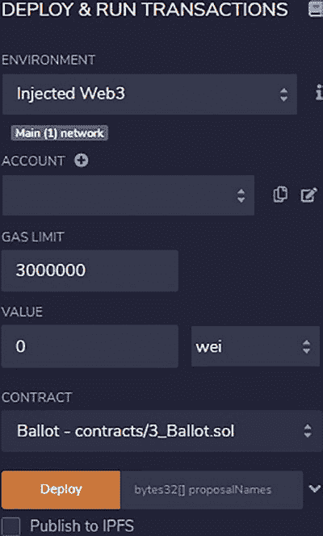

# 第 6 章 以太坊架构与概览

在 `Remix` Web 控制台中，您可轻松尝试以下任务：

## 任务 1：设置并安装插件

`Remix IDE`（集成开发环境）使用组件模型向系统添加基础功能及第三方插件。默认情况下，图标面板会激活并显示三个基础组件：文件浏览器、Solidity 编译以及部署与运行交易。这三个组件足以满足快速开发智能合约的需求。对于调试、安全扫描和可视化等其他操作，开发者可点击插件管理器图标，然后选择要激活的插件。

开发者可根据需要激活或停用插件。图标面板还包含一个设置按钮，点击后可打开设置页面，配置图形用户界面主题、源代码编辑器、GitHub 访问权限等。一旦插件被激活，开发者即可点击各个插件进行使用。

在 `icon` 中，侧面板会显示相应插件的界面和 GUI 详情。

## 任务 2：浏览、编辑并编译智能合约

`Remix` 在 Web 服务器中打包了一些示例智能合约。  
点击 `File Explorer` 图标，打开智能合约浏览面板。智能合约的源文件可以创建为新文件，也可以从 `Gist`、`GitHub`、`Swarm`、`IPFS` 或 `HTTPS URL` 等仓库导入。需要注意的是，如果源文件是从外部仓库导入的，修改后的文件不会写回原仓库，需要手动操作。例如，工作区可以作为 `gist` 发布到 `GitHub` 仓库中。对于 `IPFS`、`HTTPS` 和 `Swarm` 等其他仓库，则需要手动在 Remix 之外进行上传。

要编译智能合约，首先浏览源文件，然后点击想要编辑的文件。文件内容会显示在主面板上。开发者可以使用内置编辑器直接修改源代码。文件编辑完成后，点击 `Solidity Compiler` 按钮，这会在侧面板中启动一个编译器 GUI。在选择好 Solidity 编译器版本和 EVM 后，开发者可以点击 `Compile` 按钮开始编译。任何编译错误都会显示在编译器面板上，并提示开发者修改源代码以修复错误。一旦智能合约编译成功，就会生成字节码和 `ABI` 文件。

需要注意的是，修改后的源代码仅存储在浏览器中，需要额外步骤才能保存到永久存储。可以通过将文件下载到本地存储，或者将文件发布到 `GitHub` 存储中的新 `gist` 来实现。由于 Remix 浏览器没有持久化存储，如果浏览器数据被清除，编辑过但未下载或未发布的文件将会丢失。为了将 Remix 浏览器与持久化存储同步，需要将 Remix 网页连接到本地存储。这可以通过在后台运行 `remixd` 来实现，它为 Remix 提供共享的持久化存储。

## 任务 3：部署智能合约并执行函数

智能合约编译成功后，开发者可以使用“`deploy and run transactions`”插件来部署智能合约并运行交易。点击 `Deploy and Run transactions` 图标后，部署 GUI 会提示开发者选择网络连接环境、部署账户、要部署的智能合约、Gas 费用等，如图 6-7 所示。

**图 6-7.** Remix 编译器组件

有三种部署环境：`JavaScript VM`、`injected Web3` 和 `Web3 provider`。`JavaScript VM` 是一种将 EVM 嵌入到 Remix 网页中的环境，是一个未实际连接区块链的模拟用例。这是部署和测试智能合约最简单的情况。`injected Web3` 环境使用 `MetaMask` 扩展，通过 `MetaMask` 配置将 Remix 与外部区块链连接。这种方式不使用 Remix，而是由 `MetaMask` 连接到区块链，并作为代理将智能合约部署到目标区块链。`Web3 provider` 环境将 Remix 与一个 RPC 端点连接，将智能合约部署到该 RPC 服务器，然后广播到网络的其他部分。

除了选择区块链网络环境，开发者还需要指定一个用于发送部署交易的账户。该账户需要有一些以太币来支付部署的 Gas 费用。该账户也将成为智能合约的所有者。还有其他一些杂项参数需要配置。`Gas limit` 指定了交易可以消耗的最大 Gas 量。`Value` 是……

`要发送到目标地址的代币`。对于智能合约部署，`Value`（价值）字段无关紧要，应设为零。所有参数正确设置后，点击 `Deploy`（部署）按钮即可发送部署交易。某些智能合约的构造函数可能需要输入参数。这种情况下，需在 `Deploy` 按钮旁的输入字段中指定这些参数。

智能合约成功部署后，会返回一个地址，即智能合约地址。开发者可通过点击部署界面底部显示的地址来浏览区块链。部署的智能合约随后将显示变量名及其值、函数以及其他内部存储信息。开发者随后可向某个函数输入参数并执行该函数。调用智能合约函数时，开发者实际上是在发送一笔交易；因此，需要一个账户来支付交易费用，并且也需要指定交易参数。执行结果将显示在同一面板中，部分输出则显示在终端面板中。

## 总结

本章涉及三个主题：以太坊区块链概览、生态系统与去中心化应用，以及智能合约开发的基本工具。下一章将介绍 Solidity 编程与部署技术，讲解如何使用智能合约构建去中心化应用。