# 7 使用 Solidity 编写智能合约

## 工具

### MythX：安全扫描工具

`MythX` 是一个安全扫描工具，以付费服务的形式通过 `mythx.io` 发布，也可作为命令行（`CLI`）包或其它工具的插件使用。

此处，我们说明如何将 `MythX` 作为 `Remix` 的插件使用。要使用 `Remix`，请遵循[第 6 章](https://doi.org/10.1007/978-1-4842-8164-2_6)的说明启动您的应用程序。

要启用 `MythX`，只需单击插件管理器图标打开管理器。在搜索框中输入"`mythx`"，即可看到 `MYTHX SECURITY VERIFICATION` 插件。单击 `Activate` 按钮激活此插件（图 7-6）。

图 7-6. 在 `Remix` 中激活 `MythX` 安全扫描工具

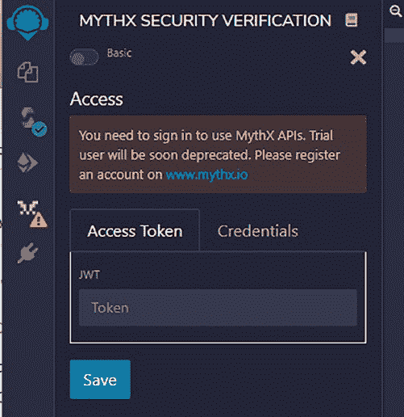

一旦 `MYTHX SECURITY VERIFICATION` 被激活，它需要与 `MythX` 云服务通信以执行扫描。开发者需要从 `mythx.io` 网站申请 `API` 密钥，并在插件设置中输入 `API` 令牌信息（图 7-7）。

图 7-7. 使用 `MythX` API 需要登录

`MythX` 安全扫描还提供了 `Truffle` 工具的插件以及 `Visual Studio Code` IDE 工具的扩展。需要注意的一点是，`MythX` 安全验证是一项付费服务。开发者需要为安全扫描服务支付订阅费。

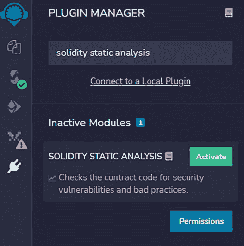

### Solidity 静态分析：Remix 的安全插件

与需要支付订阅费进行安全扫描的 `MythX` 不同，`Remix` 的 `Solidity Static Analysis`（`SSA`）插件是免费的，并且提供了静态代码扫描的基本功能。要启用 `SSA`，只需打开插件管理器并输入 `Solidity Static Analysis`，然后单击 `Activate` 按钮激活它（图 7-8）。

图 7-8. 在 `Remix` 中使用 `Solidity Static Analysis` 进行安全扫描

插件激活后，单击插件面板上的图标，它将开始分析 `Remix` 屏幕上的活动 `Solidity` 程序。`SSA` 不仅扫描源代码中的安全漏洞，还会检查 `gas` 消耗、`ERC`（`Ethereum Request for Comment`）以及一些杂项分析（图 7-9）。开发者可以过滤要分析并显示的分类。

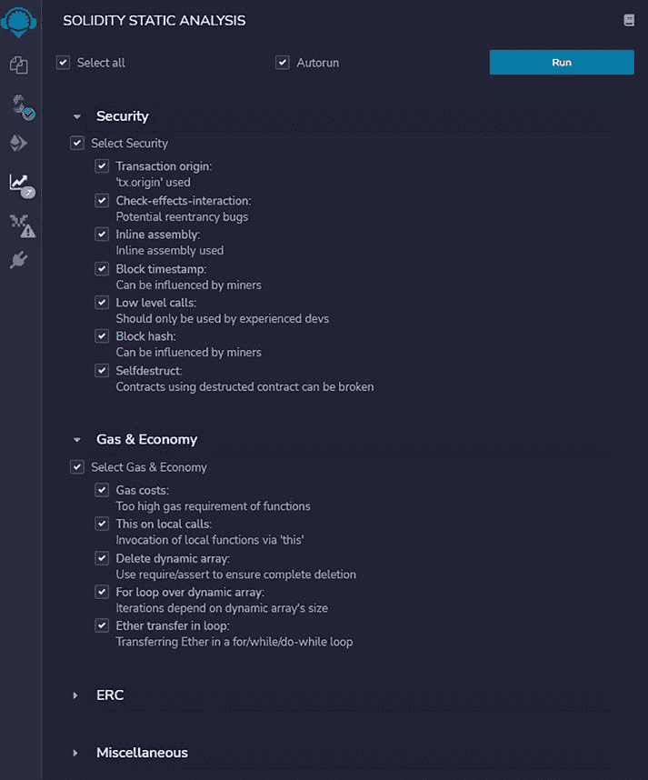

图 7-9. 运行 `Solidity Static Analysis` 扫描

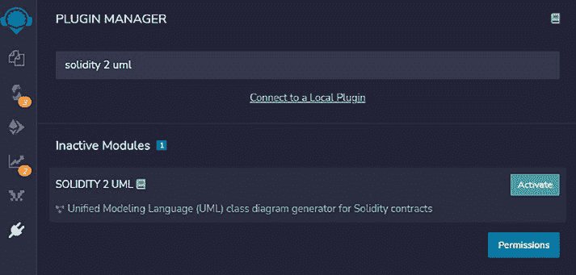

尽管静态分析工具对于捕获一些明显的漏洞非常有帮助，但它们不应取代更复杂的安全审计和渗透测试，尤其是对于处理资产转移的智能合约。

### Solidity 转 UML：智能合约可视化工具

`Solidity` 是一种易于理解的面向对象编程语言。有时，当一个 `dApp` 项目中有许多函数和智能合约时，理解智能合约的工作流程会变得很有挑战性。在这种情况下，将 `Solidity` 代码转换为`统一建模语言`（`UML`）以可视化智能合约和函数之间的关系会是一个好方法。

#### 用于 Remix 的 Solidity 转 UML 工具

有几种工具可以将 `Solidity` 转换为 `UML`。`Remix` 也为这个目的提供了一个插件。只需激活 `Solidity UML` 并启动该插件，即可将 `Solidity` 代码转换为 `UML` 图（图 7-10）。

图 7-10. `Solidity` 转 `UML` 的插件

一旦 `Solidity 2 UML` 插件被激活，它就可以用来解析 `Solidity` 智能合约并生成 `UML` 图。

#### 独立的 Solidity 转 UML 工具

除了 `Remix` 插件之外，还有 `Node.js` 包或 `CLI` 包也可以用来生成 `UML` 图。

例如，`sol2uml` 包是一款多功能工具，可从智能合约源代码生成 UML；它还能获取已部署到以太坊区块链的智能合约的 UML 图。

要安装 `sol2uml`，只需使用 Node 包管理器 (`npm`) 输入以下命令：

```
npm install sol2uml --only=production
```

安装 `sol2uml` 后，可根据下方帮助菜单所示，使用各种参数运行它：

```
$ sol2uml -h
Usage: sol2uml <fileFolderAddress> [options]
从 Solidity 源代码生成 UML 图。
如果第一个参数未传入文件、文件夹或地址，
则使用当前工作文件夹。
当使用文件夹时，将查找该文件夹及其所有子文件夹中
所有 *.sol 文件。
如果传入带有 0x 前缀的以太坊地址，
则将使用来自 Etherscan 的已验证源代码。

Options:
  -v, --verbose                     运行并输出调试语句
  -f, --outputFormat <value>        输出文件格式：svg、png、
                                    dot 或 all（默认值："svg"）
  -o, --outputFileName <value>      输出文件名
  -d, --depthLimit <depth>          将被递归搜索的 Solidity
                                    文件的子文件夹数量。默认
                                    值 -1 表示无限制（默认值：-1）
  -n, --network <network>           mainnet、ropsten、kovan、
                                    rinkeby 或 goerli（默认值：
                                    "mainnet"）
  -k, --etherscanApiKey <key>       Etherscan API 密钥
  -c, --clusterFolders              将合约聚类到源文件夹
  -h, --help                        输出使用信息
```

要为本地目录中的智能合约生成 UML 图，请输入以下命令：

```
sol2uml ./contracts
```

这里，`./contracts` 是智能合约文件所在的目录。

`sol2uml` 还可以获取已部署到以太坊区块链的智能合约的 UML 文件。例如，要获取 Ropsten 区块链中特定地址的 UML 图，请运行以下命令：

```
sol2uml smartcontract_address -n ropsten
```

这里，`smartcontract_address` 是已部署到以太坊区块链的智能合约地址。`-n ropsten` 表示这是针对 Ropsten 区块链中的智能合约。

为了理解 UML 图，我们使用 USDT ERC20 代币的部分智能合约作为示例。通过在图 7-11 所示的浏览器 URL 中输入以下地址，可获取此 UML 图：

```
https://etherscan.io/viewsvg?t=1&a=0xdAC17F958D2ee523a2206206994597C13D831ec7
```

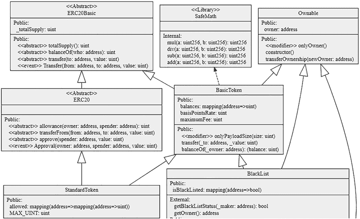

在此图中，每个方框代表一个智能合约类、一个接口或一个库。

每个方框有多个区域。顶部区域是智能合约名称。然后，变量和函数各自的范围被分组到相应区域，例如 `internal`、`public` 和 `external`。每个区域包含变量名、函数名和参数的列表。

方框之间绘制了带有箭头的线条，以表示实体关系。如果智能合约 A 使用智能合约 B，意味着 B 是 A 的父级，则从 B 到 A 绘制一条有向线。如果实体 A 是一个抽象智能合约或接口，则绘制虚线而不是实线。

在 Solidity 中，抽象类是一种特殊的智能合约，其中函数已定义但未实现。使用或继承抽象智能合约的合约需要实现那些已定义的函数。此外，接口是特殊的智能合约，其中只定义了函数名。接口中不声明变量。

除了接口，智能合约还可以定义和调用库函数。Solidity 中的库使用 `library` 关键字定义，并具有可被其他智能合约调用的函数。库是无状态的，不能拥有状态变量。

## Solidity 测试

### Solidity 单元测试：用于测试的 Remix 插件

参考：[`remix-ide.readthedocs.io/en/latest/unittesting.html`](https://remix-ide.readthedocs.io/en/latest/unittesting.html)

`Solidity`拥有一套优秀的工具来提供单元测试或自动化测试。当编写好智能合约源码后，开发者可以编写测试程序来封装智能合约，从而执行自动化测试。诸如`Remix`和`Truffle`等工具都具备测试套件，以帮助编写和执行测试程序。下文将介绍作为`Remix`插件的`Solidity Unit Test`。

要激活`Solidity Unit Testing`插件，只需点击插件管理面板，输入`Solidity Unit Testing`进行搜索，然后点击`Activate`按钮激活该插件，如图 7-12 所示：

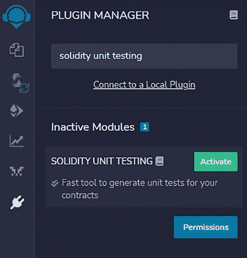

图 7-12. 用于 Solidity 单元测试的插件

需要注意的一点是，`Solidity Unit Test`插件中的测试文件不支持带参数的函数。对于带有参数的智能合约，应有一个包装测试文件，该文件会从另一个无参数的函数中调用带参数的函数。

要运行`Solidity Unit Testing`，首先点击插件图标打开单元测试面板。然后选择一个目录用于存放测试套件文件。在下面的截图中，选择`unit_test`目录存放测试文件。接着，开发者需要为源码智能合约生成一个测试文件（图 7-13）。

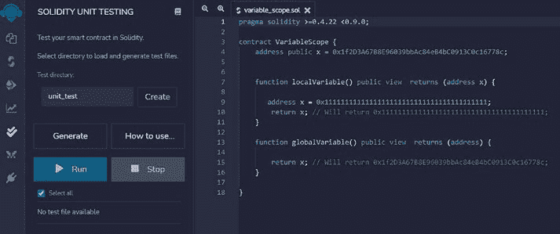

图 7-13. 生成 Solidity 单元测试文件

要为某个源文件生成测试文件，首先在文件视图面板中打开该源码智能合约并使其处于活动状态。然后选择测试文件将存放的目录。点击“Generate”按钮，即可在为视图面板中打开的文件所指定的目录下生成一个测试文件。

一旦生成测试套件文件，它会在文件视图面板中自动打开。该测试套件将包含用于测试源合约的基本代码模板。它包含测试库导入、目标源文件导入以及测试函数桩的代码段。开发者随后可以初始化目标智能合约，模拟对该智能合约的函数调用，并使用内置的逻辑检查函数来断言测试结果。

例如，以下代码展示了如何编写单元测试代码来测试全局变量和局部变量是否相同。源码非常简单。变量`x`在代码开头被声明为全局变量。然后，`x`又在`localVariable`函数中被声明为局部变量。

```
pragma solidity >=0.4.22 <0.9.0;

contract VariableScope {
    address public x = 0x1f2D3A67B8E96039bbAc84eB4bC0913C0c16778c;

    function localVariable() public view returns (address x) {
        address x = 0x1111111111111111111111111111111111111111;
        return x; // Will return 0x1111111111111111111111111111111111111111;
    }

    function globalVariable() public view returns (address) {
        return x; // Will return 0x1f2D3A67B8E96039bbAc84eB4bC0913C0c16778c;
    }
}
```

单元测试的目的是检查变量`x`在全局作用域和局部作用域中是否相同。为测试此功能，生成并修改了以下测试套件：

```
pragma solidity >=0.4.22 <0.9.0;

// This import is automatically injected by Remix
import "remix_tests.sol";

// This import is required to use custom transaction context
// Although it may fail compilation in 'Solidity Compiler' plugin
// But it will work fine in 'Solidity Unit Testing' plugin
import "remix_accounts.sol";

import "../variable_scope.sol";

// File name has to end with '_test.sol', this file can contain more than one testSuite contracts
contract testSuite {
    VariableScope vs;

    /// 'beforeAll' runs before all other tests
```

### Solidity 单元测试与调试

### 特殊测试函数

以下特殊函数可用：`beforeEach`、`beforeAll`、`afterEach` 和 `afterAll`。

```solidity
function beforeAll() public {
    // <实例化合约>
    vs = new VariableScope();
    // Assert.equal(uint(1), uint(1), "1 应等于 1");
}

function checkNotEqual() public {
    // 使用 'Assert' 方法：https://remix-ide.readthedocs.io/en/latest/assert_library.html
    address x1 = vs.x.address;
    address x2 = vs.localVariable();
    Assert.notEqual(x1, x2, "变量应不相等");
}
```

在测试套件代码中，导入了源文件，并实例化了 `VariableScope` 智能合约 `vs`。然后调用 `checkNotEqual()` 函数，在 `vs` 中生成本地变量和全局变量 `x`，并进行比较。

该测试套件在 Remix 中运行，结果显示其通过了单元测试（图 7-14），这意味着即使全局变量和局部变量名称相同，它们也确实不同。

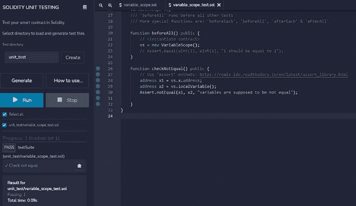

图 7-14. 单元测试运行示例

使用 Remix Solidity 单元测试插件，编写脚本测试智能合约变得非常容易。

需要注意的是，Solidity 单元测试插件中的测试文件不支持带参数的函数。对于带参数的智能合约，应有一个包装测试文件，该文件从另一个无参数函数中调用带参数的函数。

除了用于单元测试的 Remix 插件外，Truffle 也拥有良好的单元测试模块，支持手动和自动测试。其工作流程和功能与 Remix 插件类似。

### Solidity 调试

有时，Solidity 智能合约在执行过程中可能会遇到问题。能够逐步执行每段源代码并分析各种调试信息（如调用堆栈和局部变量值）会很有帮助。Solidity 确实有一些调试工具可以协助完成这项工作。在此，我们介绍 Remix 的 Debugger 插件。

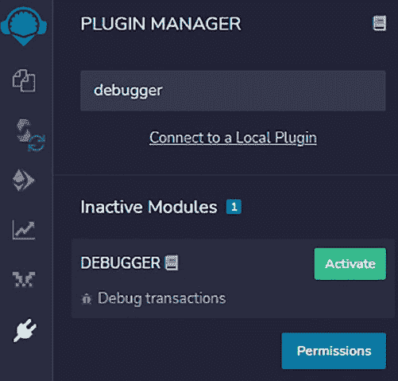

### 启用调试器

要启用 Remix 调试器，只需打开插件管理器，在搜索框中输入 `debugger`，然后启用此插件（图 7-15）。

图 7-15. 在 Remix 中启用调试器插件

### 启动调试器

启用调试器后，插件面板中会出现一个类似 Bug 的图标。要调试 Solidity 程序，开发者需要编译合约源代码，将智能合约部署到本地 EVM，然后创建一笔交易以获取交易哈希。之后，开发者可以将交易 ID 输入调试器配置面板，并开始调试过程（图 7-16）：

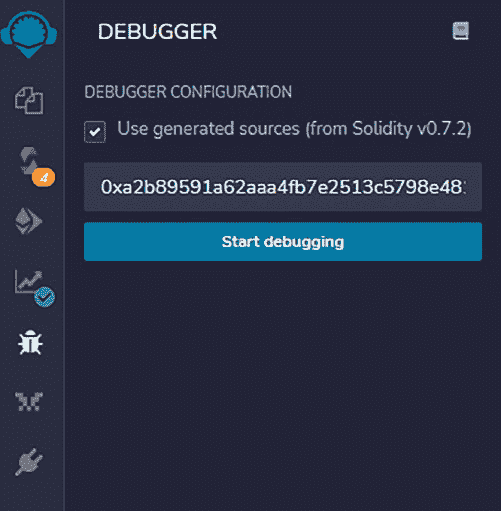

图 7-16. 启动 Solidity 调试器

# 调试智能合约

启动调试器后，会弹出如下所示的调试窗口，开发者可以单步执行代码，查看每一行代码的执行情况。调试器支持单步功能，如`step into`（步入）、`step over`（步过）和`step into breaking point`（步入断点）。

调试器显示所有 EVM 执行上下文、存储和调用堆栈信息，包括函数堆栈、Solidity 局部变量、Solidity 状态、步骤详情、堆栈、内存、存储、调用堆栈、调用数据、全局变量、返回值和完整的存储变更。某些信息可能不可用，但调试器通常会提供大量的字节码执行信息（图 7-17）。

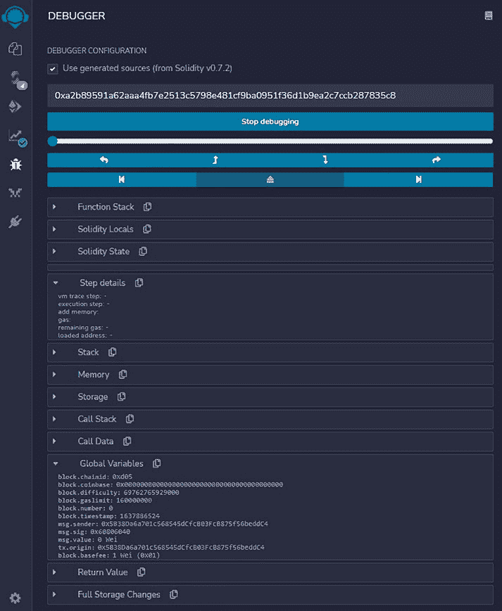

**图 7-17.** 单步执行调试程序

调试器一个不太明显的地方是如何添加断点。要添加断点，只需在编辑窗口中打开源代码，然后点击行号（而不是代码本身）。

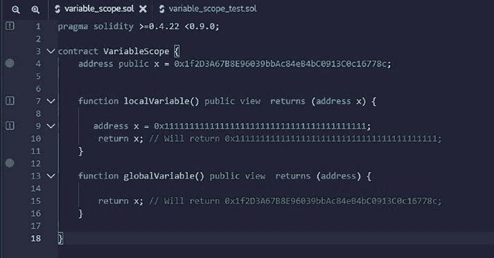

`source code itself`）。行号旁会显示一个蓝点，表示已在该行插入断点（图 7-18）。

***图 7-18.** 在源代码中添加断点*

尽管调试器是调试 Solidity 程序的绝佳工具，但我们发现，在调试更复杂的智能合约时，调试窗口中仍无法查看某些信息。将智能合约模块化，以简化单元测试和调试，是一个良好的实践。

## 模块 6：客户端注意事项

在[第 6 章](https://doi.org/10.1007/978-1-4842-8164-2_6)及[第 7 章](https://doi.org/10.1007/978-1-4842-8164-2_7)的前几个模块中，我们讨论了如何编写 Solidity 智能合约并将其部署到区块链上。一旦智能合约部署到区块链，它们便公开可访问，且一旦区块被最终确定，就永远不会被删除或修改。智能合约是字节码，对用户并不友好。为了与去中心化应用（dApp）交互，需要开发客户端以方便用户与智能合约进行交互。

dApp 的客户端可以是网页浏览器、移动应用、桌面应用或命令行界面（CLI）。在本模块中，我们将讨论这些客户端的优缺点，并给出构建 dApp 客户端的示例。

### dApp 客户端的类型

dApp 客户端可以采用图形用户界面（GUI）格式或命令行界面（CLI）格式。GUI 格式可以是基于网页的应用、移动应用或桌面应用，需要用户输入和操作，如下图所示。CLI 格式通常用于自动执行测试脚本或作为应用程序编程接口。在下图（图 7-19）中，我们描述了不同类型的客户端。

***图 7-19.** 去中心化应用的客户端类型*

### 浏览器客户端

浏览器客户端是去中心化应用最基本的用户体验。用户直接访问一个网站来使用 dApp。例如，要访问 CryptoKitty dApp，用户只需将他们的网页浏览器指向 [www.cryptokitty.com](http://www.cryptokitty.com)。如客户端拓扑图所示，浏览器需要通过 RPC 协议，借助网页扩展/插件连接到以太坊节点。最常见的网页扩展是 MetaMask。MetaMask 充当网页应用的加密货币钱包。

为了设计一个具有加密账户交互功能的网页应用，开发者需要开发能够连接到 MetaMask 或其他钱包的网页。当用户通过浏览器连接到某个网址时，浏览器脚本会检查 MetaMask 是否已安装，如果未找到则会提示用户安装。这通常称为“连接钱包”。通常，会编写 JavaScript 脚本，使用 Web3 库连接到以太坊节点。我们将在本模块后面的内容中给出详细的编码示例。

基于浏览器的 dApp 面临的挑战之一是钱包的安全性。由于浏览器容易受到黑客攻击，在某些浏览器中，MetaMask 的存储和私钥有可能被窃取。建议在存储大量加密资产时，使用硬件钱包。MetaMask 确实支持连接到硬件钱包以签署交易，从而确保钱包的安全。

### 移动客户端

也可以开发移动应用与以太坊区块链上的智能合约进行交互。由于移动应用通常占用的资源较小，它们依赖 API 或 RPC 与区块链节点通信。与网页钱包类似，移动钱包不具备硬件级别的安全性，不应用于存储大量加密资产。

### 桌面客户端

网页客户端和移动客户端都需要连接到外部节点才能与以太坊区块链交互。桌面客户端拥有足够的

### 存储与计算能力

存储与计算能力可能足以独立运行一个以太坊节点。这意味着桌面客户端可以自带其 RPC 服务器，而不依赖于第三方 RPC 节点。一个缺点是桌面应用需要安装，并且需要有桌面环境来运行应用程序。

### CLI 客户端

CLI 客户端是使用命令行界面运行与以太坊区块链交互的脚本。这通常在单元测试或项目的自动脚本化中完成。CLI 对于那些喜欢基于文本输入而不是基于 GUI 浏览的人来说非常方便。

每个客户端都有其自身的优缺点，我们看到 Web 客户端正变得越来越流行。在下面的内容中，我们提供了一个为已部署的智能合约设计网页的用例。

### 与智能合约交互的 Web 客户端示例

在本示例中，我们演示如何编写一个网页来与已部署的智能合约交互。为了使演示成为一个端到端的体验，我们执行以下操作将智能合约部署到开发环境。

#### 步骤 1：创建以太坊开发区块链

通过下载`geth`应用并运行以下命令来创建以太坊开发区块链：

```
./geth --datadir test-chain-dir --http --dev --http.corsdomain "https://remix.ethereum.org,http://remix.ethereum.org"
```

此命令创建一个私有的开发区块链，并允许 Remix 开发工具与之交互。数据存储位于`test-chain-dir`中，并且默认会生成一个开发账户。该账户的密钥库位置位于`test-chain-dir/keystore`目录中。此地址和密钥库可用于管理该账户。

更多详情，请参考 [`geth.ethereum.org/docs/getting-started/dev-mode`](http://geth.ethereum.org/docs/getting-started/dev-mode)。使用`geth attach <IPC_LOCATION>`连接到节点，并使用`eth.sendTransaction`从`coinbase`向目标账户发送交易。

一旦开发区块链启动，下一步就是将智能合约部署到其上。这里，我们开发一个具有两个函数`storeMessage`和`retrieve`的智能合约。

```solidity
// SPDX-License-Identifier: GPL-3.0
pragma solidity >=0.7.0 <0.9.0;

/**
 * @title MessageStorage
 * @dev Store & retrieve value in a variable
 */
contract MessageStorage {
    string message;

    /**
     * @dev Store value in variable
     * @param messageInput value to store
     */
    function storeMessage(string memory messageInput) public {
        message = messageInput;
    }

    /**
     * @dev Return value
     * @return value of 'message'
     */
    function retrieve() public view returns (string memory){
        return message;
    }
}
```

#### 步骤 2：编译并将智能合约部署到开发区块链

编写好智能合约后，使用 Remix 或 Truffle 编译它。要使用 Remix，只需访问 [`remix.ethereum.org`](http://remix.ethereum.org/) 并为上述智能合约创建一个文件。成功编译后，会生成一个应用二进制接口（ABI）文件和字节码文件。字节码文件将被部署到区块链上。ABI 将用于 dApp 客户端与智能合约交互。需要通过点击 ABI 按钮复制 ABI，并将其保存到客户端代码中。在本示例中，以下 ABI 文件描述了智能合约中定义的函数和变量的格式：

```json
[
    {
        "inputs": [],
        "name": "retrieve",
        "outputs": [
            {
                "internalType": "string",
                "name": "",
                "type": "string"
            }
        ],
        "stateMutability": "view",
        "type": "function"
    },
    {
        "inputs": [
            {
                "internalType": "string",
                "name": "messageInput",
                "type": "string"
            }
        ],
        "name": "storeMessage",
        "outputs": [],
        "stateMutability": "nonpayable",
        "type": "function"
    }
]
```

#### 步骤 3：部署智能合约

一旦智能合约编译完成，进入部署面板并部署到开发区块链。

##### 开发区块链（图 7-20）

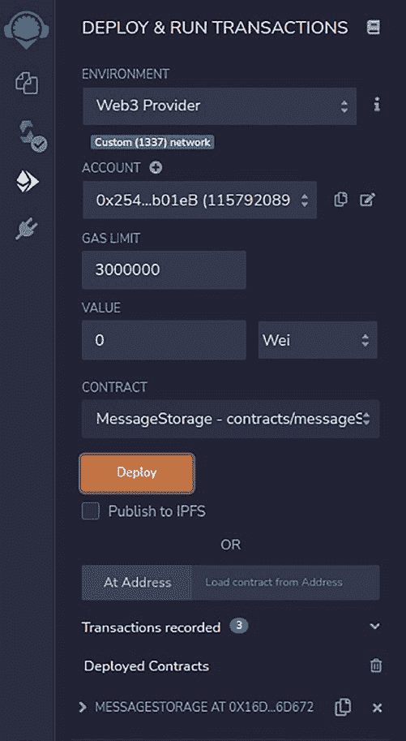

第 7 章：使用 Solidity 编写智能合约

**图 7-20.** Remix 智能合约部署面板

此处，`Environment` 应指定 `Web3` 提供者，并指向开发链的端点 `http://127.0.0.1:8545`。

智能合约成功部署后，将返回一个智能合约地址，显示在屏幕底部，如下所示：

`0x16d29C0A07dcDBe6e1097257Ee39DEe18136d672`

开发者可以复制此智能合约地址，供 Web 浏览器进行交互。

#### 步骤 4：编写 Web 客户端与智能合约交互

为了让 Web 客户端与智能合约交互，需要以下几个参数，包括：

- **区块链的 RPC 端点** – 这是区块链的入口。在本例中，它是 `http://127.0.0.1:8545`。诸如 MetaMask 之类的 Web 钱包需要通过此 RPC 端点连接到区块链。
- **智能合约的 ABI** – 在智能合约编译时生成。
- **智能合约地址** – 该地址在智能合约成功部署后返回。

下面，我们提供了一个 HTML/JavaScript 页面来展示与智能合约交互的用户界面。HTML 部分展示了按钮的布局，JavaScript 部分展示了与智能合约交互的脚本代码。

以下展示了 HTML/脚本代码的 Web 用户界面（图 7-21）。

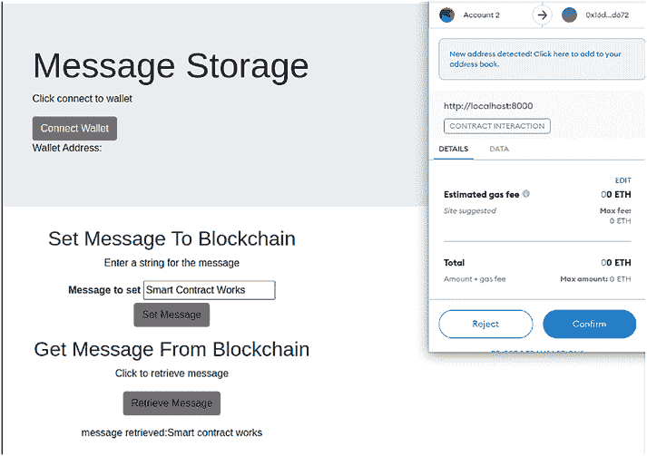

在图形用户界面的左侧，有三个按钮：允许用户连接钱包并获取钱包地址、设置要写入区块链的消息、以及检索消息。右上方是 MetaMask 的弹出窗口，允许用户签署交易与区块链交互。

**图 7-21.** 与智能合约交互的用户界面示例

下方展示了三个 HTML 按钮的代码片段：

`Connect Wallet` 按钮将触发 `enableEthereumButton` 并获取钱包账户地址。

```html
<DIV class="container">
  <H1 class="display-4">消息存储</H1>
  <P>点击连接钱包</P>
  <P><BUTTON class="btn btn-secondary enableEthereumButton">连接钱包</BUTTON><BR>
  钱包地址:<span class="showAccount"></span></P>
</DIV>
```

`Set Message` 按钮将触发 JavaScript 中的 `setMessage()` 函数。

```html
<P>输入一条字符串作为消息</P>
<DIV class="cluegene">
  <LABEL for="cluegene"><B>要设置的消息</B></LABEL>
  <INPUT type="text" class="ignore-form-control" id="cluegene" placeholder="" value="[我的消息]" size="20" required="">
</DIV>
<P><A class="btn btn-secondary" onclick="setMessage()" role="button">设置消息</A></P>
```

`Retrieve Message` 按钮将触发 `getMessage()` 函数：

```html
<DIV class="row" id="getmessagerow">
  <DIV class="col-lg-6 text-center">
    <H2>从区块链获取消息</H2>
    <P>点击检索消息</P>
    <P><A class="btn btn-secondary" onclick="getMessage()" role="button">检索消息</A></P>
    <DIV id="GetMessageValue"></DIV>
  </DIV>
</DIV>
```

这三个函数在 JavaScript 代码中实现。

为了获取钱包地址，会发送一个 `eth_requestAccounts` 请求，作为以太坊请求来获取 MetaMask 启用的账户。

```javascript
async function getAccount() {
  const accounts = await ethereum.request({ method: 'eth_requestAccounts' });
  const account = accounts[0];
  account0 = account;
  showAccount.innerHTML = account;
}
```

对于设置消息，按以下工作流程编码：

- `setMessage` 函数首先检查是否安装了 MetaMask。如果已安装，则获取与 MetaMask 关联的账户。
- JavaScript 代码使用...创建智能合约对象

##### 指定合约地址和 ABI 信息

`ABI` 可以存放在单独的文件中以便导入。

- **交易的数据打包**：此步骤从输入字段获取要设置的消息，并使用嵌入的 `encodeABI()` 函数进行打包。
- **通过 `sendTransaction` 函数发送交易**。

```javascript
function setMessage() {
    if (!ethEnabled()) {
        alert("Please install an Ethereum-compatible browser or extension like MetaMask to use this dApp!");
    }
    web3.eth.getAccounts(function(err, accounts) {
        var myContract = new web3.eth.Contract(messagestorage_abi, messagestorage_contract.toLowerCase());
        var gene = $('.cluegene input').val();
        var auctionData = myContract.methods.storeMessage(gene).encodeABI();
        var tx_genescience = web3.eth.sendTransaction({
            from: accounts[0].toLowerCase(),
            to: messagestorage_contract.toLowerCase(),
            data: auctionData
        }, function(err, transactionHash) {
            document.getElementById("SetMessageValue").innerHTML = "setMessage tx:" + transactionHash;
        })
    })
}
```