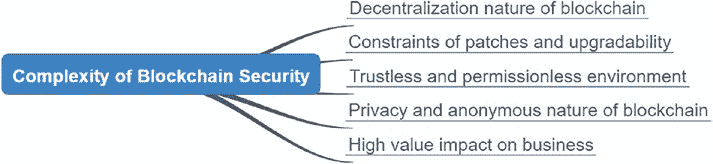

# 第 8 章 安全注意事项

#### 引言
在前几章中，我们已经探讨了 Solidity 智能合约编程的许多方面。我们涵盖了 Solidity 编程语法，使用 Remix 或 Truffle 编译源代码，以及将字节码部署到嵌入式 EVM 或开发区块链。我们还提到了代币经济和代币设计，例如选择同质化或非同质化代币，以及使用代币来代表业务用例中的资产和元素。

在存储和通信方面，我们讨论了以太坊区块链状态和事件概念的重要性，以及不同的网络，例如主网、Rinkeby 测试网和 Ropsten 测试网。

在架构方面，我们讨论了构建端到端解决方案的方法，包括构建连接到以太坊区块链的区块链节点、部署智能合约、开发 Web 客户端或移动应用，以及使用 Web3 将客户端与区块链连接起来。

在本章中，我们将介绍以太坊区块链和智能合约的安全性。安全性是软件开发中最重要的方面之一。它在以太坊区块链中扮演着更重要的角色，原因如下图 [8-1] 所示：

© Weijia Zhang and Tej Anand 2022  
W. Zhang and T. Anand, *Blockchain and Ethereum Smart Contract Solution Development*,  
[`doi.org/10.1007/978-1-4842-8164-2_8`](https://doi.org/10.1007/978-1-4842-8164-2_8#DOI)

### 第 8 章 安全注意事项

***图 8-1.** 区块链安全与传统 IT 安全相比的复杂性*

- **区块链的去中心化特性** – 任何编写并部署到区块链的代码都将在数千台机器上运行。任何人都可以访问并运行区块链代码。
- **补丁和可升级性的限制** – 由于区块链的不可变性，已部署的智能合约...

