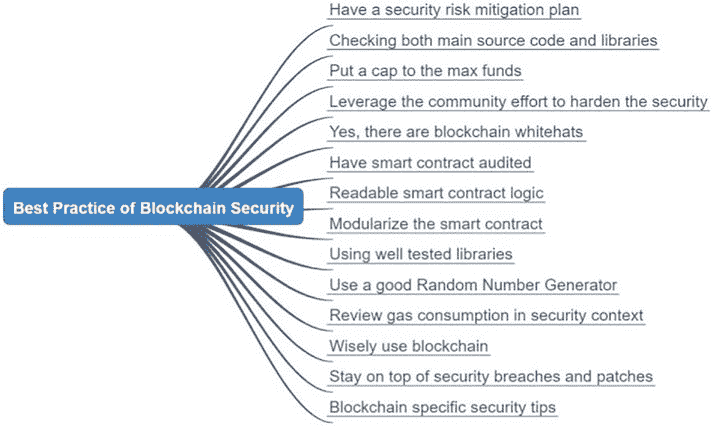

# 区块链安全考虑

区块链无法被修改。这增加了去中心化应用升级的难度。当在区块链应用中发现安全缺陷时，修补应用的成本很高，有时甚至需要对区块链进行分叉。

-   **无需信任且无需许可的环境** – 对于公有链而言，客户端节点和去中心化应用都对全球参与者开放。没有中心化机构来检查参与者的资质。也没有安全边界来阻止恶意参与者加入。
-   **区块链的隐私性和匿名性** – 区块链用户可以保持匿名。智能合约函数无法检查用户资料。黑客可以实施区块链攻击，获取资产，并保持身份不明。
-   **对业务的高价值影响** – 智能合约通常代码量较小。较大的项目可能有数千行代码，而其他项目可能只有几百行。智能合约管理着高价值的加密资产，每次攻击都可能给去中心化应用带来灾难性后果。一些去中心化应用因智能合约中的简单错误而遭受了巨大损失。

过去已发现多起智能合约漏洞。我们可以将这些安全问题分类为功能性安全漏洞和可攻击性安全漏洞。功能性安全漏洞是明显的代码错误，可以通过正常交易并由善意用户导致资金损失。智能合约的功能性安全漏洞包括以下内容。

## 智能合约中的功能性安全漏洞

### 资金死锁

这是一种安全漏洞，智能合约可以接收资金转账，但会无限期地将资金锁定在智能合约中。例如，智能合约可以实现一个`receive`函数来接收资金，但没有实现用于发送或转账的函数。在这种情况下，发送到智能合约的资金将由该智能合约拥有，但无法将资金转出。类似于黑洞，这是一种只进不出的情况。

### 资金泄漏

这是一种功能安全漏洞，可能导致非特权用户泄漏资金。这通常是由于缺乏访问权限和权限检查造成的。例如，如果某个函数具有资金转账能力，但被声明为`public`且未验证用户对资金的拥有权，就可能造成安全漏洞。在`Solidity`智能合约编程中，有多个地方可以强制执行安全性，包括将函数的作用域设置为`public`或`private`，设置所有权访问权限，以及使用`require`和`assert`确保在继续执行下一行代码之前满足访问条件。当铸造或转移代币时，智能合约需要确保函数的调用者是所有者、管理员或该函数的授权用户。在智能合约中定义角色非常重要，每个角色都将具有有限的访问权限。以`CryptoKitty`为例，定义了四个角色，包括智能合约所有者、项目 CEO、COO 和 CFO。对于`mint`函数，智能合约将铸造权定义给 COO。你必须成为该项目的 COO 才能铸造 NFT 代币。还有一个`pause/unpause`函数，用于通过暂停智能合约的执行来处理紧急情况，该权限授予 CEO。CFO 可以执行与拍卖相关的其他操作。智能合约的所有者也是一个关键角色。通常，将智能合约部署到区块链的人默认是智能合约的所有者。此所有者可以随后将所有权转让给另一个用户、一个智能合约地址，甚至放弃所有权。由于智能合约的所有者拥有最高的访问权限，因此保护其私钥至关重要。

### 所有者账户

第 8 章：安全考虑

### 禁用智能合约

这是另一种功能安全漏洞，非特权用户可以调用某个函数来终止智能合约。这是另一个需要留意的问题。在智能合约中，可能存在一个可执行的函数，通过清除状态、存储和设置来禁用整个智能合约。如果这个函数被无意中调用，将完全摧毁该智能合约。

### 孤儿智能合约

当智能合约被部署时，发送部署交易的账户就是所有者，它对该智能合约拥有高级管理权限。有时，为了提高去中心化程度，所有者可能会将所有权转移给另一个所有者账户、一个智能合约，或者放弃所有权。一旦智能合约的所有权在部署后被转移或放弃，原所有者就不再拥有管理该智能合约的权利。因此，在设计过程中制定一个智能合约所有权计划至关重要。一旦智能合约被部署且所有权被转移或放弃，当去中心化应用中出现紧急情况时，就无法暂停或升级这些智能合约了。

## 智能合约中可被攻击的安全漏洞

这类安全漏洞是由恶意用户造成的。它们比功能性安全漏洞更隐蔽，且极难被发现。黑客通常需要构造人工交易并执行多个步骤的攻击。攻击者也保持匿名，并有办法转移资金。这类漏洞还可能包括攻击区块链节点、Web3 客户端以及智能合约外部的环境。其他已发生的漏洞还包括黑客进行以下操作：(1) 通过恶意交易调用有问题的内部函数；(2) 改变函数调用的外部参数和条件；(3) 更改白名单地址和名称；(4) 攻击预言机。以下是一些可被攻击的安全漏洞示例：

### 示例 1：向任意账户支付账单

以下是一个存在安全漏洞的代码片段：

```solidity
pragma solidity ⁰.8.6;

contract PayIssue {
    function payBill ( address payable recipient, uint256 x_amount ) public payable {
        recipient.transfer(x_amount);
    }
}
```

在上述代码中，有一个名为 `payBill(address payable recipient, uint256 x_amount) public payable` 的函数。这个 `payBill` 函数在被调用时，会简单地将 `x_amount` 数量的以太币转移到函数指定的 `recipient` 地址。该函数是 `payable` 的，允许资金转移到接收者。`Payable` 是 Solidity 中的一个新关键字，用于指定某个函数或地址是否可以转移或接收资金。

这个智能合约的一个主要功能性安全错误是，它没有检查调用该函数的用户权限。由于这个函数是 `public` 且 `payable` 的，任何人都可以调用它，并将资金转移到他们指定的任意地址。事实上，用户可以调用这个智能合约来耗尽该合约拥有的所有资金，并将其发送到黑客的地址。函数访问范围上的一个简单错误就可能导致资产损失，并毁掉一个原本前景光明的项目。

### 示例 2：未保护 kill 或 selfdestruct 函数

曾发生过一起安全事件，一个智能合约中编写了 `kill` 函数，但没有权限检查，最终导致了 3 亿美元的资产损失。在一个社区 Telegram 聊天群组中，有人发布了一个交易哈希。消息发送者声称自己是以太坊新手，但刚刚发送了一笔交易来调用某个智能合约中的 `kill` 函数。由于该 `kill` 函数未检查用户权限，这个函数调用被执行了，并有效地重置了该智能合约的存储。

智能合约被销毁后，其中锁定的 3 亿资金将无法恢复。`kill`、`destroy`、`selfdestruct`或`renounce`等函数属于高度特权操作，可能导致智能合约失效。执行这些函数时，必须对调用参数实施全面检查，确保不存在安全风险。

# 智能合约安全最佳实践

前文已介绍功能性和可攻击性安全漏洞及示例。如图 `8-2` 所示，现在我们将讨论设计智能合约和编写代码的良好安全实践。



`图 8-2.` 区块链安全最佳实践

### 制定安全风险缓解计划

以太坊及任何公有区块链都是开放、无需许可的系统，恶意参与者与善意参与者对智能合约拥有同等访问权限。必须建立“智能合约可能存在缺陷和安全漏洞”的认知，并准备相应的缓解方案。例如，在`CryptoKitty`的智能合约中实现了`pause`函数，仅 CEO 可暂停或恢复该合约。若发生安全攻击，CEO 可发送交易调用`pause`函数，暂停`CryptoKitties`的铸造和拍卖。

此外，需权衡去中心化与可升级性。区块链本质不可篡改，因此智能合约默认应不可更改。但另一方面，编写完全无缺陷或漏洞的`Solidity`代码几乎不可能。更好的做法是将智能合约分为两类：一类是稳定且不可更新的合约，另一类是动态且可由特权管理员升级的合约。Web3 客户端调用的智能合约应作为代理合约（不可升级且地址固定），而由代理合约调用的其他合约则可升级。当智能合约因修复缺陷而升级后，新部署合约的地址将在代理合约中更新，无需修改 Web3 客户端。

## 同时检查主源代码和库

安全漏洞不仅可能出现在您编写的代码中，也可能存在于导入智能合约的库中。库代码可能使用不同版本的`Solidity`编写，从而增加集成复杂性和安全风险。例如，部分库使用`Solidity 0.4`版本编写，而您正在开发的主智能合约可能使用`0.8`版本。`Solidity 0.4`不支持某些安全特性，需进行修改才能集成这些库，这反而增加了整体智能合约的漏洞风险。因此，确保主代码与库的版本兼容至关重要，安全审查、审计和测试也应包含库代码。

## 设置资金上限

鉴于智能合约的复杂性，为合约函数设置可处理的资产价值上限是明智之举。智能合约可设置全局上限，每个具有资产转移能力的函数在转移前都会比较待转移资产与该上限。若超出上限，函数将拒绝执行转移。这提供了额外的安全防护，防止资产损失。实际上，`ERC20`智能合约的`approve`函数可设置用户调用`transfer`函数时的最大可转移资金限额。

由于智能合约处理的加密货币总价值呈指数级增长，像 Uniswap 和 Compound 这样的项目通过智能合约管理的资产价值已达数十亿美元。如果智能合约代码出现安全漏洞，其影响将是巨大的。一个好的做法是设计一个机制，为可能受安全漏洞影响的资金设置一个阈值。

## 将你的智能合约开源，并借助社区力量强化安全性

智能合约被用于驱动去中心化金融（DeFi）世界，在这个世界里，没有中央权威机构或大型 IT 团队来为平台提供信任和安全保障。因此，项目社区在强化智能合约安全性方面扮演关键角色至关重要。与传统金融应用由软件供应商利用自身工程资源和服务来确保安全与质量不同，智能合约通常采用开源模式，以便社区和用户能够审查代码，确保业务逻辑被准确封装在源代码中。我们鼓励社区开发者审查源代码，并为能够发现任何功能、外观或安全缺陷的专家提供高额赏金。智能合约也会先部署到测试网，发布 alpha 和 beta 版本，并邀请社区寻找缺陷，同时通过漏洞赏金进行奖励。由于由智能合约驱动的去中心化应用通常是能够发行代币的项目，有时社区开发者发现安全问题或缺陷后会获得项目代币奖励。那些管理着数十亿美元加密资产、健康发展的项目，总有一群热心的社区开发者致力于提升智能合约的安全性。

## 是的，存在区块链安全白帽黑客

有时，智能合约被黑会有不同的结局。曾多次发生“黑客”并非意图盗取资金，而是想给项目方一个教训的情况。因此，如果发生安全漏洞，密切关注资金的转移去向非常重要。意图使用被盗资金的黑客通常会将资金转移到“混币器”中，以隐藏身份并消除资金的可追溯性。而白帽黑客则会将资金转移到安全位置，告知项目方安全漏洞，等待项目方修复问题，然后将资金转回。所以，如果发生安全漏洞，不必惊慌；结果可能并没有看起来那么糟糕。

### 对智能合约进行审计

对智能合约进行审计是强化安全性的良好实践。安全审计是指聘请外部专业公司来评估和审查代币经济模型、智能合约设计以及代码实现。审计人员会使用自动化安全扫描工具和手动渗透测试，生成一份关于智能合约的详尽报告。智能合约的安全扫描可以发现语法和编程风格上的静态安全错误。更深入的智能合约审查则需要专家通过 UML 图逐一检查每个智能合约，厘清函数之间的关系，并检查潜在漏洞。有时，项目方和审计团队会召开会议，共同审查智能合约设计，以确定端到端的流程是否存在安全问题。发现的任何问题都会根据严重程度进行分级，严重问题需要修复后才能发布产品。安全审计不仅能够提升智能合约的安全性，防止灾难性故障，而且在项目方后来决定与其他合作伙伴合作，或希望向其他公司授权其智能合约时，这也是必备条件。安全审计在区块链行业已成为一项不断增长的业务，审计请求常常积压。加急审计通常需要支付高得多的费用；因此，项目的发布计划中应预留出安全审计的时间。

### `可读的智能合约逻辑`

我们提到智能合约具有高 VLC（每行代码的价值）。确保智能合约逻辑简洁易懂非常重要。如果你阅读优质项目的智能合约代码，可能会发现注释往往比源代码本身还多。这些注释旨在帮助读者审查并理解源代码。如果将 Solidity 文件中的代码剥离出来，你会发现这些注释实际上是对智能合约函数的良好设计和文档。优秀的智能合约在编写和文档化时，会兼顾技术与业务专家，使他们都能阅读并清晰理解业务逻辑。

### `模块化智能合约`

`Solidity` 是一种面向对象编程（OOP）语言，你可以使用层次结构、继承和多态机制来定义类和函数，这与 Java 和 JavaScript 类似。模块化智能合约的一个良好实践是模拟现实场景，将智能合约构建为相应业务逻辑的组件。

### 使用经过充分测试的库

与模块化相关，使用经过充分测试的库是提高安全性的另一种方式。由于大多数智能合约是开源的，因此有许多方便且安全的库可供使用。例如，`OpenZeppelin` 提供了一组优秀的库，如 `SafeMath`、`ERC20` 和 `ERC721`，而 `Oraclable` 则提供了 Oracle 库。

成熟的库代码通常对其智能合约函数有更好的边界检查。例如，`SafeMath` 库会检查算术数据类型范围，并对分母为零的情况进行除法检查。使用经过充分测试的项目的库代码可以降低主代码的不确定性。

### 使用良好的随机数生成器

在游戏应用中，智能合约有时会使用随机数生成器（RNG）来生成随机数，从一组用户中选出获胜者。RNG 也用于通过随机分组参与者来防止共谋，从而增强安全性。在没有可靠的数学验证和充分测试 RNG 随机性程度的情况下，自己实现 RNG 通常不是一个好主意。例如，使用区块链区块的哈希值在某些应用中可能看似随机。然而，如果 dApp 的智能合约处理的是类似于 Powerball 的大规模、高价值游戏，那么区块链哈希的随机性就容易受到攻击。区块生产者可以在提议的区块链区块中添加或删除交易，并提供被篡改的哈希值。目前，链上还没有完美的 RNG，完全的随机性必须通过链下计算引入，并利用 Oracle 带入区块链。

## 从安全角度审查 Gas 消耗

Gas 的使用和费用被设计为一种补偿矿工并增加对以太坊网络发起恶意攻击成本的方式。在智能合约交易中，每个函数和存储都会消耗 Gas，而 Gas 费用由向智能合约发送交易的用户支付。在处理智能合约中的 Gas 消耗时，需要考虑几个安全因素。在 dApp 应用中，如果使用代理代表用户发送交易，那么审查函数以确认 Gas 消耗是否为固定值，以及函数是否存在进入无限循环或大型循环并耗尽发送者账户中以太币的可能性，就显得尤为重要。通常，智能合约的设计和编写应尽可能减少 Gas 消耗。为此，应特别注意避免使用用于长操作的 `while` 循环、用于数据存储的大型动态数组，以及跨智能合约的复杂函数调用。在编写智能合约时，可以使用一些 Gas 估算工具来帮助检查代码中的 Gas 使用情况。以太坊基金会还发布了一份 gas 消耗表，作为优化智能合约 gas 性能的指南。

## 明智地使用区块链

一些人存在误解，认为区块链可以解决当今传统 IT 技术无法解决的所有问题。在某种程度上，区块链确实解决了诸如共识、去中心化、无需许可和代币经济学等具有挑战性的问题。然而，当今的区块链技术仍存在许多缺点。例如，当执行智能合约时，它会在数千台机器上同时运行。事实上，比特币区块链拥有超过 20,000 个挖矿节点，而以太坊拥有数千个节点。所有以太坊节点都将拥有相同的已部署智能合约，并会运行该智能合约来处理交易。在区块链如此规模的冗余下，这会急剧降低整体性能，并在出现问题时增加风险。

## 安全考虑

因此，从安全角度来看，在 dApp 架构和设计中，更好的做法是将区块链用于需要去中心化、多方共识、不可篡改性和透明度的系统。对于诸如用户界面（UI）、动态内容存储、临时数据和繁重计算等组件，这些可以在链下完成。以 CryptoKitty 为例，猫咪的生成、基因生成和拍卖管理在链上完成，而猫咪的 UI 和渲染则在链下完成。去中心化应用中链上与链下组件的良好平衡，可以提升可用性、可升级性、性能和安全性。

## 紧跟安全漏洞与补丁

区块链远未达到稳定状态，安全漏洞时有发生。因此，订阅区块链安全新闻警报并评估可能影响你项目的任何黑客攻击是很有帮助的。区块链黑客攻击总能登上媒体头条。在以太坊社区，关于解决方案和安全漏洞的讨论与分享非常及时。如果安全漏洞影响到你在生产网络中部署的智能合约，制定行动计划至关重要。

同样，最佳实践是尽快将智能合约代码升级到最新版本的 `Solidity`。说起来容易，做起来却非常困难。一旦智能合约部署，由于区块链的不可篡改性，它们将无法打补丁。升级需要放弃旧的智能合约并部署一个全新的合约。此外，在智能合约库和生产代码中并存着各种版本的 `Solidity` 程序。不同版本的 `Solidity` 编译器之间存在不兼容性。在部署智能合约之前，最好将主智能合约和库的所有源代码都升级到最新版本。

## 安全考虑

此外，还有一些优秀的安全分析和可视化工具，可以帮助开发者编写安全的智能合约。安全扫描工具可以帮助开发者发现静态安全漏洞，并遵循良好的安全编码实践。可视化工具帮助开发者和审查者查看智能合约的全貌，并分析来自黑客的潜在攻击点。

## 区块链特定安全提示

对于曾经开发过独立应用程序或 Web 服务的程序员来说，需要注意区块链具有一些需要关注和避免的特殊属性和陷阱。

在进行跨智能合约的函数调用时，调用函数会接收另一个智能合约的地址，并调用目标函数的字节码。有时，该目标函数可能包含恶意代码，并改变调用函数的控制流。检查目标智能合约的源代码以确保其没有安全漏洞非常重要。如果目标智能合约的地址被传入

从外部来看，确保只有特权用户能够传入目标地址至关重要。

以太坊区块链是公开、去中心化且无许可的。如果智能合约中的任何函数被声明为 `public`，世界任何地方的任何人都可以调用该函数并传入任意参数。因此，仔细检查函数的作用域并检查所有可能导致安全漏洞的参数组合非常重要。智能合约中的公共函数是全局公开的，可以按任意顺序、使用任何数据调用。因此，检查智能合约函数的以下属性极为重要：

- `函数作用域（Scope of function）` – 声明其为 `public`、`private` 或 `view`。
- `访问作用域（Scope of access）` – 检查谁可以调用该函数，可能仅限所有者，或仅限预定义的用户角色。
- `参数组合（Parameter permutation）` – 检查参数的数据范围。验证输入的有效性。

以太坊区块链的内在安全性存在一些限制。当在智能合约中声明变量时，它可以是一个私有变量。然而，私有变量实际上并非私有，因为安装在区块链节点上的以太坊虚拟机（`EVM`）可以将其暴露。为了确保智能合约中数据的隐私性，数据在发送到区块链之前应进行加密，并在从区块链接收后进行解密。由于公共区块链的透明性，智能合约中的链上数据加密和解密并不安全。通过启用调试器的以太坊虚拟机（`EVM`）可以查看执行步骤和内部数据。加密和解密应通过链下计算执行。

对于需要在计算中使用时间序列的去中心化应用来说，了解区块链中的时间戳并不准确非常重要，因为矿工可以通过延迟或加速区块计算与提议来操纵区块时间。使用区块时间戳来检查顺序执行和排序交易步骤并非良好实践。区块链或交易的时间戳不应被用作多个事件的唯一标识符，因为无法保证在秒级范围内不会发生区块时间戳冲突。

在智能合约开发的整个生命周期中，从概念、需求、代币设计、架构，到实现与运营，都需要考虑安全性。一个需要考虑的重要安全因素是在部署过程中保护私钥。加密资产存储在账户中，每个账户由一对私钥和公钥表示。私钥用于签署交易，将资产从一个用户发送到另一个用户。谁拥有某个账户的私钥，谁就拥有该账户的资产。当将智能合约部署到区块链时，需要有一个用户将部署交易发送到区块链。为了签署交易，用户需要使用其私钥解锁账户。如果一个账户在区块链中被解锁，其私钥就是公开的，可能被欺骗者窃取。这种情况在加密世界中已多次发生。

有几种安全的方法可以部署智能合约。例如，用户可以使用硬件钱包或离线钱包进行部署。在这两种情况下，私钥都保存在独立的设备中，只有已签名的交易被复制到在线系统中以发送到区块链。由于私钥永远不会离开没有网络通信的专用设备，因此它是完全安全的，除非设备遭到物理篡改。

## 量子计算的安全影响

量子计算的安全影响一直是区块链社区关注的主要问题。人们担心量子计算的优越性会抵消区块链的优势，并将加密货币的价值降至零。量子计算是一种革命性技术，它利用了量子物理学惊人的原理和现象。

量子计算中的现象包括叠加、纠缠和测量不确定性。在量子计算中，量子比特用于表示量子系统的“0”和“1”状态，类似于传统计算中的比特。多个量子比特可以组成一个寄存器，成为量子计算的计算和存储单元。量子计算提供了更高的算力，并将在以下领域影响区块链。

`SHA-256` 或 `SHA-3` 的哈希算法将不再有效。哈希算法是一种单向函数，它接受输入字符串并产生固定长度的输出字符串。哈希的一个关键要求是，不同的输入应生成不同的输出。此外，不应存在从哈希值反向计算输入的方法。利用量子计算，这些规则将被打破，任何依赖 `SHA256` 等哈希算法的系统都需要彻底改造。

使用椭圆曲线密码学的非对称公钥-私钥签名算法（如 `ECDSA` 或 `DSA`）将不再安全。量子计算可以从公钥计算出私钥，或从私钥破解已签名的消息。

量子计算对密码学的影响，进而会影响到区块链在如图 8-3 所示领域的安全性。

**图 8-3.** 量子计算对区块链安全的影响

区块链的基本不可篡改性将受到影响。区块链中的区块通过其区块哈希值唯一标识。如果哈希不再安全，且可通过量子计算篡改，那么区块链就可能被修改——内部数据被更改，但其链上的哈希值仍保持不变。

由于控制资产账户的私钥可以被量子计算机破解，加密资产将不再安全。

P2P 网络层的通信将不再安全。以太坊使用 `secp256k1` 生成 `nodeKey` 和 `nodeId`。由于 `secp256k1` 将不再安全，客户端节点的标识和通信机制需要改变。

以太坊区块链的智能合约将不再有效，因为智能合约的所有者同样可以被破解。

所有使用 `ECDSA` 和 `SECP256` 私钥签名的交易将不再有效，需要使用新的算法。

即使工作量证明（`POW`）共识也会受到影响。`POW` 基于计算匹配哈希来验证提出区块的矿工。借助量子计算，计算速度极快，拥有量子算力的人将构建最长的链，从而打破 51% 算力的规则。

为了应对量子计算的优势，有几个关键点需要考虑。

首先，以太坊 2 正在从 `POW` 转向 `POS`（权益证明）。这将减轻量子计算对共识层的影响。

其次，已经开发出抗量子签名方案，包括 `Lamport`、`XMSS` 和 `SPHINCS`。

第三，量子计算的安全影响不仅限于区块链，而是涉及所有密码学和网络计算领域。通用领域中已解决的量子方案可以移植到区块链中。

第四，解决量子计算对区块链安全的影响可能超越区块链的技术层面。可能会出台一些法律法规，禁止利用量子计算能力入侵信息和区块链系统。类似于核不扩散政策，可能会对向公共领域发布的量子设备施加限制。

紧跟量子计算的发展、掌握应对方案并做好关键决策的准备至关重要。随着 IBM 计划发布 1000 量子比特设备，以及谷歌在量子计算上取得巨大飞跃，量子计算必将挑战并威胁区块链的安全性。强烈建议学习量子计算技术。

并准备好迎接以太坊区块链的抗量子技术。