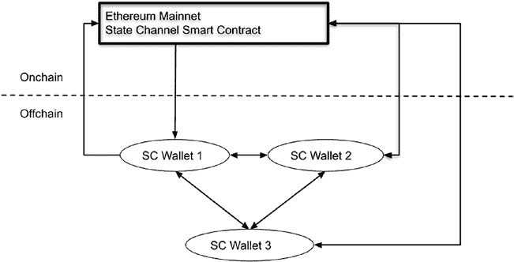
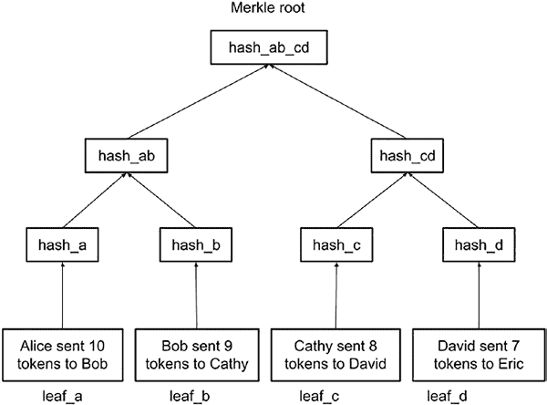

# 第 9 章 二层网络与以太坊 2.0

#### 以太坊主网存在的问题

以太坊主网被设计为公有区块链而非企业级平台，因此缺乏隐私性、性能、可扩展性和权限管理能力。

在隐私性方面，以太坊主网以无需许可的方式存储所有数据，任何人都可以访问这些数据。所有敏感数据在发送到区块链之前都需要加密，且交易需要通过智能合约进行混淆处理。一些机构或国家不允许将某些类别的数据发布到公有区块链上。因此，公有主网的使用仅限于存储数据资源的哈希值或 URL。原始数据存储在私有区块链或节点中，并通过公有链和通道进行验证。

在性能和可扩展性方面，以太坊主网已经遇到瓶颈。CryptoKitties（加密猫）的发布曾导致以太坊区块链拥堵。每笔交易的手续费已超过 100 美元，从而将可行的交易限制在高价值、低频次的应用场景。为了加速交易，用户有时不得不设置较高的 Gas 价格，以增加其交易被矿工打包进提议区块的几率。

在权限管理方面，公有区块链被设计为无需许可的，但某些应用场景出于安全和合规考量，确实需要访问控制。以太坊主网的“公有”性质阻碍了某些应用，例如证书颁发和人事数据库。

为了解决以太坊主网的这些问题，人们提出了许多以太坊改进提案与解决方案，包括二层网络和以太坊 2.0。在本章中，我们将讨论以太坊的新兴可扩展性技术，包括二层网络和以太坊 2.0。下图（图 9-1）展示了以太坊可扩展性解决方案的分类，各个方案将在相应章节中详细阐述。

**图 9-1.** 以太坊区块链可扩展性解决方案概览

## 二层网络技术

二层网络是一套通过智能合约将交易的计算和存储从链上转移到链下来提升以太坊一层主网性能和可扩展性的技术。链上交易需要在所有节点上运行 EVM（以太坊虚拟机）并将所有状态存储在以太坊区块链上，从而降低了性能和可扩展性。二层网络解决方案的机制是将部分交易移出主链，仅将关键信息记录在主网上，以确保安全性和透明性。二层网络与以太坊 2.0 的一个主要区别在于，二层网络使用智能合约将链下资源与主网连接，因此不需要主网区块链进行硬分叉。二层网络解决方案可由第三方项目利用现有的以太坊主网来实现。

目前有几种可用的二层网络机制，包括状态通道、Plasma 和 Rollup，每种机制都有其独特的特点。

##### 以太坊状态通道

状态通道是二层网络解决方案之一，它允许两个或更多

参与方可以在离线状态下相互发送交易，并且仅将状态通道周期的起始和最终交易发送到主网区块链。这样，主网被用作多方之间可信通道的托管和审计平台。

例如，状态通道可以构建为权威证明（POA）或拜占庭容错私有区块链，仅对参与方授权。为简化起见，私有区块链可以替换为能够与其他钱包连接并记录彼此交易的智能钱包。参与方使用私有区块链或智能钱包作为状态通道，以进行快速且低成本的交易。

## 第 9 章 Layer 2 与以太坊 2

为了说明状态通道的一个用例，我们以一个建筑公司的支付系统为例：建筑商需要按日记录承包员工的收入，并按月支付工资。如果每日交易都记录在区块链上，交易费用将急剧增加，因为 Gas 费可能达到每笔交易 100 美元。使用状态通道，公司所有者可以通过状态通道支付每日交易，并仅按月向员工支付总金额。这将使成本降低至原来的约 1/30。

状态通道的拓扑结构和工作流程如下图所示（图 9-2）：

***图 9-2.** 状态通道解决方案的拓扑与工作流程*

上图展示了一个包含以下组件的状态通道的架构：

- **状态通道智能合约** 部署在主网上。

该智能合约是多签的，任何单一用户都无法更改或删除它。

状态通道智能合约可以接受用户的存款，并为一组用户创建状态通道。存款人需要指定参与方的账户地址。

状态通道智能合约还具有以下功能：(a) 处理多签签名并将资金分配给参与方；(b) 通过接受任一参与方发送的证据，来处理来自任何参与方的审计请求。

- **每个用户都可以拥有一个状态通道钱包（SC 钱包）**。

该钱包可以通过发送交易、请求收据或为主链上的交易进行多签，在参与方之间进行交互。钱包还拥有存储空间，用于保存交易历史和收据的本地副本。

工作流程如下：

- **付款人使用加密钱包向状态通道智能合约存入以太币资产**，并指定将接收付款的收款人账户。

- **智能合约创建一条记录**，并返回包含余额和收款人地址的存款记录。收款人地址也被智能合约记录，以处理索赔或审计请求。

- **付款人获取存款收据**，并开始通过链下签名交易向收款人发送付款。对于每笔交易，状态通道钱包将更新链下账户余额，并为发送方和接收方生成签名收据。这些交易是链下的，因此交易费用很低甚至为零。

- **一旦状态通道的操作完成**，链下交易需要被转移到主网，并且每个参与方的余额需要被更新。每个参与方将检查其本地交易收据副本，并签署退出状态通道交易。一旦退出交易得到所有参与方的多签，它将被发送到主网状态通道智能合约进行处理。主网智能合约将验证信息，然后将存入的资金分配给相应的参与方。

- **如果任何参与方未签署交易**，其他参与方可以发送交易来调用智能合约的`claim`（索赔）或`audit`（审计）功能，并提供所需的本地收据作为证据。

智能合约`smart contract`验证付款方`payer`是否存在欺诈行为，一旦确认，付款方存入的`deposited balance`将被罚没`slashed`。

针对第二层`layer 2`状态通道解决方案，存在不同的实现方式。在上述方案中，链下计算和存储被构建在状态通道钱包内部。这会增加钱包的存储占用，并需要对加密钱包进行定制。另一种解决方案是通过使用许可型共识机制（如权威证明`POA`或拜占庭容错`BFT`区块链）的私有区块链来实现状态通道的链下计算。该私有区块链可以处理并记录状态通道参与者之间的交易。只有状态通道的进入和退出交易会被发送到主网`mainnet`，以确保安全性和持久记录。钱包可以是常规钱包，例如能够从主网链切换到私有链以处理状态通道交易的`MetaMask`钱包。

## 第 9 章 第二层与以太坊 2

尽管状态通道通过将交易迁移至链下可以提高以太坊`Ethereum`的可扩展性，但这种机制也存在一些局限性。首先，状态通道的参与者需要主动参与交易，他们的账户必须在状态通道智能合约`smart contract`中注册。发送方无法向不在通道内的任意地址发送交易。其次，所有状态通道参与者都需要通过验证交易和多重签名退出交易来积极参与其中。第三，由于主网仅保存初始状态和最终状态，当状态通道交易出现差异时，需要依赖链下参与者提供证明。要求参与者介入来保障状态通道的安全性是一个重大缺陷，这使得为状态通道开发通用解决方案变得困难。

### 作为第二层技术的 Plasma

以太坊 Plasma`Ethereum Plasma`是另一种第二层扩展解决方案，它利用智能合约将外部区块链与作为安全与仲裁平台的以太坊主网相连接。这些子区块链被称为等离子链`plasma chains`，其区块链交易记录会形成默克尔化`merkelized`，默克尔树`Merkle tree`的根节点会被发送到主网作为证明存储。

上图（图 9-3）展示了作为第二层解决方案的等离子区块链`plasma blockchain`的组件和工作流程。

``

**第 9 章 第二层与以太坊 2**

**图 9-3.** Plasma 可扩展性解决方案的组件与工作流程

##### 以太坊主网上的 Plasma 智能合约

顶层是第一层`layer 1`或称为根区块链`root blockchain`，在此上下文中即为以太坊主网。Plasma 智能合约被部署到以太坊主网上，其具备以下功能。

**供用户在第一层存入资产的存款函数`Deposit function`**：该存款函数允许用户向某 Plasma 智能合约发送一笔包含特定资产价值的交易。用户通过存款函数发送的资产将由该 Plasma 智能合约锁定在主网上。智能合约将创建一个记录，并生成与此存款相关的新代币。之后，存款函数可以触发一个存款事件`deposit event`以通知 Plasma 区块链。该代币及其价值将被复制到 Plasma 区块链中，并作为第二层区块链的资产使用。

**用于第二层 Plasma 区块链向第一层根链提交交易默克尔树的 SubmitPlasmaTxRecord 函数**：Plasma 区块链中的交易记录在默克尔树结构中，默克尔树的根节点会被发送到父链或根区块链。

**允许用户将资产从第二层链提取到第一层区块链的 StartWithdraw 函数**：该函数通常由用户直接调用，或由连接第一层和第二层区块链的运营者调用。此函数的调用者应提供 Plasma 区块编号、交易索引 ID`indexid`、交易记录、默克尔证明`Merkle proof`以及

##### 签名

当用户从等离子区块链提取资产时，等离子链上的资产将被销毁，随后原本抵押在第一层链上的资产将分发给目标用户。为确保销毁操作和解锁操作的安全性，`StartWithdraw` 函数将设置一段等待期，之后才会将资金分配给用户。此举是为了确保在第一层分发等值资产之前，第二层的资产已被销毁。在这段等待期内，任何人都可以通过提供等离子区块链上的证明来质疑此次提现。

`ChallengeWithdraw` 函数允许任何用户或操作者提供证据，以质疑尚待验证的提现交易：该函数的调用者需要提供被质疑的提现 ID，以及其他输入，例如与 `StartWithdraw` 函数类似的 Merkle 根和证明。系统将比较并验证来自 `StartWithdraw` 函数和 `ChallengeWithdraw` 函数的输入。如果质疑成功，那么该笔 `StartWithdraw` 交易将失效。

##### 操作者

操作者负责连接等离子区块链和第一层根链。它会监控第一层的存款事件，随后生成一个新的代币 ID 来表示主网中的对应资产，并在等离子链中铸造等值的代币。一旦新代币在等离子区块链上生成，存款人就拥有了该代币，并可以将其发送给第二层链中的任何用户。操作者还会将等离子区块链的 Merkle 树根记录提交到第一层区块链。用户可以通过在区块链上调用智能合约函数，将其资产提取到第一层。如果第二层发起了提现请求，操作者也会将该请求传递到第一层进行处理。

##### 第二层的交易或智能合约

在等离子第二层链中，用户可以相互发送常规交易。等离子链也可以实现智能合约功能，将资产提取到第一层区块链。等离子链上的交易会被打包成 Merkle 树，并保存为区块链状态。该 Merkle 树的根会被发送到第一层链进行记录。

##### 等离子链

等离子链可以通过多种方式实现。由于等离子链的安全性依托于根链，且交易收据会被发送给接收者，因此等离子链不需要完全共识来确保安全。等离子链可以通过多种方式实现。在一种实现方式中，等离子链可以作为一个服务器，接收用户交易输入，并拥有 Merkle 树结构或数据库来存储交易。等离子链也可以实现为 POA（权威证明）或 BFT（拜占庭容错）区块链。在这种 POA 或 BFT 等离子区块链中，少数几个获得许可的节点会创建一个区块链，用于接收等离子层的交易。然后计算交易 Merkle 树的根，并将其发送到根区块链进行记录和验证。等离子链还可以实现为 POS（权益证明）链，任何人都可以通过将资产抵押到根链上的智能合约来运行节点。抵押在等离子链中的资产用于保护等离子链的安全。如果等离子链中的节点发生共谋，这些节点的抵押资产将通过根链上的智能合约被罚没。

##### 交易 Merkle 树示例

以太坊区块链广泛利用了 Merkle 树。Merkle 树是一种数据结构，将数据/消息及其相应的哈希值以分层树状结构排列，以确保数据的完整性和处理效率。存在多种 Merkle 树。一种标准的 Merkle 树是将元素及其哈希值以二叉树结构记录，如下图所示（图 9-4）：

***图 9-4.** 一个标准的 Merkle 树示例*

