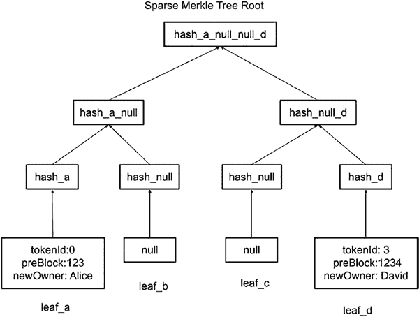

# 第 9 章 第 2 层与以太坊 2

其效率足以实际用于等离子交易。针对同质化与非同质化代币，已有多种更复杂的默克尔树格式被提出。下文将介绍 `Plasma MVP` 与 `Plasma Cash`。

## 9.1 Plasma MVP

`Plasma MVP` 使用标准的默克尔树，该树通过 `UTXO` 记录交易并将根哈希提交至根链。Vitalik 提出了以下用于默克尔树叶节点的未花费交易输出（`UTXO`）格式：

```
[blknum1, txindex1, oindex1, sig1, # Input 1
blknum2, txindex2, oindex2, sig2, # Input 2
newowner1, denom1, # Output 1
newowner2, denom2, # Output 2
fee]
```

该叶节点格式使用两个输入和两个输出。两个输入允许用户合并两个 `UTXO` 以发送至一个地址。两个输出允许用户将部分 `UTXO` 发送给一个用户，并将其余部分发送给另一个用户。在此叶节点格式中，`blknum1`、`txindex1` 和 `oindex1` 分别表示输入 1 的区块编号、交易索引和输出索引。这唯一标识了交易默克尔树的叶节点。`sig1` 用于签名交易，以确保发送者是 `UTXO` 的所有者。类似地，`blknum2`、`txindex2`、`oindex2` 和 `sig2` 表示输入 2 的区块编号、交易索引、输出索引和签名。对于输出，`newowner1` 和 `denom1` 表示分配给新所有者 1 的代币数量。`newowner2` 和 `denom2` 表示分配给新所有者 2 的代币数量。最后，交易中的 `fee` 是为等离子交易支付的代币数量。

使用 `UTXO` 格式的默克尔树节点，交易可以被唯一标识，无需遍历默克尔树来查询其他交易。为了进一步提高查询效率，`blknum`、`txindex` 和 `oindex` 可以合并为一个 `uint256` 整数。

### 9.1.1 UTXO 索引计算

这样，通过以下转换，一个整数即可唯一标识一个 `UTXO` 交易：

```
utxo_index = blknum * 1000000000 + txindex * 10000 + oindex;
```

要从 `utxo_index` 中提取出 `blknum`、`txindex` 和 `oindex`，可使用下列方法：

```
Blknum = utxo_index / 1000000000;
Txindex = (utxo % 1000000000) / 10000;
oindex = utxo_index - blknum * 1000000000 - txindex * 10000;
```

通过使用 `UTXO` 格式，`Plasma MVP` 能够在等离子链上高效地使用 `UTXO` 格式记录同质化代币。用户也可以在根链上提取他们的资产或 `UTXO`。要提交提现请求，只需发送一个 `utxo_index` 以标识 `UTXO` 的位置、交易本身、默克尔根以及签名。智能合约将执行以下操作以将资金分配给根链的新所有者：

- 检查提现请求的发送者是否与 `UTXO` 的所有者相同。
- 确保交易已由发送者签名。
- 验证输出 1 与输出 2 的金额加上交易手续费等于输入 1 与输入 2 的总和。
- 确保发送者的 `UTXO` 尚未被花费。这需要一些时间来确认。

一旦所有有效性检查通过，根链上的等离子智能合约将把根链上的资产分配给新所有者。



## 9.2 Plasma Cash 与非同质化代币

### 9.2.1 用于 Plasma Cash 的交易默克尔树

通过前面提到的 `Plasma MVP`，用户可以通过 `UTXO` 向终端用户发送同质化资产。然而，`Plasma MVP` 并未解决非同质化代币的问题。`UTXO` 虽然包含交易的金额，但不需要唯一 ID。`Plasma Cash` 是 `UTXO` 的一种扩展，其中每个代币都被分配了一个用于记录和转移的序列号。

尽管现金或货币通常被认为是同质化的，但 `Plasma Cash` 实际上最适合处理类似于 `ERC721` 或具有唯一标识性的非同质化资产。

### 9.2.2 稀疏默克尔树结构

为了允许默克尔树处理非同质化代币，提出了一种稀疏默克尔树来确保代币的唯一性。下图（图 9-5）说明了稀疏默克尔树如何为非同质化代币工作。

**图 9-5.** 稀疏默克尔树示例

对于 ERC721 非同质化代币（NFT），存在一个 NFT 标识符来表示 `tokenId`，用以指代代币的索引。这个 `uint32` 类型的 `tokenId` 可以转换为更小尺寸的整数，如 `uint32` 和 `uint64`。

可以构建一棵默克尔树来表示 NFT 的 `tokenId`。在这棵默克尔树结构中，每个代币由一个叶子节点表示。对于大小为 `n` 的 `uint` 类型的 `tokenId`，叶子节点的数量将为 `2^n`。例如，`uint8` 类型的 `tokenId` 将拥有 `2⁸=256` 个叶子节点。同理，`uint16`、`uint32` 和 `uint64` 的叶子数量分别为 65536、4294967296 和 18446744073709551616。

叶子节点的位置等同于 `tokenId`。从左到右的叶子索引排列范围为 0 到 `(2^n-1)`。叶子节点的内容是一个 `byte32` 数据，即 NFT 代币交易的哈希值。Plasma 交易格式是一个元组 `(slot, previousBlock, denomination, owner, hash)`。其中，`slot` 与表示叶子节点索引的 `tokenId` 相同；`previousBlock` 是包含该 `tokenId` 所有者转账记录的区块编号；`denomination` 在 NFT 场景下默认为 1；`owner` 是本次代币转账的新所有者；而 `hash` 则是对其他参数进行 `sha256` 或 `keccak256` 哈希运算的结果。计算得到哈希值后，该值将被插入到 `slot` 或 `tokenId` 对应位置的叶子节点中。

对于从 0 到 `2^n-1` 的 `tokenId` 范围，从根节点到叶子节点需要 `n` 层节点。如果将叶子节点标记为第 0 层，那么根节点将位于第 `n-1` 层。对于大小为 `uint16` 的 `tokenId`，将有 16 层；而 `uint64` 则有 64 层。

### 9.2.3 初始化与哈希计算

默克尔树可以初始化为一棵空默克尔树，其中所有叶子节点均为空值的哈希。

对于第 0 层，节点的哈希内容为`hash_null = H(null) = sha256(null) = e3b0c44298fc1c149afbf4c8996fb92427ae41e4649b934ca495991b7852b855`。

第 1 层 `hash_null_null = H(H(null), H(null))`

第 2 层 `hash` 为 `hash_null_null_null_null = H(H(H(null), H(null)), H(H(null), H(null)))`

以此类推，直到达到默克尔树的根节点。

此处，`H(x)` 是一个哈希函数，如 `sha256` 或 `keccak256`，它接收一个字符串作为输入并生成一个 `bytes32` 哈希值。`H(x, y)` 则是一个函数，用于将 `x` 和 `y` 打包后再计算其哈希值。

这些预计算的值可用于证明计算，以提高效率。

当发生一笔交易时，将计算出一个 `bytes32` 哈希值并存储在一个叶子节点中。相应地，该叶子节点的所有父节点都将更新，直至默克尔树的根节点。如果一棵默克尔树有 `n` 层，每次更新叶子节点将触发 `n-1` 次父节点更新。

### 9.2.4 稀疏性与存储

每个区块都将拥有一棵默克尔树。由于每个区块的交易数量远小于可能的 `tokenId` 数量，默克尔树将呈现稀疏填充状态。大部分节点将为 null。从叶子节点到根节点的路径上的父节点将沿用前述表格中计算的默认值，这些值可以用一个比特位来表示，而非完整的 32 字节哈希。交易涉及的节点在默克尔树中分散分布的特性，使得这种存储结构得名为 **稀疏默克尔树**。

与 `Plasma MVP` 不同，`Plasma Cash` 的证明使用两个列表：一个是针对空值或其父节点预计算哈希的简化比特列表；另一个是拼接而成的 `bytes32` 哈希列表。使用比特列表的原因是为了节省存储空间和计算开销，因为大多数节点未被修改且拥有预定义值。

为 `Plasma Cash` 的叶子节点提供证明的机制与 `Plasma MVP` 不同。在 MVP 默克尔树中，证明是一个节点哈希列表，可用于与叶子节点一起计算得出根节点哈希。它通常是目标叶子节点或其父节点的兄弟节点哈希拼接而成的列表。而对于 `Plasma Cash`，由于