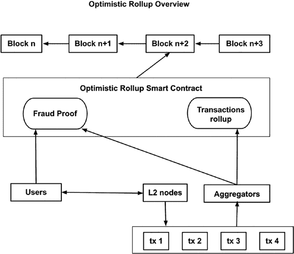
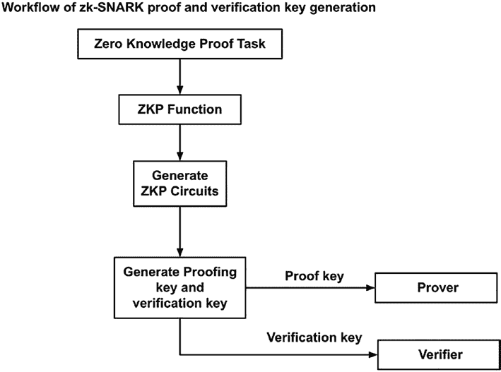
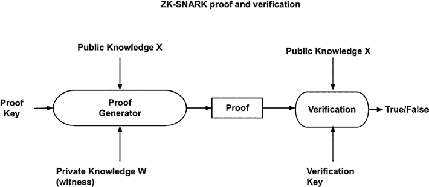

# 第九章 二层网络与以太坊 2.0

以确保交易的有效性。在这段等待期内，乐观汇总智能合约允许第三方提供欺诈证明，以判定某个汇总无效并索取奖励代币。奖励给欺诈证明者的代币来自聚合器存入的汇总交易押金。如果某个聚合器提供了有效的欺诈证明，该聚合器存入的押金将被没收。



***图 9-6.** 乐观汇总概览*

由于乐观汇总依赖欺诈证明来确保二层网络的交易被正确传播至一层网络，因此汇总交易在一层网络最终确认会存在数天至一周的开销。这意味着，用户若要申领一层网络上的资产，需等待最多一周时间，以清除所有针对这些汇总提出的质疑。这是乐观汇总的一个瓶颈。为克服欺诈证明机制的局限性，人们提出了有效性证明方法，允许交易使用汇总证明来证明其有效性。

下文将介绍用于有效性证明汇总的 `zk-SNARK`（零知识简洁非交互式知识论证）。

##### zk-SNARK 二层网络

`zk-SNARK` 是一种二层网络汇总扩容解决方案，它利用零知识证明来确保从二层网络到一层网络的汇总交易始终处于有效状态。零知识证明是一种技术，允许一方在不透露处理了什么信息以及如何得出结论的情况下证明某个陈述为真。`zk-SNARK` 代表零知识简洁非交互式知识论证。`zk-SNARK` 是一种特殊的零知识证明，其机制具有以下特点：

- **简洁性（Succinct）** – 证明简短且易于验证。这最适合链上验证，因为在以太坊及其他网络中，Gas 费用高昂，且许多节点都需要验证同一陈述。
- **非交互性（Non-interactive）** – 生成和验证证明无需用户手动干预。链下应用可以编程生成证明，链上智能合约可以验证证明。
- **知识论证（Argument of Knowledge）** – 指陈述可以通过零知识证明系统得到确认或证伪。通信双方无需披露私密信息和知识，即可获得对方的知识。

零知识证明被视为无隐私知识泄露的证明。这意味着一个人可以在不透露所掌握知识的情况下证明自己拥有该知识。通常，为了说服别人你知道某件事，你不得不透露该知识。零知识证明是一种增强隐私的加密计算方法，能够确凿地证明一个陈述为真，同时不泄露该陈述本身。



示例：Alice 想向 Bob 展示她知道如何计算平方根。如果测试只是提供输入和输出，例如 `input=16` 和 `output=4`，第三方就会知道这涉及平方根。如果输入和输出被哈希处理，那么第三方将不知道使用了平方根的规则。

零知识证明可用于隐私计算和二层网络汇总。借助如 `zk-SNARK` 之类的零知识证明，一层网络与二层网络之间的汇总交易可以在无需第三方质疑的情况下得到验证。在下图（图 9-7）中，我们解释了 `zk-SNARK` 如何应用于二层网络汇总解决方案：

***图 9-7.** zk-SNARK 工作流程*

要使用零知识证明，首先需要定义任务。这可以是证明某人的年龄超过某个值、某人拥有密码、某个交易是用私钥签名的、默克尔树中的交易全部有效等等。然后需要定义变量，并编写函数以确保满足证明条件。例如，


前述任务所需的函数如下：

```
// 定义一个函数，用于检查年龄是否超过特定阈值，例如
// 饮酒年龄
function proveAge(private age) {
    const Drinking_Age = 21;
    require (age >= Drinking_Age);
}

// 定义一个函数，用于检查某人是否拥有密码，通过
// 验证密码的哈希值是否与已知值匹配
function provePassword(private string password, public bytes32 hash) {
    bytes32 password_hash_calculated = sha256(password);
    require( password_hash == password_hash_calculated);
}
```

一旦知识陈述函数被定义，就需要对其进行简化或归约，以满足零知识证明的格式要求。这是因为零知识证明有一些约束，例如不泄露任何私有变量且必须是无状态的。实现这一目标有多种方法。其中一种方法是重写函数，使其符合 `R1CS`（秩一约束系统）格式。这需要通过使用电路模型来编写函数实现。`R1CS` 定义完成后，再使用 `QAP`（二次算术程序）来表示知识陈述。利用 `QAP`，系统可以生成一个证明密钥和一个验证密钥。证明密钥交给证明者，验证密钥交给验证者。



