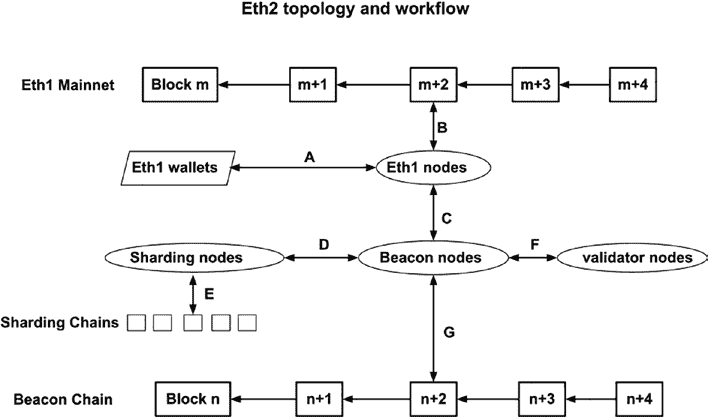

# 第九章 第二层与以太坊 2

- 设计一个 `zk-SNARK`，首要任务是定义一个证明任务。此任务即定义一个函数来验证某个陈述。
- 随后，将定义好的验证函数进行扁平化处理，并归约成多个算术运算步骤。这些算术运算有时被称为零知识电路。电路可以接收私有和公共输入，并生成相应的输出。
- 一旦算术电路被定义，就可以通过一个设置过程生成证明密钥和验证密钥。证明密钥交给证明者，验证密钥交给验证者。验证者可以是一个智能合约。
- 证明者可以在链下使用证明密钥进行计算，并生成一个证明。
- 然后将该证明和公共数据发送给一个验证智能合约进行验证。

`zk-SNARK` 目前仍在开发中，可以预见，更多研究将催生出适用于第二层汇总的、更优的 `zk-SNARK` 机制。

#### 以太坊 2

### 以太坊 2 的主要变化

以太坊 2 和第二层都是为了解决以太坊主网的可扩展性问题并提高能源效率而开发的。事实上，第二层解决方案有时会被戏称为以太坊 1.5。以太坊 2 是对以太坊 1 的一项前景广阔的网络升级，其包含以下新的组件和特性。

##### 从 POW 转向 POS

与工作量证明（`POW`）共识机制相比，权益证明（`POS`）机制具有能效高、可扩展性更强、激励更优以及出块时间更短等优势。`POS` 允许一个系统拥有额外的计算能力来执行诸如托管多个质押账户或运行服务以连接信标链或侧链等额外工作。


##### 以太坊 2.0 架构概览

##### 信标链

以太坊信标链是一条关键的权益证明区块链，它连接着质押者与分片。质押者来自以太坊 1.0 主网账户，他们将其以太资产发送到一个质押智能合约，以参与信标链的区块生成。分片则是存储和计算类的区块链，它们扩展了 `EVM` 的功能以及主网的状态存储。

##### 分片

分片是以太坊区块链的一种全新架构，它允许多条区块链组成的层级结构独立处理交易，然后将区块哈希值汇总到其父分片，并最终将哈希值存储到信标链上。分片使得一组区块链能够同时处理交易和执行智能合约，从而显著提升了以太坊 1.0 主网的可扩展性。

##### 以太坊 2.0 架构概览

以太坊 2.0 是以太坊 1.0 的扩展，新增了信标链和分片链。下图（图 9-9）展示了以太坊 2.0 的架构概览。



**图 9-9.** *以太坊 2.0 拓扑结构与工作流程*

以太坊 2.0 包含三条区块链，其中包括原有的以太坊主网。以太坊主网为以太坊 2.0 的权益证明机制提供质押资产。信标链是一条基于权益证明的区块链，它记录质押信息、生成随机数、提议验证者，并与分片链连接以记录分片链的数据和交易默克尔树。此外，还存在多条分片链，用于存储以太坊 2.0 的数据，执行 `EVM` 计算并处理交易。

针对上述以太坊 2.0 的三种区块链，为了生成和验证区块，我们需要提及四种类型的客户端节点。第一种是以太坊 1.0 客户端节点，例如为以太坊 1.0 主网生成区块的 `geth` 客户端。第二种是信标节点，它们为信标链提议区块。第三种是信标链的验证节点。验证器节点将通过信标链节点来生成或验证信标链区块。第四种是分片节点，负责分片链的区块生成。

上述区块链节点通过点对点协议或 `RPC` 协议相互连接和通信。图中若干交互/边被标记为 A、B、C、D、E、F 和 G。

边 A 是账户所有者钱包与以太坊 1.0 节点之间的交互。该交互允许用户在钱包中构建并签署交易，然后将签名后的交易发送给以太坊 1.0 客户端节点。客户端节点随后验证交易并将其打包成一个新区块。在图中，钱包仅连接到一个以太坊 1.0 节点，因为目前还没有能够与信标链交互的以太坊 2.0 钱包。

边 B 代表以太坊 1.0 客户端节点查看以太坊 1.0 主网区块和交易，或将区块写入区块链。在以太坊 2.0 的背景下，交互 B 主要用于质押者将资产质押到部署在以太坊 1.0 主网上的以太坊 2.0 质押智能合约。一旦资产作为质押物被存入，智能合约函数将触发一个事件，以显示质押地址和金额。

边 C 是以太坊 1.0 客户端节点与信标节点之间的交互。以太坊 1.0 区块链中的质押信息应对信标节点可见。信标节点使用 `RPC` 连接客户端节点，并获取由质押智能合约触发的所有事件。当从以太坊主网检索到新的质押信息时，信标节点会生成一个区块来记录该新质押信息。

边 D 用于信标节点与分片节点之间的交互。边 E 用于分片节点为分片链提议区块。分片节点负责执行数据存储和


##### 交易处理

边 F 表示验证节点与信标节点之间的交互与通信。权益证明（POS）矿工需要运行客户端节点，从信标链请求任务、打包交易、验证区块并提议区块。以太坊 2 架构将信标节点与验证节点分离。信标节点负责管理通信以及时代（epoch）、时段（slot）、随机数生成和验证节点选举等工作。验证节点负责处理交易和区块。矿工特定信息（如矿工资质凭证）仅存储在验证节点中，而不在信标节点中。信标节点与矿工节点之间的通信通过`RPC`协议进行。

边 G 表示信标节点向信标链提议信标区块。每个信标节点将与信标链同步，管理质押者注册表，将验证节点组织成委员会，管理时代和时段，生成随机数，分配验证节点角色，并向信标链提议新区块。

从以太坊 2 的架构拓扑和交互来看，以太坊 1 主网仍然是以太坊 2 的重要组成部分。POS 的质押能力来源于资产所有者指定参与以太坊 2 POS 共识的资产。理解以太坊 1 向以太坊 2 迁移的过程至关重要。

## 从以太坊 1 迁移到以太坊 2：POS

### 存款、质押与罚没

从以太坊 1 到以太坊 2 的迁移采用分阶段方式。以太坊 2 的第一阶段是构建基于权益证明共识的信标链。下文提及质押以太坊 1 资产以迁移至以太坊 2 的一些重要概念和步骤。

权益证明的资产通过存款智能合约存入以太坊 1 主网。以下是存款合约接口的代码片段。

```solidity
// 存款合约接口基于以下以太坊 2 规范：
// https://github.com/ethereum/eth2.0-specs

interface IDepositContract {
    /// @notice 已处理的存款事件。
    event DepositEvent(
        bytes pubkey,
        bytes withdrawal_credentials,
        bytes amount,
        bytes signature,
        bytes index
    );

    /// @notice 提交阶段 0 的 DepositData 对象。
    /// @param pubkey BLS12-381 公钥。
    /// @param withdrawal_credentials 提现公钥的承诺。
    /// @param signature BLS12-381 签名。
    /// @param deposit_data_root 经过 SSZ 编码的 DepositData 对象的 SHA-256 哈希值。
    /// 用于防止格式错误的输入。
    function deposit(
        bytes calldata pubkey,
        bytes calldata withdrawal_credentials,
        bytes calldata signature,
        bytes32 deposit_data_root
    ) external payable;

    /// @notice 查询当前存款根哈希。
    /// @return 存款根哈希。
    function get_deposit_root() external view returns (bytes32);

    /// @notice 查询当前存款计数。
    /// @return 以小端序 64 位数字编码的存款计数。
    function get_deposit_count() external view returns (bytes memory);
}
```

存款智能合约使用稀疏默克尔树存储质押存款记录，并通过存款事件通知信标节点等外部程序。该智能合约支持的主要功能包括`deposit()`、`get_deposit_root()`和`get_deposit_count()`。用户在进行质押存款时，需提供公钥、提现凭证、所有者签名和存款数据根哈希等信息。存款金额包含在`msg.value`中，因此不是函数参数。存款 ID 会自动递增，无需提供。

向存款智能合约存入资产时，需牢记一个关键点：以太坊 1 的公钥/私钥对曲线已被替换为功能更丰富的`BLS12-381`曲线。


2  个密钥对需要通过一个新工具生成，该工具会提供一个 24 词的助记词短语。与以太坊 1 不同，以太坊 2 的账户同时拥有提款密钥和验证者密钥。一组助记词短语可以生成多个提款公钥，而一个提款密钥可以派生出多个验证者密钥。

## 通过权益证明质押运行以太坊 2 验证者节点

运行验证者节点将从以太坊 2 区块链获得奖励。与比特币或以太坊挖矿不同，以太坊 2 基于权益证明，因此，只要节点在线且正常运行，所有节点都能获得奖励。以以太币价值计算，奖励回报率约为年化 3–8%。以下是搭建以太坊 2 挖矿节点的主要步骤。

首先，以太坊 2 依赖于以太坊 1。因此，仍然需要一个以太坊 1 节点。这个节点可以用 `geth` 搭建，也可以是一个拥有静态 IP 的稳定公共节点。

其次，用户需要分配质押资金。运行一个验证者节点至少需要 32 个以太币。用户还需要考虑，如果他们的节点离线，将会受到惩罚，导致质押余额减少。

第三，用户需要准备一个存款账户。有一个存款工具可以用于生成助记词短语，并派生出提款密钥和验证者密钥。这些密钥极其重要，必须妥善保管。如果助记词短语和提款密钥丢失，那么为以太坊 2 锁定的以太币也将丢失。

第四，下载并运行信标节点和验证者节点。有多家供应商提供运行信标节点和验证者节点的软件包。

最后，使用脚本或第三方工具将资产存入存款合约。存款事件会被信标节点检测到。存款会处于待处理状态一段时间，然后变为激活状态。

一个需要考虑的重要因素是，与工作量证明共识不同，权益证明机制会对验证者施加惩罚。以太坊信标链对验证者实施两种惩罚。一种是怠惰惩罚，用于惩罚离线或不提出/证明区块的验证者节点。另一种是罚没，用于惩罚构建或证明恶意区块的验证者。建议验证者运行监控程序，以确保其节点积极且正确地运行。

目前已经开发了许多工具和解决方案。用户可以查看以太坊 2 网站，了解推荐的工具。

##### 以太坊 2 的不确定性

尽管以太坊 2 被认为是以太坊主网可扩展性解决方案的一个有前途的方案，但该项目仍存在一些不确定性。例如，分片链仍未最终确定。关于分片在安全性和质押经济方面有很多争论。建议读者对以太坊 2 的路线图、实现和部署保持开放的态度。

## 总结

在本章中，我们解释了几种第 2 层可扩展性解决方案，包括状态通道、Plasma、Rollups 以及以太坊 2 技术。每种技术都有其优缺点。在设计去中心化应用时，考虑应用的使用模式并选择最可行的技术来扩展解决方案至关重要。

## 第 10 章 为项目提供资金：代币与燃料费

#### 引言

在前面的章节中，我们讨论了智能合约编码、开发和部署的技术层面，以及区块链安全性和可扩展性。在本章中，我们将从智能合约的业务和技术两方面讨论如何为项目提供资金。

以太坊已经实现了几个与项目融资相关的里程碑，例如首次代币发行（ICO）、非同质化代币（NFT）、去中心化金融（DeFi）和去中心化自治组织（DAO）。可以预见，证券型代币发行（STO）、中央银行数字货币（CBDC）以及其他去中心化


