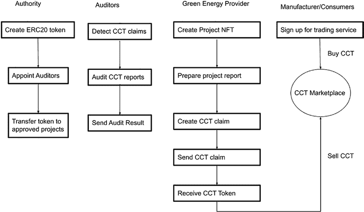

# 第 10 章 资助项目：代币与 Gas 费

NFT 代币可用于许多领域。已经有许多项目为 NFT 艺术品和收藏品提供市场。诸如`OpenSea`和`Decentraland`等项目在 NFT 市场中很受欢迎。

## DeFi 中的代币（Compound、Uniswap 和稳定币）

在[第 1 章](https://doi.org/10.1007/978-1-4842-8164-2_1)中，提到了几个 DeFi 项目，例如去中心化借贷平台、去中心化交易所和稳定币。所有 DeFi 项目都使用一个或多个 ERC20 代币作为资产代币或治理代币。下面，我们举几个例子。

`Compound`是一个去中心化借贷平台项目，允许用户无需通过银行等中介机构即可借出或借入加密货币。贷方可以将其资产代币发送到`Compound`智能合约，并接收`cTokens`，用以代表存入借贷池的资产数量。`cTokens`可以赚取利息，也可以进行交易。借款人可以从`Compound`协议中借入加密货币。为了借入加密资产，借款人需要提供其他加密资产作为抵押品。抵押品计算基于代币价格馈送和已发布的公式。如果借入的资产无法偿还，且抵押品价值低于确保借款余额安全的阈值，则可以根据智能合约中编写的规则清算抵押品。

`cTokens`代表在借贷协议中提供的加密资产。此外，`Compound`还发行了一种名为`COMP`的治理代币。通过在借贷协议中提供或借出资产可以获得`COMP`。`COMP`代币可用于对提案进行投票。所有`cTokens`和`COMP`代币都是 ERC20 代币。

`Uniswap`是一个使用自动做市商（AMM）机制的去中心化交易所平台。不同用户可以在不依赖中心化交易所的情况下交易其加密资产。`Uniswap`流动性提供者为流动性池提供成对的加密资产作为交易对。然后，交易者使用流动性池中的资产进行交易。

针对`Uniswap`和其他类似的去中心化交易所平台，设计了两种代币。第一种代币称为流动性提供者（LP）代币，它代表供应商对流动性池的贡献。LP 代币是一种 ERC20 代币，特定于某个交易对。每个交易对都有自己的 LP 代币。另一种`Uniswap`代币是`UNI`代币，它也是一种 ERC20 代币。`UNI`代币是一种治理代币，可用于在`Uniswap`生态系统内对提案进行投票。

像`DAI`、`USDT`和`USDC`这样的稳定币都是 ERC20 格式的代币，可以进行交易或转账。在 ERC20 格式之上，还构建了基于供需自动铸造和销毁等附加功能，以保持其价值稳定。稳定币的价值可以通过几种机制保持稳定，例如法币抵押、加密货币抵押或算法机制。

尽管大多数 DeFi 代币都是 ERC20 代币，但它们并不完全相同，因为每个 DeFi 都在标准 ERC20 代币之上构建了附加功能。DeFi 项目都是开源的，其代币代码可以在公共源代码仓库中查看和审查。

## 企业级/标准化（普适）代币

ICO 由一种 ERC20 代币支持，这使得代币能够在以太坊生态系统中实现可编程、可分发和可交易。

ERC20 代币是一种同质化代币，各个代币之间无法区分。NFT 里程碑由 ERC721 赋予能力，该标准允许代币具有唯一性、可追溯性、可交换性和可交易性。STO 由 ERC1400 赋予能力，该标准允许所有者拥有实体资产的一部分。代币与去中心化应用密不可分。

## 第 10 章 为项目融资：代币与 Gas 费

公共区块链中的代币是开放、无需许可的，旨在进行大规模分发。对于企业而言，需要一种更加结构化和正式的代币框架，这种代币可以跨不同的私有区块链进行传播，并且易于设计和定制。

企业代币在多个领域具有潜在用途，包括以下方面：

**供应链代币**

在供应链中，资产可以对应零件、库存、订单、发货、贷款和提单。所有这些资产都可以被代币化并记录在区块链中。对这些资产的操作可以建模为区块链中的交易。IBM、FedEx、微软和埃森哲等企业都在构建区块链解决方案，以帮助解决供应链问题，从而提高效率、增强可追溯性并最大化透明度。供应链中使用的代币类型比 DeFi 中常用的 `ERC20` 或 `ERC721` 更广泛。在供应链系统中，所有可识别的物品都可以被代币化并记录在区块链中。

**行业特定代币**

代币可以扩展为代表所有可识别的物品，并可用于所有行业中，代表物理、数字或虚拟资产。例如，在可再生能源领域，太阳能或风能发电可以被代币化并进行交易。下面我们描述如何使用碳信用代币来表征和代币化二氧化碳排放，以及这些信用额度如何在市场上进行交易（图 [10-1] (#index_split_006.html#p399)）。

***图 10-1.* 碳信用代币（CCT）概述**

为了建立碳信用市场，相关机构首先需要铸造并发行一个 ERC20 代币来代表二氧化碳减排量。碳信用机构首先创建一个`Carbon Credit Token`（`CCT`），使用诸如“United Groups’ Carbon Credit”这样的名称、`CCT`符号以及二氧化碳减排总量。初始碳信用额度由机构账户铸造并拥有。只有该机构拥有转移或授予碳信用额度的特权。

为了管理碳信用额度，机构将指定审计员来审查和审计来自绿色能源供应商的请求，以决定这些申请是否可以被批准。如果申请获得批准，将会触发一个事件，显示项目 ID 和信用额度数量。

为了申请碳信用额度，绿色能源供应商将首先创建一个 NFT 代币来表示该项目。这个 NFT 代币是唯一的，并指向项目记录。项目团队随后提交一份申请，其中包含二氧化碳减排量和所请求的碳信用额度的信息。与该项目相关的 NFT 还将拥有一个统一资源定位符，指向记录该项目所有相关文档和报告的外部来源。一旦这些数据被写入区块链，就会触发一个 Claim 事件，通知审计员去审计申请中的信息。在申请被审计和批准后，机构会将碳信用额度转移到绿色能源供应商的账户。然后，供应商可以将 CCT 资产发送到碳信用市场进行交易。

在消费端，需要碳信用额度以满足配额的生产商或消费者将从市场购买碳信用额度。为购买 CCT 资产而支付给绿色能源供应商的加密货币，可用于扩大绿色能源供应商的工作，以生产更多的可再生能源。

如需查看碳信用项目示例，请参阅以下仓库：

[`github.com/masaun/tokenized-carbon-credit-marketplace/`](https://github.com/masaun/tokenized-carbon-credit-marketplace/blob/main/smart-contract/contracts/GreenNFT.sol)

[`blob/main/smart-contract/contracts/GreenNFT.sol`](https://github.com/masaun/tokenized-carbon-credit-marketplace/blob/main/smart-contract/contracts/GreenNFT.sol)

**代币分类学倡议**

碳信用代币、太阳能代币、电力代币、零部件代币、系统代币和水资源代币均可归类为企业代币，并可使用更正式的定义进行设计。企业以太坊联盟和互联工作联盟等组织一直致力于**代币分类学倡议**（Token Taxonomy Initiative, TTI），以开发一套可形式化并用于对复杂企业用例中所有可识别资产进行代币化处理的代币框架。

代币分类的基础设施与框架具有以下目标及关键特性：

-   区块链无关性，即不依赖于针对不同区块链的`Solidity`、`Haskell`、`WASM`或`Java`编程语言
-   业务人员和技术专业人士均能理解
-   既可描述也可编程
-   适用于企业和公共区块链的广泛使用场景
-   力求易用性、改善互操作性、简化沟通，并实现更快、更安全的开发

下图（图 10-2）展示了代币分类的层级结构。与在规范中定义并编码为智能合约的`ERC20`和`ERC721`不同，代币分类框架（Token Taxonomy Framework, TTF）将代币分为三个层级。第一层是模板层，用于定义代币的属性、公式和行为。代币模板可以是通用的，例如积分代币模板或库存代币模板。第二层是类层，为模板分配参数以创建代币类别。例如，积分代币模板可应用航空公司积分或酒店积分参数，从而创建航空公司积分代币类或酒店积分代币类。代币类随后可实例化为具体实例，例如达美航空或美国航空的航空公司积分代币。

***图 10-2.** 代币分类示例*

在将本框架用于以太坊智能合约时，模板层类似于`ERC20`或`ERC721`规范。类层将`ERC20`智能合约扩展为航空公司积分代币或酒店代币。实例层则在部署期间通过代币智能合约的构造函数构造出具体的代币。

`TTF`还为一个形式化的代币定义了若干基本属性，包括：

**代币单位** —— 代币的单位，可为`Fractional`（可分割）、`Whole`（整体）或`Singleton`（单一）。
`Fractional`意味着该代币可被分割为更小的单位。
`Whole`意味着该代币不可分割，但可以存在多份复制。
`Singleton`意味着该代币不可分割，且数量为`1`。

**价值类型** —— 如果代币本身具有价值，其价值类型为`Intrinsic`（内在型）。如果代币代表某个具有价值的实物或数字物品，其价值类型为`Reference`（引用型）。

**表示类型** —— 没有个体身份的代币称为同质化代币。拥有索引或序列号的代币称为非同质化代币。

**模板类型** —— 模板描述了代币的基本特征。原始代币如`ERC20`或`ERC721`是单一代币。可以通过扩展基本代币来创建更复杂的代币。混合代币可以同时拥有一个父代币以及多个不同类型的子代币。

除了上述基本属性外，`TTF`中定义的代币还可以具有行为属性，使其可铸造、可转移和可销毁。

