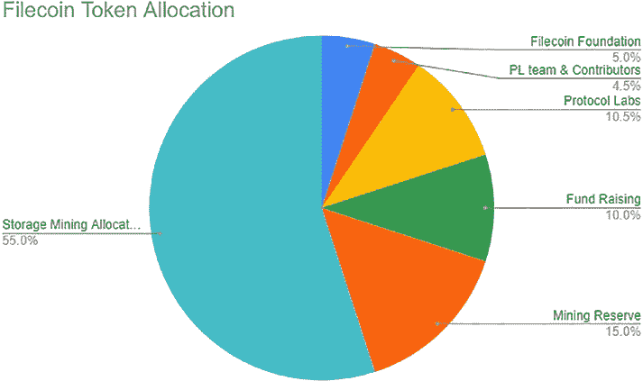

# 可转移性、可铸造性与可销毁性

`可转移性`是指转移代币所有权的功能。`ERC20`和`ERC721`代币均具备可转移性。

`可铸造性`是指发行同类新代币的功能。为毕业生创建新文凭就是铸造的一个示例。

`可销毁性`是指从流通总量中移除代币的功能。某些项目可以销毁项目代币，以减少代币流通总量。

从框架角度来看，`TTI`可能显得有些抽象。但实际上，它在构建通用工具（例如通过支持拖放功能的`GUI`来创建代币的代币设计器）时非常有用。开发者或用户无需为代币编写智能合约代码。当用户通过文本或`GUI`工具定义代币时，代码将自动生成。`TTI`的工作仍在进行中，目前尚未被接受为标准。

## 代币经济考量

### 代币分配

当设计并提出奖励代币时，需要将其授予对项目有所贡献的人员。通常需要考虑项目团队、资助者和社区等利益相关方。例如，`Filecoin`项目是一个基于区块链的去中心化存储网络。该项目团队在`IPFS`协议之上构建了持久化存储服务，允许数据用户使用`Filecoin`激励矿工提供长期数据存储和可用性。`Filecoin`代币被设计为同质化代币，采用如下饼图（图[10-3]）所示的比例进行分配。

**图 10-3.** `Filecoin`代币分配

对于`Filecoin`项目，创建的代币最大数量为 200 亿枚。其中 5%的代币分配给`Filecoin`基金会，用于促进`Filecoin`网络的治理、资助关键开发项目、支持`Filecoin`生态系统的发展，并推广`Filecoin`及去中心化网络。另有 4.5%的代币分配给`Protocol Labs`团队及贡献者，10.5%分配给`Protocol Labs`公司。`Filecoin`项目将 10%的代币用于募资。大多数代币分配给矿工，用于支持存储挖矿奖励、区块奖励以及其他运营（如水龙头和存储激励）。最后 15%的代币保留用于未来挖矿服务及奖励。

### 代币分发

一旦代币分配完毕，就有多种方式将代币分发给接收者，如下方图[10-4]所示：

**图 10-4.** 代币分发方式

## Gas 费考量

在资助一个项目时，需要考虑众多因素。以太坊区块链通过 gas 经济实现了可持续性，每笔交易均由发送方向区块链矿工支付费用。如果项目正在构建一条新区块链，则应全面考量 gas 费用机制，以确保网络系统可持续。对于构建去中心化应用的项目，应审视 gas 消耗成本，确保高昂的交易 gas 费用不会成为应用发展的障碍。接下来，我们将讨论以太坊 gas 的工作原理，以及在智能合约开发中是否存在降低 gas 费用的方法。

### 什么是以太坊 Gas？

在以太坊区块链中，gas 可被视为执行交易的成本，或为区块链生态系统提供动力的机制。当一笔交易发送至区块链时，需要指定并向矿工支付少量以太币，以便以太坊区块链节点将交易纳入区块。gas 费用越高，挖矿节点包含该交易的可能性就越大。