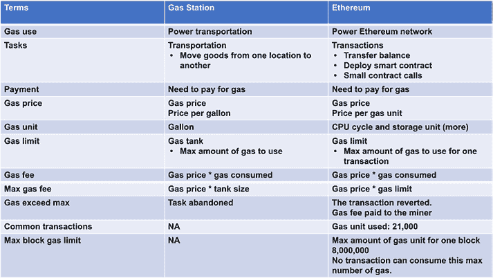

# 除奖励矿工外，Gas 机制还能提高网络攻击成本

除奖励矿工外，Gas 机制还能提高恶意用户发起网络攻击的成本。在公有区块链中，任何人都可以访问网络并向矿工发送交易。如果没有适当的 Gas 费用，大量交易可能会涌入网络，造成拥堵问题，甚至导致网络瘫痪。Gas 费用是一种设计精妙的机制，用于维持网络的可持续性并平衡去中心化应用生态系统。

##### 通过加油站类比理解以太坊 Gas

以太坊中的 Gas 是一个复杂的概念，难以把握其含义及其对区块链网络和应用生态系统的影响。本节将通过加油站类比帮助读者更好地理解以太坊中的 Gas 使用（图 10-5）。

**图 10-5.** 加油站类比

交通中的 Gas 用作燃料，驱动车辆将人员和货物从一个地方运送到另一个地方。而以太坊中的 Gas 则用于驱动以太坊网络，使其更安全、更少拥堵，并激励区块链矿工。以太坊中的 Gas 用于支付资产转移、部署智能合约或调用智能合约函数。

在加油站中，油价通常以美元/加仑标示；而在以太坊中，Gas 价格也用于指代 Gas 的单价。Gas 价格的概念并非那么直观。以太坊中 Gas 价格的单位是每单位 Gas 的`wei`，其中`wei`是以太坊的最小单位。一个以太币等于`10`的`18 wei`次方。Gas 单位指的是以太坊中的挖矿成本，在以太坊黄皮书的 Gas 成本表中手动定义。例如，加法操作的 Gas 成本为`3`，乘法操作的 Gas 成本为`5`。总的 Gas 费用等于 Gas 价格乘以消耗的 Gas 量。

在以太坊的 Gas 机制中，还存在 Gas 限额的概念。这是单笔交易可消耗的最大 Gas 量。设置 Gas 限额的目的是为了保护发送方账户。如果没有设置 Gas 限额，智能合约有时可能进入计算循环，耗尽整个账户余额。对汽车而言，Gas 限额就是油箱容量。当设置了 Gas 限额，且 Gas 消耗超过该限额时，交易将被标记为失败，状态将回滚到原始状态。

交易分为两种：第一种是简单的资产转移，将资产从一个账户转移到另一个账户。这类资产转移将消耗`21,000 Gwei`的 Gas。第二种交易类型是智能合约调用，其 Gas 消耗量远高于普通资产转移。

此外，对于以太坊区块链，还存在一个最大区块 Gas 限额。这是一个区块中所有交易的 Gas 总量限制。

最后，此处消耗的 Gas 单位是`wei`。通常，实际成本以美元衡量，将消耗的 Gas 量乘以以太币价格即可得到法币成本。

##### 量化智能合约程序中的 Gas 费用

当去中心化应用部署时，用户面临的最大成本之一就是 Gas 费用。以太坊主网交易的 Gas 费用一直在飙升，有时单笔交易甚至超过 200 美元。因此，项目的可行性研究需要包含 Gas 费用分析，以评估项目在财务上是否可持续。

例如，有人提出使用区块链构建去中心化音乐服务。量化分析有助于确定存储音乐数据（包括音乐比特和元数据）的成本可行性。

---

*第 10 章 项目融资：代币与 Gas 费用*

