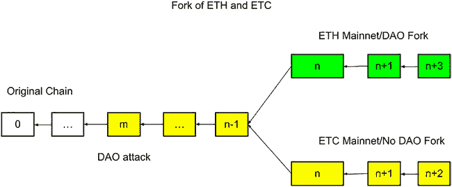
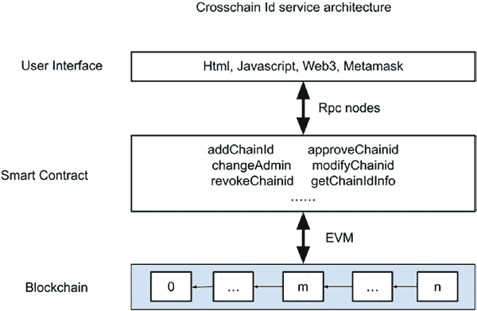
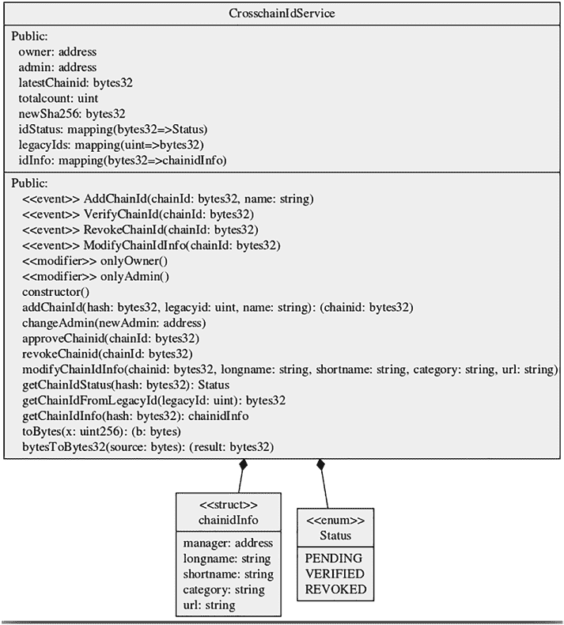

# 第 10 章 资助项目：代币与 Gas 费

如第 7 章所述，Solidity 智能合约被编译成字节码，然后部署到区块链上并执行。每条字节码指令包含一个操作码（`opcode`）和操作数（`operands`）。各种操作码的 Gas 成本在以太坊黄皮书中列出，并在 EIP 中新增了一些操作码和修改。以下是各类操作码的 Gas 成本总结（图 10-6）。

**图 10-6.** 各类操作码的 Gas 成本

**图 10-6.**（续）

从 Gas 成本表中可以看出，算术运算（如加法、减法、乘法、除法）以及逻辑运算（如`AND`/`OR`）的 Gas 成本仅为 2 到 5 个单位，可视为低 Gas 费操作。环境操作（如获取发送者地址、以太币值和区块编号）同样是低 Gas 操作，仅消耗 2 个 Gas 单位。内存操作则更为复杂。对单个 256 位字的操作，加载（`MLOAD`）成本为 2，存储（`MSTORE`）成本为 3。然而，内存存储还会产生额外的内存扩展成本。当存储更多数据时，会涉及内存成本。内存存储操作的成本并非线性，我们将在下表中进一步说明。

最昂贵的操作码操作是向区块链存储数据。向区块链存储数据时，非零值的每个字成本为 20,000 Gas 单位，零值则为 5,000 Gas 单位。从区块链加载数据的成本为每字 200 Gas 单位。

表中还定义了与程序计数器相关的操作，如`JUMP`、`JUMPI`、`PC`和`JUMPDEST`，它们分别消耗 1 到 10 个 Gas 单位。

停止程序操作的 Gas 成本差异很大。操作码`STOP`或`RETURN`用于停止函数的执行。`RETURN`操作码还会将输出数据返回给调用函数。这两个操作码都不消耗 Gas。

`REVERT`是一种在遇到问题时必须撤销对区块链所有更改的操作。分配给交易但未使用的剩余 Gas 将返还给发送者。`SELFDESTRUCT`操作停止执行并注册一个账户以供后续使用。此操作码至少消耗 5000 Gas 单位。

上表显示了操作码和字负载级别的 Gas 成本。对于存储操作，成本并非一定是线性的。例如，对于内存存储操作，存在额外的内存扩展成本。`MSTORE`和`MSTORE8`的总成本定义为内存扩展成本与静态存储操作成本之和，如下所示：

```
gas_cost_operation = (new_mem_size_words ^ 2 // 512) + (3 * new_mem_size_words)
```

下表（图 10-7）显示了栈、内存和持久化存储在字、千字节和兆字节数据大小下的存储成本。

**图 10-7.** 各类别和大小的存储 Gas 成本

对于栈操作，没有额外的内存扩展成本。`POP`、`PUSHX`、`DUPX`和`SWAPX`每个字的 Gas 成本分别定义为 2、3、3 和 3。在以太坊中，一个字的长度为 256 位（即 32 字节）。由于 1 千字节等于 32 个字（1024 字节/32 字节），因此每千字节的 Gas 成本是每字 Gas 成本的 32 倍。因此，`POP`、`PUSH`、`DUP`和`SWAP`的每 KB Gas 成本分别为 64、96、96 和 96。同理，由于 1MB 是 1KB 的 1024 倍，`POP`、`PUSH`、`DUP`和`SWAP`的每 MB Gas 成本分别为 65,536、98,304、98,304 和 98,304。

对于内存操作，当扩展到 KB 和 MB 级别时更为复杂。

第一次`MLOAD`没有内存扩展成本。1KB 的 Gas 成本等于每字 Gas 成本（96）的 32 倍，即 96；每 MB 的成本是每 KB 成本的 1024 倍，即 98,304。

对于`MSTORE`和`MSTORE8`，都存在内存扩展成本，公式如上所述。每 KB 和每 MB 的成本为……

## MSTORE 和 MSTORE8 的内存扩展成本

`MSTORE` 和 `MSTORE8` 的内存扩展成本如下所示：

对于 1KB 的 `MSTORE` 或 `MSTORE8`，`new_mem_size_word` 包含 32 个词。使用以下内存扩展公式：

`gas_cost_operation = (new_mem_size_word ^ 2 // 512) + (3 * new_mem_size_words)`

结果是：

`gas_cost_operation_per_KB = (32²)/512 + 3*32 = 98`

类似地，对于 1MB 的 `MSTORE` 和 `MSTORE8`，包含 `32 * 1024 = 32,768` 个词。

结果是：

`gas_cost_operation_per_MB = (32768²)/512 + 3*32768 = 2,195,456`

因此，计算表明内存存储操作不是线性的。当存储的数据大小增加时，成本会急剧增加。

对于使用 `SSTORE` 和 `SLOAD` 的持久化存储，Gas 成本随数据大小线性增长。`SLOAD` 每词的成本为 200。因此，`MLOAD` 每 KB 和每 MB 的 Gas 成本分别为 6,400 和 6,553,600。类似地，由于 `SSTORE` 每词的成本为 20,000，每 KB 和每 MB 的成本分别为 640,000 和 655,360,000。

从上述计算可以看出，Gas 使用量和成本的定量计算相当复杂。通常，在区块链中存储数据以及在运行节点中使用大量内存也是昂贵的，应尽可能减少。Gas 估算应纳入项目提案中，以寻求适当的资金支持，从而使项目可持续发展。

## 总结

在本章中，我们描述了为去中心化应用项目提供资金的核心组成部分，包括代币设计、代币分配、分发和 Gas 成本。对于以太坊区块链来说，高昂的 Gas 成本仍然是一个重大挑战。有一些替代方案，例如使用支持 EVM 和 Solidity 但 Gas 费用更低的类似区块链。也有可能构建一个不需要 Gas 费用的区块链。这些解决方案在技术上都是可行的，可以评估其是否适合业务模型。

# 第 11 章 构建团队项目

## 问题陈述与头脑风暴

当以太坊区块链首次构建时，区块中没有 `chainId`。`chainId` 的概念是在 2016 年 DAO 攻击之后引入的，该攻击导致 360 万以太币被盗，并使以太坊区块链分叉为两条区块链，即以太坊主网（ETH）和以太坊经典（ETC）。下图（图 11-1）展示了分叉是如何发生的。在该图中，区块 m 是 DAO 攻击发生的区块。以太坊基金会进行了投票，社区决定修补以太坊节点客户端并使黑客账户无效。这不是回滚，而是对所有客户端节点进行更新，以强制改变以太坊的状态。有一些矿工认为区块链应该是不可变的，不应因攻击而改变。这些矿工继续在遭受 DAO 攻击的区块上追加区块，并保留以太坊区块链的不可变性。他们称这条区块链为以太坊经典（ETC）。此后，出现了两条分叉的以太坊区块链，它们在直到 1920000 号区块之前共享相同的区块。

© Weijia Zhang and Tej Anand 2022  
W. Zhang and T. Anand, *Blockchain and Ethereum Smart Contract Solution Development*,  
<https://doi.org/10.1007/978-1-4842-8164-2_11>



**图 11-1.** ETH 和 ETC 分叉概述

随着以太坊区块链分叉为 ETH 和 ETC，出现了双重花费或重放攻击问题。如果 Alice 在区块 M 处有 50 个以太币，那么她在 ETH 链上实际上有 50 个以太币，在 ETC 链上也有 50 个以太币。假设 Alice 签署了一笔交易，在 ETH 链上向 Bob 转移 50 个以太币。由于 ETC 和 ETH 几乎相同，Bob 可以拿走同一笔已签名的交易并将其发送到 ETC 链，从而在 ETC 链上也收到 50 个以太币。

为了克服两条区块链上的双重花费/重放攻击，Vitalik 提出了 EIP-155（简单的重放攻击保护），以分配一个整数 `chainId`。对每个区块链使用一个`chainId`对交易进行签名。这样，由 Alice 为以太坊主网（ETH）签名的交易就无法被重新发送到以太坊经典（ETC）链上，从而避免双重支付。

在 EIP-155 中，部分`chainId`已预先分配，如下表所示（图 11-2）。要获取新的`chainId`，代表区块链社区的管理员需要访问`https://github.com/ethereum-lists/chains`，并提交一个拉取请求（pull request）来注册新的`chainId`。`chainId`的分配遵循先到先得的原则，以确保`chainId`不会发生冲突。

**图 11-2.** 以太坊主网和测试网中定义的`ChainId`

尽管 EIP-155 解决了不同区块链之间的重放攻击问题，但它也存在一些缺点，包括`chainId`是自行定义的，且未与区块链属性绑定。恶意用户可能会构建一个`chainId`与其他区块链相同的区块链。这可能导致跨链交易被发送到错误的目标区块链。另一个缺点是，当一条区块链分叉为两条区块链时（例如 ETH 和 ETC），这两条区块链将具有相同的`chainId`，从而引发冲突。

## 规范与解决方案

为了克服基于简单数字的`chainId`的缺点，可以使用一个 32 字节的`crosschainId`，为跨链 ID 添加更多信息，使其功能更强大。该`crosschainId`可以包含创世区块哈希和校验和，以便第三方应用程序和用户能够验证该跨链 ID 对于特定区块链是否有效。

`crosschainId`的规范已作为以太坊改进协议（EIP）3220 发布，如下所示。

### EIP-3220：跨链标识符规范

#### 简单摘要

一种能够处理分叉的、可自我验证的唯一区块链标识符。

#### 摘要

*跨链 ID 是一个 32 字节的十六进制字符串，其中部分字节从区块链哈希中提取，部分字节由人工定义以描述区块链的特性。我们还提出了一种注册与查找服务，用于从跨链 ID 中检索区块链元数据。*

#### 动机

*随着比特币和以太坊的成功，EOS、Ripple、Litecoin、Besu、Wanchain 等各种区块链相继被开发出来并以惊人的速度发展。此外，还存在其他私有链和联盟链，例如 Hyperledger Fabric、Hyperledger Besu、Stellar、Corda 和 Quorum，这些链仅允许具有许可身份的节点加入区块链网络。公有链和私有链的增长给链间互操作性带来了挑战，尤其是在这些链异构且不兼容的情况下。企业以太坊联盟（EEA）成立了跨链互操作性工作组（CITF），以研究常见的跨链问题及解决方案。CITF 团队注意到，目前缺乏能够描述和表征区块链的唯一标识符。在 EEA 跨链互操作性工作组的会议和讨论中，提出了若干提案。*

*EIP-155 为区块链提供了唯一标识符，以提供简单的重放攻击保护。该规范为区块链定义了一个整数作为`chainId`，并将该`chainId`签名到交易数据中，从而防止攻击者将同一笔交易发送到不同的区块链。该规范要求区块链定义`chainId`，并在公共仓库中注册该`chainId`。*

*使用整数作为`chainId`的挑战在于，其范围不足以覆盖所有区块链，并且无法防止不同的区块链使用相同的`chainId`。同时，它也无法解决两条分叉区块链具有相同`chainId`的问题。*

因此，需要一个更健壮的区块链标识符来克服这些缺点，尤其是在涉及多个链的跨链操作中。一个区块链标识符（跨链 ID）应当是唯一的，并满足以下要求：

- 应提供对区块链的识别、描述和发现
- 应在跨链服务生态系统中为每个区块链提供唯一标识
- 应提供对区块链身份的描述，例如 `chainId`、名称、类型、共识方案等
- 应为支持的区块链以及生态系统中的新区块链提供发现机制
- 应为新加入的区块链提供向生态系统注册的机制
- 应为区块链提供编辑属性或从跨链生态系统注销的机制
- 应提供获取区块链某些关键信息的机制
- 应提供区分原始区块链与分叉区块链的机制
- 应提供无需外部注册服务即可验证 `chainId` 的机制

#### 规范

下图（图 11-3）展示了一个 32 字节跨链 ID 的定义。

**图 11-3.** 32 字节 `crosschainId` 的定义

#### 原理

我们考虑了多种替代规范，例如使用随机的唯一十六进制字符串来表示区块链。这种方法的缺点是，随机 ID 无法用于验证区块链的内在身份，例如创世区块的区块哈希。第二种替代方案是直接使用创世区块哈希作为跨链操作的区块链 ID。其缺点是，此 ID 不包含区块链属性的信息，并且在区块链分叉为两条链时会出现问题。

#### 向后兼容性

`CrosschainId` 与 `EIP-155` 向后兼容。跨链 ID 包含一个 4 字节的段，用于记录基于 `EIP-155` 的 `chainId`。

#### 安全考虑

- **跨链 ID 冲突：** 两个区块链可能包含相同的跨链 ID，从而导致资产被错误地转移到错误的区块链。此安全问题通过将跨链 ID 的哈希与创世区块的哈希进行比较来解决。如果匹配，则跨链 ID 验证通过。如果不匹配，则将跨链 ID 与分叉区块哈希进行比较。如果没有区块哈希与跨链 ID 哈希匹配，则跨链 ID 无法验证。
- **防止中继攻击：** 尽管跨链 ID 本身不同于 `chainId`，且未签名到区块链交易中，但它仍可用于防止中继攻击。处理跨链交易的应用程序可以将其区块哈希与跨链 ID 进行验证，并判断交易是否有效。任何具有无法验证的跨链 ID 的交易都应被拒绝。
- 跨链 ID 不需要签名到区块链交易中。对于未将跨链 ID 加密签名到区块中的区块链，跨链 ID 无法通过区块本身验证，必须通过基于跨链 ID 规范实现的外部智能合约地址和链下工具进行验证。

要使用 `crosschainId`，需要开发一个服务并将其部署到区块链上，以便为不同的区块链注册跨链身份。该服务应提供以下功能：

- 允许用户向该服务注册区块链
- 允许管理员或管理员组批准或撤销用户注册的区块链
- 允许用户在区块链信息最终确定前进行修改
- 允许任何用户列出和检索跨链 ID

该服务应提供通过 EIP-155 定义的旧链 ID 查找跨链 ID 的功能。

#### 架构

跨链身份服务的架构如下图所示（图 11-4）。底层的区块链为该服务提供安全性与不可篡改性。中间层是智能合约层，包含添加跨链 ID、查询 ID、批准或撤销 ID、修改 ID 等功能。智能合约可通过 EVM 查询或保存状态到区块链。顶层是 GUI 层，负责渲染网页、处理用户输入，并通过 Web3 和 MetaMask 钱包与智能合约通信。Web3 层需要连接一个 RPC 节点才能访问智能合约。



**图 11-4.** 跨链 ID 服务架构

## 设计智能合约

在设计智能合约时，需考虑以下要素：角色、数据结构、事件和函数。

### 角色

跨链 ID 服务的智能合约定义了三种角色。`owner`（所有者）是部署智能合约的角色。此`所有者`拥有智能合约，并有权为智能合约指定管理员。管理员（`admin`）负责管理跨链 ID，可以批准或撤销某个跨链 ID。此外，还有普通用户，他们可以查询跨链 ID、添加新的跨链 ID 或修改其信息。

### 事件

当用户对智能合约执行操作时，可以触发多种事件，以便客户端应用程序查询发生了什么。定义了四个事件：

- **AddChainId** – 当向服务中添加新的跨链 ID 时触发此事件。
- **VerifyChainId** – 当跨链 ID 经管理员验证并批准时触发此事件。
- **RevokeChainId** – 当跨链 ID 被管理员撤销时触发此事件。
- **ModifyChainIdInfo** – 当注册者修改跨链 ID 的元数据时触发此事件。

### 数据结构

定义了几种数据结构。有一个 `chainidInfo` 数据结构，包含区块链的 `manager`（管理者）地址、`long name`（长名称）、`short name`（短名称）、`category`（类别）和 URL 字符串。有一个 `Status` 枚举，其值包括 `Pending`（待处理）、`Verified`（已验证）和 `Revoked`（已撤销）。`Pending` 表示跨链 ID 刚注册时的状态。`Verified` 表示管理员批准该跨链 ID 的状态。`Revoked` 表示管理员发现该跨链 ID 存在问题并拒绝其注册时的状态。此外，还有几个映射数据结构，例如 `idStatus` 和 `idInfo`，允许智能合约查询跨链 ID 的状态和元数据信息。最后，还有一个 `legacyIds` 映射，用于将旧 ID 与新的跨链 ID 对应起来。

##### 函数

为智能合约定义了以下函数：

-   `addChainId` – 此函数向服务中添加一个新的跨链 ID。任何用户均可调用。
-   `changeAdmin` – 此函数更改服务的管理员。只能由智能合约的所有者调用。
-   `approveChainId` – 此函数将跨链 ID 的状态更改为 `Verified`。只能由智能合约服务的管理员调用。
-   `revokeChainId` – 此函数将跨链 ID 的状态更改为 `Revoked`。只能由智能合约服务的管理员调用。
-   `modifyChainIdInfo` – 此函数修改跨链 ID 的元数据信息。可由跨链 ID 的管理者调用。
-   `getChainIdStatus` – 此函数返回跨链 ID 的状态。
-   `getChainIdFromLegacyId` – 此函数返回与某个旧 ID 关联的跨链 ID。
-   `getChainIdInfo` – 此函数返回某个 `chainId` 的元数据信息。

##### 智能合约 UML 图

为了更好地可视化跨链 ID 服务的智能合约，下面 `Figure 11-5` 的 UML（统一建模语言）图已生成：



**图 11-5.** 跨链 ID 服务智能合约的 UML 图

### 智能合约代码

跨链 ID 智能合约的代码及说明如下：

```solidity
// SPDX-License-Identifier: GPL-3.0

pragma solidity >=0.7.0 <0.9.0;

/**
 * @title CrosschainId
 * @dev manage crosschain identity services
 */
contract CrosschainIdService {

    // string message;
    address public owner;
    address public admin;
    bytes32 public latestChainid;
    // bytes4 public newlid;
    uint public totalcount;
    bytes32 public newSha256;

    enum Status{PENDING, VERIFIED, REVOKED}

    // mapping(bytes32 => bytes32) chainidlist;
    mapping(bytes32 => Status) public idStatus;
    // mapping legacy id with chainid for faster lookup
    mapping(uint => bytes32) legacyIds;

    struct chainidInfo {
        address manager;
        string longname;
        string shortname;
        string category;
        string url;
    }

    mapping(bytes32 => chainidInfo) idInfo;

    event AddChainId(bytes32 indexed chainId, string name);
    event VerifyChainId(bytes32 indexed chainId);
    event RevokeChainId(bytes32 indexed chainId);
    event ModifyChainIdInfo(bytes32 indexed chainId);

    modifier onlyOwner() {
        require(msg.sender == owner);
        _;
    }

    modifier onlyAdmin() {
        require(msg.sender == admin);
        _;
    }

    //add common crosschain id such as Etherem mainnet.
    constructor() {
        owner = msg.sender;
        admin = msg.sender;
        addChainId(0xd4e56740f876aef8c010b86a40d5f56745a118d090
            6a34e69aec8c0db1cb8fa3, 1, 'Ethereum Mainnet');
        modifyChainIdInfo(latestChainid, "Ethereum Mainnet",
            "eth", "mainnet", "www.etherscan.io");
        addChainId(0x6341fd3daf94b748c72ced5a5b26028f2474f5f0
            0d824504e4fa37a75767e177, 4, 'Ethereum Rinkeby');
        modifyChainIdInfo(latestChainid, "Ethereum Rinkeby",
            "rinkeby", "testnet", "rinkeby.etherscan.io");
    }

    // add a crosschainId
    // @hash: The block hash for a genesis block or the first
    // forked block
    // legacyid: Legacy chainid based on EIP-155
    // name of the blockchain
    function addChainId(bytes32 hash, uint legacyid, string
        memory name) public returns (bytes32 chainid) {
        require(hash != 0x00);
        //require (check uniqueness, check oracle if needed)
        // trim the other 16 bytes
        hash = (hash >> 128) <<128;
        //get legacy chainid in bytes32 format
        bytes32 legacy_chainid = bytesToBytes32(toBytes(l
            egacyid));
        // reserve 8 bytes for legacy chainid. Merge with
        // block hash
        hash = hash | (legacy_chainid << 64);
        // Calculate sha256 of the combined hash
        newSha256 = sha256(abi.encodePacked(hash));
        // merge the hash with first two bytes of sha256 as
        // checksum
        hash = hash | (newSha256 >> 240);
        chainid = hash;
        //Check if chainid already registered. If idStatus is
        // empty it has 0x00, revert and exit
        if(abi.encodePacked(idStatus[chainid]).length > 1) {
            revert();
        }
        if(legacyIds[legacyid] != bytes32(0)) {
            revert();
        }

        legacyIds[legacyid] = chainid;
        latestChainid = chainid;
        // set idStatus to PENDING
        idStatus[chainid] = Status.PENDING;
        // set chainid metadata (partial). The rest set with
        // modifyChainIdInfo
        idInfo[chainid].manager = msg.sender;
        idInfo[chainid].longname = name;
        //increment totalcount
        totalcount++;

        emit AddChainId(chainid, name);
    }

    //The owner changes the administrator of the service. The
    // admin can be a multisign address managed out of chain
    function changeAdmin(address newAdmin) onlyOwner public {
        admin = newAdmin;
    }

    // require sender to be admin
    // approve a chainid
    function approveChainid(bytes32 chainId) onlyAdmin public {
        require(idStatus[chainId] == Status.PENDING);
        idStatus[chainId] = Status.VERIFIED;
        emit VerifyChainId(chainId);
    }

    // require sender to be admin
    // revoke a chainid
    function revokeChainid(bytes32 chainId) onlyAdmin public {
        require(idStatus[chainId] != Status.REVOKED); //Can
        // revoke chainId in PENDING or VERIFIED status
        idStatus[chainId] = Status.REVOKED;
        emit RevokeChainId(chainId);
    }

    function modifyChainIdInfo(bytes32 chainid, string memory
```