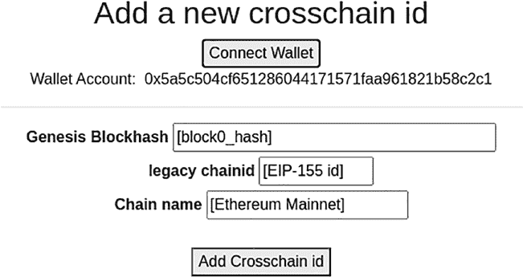

# 第 11 章 构建团队项目

`longname`, `string memory shortname`, `string memory category`,

`string memory url`) public {

`require(idStatus[chainid] == Status.PENDING);`

`require(idInfo[chainid].manager == msg.sender);`

`if(bytes(longname).length > 1)` {

`idInfo[chainid].longname = longname;`

}

`if(bytes(shortname).length > 1)` {

`idInfo[chainid].shortname = shortname;`

}

`if(bytes(category).length > 1)` {

`idInfo[chainid].category = category;`

}

`if(bytes(url).length > 1)` {

`idInfo[chainid].url = url;`

}

`emit ModifyChainIdInfo(chainid);`

}

`function getChainIdStatus(bytes32 hash) public view returns (Status)` {

`return idStatus[hash];`

}

`function getChainIdFromLegacyId(uint legacyId) public view returns (bytes32)` {

`return legacyIds[legacyId];`

}

`function getChainIdInfo(bytes32 hash) public view returns (chainidInfo memory)` {

`return idInfo[hash];`

}

```solidity
//convert an integer to byte array
function toBytes(uint256 x) public pure returns (bytes memory b) {
    b = new bytes(32);
    // b = abi.encodePacked(x);
    assembly { mstore(add(b, 32), x) }
}

//convert byte array to bytes32 fixed array
function bytesToBytes32(bytes memory source) public pure returns (bytes32 result) {
    if (source.length == 0) {
        return 0x0;
    }
    assembly {
        result = mload(add(source, 32))
    }
}
```

#### 客户端注意事项

在前一节中，智能合约被部署到区块链上，允许外部程序通过交易调用智能合约函数。这些客户端程序可以是命令行界面或 Web 应用程序。一种流行的客户端应用是通过基于 Web 的浏览器渲染 GUI，并使用 MetaMask 作为钱包发送交易。接下来，我们将演示如何构建与智能合约交互的网页。

通常，与智能合约交互的网页包含以下组件：

- 用于渲染 GUI 的 HTML 页面
- 用于处理用户输入和智能合约输出的 JavaScript
- 用于 JavaScript 和智能合约函数调用的 Web3
- 用于签名交易的 MetaMask 插件或扩展

以 `crosschainId` 服务为例，设计了以下 HTML 页面（图 11-6）：

***图 11-6.** 跨链 ID 服务用户界面的 HTML 文件*



每个 HTML 页面在浏览器页面中都会有用户输入，并包含用于处理浏览器事件和用户交互的 JavaScript。

##### HTML 页面示例

以下（图 11-7）是一个“添加跨链 ID”的 GUI 标记网页示例：

***图 11-7.** 添加跨链 ID 的 GUI 页面示例*

为了渲染此页面，编写了包含多个可点击按钮和输入字段的以下 HTML。“连接钱包”按钮允许页面连接到 MetaMask 钱包。“添加跨链 ID”按钮触发对 `crosschainId` 智能合约的调用，以向区块链添加一个 `chainId`。为了向区块链上的智能合约发送交易，包含了多个包含 Web3、ABI 和 API 的 JavaScript。JavaScript 代码将在下一节中解释。

```html
<!DOCTYPE html>
<HTML>
<HEAD>
<META name="generator" content="HTML Tidy for HTML5 for Linux version 5.6.0">
<META charset="utf-8">
<TITLE>CrosschainIdService</TITLE>
<BASE href="/">
<META name="viewport" content="width=device-width, initial-scale=1">
<LINK rel="stylesheet" href="stylesheets/bootstrap.min.css">
<LINK rel="stylesheet" href="stylesheets/style.css">
</HEAD>
<BODY>
<DIV class="container addCrosschainid">
<DIV class="row" id="addcrosschainidrow">
<DIV class="col-lg-6 text-center">
<H2>添加新的跨链 ID</H2>
<p> <button class="enableEthereumButton">连接钱包</button>
<br>钱包账户：&nbsp; <span class="showAccount">
<hr>
<DIV class="blockhash">
<LABEL for="blockhash"><B>创世区块哈希</B></LABEL>
<INPUT type="text" class="ignore-form-control" id="blockhash" placeholder="" value="[block0_hash]" size="34" required="">
</DIV>
<DIV class="legacyid">
<LABEL for="legacyid"><B>遗留链 ID</B></LABEL>
```


`<INPUT type="text" class="ignore-form-control" id="legacyid" placeholder="" value="[EIP-155 id]" size="10" required="">`

`<DIV class="chainname">`
`<LABEL for="chainname"><B>链名称</B></LABEL>`
`<INPUT type="text" class="ignore-form-control" id="chainname" placeholder="" value="[以太坊主网]" size="20" required="">`
`</DIV>`

`<br>`
`<div class="center-this" id="addChainidButton">`
`<button style="margin:0;" onclick="addChainid()" id="addChainidButton">添加跨链 ID</button>`
`</div>`
`<DIV id="addChainidValue"></DIV>`
`</DIV>`
`</DIV>`

`<SCRIPT src="/scripts/web3.min.js"></SCRIPT>`
`<SCRIPT src="/scripts/jquery-3.3.1.slim.min.js"></SCRIPT>`
`<SCRIPT src="/scripts/jquery.min.js"></SCRIPT>`
`<SCRIPT src="/scripts/enableEthereum.js"></SCRIPT>`
`<SCRIPT src="/scripts/crosschainid_info.js"></SCRIPT>`
`<SCRIPT src="/scripts/addCrosschainid.js"></SCRIPT>`
`</DIV>`
`</BODY>`
`</HTML>`

##### JavaScript 示例

在上述 `addCrosschainid.html` 文件中，包含多个 JavaScript 文件。`web3.min.js` 文件是面向浏览器的 JavaScript Web3 实现，这是一个可以从网络下载的开源文件。`enableEthereum.js` 文件用于实现"连接钱包"按钮的点击事件。点击该按钮将触发一个函数调用，以获取连接到浏览器的钱包地址。在此 `enableEthereum.js` 脚本中，`ethereumButton` 对象对应"连接钱包"按钮，并注册了一个点击事件处理器来调用 `getAccount()` 函数。`getAccount` 函数调用 Web3 的 `eth_requestAccounts` 方法检索 MetaMask 中的账户，并将第一个账户赋值给 `account0`，供其他脚本引用。此处，`showAccount` 对象是一个 `Div` 对象，该对象将填充从 `getAccount()` 函数调用中获取的账户地址。

```
// ----------- enableEthereum.js ---------------------------
const ethereumButton = document.querySelector('.enableEthereumButton');
const showAccount = document.querySelector('.showAccount');
var account0 = 0;

ethereumButton.addEventListener('click', () => {
    getAccount();
});

async function getAccount() {
    const accounts = await ethereum.request({ method: 'eth_requestAccounts' });
    account0 = accounts[0];
    showAccount.innerHTML = account0;
}
```

一旦 `enableEthereum.js` 检索到账户，用户即可输入区块 0 哈希值、旧链 ID 和区块链名称，并点击"添加跨链 ID"按钮注册新的区块链 ID。此功能在 `addCrosschainid.js` JavaScript 中实现。该脚本中，当网页上的"添加跨链 ID"按钮被点击时，会调用 `addChainid()` 函数。该函数首先检查 MetaMask 钱包是否已启用并连接。若未连接，系统将提示用户安装 MetaMask 扩展；若已连接，则使用跨链 ID 智能合约的 ABI 和合约地址构建一个名为 `myContract` 的智能合约对象。ABI 和合约地址在单独的 `crosschainid_info.js` 文件中指定。

`myContract` 对象支持 `addChainId` 方法，该方法接收区块哈希值、旧链 ID 和链名称作为参数。这些参数通过网页中的输入字段获取。调用智能合约函数有多种方式。本示例中，首先通过以下代码计算智能合约函数调用的数据：

```
var chainidData = myContract.methods.addChainId(blockhash, legacyid, chainname).encodeABI();
```

然后，通过 `web3.eth.sendTransaction` 操作将 `chainidData` 发送至智能合约。交易回执会被返回并显示在网页上。

```
// ----------- addCrosschainid.js ---------------------------
// addCrosschain.js 实现了用于向智能合约添加跨链 ID 的 addChainid 函数调用

var web3;

const ethEnabled = () => {
    if (typeof window.ethereum === 'undefined') {
        alert("您需要一个 Dapp 浏览器才能开始使用。请安装 metamask");
        return false;
    }
    web3 = new Web3(window.ethereum);
    return true;
}
```


```javascript
function addChainid() {

if (!ethEnabled()) {

alert("请安装兼容以太坊的浏览器或扩展程序（如 MetaMask）以使用此 dApp！");

}

web3.eth.getAccounts(function(err, accounts) {

var myContract = new web3.eth.Contract(crosschainid_abi, crosschainid_contract.toLowerCase());

var blockhash = $('.blockhash input').val();

var legacyid = $('.legacyid input').val();

var chainname = $('.chainname input').val();

var chainidData = myContract.methods.addChainId(blockhash, legacyid, chainname).encodeABI();

var tx_chainid = web3.eth.sendTransaction({

from: accounts[0].toLowerCase(),

to: crosschainid_contract.toLowerCase(),

data: chainidData

}, function(err, transactionHash) {

document.getElementById("addChainidValue").innerHTML = "addChainid tx:" + transactionHash;

})

})

}

$(document).ready(function() {

if (!ethEnabled()) {

alert("请安装兼容以太坊的浏览器或扩展程序（如 MetaMask）以使用此 dApp！");

}

});
```

