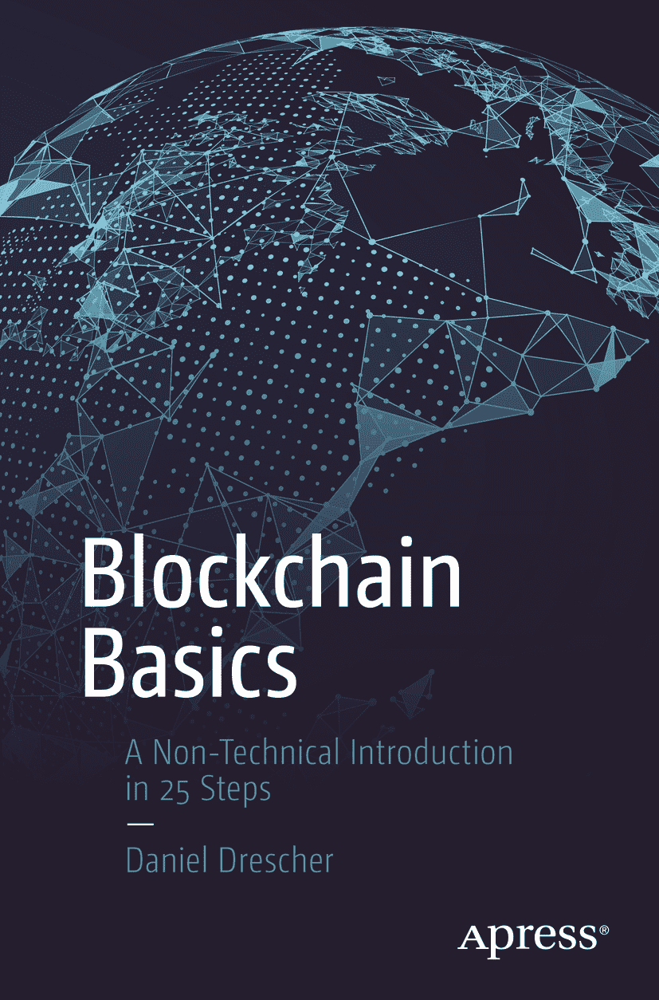

  
丹尼尔·德雷舍  
区块链基础  
25 步非技术入门  

本书作者引用的任何源代码或其他补充材料，读者均可通过本书在产品页面上的 GitHub 仓库获取，链接为[`www.apress.com/9781484226032`](http://www.apress.com/9781484226032)。如需了解更多详细信息，请访问[`http://www.apress.com/source-code`](http://www.apress.com/source-code)。  

ISBN 978-1-4842-2603-2  
电子书 ISBN 978-1-4842-2604-9  
DOI 10.1007/978-1-4842-2604-9  
美国国会图书馆控制编号：2017936232  

© 丹尼尔·德雷舍 2017  
本作品受版权保护。出版商保留所有权利，涉及材料的全部或部分内容，特别是翻译、重印、插图复用、朗诵、广播、微缩胶片复制或其他任何物理形式复制、传输或信息存储与检索、电子改编、计算机软件，或目前已知或未来开发的类似或不同方法。本书中可能出现商标名称、标识和图像。我们不会在每次出现商标名称、标识或图像时都使用商标符号，而仅以编辑方式使用这些名称、标识和图像，以维护商标所有者的利益，并无意侵犯商标。本书中使用的商业名称、商标、服务标志及类似术语，即使未明确标识，也不应被视为对其是否受专有权利保护的立场表达。尽管本书中的建议和信息在出版时被认为是真实准确的，但作者、编辑和出版商均不对可能存在的任何错误或遗漏承担法律责任。出版商对本书所含内容不作任何明示或暗示的保证。  

采用无酸纸张印刷  
本书通过 Springer Science+Business Media New York 在全球图书贸易中发行，地址：233 Spring Street, 6th Floor, New York, NY 10013。电话：1-800-SPRINGER，传真：(201) 348-4505，电子邮件：`orders-ny@springer-sbm.com`，或访问`www.springer.com`。Apress Media, LLC 是一家加利福尼亚有限责任公司，其唯一成员（所有者）是 Springer Science + Business Media Finance Inc（SSBM Finance Inc）。SSBM Finance Inc 是一家特拉华州公司。  

**Apress 商业：公正的商业信息来源**  

Apress 商业书籍为从业者提供基本信息和实用建议，每本书均由公认专家撰写。商业界各个领域的忙碌经理人和专业人士——无论其技术熟练程度如何——都期望从我们的书籍中获得可操作的思路和工具，以解决问题、更新和增强专业技能、使工作更轻松，并抓住机遇。  

无论商业领域涵盖何种主题——创业、金融、销售、营销、管理、监管、信息技术等——Apress 因提供客观信息和公正建议而备受赞誉，助您在日常工作生活中脱颖而出。我们的作者没有个人偏见；他们深知自己只有一个使命——以简洁、精准且富有深刻洞察的方式，提供满足读者真实需求的最新、准确信息。  

在新闻媒体、互联网乃至书籍中，找到客观公正且真正为您着想的资讯正变得日益困难。因此，我们希望您能享受这本书，它经过精心编写，以满足我们对质量和公正报道的标准。  

我们始终欢迎您对新书选题提出反馈或建议。或许您甚至想亲自写一本书。无论何种情况，请通过`editorial@apress.com`联系我们，编辑将迅速回复。顺便提一下，在本书末尾，您会找到一份有用的相关书目列表。请访问[`www.apress.com`](http://www.apress.com)注册，以获取新闻通讯和未来购书的折扣。  

> Apress 商业团队  

## 引言  

本引言回答了每位作者都必须回答的最重要问题：为什么有人应该读这本书？或者更具体地说：为什么有人应该再读一本关于区块链的书？请继续阅读，您将了解本书的写作缘由、您能从本书中期待什么、您不能期待什么、本书的读者对象以及本书的结构。  

### 为何要再写一本关于区块链的书？  

区块链在公众讨论和媒体中受到了广泛关注。一些爱好者声称，区块链是互联网出现以来最伟大的发明。因此，过去几年中涌现了大量关于区块链的书籍和文章。然而，如果您想更深入地了解区块链的工作原理，您可能会发现自己迷失在这样一个书籍宇宙中：它们要么对技术细节匆匆带过，要么以高度形式化的水平讨论底层技术概念。前者可能会让您感到不满足，因为它们未能解释理解和欣赏区块链所必需的技术细节；而后者可能会让您感到不满足，因为它们已经要求您具备想要获取的知识。  

本书填补了纯粹技术性区块链书籍与主要关注特定应用、或讨论其预期经济影响、或展望其未来的文献之间的空白。  

撰写本书是因为，要理解特定的区块链应用、评估区块链初创企业的商业案例，或跟上关于其预期经济影响的讨论，对区块链技术基础的概念性理解是必要的。如果不理解其底层概念，就无法评估区块链的总体价值或潜在影响，也无法理解特定区块链应用带来的增值。本书聚焦于区块链的底层概念，因为对一项新技术缺乏理解，可能会导致被热潮冲昏头脑，而后因不切实际、毫无根据的期望而失望。  

本书以非技术性、简洁且易于理解的方式，教授构成区块链的那些概念。它回答了接触一项新技术时产生的三个大问题：它是什么？我们为什么需要它？它是如何工作的？  

### 您不能从本书中期待什么  

本书特意对区块链的应用持中立态度。尽管加密货币（尤其是比特币）是区块链的突出应用，但本书将区块链作为一种通用技术进行阐释。之所以选择这种方法，是为了突出区块链的通用概念和技术模式，而不是聚焦于某个特定的、狭隘的应用案例。因此，本书：  

*   并非专门关于比特币或任何其他加密货币的文本  
*   并非仅关于某一特定区块链应用的文本  
*   并非关于证明区块链数学基础的文本  
*   并非关于编程实现区块链的文本  
*   并非关于区块链法律后果和影响的文本  
*   并非关于区块链对我们社会或人类整体在社会、经济或伦理方面影响的文本  

然而，其中一些观点会在本书的适当章节中得到一定程度的阐述。

### 本书能带给你什么

本书以非技术性语言，深入浅出地阐释了区块链的技术概念，例如交易、哈希值、密码学、数据结构、点对点系统、分布式系统、系统完整性以及分布式共识。本书的教学方法基于四个要素：

-   对话式风格
-   不涉及数学与公式
-   问题领域内的渐进式步骤
-   使用隐喻和类比

### 对话式风格

本书特意采用对话式风格撰写。它不使用数学或计算机科学领域的专业术语，以避免为非技术读者设置任何障碍。然而，本书会介绍并解释参与讨论以及理解其他区块链相关出版物所需的必要术语。

### 不涉及数学与公式

区块链的主要组成部分，如密码学和算法，都基于复杂的数学概念，而这些概念本身又带有令人生畏的数学符号和公式。然而，为了不给非技术读者带来任何不必要的复杂性与阻碍，本书刻意避免使用任何数学符号或公式。

### 问题领域内的渐进式步骤

本书中的章节之所以被称为“步骤”，是很有原因的。这些步骤构成了一条学习路径，能够循序渐进地构建关于区块链的知识体系。这些步骤的顺序是经过精心设计的。它们涵盖了软件工程的基础知识，解释了相关术语，指出了为什么需要区块链，并阐述了构成区块链的各个独立概念及其相互作用。将各个章节称为“步骤”，突显了它们之间的依赖关系及其教学目的。它们形成了一个需要循序渐进的逻辑序列，而非可以独立阅读的章节。

### 使用隐喻和类比

每一个引入新概念的步骤，都会先通过一个现实生活中的场景进行图解说明。这些隐喻服务于四个主要目的。第一，它们为读者引入新的技术概念做好准备。第二，通过将技术概念与易于理解的现实场景联系起来，隐喻降低了探索未知领域的心理门槛。第三，隐喻允许通过相似性和类比来学习新概念。最后，隐喻为记忆新概念提供了经验法则。

## 本书的组织结构

本书包含 25 个步骤，分为五个主要阶段，共同构成一条学习路径，循序渐进地构建你对区块链的知识。这些步骤涵盖了软件工程的一些基础知识，解释了所需的术语，指出了需要区块链的原因，阐述了构成区块链的各个独立概念及其相互作用，探讨了区块链的应用，并提及了当前活跃的发展与研究领域。

### 第一阶段：术语与技术基础

步骤 1 到 3 解释了软件工程的主要概念，并设定了理解后续步骤所需的术语。到步骤 3 结束时，你将对基本概念有一个总览，并能领会区块链所在的宏观图景。

### 第二阶段：为什么需要区块链

步骤 4 到 7 解释了为什么需要区块链，它解决了什么问题，解决这个问题为何重要，以及区块链有何潜力。到步骤 7 结束时，你将很好地理解区块链所在的问题领域、它最能发挥价值的环境，以及它最初被需要的原因。

### 第三阶段：区块链的工作原理

第三阶段是本书的核心，因为它解释了区块链的内部工作原理。步骤 8 到 21 将引导你学习 15 个不同的技术概念，这些概念共同构成了区块链。到步骤 21 结束时，你将理解区块链的所有主要概念，了解它们各自如何运作，以及它们如何相互作用，从而形成被称为区块链的这个宏大机制。

### 第四阶段：局限性及如何克服

步骤 22 到 23 聚焦于区块链的主要局限性，解释其原因，并勾勒出克服这些局限性的可能途径。到步骤 23 结束时，你将理解为什么前文步骤中所阐释的区块链原始构想可能不适用于大规模商业应用，为了克服这些局限性做出了哪些改变，以及这些改变如何改变了区块链的特性。

### 第五阶段：使用区块链、总结与展望

步骤 24 和 25 探讨了区块链如何在现实生活中应用，以及在选择区块链应用时需要解决哪些问题。本阶段还指出了当前活跃的研究与进一步发展的领域。到步骤 25 结束时，你将获得对区块链扎实的理解，并且为阅读更高级的文本，或积极参与当前关于区块链的讨论，做好了充分的准备。

## 配套材料

网站 [`www.blockchain-basics.com`](http://www.blockchain-basics.com) 为本书中的部分步骤提供了配套材料。

### 目录

**第一阶段：术语与技术基础**  
第 1 步：分层与分面思考 3  
第 2 步：纵观全局 9  
第 3 步：识别潜力 19

**第二阶段：为何需要区块链**  
第 4 步：发现核心问题 29  
第 5 步：厘清术语 33  
第 6 步：理解所有权的本质 39  
第 7 步：双重花费 49

**第三阶段：区块链如何运作**  
第 8 步：规划区块链 57  
第 9 步：记录所有权 63  
第 10 步：数据哈希 71  
第 11 步：现实世界中的哈希 81  
第 12 步：识别与保护用户账户 93  
第 13 步：授权交易 103  
第 14 步：存储交易数据 111  
第 15 步：使用数据存储 123  
第 16 步：保护数据存储 135  
第 17 步：在节点间分布式存储数据 145  
第 18 步：验证并添加交易 153  
第 19 步：选择交易历史 165  
第 20 步：为完整性买单 183  
第 21 步：整合所有环节 189

**第四阶段：局限性与克服方法**  
第 22 步：认识局限性 205  
第 23 步：重塑区块链 213

**第五阶段：使用区块链、总结与展望**  
第 24 步：使用区块链 223  
第 25 步：总结与进阶 235

**索引** 249

**作者简介与技术审校者简介**  
作者简介  
技术审校者简介

