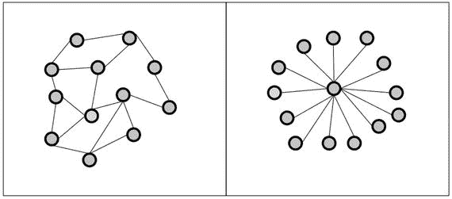
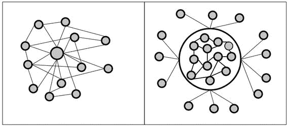

# 第一部分：术语与技术基础

术语与技术基础

本阶段阐释软件工程的主要概念，并建立一种组织与标准化技术沟通的方式。本学习阶段还介绍了软件架构与完整性的概念，以及它们与区块链的关系。到本阶段结束时，您将理解区块链的目的及其潜力。

## 1. 分层与分面思考

通过将系统分为不同层与不同面来进行分析

本步骤通过介绍一种组织与标准化技术沟通的方式，为我们学习区块链的旅程奠定基础。本步骤解释了如何分析一个软件系统，以及为何将软件系统视为多个层的组合至关重要。此外，本步骤还阐述了从系统的不同层面进行思考能带来哪些收获，以及这种方法如何帮助我们理解区块链。最后，本步骤简要介绍了软件完整性的概念，并强调了其重要性。

### 隐喻

你有手机吗？我猜答案是肯定的，因为现在大多数人至少都有一部手机。你对用于发送和接收数据的各种无线通信协议了解多少？你对作为移动通信基础的电磁波又了解多少？好吧，我们大多数人对此知之甚少，因为使用手机并不需要了解这些细节，而且大多数人也没有时间去学习它们。我们在心理上将手机分为需要了解的部分和可以忽略或视为理所当然的部分。

这种对待技术的方式并不仅限于手机。我们在学习使用新电视、电脑、洗衣机等设备时，一直在使用这种方法。然而，这些心理划分是高度个性化的，因为什么重要、什么不重要，取决于我们个人的偏好、具体的技术、我们的目标和经验。因此，你对某部手机的心理划分可能与我对同一部手机的心理划分不同。这通常会导致沟通问题，尤其是当我试图向你解释你应该了解某部手机的哪些方面时。因此，统一划分系统的方式是教授和讨论技术的关键点。本步骤将解释如何划分或分层一个系统，从而为我们讨论区块链奠定基础。

### 软件系统的层

本书通篇使用以下两种系统划分方式：

- 应用与实现
- 功能性与非功能性方面

#### 应用与实现

在心理上将用户需求与系统的技术内部细节分开，会导致应用层与实现层的分离。属于应用层的所有内容都与用户的需求有关（例如，听音乐、拍照或预订酒店房间）。属于实现层的所有内容都与实现这些功能有关（例如，将数字信息转换为声学信号、识别数码相机中像素的颜色，或通过互联网向预订系统发送消息）。实现层的元素本质上是技术性的，被视为达到目的的手段。

#### 功能性与非功能性方面

区分系统做什么以及它如何做，会导致功能性与非功能性方面的分离。功能性方面的例子包括通过网络发送数据、播放音乐、拍照以及操作图片的单个像素。非功能性方面的例子包括美观的图形用户界面、运行快速的软件，以及保护用户数据私密和安全的能力。系统其他重要的非功能性方面还包括安全性和完整性。完整性意味着系统按预期运行，它涉及许多方面，如安全性和正确性。¹ 有一种很好的方法可以记住系统功能性与非功能性方面的区别，即参考英语中的语法用法：动词描述动作或所做的事情，而副词描述动作如何完成。例如，一个人可以走得快或慢。在这两种情况下，“走”的动作是相同的，但动作的执行方式不同。作为经验法则，可以说功能性方面类似于动词，而非功能性方面类似于副词。

### 同时考虑两个层面

识别功能性与非功能性方面，以及分离应用层与实现层可以同时进行，从而形成一个二维表格。表 1-1 展示了以这种方式对手机进行心智分层的结果。

表 1-1. 手机心智分层示例

| 层面 | 功能性方面 | 非功能性方面 |
| --- | --- | --- |
| 应用层 | 拍照 打电话 发送电子邮件 浏览互联网 发送聊天消息 | 图形用户界面美观 易于使用 消息发送速度快 |
| 实现层 | 内部保存用户数据 连接最近的移动基站 访问数码相机像素点 | 高效存储数据 节省能源 保持完整性 确保用户隐私 |

表 1-1 或许可以解释系统中特定元素对用户而言的可见性（或不可见性）。应用层的功能性方面是系统中最显而易见的元素，因为它们服务于用户的显性需求。用户通常最先学习的就是这些元素。另一方面，实现层的非功能性方面很少被视为系统的主要元素，它们通常被认为是理所当然的。

### 完整性

完整性是任何软件系统的一个重要非功能性方面。它包含三个主要组成部分²：

*   **数据完整性**：系统使用和维护的数据是完整、正确且无矛盾的。
*   **行为完整性**：系统的行为符合预期，没有逻辑错误。
*   **安全性**：系统能够仅限授权用户访问其数据和功能。

我们大多数人可能认为软件系统的完整性是理所当然的，因为大多数时候我们幸运地与保持完整性的系统进行交互。这是因为程序员和软件工程师投入了大量时间和精力来开发系统，以实现和维护完整性。因此，在欣赏软件工程师为创建高完整性系统所做的工作时，我们可能有点被宠坏了。但是，一旦我们与一个未能保持完整性的系统交互时，我们的感受就会改变。在那些时刻，你会面临数据丢失、软件行为不合逻辑，或者意识到陌生人能够访问你的私人数据。在那些时刻，你的手机、电脑、电子邮件软件、文字处理器或电子表格计算器会让你生气，让你忘了礼貌！在这些时刻，我们开始意识到软件完整性是一种非常有价值的商品。因此，软件专业人士花费大量时间处理这个看似微小的实现层非功能性方面，也就不足为奇了。

### 展望

本步骤介绍了软件工程的一些通用原则。特别是，阐述了完整性、功能性与非功能性方面，以及软件系统的应用与实现等概念。理解这些概念将有助于你体会区块链存在的更广阔背景。下一步将使用本步骤引入的概念来呈现更宏观的图景。

### 总结

*   可以通过以下方式分析系统：
    *   应用层和实现层
    *   功能性和非功能性方面
*   应用层关注用户需求，而实现层关注如何实现需求。
*   功能性方面关注“做什么”，而非功能性方面关注“怎么做”。
*   大多数用户关心的是系统应用层的功能性方面，而系统的非功能性方面，尤其是实现层的非功能性方面，对用户来说不那么显眼。
*   完整性是任何软件系统的重要非功能性方面，它包含三个主要元素：
    *   数据完整性
    *   行为完整性
    *   安全性
*   大多数软件故障，例如数据丢失、行为不合逻辑或陌生人访问个人数据，都是系统完整性被破坏的结果。

**脚注**

1 Chung, Lawrence, 等. *软件工程中的非功能性需求*. 第 5 卷. 纽约: Springer Science & Business Media, 2012.

2 Boritz, J. Efrim. *IS 从业者对信息完整性核心概念的看法*. International Journal of Accounting Information Systems 6.4 (2005): 260–279.

## 2. 纵观全局

软件架构及其与区块链的关系

本步骤不仅提供了区块链所处的宏观图景，还突出了它在宏观图景中的位置。为了让您能够看清全局，本步骤引入了软件架构的概念，并解释了它与将系统分为层次和方面这一概念的关系。为了帮助您识别区块链在宏观图景中的位置，本步骤强调了区块链与软件架构之间的关系。最后，本步骤用一句话指出了区块链的核心目的。理解其目的是理解区块链以及后续步骤课程的基础。

### 隐喻

您买过车吗？我们大多数人都有过。即使您从未买过车，您可能也知道汽车配备了不同类型的发动机（例如，柴油、汽油或电动发动机）。这是模块化过程的一个例子，是将分层思想应用于汽车的结果。购买汽车时可以选择不同的发动机，这会导致车辆性能产生惊人的差异。两辆外观相同的汽车，其发动机功率可能存在巨大差异，从而产生截然不同的驾驶性能。此外，您对发动机的选择还会影响汽车的其他特性，例如价格、运营成本、消耗的燃料类型、排气系统以及制动器的尺寸。有了这幅图景，理解区块链在宏观图景中的作用就会容易得多。

### 支付系统

让我们将分层概念应用于支付系统。表 2-1 显示了用户的一些需求以及应用层和实现层的一些非功能性方面。

表 2-1. 支付系统的方面与层面

| 层面 | 功能性方面 | 非功能性方面 |
| --- | --- | --- |
| 应用层 | 存钱 取钱 转账 监控账户余额 | 图形用户界面美观 易于使用 转账速度快 系统参与者众多 |
| 实现层 | ？ | 全天候可用 防欺诈 保持完整性 确保用户隐私 |

您是否注意到表格中通常显示用于使系统正常工作的技术信息的那部分有一个问号？这个位置是有意留空的。这是您决定使用哪个“引擎”来运行您系统的地方。下一节将告诉您更多关于软件系统中与发动机相当的内容。

### 两种软件架构

实现软件系统的方法有很多种。然而，在实现系统时，一个基本决策关乎其架构，即系统组件的组织方式及其相互关系。软件系统的两种主要架构方法是集中式和分布式。¹

在集中式软件系统中，所有组件都围绕一个中心组件布置并与之连接。相比之下，分布式系统的组件则形成一个相互连接的组件网络，没有任何中央协调或控制元素。

图 2-1 描绘了这两种截然相反的架构。图中的圆圈代表系统组件，也称为节点，线条代表它们之间的连接。此时，无需了解这些组件的具体功能以及节点之间交换何种信息的细节。关键在于，存在这两种不同的软件系统组织方式。在图 2-1 的左侧，展示了一种分布式架构，其中组件相互连接，没有中心元素。重要的是要注意，没有任何一个组件与所有其他组件直接相连。然而，所有组件至少间接地相互连接。图 2-1 的右侧展示了一种集中式架构，其中每个组件都连接到一个中心组件。组件之间不直接相互连接。它们只有一条与中心组件之间的直接连接。

图 2-1. 分布式（左）与集中式（右）系统架构

### 分布式系统的优势

与单台计算机相比，分布式系统的主要优势在于²：

- 更高的计算能力
- 成本降低
- 更高的可靠性
- 自然扩展的能力

#### 更高的计算能力

分布式系统的计算能力是所有连接计算机计算能力的总和。因此，分布式系统通常比任何单个计算机都拥有更强的计算能力。即使将计算能力相对较低的计算机组成的分布式系统与独立的超级计算机相比，这一点也已被证实。

#### 成本降低

过去 20 年间，主流计算机、内存、磁盘空间和网络设备的价格大幅下跌。由于分布式系统由多台计算机组成，其初始成本高于单台计算机。然而，创建、维护和运营一台超级计算机的成本仍然远高于创建、维护和运营一个分布式系统。尤其当更换分布式系统中的单台计算机对整体系统影响甚微时，这一点尤为突出。

#### 更高的可靠性

分布式系统更高的可靠性基于这样一个事实：即使个别机器崩溃，整个计算机网络也能继续运行。分布式系统不存在单点故障。如果某个元素失效，其余元素可以接管其工作。因此，单台超级计算机的可靠性通常低于分布式系统。

#### 自然扩展的能力

分布式系统的计算能力是其组成部分计算能力的总和。通过将额外的计算机连接到系统中，可以提升整个系统的计算能力。因此，整个系统的计算能力可以以细粒度的方式渐进式增长。这符合许多组织对计算能力需求增长的模式。分布式系统的渐进式增长，与单台计算机计算能力的增长方式形成对比。单台计算机在更换为性能更强的计算机之前，其计算能力是恒定不变的。这导致计算能力呈非连续增长，而这种增长方式很少受到计算服务消费者的欢迎。

### 分布式系统的劣势

与单台计算机相比，分布式系统的劣势在于：

- 协调开销
- 通信开销
- 对网络的依赖
- 更高的程序复杂性
- 安全问题

#### 协调开销

分布式系统没有中央实体来协调其成员。因此，协调工作必须由系统成员自行完成。在分布式系统中协调成员之间的工作极具挑战性，并且会消耗原本可用于核心计算任务的精力和计算能力，因此称之为协调开销。

#### 通信开销

协调需要通信。因此，构成分布式系统的计算机必须相互通信。这需要存在通信协议，并涉及消息的发送、接收和处理，而这些又会消耗无法用于核心计算任务的精力和计算能力，因此称之为通信开销。

#### 对网络的依赖

任何形式的通信都需要介质。介质负责在相互通信的实体之间传输信息。分布式系统中的计算机通过网络传递消息进行通信。网络本身也面临挑战和困难，这些反过来又会影响构成分布式系统的计算机之间的通信与协调。然而，没有网络，就不会有分布式系统，不会有通信，也不会有节点间的协调，因此对网络存在依赖。

#### 更高的程序复杂性

解决计算问题需要编写程序和软件。由于前面提到的劣势，分布式系统中的任何软件都必须解决额外的问题，如协调、通信和网络利用。这增加了软件的复杂性。

#### 安全问题

通过网络进行通信意味着发送和共享对核心计算任务至关重要的数据。然而，通过网络发送信息会带来安全隐患，因为不可信的实体可能滥用网络来访问和利用信息。因此，任何分布式系统都必须解决安全问题。分布式节点通信所依托的网络访问限制越少，分布式系统的安全隐患就越大。

### 分布式对等系统

对等网络是一种特殊的分布式系统。它们由独立的计算机（也称为节点）组成，这些节点将其计算资源（例如，处理能力、存储容量、数据或网络带宽）直接提供给网络中的所有其他成员，没有任何中央协调点。网络中的节点在系统中的权利和角色是平等的。此外，它们既是资源的提供者，也是资源的消费者。

对等系统具有有趣的应用，例如文件共享、内容分发和隐私保护。这些应用大多利用了一个简单而强大的想法：将用户的计算机转变为构成整个分布式系统的节点。结果是，使用该软件的用户或客户越多，系统就变得越大、越强大。这个想法、其后果以及它所面临的挑战将在接下来的步骤中讨论。

### 集中式与分布式系统的混合

集中式系统和分布式系统在架构上是两个对立面。技术上的对立面一直激励着工程师们创建能够继承两者优势的混合系统，集中式和分布式系统也不例外。有两种典型的组合方式需要理解，因为这在学习现实世界中的区块链应用时会变得很重要。它们分别是：分布式系统中的中心化，以及中心内部的分布式系统。

图 2-2 左侧的示意图展示了一种在分布式系统内部建立中心组件的架构。乍看之下，这些组件似乎构成了一个分布式系统。然而，所有的小圆点都与中心处较大的圆点相连。因此，这样的系统表面上看起来是分布式的，但实际上是一个集中式系统。

图 2-2. 分布式与集中式架构的混合

图 2-2 右侧的示意图则展示了相反的方法。乍看之下，这样的系统像是集中式系统，因为外围的所有圆点只有一个直接连接至一个巨大的中心组件。然而，这个中心组件内部却包含了一个分布式系统。外围的组件甚至可能不知道中心组件内部存在着一个分布式系统。

这两种方法的共同之处在于，很难判断它们的真实性质。它们是分布式的还是集中式的？或许没有必要给这些架构起独特的名字。然而，指出它们的双重性质却很重要。这一点尤为重要，因为可能不容易一眼看出其中的中心化或分布式特征。稍后当我讨论区块链的商业化方式时，会再次提到这一点。

### 识别分布式系统

混合架构的出现使得清晰地识别分布式系统变得困难。为分布式系统制定一个普遍接受的定义超出了本书的范围。然而，对于本书的讨论而言，重要的是要了解分布式系统是什么，以及它与其他软件系统的区别。如果你不确定一个系统是否是分布式的，可以寻找是否存在一个能够使整个系统停机的单一组件（例如，数据库、名称或用户注册表、登录或注销组件，或紧急关闭按钮）。如果找到了这样的组件，那么所考察的系统就不是分布式的。

**注**

如果存在一个单一的组件，例如一个能关闭整个系统的单一开关按钮，那么这个系统就不是分布式的。

### 区块链的用途

在设计软件系统时，可以选择采用哪种架构风格，这类似于为汽车选择发动机。架构决策可以独立于应用层的功能方面进行。因此，可以在应用层创建功能相同但架构为分布式或集中式的系统。在实现系统时，架构仅仅是达成目的的手段。因此，如表 2-1 所提议的支付系统，既可以被实现为分布式系统，也可以被实现为集中式系统。

这两种架构概念各有其优缺点以及特定的运作方式。选择特定的架构会影响你将如何实现系统的功能性和非功能性需求。特别是，这两种架构概念在确保完整性方面有着截然不同的方法。而这就是区块链进入视野的地方。区块链是在分布式软件系统中实现完整性的工具。因此，它可以被视为实现实现层非功能性特性的工具。

**注**

区块链的用途是在分布式系统中实现并维护完整性。

### 展望

在分布式系统中实现完整性非常技术性，听起来可能有点枯燥。然而，让许多人对此感到兴奋的问题，取决于这个分布式系统将做什么，以及它取代了什么样的集中式系统。下一步将解释点对点系统如何改变了我们的世界，以及为什么区块链作为在分布式软件系统中实现完整性的工具，也有潜力改变世界。

### 总结

-   软件系统的架构决定了其组件如何组织以及相互之间的关系。
-   集中式和分布式软件架构可以被视为对立面。
-   分布式系统由多个独立的计算机组成，它们通过使用通信介质相互协作，以实现特定目标，且没有任何集中式的控制或协调元素。
-   根据经验法则，可以说，一旦系统存在一个能导致整个系统宕机的单一组件，那么无论其架构看起来多么复杂，它都不是分布式的。
-   区块链是分布式软件系统实现层的一部分。
-   区块链的用途是确保分布式软件系统的一个特定非功能性方面，即：实现并维护其完整性。

**脚注**

Tanenbaum, Andrew S., and Maarten Van Steen. Distributed systems: principles and paradigms. Upper Saddle River, NJ: Pearson Prentice Hall, 2007.

Tanenbaum, Andrew S., and Maarten Van. Steen. Distributed systems: principles and paradigms. Upper Saddle River, NJ: Pearson Prentice Hall, 2007.

## 3. 认识潜力

点对点系统如何改变世界

这一步骤通过考虑一种特定类型的分布式系统——点对点系统，来加深我们对区块链用途的理解。因此，这一步将帮助你理解为什么技术人员和商业专业人士都对区块链如此兴奋。本章还指出了区块链预计能提供最大价值的主要应用领域。此外，本章还讨论了点对点系统在现实世界中的一些影响。

### 比喻

你还能记得上一次在音像店或百货商店为自己买一张 CD 是什么时候吗？大多数人已经很长时间没有购买实体 CD 了，因为音乐行业经历了一场剧变。如今，人们从音乐门户网站下载单曲，与朋友分享`mp3`文件，或者在移动设备上使用音乐流媒体服务，而不是购买 CD。这种变化始于一款允许人们相互分享音乐文件的软件的出现。但这款软件有什么特别之处呢？以下是其发明者之一的说法：

> 这个系统，它最有趣的地方在于，你在与对等节点互动，你在与街对面的一个人交换信息。——肖恩·范宁，Napster 联合创始人

范宁和他的同事发明的是一个用于分享音乐的点对点系统。早在 20 世纪 90 年代末，这款软件就为音乐行业既有的商业模式开创了一个新时代。本章将解释 Napster 的出现、CD 销量的下滑以及音乐行业的剧变与区块链有何关联。

### 点对点系统如何颠覆整个行业

长期以来，音乐行业一直以如下方式运作：音乐人与唱片公司签约，由唱片公司录制歌曲、制作唱片，并通过多种媒介（如黑胶唱片、磁带或 CD）进行营销，随后通过包括百货商店和专业音像店在内的多种分销渠道销售给顾客。唱片公司实际上充当了音乐人与音乐爱好者之间的中介。音乐唱片公司凭借其在制作、营销和分销唱片方面的独家知识和技能，得以维持其作为中介的角色。然而，在 21 世纪的第一个十年里，音乐唱片公司的运营环境发生了剧变。

音乐的数字化、录播设备价格的亲民化、个人电脑的普及以及互联网的兴起，使得唱片公司变得可有可无。唱片公司制作、营销和分销唱片的三大功能可由艺术家和消费者自行完成。`Napster`（纳普斯特）在取代唱片公司作为中介的过程中扮演了关键角色。有了`Napster`，人们不再依赖唱片公司来获取最新热门歌曲。它让人们能够与世界各地的人分享单个音乐文件，而无需购买任何 CD。`Napster`的点对点模式，实际上就像一个针对 mp3 文件的数字共享集市，让消费者接触到的音乐范围比以往任何时候都更广，这使得唱片公司在一定程度上变得多余，并给它们造成了重大损失。¹

#### 点对点系统的潜力

`Napster`案例告诉我们，点对点系统有潜力基于一个简单的理念重塑整个行业：用点对点互动取代中间商。就音乐行业而言，那些充当艺术家和消费者之间中介的传统唱片公司及其营销和分销渠道，已被点对点文件共享系统所取代。使得音乐行业如此容易被点对点系统取代的主要特征是音乐的*非物质*属性以及复制和传输数据的低成本。

点对点系统的力量并不仅限于音乐行业。任何主要充当非物质或数字商品及服务生产者与消费者之间中介的行业，都容易被点对点系统取代。这种说法可能有点抽象，但一旦你认识到其中最大的一个——金融行业，你就可能会发现身边存在着许多非物质和数字商品及服务的中介。

你银行账户或信用卡/借记卡里有什么？那真的是钱吗？你所拥有的货币早已被转化成了非物质的比特和字节。只有少量的实际货币以物理纸币和硬币的形式存在。世界上绝大部分的货币和资产，都是以非物质的比特和字节形式存在于金融行业的集中式信息技术系统中。银行和金融行业的许多其他参与者，不过是我们财富与金钱所构成的比特和字节的生产者与消费者之间的中介。借贷行为，或者将资金从一个账户转移到另一个账户，不过是中介（也称为中间人）操作的一种非物质商品的转移。令人惊讶的是，即使是很简单的交易（例如，将一个银行账户的资金转移到另一个国家的另一个银行账户，会涉及到多达五个中间人，他们都需要处理时间并收取自己的费用）也涉及如此多的中间人。因此，像将一笔钱从一个银行账户转到另一个国家银行账户这样简单的事情，处理时间很长，交易成本也很高。在一个点对点系统中，同样的转账会简单得多，耗时更少，成本更低，因为它可以按其本质那样被处理：即两个对等节点之间比特和字节的转移。

点对点系统相对于集中式系统的优势在于，合同双方之间进行的是直接互动，而不是通过中间人的间接互动，因此处理时间更短，成本更低。

点对点系统的优势并不仅限于资金转账。任何主要充当非物质或数字商品及服务生产者与消费者之间中介的行业，都容易被点对点系统取代。随着数字化的持续深入，日常生活中越来越多的物品以及越来越多的商品和服务将变得非物质化，并将受益于点对点系统的高效性。点对点系统的倡导者认为，我们生活的几乎各个方面都将受到数字化和点对点网络兴起的冲击，例如支付、储蓄、贷款、保险，以及出生证明、驾照、护照、身份证、教育证书、专利和劳动合同的签发与验证。其中大部分已经以数字形式存在于由各类机构管理的集中式系统中，而这些机构只不过是充当自然供应商和客户之间的中间商。

**注**

取代中间商的行为也被称为**去中介化**。它被视作对许多主要充当不同群体（如买卖双方、借贷双方或生产者和消费者）之间中介的企业和公司构成的严重威胁。

### 术语及其与区块链的联系

既然你已经了解了点对点系统的潜力，就有必要阐明该问题领域的术语，并解释其与区块链的关系。具体而言，需要讨论以下几点：

-   点对点系统的定义
-   点对点系统的架构
-   点对点系统与区块链之间的联系

#### 点对点系统的定义

点对点系统是一种分布式软件系统，由节点（即单台计算机）组成，这些节点将其计算资源（例如处理能力、存储容量或信息分发）直接提供给其他节点。当用户加入一个点对点系统时，他们的计算机就变成了系统中的节点，这些节点在权限和角色上是平等的。尽管用户贡献的资源可能有所不同，但系统中的所有节点都具有相同的功能能力和职责。因此，所有用户的计算机既是资源的提供者，也是资源的消费者。²

例如，在一个点对点文件共享系统中，各个文件存储在用户的机器上。当有人想在这样的系统中下载一个文件时，他/她是从另一个人的机器上下载，这个人可能是隔壁邻居，也可能是在地球的另一端。

#### 点对点系统的架构

点对点系统本质上是分布式计算机系统，因为它们由多个节点组成，这些节点相互共享计算资源。然而，也存在一些仍利用中心化元素的点对点系统。中心化的点对点系统维护着中心节点，以促进节点之间的交互，维护描述各节点所提供服务的目录，或执行节点查找和识别。³ 中心化点对点系统通常采用混合架构，例如图 2-2 左侧所示的架构。这种架构能够结合中心化和分布式计算的优势。另一方面，纯分布式点对点系统没有任何集中控制或协调的元素。因此，这些系统中的所有节点执行相同的任务，同时充当资源和服务的提供者和消费者。

中心化点对点系统的一个例子是 **Napster**，它维护着一个中央数据库，记录所有连接到系统的节点以及这些节点上可用的歌曲。

#### 点对点系统与区块链之间的联系

正如在步骤 2 中讨论的，区块链可以被视为在分布式系统中实现和保持完整性的一种工具。纯分布式点对点系统可以使用区块链来实现和保持系统完整性。因此，纯分布式点对点系统与区块链之间的联系在于，区块链被用作在纯分布式系统中实现和保持完整性的工具。

### 区块链的潜力

纯分布式点对点系统与区块链的关系在于，前者将后者作为实现和保持完整性的工具。因此，解释区块链为何令人兴奋并具有潜力的论点是：纯分布式点对点系统具有巨大的商业潜力，因为它们可以替代中心化系统，并通过去中介化改变整个行业。由于纯分布式点对点系统可以使用区块链来实现和保持完整性，区块链也因此变得重要。然而，真正令人兴奋的主要因素是**去中介化**。区块链只是实现这一目标的一种手段。

> **注**  
> 区块链令人兴奋之处在于，它能够作为一种工具，在具有通过去中介化改变整个行业潜力的纯分布式点对点系统中，实现和保持完整性。

### 展望

本步骤解释了什么是点对点系统，并强调了它们通过去中介化改变整个行业的潜力。此外，本步骤还指出，区块链令人兴奋的原因是它能够服务于纯分布式点对点系统以完成其任务。然而，为什么在分布式系统中实现和保持完整性如此重要的问题尚未得到解答。下一步将更详细地讨论这个问题。

### 总结

-   点对点系统由计算机组成，这些计算机将其计算资源直接提供给其他计算机。
-   点对点系统的优势在于，它允许用户直接相互交互，而不是通过中间人间接交互。
-   用点对点系统取代中间人可以提高处理速度并降低成本。
-   点对点系统可以是中心化的，也可以是纯分布式的。
-   纯分布式点对点系统形成一个由平等成员组成的网络，这些成员无需任何中央协调即可直接相互交互。
-   **Napster** 展示了点对点系统的力量，其文件共享系统开启了传统音乐产业商业模式的新纪元，传统音乐产业主要扮演艺术家和消费者之间的中间人角色。
-   任何主要充当非物质或数字商品及服务生产者与消费者之间中间人的行业，都面临被点对点系统取代的风险。
-   我们金融体系的很大一部分是资金供应方和需求方之间的简单中介，而资金主要以数字或非物质商品的形式存在。因此，数字化和点对点系统可能会像 **Napster** 重塑音乐产业一样，重塑金融业。
-   随着数字化的持续推进，我们日常生活的更多方面以及越来越多的商品和服务将变得非物质化，并将受益于点对点系统的优势。
-   区块链令人兴奋之处在于，它能够作为一种工具，在具有通过去中介化改变整个行业潜力的纯分布式点对点系统中，实现和保持完整性。

---

**脚注**

[1] Hong, Seung-Hyun. Napster 对录播音乐销售的影响：来自消费者支出调查的证据。斯坦福经济政策研究所工作论文 (2004)：3–18；Leyshon, Andrew. 恐怖的怪物？软件格式、点对点网络和礼物的幽灵。环境与规划 D：社会与空间 21.5 (2003)：533–558。

[2] Tanenbaum, Andrew S., 和 Maarten Van Steen. 分布式系统：原理与范式。Upper Saddle River, NJ: Pearson Prentice Hall, 2007。

[3] Eberspächer, Jörg, 和 Rüdiger Schollmeier. 第一代和第二代点对点系统。见点对点系统与应用。柏林海德堡：施普林格出版社，2005：35–56。

---

