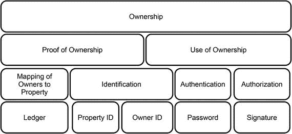
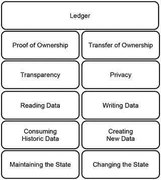

# 第二部分  
为什么需要区块链

为什么需要区块链

这一阶段解释了区块链旨在解决的问题以及解决此问题为何重要。本阶段还将加深你对区块链所在问题领域、其提供最大价值的环境，以及它与信任、完整性和所有权管理之间关系的理解。在本阶段结束时，你将更深入地理解区块链的目的，并对区块链这一术语本身达成有区分度的理解。

## 4. 发现核心问题

### 如何统率一群独立的计算机

前两个步骤概括指出了区块链的总体目标，并特别强调了其对纯分布式点对点系统的重要性。事实证明，维护分布式系统的完整性是区块链的主要目标。但为什么在分布式系统（尤其是纯分布式点对点系统）中维护完整性如此具有挑战性？本步骤通过揭示纯分布式点对点系统中信任与完整性之间的微妙关系来回答这个问题。因此，本步骤将加深您对完整性重要性的理解，并揭示区块链需要解决的主要问题。最后，本步骤描述了区块链有望提供最大价值的环境。

### 隐喻

许多语言中都有形象的俗语来描述试图组织一群混乱个体的情形。例如，在英语中，人们将这种情况描述为“试图把猫赶在一起”（herding cats），这说明了将一群固执难缠、不服从甚至不承认中央权威的动物聚拢起来的挑战。试图组织一群不接受或不承认中央权威的个体这个问题听起来是否很熟悉？这恰好就是纯分布式点对点系统的情况，该系统由独立且自主的节点组成，没有任何形式的中央控制或协调。本步骤将解释纯分布式点对点系统的一个主要挑战及其与区块链的关系。

### 点对点系统中的信任与完整性

信任和完整性是一枚硬币的两面。在软件系统的语境中，完整性是系统在安全、完整、一致、正确以及无破坏无错误方面的一个非功能性指标。信任则是人类在缺乏证据、证明或调查的情况下，对某人或某物的可靠性、真实性或能力的坚定信念。信任是预先给予的，并会根据持续互动结果而增强或减弱。

就点对点系统而言，这意味着用户只有在信任该系统，并且与系统持续交互的结果能够确认并强化这种信任时，才会加入并持续为系统做出贡献。为了满足用户的期望并强化他们对系统的信任，系统的完整性是必需的。如果由于缺乏完整性，系统未能强化用户的信任，用户就会放弃该系统，最终导致系统终止运行。鉴于信任对于点对点系统存续的重要性，主要问题在于：我们如何在纯分布式点对点系统中实现并维护完整性？

在纯分布式系统中实现并维护完整性取决于多种因素，其中一些最重要的因素包括：

*   对节点或对等点数量的了解
*   对对等点可信度的了解

如果已知节点的数量及其可信度，那么在分布式点对点系统中实现完整性的可能性就更高。这种情况类似于运营一个恪守高道德标准并对新成员实行严格准入流程的私人俱乐部。然而，在分布式点对点系统中实现完整性的最坏情况，是当节点的数量及其可信度都未知的时候。在互联网上运行一个对所有人开放的纯分布式点对点系统就是这种情况。

### 点对点系统中的完整性威胁

为简单起见，我们可以考虑点对点系统中两个主要的完整性威胁：

*   技术故障
*   恶意对等点

#### 技术故障

点对点系统由用户的个人计算机构成，这些计算机通过网络进行通信。计算机系统的所有硬件和软件组件，以及计算机网络的任何组件，都存在发生故障或产生错误的固有风险。因此，任何分布式系统都必须面对其组件可能发生故障或偶然产生错误结果的问题。

#### 恶意对等点

恶意成员是点对点系统中的第二个完整性威胁。这种不可信来源并非技术问题，而是由那些决定利用系统为自身牟利的个体目标所引起的问题。可以说，这种威胁更多地与社会学和群体动力学相关，而非技术。不诚实和恶意的对等点构成了对点对点系统最严重的威胁，因为它们攻击了所有点对点系统赖以建立的基础：信任。一旦用户无法再信任他们的对等点，他们就会离开并停止向系统贡献计算资源。因此，成员数量将会减少，整个系统对剩余成员的吸引力也会降低，这反过来又会加速系统的衰落，最终导致系统被完全抛弃。

### 区块链需要解决的核心问题

在所有条件最优的情况下实现完整性和信任很容易。真正的挑战是在最坏的情况下，在一个分布式系统中实现完整性和信任。而这正是区块链应该解决的问题。区块链需要解决的核心问题是，在一个由数量未知且可靠性和可信度未知的对等点组成的纯分布式点对点系统中，实现并维护完整性。这个问题并非新问题。它实际上是计算机科学中一个广为人知且被广泛讨论的问题。借用军事术语，这个问题通常被称为**拜占庭将军问题**。¹

> **注意**
> 区块链要解决的问题是：在一个由数量未知且可靠性和可信度未知的对等点组成的纯分布式点对点系统中，实现并维护完整性。

### 展望

本步骤强调了完整性和信任在点对点系统中的重要性。此外，本步骤指出了区块链需要解决的核心问题，并强调了其在实现点对点系统完整性和信任方面的重要性。然而，我们仍未给出“区块链”这个术语的定义。这将是下一步的主题。

### 总结

*   完整性和信任是点对点系统的主要关注点。
*   只有当用户信任点对点系统，并且与系统持续交互的结果能够确认并强化这种信任时，他们才会加入并持续做出贡献。
*   一旦用户对点对点系统失去信任，他们就会放弃它，这最终将导致系统终止。
*   点对点系统中的主要完整性威胁包括：
    *   技术故障
    *   恶意对等点
*   在点对点系统中实现完整性取决于：
    *   对对等点数量的了解
    *   对对等点可信度的了解
*   区块链需要解决的核心问题是：在一个由数量未知且可靠性和可信度未知的对等点组成的纯分布式点对点系统中，实现并维护完整性。

**脚注**

1 Lamport, Leslie, Robert Shostak, and Marshall Pease. The Byzantine generals problem. *ACM Transactions on Programming Languages and Systems (TOPLAS)* 4.3 (1982): 382–401.

## 5. 厘清术语

定义区块链的四种方式

在前面的步骤中，你了解了区块链的主要目的，以及信任与软件系统完整性之间的关系。因此，你对区块链的目的有了扎实的理解，但仍缺少对“区块链”这一术语本身的定义。本步骤将引导你关注该术语的定义，并解释其不同用法。本步骤将提供一个区块链的临时定义，这将指导你阅读本书的其余部分。最后，本步骤将解释为什么所有权管理是区块链的一个突出应用案例。

#### 术语

在关于区块链的讨论中，该术语有如下用法：

-   作为数据结构的名称
-   作为算法的名称
-   作为一套技术的名称
-   作为具有共同应用领域的纯分布式点对点系统的总称

#### 一种数据结构

在计算机科学和软件工程中，数据结构是一种组织数据的方式，与其具体的信息内容无关。你可以将数据结构想象成建筑学中的楼层平面图。建筑的楼层平面图处理的是用墙壁、地板和楼梯分隔和连接空间的问题，与其具体用途无关。当作为数据结构的名称时，区块链指的是将数据组合成称为“区块”的单位。你可以将这些区块想象成书中的页面。这些区块像链条一样相互连接，因此得名区块链。以一本书为例，单词和句子是要存储的信息。它们被写在不同的页面上，而不是写在一个巨大的卷轴上。这些页面通过它们在书中的位置和页码相互连接。你可以通过检查页码是否连续且没有遗漏数字，来判断是否有人从书中移除了某一页。此外，页面上的信息和书中的页面都是有序的。这种顺序是一个重要的细节，将在后续内容中广泛使用。另外，数据结构中数据块的链接是通过一种非常特殊的编号系统实现的，这与普通书籍的页码编号不同。

#### 一种算法

在软件工程中，算法一词指的是由计算机完成的一系列指令。这些指令通常涉及数据结构。当作为算法的名称时，区块链指的是一系列指令，这些指令在一个纯分布式点对点系统中协商众多区块链数据结构的信息内容，类似于民主投票方案。

#### 一套技术

当作为一套技术的名称时，区块链指的是区块链数据结构、区块链算法以及密码学和安全技术的组合。这些技术结合起来可用于在纯分布式点对点系统中实现完整性，而与应用目标无关。

#### 具有共同应用领域的纯分布式点对点系统的总称

区块链也可以作为利用区块链技术套件的纯分布式点对点账本系统的总称。请注意，在这种语境下，区块链指的是作为一个整体的纯分布式系统，而不是作为纯分布式系统组成部分的软件单元。

### 本书中术语的用法

在本书的其余部分，区块链指的是利用区块链技术套件的纯分布式点对点账本系统总称的简称。如果意在表达其他含义，我会通过明确使用“区块链数据结构”、“区块链算法”或“区块链技术套件”这些术语来指明。

注意

如今被视为区块链的技术是在 2008 年以化名中本聪¹提出的，其真实身份至今仍未公开。

### 临时定义

以下定义并不完整。它仍然缺少一些尚未介绍的重要细节。不过，这个定义可以作为更全面理解该术语的一个中间步骤：

> 区块链是一个纯分布式的点对点账本系统，它利用一个软件单元，该单元包含一种算法，该算法协商有序且连接的數據塊的信息内容，并结合密码学和安全技术，以实现并维护其完整性。

### 所有权管理的作用

临时定义并未提及比特币或加密货币所有权的管理。这可能令人惊讶，因为许多关于区块链的文章和书籍声称其目的是管理数字货币的所有权。事实是，管理加密货币的所有权是区块链一个非常突出且自然的应用案例，但并非唯一案例。区块链拥有广泛多样的应用。然而，有两个原因使得数字商品的所有权管理成为讨论最广泛的区块链应用。首先，它最容易理解和解释。其次，它是对经济影响最大的用例。所有权的概念和所有权权利的强制执行几乎是每个人类社会的核心要素（甚至一些动物也有所有权的概念，并为其强制执行而争斗）。银行、保险公司、托管人、律师、法院、事务律师和领事馆的绝大部分活动都涉及所有权权利的管理或强制执行。因此，所有权管理是一个数十亿美元的市场，任何能够改变我们管理所有权方式的技术创新都将产生巨大影响。事实证明，区块链确实可以极大地改变我们管理所有权的方式。

### 本书中区块链的应用领域

作为用于管理分布式点对点账本系统的技术套件，区块链可以有许多具体的应用，例如管理数字商品或加密货币的所有权。然而，本书有意不局限于区块链的某一个特定应用，因为我不想通过详细讨论一个特定应用案例来分散你对核心概念的注意力。但是，为了让你更容易理解区块链，本书考虑了管理和明确所有权的一般应用案例，而无论被管理的具体商品是什么。因此，管理和明确所有权的总体目标将为你学习之路提供一些思维引导，并帮助你构建对区块链的心理图景。

### 展望

本步骤阐明了“区块链”这一术语，并给出了一个临时定义。本书考虑管理和明确所有权的一般应用案例来解释区块链，但确实需要更详细地讨论所有权。对所有权更深入的理解将有助于你理解区块链的功能。下一步将更详细地探讨所有权的基础。

### 总结

- 术语“区块链”具有歧义性；对不同的人来说，根据上下文其含义也不同。
- 区块链可以指：
    - 一种数据结构
    - 一种算法
    - 一套技术组合
    - 一类具有共同应用领域的纯分布式点对点系统
- 管理和明确所有权是区块链最突出的应用场景，但并非唯一场景。
- 区块链是一种纯分布式点对点账本系统，它利用一个由算法组成的软件单元，该算法协商有序且相互连接的区块的信息内容，并结合密码学和安全技术，以实现并维护其完整性。

**脚注** 1

中本聪. 比特币：一种点对点电子现金系统. 2008. [`https://bitcoin.org/bitcoin.pdf`](https://bitcoin.org/bitcoin.pdf).

## 6. 理解所有权的本质

我们为何知道自己所拥有之物

步骤 5 提供了区块链的初步定义，并阐述了为何所有权管理被视为其最突出的应用场景。本章节将深化区块链与其所有权管理这一重要应用场景之间的关系。具体而言，本章节揭示了纯分布式点对点系统中的信任与诚信（一方面）和所有权管理（另一方面）之间的联系。此外，本章节还对所有权的本质提供了一些通用见解，并介绍了基本的安全概念。

### 隐喻

想象以下情景。在家里，你正将一个苹果装进午餐包。在去办公室的路上，你决定进一家超市买三明治和饼干。在收银台，你打开包准备取出要购买的商品。就在这时，超市员工看到了你，并注意到了你包里的那个苹果，恰好与超市出售的是同一种苹果。此时超市员工会作何感想？他可能会错误地根据观察断定你偷了店里的苹果。不幸的是，这家超市没有监控摄像头，也没有安保人员，而且你是此刻唯一的顾客。那么，你如何证明自己没有偷苹果呢？

### 所有权与见证人

你是否曾想过，究竟是什么让你成为你所属物品的主人？可能因为你还在想超市里那个苹果的故事吧！那么，是什么让你成为包里那个苹果的主人呢？你如何证明你没有从超市偷它？

想象一下，你正站在法庭上，法官正在审理你那被指控的“苹果盗窃案”。你会如何证明你是苹果的主人？我们知道，在超市的例子中，如果没有人能证明你偷了苹果，就足以证明你的清白。然而，摆脱偷窃嫌疑并非所有权证明。所以，让我们回到证明所有权的问题上。

如果有人能证明你在去超市之前就已经买了这个苹果，那将大有帮助。幸运的是，你记得买苹果的那家店，并且卖苹果给你的店员愿意为你作证。但你低估了检察官。他在交叉询问中与你的证人交谈，并提出尖锐问题：他还记得卖给你的那个苹果吗？他能确认卖给你的那个特定苹果就是你包里的那个吗？他能确认你就是买那个特定苹果的人吗？最后，他究竟为什么能记住所有这些细节？有没有可能你付钱给了证人，让他为你的清白作证？这就归结为一个基本原则：有一个证人是好的，但拥有许多独立的证人才是说服检察官相信你清白的关键。

最后一点极为重要。为同一事实作证的独立证人越多，该事实为真的可能性就越大。事实证明，这一理念将成为区块链的核心概念之一。

### 所有权的基础

将前一节的发现提升到更抽象的层面，可以说证明所有权涉及三个要素：

- 对所有人的身份识别
- 对所属物品的身份识别
- 所有人对物品的映射关系

证人的证词可以实现所有这些要素。历史上，目击者常常是澄清这些要素的唯一来源。然而，依赖证人的口头证词非常耗时。因此，这些要素已被可信实体签发的文件所取代。如今，我们可以用身份证、出生证明和驾照来识别个人。可以使用序列号、生产日期、生产证明或详细描述来识别物品。这些文件一旦创建便不会改变，因为人与物的身份不会改变。

所有人对物品的映射关系通常通过分类账或登记簿来完成。这种文件并非创建后一成不变。每一次所有权的转移都需要记录在这样的登记簿中，因为过时的登记簿或分类账无法成为证明所有权的可信证人。拥有一份实时更新且管理有序的登记簿的重要性，促使许多社会建立了专门的机构。某些类型的物品价值越高，就越有可能存在由政府监管的登记簿来记录这些物品的所有权。这些登记簿大多数对所有人开放，以便于验证所有权并提供便捷的途径来澄清权属。你可以自行研究一下，在你的国家有哪些这样的登记簿，以及它们证明了什么。我找到了用于记录房地产、专利、船舶、飞机和公司所有权的分类账。我甚至还找到了用于记录婚姻、出生和死亡的登记簿。

图 6-1 描绘了在设计所有权管理软件时所涉及的不同概念之间的关系。

*图 6-1. 所有权概念*

在图 6-1 中，上层的概念比下层更为通用。每一层的概念可以被看作是上一层概念的具体化实现。例如，所有权证明需要同时对所有人及财产进行身份识别，以及建立所有人对财产的映射关系。所有权的行使则需要身份识别，以及认证和授权，以确保只有合法的人才能使用该财产。最底层的方框代表了实现层。它们展示了，例如，`password`和`signature`是用于实现认证和授权的概念。`ledger`可以被看作是一种实现所有人对财产映射关系的具体方式。

### 安全相关简介

图 6-1 中使用了三个与安全相关的主要概念，需要更详细地解释，因为它们在软件系统语境中的含义可能与日常用法略有不同：

*   `标识`
*   `身份验证`
*   `授权`

这三个概念的含义和相互关系可以通过一个现实世界的例子来说明。设想你试图在一家酒类商店购买一瓶葡萄酒。酒类商店不允许向未成年人出售酒精饮料。酒类商店如何确保只向符合条件的人出售葡萄酒？酒类商店通过使用标识、身份验证和授权来实现这一点。以下是其工作原理的说明。

## `标识`

`标识`仅仅意味着通过陈述一个名称或任何其他可用作标识符的信息来声称自己是谁。¹ 在酒类商店的例子中，你可以通过陈述一个名字来声称自己是某个人。`标识`并不能证明你确实是你所声称的那个人。`标识`不涉及证明你不是未成年人。`标识`仅仅意味着声称自己是某个人。

## `身份验证`

`身份验证`的目的是防止有人冒充他人。`身份验证`意味着验证或证明你确实是你所声称的那个人¹。这种证明可以通过你拥有的某物或你知道的某物来提供，这些可以作为你确实是你所声称的那个人的证据（例如，身份证、驾照，或者你所声称之人的一些生活细节）。重要的是，对你声称身份的证明必须与你唯一关联（例如，你的脸部照片、指纹或其他能够唯一识别你的信息）。在酒类商店的例子中，这意味着你可以通过出示一张包含你照片的驾照来证明你确实是你所声称的那个人。将你的脸与驾照照片上的脸进行比对即可完成验证。如果你看起来像驾照照片中的人，则`身份验证`成功。否则，`身份验证`失败。将一个人的脸与驾照照片进行双重核实，旨在防止有人使用他人的驾照。

## `授权`

`授权`意味着根据某人身份的特征或属性，授予其对特定资源或服务的访问权限¹。`授权`是`身份验证`成功以及对其特征或权利进行评估后的结果。在酒类商店的例子中，`授权`意味着根据你驾照上显示的出生日期，决定是否允许你购买一瓶葡萄酒。如果根据你驾照上的出生日期，你年龄太小，店员将拒绝向你出售葡萄酒。请注意，在这种情况下，拒绝并非由于`身份验证`失败。`标识`和`身份验证`都成功了，并且正因为正确的标识，店员才能识别出你是未成年人。因此，`授权`始终是根据某些规则对先前已验证身份的特征或属性进行评估的结果。

> **注意：** `标识`意味着声称自己是谁。`身份验证`意味着证明你确实是你所声称的那个人。`授权`意味着基于先前已验证的身份获得对某物的访问权限。

### 账本的目的与属性

图 6-2 说明了所有权证明和所有权转移如何与账本的目的和属性相关联。

**图 6-2.** 账本的概念与原则

从图 6-2 中学到的主要经验是，账本必须履行两个相互对立的角色。一方面，账本作为所有权证明的手段，依赖于读取保存在账本中的历史数据。另一方面，账本必须记录任何所有权的转移，这反过来意味着要产生新数据并写入账本。这两个目的最重要的区别之一可以概括为透明性与隐私性的对立本质。

当账本对任何人开放时，证明所有权更容易。因此，透明性是证明所有权的基础，其方式类似于证人在法庭上公开作证。然而，所有权的转移必须仅限合法所有者进行。因此，隐私构成了所有权转移的基础。由于在账本中写入意味着所有权变更，因此只有非常值得信赖的实体才能拥有对账本的写入权限。

透明性与隐私性、证明所有权与转移所有权、读取账本与写入账本——这些相互冲突的力量同样存在于区块链中。事实证明，区块链是一个巨大的分布式点对点系统，由类似账本的数据结构构成，任何人都可以读取。

### 所有权与区块链

以政府监管账本为形式的见证人，是厘清贵重物品所有权的关键。但如果这样的账本被损坏或销毁了，会发生什么？或者，如果负责更新账本的人犯了错误或故意伪造账本，又会怎样？在这种情况下，账本就不能反映现实。这是灾难性的，因为每个人都相信账本代表了真相，就像法庭上的证人一样。

仅凭一个账本来作为厘清所有权的唯一来源，其问题可以用法庭审判中已解决的方式来处理。仅基于一个证人的证词来做出判决是有风险的，因为这个证人可能不诚实。拥有更多证人则更好。被质询的独立证人越多，那些在多数证词中一致提及的事实就越有可能反映真相。这个事实可以通过统计学和大数定律来证明。拥有许多独立观察、不受相互影响的证人，是这种探寻真相方法的关键。

将这一发现应用于使用账本厘清所有权是直接的：与其维护一个可能被伪造的单一账本，不如利用一个完全分布式的点对点账本系统，并根据多数节点达成一致的现实版本来处理有关所有权的请求。

此时，你可能想知道这一切与区块链有什么关系。使用账本管理所有权与区块链之间的关系总结如下：

*   单个账本用于维护所有权信息，这相当于一个存储所有权相关数据的`区块链数据结构`。
*   各个账本存储在点对点系统的计算机（节点）上。
*   `区块链算法`负责让各个节点共同达成一个关于所有权状态的、作为最终判决依据的一致版本。
*   该系统的完整性体现在其能够做出关于所有权的真实陈述。
*   密码学对于创建可信的标识、身份验证和授权手段，以及确保数据安全性是必需的。

### 前景展望

本步骤强调了所有权的重要特征，以及它们与账本属性之间的关系。此外，本步骤还概述了区块链如何与所有权和账本相关联。下一步将讨论在完全分布式的点对点账本系统中管理所有权所产生的一个重要影响。

### 总结

-   所有权证明包含三个要素：
    -   所有者身份的识别
    -   被拥有物件的识别
    -   所有者与物件之间的映射关系
-   `ID`卡、出生证明和驾照，以及序列号、生产日期、生产证明或详细的物件描述，均可用于识别所有者和物件。
-   所有者与物件之间的映射关系可以记录在分类账中，其作用类似于审判中的证人。
-   仅使用单一分类账存在风险，因为它可能被损坏、销毁或伪造。在这种情况下，该分类账将不再成为厘清所有权的可靠来源。
-   与其只使用一个中心化分类账，不如利用一组独立的分类账来记录所有权，并就多数分类账达成一致的现实版本，来厘清所有权的相关请求。
-   通过使用`区块链数据结构`，可以创建一个纯粹分布式的点对点分类账系统。每个`区块链数据结构`代表一个分类账，由系统中的一个节点维护。`区块链算法`负责让各个节点共同达成一个一致的所有权状态版本。密码学被用于实现身份识别、身份验证和授权。
-   纯粹分布式点对点分类账系统的完整性，体现在其能够就所有权做出真实陈述，并确保只有合法所有者才能将其财产权转让给他人。

脚注 [1]

Van Tilborg, Henk, and Sushil Jajodia, eds. *Encyclopedia of cryptography and security*. New York: Springer Science & Business Media, 2014.

## 7. 双重花费

利用分布式点对点系统的漏洞

在上一节中，您了解了纯粹分布式点对点系统与区块链作为所有权管理手段的最突出用例之间的关系。您还了解到，分布式点对点分类账系统的完整性，体现在其能够就所有权做出真实陈述，并确保只有合法所有者才能将其财产权转让给他人。但这一陈述在现实生活中意味着什么？如果完整性遭到破坏，会发生什么？本节将更详细地探讨这些问题。尤其，本节将介绍分布式点对点系统中完整性被破坏的最重要例子之一：双重花费问题。

### 比喻

伪造纸币在任何国家都是严重的犯罪行为，因为它通过创造没有宝贵资源支持的购买力，破坏了经济的基础和运行。因此，大多数纸币都配备了安全特征，使得伪造变得不可能，或至少成本高昂。这些安全特征，如唯一编号、水印或荧光纤维，对于实体纸币和其他实体商品效果良好。但是，如果货币或商品变成数字形式，并在分布式点对点分类账系统中管理，会发生什么？本节解释了用于管理所有权的分布式点对点系统的一个特定漏洞，该漏洞等同于伪造纸币。事实证明，这个漏洞是系统完整性被破坏的一个突出例子。

### 双重花费问题

让我们考虑一个用于管理房地产所有权的点对点系统。在这种系统中，记录所有权信息的分类账由系统成员的个体计算机维护，而不是由中心数据库维护。因此，每个对等节点都维护着自己的一份分类账副本。一旦房屋的所有权从一个人转移到另一个人，系统中的所有分类账都需要更新，以包含最新的现实版本。然而，在对等节点之间传递信息并更新各个分类账需要时间。在系统的最后一个成员收到新信息并更新其分类账副本之前，系统将处于不一致状态。一些对等节点已经知道最新的所有权转让，而其他对等节点尚未收到该信息。并非所有分类账都拥有最新信息这一事实，使得它们容易被任何已经拥有最新信息的人利用。

让我们再设想以下情景。个人 A 将他的房子卖给了个人 B。从 A 到 B 的所有权转让记录在点对点系统中的某一个分类账上。这个特定的分类账需要将此转让告知其他对等节点，这些节点再依次告知其他对等节点，直到最终所有对等节点都获知了从 A 到 B 的所有权转让。然而，假设个人 A 迅速找到系统中的另一个分类账，并要求记录同一栋房子的另一项不同所有权转让：从个人 A 到个人 C 的出售。如果这个对等节点尚未得知过去发生的从 A 到 B 的所有权转让，该节点将会批准并记录同一栋房子从 A 到 C 的所有权转让。因此，A 通过利用其第一次出售信息传播需要时间这一事实，成功地将他的房子卖了两次。但 B 和 C 不能同时拥有这栋房子。他们中只有一人应该是新的合法所有者。因此，这种情况被称为双重花费问题。

#### 术语

类似于术语`blockchain`，术语`double spending`也存在歧义，它被用来指代以下概念：

- 由复制数字商品引发的问题
- 分布式点对点账本系统中可能出现的问题
- 纯分布式点对点系统中完整性被破坏的一个例子

#### 双花作为数字商品复制的问题

在复制数字商品的语境下，`双花`问题指的是计算机上的数据可以不受显著限制地进行复制。这一事实给数字货币或任何在特定时间只能有一个所有者的数据带来了问题。复制使得代表数字货币的数据可以被复制，并多次用于支付。这在数字领域相当于用复印机复制纸币。除了技术上的可行性，复制数字货币违背了货币的核心原则：同一份货币不能同时给予不同的人。能够多次复制和花费数字货币会使货币失去价值，因此产生了`双花`问题。

#### 双花作为分布式点对点账本系统的问题

当用于描述分布式点对点账本系统的问题时，`双花`问题指的是将信息转发给系统中所有节点需要时间，因此并非所有节点同时拥有相同的所有权信息。由于并非所有节点都拥有最新信息，它们容易受到已掌握最新信息者的利用。结果，有人可能能够多次转移所有权，导致`双花`。

#### 双花作为分布式点对点系统中完整性被破坏的例子

分布式点对点系统的使用并不局限于管理所有权。然而，无论具体的应用领域如何，在节点间转发信息以及更新系统成员所维护数据的问题都是相同的。因此，在更抽象的层面上，`双花`问题可以被视为在分布式点对点系统中维护数据一致性的问题。由于数据一致性是系统完整性的一方面，可以说`双花`问题是系统完整性被破坏的一个具体例子。

### 如何解决双花问题

由于`双花`可能有不同的含义，因此没有单一的预防方法。相反，可能存在多种不同的解决方案。以下部分将描述其中一些方案。

#### 解决作为数字商品复制问题的双花

仅通过复制数据来多次花费数字货币或其他数字资产的问题，实际上是一个与所有权本质相关的问题。任何被接受的、将代表数字商品的数据映射到其所有者的方法，无论其具体实现如何，都能解决这个问题。即使是物理的总账本，或者（更现实地）一个电子账本，无论其架构如何（中心化或点对点），只要账本始终正确运行，就能确保数字商品只被花费一次。

#### 解决作为分布式点对点账本系统问题的双花

在这种语境下，系统的架构和应用领域都是给定的。分布式点对点账本系统通常被视为推导出`区块链`的经典例子。步骤 6 中的解释强调了`区块链`与分布式点对点账本系统之间的关系。因此，正如本书所使用的术语，`区块链`可以被看作是解决分布式点对点账本系统中`双花`问题的一种方案。

#### 解决作为分布式点对点系统中完整性被破坏例子的双花

在这种语境下，系统的架构是明确的，但应用领域则未作规定。因此，这一层面的解决方案侧重于在分布式点对点系统中实现和维护完整性，而不管其具体用途如何。然而，分布式点对点系统的具体用途决定了完整性的含义。例如，与管理系统数字货币所有权的系统相比，一个简单的文件共享应用可能在定义完整性时考虑不同的方面。因此，不了解具体的应用目标，就无法回答`区块链技术套件`是否是实现和维护系统完整性的正确工具。因此，在分布式点对点系统的特定应用领域，可能其他技术、数据结构和算法更适合用于实现和维护完整性。

> **注意**  
> `双花`问题是分布式点对点账本系统中完整性被破坏的一个突出例子，而`区块链技术套件`是用于解决该问题的工具。

### 本书中双花的用法

在本书中，术语`双花`用于指代纯分布式点对点账本系统中可能出现的一个漏洞。

### 展望

本步骤解释了`双花`，并强调了`区块链`在纯分布式点对点系统中实现完整性的重要性。接下来的步骤将重点介绍`区块链`如何实现和维护完整性。

### 总结

- 术语`双花`具有歧义性；它有多种不同的含义。
- `双花`可以指：
  - 由复制数字商品引发的问题
  - 分布式点对点账本系统中可能出现的问题
  - 违反分布式点对点系统完整性的一个例子
- 在本书中，术语`双花`用于指代纯分布式点对点账本系统的一个漏洞。
- `区块链`是解决`双花`问题的一种手段。

