# 第三部分  
区块链如何运作

这一学习阶段是本书的核心部分，因为它解释了`区块链`的内部工作原理。本阶段的 14 个学习步骤将引导你了解`区块链`的所有概念及其底层技术。在本阶段结束时，你将扎实理解`区块链`的所有主要概念、它们各自如何独立工作，以及它们如何相互作用以构建出被称为`区块链`的巨大机器。

## 8. 规划区块链

使用`区块链`管理所有权的基本概念

前面的步骤揭示了信任、完整性、纯分布式点对点系统与`区块链`之间的关系。因此，你现在已经很好地理解了什么是`区块链`、为什么需要它以及它解决了什么问题。然而，你仍然不知道`区块链`内部是如何运作的。本步骤通过解释将引导你进入后续步骤的通用应用场景，首次介绍了`区块链`的工作原理。它还强调了在设计用于管理所有权的`区块链`时的主要任务，并概述了其主要概念。本步骤是后续步骤的起点，后续步骤将详细讨论构成`区块链`的概念和技术。

### 目标

此处的目标是理解构成区块链的概念。出于教学目的，我将提出一个挑战：设计你自己的所有权管理系统。因此，你将面临与区块链发明者曾经面对并成功解决的相同挑战：设计一个软件系统，在一个完全开放且不可信的环境中，通过纯粹的分布式点对点账本系统来管理所有权。

### 起点

作为起点，所考虑系统的主要事实可总结如下：

- 该系统将是一个纯粹的分布式点对点系统，由用户贡献的计算资源构成。
- 该点对点系统使用互联网作为连接各个节点的网络。
- 节点的数量、可信度以及可靠性均未知。
- 该点对点系统的目标是管理数字商品（例如，销售积分或数字货币）的所有权。

### 遵循的路径

当设计和开发一个软件系统，该软件系统通过在一个开放且不可信的环境中使用纯粹的分布式点对点账本系统来管理所有权时，需要处理七个主要任务：

- 描述所有权
- 保护所有权
- 存储交易数据
- 准备可在不可信环境中分发的账本
- 分发账本
- 向账本中添加新交易
- 决定哪个账本代表真相

#### 任务 1：描述所有权

在开始开发区块链之前，你需要问自己想要用它做什么。由于你将设计一个管理所有权的软件系统，你必须首先决定如何描述所有权。结果证明，交易是描述任何所有权转移的好方法，而完整的交易历史是识别当前所有者的关键。因此，步骤 9 将解释交易、它们是什么、如何描述它们，以及如何使用它们来阐明所有权。

#### 任务 2：保护所有权

使用交易来描述所有权仅仅是起点。此外，你需要一种方法来防止他人访问他人的财产。在现实生活中，你可以通过使用带锁的门来轻松防止他人使用你的汽车或进入你的房屋。事实证明，密码学提供了一种在个体层面保护交易的方法，类似于带锁的门保护你的个人汽车或房屋的方式。

保护所有权有三个主要要素：识别和验证所有者，以及限制对财产的访问仅限其所有者。步骤 12 和 13 将更详细地解释这些概念。然而，这些步骤依赖于哈希值的概念。如果你以前从未听说过哈希值，也不必担心。我在步骤 10 和 11 中详细解释了哈希值。这两个步骤也将为那些已经具有技术背景或了解哈希值的人提供有趣的见解。

#### 任务 3：存储交易数据

通过交易描述所有权，并拥有在个体交易层面保护所有权的安全措施，是朝着设计一个管理所有权的软件系统这一目标迈出的重要步骤。然而，你需要一种方法来存储完整的交易历史，因为此历史记录用于阐明所有权。由于交易历史是阐明所有权的核心要素，因此必须以安全的方式存储它。事实证明，区块链数据结构在数字上等同于账本。步骤 14 和 15 解释了区块链数据结构作为数字账本所需满足的要求以及其实现方式。

#### 任务 4：准备可在不可信环境中分发的账本

拥有一个包含交易数据的孤立账本或区块链数据结构固然很好，但你的目标是设计一个在不可信环境中运行的分布式点对点账本系统。因此，你将拥有在不可信网络中不可信节点上运行的账本副本。此外，你将把对账本的控制权交给整个网络，而没有任何中央控制或协调点。你如何防止账本被伪造或篡改（例如，通过从历史中删除交易或向其中添加非法交易）？事实证明，防止交易历史被更改的最佳方法是使其不可更改。这意味着账本以及其中的交易历史一旦写入便无法更改。因此，你将不必担心账本被篡改或伪造，因为它们从一开始就无法更改。然而，拥有一个永远无法更改的分布式点对点账本系统听起来非常安全，但几乎毫无用处，因为它不允许你添加新交易。因此，区块链数据结构的挑战在于：一方面要不可更改，另一方面要接受新交易的添加。这听起来像是术语上的矛盾，但事实证明，通过步骤 16 中解释的一个技术技巧，这是可以实现的。结果是一种仅可追加的区块链数据结构：可以添加新交易，但几乎不可能更改过去已添加的数据。

#### 任务 5：分发账本

一旦账本仅可追加，你就可以通过向任何请求的人提供其副本来创建一个分布式点对点账本系统。然而，仅仅提供仅可追加账本的副本并不能实现你的目标。一个管理所有权的分布式系统分别涉及对等点或节点之间的交互。因此，步骤 17 解释了系统中的节点如何相互交互以及它们之间交换什么信息。

#### 任务 6：向账本中添加新交易

分布式点对点系统将由成员组成，其计算机维护着仅可追加区块链数据结构的个人副本。由于该数据结构允许你添加新的交易数据，你必须确保只添加有效且经过授权的交易。事实证明，这可以通过允许点对点系统的所有成员添加新数据，并将点对点系统的每个成员转变为其他成员的监督者来实现。结果，所有成员将相互监督，并指出其同伴犯下的任何错误。步骤 18 更详细地解释了这种方法，以及给予成员履行其职责的激励措施。

#### 任务 7：决定哪些账本代表真相

一旦新交易可以被添加到点对点系统中的各个账本中，就会遇到一个典型的分布式点对点系统问题：不同节点可能收到不同的交易，很快它们维护的交易历史就会出现差异。因此，点对点系统中可能存在不同版本的交易历史。由于交易历史是识别合法所有者的基础，存在相互冲突的交易历史对系统的完整性构成了严重威胁。因此，必须找到一种方法，要么从一开始就防止不同交易历史的出现，要么找到一种方法来决定哪个交易历史代表真相。纯粹的分布式点对点系统的特性决定了前一种方法不可行。因此，你需要一个标准来寻找和选择代表真相的交易历史。但还有另一个问题：在纯粹的分布式点对点系统中，没有中央权威机构可以宣布必须选择哪个交易历史。事实证明，可以通过让点对点系统中的每个节点自行决定哪个交易历史代表真相，并且大多数节点独立地对该决定达成一致，来解决这个问题。同样，区块链让你将新交易添加到仅追加的区块链数据结构中的方式，本身就已经包含了解决这个问题的方案。第 19 步将详细解释这些标准及其使用方法。

### 展望

本步骤确定了七项任务，这些任务将引导你经历一次富有挑战性的智力旅程，深入理解构成区块链的各种概念。一旦你完成这些任务，你将抵达顶峰：对区块链的理解。第 21 步是你将所有概念整合在一起并享受学习成果的时刻。和本步一样，第 21 步将是一篇概述性章节，但它将借鉴你在此期间学到的技术知识。

### 总结

*   为了设计一个用于管理所有权的纯粹分布式点对点账本系统，必须解决以下任务：
    *   描述所有权
    *   保护所有权免受未经授权的访问
    *   存储交易数据
    *   准备在不可信环境中分发的账本
    *   形成分布式账本系统
    *   向账本添加和验证新交易
    *   决定哪些账本代表真相
*   上述任务将在接下来的 12 个步骤中逐一解决。

## 9. 记录所有权

以历史进程作为当前所有权状态的证据

本步骤考虑如何以一种对纯粹分布式点对点账本系统有用的方式来描述所有权。本步骤解释了区块链如何记录所有权以及处理所有权的转移。此外，本步骤还指出了在记录所有权转移时排序的重要性。最后，本步骤强调了交易数据的完整性对整个系统完整性的重要意义。

### 隐喻

接力赛是队伍之间的赛跑，每队队员只跑总距离的一部分。比赛中，每位队员必须在赛道上标记的特定区域内将一件特定物品（即接力棒）交给下一位队员。在比赛中的任何给定时刻，参赛队伍中只有一名队员手持接力棒。要确定某支队伍的哪位队员当前正拿着接力棒，只需知道在最近一次交接中接力棒交给了该队的谁即可。为了追踪在任何时刻是谁拿着接力棒，就需要记录每次交接的时间和参与的运动员。本步骤将解释区块链如何处理所有权，其方式类似于接力赛利用接力棒的方式。

### 目标

目标是以透明且易于理解的方式记录所有权。任何阅读该记录的人都应该能够就商品与其所有者之间的关联做出明确的陈述。

### 挑战

挑战在于找到一种所有权记录方式，它不仅要声称某人是某物的所有者，还要提供所有权的证据，从而作为所有权的证明。

### 思路

与其通过库存数据（即列出所有所有者的当前财产）来描述当前的所有权状态，不如持续维护一个账本，其中记录所有所有权的转移。每一次所有权转移都通过交易数据来描述，这些数据清晰地指明哪个所有者何时将什么物品的所有权转移给了谁。存储在账本中的整个交易历史形成了一条审计线索，为每个人如何获得其财产提供了证据。¹ 这等同于追踪接力赛中每一次接力棒的交接，使得任何人都可以在之后重构整场比赛。

### 关于库存数据和交易数据的简要说明

有两种相互竞争的方式来描述所有权——通过库存数据或交易数据。库存数据描述当前的所有权状态。它们类似于银行账户对账单，仅显示当前可用的资金数额。交易数据描述所有权的转移。它们类似于银行账户对账单，列出了每一笔取款、存款和资金转账。可以通过汇总交易数据来推导出库存数据。除了两者都描述所有权这一事实外，它们的基本理念截然不同。库存数据只是陈述或声称所有权，而交易数据则解释并由此证明所有权。然而，库存数据通常被认为更方便，因为它能立即陈述大多数人所感兴趣的事实，即当前的所有权状态。

### 工作原理

利用区块链记录所有权涉及以下方面：

- 描述所有权的转移
- 维护转移历史记录

#### 描述所有权转移

交易是将所有权从一方转移给另一方的行为。所有权转移行为依赖于描述预期转移的数据。这些数据包含执行所有权转移所需的所有信息。描述预期所有权转移的数据示例，可以是用于请求银行代客户进行资金转账的银行转账表格。该表格要求您提供所有必要信息，以便银行能够代表您执行转账。类似地，区块链用于描述交易的信息包括：

- 将要交出所有权的账户标识符
- 将要接收所有权的账户标识符
- 待转移商品的数量
- 交易的执行时间
- 为执行交易而向系统支付的费用
- 证明交出所有权的账户所有者确实同意该转移的凭证

对于任何曾在银行进行过资金转账的人来说，这些数据大部分都很熟悉。然而，在考虑费用时，与银行转账的类比就失效了。由于银行是中心化机构，它们维护着适用于所有客户的统一费用表。与此相反，区块链是一个没有任何中心控制点的分布式系统。因此，区块链无法拥有一个中心化的费用表。在使用区块链时，每个用户必须预先告知系统，他或她愿意为执行该交易支付多少费用。交出所有权的账户也需要支付交易费用。

#### 维护转移历史记录

交易数据提供了按预期执行所有权转移所必需的强制性信息。执行交易意味着让所有权按照交易数据描述的方式发生转移。执行交易意味着将交易数据添加到分类账中。通过将交易数据添加到分类账，该交易成为交易历史的一部分，而交易历史则用于明确所有权。下次再通过汇总分类账中包含的交易数据来明确所有权时，新添加的交易将被纳入汇总，从而影响最终的所有权状态。

区块链通过按发生顺序将交易数据存储在`区块链数据结构`中，来维护所有曾发生过的交易的完整历史。任何不属于该历史的交易都被视为从未发生过。因此，将交易数据添加到`区块链数据结构`中，意味着让该交易发生，并允许它影响利用历史记录来识别当前所有者的结果。

### 为何有效

由于交易数据包含了关于交出所有权的账户、接收所有权的账户、待转移物品及数量等所有信息，只要整个交易历史可用，就可以为每个账户重建所有权信息。因此，所有交易数据的完整历史记录足以记录所有权。

### 顺序的重要性

汇总交易数据的目的是为了恢复当前的所有权状态并明确所有权。重要的是要认识到，为了每次汇总数据时都能得到相同的结果，必须保留交易发生的顺序。改变交易数据的顺序将会改变汇总结果。乍一看，我先从朋友那里收到 50 美元付款，然后转出 50 美元支付账单，或者这两笔交易以相反的顺序发生，结果似乎没有太大变化。但如果我的银行账户里分文没有，并且不允许透支呢？在这种情况下，我支付账单的能力取决于是否先收到了朋友的付款。否则，银行会因资金不足而拒绝转账支付账单。因此，交易发生的顺序确实至关重要。

### 交易历史的完整性

毫不夸张地说，交易数据的历史是任何管理所有权的区块链的核心，因为它是重建所有权状态的基础。因此，必须确保该数据历史的安全、完整、正确和一致，以维护整个系统的完整性，从而能够就当前所有权状态做出真实陈述。因此，区块链需要提供安全措施，确保只有有效的交易数据才能被添加到`区块链数据结构`中。检验交易数据的有效性涉及三个方面：

- 形式正确性
- 语义正确性
- 授权

#### 形式正确性

形式正确性意味着交易描述包含所有必需的数据，并且这些数据以正确的格式提供。

#### 语义正确性

语义正确性关注交易数据的含义及其预期效果。因此，验证语义正确性需要了解业务领域知识。检验交易数据的语义正确性通常基于业务规则进行，例如：

- 确保账户不会交出超过其当前拥有的数量
- 防止双重支付
- 限制单笔交易中可转移的物品数量
- 限制每个用户的交易次数
- 限制在给定时间段内花费的总物品数量
- 强制要求一个账户在物品可以进一步转移之前，必须持有该物品达到最短时间

#### 授权

只有交出所有权的账户所有者才能被允许指示区块链代表其执行交易。因此，区块链要求每笔交易携带能够证明交出所有权的账户所有者确实同意该转移的凭证信息。

### 展望

本步骤解释了交易及其在明确所有权方面的作用。接下来的步骤主要关注区块链如何确保只有有效的交易数据被添加到历史记录中，以及如何保护历史记录免受篡改或伪造。

### 摘要

- 交易数据提供以下信息，用于描述所有权的转移：
  - 发起交易并将其所有权转移至另一账户的账户标识符
  - 将接收所有权的账户标识符
  - 要转移的商品数量
  - 交易完成的时间
  - 为执行交易而向系统支付的费用
  - 证明交出所有权的账户所有者同意该转移的凭据
- 交易数据的完整历史构成一条审计轨迹，为人们如何获取和交出所有权提供证据。
- 任何不属于该历史记录的交易都被视为从未发生过。
- 通过将交易添加到历史记录中，并使其影响数据聚合结果，交易即被执行。
- 交易数据添加到历史记录中的顺序必须保留，以确保在聚合这些数据时得到相同的结果。
- 为维护完整性，只有满足以下三个条件的交易数据才能添加到`blockchain-data-structure`中：
  - 形式正确性
  - 语义正确性
  - 授权

脚注 ¹

中本聪（Satoshi Nakamoto）。*比特币：一种点对点的电子现金系统*（2008 年）。

## 10. 数据哈希

从数字指纹识别数据

本步骤阐释区块链最重要的基础技术之一：哈希值。它讨论了加密哈希函数的重要属性，并介绍了将哈希函数应用于数据的几种模式。

### 隐喻

指纹是人类手指全部或任意部分摩擦嵴的印痕。人们认为指纹能够唯一地识别人类个体。指纹已被用于调查犯罪、识别罪犯以及为无辜者脱罪。本步骤介绍了一个用于识别数据的概念，可以将其视为数字领域的指纹等价物。该概念被称为加密哈希值，区块链广泛使用了这一概念。因此，理解加密哈希是理解区块链的必要条件。

### 目标

在分布式点对点系统中，你将处理海量的交易数据。因此，你需要能够尽可能快速、简便地唯一识别并比较这些数据。所以，目标是通过数字指纹来唯一识别交易数据，以及可能产生的任何类型的数据。

### 工作原理

哈希函数是小型计算机程序，它能够将任何类型的数据转换为固定长度的数字，无论输入数据的大小如何。¹ 哈希函数在任意给定时刻只接受一条数据作为输入，并根据构成该数据的比特和字节创建一个哈希值。哈希值可能包含前导零以达到所需长度。存在许多不同的哈希函数，它们之间在生成的哈希值长度等方面有所差异。一组重要的哈希函数被称为加密哈希函数，它们能为任何类型的数据创建数字指纹。加密哈希函数具有以下特性²：

- 快速为任何类型的数据提供哈希值
- 确定性
- 伪随机性
- 单向函数
- 抗碰撞性

#### 快速为任何数据提供哈希值

这个特性实际上是两个特性的组合。首先，哈希函数能够为所有类型的数据计算哈希值。其次，哈希函数能快速完成计算。这些特性很重要，因为你不会希望哈希函数产生无用的东西，比如错误消息，或者花费大量时间才返回结果。

#### 确定性

确定性意味着哈希函数对于相同的输入数据会产生相同的哈希值。这意味着，数据哈希值出现的任何差异都必须完全由输入数据的差异引起，而不是由哈希函数的内部机制造成。

#### 伪随机性

伪随机性意味着当输入数据发生变化时，哈希函数返回的哈希值会发生不可预测的改变。即使只对输入数据进行了一点点修改，产生的哈希值也会不可预测地变化。换句话说，修改后数据的哈希值必须总是出乎意料的。不可能根据输入数据来预测哈希值。

#### 单向函数

单向函数无法通过其输出值追溯其输入值。因此，作为单向函数意味着它不能反过来使用。换句话说，基于哈希值恢复原始输入数据是不可能的。这意味着哈希值不会告诉你关于输入数据内容的任何信息，就像一张孤立的指纹不会告诉你关于生成该指纹的人的任何信息一样。单向函数也被称为不可逆函数。

#### 抗碰撞性

如果一个哈希函数极难找到两段或多段不同的数据能产生相同的哈希值，则称该哈希函数具有抗碰撞性。或者，换句话说，如果不同数据得到相同哈希值的几率很小，那么该哈希函数就是抗碰撞的。在这种情况下，你可以认为该哈希函数生成的哈希值是唯一的，因此可用于识别数据。如果你为不同的数据得到了相同的哈希值，那就会面临哈希碰撞。哈希碰撞在数字领域相当于两个人拥有相同的指纹。抗碰撞性是哈希值能用作数字指纹的必要条件。哈希函数内部如何实现抗碰撞性超出了本书的讨论范围，但请放心，人们已经投入巨大努力来降低哈希函数产生碰撞的风险。

### 动手尝试

本节将通过一个简单示例，帮助您熟练掌握哈希函数的应用。为此，我参考了配套网站，该网站提供了一个工具，用于为简单文本数据创建哈希值：[`http://www.blockchain-basics.com/HashFunctions.html`](http://www.blockchain-basics.com/HashFunctions.html)

当您用浏览器打开该网页时，将看到一个输入框和一个输出框，如图 10-1 所示。在左侧的输入框中输入文本 `Hello World!`，然后点击文本框下方标有“计算哈希值”的按钮。请确保在输入框中准确输入 `Hello World!`，否则得到的结果将与图 10-1 所示不同。

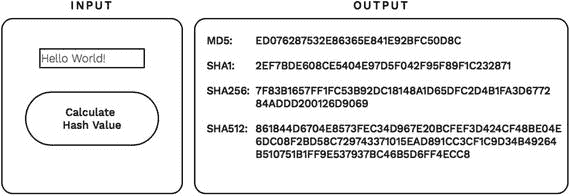

**图 10-1.** 计算一段短文本的哈希值

点击按钮后，右侧的输出框将显示使用四种不同哈希函数计算出的输入文本哈希值。哈希值通常也被称为哈希数，因为它们不仅使用数字 0 到 9，还使用字母 A 到 F（这些字母分别代表数值 11 到 16）来表示数值。这些数字被称为十六进制数。计算机科学家喜欢使用它们，原因在此我不赘述。请注意，由于生成这些值的哈希函数的具体实现细节不同，哈希值也各不相同。这些值被视为既定事实，因为我们不想陷入哈希函数实现这一广泛话题的细节中。

密码学哈希值通常很长，因此人眼难以阅读或比较。然而，在本步骤中，您将比较不同的数据哈希方式，这涉及阅读和比较哈希值。用密码学哈希值来执行此操作很快会变成一项繁琐的任务。因此，出于教学目的，在本步骤的后续部分，我将使用 SHA256 密码学哈希值的缩短版本。您可以通过配套网站提供的工具重现所有哈希值：[`www.blockchain-basics.com/Hashing.html`](http://www.blockchain-basics.com/Hashing.html)

当您用浏览器打开该网站时，会看到一个用于输入简单文本的输入框、一个带箭头指向输出框的按钮，如图 10-2 所示。点击带箭头的按钮，输出框将显示输入框中文本的缩短哈希值。

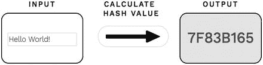

**图 10-2.** 计算一段文本的缩短哈希值

### 数据哈希的模式

到目前为止，您已经了解到可以将一段数据作为哈希函数的输入，从而得到该数据的哈希值。这意味着每一段独立的数据都有其唯一的密码学哈希值。但是，如果您需要为一组独立的数据提供一个单一的哈希值，该怎么办？请记住，哈希函数在给定时间内只接受一段数据。没有哈希函数能同时接受一组独立的数据，但在现实中，我们常常需要为大量数据提供一个单一的哈希值。特别是，区块链数据结构必须同时处理许多交易数据，并且需要为所有这些数据提供一个单一的哈希值。您该如何处理这个任务？

答案是使用以下某种模式来对数据应用哈希函数：

* 独立哈希
* 重复哈希
* 组合哈希
* 顺序哈希
* 分层哈希

#### 独立哈希

独立哈希意味着对每一段数据独立地应用哈希函数。图 10-3 通过分别计算两个不同单词的缩短哈希值来说明这一概念。

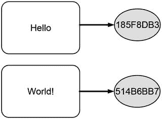

**图 10-3.** 独立哈希不同数据的示意图

每个包含一个单词的白色方框代表待哈希的数据，灰色圆圈显示对应的哈希值。从方框指向圆圈的箭头示意性地展示了数据到哈希值的转换过程。如图 10-3 所示，不同的单词会产生不同的哈希值。

#### 重复哈希

您已经了解到哈希函数可以将任意数据转换为哈希值。哈希值本身也可以被视为一段数据。因此，应该可以将一个哈希值作为哈希函数的输入，并计算其哈希值。这实际上是可行的！重复哈希就是将哈希函数重复应用于其自身输出。图 10-4 通过重复计算缩短哈希值来说明这一概念。文本 `Hello World!` 生成哈希值 `7F83B165`，而该值又进一步生成缩短哈希值 `45A47BE7`。

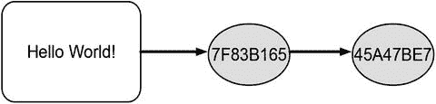

**图 10-4.** 重复计算哈希值

#### 组合哈希

组合哈希的目标是在一次操作中为多段数据得到一个单一的哈希值。将所有独立的数据合并为一段数据，然后计算其哈希值，是实现此目标的方法。如果您想为某个时刻可用的一组数据创建一个单一的哈希值，这尤其有用。由于合并数据会消耗计算能力、时间和内存空间，因此组合哈希仅在各个数据段较小时使用。组合哈希的另一个缺点是，各个数据段的哈希值无法获取，因为只有合并后的数据被传递给了哈希函数。

图 10-5 描绘了组合哈希的概念。各个单词首先被合并成一个单词，单词之间用空格隔开，然后再对生成的短语进行哈希。因此，图 10-5 中所示的哈希值结果与图 10-4 中的第一个哈希值相同。请注意，合并数据的哈希值关键取决于数据合并的方式。在图 10-4 中，两个单词是通过将它们并排写在一起、中间隔一个空格来合并的，因此最终生成了 `Hello World!`。有时，会使用特定的符号，如加号（`+`）或井号（`#`），来标记数据连接的点，这也会影响最终的哈希值。

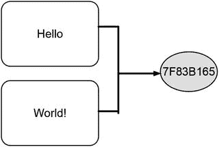

**图 10-5.** 合并数据并随后计算哈希值

##### 顺序哈希

顺序哈希的目标是在新数据到达时增量更新哈希值。这是通过同时使用组合哈希和重复哈希来实现的。现有哈希值与新数据合并，然后传递给哈希函数以获得更新后的哈希值。如果你希望随时间维护单个哈希值，并在新数据到达时立即更新它，顺序哈希尤其有用。这种哈希方式的一个优点是，在任何给定时间点，你都有一个哈希值，其演变过程可以追溯到新数据的到达。

图 10-6 通过先对单词 `Hello` 进行单独哈希来说明顺序哈希的概念，这产生了缩短后的哈希值 `185F8DB3`。一旦由单词 `World!` 表示的新数据到达，它就会与现有哈希值合并，并作为输入提供给哈希函数。哈希值 `5795A986` 是输入文本 `World! 185F8DB3` 的缩短哈希值。

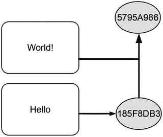

图 10-6. 顺序计算哈希值

##### 分层哈希

图 10-7 说明了分层哈希的概念。

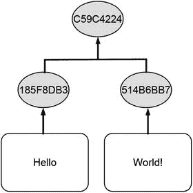

图 10-7. 分层计算哈希值

将组合哈希应用于一对哈希值，会形成一个小的哈希值层级结构，其顶部只有一个值。与组合哈希类似，分层哈希的思想是为一组数据创建单个哈希值。分层哈希更高效，因为它组合的是始终固定大小的哈希值，而不是可能任意大小的原始数据。此外，分层哈希在每一步只组合两个哈希值，而组合哈希会在一次尝试中组合你提供的所有数据。

### 展望

本步骤专门讨论了哈希函数的概念。步骤 11 将说明哈希值在实际生活中的使用方式，并重点介绍区块链如何使用它们。

### 总结

*   哈希函数将任何类型的数据转换为固定长度的数字，无论输入数据的大小如何。
*   存在许多不同的哈希函数，它们在生成的哈希值长度等方面有所不同。
*   密码学哈希函数是一类重要的哈希函数，可为任何类型的数据创建数字指纹。
*   密码学哈希函数具有以下属性：
    *   快速为任何类型的数据提供哈希值
    *   确定性
    *   伪随机性
    *   单向使用性
    *   抗碰撞性
*   可以通过使用以下模式来对数据应用哈希函数：
    *   重复哈希
    *   独立哈希
    *   组合哈希
    *   顺序哈希
    *   分层哈希

**脚注**

1 Weisstein, Eric W. 哈希函数. 来自 MathWorld: [`http://mathworld.wolfram.com/HashFunction.html`](http://mathworld.wolfram.com/HashFunction.html).

2 Rogaway, Phillip, 和 Thomas Shrimpton. 密码学哈希函数基础：原像抗性、第二原像抗性和碰撞抗性的定义、含义与区分. 载于 B. Roy 和 W. Meier (编), 快速软件加密. FSE 2004. 计算机科学讲义, 第 3017 卷. 国际快速软件加密研讨会. 柏林海德堡: Springer, 2004.

## 11. 现实世界中的哈希

比较数据与创建计算难题的故事

步骤 10 介绍了密码学哈希函数，并讨论了将哈希函数应用于数据的不同模式。步骤 10 可能看起来像是一项枯燥的智力练习，但实际上它具有高度的实践相关性。因此，本步骤专注于哈希函数和哈希值在现实世界中的应用。它考虑了哈希函数在现实生活中的主要用例，并解释了其背后的思路。本步骤还简要说明了这些用例为何能按预期工作。最后，本步骤指出了区块链在何处使用了哈希值。

### 比较数据

由于这是哈希值最直接的用例，因此首先考虑基于哈希值来比较数据。

### 目标

目标是在不逐字节比较内容的情况下比较数据（例如，文件或交易数据），并使比较任何类型、任何大小和内容的数据变得像比较两个数字一样简单。

### 思路

不是通过显式地逐字节比较内容来比较数据，而是比较它们的密码学哈希值。

### 工作原理

计算并比较所有待比较数据的密码学哈希值。如果所有密码学哈希值都不同，那么所有待比较的数据也不同。如果两个或多个密码学哈希值相同，那么它们对应的输入数据也是相同的。¹

### 为何有效

通过比较密码学哈希值来比较数据之所以有效，是因为密码学哈希函数具有抗碰撞性。

### 检测数据变更

基于哈希值比较数据的思路可以很容易地扩展到检测数据变更的情形。

### 目标

目标在于确定本应保持不变的数据（例如，文件或交易数据）在某个特定日期之后、或发送给某人之后、或存入数据库之后是否发生了更改。

### 思路

将过去创建的待检测数据的密码学哈希值与同一数据新创建的密码学哈希值进行比较，是识别变更的关键。如果两个哈希值相同，则说明数据在旧哈希值创建之后未发生更改。

### 工作原理

创建本应保持不变的数据的密码学哈希值。当需要在稍后时间点验证数据是否被更改时，再次创建该数据的密码学哈希值。然后将新创建的哈希值与过去创建的哈希值进行比较。如果两个哈希值相同，则说明数据在第一个哈希值创建之后未发生更改。否则，说明数据在此期间发生了更改。同样的思路也适用于将数据发送给某人的情况。如果发送方在发送数据前创建了数据的哈希值，接收方也创建了其收到数据的哈希值，那么发送方和接收方就可以比较这两个哈希值。如果两个哈希值相同，则说明数据在传输过程中未被篡改。

### 为何有效

检测数据变更实际上是一个将数据与自身在特定事件（例如时间流逝、存入或从数据库检索、通过网络发送）前后的状态进行比较的过程。检测本应不变的数据是否发生更改之所以有效，是因为密码学哈希函数具有抗碰撞性。

### 以变更敏感的方式引用数据

比较数据和基于哈希值检测变更可以被视为哈希值的基本用例。哈希值的一个稍微高级的应用是哈希引用，下面将对此进行介绍。

### 目标

目标是引用存储在别处（例如，硬盘上或数据库中）的数据（例如，交易数据），并确保这些数据保持不变。

### 理念

其核心理念是将所存储数据的加密哈希值与数据存储位置信息相结合。如果数据被篡改，这两部分信息将不再一致，从而导致哈希引用失效。

### 工作原理

数据引用在数字世界中的角色，相当于衣帽间的寄存牌。寄存牌指向你外套在衣帽间中的具体存放位置，你凭此牌稍后取回外套。计算机中的数据引用原理相同：它们是一组指向其他数据的数据片段。计算机程序利用引用来记住数据的存储位置，以便日后检索。哈希引用是一种特殊的引用，它利用了加密哈希值的强大功能。为简单起见，你可以将哈希引用想象成显示哈希值而非普通号码的衣帽间寄存牌。

哈希引用指向其他数据，并能额外验证被引用的数据自引用创建以来是否被更改。如果被引用的数据发生了更改，则该引用将不再允许检索这些数据。此时，哈希引用被视为损坏或无效。这类似于你有一张指向某个挂钩的寄存牌，但挂钩上已不再挂着你的外套。这种情况下，衣帽间服务员将无法再交还你的外套。

哈希引用的整体思路是保护其使用者，避免因技术错误导致的意外篡改，或他人未经告知的故意更改而检索到被修改的数据。因此，哈希引用被应用于所有要求数据一旦创建就应保持不变的场景。

#### 示意图解

区块链高度依赖哈希引用。因此，理解哈希引用对于理解区块链以及掌握本书后续步骤至关重要。基于此，以下三张图有两个目的：第一，它们以示意图方式阐释哈希引用的工作原理。第二，它们引入了一种哈希引用的图示表示法，该表示法将在后续步骤中用于说明区块链数据结构的运作。

图 11-1 通过展示一个有效的哈希引用，以示意图方式阐释了其工作原理。标注为 `R1` 的灰色圆圈代表一个有效的哈希引用。白色方框代表应保持不变的数据。从圆圈指向方框的箭头描绘了哈希引用的工作过程，即从引用指向其引用的数据。

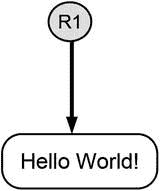

图 11-1. 有效哈希引用的示意图

图 11-2 展示了一个损坏或无效哈希引用的符号表示。

图 11-2. 无效哈希引用的示意图

包含修改后问候语的黑色方框代表在引用创建后被修改的数据。灰色圆圈仍代表最初创建的哈希引用。从圆圈指向修改后方框的折断箭头强调，哈希引用 `R1` 已损坏，它不再允许访问以检索数据，因为数据在此期间已被更改。

图 11-3 展示了数据更改后创建新哈希引用时的情况。该情况由代表已修改数据的黑色方框、代表新创建哈希引用的黑色圆圈，以及从圆圈指向方框的直箭头共同描绘。

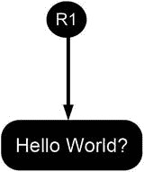

图 11-3. 被引用数据更改后新创建哈希引用的示意图

#### 原理阐释

哈希引用的关键在于它们利用了加密哈希值，这些哈希值可被视为数据的唯一指纹。因此，两个不同的数据片段拥有相同哈希值的可能性极低。由此，一个损坏的哈希引用即被视为是数据在引用创建后被篡改的证据。

### 以变更敏感的方式存储数据

基于数据哈希值进行引用的思想可以进一步扩展。一个自然的拓展便是以变更敏感的方式来存储数据。

### 目标

目标是存储大量数据，例如应保持不变的事务数据。任何对数据的更改都应能被快速、容易地检测到。

### 理念

衣帽间寄存牌指向挂着外套的挂钩。这简单又直接。但是，什么能阻止你将一张寄存牌放入另一件外套的口袋，并将那第二件外套也存放在衣帽间呢？结果是，后一张寄存牌指向一件口袋里装有另一张寄存牌的外套，而那张寄存牌又指向另一件外套。实际上，你可以创建由外套组成的长而复杂的链条：外套口袋里有寄存牌，指向其他外套，这些外套口袋里也有一张寄存牌，指向更远的外套，依此类推。类似地，我们可以将数据与指向其他数据的哈希引用存储在一起，而其他数据中又存储着指向更远数据的哈希引用，以此类推。如果在创建之后，任何一个数据或哈希引用被更改，那么所有的哈希引用都将被破坏。由于损坏的哈希引用可作为数据在引用创建后被篡改的证据，整个结构便以变更敏感的方式存储了数据。

### 工作原理

利用哈希引用以变更敏感方式存储数据有两种经典模式：

-   链式
-   树式

##### 链式

一条由数据链接而成的链条，也称为链表，² 当每块数据都包含一个指向另一块数据的哈希引用时形成。这种结构对于存储和链接那些并非在某一时刻全部可用，而是随着时间推移逐步到达的数据非常有用。图 11-4 使用前面介绍的符号说明了这一概念。创建这样的链条始于标记为 `Data 1` 的数据块以及哈希引用 `R1` 的创建。作为第一块数据，`Data 1` 不包含任何哈希引用。当新数据到达时，它们与指向 `Data 1` 的哈希引用放在一起。哈希引用 `R2` 指向新到达的数据和哈希引用 `R1`。哈希引用 `R3` 指向 `Data 3` 和哈希引用 `R2`，以类似方式创建。

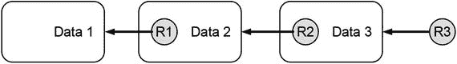

图 11-4. 以链式方式链接在一起的数据

你只需要使用哈希引用 `R3` 即可按数据到达的逆序访问链中的所有数据。引用 `R3` 也被称为链的头部，因为它指向最近添加的数据块。注意不要混淆术语“头部”（指最近添加的数据块）与“区块头”，后者将在步骤 14 讨论区块链数据结构时引入。

##### 树

图 11-5 展示了交易数据如何通过哈希引用以树状方式链接在一起。

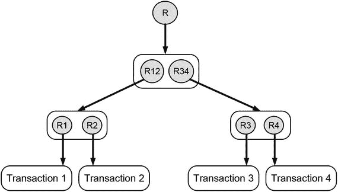

图 11-5. 数据以树状方式链接

这种结构也被称为默克尔树 ³，因为它是由一位名叫默克尔的计算机科学家提出的，并且它看起来像一棵倒置的树。它对于将同一时间可用的许多不同数据分组，并通过单个哈希引用使它们可访问非常有用。为了创建图 11-5 中所示的树，你从图底部方框代表的四个交易数据开始。首先，创建各个交易数据的哈希引用（`R1` 到 `R4`），然后将它们成对分组。随后，创建这些哈希引用对的哈希引用（`R12` 和 `R34`）。重复此过程，直到最终得到单个哈希引用，它也被称为默克尔树的根（标记为 `R`）。

### 为何有效

所解释的数据结构以对变更敏感的方式存储数据，因为它们通过哈希引用连接和组合数据。当这些引用所指向的数据在引用创建后被更改时，这些引用就会失效。因此，在此类结构中观察到失效的引用，就证明某些数据在结构创建后被更改了。否则，可以得出结论，整个结构自创建以来未被更改。

### 引发耗时的计算

哈希值不仅有助于使诸如比较、引用和存储数据等基本文件操作安全且高效。哈希值还可以用于让计算机用精心设计的谜题来挑战其他计算机。虽然这听起来有点奇怪，但事实证明，哈希值的这种用途是区块链最重要的概念之一。

### 目标

出于在本书后续步骤中会变得清晰的原因，你可能需要创建需要计算资源才能解决的谜题。这些谜题不应能通过存储在某个地方的知识或数据，或凭借思考（如智商测试或知识测试）来解决。解决这些谜题的唯一方法是依靠纯粹的计算能力和艰苦的计算工作。

### 思路

密码锁是一种特殊的锁，需要一组唯一的数字序列才能打开。如果你不知道打开锁的序列，你会系统地尝试所有可能的组合，直到最终找到打开锁的唯一组合。这种方法保证能打开锁，但非常耗时。系统地尝试所有可能的组合与知识或智力推理无关。打开密码锁的方法基于纯粹的努力和艰苦工作。哈希谜题是可以被视为通过反复试验打开密码锁的数字等价物的计算谜题。

### 工作原理

哈希谜题的要素包括 ⁴：

*   必须保持不变的数据
*   可以自由更改的数据，即所谓的 nonce
*   要使用的哈希函数
*   对组合哈希结果的限制，也称为难度级别

图 11-6 展示了哈希谜题的设置。对数据和 nonce 应用组合哈希。得到的哈希值必须满足给定的限制条件。

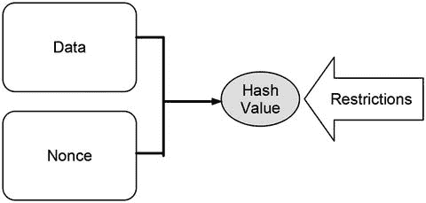

图 11-6. 哈希谜题的示意图

哈希谜题只能通过反复试验来解决。这需要猜测一个 nonce，使用所需的哈希函数计算组合数据的哈希值，并根据限制条件评估得到的哈希值。如果哈希值满足限制条件，你就解开了哈希谜题；否则，你继续尝试另一个 nonce，直到最终解开谜题。当 nonce 与给定数据组合后产生的哈希值满足限制条件时，该 nonce 被称为解。当你声称解开了哈希谜题时，必须始终提供那个特定的 nonce。

#### 一个说明性示例

让我们考虑一个真实的哈希谜题来说明其工作原理。在第 10 步中，你看到 `Hello World!` 的缩短哈希值是 `7F83B165`。但是，哪些数据与 `Hello World!` 组合后会产生一个以三个前导零开头的缩短哈希值呢？因此哈希谜题是：找到与 `Hello World!` 组合后能产生一个以三个前导零开头的缩短哈希值的 nonce。

让我们动手尝试一些 nonce。表 11-1 显示了 nonce、要哈希的文本以及得到的缩短哈希值。如你所见，nonce `614` 解开了哈希谜题，这意味着从 nonce `0` 开始并以 `1` 递增，你需要 `615` 步才能找到解。如果限制条件是找到一个具有一个前导零的哈希值，那么你在四步之后就已经解决了，因为 `Hello World! 3` 产生的哈希值有一个前导零。

表 11-1. 求解哈希谜题的 Nonce

| Nonce | 要哈希的文本 | 输出 |
| --- | --- | --- |
| 0 | `Hello World! 0` | `4EE4B774` |
| 1 | `Hello World! 1` | `3345B9A3` |
| 2 | `Hello World! 2` | `72040842` |
| 3 | `Hello World! 3` | `02307D5F` |
| … | … | … |
| 613 | `Hello World! 613` | `E861901E` |
| 614 | `Hello World! 614` | `00068A3C` |
| 615 | `Hello World! 615` | `5EB7483F` |

你可以自己在 [`www.blockchain-basics.com/HashPuzzle.html`](http://www.blockchain-basics.com/HashPuzzle.html) 尝试。

#### 难度级别

要求哈希值满足特定限制是哈希谜题的核心。因此，限制条件及其描述都不是随意的。相反，哈希谜题使用的限制条件被标准化，以便计算机可以用哈希谜题来挑战其他计算机。在哈希谜题的背景下，限制条件通常分别称为难度或难度级别。难度用自然数表示，指哈希值必须具有的前导零的数量。因此，难度为 `1` 表示哈希值必须具有（至少）一个前导零，而难度为 `10` 表示哈希值必须具有至少 `10` 个前导零。难度级别越高，所需的前导零就越多，哈希谜题就越复杂。哈希谜题越复杂，解决它所需的计算能力或时间就越多。

好的，作为一名高级文档工程师和翻译员，我将严格遵循您提供的注意事项和示例格式，将给定的英文文本翻译成中文。

#### 为何如此有效

哈希谜题的功能关键依赖于哈希函数是单向函数这一事实。无法通过检查哈希值必须满足的限制条件，然后反向应用哈希函数（即从期望的输出推导所需的输入）来解决哈希谜题。哈希谜题只能通过试错法求解，这需要消耗大量的算力，进而耗费大量的时间和能源。难度级别直接影响找到解所需要的平均尝试次数，这反过来又影响找到解所需的计算资源或时间。

哈希函数是确定性的，并能快速为任何类型的数据生成哈希值。因此，一旦找到解，就很容易验证：将数据与随机数结合后，确实能产生一个满足限制条件的哈希值。如果计算出的值不满足限制条件，不能归咎于哈希函数，因为偏差仅仅是由谜题未被解开这一事实引起的。

> **注意：** 在区块链的语境中，哈希谜题通常被称为工作量证明，因为它的解证明了某人已经完成了求解所必需的工作。

### 哈希在区块链中的应用

在区块链中，哈希被用于以下场景：

*   以变更敏感的方式存储交易数据
*   作为交易数据的数字指纹
*   作为一种对变更区块链数据结构施加计算成本的方式

### 展望

本步骤解释了哈希值的主要用途，并概述了它们在区块链中的使用。后续步骤将更详细地讨论区块链如何利用哈希。

### 总结

*   哈希值可用于：
    *   比较数据
    *   检测本应保持不变的数据是否被篡改
    *   以变更敏感的方式引用数据
    *   以变更敏感的方式存储数据集合
    *   创建计算密集型任务

**脚注**

[1] Tsudik, Gene. *使用单向哈希函数的消息认证*。ACM SIGCOMM 计算机通信评论 22.5 (1992): 29–38。

[2] Cormen, Thomas H. *算法导论*（第 3 版）。剑桥：麻省理工学院出版社，2009。

[3] Merkle, Ralph C. *公钥密码系统协议*。IEEE 安全与隐私研讨会 122 (1980)。

[4] Back, Adam. *Hashcash——一种拒绝服务攻击的应对措施*。2002。 [`http://www.hashcash.org/papers/hashcash.pdf`](http://www.hashcash.org/papers/hashcash.pdf)。

## 12. 识别与保护用户账户

密码学入门指南

除了哈希函数，区块链还广泛使用了另一项基础技术：非对称密码学。它是区块链中识别用户及保护其财产的基础。密码学常被认为复杂且难以理解。因此，本步骤旨在以一种易于理解的温和方式介绍密码学，使其足以理解区块链的安全概念。

### 隐喻

早在电子邮件、传真、电话和聊天应用发明之前，人们就使用传统邮件来发送消息。尽管有现代的竞争对手，传统邮件仍然存在，并被许多人使用。传统信件仍然由邮政员工递送，他们会将信件放入收件人的邮箱中。邮箱的工作原理类似于活板门。从设计上讲，通过投信口塞入一封信很容易，但想用同样的方式把信取出来却非常困难，因为取信本应只能由拥有开箱钥匙的收件人进行。这个概念已经使用了很久，当我们向电子邮件地址发送邮件、在最新的聊天应用中发送消息，或者向银行账户转账时，我们仍在沿用类似的概念。在所有这些情况下，安全概念都基于两种信息的分离：一是作为通往类似活板门盒子地址的公开信息；二是作为打开盒子并获取其中物品之钥匙的私有信息。区块链在保护私有数据时也应用了相同的概念。因此，记住这个隐喻可能会为你学习密码学世界提供一些指导。

### 目标

目标是唯一地识别所有者和财产，并确保只有合法所有者才能访问其财产。

### 挑战

区块链是一个对所有人开放的*点对点*系统。任何人都可以连接并贡献计算资源或向系统提交新的交易数据。然而，并非所有人都能访问分配给区块链所管理账户的财产。私有财产的一个基本特征是其排他性。将所有权转让给另一个账户的权利仅限于放弃所有权的账户所有者。因此，区块链面临的挑战是在不限制分布式系统开放架构的前提下，保护分配给账户的财产。

### 理念

理念是将账户视为邮箱：任何人都可以向其转移财产，但只有账户所有者才能访问收集在内的物品。邮箱的主要特征是它的位置是公开的，因此任何人都可以放入东西，但只有所有者才能用钥匙打开它。一方面是公开的邮箱，另一方面是私人持有的钥匙，这种二元性在数字世界中有其对应物：公私钥加密。公钥用于识别账户，任何人都可以向其转移所有权，而访问权限则仅限于拥有对应私钥的人。¹

### 密码学小讲堂

为了帮助你理解密码学，我将讨论以下几个方面：

*   密码学的主要思想
*   术语
*   对称密码学
*   非对称密码学

#### 密码学的主要思想

密码学的主要思想是保护数据不被未经授权的人访问。它是门锁或银行保险箱的数字等效物，后者也是保护其内容不被未经授权的人访问。类似于物理世界中的锁和钥匙，密码学也使用密钥来保护数据。

#### 术语

锁闭操作的数字等效是加密，而开锁操作的数字等效是解密。因此，在讨论使用密码学保护数据时，我们用术语`encryption`（加密）和`decryption`（解密）分别指代保护数据和解除保护。加密后的数据称为`cypher text`（密文）。对于不知道如何解密的人来说，`密文`看起来就像一堆无用的字母和数字。然而，`密文`其实非常有用，但仅对拥有必要解密密钥的人而言。解密后的`密文`与加密前的原始数据完全相同。因此，整个密码学往返过程可以总结为：从一些数据开始，用加密密钥对原始数据进行加密生成`密文`，保存或发送`密文`给某人，最后用解密密钥对`密文`进行解密恢复出原始数据。图 12-1 示意了密码学的基本工作原理。

图 12-1. 基本密码学概念及其术语的示意图

如果有人试图用错误的密钥解密`密文`，会发生什么？结果是一堆无用的数字、字母和符号，无法揭示任何被加密的数据。

#### 对称密码学

许多年来，人们使用的密码学方法都是使用相同的密钥来加密和解密数据。因此，任何能够用这样一个密钥加密数据的人，也自动能够解密用该密钥生成的`密文`。由于加密和解密使用的是相同的密钥，这被称为`symmetric cryptography`（对称密码学）。图 12-2 示意了对称密码学的基本工作原理，其中使用相同的密钥来加密和解密一条简短的问候语。

图 12-2. 对称密码学的示意图

然而，事实证明，加密和解密使用同一个密钥并不总是理想的做法。因此，`asymmetric cryptography`（非对称密码学）被发明了出来。

#### 非对称密码学

`非对称密码学`始终使用两个互补的密钥。但其中有一个巧妙之处：用一个密钥创建的`密文`只能用另一个密钥解密，反之亦然。

图 12-3 示意了非对称密码学的加密-解密往返过程。你可以通过以下方式理解这幅图：图 12-3 的上半部分示意了加密过程，下半部分示意了解密过程。有两个密钥：一个白键和一个黑键。它们共同组成一对对应的密钥。原始消息用黑键加密，生成由包含白色字母的黑色方框表示的`密文`。原始消息也可以用第二个密钥加密，生成由包含黑色字母的白色方框表示的不同`密文`。为便于教学，表示`密文`的方框颜色与生成它们的密钥颜色相同，以突出其关联性：黑键生成黑色`密文`，而白键生成白色`密文`。

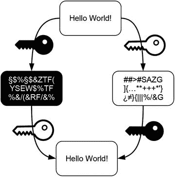

图 12-3. 非对称密码学的示意图

图 12-3 的下半部分示意了非对称密码学中解密的工作原理。黑色`密文`只能用白键解密，反之亦然。

非对称密码学的巧妙之处在于，你永远不能用创建`密文`的那个密钥来解密它。决定哪个密钥用于加密、哪个用于解密完全取决于你。你可以根据每次要加密的新数据随意切换密钥的角色，但为了既能加密又能解密，你必须始终保留两个密钥。如果你只拥有其中一个密钥，你的能力将受到限制。虽然你总是可以用你的密钥对数据进行加密从而创建`密文`，但你无法解密它，因为你缺少互补的密钥。不过，你可以解密用对应的互补密钥创建的`密文`。一个孤立的密钥就像一条单行道：你可以顺着这条路开过去，但永远无法在同一条路上开回来。由于其密码学能力的不对称分布，这两个密钥允许你将能够创建`密文`的人群与能够解密`密文`的人群分离开来。

### 现实世界中的非对称密码学

在现实生活中使用非对称密码学包括两个主要步骤：

*   创建和分发密钥
*   使用密钥

#### 创建和分发密钥

在现实生活中使用非对称密码学时，你会给这两个密钥赋予特定的名称，以突出各自的作用。通常，这些密钥被称为`private key`（私钥）和`public key`（公钥）。因此，非对称密码学也被称为`公私钥密码学`。然而，非对称密码学本身并不存在所谓的`私钥`和`公钥`，因为你知道你既可以用它们中的每一个来加密数据，也可以解密`密文`。正是赋予这些密钥的角色使得它们成为私钥或公钥。`公钥`分发给所有人，无论其可信程度如何。从字面意义上讲，任何人都可以拥有`公钥`的副本。然而，`私钥`需要被安全地保管，保持私密。

因此，在任何非对称密码学的应用中，首先要执行的步骤是：

1.  使用密码学软件创建一对互补的密钥
2.  将一个密钥命名为`公钥`
3.  将另一个密钥命名为`私钥`
4.  自行保管好`私钥`
5.  将你的`公钥`分发给其他所有人

#### 使用密钥

使用这对密钥有两种通用方式，其区别在于数据流动的方向：

*   `公钥到私钥`
*   `私钥到公钥`

##### 公钥到私钥

以这种方式使用密钥时，信息从用于加密的`公钥`流向用于解密的`私钥`。这种使用两个互补密钥的方式类似于一个邮箱：每个人都可以往里面投递信件，但只有所有者才能打开它。这是非对称密码学的直接用法，因为它符合我们对隐私和公开的直观理解——就像我们的地址和邮箱是公开的，但其内容是私密的。因此，这种使用非对称密码学的方式，核心在于以安全的方式向`私钥`的所有者发送信息。其工作原理是：每个人都可以用`公钥`创建`密文`，但只有`私钥`的所有者才能解密`密文`并读取消息。

##### 私钥到公钥

以这种方式使用密钥时，信息从用于加密的`私钥`流向用于解密的`公钥`。这种使用两个密钥的方式类似于公共新闻板或公告板：任何拥有`公钥`副本的人都可以读取消息，但只有`私钥`的所有者才能创建消息。因此，这种使用非对称密码学的方式，核心在于证明作者身份。其工作原理是：每个人都可以用`公钥`来解密用对应的`私钥`创建的`密文`。由于用`私钥`创建的`密文`只能用对应的`公钥`解密，这一事实就证明了对应该`私钥`的所有者加密了该消息。

### 区块链中的非对称加密

区块链使用非对称加密来实现两个目标：

-   识别账户
-   授权交易

#### 识别账户

区块链需要识别用户或用户账户，以维护所有者与财产之间的映射关系。区块链采用非对称加密的公钥到私钥方法来识别用户账户，并在账户之间转移所有权。区块链中的账户号码实际上是公钥。因此，交易数据使用公钥来识别参与所有权转移的账户。在这方面，区块链将用户账户视为邮箱：它们拥有一个公开的地址，任何人都可以向其发送消息。

#### 授权交易

交易数据必须始终包含一段数据，用于证明放弃所有权的账户所有者确实同意所描述的所有权转移。这种同意所隐含的信息流始于放弃所有权的账户所有者，并应传递给所有检查交易数据的人。这种信息流类似于非对称加密的私钥到公钥用例所隐含的信息流。放弃所有权的账户所有者使用其私钥创建一段密文。所有其他人可以通过使用公钥（恰好是放弃所有权的账户号码）来验证这一同意证明。这个被称为数字签名的过程的细节将在下一步中详细解释。

### 展望

这一步解释了非对称加密的概念，以及它如何在现实生活中作为公私钥加密使用。此外，这一步还解释了区块链使用公钥来识别用户账户。此外，合法所有者通过创建可追溯其私钥的数字签名来授权交易。下一步将更详细地解释这一概念，因为这种非对称加密的用法不如通过公钥识别账户那么直观。

### 总结

-   加密的主要目标是保护数据不被未经授权的人访问。
-   加密的主要活动包括：
    -   加密：通过使用加密密钥将数据转换为密文来保护数据。
    -   解密：通过使用匹配的加密密钥将密文恢复为可用的数据。
-   非对称加密总是使用两个互补的密钥：使用其中一个密钥创建的密文只能用另一个密钥解密，反之亦然。
-   在现实生活中使用非对称加密时，这些密钥通常被称为公钥和私钥，以突出它们的作用。公钥与所有人共享，而私钥则保密。因此，非对称加密也被称为公私钥加密。
-   公钥和私钥有两个经典用例：
    -   每个人都使用公钥加密数据，这些数据只能由相应私钥的所有者解密。这相当于一个公共邮箱的数字版本，每个人都可以往里面放信件，但只有所有者才能打开。
    -   私钥的所有者使用它加密数据，任何拥有相应公钥的人都可以解密这些数据。这相当于一个证明作者身份的公共公告板的数字版本。
-   区块链使用非对称加密来实现两个目标：
    -   识别账户：用户账户是公钥。
    -   授权交易：放弃所有权的账户所有者使用相应的私钥创建一段密文。这段密文可以通过使用对应的公钥（恰好是放弃所有权的账户号码）进行验证。

脚注 1

Nakamoto, Satoshi. Bitcoin: A peer-to-peer electronic cash system. 2008. [`https://bitcoin.org/bitcoin.pdf`](https://bitcoin.org/bitcoin.pdf)。

2

参见 Van Tilborg, Henk, 和 Sushil Jajodia 编辑的《密码学与安全百科全书》。纽约：Springer Science & Business Media，2014 年。

## 13. 授权交易

利用数字签名作为手写签名的数字等价物

第 12 步对非对称加密进行了简要介绍。它还指出，区块链使用公钥作为账户号码，并利用非对称加密的公钥到私钥方法在账户之间转移所有权。然而，这只是故事的一半。区块链需要确保只有合法所有者才能将其财产转移到其他账户。这正是授权概念出现的切入点。因此，这一步解释了如何在区块链中使用非对称加密来授权交易。特别是，这一步致力于解释数字签名的概念，它利用了非对称加密的私钥到公钥方法。

### 比喻

手写签名有一个重要目的：表示同意文件的内容并同意其执行。我们接受手写签名作为同意的证据，是因为每个人的笔迹都是独一无二的。每个人都有自己书写姓名的独特方式。因此，当我们识别出以特定方式书写的姓名时，我们得出结论，以这种特定方式书写姓名的人确实产生了那个手写签名，因此，我们可以得出结论，此人已同意文件的内容及其执行。这一步解释了在电子账本中声明同意交易的概念，这与手写签名类似。这个概念对于区块链中单个交易的安全性至关重要。

### 目标

确保只有账户所有者才能将其关联的财产转移到其他账户，这一点很重要。任何非合法所有者访问账户及其关联财产的尝试都应被识别为未经授权并被拒绝。

### 挑战

所讨论的点对点系统对所有人开放。因此，任何人都可以创建交易并将其提交到系统中。交易数据是描述和明确所有权的基础。只有账户的合法所有者才能将其账户关联的财产或所有权转移到另一个账户。区块链面临的挑战是，在将所有权转移限制为仅合法所有者的同时，保持其开放性。

### 思路

确保只有合法所有者才能转移所有权的主要思路是利用一种数字安全措施，该措施相当于手写签名并服务于相同的目的：识别账户，声明其所有者同意特定交易数据的内容，并通过允许数据添加到交易历史中批准其执行。

### 数字签名简介

数字签名相当于手写签名。它们利用加密哈希和非对称加密的私钥到公钥信息流。以下简短示例说明了数字签名的三个主要元素：

-   创建签名
-   使用签名验证数据
-   使用签名识别欺诈

#### 创建签名

假设我想以授权方式向全世界发送一条“Hello World！”问候语。因此，我创建了一条包含该问候语及其对应数字签名的消息。图 13-1 描述了数字签名数据的完整过程。该过程从图 13-1 左上角包含问候语的白色方框开始。我创建该问候语的哈希值，即 `7F83B165`，并用我的私钥对其进行加密。该问候语哈希值的密文（包含白色字母的黑色方框）就是我对该问候语的数字签名。它在两个方面具有唯一性：首先，它可以唯一地追溯到我的身份，因为它是由我独特的私钥创建的。其次，它对于问候语的文本也是唯一的，因为它基于问候语的数字指纹。问候语和数字签名被共同放入一个文件（灰色方框）中，这就是我向全世界发送的数字签名消息。

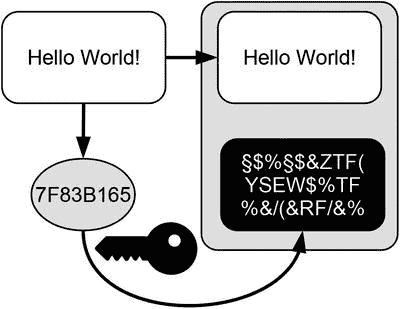

图 13-1. 创建数字签名的示意图

#### 使用签名验证数据

这条消息，即我的问候语连同数字签名，被发送给了全世界。任何人都可以使用我的公钥来验证我是否授权了这条消息。图 13-2 说明了使用数字签名验证消息的过程。该过程从问候语开始。首先，消息接收者自行计算问候语的哈希值，得到 `7F83B165`。然后，消息接收者用我的公钥解密附带的密文（数字签名）。解密后得到的值为 `7F83B165`，这正是我希望发送给全世界的那个版本问候语的哈希值。比较两个哈希值即可完成验证。由于两个哈希值完全相同，接收者可以正确得出结论：第一，这条消息是由我签名的，因为他能够用我的公钥解密签名；第二，消息中的问候语文本确实是我想要发送的，因为解密的密文与消息中问候语的哈希值一致。

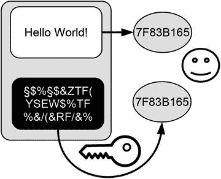

图 13-2. 使用数字签名验证消息

#### 使用签名识别欺诈

图 13-3 说明了数字签名如何揭示一条被篡改的问候语。

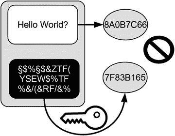

图 13-3. 使用数字签名识别欺诈

图 13-3 显示了到达我朋友邮箱的消息。注意问候语文本的变化。某个黑客将感叹号替换成了问号，从而改变了问候语的整体语气。这不是我向世界问候的方式。幸运的是，数字签名会向所有人指出该消息是在违背我意愿的情况下被篡改的。

首先，消息接收者自行计算问候语的哈希值，得到 `8A0B7C66`。然后，消息接收者用我的公钥解密数字签名。解密后得到 `7F83B165`，这是我希望发送给全世界的那个版本问候语的哈希值。比较两个哈希值，会发现它们并不相同。这清楚地表明，消息中的问候语并非我本想发送给世界的问候语。因此，所有人都能得出结论：我并未授权此消息，所以没有人会让我对其内容负责。

### 工作原理

区块链中的数字签名满足以下要求：

-   它们表明移交所有权的账户所有者同意特定的交易数据。
-   它们对于整个交易数据内容是唯一的，以防止在没有其作者同意的情况下被用于授权其他交易。
-   只有移交所有权的账户所有者才能创建此类签名。
-   任何人都可以轻松验证它们。

区块链中的数字签名有两种用例：

-   签署交易
-   验证交易

#### 签署交易

为了创建交易的数字签名，移交所有权的账户所有者执行以下步骤：

1.  描述交易及其所有必要信息，例如涉及的账户号码、转账金额等，但不包括签名本身，因为此时签名尚不可用。
2.  创建交易数据的加密哈希值。
3.  使用移交所有权的账户的私钥加密交易的哈希值。
4.  将步骤 3 中创建的密文作为该交易的数字签名添加到交易中。

#### 验证交易

为了验证一笔交易，必须执行以下步骤：

1.  计算待验证交易数据（除签名本身外）的哈希值。
2.  使用移交所有权的账户号码解密所考虑交易的数字签名。
3.  比较步骤 1 中的哈希值与步骤 2 中得到的值。如果两者相同，则该交易已得到与移交所有权的账户相对应的私钥所有者的授权；否则未授权。

### 为何有效

交易数据的数字签名是以下两者的结合：

-   交易数据的加密哈希值
-   可以追溯到账户对应私钥的密文

由于加密哈希值可以被视为数字指纹，因此它们对每笔交易都是唯一的。公钥-私钥加密的一个构成特性是，用一个密钥创建的密文只能用对应的密钥解密。两个密钥的关联是唯一的。因此，用特定公钥成功解密密文，可以作为该密文是由对应私钥创建的证明。这两个概念结合起来，用于创建可以在一个过程中唯一追溯到特定交易数据和特定私钥的密文。这一特性使得数字签名适合作为证据，证明用于创建数字签名的私钥所有者确实同意该交易的内容。

### 展望

这一步骤完成了区块链如何在单个交易数据层面保护所有权的流程。因此，交易及其用于转移和证明所有权的目的是安全可靠的。然而，确保交易数据不仅在单个层面得到保护这一点至关重要。仍然需要以安全的方式存储整个交易数据的历史记录。后续步骤将更详细地解释如何实现这一点。

### 总结

-   文件上的手写签名表明签署者同意所签署文件的内容，并授权执行这些文件。
-   手写签名的证明力基于笔迹的独特性。
-   数字签名是手写签名的数字等价物。
-   数字签名有两个目的：
    -   唯一地识别签署者
    -   表明签署者同意文件内容并授权执行
-   在区块链中，交易的数字签名是交易数据的加密哈希值，该哈希值使用与转移所有权的账户相对应的私钥进行加密。
-   区块链中的数字签名可以唯一地追溯到一个特定的私钥，以及一个过程中的一个特定交易。

## 14. 存储交易数据

构建并维护交易数据的历史记录

基于前面五个步骤，你现在应该能够根据整个交易数据历史追溯所有权，并通过使用数字签名授权交易和唯一识别用户账户，以安全的方式描述单个所有权的转移。然而，我还没有讨论如何安全地存储构成交易历史的所有交易数据。这正是区块链数据结构进入讨论的地方。这一步将介绍区块链数据结构，并解释其构建方式。

### 隐喻

你还记得上一次去图书馆并使用传统卡片目录是什么时候吗？图书馆目录是图书馆所藏所有书籍的登记册。一些传统图书馆仍然使用卡片目录来管理库存。这些目录中的每张卡片代表一本书，卡片上显示该书的主要信息，例如作者姓名、书名、出版日期以及该书在图书馆中的位置，如楼层、房间、书架和架号。为了识别书籍，目录卡片通常包含唯一的参考编号，这些编号也显示在书脊上。大多数图书馆会维护不止一个卡片目录，这些目录的排序标准不同。例如，在作者目录中，卡片按作者姓名的字母顺序排序；而在书名目录中，卡片则按书名的字母顺序排序。也可以设计一个排序目录，其中的卡片按书籍添加到图书馆的顺序排序。这一步将解释区块链如何以一种类似于拥有排序目录的图书馆的方式存储交易数据。

### 目标

区块链的目标是以有序的方式维护整个交易数据的历史记录。

### 挑战

挑战在于存储所有发生过的交易数据，既要保持交易发生的顺序，又要能够快速、轻松地检测到对数据所做的任何更改。快速检测更改非常重要，因为这是防止篡改或伪造交易历史的基础。

### 思路

思路是创建一个交易数据图书馆，并维护一个排序目录，该目录保存交易添加到图书馆的顺序。为了检测对排序目录或单个交易数据所做的任何更改，必须使用哈希引用以对更改敏感的方式存储数据。

### 将一本书转化为区块链数据结构

本节将解释如何将一本书转化为一个带有排序目录的小型图书馆，这实际上是区块链数据结构的简化版本。

#### 起点：一本书

几个世纪以来，书面信息被保存在笨重的羊皮纸卷轴上，这些卷轴被称为卷轴。如今，我们习惯将书面信息保存在手抄本中：用硬皮装订的、带有编号页码的册子，我们称之为书籍。由于书籍如此普遍，我们可能认为其创新理所当然。它们的一些重要特性包括：

-   存储内容：书籍在其页面上存储内容。
-   排序：页面上的句子以及书中的页面都保持顺序。
-   连接页面：页面通过书脊物理连接，并通过其内容和页码逻辑连接。

由于这些特性，我们可以通过翻页在书中前后浏览，或者利用页码直接跳转到特定页面。让我们看看如果改变其中一些特性，我们能实现什么。

#### 转换 1：使页面依赖关系显式化

图 14-1 展示了一本非常简单的书的两页的示意图。每页包含一个显示页码的顶部边距，以及一个只包含一个单词的内容区域。

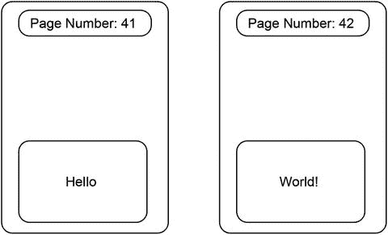

图 14-1. 书页示意图

页码有一个重要用途：你可以通过验证页码是否连续（没有遗漏任何数字）来查明是否有人从书中移除了一页。假设你现在正在阅读这本简化书的第 42 页。前一页应该是多少页码？这非常简单：前一页应该是 41 页，等于 42 减 1。为了验证确实没有人移除前一页，我们将前一页上显示的数字与预期的页码（即当前页码减 1）进行比较。如果这两个数字相等，我们就可以断定前一页没有被移除。

为什么我们知道前一页的页码应该等于当前页码减 1？答案是我们假设所有书籍都遵循使用自然数连续标注页码的惯例。但是，如果书籍的作者或出版商决定使用不同的页码方案（例如，只使用偶数或三的倍数），那么这个假设就不成立。在这种情况下，我们验证前一页未被移除的方法就失效了。为了更容易地验证书中没有页面被移除，我们可以显式地指出每个页面与其前驱页面的联系。图 14-2 展示了在我们的简化书中如何做到这一点。每一页不仅显示自己的页码，还显示其前驱页面的页码。这种页码方案使任何页面与其前驱页面之间的依赖关系显式化。显式引用前驱页面使得验证没有页面被移除变得非常容易，因为它不再依赖于隐含的假设。

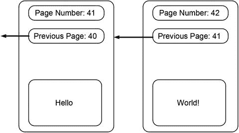

图 14-2. 带有显式前驱页面引用的书页

#### 转换 2：内容外包

书中的页面包含内容以及维持其顺序所需的信息：页码。我们可以通过将内容外包来让书更方便，使其只专注于维护顺序这一任务。图 14-3 展示了我们书中的页面在外包内容后的样子。这些页面不再包含任何内容，而是包含指向内容的引用编号，这些内容可以存放在我们想要的任何地方（例如，放在一个盒子里、架子上或别处）。

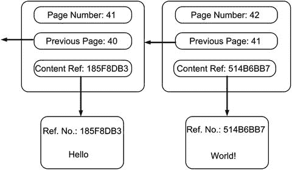

图 14-3. 带有指向外包内容的引用值的书页

这一步骤的成果如下：我们把书变成了一座小型图书馆。那本曾将内容和页码存储在一起的书，已经变成了一本目录，其唯一目的是维护内容的顺序，而内容则存储在由唯一引用编号标识的独立页面上。

#### 转换 3：替换页码

现在已成为排序目录的这本书通过两种不同的方式来维护其页面的顺序：首先，通过页面在书中被固定于书脊的物理位置；其次，通过页码以及对前序页面的显式引用。由于书的物理结构保留了页面的顺序，我们可以尝试一种不同的页码编号方案。我们实际上可以用引用编号来替换用于标记页面的自然数。图 14-4 展示了这一转换的结果。例如，之前页码为 42 的页面现在由页面引用编号 `8118E736` 标识。类似地，之前页码为 41 的页面现在由页面引用编号 `B779E800` 标识。注意，对前序页面的引用也已更新。引用编号为 `8118E736` 的页面包含其前序页面的正确引用编号。

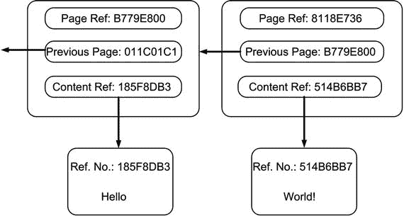

图 14-4. 使用引用编号作为页码的书页

#### 转换 4：创建引用编号

在上一个转换中，我们用引用编号替换了书中的页码。然而，我还没有讨论这些引用编号是如何创建的。创建唯一引用编号的最佳方法是使用加密哈希值。因此，我们可以使用其内容的数字指纹——加密哈希值——来标识目录中的页面以及对应的内容页面。为简单起见，图 14-3 和图 14-4 都使用了缩短的哈希值。（你可以通过使用 [`www.blockchain-basics.com/Hashing.html`](http://www.blockchain-basics.com/Hashing.html) 提供的工具来验证结果。）例如，包含单词 `Hello` 的内容页面由 `Hello` 的缩短哈希值 `185F8DB3` 标识。我们的书页面的引用值是根据其内容计算得出的，该内容包含内容引用编号和前序页面的引用编号。例如，页面引用编号 `B779E800` 是 `011C01C1 185F8DB3` 的哈希值。

#### 转换 5：取消书脊

我们的排序目录是一本不寻常的书，因为它的每个页面都包含自身的引用编号、前序页面的引用编号以及相应内容页面的引用编号。然而，我们的排序目录仍然是一本传统书籍，其页面被固定于书脊之中。

如果我们取消书脊，把我们的排序书变成一堆散页，会发生什么呢？这样做会破坏页面之间的物理连接，从而我们也会失去页面的物理顺序。幸运的是，页面的顺序并没有完全丢失。每个页面都包含其前序页面的引用编号。因此，我们可以通过跟随指向下一页的页面引用编号，逐页向前移动。如果我们把排序目录的最后一页单独保留，我们总是可以逆序浏览所有页面。

#### 目标达成：品味成果

让我们总结一下在这个例子中取得的成果。我们把一本经典的书变成了两堆物理上无序的散页，这些页面通过唯一的引用编号连接在一起。一堆页面包含内容，而另一堆页面维护顺序。为简单起见，我们将后一堆页面称为排序目录。排序目录的每个页面都包含指向其前序页面的引用编号以及相应内容页面的引用编号。这样一来，我们将排序与信息存储分离开来，也将逻辑位置（顺序）与页面的物理位置分离开来。由于我们使用了哈希值作为引用编号，任何人都可以通过简单地重新计算它们来验证其正确性。由于排序目录的页面不再固定在书脊上，我们只能通过跟随指向下一页的页面引用编号，以逐页的方式向后浏览。为便于参考，表 14-1 总结了我们的书在转换前后的属性。

表 14-1. 比较转换前后的书

| 属性 | 书 | 转换后的书 |
| --- | --- | --- |
| 存储内容 | 在页面本身 | 在独立的内容页面上。每个内容页面由一个唯一的引用编号标识 |
| 内容排序 | 物理上：基于页面在书中的位置。逻辑上：基于页码 | 逻辑上：通过一个包含指向内容页面的引用值的排序目录 |
| 连接页面 | 物理上：通过将页面固定在书脊中。逻辑上：基于页码 | 逻辑上：通过引用编号 |
| 浏览页面 | 向前。向后。通过页码直接跳转到页面 | 仅向后：通过跟随指向下一页的引用编号 |

### 区块链数据结构

什么是`区块链数据结构`？实际上，答案你已经知晓，因为前面的例子开发了一个简化的`区块链数据结构`，只是我们使用了不同的术语。本节通过将改造后的书籍元素与区块链语境下的术语进行关联，完成类比分析。

我们改造后的书籍包含：

- 由订购目录页及其对应内容页构成的逻辑单元
- 称为订购目录的散页堆
- 存放内容的散页堆
- 用于标识和关联订购目录页的页码引用
- 用于标识和关联内容页的内容引用

为便于查阅，本节末尾的表格 14-2 通过对比改造后书籍元素与`区块链数据结构`元素，总结了对应关系。

表 14-2.
改造后书籍与区块链数据结构对比

| 改造后书籍 | 区块链数据结构¹ |
| --- | --- |
| 订购目录中的一页 | 区块头 |
| 整个订购目录 | 区块头链 |
| 订购目录中的页码号 | 区块头的加密哈希值 |
| 前一页的引用编号 | 前一个区块头的加密哈希值 |
| 内容 | 交易数据 |
| 内容页 | 包含交易数据的默克尔树 |
| 内容页引用 | 包含交易数据的默克尔树根 |
| 订购目录页及其对应内容页构成的逻辑单元 | `区块链数据结构`中的一个区块 |
| 整个订购目录和所有内容页 | `区块链数据结构` |

#### 订购目录页及其对应内容页构成的逻辑单元

订购目录页及其对应内容页构成的逻辑单元对应`区块链数据结构`中的一个区块。所有这些区块共同构成`区块链数据结构`。需要特别指出的是，订购页与内容页的单元仅是逻辑上的概念，因为订购目录页和内容页在物理上是分离的实体。前者通过哈希引用关联后者，从而形成逻辑上的统一体。

#### 订购目录

改造后书籍的订购目录等同于`区块链数据结构`中的区块头链。订购目录中的每一页对应`区块链数据结构`中的单个区块头。由于区块头通过引用以线性方式相互连接，如同链条的链环，它们形成了区块头链。与订购目录类似，区块头链不直接存储交易数据，仅存储对应交易数据的哈希引用。这正是订购目录与内容的逻辑单元变得重要的关键点。

#### 内容页

改造后书籍的内容等同于区块链维护的交易数据。这些数据专属于我们管理所有权的应用领域。现实世界的区块链应用中没有"内容页"这一概念——我是出于教学目的编造了这个术语。实际区块链应用将内容数据（如交易数据）直接存储在数据库中，我们称其为默克尔树，其根植于区块头中。

#### 目录页码引用

改造后书籍中用于标识订购目录页的页码引用，等同于`区块链数据结构`中单个区块头的加密哈希值。它们分别被称为区块哈希或前一个区块的哈希。这些哈希值用于唯一标识每个区块头，并引用前一个区块头。从一个区块头到其前任的实际引用通过哈希引用实现。

#### 内容引用编号

改造后书籍中用于标识内容页的内容引用编号，等同于区块头链中指向关联交易数据的哈希引用。更具体地说，存储在区块头中的内容引用编号，是数据库中交易数据默克尔树的树根。这正是订购目录（区块头）与其对应内容（包含交易数据的默克尔树）构成逻辑统一体的关键所在。

### 在区块链数据结构中存储交易

图 14-5 通过示意图总结了您学到的知识，展示了一个存储四笔交易的`区块链数据结构`。图 14-5 所示的简化`区块链数据结构`包含两个区块，分别标注为`区块 1`和`区块 2`。为强调区块的逻辑本质，它们用虚线绘制。两个区块分别包含标注为`区块头 1`和`区块头 2`的区块头。`区块 1`是该数据结构中的第一个区块，因此没有前驱区块，故`区块头 1`不含指向前驱区块头的引用。由于`区块 2`有前驱，`区块头 2`维护了一个指向其前驱区块头的哈希引用（标注为`B1`）。图中展示的`区块链数据结构`维护了两个不同默克尔树的哈希引用，其树根分别标注为`R12`和`R34`。默克尔树根的标签已经提示了它们包含的交易数据（例如，根为`R12`的默克尔树包含前两笔交易，标注为`交易 1`和`交易 2`，以及指向它们的哈希引用`R1`和`R2`）。

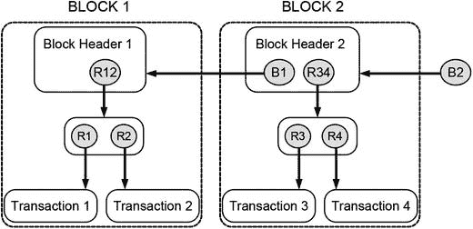

图 14-5.
一个包含四笔交易的简化`区块链数据结构`

如果您加入了一个维护如图 14-5 所示`区块链数据结构`的分布式点对点系统，您将收到所有交易数据、所有哈希引用值以及所有区块头。基于这些数据，您的本地计算机会创建包含指向本地存储数据的哈希引用的`区块链数据结构`。拥有这些数据以及对最新区块头的引用，您就能按逆序浏览自系统创建以来提交的所有交易数据的历史记录——在此例中就是四笔交易。请注意，最新添加的区块头引用被称为`区块链数据结构`的头部，因为它是下一个区块将添加的位置。有时最新添加的区块头及其指向的引用都被称为`区块链数据结构`的头部。在图 14-5 中，标注为`B2`的引用就是`区块链数据结构`的头部。务必注意不要混淆"头部"和"区块头"这两个术语：`区块链数据结构`由多个区块组成，每个区块都有自己的区块头，但整个`区块链数据结构`只有一个头部。

⚠️ 注意

本节讨论的及图 14-5 所示的`区块链数据结构`已因教学目的进行了简化。关于区块头中存储信息的许多细节已被刻意省略。其中的部分内容将在后续步骤中，随着您对区块链理解的深入而逐步介绍。

### 展望

本步骤介绍了区块链数据结构并阐释了其构建方式。区块链数据结构通过大量使用哈希引用，成为一种对数据变更极其敏感的存储方式。下一步将更详细地解释这一特性，因为它是理解区块链如何实现安全性的关键。

### 总结

-   区块链数据结构是一种特殊的数据结构，由称为区块的有序单元构成。
-   区块链数据结构中的每个区块由一个区块头和一个包含交易数据的默克尔树组成。
-   区块链数据结构包含两大主要数据结构：一个有序的区块头链和多个默克尔树。
-   可以将有序的区块头链想象为传统图书馆目录卡的数字对等物，其中每张目录卡均按其加入目录的顺序进行排序。
-   每个区块头引用其前一个区块头，这分别保留了构成区块链数据结构的各个区块头与区块的顺序。
-   区块链数据结构中的每个区块头通过其加密哈希值进行标识，且包含指向其前一个区块头的哈希引用，以及一个指向其维护顺序的特定应用数据的哈希引用。
-   指向特定应用数据的哈希引用通常是默克尔树的树根，该树维护着指向各特定应用数据的哈希引用。

脚注 1

中本聪. 比特币：一种点对点的电子现金系统. 2008. [`https://bitcoin.org/bitcoin.pdf`](https://bitcoin.org/bitcoin.pdf).

## 15. 使用数据存储

数据块的链接

第 14 步介绍了`区块链数据结构`。事实证明，`区块链数据结构`包含两个主要组成部分：一个有序的区块头链和包含交易数据的默克尔树。发明这种数据结构的目的是以安全的方式存储交易数据。但在这种语境下，以安全方式存储数据究竟意味着什么？回答这个问题正是本步骤的目的。本步骤指出了在区块链中更改数据的后果，并阐释了`区块链数据结构`如何检测变更。此外，本步骤还强调了在以对变更敏感的方式存储数据时哈希引用的强大功能。最后，本步骤解释了如何以正确的方式向`区块链数据结构`添加新区块。

### 隐喻

编织是通过创建一系列相互交错的线圈（即所谓的针脚）将纱线转化为纺织品或织物的手艺。手工编织时，针脚的大小差异很大。因此，在编织过程中，有时需要修正个别的针脚。为了修正织物中某个位置的针脚，必须从该行的末端开始，按相反顺序拆除其之后的所有针脚，直至最终到达待修正的针脚。在修正完目标针脚后，还必须重新编织其之后的所有针脚。由于这一过程相当复杂，因此在首次创建所有针脚时确保其符合质量要求至关重要。本步骤将解释使用`区块链数据结构`与编织非常相似：在`区块链数据结构`的末尾添加新区块很容易，而更改链中某处的数据则相当复杂。牢记这个隐喻，你应该能轻松理解`区块链数据结构`一方面如何检测变更，另一方面如何正确地添加和更改数据。

### 添加新交易

为了理解如何有条理地向现有`区块链数据结构`中添加新交易，让我们考虑一个简单的例子。图 15-1 展示了一个仅包含一个区块的`区块链数据结构`的初始状态。现有的`区块链数据结构`仅管理两笔交易。图 15-1 底部的交易 3 和交易 4 尚未添加到`区块链数据结构`中。执行添加新交易数据的步骤如下：

1.  创建一个新的默克尔树，包含所有待添加的新交易数据，如图 15-2 所示。

    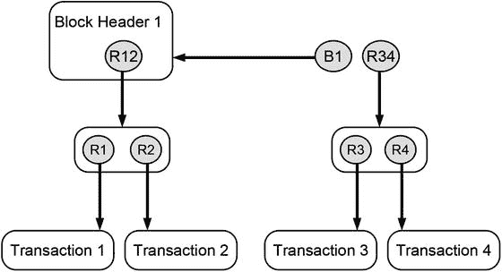

    图 15-2.

    步骤 1：创建一个包含新交易的新默克尔树

2.  创建一个新的区块头（区块头 2），使其既包含指向前一个区块头（区块头 1）的哈希引用 (B1)，又包含包含新交易数据的默克尔树的树根 (R34)，如图 15-3 所示。

    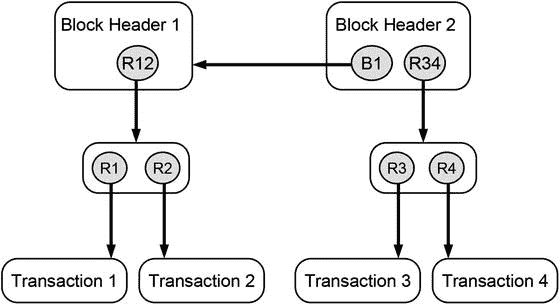

    图 15-3.

    步骤 2：创建一个新的区块头，使其既包含指向前一个区块头的哈希引用，又包含包含新交易数据的默克尔树的树根

3.  为新的区块头创建一个新的哈希引用 (B2)，如图 15-4 所示，并将其声明为更新后`区块链数据结构`的新头部。请记住，指向链中最近添加数据的引用也称为整个链的头部（参见第 11 步）。

    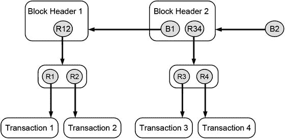

    图 15-4.

    步骤 3：创建一个指向新区块头的新哈希引用，该新区块头现为整个更新后`区块链数据结构`的新头部

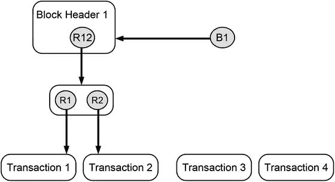

图 15-1.

初始状态：两笔新交易（交易 3 和交易 4）应添加到现有的`区块链数据结构`中

### 检测变更

图 15-4 所示的步骤作为研究更改已属于`区块链数据结构`的数据所产生影响的初始状态。我将讨论以下情形：

-   更改交易数据的内容
-   更改默克尔树中的引用
-   替换一笔交易
-   更改默克尔树根
-   更改区块头引用

#### 更改交易数据的内容

图 15-5 展示了如果更改交易 2 会发生什么。该交易是默克尔树的一部分，而默克尔树由哈希引用构成。通过更改交易 2 的某些属性（例如，转移的商品数量或接收所有权的账户），其指纹或加密哈希值也会随之改变。结果，指向原始交易数据的哈希引用 `R2` 被破坏。它检测到其最初引用的交易数据在此期间被更改了，因此违反了保持不变的原则。最终，整个`区块链数据结构`变得无效。

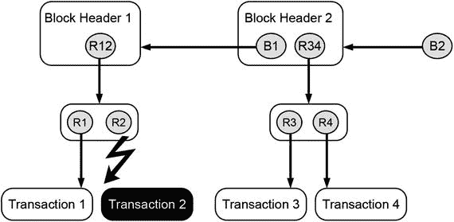

图 15-5.

更改交易的详细信息会使指向原始数据的哈希引用失效，从而导致整个数据结构无效

好的，作为高级文档工程师和翻译员，我将严格遵循您的注意事项和示例格式，将给定的英文文本翻译成中文。

#### 更改 Merkle 树中的引用

图 15-6 展示了如果不仅更改交易的详细信息，同时还更改指向该更新交易的哈希引用时会发生什么。更新后的哈希引用 (`R2`) 是有效的，因为它正确地指向了新的交易数据。然而，这个更新后的哈希引用是一棵 Merkle 树的一部分，该树的根也是一个哈希引用。Merkle 树的根 (`R12`) 指向包含哈希引用 `R1` 和 `R2` 的一段数据。后者已被更改，以便与被篡改后的交易 2 保持一致。因此，包含更新后的 `R2` 版本的那段数据的加密哈希值也随之改变，这反过来又会使 Merkle 树的根 `R12` 失效。

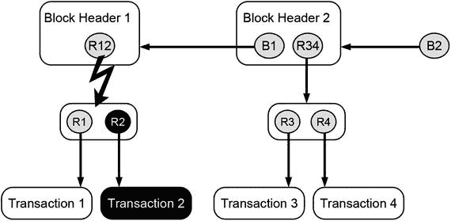

图 15-6. 在 Merkle 树中更改一笔交易及其哈希引用会使 Merkle 树的根失效，进而导致整个数据结构失效

#### 替换一笔交易

图 15-7 考虑的是替换整笔交易的情况，而不是仅修改现有交易的细节并更新其哈希引用。

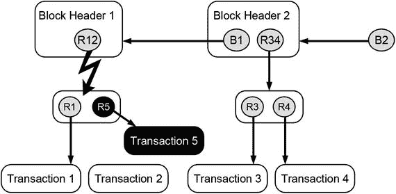

图 15-7. 在 Merkle 树中替换一笔交易及其哈希引用会使 Merkle 树的根失效，进而导致整个数据结构失效

当你比较图 15-6 和图 15-7 时，只能发现交易名称及其哈希引用存在微小差异。就后果而言，两幅图是相同的。在这两种情况下，由于 Merkle 树内部发生的变化，Merkle 树的根 `R12` 都将失效。因此，我们发现更改一笔交易或替换一笔交易对 `blockchain-data-structure` 的影响是相同的。这两种情况下的篡改行为都会被检测到，并导致整个数据结构失效。

**注意**：在 `blockchain-data-structure` 中更改或替换数据会产生相同的结果，因为两者对哈希引用的影响是相同的。

#### 更改 Merkle 根

图 15-8 展示了当整棵 Merkle 树（包括其根）被更改时会发生什么。

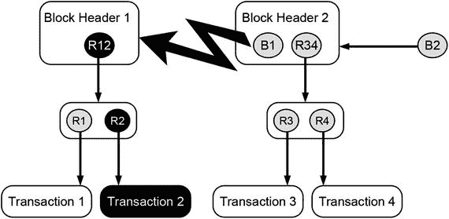

图 15-8. 更改 Merkle 树会使指向包含它的区块头的哈希引用失效，进而导致整个数据结构失效

被篡改后的 Merkle 树的根 (`R12`) 是区块头（区块头 1）的一部分。Merkle 根的更改改变了区块头 1 的加密哈希值，这进而导致指向它的哈希引用 (`B1`) 失效。用于维护连接或作为从区块头 2 指向区块头 1 的链接的哈希引用 `B1`，在检测到更改后变得无效。结果，整个 `blockchain-data-structure` 变得无效。

#### 更改区块头引用

图 15-9 展示了当不仅更改整棵 Merkle 树，还更改指向被篡改区块头的哈希引用时会发生什么。

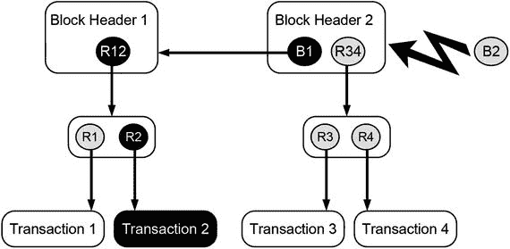

图 15-9. 更改区块头内的哈希引用会使指向被篡改区块头的哈希引用失效，进而导致整个数据结构失效

如果指向被篡改区块头（区块头 1）的哈希引用 (`B1`) 被更改，则会发生以下情况：从哈希引用 `B1` 开始，所有指向被篡改数据的哈希引用都是一致且有效的，因为它们已被调整为适应所执行的篡改。然而，被篡改后的哈希引用 `B1` 是区块头 2 的一部分，因此它的加密哈希值会发生变化，这进而使指向原始数据区块头（包含原始版本哈希引用 `B1`）的哈希引用 `B2` 失效。结果，整个 `blockchain-data-structure` 也同样无效。

### 有序地更改数据

在讨论了多种篡改 `blockchain-data-structure` 的方法（所有这些方法都会导致数据结构无效）之后，现在来说明如何有序地更改或更新 `blockchain-data-structure`。图 15-10 说明了以正确方式更改 `blockchain-data-structure` 的方法。

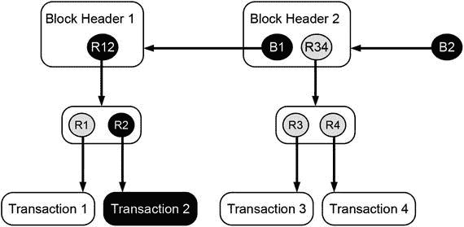

图 15-10. 有序地更改一笔交易包括更改所有后续的哈希引用

如果我们考虑更改或更新交易 2 的一些细节，我们必须随后更新整个哈希引用序列：`R2`、`R12`、`B1` 和 `B2`。这意味着从直接指向被篡改数据的那个哈希引用开始，到指向最新区块头的那个哈希引用结束，以及它们之间的所有哈希引用，都需要被更改和更新，以便它们反映其目标的变化。这是一项相当复杂的工作。而且，这是一个有意为之的复杂过程。所有这些工作都是为了保持整个 `blockchain-data-structure` 的一致性并维护其完整性。所有其他试图更改或篡改 `blockchain-data-structure` 中数据的行为都将导致无效的哈希引用，这反过来会使整个数据结构无效。

### 有意更改与无意更改

前面的讨论表明，`blockchain-data-structure` 在更改其数据时采用了一种激进的全有或全无的方式：要么彻底地更改从引起变化的点一直到整条链的末端整个数据结构，要么从一开始就压根儿不要更改。所有其他不彻底的、半途而废的或局部的更改都会使整个 `blockchain-data-structure` 处于不一致的状态，这种状态很容易被快速检测到。这是由于哈希引用的特性决定的，`blockchain-data-structure` 不会区分有意更改和无意更改。实际上，在区块链中不存在有意或无意更改这类概念。这些词语指的是对导致变化的人或其动机的评价。但 `blockchain-data-structure` 既不评估动机，也不评估导致不一致的人。区块链只关心所有哈希引用的正确性和一致性。如果其中一个无效，整个数据结构就无效，无论谁或什么导致了这个变化，也不论为何做出这个变化。而这个特性使得 `blockchain-data-structure` 非常有价值。

### 展望

本步骤详细说明了 `blockchain-data-structure` 如何处理其数据的更改。事实证明，`blockchain-data-structure` 对变化非常敏感。它在更改其数据时采用了一种激进的全有或全无的方式。下一步将解释如何利用这一特性使数据不可更改，这使得 `blockchain-data-structure` 成为在不可靠和不可信环境中存储数据的完美候选方案。

### 摘要

-   向`blockchain-data-structure`添加新交易数据所需执行的步骤如下：
    -   创建一个包含所有待添加新交易数据的新的**默克尔树**。
    -   创建一个新的区块头，其中包含指向前一个区块头的哈希引用，以及包含新交易数据的默克尔树的根哈希。
    -   创建指向新区块头的哈希引用，该区块头现在成为`blockchain-data-structure`的当前链头。
-   更改`blockchain-data-structure`中的数据需要更新所有哈希引用，从直接指向被篡改数据的那个引用开始，一直更新到整个`blockchain-data-structure`的链头，并包括它们之间的所有哈希引用。
-   在更改数据方面，`blockchain-data-structure`采取了一种彻底的“要么全有，要么全无”的方法：你要么从引起变化的那个点开始，完全改变整个数据结构，直到整个链的链头；要么就最好一开始就不要改变它。
-   任何半心半意、半途而废或部分更改都会使整个`blockchain-data-structure`处于不一致的状态，而这种状态会很快且容易被检测到。
-   完全更改`blockchain-data-structure`本身就是一个非常复杂的过程，这是有意设计的。
-   `blockchain-data-structure`对更改的高度敏感性归因于哈希引用的特性。

## 16. 保护数据存储

发现不可变性的力量

第 15 步的结论是，`blockchain-data-structure`以对更改敏感的方式存储数据。存储在`blockchain-data-structure`中的任何数据变更都会凸显出来，并且需要一个复杂的过程才能将其整合到现有结构中。本步骤将解释如何利用这一特性，准备好在不可信环境中共享和分发的交易数据历史记录，而无需担心点对点系统中的不诚实成员为自身利益操纵其内容。

### 隐喻

假设我想冒充一个显赫贵族家族的成员。我该如何实现呢？伪造家谱或许可以做到。例如，我可以虚构一个贵族祖父，并通过一份伪造的家谱将自己与他联系起来。这足以让别人相信我这个虚假的贵族血统吗？嗯，这个谎言很快就会被揭穿，因为家谱很少孤立存在；相反，它们通过家族关系相互连接和交织。因此，如果已建立的贵族家族谱系中没有一个提及或关联到我虚构的祖父，那么我虚构的家族史很快就会被认为是假的。为了让我的虚构家族被接受，我需要通过在我的虚构家谱中嵌入指向一些已建立贵族家族谱系的引用，来伪造他们的家族文件。但即便如此也可能不够。真实的人有真实的生活，会在我们的世界中留下足迹。但我虚构的祖父从未真正活过。因此，为了让这个谎言看起来真实，我必须虚构他的一生。这意味着我必须编造我虚构祖父的全部生活，包括他的童年、教育背景和职业生涯。此外，还需要伪造支持性文件，例如出生证明、入学登记文件、学校证书、大学学位、专业资格认证、会员资格等等。学校、大学和雇主都会保存学生和员工的记录，并出版年鉴和社会活动的照片。因此，还需要篡改他们的文件，以使我虚构的祖父成为这些机构的曾经成员。由于篡改所有这些文件既复杂又昂贵，我大概会选择安于我真实但非贵族的家族历史。

这个思想实验说明，伪造过去是可能的，但代价极其高昂，因为它需要重写和伪造历史的大部分内容，以便将虚假信息嵌入到真实历史的许多文件和引用中。这样做的成本高得令人望而却步；因此，坚持真相要容易得多，成本也低得多。本步骤将解释区块链如何利用这一发现来保护其交易数据历史不被伪造。

### 目标

重要的是，区块链维护的整个交易数据历史始终代表真相，从而成为澄清所有权相关事务的可信来源。

### 挑战

区块链是一个完全分布式的点对点系统，对所有人开放。因此，存在不诚实的节点可能为了自身利益而操纵或伪造交易数据历史的风险。挑战在于既要保持系统的开放性，又要保护交易数据历史不被伪造或篡改。

### 思路

在一个开放系统中，事先区分诚实和不诚实的节点是困难的，甚至是不可能的。因此，为了保护交易历史不被不诚实的节点篡改，我们首先要防止任何人篡改历史。如果任何人都不能更改交易数据的历史，无论其是诚实还是不诚实，我们根本无需担心它会被操纵。因此，从一开始就让交易数据历史变得不可更改就解决了问题。这样一来，系统可以对所有人保持开放，也无需担心不诚实节点操纵交易历史。

### 关于不可变性的简短探讨

不可变性意味着某事物不能被更改。一旦被创建或写入，不可变的数据就无法被更改。出于这个原因，这些数据也被称为只读数据。它们全部的价值仅仅在于提供信息以供阅读或展示。当需要将数据交给他人，从而失去对数据使用方式的控制时，这一特性就显得尤为可取。交出不可变数据是防止数据被更改或操纵的有效方法。驾照、护照和教育证书是现实世界中不可变对象的例子。权威机构制作它们是为了记录某些事情，而它们唯一合理的用途就是被出示和读取。

### 工作原理：宏观概览

区块链使交易历史不可篡改的核心思路是，让篡改的代价高到足以阻止任何人去尝试。实现交易数据历史记录的不可篡改包含三个要素：

1.  以任何微小的数据篡改都会暴露且被察觉的方式存储交易历史数据。
2.  确保在交易历史中嵌入篡改内容需要重写其中的绝大部分数据。
3.  在历史记录中增加、写入或重写数据在计算上是昂贵的。

#### 让篡改行为无所遁形

采用`blockchain-data-structure`数据结构以敏感于变更的方式来存储数据，满足了第一个要素。因此，任何人都无法在`blockchain-data-structure`数据中静默地篡改数据并期望无人察觉。任何更改都会因破坏哈希引用而引发巨大的“噪音”，因为更改所引用的数据会导致这些引用失效。

#### 强制重写历史以嵌入更改

`blockchain-data-structure`数据结构也满足了第二个要素，因为它在处理数据变更时采用了一种极端、非黑即白的方法：要么从引发变更的点开始，一直重写到整个链的顶端；要么就最好不要去改它。

#### 让添加数据在计算上变得昂贵

第三个要素是针对那些不畏惧在交易历史中嵌入篡改内容时重写`blockchain-data-structure`大部分数据的人。但是，一旦写入或重写`blockchain-data-structure`会带来巨大的计算成本，人们就会首先三思，这样做是否是个好主意。

`blockchain-technology-suite`技术套件通过在向`blockchain-data-structure`写入、重写或添加每个区块时产生巨大的计算成本，来确保`blockchain-data-structure`的内容不可篡改。这些计算成本源于每个区块头独有的哈希谜题¹。因此，你要么通过为涉及的每个区块头解开哈希谜题来承担从变更点重写到链顶端的全部成本，要么最好保持原样不变。

### 工作原理：详细说明

如步骤 15 所述，向`blockchain-data-structure`添加新区块的过程本身计算成本并不高，因为它只需要将指向当前链顶端的哈希引用添加到新区块头中，并将其声明为新的链顶端即可。使`blockchain-data-structure`不可篡改的挑战在于，让添加新区块本身成为一项计算成本高昂的任务。要实现这一点，需要考虑以下几个方面：

-   区块头的必需数据
-   创建新区块头的流程
-   区块头的验证规则

#### 必需数据

`blockchain-data-structure`中的每个区块头至少必须包含以下数据²：

-   包含交易数据的默克尔树根
-   指向前一个区块头的哈希引用
-   哈希谜题的难度级别
-   开始解哈希谜题的时间
-   解开哈希谜题的随机数（nonce）

#### 创建新区块的流程

创建新区块包含以下步骤：

1.  获取包含待添加交易数据的默克尔树的根。
2.  创建一个指向将成为新区块头前驱区块的区块头的哈希引用。
3.  获取所需的难度级别。
4.  获取当前时间。
5.  创建一个包含步骤 1 至 4 所述数据的初步区块头。
6.  为这个初步区块头解开哈希谜题。
7.  将解开哈希谜题的随机数添加到初步区块头中，完成新区块。

图 16-1 展示了向`blockchain-data-structure`添加新区块时需要解决的哈希谜题。它展示了区块头的数据，其哈希值必须满足给定的约束条件或难度级别。请注意，难度级别是区块头的一部分，因此也是区块哈希值的一部分。这确保了任何人都无法通过随意降低难度级别来绕过哈希谜题的计算成本。

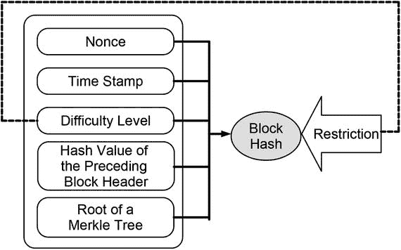

图 16-1. 向`blockchain-data-structure`添加新区块时需要解决的哈希谜题示意图

#### 验证规则

每个区块头都必须满足以下规则：

1.  必须包含一个指向前一个区块的有效哈希引用。
2.  必须包含一个包含交易数据的有效默克尔树根。
3.  必须包含正确的难度级别。
4.  其时间戳必须晚于其前一个区块头的时间戳。
5.  必须包含一个随机数（nonce）。
6.  将这五部分数据组合在一起计算的哈希值必须满足难度级别。

这些验证规则确保了只有那些为哈希谜题付出计算成本而求解的区块才能被添加到`blockchain-data-structure`中。规则 4 保证了区块和交易数据确实是按照添加时间排序的。

> **注意：** 通过解哈希谜题向`blockchain-data-structure`添加新区块的活动也称为**挖矿**或**区块挖掘**。

### 为何有效

`blockchain-data-structure`数据结构使得对其数据的任何更改都会因为哈希引用对于所引用数据更改的脆弱性而无所遁形。这导致需要重写所有受篡改影响的区块。哈希谜题则为每个在嵌入篡改内容时需要重写的区块带来了成本。在嵌入篡改内容过程中重写`blockchain-data-structure`所累积的巨大成本，首先就使得篡改交易历史变得毫无吸引力。因此，`blockchain-data-structure`成为了一个不可篡改、只能追加写入的数据存储库。

## 篡改`Blockchain-Data-Structure`的成本

假设我们试图篡改一笔特定的交易数据，该数据属于一个默克尔树，该树的根位于当前`blockchain-data-structure`顶端下方 20 个区块的区块头中。嵌入被篡改的交易数据需要完成以下工作：

1.  重写被篡改交易所属的默克尔树。
2.  重写被重写后的默克尔树根所属的区块头。
3.  重写所有后续的区块头，直到`blockchain-data-structure`的顶端。

第 2 点需要解一个哈希谜题，因为更改默克尔根会改变区块头的哈希值，从而改变其哈希谜题的解。第 3 点由于需要连续更改指向前一个区块头的哈希引用，因此需要解开 20 个哈希谜题。假设平均解开一个哈希谜题需要 10 分钟，那么要将一笔属于当前顶端下方 20 个区块的区块头的交易嵌入篡改内容，总共需要 210 分钟。如此巨大的成本会阻止节点去更`blockchain-data-structure`。

### 现实世界中的不可变数据存储

`blockchain-data-structure`的不可变性取决于哈希难题所带来的计算成本。哈希难题的难度决定了需要多少计算量，进而决定了解题所需的时间，而这也反过来决定了`blockchain-data-structure`的不可变性。如果难度过低，篡改`blockchain-data-structure`的计算成本就会下降，可能不再被视作高得令人望而却步，这可能会鼓励节点操纵交易数据的历史记录。另一方面，如果难度过高，即使只是新增一个区块的计算成本也可能被视为高得令人无法接受，这又会阻碍节点添加新的交易数据。因此，设计区块链时面临的一个挑战，就是为哈希难题确定合适的难度级别。随着技术进步带来的计算机算力变化，这一挑战变得更加艰巨。因此，难度级别可能需要动态确定。

现实世界中的区块链应用很少对所有区块使用固定的难度级别。相反，它们通常会根据新区块的添加速度，采用动态的难度级别。³ 这可以确保解决哈希难题所需的时间保持在一个既能防止节点操纵交易历史记录，同时实际计算量又可能增加的合理水平。

### 展望

本步骤解释了区块链如何通过将`blockchain-data-structure`转化为一个不可变的仅追加数据存储，来防止交易数据历史记录被篡改或伪造。下一步将侧重于如何在分布式对等系统中让所有人都能访问该数据存储。

### 总结

- 区块链通过将交易数据存储在不可变的数据存储中，保护交易数据历史记录免遭篡改和伪造。
- 利用以下两个理念实现交易历史的不可变性：
    - 将交易数据存储在对变更敏感的`blockchain-data-structure`中，当该结构发生变更时，需要从变更点开始重写数据结构，直至整个链的顶端。
    - 要求在`blockchain-data-structure`中写入、重写或添加每个区块头时，都必须解决一个哈希难题。
- 每个区块头的哈希难题都是唯一的，因为它取决于其独特的内容。
- 当`blockchain-data-structure`发生变更时需要重写，以及为此付出的成本，从源头上使得操纵交易数据历史记录变得不具吸引力。
- 要求在`blockchain-data-structure`中每次写入、重写或添加区块头时都解决一个哈希难题，这使得它成为了一个仅追加的数据存储。
- 区块头至少包含以下数据：
    - 指向前一个区块头的哈希引用
    - 包含交易数据的默克尔树根
    - 其哈希难题的难度
    - 开始解决哈希难题的时间
    - 解决哈希难题的随机数（nonce）

脚注 1

Nakamoto, Satoshi. Bitcoin: A peer-to-peer electronic cash system. 2008. [`https://bitcoin.org/bitcoin.pdf`](https://bitcoin.org/bitcoin.pdf) 。

2

Okupski, Krzysztof. Bitcoin developer reference. Working paper. 2014。

3

Okupski, Krzysztof. Bitcoin developer reference. Working paper. 2014; Wood, Gavin. Ethereum: A secure decentralized generalized transaction ledger. 2014. [`http://gavwood.com/paper.pdf`](http://gavwood.com/paper.pdf) 。

