# 验证并添加交易

用胡萝卜加大棒来管理一组计算机

在第 17 步中，单个计算机被转变为纯粹分布式点对点系统的节点，它们相互之间就交易数据和待添加到`blockchain-data-structure`中的新区块进行通信。本节重点介绍节点收到交易数据后会发生什么，以及如何确保只有有效的交易数据和区块才会被添加到`blockchain-data-structure`中。

### 隐喻

让我们考虑一家提供简单服务的公司：为学校和大学批改选择题。学校和大学可以将学生的多项选择题答题卡连同正确答案发送给该公司，公司负责批改所有答题卡。不幸的是，该公司的员工缺乏做好本职工作的动力。结果，公司将所有员工转变为承包商，他们只能获得与绩效相关的报酬，该报酬受以下三条规则约束：

1.  所有待批改的答题卡、正确答案以及所有已批改的答题卡都通过公司的软件系统随时可供所有承包商查看。
2.  只有第一个正确批改某张答题卡的承包商才能获得一美元作为奖励。
3.  如果某承包商发现另一承包商批改的答题卡有误，犯错的承包商必须退还报酬，而发现并纠正错误的承包商将获得该报酬。

### 后果

上述场景的规则会带来几个后果：

*   由于承包商只能获得与绩效相关的报酬，他们有着强烈的经济动机去遵守规则。
*   根据规则 1，所有承包商都有平等的机会投入工作并赚钱。
*   根据规则 1，所有承包商都掌握必要信息来控制和纠正同事的工作。
*   根据规则 2，每个承包商都有动力快速工作。然而，工作质量可能会因追求速度而受损。
*   根据规则 3，每个承包商都有动力认真工作。
*   根据规则 3，每个承包商都有动力去控制和纠正同事的工作。

由于这些规则，公司的效率显著提高。但几个月后，公司收到了客户的大量投诉。工作质量急剧下降。看起来所有选择题都像是被完全随机批改的。经过一番调查，公司发现承包商们达成了默契。他们相互约定不去检查任何同事的工作结果，而是尽可能快速地批改。由于随机分配分数是完成工作的最快方式，所有承包商最终都采用了这种批改策略。

从这个隐喻中得出的教训是：奖励、惩罚、同伴压力和竞争的结合可以用来管理一群独立行动的个人，只要他们不集体抵制。

本节解释了`blockchain-algorithm`，它不过是对这种胡萝卜加大棒方法，并结合竞争与同伴压力的巧妙实现，其运作方式与此示例中的公司类似。然而，挑战在于如何妥善处理所有细节。

### 目标

目标是在保持交易历史数据完整性的同时，允许任何人向其中添加新的交易数据。

### 挑战

区块链是完全开放的。任何人，即使是最不诚实的人，都可以将计算机连接到系统，从而创建交易并将其发送给组成系统的所有其他节点。因此，无法保证通过网络发送的交易是正确的。所以，挑战在于既要保持系统对所有人开放，又要确保只有有效的交易被添加进去。

### 核心理念

为了确保只有有效交易被添加到系统中，系统中的所有节点都可以同时充当其他节点的监督者，并对那些添加有效授权交易以及发现他人工作错误的节点给予奖励。因此，系统中的所有节点都会受到激励，去正确处理交易、监督并指出任何其他节点所犯的错误。¹

### 工作原理：基础模块

`blockchain-algorithm` 是一套指令序列，用于规定节点如何处理新的交易数据和区块。各个具体的规则和流程可以追溯到以下基础模块：

*   验证规则
*   奖励
*   惩罚
*   竞争
*   节点互控

#### 验证规则

`blockchain-algorithm` 的最终目标是确保 `blockchain-data-structure` 只包含有效的区块，而这些区块又由有效的交易数据和有效的区块头组成。这些数据的有效性基于两个不同的验证规则组进行评估：

*   交易数据验证规则
*   区块头验证规则

##### 交易数据验证规则

交易数据验证规则定义了描述一笔交易所需的数据。这些规则涵盖了形式正确性、语义正确性以及授权。步骤 9 讨论了交易数据的验证规则。这些规则特定于区块链的应用目标。因此，用于管理数字积分所有权的区块链可能与管理房地产所有权的区块链有着不同的验证规则。

##### 区块头验证规则

区块头验证规则重点关注区块头的形式和语义正确性。这些规则与交易数据的内容无关；相反，它们关注的是信息添加到 `blockchain-data-structure` 的方式。步骤 16 讨论了区块头的强制数据及其验证规则。验证区块头的一个核心要素是分别验证工作量证明或哈希难题。只有那些区块头包含其各自哈希难题正确解的区块才会被进一步处理。任何区块头未能通过工作量证明验证的区块都将被立即丢弃。

#### 奖励

创建有效区块会消耗能量、时间和金钱，因为这需要解决计算成本高昂且每个区块独有的哈希难题。哈希难题是使 `blockchain-data-structure` 不可篡改的关键要素。因此，解决哈希难题是绝对不可或缺的，其带来的成本也同样不可避免。要说服节点承担解决哈希难题的负担，唯一的方法就是为他们提供奖励作为工作的补偿。因此，`blockchain-algorithm` 定义了如何奖励提交有效区块的节点。从更抽象的角度来看，可以说奖励是对为达成和维护整个系统完整性所付出所有努力的补偿。

#### 惩罚

奖励只是一种激励节点验证交易数据并创建有效区块的手段。区块链还需要一种方式来惩罚那些破坏系统完整性的节点。典型的惩罚措施包括收回过去被接受但后来被认定为无效或无用的区块的奖励。另一种惩罚形式是取消奖励。让节点执行工作量证明，但因其提交的区块被认定为重复、过时或无用而拒绝给予奖励，这本身就是一种惩罚。这是因为创建有效区块需要解决哈希难题，而这会产生成本。创建区块却得不到奖励意味着无法覆盖创建成本。因此，得不到奖励也构成了一种惩罚。

#### 竞争

奖励提交有效区块的节点是 `blockchain-algorithm` 的核心概念，但发放奖励会消耗资源。因此，关键是要防止将资源浪费在那些对系统维护没有显著贡献的节点上。在降低成本的同时实现高质量工作的最佳方式，是基于一个明确定义的标准建立奖励竞争机制。`blockchain-algorithm` 基于两个标准维持着一场持续的奖励竞争。这场竞争实际上是以下按序进行的多项竞争的组合：

*   速度竞争
*   质量竞争

只有同时赢得这两项竞争的节点才能获得提交新区块的奖励。这场竞争的巧妙之处在于，速度竞争的失败者将成为质量竞争的裁判，负责验证速度竞争获胜者提交的区块。这确保了提交的区块会受到严格的审查。

##### 速度竞争

节点间的速度竞争基于哈希难题。创建有效区块的核心要素是生成工作量证明，这意味着要解决新区块独有的哈希难题。基于加密哈希函数的特性，解决哈希难题所需的时间是未知的。由于难题本身依赖于区块的内容，因此无法提前解决。因此，所有节点都参与到解决新区块哈希难题的竞争中。一旦有节点提交了新区块，速度竞争即告结束。第一个提交包含有效哈希难题解的新区块的节点，就是速度竞争的胜出者，并成为质量竞争的唯一候选者。

##### 质量竞争

质量竞争聚焦于所提交区块的正确性。一旦某个节点提交了新区块，该区块就会被发送到系统中的所有节点。每个节点在收到新区块后，都必须担任质量竞争的裁判，这意味着要根据交易数据和区块头的验证规则来验证新区块。如果区块被认定有效，则提交该新区块的节点获得奖励，同时一场新的速度竞争开始，其竞争对象是尚未处理或在此期间新到达的交易数据。如果区块被认定无效，它将被丢弃，并且速度竞争重新开始，包含所有原本处于竞争状态的交易。

质量竞争包含一个有趣的节点互控方面。通过接收新区块，每个节点都意识到自己已经输掉了速度竞争，并且必须作为裁判参与质量竞争。不言而喻，这些裁判是所有参与者中最为一丝不苟和严格的，因为他们已经输掉了速度竞争，所以没有什么可再失去的了。实际上，所有节点都知道，如果他们能够证明提交的区块无效，就能重新回到竞争中获得奖励。在这种情况下，速度竞争会重新开始，他们就有机会完成自己因竞争中断而尚未完成的区块，并赢得这场竞赛。因此，质量竞争，或者说对所提交区块的审查，将会以极高的精确度进行。

##### 节点相互监督

即使规则再完善，如果无人遵守、无人监督执行、无人强制实施，也毫无用处。不幸的是，纯粹分布式的点对点系统既没有，也不会接受一个能够监督规则遵守情况并强制执行的中央控制或协调点。因此，区块链算法让系统中的所有节点都成为其他节点的监督者。系统中的节点同时扮演着工作者和监督者的角色，因为它们既要验证交易、创建新区块，同时也要接收、审查并验证其他节点创建的区块。每个节点的工作既有助于创建新的有效区块，也有助于发现、拒绝或移除无效的交易数据或无效区块。

### 工作原理：骨架

竞赛规则建立了一个简单的两步节奏，支配着网络中每个节点的工作。在任何给定的时间点，系统中的所有节点都处于以下两个阶段之一：

1.  评估某个对等节点创建并提交的新区块
2.  努力成为下一个创建新区块的节点，而该新区块又必须经过所有其他节点的评估

区块链算法最重要的成果之一是，它不仅确保了对交易数据和区块的验证，还确保了所有节点拥有相同的工作节奏。这种相同的工作节奏是确保所有区块维护相同交易数据历史记录的核心概念。然而，工作节奏并非由中央时钟强加给节点，因为那将与系统纯粹的分布式特性相矛盾。推动节奏运转的是到达各个节点的消息。一旦节点收到包含新区块的消息，它就会切换到评估阶段；一旦评估阶段结束，节点就会切换回来，继续验证新的交易数据并自行创建新区块。

### 工作原理：细节

管理节点如何处理从对等节点接收的新交易数据和区块的程序包含以下规则（**加粗**的规则是建立两步节奏的规则）：

1.  新交易数据以及新区块以八卦协议的方式转发给所有节点。
2.  每个节点将新交易数据收集到收件箱中，并选择它们进行处理。
3.  每个节点立即以最高优先级处理新区块。
4.  每个节点通过验证新交易数据的授权以及形式和语义正确性来处理它们。
5.  每个节点仅将有效的交易数据收集到一个默克尔树中，并通过求解其哈希难题开始创建新区块。
6.  一旦节点完成哈希难题，它就将新创建的区块发送给所有其他节点。
7.  每个节点通过验证新区块哈希难题的解，并验证其包含的所有交易数据的格式正确性、语义正确性和授权来处理新区块。
8.  每个节点将有效区块添加到其自身的区块链数据结构副本中。
9.  如果新到达的区块被识别为无效，它将被丢弃，节点继续处理交易数据或完成新区块的哈希难题。
10. 如果新到达的区块被识别为有效，节点将从其自身的收件箱中移除该新区块中包含的那些交易，并开始处理交易数据和创建新区块。
11. 如果后来某个已添加到区块链数据结构的区块被识别为无效或无用时，该区块及其所有后续区块都将从区块链数据结构中移除，其交易将被添加到收件箱中以便重新处理。
12. 其区块被接受的节点将获得该区块中包含的所有交易的费用作为奖励。
13. 如果某个区块从区块链数据结构中移除，那么最初获得该区块奖励的节点将被收回该奖励。

### 为何有效

上述规则之所以有效，原因在于：

-   由于规则 1，所有节点都能收到验证和添加交易数据所需的所有信息。
-   由于规则 2，节点会处理它们收到的新交易数据。
-   由于规则 3，其他节点创建的区块到达节点收件箱后会立即得到处理。
-   由于规则 4，只有有效的交易数据才会被添加到区块链数据结构中。
-   由于规则 5，所有节点都参与了解哈希难题的竞赛。由于哈希难题的性质，无法预测哪个节点会首先解出。
-   由于规则 6，当某个节点解出新区块的哈希难题时，所有节点都会得到通知。
-   由于规则 6 和规则 3，所有节点都会收到新创建的区块，并识别出解哈希难题竞赛的获胜者。
-   由于规则 7，系统中的所有节点都会审查和验证新创建的区块，确保只有正确的区块被接受。
-   由于规则 8，所有节点都会将新区块添加到它们自己的区块链数据结构副本中，从而增长交易历史记录。
-   由于规则 9，共同维护的交易历史记录保持无无效交易，从而维护了完整性。
-   由于规则 10，没有交易数据会被重复添加。
-   由于规则 11，即使之前处理过的区块被重新处理，也不会有有效交易丢失。
-   由于规则 11，系统能够对交易历史记录进行事后有效性检查并进行追溯修正。
-   由于规则 12，节点有动力快速处理交易并创建新区块。
-   由于规则 12，所有节点都有动力将新区块告知所有其他节点，因为获得奖励取决于交易被所有其他节点审查和接受。
-   由于规则 13，节点有动力正确工作，避免接受任何无效交易数据或产生无效区块。
-   由于规则 13，节点有动力以追溯的方式审查和重新验证区块和交易。

### 应对不当行为

区块链旨在完全开放、由数量未知且可靠性与可信度未知的节点组成的点对点系统中建立完整性和信任。在管理所有权的点对点系统中，最常见的不当行为包括：

-   通过冒充他人来提交交易
-   接受无效的交易数据或区块
-   用大量交易数据淹没某个节点，试图使其崩溃
-   拒绝处理某些交易数据
-   拒绝转发信息

所有这些不当行为的情况都已通过以下方式得到涵盖：

-   交易的安全概念（通过非对称密码学和数字签名实现的身份识别、认证和授权），它将账户的访问权限限制在相应私钥持有者手中
-   八卦通信模型，确保每个节点最终都能收到所有信息
-   系统的架构，确保即使某些个别节点崩溃或停止处理数据，整个系统也能保持存活
-   区块链算法

区块链对抗不诚实节点最重要的武器是诚实多数的力量以及奖惩效应。即使某些节点发送伪造交易或接受无效交易数据或无效区块，诚实的多数节点及其对奖励的追求将压倒不诚实者试图破坏系统完整性的行为。显然，这种方法依赖于一个假设，即确实存在诚实的多数节点。

### 概述

本步骤解释了区块链如何处理交易数据并将其添加到 `blockchain-data-structure` 中，从而将其纳入交易数据的正式历史记录。本步骤中讨论的指令旨在确保系统中的所有节点都维护相同版本的 `blockchain-data-structure`，并因此维护相同的交易数据历史记录。然而，有时节点会维护不同的历史记录，这意味着它们无法就同一份交易数据历史记录达成一致。解决这些冲突是 `blockchain-algorithm` 的另一项任务，将在下一步中进行探讨。

### 总结

*   `blockchain-algorithm` 是一系列规则和指令，用于管理交易数据的处理方式并将其添加到系统中。
*   `blockchain-algorithm` 所解决的挑战是，在确保仅添加有效且经过授权的交易的同时，保持系统对所有人开放。
*   `blockchain-algorithm` 采用了胡萝卜加大棒的方法，并结合了竞争与同行监督。
*   `blockchain-algorithm` 的主要理念是允许系统中的所有节点充当其同行的监督者，并奖励它们添加有效且经过授权的交易，以及在他人工作中发现错误。
*   由于 `blockchain-algorithm` 的规则，系统中的所有节点都有动力去正确地处理交易，并监督和指出其他同行所犯的任何错误。
*   `blockchain-algorithm` 基于以下概念：
    *   交易数据和区块头的验证规则
    *   提交有效区块的奖励
    *   破坏系统完整性的惩罚
    *   基于处理速度和质量，为获得奖励而进行的同行竞争
    *   同行监督
*   竞争规则建立了一个两步节奏，用于管理网络中每个节点的工作。在任何给定时间点，系统中的所有节点都处于以下两个阶段之一：
    *   评估由其他节点创建的新区块
    *   努力成为下一个创建新区块（该区块必须由所有其他节点评估）的节点
*   这种工作节奏是由到达各个节点的消息所决定的。
*   大多数诚实节点及其对奖励的追求将战胜不诚实节点试图破坏系统完整性的行为。

脚注 1

中本聪。比特币：一种点对点电子现金系统。2008 年。[`https://bitcoin.org/bitcoin.pdf`](https://bitcoin.org/bitcoin.pdf)。

2

后来被识别为无效的区块实际上并未从 `blockchain-data-structure` 中物理移除。相反，它们会被标记为无效，并被视为已被移除。因此，所有更改都按记录保留。

## 19. 选择交易历史

让计算机用脚投票

步骤 18 解释了区块链节点如何处理交易数据和新区块。然而，由于消息传递中的延迟或错误，系统中各个节点维护的交易历史可能仍然不同。因此，本步骤专注于解决系统中各个节点所维护的不同版本交易历史之间的冲突。

### 比喻

你上次在公园散步是什么时候？你有没有注意到一个在全球大多数公园都能观察到的现象？公园里有依照景观设计师的规划和想法修建的铺砌小路，也有游客踩出的土路。这些土路通常是一条条穿过草坪的直线，在两个地标、两张公园长椅或其他兴趣点之间提供了高效的捷径。当许多人都独立且持续地决定偏离铺砌的小路，因为这样做似乎比沿着铺砌的小路走更可取时，土路就出现了。因此，公园里土路的形成可以被看作是某种最基础形式的民主的结果。这些道路的出现并非由官方的民意调查或选举来支配，而是每位游客通过自己独立的选择——是否沿着某些路径行走——并在地上留下足迹，从而促成了它们的形成。人迹罕至的土路会随着大自然重新夺回领地而消失，但其他的土路则因为许多人继续行走而得以保留。本学习步骤解释了区块链的一个方面，其运作方式类似于公园中土路的出现与消失。

### 目标

目标是在网络中的所有节点之间维护一份明确无误的交易数据历史记录，使得在处理所有权查询时，无论联系或请求的是哪个特定节点，都能得到相同的结果。

### 挑战

步骤 18 中解释的 `blockchain-algorithm` 向系统中的所有节点强加了一个两步节奏。在任何给定时间点，系统中的每个节点要么在检查由某个同行创建的新区块，要么在努力成为下一个创建新区块（随后必须由所有其他节点检查）的节点。然而，并没有一个全局时钟来统辖所有节点，并规定在任何给定时间必须执行两种工作中的哪一种。新区块到达各个节点收件箱的情况，就是驱动任何给定节点工作的时钟脉冲发生器。然而，新区块到达各个节点收件箱的情况深受网络消息传递能力的影响，而网络本身也面临各种不利因素。消息可能会丢失、延迟送达，或者以任意顺序到达。其结果是，网络中的节点无法在同一时间拥有相同的信息。此外，所有节点在工作阶段之间的切换并非同时发生。相反，每个节点会根据其收件箱中消息的到达情况，在各自独立的时间进行工作阶段的切换。这导致了各个节点工作阶段的重叠。这两种效应都给在网络中所有同行之间维护一份明确无误的交易数据历史记录带来了巨大障碍。因此，挑战在于：在面临所有消息传递的不利因素，并且不依赖集中式解决方案的情况下，找到一种方法来识别一份明确无误的交易数据历史记录。

### 核心理念

公园里踏出小径的例子表明，群体可以通过独立且一致地用脚投票，在集体决策问题上达成一致或共识。这种投票的结果通常被称为**分布式共识**，因为它是在独立行动的个体之间达成的，没有中央控制或协调元素。

> **注意**：共识是独立个体间达成一致的代名词。分布式共识则是纯粹分布式点对点系统成员之间达成的一致。

由独立行动的群体或蜂群解决集体问题的情况，可以通过以下条件来描述¹：

1.  一群个体在相同的环境中运作。
2.  存在一个集体决策问题。
3.  这些个体独立地努力实现同一个目标。
4.  为实现目标所执行的个体行为会在环境中留下可见标记，有助于解决集体决策问题。
5.  个体基于环境的变化，使用相同的标准来评估决策问题。

区块链的理念是让所有节点独立地用脚投票，从而就交易历史版本的选择达成集体共识。在本书目前阶段我们所知的区块链，满足了集体决策的前四个条件：

1.  所有节点都在相同的环境中运作，这个环境包括网络、维护各自 `blockchain-data-structure` 副本的节点，以及规范节点行为的 `blockchain-algorithm`。
2.  决策问题是要集体选择一条交易历史。
3.  所有节点都力求最大化其通过向 `blockchain-data-structure` 添加有效新区块所获得的个人奖励收入。
4.  为了实现各自的目标，所有节点都将自己的新区块发送给所有对等节点，以供其检验和接受。因此，每个节点都在由集体维护的 `blockchain-data-structure` 这一环境中留下了自己的足迹。

然而，还缺少第五点：所有节点基于环境变化做出决策时所使用的标准。如何选择交易数据历史的思路，基于新区块是如何被添加到 `blockchain-data-structure` 中，以及数据是如何被保护免受篡改的。由于工作量证明的存在，添加新区块的计算成本很高，并且使得篡改交易历史的尝试在计算上更加昂贵。因此，当存在多个冲突版本时，花费在创建交易历史上的累计计算工作量似乎是一个自然的选择标准。如果系统中的所有节点都应用相同的标准来选择交易历史，那么系统中的所有节点最终都会就该历史的同一版本达成一致。这个集体选定的交易历史版本通常被称为权威链或权威历史。

### 工作原理

根据创建交易历史所花费的计算工作量来选择交易历史的思路，引出了以下两个标准：

-   最长链准则²
-   最重链准则³

#### 最长链准则

最长链准则基于以下理念：包含最多区块的区块链数据结构代表着最集中的计算工作量。为了研究这一准则，让我们考虑一个初始情形：分布式系统的所有节点都维护并认同同一个版本的区块链数据结构，如图 19-1 所示，该图展示了一个简化了许多细节的区块链数据结构示意图。每个方框代表一个区块，并用缩短的哈希值进行标识。从一个方框指向另一个方框的箭头，代表将区块头链接到其前一个区块的哈希引用。在这个初始状态下，所有节点都认同同一个交易数据历史记录，并致力于用另一个以区块`A397`作为前驱的新区块来扩展现有链。

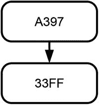

图 19-1. 分布式系统中的初始区块链数据结构

寻找新区块是所有节点之间的一场竞赛，因为这需要解出该区块特定的哈希谜题。图 19-2 展示了当某个节点解出了新区块的哈希谜题并将其发送给对等节点后，大多数节点所维护的区块链数据结构。因此，那些维护如图 19-2 所示区块链数据结构的节点，会致力于用另一个以区块`AB12`作为前驱的新区块来扩展它。从多数节点的角度来看，只存在一个由三个区块组成的区块链数据结构版本。然而，通过网络发送新区块需要时间，并且会遭遇各种不利情况。由于消息传输的延迟，少数节点尚未收到区块`AB12`。因此，它们仍在尝试扩展图 19-1 中所示的链。最终，其中一个节点成功解出了哈希值为`DD01`的新区块的哈希谜题，并将其传递给其对等节点。最终，大多数节点都收到了区块`AB12`和区块`DD01`。结果，大多数节点维护的区块链数据结构如图 19-3 所示，该结构在共同的主干之上产生了两个分支。在这种情况下，最长链准则无法给出明确的结果，因为两条链（`AB12 → A397 → 33FF` 和 `DD01 → A397 → 33FF`）长度相同。

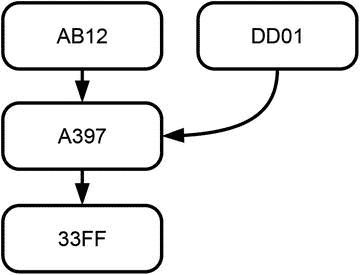

图 19-3. 延迟区块送达后的区块链数据结构

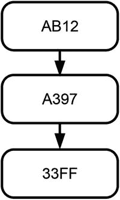

图 19-2. 向现有区块链数据结构添加新区块的结果

在图 19-3 所示的情况下，节点可以自由决定扩展哪个分支。一些节点可能会努力寻找以区块`AB12`作为前驱的新区块，而另一些节点则会努力寻找以区块`DD01`作为前驱的新区块。突然，大多数节点收到了两个新区块`BB11`和`CCC1`，这两个区块都以区块`AB12`作为前驱。这可能是因为两个节点几乎同时完成了各自区块的工作量证明。将这两个新区块纳入区块链数据结构的结果是产生了一个包含三条链的数据结构，如图 19-4 所示。其中一条链仅由三个区块组成，而另外两条链则由四个区块组成。

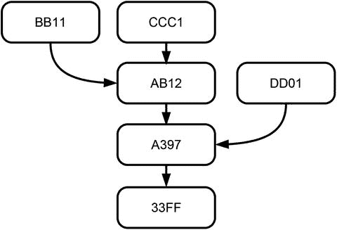

图 19-4. 两个节点几乎同时完成工作量证明后的区块链数据结构

最长链准则明确排除了最短的链，即 `DD01 → A397 → 33FF` 这条链。然而，最长链准则无法给出明确的结果，因为存在两条长度相同的链。因此，一些节点可能会努力寻找以区块`BB11`作为前驱的新区块，而其他节点则可能努力寻找以区块`CCC1`作为前驱的新区块。

最终，一个以区块`BB11`作为前驱的新区块到达，形成了如图 19-5 所示的数据结构。图 19-5 中描绘的区块链数据结构包含多个相互冲突的交易历史版本，但最长链准则给出了一个明确的结果：即由区块`0101 → BB11 → AB12 → A397 → 33FF` 组成的链。系统中的大多数节点，并最终是所有节点，都将使用这条链来处理与所有权相关的请求。系统中的大多数节点，并最终是所有节点，将致力于通过寻找一个以区块`0101`作为前驱的新区块来扩展这个分支。

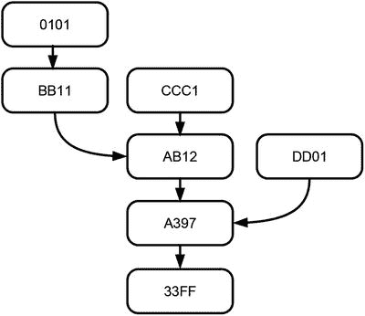

图 19-5. 新区块到达后包含一条最长链的区块链数据结构的示意图

一个重要结论是，区块链数据结构实际上并不是一条笔直的链，而更像一棵树或一种柱状仙人掌——可以说是一个区块仙人掌。树的分支代表了交易历史记录的冲突版本，但基于最长链准则，所有节点最终都会一致地识别出相同的交易历史记录版本。

> **注意**  
> 由于其形状，区块链数据结构通常被称为树形数据结构。区块链数据结构中第一个，也是最古老的区块是没有前驱的区块，它通常被称为树形结构的根。没有后继的区块被称为叶节点。从根到叶节点的一条直线序列被称为路径。

#### 最重链准则

在步骤 16 中你已了解到，区块链应用在为`blockchain-data-structure`添加新区块时，很少使用恒定难度的哈希难题。相反，它们通常动态确定难度级别，这导致各区块因添加到`blockchain-data-structure`所投入的计算工作量不同而存在差异。另一方面，`最长链准则`基于这样一种理念：包含最多区块的路径代表了最大的计算工作量。然而，在难度级别不一致的情况下，最长路径未必就是代表最大计算工作量的那条。

对于每条路径，可以通过累加其所有区块的难度级别来衡量所投入的计算工作量。该值可利用区块头包含其哈希难题难度级别这一事实来计算。路径的聚合难度级别通常被称为其**权重**。图 19-6 描绘了与图 19-5 相同的`blockchain-data-structure`，但这次还显示了其中每个区块的难度级别。最长链（从根`33FF`到叶子`0101`的路径）的权重为 5，而第二长链（从根`33FF`到叶子`CCC1`的路径）的权重为 6。因此，图 19-6 所示的`blockchain-data-structure`说明了这样一种情况：此时`最长链准则`会导致节点选择一条并未代表最大计算工作量的链。

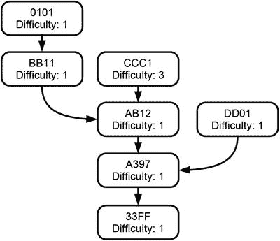

图 19-6. 带有难度级别的`blockchain-data-structure`示意图

因此，动态确定难度级别的区块链不使用`最长链准则`。相反，它们使用`最重链准则`：选择由最重链所代表的交易数据历史。在所有区块难度级别都相同的情况下，最长路径与最重路径是相同的，`最长链准则`和`最重链准则`会得出相同的结果。

### 选择一条链的后果

从冲突的版本中选择一条特定链并将其确立为权威链会带来以下后果：

- 孤块
- 奖励回收
- 明确所有权
- 交易重新处理
- 共同主干增长
- 最终一致性
- 抗操纵性

#### 孤块

共同增长的`blockchain-data-structure`形似一棵树，其分支代表了交易历史的不同冲突版本。应用选择准则实际上意味着选择该树的一条路径，并将其确立为交易数据历史的权威版本。树状数据结构中不属于权威路径的所有区块都会被节点抛弃，并被称为**孤块**。⁴ 例如，将`最长链准则`应用于图 19-4 所示情况时，区块`DD01`是一个孤块；而在图 19-5 中，区块`DD01`和`CCC1`不属于最长链并被抛弃。将`最重链准则`应用于图 19-6 所示情况时，区块`0101`、`BB11`和`DD01`不属于权威链，因此被抛弃。

#### 奖励回收

孤块在明确所有权方面毫无用处，因为它们对权威链没有贡献。因此，创建并提交这些孤块的节点所获得的奖励会被回收。这是由于步骤 18 中解释的`blockchain-algorithm`的规则 11 和规则 13 所致，这些规则规定：如果一个后来被添加到`blockchain-data-structure`的区块被认定为无效或无用，该区块及其所有后续区块将被逻辑上从`blockchain-data-structure`中移除，并且因添加该区块而给予的奖励将从最初接收它的节点那里收回。

##### 明确所有权

只有属于权威链的交易才被视为已发生，并用于处理与所有权相关的请求。孤块不属于集体选择的链。因此，它们的交易数据不构成交易数据历史的一部分。相反，它们被视为从未发生过，在处理与所有权相关的请求时也不被考虑。

#### 交易重新处理

属于孤块的交易数据最初提交的目的是将其添加到交易历史中。它们被当作从未发生过这一事实并非事先计划好的，而是工作量证明的随机性及其在增长`blockchain-data-structure`中所起作用的结果。不幸落入孤块的交易数据会再次获得机会成为所选交易历史的一部分：它们被重新放入节点的收件箱，以便后续重新处理并添加到`blockchain-data-structure`中。这是由于步骤 18 中解释的`blockchain-algorithm`的规则 11 所致。因此，曾经属于权威链的交易可能会暂时消失（如果大多数节点抛弃了它们所属的区块），但一旦它们被重新处理，便会再次出现。

#### 共同主干增长

应用选择准则并不总能产生明确的结果。例如，在图 19-3 和图 19-4 所示的情况下，存在多条最长链。在这些情况下，`blockchain-data-structure`有两条长度相等的路径，它们源于一个**共同主干**。在图 19-3 中，共同主干仅由两个区块组成，形成一条短链`A397 → 33FF`。在图 19-4 中，共同主干已由三个区块组成，形成链`AB12 → A397 → 33FF`，其中包含了前一情况的共同主干。因此，即使选择准则产生模棱两可的结果，交易历史的冲突版本也是源于一个歧义较少的共同主干。越往区块链的深层追溯，判断某个区块是否属于最长链的决定就越明确。

##### 最终一致性

让我们考虑图 19-4 所示的情况，其中最长链准则并未产生明确的结果。如图 19-5 所示，下一个被添加到`blockchain-data-structure`中的区块将决定区块`BB11`或`CCC1`是成为最长链的一部分，还是会被废弃。然而，谁来决定图 19-4 中所示的下一个添加到`blockchain-data-structure`的区块会将`BB11`作为其前驱区块，从而废弃`CCC1`呢？答案令人惊讶，或许也令人失望，那就是纯属随机。在图 19-4 所示的情况下，节点可以自由决定扩展哪个分支。因此，一些节点可能会努力寻找一个将`BB11`作为其前驱区块的新区块，而另一些节点则可能努力寻找一个将`CCC1`作为其前驱区块的新区块。它们谁先完成新区块的创建取决于哈希难题的解决，而解决该难题需要一段有限但随机的时间。首先解决新区块哈希难题的节点决定了冲突分支中哪一个被扩展，以及哪些区块被废弃。因此，由于解决哈希难题的速度竞赛以及网络中消息传递的随机波动，树形`blockchain-data-structure`的增长表现出随机行为。下一个区块的出现时间由其解决哈希难题所需的随机时长决定，而这个区块又会决定哪条路径被扩展，哪个区块被放弃。

如前所述，树形`blockchain-data-structure`的冲突分支共享一个共同的骨干，无论废弃的是哪些区块或叶子节点，这个骨干都保持不变。因此，位于权威链顶端或接近顶端的区块受新区块到达随机性的影响最大，而位于`blockchain-data-structure`更深处的区块受影响较小。因此可以这样说：一个区块在权威链中的位置越深：

-   它被添加的时间就越早
-   自它被纳入`blockchain-data-structure`以来过去的时间就越长
-   用于添加后续区块的总工作量就越大
-   它受属于最长链的区块随机变化的影响就越小
-   它被废弃的可能性就越小
-   它被系统节点接受的程度就越高
-   它在节点的共同历史中就越根深蒂固

随着时间推移和更多区块最终被添加，关于区块被纳入权威链的确定性会随之增加，这一事实被称为**最终一致性**。

#### 抗操纵性

代表最大计算工作量的树形`blockchain-data-structure`路径，就是交易历史的权威版本。建立和维护权威路径只需控制整个系统的大部分计算能力即可。如果要从`blockchain-data-structure`的一个内部区块开始建立一条新的权威路径，则需要追上并超越由大多数节点维护的路径。这一事实是区块链鲁棒性的基础。

只要诚实节点拥有整个系统大部分的算力资源，由它们维护的路径就会增长最快，并超越任何竞争路径。为了操纵一个内部区块，攻击者将不得不重做该区块的工作量证明，然后重做其后所有区块的哈希难题，接着追上并超越由诚实节点维护的路径²。然而，对于任何控制算力少于多数的攻击者来说，通过追上并超越多数节点维护的路径来建立一条新路径是不可能的。因此，任何建立包含欺诈交易的新权威路径的尝试都将被诚实多数所维护的路径超越，从而被废弃。结果，由系统维护的交易历史对于操纵是具有鲁棒性的。

### 对投票模式的威胁

如果影响整个过程的最终结果看起来有利可图，那么任何集体决策程序都可能成为操纵的目标。区块链及其分布式共识算法也不例外。关于如何操纵区块链共识算法存在许多讨论。无论这些操纵手段表面上多么五花八门，它们都只有一个目标：将属于权威链的区块变成孤立区块，并建立一条新的权威链，这条链代表一种对攻击者更有利的交易数据历史和所有权权利替代分配方案。

然而，我们可以从多种视角来讨论这些操纵行为。从经济角度看，这些操纵试图通过改变集体的交易数据历史来改变所有权权利的分配。从集体决策来看，这些操纵试图聚集多数投票权以强制实现期望的结果。从技术角度来看，任何操纵集体决策过程的尝试都旨在破坏系统的完整性。鉴于系统的分布式特性，这些操纵试图（至少暂时）建立一个隐藏的中心化要素来改变系统状态。因此，这些攻击通常被称为**51%攻击**。

**注意**

51%攻击是指在集体决策过程中试图聚集或控制整个投票权多数的一种尝试。

### 哈希难题的作用

在第 16 步中，您学习了如何使`blockchain-data-structure`变得不可篡改。因此，从纯技术角度讲，哈希难题只是实现`blockchain-data-structure`不可篡改目的的一种手段。然而，当您考量`blockchain-data-structure`的用途时，哈希难题的另一个方面便显现出来。在就交易历史达成集体共识的过程中，构成`blockchain-data-structure`的单个区块可以被视为一张选票，而哈希难题则可以被视为一种代价，这种代价使得提交选票需要付出成本，从而阻止不诚实者参与投票。

任何操纵区块链集体决策过程的尝试都旨在聚集多数投票权。由于区块链通过哈希难题将投票权与计算能力绑定，因此任何聚集多数投票权的尝试实际上意味着聚集整个点对点系统的大部分计算能力。区块链达成集体共识方式的可靠性和可信赖性，依赖于一个假设，即没有任何个人或实体能够获取或聚集整个点对点系统的累积计算能力的多数。

### 为何有效

共同构建`blockchain-data-structure`有点类似于参与一个持续进行的投票机制。在这场关于应选择哪条交易历史的持续投票中，每个单一节点只有微弱的发言权，但所有节点共同构成了一个强大的群体，持续地选择其自身的历史。之所以有效，是因为参与这场持续投票既非毫无成本，也非无法容纳。参与投票需要完成解决哈希难题所需的工作量，而通过提交投票或一个新的区块，节点为了获得奖励而将其自身承诺于此。由于所有节点都独立使用相同的标准来选择交易历史，最终所有节点达成共识。

### 展望

本步骤聚焦于纯分布式点对点系统中的节点如何就共同维护的交易数据历史达成一致意见，并强调了`hash-puzzle`对于达成共识和维护完整性的重要性。下一步将讨论奖励的重要性，以及用于补偿节点为系统完整性做出贡献的支付工具。

### 总结

-   网络中发送新区块的延迟，或两个节点几乎同时创建新区块，会导致`blockchain-data-structure`长成一棵树或柱状仙人掌的形状，其分支从共同的主干上生出，代表交易历史的冲突版本。
-   选择交易历史的相同版本是一个集体决策问题。
-   分布式共识是纯分布式点对点系统中的成员在集体决策问题上达成的一致意见。
-   区块链的集体决策问题具有以下特征：
    -   所有节点都在相同的环境中运行，该环境由网络、维护各自`blockchain-data-structure`副本的节点，以及规范节点行为的`blockchain-algorithm`组成。
    -   决策问题是在所有节点间选择相同的交易历史。
    -   所有节点都力求最大化其个人收入，这些收入作为将有效新区块添加到`blockchain-data-structure`中的奖励。
    -   为了实现目标，所有节点将其新区块发送给所有对等节点，以供其检查和接受。结果，每个节点都在共同维护的`blockchain-data-structure`这个环境中留下了自己的印记。
    -   所有节点使用相同的标准来选择交易数据的历史。
-   `最长链标准`指出每个节点独立选择树形`blockchain-data-structure`中包含最多区块的那条路径。
-   `最重链标准`指出每个节点独立选择树形`blockchain-data-structure`中累计难度最高的那条路径。
-   选择树形`blockchain-data-structure`中的一条路径会产生以下后果：
    -   孤儿区块
    -   被追回的奖励
    -   明确所有权
    -   交易重新处理
    -   不断增长的主干
    -   最终一致性
    -   对抗操纵的鲁棒性
-   一个区块在权威链中位置越深：
    -   它被添加的时间越早
    -   自它被纳入`blockchain-data-structure`以来经过的时间越长
    -   花费在添加后续区块上的共同工作量越多
    -   它受属于最长链的区块随机变化的影响越小
    -   它被放弃的可能性越小
    -   它被系统节点接受的程度越高
    -   它在节点共同历史中的根基越稳固
-   随着时间推移和后续区块的添加，关于区块被纳入权威链的确定性会逐渐增加，这一事实被称为`最终一致性`。
-   `51%攻击`是一种试图在集体决策过程中收集或控制多数投票权的行为，其目的是将权威链中的部分区块变成孤儿区块，并建立一条包含对攻击者更有利的交易历史的新权威链。
-   `51%攻击`具有以下特征：
    -   经济上：通过改变集体的交易数据历史来改变所有权分配。
    -   决策上：收集多数投票权以强制推行期望的结果。
    -   技术上：破坏系统的完整性。
    -   架构上：至少暂时建立一个隐藏的中心化元素，从而改变系统状态。

#### 脚注

[1] Hassanien, Aboul Ella, and Eid Emary. *Swarm intelligence: Principles, advances, and applications*. Boca Raton, FL: CRC Press, 2016.

[2] Nakamoto, Satoshi. *Bitcoin: A peer-to-peer electronic cash system*. 2008. [`https://bitcoin.org/bitcoin.pdf`](https://bitcoin.org/bitcoin.pdf).

[3] Wood, Gavin. *Ethereum: A secure decentralized generalized transaction ledger*. 2014. [`http://gavwood.com/paper.pdf`](http://gavwood.com/paper.pdf); Okupski, Krzysztof. *Bitcoin developer reference*. Working paper. 2014.

[4] Okupski, Krzysztof. *Bitcoin developer reference*. Working paper. 2014.

## 20. 为完整性付费

诚信和信任的建立都不是没有成本的。

关于区块链如何处理新的交易数据，以及系统节点如何就交易的真实历史达成一致的讨论，揭示了`hash-puzzle`的重要性。解决`hash-puzzle`在实现和维护系统完整性方面扮演着重要角色。但解决`hash-puzzle`需要消耗计算资源，因此也需要花费金钱。出于这个原因，有必要对那些为系统完整性做出贡献的节点进行补偿。然而，在整个讨论过程中，我们一直假设节点以某种方式得到了补偿，而没有询问使用了哪种支付工具。因此，本步骤将专门聚焦于节点如何因其对系统完整性的贡献而获得补偿。

### 隐喻

假设你是一家面包店的老板。有一天，你想出了一个改善生意的绝妙主意。你意识到现金很稀缺，但你的面包店里总有面包在售，而且大多数营业日结束时都会剩下大量面包。因此，你决定用面包而不是现金来支付员工工资。这将实现两个目标：节省你的现金开支，并且避免浪费剩余面包。你的员工对此并不兴奋，但很快其他公司开始效仿你，最终所有公司都开始采用这种报酬方式：汽车制造商用汽车支付员工工资，建筑公司用房子支付员工工资，等等。有一天，你的朋友们都在抱怨他们那不实用的报酬方式，但其中一个人例外，他仍然用现金领取报酬。你认为这个人会在哪家公司或机构工作？原来，他在一家中央银行工作，而这家银行恰好是货币的生产者！

这个例子巧妙地展现了我们通过完成工作所创造的商品与我们作为报酬所获得的商品之间的依赖关系。本步骤将在区块链的背景下讨论这种联系。事实证明，在某些条件下，区块链可能会变得更像一家用自己印制的钞票支付员工工资的中央银行。但在讨论这种特殊情况之前，让我们更详细地审视一下费用在区块链中的作用，以及报酬的重要性。

### 费用在区块链中的作用

步骤 18 强调，区块链采用“胡萝卜加大棒”的方法，让组成系统的对等节点相互控制。对奖励的竞争和对惩罚的威胁是促使系统内的对等节点有序地验证交易，并选择凝聚了最多集体努力的那条交易历史记录的两股力量。奖励和惩罚通过基于交易费用和工作量证明来实现。¹ 这种效应在所有区块链应用中都是普遍存在的，无论其具体的应用目标为何。然而，用于补偿系统维护者的具体支付工具的选择，在所有区块链应用中并非完全相同。定义并使用一种支付工具，将其交给对等节点，作为其验证并将新区块添加到区块链的报酬，这被认为是建立区块链应用的主要挑战之一。因此，必须考虑选择支付工具所带来的以下后果：

*   对系统完整性的影响
*   对系统开放性的影响
*   对系统去中心化性质的影响
*   对系统哲学的影响

#### 对系统完整性的影响

奖励和惩罚的力量是在区块链中实现并维护完整性的基础。这之所以有效，是因为系统的对等节点为维护系统完整性而获得了有价值的报酬。但是，我们如何首先知道对等节点确实为他们的工作获得了有价值的报酬呢？嗯，这正是关键所在。哪种支付工具被认为是有价值的、值得完成维护系统的工作？如果这种支付工具已知会贬值或不可信，会发生什么？当对等节点被支付一种不可信且毫无价值的工具时，我们能否期望他们会继续维护区块链？不，我们不能。对用于补偿系统对等节点的支付工具缺乏信任，将会污染整个系统。因此，用于补偿系统支持者的支付工具直接影响着区块链本身的可靠性。

#### 对系统开放性的影响

区块链应该是一个开放的点对点系统。每个人都可以将自己的计算机连接到系统，并因贡献于维护其完整性而获得奖励。但是，如果用于补偿对等节点的支付工具不像区块链本身那样开放，会发生什么？如果报酬是通过一种仅在特定国家可用或接受、或受资本流动限制的支付工具来进行的呢？在这种情况下，支付工具会通过引入经济限制来抵消系统的技术开放性。

#### 对系统去中心化性质的影响

区块链是一个纯粹的去中心化点对点系统，没有任何集中控制或协调的元素。但是，如果用于补偿对等节点的支付工具由一个中央机构控制和治理，会发生什么？这意味着允许中心化通过后门进入系统。它将与系统的去中心化性质背道而驰。

#### 对系统哲学的影响

前面的讨论揭示出，用于补偿支持系统的对等节点的支付工具的特性，有可能抵消区块链的主要方面。这引出了一个根本性问题：一个旨在摆脱集中控制的纯粹去中心化点对点系统，如果使用一种与其核心价值观背道而驰的支付工具来补偿其对等节点，它还能被认为是可信赖的吗？每个声称完全开放和纯粹去中心化的区块链都必须为这个问题找到一个令人满意的答案。

### 用于补偿对等节点的支付工具的理想特性

为了尽可能少地干扰区块链的目标和价值观，用于补偿对等节点的支付工具应满足以下条件：

*   以数字形式存在；否则无法被纳入区块链。
*   在现实世界中被接受为支付工具；否则系统中的对等节点无法利用支持系统获得的收入来支付他们在现实世界中的账单。
*   在所有国家都被接受为支付工具；否则，对于那些生活在该支付工具不被接受国家的对等节点来说，支持系统将变得缺乏吸引力。
*   不受资本流动限制；否则其向对等节点的转移将受到限制。
*   具有稳定的价值；否则对等节点将面临购买力损失的经济风险。
*   值得信赖；否则会削弱区块链建立信任的能力。
*   不受任何一个单一的中央机构或国家控制；否则将与区块链的去中心化性质产生严重冲突。

这份特性清单读起来就像是对完美世界货币的愿望清单。因此，现有的任何一种法定货币都无法满足这些期望，也就不足为奇了。

### 加密货币诞生的迂回之路

上一节列出了用于补偿区块链节点的支付工具应具备的理想属性。现有法定货币无一满足这些属性这一发现有点令人沮丧，因为这些属性本身是可取的。具有这些属性的货币或支付工具除了用于补偿分布式系统的节点之外，在许多其他场合也很有用。事实证明，许多人早已思考过这个问题。第一个也是最著名的区块链应用就是为了解决这个问题而诞生的。该区块链的理念非常巧妙：它是一个纯粹的分布式点对点系统，用于管理一种新型数字货币的所有权，而这种货币反过来又用于补偿系统中为验证新区块并将其添加到区块链数据结构中的节点。这种特殊的新货币将其应用目标——管理一种新型货币的所有权——与需要一种可信赖的支付工具来补偿其贡献者联系起来。我说的就是比特币。比特币系统不仅在一个纯粹的分布式点对点系统中管理这种新型数字货币的所有权，而且还用这种货币来补偿那些为其完整性做出贡献的节点。由于区块链严重依赖密码学，这种新型货币也被称为密码学货币或简称加密货币。打个比方，你可以认为比特币和许多其他加密货币就像是用自己生产的面包来支付员工工资的面包店，不同之处在于，它们生产的面包实际上是一种新的数字货币。

### 展望

这一步强调了用于补偿区块链节点的支付工具的重要性。这是聚焦于区块链基本原理的一系列步骤中的最后一步。下一步将把所有部分整合起来，并总结你在之前的学习步骤中学到的内容。

### 总结

-   区块链利用费用来补偿节点为系统完整性所做的贡献。
-   用于补偿节点的支付工具会影响区块链的主要方面，例如：
    -   完整性
    -   开放性
    -   分布式特性
    -   系统理念
-   用于补偿节点的支付工具的理想属性是：
    -   以数字形式存在
    -   在现实世界中被接受
    -   在所有国家都被接受
    -   不受资本流动限制
    -   值得信赖
    -   不受单一中央组织或国家控制
-   加密货币是一种独立的数字货币，其所有权由区块链管理，该区块链将其用作支付工具，以补偿节点维护系统完整性的贡献。

**脚注** 1

中本聪。比特币：一种点对点的电子现金系统。2008 年。[`https://bitcoin.org/bitcoin.pdf`](https://bitcoin.org/bitcoin.pdf)。

## 21. 整合所有部分

整体大于部分之和

这一步是本书理解区块链的知识旅程的顶峰。虽然步骤 9–20 分别探讨了构成区块链的各个概念，但这一步将所有部分整合在一起。因此，你不仅能够从整体上理解区块链，还能看到不同概念是如何协同工作的。本学习步骤首先回顾区块链的主要概念和技术，然后根据前几步获得的技术知识解释区块链是什么。最后，这一步将回顾区块链技术套件的定义，从而将区块链开放给广泛的应用领域。

### 回顾概念与技术

理解区块链的知识之旅始于步骤 8，我们在那里规划了一个用于管理所有权的纯分布式点对点系统的设计。表 21-1 列出了这些任务、目标、对应的步骤以及区块链的相应概念。

**表 21-1.** 设计用于管理所有权的分布式点对点系统的任务回顾

| 任务编号 | 目标 | 步骤编号 | 主要概念 |
| --- | --- | --- | --- |
| 1 | 描述所有权 | 9 | 交易数据历史 |
| 2 | 保护所有权 | 10–13 | 数字签名 |
| 3 | 存储交易数据 | 10, 11, 14, 15 | 区块链数据结构 |
| 4 | 准备用于分发的账本 | 16 | 不可篡改性 |
| 5 | 分发账本 | 17 | 网络中的信息转发 |
| 6 | 添加新交易 | 18 | 区块链算法 |
| 7 | 决定哪个账本代表真相 | 19 | 分布式共识 |

理解构成区块链的这些主要概念也依赖于其他概念和技术，这一点很重要。理解区块链至少也需要理解这些概念。因此，表 21-2 在更详细的层面上总结了构成区块链的技术。本步骤的其余部分将借鉴这两个表中展示的概念。

**表 21-2.** 区块链的技术概念、目的及比喻

| 概念 | 目的 | 使用的比喻 |
| --- | --- | --- |
| 交易数据 | 描述所有权的转移 | 银行转账单 |
| 交易历史 | 证明所有权的当前状态 | 接力赛的过程 |
| 密码学哈希值 | 唯一标识任何类型的数据 | 人类指纹 |
| 非对称密码学 | 加密和解密数据 | 带锁的公共邮箱 |
| 数字签名 | 表示同意交易数据的内容 | 手写签名 |
| 哈希引用 | 一旦引用的数据被更改就失效的引用 | 利用哈希值识别衣帽钩的衣帽间牌 |
| 变更敏感的数据结构 | 以任何篡改都会立即显现的方式存储数据 | 口袋里装有衣帽间牌的外套 |
| 哈希谜题 | 施加一项计算量大的任务 | 通过试错法打开数字锁 |
| 区块链数据结构 | 以变更敏感的方式存储交易数据并保持其顺序 | 带有卡片目录的图书馆 |
| 不可篡改性 | 使得更改交易数据历史成为不可能 | 试图建立虚假族谱 |
| 分布式点对点网络 | 在网络所有节点之间共享交易历史 | 独立的见证人小组 |
| 消息传递 | 确保系统中所有节点最终都能收到所有信息 | 人际间的流言蜚语 |
| 区块链算法 | 确保只有有效的交易数据被添加到区块链数据结构中 | 胡萝卜加大棒的管理承包者方式 |
| 分布式共识 | 确保系统中所有节点使用相同的交易数据历史 | 公园里因游客用脚投票而形成的小路 |
| 补偿 | 给予节点维护完整性的激励 | 用面包支付员工工资的面包店 |

### 什么是区块链？

在对构成区块链的各个概念有了总体了解之后，重要的是要看清它们如何协同工作。通过识别其应用层和实现层的功能性与非功能性方面来分析系统的方法，有助于我们迎接理解区块链各概念如何协同工作的挑战。表 21-3 提供了区块链各层及其方面的概览，这将指导您将这些概念整合在一起。

**表 21-3.** 区块链的层与方面

| 层 | 功能性方面 | 非功能性方面 |
| --- | --- | --- |
| 应用层 | 明确所有权 转移所有权 | 高可用性 可靠 开放 伪匿名 |
| 实现层 | 所有权逻辑 交易安全 交易处理逻辑 存储逻辑 共识逻辑 纯分布式点对点架构 | 安全 弹性 最终一致性 保持完整性 |

#### 区块链的目的：应用层的功能性方面

区块链服务于两个目的：

- 明确所有权
- 转移所有权

##### 明确所有权

明确所有权意味着回答构成所有权的核心问题，即：谁在什么时间拥有多少数量的什么对象？

##### 转移所有权

转移所有权意味着改变当前的所有权状态。为此，区块链允许所有者将其财产转移给他人。因此，它回答了另一个证明所有权的核心问题，即：谁在什么时间将多少数量的什么对象的所有权转移给了谁？

#### 区块链的特性：非功能性方面

在与区块链交互时，您会注意到它如何履行其职责。区块链实现其目的的质量由其非功能性方面描述：

- 高可用性
- 抗审查
- 可靠
- 开放
- 伪匿名
- 安全
- 弹性
- 最终一致性
- 保持完整性

##### 高可用性

区块链不会出现停机。相反，区块链全天候可用，一天 24 小时，一周 7 天，全年无休。它甚至没有关闭按钮。

##### 抗审查

没有任何人能单独决定区块链的内容或关闭整个系统。

##### 可靠

区块链始终如一地以高质量实现其目的。人们可以信任区块链能正确地明确和转移所有权。

##### 开放

区块链不排斥特定用户或计算机使用其服务。相反，它对所有人开放。

##### 伪匿名

区块链唯一地标识所有者，但既不维护也不揭示他们在现实世界中的身份。

##### 安全

区块链在两个方面是安全的：(1) 在单个交易层面，(2) 在整个系统层面。就个体层面而言，区块链确保所有权仅由合法所有者支配。在整体层面，区块链保护所有所有者的所有权免受操纵、篡改、伪造、双重支付和未授权访问。

##### 弹性

即使在不理想的条件下，区块链也能正确地明确和转移所有权。区块链能够抵御针对所有权的各种攻击，例如伪造、双重支付、假冒他人访问财产等。

##### 最终一致性

区块链并非始终产生一致的结果。相反，获得一致结果的可能性会随着时间推移而增加，并最终在整个系统中达到完全一致。

##### 保持完整性

区块链通过展现无逻辑错误的行为来维护其完整性。它在单个交易层面以及整个交易数据历史中维护数据一致性并确保安全性。

#### 内部运作：实现层的功能性方面

区块链的内部运作可追溯到以下几个主要组件：

- 所有权逻辑
- 交易安全
- 交易处理逻辑
- 存储逻辑
- 点对点架构
- 共识逻辑

##### 所有权逻辑

所有权逻辑规定了如何明确和转移所有权。区块链利用单个交易数据来描述所有权的转移，并维护整个交易数据来明确所有权。图 21-1 说明了所有权逻辑及其底层概念。上方方框所示的概念依赖于其下方的概念。最底行的方框展示了所有权逻辑所依赖且需要进一步详细说明的概念。

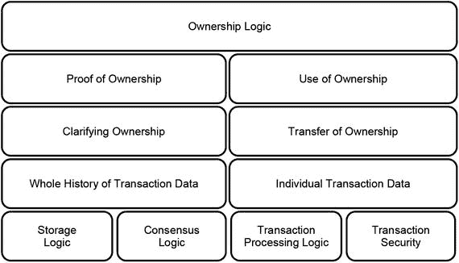

**图 21-1.** 所有权逻辑及其底层概念

区块链使用的所有权逻辑依赖于维护整个交易数据历史的存储逻辑和确保其一致性的共识逻辑。此外，所有权逻辑还依赖于确保仅有效交易数据被添加到数据存储中的交易处理逻辑，以及确保只有合法所有者才能将其财产转移到另一个账户的交易安全。这四个关注点由区块链的其余组件处理。

##### 交易安全

交易安全确保只有合法所有者才能访问其所有权并将其转移到另一个账户。图 21-2 说明了实现交易安全所涉及的概念。诸如加密哈希值和非对称加密等基本概念位于最底部的方框中，因为它们是位于其上方所有其他概念的基础。例如，数字签名位于授权之下，因为它是授权交易的一种手段，但它位于加密哈希值和私钥之上，因为它利用了这些概念。类似地，图 21-2 使认证和身份识别对底层密码学的依赖关系更加明显。

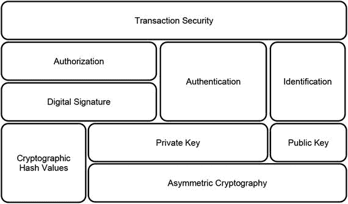

**图 21-2.** 交易安全及其底层概念

##### 交易处理逻辑

交易逻辑确保只有有效的交易数据被添加到集体维护的交易数据历史中。它显然依赖于对代表系统真正目标的交易数据的验证。系统中的每个单个节点都可以独立地验证交易数据。然而，单个节点可能在验证交易数据时出错，或者可能故意接受无效的交易数据。这两种情况都对整个系统的完整性构成威胁。因此，交易处理涉及一个复杂的机制，分别包含新区块或其区块头的验证：点对点架构以及对等节点的控制和竞争，这反过来依赖于奖惩的力量。图 21-3 通过将这些概念呈现在相互叠加的方框中以指出它们的依赖关系，描绘了这些概念之间的关系。

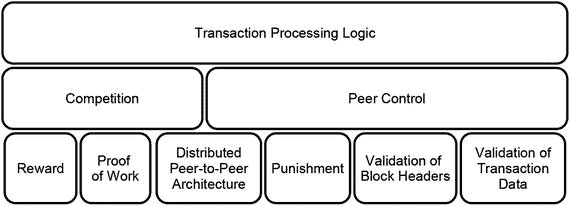

**图 21-3.** 交易处理逻辑及其底层概念

##### 存储逻辑
对有效交易的处理会导致它们被添加到整个交易数据历史记录中，即将其添加到一个维护完整交易数据历史记录的数据存储中。整个系统的完整性及其履行其阐明和转移所有权目的的能力，依赖于该数据存储的完整性。因此，存储逻辑关注于维护完整的交易数据历史记录，并通过追求让修改数据变得极其昂贵的理念，来保护这些数据免遭篡改、伪造或仿冒。如图 21-4 所示，存储逻辑通过维护一个基于工作量证明和`区块链数据结构`的、不可变且仅可追加的数据存储来实现这一点。其运作可以追溯到哈希谜题、哈希引用和对变更敏感的数据结构，而后者又可以追溯到加密哈希值的基本概念。图 21-4 通过将派生概念分层放置在代表更基本概念的方框之上，描绘了存储逻辑的依赖关系。

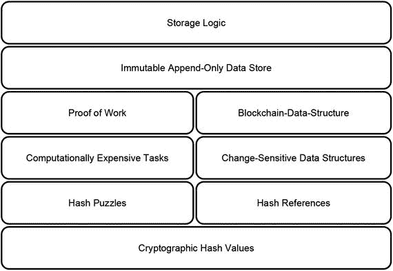

图 21-4. 存储逻辑及其基础概念

#### 点对点架构
该架构决定了系统的组件或节点如何相互关联和连接。如图 21-5 所示，区块链利用了一个纯粹分布式的点对点系统，该系统由称为节点的独立对等点组成。这些节点通过作为通信媒介的网络相互连接。每个对等点都维护着自己的一份包含完整交易数据历史记录的`区块链数据结构`副本。对等点通过利用一种 gossip 风格的消息传递协议进行通信，该协议确保每个对等点最终都能接收到所有信息。

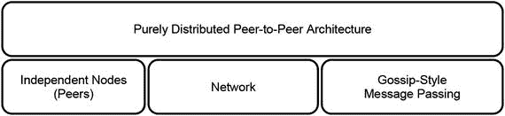

图 21-5. 架构及其基础概念

##### 共识逻辑
由于分布式系统的所有节点都独立维护自己的交易数据历史记录，因此由于网络传递消息的延迟或其他不利因素，它们的内容可能会有所不同。结果，原本应形成一条直线状链接数据块的数据存储，实际上形成了一个树状的数据结构，其中每个分支代表交易历史的一个冲突版本。如图 21-6 所示的共识逻辑，通过让所有节点选择凝聚了最多集体努力的、完全相同的交易历史版本，最终使系统的所有节点达成一致。

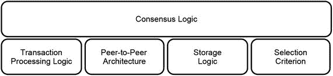

图 21-6. 共识逻辑及其基础概念

### 获得抽象
获得抽象的过程，涉及识别和区分区块链中那些特定于管理所有权目标的组件与那些对特定应用目标无关的组件。这与我们在第 5 步中所讨论的对`区块链技术套件`的理解是一致的。显然，所有权逻辑和交易数据是特定于应用的组件，因为它们决定了如何用交易数据描述所有权，以及如何阐明和转移所有权。另一方面，交易安全和交易处理逻辑则不那么特定于应用目标。前者利用了识别、认证、授权和数字签名这些通用概念，这些概念同样可用于任何其他应用。如图 21-3 所示，后者是一个庞大的数据处理装置，其大部分组件与应用目标无关。交易处理逻辑中唯一与应用目标紧密耦合的组件是交易数据的验证。所有其他组件，如竞争、对等点控制、奖励、惩罚以及区块头的验证，都与正在处理的特定数据无关。图 21-7 展示了区分区块链中特定于应用的组件与对特定应用目标无关的组件的结果，这些无关组件反过来构成了`区块链技术套件`。

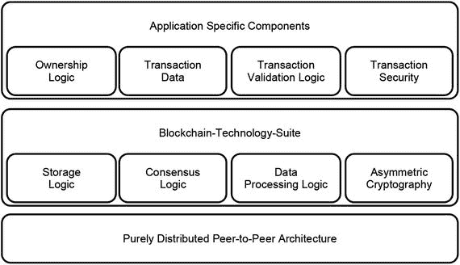

图 21-7. 区块链中的`区块链技术套件`

### 展望
这一步专注于将前面所有步骤的各个部分整合在一起，以便对区块链有一个全面的了解。开放性以及没有任何形式的中央控制或协调，是该系统的基础，因为它们允许其节点充当独立的证人，以澄清与所有权相关的事务。然而，这些特性也可能导致意想不到的后果。这些意想不到的后果是什么，以及它们可能如何限制区块链的使用，将在下一步中讨论。

### 总结
*   区块链是一个纯粹分布式的点对点系统，它解决了管理所有权的以下方面：
    *   描述所有权：交易数据历史记录
    *   保护所有权：数字签名
    *   存储交易数据：`区块链数据结构`
    *   准备账本以便分发：不可变性
    *   分发账本：通过网络的 Gossip 风格信息转发
    *   处理新交易：`区块链算法`
    *   决定哪个账本代表真相：分布式共识
*   分析区块链涉及以下几个方面：
    *   应用目标
    *   其特性
    *   其内部运作机制
*   区块链有两个应用目标：
    *   阐明所有权
    *   转移所有权
*   区块链在展现以下特质的同时实现其应用目标：
    *   高可用性
    *   抗审查性
    *   可靠性
    *   开放性
    *   伪匿名性
    *   安全性
    *   弹性
    *   最终一致性
    *   保持完整性
*   从内部看，区块链由特定于管理所有权应用目标或与该目标无关的组件组成。
*   区块链中特定于应用的组件是：
    *   所有权逻辑
    *   交易数据
    *   交易处理逻辑
    *   交易安全
*   与应用无关的组件是：
    *   `区块链技术套件`
    *   纯粹分布式的点对点架构
*   `区块链技术套件`由以下部分组成：
    *   存储逻辑
    *   共识逻辑
    *   数据处理逻辑
    *   非对称加密

