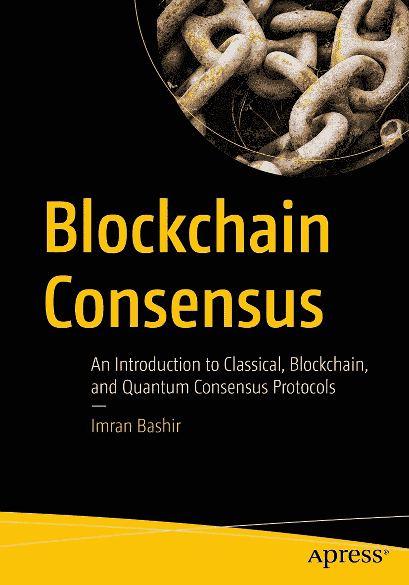

# 书籍封面

ISBN 978-1-4842-8178-9 e-ISBN 978-1-4842-8179-6 [`doi.org/10.1007/978-1-4842-8179-6`](https://doi.org/10.1007/978-1-4842-8179-6) © Imran Bashir 2022

本作品受版权保护。所有权利均由出版商独家许可，无论涉及全部或部分材料，具体包括翻译、转载、插图再利用、朗诵、广播、缩微胶片复制或其他任何物理方式复制，以及电子信息存储与检索、电子化改编、计算机软件，或当前已知或未来开发的类似或不同方法的权利。本出版物中使用通用描述性名称、注册商标、商标、服务标志等，即使未作明确声明，也并不意味着这些名称免于相关保护法律和法规的约束，因此可自由使用。出版商、作者及编辑假设本书中的建议和信息在出版日期时是真实准确的。出版商、作者或编辑均不对本书所含材料或可能存在的任何错误或疏漏提供明示或暗示的担保。出版商对已出版地图中的管辖权主张和机构归属保持中立。

本 Apress 印记由注册公司 APress Media, LLC 出版，该公司是施普林格·自然的一部分。注册公司地址为：美国纽约州纽约市纽约广场 1 号，邮编 10004。

*谨以此书献给我的父亲，他是我所认识的最深情、最无私、最勤奋的人。*

*如果你在研究问题上陷入困境，请仔细阅读所有相关文献，你会找到答案。*  
*——科学家巴希尔·艾哈迈德·汗*

## 引言

本书是对分布式共识及其在区块链中应用的介绍。它涵盖了经典协议、比特币之后出现的区块链时代协议以及量子协议。许多来自不同背景的爱好者进入了区块链世界，可能缺乏传统的分布式系统经验。本书填补了这一知识空白。它介绍了分布式共识的经典协议和基础，从而为理解区块链共识研究打下坚实基础。其他许多人来自传统的分布式系统背景，无论是开发者还是理论家，但他们可能缺乏对区块链及相关概念（如比特币和以太坊）的理解。本书也将填补这一空白。

此外，由于量子计算未来将几乎影响一切，我还介绍了量子计算如何帮助构建量子共识算法。通过使用量子计算，可以在共识算法的效率和安全性方面实现明显的优势。因此，专门有一章讨论量子共识。

本书面向所有希望了解区块链共识和广义分布式共识这一迷人世界的人。只需具备计算机科学基础知识即可充分利用本书。本书亦可作为区块链与分布式共识一学期课程的学习资源。

本书首先简要介绍分布式共识是什么，并涵盖因果关系、时间及各种分布式系统模型等基本概念。然后，为理解区块链共识的安全方面奠定基础，介绍了密码学入门知识。接着，详细介绍了分布式共识。随后介绍了区块链，让读者扎实理解什么是区块链以及它本质上是一个分布式系统。然后我们讨论区块链共识，重点介绍首个加密货币区块链——比特币，以及它如何实现其安全性和分布式共识目标。从第 6 章开始，介绍早期协议，涵盖拜占庭将军问题及其各种解决方案等经典工作。之后，介绍了 Paxos、DLS 和 PBFT 等经典协议。接着，介绍了 ETHASH、Tendermint、GRANDPA、BABE、HotStuff 和 Casper 等区块链协议。这些协议是区块链共识机制研究的最新成果。当然，由于主题广泛，我们无法涵盖所有内容。但本章专门介绍区块链共识，涵盖了那些最先进且在主流区块链平台（如 Polkadot、以太坊和 Cosmos）中使用的所有协议。

下一章是另一个激动人心的主题：量子共识。随着量子计算的出现，人们认识到量子计算可以显著增强经典分布式共识的结果。甚至像 FLP 不可能性这样的结果，也可能利用叠加和纠缠等量子特性被推翻。

最后，最后一章总结了本书所学内容，介绍了一些特殊协议，并提出了一些研究方向。

由于本书侧重于区块链和共识的基础，我相信它将为所有想学习区块链和区块链共识的爱好者提供极好的学习资源。此外，我希望本书在未来许多年里能为技术人员、研究人员、学生、开发者以及任何想深入了解这一迷人主题的人提供帮助。

