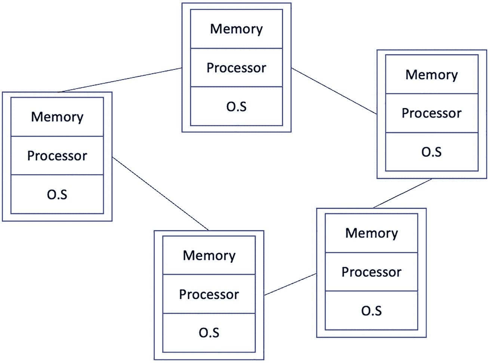
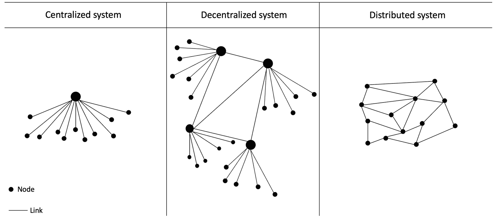
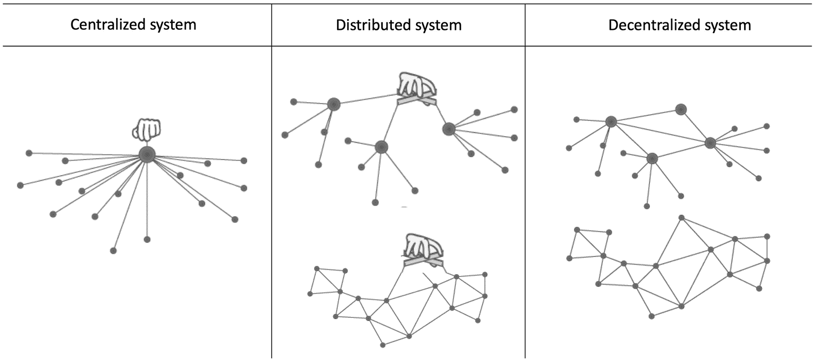

# 1. 引言

在本章中，我们探索分布式计算的基础。首先，我们将回答关于分布式系统、其基本抽象、系统模型及相关概念的问题。

## 分布式系统

在文献中，关于分布式系统有许多不同的定义。但归根结底，它们都指出一个事实：分布式系统是由多台计算机协同工作以解决某个问题的集合。

该领域一些著名学者的定义如下：

> *一个分布式系统是这样的系统：一台你甚至不知道它存在的计算机发生故障，就能导致你的计算机无法使用。*
> 
> ——莱斯利·兰波特
> 
> [`https://lamport.azurewebsites.net/pubs/distributed-system.txt`](https://lamport.azurewebsites.net/pubs/distributed-system.txt)

> *分布式系统是一组自治计算元素的集合，这些元素在用户看来就像一个单一的、连贯一致的系统。*
> 
> ——塔能鲍姆
> 
> [`www.distributed-systems.net/index.php/books/ds3/`](http://www.distributed-systems.net/index.php/books/ds3/)

以下是我自己的尝试！

分布式系统是一组自治计算机的集合，它们通过消息传递网络相互协作，以实现共同的目标。

通常，这个问题无法由单台计算机解决，或者分布式系统本身就具有分布性，例如社交媒体应用。

分布式系统的一些日常示例包括 `Google`、`Facebook`、`Twitter`、`Amazon` 以及万维网。另一类近期出现且流行的分布式系统是区块链或分布式账本，我们将在第 4 章中介绍。

在本章中，我们将奠定基础，从总体上审视分布式系统，了解其特性与属性、构建动机，以及有助于推断分布式系统属性的系统模型。

虽然分布式系统可能相当复杂，并且通常需要处理许多设计方面的问题，包括进程设计、消息（进程间的交互）、性能、安全性和事件管理，但一个核心问题是共识。

`共识`是分布式系统中的一个基本问题，即尽管系统中存在某些故障，分布式系统内的进程始终能就系统的状态达成一致。我们将在第 3 章中对此进行更深入的探讨。

在第一章中，我们将为分布式系统奠定基础，并建立关于它们是什么以及如何工作的直观认识。之后，我们将涵盖密码学、区块链和共识，这些将为我们打下坚实基础，以便继续学习后续章节，涵盖更深入的主题，例如共识协议、设计与实现，以及关于量子共识的一些最新研究。

但首先，让我们更仔细地审视分布式系统的基础，并讨论分布式系统具有哪些特性。

## 特性

是什么让一个系统成为分布式系统？以下是一些基本属性：

1.  无全局物理时钟
2.  自治处理器/独立处理器/独立容错
3.  无全局共享公共内存
4.  异构性
5.  连贯一致性
6.  并发性/并发操作

无全局物理时钟意味着系统本质上具有异步性。分布式系统中的计算机或节点是独立的，拥有自己的内存、处理器和操作系统。这些系统没有一个全局共享的时钟作为整个系统的时间源，这使得时间概念在分布式系统中变得棘手，我们稍后将看到如何克服这一限制。没有全局共享内存这一事实意味着，进程之间进行通信的唯一方式是通过信道或链路消耗通过网络发送的消息。

分布式系统中的所有进程、计算机或节点都是独立的，拥有自己的操作系统、内存和处理器。分布式系统中没有全局共享内存，这意味着每个处理器都有自己的内存、对自己状态的独立视图，并且除非收到来自其他节点的消息并增加了该节点的本地知识，否则其本地知识是有限的。

分布式系统通常是异构的，包含多种采用不同架构和处理器的不同类型的计算机。这样的设置可以包括商用计算机、高端服务器、物联网设备、移动设备，以及几乎任何运行分布式算法以解决分布式系统所设计的共同问题（实现共同目标）的设备或“物品”。

分布式系统也具有连贯一致性。这一特性抽象掉了分布式系统分散结构的所有细微细节，对最终用户而言，它呈现为一个单一、内聚的系统。这个概念被称为分布透明性。

分布式系统中的并发性涉及这样一个要求：分布式算法应在分布式系统的所有处理器上并发运行。

图 1-1 展示了一个通用的分布式系统模型。

*一个包含 5 台互联计算机的分布式系统示意图。每台计算机包含一个内存、一个处理器和一个操作系统。*

图 1-1：一个分布式系统

我们构建分布式系统有若干原因。最常见的原因是**可扩展性**。例如，假设你有一台服务器每天为 100 个用户提供服务；当用户数量增长时，通常的方法是**垂直扩展**，即通过添加更强大的硬件（例如更快的 `CPU`、更多的 `RAM`、更大的硬盘等），但在某些情况下，垂直扩展存在极限，此时你必须**水平扩展**，即添加更多计算机并以某种方式在它们之间分配负载。

## 为何构建分布式系统

下面，我们介绍构建分布式系统背后的一些动机：

*   可靠性
*   性能
*   资源共享
*   固有的分布性

让我们逐一审视这些原因。

### 可靠性

**可靠性**是分布式系统的一个关键优势。想象一下，如果你只有一台计算机。那么，当它发生故障时，别无选择，只能重启它，或者在出现重大故障时更换一台新的。然而，在分布式系统中，系统内存在多个节点，这使得分布式系统能够在一定程度上容忍故障。因此，即使分布式网络中的某些计算机发生故障，分布式系统也能继续运行。**可靠性**是分布式计算领域重要的研究和学习方向之一，稍后我们将在**容错性**的背景下更详细地探讨它。

可靠性包含多个方面，包括**可用性**、**完整性**和**容错性**：

*   **可用性** 简单来说，就是当客户端发出请求时，分布式系统应始终保持可用。
*   **完整性** 确保分布式系统的状态始终处于稳定且一致的状态。
*   **容错性** 使得分布式系统即使在发生某些故障的情况下也能正常运行。

### 性能

在分布式系统中，可以自然地实现更好的**性能**。例如，在一个协同工作的计算机集群中，可以通过**并行化**计算来获得更好的性能。此外，在地理上分散的分布式网络中，访问节点的客户端（用户）可以从地理位置更近的节点获取数据，从而实现更快速的数据访问。例如，在互联网文件下载场景中，距离你地理区域更近的镜像站点将比可能位于其他大洲的站点提供快得多的下载速度。

分布式系统的性能通常包含两个方面：**响应性**和**吞吐量**。

#### 响应性

该属性保证系统具有合理的响应速度，用户能够从分布式系统获得足够的响应。

### 吞吐量

分布式系统的`吞吐量`是衡量其性能的另一个指标。`吞吐量`主要衡量系统处理数据的速度；通常以每秒事务数来衡量。正如我们将在第 5 章中看到的，在区块链系统（分布式账本）中，高每秒事务数是非常理想的。对于分布式数据库，常用每秒事务数或每秒执行的查询数来衡量系统性能。`吞吐量`受到分布式系统不同方面的影响，例如处理速度、通信网络质量、速度和可靠性，以及算法。如果你的硬件很好，但算法设计得不好，这也会影响`吞吐量`、响应能力和系统的整体性能。

### 资源共享

分布式系统中的资源可以与其他节点/参与者共享。有时，存在一些昂贵的资源，例如超级计算机、量子计算机或某些工业级打印机，这些资源在每个站点都配备的成本过高；在这种情况下，可以通过通信链路远程共享给其他节点。另一种场景是将数据划分为多个分区（分片）以实现快速访问。

### 固有分布性

在某些场景下，除了构建分布式系统外别无选择，因为只有分布式系统才能解决问题。例如，消息系统本质上就是分布式的。移动网络本质上也是分布式的。在这些以及类似的应用场景中，分布式系统是唯一能够解决问题的方案；因此，系统在设计中就必须是分布式的。

尽管分布式系统拥有所有这些优点，但在构建时也存在一些需要解决的挑战。分布式系统的特性，例如无法访问全局时钟、异步性以及部分故障，使得设计可靠的分布式系统成为一项艰巨的任务。在下一节中，我们将探讨构建分布式系统时应解决的一些主要挑战。

## 挑战

分布式系统很难构建。在设计分布式系统时，需要应对多种挑战。以下列举了一些常见的挑战。

### 容错性

随着计算机数量的增加，有时数据中心里有数十万台计算机（例如在云计算中），不可避免地，某个地方会出故障。换句话说，分布式系统中某个部分（无论是网线、处理器还是其他硬件）发生故障的概率会随着计算机数量的增加而增加。分布式系统的这一特性要求，即使系统的某些部分发生故障（通常在某个阈值内），整个分布式系统也必须持续运行。为此，在分布式计算的容错性领域内，有许多问题被研究。容错共识就是一个例子，人们努力构建共识算法，使其即使在分布式系统中存在一定数量的故障节点或链路时，也能继续按规范正确运行。我们将在第 3 章中看到更多细节。

一个相关的研究领域是`故障检测`，它涉及开发尝试检测分布式系统中故障的算法。这在异步分布式系统中尤其值得关注，因为此类系统中消息传递时间没有上限。当无法区分是节点故障、节点速度慢还是链路丢包时，问题就变得更加棘手。故障检测算法会给出关于进程故障的概率性指示。节点的这种可用或不可用状态随后可用于处理该故障。

另一个研究领域是`副本`，它基于以下原理提供容错性：如果同一数据在分布式系统的多个节点上复制，那么即使某些节点宕机，数据仍然可用，这有助于保持系统稳定，继续满足其规范（保证），并保持对最终用户的可用性。我们将在第 3 章中了解更多关于副本的内容。

### 安全性

由于分布式系统有多个用户使用，其中可能包含恶意用户，其安全性便成为了首要关注点。在地理上分散的分布式系统和开放系统（例如比特币区块链）中，这种情况更为严峻。为此，用于提供分布式系统安全性的基础科学是密码学，我们将在第 2 章中详细讨论，并且会在本书中反复提及，特别是与区块链共识相关的内容。在这里，我们将学习诸如密码学之类的主题，并解决认证、保密性、访问控制、不可否认性和数据完整性等挑战。

### 异构性

分布式系统不一定由完全相同的硬件节点组成。有可能（这种情况被称为同构分布式系统）存在，但通常硬件和操作系统各不相同。在这种场景下，不同的操作系统和硬件可能表现各异，导致同步复杂化。某些节点可能很慢，运行着可能包含缺陷的不同操作系统；有些节点由于硬件更好而运行更快；有些节点可能像移动设备或物联网设备那样资源受限。面对分布式系统中所有这些不同类型的节点（进程、计算机），构建一个能在所有这些不同类型的系统上正确运行，并且尽管节点本地运行环境存在差异仍能继续正确运行的分布式算法，就变得很有挑战性。

### 分布透明性

分布式系统的目标之一是实现透明性。这意味着，无论分布式系统由多少台独立的计算机和外围设备构建而成，对最终用户来说，它都应该表现为一个单一的、连贯的系统。例如，一个电子商务网站在其分布式系统中可能有许多数据库服务器、防火墙、Web 服务器、负载均衡器和许多其他元素，但所有这些都应该对最终用户抽象隐藏。最终用户不一定关心这些后台的“无关”细节，只关心当他们发出请求时系统能够响应。总之，如果一个分布式系统尽管其异构和分散的结构，但其行为符合最终用户的期望，那么它就是连贯的。例如，思考一下`IPFS`，一个分布式文件系统。尽管文件在`IPFS`网络中的多台计算机上分布和分片存储，但对最终用户来说，所有这些细节都是透明的，他们操作起来几乎就像在使用本地文件系统。对于在线电子邮件平台和云存储服务等其他系统，也可以观察到类似的情况。

### 时序与同步

同步是确保分布式系统全局状态稳定的关键操作。由于每个进程根据其内部物理时钟（可能产生漂移）拥有自己的时间视图，时间同步便成为设计分布式系统时需要解决的基本问题之一。我们将在本章关于`时序`、`顺序`和`时钟`的部分中，进一步探讨这个有趣的问题并研究一些解决方案。

### 全局状态

由于分布式系统中的各个进程仅了解自身的局部状态，确定系统的全局状态便成为一项巨大挑战。有多种算法可用于实现此目标，例如 `Chandy-Lamport` 算法。我们稍后将简要介绍该算法。

### 并发

并发是指多个进程同时运行。此外，在逻辑并发与物理并发之间也存在区别。逻辑并发指的是多个程序在单个处理器上以交错方式执行的情况。物理并发则是指同一程序中的程序单元在两个或更多处理器上同时执行。

分布式系统无处不在。它们已融入日常使用，并成为我们社会日常生活的一部分。无论是互联网、万维网、比特币、以太坊、谷歌、脸书还是推特，分布式系统如今已成为我们日常生活的一部分。分布式系统的核心是分布式算法，这些算法构成了分布式系统所执行处理的基础。每个进程都运行着相同的算法副本，该算法旨在解决开发分布式系统所要应对的问题，因此称为分布式算法。

一个进程可以是一台计算机、一个物联网设备，或数据中心中的一个节点。我们将这些设备抽象化，并将其表示为进程，而物理上它们可以是任何物理计算机。

现在让我们来看一些相关的技术和术语。

## 并行 vs. 分布式 vs. 并发

并行系统与分布式系统的主要区别在于：并行系统的主要关注点是高性能，而分布式系统则侧重于容忍部分故障。此外，并行处理系统可直接访问共享内存，而在分布式系统中，所有处理器都有各自的本地内存。

表 1-1 对此进行了比较。

表 1-1

并行系统与分布式系统的对比

| 资源/属性 | 并行 | 分布式 |
| --- | --- | --- |
| 内存 | 共享内存，统一的地址空间 | 每个处理器拥有各自的内存 |
| 耦合度 | 紧耦合 | 松耦合 |
| 同步方式 | 通过全局共享时钟 | 通过同步算法 |
| 目标 | 高性能 | 可扩展性 |
| 算法类型 | 并发算法 | 分布式算法 |
| 消息传递 | 无网络，使用共享内存 | 基于消息传递的网络 |

在分布式计算中，有些概念存在重叠，初学者有时会感到难以理解。在下一节中，我将尝试澄清一些相关术语及可能存在的歧义。

## 集中式 vs. 分散式 vs. 分布式

集中式系统是一种典型的分布式系统，其中客户端连接到一个中央服务器或服务提供商。通常有一个管理员负责控制整个系统。一个典型的例子是标准的客户端-服务器架构，所有客户端向中央服务器发送请求并接收响应。这类系统通常更易于开发和维护。然而，它们不具备容错能力（在严格意义上，如果客户端-服务器模式中只有一个中央服务器）——如果中央服务器发生故障，客户端将无法连接并发出请求。

分散式系统是指系统中没有单一的中央所有者。相反，可以有多个位于不同地点的所有者分别监管系统的不同部分，或者像区块链系统那样没有任何控制器。

与集中式和分散式系统相比，分布式系统可以被理解为一个系统中可能存在也可能不存在中央控制器，但资源和节点是分布式的。

图 1-2 展示了这三种系统的示意图。

三个不规则的拓扑结构图，分别标注为集中式、分散式和分布式系统，包含各类节点。所有节点通过连接线彼此相连。

图 1-2

集中式 vs. 分散式 vs. 分布式

图 1-2 展示了集中式、分散式和分布式系统的传统视图。然而，近年来出现了一种略有不同的图示，它突出了存在中央控制器的系统和完全没有控制器（所有用户平等参与，不依赖任何受信任的第三方）的系统之间的区别。这类新型分布式系统就是区块链，尤其是公链，例如比特币区块链，其中没有中央控制器。我们将在第 4 章以及后续章节中详细讨论区块链。不过，现在先来看图 1-3，该图展示了这种架构类型，并突出显示了从控制角度出发的差异。

五张结构图被分为集中式、分散式和分布式系统三类。每张结构图都有通过连接线彼此相连的各类节点。

图 1-3

集中式 vs. 分布式 vs. 分散式

请注意，在图 1-3 中，分布式系统和分散式系统的拓扑结构可能相同，但分布式系统中存在一个中央控制器（用图中顶部的手形符号表示）。然而，在分散式系统中，则没有出现手形符号，这表明不存在单一的中央控制器或权威机构。

到目前为止，我们主要关注分布式系统的架构，并对分布式系统的定义和内涵进行了大致探讨。现在，让我们来看分布式系统最重要的基本要素，即分布式算法——它使得分布式系统能够完成其预设功能。正是这种算法在分布式系统的每个节点上运行，以实现一个共同目标。例如，加密货币区块链中的一个共同目标是防止双重支付。处理这一逻辑的代码是运行在加密货币区块链每个节点上的分布式算法的一部分，通过集体协作，区块链（分布式系统）完成了防止双重支付这一任务（目标）。如果目前对这些术语感到困惑，不必担心；第 4 章将会解释清楚。