# 分布式计算的要素/相关术语/概念

分布式系统由若干要素组成。我们只关心系统的抽象视图，而不是具体的硬件或网络细节。抽象视图允许设计人员通过构建系统模型，在特定假设下设计和推理系统。稍后会详细说明，但首先让我们了解分布式系统的基本要素。

分布式系统可以表示为一个图，其中节点或进程用顶点表示，通信链路用边表示。图 1-4 展示了一些常见的拓扑结构。

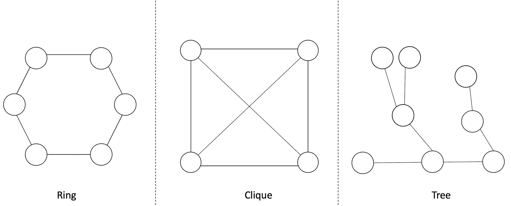

一个六边形和一个正方形，每个顶点上有一个圆圈，分别标注为环形和团。一个带有分支的不规则结构标注为树。

**图 1-4** 表示为图的分布式系统拓扑结构

分布式系统通常表示为由节点和顶点组成的图。节点代表网络中的进程，而顶点代表进程之间的通信链路。这些图还显示了网络的结构视图或拓扑，有助于可视化系统。

分布式系统可以有不同的拓扑结构，并且可以表示为图。常见的拓扑结构包括`环形`，它描述了一种每个节点有两个相邻节点的拓扑结构。`树`形结构是无环且连通的。`团`是一个全连接图，其中所有进程都直接相互连接。

## 其他要素
- 进程
    - 事件
- 执行
- 链路
- 状态
- 全局状态
- 切割

现在让我们详细了解一下它们。

### 进程

分布式系统中的进程是执行分布式算法的计算机。它也被称为节点。它是一个自治的计算机，可以独立失效，并可以通过发送和接收消息与分布式网络中的其他节点通信。

### 事件

事件可以定义为进程中发生的某个操作。进程中可能发生三种类型的事件：

- `内部事件`：当进程本地发生某些事情时发生。换句话说，进程执行的本地计算就是一个内部事件。
- `消息发送`事件：当进程（节点）向其他节点发送消息时发生。
- `消息接收`事件：当进程（节点）接收消息时发生。

图 1-5 所示示意图直观地展示了这一点。

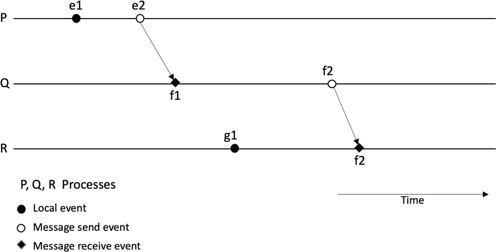

一个包含 P、Q、R 三条线的示意图，具有本地事件、消息发送和消息接收等事件。一些事件通过时间相互连接。

**图 1-5** 三节点分布式系统中的事件和进程

### 状态

状态的概念在分布式系统中至关重要。你会在这本书以及其他关于分布式系统的文本中经常遇到这个术语，尤其是在分布式共识的上下文中。事件构成了节点的本地状态。换句话说，状态由节点中的事件（事件的结果）组成。或者我们可以说，作为事件结果的本地内存、存储和程序的内容构成了进程的状态。

### 全局状态

分布式系统中所有进程和通信链路的状态集合称为`全局状态`。

这也被称为配置，可以定义如下：

分布式系统的配置由进程的状态和传输中的消息组成。

### 执行

分布式系统中的执行是进程对分布式算法的一次运行或计算。有两种类型的执行：

- 同步执行
- 异步执行

#### 切割（Cuts）

切割可以定义为在时空图中连接每个进程线上单个时间点的一条线。时空图上的切割可以作为可视化分布式计算全局状态（在该切割处）的一种方式。同时，它也是可视化切割之前（即过去）和之后（即未来）发生的事件集合的一种方式。切割左侧的所有事件被视为`过去`，切割右侧的所有事件被称为`未来`。存在一致性切割和不一致性切割。如果在切割之前的已用时间内所有接收到的消息都已发送，即位于过去，则称为一致性切割。换句话说，遵循因果规则的切割就是一致性切割。不一致性切割是指消息从未来（切割右侧）跨越切割到达过去（切割左侧）的情况。

如果一条切割线从过去跨越到未来，则代表了传输中的消息的图形化表示。

图 1-6 所示的示意图说明了这一概念，其中`C`[1]是一个不一致性切割，而`C`[2]是一个一致性切割。

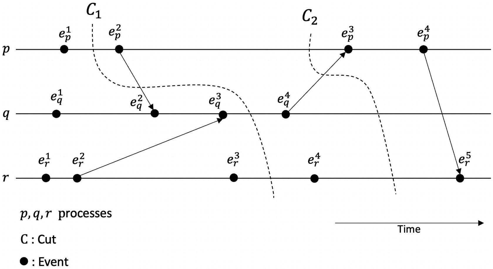

一个包含 P、Q、R 三条线的示意图，列出了`E P 1`、`E P 2`等事件。所有事件被分组到标记为`C 1`和`C 2`的两个切割中。

**图 1-6** 描述分布式系统执行中切割的时空图

诸如 Chandy-Lamport 快照算法之类的算法用于创建分布式系统的一致性切割。

对分布式系统进行快照有助于创建系统的全局图景。快照（或全局快照）捕获了系统的全局状态，包含系统中每个进程的本地状态和每个通信链路的独立状态。这种快照对于调试、检查点和监控非常有用。一个简单的解决方案是同步所有时钟并在特定时间创建快照，但精确的时钟同步是不可能的，我们可以利用因果关系来实现一个能够提供全局快照的算法。

假设无故障、单向 FIFO 通道，并且系统中任意两个进程之间存在通信路径，Chandy-Lamport 算法的工作方式如下：

- 发起快照算法的发起进程执行以下操作：
    - 记录自身状态
    - 向所有进程发送一个标记消息（一个控制消息）
    - 开始在其所有通道上记录传入的消息
- 收到标记消息的进程执行以下操作：
    - 如果是第一次看到此消息，则：
        - 记录自身的本地状态
        - 将该通道标记为空
        - 向其所有通道上的所有进程发送一个标记
        - 开始记录所有传入通道，除了之前已标记为空的那个通道
    - 如果不是第一次：
        - 停止记录
- 当每个进程在其所有传入通道上都收到了标记消息时，快照即视为完成，算法终止。
- 发起进程现在能够构建一个包含每个进程保存的状态以及所有消息的完整快照。

请注意，任何进程都可以发起快照，该算法不会干扰分布式系统的正常运行，并且每个进程都会记录传入通道及其自身的状态。

### 分布式系统的类型

从通信角度来看，有两种类型的分布式系统。共享内存系统是指所有节点都能直接访问共享内存的系统。另一方面，消息传递系统是指节点之间通过传递消息进行通信的系统。换句话说，节点使用通信链路发送和接收消息以彼此通信。

现在让我们讨论一下分布式系统的一些软件架构模型。软件架构模型描述了系统的设计和结构。软件架构回答了诸如涉及哪些元素以及它们如何相互交互等问题。分布式系统软件架构的核心焦点是进程，所有其他元素都围绕着它们构建。

## 软件架构模型

有四种主要的软件架构类型，包括客户端-服务器模型、多服务器模型、代理服务器模型和对等网络模型。

### 客户端-服务器

这种模型是让两个进程协同工作的一种常见方式。一个进程承担客户端角色，另一个进程承担服务器角色。服务器接收客户端发出的请求并回复响应。可以有多个客户端进程，但只有一个服务器进程。例如，经典的 Web 客户端和 Web 服务器（浏览器到 Web 服务器）设计就遵循这种架构类型。图 1-7 描绘了这种架构的所谓物理视图。

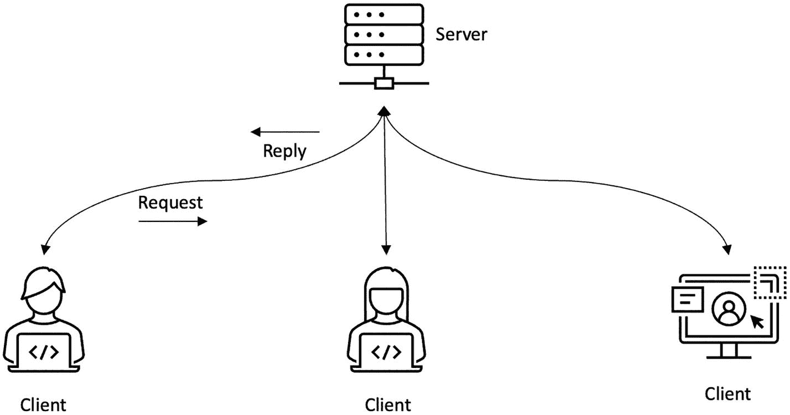

一个服务器连接到 3 个客户端的示意图。请求从客户端发送到服务器，回复从服务器发送到客户端。

**图 1-7** 客户端-服务器架构

### 多服务器架构

多服务器架构是指多台服务器协同工作的架构。在一种架构风格中，客户端-服务器模型中的服务器本身可以成为另一台服务器的客户端。例如，如果我通过网页浏览器向 Web 服务器发出请求，查询不同股票的价格，那么 Web 服务器可能会向后端数据库服务器发出请求，或者通过网络服务向其他服务器请求这些定价信息。在这种情况下，Web 服务器本身就成了客户端。这种架构可以被视为多服务器架构。

另一种非常常见的情景是多台服务器共同协作，为客户端提供服务，例如，多台数据库服务器为 Web 服务器提供数据。实现这种协作式架构通常有两种方法。第一种是`数据分区`，另一种是`数据复制`。与`数据分区`密切相关的另一个术语是`数据分片`。

`数据分区`指的是一种架构，其中数据分布在分布式系统的各个节点上，每个节点负责其数据分区（部分）。`数据分区`有助于实现更好的性能、更简便的管理、负载均衡和更高的可用性。例如，公司每个部门的数据可以分成多个分区，并分别存储在不同的本地服务器上。另一种理解方式是，如果我们有一个包含一百万行数据的大表，我可能会将其中五十万行放在一台服务器上，另外五十万行放在另一台服务器上。这种方案被称为`数据分片`或`水平分区`，或者根据分片方式的不同，被称为`水平分片`。

我们可以通过图 1-8 来形象地理解分区的概念。

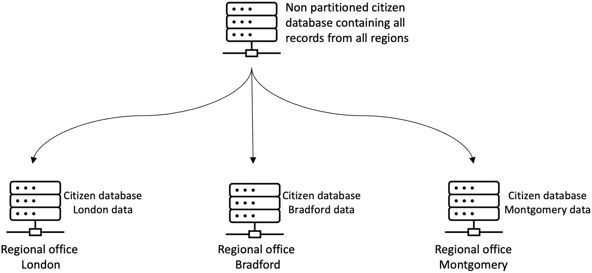

数据分区示意图。所有地区的公民数据库连接到位于伦敦、布拉德福德和蒙哥马利的地区办事处。

图 1-8 数据分区

请注意，图 1-8 所示的数据分区，是将一个大型中央数据库划分为与每个区域相关的较小数据集，然后由区域服务器管理该分区。然而，在另一种分区类型中，一个大表可以被分区成不同的表，但这些表仍位于同一台物理服务器上。这被称为逻辑分区。

分片是数据的水平分区，其中每个分片（片段）驻留在单独的服务器上。这种方法的一个直接好处是实现了负载均衡，从而在各服务器之间分散负载。这个概念如图 1-9 所示。

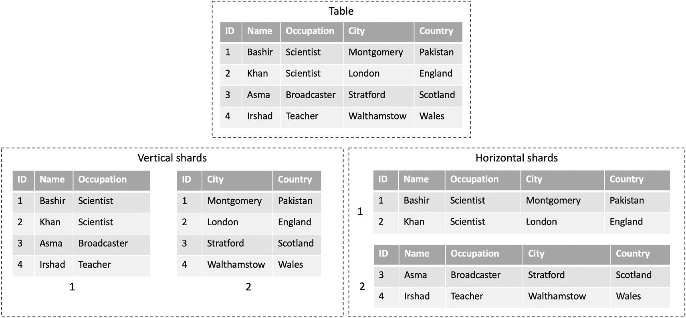

一组共 5 个表。顶部的一个表标题为“表”。两个表标题为“垂直分片”，两个标题为“水平分片”。

图 1-9 分片

`数据复制`指的是一种架构，其中分布式系统中的每个节点都保存着完全相同的数据副本。一个典型的简单例子是 RAID 0 系统；虽然它们不是独立的物理服务器，但数据会在两块磁盘之间进行复制，这就构成了`数据复制`（通常称为镜像）架构。在另一种场景中，数据库服务器可能会运行一个复制服务，将数据复制到多台服务器上。这种架构可以实现更好的性能、容错能力和更高的可用性。一种特定的复制类型以及分布式系统中的基本概念是状态机复制，它用于构建容错的分布式系统。我们将在第 3 章中详细介绍。

图 1-10 展示了多服务器架构，其中显示了客户端-服务器模型的一种变体。服务器可以作为另一台服务器的客户端。这是多台服务器紧密协作以提供服务的一种方法。

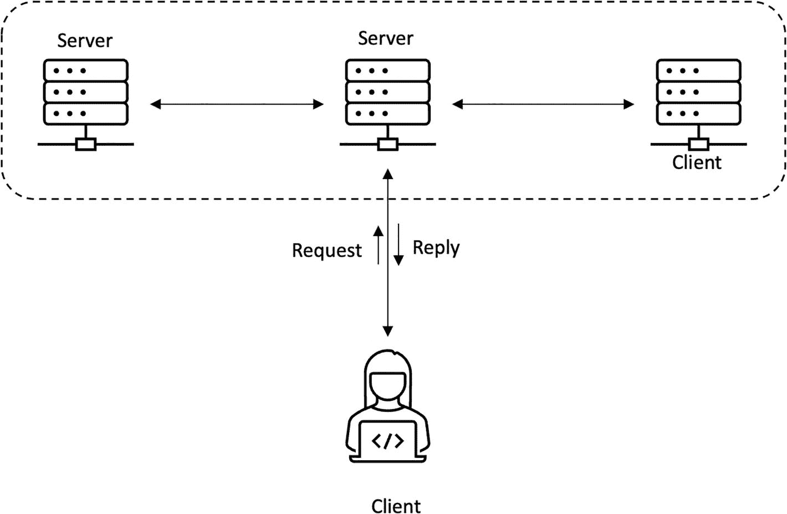

连接了服务器和一个客户端的示意图。底部另一个客户端发送请求并接收回复。

图 1-10 多台服务器协同工作（客户端-服务器与多台服务器紧密协调/紧耦合服务器）

另一个图，图 1-11，展示了数据复制的概念。

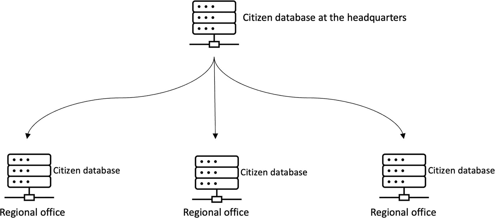

数据复制示意图。总部的公民数据库连接到地区办事处的 3 个公民数据库。

图 1-11 数据复制

总之，复制是指在同一数据的副本保存在多个不同节点上的做法，而分区则是指将数据分割成更小的子集，然后将这些更小的子集分布到不同节点上的做法。

### 代理服务器

基于代理服务器的架构允许在客户端和后端服务器之间进行中介。代理服务器可以接收来自客户端的请求，并将其转发给后端服务器（最常见的是 Web 服务器）。此外，代理服务器可以解释客户端请求，并在处理后将其转发给服务器。这种处理可以包括对请求应用某些规则，例如通过移除客户端的 IP 地址来匿名化请求。从客户端的角度来看，使用代理服务器可以通过缓存来提高性能。这些服务器通常用于企业环境，在这些环境中，组织进出组织的所有 Web 流量都要应用公司策略和安全措施。例如，如果需要屏蔽某些网站，管理员可以使用代理服务器来实现：所有请求都经过代理服务器，任何对被屏蔽网站的请求都会被拦截、记录并忽略。

图 1-12 中的示意图展示了一种代理架构。

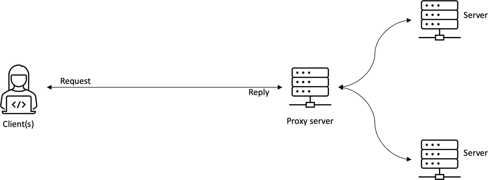

一个示意图。客户端从代理服务器接收请求并发送其回复。代理服务器连接到另外 2 台服务器。

图 1-12 代理架构 – 服务器与客户端之间的一个代理

### 点对点架构

在点对点架构中，节点没有特定的客户端或服务器角色。它们具有同等的角色。没有单一的客户端或服务器。相反，每个节点可以根据情况扮演客户端或服务器的角色。所有节点都具有同等角色这一事实催生了“对等点”这个术语。

点对点架构如图 1-13 中的示意图所示。

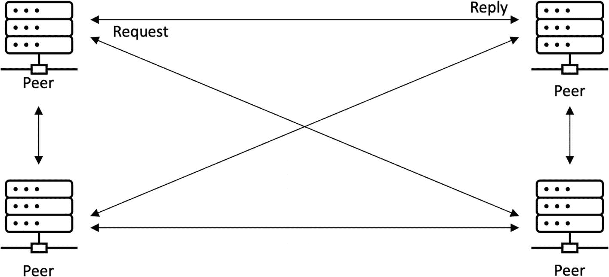

对等架构示意图。4 个对等点通过标记为“请求”和“回复”的箭头相互连接。

图 1-13 点对点架构

在某些场景下，也可能并非所有节点都具有同等角色；有些节点可能同时充当服务器和客户端。但总的来说，在点对点网络中，所有节点的角色通常是相同的。

现在我们已经介绍了一些分布式系统的架构风格，让我们将重点放在分布式系统更理论化的一面，即关注分布式系统的抽象视图。首先，我们来探讨分布式系统模型。

## 分布式系统模型

系统模型使我们能够抽象地看待分布式系统。它捕获了关于分布式系统行为的假设。它使我们能够定义期望分布式系统具备的某些属性，并对其进行分析。这一切都在抽象层面进行，无需考虑任何技术或实现细节。例如，通信链路抽象仅捕获了这样一个事实：通道允许消息在进程之间传递/交换，而不指定其具体是什么。从实现角度来看，它可能是光纤电缆或电线。

在分布式系统模型中，我们不关心硬件技术实现的具体细节。例如，进程是一个执行某些事件的节点，我们无需关注确切的硬件或计算机类型。

在本书中，我们感兴趣的是系统的抽象视图，而非物理基础设施。图 1-14 演示了这一概念。

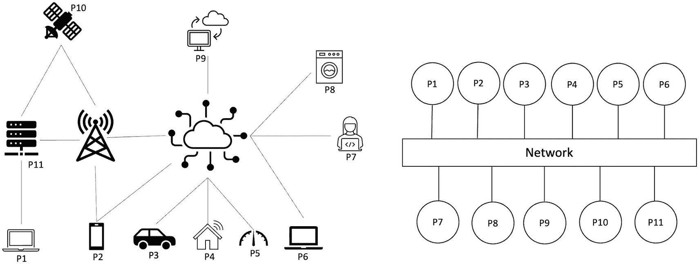

两张示意图。左侧有从 P1 到 P11 的互连组件。右侧，P1 到 P11 形成两条线性链，连接到一个网络。

图 1-14 物理架构（左）与抽象系统模型（右）

现在让我们看看分布式系统中三个基本的抽象概念。故障是所有这些抽象概念的特征。我们捕获了关于系统中可能发生何种故障的假设。例如，在分布式系统中，进程或节点可能崩溃或恶意行为。网络可能丢弃消息，或者消息可能被延迟。消息延迟是通过时间假设来捕获的。

总而言之，在创建分布式系统模型时，我们会对系统的行为做出一些假设。这个过程包括关于进程和网络的时间假设。我们还对网络和处理器的故障做出假设，例如，进程可能如何失败，它是否可能表现出任意故障，攻击者如何影响处理器或网络，以及进程在崩溃后能否崩溃并恢复。网络链路是否可能丢弃消息？在下一节中，我们将详细讨论所有这些场景。

### 进程

进程或节点是分布式系统中的基本元素，它运行分布式算法以实现该分布式系统被设计要达到的共同目标。

现在想象一下一个进程在分布式系统中能做什么。首先，让我们思考一个正常场景。如果一个进程在没有发生任何故障的情况下按照算法运行，那么它被称为正确进程或诚实进程。因此，在我们的模型中，我们说节点正确运行是节点可能表现出的行为之一。还有什么？是的，当然，它可能会失败。如果一个节点失败，我们说它是故障节点；如果没有，那么它是非故障的、正确的或诚实的。

进程中可能发生不同类型的故障，例如：

- `崩溃-停止`
- `遗漏`
- `崩溃后恢复`
- `窃听`
- `任意（拜占庭）`

#### 崩溃-停止故障

`崩溃-停止`故障是指进程崩溃并且永远无法恢复。这种故障或节点行为模型捕获了不可修复的硬件故障，例如，主板短路导致故障。

### 遗漏故障

`遗漏`故障捕获了处理器未能发送消息或接收消息的故障场景。`遗漏`故障分为三类：发送遗漏、接收遗漏和一般遗漏。发送遗漏是指处理器未能按照分布式算法的要求发送消息；接收遗漏发生在进程未接收到预期消息时。在实际中，这些遗漏是由于物理故障、内存问题、缓冲区溢出、恶意行为和网络拥塞引起的。

#### 崩溃后恢复

表现出`崩溃后恢复`行为的进程可以在崩溃后恢复。它捕获了进程崩溃、丢失其内存状态，但稍后恢复并继续运行的场景。这种情况也可以视为一种遗漏故障，此时节点因为已崩溃而不会发送或接收任何消息。在实际中，这可能是进程的临时有意重启，或某些操作系统错误后的重启。一些例子包括 Windows 蓝屏或 Linux 内核恐慌后重启并恢复正常运行。

当进程崩溃时，它可能会丢失其内部状态（称为遗忘），这使得恢复变得棘手。然而，我们可以通过保留稳定存储（日志）来缓解这个问题，它有助于从最后一个已知的良好状态恢复操作。节点在恢复后也可能丢失其所有状态，并且必须与网络的其他部分重新同步。也可能发生节点长时间宕机，与网络的其余部分（其他节点）不同步，并持有其旧的视图状态。在这种情况下，节点必须与网络重新同步。这种情况在比特币或以太坊等区块链网络中尤其常见，节点可能会离线相当长一段时间。当它重新上线时，它会与其余节点重新同步以恢复正常运行。

#### 窃听

在这种模型中，分布式算法可能会泄露机密信息，并且攻击者可以窃听以从进程中获取信息。这种模型在区块链等不受信任且地理分散的环境中尤其如此。针对此类攻击的常见防御措施是加密，它通过加密消息来提供机密性。

#### 任意（拜占庭）

`拜占庭`进程可能表现出任何任意行为。它可能以任何可能的方式偏离算法。它可能是恶意的，可能主动试图破坏分布式算法，选择性地遗漏某些消息，或者暗中试图削弱分布式算法。在分布式算法或系统中，这种类型的故障是最复杂和最具挑战性的。在实际中，它可能是一个黑客想出新颖的方法来攻击系统，网络上的病毒或蠕虫，或者其他一些前所未有的攻击。对拜占庭故障节点的行为没有限制；它可以做任何事情。

一个相关的概念是攻击者模型，其中攻击者的行为被建模。我们将在后面的“攻击者模型”一节中介绍这一点。

现在我们来看分布式系统模型的另一个方面，网络。

# 网络

在分布式网络中，链路（通信链路）负责传递消息，即从节点获取消息并发送给其他节点。通常，假设节点之间存在双向点对点连接。

网络分区是指网络链路在两组节点之间的有限时间内变得不可用的场景。在实践中，这可能是由于一个数据中心不与另一个数据中心通信，或者是不正确/无意的，甚至是故意/恶意的防火墙规则禁止了网络的一部分到另一部分的连接。

## 链路故障

链路可能发生崩溃故障，即正常运行的链路可能突然停止传输消息。另一种链路故障是遗漏故障，即链路只传输部分消息，而部分消息丢失。最后，链路上还可能发生拜占庭故障或任意故障，此时链路可能创建伪造消息、篡改消息，并有选择性地投递部分消息，而忽略其他消息。

根据此模型，我们可以根据链路的故障方式和消息投递方式，将通信链路划分为不同类型。

链路上（通道中）会发生两种类型的事件：`发送事件`，即消息被放入链路；`投递事件`，即链路分发消息，并由进程*接收*。

### 公平丢失链路

在此抽象中，我们描述消息如何在链路上丢失、重复或乱序。消息可能会丢失，但如果发送方和接收方进程都正确，且发送方持续重传，消息最终会被投递。更正式地说，其三个属性如下。

#### 公平丢失

该属性保证具有此属性的链路不会系统性地丢弃每条消息。这意味着，即使需要多次重传，消息最终也能成功投递到目标节点。

#### 有限重复

该属性确保网络不会进行比发送方更多的重传操作。

#### 无捏造

该属性确保网络不会篡改消息，也不会凭空创建消息。

### 顽固链路

此抽象描述了链路的行为：链路会无限次地投递任何已发送的消息。此抽象中关于进程的假设是，发送方和接收方进程都是正确的。这种类型的链路会顽固地尝试投递消息，而不考虑性能。链路会持续尝试，直到消息被投递。

正式来说，顽固链路具有两个属性。

#### 顽固投递

该属性意味着，如果一条消息 `m` 从正确的进程 `p` 发送一次给正确的进程 `q`，那么进程 `q` 将无限次地投递该消息，因此得名“顽固”！

#### 无捏造

这意味着消息不会凭空产生，如果某个进程投递了一条消息，那么该消息必然是由某个进程发送的。正式来说，如果进程 `q` 投递了一条来自进程 `p` 的消息 `m`，那么该消息 `m` 确实是从进程 `p` 发送给进程 `q` 的。

### 完美（可靠）链路

这是最常见的链路类型。在这种链路中，如果某个进程发送了一条消息，那么该消息最终将被投递。

在实践中，`TCP` 是一种可靠链路。它有三个属性。

#### 可靠投递

如果一条消息 `m` 由正确的进程 `p` 发送给正确的进程 `q`，那么 `m` 最终会被 `q` 投递。

#### 无重复

正确的进程 `p` 不会多次投递同一条消息 `m`。

#### 无捏造

该属性确保消息不会凭空产生，如果消息被投递，那么它们一定是在投递之前由正确的进程创建并发送的。

### 日志式完美链路

这种链路将消息投递到接收方的本地消息日志或持久化存储中。这在接收方可能崩溃，但我们仍需确保消息安全的场景中非常有用。在这种情况下，即使接收方进程崩溃，消息也不会丢失，因为它已持久化存储在本地存储中。

### 认证完美链路

这种链路保证从进程 `p` 发送给进程 `q` 的消息 `m` 确实是由进程 `p` 发送的。

### 任意链路

在此抽象中，链路可以表现出任何行为。这里，我们考虑一个能够控制消息的活跃敌手。该链路描述了攻击者可能执行恶意操作、篡改消息、重放消息或伪造消息的场景。简而言之，在这种链路上，任何攻击都是可能的。

在实际应用中，这代表了典型的互联网连接，黑客可以窃听、篡改、伪造或重放消息。当然，这也可能是由互联网蠕虫、流量分析器和病毒引起的。

注意：这里我们只讨论点对点链路；我们将在后面的第 3 章中介绍广播。

# 同步性与时序

在分布式系统中，延迟和速度假设描述了网络的行为。

在实际应用中，分布式系统中延迟几乎不可避免，首先是由于固有的异步性、分散性、异构性，以及消息丢失、处理器缓慢、网络拥塞等具体原因。由于网络配置的变化，分布式系统中还可能出现意外或新的延迟。

分布式系统中的同步性假设关注的是网络延迟和由慢速网络链路或慢速处理器速度引起的处理器延迟。

在实际应用中，处理器可能因为节点内存耗尽而变慢。例如，Java 程序在“停止世界”类型的垃圾回收期间可能会完全暂停执行。另一方面，一些高端处理器天生就比资源受限设备上的低端处理器快。所有这些差异和情况都可能导致分布式系统出现延迟。

下面，我们讨论三种同步性模型，它们描述了分布式系统的时序假设。

## 同步

同步分布式系统对消息到达一个节点所需的时间有已知的上限。这种情况是理想的。然而，在实践中，消息有时可能会延迟。即使在完美的网络中，也存在诸多因素，例如网络链路质量、网络延迟、消息丢失、处理速度或处理器容量，这些都可能对消息的投递产生不利影响。

在实践中，存在同步系统，例如片上系统（`SoC`）、嵌入式系统等。

## 异步

异步分布式系统则处于另一个极端。在这种模型中，不对时序做任何假设。换言之，传递消息所需的时间没有上限。节点中的消息投递或处理可能存在任意长且无界的延迟。进程可以以不同的速度运行。

此外，一个进程可以任意暂停或延迟执行，或者比其他进程处理得更快。你现在大概可以想象，为此类系统设计的分布式算法可以非常健壮和具有弹性。然而，许多问题在异步分布式系统中是无法解决的。有一整类被称为“不可能性结果”的结论，描述了分布式系统中无法解决的问题。我们将在本章后面以及第 3 章中更详细地探讨不可能性结果。由于许多类型的问题在异步模型中无法解决，而同步模型又过于理想化，我们必须做出妥协。这种妥协被称为部分同步网络。

## 部分同步

部分同步模型假设网络在大部分情况下是同步且表现良好的，但有时也可能表现为异步。例如，处理速度可能存在差异，或者可能发生网络延迟，但系统最终会恢复到同步状态以恢复正常运行。

另一种理解方式是：网络通常处于同步状态，但可能在有限时间内不可预测地表现出异步行为，但系统中存在足够长的同步时期，使得系统能够正确运行。

也可以这样认为：真实系统在大多数时候是同步的，但有时会表现出任意且不可预测的异步行为。在同步期内，系统能够做出决策并终止运行。

总之，我们可以引用列奥纳多·达·芬奇的话：

> *对于善于利用时间的人来说，时间总是足够长。*

图 1-15 展示了部分同步网络的行为方式。

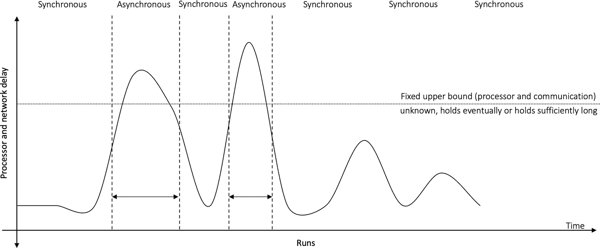

一个以正弦曲线绘制处理器延迟与时间关系的图表。曲线被划分为同步区和异步区。

图 1-15

部分同步网络

### 最终同步

在部分同步的最终同步版本中，系统最初可能是异步的，但存在一个未知的时间点，称为全局稳定时间（`GST`），该时间点对处理器不可知，在此之后系统最终变为同步。此外，这并不意味着系统在 `GST` 之后将永远保持同步。这在实际中是不可能的，但系统在 `GST` 之后会有足够长的同步周期来做出决策并终止运行。

我们可以在图 1-16 中直观地看到从异步到同步的同步模型谱系。

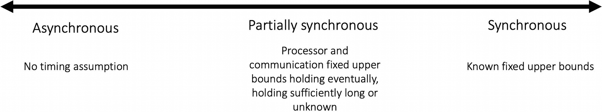

一个示意图，带有一个双向箭头，右侧标注为“同步”，左侧标注为“异步”，中间标注为“部分同步”。

图 1-16

分布式系统中的同步模型

同步模型会同时考虑消息传递延迟和进程的相对速度。

#### 形式化定义

以下是关于部分同步模型的一些形式化定义：

- 希腊字母 Delta `Δ` 表示消息从一个处理器到达另一个处理器所需时间的固定上限。
- 希腊字母 Phi `Φ` 表示不同处理器相对速度的固定上限。
- `GST` 是全局稳定时间，在此之后系统表现为同步。

定义了上述变量后，我们可以如下定义不同的同步模型：

- 异步系统是指不存在固定上限 `Δ` 和 `Φ` 的系统。
- 同步系统是指已知固定上限 `Δ` 和 `Φ` 的系统。

部分同步系统可以通过几种方式定义：

- 存在固定上限 `Δ` 和 `Φ`，但它们未知。
- 已知固定上限 `Δ` 和 `Φ`，但仅在某个未知时间 `T` 之后才成立。这就是最终同步模型。我们可以说，最终同步模型是指已知固定上限 `Δ` 和 `Φ`，但仅在某个时间（称为 `GST`）之后才成立的模型。
- 在另一种变体中，`GST` 之后 `Δ` 会持续足够长的时间，以使协议能够终止。

我们将在第 3 章中，围绕规避 FLP 不可能原理和共识协议，更正式地使用同步模型。目前，作为基础，前面介绍的概念已经足够。

图 1-17 使用时空图展示了同步通信与异步通信的对比。

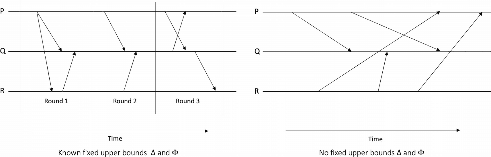

两个示意图，各有三条线 P、Q 和 R，以及多向箭头。右侧图没有上限，左侧图有已知的上限。

图 1-17

同步系统与异步系统

讨论完同步模型后，现在让我们将注意力转向对手模型，该模型允许我们对对手对分布式系统的影响做出假设。在此模型中，我们对对手如何行为以及对手可能拥有哪些权力以对分布式系统产生不利影响进行建模。

# 对手模型

除了对分布式系统模型中的同步性和时序做出假设外，还有另一个模型，用于对对手的能力以及它如何对分布式系统产生不利影响做出假设。这是一个重要的模型，它允许分布式系统设计者面对对手时，推理分布式系统的不同属性。例如，一个分布式算法只有在恶意对手控制的节点少于一半的情况下，才能保证正确运行。因此，对手模型通常会对对手的能力设定限制。但是，如果假设对手是全能的，可以无所不能并控制所有节点和通信链路，那么系统就不可能保证正确运行。

根据分布式系统的不同，以及对手对分布式系统的影响方式和不利影响程度，对手模型可以分为不同类型。

在此模型中，假设存在一个外部实体，它已经破坏了进程，并且可以控制和协调故障进程的行为。这个实体被称为对手。请注意，这与故障模型略有不同，因为在故障模型中，节点可能因各种原因发生故障，但并未假设有外部实体控制进程。

对手可以通过多种方式影响分布式系统。使用对手模型的系统设计者需要考虑诸如`腐败类型`、`腐败时间`和`腐败程度`（同时腐败多少进程）等因素。此外，对手可用的`计算能力`、`可视性`和`适应性`也需要考虑。对手模型还允许设计者指定网络中可被腐败的进程数量上限。

我们将在此简要讨论这些类型。

## 阈值对手

阈值对手是分布式系统中一种标准且广泛使用的模型。在此模型中，对系统中总的故障进程数量施加了限制。换句话说，对网络中故障进程的数量有一个固定上限 `f`。该模型也称为全局对手模型。许多不同的算法都是在此假设下开发的。几乎所有的共识协议至少都在阈值对手模型下工作，该模型假设对手最多可以控制网络中 `f` 个节点。例如，在第 7 章讨论的 Paxos 协议中，经典共识算法实现在对手控制的节点数量少于网络总节点数一半的假设下达成共识。

## 动态对手

该模型也称为自适应对手。在此模型中，对手可以在协议执行期间的任何时刻腐败进程。并且，被腐败的进程随后将保持故障状态，直到执行结束。

## 静态对手

这种类型的对手只能在对协议执行前进行腐败等敌对活动。

## 被动敌手

这类敌手不会主动破坏系统，但可能在协议运行过程中获取系统的某些信息，因此可称之为半诚实敌手。

敌手可在两种模型下引发故障：崩溃故障模型和拜占庭故障模型。

在崩溃故障模型中，敌手可在协议执行期间的任意时刻，使其控制的进程停止执行协议。

在拜占庭故障模型中，敌手完全控制被破坏的进程，并可操纵其任意偏离协议。在这种假设下运行并能容忍此类故障的协议，分别称为崩溃容错协议（`CFT`）或拜占庭容错协议（`BFT`）。