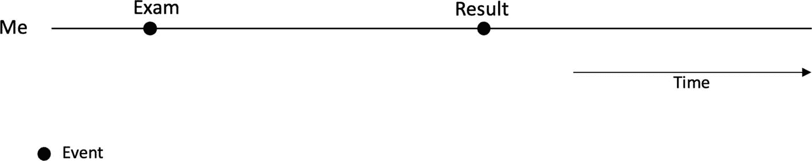
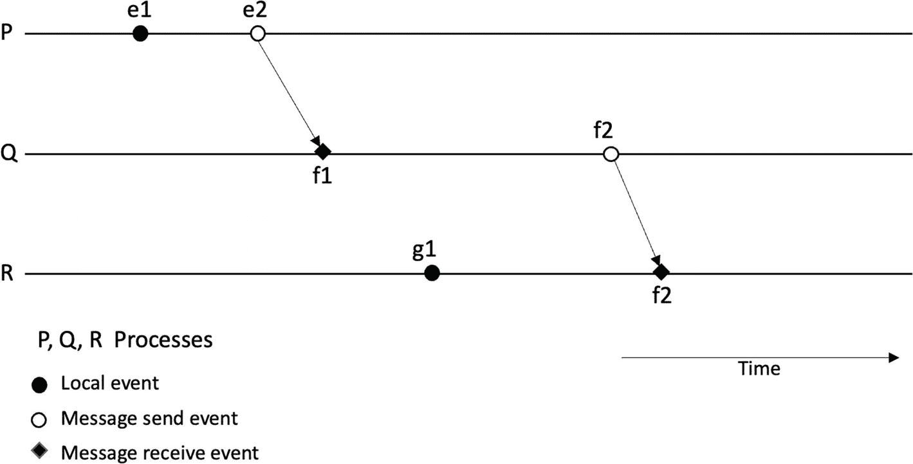
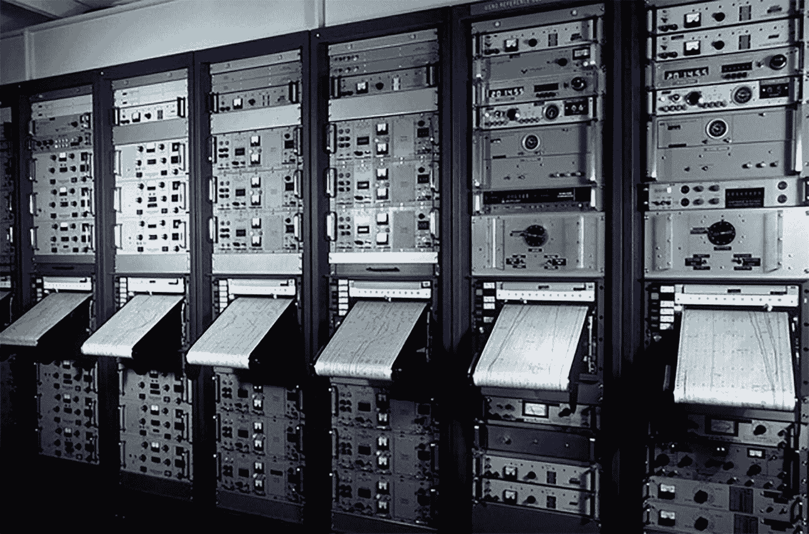
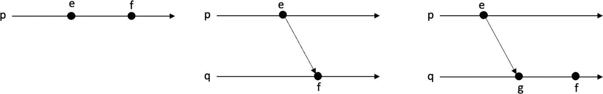
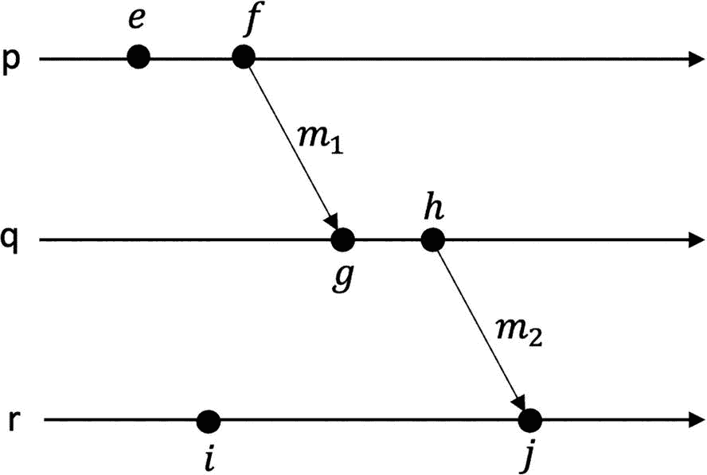
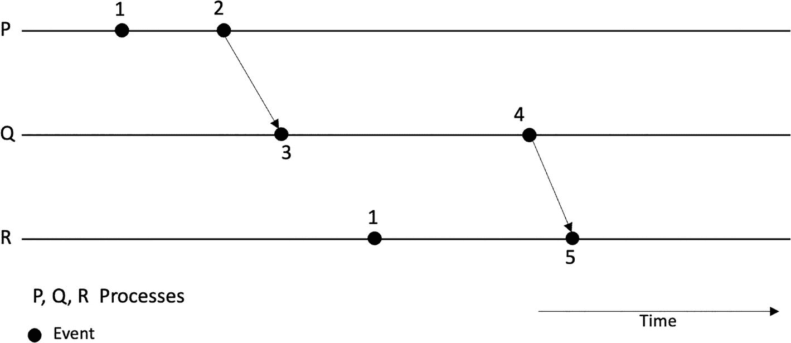
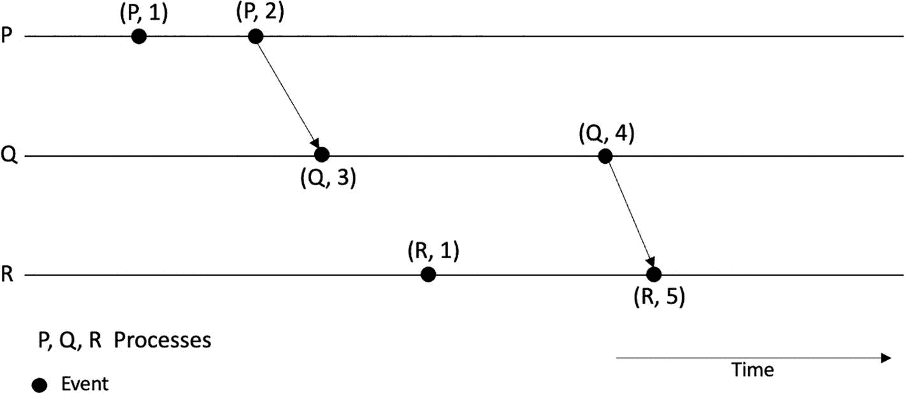

# 时间、时钟与顺序

时间在分布式系统中起着至关重要的作用。几乎总是需要对时间进行度量。例如，分布式系统中的日志文件需要时间戳来记录特定事件的发生时间。从安全角度看，审计时间戳用于记录特定操作的发生时间，比如特定用户登录系统的时间。在操作系统中，内部事件的调度需要定时功能。所有这些用例以及无数其他计算机和分布式系统操作，都需要某种时间概念。

分布式系统中的时间概念颇为棘手。如图 1-18 所示的事件必须排序，分布式系统才能合理可用。事件排序是分布式系统最基本、最关键的需求之一。由于分布式系统中不存在全局共享时钟，事件排序成为一个具有挑战性的问题。为此，这里的主要关注点是实现系统中事件的正确排序。我们在日常生活中就有这种时间概念，可以说某件事发生在另一件事之前。例如，如果我参加了一场考试，一周后成绩公布，我们可以确定地说，考试必然发生在成绩公布之前。我们可以在图 1-19 的示意图中直观看到这种关系。



考试示意图。一条标有“我”的水平线上有两个事件：考试和成绩。下方是一个指向右侧的箭头，标有“时间”。

图 1-19

考试发生在成绩之前——一种“发生在...之前”的关系



一个包含 P、Q、R 三条线的示意图，标有本地事件、消息发送和消息接收等事件。部分事件通过时间线连接。

图 1-18

三节点分布式系统中的事件与进程

通常，我们熟悉的是物理时钟，即我们日常对时间的理解，例如“我今天下午 3 点见你”或“足球赛是明天上午 11 点”。这种时间概念是我们所熟悉的。此外，物理时钟可用于分布式系统，并有多种算法用于同步分布式系统中所有节点的时间。这些算法可以通过消息传递来同步分布式系统中的时钟。

我们先来了解物理时钟，并介绍一些基于内部物理时钟和外部时间源进行时间同步的算法。

## 物理时钟

物理时钟在日常生活中无处不在。如今普遍使用的数字时钟基于石英晶体，而传统机械时钟则基于弹簧机构或摆锤。从手表到计算机主板上的时钟，数字时钟都利用石英晶体。实际上，由石英晶体调控的振荡器电路用于生成精确频率。当对石英晶体施加电场时，它会弯曲并开始以其尺寸、切割方式、温度和封装所决定的频率共振。最常见的频率是 32768 Hz，这几乎是所有石英时钟通用的频率。图 1-20 从左到右依次展示了天然形态的石英晶体、元器件形态的石英晶体，以及带有附加振荡器电路的封装晶体。


左侧是天然形态的石英晶体，右侧是电路中的石英晶体，中间是元器件形态的石英晶体。

图 1-20

天然形态的石英晶体（左）、元器件形态的石英晶体（中）以及电路中的石英晶体（右）

基于石英的时钟通常精度足以满足一般用途。然而，制造差异、封装以及工作环境（过冷或过热）等因素都会影响石英晶体的运作。通常，温度过低或过高都会导致时钟变慢。想象一下，如果现场运行的电子设备暴露在高温下，其时钟可能比在正常有利条件下工作的时钟运行得更慢。这种由时钟运行快慢导致的差异称为漂移。漂移以百万分之几（`ppm`）为单位进行测量。

几乎所有石英时钟中，由于切割方式、尺寸和制造工艺，石英晶体的频率都是 32,768 kHz。这是一种特定的切割方式和尺寸，形状类似于音叉，因此产生的频率始终是 32,768 赫兹。我决定用我的示波器和一块闲置的老时钟做个简单实验来证明这一点。

以下是结果！图 1-21 显示了时钟电路中的石英晶体在正常室温下正好产生 32,768 赫兹的频率，示波器屏幕上清晰显示。


连接到石英晶体时钟的示波器测量到 32.7680 千赫兹

图 1-21

使用示波器测量的石英晶体时钟

在图 1-21 中，示波器的探针连接到时钟电路上的石英晶体元器件，波形显示在示波器屏幕上。同时，示波器屏幕右下角显示频率，读数为 `32.7680KHz`。

### 时钟偏差 vs. 漂移

由于温度等环境因素和制造差异，石英晶体时钟可能会变慢，从而产生偏差和漂移。两个时钟显示时间之间的即时差异称为偏差，而两个时钟计时速率的不同称为漂移。请注意，在异构分布式系统中，各节点物理时钟之间的差异可能比同构分布式系统（所有节点的硬件、操作系统和架构相同）更为显著。

通常，预计大约每 11 天会产生约 1 秒的漂移，随着时间的推移，这将导致可观察到的显著差异。想象两台运行在数据中心、没有时钟同步机制、仅依赖内部石英时钟的服务器。一个月后，它们之间的时间将相差 2 到 3 秒。所有依赖时间的操作都将相差 3 秒，并且随着时间的推移，这种差异会继续恶化。例如，一个本应在上午 11 点启动的批处理作业，一个月后将在 11 点过 3 秒才开始。这种情况可能引发与时间相关的作业问题，导致安全问题，影响时间敏感操作，甚至可能导致软件故障或表现出异常行为。比石英时钟精确得多的时钟是原子钟。

### 原子钟

原子钟基于原子的量子力学特性。使用`铯`、`铷`或`汞`等原子，并利用原子的共振频率（振荡）来记录高度精确的时间。

我们对时间的认知基于天文观测，例如季节变化和地球自转。振荡越高，频率就越高，时间也就越精确。这就是原子钟的工作原理及其产生高精度时间的基础。

1967 年，时间单位“秒”被定义为“铯-133 原子基态的两个超精细能级之间跃迁所对应辐射的 9,192,631,770 个周期的持续时间”。换言之，在受控环境下，铯原子在两个能态之间恰好振荡 9,192,631,770 次，便定义了一秒。图 1-22 展示了一台原子钟。



一组共 6 台配有各种电气机架的铯束原子钟。这些设备高度中部有一处打印输出。

图 1-22

基于铯的原子钟：图片来源于 [`https://nara.getarchive.net/media/cesium-beam-atomic-clocks-at-the-us-naval-observatory-provide-the-basis-for-29fa0c`](https://nara.getarchive.net/media/cesium-beam-atomic-clocks-at-the-us-naval-observatory-provide-the-basis-for-29fa0c)

现在想象一个场景：我们发现时钟偏差，其中一个钟慢了十秒。通常我们可以简单地将它调快十秒来重新校准。这虽不理想，但也不至于像时钟偏差那么糟糕——当我们发现某个钟慢了十秒时，问题可能更严重。这种情况下我们能做什么？能简单地将它拨回十秒吗？这并非好主意，因为之后可能会出现消息的接收时间早于发送时间的情况。

为了解决时钟偏差和漂移，我们可以将时钟与一个可信且精确的时间源进行同步。

你可能会问，为什么我们需要越来越精确的时钟和时间源？石英钟足以满足日常使用；后来，我们有了 GPS 这个更精确的时间源；再后来，我们有了原子钟，它更加精确，大约三亿年才误差一秒！但为什么我们需要如此高精度的时钟？答案是：对于日常使用来说，这并不重要。如果我的手表时间与其他钟表相差几秒，这不是问题。如果我在社交媒体上的帖子时间戳与真实发布时间相差几秒，可能也不算什么。当然，只要时间顺序得以保持，时间戳差几秒是可以接受的。但在许多其他实际场景和分布式系统中，情况就不同了。例如，高频交易系统要求（依据 MiFID II 法规）交易系统中消息的时间戳格式精确到微秒，并且误差在 100 微秒以内。从时钟同步的角度看，与 UTC 的偏差仅允许 100 微秒。虽然这类要求对于交易系统的正常运作和监管至关重要，但也带来了技术挑战。在这种场景下，精确时间源的选择、同步算法的选择以及时钟偏差和漂移的处理变得至关重要。

你可以在此处查看 MiFID 的具体要求作为参考：

[`https://ec.europa.eu/finance/securities/docs/isd/mifid/rts/160607-rts-25-annex_en.pdf`](https://ec.europa.eu/finance/securities/docs/isd/mifid/rts/160607-rts-25-annex_en.pdf)

原子钟在国防、地质学、天文学、导航等领域还有其他应用。

最近，蓝宝石钟被研发出来，其精度甚至远超基于铯的原子钟。它精确到每三十亿年才误差一秒。

通常，计算机中有两种表示时间的方式。一种是纪元时间（Epoch Time），也称为 Unix 时间，定义为自 1970 年 1 月 1 日以来经过的秒数。另一种常见的时间戳格式是 `ISO8601`，它定义了一套日期和时间格式标准。

### 物理时钟的同步算法

同步时钟有两种方法：

1.  外部同步
2.  内部同步

在外部时钟同步方法中，存在一个外部的权威时间源，分布式系统中的节点与之同步。

在内部同步方法中，节点（进程）中的时钟相互同步。

#### NTP

网络时间协议（`NTP`）允许客户端与 `UTC` 同步。在 `NTP` 中，服务器按所谓的层级组织，其中第 1 层服务器（主时间服务器）直接连接到第 0 层的精确时间源，例如 GPS 或原子钟。第 2 层服务器通过网络与第 1 层服务器同步，第 2 层服务器再与第 3 层服务器同步。这种架构提供了一种可靠、安全且可扩展的协议。可靠性来自于冗余服务器和路径的使用；安全性通过使用适当的认证机制来保障；可扩展性则体现在 `NTP` 能够服务大量客户端。尽管 `NTP` 是一个高效且健壮的协议，但固有的网络延迟、协议设置中的错误配置、可能阻塞 `NTP` 协议的网络错误配置以及其他一些因素仍然可能导致时钟漂移。

## GPS 作为时间源

GPS 接收器可用作精确的时间源。所有 31 颗 GPS 卫星上都搭载了原子钟，能够产生精确的时间。这些卫星会广播其位置和时间，GPS 接收器在接收信号后，会应用对环境因素和时间膨胀的修正，计算出地球上的时间和位置。请记住，根据相对论，GPS 卫星上的时间比地球表面的物体运行得稍快一些。其他与相对论相关的影响还包括时间膨胀、引力频移和偏心率效应。所有这些误差以及许多其他修正都会被处理，然后才能在 GPS 接收器上显示精确的时间。虽然 GPS 作为精确时间源具有很高的精度，但在网络中，即使在 GPS 接收器处获得了正确且精确的时间，之后引入的固有延迟仍会导致时钟随时间产生漂移和偏移。因此，需要引入一些时钟同步算法来解决这一局限。

Google 的 Spanner（Google 的全球分布式数据库）结合使用了原子钟和 GPS 来处理时间不确定性。

然而，请注意，即使付出所有这些努力，时钟也不可能实现完美同步，但这对于大多数应用来说已经足够。然而，这些非常精确的时钟仍然不足以捕捉分布式系统中事件之间的因果关系。事件之间的因果关系以及基本的单调性属性可以通过逻辑时钟来精确捕捉。

在分布式系统中，即使每个进程都有一个本地时钟，并与某个全局时间源同步，每个本地处理器所看到的时间仍然可能存在差异。时钟会随时间漂移，处理器可能出现故障，或者存在固有的漂移（例如石英钟或 GPS 系统），这使得在分布式系统中处理时间变得极具挑战性。

设想一个分布式系统，其中某些节点在轨道上，而另一些节点在地球上的不同地理位置，并且它们都同意使用协调世界时（`UTC`）。卫星或国际空间站上的物理时钟会以不同的速率运行，偏移是不可避免的。依赖物理时钟的核心局限在于，即使试图完美同步它们，时间戳也会略有差异。然而，这些物理时钟**不能（也不应该）** 用于确定分布式系统中事件的顺序，因为很难基于不同节点上的时间戳来准确找出事件的全局顺序。

物理时钟并不非常适合分布式系统，因为它们可能产生漂移。即使有统一的来源（例如通过 `NTP` 同步的原子钟），它们仍可能随时间与源发生漂移和失同步。哪怕只有一秒的差异，有时也可能导致重大问题。此外，软件实现中的 bug 也可能导致意外后果。例如，来看一个著名的 Bug——“闰秒 Bug”，它曾导致互联网服务严重中断。

## UTC 时间

协调世界时（`UTC`）是一种在全世界范围内使用的时间标准。构成协调世界时的两个时间源如下：

- **国际原子时（TAI）**
  - 国际原子时基于全球约 400 台原子钟。综合并加权这些原子钟的输出。其精度极高，大约每 1 亿年才会偏差 1 秒！
- **天文时间**
  - 此时间基于天文观测，即地球的自转。

虽然国际原子时精度很高，但它没有考虑地球自转，即决定一天真实长度的天文观测时间。地球的自转并非恒定不变。它偶尔会加快，且总体上在减慢。因此，一天并非精确的 24 小时。对地球自转的影响来自月球等天体、潮汐以及其他环境因素。因此，`UTC` 会不断与天文时间进行比较，任何差异都会累加到 `UTC` 中。这种差异以闰秒的形式添加；在国际原子时与天文时间的差异达到 0.9 秒之前，就会向 `UTC` 添加一个闰秒。这是自 1972 年以来一直采用的惯例。

好吧，这似乎是保持两种时间同步的合理解决方案；然而，计算机似乎并不能很好地处理这种情况。Unix 系统使用 `Unix时间`（纪元时间），即自 1970 年 1 月 1 日以来经过的秒数。添加闰秒时，时钟的显示如下：在正常情况下，观察到 `23:59:59` 之后是 `00:00:00`。然而，添加闰秒后，似乎是 `23:59:59` 之后是 `23:59:60`，然后才是 `00:00:00`。换句话说，`23:59:59` 会经历两次。当 `Unix时间` 处理这个额外增加的秒时，可能会产生不可预测的行为。过去，在添加闰秒时，互联网上的服务器曾出现问题，甚至像航空公司订票系统这样关键的服务也受到了影响。

一种称为“闰秒平摊”的技术已经被开发出来。它允许在一天内逐渐添加几毫秒，以解决突然添加一秒以及与此突然增加的一秒相关的问题。

好了，到目前为止，我们看到 `UTC` 和天文时间是通过添加闰秒来同步的。利用“闰秒平摊”技术，我们可以逐渐添加一个闰秒，这缓解了与突然添加闰秒相关的一些问题。也有人呼吁彻底废除这一做法。然而，就目前而言，我们认为添加闰秒是一个合理的解决方案，似乎也基本可行。当地球自转变慢时，我们就添加一个闰秒。但如果地球自转变快了呢？2020 年，地球确实自转变快了，原因暂且不论。现在的问题是，我们是否应该从 `UTC` 中移除一秒？换句话说，引入负闰秒！这种情况可能会带来更多挑战——甚至可能比添加闰秒更难处理。

问题是，对此该怎么办？忽略它？用什么算法可以移除一秒并引入负闰秒？

到目前为止，有人建议直接跳过 `23:59:59`，即从 `23:59:58` 直接到 `00:00:00`。预计这比添加闰秒更容易处理。也许，根本不需要解决方案，因为我们可以完全忽略地球自转变快或变慢的现象，并废除闰秒调整的做法，无论是负调整还是正调整。这并不理想，但我们可能会这样做，以避免处理闰秒（尤其是添加闰秒！）所带来的问题和歧义。在撰写本文时，这仍是一个悬而未决的问题。

更多信息可在此处找到：[`https://fanf.dreamwidth.org/133823.html`](https://fanf.dreamwidth.org/133823.html)（负闰秒）和 [`https://www.eecis.udel.edu/~mills/leap.html`](https://www.eecis.udel.edu/%257Emills/leap.html)。

## 分布式系统中的逻辑时钟与物理时钟

为了避免与物理时钟及同步相关的限制和问题，在分布式系统中，我们可以使用逻辑时钟。逻辑时钟与物理时钟无关，但对分布式系统中的事件进行排序是一种有效方式。尽管如我们所知，事件排序与因果关系是分布式系统的基本要求，但逻辑时钟在确保这一点的过程中扮演着至关重要的角色。

从分布式系统的角度来看，我们之前已经了解到全局状态的概念非常重要。它使我们能够观察分布式系统的状态，并有助于快照或检查点操作。因此，时间在这里起着关键作用：如果整个系统的时间不统一（即每个处理器运行在不同时间），当我们尝试读取系统中所有不同处理器和链路的状态时，将会导致不一致的状态。

### 物理时钟的类型

物理时钟可分为两类：

1.  一天中的时间时钟
2.  单调时钟

**一天中的时间时钟**的特点是从某个固定时刻开始表示时间。例如，从 1970 年 1 月 1 日开始计算的 `Unix时间` 就是一种一天中的时间时钟。这种时间可以通过同步调整到某个时间源，并且可以向前或向后调整。然而，将时间向后调整不是一个好主意。这种情况可能导致例如消息看起来是在发送之前被接收的问题。这种问题可能由于时间戳被调整，并且因为同步算法（例如`NTP`）所做的调整而导致时间向后移动而产生。

由于时间总是增加的，因此时间不应该倒退；我们需要**单调时钟**来处理此类场景。

使用物理时钟几乎不可能提供因果关系。即使使用了时间同步服务，一个进程的时间戳与另一个进程的时间戳仍可能存在微小差异，从而对事件顺序产生不利影响。因此，事件排序是分布式系统中的一个基本需求。为了充分理解这种排序需求的性质，我们引入一个名为“happens-before 关系”的形式化概念。

在介绍 happens-before 关系和因果关系之前，让我们先澄清一些基本的数学概念。这不仅有助于我们理解因果关系，也有助于理解本书后面讲解的概念。

## 集合

**集合**是元素的集合。它用大写字母表示。集合的所有元素都列在花括号内。如果元素`x`存在于集合中，则记为`x ∈ X`，意思是`x`属于`X`。同样地，如果元素`x`不在集合`X`中，则记为`x ∉ X`。元素的顺序无关紧要。如果两个集合具有相同的元素，则它们相等。相等关系表示为`X = Y`，即集合`X`等于集合`Y`。如果两个集合`X`和`Y`不相等，则记为`X ≠ Y`。没有任何元素的集合称为空集，记为`{}`或`ϕ`。集合的一个示例如下：

```
X = {1, 5, 2, 8, 9}
```

如果集合`Y`的每个元素也是集合`X`的元素，则集合`Y`是集合`X`的子集，例如：

```
Y = {2, 8}
```

集合`Y`是集合`X`的子集。这种关系记为`Y ⊆ X`。

两个集合`A`和`B`的并集包含`A`和`B`中的所有元素，例如：

```
A = {1, 2, 3}
```

和

```
B = {3, 4, 5}
```

集合`A`和`B`的并集是：

```
S = {1, 2, 3, 4, 5}
```

两个集合`A`和`B`的笛卡尔积是所有有序对`(a, b)`的集合。它记为`A × B`。它是对于每个`a ∈ A`和`b ∈ B`的所有有序对`(a, b)`的集合。

有序对由两个用括号括起来的元素组成，例如`(1, 2)`或`(2, 1)`。请注意，在有序对中元素的顺序很重要，而在集合中元素的顺序无关紧要。例如，`(1, 2)`与`(2, 1)`不同，但`{1, 2}`和`{2, 1}`是相同的集合。

前面给出的集合`A`和`B`的笛卡尔积`A × B`的一个示例如下：

```
{(1,3), (1,4), (1,5), (2,3), (2,4), (2,5), (3,3), (3,4), (3,5)}
```

注意，在有序对中，第一个元素取自集合`A`，第二个元素取自集合`B`。

## 关系

两个集合`A`和`B`之间的（二元）**关系**是笛卡尔积`A × B`的一个子集。

两个元素之间的关系是二元的，可以表示为一组有序对。我们可以将其表示为`a R b`（中缀表示法）或`(a, b) ∈ R`，即有序对`(a, b)`在关系`R`中。

当集合`S`上的二元关系具有自反性、对称性和传递性等性质时，它被称为**等价关系**。

当集合`S`上的二元关系具有自反性、反对称性和传递性三个性质时，它被称为`S`上的**偏序**。

## 偏序

**偏序**是集合`S`的元素之间的一个二元关系`≤`（用于比较的小于或等于）。集合`S`上的一个二元关系，如果它是自反的、反对称的和传递的，则称为`S`上的偏序。我们现在定义这三个条件。

### 自反性

这个性质意味着每个元素都与自身相关。数学上可以这样写：∀`a` ∈ `S`, `a` ≤ `a`。

### 反对称性

这意味着两个元素不能彼此在两个方向上相关。数学上可以写为：∀`a`, `b` ∈ `S`, 如果`a` ≤ `b` 且 `b` ≤ `a`, 则 `a` = `b`。

### 传递性

传递性表示一种比较关系：如果 `a` < `b` 且 `b` < `c`，则意味着 `a` < `c`。数学上可以写为：∀`a`, `b`, `c` ∈ `S`, 如果 `a` ≤ `b` 且 `b` ≤ `c`，则 `a` ≤ `c`。

带有偏序的集合称为偏序集或`poset`。就 happens-before 关系而言，集合`S`是所有事件的集合。

### 非自反偏序

非自反偏序或严格偏序是非自反的、反对称的和传递的。

#### 非自反性

这个性质意味着没有元素与自身相关。数学上可以这样写：∀`a` ∈ `S`, `a` ≰ `a`，或者给定集合`S`上的关系`R`，如果∀`s` ∈ `S` : `(s, s)` ∉ `R`，则`R`是非自反的。

#### 全序

**全序**或线性序是一种偏序，其中每一对元素都是可比较的。

在简要介绍了一些数学概念之后，现在让我们来看看什么是因果关系以及什么是 happens-before 关系。

### 发生在先关系与因果关系

我们之前看到，一个节点可以执行一些事件。它可以执行本地计算、发送消息或接收消息。所有事件在单个节点上按顺序发生，很容易看出哪个事件发生在下一个事件之前。这是在每个节点上施加的一种严格全序关系。

发生在先关系是一种具有三个性质的反自反偏序关系（严格偏序）：反自反性、反对称性和传递性。

现在假设发生了两个事件`e`和`f`。要确定事件`e`是否发生在事件`f`之前，我们使用以下规则。

事件`e`发生在事件`f`之前，当且仅当：`e → f`（右箭头用作发生在先关系的符号）：

- 如果`e`和`f`发生在同一个进程中，并且在该进程中`e`在`f`之前执行，那么我们可以推断出`e`先于`f`，即一种顺序关系。
- 事件`e`是某个（唯一的）消息`m`的发送事件，而事件`f`是该消息`m`的接收事件。
- 如果存在一个事件`g`，使得`e → g`且`g → f`，那么`e → f`。这被称为传递关系。

我们可以在图 1-23 中看到这三种规则的可视化表示。



*一个示意图，上方有 3 个标记为 P 的右箭头，下方有 2 个标记为 Q 的右箭头。这些线上有元素，如 E、F 和 G。*

**图 1-23** 发生在先规则

如果`e`和`f`是偏序的，那么我们称`e`发生在`f`之前。如果`e`和`f`不是偏序的，那么我们称`e`和`f`是并发的。这也不意味着`e`和`f`恰好完全独立地同时执行。它仅仅意味着`e`和`f`没有因果关系。换句话说，不存在从一个事件导致另一个事件的消息序列。这种并发关系写作`e ∥ g`。图 1-24 详细展示了一个示例场景。



*一个示意图，有 3 个标记为 P、Q 和 R 的右箭头。这些线上有元素，如 E、F、G、H、I 和 J。其中一些元素彼此连接。*

**图 1-24** 发生在先关系示例

在图 1-24 中，关系`e → f`、`g → h`、`i → j`是由于进程执行事件的顺序。关系`f → g`、`h → j`是由于消息`m[1]`和`m[2]`。此外，`e → g`、`e → h`、`e → j`、`f → h`、`f → j`、`g → j`代表了传递关系。最后，并发事件是`e ∥ i`、`f ∥ i`、`g ∥ i`、`h ∥ i`。

## 逻辑时钟

逻辑时钟不依赖于物理时钟，可用于定义分布式系统中事件的顺序。逻辑时钟仅衡量事件的顺序，而不参考任何外部物理时间。

### 兰波特时钟

兰波特时钟是分布式系统中每个进程维护的一个逻辑计数器，每次发生事件时，它都会递增，从而为维护和观察分布式系统中事件之间的发生在先关系提供了一种手段。

这里的关键思想是每个事件都被分配一个数字，该数字随着事件在系统中发生而递增。这个数字也称为兰波特时钟。兰波特时钟捕捉了因果关系。

兰波特时钟/逻辑时钟的算法描述如下：

- 每个进程维护一个本地计数器，初始化时设置为零。
- 进程上的每个事件发生时，该进程将计数器加一。
- 发送消息时，进程会包含其计数器的当前值。
- 接收消息时，进程将其计数器值设置为`max(本地值, 接收值) + 1`。

在`e → f`的**发生在先关系**中，我们可以说可能是`e`导致了`f`。这意味着发生在先关系捕捉了事件的因果关系。

更正式地说，兰波特算法如清单 1-1 所示。

```
on init
t := 0
on event localcomputation do
t := t + 1
end
on event send(m) do
t := t + 1
send(m, t)
end
on event receive(m', t') do
t := max(t, t') + 1
end
```

**清单 1-1** 兰波特时钟

兰波特时钟与因果关系是一致的。我们可以这样写：

`如果 e → f ⇒ LC(e) < LC(f)`

这意味着，如果`e`发生在`f`之前，那么它意味着事件`e`的时间戳（兰波特时钟 – `LC`）小于事件`f`的时间戳。

有一个称为**时钟条件**的正确性标准，用于评估逻辑时钟：

`∀ a,b: a → b ⇒ LC(a) < LC(b)`

这解读如下：对于所有`a`和`b`，如果`a`发生在`b`之前，则意味着`a`的兰波特时钟（时间戳）小于`b`的兰波特时钟（时间戳）。

这意味着，如果事件`A`发生在事件`B`之前，则意味着事件`A`的兰波特时钟小于事件`B`的兰波特时钟。

现在我们看到了一幅图景逐渐浮现。无需使用物理时钟，我们现在可以看到，通过使用兰波特时钟，分布式系统中的事件如何被分配一个可用于排序的编号。

现在，让我们在一个由三个进程（节点、计算机）`P`、`Q`和`R`组成的简单分布式系统上运行此算法。

该算法有两个关键性质：

1. 如果`a → b`，那么`LC(a) < LC(b)`。
2. 但`LC(a) < LC(b)`并不表示`a → b`。

这意味着两个事件可能具有相同的时间戳。如图 1-25 所示，在进程线`P`和`R`上，注意事件时间戳都是`1`。您发现问题了吗？在这种方案中，无法保证全序，因为两个事件可能获得相同的时间戳。



*一个示意图，有 3 条标记为 P、Q 和 R 的线。线上有事件，如 (P, 1)、(Q, 3) 等。一些事件通过时间线彼此连接。*

**图 1-25** 兰波特时钟算法运行示例

一种显而易见的解决方法是使用进程标识符与时间戳结合。通过这种方式，可以实现全序。

图 1-26 展示了使用全序逻辑时钟的执行过程。



*一个示意图，有 3 条标记为 P、Q 和 R 的线。线上有事件，如 (P, 1)、(Q, 3) 等。一些事件通过时间线彼此连接。*

**图 1-26** 全序兰波特时钟运行示例

了解分布式系统中事件的顺序非常有用。事件的顺序使我们能够找到事件之间的因果关系。对分布式系统中因果关系的了解有助于解决多个问题。一些例子包括但不限于：复制数据库中的一致性、找出不同事件之间的因果依赖关系、衡量分布式系统中执行的进度以及衡量并发性。

我们可以用它来构建分布式状态机。如果事件带有时间戳，我们还可以看到事件发生的具体时间、之前发生了什么以及之后发生了什么，这有助于调试和调查分布式系统的故障。这种了解在构建调试器、快照某个时间点、修剪某个时间点之前的数据以及许多其他用例中都非常有用。

`LC(a) < LC(b)`并不表示`a → b`这一局限性意味着兰波特时钟无法判断两个事件是否并发。这个问题可以使用向量时钟来解决。

## 向量时钟

这是一种逻辑时钟，除了能够确定事件的偏序关系并检测因果违反之外，还能检测并发事件。其工作原理如下：

- 初始时，分布式系统中所有向量时钟均设置为零，即`[0,0,0,0,0]`。
- 每当进程中发生内部事件时，该进程在向量中的逻辑时钟值增加 1。
- 每当进程发送消息时，该进程在向量中的逻辑时钟值增加 1。
- 每当进程接收消息时，该进程在向量中的逻辑时钟值增加 1。
- 向量中的每个元素都会递增。