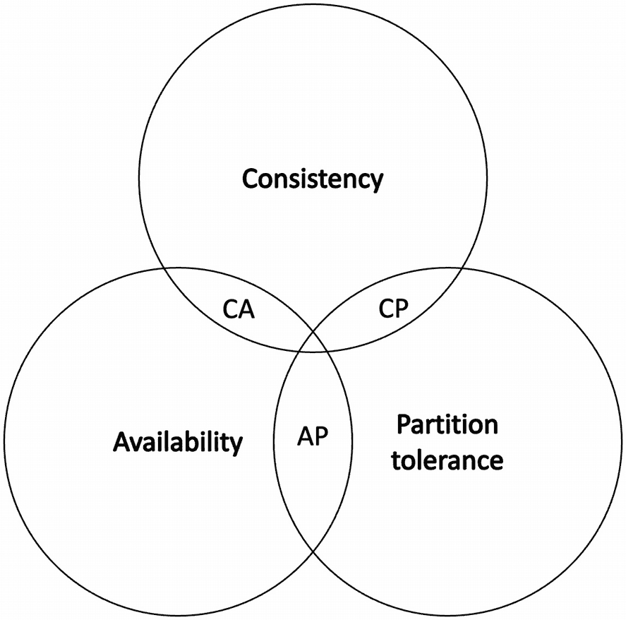

# 故障与容错

分布式系统中的故障是不可避免的。事实上，故障是分布式系统的一个特点。大量研究工作致力于容错，这也是分布式系统研究的核心。为了理解故障，让我们看一个小例子。

想象一个最简单的分布式系统，它由两个节点组成，如图 1-27 所示。

一个由两个节点 `P1` 和 `P2` 通过通信链路连接而成的分布式系统示意图。

**图 1-27** 一个最简单的分布式系统

思考可能发生的故障：

- 处理器 `p1` 或 `p2` 可能崩溃。
- 通信链路可能失效。
- 通信链路存在延迟。
- `p1` 或 `p2` 处理速度缓慢。
- `P1` 可能假装发送了某条消息；而实际上它并未发送。

分布式系统中可能发生多种故障：

- 进程/程序故障
- 通信/链路故障
- 存储故障

分布式系统文献中已经正式定义了多种类型的故障。这些类型被归类在所谓的故障模型下，该模型基本上告诉我们可能发生哪种故障。

我们现在对每一种故障定义如下。

## 崩溃-停止

在这种情况下，进程可能在任何时间点无法停止某个功能。当节点发生硬件故障时，就可能导致这种情况。在此模型中，其他节点无法发现该节点的崩溃。

## 失效-停止

在此模型中，进程可能因停止执行算法而失效。分布式系统中的其他节点通常可以通过使用故障检测器来获知此失效。

## 遗漏故障

遗漏故障是指消息可能丢失的情况。

### 发送遗漏

即进程未能成功发送消息。

### 接收遗漏

即进程未能成功接收消息。

### 一般性遗漏

即进程可能表现出发送遗漏或接收遗漏。

## 隐蔽故障

该模型捕获了一种故障可能保持隐藏或未被检测到的行为。

## 计算故障

在此场景中，我们捕获了处理器响应不正确的情况。

#### 拜占庭故障

该模型捕获了任意故障，即进程可能以任意多种方式失效。

### 带认证的拜占庭故障

在此模型中，进程可能表现出任意行为；但是，可以通过使用身份认证和数字签名来验证接收到的消息。这种不可否认性和验证机制可以使处理拜占庭故障稍微容易一些。

### 不带认证的拜占庭故障

在此模型中，进程可能表现出任意行为，但无法进行消息验证以确定消息的有效性。

## 时序故障

即进程可能表现出行为缓慢或运行速度快于其他进程的情况。这初看可能像是部分同步的行为，但一个长时间未收到消息的节点可被视为这种故障类型的一个例子。这涵盖了预期消息传递与预期传递时间不符或超出指定时间间隔的场景。

可以使用故障检测器来检测故障，在这种检测器中，进程可能被怀疑发生故障。例如，长时间未收到消息或已超过超时阈值的消息，可以被标记为故障进程。

关于故障检测器的更多内容，请参见第 3 章；现在我们来了解什么是故障模型以及故障类别。

在图 1-28 中，我们可以直观地看到各种故障类别，其中拜占庭故障以不同程度的复杂性涵盖了所有类型的故障，并且可能任意发生，而崩溃故障则是最简单的故障类型。

由 5 个非同心圆组成的示意图。从外到内的组成部分分别是：拜占庭故障、计算故障、时序故障、遗漏故障、崩溃故障。

**图 1-28** 故障模型与故障类别示意图

故障类别让我们能够了解可能发生哪些故障，而故障模型则帮助我们了解系统可能表现出哪种类型的故障，以及我们的分布式算法中应容忍哪些类型的故障。

一个只能容忍崩溃故障的系统或算法被称为崩溃容错，简称为`CFT`。相比之下，能够处理拜占庭故障的系统或算法被称为拜占庭容错系统或算法。通常，这适用于以实现崩溃容错或拜占庭容错为目标而分类和开发的共识机制。我们将在第 3 章讨论共识算法时进一步了解这一点。

### 安全性与活性

回想一下，我们在通信抽象中讨论过，广播协议和点对点链路具有某些属性。例如，公平丢失属性确保在公平丢失链路下，发送的消息最终会被投递。这种确保某事件最终会发生的属性被称为**活性**属性。通俗地说，这意味着最终会有好事情发生。

同样，请记住，在公平丢失链路的有限重复属性中，我们提到消息存在有限次重复。这种可以在无限时间范围内被测量和观察的属性被称为**安全性**属性。通俗地说，这意味着坏事情永远不会发生。当然，如果你什么都不做，那么什么也不会发生，这在理论上满足了安全性属性；然而，在这种情况下，系统没有任何进展。因此，确保系统进展的**活性**属性也是必不可少的。

这些属性被用于许多不同的分布式算法中，以论证协议的正确性。此外，它们也经常被用来描述共识协议的安全性和活性需求及属性。我们将在第 3 章中详细讨论分布式共识。

安全性和活性是分布式算法的正确性属性。例如，十字路口交通信号灯的安全性和活性可以描述如下。此场景中的安全性属性是：在任何时刻，只有一个方向必须是绿灯，并且任何信号灯都不能同时亮起所有颜色。另一个安全性属性可能是系统不应关闭所有信号灯。而活性属性是，每个信号灯最终都必须获得绿灯通行。

例如，在部分同步系统中，为了证明安全性属性，我们假设系统是异步的；而为了证明系统的活性，则使用部分同步假设。在部分同步系统中，系统的活性进展是有保障的——例如在`GST`（全局稳定时间）之后，当系统同步时间足够长，允许算法达成其目标并终止时，活性得以保证。

对于一个实用的分布式系统，必须明确指定并保证其安全性与活性属性。

### 容错的形式

一个正确的程序（分布式算法）应同时满足其安全性与活性属性。如果一个程序能容忍给定类别的故障，并保持**活性**和**安全性**，我们称这种容错类型为**屏蔽容错**。如果一个程序能保持安全性但无法保持活性，我们称之为**故障安全**容错。类似地，在存在故障的情况下，如果一个程序无法保持安全性（不安全）但能保持活性，这种行为被称为**非屏蔽容错**。如果一个程序在存在故障时既无活性也不安全，则意味着该程序不具备任何形式的容错能力。

## CAP 定理

CAP 定理指出，一个分布式系统只能同时提供三个期望特性中的两个，即一致性、可用性和分区容错性。让我们首先定义这些术语，然后更深入地探讨该定理。

### 一致性

一致性属性意味着数据在分布式系统的所有节点上应保持一致，并且同时连接到分布式系统的客户端应看到一致的相同数据。这通常通过复制来实现。

### 可用性

可用性意味着即使存在故障，分布式系统也能响应客户端的请求。这通过使用容错技术（如复制、分区或分片）来实现。

### 分区容错性

分区指的是两个或多个节点之间的通信链路中断的场景。分布式系统应能容忍这种情况并继续正常运行。

我们知道，网络分区几乎是不可避免的；迟早会发生某种通信中断。这意味着，由于网络分区无法避免，真正的选择其实是在可用性和一致性之间做出取舍。问题就变成了：在发生分区时，我们愿意牺牲哪一个，一致性还是可用性？这完全取决于具体的用例。例如，在金融应用中，最好牺牲可用性以换取一致性；但在网页搜索结果中，我们或许可以牺牲一点一致性来换取可用性。需要注意的是，当没有网络分区时，一致性和可用性都能得到保证。但话说回来，如果网络分区发生了，我们该选择可用性还是一致性呢？

如图 1-29 所示的维恩图可以用来直观理解这一概念。

一个由三个相交圆组成的示意图，分别代表一致性、可用性和分区容错性。C A、A P 和 C P 是它们的交集区域。

图 1-29

CAP 定理

CAP 定理允许我们根据数据库（NoSQL 数据库）所支持的属性对其进行分类。例如，一个`CP 数据库`提供一致性和分区容错性，但牺牲了可用性。在发生分区时，不一致的节点会被关闭，直到网络分区恢复。`AP 数据库`牺牲一致性，但提供可用性和分区容错性。在发生网络分区时，由于分区而未能获得更新的节点可能会继续提供旧数据。这在某些场景（如网页搜索）下可能是可以接受的。当分区恢复后，不同步的节点会与最新更新同步。另一方面，`CA 数据库`不具备分区容错性，只有在网络健康的情况下才能同时提供一致性和可用性。正如我们之前所见，网络分区是不可避免的；因此，`CA 数据库`仅存在于不发生网络分区的理想世界中。

尽管 CAP 定理很有用，但在分布式计算领域还存在许多其他更精确的不可能性结果。

现在我们来讨论什么是**最终一致性**。最终一致性指的是这样一种情况：节点之间可能不一致，或者未能更新其本地数据库，但最终，状态会达成一致并完成更新。

这种场景的一个例子是：电子投票系统收集选民的投票，并将它们写入一个中央投票注册系统。然而，可能由于网络分区，中央投票注册系统的通信链路中断，该投票机无法将数据写入后端的投票注册系统。此时，它可以继续接收用户的投票并在本地记录，当网络分区恢复后，再将选票写回中央投票注册系统。在网络分区期间，从中央投票注册系统的角度来看，投票计数与投票机所看到的数值不同。当分区恢复后，投票机可以将数据写回中央投票注册系统以实现一致性。后端服务器存储与本地存储之间的一致性并非立即达成，而是随着时间的推移逐渐实现，这种一致性类型被称为最终一致性。

比特币现在是一个已得到公认的最终一致性系统示例。我们将在第 4 章中进一步学习相关内容，并了解比特币是如何实现最终一致性的。