# 2. 密码学

本章将介绍密码学及其两大主要类型：对称密码和公钥密码。在探讨一些基本概念后，我们将深入研究对称密钥原语，然后介绍公钥原语。

此外，我们还将研究哈希函数、消息认证码、数字签名方案和椭圆曲线密码学。最后，我们将简要介绍一些前沿的想法、提案和技术，特别是那些在区块链共识中使用的技术。

## 引言

密码学是在有对手存在的情况下进行秘密通信的科学。历史上，这门学科更像一门艺术，但现在它已经成为一门严谨而正式的学科，拥有正式的定义、假设和安全证明。

密码学有三个基本原则：机密性、完整性和真实性。机密性确保信息仅对授权实体可用；完整性确保只有授权实体才能修改信息；最后，真实性保证消息的有效性或其发送者的身份。身份认证可分为两种类型：实体认证和数据来源认证。

实体认证确保某个声称拥有特定身份的实体（申明方）能够被另一实体（验证方）可靠地识别，并且该实体是活跃且正在参与的。用于实现身份认证协议中实体认证的方法包括：你所拥有的（例如硬件令牌）、你所知道的（例如密码）以及你所是的（例如指纹）。实体认证在安全的分布式系统中至关重要。由于分布式系统分布广泛、异构性强、用户众多，很容易成为对手攻击的目标。尤其是在区块链，特别是运行在区块链上的共识协议中，实体认证对于防范对手攻击至关重要。身份认证协议通常使用对称密码和公钥密码来构建。

另一种相关的保证是**不可否认性**，即实体在完成某项操作后不能否认该行为。这通常通过数字签名来实现。除了两方协议外，还有适用于多方的多方不可否认协议。

**数据来源认证**或**消息认证**确保信息来源是真实且经过验证的。消息认证码和数字签名用于提供数据来源认证。

## 典型密码系统

典型的密码系统模型如图 2-1 所示。我们将密码系统定义为密码原语、协议及算法的组合体现，用于实现特定安全目标。因此，密码系统由多个组件构成。

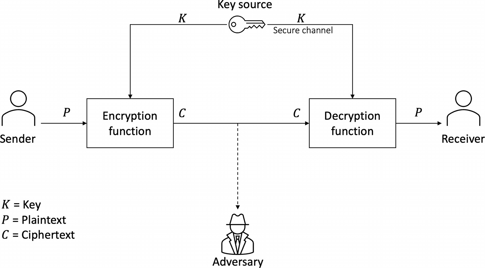

密码系统模型描述了发送方与接收方之间通过密钥、明文和密文进行加密解密的关联关系。

**图 2-1** 密码系统或密码方案的模型

该系统包含三个关键角色：发送方、接收方和攻击者。发送方希望通过不安全的信道向接收方发送秘密消息，而攻击者作为恶意入侵者意图获取消息内容。其他要素包括明文、密文、密钥、安全信道、加密函数、解密函数及密钥源：

- **发送方**：消息的发送主体。
- **接收方**：消息的预期接收者。
- **加密函数**：以加密密钥和明文为输入，将明文转换为密文的加密算法。
- **解密函数**：以解密密钥和密文为输入，将密文转换为明文的解密算法。
- **明文**：发送方希望以除预期接收者外无人能知的方式发送给接收方的原始消息。仅发送方及授权实体可读取和访问。
- **密文**：明文的乱码形式，未经解密时对任何阅读者而言均无意义。
- **密钥源**：密钥管理系统或某些密码密钥来源，用于获取或生成密钥。
- **密钥**：用于加密和/或解密数据的特定数值。
- **安全信道**：消息可未经加密传递且无窃听风险的通信渠道。
- **攻击者**：能够读取加密数据，并试图通过密码分析或其他手段获取信息的恶意黑客（或窃听者、观察者）。

### 密码原语

密码原语是实现特定安全服务（如机密性或完整性）的基础方法。这些密码原语用于构建安全协议，例如认证协议。密码原语包括对称原语、非对称原语和无密钥原语。密码原语的高级分类如图 2-2 所示。

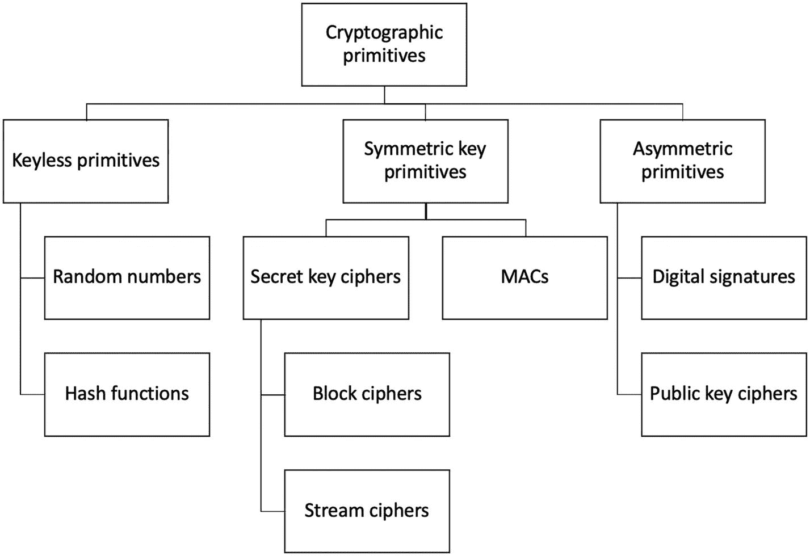

密码原语组织结构图分为无密钥原语、对称密钥原语和非对称原语，并各有细分。

**图 2-2** 密码原语

现在让我们了解对称原语。

### 对称密码学

对称密码系统使用相同密钥进行加密和解密。在发送方与接收方数据传输前，该密钥必须在安全信道中保密传输。为安全传输密钥，需使用密钥建立协议。通常采用公钥密码学来交换密钥，这比对称密钥管理更易于管理——后者在用户数量增长时可能变得具有挑战性。

设计对称密码算法的主要目的是提供机密性，但我们也可将其用于提供其他安全服务，如数据起源认证。

对称密码系统分为两类：流密码和分组密码。图 2-3 展示了流密码和分组密码的高级运作方式。

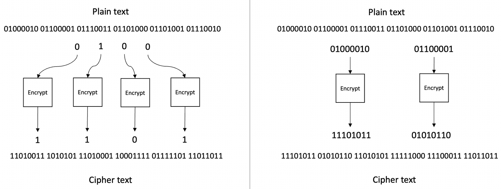

流密码与分组密码运作示意图显示：分别对 2 位和 8 位明文进行处理，并转换为密文。

**图 2-3** 流密码（左）与分组密码（右）对比

#### 流密码

这类密码系统逐位加密明文。算法以单比特明文为输入进行处理，并产生单比特密文。处理过程涉及使用异或（`XOR`）运算进行加密和解密。流密码模型如图 2-4 所示。

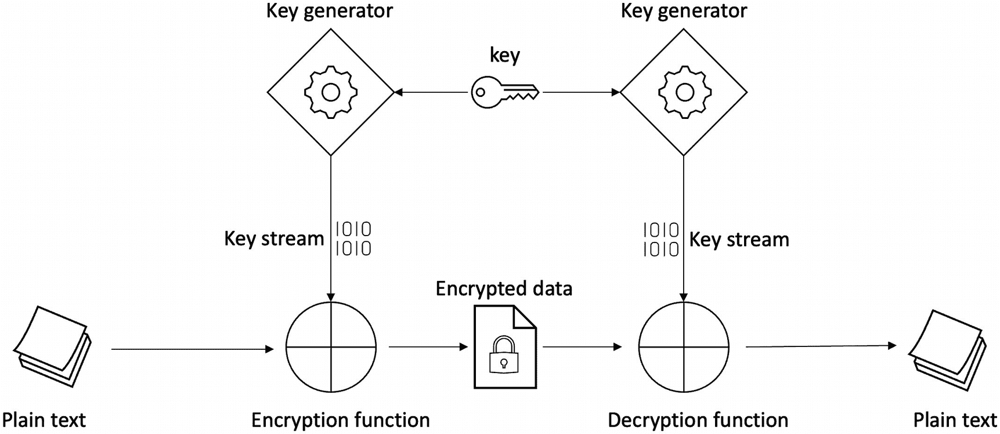

流密码模型流程如下：明文、加密、加密数据、解密、明文。密钥生成器指向各函数。

**图 2-4** 流密码模型

在此模型中，明文与密钥生成器生成的密钥流逐位输入加密函数。密钥生成器生成伪随机密钥流，其长度通常远小于明文（通常密钥长度为 128 位）。密钥流与明文通过 `XOR` 运算生成密文。解密时应用相同过程，恢复出明文。伪随机生成意味着生成的比特并非真正随机，而是看似随机，故称“伪随机”。密钥流通常使用线性反馈移位寄存器（`LFSR`）生成。`LFSR`的输入位是其先前状态的线性函数，该线性函数通常为 `XOR` 运算。

密钥生成器是一种密码学安全的伪随机数生成器（`CSPRNG`或`CPRNG`）。由于具有“伪”特性，其数值可被计算，且任何计算者都会得到相同结果，这意味着这些 `PRNG` 也是确定性的。若真正随机且非确定性，则一旦生成，他人无法重新生成该随机数，导致无法解密。因此它们看似随机，实则非随机且可计算。`CPRNG`具有特殊属性：其生成的数值不可预测。

流密码分为两类：同步流密码和异步流密码。同步流密码中，密钥流仅依赖于密钥；而异步流密码中，密钥流依赖于固定数量的先前传输加密位及密钥。

流密码通常更适用于硬件设备，但也可用于软件环境。存在众多流密码实例，例如用于 `GSM` 通信提供机密性的`A5/1`。然而，`Salsa20`和`ChaCha`在软件环境中使用最广泛。其他流密码包括`Trivium`、`Rabbit`、`RC4`和`SEAL`。

#### 分组密码

分组密码通过将明文划分为固定长度的块来进行加密。历史上，像 `DES` 这样的分组密码是使用费斯妥网络（`Feistel` mechanisms）构建的。现代密码，如 `AES`，则使用代换-置换网络（`SPN`）。

图 2-5 展示了一个简单的分组密码模型。

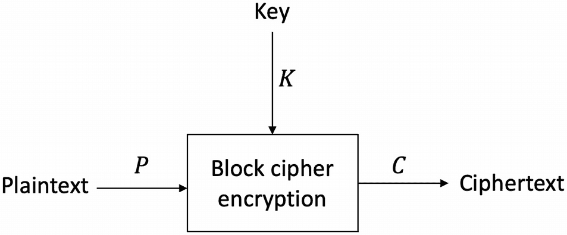

分组密码模型。明文 `P` 和密钥 `K` 被传递到分组密码加密函数中，该函数将它们结合起来以获得密文 `C`。

**图 2-5** 分组密码

图 2-5 所示的模型包括明文、加密和密文。加密器将固定长度的明文块和密钥作为输入，并生成密文块。

分组密码主要用于加密，但也可用于构建哈希函数、创建流密码、构建伪随机数生成器和消息认证码。

加密试图实现两个必要的属性：混淆（`confusion`）和扩散（`diffusion`）。混淆增加了加密文本与明文之间关系的模糊性。它是通过使用代换来实现的，在现代加密算法（如 `AES`）中，代换由称为 `S-box` 的查找表执行。

扩散确保明文在统计上分散到整个加密数据中。换句话说，它确保即使明文中的单个比特发生变化，密文也会发生很大变化，从而隐藏明文和密文之间的关系。也就是说，它隐藏了明文的统计特性，以挫败统计分析攻击。此外，在现代加密算法（如 `AES`）中，置换盒提供了扩散。因此，混淆和扩散结合起来创建安全的密码算法。

数据加密标准（`DES`）于 20 世纪 70 年代开发，并在 20 世纪 80 年代和 90 年代被广泛使用。随着时间的推移，由于技术的进步，`DES` 的效率开始下降。这主要是由于其 56 位密钥长度较短。在 1990 年代末，经过一些成功的暴力破解攻击（例如 `deep crack` 和 `COPACOBANA`）之后，`DES` 不再安全变得显而易见。因此，引入了三重 `DES`，它连续加密三次（三重加密），从而将密钥长度增加到 112 位。这有助于防止暴力破解攻击，事实上三重 `DES` 至今仍未被破解。然而，由于对性能缓慢和 64 位块大小的担忧，`NIST` 最终在 2001 年用 `AES` 取代了 `DES`。

分组密码有多种工作模式。这些模式使分组密码不仅能提供机密性，还能提供完整性和真实性。其中一些模式包括：

- 电子密码本模式（`ECB`）
- 密码块链接模式（`CBC`）
- 计数器模式（`CTR`）
- 密码反馈（`CFB`）模式
- 伽罗瓦/计数器模式（`GCM`）
- 输出反馈（`OFB`）模式

我们这里只解释三种模式。

##### 电子密码本

电子密码本（`ECB`）是一种基本的操作模式，其中加密数据是对明文的每个块逐一应用加密算法的结果。

这种模式是最直接的，但我们不应该在实践中使用它，因为它是不安全的，并且可能会泄露信息。

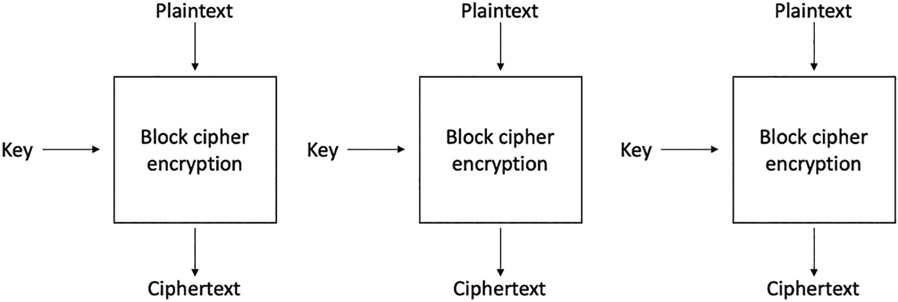

密码本模式模型包含 3 个框，其元素如下：明文和密钥通过密码加密以获取密文。

**图 2-6** 分组密码的电子密码本模式

图 2-6 显示，我们将明文 `P` 作为输入提供给分组密码加密函数，并提供一个密钥，该函数输出密文 `C`。

##### 密码块链接

在密码块链接（`CBC`）模式下，每个明文块都与先前加密的块进行异或（`XOR`）运算。`CBC` 模式使用 `IV` 来加密第一个块。`IV` 必须是随机选择的。`CBC` 模式的操作如图 2-7 所示。

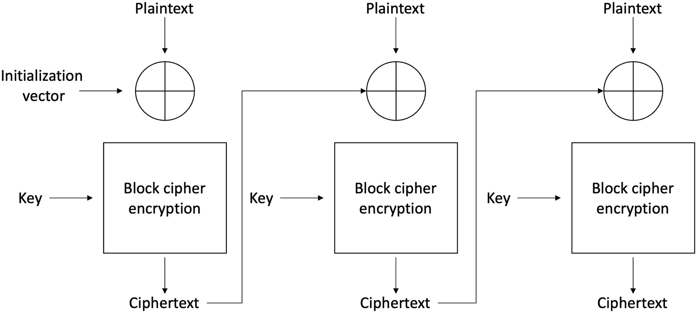

链接模式模型具有 3 个框，包含以下元素：密钥指向密码加密以获取密文，该密文再指向下一个明文。

**图 2-7** 密码块链接模式

##### 计数器模式

计数器（`CTR`）模式将分组密码用作流密码。在这种情况下，一个唯一的随机数（`nonce`）与计数器值连接以生成密钥流。

如图 2-8 所示，`CTR` 模式的工作原理是利用一个随机数 `N` 和一个计数器 `C`，它们被送入分组密码加密函数。分组密码加密函数接收密钥 `KEY` 作为输入，并生成一个密钥流（伪随机或随机字符流），该密钥流与明文（`P`）进行异或运算后，生成密文（`C`）。

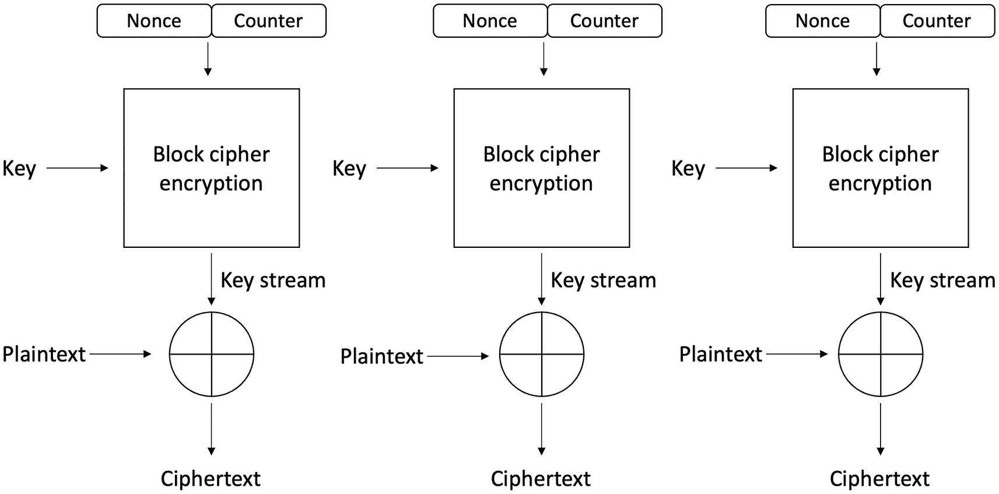

计数器模式模型包含 3 个框，具有以下元素：随机数、计数器、密钥、分组密码加密、密钥流、明文、密文。

**图 2-8** 计数器模式

除了加密之外，我们还可以使用其他模式来实现不同的目的。我们将在下一节中讨论其中的一些模式。

##### 密钥流生成模式

在密钥流生成模式下，加密函数生成一个密钥流。流密码使用此密钥流，将其与明文流进行异或运算以生成密文。

##### 消息认证模式

消息认证码（`MAC`）是通过消息认证模式下的加密函数产生的。`MAC` 是一种提供完整性服务的加密校验和。使用密码块链接模式（`CBC` 模式）的分组密码可用于生成 `MAC`。我们可以使用 `MAC` 来检查未经授权的实体是否修改了消息。我们通过使用 `MAC` 函数用密钥加密消息来实现这一点。然后，接收者通过用密钥重新加密收到的消息并与收到的 `MAC` 进行比较来检查消息的 `MAC`。如果它们匹配，则表示没有未经授权的实体修改过该消息；因此，提供了完整性服务。如果它们不匹配，则意味着某个未经授权的实体在传输过程中更改了消息。

任何分组密码，例如处于 `CBC` 模式下的 `AES`，都可以生成 `MAC`。消息的 `MAC` 是 `CBC` 操作最后一轮的输出。`MAC` 输出的长度与用于生成 `MAC` 的分组密码的块长度相同。尽管 `MAC` 的工作方式类似于数字签名，但由于其对称性，它们无法提供不可否认服务。

##### 密码哈希模式

哈希函数主要用于将消息压缩为固定长度的摘要。密码哈希模式下的分组密码也可用作压缩函数来生成哈希。

现在我们将详细描述高级加密标准（`AES`）。

#### 高级加密标准

`AES` 最初以发明者 `Joan Daemen` 和 `Vincent Rijmen` 的名字命名为 `Rijndael`。经过公开竞争后，它于 2001 年被 `NIST` 标准化为高级加密标准（`AES`）。

在 `Rijndael` 的原始版本中，允许使用不同的密钥和块大小，包括 128 位、192 位和 256 位。然而，在 `AES` 中，仅允许使用 128 位的块大小以及 128 位、192 位和 256 位的密钥大小。

`AES` 处理一个大小为 4 x 4 的字节数组，称为 `state`（状态），根据密钥大小进行多轮处理。例如，如果密钥长度为 128 位，则需要 10 轮；对于 192 位，需要 12 轮；对于 256 位，则需要 14 轮。

在使用输入明文初始化 `state` 之后，`AES` 依次执行以下四个操作以生成密文：

- **`AddRoundKey`（轮密钥加）**：首先，将 `state` 数组与从主密钥派生出的子密钥进行异或操作。
- **`SubBytes`（字节代换）**：此步骤执行字节替换，使用一个固定的查找表（`S-box`）来替换 4 x 4 `state` 数组中的所有字节。
- **`ShiftRows`（行移位）**：此步骤以循环和递增的方式将 `state` 数组中的每一行向左移动。第一行不动，第二行向左移动一个字节，第三行向左移动两个字节，第四行向左移动三个字节（或位置）。
- **`MixColumns`（列混淆）**：最后，以线性方式（即线性变换）混合所有字节，该函数将一列中的四个字节作为输入，并产生四个新字节作为输出来替换输入列。

上述四个步骤构成了 `AES` 的一轮。在最后一轮中，不执行步骤 4（`MixColumns`）。取而代之的是，它被 `AddRoundKey` 步骤替换，以确保前三个步骤不能轻易地被逆向。该过程如图 2-9 所示。

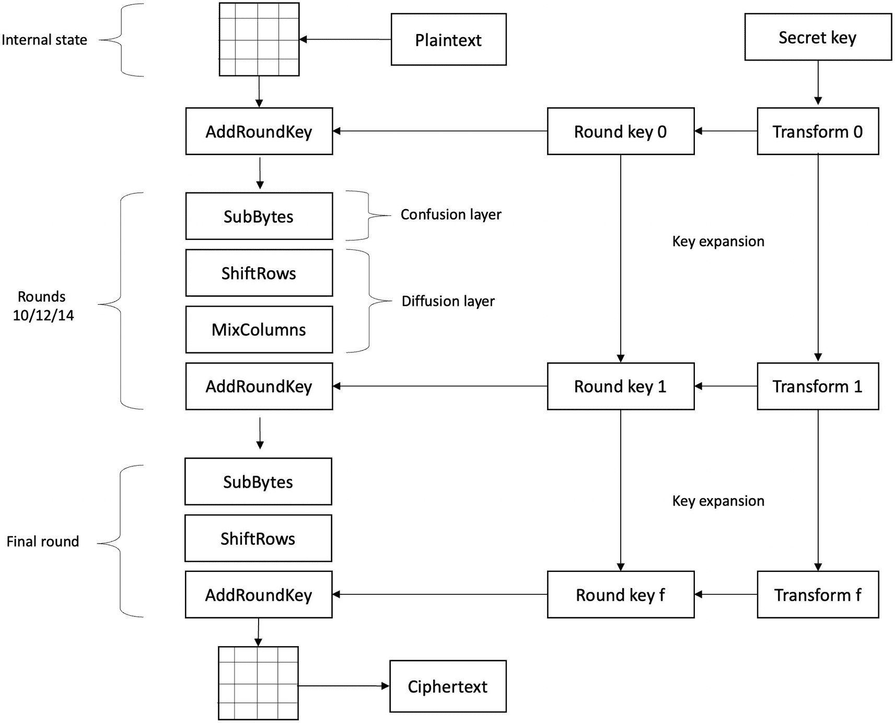

一个 `AES` 分组密码的原理图，包含 3 个阶段，即：内部状态、轮次（10/12/14 轮）和最后一轮，以获取密文。

**图 2-9** `AES` 分组密码

#### 一些基础数学知识

在我们深入密码学之前，理解一些非常基础的数学知识和相关术语很重要。

##### 素数

素数是只能被自身和 1 整除的数。例如，23 是一个素数，因为它只能精确地被 23 或 1 整除，没有余数。

##### 模算术

这是一种在整数上执行算术运算的系统，当数字达到某个固定的数值时，数字会绕回（取模）。这个固定的数值称为模数，所有算术运算都基于这个模数进行。

##### 群

群 `G` 是一个集合，其元素可以通过运算 `∘` 进行组合。它具有以下性质：

- **封闭性** 意味着所有群运算的结果都在该集合内。形式上，∀ `a`，`b` ∈ `G`：`a` ∘ `b` = `c` ∈ `G`。
- **结合律** 意味着所有群运算满足结合律。形式上，`a` ∘ (`b` ∘ `c`) = (`a` ∘ `b`) ∘ `c`：∀ `a`， `b`， `c` ∈ `G`。
- 存在一个特殊的**单位元** `i`，使得 ∀ `a` ∈ `G`：`a` ∘ `i` = `i` ∘ `a` = `a`。
- 对于每个元素 `a` ∈ `G`，都有一个对应的**逆元** `a^(-1)`，使得 `a` ∘ `a^(-1)` = `a^(-1)` ∘ `a` = `i`。

##### 阿贝尔群

如果一个群除了具备上述群的性质外，还满足 ∀ `a`， `b` ∈ `G`：`a` ∘ `b` = `b` ∘ `a`，则该群称为交换群或阿贝尔群。

##### 域

域 `F` 是一个集合，在 `F` 上定义了两种运算，称为加法和乘法。

##### 有限域（伽罗瓦域）

有限域是元素数量有限的域。

##### 素域

素域是包含素数个元素的有穷域。

##### 生成元

生成元是椭圆曲线上的一个点。

### 公钥密码学

公钥密码系统使用两个不同的密钥进行加密和解密。公钥是公开的，而私钥必须保密。在这些系统中，发送方使用接收方的公钥加密数据。接收方通过使用相应的私钥解密密文。

此模型如图 2-10 所示。

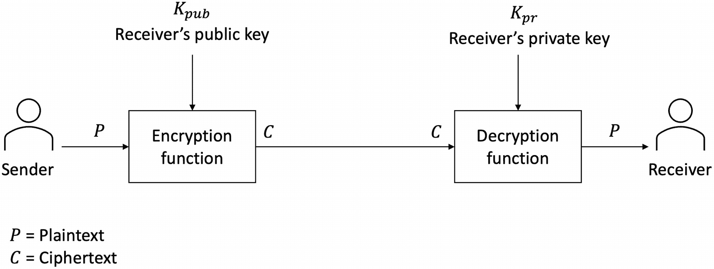

一个密码系统的原理图。来自发送方的明文和公钥被发送到加密环节。密文和私钥被发送到解密环节。

**图 2-10** 基于公钥密码学的密码系统

对称密钥系统的一个基本问题是，在通信之前需要通过安全信道共享一个密钥，这很难实现。对称密钥系统的另一个问题是密钥管理。随着系统中用户数量的增长，密钥数量呈指数级增长。一个拥有 `n` 个用户的网络将需要 `n(n-1)/2` 个密钥，每个用户将存储 `n-1` 个密钥。在一个 100 用户的网络中，每个用户将存储 99 个密钥。公式 `100(100-1)/2` 表示总共有 4950 个密钥，这在实践中管理起来相当棘手。公钥密码学解决了这个密钥分发和密钥管理的问题。

公钥密码学的一个典型用途是在两方之间建立一个共享的秘密密钥。这个共享的秘密密钥被对称算法（如 `AES`）用于加密数据。由于双方已经建立了共享密钥，他们可以在不通过线路传输该密钥的情况下进行加密和解密。这样，双方既获得了公钥密码学的高安全性，又享有了对称加密的速度。由于性能较慢，非对称密码学不常用于批量加密；然而，这却是密钥建立的常规做法。这种使用对称密钥加密数据，同时使用公钥密码学加密秘密密钥的系统称为混合密码系统。例如，集成加密方案就是一种混合加密方案。`ECIES` 是 `IES` 方案的椭圆曲线（`EC`）版本。

### Diffie-Hellman 密钥交换

在密钥交换领域，具有开创性和基础性的方案是 Diffie-Hellman 密钥交换。这是一种在两方之间运行的交互式协议。下面展示一个关于 Diffie-Hellman 交换的基本且直观的数学示例：

1. Alice 和 Bob 想要建立一个共享的秘密密钥。
2. 双方商定两个数字：一个素数 `P` = 13 和 `P` 的一个生成元 `G` = 6。但在实践中，`P` 是非常大的。
3. 双方都随机选择一个大的随机整数（即私钥）。
   - Alice 的私钥 = 5，Bob 的私钥 = 4
4. 双方计算各自的公钥：
   - Alice：`6⁵ mod 13` = `7776 mod 13` = `2` → 公钥 = `2`
   - Bob：`6⁴ mod 13` = `1296 mod 13` = `9` → 公钥 = `9`
5. Bob 将公钥 `9` 发送给 Alice，Alice 将公钥 `2` 发送给 Bob。
6. 双方使用各自的私钥 `5` 和 `4` 计算共享密钥。
   - Alice：`9⁵ mod 13` = `3`
   - Bob：`2⁴ mod 13` = `3`
7. 共享的秘密密钥建立成功。

公钥密码系统依赖于单向陷门函数。陷门函数在一个方向上易于计算，但在相反方向上难以计算，除非存在一个称为“陷门”的特殊值。这个概念可以直观地通过图 2-11 来理解。

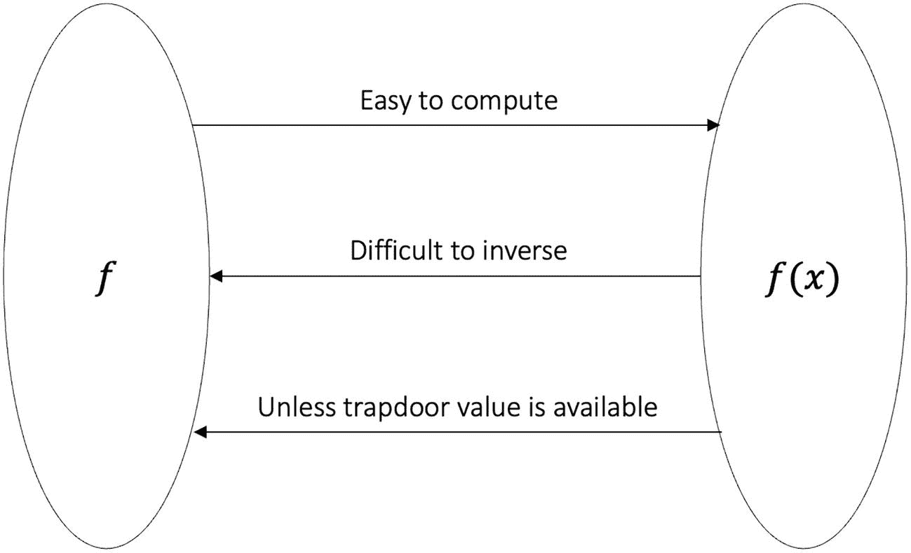

一幅图示包含了定义域 `f` 和值域 `f(x)`。从 `f` 到 `f(x)` 是容易计算的。从 `f(x)` 到 `f` 则难以逆转，除非陷门可用。

`图 2-11` 陷门函数

不同的计算困难问题，例如大整数因子分解问题和离散对数问题，提供了合适的单向陷门函数。使用整数因子分解的密码学方案基于分解大整数在计算上的不可行性。一个依赖此类假设的典型例子是 RSA。整数因子分解是将一个合数（由两个较小的整数相乘得到）分解为更小的整数（因子）。

在密码学中，因子被限定为素数。我们可以通过一个简单的例子来演示这个问题。例如，很容易看出 `15` 是 `5` 乘以 `3` 的结果，即 `5 * 3 = 15`。那对于一个更大的素数呢，比如 `6887`？这会相对困难一些，但通过一定的计算，我们可以得到因子 `71` 和 `97`。如果这个数字非常巨大，比如有 1024 位，且是素数呢？那么将两个这样的素数相乘很容易，但分解它们却极其困难，这使其成为我们可以在密码学中使用的一个单向函数。

离散对数问题是许多不同密码学方案的基础，例如 Diffie-Hellman 密钥交换和数字签名算法。它基于模算术中的一个问题：计算模运算的结果很容易，但找到生成元的指数却很难。这种困难性创造了一个单向函数，其中根据输出找到输入在计算上是不可行的。

一个简单的例子可以展示这个问题的核心：

```
3² mod 10 = 9
```

现在，给定 `9`，要找到生成元 `3` 的指数 `2` 是极其困难的。正式地说，我们可以认为，给定数字 `a` 和 `n`（其中 `n` 是一个素数），函数

```
f(b) = a^b mod n
```

是一个单向函数，因为计算 `f(b)` 很容易，但给定 `f(b)`，找到 `b` 却很难。

另一种在 20 世纪 80 年代中期开发的方法是椭圆曲线密码学（ECC）。由于在比特币和以太坊等区块链平台中的应用，椭圆曲线密码学受到了特别关注。诸如椭圆曲线 Diffie-Hellman 密钥交换和椭圆曲线数字签名算法等协议在该领域最为普遍。ECC 本质上是一个离散对数问题，但它是基于有限域上的椭圆曲线建立的。ECC 的一个关键优势是，较小的密钥大小可以提供与 RSA 中较大密钥大小相同的安全级别。例如，一个 1024 位整数分解方案（如 RSA）的安全级别，可以通过仅 160 位的基于椭圆曲线的方案（如 ECDSA）来实现。

公钥密码系统可用于加密，尽管这不太常见，并且对于大型数据集而言效率不高。它也可用于提供其他安全服务和协议，例如数字签名、实体认证和密钥协商。

#### 数字签名

数字签名是公钥密码学最常见的应用之一。数字签名提供不可否认性服务。最常见的例子包括基于 RSA 的数字签名、数字签名算法（DSA）、ECDSA 以及 Schnorr 签名。

#### 实体认证

实体认证（或称身份识别）是公钥密码系统能够提供的另一项服务。通常，质询-响应机制被广泛使用，验证者发送一个质询，要求声称身份者（证明者）正确响应，以确认声称者的合法性。

#### 密钥协商

密钥协商协议用于在加密数据传输之前建立秘密密钥。这类协议最常见的例子是 Diffie-Hellman 密钥交换协议。

### RSA

RSA 被广泛用于安全的密钥传输和构建数字签名。Diffie 和 Hellman 于 1976 年发明了公钥密码学。基于这一思想，Rivest、Shamir 和 Adleman 在 1978 年开发了 RSA 公钥密码系统。

在本节中，我将引导您了解 RSA 中生成密钥对的步骤，以及如何进行加密和解密。

#### 密钥对生成

1.  **生成模数。**
    -   选择 `p` 和 `q`，两个大的素数。通常为 `2¹⁰²⁴` 位或更多。
    -   将 `p` 和 `q` 相乘得到模数 `n`。`n = p * q`。`n` 变为 `2²⁰⁴⁸` 位。

2.  **选择一个具有特殊性质的随机数。** 假设我们称这个数字为 `e`。
    -   这个数字 `e` 应具有一些特殊性质：
        -   必须大于 `1`。
        -   必须小于 `ϕ(n) = (p - 1)(q - 1)`。
        -   `gcd(e, (p - 1)(q - 1)) = 1`。
        -   `e ∈ {1, 2, ..., ϕ(n) - 1}`。
    -   正式地说，这个数字 `e` 应该是 `(p - 1)(q - 1)` 的互质数（或称互素数），也就是说，除了 `1` 之外，没有其他数字能同时整除 `e` 和 `(p - 1)(q - 1)`。互质数之间除了 `1` 之外没有共同因子，所以互质数的最大公约数（GCD）为 `1`。

3.  **生成公钥**
    -   步骤 1 中生成的模数 `n` 和步骤 2 中生成的特殊数字 `e` 构成一对 `(n, e)`，这就是公钥。这对数字是公开的，可以分享给任何人；但 `p` 和 `q` 必须保密。

4.  **生成私钥**
    -   私钥，我们称之为 `d`，由步骤 1 中的两个素数 `p`、`q` 和步骤 2 中的特殊数字 `e` 计算得出。私钥是 `e` 模 `(p - 1)(q - 1)` 的逆元，我们可以将其写为：

```
e d = 1 mod (p - 1)(q - 1)
e d = 1 mod ϕ(n)
d = e^(-1) = 7 mod 20
```

    实践中，使用扩展欧几里得算法来计算 `d`，该算法以 `p`、`q` 和 `e` 作为输入，输出 `d`。`d` 必须保密。

好的，作为高级文档工程师和翻译员，我将遵照您的注意事项和示例，将以下英文文本翻译成中文。

#### 加密与解密

现在，我们来看如何使用 RSA 执行加密和解密操作。RSA 使用以下公式生成密文：

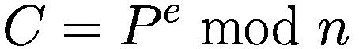

这意味着明文 `P` 的 `e` 次方再对 `n` 取模。

RSA 的解密由以下公式给出：

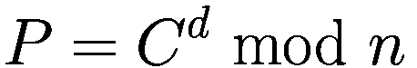

这意味着拥有公钥对 (`n`, `e`) 的接收者可以通过计算 `C` 的私钥 `d` 次方再对 `n` 取模来解密数据。

#### 密钥生成、加密和解密的示例

1.  将明文设为消息 `m`。`m` = 5，将由 Alice 发送给 Bob。
2.  设 `p` = 3，`q` = 11。
3.  `n` = `pq` = 3 * 11 = 33。
4.  `e` = 3，因为 (3 - 1)(11 - 1) = 20，该值大于 1 且小于 20，并且 `GCD`(3, 20) = 1。
5.  公钥为 (`n`, `e`) = (33, 3)。
6.  私钥为 `ed = 1 mod (p - 1)(q - 1)`。

    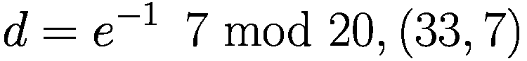

7.  将公钥 (`n`, `e`) (33, 3) 发送给 Alice。
8.  Alice 计算 5³ = 125 `mod` 33 = 26。
9.  Alice 将 26 作为加密文本发送给 Bob。
10. Bob 计算 26⁷ = 8031810176 = 8031810176 `mod` 33 = 5，并检索到明文消息 5。

### 椭圆曲线密码学

椭圆曲线密码学 (ECC) 基于数学中一个称为椭圆曲线的概念。它是平面上的一组点，其 `x`, `y` 坐标满足特定的方程和一些条件。通常，它是 Weierstrass 形式 `y² = x³ + ax + b`，其中 `a` 和 `b` 是固定的。

椭圆曲线是群。它们被用于数学的许多不同领域，包括数论、复分析和数学物理。在密码学中使用时，有限域上的合适椭圆曲线的点形成一个群结构，该结构允许基于离散对数问题构建密码学方案。

椭圆曲线密码学中使用素数域。*在素数域中，所有算术运算都是对素数 `p` 取模执行的*。

椭圆曲线由以下方程定义：

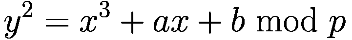

这里，`a` 和 `b` 属于有限域 `Zp` 或 `Fp`（素数有限域），即 (`a`, `b`) ∈ `Z`，以及一个无穷远虚点。无穷远点 `∞` 用于为曲线上的点提供单位元运算。

此外，如下所示的条件确保曲线是非奇异的，这意味着曲线不会自相交或具有顶点：

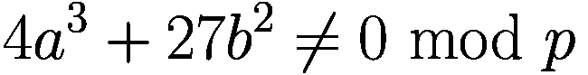

为了构建基于椭圆曲线的离散对数问题，需要一个足够大的循环群。首先，将群元素标识为满足椭圆曲线方程的一组点。之后，需要在这些点上定义群运算。椭圆曲线上的基本群运算是点加法和点倍乘。点加法是添加两个不同点的过程，而点倍乘意味着将同一个点加到自身。

椭圆曲线可以在实数上可视化，如图 2-12 所示。

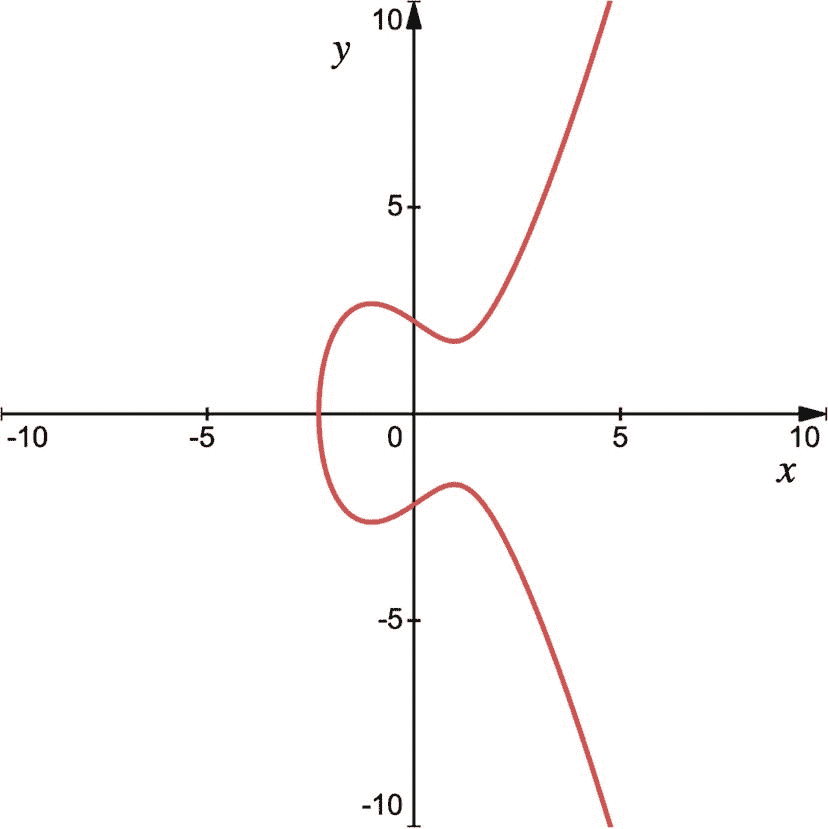

一张图在所有四个象限中绘制了一条椭圆曲线。该曲线水平方向呈双边对称。
`图 2-12`
实数域上的椭圆曲线 `y² = x³ - 3x + 5`

我们可以在几何上直观地理解曲线和群运算（即加法和倍乘）在实数上的表现，这有助于建立直观感受。然而，在实践中，使用素数域上的曲线来构建基于 ECC 的方案。尽管当我们尝试绘制它时，它看起来相当随机且不直观。

#### 点加法

对于添加两个点，画一条通过点 `P` 和 `Q` 的直线（图 2-13 中的对角线），以得到第三个点。该点反射后得到点 `R`，在图 2-13 中表示为 `P+Q`。

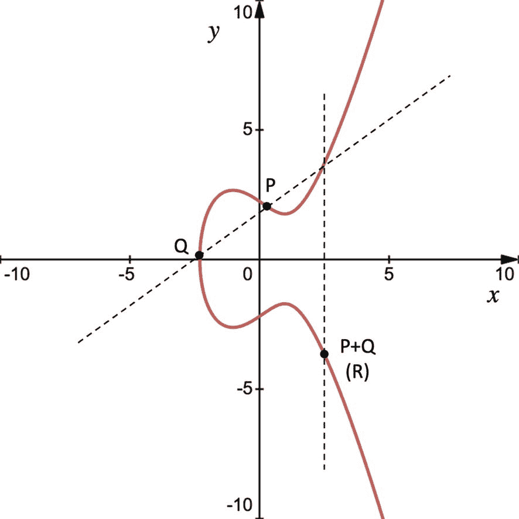

一张图在所有象限中绘制了一条椭圆曲线。该曲线水平方向呈双边对称。两条线分别在 `P` 和 `Q` 以及 `P+Q` 处与曲线相交。
`图 2-13`
点加法

从代数角度来说，在点加法运算中，将两个点 `P` 和 `Q` 相加以获得曲线上第三个点 `R` 的坐标：

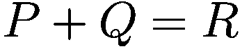

其中 `P` = (`x`[1], `y`[1])，`Q` = (`x`[2], `y`[2])，`R` = (`x`[3], `y`[3])。

对于加法，我们计算点之间的斜率：

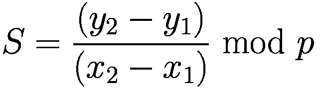

其中 `S` 表示经过 `P` 和 `Q` 的直线。

现在得到新点 `R`：

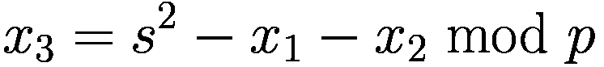

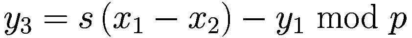

#### 点倍乘

在点倍乘中，`P` 被加到自身。换句话说，`P` 和 `Q` 是同一个点。由于该点与自身相加，我们可以称此运算为点倍乘。

为了倍乘一个点，画一条经过点 `P` 的切线（图 2-14 中的虚线对角线），该线获得与曲线相交的第二个点。将该点反射即可得到结果 `R`，在图 2-14 中表示为 `2P`。

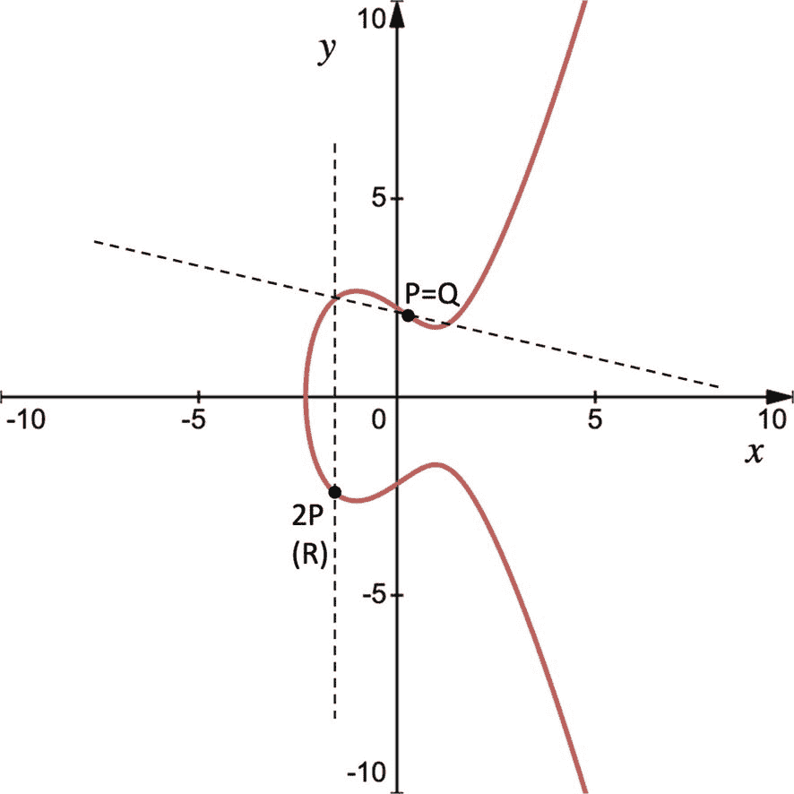

一张图在所有象限中绘制了一条椭圆曲线。该曲线水平方向呈双边对称。两条线分别在 `P=Q` 和 `2P` 处与曲线相交。
`图 2-14`
椭圆曲线点倍乘

对于倍乘，我们使用

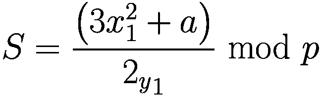

其中 `S` 表示经过点 `P` 的切线。

现在得到点 `R`：


`y`[3] = `s`(`x`[1] - `x`[2]) - `y`[1] `mod p`

##### 标量点乘

该操作用于将椭圆曲线上的一个点乘以一个给定的整数，例如整数 `d` 和点 `P`。我们通过重复将 `P` 相加 `d` 次来得到 `dP`，如下所示：

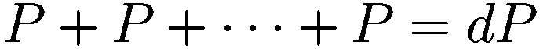

该操作用于在基于 ECC 的密码系统中生成公钥。这是一个计算开销非常高的过程，因为需要反复执行点加和倍点运算来计算：


其中，`P` 是曲线上的一个点，`d` 是随机选择的用作私钥的整数，`Q` 是乘法运算后得到的公钥。

提高点乘速度是一个活跃的研究领域。虽然有许多算法可以加速标量乘法，这里我们用双倍与加算法描述一个快速示例。该算法结合了点加和倍点操作来实现性能提升。

例如，如果仅使用加法来得到 `9P`，我们必须执行 `P + P + P + P + P + P + P + P + P` 操作，如果 `P` 的数量增加，这种方法很快就会变得不切实际。我们可以使用双倍与加机制来加快速度。这里，我们首先将九转换为二进制。从最高有效位开始，对于每个为 1 的位，执行双倍和加法操作；对于每个为零的位，仅执行双倍操作。我们不对最高有效位执行任何操作。九的二进制是 `1001`，因此对于每个位，我们得到（从左到右）`P`、`2P`、`4P`、`8P+P`。这种方案只需要三次双倍运算和一次加法运算就能得到 `9P`，而不是九次加法运算。

# 椭圆曲线离散对数问题

现在考虑`dP`操作会在曲线上生成另一个点`Q`。即使我们知道点`P`和`Q`，在计算上也无法重构出我们为计算数字`d`而执行的所有双倍和加法操作的序列。即使有人知道`P`和`Q`，他们也找不到`d`。这意味着它是一个单向函数。这是椭圆曲线离散对数问题的基础。

考虑一个椭圆曲线`E`，以及两个元素`P`和`Q`。离散对数问题是要找到满足以下条件的整数`d`（其中`1 <= d <= #E`）：

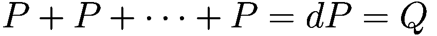

这里，`Q`是公钥（曲线上生成的一个点`(x, y)`），`d`是私钥（曲线上的另一个点）。公钥是生成点`P`的一个随机倍数，而私钥是用于生成该倍数的整数`d`。生成点或基点`G`是曲线上一个能够生成循环子群的点，这意味着该群中的每一个点都可以通过反复添加基点来得到。

`#E`代表群的阶，即椭圆曲线循环子群中存在的点的数量。循环群是由椭圆曲线上的点和无穷远点组合而成。余因子`h`是曲线上的点数除以子群的阶得到的值。

起始点`P`是一个公共参数，公钥`Q`也会公开，而私钥`d`则保密。如果不知道`d`，仅凭`Q`和`P`的知识是无法计算出`d`的，这就构成了ECDLP所基于的难题。

一个密钥对与椭圆曲线的特定域参数相关联。域参数是实施ECC方案所需的公共值。这些参数用一个元组`{p, a, b, G, n, h}`表示：
* `p`：域（模素数）
* `a`、`b`：固定的椭圆曲线系数
* `G`：用于生成循环群的生成点
* `n`：群的阶
* `h`：余因子

例如，比特币使用`SECP256k1`曲线，其方程为`y² = x³ + 7`，域参数定义如下：`https://en.bitcoin.it/wiki/Secp256k1`

最常用的曲线是NIST提出的曲线，例如`P-256`。其他曲线包括`Curve25519`、`Curve1174`等等。当然，建议选择安全的曲线。一个关于安全与不安全曲线及其解释的优秀资源在此处在线维护：`https://safecurves.cr.yp.to`

# 数字签名

公钥密码学用于创建数字签名。这是公钥密码学最常见的应用之一。在本节中，我们将了解RSA、ECDSA和Schnorr签名是如何工作的。还将介绍在区块链中常用的聚合签名和多重签名等概念。

数字签名提供了一种将消息与其来源实体关联起来的方法。数字签名用于提供数据源认证和不可否认性。

数字签名用于共识算法，尤其是在区块链网络中，用于签署用户在区块链网络上发送的交易和消息。区块使用数字签名以密码学方式进行密封，以便接收方能够验证所传输区块的真实性。同样，所有交易也会被签名。在共识算法中，常见的做法是，区块被密封并广播到网络，接收节点接收后，验证签名以确定区块的真实性。验证通过后，区块会被插入到本地区块链中。

数字签名具有三个安全属性：真实性、不可伪造性和不可重用性。

## 真实性

这意味着数字签名可以被接收方验证。

## 不可伪造性

此属性保证只有消息的发送者才能使用私钥进行签名。数字签名还必须能够防止伪造。伪造是指攻击者在没有合法签名者私钥的情况下，为某条消息伪造一个有效的签名。换句话说，不可伪造性意味着没有人能生成由真正的发送者产生的已签名消息。

## 不可重用性

此属性要求数字签名不能与一条消息分离，并再次用于另一条消息。换句话说，数字签名与其对应的消息紧密绑定，不能与其原始消息分离并附加到另一条消息上。

使用数字签名的签名和验证过程如图2-15所示。

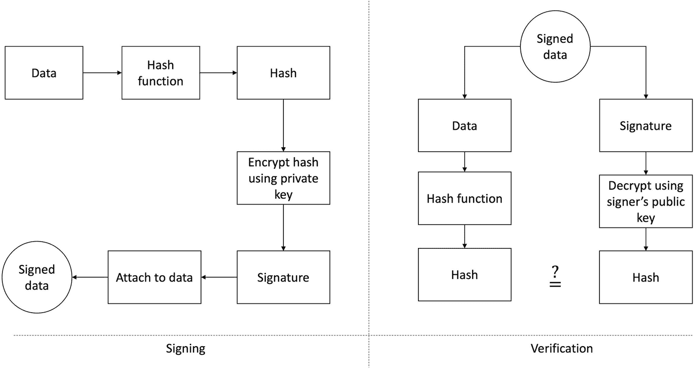

一个由两部分组成的签名和验证流程图，分别显示了从数据到已签名数据的流程，以及从已签名数据到哈希的流程。

**图2-15**  
数字签名（左）和验证过程（右）

首先，我们为想要证明其数据源认证的数据生成哈希。然后，我们使用证明者的私钥加密该哈希，以创建一个“签名”，并将其附加到数据上。最后，这个已签名的对象被发送给验证者。

验证者使用签名者的公钥解密数据的加密哈希，以检索原始哈希。然后，验证者获取数据，并通过哈希函数再次对其进行哈希，以生成哈希值。如果这两个哈希值匹配，则验证成功，证明签名者确实签署了该数据。这也证明了数据源认证，以及不可否认性和数据完整性属性。

现在，我们描述ECDSA（椭圆曲线数字签名算法）是如何工作的。

## ECDSA签名

`ECDSA`是一种基于椭圆曲线的数字签名算法（DSA）。DSA是数字签名的标准，基于模幂运算和离散对数问题。它被用于比特币和以太坊区块链平台，以验证消息并提供数据完整性服务。

现在，我们将描述`ECDSA`的工作原理。

要使用`ECDSA`方案进行签名和验证，首先需要生成一个密钥对：

1. 定义一条椭圆曲线`E`，包含以下参数：
   * 模数`P`
   * 系数`a`和`b`
   * 一个生成点`A`，它构成一个素数为`q`的循环群
2. 随机选择一个整数`d`，满足`0 < d < q`。
3. 计算公钥`B`，使得`B = dA`。
   * 公共参数是一个六元组，形式如下所示：

     ```
     Kpb = (p, a, b, q, A, B)
     ```

   * 私钥是在步骤2中随机选择的整数`d`：

     ```
     Kpr = d
     ```

现在，可以使用私钥和公钥生成签名。

1. 选择一个临时密钥`Ke`，满足`0 < Ke < q`。同时，确保`Ke`是随机的，并且任何两个签名都不会使用相同的密钥；否则，私钥可以被计算出来。
2. 通过`R = Ke * A`计算出一个值`R`，即将生成点`A`与随机临时密钥相乘。
3. 将点`R`的`x`坐标值赋给变量`r`，使得`r = xR`。
4. 现在可以按如下方式计算签名：

   ```
   s = (h(m) + d·r) * Ke^(-1) mod q
   ```

   这里，`m`是待签名的消息，`h(m)`是消息`m`的哈希值。
   * `Xp = r mod q`表示有效签名。
   * `Xp ≠ r mod q`表示无效签名。
5. 签名验证按如下方式进行：
   * 计算一个值`w`，即`w = s^(-1) mod q`。
   * 计算值`u1 = w * h(m) mod q`。
   * 计算值`u2 = w * r mod q`。
   * 计算点`P`：

     ```
     P = u1 * A + u2 * B
     ```
6. 验证按如下方式进行：
   * 如果步骤5中计算出的点`P`的`x`坐标值与签名参数`r mod q`相同，则接受`r, s`为有效签名；即：

     ```
     xP == r mod q
     ```

至此，我们对数字签名，特别是`ECDSA`的介绍就完成了。`ECDSA`在区块链网络（包括比特币、以太坊以及若干企业级链）中非常常用。现在我们描述一些其他的数字签名变体。

## 多重签名

在这种方案中，由各自持有者持有的多个唯一密钥用于签署单个消息。在区块链实现中，多重签名方案允许多个用户签署一笔交易，从而增强安全性。此外，在区块链网络中，这些方案可用于让用户设置至少一个或多个签名来授权交易的条件。

例如，一个1/2多重签名方案可以代表一个联名账户，其中任一联名账户持有人需要签署交易以授权它。在另一种变体中，可以使用2/2多重签名，即两个联名账户持有人的签名都必须授权该交易。这个概念被推广为`m/n`签名，其中`m`是预期签名的最小数量，`n`是签名的总数。

该过程如图2-16所示。

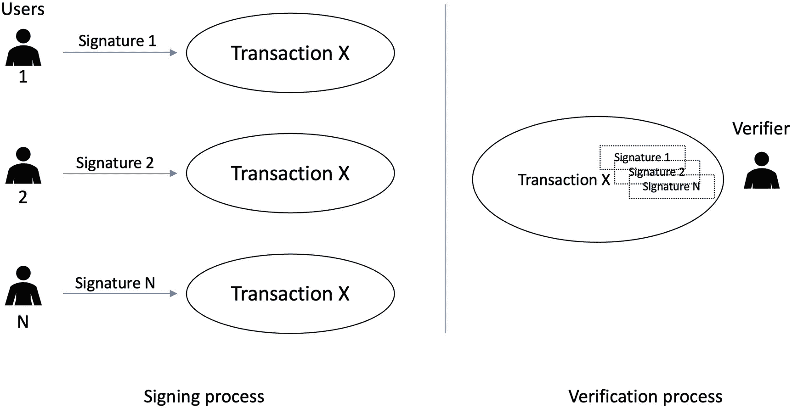

**图2-16** 多重签名方案

图2-16左侧展示了签名过程，其中`m`是不同用户的数量，他们持有`m`个唯一签名来签署单个交易。当验证者收到它时，需要逐一验证其中的所有签名。

## 门限签名

这种方案不依赖用户使用各自的密钥签署消息；相反，它只需要一个公钥和一个私钥来生成数字签名。在多重签名方案中，签名的消息包含所有签名者的数字签名，要求验证方逐一验证，但在门限签名中，验证者只需验证一个数字签名。该方案的核心思想是将私钥分割成多个部分，每个签名者保留其私钥份额。签名过程要求每个用户使用其各自的私钥份额来签署消息。一个特定的通信协议管理签名者之间的通信。

与多重签名相比，门限签名产生的交易规模更小，验证速度更快。然而，一个缺点是为了使门限签名生效，所有签名者必须保持在线。在多重签名方案中，签名可以异步提交。换句话说，用户可以在方便时提供签名。一个缺点是可能出现用户恶意扣留签名的情况，从而导致拒绝服务。我们也可以使用门限签名在区块链网络中提供匿名性，因为在多重签名方案中，单个签名者是无法识别的。

图2-17左侧展示了签名过程，其中`m`个不同用户持有数字签名的不同部分（份额），签署单个交易。当验证者收到它时，只需要验证一个签名。

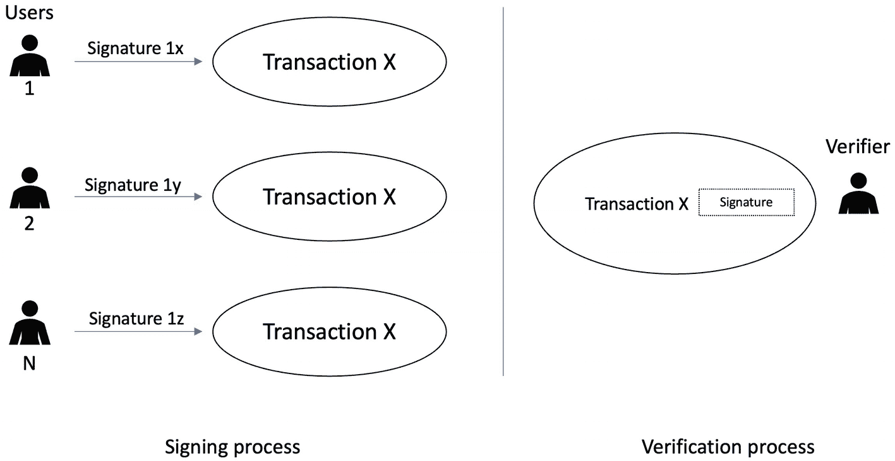

**图2-17** 门限签名

## 聚合签名

聚合签名能够减小数字签名的体积。这种方案在需要同时使用多个数字签名的场景中非常有用。其核心思想是将多个签名聚合成一个单一的签名，同时不增加单个消息签名的体积。这本质上是一种支持聚合功能的数字签名类型。

一个微小的聚合签名就足以向验证者证明，所有用户都签署了各自的原始消息。因此，聚合签名常用于网络和安全协议中，以减少消息的体积。例如，在公钥基础设施（PKI）中，我们可以通过将证书链中的所有签名压缩成一个单一签名，显著减小数字证书链的体积。`Boneh-Lynn-Shacham`（BLS）聚合签名是聚合签名的一个典型例子。BLS也已被用于各种区块链，尤其是在以太坊2.0中。

Schnorr签名是另一种基于椭圆曲线密码学的签名类型，它支持密钥和签名的聚合。与签名大小为71字节的ECDSA相比，Schnorr签名的大小仅为64字节。ECDSA的私钥大小为32字节，公钥为33字节；而Schnorr方案的私钥和公钥大小均为32字节。总体而言，Schnorr签名比ECDSA更小、更快。

图2-18展示了聚合签名的工作方式。

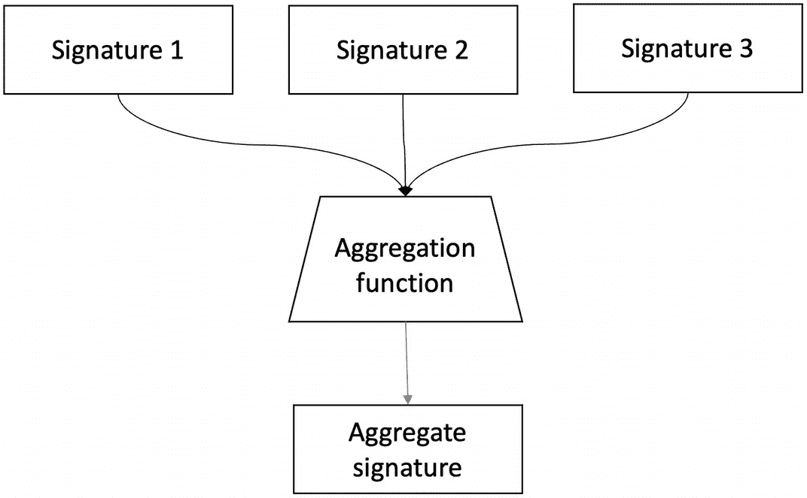

聚合签名的工作流程。签名1到3指向聚合函数，聚合函数再指向最终的聚合签名。

**图2-18**  
聚合签名

根据比特币改进提案（BIP）340，Schnorr签名计划被用于比特币。

## 环签名

环签名方案是一种机制，允许签名者群体中的任何成员代表整个群体对消息进行签名。环中的每个成员都持有公钥和私钥。这里的关键在于，实际签署消息的签名者的身份对于外部观察者来说必须是未知的（在计算上不可确定）。看起来，可信签名者群体中的任何人都有可能签署了该消息，但无法找出具体是哪个用户签署的。因此，我们可以使用环签名来提供匿名服务。

# 哈希函数

哈希函数是无密钥的基元，能够为任意长度的输入数据生成固定长度的摘要。哈希函数具有三个安全属性。

## 原像抗性

该属性也被称为单向性。可以通过一个简单的等式来解释：

```
h(x)=y
```

其中`h`是哈希函数，`x`是输入，`y`是输出的哈希值。第一个安全属性要求不能从`y`反向计算出`x`。`x`是`y`的原像，因此得名原像抗性。此属性如图 2-19 所示。

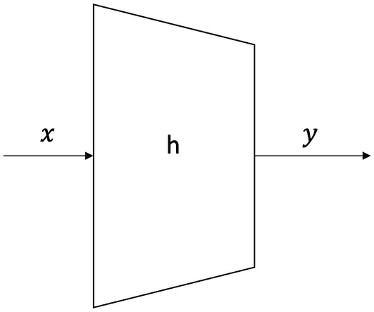

图 2-19 原像抗性

## 第二原像抗性

该属性也被称为弱抗碰撞性。此属性确保给定`x`和`h(x)`后，几乎不可能找到任何其他消息`m`，使得`m ≠ x`且`m`的哈希值等于`x`的哈希值，即`h(m) = h(x)`。此属性如图 2-20 所示。

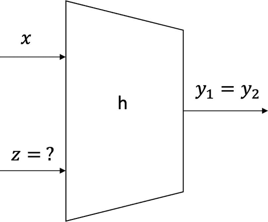

图 2-20 第二原像抗性

## 抗碰撞性

抗碰撞性要求两个不同的输入消息不应哈希到相同的输出。换句话说，`h(x) ≠ h(z)`。图 2-21 展示了抗碰撞性。

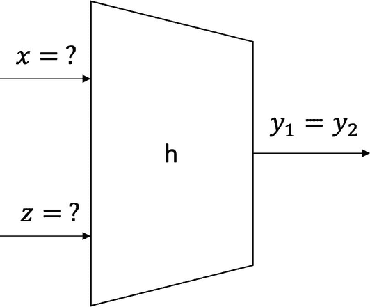

图 2-21 强抗碰撞性

此外，哈希函数还有两个功能性属性：

-   将任意大小的数据压缩成固定长度的摘要
-   易于计算

哈希函数由于其特性，总是可能存在碰撞，即两个不同的消息哈希到相同的输出。但在一个良好的哈希函数中，找到碰撞在计算上应该是不可行的。

此外，哈希函数还应具备一个特性：输入文本的微小变化，哪怕只更改一个字符，也应产生完全不同的哈希输出。这被称为雪崩效应。

哈希函数通常采用迭代哈希函数方法设计，即将输入数据划分为大小相等的块，然后通过压缩函数对其进行迭代处理。

下面列出了一些使用迭代方法构建哈希函数的著名方案：

-   Merkle-Damgard 结构
-   海绵结构

最常见的哈希函数方案有 SHA-0、SHA-1、SHA-2、SHA-3、RIPEMD 和 Whirlpool。

## 安全哈希算法（SHA）的设计

在本节中，我们将介绍 SHA-256 和 SHA-3 的设计。它们分别用于比特币和以太坊。但需要注意的是，以太坊使用的是 Keccak（最初提交给 NIST 的原始算法），而非 NIST 标准的 SHA-3。NIST 在经过一些修改（如增加轮数和简化消息填充）后，将 Keccak 标准化为 SHA-3。

### SHA-256 的设计

SHA-256 的输入消息大小限制为`2⁶⁴ − 1`位。其块大小为 512 位，字长为 32 位。输出是一个 256 位的摘要。

压缩函数处理一个 512 位的消息块和一个 256 位的中间哈希值。该函数有两个主要组成部分：压缩函数和消息调度。

该算法按以下九个步骤工作。

#### 预处理

-   消息填充：当消息长度小于所需的 512 位块大小时，对其进行填充以使其长度达到 512 位。
-   将消息解析为消息块：确保消息及其填充被划分为多个 512 位的等长块。
-   设置初始哈希值：该值由八个 32 位字组成，这些字是通过取前八个素数平方根的小数部分的前 32 位而获得的。这些初始值是固定的，用于初始化整个过程。它们提供了一定程度的信心，确保算法中不存在后门。

#### 哈希计算

每个消息块按顺序处理，需要 64 轮来计算完整的哈希输出。每一轮使用略有不同的常数，以确保没有两轮是相同的。

-   进行消息调度准备。
-   初始化八个工作变量。
-   压缩函数执行 64 次。
-   计算中间哈希值。
-   最后，重复步骤 5 到 8 直到处理完输入消息中的所有块（数据块）后，通过连接中间哈希值生成输出哈希。

在高层次上，SHA-256 可以用图 2-22 来可视化。

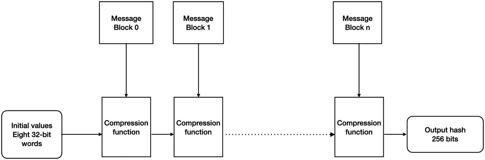

图 2-22 SHA-256 高级概述

如图 2-22 所示，SHA-256 是一种 Merkle-Damgard 结构，它将输入消息划分为大小相等的 512 位块。初始哈希值，或称初始化向量，由八个 32 位字（即 256 位）组成，与第一个消息一起输入压缩函数。后续块依次输入压缩函数，直到处理完所有块，生成输出哈希。

SHA-256 的压缩函数如图 2-23 所示。

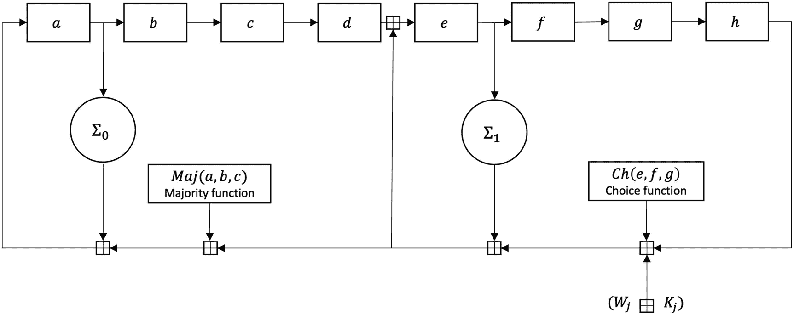

图 2-23 SHA-256 压缩函数的一轮

在图 2-23 中，`a`, `b`, `c`, `d`, `e`, `f`, `g`, 和`h`是八个工作变量的寄存器。`Maj`和`Ch`是按位应用的函数。`Σ[0]`和`Σ[1]`执行按位旋转。轮常数`W[j]`和`K[j]`被添加到哈希函数的主循环（压缩器函数）中，该循环执行 64 次。

### SHA-3 (Keccak) 的设计

SHA-3 的结构与 SHA-1 和 SHA-2 截然不同。SHA-3 基于无密钥排列，而不是其他使用有密钥排列的典型哈希函数结构。Keccak 也没有使用哈希函数中常用的、用于处理任意长度输入消息的 Merkle-Damgard 变换。相反，Keccak 采用了一种较新的方法，称为海绵与挤压结构。它是一种随机排列模型。

SHA-3 的不同变体已被标准化，例如`SHA3-224`, `SHA3-256`, `SHA3-384`, `SHA3-512`, `SHAKE128`和`SHAKE256`。此外，`SHAKE128`和`SHAKE256`是可扩展输出函数（XOFs），它允许将输出扩展到任意所需长度。

图 2-24 展示了 SHA-3 或 Keccak 所基于的海绵与挤压模型。类似于海绵，数据（`m`输入数据）在应用填充后首先被“吸收”到海绵中。然后，使用异或将其改变为置换状态的一个子集，最后，将输出从代表转换状态的海绵函数中“挤压”出来。比率`r`是海绵函数的输入块大小，而容量`c`决定了安全级别。

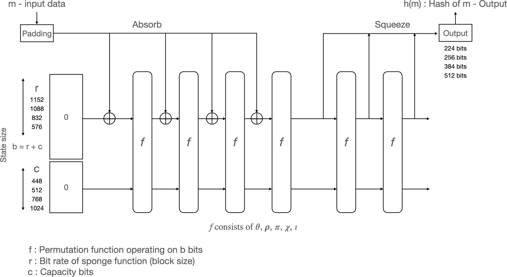

图 2-24 SHA-3 吸收与挤压函数

在图 2-24 中，状态大小`b`通过将比特率`r`和容量比特`c`相加来计算。`r`和`c`可以是任何值，只要`r + c`的大小为 25、50、100、200、400、800 或 1600。该状态是一个三维位矩阵，初始设置为 0。数据`m`在应用填充后，通过异或运算逐块进入吸收阶段。

表 2-1 显示了在`r + c = 1600`的最高效设置下，为实现所需输出哈希大小所需的比特率`r`（块大小）和容量`c`的值。

**表 2-1** SHA-3 支持的比特率和容量

| - | 比特率 `r`，块大小 | 容量 `c` | 输出哈希大小 |
| :--- | :--- | :--- | :--- |

函数`f`是一个置换函数。它包含五种变换操作，名为 Theta、Rho、Pi、Chi 和 Iota，描述如下：

-   `θ` - `Theta`：对状态中的位进行异或，用于混合。
-   `ρ` - `Rho`：执行位旋转的扩散函数。
-   `π` - `Pi`：扩散函数。
-   `χ` - `Chi`：对每个位进行异或，按位组合。
-   `ι` - `Iota`：与轮常数组合。

关键思想是应用这些变换来实现雪崩效应，这确保了即使输入中发生微小的变化，输出也会发生巨大的变化。这五种操作组合在一起构成一轮。在 SHA-3 标准中，轮数为 24 轮，以达到所需的安全级别。

# 消息认证码

消息认证码（MACs）用于在密码系统中提供认证服务。MACs 有时被称为密钥哈希函数，我们可以使用它们来提供消息完整性和数据源认证。MACs 可以使用分组密码或哈希函数来构建。

图 2-25 展示了一个 MAC 操作，其中发送方将认证标签`T`附加到消息`M`上。MACs 是对称密码原语，使用发送方和接收方之间的共享密钥。发送方使用此密钥生成认证标签，而接收方使用相同的密钥进行验证。MAC 函数将密钥和消息`M`作为输入，并生成认证标签`T`。

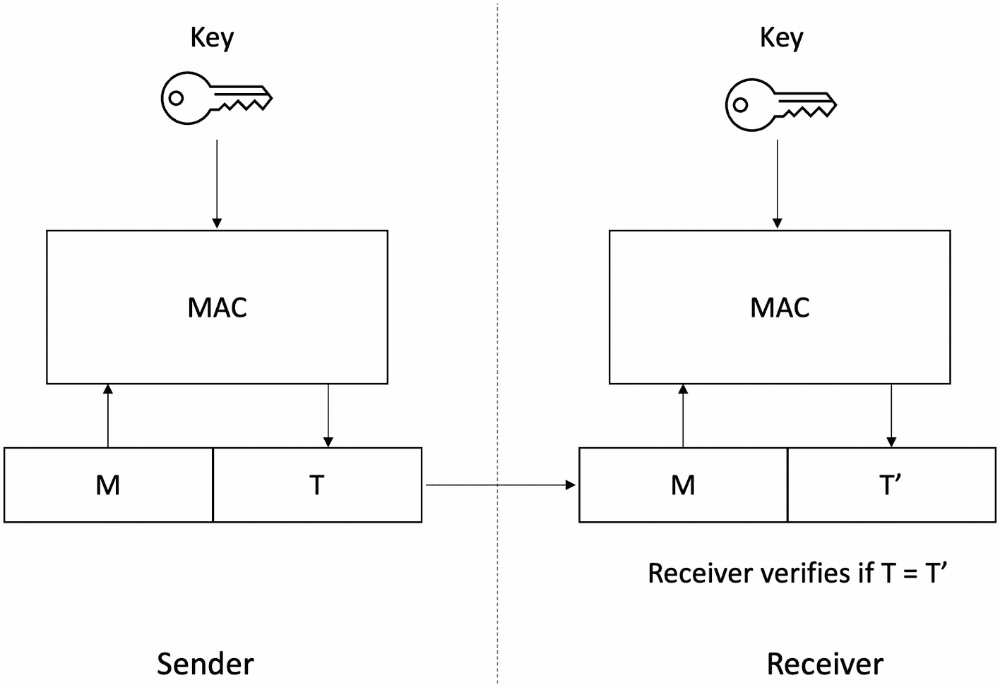

图 2-25 MAC 函数的操作

`T`和`M`被发送给接收方，接收方运行相同的过程并将`T`与`T'`进行比较，`T'`是验证者通过应用相同的 MAC 函数生成的，如果它们匹配，则验证成功。

## 基于哈希的 MACs (HMACs)

与哈希函数类似，基于哈希的 MACs（HMACs）产生固定长度的输出，并以任意长的消息作为输入。在这种方案中，发送方使用 MAC 对消息进行签名，接收方使用共享密钥对其进行验证。密钥与消息一起使用秘密前缀法或秘密后缀法进行哈希处理。对于秘密前缀法，密钥与消息连接，即密钥在前，消息在后；而对于秘密后缀法，密钥在消息之后，如下所示：

```
Secret prefix: M = MAC_k(x) = h(k || x)
```

```
Secret suffix: M = MAC_k(x) = h(x || k)
```

两种方法各有利弊。两种方案都曾出现过一些攻击。HMAC 构造方案使用`ipad`（内部填充）和`opad`（外部填充）进行填充，这在某些假设下被认为是安全的。

哈希函数的各种重要应用用于点对点网络和区块链网络，例如 Merkle 树、Patricia 树、Merkle Patricia 树以及分布式哈希表。

接下来将讨论一些最新的进展，例如可验证延迟函数。

# 可验证延迟函数

可验证延迟函数（VDF）是一种密码学原语，其求值需要执行**按序**的多个步骤（消耗大量时间），但验证过程却非常快速高效。求值过程必须按序进行，即使采用并行计算，也必须花费指定的时间量。但验证过程是高效的。VDF 在分布式网络中有多种应用，例如，它们可以用作随机信标，按固定间隔发布随机、不可预测且不可操纵的值。随机信标可用于构建随机领导者选举算法。VDF 在多方计算、无需许可共识以及事件时间戳领域也有应用。

形式上，VDF 可以定义如下。一个 VDF 涉及三个程序：

-   `setup(λ, t)` → `pp`，其中`λ`是安全参数，`t`是时间参数，例如，十分钟的延迟。
-   `evaluate(pp, x)` → `y`, `π`，其中`x`是输入，`pp`是公共参数，`y`是输出，`π`是证明。根据具体构造的不同，`π`可以是可选的。
-   `verify(pp, x, y, π)` → {`true`, `false`}，其输出`true`或`false`，指示检查输出正确性的验证成功或失败。

VDF 有两个安全属性：唯一性和顺序性。唯一性确保 VDF 为每个输入`x`产生的输出`y`是唯一的。顺序性属性确保强制实施了延迟参数`t`。

图 2-26 展示了 VDF 的操作流程。

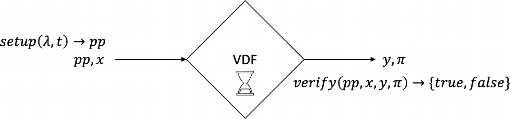

VDF 的示意图。sigma 的`设置`、`t`作为 VDF 的输入，`y`、`pi`作为输出。对所有参数执行验证函数。

图 2-26 – VDF 的操作流程

关于如何构造 VDF 有许多方案。一些方法包括使用硬件飞地，在飞地内存储加密密钥，并使用这些密钥来生成 VDF。另一种构造可验证延迟函数的方法是使用哈希函数，将输出迭代地再次作为输入，以形成哈希链。使用哈希函数迭代地创建哈希链是一个按序处理的过程，并且需要时间；因此它可以作为 VDF 的求值函数。另一种越来越流行的方法是代数构造，其中使用被认为具有未知阶数的有限循环群。

VDF 在区块链中有许多创新应用，包括构建共识算法，以及作为可验证随机性和领导者选举的来源。当我们在第 8 章讨论相关共识协议时，你将详细探索这些应用。

# 可验证随机函数

可验证随机函数（VRF）是一种伪随机公钥函数，它提供了一种证明，表明其生成的输出是正确计算得出的。私钥所有者生成函数的证明和输出，该输出可通过公钥公开验证，以确定该值确实是正确计算的。VRF 在共识算法和区块链中有许多应用，例如，卡尔达诺（Cardano）和波卡（Polkadot）在区块生成机制中使用了 VRF。它们也被用于在链上提供可验证的随机性，例如，在 Chainlink 的情况下。

# 总结

-   密码学是关于秘密通信的科学。
-   对称密钥密码学和非对称密码学是密码学的两大类别。
-   椭圆曲线密码学在区块链和相关共识协议中找到了主要应用，其中通常使用 ECDSA 对区块和交易进行数字签名。
-   哈希函数为任意长度的输入创建固定长度的消息摘要。
-   MAC 是用于消息认证的消息认证码。
-   数字签名提供不可否认性、完整性和认证服务。
-   认证协议用于分布式系统以提供实体认证。
-   混合加密方案结合了公钥和对称密钥密码学，以实现性能和安全。
-   可验证延迟函数是需要时间求值但能快速验证的函数，在共识协议和区块链中有许多应用。
-   VRF 是基于公钥的函数，可生成可验证的正确输出。