# 3. 分布式共识

共识是分布式计算中的一个基本问题。本章将涵盖共识问题的基础知识，并讨论一些历史，包括拜占庭将军问题、共识的构建模块，以及我们如何在分布式系统中解决这个问题。

由于容错是分布式系统的一个基本要求，几种原语引入了容错机制。容错广播算法允许开发容错应用程序。共识使进程即使在发生故障时也能达成共同决策。这两个主题在学术界和工业界都得到了充分研究。

在深入讨论共识和协定问题之前，让我们先回顾一些构建模块，这些模块延续自第 1 章中与共识和协定问题密切相关的链接抽象。

## 广播原语

在前面的第 1 章中，我们学习了在点对点或一对一场景下，进程之间传递消息的链接。这种一对一通信（也称为单播）非常常见，并应用于客户端-服务器架构中。例如，Web 服务器向后端数据库发起请求，就可以看作这类双向连接的一个实例。这里有一个发送者和一个特定的接收者，分别对应 Web 服务器和后端数据库。

然而，在许多涉及多个节点的场景中，客户端-服务器类型的方案并不足够。此外，在很多情况下，一对一通信是不够的，我们需要使用某种能够同时向多个节点或一组节点发送消息的机制。在这种情况下，我们会使用广播协议。

广播协议允许一个进程向分布式系统中的所有进程（包括自身）同时发送一条消息。

在本节中，我们将探讨广播抽象。其中可能涉及多个发送者和接收者。广播抽象确保各进程就它们所传递的消息达成一致。

广播抽象可以通过图 3-1 的可视化方式进行解释。

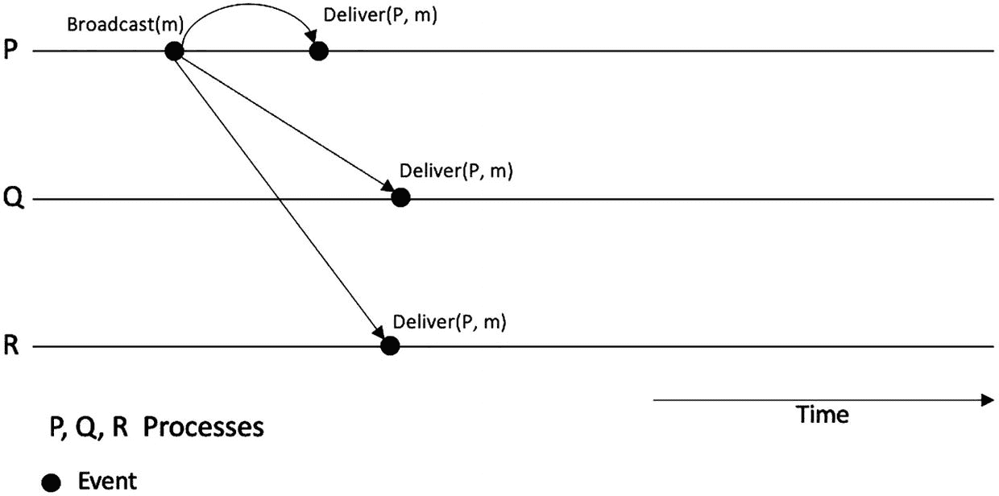

一张广播抽象示意图，包含 P、Q、R 三条水平线。线上标记了广播和传递事件。

**图 3-1** – 一个节点广播消息`m`，所有三个节点都传递了该消息

注意，发送与接收和广播与传递之间存在区别。发送和接收用于点对点链接的上下文中，而广播和传递则用于广播抽象中，此时消息被广播到多个/所有节点。

第 1 章讨论的点对点链接与发送和接收原语相关联，其中节点发送消息，接收节点接收它们。

具有广播和传递原语的广播抽象描述了一种场景：节点向网络中的多个/所有节点发送消息，节点接收它们，但在这里，广播算法可以在接收后存储并缓冲消息，然后稍后再将其传递给进程。这取决于广播算法（也称为中间件）。例如，在全序广播中，运行在每个进程上的广播算法可能会收到消息，但会将其缓冲，直到满足条件后再将消息传递给应用程序。

图 3-2 中的示意图直观地展示了这一概念。

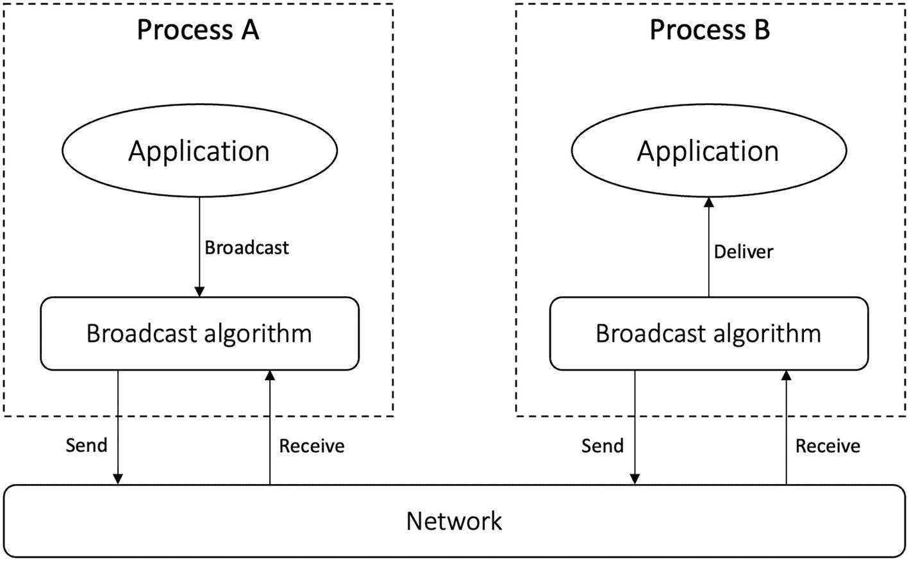

一张示意图，包含进程 A 和 B 两列。应用程序向算法广播（图中 a 部分），广播算法向应用程序传递（图中 b 部分）。

**图 3-2** – 发送与接收以及广播与传递

通信发生在一组节点内，节点数量可能是静态的，也可能是动态的。一个进程发送消息，组内所有节点就消息达成一致并传递它。如果单个处理器或部分处理器发生故障，其余节点仍能继续工作。广播消息的目标是所有进程。

广播抽象使得开发容错应用程序成为可能。有以下几种类型，如下所述。

### 尽力而为广播

在这种抽象中，仅当发送进程没有失败时，可靠性才得到保证。这是最弱形式的可靠广播。尽力而为广播具有三个属性。

#### 有效性

如果消息`m`由正确的进程`p`广播，那么消息`m`最终会被每个正确的进程传递。这是一个活性（liveness）属性。

#### 无重复

每条消息仅被传递一次。

#### 无凭空创建

如果某个进程传递了一条发送者为进程`p`的消息`m`，那么`m`之前必须是由发送者进程`p`广播的。换句话说，消息不会凭空产生。图 3-3 描绘了尽力而为广播的一次执行过程。

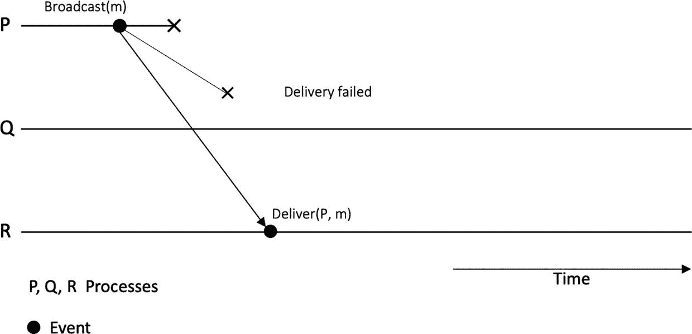

一张尽力而为广播示意图，包含 P、Q、R 三条水平线。线上标记了广播、传递失败和传递事件。

**图 3-3** – 尽力而为广播 – 示例场景

在图 3-3 中，注意进程`p`广播了消息但随后崩溃了，根据系统属性，在这种情况下不保证消息的传递。请注意，进程`q`没有传递该消息，因为我们的进程`p`不再正确。然而，进程`R`传递了它。如图 3-3 所示，如果发送者失败，此抽象不保证消息传递。在某些进程可能传递消息而其他进程可能不传递的情况下，会导致不一致。可以想象，这种抽象在某些要求更严格的场景中可能不太有用。我们需要比这更健壮的协议。为了解决这些限制，我们使用可靠广播抽象。

### 可靠广播

可靠广播抽象引入了一个额外的活性（liveness）属性，称为一致性（agreement）。无重复和无凭空创建属性与尽力而为广播抽象保持一致。有效性属性略有弱化。正式地，有效性和一致性属性可以描述如下。

#### 有效性

如果消息`m`由正确的进程`p`广播，那么`p`自身最终会传递`m`。

### 一致性

如果消息`m`被一个正确的进程传递，那么每个正确的进程都会传递`m`。

#### 备注

如果发送者进程在广播时崩溃，并且未能将消息发送给所有进程，一致性属性确保没有进程会传递该消息。可能某些进程已经接收到了消息，但可靠广播确保除非就传递达成一致，否则没有进程会传递它。换句话说，如果发送者进程崩溃，可靠广播确保要么所有正确的节点最终都能传递该消息，要么没有节点传递该消息。

如果发送者进程失败，此属性确保所有正确的节点要么都收到消息，要么都没有收到消息。这一属性是通过让正确的进程重新传输任何丢失的消息来实现的，这最终会导致消息被传递。

这个方案看起来足够合理，但可能存在这样的情况：广播进程可能已经能够向自身传递消息，但在能够发送给其他进程之前就崩溃了。这意味着所有正确的进程将一致同意不传递该消息，因为它们没有收到它，但原始广播者已经传递了它。这种情况可能导致安全问题。

为了解决这个限制，我们使用提供更强保证的**统一可靠广播**。

### 统一可靠广播

在统一可靠广播中，虽然所有其他属性（如有效性、无重复和无凭空创建）与尽力而为广播相同，但我们之前在可靠广播抽象中看到的一致性属性有了更强的概念。引入它是为了确保即使在发送者进程可能失败的情况下也能实现一致性。这个属性被称为**统一一致性属性**。

#### Uniform Agreement

如果消息`m`被进程`p`投递，则每个正确的进程最终都会投递`m`。`p`可以是正确进程，也可以是故障进程。

在上述所有讨论的抽象中，缺少了一个在许多分布式服务中至关重要的元素。例如，设想一个在线聊天应用场景：用户 1 发送消息“England has won the cricket match”，用户 2 回复“congratulations”，用户 3 说“But I wanted Ireland to win”。在聊天应用中，消息预期出现的顺序是：

- **用户 1**: England has won the cricket match
- **用户 2**: congratulations
- **用户 3**: But I wanted Ireland to win

然而，如果没有对消息投递顺序施加任何约束，即使用户 1 的消息是第一个发送的，在应用（对终端用户）中消息也可能显示为：

- **用户 2**: congratulations
- **用户 3**: But I wanted Ireland to win
- **用户 1**: England has won the cricket match

这显然不是预期的顺序；缺少赢得比赛这一背景的“congratulations”消息会令人困惑。这正是通过在广播抽象上施加顺序保证所解决的问题。

> 注意：我们在第 1 章讨论了因果性和“happens-before”关系；如果需要回顾，请参考该章节。

现在我们将讨论四种具有不同严格程度顺序保证的抽象：`FIFO`可靠广播、因果可靠广播、全序可靠广播以及`FIFO`全序广播。

#### FIFO 可靠广播

该抽象在可靠广播之上施加了先进先出的投递顺序。这意味着消息按照发送进程发送它们的顺序被投递。

在此抽象中，所有属性与可靠广播保持一致；但引入了一个新的`FIFO`投递属性。

##### FIFO 投递

如果某个进程先后广播了两条消息`m1`和`m2`，那么任何正确的进程不会在`m1`之前投递`m2`。换句话说，如果同一进程在`m2`之前广播了`m1`，则除非该正确进程已先投递了`m1`，否则不会投递`m2`。但此保证仅适用于`m1`和`m2`由同一进程广播的情况；如果由两个不同进程广播消息，则无法保证它们的投递顺序。

在实践中，`TCP`是`FIFO`投递的一个例子。如果你的用例需要`FIFO`投递，可以直接使用`TCP`。

### 因果可靠广播

该抽象在可靠广播之上施加了因果投递顺序。这意味着如果一条消息的广播发生在另一条消息广播之前，那么每个进程都会按相同顺序投递这两条消息。在两个消息可能被并发广播的场景中，进程可以按任意顺序投递它们。

### 全序可靠广播或原子可靠广播

该抽象通常简称为**全序广播**或**原子广播**。全序广播具有以下四个属性。

#### 有效性

如果正确进程`p`广播了消息`m`，那么某个正确进程最终会投递`m`。

### 一致性

如果消息`m`被一个正确进程`p`投递，那么所有正确进程最终都会投递`m`。

#### 完整性

对于任何消息`m`，每个进程最多投递`m`一次，且仅当`m`之前已被广播。在文献中，此属性有时被分为两个独立属性：**无重复**（任何消息不会被投递多次）和**无创建**（已投递的消息必须由发送进程广播）。换句话说，没有消息会凭空产生。

#### 全序

在此属性下，如果在一个进程中消息`m1`在`m2`之前被投递，那么在所有进程中`m1`都在`m2`之前被投递。

### FIFO 全序广播

这一抽象结合了 FIFO 广播和全序广播两种特性。

全序可以通过单一领导者（即序列器方法）或使用 Lamport 时钟来实现，但这些方法都**不具有容错性**。如果领导者宕机，序列化将无法进行；而在 Lamport 时钟方案中，如果任一节点发生故障，全序也无法得到保证。如何在全序广播中引入容错性，以自动选择新的领导者，正是通过共识协议来研究和解决的问题。从根本上看，共识协议要解决的问题就是在发生故障时选举新的领导者。这是共识协议背后的核心动机。我们将在本章后续内容中进一步探讨全序广播的细节，以及它与状态机复制、容错性和共识协议之间的关系。

到目前为止，我们所讨论的抽象机制只能适用于进程数量较少的场景。想象一下，一个分布式系统跨越多个大洲，有数千个节点参与其中。那么，目前所介绍的这些抽象机制，是否足以高效应对由数千个异构且分散的节点带来的通信复杂性？答案是否定的。为了满足此类需求，我们需要开发概率性协议。再设想另一种场景：由一个单一节点负责向 1000 个节点发送消息。即便我们能借助某些硬件支持或其他方法将消息发送给这 1000 个节点，但当这个单一发送节点需要接收来自这 1000 个节点的确认消息时，问题就会变得极其复杂。这个问题被称为**确认风暴**。关键就在于我们如何避免此类问题。

再设想另一种情况：一个节点通过可靠链路向所有其他节点逐一发送了消息，但在传输过程中，发往某些节点的消息丢失了。此时，发送进程发生了故障，从而导致无法进行重传。结果，那些未能接收到消息的节点将永远无法收到这些消息，因为发送进程已经崩溃。在这种情况下，我们该如何提高可靠性呢？我们可以设计一种方案：一旦某个节点首次接收到一条消息，它便通过可靠信道再次将该消息广播给其他节点。这样一来，即使某些节点发生崩溃，所有正常节点也都能接收到全部消息。这被称为**急切可靠广播**。急切可靠广播是可靠的，但对于 *n* 个节点，它会产生 *O*(*n*) 个步骤和 *O*(*n*)² 条消息。

图 3-4 直观展示了急切可靠协议。

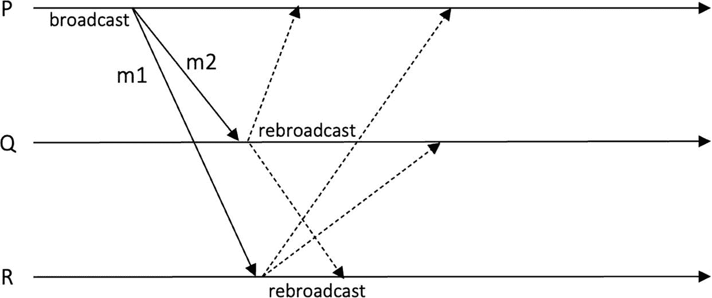

一个关于急切可靠广播的示意图，包含 P、Q、R 三条线。P 向 Q 和 R 广播。R 向 Q 和 P 重新广播。Q 向 P 重新广播。

图 3-4

急切可靠广播

此外，还有一些其他算法，我们可以称之为*受自然启发*的算法。例如，思考一下传染病或谣言是如何传播的。一个人感染另外几个人，然后这些人再去感染其他人，感染率会迅速上升。现在，如果广播协议基于这种原理来设计，那么它就能非常高效地在整个网络中快速传播信息（消息）。由于这些协议本质上是随机化协议，它们并不能保证所有节点都一定能收到某条消息，但通常所有节点最终都能收到所有消息的概率非常高。概率性协议或 gossip 协议常用于点对点网络。基于这种传播方式，已经设计出了许多协议。

图 3-5 展示了 gossip 协议的工作原理。其核心思想是：当一个节点首次接收到一条消息时，它会将该消息转发给随机选择的几个其他节点。这种技术对于向众多节点广播消息非常有用，消息最终能以很高的概率到达所有节点。

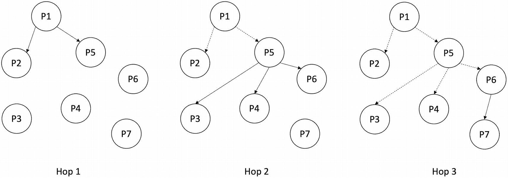

一组 3 个树状图，分别标记为跳 1、跳 2 和跳 3，用于说明 gossip 协议。每个图表都有从 P1 到 P7 的节点，分为 4 层。

图 3-5

Gossip 协议

概率性广播抽象可以定义为一个具有两个属性的抽象。

#### 概率有效性

如果一个正确进程 p 广播了一条消息 m，那么每个正确进程最终以概率 1 交付该消息。

#### 完整性

任何消息最多被交付一次，并且被交付的消息之前一定是由某个进程广播的——换句话说，不存在重复消息，也不会凭空产生消息。

### 广播与共识之间的关系

尽力而为广播是最弱的广播模型。通过添加额外的属性和要求，我们可以实现更强的广播模型，如图 3-6 所示。

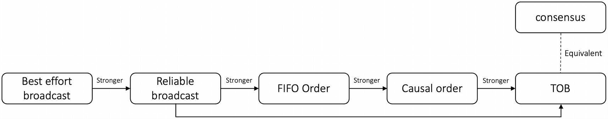

一个关于广播关系的流程图。流程如下：尽力而为广播与可靠广播；FIFO 广播与因果序广播；全序广播；以及共识。

图 3-6

广播关系——从最弱到最强——以及共识等价性

至此，我们完成了对广播协议的讨论。接下来，我们将转向协商抽象，这是分布式计算中最基本的问题之一。

首先，我将解释什么是协商，然后我们将以此基本概念为基础，引出共识问题。

## 协商

在分布式系统中，进程间的协商是一项基本需求。存在许多场景需要进程达成一致，以便分布式系统能够实现其目标。例如，在广播抽象中，进程之间需要就消息的交付达成协商。

存在多种不同的协商问题，我们将在下文介绍其中最突出的几种，然后更深入地关注共识问题。

我们已经介绍过可靠广播和全序广播。在本节中，我将简要补充一些关于可靠广播和全序广播的要点；然后，我们将探讨拜占庭协商和共识。

### 可靠广播

可靠广播能够确保即使在发送进程发生故障的情况下依然可靠。换句话说，无论发送者是否正确，可靠性都是有保障的。

### 全序广播

全序广播保证了可靠性和在所有节点上一致的投递顺序。全序广播可以通过单领导者方法实现，即指定一个节点作为领导者。所有消息都通过这个领导者，由它建立消息的共同顺序。消息首先发送给领导者，然后领导者使用 FIFO 广播机制进行广播。然而，在这种情况下，问题在于如果领导者崩溃，则无法投递任何消息。那么问题就变成了如何在保证算法安全性的前提下更换失效的领导者。

如果负责建立共同投递顺序的当选领导者失效，节点必须选举一个新的领导者。现在的问题变成了选出一个新的诚实领导者，并就新领导者的选择达成一致。同样，节点现在必须达成协议，而问题也变成了就新领导者达成一致，而非就投递顺序达成一致。无论哪种情况，节点都必须运行某种协议。

此外，我们之前发现，使用软件事件计数器和进程标识符的 Lamport 时钟可以实现全序。结合 FIFO 链接和全序中的时间戳，Lamport 时钟实现全序在直觉上是合理的，但在实际应用中可能具有挑战性。例如，如果一个节点宕机，那么整个协议就会停止。

单领导者（排序器/定序器方法）和 Lamport 时钟都不具备容错性。我们很快会看到对此有什么解决办法。全序广播和共识是不同的两个问题，但它们彼此相关。如果你解决了共识问题，那么你就能解决全序问题，反之亦然。

全序广播也称为原子广播，因为它确保消息要么被投递给所有进程，要么完全不投递。全序广播的这种原子性（全有或全无）使其成为原子广播协议，因此得名原子广播。

### 拜占庭协议问题

拜占庭协议问题可以通过三种不同的方式定义：拜占庭将军问题、交互一致性问题和共识问题。

#### 基础拜占庭将军问题（BGP）

有一个被称为源进程的指定进程，它拥有一个初始值。该问题的目标是与其他进程就源进程的初始值达成一致。需要满足三个条件：
*   **一致性**：所有诚实进程就同一值达成一致。
*   **有效性**：如果源进程是诚实的，所有诚实进程决定（达成一致）的值与源进程的初始值相同。
*   **终止性**：每个诚实进程最终都必须决定一个值。

这个问题本质上是一个广播原语，其中指定进程从一个初始值（输入）开始，而其他进程没有输入（初始值）。当算法终止时，所有进程就（输出）同一个值达成一致。解决拜占庭将军问题的关键在于，发送方进程可靠地将其输入发送给所有进程，以便所有进程输出（决定）相同的值。

#### 交互一致性问题

在交互一致性问题中，每个进程都有一个初始值，所有正确进程必须就一组值（向量）达成一致，其中每个进程都有一个对应的值。要求如下：
*   **一致性**：所有诚实进程就相同的值数组（向量）达成一致。
*   **有效性**：如果一个正确进程决定了一个向量 `V`，并且进程 `P1` 是正确的，且其输入值为向量中的 `V1`，那么 `V1` 对应于向量 `V` 中的 `P1`。
*   **终止性**：每个正确进程最终都会做出决定。

#### 共识问题

在共识问题中，每个进程都有一个初始值，所有正确进程就单个值达成一致：
*   **一致性**：所有进程就同一个值达成一致；没有两个进程决定不同的值。
*   **有效性**：决定的值必须是某个进程提出的值。
*   **完整性**：一个进程最多只能决定一次。
*   **终止性**：每个诚实进程最终都会决定一个值。

有效性和一致性是安全性属性，而终止性是活性属性。

图 3-7 直观地展示了共识的样子。图中没有太多内容，但它直观地描绘出来，有助于构建共识在头脑中的模型。
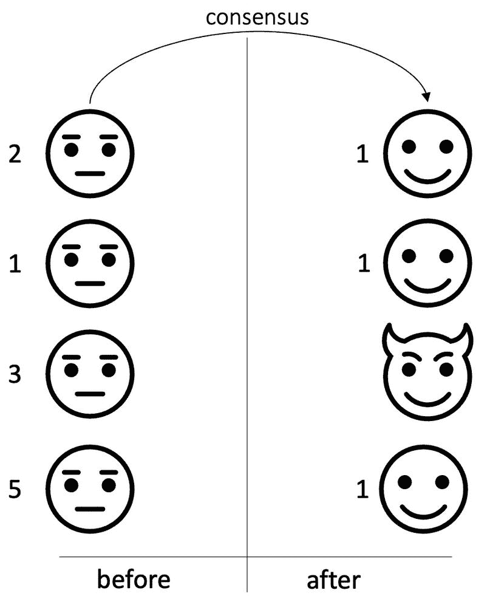

根据系统模型和故障模型的不同，共识问题有多种变体。

上述共识问题称为统一共识，其中一致性属性是严格的，不允许崩溃的进程决定不同的值。

共识的另一个变体是非统一共识。在非统一共识中，一致性属性被弱化，允许崩溃的进程决定一个不同的值。

我们可以将统一共识的一致性属性表述为：
*   **一致性**：没有两个诚实进程决定不同的值。

现在，如果我们除了弱化一致性属性之外，还加强有效性属性，我们就实现了拜占庭容错共识。在这种情况下，有效性属性变为：
*   **有效性**：一个诚实进程决定的值必须是某个诚实进程提出的值。

第一个变体，即有效性属性较弱且一致性也较弱的情况，可以归类为崩溃容错共识。

满足所有这些安全性和活性属性的算法被称为正确算法。在无故障的同步系统中解决共识问题并不困难；然而，在易出故障的系统中，这个问题就变得困难了。故障和异步性使得解决共识问题成为一个复杂的问题。

二元共识是一种简单的共识类型，其输入受到限制，因此决策值被限制为单个比特，要么是 0，要么是 1。多值共识是一种共识类型，其目标是就多个值达成一致，即随时间变化的一系列值。

虽然二元共识起初看起来可能不是一个非常有用的结构，但二元共识问题的解决方案会引出多值共识的解决方案；因此，它是一个重要的研究领域。

## 共识属性定义

共识属性的定义可能因应用而异。例如，在区块链共识协议中，`validity` 属性的定义通常与既定定义不同，且可能采用较弱的变体。例如，在 `Tendermint` 共识中，有效性属性简单地表述为：“一个被决定的值是有效的，即它满足预定义的谓词 `valid()`”。这可以是特定于应用的条件。例如，在区块链背景下，可能要求添加到 `Bitcoin` 区块链的新块必须具有一个通过节点验证检查的有效块头。在其他变体中，`valid()` 谓词要求与“如果所有诚实进程都提议同一个值，那么所有进程都决定该值”这一条件可以结合。这是有效性谓词与传统有效性条件的结合。存在多种变体和不同的定义，有些严格，有些则不严格，这取决于具体应用。我们将在本书中涵盖区块链共识及相关共识协议，并在所讨论的共识算法和故障模型的背景下定义和重新定义这些要求。

共识协议如果是`崩溃容错（CFT）`的，则它能容忍一定阈值内的良性故障。共识协议如果是`拜占庭容错（BFT）`的，则它能容忍任意故障。为了实现崩溃容错，底层分布式网络必须满足条件 `N >= 2F + 1`，其中 `N` 是网络中的节点数，`F` 是故障节点数。只有网络满足此条件，它才能继续正常工作并达成共识。如果需要容忍拜占庭故障，则条件变为 `N >= 3F + 1`。我们将在本章后面讨论不可能结果时更正式地介绍这一点。但请记住这些条件是最紧的下界。

共识问题也适用于分布式计算中的其他问题。诸如全序广播、领导者选举问题和终止性可靠广播等问题都需要就一个公共值达成一致。这些问题可以被视为共识的变体。

## 系统模型

为了研究共识和协议问题并开发解决方案，我们对分布式系统的行为做出了一些基本假设。我们在第 1 章中学习了关于节点和网络行为的许多抽象概念。在此，我们总结这些假设，并继续更详细地讨论共识问题。此处描述系统模型的原因有两个：第一，总结我们在该章中学到的关于节点和网络行为的知识；第二，将这些知识置于研究共识和协议问题的背景下。如需详细研究，请参阅第 1 章。

### 分布式系统

分布式系统是一组通过消息传递进行通信的进程。共识算法是基于对分布式系统的时序和同步行为所做的假设来设计的。这些假设被归入时序模型或同步假设中，我们将在下文描述。

### 时序模型/同步

同步假设捕捉了关于分布式系统的时序假设。处理器和通信的相对速度也被考虑在内。存在几种同步模型，简要描述如下：
- **同步系统**：其中处理器和通信延迟存在一个已知的上界，且该上界始终成立。
- **异步系统**：其中对时序不做出假设，处理器或通信延迟没有上界。这是一个有用的概念，因为基于此假设设计的协议也会自动在同步模型及其他更有利的模型中具有弹性。换句话说，在异步模型中证明正确的程序，在同步模型中自动正确。
- **部分同步**：可以通过多种方式定义：
    - 存在一个始终成立的未知上界。
    - 存在一个已知上界，该上界在某个 GST（全局稳定时间）后最终成立。
    - 存在有保证的同步周期，该周期足够长，使得可以做出决定且算法可以终止。
    - 存在一个未知上界，该上界在某个 GST 后最终成立。
    - 实用拜占庭容错（`PBFT`）引入的弱同步假设网络延迟不会无限增长超过超时时间。
    - 系统最初可以是异步的，但在 GST 之后变为同步。

通常，在实践中，关于分布式系统的时序行为会做出部分同步的假设。这一选择在区块链协议中尤其常见，大多数共识协议都是为最终同步/部分同步模型设计的，例如用于区块链的`PBFT`。当然，也有一些是为异步模型设计的，例如`HoneyBadger`。我们将在第 5 章及本书后续章节中涵盖区块链共识。目前，我将从传统角度聚焦于一般的分布式共识问题。

另外，请注意，具有拜占庭故障的异步消息传递模型表达了基于当今互联网的典型分布式系统的条件。这在诸如`Bitcoin`或`Ethereum`等公有区块链平台中尤其如此。

### 进程故障

故障模型允许我们对可能发生哪些故障以及如何处理它们做出假设。故障模型描述了故障可能发生或不发生的条件。存在多种类别，例如崩溃故障，其中进程可能崩溃停止或崩溃失败；或者遗漏故障，其中处理器可能遗漏发送或接收消息。

另一种类型的遗漏故障称为动态遗漏故障。在该模型中，系统每轮最多可能丢失一定数量的消息。但是，发生消息丢失的通道可能逐轮变化。

时序故障是指进程不符合同步假设的故障。进程可能表现出拜占庭行为，即进程可以任意或恶意地行为。在拜占庭模型中，被破坏的处理器可以复制、丢弃消息，并积极尝试破坏整个系统。我们还在此定义了一个对手模型，其中我们对可能对分布式系统产生不利影响并破坏处理器的对手做出一些假设。

在经认证的拜占庭故障中，可以通过标识来识别消息的源并检测伪造消息，通常通过数字签名实现。在此假设下发生的故障称为经认证的拜占庭故障。

消息可以是已认证或未认证的。已认证消息通常使用数字签名来允许防伪检测和消息篡改。使用已认证消息时，协议问题变得相对容易解决，因为接收方可以检测到消息伪造，并拒绝未签名或签名不正确的消息，或来自未认证进程的消息。另一方面，使用未认证消息的分布式系统难以处理，因为无法验证消息的真实性。未认证消息也称为口头消息或未签名消息。尽管困难，但这确实是关于解决共识或协议问题的一个常见假设。然而，数字签名在区块链系统中无处不在，区块链共识所基于的模型几乎总是已认证的拜占庭模型。

## 信道可靠性

人们通常假设信道是可靠的。可靠信道保证，如果一个正确的进程 `p` 向另一个正确的进程 `q` 发送了消息 `m`，那么 `q` 最终会收到 `m`。在实践中，通常是 `TCP/IP` 协议提供了这种可靠性。

另一种假设是存在损耗信道，它描述了消息可能丢失的信道概念。这种情况可能由多种原因导致，例如网络状况不佳、延迟、拒绝服务攻击、一般的黑客攻击、网络速度慢、网络配置错误、噪声干扰、缓冲区溢出、网络拥塞以及物理断连。可能还有其他许多原因，但我刚才描述了最常见的一些。

公平损耗信道有两种变体。其中一种变体对丢失消息的数量存在一个上限 `k`；而在另一种变体中（即通常所说的公平损耗信道），则不存在这样的上限。第一种变体更容易处理，算法可以重新传输消息 `k+1` 次，确保至少有一份副本被接收。在后一种变体（即公平损耗信道）中，如果发送方持续重发一条消息，只要发送方和接收方都是正确的，那么该消息最终会被送达。我们在第 1 章中更详细地讨论过这一点。

## 历史

共识问题在分布式计算领域已经被研究了几十年。在有故障的情况下达成共识，最初由 Lamport 等人在其论文《SIFT：用于飞行器控制的容错计算机的设计与分析》中提出。

后来，在同步环境下的拜占庭容错协议，最初由 Lamport 等人在其开创性论文《在存在故障的情况下达成一致》中提出。

即使单个进程崩溃失败也无法达成一致的结论，由 Fischer、Lynch 和 Paterson 证明。这一发现被广为人知地称为 `FLP` 不可能结果。

`Ben-Or` 提出了使用随机化来规避 `FLP` 的异步拜占庭容错方法。此外，`DLS 88` 针对 `BFT` 提出了部分同步的概念。

### 两将军问题

两将军悖论（或称两将军问题）由 Gray 等人在 1978 年提出。在这个思想实验中，两位将军共享一个占领山头的共同目标。条件是，如果两位将军同时行动，在同一时间发起进攻，那么胜利是有保证的。如果任何一位将军单独进攻，他们将会战败。还假设两位将军驻扎在相隔一段距离的地方，他们只能通过信使（跑步者）通信。然而，这些信使并不可靠，可能会迷路或被俘。如果一位将军向另一位将军发送消息要求进攻，例如“凌晨 0400 时进攻”，那么这条消息有可能无法送达另一位将军。假设消息没有送达第二位将军。在这种情况下，无法区分是第一位将军没有发送消息，还是信使在前往第二位将军的途中被俘。发送消息的将军不能假定他的消息已经送达，因为除非他收到第二位将军的明确确认，否则他无法确定。现在的问题是，我们能提出什么协议来就进攻计划达成一致。这种情况很棘手，因为两位将军之间没有共同知识，而知晓的唯一途径是通过不可靠的信使。

两位将军都有两个选择。他们可以不顾是否收到另一位将军的任何确认而继续行动，或者他们不这样做，而是等待直到收到另一位将军的回应（确认）。在第一种情况下，风险在于将军在未收到另一位将军回应的情况下独自前进，最终可能单独进攻并被击败。在后一种情况下，将军在收到回应之前不会行动。在这种情况下，等待确认的第一位将军是安全的，因为他只会在收到回应时才进攻。所以现在责任落到了第二位将军身上，他需要决定是独自进攻，还是等待第一位将军已收到其确认的确认。一个想到的解决方案是，如果将军们派遣大量信使，那么至少有一个信使可能抵达，但同样存在所有信使都被俘、没有消息送达的可能。例如，如果将军 1 向将军 2 发送了大量消息，但所有信使都失踪了，那么将军 2 对进攻一无所知，如果将军 1 继续前进并进攻，那么战斗就输了。

两将军问题如图 3-8 所示。
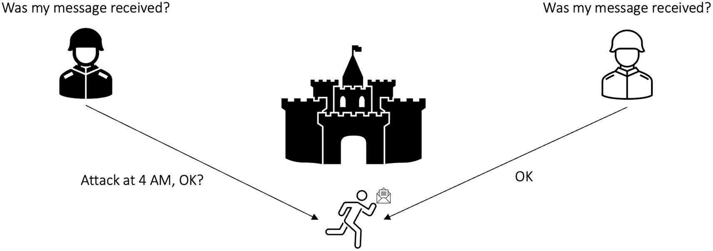

在图 3-8 中，两位将军必须就进攻时间达成一致；否则，无法获胜。

问题在于，没有哪位将军能完全确定另一位将军的承诺。如果将军 1 无论是否收到将军 2 的确认都总是进攻，那么如果所有信使都失踪，将军 1 就冒着单独进攻的风险。因为在这种情况下，将军 2 对进攻一无所知。如果将军 1 只有在收到将军 2 的肯定确认时才进攻，那么将军 1 是安全的。将军 2 处于与将军 1 相同的境地，因为现在他正在等待将军 1 的确认。将军 2 可能会认为自己安全，因为他知道将军 1 只有在将军 2 的回应被将军 1 收到时才会进攻。将军 2 现在正在等待将军 1 的确认。他们都在思考对方是否收到了自己的消息，因此就产生了悖论！

从分布式系统的角度来看，这个实验描绘了一种情况，即两个进程没有共同知识，它们能了解彼此状态的唯一途径是通过消息。

### 拜占庭将军问题

拜占庭将军问题由兰波特于 1982 年提出。在这一思想实验中，设想了这样一个场景：三个或更多军团驻扎在某城市周围，其共同目标是攻占该城。每个军团由一位将军统领，他们通过信使进行通信。只有当所有军团同时进攻时，城市才能被攻陷。

这里的要求是达成一致进攻的协议，以便所有军队能同时发动攻击，从而攻占城市。

该场景可能面临的问题包括：
- 消息可能丢失，即信使可能被俘或失踪。
- 任何将军都可能是叛徒，他们可以向其他将军发送误导性消息、扣留消息、不向所有将军发送消息、在转发消息前篡改内容，或发送相互矛盾的消息，其目的都是为了破坏将军之间的协商进程。
- 忠诚的将军也不知道谁是叛徒，但叛徒之间可以相互勾结。

这里的挑战在于：在这种情况下，能否达成协议？如果可以，采用何种协议能解决此问题？图 3-9 展示了该问题。
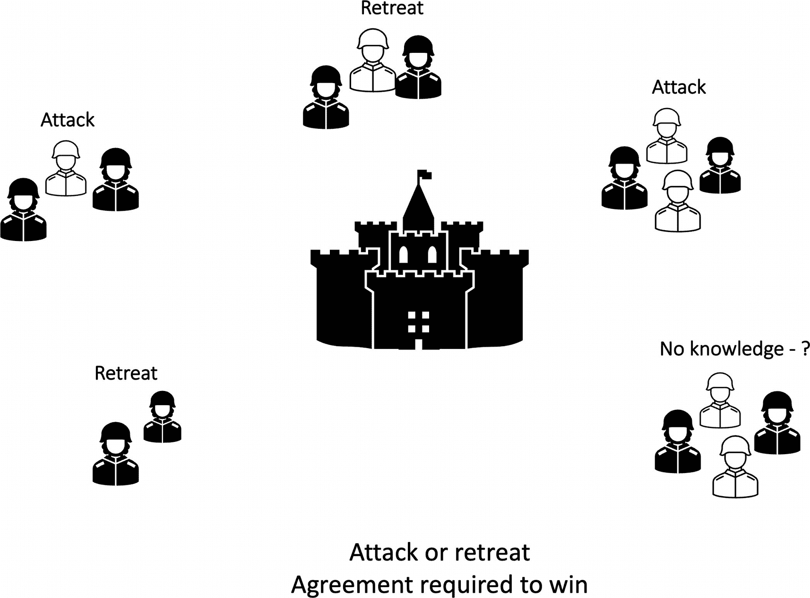

事实证明，这个问题无法解决。已有证明表明，只有当叛徒将军少于三分之一时，该问题才能得到解决。例如，如果有`3t + 1`位将军，那么最多只能有`t`位是恶意的。这是拜占庭容错的一个经过验证的下界。我们将在“不可能性结果”一节中更正式地探讨这一点，届时将讨论 `FLP`、`CFT` 下界和 `BFT` 下界。

在分布式系统中，我们可以进行类比：将军代表进程（节点），叛徒代表拜占庭进程，忠诚将军代表正确进程，信使代表通信链路，消息丢失代表信使被俘，信使到达将军处没有时间限制则代表异步性。我想你现在应该明白了吧！

## 复制

在本节中，我们将讨论复制。复制用于在多个节点上维护数据的精确副本。该技术具有若干优势。一个关键优势是容错性。最简单的复制示例之一是存储系统中的 `RAID`。例如，在 `RAID-1` 中，有两个磁盘，它们互为精确副本（镜像）。如果其中一个不可用，副本仍然可用，从而实现容错和高可用性。在分布式系统中，复制因多种原因而被使用，与 `RAID` 不同，它是在多个节点之间进行的，而不是仅在服务器内的两个磁盘之间。

此外，如果数据保持不变，复制就很容易。你只需创建数据的一次性副本，并将其存储在另一个磁盘或节点上即可。具有挑战性的部分在于，当数据不断变化时，如何保持复制的一致性。

复制有以下几个优点：
- **高可用性**，源于容错能力。例如，如果一个副本宕机，另一个副本可以继续为客户提供服务。
- **负载分布**，由于每个副本节点都是独立节点，客户端可以向不同节点发送请求（或通过负载均衡器将请求路由到负载较轻的副本——即负载均衡）。负载可以在不同副本之间进行分配，以实现更高的性能。
- **数据一致性**，意味着所有节点上都存有相同的数据副本，这有助于维护整个系统的完整性。
- **更优的性能**，通过负载均衡实现。当某些节点接近或达到满载时，负载较轻的节点可以接管请求。实现这一目标的技术有很多，这超出了本书的范围；不过，通常使用负载均衡器，它通常以轮询方式将客户端的请求路由到各个副本。这样，负载就被分散到多个副本上，而不是让单个节点承受所有访问，从而因 `CPU` 负载过高导致响应变慢。
- **数据局部性**，尤其是在地理分布式的网络中，靠近客户端的节点可以提供服务请求，而不是仅有一个位于遥远数据中心的节点，所有地理上或远或近的客户端都只向这一台服务器发送请求。物理上更靠近服务器的客户端，其响应速度会比那些位于遥远城市或大陆的客户端更快。例如，在文件下载服务中，位于爱尔兰的镜像服务器能够比位于澳大利亚的服务器更快地处理下载请求。仅网络延迟一项，就足以使这种设置面临性能下降的风险。

此外，也存在一些缺点：
- **成本高昂**，由于需要多个副本节点，搭建成本可能较高。
- **在副本间维护数据一致性**十分困难。

复制可以通过两种方法实现。一种是**状态转移**，即将状态从一个节点发送到另一个副本节点。另一种方法是**状态机复制**。每个副本都是一个状态机，它与其他副本确定性地以相同顺序执行命令，从而在所有副本间产生一致的状态。通常，在这种情况下，主服务器接收命令，然后将这些命令广播给其他副本，由它们执行这些命令。

实现复制有两种常见技术。我们定义如下。

### 主动复制

在这种方案中，客户端命令通过一个排序协议进行排序，并转发给副本，由这些副本确定性地执行命令。其核心理念是：如果所有命令在所有副本上以相同顺序执行，那么每个副本将产生相同的状态更新。这样，所有副本就能彼此保持一致。这里的关键挑战在于，需要设计一套命令排序方案，并确保所有节点以相同顺序执行相同的命令。此外，每个副本都从相同的初始状态开始，并且是原始状态机的一个副本。主动复制也称为`状态机复制`。

### 被动复制

在被动复制方法中，有一个副本被指定为主副本。该主副本负责执行命令，并将更新结果发送（广播）给包括其自身在内的所有副本。然后，所有副本按照接收到的顺序应用状态更新。与主动复制不同，这里的处理过程不需要是确定性的，任何异常通常由指定的主副本解决，并产生确定性的状态更新。这种方法也称为 `主备份复制`。简而言之，系统中只有主副本维护着一个状态机副本，而其余副本仅维护状态。

#### 优点与缺点

两种方法各有利弊。如果操作密集，`主动复制`会造成资源浪费。对于`被动复制`而言，大规模更新会消耗大量网络带宽。此外，在`被动复制`中，由于只有一个主副本，如果它发生故障，系统的性能和可用性都会受到影响。

在`被动复制方法中`，客户端的写入请求由`主节点`预处理，并转换为状态更新命令，这些命令会以相同的顺序应用于所有副本。每个副本都是`主动复制`中状态机的副本，而在`被动复制`中，只有`主节点`是状态机的单一副本。

请注意，尽管`主动复制`和`被动复制`在本质上有区别，但它们都是实现状态机容错的通用方法。

现在，我们来看看`主备复制`是如何工作的。这里我假设采用`故障停止`模型。

#### 主备复制

`主备复制`是最常见的复制方案类型。其中一个副本被指定为`主节点`，其余节点为`备份节点`。一个拥有最低标识符的正确进程会被指定为`主副本`。客户端向指定的`主节点`发送请求，`主节点`再将请求转发给所有`备份节点`。`主节点`只有在收到`备份节点`的响应后，才会回复客户端。当客户端发起写入请求时，`主节点`将请求发送给所有副本，并在收到`备份节点`的响应后，自身执行更新（即交付给自己）。

该算法的工作流程如下：

1.  客户端向`主节点`发送写入请求。
2.  `主节点`将请求广播给`备份`副本。
3.  `备份`副本向`主`副本发送确认（响应）。
4.  `主节点`等待，直到接收到所有`备份`副本的响应。
5.  一旦收到所有响应，它将请求交付给自己。这被称为`提交点`。
6.  此后，`主节点`将响应返回给客户端。

对于读取操作：

1.  客户端向`主节点`发送请求。
2.  `主节点`进行响应。

图 3-10 展示了这一概念。

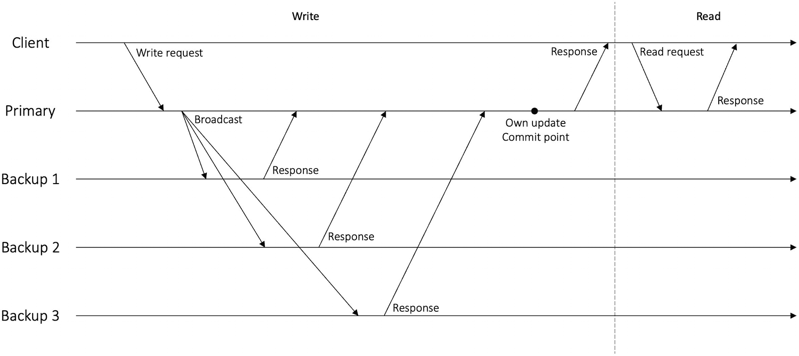

主备复制示意图。客户端写入请求。广播从主节点发送到备份节点 3。响应发送回客户端。

**图 3-10** 主备复制

如何处理故障？如果`主节点`发生故障，其中一个`备份节点`将会接管。

现在，这看起来是一种实现容错的合适协议，但如果`主节点`发生故障呢？`主节点`故障可能导致停机，因为恢复需要时间。此外，从`主节点`读取可能会产生错误结果，因为在客户端在`提交点`之前向`主节点`发起读取请求的场景下，即使所有副本都已交付该更新，`主节点`也不会返回结果。一种解决方案可能是将读取视为更新来处理，但这种技术效率相对较低。同时，`主节点`承担了所有工作，即发送给其他副本、接收响应、提交，然后回复客户端。并且，`主节点`必须等待所有副本的响应才能回复客户端。与`主备副本`解决方案相比，一个更好的解决方案是`链式复制`。其核心思想是，由其中一个备份服务器来响应读取请求，而另一个服务器来处理更新命令。

#### 链式复制

`链式复制`将副本组织成一个链，包含一个头和一个尾。`头`是编号最大的服务器，而`尾`是编号最小的服务器。写入请求或更新命令被发送到`头`，`头`通过可靠的先进先出链路将请求发送到链上的下一个副本，下一个副本再将其转发给下一个，直到更新到达最后一个（`尾`）服务器。然后，`尾`服务器向客户端响应。`头`副本负责对来自客户端的请求进行排序。

对于读取请求（查询），客户端直接将其发送给`尾`，由`尾`进行回复。当`尾`发生故障时，只需重新选择其前驱节点作为新的`尾`即可轻松恢复。如果`头`发生故障，其后继节点将成为新的`头`，并通知客户端。图 3-11 展示了`链式复制`的工作原理。

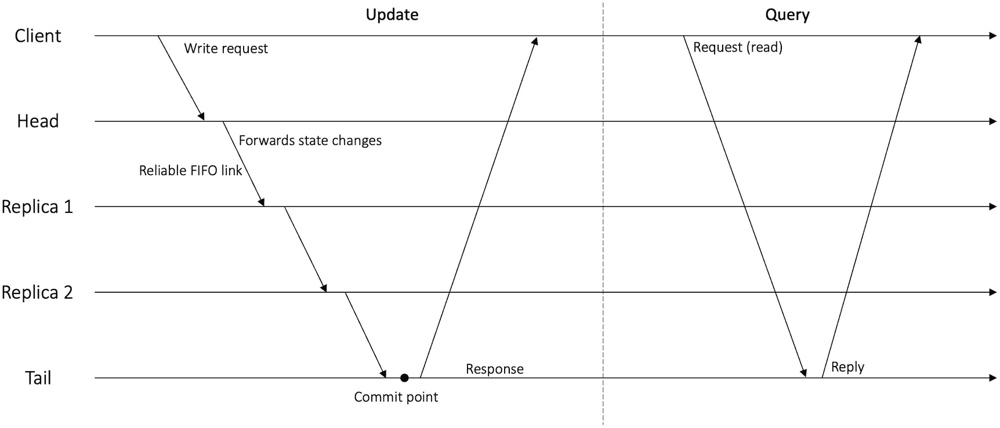

链式复制示意图。客户端写入请求。在更新和查询场景下，响应和回复分别发送回客户端。

**图 3-11** 链式复制

`链式复制`提供了高可用性、高吞吐量和强一致性。它可以容忍多达 *n* – 1 个节点故障。

### 状态机复制

状态机方法由莱斯利·兰波特在其 1978 年的开创性论文《分布式系统中的时间、时钟与事件排序》中提出。它是实现分布式系统容错的事实标准。

首先定义什么是状态机。状态机执行一系列命令，并存储系统的状态。通过执行命令，状态转换函数将存储的状态转换为下一状态。命令是确定性的，最终状态和输出仅由机器已执行的输入命令决定。

清单 3-1 中的简单算法描述了一个状态机节点。

```
state := initial
log := lastcommand
while (true) {
on event receivecommand()
{
appendtolog(command)
output := statetransition(command, state)
sendtoclient(output)
}
}
```

**清单 3-1** 状态机

在此伪代码中，状态机从初始状态开始。当从客户端收到命令时，它会将命令追加到日志中。之后，通过转换函数执行命令，更新状态并产生输出。该输出作为响应发送回客户端。

图 3-12 说明了这一概念。

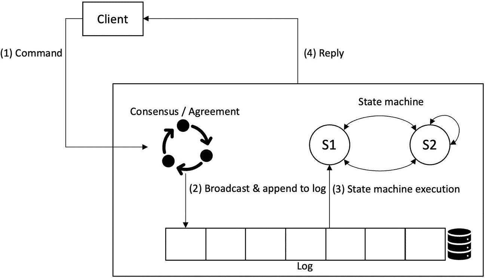

状态机副本的流程图。流程依次为：客户端、命令、共识、广播、状态机执行、状态机及回复。

**图 3-12** 状态机副本

状态机复制的核心思想是：如果系统被建模为状态机，那么只需对操作顺序达成一致，即可实现副本一致性。如果相同的命令以相同的顺序应用于所有节点，就能实现一种使所有副本彼此保持一致性的通用方法。然而，这里的挑战在于如何确定命令的全局共同顺序。

为了对操作顺序达成一致，我们可以使用拜占庭协议或可靠广播协议等一致性协议。本章前面讨论过全序广播抽象。也可以使用`Paxos`或`PBFT`等共识算法来实现这一点。请记住，在全序广播中，每个进程按相同顺序交付相同的消息。这一特性直接解决了我们对操作顺序达成一致的问题——这正是状态机复制背后的核心洞察。全序广播确保来自不同客户端的命令以相同顺序被交付。如果命令按相同顺序交付，它们将以相同顺序执行，且由于状态机是确定性的，所有副本最终将处于相同状态。

每个副本都是一个状态机，它通过执行输入命令确定性地将状态转换到下一状态。每个副本上的状态以一组（`key`，`value`）对的形式维护。命令的输出从当前状态转换到下一状态。确定性很重要，因为它确保每次命令执行都能产生相同的输出。每个副本从相同的初始状态开始。全序广播按全局顺序将相同命令交付给每个副本，这导致每个副本执行相同的命令序列并转换到相同状态。从而在每个副本上实现相同的状态。

该原理也应用于区块链中：通过某种共识机制对交易和区块序列实现全序，每个节点按照与其他副本相同的顺序（以及工作量证明获胜者、领导者提出的顺序）执行并存储这些交易。我们将在第 5 章详细探讨。传统协议如实用拜占庭容错（`PBFT`）和`RAFT`都是状态机复制协议。

`SMR`通常用于提高系统性能和容错能力。系统性能提升是因为多个副本托管数据副本，并且由于多副本的存在而有更多可用资源。容错能力提高则是因为数据在每个副本上都有复制，即使某些副本不可用，系统也能继续运行并响应客户端的查询和更新。

现在，我们来正式审视`SMR`的性质。

#### 相同初始状态

副本始终从相同的初始状态启动，例如一个空数据库。

#### 确定性操作

所有正确副本针对相同的输入和状态，确定性地产生相同的输出和状态。

#### 协调性

所有正确副本按相同顺序处理相同的命令。

协调性要求使用全序广播或某些共识算法等一致性协议。

此外还有两个*安全性*和*活跃性*性质，描述如下。

#### 安全性

所有正确副本执行相同的命令。这称为 `一致性` 属性。实现一致性有两种通用方法：可以使用全序广播或共识协议。全序广播协议在每个状态机复制周期只需运行一次，而共识机制则在每个命令序列周期实例化。

#### 活跃性

所有正确命令最终都会被正确副本执行。这也称为 `完成性` 属性。

安全性确保一致性，而活跃性确保可用性和进展。

图 3-13 展示了`SMR`的通用工作原理。

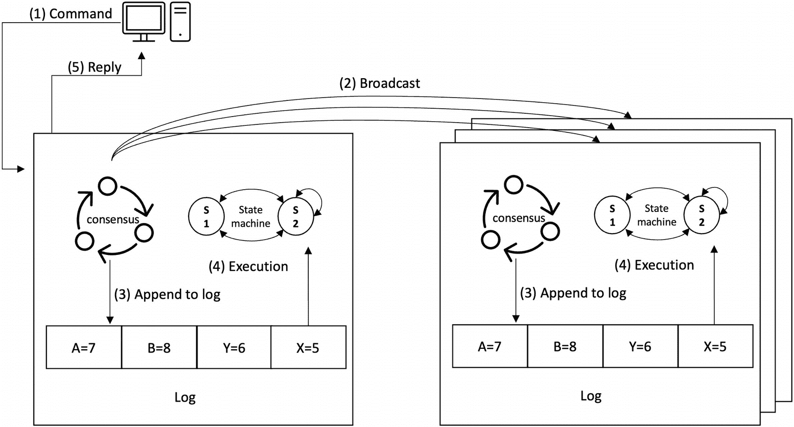

`SMR`算法的流程图。流程依次为：命令、广播、追加到日志、执行和回复。命令从一个源广播到多个日志。

**图 3-13** 状态机复制

在图 3-13 中，我们可以看到该过程的工作方式：

1.  客户端向副本 1 提交命令`x = 5`。
2.  副本 1 将此命令发送给副本 2 和副本 3。
3.  所有副本将命令追加到各自的日志中。
4.  所有副本上的每个状态机执行该命令。
5.  副本 1 将回复/结果返回给客户端。

副本上的复制日志确保命令在每台副本上由状态机按相同顺序执行。共识机制（位于图像左上角）确保对命令顺序达成一致，并据此写入日志。这涉及与其他副本就命令序列达成一致。如果大多数副本处于运行状态，该复制系统将保持正常运行。

共识与状态机复制之间的关联在于：分布式共识建立状态机命令的全局共同顺序，而状态机则根据共识（一致性）算法确定的全局顺序执行这些命令，从而使每个节点（状态机）达到相同状态。

崩溃容错`SMR`至少需要`2f+1`个副本，而`BFT SMR`则需要`3f+1`个副本，其中`f`是故障副本的数量。

状态机复制实现了副本间的一致性。存在多种副本一致性模型，我们将在此简要探讨。

##### 线性一致性

状态机复制协议可能实现的另一种更强的属性称为线性一致性。线性一致性也被称为原子一致性，它意味着命令的执行效果如同在状态机的单份副本上执行一样，即使存在多个副本也是如此。线性一致性的关键要求是读取的状态始终是最新的，并且永远不会读取到过时数据。

一致性模型使开发者能够理解复制存储系统的行为。在与复制系统交互时，应用开发者会体验到与单系统交互相同的行为。这种透明性使得开发者能够沿用编写应用逻辑时单服务器的惯例。如果一个复制系统具备这种透明性，那么它就称为线性一致系统。

在文献中，线性一致性也被称为强一致性、原子一致性或即时一致性。

##### 顺序一致性

在这种一致性类型中，所有节点看到的命令顺序与其他节点相同。

线性一致性和顺序一致性是**强一致性**的两个类别。

##### 最终一致性

在最终一致性模型下，存在一个最终保证：如果没有更多更新，每个副本最终会处于相同状态。然而，这意味着没有时间上的保证，因为更新可能永远不会停止。因此，这并不是一个非常可靠的模型。另一种更强的方案称为强最终一致性，它有两个属性。首先，应用于一个诚实副本的更新最终会应用于所有无故障副本。其次，无论更新以何种顺序处理，如果两个副本处理了相同的更新集合，它们最终会处于相同状态。第一个属性称为最终交付，而第二个属性称为收敛。

这种方法有几个优点。它允许副本在网络连接恢复之前无需网络连接即可继续推进，并最终使副本收敛到同一状态。最终一致性可以使用较弱的广播模型，而不是全序广播。

最终一致性有多个类别，例如"最后写入获胜"。其技术是应用具有最新时间戳的更新，并丢弃任何写入同一键（更新相同数据）但时间戳较低的更新。这意味着我们接受一定的数据丢失，以换取所有副本最终状态收敛。

##### 使用较弱广播抽象的 SMR

SMR 利用全序广播来实现系统中命令的全局顺序。这里出现了一个问题：我们能否使用较弱的广播抽象来构建状态机复制？答案是肯定的；然而，需要具备一种称为"交换律"的属性以及其他一些属性。如果两个更新的顺序无关紧要，那么它们就是可交换的，例如在算术中，`A + B = B + A`，`A` 和 `B` 的顺序无关紧要，结果相同。类似地，我们说命令 `x` 和 `y` 是可交换的，如果在状态机的每个状态 *s* 中，先执行 `x` 再执行 `y` 与先执行 `y` 再执行 `x` 产生相同的状态更新，并且 `x` 和 `y` 在执行时返回相同的响应。在这种情况下，我们说 `x` 和 `y` 是可交换的。

这里的关键洞察是，如果副本的状态更新是可交换的，那么副本可以按任意顺序处理命令，并且最终仍会处于相同状态。当然，你必须将可交换机制构建到协议中。表 3-1 展示了不同的广播类型及其相关属性，以及对状态更新的假设。^(²)

**表 3-1** 构建复制所需的广播及要求

| 广播类型 | 关键属性 | 状态更新要求 |
| --- | --- | --- |
| 全序广播 | 所有消息在所有副本上以相同顺序传递 | 确定性 |
| 因果广播 | 按因果顺序传递消息，但并发消息可按任意顺序传递 | 确定性，并发更新的可交换性 |
| 可靠广播 | 无排序保证，无重复消息 | 确定性，所有更新的可交换性 |
| 尽力而为广播 | 尽力而为，无传递保证 | 确定性，可交换性，幂等性，并能容忍消息丢失 |

现在让我们探讨一些支撑分布式协议和算法的分布式计算基础成果。

### 基础成果

在分布式计算领域，研究人员报告了许多基础性成果。这些基础成果构成了分布式计算范式立足的基石。其中最有意思的是不可能性结果。

## 不可能性结果

不可能性结果让我们理解一个问题是否可解，以及解决该问题所需的最小资源。如果一个问题不可解，那么这些结果能清楚地解释为什么特定问题无法解决。如果一个不可能性结果被证明成立，则无需对此进行进一步研究，研究人员可以将注意力转向其他问题，或设法绕过这些结果。这些结果告诉我们，除非提供足够的资源，否则某些问题无法解决。换句话说，它们表明，如果资源不足，某些问题就无法计算。有些问题完全无法解决，而有些问题只有在提供足够资源的情况下才能解决。解决一个问题所需的最小可用资源被称为**下界结果**。

为了证明某些问题无法解决，必须定义系统模型和允许的算法类别。有些问题在一种模型下可解，但在其他模型下则不可解。例如，共识在异步网络假设下不可解，但在同步网络和部分同步网络中是可解的。

分布式计算中最基础的成果之一是：需要多少个节点/进程才能容忍崩溃故障和拜占庭故障。

#### 最小进程数

已经证明，解决共识问题需要一定的最小进程数。如果没有故障，那么在同步和异步模型中都可以达成共识。在异步系统中无法达成共识，但在同步系统中，在崩溃故障模型和拜占庭故障模型下，共识是可以达成的。然而，故障进程的比例存在一个下界。只有当拜占庭进程少于三分之一时，才能达成共识。

Lamport 表明，当故障节点不超过三分之一时，诚实节点总能达成共识。

#### 崩溃故障

为了实现崩溃容错，严格的下界是 `N >= 2F + 1`，其中 `F` 是故障节点数。这意味着至少需要三个进程，如果一个进程发生崩溃才能实现崩溃容错。在崩溃容错环境下，如果 `n <= 2f`，则无法解决共识问题。

#### 拜占庭故障

为了实现拜占庭容错，严格的下界是 `N >= 3F + 1`，其中 `F` 是故障节点数。这意味着至少需要四个节点，如果一个节点发生任意故障才能实现拜占庭容错。

如果 `n <= 3f`（其中 `n` 是节点数，`f` 是拜占庭节点数），则没有任何算法能解决共识问题。故障处理器数量存在一个已被证明的严格下界 `3F + 1`。

#### 最小连通性

要容忍故障，网络的最小连通度至少为 `2f + 1`。

#### 最小轮数

所需的最小轮数为 `f + 1`，其中 `f` 为可能发生故障的节点数。这是因为比故障数多一轮，意味着应该有一轮是无故障的，从而允许达成共识。

## FLP 不可能性

FLP 不可能性结果表明，在最多一个进程可能因崩溃而失败的消息传递异步系统中，无法确定性地解决共识问题。换句话说，在一个由 `n` 个节点组成且存在无限延迟的系统中，没有任何算法能够解决共识问题。要么存在无法达成一致的执行过程，要么存在不会终止（无限执行）的执行过程。

FLP 不可能性结果所依据的关键问题在于，在异步系统中，无法区分崩溃的进程和仅仅运行缓慢或通过慢速链接发送消息、需要时间才能到达接收方的进程。

FLP 是分布式计算中最基本的不可解性结果之一。FLP 以其作者 MICHAEL J. FISCHER、NANCY A. LYNCH 和 MICHAEL S. PATERSON 的名字命名，他们于 1982 年在论文《单故障进程下分布式共识的不可能性》中报告了这一结果。

全局状态 `C` 的配置是 `单值的`，如果从 `C` 开始的所有执行都输出相同的值，也就是说，只有一种可能的输出。如果配置导致决定 `0`，则为 `0-单值的`；如果导致决定 `1`，则为 `1-单值的`。全局状态 `C` 的配置是 `双值的`，如果存在两个从 `C` 开始的执行输出不同的值。

我们可以在图 3-14 中直观地看到这一点。

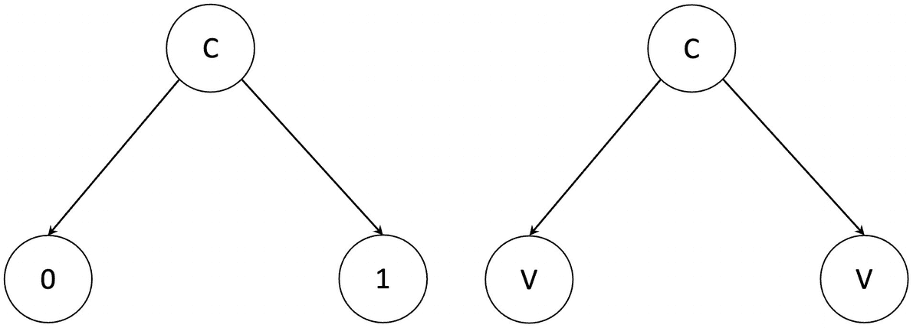

单值和双值配置示意图。左侧的 `C` 分成 `0` 和 `1`。右侧的 `C` 分成 `V` 和 `V`。

**图 3-14**
单值和双值配置

FLP 背后的关键思想是，双值配置总是可以过渡到某个双值配置。由于存在一个初始双值配置，因此存在一个永不终止的执行过程，只会导致双值配置。

我们可以通过一个场景来理解这一点。假设你有两个不同的节点集合，例如集合 `A` 和集合 `B`，每个集合都有五个节点。在一个无故障的五节点网络中，每个集合中的多数（即五分之三）将达成共识。假设在集合 `A` 中，五个节点的提议值都是 `1` {`11111`}，那么我们知道在诚实环境中，所有节点都将决定值为 `1`。类似地，在集合 `B` 中，如果所有节点的初始值都是 `0` {`00000`}，那么在无故障环境中，所有节点都将同意值为 `0`。我们可以说，集合 `A` 和集合 `B` 的配置（即全局状态）分别是 `1-单值的` 和 `0-单值的`。然而，现在设想一个情况，并非所有节点都是 `0` 或 `1`，而是有些是 `0`，有些是 `1`。想象在集合 `A` 中，三个节点是 `1`，两个节点是 `0`，即 {`11100`}。类似地，在集合 `B` 中，两个节点是 `1`，三个节点是 `0`，即 {`11000`}。请注意，这些集合现在只有一个节点的差异，即集合 `A` 中值为 `1` 而集合 `B` 中值为 `0` 的那个节点，也就是集合中的中间节点（第三个元素）。在集合 `A` 中，由于五分之三的多数，达成共识 `1`；而在集合 `B` 中，由于五分之三的多数，达成共识 `0`。让我们称这两个集合为配置或全局状态。现在我们有两个配置：一个达成共识 `1`，另一个达成共识 `0`。到目前为止还好，但想象现在有一个节点失败了，正是那个成为这两个集合唯一差异的中间节点。

如果中间节点从集合 `A` 和 `B` 中都失败了，它们各自变成 {`1100`}，这意味着这两个集合现在彼此无法区分，表明它们都可以根据第三个元素（中间节点）的可用性达成相同的共识 `0` 或 `1`。这也意味着，根据节点 `3` 的可用性，这些集合之一可以达成 `0` 或 `1` 两个共识决定。

现在想象所有节点的默认值都是 `0`，那么对于一个失败的（被移除的）节点，集合 `A` {`11100`} 如果中间节点失败，最终将达成共识 `0`；如果没有节点失败，则将达成共识 `1`。这是一个矛盾的情况，称为 `双值配置`，即如果持有值 `1` 的中间节点不可用，则达成共识 `0`；但如果没有节点失败，则将达成共识 `1`。现在的情况是，集合（节点）可以达成共识 `0` 或 `1`，结果不可预测。

已经证明，即使只有一个故障，这种双值初始配置的矛盾情况也总是可能存在；其次，它总是可以导致另一种矛盾情况。换句话说，初始双值配置总是可以过渡到另一个双值配置，因此共识是不可能的，因为无法收敛到单值（`0-单值的` 或 `1-单值的`）。

由此得出 FLP 不可能性结果的两个观察结论。首先，在任何存在故障的共识算法中，总是至少存在一个双值初始配置。其次，双值配置总是可以过渡到另一个双值配置。

FLP 结果得出结论：在异步系统中，首先存在一个算法无法决定的全局状态（配置），并且总是会出现系统无法得出结论的场景。换句话说，在异步条件下，总存在一个可接受的运行过程，该过程始终保持在不确定状态。

异步条件下的状态机复制也容易受到 FLP 不可能性限制的影响。区块链网络同样受制于 FLP 不可能性结果。如果没有通过引入一定程度的同步性来规避 FLP 不可能性，比特币、以太坊和其他区块链网络将无法构建。

人们提出了许多努力来以某种方式规避 FLP 不可能性。这种规避围绕着预言机的使用。其思想是向分布式系统提供一个预言机来帮助解决问题。`预言机`可以定义为一种服务或黑盒，进程（节点）可以查询它以获取某些信息，从而帮助它们决定行动方案。接下来，我们介绍一些常见的预言机，它们为分布式算法提供足够的信息来解决那些本来可能无法解决的问题。我们可以使用预言机来促进解决分布式系统中的共识问题。

规避 FLP 不可能性的关键思想围绕着牺牲异步性和确定性展开。当然，正如我们所了解的，在异步条件下，即使只有一个进程崩溃故障，确定性共识也是不可能的；因此，诀窍是稍微牺牲异步性或确定性，恰好足以达成决定并终止。

现在我们讨论一些技术：

- 随机预言机
- 故障检测器
- 同步性假设
- 混合模型

### 同步性假设

在同步性假设下，模型引入了关于时间的假设。请记住，我们在本章和第一章前面讨论过部分同步性。部分同步性是一种通过规避 FLP 不可能性来解决共识问题的技术。在部分同步性模型下，异步性在一定程度上被放弃，以引入一些允许解决共识问题的时间假设。类似地，在最终同步性模型下，假设系统在称为全局稳定时间（GST）的未知时间之后最终同步。另一种时间假设是弱同步性，它假设延迟保持在某个阈值以下，并且不会无限增长。通过假定某种时间概念（同步性），这样的时间假设允许共识算法做出决定并终止。

### 随机预言机

随机预言机使得随机化算法的发展成为可能。在这种方法中，为了以概率方式达成共识，一定程度地牺牲了确定性。该方法的优点在于无需对时序做出任何假设，但缺点是随机化算法的效率不高。在随机化共识算法中，安全属性或活跃属性之一会被改为非确定性的概率版本。例如，活跃属性变为：

- `活跃性`：每个正确的进程最终都能以高概率做出决定。

这在某种意义上解决了 FLP 不可能性——FLP 不可能性在实践中意味着存在一些不会终止的共识执行过程。如果让终止条件变为概率性的，就可以“规避”共识的不可能性：

- `一致性`：所有正确的进程最终都以概率 1 对某个值达成一致。

然而，通常被改为概率性的是活跃属性，而非一致性、有效性及完整性等安全属性。牺牲安全属性来换取活跃（终止）属性通常并不可取。

随机化算法的核心技术被称为“抛硬币”。抛硬币或掷硬币可分为两种类型。

本地硬币是指处理器的状态从当前状态推进到下一个状态，该状态根据算法的概率分布进行选择。这通常通过随机比特生成器实现，它以相等的概率返回 `0` 或 `1`（正面或反面）。

共享硬币或全局硬币算法利用这些本地硬币来构建一个全局硬币。其要求是向所有诚实进程提供相同的硬币值，从而实现一致。

本地硬币算法在指数级通信步骤后终止，而共享硬币算法则在常数级步骤内终止。

牺牲确定性以采用随机化方法各有利弊。其主要优势之一是无需时序假设。然而，缺点是轮次数量显著增加，并且引入随机化所需的密码学计算成本可能很高。

拜占庭共识的随机化算法最早出现在 Ben-Or 和 Rabin 于 1983 年的工作中，我们将在第 6 章中与其他一些算法一同讨论。

### 混合模型

在规避 FLP 不可能性的混合模型方法中，会结合使用随机化技术和故障检测器。

虫洞是一种系统模型中的扩展，与系统的其他部分相比，它具有更强的特性。它通常是一种安全、防篡改且故障静默的可信硬件，为进程正确执行协议中的某些关键步骤提供了途径。文献中引入了多种虫洞，例如经过认证的仅追加存储器，它迫使副本提交到可验证的操作序列。可信的及时计算基础（TTCB）是首个为虫洞支持的共识而引入的虫洞。

### 故障检测器

故障检测器背后的直觉是，如果我们能设法获得进程故障的提示，那么就可以规避 FLP 不可能性结果。请记住，FLP 不可能性结果指出，无法区分一个进程是崩溃了还是仅仅速度非常慢。没有方法可以查明这一点，因此如果我们能设法得到某个进程已故障的指示，那么处理这种情况就会更容易。在这种设置下，异步性在一定程度上被牺牲了，因为故障检测器基于心跳和超时假设来工作。故障检测器作为异步系统的扩展被添加。

一个故障检测器可以定义为每个进程上的一个分布式预言机，它提供关于一个进程是存活还是已崩溃的提示（怀疑）。在某种程度上，故障检测器将超时和部分同步假设封装为一个独立的模块。定义故障检测器有两类属性：

- `完备性` 意味着故障检测器最终会检测到故障进程。这是一个活性（liveness）属性。
- `准确性` 意味着故障检测器永远不会怀疑一个正确的进程故障。这是一个安全性（safety）属性。

基于上述两个属性，Chandra 和 Toueg 在他们开创性的论文“用于可靠分布式系统的不可靠故障检测器”中提出了八类故障检测器。通过引入一个弱的不可靠故障检测器，也有可能解决共识问题。这项工作同样由 Chandra 和 Toueg 提出。

一个故障检测器准确怀疑故障或活性的能力取决于系统模型。故障检测器通常使用心跳机制来实现，其中进程之间交换心跳消息，如果某些进程在一段时间内未收到这些消息，则可以怀疑发生了故障。另一种方法是实现一个基于最坏情况消息往返时间的超时机制。如果一个进程在预期的时间范围内没有收到消息，则发生超时，并且该进程被怀疑已故障。之后，如果从被怀疑的进程收到消息，则增加超时值，并且该进程不再被怀疑故障。图 3-15 展示了一个使用心跳机制的故障检测器。

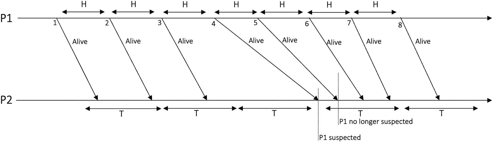

*图 3-15：使用心跳的故障检测器*

在图 3-15 中，进程 `P1` 向进程 `P2` 发送常规的心跳消息“Alive”。故障检测器中有两个参数：心跳间隔 `H` 和超时值 `T`。如果 `P2` 在超过 `T` 的时间段内没有收到来自 `P1` 的任何心跳消息，则怀疑 `P1`。在图中，消息 4 在超时值 `T` 内没有到达；因此，`P2` 现在因超时而怀疑 `P1` 故障。如果 `P2` 开始收到来自 `P1` 的任何消息（无论是心跳还是任何其他协议或应用消息），则 `P2` 不再怀疑进程 `P1`。这在图中从消息 5 开始展示。一旦 `P2` 收到来自 `P1` 的消息，计时器 `T` 就会重新开始（重置）。

故障检测器仅在同步和部分同步系统模型下是实用的。在异步系统中，故障检测器无法同时实现完备性和准确性。然而，我们可以通过立即（且天真地）怀疑所有进程都已崩溃来独立实现完备性。之后，如果某个进程确实故障了，那么这种怀疑就是正确的，从而满足了完备性属性。类似地，可以通过不怀疑任何进程来实现准确性，这当然相当无用，但大概能实现准确性。换句话说，完美的故障检测器在同步系统中是可能的，而在异步系统中则不可能有完美的故障检测器。在某种程度上，我们将部分同步和超时封装在故障检测器中，以便在我们的系统中实现故障检测能力。

故障检测器的另一个优点是所有超时机制都局限在故障检测器模块内部，程序可以自由地执行其他任务。在没有故障检测器模块的情况下，程序最终会无限期地等待来自已崩溃进程的预期传入消息。我们可以通过比较来理解这一点。例如，一个阻塞式接收操作“等待来自进程 `p` 的消息 `m`”变成了`(等待来自进程 p 的消息 m) 或 (怀疑 p 故障)`。现在你可以看到阻塞式程序变成了非阻塞式，并且不再有无限等待；如果怀疑 `p` 故障，则将其添加到怀疑列表中，然后程序继续其操作，无论那是什么操作。

现在让我们看看强/弱完备性和准确性的属性。

#### 强完备性
此属性要求最终每个崩溃的进程被每个正确的进程永久怀疑。

#### 弱完备性
此属性要求最终每个崩溃的进程被某个正确的进程永久怀疑。

#### 强准确性
此属性表示一个进程在它崩溃之前（在它崩溃前）不会被任何正确的进程怀疑。

#### 弱准确性
此属性描述某个正确的进程永远不会被任何正确的进程怀疑。

#### 最终强准确性
此属性表明，经过一段时间后，正确的进程不再怀疑任何正确的进程。

#### 最终弱准确性
此属性暗示，经过一段时间后，某个正确的进程不再被任何正确的进程怀疑。

我们可以在图 3-16 所示的图表中直观地看到强完备性与弱完备性。

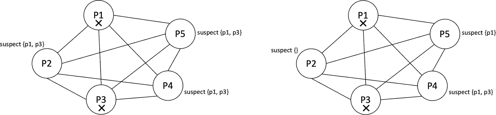

*图 3-16：强完备性与弱完备性*

现在我们讨论八类故障检测器。有四类故障检测器提供强完备性。前两种故障检测器在同步系统下工作，即完美检测器 `P` 和强检测器 `S`。另外两种在部分同步模型下工作，即最终完美检测器（菱形 `P`）和最终强检测器（菱形 `S`）。

我们现在描述这些类别，首先是强完备性。

#### 完美故障检测器 P
这种类型的故障检测器满足强完备性和强准确性属性。`P` 不能在异步系统中实现。这是因为在异步系统中无法实现 `P` 所需的强完备性和准确性。

#### 强故障检测器 S
这种故障检测器具有弱准确性和强完备性。

#### 最终完美故障检测器 – 菱形 P
这类故障检测器满足强完备性和最终强准确性。

#### 最终强故障检测器 – 菱形 S
这类故障检测器满足强完备性和最终弱准确性。

还有四类故障检测器提供弱完备性。检测器 `Q` 和弱检测器 `W` 在同步模型下工作。另外两种检测器，最终检测器 `Q`（菱形 `Q`）和最终弱检测器（菱形 `W`），在部分同步假设下工作。

我们如下描述它们。

#### 弱故障检测器 W
这种类型满足弱完备性和弱准确性属性。

#### 最终弱故障检测器（菱形 W）
这种类型满足弱完备性和最终弱准确性属性。

#### 探测器 Q 或 V

这类探测器满足弱完备性和强准确性。

#### 最终探测器 Q（菱形 Q）或菱形 V

这类探测器满足弱完备性和最终强准确性。

图 3-17 总结了以上所有内容。

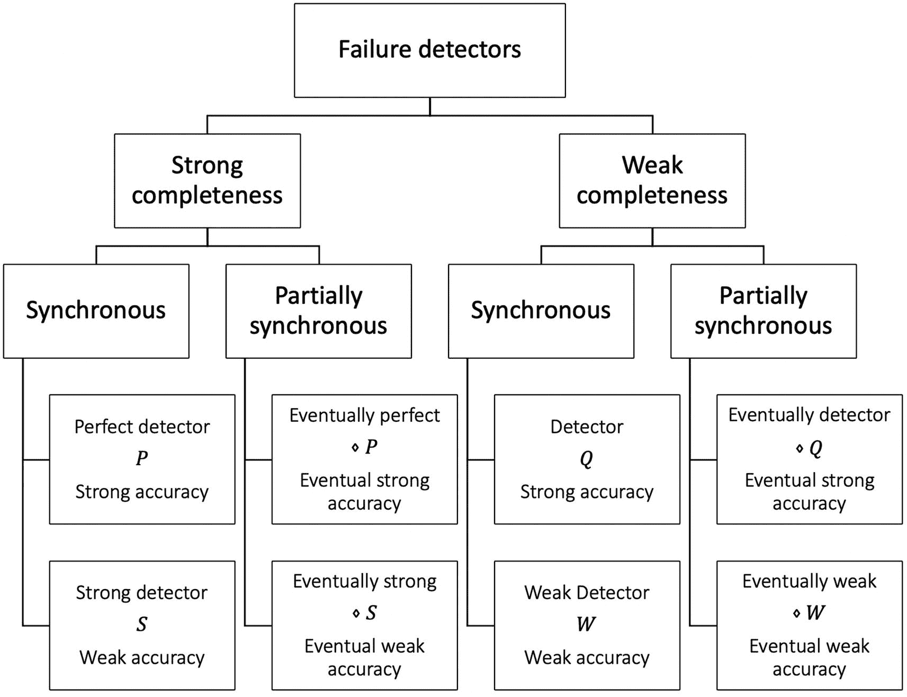

故障检测器的框图分为强完备性和弱完备性，并进一步分为同步和部分同步。

**图 3-17** 故障检测器类别

故障检测器的属性从根本上围绕着故障检测器在避免误报的同时，检测故障的速度和准确性。一个完美的故障检测器总能正确检测出故障进程，而一个弱故障检测器可能只能准确检测出极少甚至几乎无法检测出故障。

##### 领导者选举故障检测器

有时，我们并不关心进程是否发生故障，只关心某个单个进程是否正确。在这种故障检测方法中，我们不怀疑其他进程，而是将单个进程视为领导者。这种故障检测器可以被视为一种领导者选举算法，称为 Omega `Ω` 故障检测器。最初，领导者选举器可能不可靠，可能会选举出一个故障进程，或者导致不同进程信任不同的领导者。我们可以将此 FD 定义为一个故障检测器，在该检测器中，每个无故障进程最终都会选举出同一个无故障领导者进程。

正如我们之前所见，在其他故障检测器中，有一个名为 `suspect` 的组件，其中包含一组被故障检测器怀疑为故障的进程 ID；然而，在领导者选举器 `Ω` 中，有一个名为 `trust` 的组件，其中包含被选举出的领导者的单个进程 ID。

#### 使用故障检测器解决共识问题
如果我们有一个完美的故障检测器，我们就可以轻松地在同步和异步模型中解决共识问题。然而，在异步系统中，由于该模型对准确性和完备性的要求过于严格，无法实现 `P`。如果我们能在异步系统中实现一个 `P` 来解决共识问题，那将违反 FLP 不可能性原理。因此，我们知道不存在这样一个完美的 FD 能在纯粹的异步系统中解决共识问题。我们必须牺牲一点异步性，寻找能在异步条件下解决共识问题的更弱的故障检测器类别。

此外，此时会出现一个问题：解决共识问题所需的最弱故障检测器是什么？`⋄W`（最终弱完备性与最终弱准确性）是在异步环境下，在大多数进程正确的前提下，足以解决共识问题的最弱故障检测器。

## 仲裁

仲裁可以定义为任何包含大多数进程的集合。该概念与在一组对象中进行投票有关。仲裁系统对于确保复制系统中的一致性、可用性、效率和容错性至关重要。

仲裁也可以被视为在分布式系统中决定某个操作所需的最小进程（投票）数量。基于仲裁的方法确保了分布式系统的一致性。我们刚刚在“复制”部分了解到，复制允许构建一个容错且一致的分布式系统。这时，问题来了：需要多少个副本才能最终决定提交更新或中止操作。

从数学上讲，仲裁定义如下：

仲裁是 `π = {1, 2, 3, ..., n}` 的一个非空子集。

仲裁系统定义为一组 `π` 的非空子集 `Q`，满足以下属性：

`仲裁交集`：`∀A, B ∈ Q : A ∩ B ≠ ϕ`

这意味着任意两个仲裁必须在一个或多个进程上相交。这也被称为鸽巢原理。而且，这被称为 `一致性` 属性。

必须始终至少有一个可用的仲裁未发生故障。这是 `仲裁可用性` 属性。

仲裁系统通常用于这样的场景：一个进程在广播其请求后，等待直到收到属于某个仲裁的所有进程的响应。通过这种方式，我们可以满足问题的一致性要求。仲裁通常用于实现崩溃和拜占庭容错。例如，在共识算法中，需要特定大小的仲裁来保证安全性和活跃性。换句话说，基于仲裁的算法只有在能够建立一个由正确进程组成的仲裁时，才能满足安全性和活跃性。

### 崩溃容错仲裁

为了在 N 个崩溃停止进程中实现崩溃容错，仲裁 `Q` 设置为至少包含 `⌊n/2⌋ + 1` 个进程。

例如，如果 `n = 7`，那么 `⌊7/2⌋ + 1 = ⌊3.5⌋ + 1 = 3 + 1 = 4`。

这意味着在一个七节点网络中，至少需要四个节点（一个由四个节点组成的仲裁）无故障且可用，才能实现崩溃容错。

例如，如果你有 `n` 个副本，其中 `f` 个可能会崩溃停止，那么为了实现活跃性，需要多大的仲裁 `Q` 规模？

为了实现活跃性，必须有一个无故障的仲裁 `Q` 可用，其中 `Q <= n – f`。

为了实现安全性，任意两个仲裁必须在一个或多个进程上相交。

Lamport 在 1978 年曾以“变形虫”之名使用过仲裁。

### 拜占庭仲裁

拜占庭故障难以处理。设想如果有 `N` 个节点，其中 `f` 个节点变成了拜占庭节点。这些 `f` 个节点可以任意行为，并且可能投票支持某个值，又反对它。它们可以故意向不同节点发表不同的声明。这种情况甚至可能导致正确的节点产生分歧状态，并可能导致死锁。

一个能够容忍 `f` 个故障的拜占庭仲裁拥有超过 `(n + f)/2` 个进程。在两个拜占庭容错仲裁之间，始终存在至少一个正确进程的交集。如果 `N > 3f`，则在拜占庭环境下能够保证进展。换句话说，拜占庭容错要求 `f < n/3`。

例如：

```
n = 7, f = 1
(n + f) / 2 = (7 + 1) / 2 = 4
ceiling((7 + 1 + 1) / 2) = ceiling(9 / 2) = 5
```

每个拜占庭仲裁包含超过 `n − f/2` 个诚实进程。`7 − 1/2 = 6.5 > 3`，因此，在两个拜占庭仲裁的交集中至少有一个正确进程。

### 读仲裁与写仲裁

基于仲裁的协议从根本上依赖于投票来决定是否可以执行读操作或写操作。这里有读仲裁和写仲裁。读仲裁是为了就读操作达成一致所需的最少副本数。类似地，写仲裁是为了就写操作达成一致所需的最少副本数。

## 我们现在处于什么位置

基于过去 40 多年在经典分布式共识和现代区块链时代协议方面的研究，我们可以将共识分为两大类。

### 经典共识

经典共识或传统分布式共识作为一个研究课题已经有大约 40 年了。从 SIFT 项目以及 Lamport 和许多其他研究人员的贡献开始，我们现在拥有大量处理经典分布式共识的工作。像 Paxos、PBFT 和 RAFT 这样的协议现在已成为各种实际系统中实现的常态。

### 中本聪及后中本聪共识

另一方面，有一系列协议可称为中本聪共识家族，因为这一家族是由中本聪通过比特币首次引入的。

从区块链的角度来看，传统协议和中本聪式协议都在使用中。几乎所有许可链都使用 PBFT 经典算法的变体。另一方面，像以太坊和比特币这样的非许可公链则使用中本聪式（PoW）共识算法。还有权益证明等其他类别及其变体，但它们都是在 2008 年比特币工作量证明引入之后才出现的。

我们将在第 4 章详细讨论中本聪及后中本聪式算法。

## 本章小结

在本章中，我们涵盖了协议、广播、复制和共识的主要概念：

- 共识是分布式计算中的一个基本问题。
- 共识与原子广播是等价的问题。解决了其中一个，另一个也迎刃而解。
- 存在多种广播原语，例如尽力而为广播、可靠广播、急切可靠广播以及全序广播，它们在传递保证方面的严格程度各不相同。
- 还有概率性广播协议，其灵感源于公共信息流言传播方式，能以高概率传递消息。
- 复制和状态机复制是为分布式系统提供容错能力的技术。
- 仲裁系统对于确保复制系统中的一致性、可用性、效率和容错性至关重要。
- 过去半个世纪的研究产生了两种主要的共识类别，即经典许可共识和中本聪非许可共识。
- 过去几十年的研究中，研究人员已经证明了多种不可能性结果。例如 FLP 不可能性、最小进程数量要求以及网络链路等结果已被提出并得到证明。这些基础性结果使研究人员能够专注于其他问题，因为如果某件事已被证明不可能，那么投入时间和精力去试图解决它是没有价值的。
- 其他研究还包括故障检测器，它提供了一种检测分布式系统故障的方式，允许进程据此做出响应以继续推进。为分布式系统配备故障检测器、同步假设、随机化协议和混合协议等预言机，是规避 FLP 不可能性结果的一种方法。

在下一章中，我们将探讨区块链，描述它是什么，以及如何从我们目前所学的知识角度来理解它。