# 4. 区块链

在本章中，我们将学习区块链是什么、它的各种元素，并通过分布式计算的视角审视区块链。同时，我们还将给出区块链的形式化定义和性质。此外，我们也将介绍比特币和以太坊。最后，我将介绍一些区块链的应用场景。

区块链之所以引人入胜，是因为它涉及众多学科，包括分布式计算、网络、密码学、经济学、博弈论、编程语言和计算机科学。

区块链吸引了来自众多不同领域的人士，包括但不限于前面提到的学科。由于几乎在生活的方方面面都有应用场景，区块链已经俘获了公众以及众多学者和行业专业人士的想象力。

区块链于 2008 年随着比特币的出现而诞生。比特币是一种点对点、去中心化的电子现金方案，它不需要任何可信第三方来提供与货币相关的信任保障。

## 什么是区块链

互联网上和许多不同的书籍中，对区块链有众多定义。虽然所有这些定义都是正确的，有些还非常出色，但我将尝试用自己的话来定义区块链。

首先，我们将从外行的角度来定义它，然后从纯粹的技术角度来定义。

### 外行定义

区块链是一种共享的记录保存系统，每个参与者都保存着一份按时间顺序排列记录的副本。参与者只有在集体同意的情况下才能添加新记录。

### 技术定义

区块链是一个点对点、密码学安全、仅可追加、不可变且防篡改的共享分布式账本，由按时间排序且可公开验证的交易组成。用户只能通过网络中节点间的共识在区块链中添加新记录（交易和区块）。

## 背景

区块链的起源可以追溯到早期为数字文档时间戳开发的系统。此外，长期以来创建具有匿名性和可问责性等理想特性的安全电子现金的难题，也激发了区块链的发展。

以下讨论一些促成区块链发展的关键思想。

要创建实用的数字现金，需要解决两个基本问题：

- 可问责性以防止双重支付
- 匿名性以保护用户隐私

问题在于如何解决可问责性和双重支付问题。下面描述的方案试图解决这些问题，并设法实现了这些特性；但可用性较差，且它们依赖于可信第三方。

### 数字现金的创建尝试

历史上曾有多次创建数字现金的尝试。例如，大卫·乔姆发明了盲签名，并利用秘密共享机制来创建数字现金。盲签名能够在不透露签名内容的情况下进行签名，从而提供了匿名性，而秘密共享机制则允许检测双重支付。

`B-money` 是另一种电子现金方案，由戴伟于 1998 年发明。这一原始构想中提到了许多可被视为比特币直接先驱的想法。它是一个新颖的构想，但需要依赖受信任的服务器。它还提出了在不可追踪的匿名实体之间，通过一种交换媒介进行协作，以及强制执行合约的方法。每个服务器在特殊账户中存入一定金额，并用于奖惩的想法，非常接近我们今天所知的权益证明概念。同样，解决一个先前未被解决的计算问题的想法，就是我们今天所说的工作量证明。

另一个电子现金提案是尼克·萨博提出的 `BitGold`。`Bitgold` 可以被视为比特币的直接前身。`Bitgold` 提案强调不依赖受信任的第三方，并通过解决“挑战字符串”来实行工作量证明。

另一方面，密码学和计算机技术的进步与发展通常带来了多项进展和创新应用。其中一些与区块链相关的进步包括数字文档时间戳、电子邮件垃圾邮件防护以及可重用工作量证明。

使用时间戳服务对数字文档进行时间戳以创建有序文档（哈希）链的工作，最早由哈伯和斯托内塔提出。这一想法与区块链中的区块链密切相关。然而，这种时间戳服务是中心化的，并且需要被信任。

比特币中使用的基于哈希函数的工作量证明的起源，可以在德沃克和诺尔先前利用工作量证明来阻止电子邮件垃圾邮件的工作中找到。亚当·拜克发明了用于控制电子邮件垃圾邮件的 `Hashcash` 工作量证明方案。此外，哈尔·芬尼引入了用于代币货币的可重用工作量证明，该方案使用了 `Hashcash` 来铸造新的工作量证明代币。

另一项对比特币发展有所贡献的技术是密码学。哈希函数、默克尔树和公钥密码学等密码学原语和工具，都在比特币的发展中扮演了至关重要的角色。我们在第二章 2 中详细介绍了密码学。

图 4-1 展示了不同技术的融合。

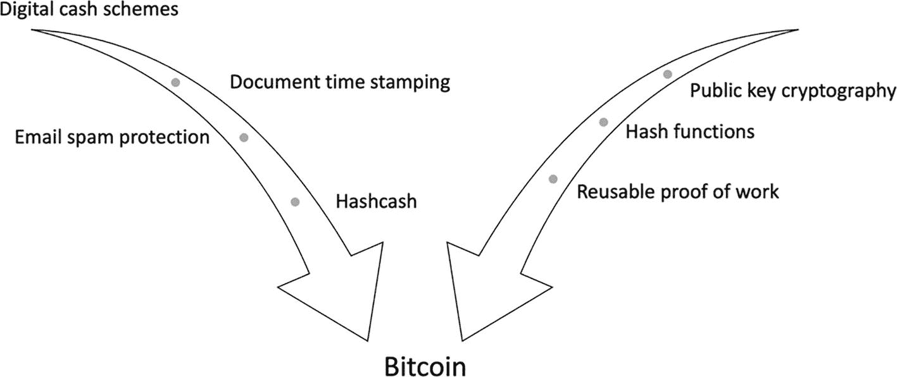

该图包含两个向下的箭头，分别标有不同的技术。这两个箭头都指向“比特币”标签。

**图 4-1** 催生比特币的技术

#### 第一个区块链？

当比特币问世时，区块链作为比特币加密货币的基础运行层被引入。至今仍在运行的它，是第一个公共区块链。不久之后，创新开始涌现，许多不同的区块链出现了——有的用于特定目的，有的用于加密货币，还有相当一部分用于企业用例。在下一节中，我们将探讨不同类型的区块链。

## 区块链的优势

人们设想了区块链技术的多种优势，自比特币发明以来已取得了诸多成就。特别是随着以太坊的出现，一个可编程的平台诞生了，智能合约可以在其上实现任意逻辑，这增加了其效用，并为进一步采用铺平了道路。今天，区块链最受关注的应用之一——去中心化金融（简称 `DeFi`）——被视为当前金融体系的重大颠覆者。非同质化代币是另一个获得爆炸性流行的应用。区块链上的非同质化代币实现了资产的代币化。目前，`DeFi` 生态系统中锁定的价值接近 600 亿美元。这笔巨额投资证明了区块链已经成为我们经济的一部分。您可以在 [`https://defipulse.com/`](https://defipulse.com/) 上追踪这一指标。

现在，我列出区块链最突出的一些优势：

- 成本节约
    - 由于流程简化、透明度提高以及具有安全保障的单一数据共享平台，区块链可以带来成本节约。同时，无需创建单独的安全基础设施；用户可以使用已经存在的安全区块链网络，只需一台运行区块链软件客户端的入门级计算机即可。

- 透明度
    - 由于所有交易都是公开的，任何人都可以验证交易，因此区块链引入了透明度。

- 可审计性
    - 由于记录历史的不可篡改性，区块链为审计目的提供了一个天然的平台。

- 速度与效率
    - 由于交易中的所有参与方都属于同一个网络，多方之间的交易处理速度得以提高。但请注意，公共区块链中的每秒交易量相当低，例如比特币每秒只能处理三到七笔；然而，在联盟链中，情况要好得多，并且由于参与方直接相互交互，提高了交易的总体效率。

- 安全性
    - 区块链基于密码学协议，这些协议确保了区块链的完整性和真实性，从而为交易提供了一个安全的平台。

以下不同行业中有许多使用案例：

- 供应链
- 政府
- 医药/健康
- 金融
- 物联网
- 交易
- 身份
- 保险

接下来，我们将讨论不同类型的区块链。

## 区块链的类型

区块链有多种类型。比特币引入的原始区块链是一种公有链：

* `公有链`或无需许可链
* `需许可链`
  * `私有链`
* `联盟链`或企业级区块链
* `特定应用区块链`
* `异构多链`

`公有链`，顾名思义，是一种无需许可的区块链。参与网络没有任何限制。只需要下载一个软件客户端并运行，即可成为网络的一部分。通常，这类区块链用于加密货币，例如比特币和以太坊。

`需许可链`有两种类型。`私有链`仅由单个组织控制，通常在一个组织内部运行。另一方面，`联盟链`或企业级区块链是一种`需许可链`，多个组织共同参与区块链的治理。企业通常使用`联盟链`来处理特定的企业用例。

我们还可以进一步对链进行分类，这些链可能由利益相关方仅为单一目的而开发。我们可以称其为`特定应用区块链`。例如，仅为单一类型的加密货币而开发的区块链。从某种意义上说，比特币就是一种`特定应用区块链`，只有一种应用——比特币加密货币。类似地，假设某个组织为特定目的（如审计功能）运行一条`私有链`，那么它也可以归类为`特定应用区块链`，因为它仅是为单一特定目的而开发的。

然而，在实践中，区块链作为一个通用平台，能够保证记录的一致性、安全性、防篡改性和有序性，使其适用于各种各样的应用。此外，根据设计的不同，单一区块链上可以运行多个应用程序。例如，以太坊可以运行名为智能合约的不同程序，使其成为一个通用区块链平台。为单一特定用例开发的区块链可以称为`特定应用区块链`，简写为 `ASBC`。

区块链也是共享数据平台，多个组织可以以防篡改的方式共享数据，确保数据完整性。然而，如果只有一种标准区块链，这种共享是可以实现的，但自以太坊问世以来，出现了许多不同的区块链。这种多样性导致了一个问题：一条区块链运行着不同的协议，无法与另一条区块链共享数据。这种脱节导致每条区块链都是一个孤岛。为了解决这个问题，希望加入联盟网络的组织必须使用该区块链特定的软件客户端，或以某种方式设计复杂的互操作性机制。这个问题已被充分认识，关于新型互操作性协议的大量工作正在进行中。同时，新型区块链，如`异构多链`和基于分片的方法，也正在涌现。一个典型的例子是 Polkadot，这是一个可复制的分片状态机，异构链可以通过所谓的中继链相互通信。另一个努力是以太坊 2.0，其中分片链作为提供可扩展性和跨分片互操作性的机制。Cardano 是另一条旨在提供链间可扩展性和互操作性的区块链。鉴于所有这些平台以及实现这些想法的工作进展速度，我们可以预见，在未来八到十年内，这些区块链和其他区块链将像今天的互联网一样运行，实现不同链之间数据的无缝共享。能够促进这种自然互操作性水平，从而催生一个由多个可互操作的通用企业链和 `ASBC` 组成的生态系统的链，被称为`异构多链`。

现在，让我们澄清一个歧义。你可能听说过“分布式账本”这个术语，有时它被用来指代区块链。虽然区块链和分布式账本这两个术语可以互换使用，但它们之间存在区别。分布式账本是一个总括性术语，用于描述具有分布式特性的账本。区块链属于这个范畴。区块链是一种分布式账本，但并非所有分布式账本都是区块链。例如，一些分布式账本在其区块链构建中并不使用由交易组成的区块。相反，它们单独处理交易记录并以此方式存储。然而，在大多数分布式账本中，区块通常被用作一批交易以及其他几个元素（如包含多个组成部分的区块头）的容器。这种使用区块来打包交易的方式使它们成为区块链。

### 区块链是一种分布式系统

区块链是一种分布式系统。因此，它应当根据分布式计算的原则来定义和推理。此外，这种形式化描述有助于更好地进行推理。

我们在第 1 章讨论了 `CAP` 定理。因此，我们可以通过 `CAP` 定理来分析区块链，以确定它属于哪种类型的系统。

#### CAP 与无需许可区块链

无需许可区块链是 `AP`（可用性和分区容忍性）区块链，因为为了可用性而在一定程度上牺牲了一致性。我们可以说最终一致性得以实现，但由于为了可用性而牺牲了一致性（共识），我们可以说无需许可链或公有链是 `AP` 系统。例如，以太坊和比特币就是 `AP` 系统。这是由于采用工作量证明（`PoW`）这类概率性共识机制所致。

#### CAP 与需许可区块链

需许可区块链是 `CP`（一致性和分区容忍性）系统，因为为了一致性而牺牲了可用性。这是因为几乎所有需许可链都使用传统的 `BFT` 协议，在这种协议中，如果节点故障达到一定阈值，整个系统就会停滞，直到故障解决，然后系统才继续运行。例如，在一个五节点网络中，如果三个节点宕机，系统将无法继续处理，除非其他节点重新上线。同样，在节点子集（如两个节点和三个节点）之间出现分区的情况下，系统也无法继续处理，除非分区愈合。这是由于使用了传统的 `BFT` 算法，如 `PBFT`。只有当存在多数诚实节点时，来自客户端的请求才会被处理。换句话说，就拜占庭容错而言，如果系统低于 `3f+1`，系统会立即降级至失效状态。

我们可以在图 4-2 中直观地看到这两个概念。

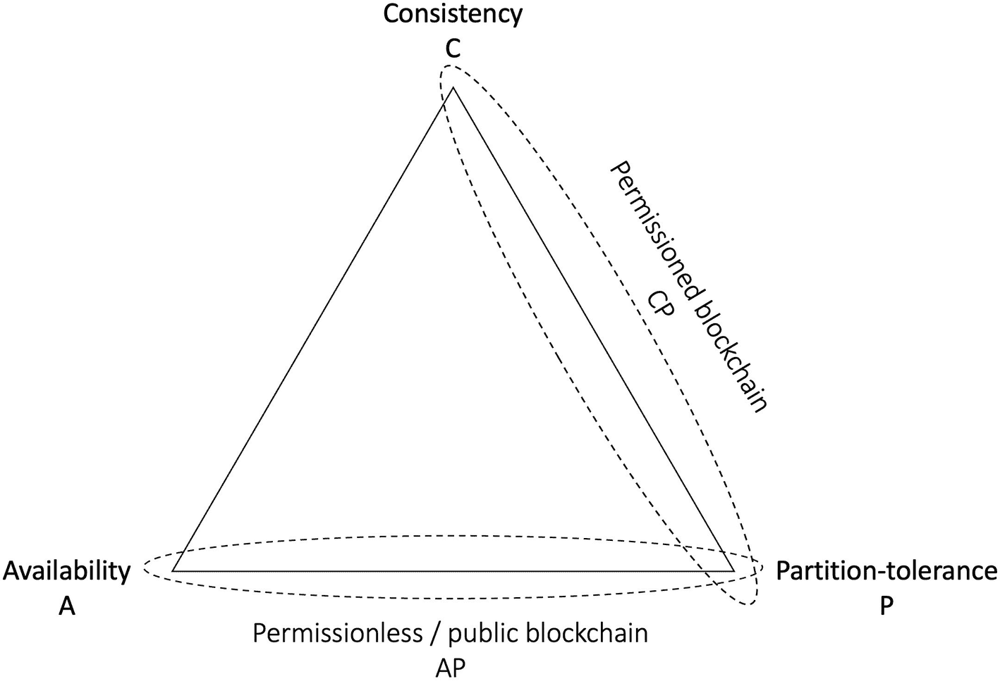

一个三角形的顶点分别标记为一致性 `C`、分区容忍性 `P` 和可用性 `A`，在 `C` 和 `P` 之间标记为 `C P`，在 `A` 和 `P` 之间标记为 `A P`。

**图 4-2** `CAP` 定理与区块链

接下来，我们描述区块链账本抽象，这是对区块链的一种抽象视图。

#### 区块链账本抽象

区块链抽象，有时也称为账本抽象，可以通过其所能执行的操作及若干属性来定义。

在高层面上，区块链网络中的进程可以执行三种操作：`Get()`、`append()`、`verify()`。

当调用 `get()` 时，它会返回区块链（账本）当前规范状态的一个副本。
当调用 `append()` 时，它会创建一条新记录 *r* 并将其追加到区块链中。
当调用 `verify()` 时，它会验证并返回记录 *r* 或区块链 *b* 的有效性状态。

##### 属性

区块链具有若干种属性，描述如下。

### 一致性

- 所有副本都持有相同且最新的数据副本。在公有链的情况下，通常是最终一致性；而在许可链的情况下，则是强一致性。
- 形式上，如果记录 `r` 被进程 `p` 在另一条记录 `r2` 之前首先看到，那么每个诚实的进程都会在 `r2` 之前看到 `r`。

###### 容错性

- 区块链是容错的分布式系统。区块链网络能够承受一定阈值内的拜占庭故障或崩溃故障。
- 在基于 `BFT` 的区块链中（通常区块链中实现了 `PBFT` 的变体），下限是 `3F + 1`，其中 `F` 是故障数。
- 在基于 `CFT` 的区块链中（通常在联盟链中实现了 `RAFT`），下限是 `2F + 1`，其中 `F` 是故障数。
- 在基于工作量证明的区块链中，下限是算力 <50%。

###### 最终性

- 最终性是指一笔交易被认为是不可撤销且永久确定的状态。这个事件可以是特定数量的区块、一个时间间隔，或者是共识算法执行过程中的一个步骤（阶段）。例如，在比特币中，通常是在六个区块之后，一笔交易才被认为是不可撤销的；而在使用 `BFT` 协议的许可链中，交易一旦提交，就被认为具有不可撤销的最终性。

###### 不可篡改性

- 区块链是不可篡改的，这意味着记录一旦进入账本，就永远无法被删除。

###### 仅追加

- 新记录只能被追加到区块链中。新记录不能插入到已有记录之间。例如，新区块只能添加在最后一个最终区块之后，而不能插入在其他区块之间。
- 形式上，如果区块 `b'` 被插入在区块 `b` 之后，那么新区块 `b"` 只能插入在 `b'` 之后，而不能插入在 `b'` 或 `b` 之前。

###### 防篡改/篡改证明

- 实际上，移除或重新排列区块链中已最终确定的区块是不可能的。
- 关于区块链是防篡改还是篡改可证明，仍有争议，但出于所有实际目的，某些攻击者能够移除或重新排列区块或交易的概率几乎为零。这种保证对于所有实际目的来说已经足够好。

#### 有效性

- 只有有效的交易和区块才会被追加到区块链中。

###### 区块链操作的终止保证：`get()`、`append()`、`verify()`

- 最终，所有操作都会终止并返回一个结果。

###### 有序性

- 如果区块 `x` 发生在区块 `y` 之前，且区块 `y` 发生在区块 `z` 之前，那么区块 `x` 也发生在区块 `z` 之前，形成传递关系。
- 在实践中，这是一个按时间顺序排列的区块链条。
- 这是一个有序的账本。

###### 可验证性

- 区块链中的所有交易和区块都是可验证的，并且遵循区块链特定的有效性谓词。任何人都可以验证交易的有效性。

共识特定的属性将在第 5 章中详细讨论。

其他一些属性包括可编程性（智能合约支持）、用于机密性和用户隐私的加密账本与匿名性，以及用于在追加新区块上达成一致决策的一致性。

区块链也可以被视为一种状态机复制协议。区块链和状态机看起来很相似；然而，两者存在细微差别。在状态机中，日志中只存储最新状态；而在区块链状态机中，整个历史记录都会被存储，并在查询时可用。

比特币和区块链的发展速度已经超过了互联网。每天有成千上万的用户使用比特币。平均而言，比特币每天处理约 20 万笔交易。在以太坊上，每天处理的交易量粗略超过一百万笔，并且兴趣还在增长。与某些人持有的合理看法相反，我认为说比特币实验已经失败是不正确的。它已经实现了其最初的目标：点对点数字现金。这就是它本来的样子，并且至今仍被用作数字现金平台。比特币也刺激了进一步的创新，像以太坊，以及现在最新的区块链，如 Polkadot 和 Cardano，都已涌现。随着这种增长水平，我相信在未来八到十年内，几乎所有金融服务都将在区块链上运行，包括一些中央银行数字货币。

## 区块链如何工作

有时，区块链在微观层面的工作方式存在细微差别；然而，在高层面上，所有区块链的工作原理基本相同。下面，我列出了显示区块链工作原理的七个关键步骤：

1. 两个或多个用户之间发生一笔交易。
2. 该交易被广播到网络。
3. 交易被验证并添加到交易池中。
4. 矿工通过将交易添加到区块中来创建一个候选区块。
5. 矿工竞相解决工作量证明以赢得将区块插入区块链的权利，或者运行共识机制以就交易达成一致。通常，矿工运行工作量证明类型的共识机制以赢得添加区块的权利。在联盟链或私有链中，通常运行传统拜占庭故障或崩溃故障容错算法的变体，该算法通过投票就某个区块达成一致，然后将其插入区块链。
6. 如果矿工赢得权利，它将区块插入其本地链，并将该区块广播到网络。
7. 其他节点在验证有效后接受该区块，然后过程重新开始。

此过程可如图 4-3 所示。

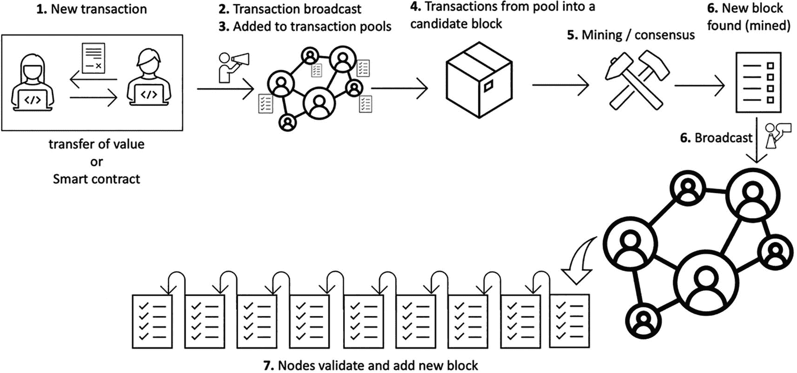

*区块链算法的流程图，从新交易开始，到节点验证并添加新区块结束。*

**图 4-3** 区块链如何工作

## 区块链的剖析

区块链由区块组成，除了第一个创世区块外，每个区块都链接到其前一个区块。“区块链”这个术语是由中本聪首次在他的比特币代码中使用的。尽管现在它被作为一个词使用，但在他的原始比特币代码中，它被写成两个独立的词：“block chain”。它可以被可视化为一个区块链，如图 4-4 所示。

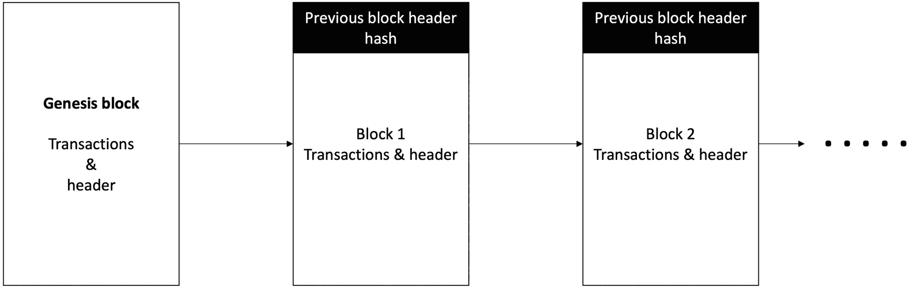

*区块链的结构图，分为创世区块、区块 1 和区块 2 三列。区块 1 和区块 2 包含前一个区块的头哈希。*

**图 4-4** 区块链的通用结构

其他结构，如有向无环图、哈希图和默克尔树，现在被用于一些现代区块链的分布式账本中，以取代通常基于区块的模型。例如，Avalanche 使用 `DAG` 进行存储，而不是基于线性区块的结构。当我们将在第 8 章中讨论针对这些区块链（分布式账本）的共识协议时，我们将详细介绍这些内容。

### 区块

区块由区块头和交易组成。区块头由多个字段构成。图 4-5 展示了一个通用的区块结构图。

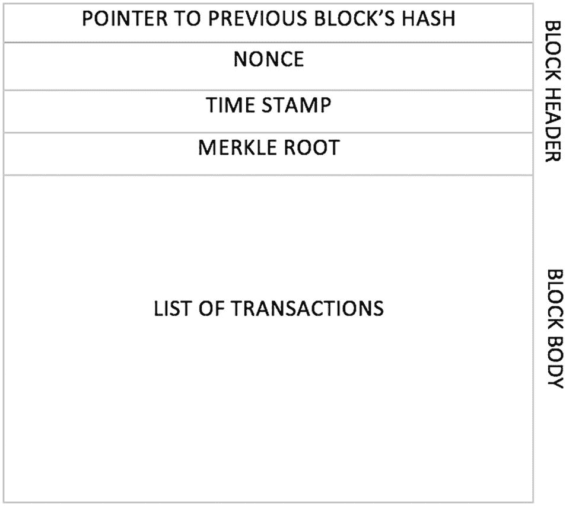

区块的结构图中包含指向前一个区块哈希值的指针、`nonce`、时间戳、以及位于区块头中的默克尔根和位于区块体中的交易列表。

**图 4-5** 通用区块结构

在本章后续关于区块链的章节中，当我介绍比特币和其他区块链时，会讨论针对特定区块链而设计的更详细的区块结构。然而，其基本结构从根本上来说就是区块头和交易，通过在当前的区块头中包含上一个区块头的哈希值来指向上一个区块，从而构建一个可验证的链表。

### 平台

在本节中，我们将介绍两大主流区块链平台：比特币和以太坊。

#### 比特币

比特币由中本聪于 2008 年发明，是第一个区块链。然而，人们普遍认为这是一个化名，因为中本聪的真实身份一直是个谜。在引入比特币后，中本聪曾活跃了一段时间，但之后突然离开了社区。自此，再无他的音讯。

我们在本章前面讨论了创建数字货币和文档时间戳系统的前史及早期尝试。本节我将直接深入技术细节。

比特币是一种点对点的电子现金系统，它解决了双重支付问题，无需依赖可信第三方。此外，比特币还具有一种名为“包容性问责制”的绝佳特性，这意味着比特币网络上的任何人都可以验证电子现金（即比特币）所有权的声明。这一特性使比特币成为一个透明且可验证的电子现金系统。

比特币网络由节点组成。比特币网络中有三种类型的节点：矿工节点、全节点和轻节点。矿工节点执行挖矿操作，并保存区块链的完整副本。比特币是一个由节点组成的松散耦合网络。所有节点通过点对点的传播协议进行通信。

##### 比特币节点与架构

在实际应用中，分布式系统中的节点会运行分布式算法。类似地，在比特币中，节点运行名为 `Bitcoin Core` 的软件客户端。它可以在多种硬件上运行，包括 Intel 和 ARM 处理器。此外，支持的操作系统有 Mac OS、Linux 和 Windows。

比特币网络主要包含三种不同类型的节点。全节点保存整个区块链的完整历史记录。矿工节点保存完整历史记录并参与挖矿，以向区块链添加新区块。最后，轻节点不保存整个区块链的副本。相反，它们只下载区块头，并使用一种称为简易支付验证的方法来验证交易的真实性。比特币节点架构如图 4-6 所示。

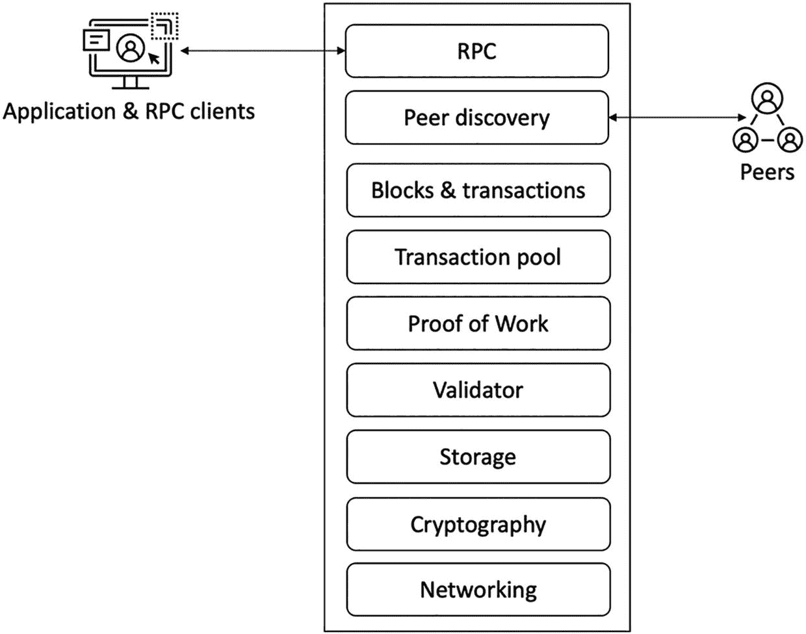

节点结构图包含 RPC、对等节点发现、区块、交易池、工作量证明、验证器、存储、密码学和网络连接。

**图 4-6** 比特币节点架构

当节点启动时，它会通过一个称为节点发现的过程来发现其他节点。在此过程中，节点首先连接到种子节点，这些种子节点是由核心开发者维护的可信引导节点。在建立初始连接后，会进行后续连接。最终，会与 `x` 个其他对等节点保持活跃连接。比特币协议中还内置了垃圾邮件防护机制，该机制采用基于积分的信誉系统，根据节点尝试建立的连接次数对其进行评分。如果某个节点向另一个节点发送了过多的消息，其信誉积分将超过 100 分的阈值，并会被屏蔽 24 小时。节点发现和节点间的握手依赖于多种协议消息。下面列出了一些协议消息及其说明。在图 4-7 中，您可以直观地看到节点握手和消息交换是如何进行的。

一些最常用的协议消息及其说明如下：

- `Version` (版本): 这是节点向网络发送的第一条消息，用于广播其版本号和区块数量。远程节点随后会回复相同的信息，连接由此建立。
- `Verack` (版本确认): 这是对 `version` 消息的响应，表示接受连接请求。
- `Inv` (库存): 节点使用此消息向网络广播其已知的区块和交易。
- `Getdata` (获取数据): 这是对 `inv` 消息的响应，用于请求由哈希值标识的单个区块或交易。
- `Getblocks` (获取区块): 该消息返回一个包含所有区块列表的 `inv` 数据包，列表从最后一个已知的哈希值之后开始，最多包含 500 个区块。
- `Getheaders` (获取区块头): 该消息用于请求指定范围内的区块头。
- `Tx` (交易): 该消息用于发送一个交易，作为对 `getdata` 协议消息的响应。
- `Block` (区块): 该消息用于发送一个区块，作为对 `getdata` 协议消息的响应。
- `Headers` (区块头): 该数据包最多返回 2000 个区块头，作为对 `getheaders` 请求的回复。
- `Getaddr` (获取地址): 该消息作为请求发送，用于获取已知对等节点的信息。
- `Addr` (地址): 该消息提供网络节点的信息。它包含地址数量以及由 IP 地址和端口号组成的地址列表。
- `Ping` (心跳): 该消息用于确认 TCP/IP 网络连接是否处于活动状态。
- `Pong` (心跳回复): 该消息是对 `ping` 消息的响应，用于确认网络连接处于活动状态。

我们可以在图 4-7 中看到这些消息的使用场景。

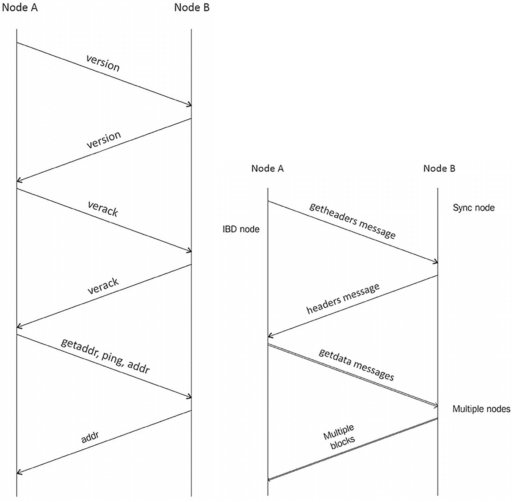

该图展示了节点 A 和节点 B 之间交换 `version`、`verack`、`getaddr`、`ping`、`addr`、`getheaders`、`headers` 和 `getdata` 消息以及多个区块的过程。

**图 4-7** 节点发现与握手图 + 区块头与区块同步

##### 比特币中的密码学

密码学在比特币区块链中扮演着至关重要的角色。比特币区块链的整体安全性确实建立在密码学基础之上。虽然我们在第 2 章中已经讨论过密码学，但现在我将具体介绍比特币中使用了哪些密码学协议以及如何使用。

###### 公钥和私钥

私钥用于证明比特币的所有权，用户通过使用私钥对交易进行签名来授权支付。

`SHA-256` 哈希函数被用于工作量证明算法中。比特币客户端中还有一个 `Base58` 编码器，用于将地址编码为比特币中可读的格式。

比特币中的钱包用于存储密码学密钥。钱包使用私钥对交易进行签名。私钥是通过随机选择一个由钱包提供的 256 位数字生成的。比特币客户端包含一个名为非确定性钱包的标准钱包。

##### 地址与账户

在比特币中，用户通过账户来表示。比特币地址的生成过程如图 4-8 所示。

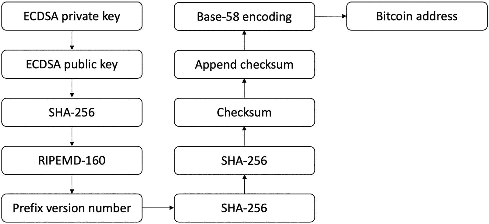

该流程图展示了比特币地址的生成过程，从 `ECDSA` 私钥开始，以比特币地址结束。

**图 4-8** 比特币地址生成

1. 第一步，我们有一个随机生成的 `ECDSA` 私钥。
2. 从 `ECDSA` 私钥派生出公钥。
3. 使用 `SHA-256` 加密哈希函数对公钥进行哈希运算。
4. 对步骤 3 生成的哈希值，使用 `RIPEMD-160` 哈希函数进行再次哈希。
5. 将版本号添加到步骤 4 生成的 `RIPEMD-160` 哈希值之前。
6. 使用 `SHA-256` 加密哈希函数对步骤 5 产生的结果进行哈希运算。
7. 再次应用 `SHA-256` 算法。
8. 步骤 7 产生的结果的前 4 个字节即为地址校验和。
9. 将该校验和附加到步骤 4 生成的 `RIPEMD-160` 哈希值之后。
10. 对得到的字节串应用 `Base58` 编码函数，将其编码为 `Base58` 格式的字符串。
11. 最终结果即是一个典型的比特币地址。

##### 交易与 UTXO 模型

交易是比特币中的基本操作单元。每笔交易至少包含一个输入和一个输出。未花费的交易输出 (`UTXO`) 是比特币交易的基本单位。交易输入引用的是之前交易的 `UTXO`。交易输出则代表了未花费值的所有权转移。一个账户在比特币中的余额，等于该账户拥有的所有未花费输出的总和。因此，`UTXO` 必须始终保持输入与输出相等。

一笔比特币交易会消耗输入，并创建具有指定值的输出。每个输入都是之前某个交易的输出。这种交易模型如图 4-9 所示。

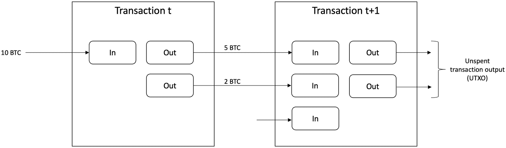

一个展示比特币交易 `UTXO` 模型的流程图。流程包括：10 BTC，交易 `t`，5 和 2 BTC，交易 `t+1` 以及未花费交易输出。

**图 4-9** 比特币交易 `UTXO` 模型

比特币交易的生命周期描述如下：

- 用户创建一笔交易。
- 拥有者使用私钥对交易进行签名。
- 通过八卦协议将交易广播到网络。
- 所有节点验证交易并将其放入各自的交易池。
- 矿工节点将这些交易打包成一个候选区块。
- 挖矿开始，其中一个成功解决工作量证明问题的矿工获得宣布其区块的权利，并赚取比特币作为奖励。
- 一旦该区块被广播到网络，它便会传播至整个比特币网络。
- 经过六次确认（六个区块）后，该笔交易被视为不可撤销的最终状态；不过，在第一次确认之后也可以接受交易。

一个交易由多个字段组成。表 4-1 显示了所有字段及其描述。

**表 4-1** 比特币交易结构

| 字段 | 描述 | 大小 |
| --- | --- | --- |
| 版本号 | 当前为 1 | 4 字节 |
| 标志 | 见证数据指示器 | 可选的 2 字节数组 |
| 输入计数器 | 输入的数量 | 1–9 字节 |
| 输入列表 | 输入 | 多个输入 |
| 输出计数器 | 输出的数量 | 1–9 字节 |
| 输出列表 | 输出列表 | 多个输出 |
| 见证数据 | 见证数据列表 | 可变 |
| 锁定时间 | 交易待处理的区块高度或时间戳 | 4 字节 |

交易分为两种类型。链上交易是比特币网络的原生交易，而链下交易则在区块链网络之外进行。链上交易发生在区块链网络上，由网络参与者进行链上验证；而链下交易则使用支付通道或侧链来执行交易。链上交易速度较慢，存在隐私问题，且可扩展性不佳。链下机制旨在解决这些问题。一个典型的例子是比特币闪电网络，它提供了更快速的支付。

##### 比特币脚本与 Miniscript

比特币脚本是一种非图灵完备的、基于堆栈的语言，用于描述比特币应该如何被转移。脚本在 LIFO（后进先出）堆栈中从左到右进行求值。脚本由元素和操作两部分组成，如图 4-10 所示。元素代表数据，例如数字签名；操作则是脚本执行的动作。操作被编码为操作码。操作码包括流程控制、堆栈操作、按位逻辑运算、算术运算、密码学操作和锁定时间等操作类别。

一些常见的操作码列举如下：

- `OP_CHECKSIG`：接受一个签名和一个公钥，验证交易的 `ECDSA` 签名。如果正确，则返回 1，否则返回 0。
- `OP_DUP`：取出堆栈顶部的项并复制它。
- `OP_HASH160`：计算输入的 `SHA-256` 哈希，然后计算 `RIPEMD-160` 位哈希。
- `OP_EQUAL`：检查堆栈顶部两项是否相等。若相等，则在堆栈上输出 `TRUE`，否则输出 `FALSE`。
- `OP_VERIFY`：检查堆栈顶部的项是否为假；如果是，则脚本终止并输出失败。
- `OP_EQUALVERIFY`：先运行 `OP_EQUAL`，然后运行 `OP_VERIFY`。
- `OP_RETURN`：终止脚本，输出失败，并将该交易标记为无效。
- `OP_ADD`：接受两个输入并执行求和操作。

脚本由一个称为 `ScriptPubKey` 的锁定脚本和一个称为 `ScriptSig` 的解锁脚本组合而成，如图 4-10 所示。输出由 `ScriptPubKey` 锁定，其中包含了输出的解锁条件。换句话说，锁定意味着将比特币给予某人，而解锁意味着消费收到的比特币。

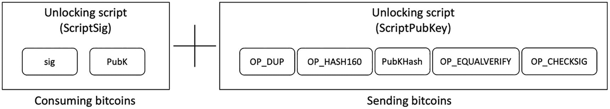

这幅比特币脚本示意图被分为两部分：标记为 `ScriptSig` 的“消费比特币”部分和标记为 `ScriptPubKey` 的“发送比特币”部分。

**图 4-10** 比特币脚本（解锁 + 锁定）示意图

比特币中有几种类型的脚本。最常见的是支付到公钥哈希（`P2PKH`），用于向比特币地址发送交易。该脚本的格式如下所示：

```
ScriptPubKey: OP_DUP OP_HASH160 <pubKeyHash> OP_EQUALVERIFY OP_CHECKSIG
ScriptSig: <sig> <pubKey>
```

`ScriptPubKey` 和 `ScriptSig` 会被组合起来并执行，如图 4-11 所示。

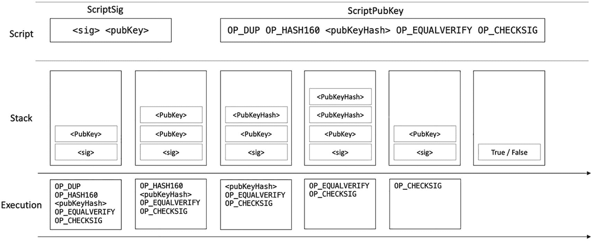

一个关于比特币 `P2PKH` 脚本执行的表格包含两列，分别为 `ScriptSig` 和 `ScriptPubKey`，以及三行，分别为脚本、堆栈和执行。

**图 4-11** 比特币 `P2PKH` 脚本执行

虽然比特币脚本是传输支付的原始方法，并且运行良好，但它的灵活性不高。有一种为比特币开发的语言支持智能合约的开发，该语言被称为 `Ivy`。一种使编写脚本更简单、更有条理的解决方案是比特币 `miniscript`。

#### 区块与区块链

区块链由区块构成。区块则由区块头和交易组成。区块头包含多个字段。比特币区块链中的第一个区块被称为创世块，作为首区块它与任何区块均无回溯链接。该区块通常被硬编码在软件客户端中。

我们可以在图 4-12 中看到区块、区块头、交易和脚本的完整可视化展示。

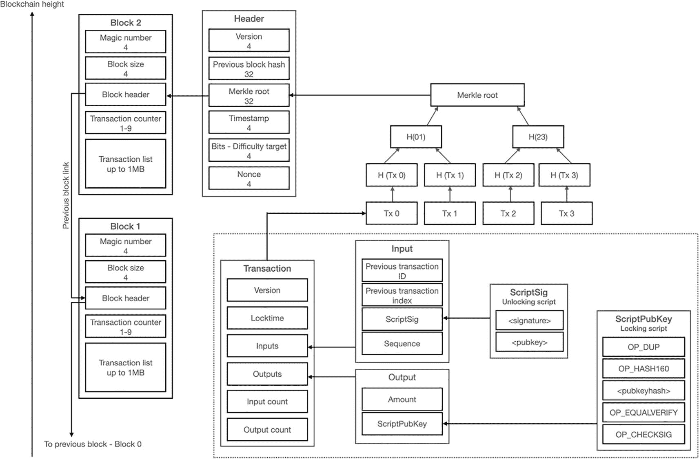

比特币区块链流程图。流程依次为脚本公钥、脚本签名、输入、交易、默克尔根、区块头、区块 2 和区块 1。

**图 4-12** 比特币区块链、区块、区块头、交易和脚本的可视化展示

`FLM^(³)` 不可能性指出，如果攻击者能够控制超过  个节点，则无法实现拜占庭共识。在 `PKI` 设置的情况下，这一下限并不成立。事实证明，比特币规避了 `FLM` 不可能性。在工作量证明环境中，无需 `PKI^(⁴)` 设置即可达成拜占庭协议。

### 挖矿

挖矿是将新币添加到比特币区块链的过程。该过程保护了网络的安全，并激励那些投入资源保护网络的用户。关于具体细节的更多信息请参见第 5 章；不过，现在我将简要介绍一下挖矿硬件。比特币刚推出时，使用 `CPU` 挖矿很容易，但难度迅速增加，导致矿工转向使用 `GPU`。在 `GPU` 成功采用后不久，`FPGA` 作为一种进一步加速 `SHA-256` 哈希运算的机制而出现。很快，它们便被 `ASIC` 超越，如今 `ASIC` 已成为比特币挖矿的主流机制。然而，由于挖矿难度过高，个人用户使用挖矿硬件进行独立挖矿获利甚微。相比之下，由数千台 `ASIC` 组成的矿场现在更为常见。此外，矿池也很普遍，多个用户共同求解哈希难题，并根据贡献比例获得收益。

### 作为平台的比特币

除了作为电子现金，比特币还可用作多种用途的平台。例如，它可以作为时间戳服务或用作永久存储某些信息的通用账本。此外，我们可以使用 `OP_RETURN` 指令来存储数据，该指令最多可存储 80 字节的任意数据。其他用途，如智能财产、智能资产以及将区块作为随机性来源等也相继出现。

将比特币用于不同目的的愿望也催生了增强比特币的技术，从而产生了彩色币、根链、`Omni` 层和对手方等项目。尽管比特币实现了其预期目标，并通过前述创新实现了更多功能，但比特币协议的根本性限制意味着所有灵活的新协议都必须构建在比特币之上。比特币本身不具备执行所有这些不同任务的内在灵活性。因此，人们感到有必要在区块链上实现超越加密货币的功能。这一雄心促成了以太坊的发明，这是第一个支持智能合约的通用区块链平台。

### 以太坊

以太坊于 2014 年由维塔利克·布特林在一份白皮书中提出。以太坊引入了一个平台，用户可以在其上以智能合约的形式运行任意代码。为了防止因代码中的无限循环而导致的拒绝服务攻击，还引入了计量执行的概念。计量执行要求对区块链上的每项操作收取费用，该费用用以太坊的原生货币以太币支付。借助智能合约，以太坊开启了一个全新的通用平台世界，操作不再仅限于比特币式的价值转移交易，由于以太坊的图灵完备设计，用户可以在链上执行任何类型的多样化业务逻辑。以太坊目前是智能合约领域使用最广泛的区块链平台。

如今的互联网是中心化的，由大型公司主导。我们今天使用的互联网称为 Web 2.0。以太坊是基于 `Web3` 的愿景开发的，在 `Web3` 中，任何人都可以参与网络，无需依赖任何第三方。在 `Web 2.0` 模式中，大型服务提供商目前以提供个人数据为回报来提供服务；然而，在 `Web3` 中，任何人都可以参与，而无需为了换取服务而放弃个人信息。此外，通过去中心化应用程序（`DApps`），任何人都可以提供任何服务，网络上的任何用户都可以使用这些服务，并且没有人能阻止你访问该服务。

# 以太坊网络

以太坊网络由松散耦合的节点组成，这些节点通过八卦协议交换消息。

以太坊网络的高级可视化如图 4-13 所示。

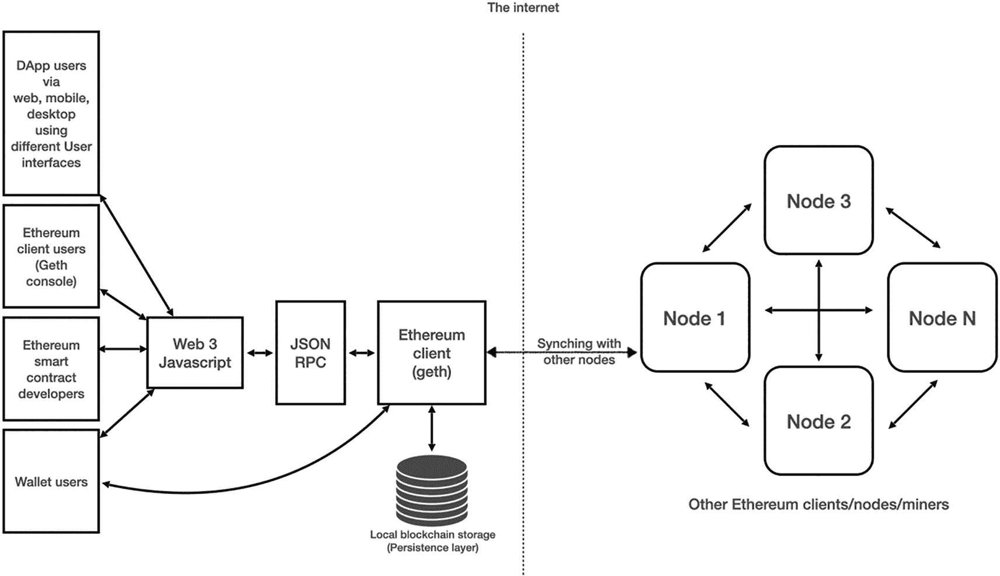
*图 4-13 以太坊网络高级概述*

以太坊网络流程图，从以太坊客户端、智能合约开发者、DApp 和钱包用户开始，最终到达其他以太坊客户端。

节点运行客户端软件，该软件是黄皮书中描述的以太坊区块链协议的一种实现，使任何用户都能参与网络。如图 4-14 所示，节点由不同的组件构成。

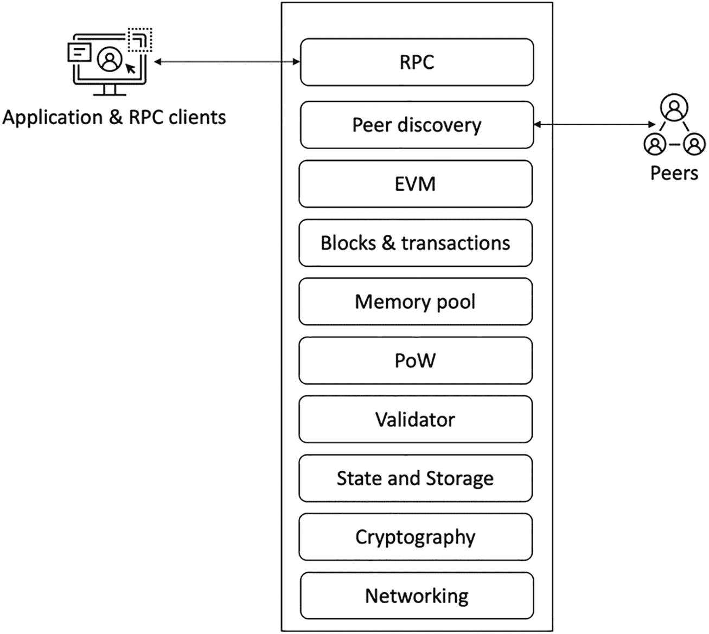
*图 4-14 以太坊节点架构*

结构图包含 RPC、节点发现、EVM、区块、内存池、PoW、验证器、状态与存储、密码学和网络。

以太坊网络中有三种主要的节点类型：
- 全节点
- 轻节点
- 归档节点

全节点存储整个链数据，并验证区块、交易和状态。轻节点仅存储区块头，并根据区块头中的状态根来验证数据。轻节点适用于资源受限的设备，例如移动设备。归档节点包含全节点中的所有内容，同时还构建了历史状态的归档。矿工节点是全节点，但同时也执行挖矿操作并参与工作量证明共识。

一个加入网络的新以太坊节点使用硬编码的引导节点作为进入网络的初始入口点，从中开始进一步发现其他节点。

`RLPx` 是一种基于 TCP 的传输协议。它通过使用椭圆曲线集成加密方案（`ECIES`）进行握手和密钥交换，实现了以太坊节点间的安全通信。

`DEVP2P`（或称为线协议）负责在两个已经发现彼此并使用 `RLPx` 建立安全通道的以太坊节点之间协商应用会话。

在发现节点、建立安全传输通道并协商好应用会话之后，节点使用“能力协议”交换消息，例如 `eth`（版本 62、63 和 64）、轻量级以太坊子协议（`LES`）、Whisper 和 Swarm。这些能力协议或应用子协议实现了不同的应用层通信，例如用于区块同步的 `eth`。

节点发现协议和其他相关协议如图 4-15 所示。

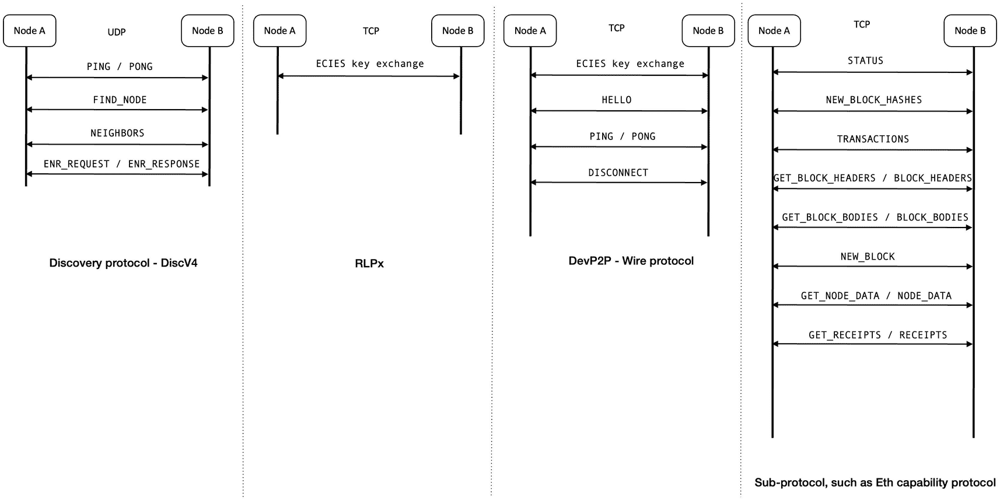
*图 4-15 节点发现与其他协议*

图表有四列，标记为发现协议-discV4、RLPx、DevP2P-线协议以及子协议，例如 Eth 能力协议。

## 以太坊中的密码学

与其他区块链一样，以太坊的安全性依赖于密码学。以太坊在区块链和节点设计中广泛使用了密码学：
- `AES CTR` 用于 `RLP` 握手以及随后的 P2P 消息传递。它也在钱包文件中以 `AES CTR 128-bit` 密码的形式使用。
- 以太坊客户端中的数字签名使用 `SECP256K1` 曲线。该曲线用于交易签名的 `ECDSA` 签名、`ECDH` 密钥交换，以及在 `RLP` P2P 握手之前生成共享密钥。
- `SCRYPT` 和 `PBKDF2` 在钱包文件中用作密钥派生函数。
- `KECCAK-256` 哈希函数用于挖矿和工作量证明算法以及 Solidity 语言中。
- 椭圆曲线集成加密方案（`ECIES`）在以太坊中得到应用。

如果上述术语听起来有些陌生，请参考第 2 章，我们在那里详细介绍了密码学。

### 账户与地址

比特币模型基于交易，而以太坊则基于账户。账户是以太坊状态的一部分，并保持着固有的余额和交易计数。160 位长的地址用于标识账户。账户是用户与区块链交互的方式。由账户签名的交易被验证并广播到网络，一旦执行，就会导致区块链上的状态转换。账户分为两种类型：合约账户（`CAs`）和外部拥有账户（`EOAs`）。`EOAs` 与人类用户关联，而 `CAs` 则与用户没有内在关联。

世界状态是地址与账户状态之间的映射。一个账户状态包含表 4-2 中所示的字段。

**表 4-2 账户状态**

| 元素 | 描述 |
| --- | --- |
| `Nonce` | 从一个地址发起的交易数量，或者对于智能合约而言，是一个账户创建的合约数量 |
| `Balance` | 该地址拥有的 `Wei` 数量 |
| `StorageRoot` | Merkle Patricia 树根节点的 256 位哈希，该树编码了账户的存储内容 |
| `codeHash` | 关联的 EVM 代码（字节码）的哈希 |

## 交易与执行

以太坊中的交易是经过签名的指令，执行后会在区块链上产生消息调用或合约创建（创建与代码关联的新账户）。从根本上说，有两种类型的交易：消息调用和合约创建，但随着时间的推移，为了便于理解，现在通常定义为三种类型：
- 价值转移交易
- 合约创建交易
- 合约执行交易

一笔交易由几个字段组成。每笔交易都是交易树的一部分，交易树的根存储在区块的区块头中。当交易执行时，会返回一个收据，该收据可用作交易执行的验证。

无论是消息调用还是合约创建，交易都包含表 4-3 中所示的公共字段。

**表 4-3 交易结构**

| 元素 | 描述 |
| --- | --- |
| `Nonce` | 发送方已发送的交易数量 |
| `gasPrice` | 为执行交易每单位 Gas 需支付的 `Wei` 数量 |
| `gasLimit` | 预计用于执行交易的最大 Gas 量。它需要预先支付，并且之后不能增加 |
| `to` | 消息调用（价值转移、合约执行）接收方的 160 位地址，或用于合约创建交易 |
| `value` | 要转移到消息调用接收方的 `Wei` 数量。在合约创建的情况下，它是新创建的合约账户（智能合约）的初始资金（`Wei` 数量） |
| `V`、`R`、`S` | 用于确定交易发送方的交易签名对应的值 |
| `init` | （在合约创建交易的情况下）一个不限大小的字节数组，指定用于合约账户（智能合约）初始化过程的 EVM 代码 |
| `data` | （在消息调用交易的情况下）一个不限大小的字节数组，指定消息调用的输入数据 |

一笔交易在以太坊区块链中会经历几个步骤。高层次交易流程描述如下：
1. 首先，创建一笔交易。它可以是合约创建交易或消息调用。
2. 使用 `ECDSA` 对交易进行签名、验证，并广播到网络。
3. 交易通过八卦协议传播，并被矿工和其他节点接收，填充到它们的交易池中。
4. 矿工通过向其添加交易来创建候选区块，并启动挖矿过程。
5. 解决了工作量证明问题的矿工向网络宣布其区块。
6. 其他节点接收该区块，对其进行验证，并将其追加到自己的区块链上。

## 区块与区块链

以太坊中的区块由区块头和交易组成。区块链由包含交易的区块组成。

与其他区块链一样，区块是以太坊的主要构建模块。一个以太坊区块包含区块头、交易列表和叔块（Ommer）头列表。区块头也由几个元素组成。区块中的所有元素及其描述如表 4-4 和 4-5 所示。

**表 4-4 区块结构**

| 元素 | 描述 |
| --- | --- |
| 区块头 | 区块的头部 |
| 交易列表 | 包含在区块中的一系列交易 |
| 叔块（Ommer）头列表 | 叔块（Uncle 或 Ommer）头的列表。叔块是父区块的子区块，但没有任何子区块。它们是有效但过时的区块，虽然无法加入主链，但其参与挖矿可以获得奖励 |

区块头结构如表 4-5 所述。

**表 4-5 区块头结构**

| 元素 | 类型 | 描述 |
| --- | --- | --- |
| `Parent hash` (父哈希) | `Hash` | 父区块头的 `Keccak 256 位` 哈希 |
| `Ommers hash` (叔块哈希) | `Hash` | 叔块列表的 `Keccak 256 位` 哈希 |
| `Beneficiary` (受益者) | `Address` | 用于接收挖矿奖励的 160 位接收方地址 |
| `State root` (状态根) | `Hash` | 状态树根节点的 `Keccak 256 位` 哈希 |
| `Transaction root` (交易根) | `Hash` | 交易树根节点的 `Keccak 256 位` 哈希 |
| `Receipts root` (收据根) | `Hash` | 交易收据树根节点的 `Keccak 256 位` 哈希，该树包含了区块中所有交易的收据 |
| `Logs bloom` (日志布隆过滤器) | `Variable` | 由日志记录器地址和日志主题组成的布隆过滤器 |
| `Difficulty` (难度) | `Integer` | 当前区块的难度级别 |
| `Number` (编号) | `Integer` | 所有先前区块的总数量（即区块高度） |
| `Gas limit` (Gas 上限) | `Integer` | 每个区块 Gas 消耗量的上限 |
| `Gas used` (已用 Gas) | `Integer` | 区块中所有交易消耗的 Gas 总量 |
| `Timestamp` (时间戳) | `Integer` | Unix 纪元时间戳 |
| `Extra` (附加数据) | `Variable` | 用于存储额外数据的可选自由字段 |
| `MixHash` | `Integer` | 计算工作量证明 |
| `Nonce` | `Integer` | 与 `MixHash` 结合使用以证明计算工作量 |
| `basefeepergas` (基础费用/每 Gas) | `Integer` | （`EIP-1559` 之后）记录协议计算出的、交易被纳入区块所需支付的费用 |

以太坊使用一种称为 Merkle Patricia 树的新型数据结构来存储和组织交易及相关数据。它是 Patricia 树和默克尔树的结合，具有新颖的特性。

以太坊使用了四种树来组织数据，如交易、状态、收据和合约存储。

### 交易树（Transaction Trie）

每个以太坊区块都包含一个交易树的根，该树由交易组成。

### 世界状态树

状态树是一个将用户地址映射到账户状态的键值对结构。它也被称为世界状态树，其根哈希被保存在区块中。状态树由多个账户状态组成。

### 交易收据树

交易收据存储了交易执行结果，包含状态、日志和事件等信息。每个区块都包含一棵交易收据树。交易收据树由多个交易收据组成。

### 账户存储树

这棵树的根哈希作为存储根保存在账户状态中。它用于存储智能合约代码及相关数据。

图 4-16 展示了包括区块结构在内的所有树。

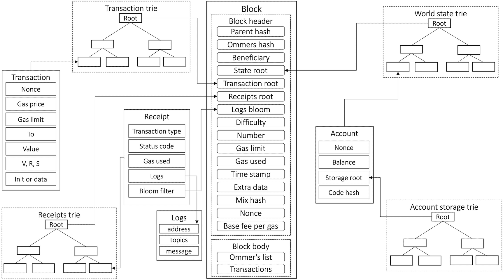
*图 4-16 区块与树*

该图以列表形式呈现了树和区块结构。列出的树包括收据树、交易树、账户存储树和世界状态树。

区块内的交易通过以太坊虚拟机执行，我们接下来将对此进行描述。

# 以太坊中的挖矿

与比特币不同，以太坊的挖矿具有抗 ASIC（专用集成电路）特性。

基于 ASIC 的专用、高效且极快的硬件是为执行比特币挖矿而构建的。这些设备只有一项特定任务，即反复且极快地运行哈希函数 `SHA-256`。

以太坊使用了工作量证明机制；然而其共识算法对内存要求很高，由于内存需求巨大，这使得构建 ASIC 变得困难。该协议被称为 `ETHASH`，它会生成一个大型有向无环图（`DAG`）供矿工使用。`DAG` 会根据网络难度级别增长或缩减；但随着时间的推移，其大小已增长到约 4 GB。由于这个 `DAG` 消耗大量内存，构建具有如此大内存的 ASIC 极其困难，因此使得 `ETHASH` 成为一种抗 ASIC 算法。我们将在第 8 章更详细地解释 `ETHASH`。

# 以太坊虚拟机与智能合约

以太坊虚拟机（`EVM`）是以太坊区块链的核心工作引擎。它是一个深度为 1024 项的 256 位寄存器栈。它被设计用于执行编译为字节码的智能合约代码。智能合约通常用一种名为 Solidity 的领域特定语言（`DSL`）编写；不过也存在其他语言，如 `Vyper`，开发者也可用来编写智能合约代码。

我们可以将智能合约定义为一个安全且无法停止的计算机程序，它代表了一种可自动执行且可强制执行的协议。智能合约不一定需要区块链；然而，区块链是运行智能合约最自然的平台。这是因为区块链提供了所有安全保障，使得智能合约安全、无法停止、可自动执行且可强制执行。

`EVM` 被设计为图灵完备的；但它受到 `gas` 限制的约束，这意味着其执行是计量的，并以以太币计价的所谓 `gas` 费来支付。这种机制允许执行任意代码，但安全地保证当 `gas` 耗尽时执行将会停止，从而防止因循环或恶意代码导致的无限执行。`EVM` 执行由操作码组成的字节码，每个操作都需要消耗 `gas`。大约有 150 种操作码，分为几类：算术操作码、内存操作码和程序流程相关操作码。完整的列表可在以太坊黄皮书中找到。

以太坊的共识基于工作量证明，我们将在第 8 章详细介绍。

以太坊 1.0 区块链将根据其路线图继续发展，并最终在以太坊 2.0 的第一阶段成为一个分片。

至此，我们完成了对这两个最突出且最具开创性的区块链平台的简要讨论。更多现代区块链平台，如 Polkadot、Cardano、Solana、Avalanche 和以太坊 2.0，将在第 8 章讨论它们各自的共识协议时予以介绍。

## 总结

- 区块链是一个点对点、加密安全、只能追加、不可变且防篡改的共享分布式账本，由按时间顺序排列且可公开验证的交易组成。
- 区块链的起源可以追溯到早期创建数字货币和文档数字时间戳的尝试。
- 区块链是一个分布式系统。
- 区块链主要分为两类：许可链和公有链。
- 区块链有许多跨行业用例，包括但不限于政府、金融、医疗、供应链和技术领域。
- 区块链提供了诸多好处，例如节省成本、提高透明度和促进数据共享。
- 公钥密码学、哈希函数和默克尔树等多种技术为构建区块链的安全性提供了基础。
- 从 `CAP` 定理的角度来看，许可链是 `CP` 系统，而公有链是 `AP` 系统。
- 区块链账本抽象具有几种特性，以及 `get()`、`append()` 和 `verify()` 操作。
- 比特币是中本聪发明的第一个区块链。
- 以太坊是 Vitalik Buterin 提出的第一个智能合约区块链平台。
- 比特币和以太坊是最突出的平台。
- 以太坊将成为以太坊 2.0 的一个分片。
- 现代区块链平台正专注于异构多链架构，其中多个链相互操作，形成一个合作和互操作的区块链生态系统，服务于多种用例。