# 5. 区块链共识

区块链共识是区块链的核心要素，它确保了区块链数据的完整性和一致性。区块链作为一个分布式系统，乍一看，我们似乎可以应用传统的分布式共识协议，如 Paxos 或 PBFT，来解决区块链中的一致性和全序要求。然而，这只适用于联盟链，因为其中的参与者是已知且数量有限的。在公有链中，由于无许可环境，传统的共识协议无法工作。然而，在 2008 年，出现了一类新的共识算法，该算法依靠工作量证明，通过解决一个数学难题来确保随机领导者选举。被选出的领导者获得向区块链追加数据的权利。这就是所谓的中本聪共识协议。该算法首次解决了存在大量匿名参与者的无许可公共环境中的共识问题。

我们已经在第 3 章从传统角度讨论了分布式共识。在本章中，我们将介绍什么是区块链共识，如何将传统协议应用于区块链，工作量证明如何工作，它是如何发展的，以及区块链共识的要求是什么，并且我们将通过分布式共识的视角来分析诸如工作量证明等区块链共识。此外，我们还将看到共识的要求如何根据所使用的区块链类型而变化。例如，对于公有链，工作量证明可能是一个更好的主意，而对于许可链，BFT 风格的协议可能效果更好。


## 背景

分布式共识一直是分布式系统中的基本问题。同样，在区块链中，它在确保区块链完整性方面也发挥着关键作用。在过去近 45 年的分布式共识研究中，主要涌现出两大类算法：

1.  基于领导者的传统分布式共识（或称许可型共识）
2.  中本聪及后中本聪共识（或称非许可型共识）

基于领导者的协议基于投票原则运作，即分布式系统中的节点通过投票来执行某项操作。这类协议通常是确定性的，自 20 世纪 70 年代以来便一直在研究中。一些此类协议包括`Paxos`、`PBFT`和`RAFT`。另一类不同的协议于 2008 年随比特币问世而出现，它依赖于工作量证明这类密码学难题。这类协议是概率性的，参与者通过解决工作量证明来赢得向区块链追加新区块的权利。

通常，在区块链世界中，会使用拜占庭容错协议，这主要是因为区块链预计要在公开环境或联盟环境中运行，而恶意攻击在这些环境中是真实存在的。在参与者身份已知的联盟链上，情况或许没那么严重，但由于在这些平台上运行的企业应用的性质，最好还是考虑采用拜占庭容错模型。与金融、医疗、电子政务以及许多其他用例相关的应用都运行在联盟链上；因此，有必要确保能够抵御包括主动攻击者在内的任意故障。

这两种方法各有利弊。与工作量证明类算法相比，传统的 BFT 协议或其区块链变体能够提供更强的一致性，而工作量证明类算法只能提供最终一致性。然而，与传统的 BFT 协议相比，工作量证明共识的可扩展性要高得多。表 5-1 对 BFT 与 PoW 共识进行了比较。

**表 5-1** 传统 BFT 与中本聪共识对比

| 属性 | 传统 BFT | 中本聪 |
| --- | --- | --- |
| 一致性 | 确定性 | 最终性 |
| 终止性 | 确定性 | 概率性 |
| 能源消耗 | 低 | 非常高 |
| 女巫攻击抵抗性 | 否 | 是 |
| 最终性 | 即时 | 概率性 |
| 一致性 | 更强 | 较弱（最终一致性） |
| 通信模式 | 广播 | 流行病式传播 |
| 吞吐量（TPS） | 更高 | 低 |
| 可扩展性 | 较低（10–100 个节点） | 较高（数千个节点） |
| 分叉 | 无 | 可能发生 |
| 身份 | 已知 | 匿名（假名） |
| 网络 | 点对点 | 点对点 |
| 顺序 | 时序性 | 时序性 |
| 形式化严谨性（正确性证明等） | 是 | 基本不存在 |
| 容错能力 | 1/3，<=33% | <=25% 算力 / >50% 算力 |
| 客户端数量 | 多 | 多 |

另一个需要牢记的要点是广播问题与共识问题之间的区别。**共识（Consensus）** 是一个决策问题，而**广播（Broadcast）** 是一个交付问题。两者的属性相同，但定义略有差异。这些属性包括一致性（Agreement）、有效性（Validity）、完整性（Integrity）和终止性（Termination）。本质上，广播和共识是相互关联且深度耦合的问题，因为可以通过一个来实现另一个。

我们将更多地关注共识问题而非广播问题。

## 区块链共识

区块链共识协议是一种机制，它允许区块链系统中的参与者即使在存在故障的情况下也能就交易序列达成一致。换句话说，共识算法确保即使某些参与方发生故障，所有参与方也能就单一的事实来源达成一致。

与区块链共识相关的一些属性。这些属性与标准分布式共识几乎相同，但略有变化。

标准上来说，存在安全性和活跃性属性。安全性和活跃性属性会根据区块链的类型而改变。首先，我们为许可型/联盟链定义安全性和活跃性属性，然后为公有链定义。

### 传统 BFT

我们可以为传统 BFT 共识定义若干属性，这些属性通常用于许可型区块链中。存在多种变体，例如，区块链中使用的`Tendermint`。我们在第 3 章中详细介绍了传统 BFT；然而，在本节中，我们将在区块链（特别是许可型区块链）的背景下重新定义它。大多数属性与公共非许可型共识保持一致；然而，关键区别在于确定性与概率性的终止性和一致性。

### 一致性

没有两个诚实的进程会决定不同的区块。换句话说，没有两个诚实的进程会在相同高度提交不同的区块。

#### 有效性

如果一个诚实的进程决定了一个区块 `b`，那么 `b` 必须满足特定于应用的有效性谓词 `valid()`。此外，达成一致的区块 `b` 必须是由某个诚实节点提议的。

### 终止性

每个诚实的进程最终都会做出决定。在全局稳定时间之后，每个诚实的进程会持续提交区块。

一致性和有效性是安全性属性，而终止性是活跃性属性。

#### 完整性

在一个共识轮次中，一个进程最多只能决定一次。

其他属性可能包括以下内容。

##### 链式进展（活跃性）

区块链必须在 GST 之后通过不断追加新区块来保持增长。

##### 即时不可撤销性

一旦交易被纳入区块并且该区块被最终确定，该交易就无法被移除。

#### 共识最终性

最终性是确定性的且即时的。交易一旦被纳入区块即为最终确定，区块一旦被追加到区块链上即为最终确定。

尽管现在有许多区块链共识算法，但中本聪共识是首个随比特币引入的区块链协议，它具有若干新颖的特性。实际上，它并非具有确定性属性的经典拜占庭算法；相反，它具有概率性特征。

### 中本聪共识

中本聪共识（或称 PoW 共识）可以通过若干属性来刻画。它通常用于公有区块链中，例如比特币。

### 一致性

最终，没有两个诚实的进程会决定不同的区块。

#### 有效性

如果一个诚实的进程决定了一个区块 `b`，那么 `b` 必须满足特定于应用的有效性谓词 `valid()`。此外，区块内的交易必须满足特定于应用的有效性谓词 `valid()`。换句话说，只有有效且正确的交易才能被纳入区块，只有正确且有效的区块才能被追加到区块链上。节点只会接受有效的交易和区块。同时，挖矿节点（矿工）也只接受有效的交易。此外，决定的值必须是由某个诚实的进程提议的。


### 终止性

每个诚实节点最终都会做出决定。

协定性和有效性是安全属性，而终止性是活跃性属性。

注意

在公有区块链网络中，经济激励通常与共识属性相关联，这样，致力于确保网络安全性和活跃性的参与者会因此获得经济上的激励。

还记得我们在第 3 章中讨论过的随机算法，其中终止性以概率方式得到保证。随机化协议用于规避 FLP 不可能性。通常，终止性属性被设计为概率性的，以达成协定从而规避 FLP 不可能性。然而，在比特币区块链中，协定性属性被设计为概率性的，而非终止性。这里，安全属性在一定程度上被牺牲了，因为在比特币区块链中，允许暂时发生分叉，当分叉被解决时，一些先前已确定的交易会被回滚。这是由于最长链规则导致的。

我们现在描述另外几个属性。

#### 共识最终性

对于两个正确的进程`p1`和`p2`，如果`p1`在其本地区块链上追加了一个区块`b`在另一个区块`b'`之前，那么没有其他正确节点会在区块`b`之前追加`b'`。

从工作量证明区块链的角度来看，我们可以进一步提炼出一些属性。

#### 链进展（活跃性）

一条区块链必须通过新块持续不断地追加到其上而稳定增长，每隔`n`时间间隔追加一次。`n`可以是由协议预定义的时间间隔。

#### 一致性/一致性

区块链最终必须愈合分叉链，以形成一条单一的最长链。换句话说，每个人都必须看到相同的历史。

#### 最终不可撤销性

一笔交易被回滚的概率随着更多区块被追加到区块链上而降低。从最终用户的角度来看，这是一个至关重要的属性，因为这个属性给用户带来信心：在他们的交易成为区块的一部分并被最终确定和接受后，新加入的区块会进一步确保该交易永久且不可撤销地成为区块链的一部分。

表 5-1 展示了传统拜占庭容错共识与中本聪共识之间的一些关键区别。

现在我们将注意力转向系统模型，描述这些模型是必要的，因为它们捕捉了我们对区块链共识协议运行环境所做的假设。

## 系统模型

区块链共识协议假设了一个系统模型，在该模型下，它们保证安全性和活跃性属性。在此，我描述两种系统模型，它们分别普遍适用于公有链和许可链系统。

### 公有区块链系统模型（无许可）

区块链是一个分布式系统，其中节点通过消息传递进行通信。在公有区块链中，广播协议通常是概率性的，其中交易（消息）通过利用八卦风格的协议进行传播。

通常，网络模型是异步的，因为处理器延迟或通信延迟没有上限，尤其是因为公有区块链系统很可能是异构且地理上分散的。节点彼此不认识，也不知道系统中总共有多少个节点。节点可以任意加入和离开网络。任何人只需在网络上运行协议软件即可加入。

### 联盟区块链系统模型（许可）

在此模型中，区块链节点通过消息传递进行通信。在共识协议中，广播协议通常是一对所有的通信。例如，在 PBFT 中，领导者将其提议一次性广播给所有副本，而不是像我们在八卦传播中看到的那样，先将消息发送给少数节点，再由这些节点发送给其他节点。此外，网络模型是部分同步的。更准确地说，区块链共识协议在最终同步模型下建模，在该模型中，经过一个未知的全局稳定时间（GST）后，系统保证能够取得进展。

现在，让我们将注意力转向第一个区块链共识协议，并探索其工作原理：工作量证明协议，即中本聪共识。


## 首个区块链共识机制

工作量证明共识算法（即中本聪共识）最早于 2008 年随比特币区块链问世。它本质上是一种领导者选举算法，要求在两次选举之间强制执行随机等待时间。这种机制同时也是抵御女巫攻击的手段。传统分布式共识协议的一个弱点在于，它们要求每个参与者在协议中都是已知且可识别的。例如，在`PBFT`中，所有参与者必须已知且可识别。这种限制（尽管在联盟链中有用）使得 BFT 类协议在某种程度上不适用于公有链。原因在于攻击者可以创建多个身份，并利用这些节点/身份为自己投票。这便是所谓的女巫攻击。如果我们能让在区块链上创建并使用身份的行为成本高昂，那么这种设置就能挫败任何女巫攻击的企图，阻止攻击者通过创建大量虚假身份来控制网络。

“女巫攻击”一词源自 1973 年出版的一本名为《*女巫*》（Sybil）的书，书中主角名叫西比尔·多塞特（Sybil Dorsett），患有多重人格障碍。

首个工作量证明由 Dwork 和 Naor 于 1992 年提出[1]。这项工作旨在打击垃圾邮件，通过为发送电子邮件关联计算成本（即定价函数），形成一种访问控制机制——只有通过计算一个中等难度的函数才能获得资源访问权，从而防止过度使用。工作量证明也曾出现在 Adam Back 的 Hashcash 提案[10]中。

区块链中引入工作量证明的核心直觉是，普遍降低所有参与者的提案速度，这实现了两个目标：第一，它使所有参与者能就一个共同且一致的视图达成共识；第二，它使女巫攻击变得极其昂贵，从而有助于维护区块链的完整性。

已有研究表明，即使网络中只有一个拜占庭节点，在参与者匿名的情况下达成一致也是不可能的（不可能性结果）[2]。这是因为女巫攻击可以创建任意数量的身份，通过多次投票来为攻击者操纵系统。只有找到阻止此类攻击的方法，系统才能按预期工作；否则，攻击者可以创建任意多的身份来攻击系统。这一难题在实际中通过工作量证明共识（即中本聪共识）得到了解决[3]。在比特币之前，利用中等难度谜题在匿名网络中分配身份的想法最早由 Aspnes 提出[4]。然而，Aspnes 提出的解决方案需要认证通道，而比特币使用的是非认证通信，且谜题是非交互式且可公开验证的。

因此，即使在经典文献中存在上述不可能性结果的情况下，中本聪共识依然诞生了，它首次展示了在无许可模式下也能达成共识。

请回想我们在第 3 章中讨论过的随机预言机。在工作量证明中，哈希函数被用来实例化随机预言机。由于哈希函数的输出足够长且具有随机性，攻击者无法预测未来的哈希值或引发哈希碰撞。这些特性使得`SHA-256`成为工作量证明机制中哈希函数的理想选择。

区块链的一个关键需求是交易的全局排序。如果所有参与者都是已知的，且规模仅限于少数节点，那么我们可以使用像 BFT 这样的传统共识；然而，面对成千上万个未知节点，传统 BFT 就无法胜任了。工作量证明共识机制解决了这个问题。

如图 5-1 所示，在比较传统 BFT 与 PoW 时，存在一个可扩展性与性能之间的权衡[6]。

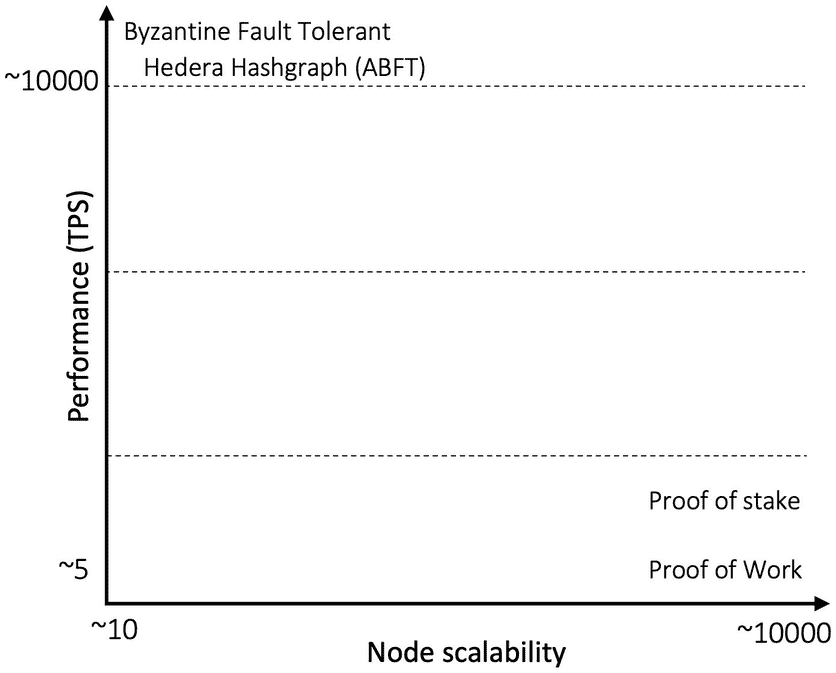

一张图表显示了性能与节点可扩展性的关系。图表包含三条水平平行线。最上面的线对应 ABFT，位于 y 轴值为 10000 处。

**图 5-1** 性能与可扩展性对比

工作量证明（即中本聪共识协议）是一种拜占庭容错协议，因为它能够容忍任意类型的故障。它可以被视为一种最终拜占庭共识机制。

### PoW 的工作原理

我们先来定义 PoW 的一些要求。实际上，工作量证明最初在比特币中引入时，并没有附带任何严谨的文档或正确性证明。此处，为了清晰和易于理解，我们将（几乎是事后地）列出一些要求，并检验 PoW 是否以及如何满足这些要求：

- **一致性**：新区块会被复制到所有节点。
- **与前一区块链接**：日志的维护方式使得每个新条目都与前一条目链接，形成一条链。
- **无许可且开放参与**：节点无需任何访问控制即可加入，也可随时离开。
- **分区容忍性**。
- **地理分散性**。
- **允许数千个节点加入**，世界任何地方的人都可以下载客户端并运行它，从而成为网络的一部分。
- **高度对抗环境**，因此拜占庭容错至关重要。
- **异构性**，允许各种不同类型的计算机和硬件设备加入。
- **异步性**，即对 CPU 或通信延迟没有限制，只保证消息最终有高概率到达所有节点。

问题是，如何为如此艰难的环境设计一个共识协议？然而，比特币 PoW 经受住了时间的考验。除了少数有限且精心策划的攻击以及一些无意的错误外，比特币网络在过去 13 年里基本运行顺畅，没有出现任何重大问题。这是如何做到的？接下来我将进行解释。


#### 工作量证明的教育性解释

设想一个场景：某个节点提出一个区块，并将其广播到网络。收到该区块的节点可以执行两种操作：要么接受该区块并将其追加到本地区块链，要么在区块无效时拒绝它。再设想该区块确实是有效的，那么接收节点可以直接接受它，并就提议的区块达成一致。假设整个系统中只有一个提议节点，并且该节点诚实可信，这意味着实际上并不需要真正的共识；提议节点只需提出新区块，其他节点同意即可，最终形成包含交易的区块的全序列表。但这是一个中心化系统，存在一个可信的第三方，只要它保持诚实，作为领导者就能驱动整个系统，因为所有节点都信任它。但如果它变作恶意节点，那就有问题了。

或许，我们可以允许其他节点也提议区块，从而剥夺这个不可信节点的控制权。假设现在我们有两个节点提议有效区块并广播到网络，这就出现了一个问题：部分接收节点会先添加一个区块再添加另一个，有些节点则不知道接受哪个或拒绝哪个。由于提议是同时发出的，节点不知道应该插入哪个区块；也许它们会同时插入两个。结果，有些节点只添加了提议者 1 的区块，有些只添加了提议者 2 的区块，还有一些则两者都添加。可想而知，这里并没有达成共识。

再设想另一个场景：两个节点同时宣布一个区块；于是接收节点会收到两个区块，此时不再是一条链，而是出现两条链。换句话说，存在两条事件日志和历史记录。两个节点同时提出了区块；所有节点都添加了两个区块。现在不再是单链，而是形成了一棵树，有两个分支。这被称为分叉。换言之，如果节点同时得知两个指向同一父区块的不同区块，那么区块链就会分叉为两条链。

为了解决这个问题，我们可以允许节点选择当前所知的最长链，将新区块追加到该链上，并忽略另一个分支。如果碰巧有两个或更多分支高度相同（长度相等），则随机选择其中一条链，将新区块添加到该链上。这样就能解决分叉问题。所有节点知道“只允许最长链添加新区块”这一规则后，会持续构建最长链。若遇到两条或更多等长链，则随机将区块添加到其中任意一条。到目前为止，一切顺利！这种方案似乎可行。节点决定将新区块添加到随机选择的链上，并将该决定传播给其他节点，其他节点也将同一区块添加到自己的链中。随着时间的推移，最长链会胜出，较短的链则因为没有新区块添加而被忽略，因为它不是最长链。

但现在又出现另一个问题。设想一个场景：某个节点在分叉后随机选择了一条链，添加了一个区块，并将该决定传播给其他节点，其他节点也添加了该区块。此时，由于网络延迟，有些节点并未得知该决定。一些节点将来自另一个节点的区块添加到自己的某条链中，另一个节点则采取相反操作，如此循环。现在可以清楚地看到，两条链都在不断获得新区块。共识无法达成。出现了活锁情况，节点可以持续向两条链添加区块。

至此，让我们思考一下根本原因是什么，以及为什么会出现这种活锁。原因是区块生成速度太快，其他节点从不同节点收到许多不同的区块，有些快有些慢。这种异步性导致了活锁。解决方案是什么？放慢速度！给节点时间收敛到一条链上！我们来看看如何实现。

我们可以引入一个随机等待时间，让矿工任意休眠一段时间后再挖矿。这里的关键洞察是，活锁（持续分叉）问题可以通过在每个节点引入一个可变速定时器来解决。当节点向自己的链添加新区块时，它会停止定时器并将该区块发送给其他节点。其他节点正在等待自己的定时器到期，但在等待期间，如果它们从另一个节点得知了这个新区块，就会停止自己的定时器，添加这个新区块，然后重置定时器并重新开始等待。这样，链上只会添加一个区块，而不是两个。如果定时器时间足够长，那么分叉和活锁的几率就会显著降低。另需注意，如果系统中节点数量很多，那么某个定时器提前到期的可能性就会更高，而且随着节点数量不断增加，这种情况发生的概率会增大，因为定时器是随机的且节点数量众多。为了再次避免同样的活锁情况，我们需要在节点增加时延长这些定时器的休眠时间，从而将节点快速添加区块的概率降低到只有某个节点最终成功为链添加新区块并广播到网络的程度。同时，等待时间还能以高概率确保分叉在这个等待期内得到解决。这段时间足以确保新区块完全传播，使得同一高度不再有其他区块被提出。

比特币根据每 2016 个区块的出块速率来选择这个超时时间，大约相当于两周。由于出块速率大约应为每十分钟一个区块，如果协议观察到近两周出块速度过快，就会增加超时值，从而降低出块速度。如果协议观察到出块速度过慢，则会减小超时值。这个超时机制存在一个问题：如果某个节点变作恶意节点，总是设法让自己的定时器比其他节点更早到期，那么该节点每次都会创建区块。因此，我们需要构建一种能够抵抗此类作弊行为的定时器。一种方法是构建一个具有密码学安全保证的信任机制，充当安全飞地来运行定时器代码。这样，借助密码学的保障，恶意节点可能无法欺骗定时器始终提前到期。

该技术被用于超级账本英特尔锯齿湖区块链中的`PoET`（消逝时间证明）算法。我们将在第 8 章讨论这一点。


另一种方式是中本聪设计算法的原始方式：让计算机执行一项计算量很大的任务，这项任务需要花费时间来解决——时间正好足够让区块几乎每十分钟被挖出一个。同时，该任务的设计方式使得节点无法作弊，只能尝试去求解。任何偏离求解方法的做法都无济于事，因为解决问题的唯一途径是穷举所有可能的答案，并与预期答案进行匹配。如果某个答案与预期答案匹配，问题就得以解决；否则，计算机必须尝试下一个答案，并持续以暴力（`brute-force`）方式进行，直到找到答案为止。这是中本聪的卓越洞见，它以高概率确保计算机无法作弊，并且计时器几乎每十分钟才到期，从而赋予其中一个节点将其区块添加到区块链的权利。这就是所谓的工作量证明（`proof of work`），意味着某个节点已经完成了足够的工作，以证明它投入了足够的计算能力来解决数学问题，从而赢得在区块链中插入新区块的权利。

工作量证明基于密码学哈希函数。它要求区块若要有效，其哈希值必须小于一个特定值。这意味着区块的哈希值必须以一定数量的零开头。找到这样一个哈希值的唯一方法是反复尝试每一个可能的哈希值，并检查它是否满足条件；如果不满足，则继续尝试，直到某个节点找到这样的哈希值。这意味着，要找到一个有效的哈希值，大约需要十分钟，从而引入刚好足够的延迟，使得分叉得以解决并收敛到同一条链上，同时最大限度地减少每次某个节点赢得创建新区块权利的机会。

现在很容易看出，工作量证明是一种机制，用于在区块创建之间引入等待时间，并确保最终只有一个领导者出现，可以将新区块插入到链中。

因此，准确地说，`PoW`并不是一个共识算法；它是一个共识促进算法，通过减慢区块生成速度，使得节点能够收敛到一条共同的区块链上。

在我们理解了工作量证明机制背后的直觉之后，接下来将描述工作量证明算法在比特币中究竟是如何工作的。

#### `PoW`公式

`PoW`共识过程可以用一个公式来描述：

```
SHAd256( nonce || Block header ) <= target
```

其中，`SHAd256`表示对数据进行两次`SHA-256`哈希运算。换句话说，双`SHA-256`意味着对输入的哈希值再取一次哈希。区块头由版本（`Version`）、前一个区块的哈希（`hashPrevBlock`）、`Merkle`根哈希（`hashMerkleRoot`）、时间戳（`Time`）、难度目标（`Bits`）以及随机数（`Nonce`）组成。`Nonce`是一个任意数字，会被反复更改并输入到工作量证明算法中，以检查其结果是否小于或等于难度目标。

目标值是根据挖矿难度计算得出的，难度每`2016`个区块调整一次，大约相当于两周的时间。如果矿工挖矿太快——比如说每八分钟就能生成一个区块，而不是十分钟——这意味着哈希算力过剩；因此，作为一种调节机制，难度会上升。如果矿工在之前的`2016`个区块中生成区块的速度太慢，比如每`12`分钟一个区块，那么速度慢于预期，因此难度会向下调整。让我们来看一些公式。

首先，比特币的难度公式会根据前`2016`个区块的生成速率，计算接下来`2016`个区块的新难度。公式为：

```
New difficulty = ( previous difficulty * 2016 * 10 minutes ) / ( time to mine most recent 2016 blocks )
```

这个公式本质上调节了区块链，使其平均每十分钟产生一个新块。

现在，为了计算目标值，首先使用以下公式计算难度：

```
difficulty = ( possible target ) / ( current target )
```

最后，使用以下公式计算目标值：

```
target = ( possible target ) / ( difficulty )
```

既然我们已经确立了目标值的计算方法，接下来让我们看看矿工们做什么，以及他们如何找到满足上述等式的哈希值，也就是说，对区块进行哈希运算后得到的值小于目标值。换句话说，区块哈希必须匹配一个特定的模式，即哈希值以一定数量的零开头。这也被称为部分哈希逆问题。这个问题的目标是找到双重`SHA-256`哈希函数的一个部分原像，唯一找到它的方法（如果能找到的话）是逐一尝试不同的输入，直到某个输入生效。

从根本上说，比特币挖矿就是寻找一个随机数的过程，当这个随机数与一个区块拼接后，使用`SHA-256`哈希函数进行两次哈希运算，产生一个以特定数量零开头的数字。

那么，矿工们具体做什么呢？


#### 矿工的任务

在比特币区块链网络中，当用户执行新交易时，这些交易会通过点对点 gossip 协议广播到网络上的所有节点。这些交易最终会进入节点的交易池。矿工执行多项任务：

- 矿工维护交易池。他们监听传入的交易，并将这些交易保留在自己的交易池中。
- 他们还监听新区块，并将任何有效的新区块追加到自己的链上。当然，这不仅是矿工的任务，其他非挖矿节点也会同步区块。
- 通过从交易池中选取交易来创建一个候选区块。
- 尝试每一个随机数，找到能使该随机数与区块及前一哈希值拼接后得出的数字小于目标值（根据前述公式 3）的随机数。
- 将新挖出的区块广播到网络。
- 通过接收发送到矿工指定地址的 Coinbase 交易来获取奖励。

让我们看看候选区块包含什么内容，以及它是如何创建的。

一个潜在有效的候选区块，并最终成为有效区块，包含几个元素，如表 5-2 所示。

**表 5-2** 区块元素

| 大小 | 描述 | 数据类型 | 说明 |
| --- | --- | --- | --- |
| 4 | 版本 | 整数 | 区块版本 |
| 32 | `prev_block` | 字符 | 前一区块头的哈希值 |
| 32 | `merkle_root` | 字符 | 区块中所有交易的默克尔根哈希 |
| 4 | `timestamp` | 无符号整数 | 以 Unix 时间格式表示的区块创建时间 |
| 4 | `bits` | 无符号整数 | 区块的网络难度目标 |
| 4 | `nonce` | 无符号整数 | 此区块的随机数 |
| 1+ | `txn_count` | 可变长整数 | 交易总数 |
| 可变 | `txns` | `tx[ ]` | 交易 |

图 5-2 展示了如何从交易池（图左下）中选取交易并创建一棵默克尔树，其根被包含在候选区块中。最后，对区块进行双重 SHA-256 哈希计算，以与目标值进行比较。

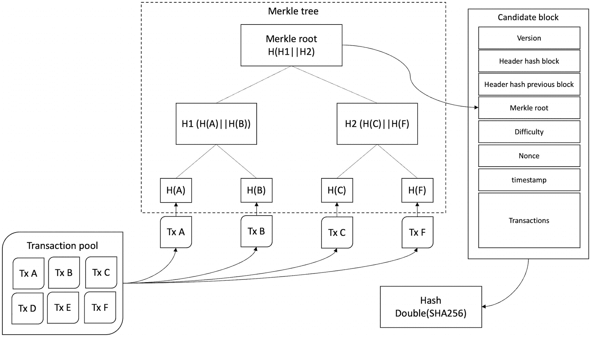

*图 5-2* 从交易池交易到默克尔树和候选区块

`nonce` 是一个从 1 到 2³² – 1 的数字，即一个 32 位的无符号整数，会被包含在区块中。在每次迭代中使用这个 `nonce` 检查结果数字是否小于目标值的过程，被称为挖矿。如果结果数字小于目标值，则意味着挖到了一个有效区块，该区块随后会被广播到网络。

区块中的 `nonce` 字段是一个无符号整数，因此只有 2³² 个随机数可供尝试。因此，矿工可能会很快用完这些随机数。换句话说，这意味着大约有四十亿个随机数可以尝试，鉴于可用的强大挖矿硬件，矿工可以快速完成。即便是普通的计算机，也能轻松快速地完成检查。

当然，这可能会产生一个问题：没有人能找所需的能产生目标哈希值的 `nonce`。即使矿工再次尝试，结果也会相同。此时，我们可以使用区块的其他属性作为变量，不断修改区块，直到区块的哈希值小于目标值，即 `SHA256(区块头 ‖ nonce) < Target`。

那么在遍历所有这些迭代之后，如果仍然没有找到有效的 `nonce` 呢？此时，矿工必须设法增加搜索空间。为此，他们可以通过对区块做一些修改来获取不同的哈希值。他们可以采取以下几种操作：

- 舍弃部分交易、添加新交易或选取一组新的交易。这种修改会重新计算默克尔根，从而改变区块头，进而使哈希值不同。
- 稍微修改 `timestamp`（在两小时范围内；否则会成为无效区块）。只需增加一秒即可实现，这将导致不同的区块头，从而产生不同的哈希值。
- 通过未使用的 `ScriptSig` 修改 Coinbase，可以在其中放入任意数据。这将改变默克尔根，进而改变区块头，最终产生不同的哈希值。

矿工可以不断尝试不同的变体进行修改，直到满足 `SHA256(区块头 ‖ nonce) < target`，这意味着他们找到了一个能解决工作量证明的有效 `nonce`。

有效哈希的发现基于一种称为部分哈希反转的概念。

工作量证明具有一些关键属性。正式地，我们将其列举如下。

#### 工作量证明的性质

工作量证明具有五个性质：完备性、计算复杂性、动态成本调整、快速验证和无进度性。

##### 完备性

该性质意味着证明者生成的证明是可验证的，并且能被验证者接受。

##### 计算复杂——难以计算——生成缓慢

工作量证明的生成速度缓慢，但并非不可处理。生成证明需要消耗大量的计算资源，并且需要相当长的时间。

##### 自动调整成本——动态成本

这是该协议的优雅之处。首先，工作量证明难以计算。生成工作量证明需要付出巨大努力。粗略估计，比特币网络上每秒需要检查超过数千万亿次的哈希值才能解决工作量证明。其次，参数是可调整的，这意味着无论区块生成得快还是慢，无论网络中添加了多少或移除了多少算力，区块生成速率大致保持在每十分钟一个区块。在早期的难度为 1 的时代，区块仍然可以每分钟生成一个；而到了 2022 年，即使难度大约为每秒 25 万亿哈希，该协议仍然会自我调整，区块生成速率仍然保持每十分钟一个。这令人惊叹，也证明了该协议设计之稳健。总而言之，如果在 2016 个区块的周期内，平均每个区块生成时间超过十分钟，那么在下一个 2016 个区块的周期，难度将会下调。如果区块生成过快，平均每个区块耗时少于十分钟（例如，网络引入了某种先进的哈希硬件），那么接下来 2016 个区块的难度就会上调。这就是网络维持平衡状态的方式。另请注意，许多区块的生成时间远低于十分钟；有些则比十分钟长得多，但平均值是十分钟。这是由于该协议的概率性质所致。

##### 快速高效验证——快速验证

该性质意味着证明的验证非常快速且高效。验证证明不应具有计算复杂性。在比特币中，只需要对包含矿工生成的 `nonce` 的区块运行两次 SHA-256 哈希函数，如果 `SHA256(nonce ‖ 区块头) ≤ target`，则该区块有效。这个过程所需时间仅为生成 SHA-256 哈希并进行比较的时间，这两者都是计算效率极高的操作。其核心思想在于，生成一个包含有效 `nonce` 的区块在计算上应该是复杂的；但对于其他节点来说，验证其有效性应该是容易的。


##### 进度无关性

这一特性意味着解决工作量证明的概率与贡献的哈希算力成正比；然而，这依然是一种概率，并非百分之百保证拥有最高算力的矿工总能获胜。换句话说，算力更高的矿工仅能获得成正比的优势，而算力较低的矿工也能获得相应的补偿，有时甚至比高算力矿工更幸运地率先找到区块。

在实际应用中，这意味着每个矿工实际上都在处理不同的候选区块以解决工作量证明。矿工们并非在寻找同一区块的有效随机数，因为交易内容、版本号、Coinbase 差异以及其他元数据不同，经过哈希运算后会得到完全不同的哈希值（对`SHA-256`进行两次运算）。所以每个矿工解决的是不同的问题，探索的是双重`SHA-256`（可简写为`SHAd256`）搜索空间的不同部分。

进度无关性如图 5-3 所示。如图 5-3 所示，矿工们都在处理各自的候选区块，这些区块因上述差异而互不相同。因此，矿工将每个随机数与区块数据拼接后所得的哈希值，都是其他矿工不知晓的。这给了算力较低的矿工一定优势——当某个小矿工试图为其区块寻找有效随机数时，有可能在更高算力矿工为其区块找到有效随机数之前，率先找到解决工作量证明的随机数。

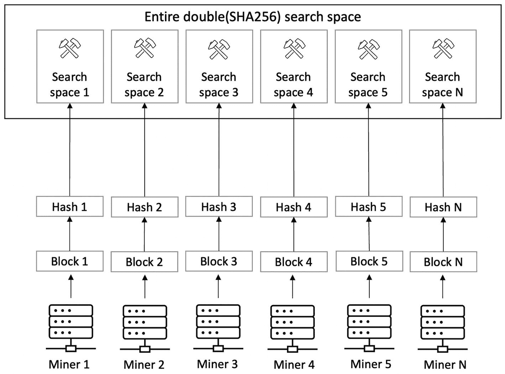

进度无关属性示意图：每个矿工按所述顺序分别处理不同的区块、哈希值及搜索空间。

**图 5-3** 进度无关属性——每个矿工探索双重（`SHA-256`）搜索空间的不同部分

这是工作量证明的另一项巧妙特性，它确保高算力矿工虽有优势，但低算力矿工也有机会幸运地在大型矿工之前找到有效的随机数。关键在于矿工们并不处理同一个区块！如果每次都处理同一个区块，那么算力最强的矿工将始终获胜。这就是比特币工作量证明的“进度无关”特性。

然而，多个矿工也可以协作处理同一个区块（即同一搜索空间），从而分工合作。假设一个区块的搜索空间是 1 到 100，可以将其分为 10 个不同部分，那么所有矿工就能共同处理这一个区块。这样分工后，所有矿工都能贡献算力并按其贡献比例获得奖励。这被称为**矿池挖矿**。与**独立挖矿**（单个矿工尝试，若未找到随机数则前功尽弃，需为下一区块重新努力）不同，在矿池挖矿中，个人的贡献不会白费。

这一概念如图 5-4 所示。

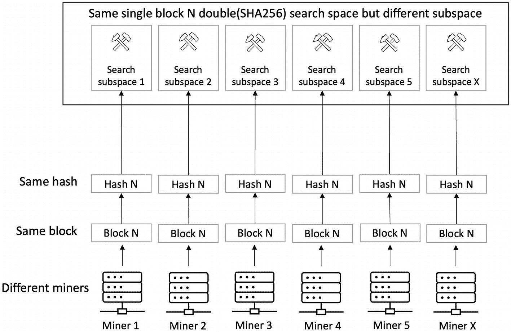

矿池挖矿示意图：每个矿工处理同一个区块及哈希值，但探索不同的搜索空间。

**图 5-4** 矿池——多个矿工处理同一个区块（`SHAd256` 搜索空间）

在图 5-4 中，不同矿工处理由同一区块产生的同一哈希搜索空间。这样，矿池运营者将工作量证明划分为不同部分，分配给矿池中的矿工。所有矿工都贡献算力，最终有一名矿工找到区块，正常广播至比特币网络。矿池运营者获得区块奖励，再根据矿工贡献的算力比例进行分配。

##### 动态参数的概率方面

现在我们来探讨与特性（动态且可自动调整的参数）相关的概率方面问题，我将解释“平均十分钟”的含义以及参数化的意义。

在概率论中，伯努利试验是一种具有两种可能结果（成功或失败）的行为。每次试验中成功或失败的概率是固定的。例如，抛硬币时正面或反面的概率是 50%，且结果相互独立。连续三次出现正面，并不意味着第四次也必然出现正面。同样，在比特币挖矿中，成功或失败的结果（如下所示）依然是独立的，几乎像抛硬币一样概率约为 50%。我们可以通过以下公式看出这一点。

挖矿中的成功与失败可写为如下两个公式：

```
成功 = SHAd256( 随机数 || 区块头 ) < 目标值
```

```
失败 = SHAd256( 随机数 || 区块头 ) >= 目标值
```

工作量证明几乎就像掷骰子，例如，我掷了几次骰子，无法知道下一次何时会出现六点；可能第一次就掷出六点，也可能永远掷不出六点，或者掷多次后才出现六点。同样，无论矿工是尝试了一个随机数来寻找有效随机数，还是尝试了数万亿个随机数，找到有效随机数的平均时间仍然是概率性的。无论已经尝试了 1 亿个随机数还是只尝试了一个，找到有效随机数的概率保持不变。所以尝试数百万个随机数并不会增加找到有效随机数的可能性；即使只尝试一次或寥寥数次，也有可能找到有效随机数。

当伯努利试验重复进行到足以产生连续结果（而非离散结果）时，就被称为泊松过程。可以正式定义：泊松过程是一系列离散事件，事件以已知的恒定平均速率独立发生，但事件发生的精确时间是随机的。

例如，股票价格的波动就是一个泊松过程。泊松过程具有以下特性：

- 事件相互独立，即一个结果不会影响其他结果。
- 单位时间内的事件发生率是恒定的。
- 两个事件不能同时发生。

事件之间的平均时间是已知的，但间隔是随机的（具有随机性）。当然，在比特币中，我们知道两个区块生成事件之间的时间是已知的，大约为十分钟，但生成间隔是随机的。

新区块的平均时间约为十分钟。我们可以用一个简单公式来计算特定矿工找到下一个区块的平均时间。

```
下一个区块的平均时间（特定矿工） = 10 分钟 / （该矿工控制的哈希算力比例）
```


### 攻击者追上概率

本节回答了这样一个问题：攻击者挖到足够区块以接管整条链的概率是多少。假设攻击者拥有部分算力，记为 `q`。商家在接收支付前等待 `z` 个确认（即 `z` 个区块），诚实链的哈希率记为 `p`。

攻击者追上概率 `q[z]` 可按如下公式计算：

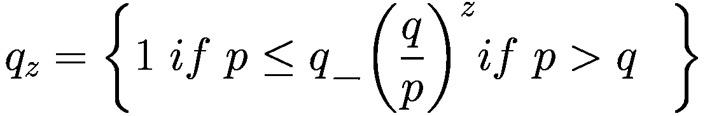

其中

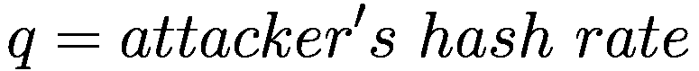

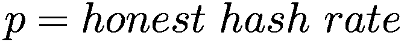

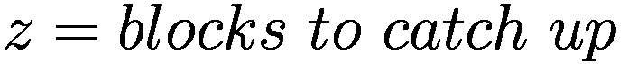

这意味着，如果诚实节点哈希率低于攻击者哈希率，那么攻击者追上的概率为 1；如果诚实节点哈希率高于攻击者哈希率，那么追上的概率为 `(q/p)^z`。

在下一节中，我们将正式描述工作量证明算法。

### PoW 算法

我们可以将整个工作量证明算法形式化地描述如下：

```
1:  nonce := 0
2:  hashTarget := nBits
3:  hash := null
4:  while (true) {
5:    SHA256(SHA256(blockheader || nonce))
6:       if (hash ≤ hashTarget) {
7:            append to blockchain
8:      else
9:            nonce := nonce + 1
10:  }
11: }
```

在上述算法中，`nonce` 初始化为零。网络难度目标 `hashTarget` 取自候选区块头的 `nBits` 字段。`hash` 初始化为 `null`。之后运行一个无限循环，首先将区块头与 `nonce` 拼接，并对其执行两次 `SHA-256` 运算得到 `hash`。接下来，如果生成的哈希值小于目标哈希值，则接受该区块并将其追加到区块链上；否则，`nonce` 自增，并重复上述过程。如果未找到合适的 `nonce`，则算法尝试处理下一个区块。

此过程可参见图 5-5。

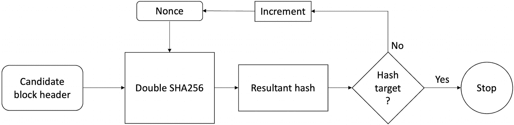

一个包含以下流程的流程图。候选区块头，双重 SHA 256，结果哈希值，哈希目标；是则停止，否则递增。

**图 5-5** 工作量证明

在图 5-5 中，前一个区块哈希、交易及 `nonce` 被输入哈希函数生成一个哈希值，该哈希值与目标值进行比对。如果小于目标值，则为有效哈希，过程停止；否则 `nonce` 递增，整个流程重复，直至生成的哈希值小于目标值时停止。

### 博弈论与工作量证明

博弈论研究的是在策略性互动情境中的行为——个体最佳行动方案取决于他人的选择。博弈论模型以抽象方式模拟现实情境。博弈论在诸多领域都很有用，例如经济学、生物学、社会科学、金融学、政治学、计算机科学等。举例来说，在经济学中，企业推出的产品决策会受到竞争对手产品选择及营销策略的影响。在计算机网络中，联网计算机可能为争夺带宽等资源而竞争。纳什均衡可用于研究政治竞争。在政治领域，政治家的政策会受到对手声明和承诺的影响。

博弈可被定义为对玩家可能采取的所有策略性行动的描述，但不描述可能的结果。

博弈中包含以下几个要素：

- **玩家**：博弈中具有策略理性的决策者
- **行动**：玩家可选的一组行动
- **收益**：玩家针对特定结果获得的报酬

博弈代表了不同的策略情境。一些经典的博弈包括巴赫或斯特拉文斯基博弈、囚徒困境、鹰鸽博弈和猜硬币博弈。在博弈中，玩家在做决策时并不知道其他玩家的行动；这类博弈称为**同时行动博弈**。

可以通过创建一个表格来分析博弈，该表格列出所有可能的玩家行动及收益。这个表格被称为博弈的**策略式**或**收益矩阵**。

**纳什均衡**是博弈论中一个基础且强大的概念。在纳什均衡中，每个理性玩家都会根据其他玩家的选择来选择最佳行动方案。每个玩家都了解其他玩家的均衡策略，且任何玩家都无法通过单方面改变自身策略来获益。简而言之，任何偏离策略的行为都不会为偏离者带来任何收益。


#### 囚徒困境

在这场同时行动的博弈中，两名犯罪嫌疑人被分别关押在无法沟通的独立牢房里。如果两人都认罪，则各自被判入狱三年。如果其中一人认罪并作为证人指控另一人，那么他的指控将被撤销；而另一名嫌疑人将面临四年监禁。如果两人都不认罪，则只会被判处一年监禁。现在你可以看到，如果两名嫌疑人合作都不认罪，这对双方来说都是最佳结果。然而，对每个人来说，免于刑罚的巨大诱惑会促使他们不合作，反而去充当指控对方的证人。如果两人合作都不认罪，这场博弈会让双方都获益，每人只需服刑一年。为了方便理解，我们给这两个角色起名为爱丽丝和鲍勃，看看在这这场博弈中有哪些可能的结果。

这场博弈有四种可能的结果：

1.  爱丽丝不认罪，鲍勃也不认罪。
2.  爱丽丝认罪，鲍勃不认罪。
3.  爱丽丝不认罪，鲍勃认罪。
4.  爱丽丝认罪，鲍勃也认罪。

如果爱丽丝和鲍勃能够以某种方式沟通，他们可以共同决定不认罪，这样每人只会被判一年。然而，这里的占优策略是选择认罪，而不是不认罪。

**占优策略** 指的是无论博弈中其他参与者如何行动，都能使自己获得最大收益的策略。

我们可以用收益矩阵的形式来表示这一点，如图 5-6 所示。

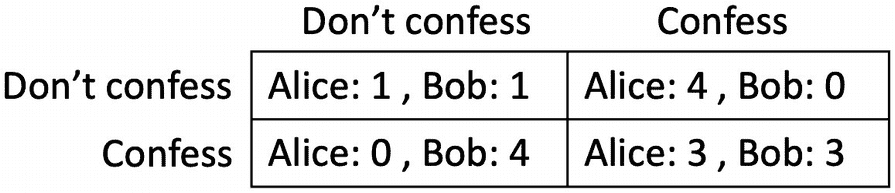

一个 2x2 的囚徒收益矩阵。行和列的标题分别为“不认罪”和“认罪”。矩阵中的数值是爱丽丝和鲍勃各自的得分。

图 5-6 囚徒困境收益矩阵

爱丽丝和鲍勃都清楚这个矩阵，并且知道双方都依此矩阵做出选择。爱丽丝和鲍勃是参与者，“认罪”和“不认罪”是行动，而收益则是监禁年限。

无论爱丽丝怎么做或鲍勃怎么做，对方都会选择认罪。爱丽丝的策略是：如果鲍勃认罪，她也应该认罪，因为一年监禁总比三年好。如果鲍勃不认罪，她仍然应该认罪，因为她可以无罪释放。鲍勃也采用同样的策略。这里的占优策略就是认罪，无论对方怎么做。

最终，两名参与者都认罪，各自入狱三年。这是因为，即使鲍勃设法告诉爱丽丝他打算不认罪的策略，爱丽丝仍然会认罪并充当证人，以避免牢狱之灾。反过来，从爱丽丝的角度看，情况也是如此。因此，在纳什均衡下，对双方而言的最佳结果就变成了“认罪”。这可以被表述为{*认罪*，*认罪*}。

在囚徒困境中，双方参与者存在合作的好处，但无罪释放的可能诱惑却促使彼此竞争。当博弈中的所有参与者都理性时，最佳选择就是达到纳什均衡。

博弈论模型高度抽象；因此，一旦针对特定情境开发出来，它们便可以应用于许多不同的情况。例如，囚徒困境模型可以应用于许多其他领域。在无线网络设备竞争带宽、能源供应等的网络通信中，需要以某种方式规范节点行为，使网络上的所有设备能够协调工作。设想一个网络，其中两个距离很近、工作在同一频率的手机信号塔会相互影响性能。解决这个问题的一种方法是让两个塔都以低能量运行，这样它们就不会相互干扰，但这会降低两个塔的带宽。如果一个塔增加能量而另一个不增加，那么不增加的那个塔就会处于劣势，以较低的带宽运行。因此，这里的占优策略变成了以最大功率运行信号塔，无论另一个塔如何操作，以便它们获得尽可能最大的收益。这个结果与囚徒困境相似，认罪是最佳策略。在这里，最大功率就是最佳策略。

现在，根据以上解释的概念，我们可以从博弈论的角度来分析比特币协议。


##### 工作量证明与博弈论

我们可以将比特币视为一个包含自私参与者的分布式系统；节点可能试图在不做贡献的情况下获取激励，或者试图获取超出其公平份额的更多激励。

比特币协议是一个纳什均衡，因为任何偏离协议均衡策略的行为都不会给偏离者带来收益。该协议的设计方式是，任何偏离协议的行为都会受到惩罚，而正常（良好）的行为则会获得经济激励。比特币中的主导策略是按照协议规则进行挖矿，因为没有其他策略能带来更好的结果。每个参与者只需遵守网络规则就能获得更好的收益。

如果其他矿工不改变他们的策略，攻击者就没有动力改变自己的策略。如果其他参与者不改变策略，任何一方都无法通过转向不同策略来增加自己的收益。这意味着在比特币中，如果所有其他矿工都是诚实的，那么对手就没有动力改变自己的策略并尝试进行恶意挖矿。

比特币中的激励措施，如区块奖励和交易费，会抑制恶意行为。这些激励措施鼓励参与者按照协议行事，这不仅保证了新区块的产生（即网络进展得到保障），也维护了网络的安全性。

自 2009 年以来，比特币网络吸引了大量以矿场、比特币企业、交易所和服务形式存在的投资，以至于网络参与者通过保护网络而非破坏网络能获得更多收益。他们通过保护网络来获益。即使是攻击者也难以获得太多好处。想象一下，如果某个对手设法找到一种方法，将中本聪拥有的所有比特币转移到另一个账户。攻击者可能并没有动机这样做，因为一旦发生这种情况，比特币几乎肯定会变得一文不值，因为这一事件将意味着保护网络的密码学本身已被攻破（假设真正的中本聪已不在世或无法找回其私钥）。

我感觉中本聪没有移动他的比特币，是因为那可能导致比特币大幅贬值。

类似地，即使某个对手设法获得了网络 51%的算力，接管整个网络可能也不再有利可图。为什么？因为在这种情况下，对于对手而言，最佳行动方案是像网络上的其他人一样，用合理的算力默默挖矿以获取经济激励（赚取比特币），而不是利用全部 51%的算力向世界宣布攻击。那几乎会彻底摧毁比特币的价值，攻击者的任何收益都将变得毫无价值。因此，除了某些因人为错误或密钥泄露导致的意外事件外，攻击者没有动机去接管比特币网络。这正是比特币的精妙与优美之处：即使是攻击者也无法通过攻击网络获利。所有参与者只需遵守规则即可获益。矿工的主导策略就是诚实。

这是分布式计算领域首次创建出一个不依赖任何可信第三方且无需许可的网络，但它却能阻止任何攻击者接管网络。在此，我想起了一些与比特币并不直接相关，但有助于理解许多分布式计算专家在初次认识到比特币的精妙之处时可能会产生的感受。

> *这看似不可能是真的，但它确实是真的。*
>
> ——米哈伊尔·格罗莫夫
>
> [`www.ams.org/notices/201003/201003FullIssue.pdf`](http://www.ams.org/notices/201003/201003FullIssue.pdf)

随着比特币的出现以及密码学、分布式计算和经济学的创新性结合，一个名为“加密经济学”的新研究领域应运而生。如图 5-7 所示。

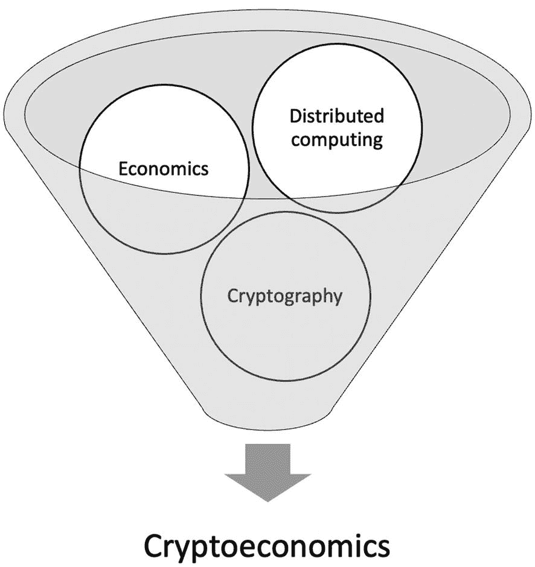

加密经济学融合的示意图。经济学、密码学和分布式计算共同指向加密经济学。

图 5-7

分布式计算、经济学和密码学的融合——比特币

我们也可以将分叉解决机制视为一个谢林点解决方案。这是一个博弈论概念，其中的焦点或谢林点是指人们在缺乏沟通的情况下默认选择的解决方案。类似地，在工作量证明的分叉解决机制中，由于最长（最强）链规则，节点倾向于选择最长的链作为规范链，以便在没有其他节点沟通或指示的情况下添加他们收到的区块。这种无沟通协作的概念是由托马斯·谢林在其著作《冲突的战略》中提出的。

#### PoW 与传统 BFT 的相似之处

从根本上说，所有共识算法都致力于实现安全性和活跃性属性。无论是确定性还是概率性算法，基本上所有共识算法都具有三个主要属性：一致性、有效性和终止性。我们之前介绍过这些术语。问题在于，中本聪共识中我们是否可以重新定义这些属性，使其更贴近区块链世界。答案是肯定的；一致性、有效性和活跃性属性可以分别映射到中本聪共识特有的属性：公共前缀、链质量和链增长。这些术语最早在[`https://eprint.iacr.org/2014/765.pdf`](https://eprint.iacr.org/2014/765.pdf) [7]中被提出。

##### 公共前缀

该属性意味着所有诚实节点将共享相同的、足够长的公共前缀。

#### 链质量

该属性意味着区块链包含一定比例由诚实矿工创建的正确区块。如果链质量受损，则协议的有效性属性无法得到保证。

#### 链增长

该属性意味着新的正确区块持续地、有规律地添加到区块链中。

这些属性可以被视为中本聪世界中对传统共识属性的等价物。其中，公共前缀是（传统上的）一致性属性，链质量是有效性属性，而链增长可以看作是活跃性属性。

### 作为状态机复制的 PoW

工作量证明区块链可以被视为一种状态机复制机制：首先，选举出一个领导者，由他提出一批打包成区块的交易序列。其次，最终确定的（已挖出的）区块通过八卦协议广播给其他节点，这些节点接受该区块并将其追加到自己的本地区块链中，从而实现日志复制。我们可以将其视为领导者提议一个顺序，而所有节点根据区块中设定的交易顺序更新它们的日志（本地区块链）。

我们先来详细了解领导者选举算法和复制算法。


## 领导者选举算法

解决工作量证明难题的节点将被选为领导者，负责最终确定并广播其候选区块。在工作量证明机制中，领导者的选举是作为挖矿节点计算能力的函数来进行的。与其他传统的拜占庭容错协议不同，这里不需要其他节点进行投票。此外，与传统拜占庭容错协议不同，领导者在每个区块都会轮换。这种方法也被后续的区块链拜占庭容错协议所采用，即每个区块都轮换领导者，以防止任何破坏（攻击）领导者的企图。同样，在传统的拜占庭容错协议中，通常只有在主节点（领导者）失效时才会进行更换，而在工作量证明中，每个区块都会选举出一个领导者。工作量证明中的领导者选举基于计算能力；然而，在其他许可链中使用了多种技术，从简单地随机选择领导者或简单的轮换公式，到诸如可验证随机函数等复杂方法。我们将在第 8 章详细介绍这些技术。

领导者选举公式与我们之前在“工作量证明如何工作”一节中介绍的公式完全相同。一旦某个矿工解决了工作量证明难题，它立即被选为领导者，并获得广播其新挖出的区块的权利。此时，该矿工还将获得 6.25 BTC 的奖励。该奖励每四年减半一次。

在领导者选举阶段，矿工节点已成功解决工作量证明难题，现在可以开始日志复制。

### 日志复制

日志复制或区块复制旨在实现节点间的一致性，通过**八卦传播协议**将新挖出的区块广播到其他节点来实现。普通日志与区块链日志之间的主要区别如下：

- 它只能追加，且不可篡改。
- 每批新的交易（区块）都包含前一个区块的哈希值，从而将其链接到所谓的**工作量证明链**或**哈希链**或**区块链**或**区块链**中。
- 区块（日志中的内容）可以通过前一个区块进行验证。
- 每个区块包含交易和区块头。第 4 章详细讨论了此结构。

当新区块被广播时，网络上的每个诚实节点在将其追加到区块链之前都会对其进行验证和确认。领导者选举后的日志复制可以分为三个步骤。

### 新区块传播

区块通过八卦协议进行广播。我们可以在图 5-8 中直观地看到区块传播机制。请注意，节点 1 向节点 2 发送了一条消息（例如，一个新区块），然后节点 2 将该消息发送给节点 4、14 和 13。网络中其他节点的传播模式也类似。

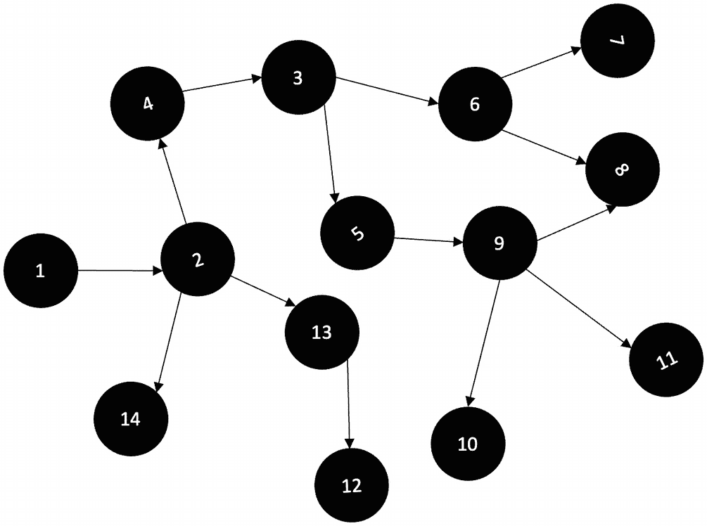

*八卦协议的图示描述了节点间的关系。*

**图 5-8** 比特币中的八卦协议

这种传播方式确保所有节点最终都能以高概率收到该消息。此外，这种模式避免了向所有节点广播消息给单个节点带来的巨大负担。

### 区块验证

区块验证可以被视为状态转换函数。此区块验证函数包含以下高级规则：

- 区块在语法上正确。
- 区块头的哈希值小于网络难度目标值。
- 区块的时间戳未来不超过两小时。
- 区块大小正确。
- 区块内的所有交易均有效。
- 它引用了前一个哈希值。

该协议规定了非常精确的规则，其详细信息可以在 `https://en.bitcoin.it/wiki/Protocol_rules` 找到；然而，上述列表是节点执行的区块验证检查的高级列表。

### 追加到区块链

节点最终会将区块插入到区块链中。在追加到区块链时，可能会发生这些节点收到了两个有效区块的情况。在这种情况下，会发生分叉，节点必须决定将区块追加到哪条链。

我们可以在图 5-9 中直观地看到这个概念。

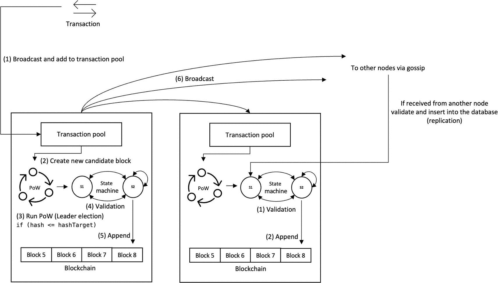

*复制示意图。一笔交易被广播到交易池以创建新区块候选，该候选区块经过验证后被追加。*

**图 5-9** 作为状态机复制的工作量证明

如图 5-9 所示，作为状态机复制的工作量证明包含两个主要操作：通过工作量证明选举领导者，然后通过八卦协议及接收节点的区块验证和插入机制进行复制。在节点上完成工作量证明后，如果工作量证明有效，则该区块的处理方式与从其他节点接收到的区块相同，并在验证后最终插入本地区块链数据库。

在发生冲突时，用于选择最终链的组件称为**分叉处理器**，它包含了如何处理分叉的分叉解决规则。


#### 分叉解决

分叉解决可被视为比特币中的一种容错机制。分叉解决规则确保，在插入新区块时，节点始终选择完成工作量最多的那条链。当同一高度出现一个有效区块时，分叉解决机制允许节点忽略较短的链，仅将区块添加到最长的链上。另请注意，最长链并不总是工作量最大的链；有可能出现一条较短的链背后拥有最大的计算哈希算力，即累积工作量证明，在这种情况下，该链将被选中。

我们可以通过先计算特定区块（例如区块 B）的难度，然后使用以下公式来计算累积工作量证明。一个区块的难度可以定义为：与创世区块的难度相比，找到该特定区块 B 的有效工作量证明随机数要困难多少倍。

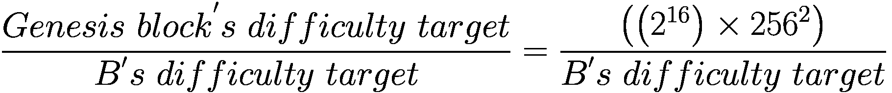

我们可以说，一条链的累积工作量证明是该链上所有区块难度的总和。工作量证明最多的链将被选为新区块的追加目标。

最长链规则最初只是指区块数量最多的链。然而，这个简单的规则后来被修改了，“最长”链变成了创建时工作量最多的链，即最强的链。

在实践中，区块中有一个 `chainwork` 值，有助于识别工作量最多的链，即正确的“最长”或“最强”链。

例如，我们使用

```
bitcoin-cli getblockheader 0000000000000000000811608a01b388b167d9c94c0c0870377657d524ff0003
```

对于区块 687731，我们得到

```
{
"result": {
"hash": "0000000000000000000811608a01b388b167d9c94c0c0870377657d524ff0003",
"confirmations": 1,
"height": 687731,
"version": 547356676,
"versionHex": "20a00004",
"merkleroot": "73f4a59b854ed2d6597b56e6bc499a7e0b8651376e63e0825dbcca3b9dde61ae",
"time": 1623786185,
"mediantime": 1623781371,
"nonce": 2840970250,
"bits": "170e1ef9",
"difficulty": 19932791027262.74,
"chainwork": "00000000000000000000000000000000000000001eb70918030b922df7533fd4",
"nTx": 2722,
"previousblockhash": "00000000000000000000f341e0046c6d82979fdfa09ab324a0e8ffbabd22815d"
},
"error": null,
"id": null
}
```

请注意，将 `chainwork` 值转换为十进制后，得到的数字非常大：6663869462529529036756。这就是该链头背后的工作量。

比特币区块链中可能发生几种类型的分叉：

*   常规分叉

*   硬分叉

*   软分叉

*   拜占庭分叉

##### 常规分叉

当两个竞争解决工作量证明的矿工碰巧几乎同时解决了它时，比特币区块链中自然会发生分叉。结果，两个新区块被添加到区块链中。矿工们会继续在他们所知道的最长链上工作，很快，包含所谓孤儿区块的较短链将被忽略。

图 5-10 中的图表显示了分叉如何影响共识最终性。

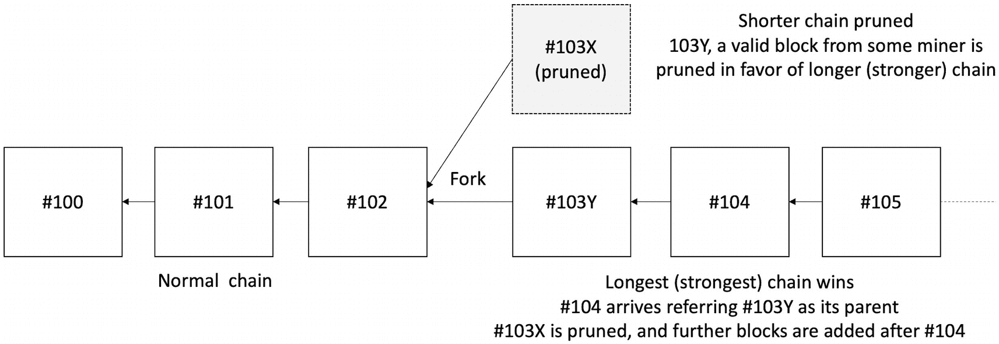

分叉影响的示意图包括正常链、被修剪的较短链以及胜出的最强链。

**图 5-10** 分叉对共识最终性的影响

由于分叉的可能性，共识是概率性的。当分叉解决时，先前接受的交易会被回滚，最长（最强）的链胜出。

这些常规分叉的概率相当低。大约每两周可能发生一次单区块分裂，并且当下一个区块到达时，它会迅速解决，并将前一个区块称为父区块。发生两区块分裂的概率呈指数级降低，大约每 90 年发生一次。发生四区块临时分叉的概率约为每 7 亿年一次。

##### 硬分叉

硬分叉是由于协议变更与现有规则不兼容而发生的。这实质上会创建两条链，一条运行旧规则，另一条运行新规则。

我们可以从图 5-11 中了解硬分叉的行为方式。

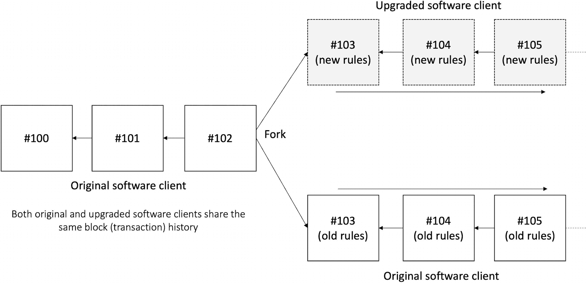

硬分叉图表包括原始软件客户端，并划分为升级后的软件客户端和原始软件客户端。

**图 5-11** 硬分叉

##### 软分叉

当协议变更是向后兼容时，就会发生软分叉。这意味着无需更新所有客户端；即使并非所有客户端都升级，该链仍然是唯一的。但是，任何未升级的客户端将无法使用新规则进行操作。换句话说，旧客户端仍然能够接受新区块。

此概念可在图 5-12 的图表中看到。

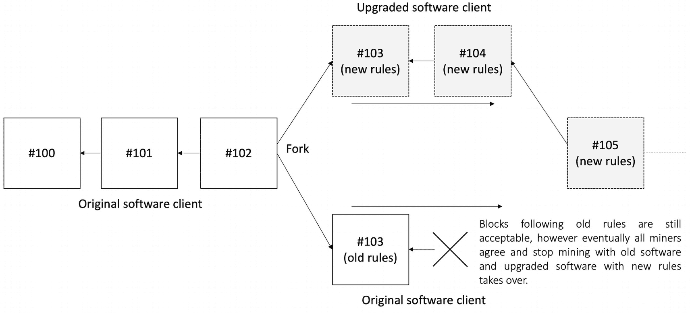

软分叉图表包括原始软件客户端，并划分为升级后的软件客户端和原始软件客户端。

**图 5-12** 软分叉

##### 拜占庭分叉

在攻击者可能试图创建一条新链并成功强加其自身版本链的场景中，可能会发生拜占庭分叉或恶意分叉。

至此，我们完成了关于分叉的讨论。

工作量证明共识的一个核心特征是 Sybil 抗性机制，该机制确保创建大量新身份并使用它们在计算上极其复杂。让我们更详细地探讨这个概念。

##### Sybil 抗性

Sybil 攻击发生时，攻击者会创建多个身份，所有这些身份都属于他们，以通过使用所有这些身份为他们投票来颠覆依赖投票的网络。想象一下，如果攻击者创建的节点数量超过整个网络，那么攻击者就可以使网络偏向于他们。

Sybil 攻击可以在图 5-13 中看到，其中攻击者控制的 Sybil 节点数量超过了网络。

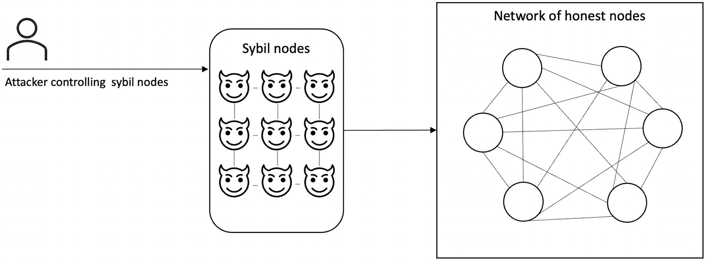

Sybil 攻击的流程图包括攻击者控制的 Sybil 节点、Sybil 节点和诚实节点网络，按所述顺序排列。

**图 5-13** Sybil 攻击

工作量证明使得攻击者使用其控制的多个节点参与网络的成本高得令人望而却步，因为每个节点为了成为网络的一部分都必须执行计算上复杂的工作。因此，控制大量节点的攻击者将无法影响网络。


### 区块时间戳的意义

比特币网络由运行在互联网上的异构、地理分散的节点组成，看起来是一个异步网络。之所以如此，是因为处理器速度和消息延迟都没有上限。在传统的拜占庭容错共识协议中，通常不依赖全局物理时钟，网络假设通常是部分同步网络。然而，在比特币中，所有区块都有一个时间戳字段，由挖出该区块的本地节点填充。这是区块验证过程的一部分，区块只有在时间戳小于或等于最近 11 个区块的中位数时才被接受。此外，时间戳对于维持出块频率、难度调整和网络难度计算至关重要。从这个角度来看，我们可以将比特币网络视为松散同步的网络，网络需要松散的时间同步才能取得进展并确保活跃性。

请注意，比特币网络并非部分同步，因为我们之前已经定义了部分同步及其变体，而比特币网络似乎不符合其中任何一个定义。之所以说它是同步的，是因为区块的时间戳由生成该区块的本地节点生成；但从处理器延迟的角度来看，它几乎是异步的。此外，在区块验证机制中，有一条规则要求区块必须在过去大约两小时内生成（前 11 个区块的中位数），这使比特币成为一个“近乎同步”的系统。这是因为时间戳对于比特币系统的正常运行至关重要；然而，由于对通信和处理器延迟有较大的容忍度，它可以被视为一个松散同步的系统。

另一方面，由于时间戳仅用于系统有限部分的正常运行（即难度计算和区块验证），并非达成共识的必要条件（即，通过解决工作量证明——挖矿来选择领导者），那么从这个角度来看，它是一个异步系统，因为处理器和通信延迟没有定义的上限，但消息最终会通过 gossip 协议的概率性保证到达节点。

在比特币区块中，时间戳并非 100% 精确，但足以保护工作量证明机制。最初，中本聪设想结合系统时钟、其他服务器时钟的中位数以及 NTP 服务器来调整时钟。然而，NTP 从未被实现，而其他节点时钟的中位数仍然是网络中时钟调整的主要来源。

区块时间戳不仅为区块哈希提供了一些变化（这对工作量证明很有用），还有助于防止区块链被操纵，例如攻击者可能试图在区块链中插入无效区块。当一个比特币节点连接到另一个节点时，它会从对方那里接收到 UTC 格式的时间戳。接收节点随后计算接收时间与本地系统时钟的偏移量并存储起来。网络调整时间则计算为本地 UTC 系统时钟加上所有已连接节点的中位数偏移量。

比特币区块的时间戳有两条规则。有效时间戳必须大于前 11 个区块的中位数时间戳。它还必须小于根据从其他已连接节点接收的时间（即网络调整时间）计算出的中位数时间戳加上两小时。然而，这种网络时间调整与本地系统时钟的差值绝不能超过 70 分钟。

结论是，比特币实际上只有在同步网络模型下才是安全的。更确切地说，它是一种无锁步同步，存在某个已知的有限时间界限，但执行过程并非锁步进行。

### 一个注意事项

交易的顺序并非由共识驱动。每个矿工按照客户端中硬编码的顺序选取交易，确实存在一些可能导致交易审查、忽略或重排的攻击。事实上，共识是在区块上达成的，而且也不是通过投票实现；一旦矿工解决了 PoW，它就赢得了在链上添加新区块的权利。当然，其他节点在收到该区块后会对其进行验证，但在成功矿工广播挖出的区块后，并不存在真正的协商或投票机制。没有投票或共识来同意这个新区块；当选领导者并因解决 PoW 而赢得添加新区块权利的矿工，其他节点只要它通过`valid()`谓词检查就会接受它。

因此，这里的注意事项是：当通过从交易池中选取交易来创建候选区块时，这些交易会按一定的顺序被选取，而矿工可以影响这个顺序。例如，一些矿工可能选择不包含任何无手续费的交易，只包含那些支付手续费的交易。这对矿工来说或许公平，但对用户和整个比特币系统来说并不公平！然而，最终所有交易都会被添加，即使是那些没有手续费的交易，但它们可能要在被加入交易池相当长的时间之后才会被考虑。如果它们已经“老化”，那么最终会被包含进去。此外，在假设网络中始终存在多数诚实矿工的情况下，预计交易会在合理的时间内按照协议规范被选取。

现在让我们看看这个顺序是什么。

交易是根据其优先级从交易池中选取的，优先级使用以下公式计算 [8]：

```
priority = sum( input value in base units × input age ) / size in bytes
```

```
p = Σ( v_i × a_i ) / s
```

令人担忧的是，交易的排序并不公平，会导致抢先交易和其他相关攻击。我们将在第 10 章讨论公平排序问题。


## 工作量证明：拜占庭将军问题的一种解决方案

中本聪本人曾在帖子[5]中描述过这一点。我将在这里简明扼要地阐述其中的逻辑。

回顾拜占庭将军问题，其核心在于：在存在叛徒将军和信使可能被截获的情况下，如何就进攻时间达成一致。在工作量证明的场景中，我们可以将矿工视为将军。将军们之间的共识是：任何一位将军都可以宣布进攻时间，最先被听到的进攻时间将被视为权威的进攻时间。然而，问题在于，如果两位将军几乎同时提出了不同的时间，由于消息传递的延迟，部分将军可能先收到其中一个进攻时间，而另一些将军则先收到另一个进攻时间，从而导致分歧。为了解决这个问题，每位收到进攻时间的将军都会开始求解一个复杂的数学难题。当一位将军解出这个数学难题（即工作量证明）后，他会将其广播到整个网络。当其他将军收到该解时，就会切换到这个新时间。

所有将军都可以提出一个时间，但最终所有将军只会接受其中一个被提出的时间为有效时间。

要使一个被提出的时间有效，其条件是：每位将军必须求解一个数学难题，并将其附加到提案时间消息上；如果其他将军收到该消息并验证了数学难题的解是有效的，他们就会接受那个时间。这个数学难题有两个目的：首先，它证明了提出时间的将军是诚实的，因为他解决了数学难题；其次，它阻止了将军们快速连续地提出多个时间，因为这会导致将军们之间的分歧和混乱。我们可以看到，这种机制可以被视为拜占庭将军问题的一种解决方案；不过，它有一个折衷方案，即暂时性的分歧是可接受的。

比特币的工作量证明是一种概率性共识算法。现在，一个重大问题出现了：当节点数量未知且存在拜占庭节点时，是否能够实现确定性共识？

现在，让我们根据目前对工作量证明算法的理解，重新审视本章开头定义的有效性、一致性和终止性这三个属性。

我们现在可以清楚地看到，PoW 并非经典的确定性拜占庭共识算法。它是一个具有概率性属性的协议。

让我们重新审视这些属性。

### 一致性

一致性属性是概率性的。之所以如此，是因为可能发生两个不同的矿工几乎同时生成有效区块的情况，一些节点会添加来自一个矿工的区块，而另一些节点则添加来自另一个矿工的区块。然而，最终，最长（最强）链规则将确保工作量证明较少的链被修剪掉，最长的链胜出。这将导致之前已被接受的交易被回滚；因此，一致性是概率性的。

### 有效性 – 基于谓词

这是一个确定性的属性协议，其中诚实节点只接受那些有效的区块。形式上，我们可以说：如果一个正确的进程 `p` 最终就 `b` 做出了决定，那么 `v` 必须满足特定于应用的 `valid()` 谓词。我们在本章前面部分已经详细讨论了有效性谓词，即区块验证标准。

### 终止性

终止性是一个概率性属性。由于自然分叉的可能性，它只是最终才能实现。这是因为在出现分叉的情况下，必须解决分叉问题才能最终终止关于该区块的共识过程。由于之前被接受的区块有可能被回滚以支持最重/最长的链，所以终止性只能概率性地得到保证。通常，为了高概率地确保交易的最终性，实践中传统上需要六个确认。这意味着该区块在链上至少又深了六个区块，这使得回滚的可能性变得极低，几乎永远不会发生，或者千年一遇。

至此，我们对工作量证明的讨论就结束了。

## 工作量证明的担忧

关于 PoW 存在几项担忧，包括攻击和极高的能源消耗。

在下一节中，我们将讨论一些可能针对工作量证明共识发起的攻击，这些攻击会对比特币网络产生不利影响。

### 51% 攻击

当超过 50% 的挖矿算力被一个对手控制时，比特币就可能发生 51% 攻击。

表 5-3 列出了对手在接管网络超过 50% 算力后可能尝试采取的行动。

**表 5-3** 对手可能的行动列表

| 攻击类型 | 可能性 | 解释 |
| --- | --- | --- |
| 审查交易 | 是 | 可以忽略交易 |
| 窃取币 | 否 | 受私钥控制 |
| 双重支付 | 是 | 可以创建私有的链外分叉，并排除包含之前已花费交易的区块 |
| 更改协议 | 否 | 协议无法更改，因为诚实的节点会直接忽略无效区块 |

请注意，一些攻击仍然不可能，而对系统最有害的攻击是可能的，比如双重支付。

### 自私挖矿

这种攻击发生在某个找到区块的矿工不公布它，而是将其保密，并私下在其之上继续挖矿。假设攻击者设法创建了另一个区块。现在，攻击者在其私有的分叉链上有了两个区块。此时，攻击者等待其他人找到区块。当攻击者看到这个新区块时，他们会发布自己的两条区块的链。由于其他矿工是诚实的，并遵守最长链规则，他们会接受这条新链作为最长链。现在，其他矿工挖出的区块就成了孤立区块，尽管他们为此花费了资源，但那些工作都白费了。攻击者也可以等待一条更长的链被创建出来，虽然这在很大程度上靠运气，但如果攻击者成功创建了一条比诚实链更长的私有分叉，那么他们可以在其他某个区块被宣布后立即发布它。当节点看到这条新的最长链时，根据规则，它们会开始在这条新的更长链上挖矿，并孤立其他链，这些链可能只比攻击者的链短一个区块。所有投入到创建诚实链上的工作现在都浪费了，攻击者获得了奖励，而原本在诚实链上工作的其他矿工则一无所获。

### 竞态攻击

这种攻击可能发生在对手可以向一个受益人付款，然后向自己或其他人进行第二次付款的情况下。如果第一笔付款在零确认后被接收者接受，那么第二笔交易有可能被挖出并包含在下一个区块中，而第一笔交易可能一直未被挖出。结果，第一个收款人可能永远也收不到他们的款项。


### 费尼攻击

当收款方接受零确认付款时，可能发生费尼攻击。这是一种双花攻击，攻击者会创建两笔交易：第一笔是向收款方（受害者）付款，第二笔是向自己付款。但攻击者不广播第一笔交易，而是将第二笔交易打包进一个区块并完成挖矿。此时，攻击者才释放第一笔交易并购买商品。商户未等待确认就接受了付款。随后攻击者广播包含第二笔交易（付款给自己）的预挖区块。由于第二笔交易优先级更高，第一笔交易因此失效。

### Vector76 攻击

此攻击结合了费尼攻击和竞态攻击。即使交易已有一笔确认，这种攻击仍能强大到足以逆转交易。

### 日蚀攻击

此攻击试图屏蔽节点对网络状态的正确感知，可能导致服务中断、双花攻击和资源浪费。比特币已实施多种解决方案来修复该问题。更多详情可参见：[`https://cs-people.bu.edu/heilman/eclipse/`](https://cs-people.bu.edu/heilman/eclipse/)。

### 环境、社会和治理（ESG）影响

ESG 指标综合反映了环境、社会和治理方面的问题。这些指标被用于评估一家公司在环境、社会和治理方面的风险敞口。投资者会据此做出投资决策：他们可能规避 ESG 风险较高的领域，更倾向于选择 ESG 风险较低的公司。

工作量证明机制因能耗过高而受到批评。确实，在撰写本文时，比特币区块链的总能耗已超过整个巴基斯坦（来源：[9]）。

环境、社会和治理方面的担忧一直是有远见的主流投资者兴趣低落的原因。尽管如此，尽管存在 ESG 争议，比特币在很大程度上仍可被视为成功的案例。

比特币不仅因高能耗受到批评，还常被视为犯罪活动的工具——它已被接受为非法毒品及其他犯罪活动的支付方式。

中心化问题同样令人担忧：拥有矿场的强大矿工占据了比特币网络的大部分算力。用于建造这些矿场的 ASIC 芯片仅由少数制造商生产，这也意味着该领域高度中心化。此外，对比特币挖矿的打击行动[13]可能导致进一步的中心化，只有最强大的矿工才能承受冲击并幸存，最终只剩少数几个强大矿工。

然而，比特币也有有利的一面。比特币可作为跨国移民家庭汇款机制，也可用于经济困难国家的支付手段，还能服务于约 17 亿[12]无银行账户人口。比特币是金融包容性的载体。

我们可以设想这样的场景：比特币矿场产生的热量可用于加热水，最终为房屋供暖。甚至可以利用热电效应，通过热电发电机发电并回馈电网。当然，这需要解决经济学和工程学问题，但这个构想是可行的。

> *热电发电机是一类固态器件，可直接将热能转化为电能，或将电能转化为热能用于加热或制冷。此类器件基于热电效应，涉及热量和电流在固体中流动时的相互作用。[11]*
> 
> ——《大英百科全书》，2007 年 3 月 1 日，[`www.britannica.com/technology/thermoelectric-power-generator`](http://www.britannica.com/technology/thermoelectric-power-generator)

支付系统乃至任何系统都需要电力运行。比特币被批评消耗过多能源，但这正是为系统健壮性付出的代价。当前网络难度如此之高，以至于即使众多攻击者联手，也无法产生足够的算力发动 51%攻击。所以，虽然消耗了电力，但同时也换来了回报。除了比特币的安全性，还有其他好处，例如：

*   在受压制政权下可使用。
*   无国界支付。
*   为无银行账户者提供金融服务。
*   顺畅的跨境汇款。
*   无需任何中介的替代支付系统。
*   去中介化支付。

综上所述，比特币尽管能耗高且未完全实现“一 CPU 一票”的原始理念，仍可被视为一个具有诸多优势的成功项目。

### 工作量证明的变种

根据运行硬件的不同，工作量证明算法分为两种类型：

*   CPU 密集型工作量证明
*   内存密集型工作量证明

#### CPU 密集型工作量证明

此类谜题的求解速度取决于处理器速度。CPU 密集型工作量证明是指，求解加密哈希谜题所需的处理能力与 CPU 或 ASIC 等硬件的计算速度成正比。由于 ASIC 主导了比特币工作量证明，并为有能力使用 ASIC 的矿工带来了不当优势，这种 CPU 密集型方式被视为有中心化趋势。此外，拥有超强算力的矿池可能会将权力平衡向自己倾斜。因此，引入了对 ASIC 有抗性的内存密集型工作量证明算法，这些算法基于内存导向设计而非 CPU。

#### 内存密集型工作量证明

内存密集型工作量证明算法依赖系统内存来提供工作量证明。在此类算法中，性能受限于内存访问速度或内存大小。这种对内存的依赖也使这些工作量证明算法具有 ASIC 抗性。Equihash 是最著名的内存密集型工作量证明算法之一。

还有其他工作量证明的改进和变种，我们将在第[8]章(#515270_1_En_8_Chapter.xhtml)中介绍。

## 总结

在本章中，我们介绍了区块链共识：

*   工作量证明是比特币引入的第一个区块链共识，同时也是拜占庭将军问题的一个解决方案。
*   区块链共识可分为两类：中本聪共识和传统的基于 BFT 的共识。
*   传统 BFT 是确定性的，而中本聪共识是概率性的。
*   比特币的工作量证明是一种女巫抵抗机制、双重支付预防机制，以及拜占庭将军问题的解决方案。
*   工作量证明可从博弈论角度看待，其中协议是一个纳什均衡，所有参与者的最优策略是保持诚实。
*   工作量证明本质上是一种拜占庭容错协议。
*   工作量证明是一种状态机复制协议，挖出的区块通过八卦协议被宣布并复制到其他节点。
*   工作量证明消耗高能量，存在 ESG 方面的担忧；然而，它也有诸多好处。


