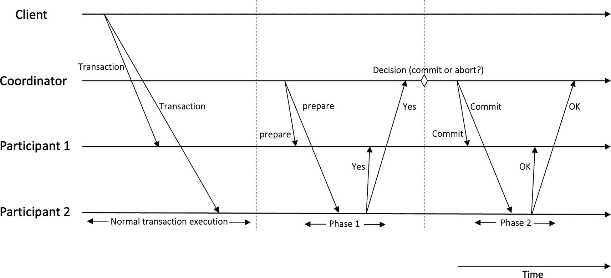
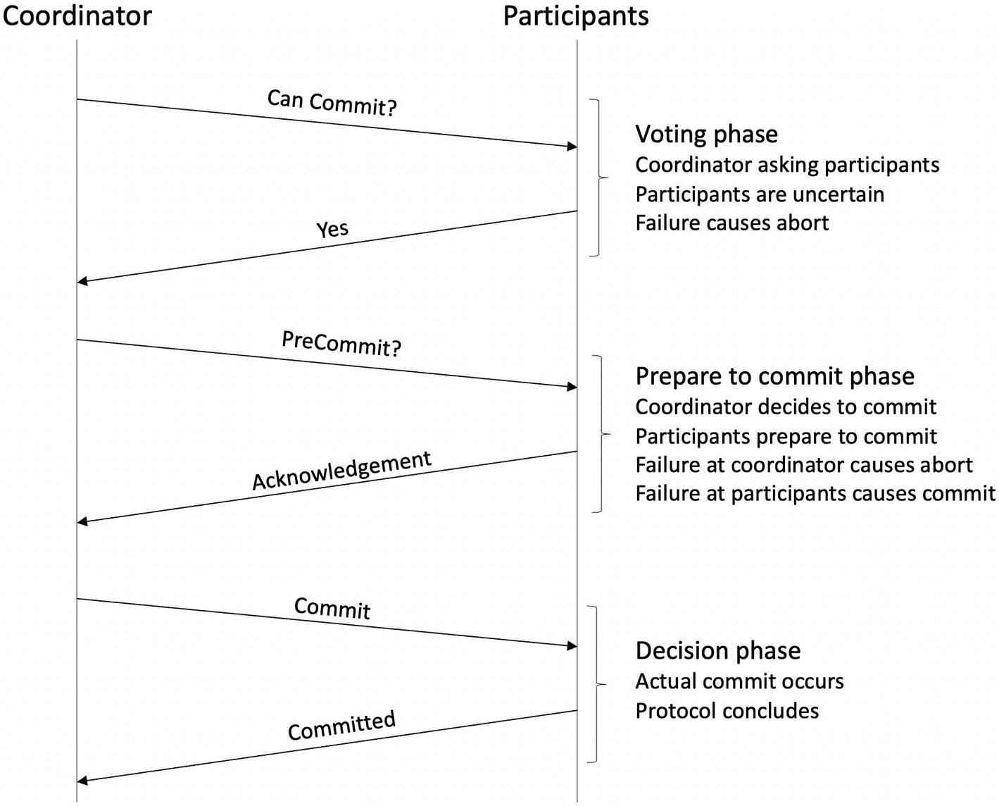
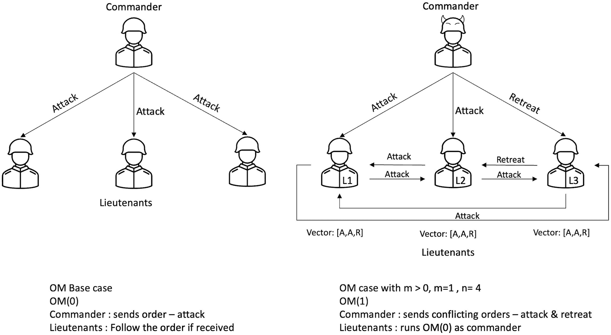
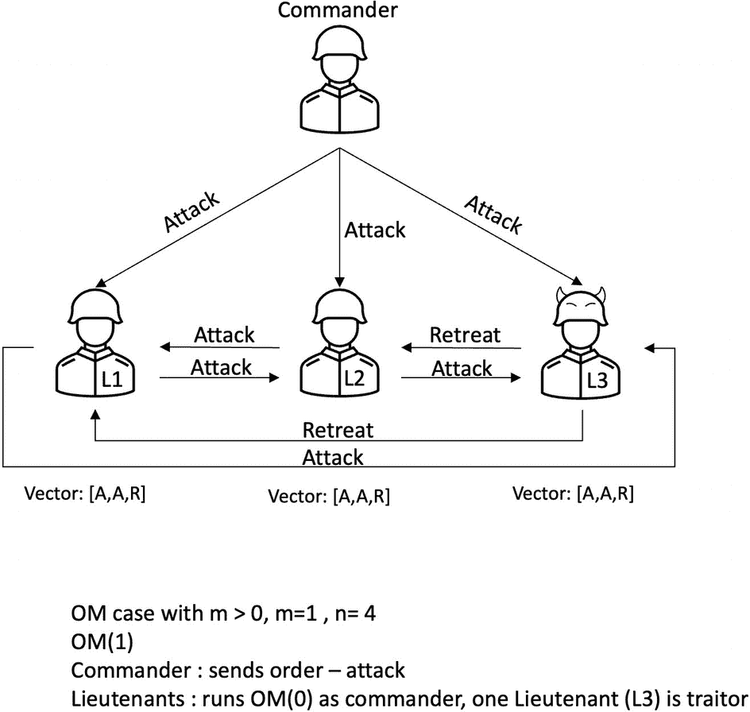
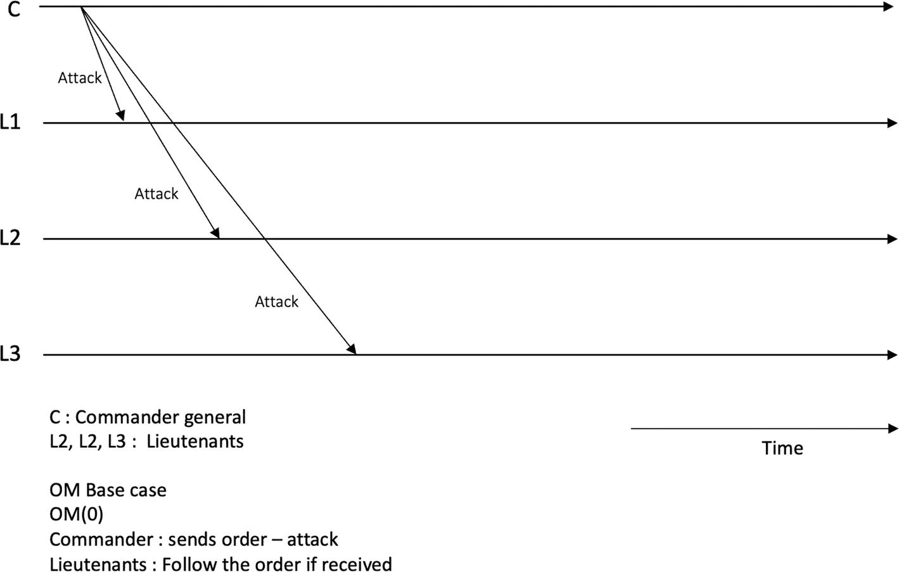
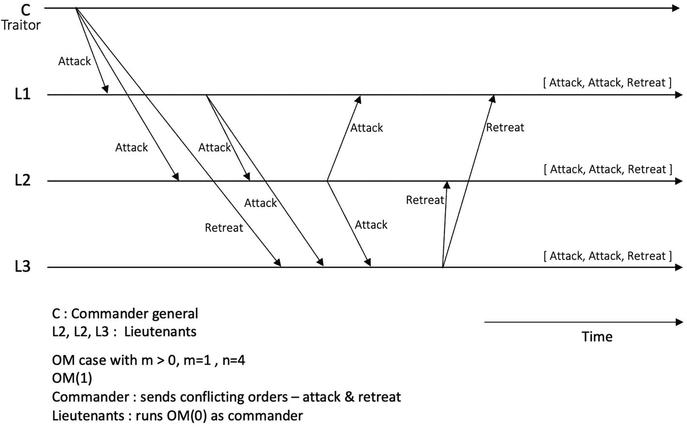
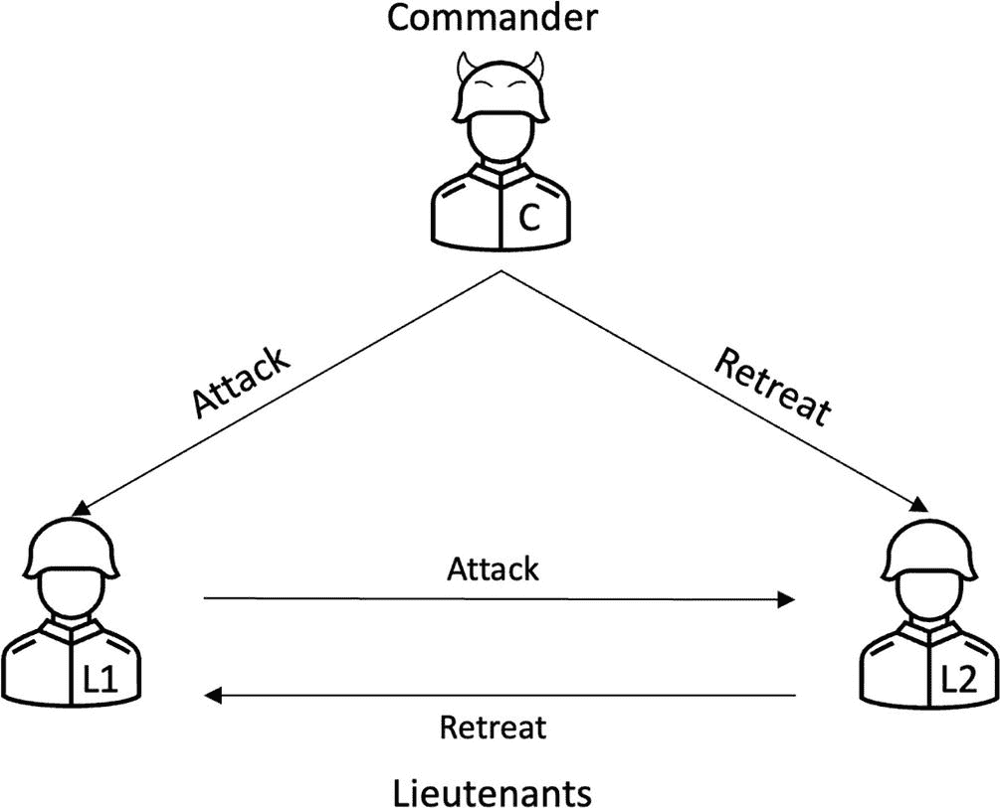
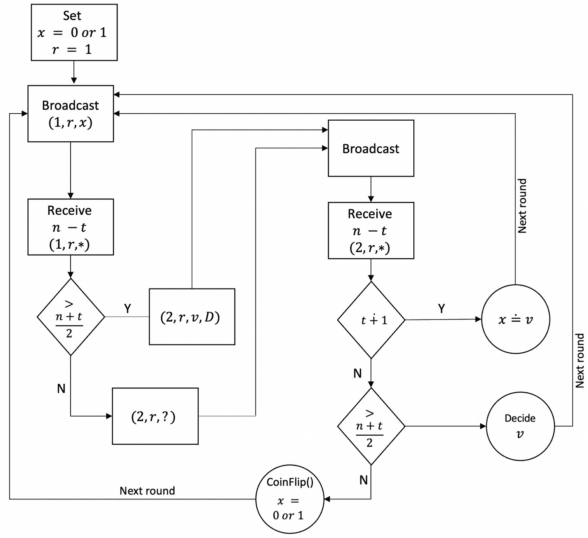
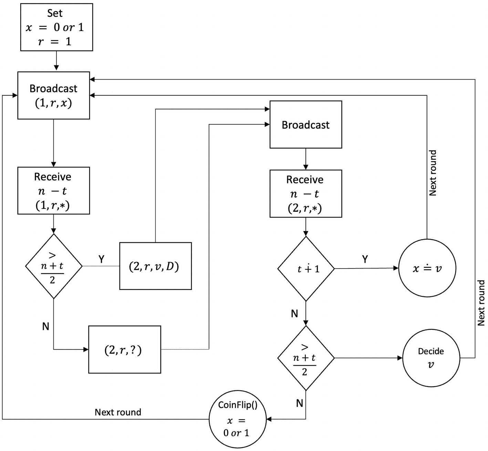
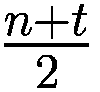

# 6. 早期协议

在本章中，我将介绍早期的协议。首先，我们从分布式事务和相关协议（例如两阶段提交）的背景知识入手。之后，我们将继续旅程，审视共识协议，并以分布式计算中的一些基础性结论作为本章的收尾。本章将介绍早期的共识算法，例如 Lamport 等人、Ben-Or 等人以及 Toueg 等人提出的算法。在继续我们向更复杂、更现代协议的航行之前，理解这些基本概念是很有帮助的。

## 引言

在我看来，20 世纪 80 年代是分布式计算领域创新和发现的黄金时代。许多基本问题、算法和结论，例如拜占庭将军问题、FLP 不可能性结论、部分同步性以及规避 FLP 不可能性的技术，都是在 20 世纪 70 年代末和 80 年代被发现的。从 Lamport 的杰出论文《分布式系统中的时间、时钟和事件排序》到拜占庭将军问题，再到 Schneider 的状态机复制论文，一个接一个，这些都对共识问题乃至整个分布式计算领域做出了最重要的贡献。

共识可以定义为一种达成一致的协议。以下列出了主要贡献的概要。

在 1978 年发表的开创性论文《分布式系统中的时间、时钟和事件排序》中，Lamport 描述了如何在无故障情况下使用同步时钟对事件进行排序。随后在 1980 年，论文《在存在故障的情况下达成一致》提出了一个问题：在一个不可靠的分布式系统中是否能够达成一致。该论文证明，如果分布式系统中故障节点的数量少于总进程数的三分之一，即`n >= 3f + 1`，其中`n`是节点总数，`f`是故障处理器的数量，那么一致是可以达成的。在 1982 年的论文《拜占庭将军问题》中，Lamport 等人表明，如果超过三分之二的将军是忠诚的，那么使用口头消息就可以解决一致性问题。1982 年，Danny Dolev 的论文《拜占庭将军再次出击》表明，如果故障处理器的数量少于总数的三分之一，并且网络的连通性超过一半，那么全体一致性是可以实现的。

全体一致性是这样一种要求：如果所有进程的初始值都是相同的，比如说`v`，那么所有进程都决定这个值`v`。这是强全体一致性。然而，一种称为弱全体一致性的较弱变体只要求在所有进程都正确（即没有进程发生故障）的情况下才满足此条件。

这篇论文还首次证明了分布式系统必须要有`3f + 1`个节点才能容忍`f`个故障。然而，著名的 FLP 结论稍后出现，它证明了即使只有一个进程发生崩溃故障，确定性异步共识也是不可能实现的。FLP 不可能性意味着，在异步网络中，无法保证共识协议的安全性和活性。

Lamport 的算法是针对同步环境设计的，并且假设所有消息最终都会被送达。此外，它不具备容错性，因为一个单一故障就会导致算法停止。

在 FLP 不可能性结论出现之后，人们开始尝试规避它，并仍然解决共识问题。规避 FLP 的直觉是放松对时序和确定性的一些更严格的要求。

Ben-Or 提出了最早的算法，通过牺牲一定程度的确定性来规避 FLP。由于 FLP 不可能性意味着在异步条件下，总会有一些执行不会终止，避免这种情况的一种方法是尝试让终止具有概率性。因此，使用概率性终止代替确定性终止。这些算法背后的直觉是使用“通用硬币”方法，即如果一个进程没有从其他节点收到消息，它会随机选择其值。换句话说，如果一个进程没有从其他进程那里收到关于某个值的多数投票，它可以选择一个值进行投票。这意味着最终超过半数的节点最终会投票给同一个值。然而，该算法的通信复杂度随着节点数量的增加呈指数级增长。后来，Rabin 提出了一种在固定轮数内达成共识的方法。与今天普遍已知的下界`3f + 1`相比，这些方案分别需要`5f + 1`和`10f + 1`轮。

放松时序（同步性）要求的共识协议旨在所有情况下提供安全性，而仅在网络同步时提供活性。Dwork、Lynch 和 Stockmeyer 的工作是一个重大突破，他们首次引入了更现实的**部分同步**概念。这个模型更加实用，因为它捕捉了真实分布式系统的行为方式。更准确地说，分布式系统可以在任意长的时段内处于异步状态，但最终会恢复到足够长的同步状态，以便系统做出决策并终止。这篇论文介绍了处理器和网络的同步性与异步性的各种组合，并证明了这些场景的下界。

> **注意**  
> 我们在第 3 章中详细讨论了部分同步性。

表 6-1 展示了 DLS88 论文的结论总结，显示了存在容错共识协议所需的最小处理器数量。

**表 6-1** 存在容错共识协议所需的最小处理器数量

| 故障类型 | 同步 | 异步 | 部分同步通信和处理器 |
| --- | --- | --- | --- |
| 停止故障 | `f` | 不适用 | `2f + 1` |
| 遗漏故障 | `f` | 不适用 | `2f + 1` |
| 已认证拜占庭故障 | `f` | 不适用 | `3f + 1` |
| 拜占庭故障 | `3f + 1` | 不适用 | `3f + 1` |

这篇论文介绍了 DLS 算法，该算法在部分同步条件下解决了共识问题。

以下列出从 20 世纪 80 年代开始的一些主要成果：

* 在 LPS 82 中，Lamport 表明，在同步环境下，使用认证至少需要`n > 2f`，而使用口头消息至少需要`n > 3f`。
* 1982 年的 FLP 结论表明，即使只有一次崩溃故障，在异步条件下共识也是不可能的，并且为了安全性至少需要`n > 3f`。
* Ben-Or 在 1983 年提出了一种在异步条件下的随机化解决方案。

现在，让我们来探讨分布式事务，这是分布式系统中的一个重要概念。

## 分布式事务

分布式事务是跨多个进程展开的一系列事件。事务要么以提交结束，要么以中止告终。若提交成功，所有事件均被执行并产生输出；若中止，则事务在未完全执行时停止。事务若完整执行并提交则具有原子性，否则将回滚且不产生任何影响。换言之，原子事务要么完全执行，要么完全不执行。

事务必须满足四项属性，即通常所说的 ACID 一致性模型：

- **原子性**：事务事件要么全部执行，要么完全不执行。
- **一致性**：若事务提交，系统将进入有效（一致）的状态，且满足某些不变约束。
- **隔离性**：除非事务已提交，否则其任何影响均不可见。
- **持久性**：一旦提交，事务将产生永久性影响。

这里需要指出一点：在单体架构中，一致性相对容易保证。相比之下，分布式架构中的一致性并非即时达成，此类架构依赖于所谓"最终一致性"。最终一致性意味着系统中所有节点最终（在未来某一时间点）会同步并达成一致的系统状态。即便某些节点（进程）发生故障，ACID 属性也必须得到维护。

原子性、隔离性和持久性在单体架构中较易实现，但在分布式环境中实现这些属性则更具挑战性。

两阶段提交协议用于在多个进程间实现原子性。副本之间应保持相互一致。原子提交协议本质上是一种共识机制，因为在事务提交协议中，节点必须达成一致：若一切正常则提交，若出现问题则回滚。试想，若事务预期在分布式系统（网络）的所有节点上提交，那么为保持副本一致性，它要么全部提交，要么完全不提交。绝不能出现事务在某些节点成功而在另一些节点失败的情况，否则将导致分布式系统不一致。这正是原子提交的用武之地。从根本上讲，它可被视为一种共识算法，因为该协议要求网络中所有节点达成一致。然而，原子提交与共识之间存在根本差异。在共识中，一个或多个节点提出值，节点通过共识算法决定采用其中一个值，这通常通过多数共识实现。相反，在原子提交协议中，所有节点都需要投票决定是提交还是中止事务。在共识算法中，可以提出多个值并从中协商选定一个；而在原子提交中，协议必须仅在所有节点均投票提交时才提交；否则，即使只有一个节点不同意，所有节点也必须中止该事务。原子提交与共识的一个主要区别在于：共识算法因仲裁可用性规则而能容忍故障（崩溃节点），而原子提交中即使只有一个节点失败，所有节点也必须中止事务。为处理崩溃节点，会使用一个完全且强精准的故障检测器，该检测器通过超时机制实现。

除了 ACID 一致性模型，数据库中另一种常用的一致性模型是 BASE 模型。BASE 代表基本可用（BA）、软状态（S）和最终一致性（E）。使用 BASE 一致性模型的数据库通过在系统节点间复制数据来确保可用性。由于该模型不提供即时一致性，数据值可能随时间变化，从而产生最终一致性。在 BASE 模型中，一致性仅能最终达成。然而，它提供了高可用性，这在许多对即时强一致性要求较为宽松的在线服务（如社交网络和在线视频平台）中非常有用。从 CAP 定理的角度看，BASE 模型牺牲了一致性而偏向高可用性。

现在我们讨论两阶段提交——这一著名的提交协议，它实现了原子性。

### 两阶段提交

两阶段提交（`2PC`）是一种用于实现原子性的原子提交协议。它首次由 Lampson 和 Sturgis 在 1979 年的一篇论文中提出。两阶段提交能够在一个事务中更新多个数据库，并原子性地提交或中止。

顾名思义，此协议分为两个阶段执行。第一阶段是**投票收集阶段**，在该阶段中，协调节点收集参与事务的每个节点的投票。每个参与节点投票赞成（yes）或反对（no），以决定提交事务或中止事务。当所有投票收集完毕后，协调者（`transaction manager`）启动第二阶段，称为**决策阶段**。在决策阶段，如果协调者收到了其他节点投来的全部赞成票，则提交事务；否则，中止事务。任何投票赞成的节点都会等待，直到收到协调者的最终决定。如果从协调者那里收到的是“否”，则中止事务；否则，提交事务。投反对票的节点会立即终止事务，而无需等待协调者的决定。当事务被中止时，所做的任何更改都会被回滚。只有那些在准备阶段投赞成票，并且从协调者处收到提交决定的节点，其所做的更改才会被永久保存。事务所做的任何更改都不是永久的，并且锁会在写操作执行后被释放。所有参与者在收到协调者的决定后，都会向协调者发回确认消息。作为一种故障处理机制，两阶段提交使用日志方案。在该方案中，所有消息在通过网络发送给接收者之前，都会先写入本地的稳定存储中。当协调者发生故障（崩溃）时，它会将决定写入本地磁盘的日志中，恢复后，它会将该决定发送给其他节点。如果崩溃前尚未做出任何决定，则直接中止事务。当某个节点（非协调者节点）发生故障时，协调者会等待直至超时，然后决定为所有节点中止事务。

图 6-1 展示了正在执行的两阶段提交协议。在这里，客户端（应用程序）照常启动事务，并对数据库节点（即事务的参与节点）执行常规的读/写操作。在每个参与者上完成常规事务执行后，当客户端准备提交事务时，协调者启动第一阶段，即**准备阶段**。它向所有节点发送准备请求，询问它们是否可以提交。如果参与者回复“是”，意味着它们愿意并准备好提交事务，那么协调者就启动第二阶段，称为**提交阶段**。此时，协调者发出提交决定，事务最终被提交，实际完成提交操作。如果任何参与节点对准备请求回复“否”，那么协调者就在第二阶段发出中止请求，所有节点相应地中止事务。请注意，第一阶段之后存在一个决策点，协调者在此决定是提交还是中止。决策阶段之后的动作要么是提交，要么是中止，具体取决于从参与者那里收到的“是”或“否”。



**图 6-1** 两阶段提交算法——一个成功场景

两阶段提交是一种阻塞式算法，因为如果协调者在“准备”阶段之后、发出决定之前宕机，其他节点将无法获悉协调者已做出何种决定。此时，它们陷入一种不确定状态：它们先前在准备阶段已同意提交（回答“是/可以”），但现在却只能等待协调者的最终决定。在准备阶段回答“是”之后，节点不能自行提交或中止，因为这会违反原子性属性。在这种情况下，协议会阻塞，直到协调者恢复。这意味着，如果协调者或某个参与者发生故障，两阶段提交算法不具备容错能力。换句话说，`2PC`不具备分区容错性。

更准确地说，如果协调者在准备阶段之后、发出决定之前崩溃，其他节点就完全不知道协调者做出了什么决定。在此阶段，参与者既不能提交也不能中止，协议会一直阻塞，直到协调者重新上线并且参与者收到决定。在该协议中，协调者是单点故障。有一些方法可以克服此问题，例如使用共识机制或全序广播协议。提交协议可以使用共识来选举一个新的协调者。

另外，请注意，如果移除第二阶段并且不进行回滚，它就变成了单阶段提交，即主/备复制。听起来很熟悉？我们在第 3 章讨论过这一点。

### 三阶段提交

正如我们在两阶段提交中所见，它不具备容错性，并且会阻塞，直到失败的协调者恢复。如果协调者或参与者在提交阶段失败，该协议无法可靠恢复。即使更换了协调者或协调者恢复，也无法从故障发生处可靠地继续处理事务。三阶段提交通过引入一个新的预提交中间阶段解决了这个问题。在收到所有参与者的`yes`后，协调者进入这个中间阶段。与`2PC`不同，这里协调者不会立即广播`commit`；而是先发送一个`pre-commit`，表明提交事务的意图。当参与者收到`pre-commit`消息时，它们回复`ack`消息。当协调者收到所有参与者的`ack`后，便发送`commit`消息，并像两阶段提交那样继续执行。如果某个参与者在回传消息之前发生故障，协调者仍可决定提交事务。如果协调者崩溃，参与者仍可同意中止或提交事务。这是因为尚未发生实际的提交或中止。参与者现在有了另一次机会来决定：通过检查是否已看到协调者发来的`pre-commit`，如果是，则相应提交事务；否则，由于未看到协调者的`commit`消息，参与者中止事务。

该过程如图 6-2 所示。



**图 6-2** 三阶段提交协议

粗略地说，提交协议可以看作是共识协议，因为参与者需要决定是否接受协调者提出的值。当然，这是一个简单的协议，不具备容错性，但它确实在各方之间达成了共识；因此，它可以被视为一种共识机制。此外，我们可以说有效性得到了实现，因为参与者提出了最终达成一致的值。同时，终止性也得到了保证，因为每个参与者都能推进。如果没有发生故障，最终所有参与者都会响应协调者，协议向前推进，最后两个阶段都结束。然而，严格来说，分布式提交协议并非共识协议。

现在，在介绍了这些最直接的共识协议或分布式提交协议（取决于你如何看待它们）之后，让我们关注一些早期的容错共识协议，它们为我们在各种分布式系统和区块链中今天所见到的共识协议奠定了基础。

# 口头消息算法

口头消息（OM）算法由 Lamport 等人在 1982 年的论文《拜占庭将军问题》中提出，用于解决该问题。该递归算法在同步网络模型下运行。它假设有 `N` 个将军，所有将军之间构成一个完全图。其中一位将军是“指挥官”，负责启动协议。其他（`N – 1`位）将军称为“副官”，口头传递他们收到的消息。指挥官知道最多有 `f` 个将军会有故障（叛徒），并以已知的 `f` 值启动共识算法。还有一个默认值，要么是“撤退”要么是“进攻”。该算法背后的直觉是：你在收到每条消息时，都要告诉别人你收到了什么消息。参与者接受多数决策，这保证了算法的安全性属性。

需要满足两个*交互一致性*要求，分别称为 `IC1` 和 `IC2`：

1. **IC1**：所有忠诚的副官服从相同的命令。
2. **IC2**：如果指挥将军是忠诚的，那么每个忠诚的副官都服从其命令。

关于系统模型的一些假设：

1. 消息的缺失可以被检测到。这是由于同步通信。
2. 每条发送的消息都能正确送达。
3. 消息的接收者知道是谁发送的。

口头消息是指内容完全由发送者控制的消息。发送者可以发送任何可能的消息。

除非超过三分之二的将军是忠诚的，否则拜占庭将军问题无解。例如，如果有三个将军，其中一个是叛徒，那么在使用口头消息的情况下，拜占庭将军问题无解。正式表述为：

*   **引理 1**：对于 `3m + 1` 个将军，如果叛徒数量 `> m`，则拜占庭将军问题无解。

换句话说，如果 `n <= 3m`，则拜占庭共识不可能实现。该算法是递归的。

## 算法

### 基本情况：`OM(0)`

1. 指挥官向每位副官广播一个提议值。
2. 每位副官接受接收到的值。如果没有收到任何值，则使用算法启动时设置的 `DEFAULT` 值，要么是 `retreat` 要么是 `attack`。

### 存在叛徒的情况：`OM(m)`，其中 `m > 0`

1. 指挥官向每位副官发送提议值。
2. 每位副官运行 `OM(m-1)`，并作为指挥官将步骤 1 中收到的值发送给所有其他副官。
3. 每位副官维护一个向量，并在所收到的值中采用多数值。

基本情况和 `OM(1)` 情况如图 6-3 所示。



**图 6-3** OM 基本情况与 `OM(1)` 情况对比，其中指挥官是叛徒

两幅 OM 情况的示意图，包含一位指挥官和三位副官。左侧通过“进攻”连接，右侧通过“进攻”和“撤退”连接。

我们也可以可视化副官是叛徒的情况，如图 6-4 所示。



**图 6-4** m=1 时副官是叛徒的 OM 情况

一幅示意图，包含一位指挥官和三位副官 `L1` 到 `L3`。指挥官向三位副官下令“进攻”。`L3` 向 `L1` 和 `L2` 发送“撤退”命令。

我们可以用如下代码形式化描述该算法：

### 基本情况

```
OM(0)- 基本情况
DEFAULT := 默认值
指挥官 C 将它的提议值广播给所有副官
对于 i = 1 到 N – 1 执行
  Li 将从 C 收到的值存储到数组 Vi 中
  如果未收到值，Vi = DEFAULT
  Li 接受 Vi
结束循环
```

### 存在 f > 0 的情况，`OM(m)`

```
Commander C 将其值广播给所有副官
For I = 1 : n-1 do
Li 将从指挥官接收到的值存储为 vi
若未从指挥官收到任何值，则 vi 为默认值
Li 现在作为指挥官运行 OM(m-1)，将值 vi 发送给其他 N – 2 名副官
End for
For I = 1 : N – 1 do
For j = 1 : N – 1 AND j ≠ i do
Li 将从 Lj 接收到的值存储为 vj
若未收到任何值，则 vj 为默认值
End for
Li 从 {v1, v2, v3,  , , , vn-1} 中选择多数值
End for
```

你可能已经注意到，尽管这个算法能够工作，但由于需要传递的消息数量过多，它的效率并不高。更准确地说，从通信复杂度的角度来看，该算法与叛徒数量呈指数关系。如果在基础情况下没有叛徒，那么它的复杂度是常数 *O*(1)；否则，它的复杂度为 *O*(*m*^(*n*))，这意味着它随叛徒数量呈指数增长，这使得它在 *n* 值较大时变得不切实际。

利用时空图，我们可以将基础情况可视化，如图 6-5 所示。



**图 6-5** 口头消息协议 – 基础情况 – 无叛徒

一个包含 4 个右向箭头（C、L 1、L 2 和 L 3）的示意图。从 C 向 L 1、L 2 和 L 3 发送攻击命令。时间箭头指向右侧。

我们还可以将 m > 0 的情况（其中指挥官是叛徒，向副官发送相互冲突的消息）可视化，如图 6-6 所示。



**图 6-6** m = 1 情况下的口头消息协议，指挥官是叛徒

一个包含 4 个右向箭头（叛徒 C、L 1、L 2 和 L 3）的消息协议示意图。他们彼此之间发送攻击和撤退消息。

在数字世界中，指挥官和副官代表进程，这些进程之间的通信通过点对点链路和物理信道来实现。

到目前为止，我们讨论了使用口头消息且不采用密码学的情况；然而，另一种使用签名消息的解决方案也是可行的，它利用数字签名来保证声明的完整性。换句话说，使用口头消息无法让接收者确定消息是否被篡改。而数字签名则提供了一种数据认证服务，使接收进程能够检查消息是否真实（有效）。

基于是否使用口头消息或数字签名，本章前面的表 6-1 总结了在不同系统模型下的不可能性结果。

# 拜占庭将军问题的签名消息解决方案

口头消息算法的主要问题在于，它需要 3*t* + 1（也记作 3*f* + 1）个节点来容忍 *t*（也记作 *f*）个故障，这在所需的计算资源方面代价高昂。同时，叛徒可能会对其他节点说过的话撒谎，这使问题更加棘手。该算法的时间复杂度为 *O*(*n*^(*m*))。

Lamport、Shostak 和 Pease 在同一篇 BGP 论文中提出了一种针对 BGP 问题的带签名解决方案。它使用数字签名对消息进行签名。在该模型下，有以下额外的假设：

1. 忠诚将军的签名无法被伪造，并且对将军消息的任何修改都是可检测的。
2. 任何人都可以验证将军签名的真实性。

在此模型下，每位副官维护一个已签名订单的向量。然后，指挥官将已签名的消息发送给副官。

通常，该算法的工作方式如下：

副官从指挥官或其他副官处接收订单，并在验证消息真实性后，将其保存到自己所维护的向量中。如果订单上的签名少于 m 个，则该副官在订单（消息）上添加自己的签名，并将此消息转发给尚未见过它的其他副官。当副官不再收到任何新消息时，他从向量中选择一个值作为决策共识值。

副官可以通过签名消息检测出指挥官是叛徒，因为指挥官的签名会出现在两条不同的消息上。在此模型下，我们的假设是签名不可伪造，并且任何人都可以验证签名的真实性。这意味着指挥官就是叛徒，因为只有他才能签署两条不同的消息。

正式地，该算法描述如下。

**算法：对于 n 位将军和 m 位叛徒将军，其中 *n* > 0。** 在此算法中，每位副官 *i* 维护一个集合 *V*[*i*]，其中包含其迄今为止收到的正确签名的消息。当指挥官诚实时，集合 *V*[*i*] 仅包含一个元素。

## 算法 `SM(m)`

**初始化：**
*Vi* = { }，即空集

1. 指挥官 *C* 将已签名的消息（值）发送给每位副官。
2. 对于每个 *i*：
    - *V*[*i*] = *V*[*i*] + {*v*}，即将 *v* 添加到 *V*[*i*]。
    - 如果 *k* < *m*，则将消息 *v* : 0 : *j*[1]…*j*[*k*] : *i* 发送给除 *j*[1]…*j*[*k*] 之外的每位副官。
3. 如果副官 *i* 收到一条像 *v* : 0 : *j*[1]…*j*[*k*] 这样的消息，并且 *v* 不在集合 *V*[*i*] 中，则：
    - 设置 *V*[*i*] = {*v*}。
    - 将消息 *v* : 0 : *i* 发送给其他每位副官。
4. 如果副官 *i* 从指挥官处收到一条形如 *v* : 0 的消息，并且尚未收到来自指挥官的任何消息（订单），即 *V*[*i*] 为空，则：
    - 设置 *V*[*i*] = {*v*}。
    - 将消息 *v* : 0 : *i* 发送给其他每位副官。
5. 对于每个 *i*：
    - 当副官 *i* 不再收到更多消息时，他通过函数 `choice(*V*[*i*])` 来执行订单（消息），该函数从一组订单中获取一个单一订单。如果集合 *V* 为空或包含多个元素，则 `Choice(*V*) = retreat`。如果集合 *V* 中只有一个元素 *v*，则 `choice(*V*) = v`。

此处，*v* : *i* 是由将军 *i* 签名的值 *v*，而 *v* : *i* : *j* 是由将军 *j* 副签的消息 *v* : *i*。每位将军 *i* 维护一个集合 *V*[*i*]，其中包含所有收到的订单。

图 6-7 中的示意图展示了一个叛徒指挥官的场景。



**图 6-7** 使用 `SM(1)` 的签名消息协议示例 – 叛徒指挥官

一个示意图，顶部是叛徒指挥官，下方是副官 L 1 和 L 2。指挥官向 L 1 下达攻击命令，向 L 2 下达撤退命令。

使用签名消息，很容易检测到指挥官是否为叛徒，因为其签名会出现在两条不同的订单上。根据签名不可伪造的假设，我们知道只有指挥官本人才能签署这些消息。

正式地，对于任何 *m*，如果叛徒数量最多为 *m*，那么算法 `SM(m)` 就能解决拜占庭将军问题。副官维护一个值的向量，并运行一个选择函数来检索订单 `choice {attack, retreat}`。使用超时机制来确定是否不再会有消息到达。此外，在步骤 2 中，副官 *i* 会忽略集合 *V*[*i*] 中已存在的任何消息 *v*。

该算法的消息复杂度为 *O*(*n*^(*m* + 1))，并且需要 *m* + 1 轮通信。此协议适用于 *N* ≥ *m* + 2 的情况。

与口头消息协议相比，签名消息协议对故障更具弹性；在这里，如果在三位将军中至少存在两位忠诚将军，问题就是可解的。而在口头消息情况下，即使三位将军中只有一个叛徒，问题也无法解决。

# 部分同步下的 DLS 协议

在 FLP 不可能性结果之后，研究人员引入的规避该结果的方法之一便是采用部分同步网络模型。本文提出了一些重要概念，例如轮换协调者、共识、部分同步下的终止性以及基于轮次机制的实现。我们在第 3 章讨论了包括部分同步在内的多种模型。

本文描述了四种针对部分同步下崩溃停止、遗漏、拜占庭和认证拜占庭错误的算法。这些算法的核心思想在于，一致性和有效性始终得到满足，而终止性仅在系统稳定时（即出现良好的同步时段）才能得到保证。

本文引入了一个基本轮次模型，协议执行被划分为多个消息交换和本地计算的轮次。每一轮包括发送步骤、接收步骤和计算步骤。此外，该基本轮次模型假设存在一个被称为全局稳定轮次的轮次，在该轮次期间或之后，正确的进程会接收到所有由正确进程发送的消息。

本节介绍算法 2，这是一个带认证的拜占庭错误下的共识算法。它假设网络模型具有部分同步的通信，且处理器可能是拜占庭式的。这一模型也被大多数（即便不是全部）区块链网络所采用。

该算法针对任意值集合 `V`，在带认证的拜占庭错误下实现了强一致性。

算法按阶段推进。每个阶段 `k` 由四个连续的轮次组成，从 `4*k – 3` 到 `4*k`。每个阶段都有一个唯一的协调者 `c` 来主导该阶段。使用一个简单的公式 `k = i (mod n)` 从所有进程中选出协调者，其中 `k` 是阶段号，`i` 是进程编号，`n` 是进程总数。

每个进程维护一些变量：

- 一个局部变量 `PROPER`，包含进程已知的合法值的集合。
- 一个局部变量 `ACCEPTABLE`，包含进程 `p` 认为可接受的值 `v`。注意，如果进程 `p` 除了 `v` 之外没有锁定任何值，并且值 `v` 是合法的，那么 `v` 对进程 `p` 来说是可接受的。
- 一个局部变量 `LOCK`，用于保存被锁定的值。如果一个进程相信某个进程可能会就某个值做出决定，它可以在一个阶段锁定该值。初始状态下，没有值被锁定。每个锁都关联一个阶段号。此外，每个锁还关联一个被锁定值的可接受性证明。可接受性证明的形式是一组由 `n – t` 个进程发送的签名消息，表明该锁定值是可接受且合法的，即它在给定阶段开始时位于这些进程的 `PROPER` 集合中。

## 算法 `N ≥ 3*t + 1` – 带认证的拜占庭错误

### 尝试阶段 `k`

**轮次:**

**第 1 轮: 轮次 `4k – 3`**

包括当前协调者在内的每个进程，都向当前协调者发送一个经过认证的、包含其所有可接受值的列表。进程使用消息格式 `E(list, k)`，其中 `E` 是认证函数，`k` 是阶段号，`list` 是所有可接受的值。

**第 2 轮: 轮次 `4k – 2`**

当前协调者选择一个要提议的值。如果协调者要提议某个值，它必须至少收到 `n – t` 个进程的响应，表明该值在阶段 `k` 是可接受且合法的。如果有多个可能的值可供协调者提议，它将任意选择一个。

协调者广播一条形式为 `E(lock, v, k, proof)` 的消息，其中 `proof` 由从 `n – t` 个认为 `v` 可接受且合法的进程处收到的签名消息集合 `E(list, k)` 组成。

**第 3 轮: 轮次 `4k – 1`**

如果任何进程收到一条 `E(lock, v, k, proof)` 消息，它会验证该证明，以确认在阶段 `k` 确实有 `n – t` 个处理器认为 `v` 可接受且合法。如果证明有效，它就锁定 `v`，并将阶段号 `k` 和消息 `E(lock, v, k, proof)` 与锁关联起来，然后向当前协调者发送一个确认。在这种情况下，该进程会释放之前对 `v` 设置的任何锁。如果协调者从至少 `2*t + 1` 个处理器处收到了确认，那么它就决定采用值 `v`。

**第 4 轮: 轮次 `4k`**

这一轮用于释放锁。进程广播形式为 `E(lock v, h, proof)` 的消息，表明它们对值 `v` 持有锁，关联的阶段号为 `h` 以及相关的证明，并且协调者在阶段 `h` 发送了导致该锁被设置的消息。如果任何进程对某个值 `v` 持有锁（关联阶段 `h`），并且收到了一条正确签名、形式为 `E(lock, w, h^’, proof^′)` 且 `w ≠ v` 及 `h^′ ≥ h` 的消息，那么该进程会释放它对 `v` 的锁。这意味着，如果进程收到一条最近正确签名的消息，表明对某个不同于其本地锁定值的值持有锁，且其阶段号大于或等于当前阶段号，那么它将释放本地锁定的值。

**说明**

假设进程都是正确的，那么在同一阶段不可能锁定两个不同的值，因为正确的协调者永远不会发送可能建议锁定两个不同值的冲突消息。

在部分同步、存在拜占庭错误并采用认证的情况下，该算法实现了一致性、强一致性和终止性，前提是 `n ≥ 3*t + 1`。认证拜占庭意味着故障是任意的，但消息可以使用不可伪造的数字签名进行签名。

一致性意味着不会有任何两个不同的进程做出不同的决定。终止性意味着每个进程最终都会做出决定。一致性有两种类型：强一致性和弱一致性。强一致性要求，如果所有进程的初始值相同（设为 `v`），并且有任何正确的进程做出决定，那么该决定只能是 `v`。弱一致性意味着，如果所有进程的初始值相同（设为 `v`）且所有进程都是正确的，那么如果有任何进程做出决定，它决定的是 `v`。换句话说，强一致性意味着如果所有初始值都相同（例如 `v`），那么 `v` 是唯一的共同决定。而在弱一致性下，只有当所有进程都正确时，才期望这个条件成立。

# Ben-Or 算法

Ben-Or 协议于 1983 年提出，以其作者 Michael Ben-Or 命名。这是首个在强敌手模型下，以概率性终止方式解决共识问题的协议。Ben-Or 算法提出了如何规避 FLP 结果并在异步环境下达成共识的方案。论文中提出了两种算法：第一种算法容忍 *t* < *n*/2 的崩溃故障，第二种算法容忍 *t* < *n*/5 的拜占庭故障。换言之，当 *N* > 2*t* 时，协议可容忍崩溃故障并达成一致；当 *N* > 5*t* 时，协议可容忍拜占庭故障并达成一致。该协议在先前描述的条件下能实现共识，但期望运行时间为指数级。换句话说，在最坏情况下，由于可能需要多轮迭代才能终止，其运行时间呈指数增长。然而，如果 *t* 非常小（即 *O*(√*n*)），则可以在常数时间内终止。

该协议以异步轮次运行。一轮模拟了时间的概念，因为所有消息都带有轮次编号，因此即使消息异步到达，进程也能判断哪些消息属于哪一轮。进程会忽略属于先前轮次的消息，并将属于未来轮次的消息暂存于缓冲区中。每一轮包含两个阶段（或子轮）。第一阶段是提议（建议）阶段，每个进程 `p` 发送其值 `v`，并等待接收来自其他 `n` − `t` 个进程的消息。第二阶段称为决策（批准）阶段，协议检查是否观察到多数值，并采纳该值；否则，通过抛硬币决定。如果达到特定阈值的进程观察到相同的多数值，则决策被最终确定。如果检测到其他值成为多数，则进程切换为该值。最终，由于在某一时刻所有进程都会正确抛硬币并达到多数值，协议得以终止。你可能已经注意到，此协议仅考虑二元决策值，即 0 或 1。另一个需要牢记的重要方面是，协议不能无限期等待所有进程响应，因为它们可能处于不可用（离线）状态。

该算法仅适用于二元共识。算法中需要管理两个变量：一个值为 0 或 1 的值，以及表示算法当前所处阶段的阶段编号 (p)。算法按轮次进行，每一轮包含两个子轮或阶段。

请注意，每个进程都有自己的硬币。利用这种硬币方案的算法类别称为本地硬币算法。本地抛硬币通过输出二进制数的随机数生成器实现。每个进程抛自己的硬币，以 ½ 的概率输出 0 或 1。如果未找到多数值，进程会抛硬币以选择一个新的本地值。

## 针对良性故障/崩溃故障的算法——非拜占庭

```
每个进程 p 执行以下算法：
进程 p: 初始值 x = 0 或 1
0: 设置 r = 1
--第一个子轮或阶段 – 提议阶段
1: 向所有进程（包括自身）广播 (1, r, x)
2: 等待，直到从 n - t 个进程接收到类型为 (1,r,*) 的消息。
2(a): 如果接收到的消息中，超过 n / 2 条具有相同值 v，则
--第二个子轮或阶段 – 决策阶段
2(b): 向所有进程（包括自身）广播消息 (2, r, v, D)
2(c): 否则，向所有进程（包括自身）广播消息 (2, r, ?)
3: 等待，直到从 n - t 个进程接收到类型为 (2, r, *) 的消息。
3(a): 如果存在 1 条 D 类型消息 (2, r, v, D)，则投票给 v，即设置 x = v
3(b): 如果存在超过 t 条 D 类型消息，则决定 v。
3(c): 否则，通过抛硬币将 x 设置为 0 或 1，每个概率为 1/2
4: 设置 r = r + 1，开始下一轮，并跳转到步骤 1。
```

这里，`r` 是轮次编号；`x` 是进程提出的初始偏好值或提议值；`1` 是主轮的第一个子轮、轮次或阶段；`2` 是主轮的第二个子轮、轮次或阶段；`*` 可以是 `0` 或 `1`；`?` 表示未观察到多数；`N` 是节点（进程）数量；`D` 表示批准（认可）——换言之，表示进程已观察到多数相同值；`t` 是故障节点数量；`v` 是值；`coinflip()` 是一个均匀随机数生成器，生成 `0` 或 `1`。

我们可以在图 6-8 所示的图表中直观理解此协议。



一个共识协议的流程图，从设置 X 等于 0 或 1，r 等于 1 开始，经过广播、接收等步骤。

**图 6-8** Ben-Or 仅容崩溃故障的共识协议——（非拜占庭）

如果 `n` > 2*t*，则协议以概率 1 保证所有进程最终会就同一个值达成一致；并且如果所有进程都以值 `v` 启动，那么在一轮之内所有进程都将决定 `v`。此外，如果在某一轮中，一个进程在接收到超过 `t` 条 `D` 类型消息后决定 `v`，则所有其他进程将在下一轮中决定 `v`。

前面描述的协议适用于崩溃故障；为了容忍拜占庭故障，需要进行一些微调，我们接下来进行描述。

## 针对拜占庭故障的 Ben-Or 算法

```
每个进程 p 执行以下算法：
进程 p: 初始值 x = 0 或 1
0: 设置 r = 1
--第一个子轮或阶段 – 提议阶段
1: 向所有进程（包括自身）广播 (1, r, x)
2: 等待，直到从 N - t 个进程接收到类型为 (1,r,*) 的消息。
2(a): 如果接收到的消息中，超过 (N + t)/2 条具有相同值 v，则
--第二个子轮或阶段 – 决策阶段
2(b): 向所有进程（包括自身）广播消息 (2, r, v, D)
2(c): 否则，向所有进程（包括自身）广播消息 (2, r, ?)
3: 等待，直到从 n - t 个进程接收到类型为 (2, r, *) 的消息。
3(a): 如果存在至少 t + 1 条 D 类型消息 (2, r, v, D)，则投票给 v，即设置 x = v
3(b): 如果存在超过 (n + t)/2 条 D 类型消息，则决定 v。
3(c): 否则，通过抛硬币将 x 设置为 0 或 1，每个概率为 1/2
4: 设置 r = r + 1，开始下一轮，并跳转到步骤 1。
```

这里，`r` 是轮次编号；`x` 是进程提出的初始偏好值或提议值；`1` 是主轮的第一个子轮、轮次或阶段；`2` 是主轮的第二个子轮、轮次或阶段；`*` 可以是 `0` 或 `1`；`?` 表示未观察到多数；`N` 是节点（进程）数量；`D` 表示批准（认可）——换言之，表示进程已观察到多数相同值；`t` 是故障节点数量；`v` 是值；`coinflip()` 是一个均匀随机数生成器，生成 `0` 或 `1`。

我们可以在图 6-9 中直观理解此协议。



一个共识协议的流程图，从设置 X 等于 0 或 1，r 等于 1 开始，经过广播、接收等步骤。

**图 6-9** Ben-Or 拜占庭共识协议

在协议的第一个子轮或阶段，每个进程广播其提议的偏好值，并等待接收 `n` − `t` 条消息。如果超过  个进程达成一致，则达到多数，偏好值相应设定。

在协议的第二子轮（或阶段）中，如果在第一子轮观察到多数，则广播多数指示（`2, r, v, D`）；否则，如果在第一子轮未观察到多数（`?`），则广播无多数。协议随后等待`n – t`个确认。如果观察到至少`t + 1`个关于`0`或`1`的多数确认，则相应设置首选值。此处仅设置首选值，不做出决策。若`p`收到超过`(n + t) / 2`个确认，则`p`做出决策，仅在此之后才确定该值。如果既未收到`t + 1`个确认，也未收到`(n + t) / 2`个确认，则掷硬币以选择一个均匀随机值`0`或`1`。

请注意，通过等待`n – t`条消息，处理了拜占庭节点恶意决定不投票的拜占庭故障情况。这是因为在存在`t`个故障的情况下，至少有`n`个节点是诚实的。在第二子轮中，`t + 1`个多数值的确认意味着至少有一个诚实节点观察到了多数。在`(n + t) / 2`个确认的情况下，这意味着该值被多数节点观察到。

因此，总结来说，如果`n > 5t`，该协议以概率`1`保证所有进程最终将就同一值达成一致；并且如果所有进程都以值`v`开始，那么在一轮内所有进程将就`v`达成一致。此外，如果在某一轮中，一个诚实节点在收到超过`(n + t) / 2`个`D`类型消息后决定采用`v`，那么所有其他进程将在下一轮内决定采用`v`。

*请注意，我使用`t`来表示故障进程，这与该主题的原始论文一致。然而，在文献中，`f`也被广泛用于表示故障（拜占庭故障或崩溃故障）。因此，`t + 1`或`f + 1`含义相同，因为`t`和`f`表示同一事物。*

现在问题来了：这个协议如何实现一致性、有效性和终止性？让我们尝试回答这些问题。

一致性之所以可能，是因为在主轮的第一阶段（子轮）中，最多只有一个值可以成为多数。如果某个进程观察到了`t + 1`个`D`类型消息（形式为`(2, r, v, D)`的批准消息），那么每个进程都会观察到至少一个形式为`(2, r, v, D)`的批准消息。最后，如果每个进程都看到了一个形式为`(2, r, v, D)`的批准消息，那么每个进程都会在`r + 1`轮的第一子轮（阶段）中投票给值`v`（接受值`v`），并在第二子轮（阶段）中决定采用`v`，除非它已经做出了决定。

有效性之所以可能，是因为如果所有进程在一轮中都投票给（接受）它们的共同值`v`，那么所有进程都会广播`(2, r, v, D)`并在该轮的第二子轮中做出决定。此外，请注意在一轮的第一子轮中，只有一个进程的首选值被广播。

Ben-Or 协议最终会终止，是因为最终大多数无故障进程会通过掷硬币来获得相同的随机值。这个多数值随后被诚实进程观察到，它们进而传播带有该多数值的`D`类型消息（批准消息）。最终，诚实进程将收到`D`类型消息（批准消息），协议将终止。

另外，请注意需要两个子轮的原因是：在第一阶段，首选值的提议数量被减少到最多一个；然后在第二子轮中，简单的多数投票就足以做出决定。可以设计只有一轮的共识算法，但这要求最小进程数为`3f + 1`。而在异步环境下采用两轮，则满足了`2f + 1`的下限。

前面描述的 Ben-Or 算法不使用任何密码学原语，并且假设存在强大的对手。然而，也有大量工作研究在可用密码学原语下的异步拜占庭共识。当然，在此模型下，假设对手始终是计算能力受限的。前面描述了一些在该模型下的著名早期协议，例如针对已认证拜占庭故障模型的签名消息协议和 DLS 协议。还有其他算法协同处理硬币抛掷，或者换句话说，使用全局或共享硬币抛掷机制。共享硬币或全局硬币是一种伪随机硬币，它能在同一轮中为所有进程产生相同的结果。这一属性立即意味着在基于共享硬币的机制中，收敛速度要快得多。类似的技术首次在 Rabin 的算法中使用，该算法利用密码学技术将预期时间减少到了常数轮次。

在对早期共识协议进行了基本介绍之后，我现在将介绍早期的复制协议，这些协议当然从根本上基于共识，但可以被归类为复制协议而非单纯的共识算法。

我们在前面的第 [3] 章中看到，复制允许多个副本在分布式系统中实现一致性。它是一种在分布式系统中提供高可用性的方法。有不同的模型，包括主备复制和主动复制。你可以参考第 [3] 章来阅读更多关于状态机复制和其他技术的内容。

## 利用故障检测器达成共识

我们在第三章前面讨论了故障检测器及其不同类别。在此，我们概述一种名为 *Chandra-Toueg 共识协议* 的算法框架，该算法使用最终强故障检测器 `⋄S` 来解决共识问题，而该检测器是解决共识问题所需的最弱故障检测器 [10]。回顾一下，最终强故障检测器满足强完备性和最终弱准确性属性。

该协议考虑一个异步网络模型，其中 `f < ⌈n/2⌉`，即至少有 `⌈(n+1)/2⌉` 个正确进程。假设失效进程少于 `n/2` 个，使得进程能够等待接收大多数响应，而无需考虑故障检测器当前怀疑的对象。

该协议在异步环境下按轮次运行，并设有轮换的协调者。协议使用可靠广播，确保任何广播的消息要么不被任何进程接收（投递），要么被所有诚实进程恰好接收一次。

算法工作方式如下。

每个进程维护一些变量：

- 决策值的估计值 – 提议值
- 状态
- 进程的当前轮次号
- 进程上次更新其估计值（偏好）的轮次

在状态被决定之前，进程会经历多个递增的异步轮次，每一轮分为四个阶段或子轮，协调者会轮换，直到达成决策。协调者采用轮询方式选择，公式为 `(r mod n) + 1`，其中 `r` 是当前轮次号，`n` 是进程总数：

- 最后，任何未决定的进程若通过可靠广播投递了一个值，则接受并决定该值。

1. 所有进程使用类型为 `(进程 ID, 当前轮次号, 估计值, 发送方上次更新估计值的轮次号)` 的消息，将其估计值（偏好）发送给当前协调者。
2. 当前协调者等待收集大多数 `⌈(n+1)/2⌉` 个估计值，并选择具有最新（最大）上次更新轮次号的提议值作为其估计值，然后将新的估计值提议给所有进程。
3. 每个进程等待从当前协调者收到新的提议（估计值），或等待故障检测器怀疑当前协调者。如果收到新的估计值，则更新其偏好，将上次更新轮次号变量设置为当前轮次，并向当前协调者发送 `ack` 消息。否则，它发送 `nack`，表示怀疑当前协调者已崩溃。
4. 当前协调者等待 `⌈(n+1)/2⌉` 个回复（即来自进程的大多数回复，要么是 `ack` 要么是 `nack`）。如果当前协调者收到大多数 ack，意味着 `⌈(n+1)/2⌉` 个进程已接受其估计值，则该估计值被锁定，协调者执行 `decide` 消息（已决定的值）的可靠广播。

请注意，论文 [10] 中还包含其他算法，但我在此仅描述了利用最终强故障检测器解决共识的那一种。

现在让我们看看如何满足一致性、有效性和终止性要求。

**一致性** 是满足的。考虑一种场景，可能有两个协调者进行广播，导致部分进程接受第一个协调者的值，而另一部分进程接受另一个协调者的值。这将违反一致性，因为这里两个进程做出了不同的决定，即选择了两个不同的值。然而，这种情况不可能发生，因为第一个协调者要发送决策，必须收到来自大多数进程的足够多的确认（ack）。所有后续寻找大多数进程的协调者都会发现与之前协调者的结果重叠。估计值将是最新的那个。因此，任何两个广播决策的协调者发送的都是相同的决策。

**有效性** 也是满足的，因为每个估计值都是某个进程的输入值。协议设计不允许生成任何新的估计值。

该协议最终会**终止**，因为故障检测器（一种最终强故障检测器）最终会停止怀疑某个正确进程，而该进程最终将成为协调者。在新的协调者出现后，在某个轮次，所有正确进程都会等待接收这个新协调者的估计值，并回应足够的 `ack` 消息。当协调者收集到大多数 `ack` 消息时，它会将其已决定的估计值发送给所有进程，所有进程都将终止。请注意，如果某个进程最终一直在等待一个已终止进程的响应，它也会通过其他正确节点的重传最终收到消息，并最终做出决定并终止。例如，假设一个进程因等待来自崩溃协调者的消息而卡住。最终，由于最终强故障检测器的强完备性属性，该崩溃的协调者会被怀疑，从而确保进展。

## 总结

本章涵盖了早期的一些协议，这些协议为当今大多数共识研究奠定了坚实的基础。随着区块链的出现，许多这类协议启发了新一代区块链协议的发展，特别是针对许可型区块链。例如，Tendermint 就基于 DLS 协议，即 DLS 论文中的算法二。

我们并未讨论本章中的所有算法，但本章应为读者提供进一步学习所需的坚实基础。为了规避 FLP 不可能性，可以在系统中引入随机性，方法要么是假设随机模型，要么是在进程中进行本地抛硬币操作。第一个采用随机模型（也称为公平调度、随机化调度）机制的提案来自 Bracha 和 Toueg [17]。基于第二种方法（为进程提供本地抛硬币操作）的算法最早由 Ben-Or [2] 提出，这也是第一个随机化共识协议。通过使用基于数字签名和可信委托方实现的共享硬币（全局硬币）方法来达到期望常数轮次数的第一种方法，发表于 Rabin [14]。利用故障检测器的协议由 Chandra 和 Toueg [15] 提出。关于异步共识随机化协议的一份优秀综述来自 Aspnes [16]。

随机化协议是一种规避 FLP 结果的方法，但我们能否彻底驳斥 FLP 不可能性结果？这听起来不可能，但我们在第 9 章将会看到，驳斥 FLP 结果或许是有可能的。

在下一章中，我们将介绍经典协议，例如 PBFT，它被视为从视图戳复制（VR）协议自然演进而来，我们也会在下一章中介绍 VR 协议。虽然 VR 仅处理崩溃故障，但 PBFT 还处理拜占庭故障。我们还将介绍其他协议，例如 Paxos，它是大多数（即便不是全部）共识协议的基础。几乎所有共识算法都以某种方式利用了 Paxos 中提出的基本思想。