# 7. 经典共识算法

20 世纪 80 年代出现的共识与复制协议在共识协议研究中做出了深远贡献。早期的复制协议（如视图戳复制）为容错复制的设计与实现提供了深刻见解。几乎在同一时期，Paxos 协议问世，它提供了一套具有严格形式化规范与分析的实用协议。1999 年，首个实用的拜占庭容错协议诞生。本章将详细阐述这些经典协议的设计原理、工作机制，以及它们如何保证安全性与活性。此外，还将探讨如何以及在何种条件下可以将这些协议应用于区块链。同时，本章也会讨论近期开发的协议（如 RAFT），该协议在经典协议基础上构建了一套更易理解的共识机制。

## 视图戳复制

1988 年，Brian Oki 和 Barbara Liskov 提出了视图戳复制方法，用于在节点间实现复制。这是最基本的一致性保障机制之一，能够确保复制数据的一致性（即一致的视图）。该机制在发生崩溃故障和网络分区时仍能正常运作，但前提条件是崩溃节点最终能恢复，网络分区也能愈合。它本质上也是一种共识算法——因为为了在复制数据上实现一致性，各节点必须就复制状态达成一致。

视图戳复制有两个主要目的。一是构建一个足够协调的分布式系统，使客户端感觉像是在与单台服务器通信。二是实现状态机复制。状态机复制要求所有副本从相同的初始状态启动，且操作具有确定性。基于这些条件（假设），我们可以很容易地推断：如果所有副本执行了相同的操作序列，那么它们最终将达到相同的状态。当然，这里的挑战在于即使发生故障，也要确保操作在所有副本上以相同的顺序执行。总而言之，该协议提供了容错性和一致性。它基于主备复制技术。

视图戳复制（`VR`）协议包含三个子协议：

- `正常运行协议`：在正常条件下处理客户端请求并实现复制
- `视图变更协议`：处理主节点故障，并启动新的视图和主节点
- `副本恢复协议`：处理故障副本恢复后的重新加入

`VR` 协议受两阶段提交协议启发，但与两阶段提交不同：它是一种具有故障恢复能力的协议，不会因主节点（在两阶段提交术语中称为协调者）或副本失败而阻塞。只要故障副本数量不超过`f`个，该协议就能保证可靠性和可用性。它使用由`2f + 1`个副本组成的副本组，在异步环境下可容忍`f`个副本的崩溃故障，且仲裁大小为`f+1`。

每个副本维护的状态信息包括：配置信息、副本编号、当前视图、当前状态（正常/视图变更/恢复中）、最新请求分配的`op`编号、包含已接收请求及对应`op`编号的日志，以及记录最近客户端请求、执行状态及相应结果的客户端表。

让我们看看 `VR` 协议中的正常运行流程。首先，了解变量及其含义：

- `op`：客户端操作
- `c`：客户端 ID
- `s`：请求编号
- `v`：客户端已知的视图编号
- `m`：来自客户端的消息
- `n`：分配给请求的操作编号
- `i`：非主副本
- `x`：结果

##### 协议步骤

1. 客户端向主副本发送请求消息，格式为`<REQUEST op, c, s, v>`。

2. 主节点收到请求后：
   1. 递增操作编号。
   2. 将请求消息追加到日志末尾。
   3. 向其他副本发送`<PREPARE m, v, n>`消息。

3. 副本收到准备消息后：
   1. 仅当该准备消息中操作编号之前的所有前置请求都已记录在日志中时，才接受该准备消息。
   2. 否则，等待通过状态传输补全缺失条目。
   3. 将请求追加到自己的日志中。
   4. 向主副本发送`<PREPAREOK v, n, i>`消息。

4. 主节点等待接收到`f`个来自其他副本的`PREPAREOK`消息后：
   1. 认为该操作已提交
   2. 执行所有待处理操作
   3. 执行最新操作
   4. 向客户端发送`<REPLY v, s, x>`消息

5. 提交完成后，主副本通知其他副本进行提交。

6. 其他副本在将操作追加到日志后执行该操作，但需先完成所有待处理操作的执行。

该过程如图 7-1 所示。

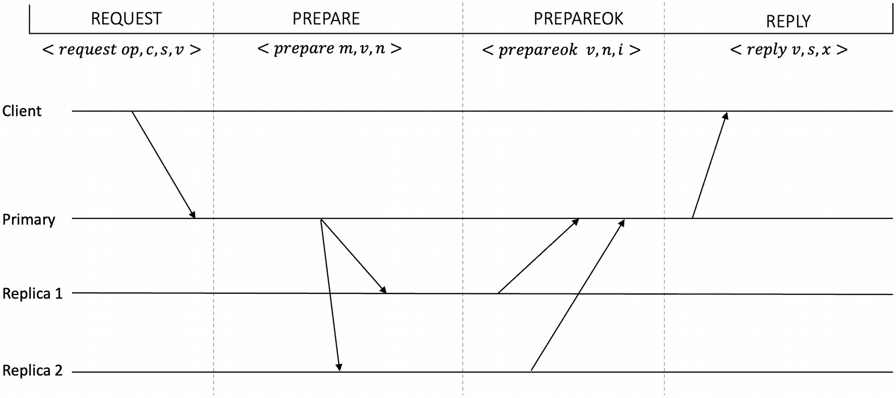

`VR` 协议示意图包含客户端、主节点、副本 1 和副本 2 的线条。这些线条按请求、准备、准备确认和回复阶段划分。

**图 7-1** – `VR` 协议 – 正常运行流程

当主节点发生故障时，视图变更协议启动。副本通过超时机制检测故障：

- `v`：视图编号
- `l`：副本的日志/新日志
- `k`：副本已知的最新已提交请求的操作编号
- `I`：副本标识符

##### 视图变更

视图变更协议的工作方式如下：

1.  当副本怀疑主节点发生故障时，它会：
    1.  递增其视图编号
    2.  将其状态更改为视图变更
    3.  向下一个视图的主节点发送`<DOVIEWCHANGE v, l, k, i>`消息

2.  当新的主节点收到`f+1`条`<DOVIEWCHANGE>`消息时，它会：
    1.  选择消息中最近的日志，并将其作为新的日志
    2.  将操作编号设置为新日志中最新条目的编号
    3.  将其状态更改为正常
    4.  向其他副本发送`<STARTVIEW v, l, k>`消息，表明视图变更过程完成

3.  现在，新的主节点会：
    1.  顺序执行任何未执行的已提交操作
    2.  向客户端发送回复
    3.  开始接受新的客户端请求

4.  其他副本在收到`<STARTVIEW>`消息后：
    1.  用消息中的日志替换自己的日志
    2.  将操作编号设置为日志中最新的条目编号
    3.  将视图编号设置为消息中的编号
    4.  将其状态更改为正常
    5.  为未提交的消息发送`PREPAREOK`

如果新的主节点也发生故障，视图变更协议会重复执行。

图 7-2 直观地展示了这一过程。

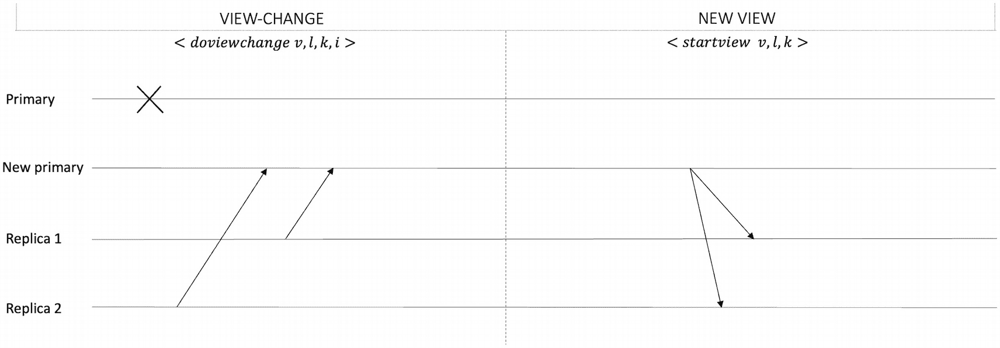

这张 `VR` 中视图变更的示意图包含主节点、新主节点、副本 1 和副本 2 的线条。这些线条分阶段展示了视图变更和新视图。

**图 7-2** `VR` 中的视图变更

这里的关键安全要求是，所有已提交的操作都必须保持其顺序传递到下一个视图。

我们没有刻意讨论 `VR` 的所有复杂细节，因为我们更关注主流协议。尽管如此，这应该能让您了解 `VR` 中引入的基本概念，这些概念在几乎所有复制和共识协议中都起着至关重要的作用，尤其是 `PBFT`、`Paxos` 和 `RAFT`。在阅读后续章节时，您将看到 `PBFT` 如何演变为 `VR` 的一种形式，以及 `VR` 与本章介绍的不同协议之间的其他相似之处。当您阅读关于 `RAFT` 的章节时，会发现 `VR` 和 `RAFT` 之间有很好的相似性。

让我们首先来看 Paxos，它无疑是最具影响力和最基础的共识协议。

## Paxos

Paxos 由 Leslie Lamport 发现。它于 1988 年首次提出，随后在 1998 年以更正式的形式发表。这是最基础的分布式共识算法，允许在不可靠的通信条件下就某个值达成共识。换句话说，Paxos 用于构建即使在存在故障的情况下也能正确运行的可靠系统。Paxos 使状态机复制的实现变得更加实用。一个称为 `multi-Paxos` 的 Paxos 变体通常用于实现复制的状态机。它在异步的消息传递模型下运行，能够容忍少于 `n/2` 的崩溃故障，即满足 `2f + 1` 的下限。

早期的共识机制并没有分别处理安全性和活跃性。Paxos 协议采用了一种不同的方法来解决共识问题，它将安全性和活跃性属性分离开来。

运行 Paxos 协议的系统中，节点可以承担三种角色。一个进程可以同时承担所有三种角色：

*   `提议者`：提议待决定的值。被选出的提议者充当单个领导者来提议新值。提议者负责处理客户端请求。
*   `接受者`：接受者根据若干规则和条件评估并接受或拒绝提议者提出的提案。
*   `学习者`：学习决定的结果，即达成一致的值。

Paxos 节点还有一些相关的规则。Paxos 节点必须是持久化的，即它们必须存储自己的行为，并且必须记住自己已经接受了什么。节点还必须知道多少个接受者能构成多数派。

Paxos 可以看作类似于两阶段提交协议。两阶段提交（`2PC`）是一种标准的原子提交协议，用于确保只有在所有参与者都同意提交的情况下，事务才会在分布式数据库中被提交。即使单个节点不同意提交事务，整个事务也会被完全回滚。

类似地，在 Paxos 中，提议者在第一阶段向接受者发送一个提案。然后，当且仅当接受者接受该提案时，提议者向接受者广播一个提交请求。一旦接受者提交并向提议者报告，该提案就被视为最终确定，协议结束。与两阶段提交相比，Paxos 引入了排序，即定序，以实现提案的全序。此外，它还引入了基于多数仲裁的提案接受方式，而不是期望所有节点都同意。这种方案允许协议即使在部分节点发生故障时也能继续推进。这两项改进都保证了 Paxos 算法的安全性和活跃性。

该协议由两个阶段组成：准备阶段和接受阶段。在准备阶段结束时，多数接受者已经承诺了一个特定的提案编号。在接受阶段结束时，多数接受者已经接受了一个提议的值，共识达成。

算法的具体工作方式如下：

**第一阶段 – 准备阶段**

*   提议者收到客户端要求就某个值达成共识的请求。
*   提议者向多数或全部接受者发送`prepare(n)`消息。在此阶段，尚未为决策提议任何值。在假定多数派中的所有接受者都会响应的情况下，多数接受者就足够了。此处，`n`代表提案编号，它必须是全局唯一的，并且必须大于该提议者之前使用过的任何提案编号。例如，`n`可以是纳秒级的时间戳或其他递增的值。如果发生超时，提议者将使用更大的`n`重试。换句话说，如果提议者因缺乏接受者的响应而无法推进，它可以使用更高的提案编号重试。

当一个接收者收到`prepare(n)`消息时，它做出一个“承诺”。它执行以下操作：

- 如果之前没有通过响应准备消息做出过承诺，那么该接收者现在承诺忽略任何小于提案编号`n`的请求。它记录`n`，并回复消息`promise(n)`。
- 如果该接收者之前已经做出过承诺，即已经用某个低于`n`的提案编号响应过另一个准备消息，则接收者执行以下操作：
  - 如果该接收者在接受阶段尚未从提议者那里收到任何接受消息，它会存储更高的提案编号`n`，然后向提议者发送一条承诺消息。
  - 如果该接收者之前已收到一个带有其他较低提案编号的接受消息，则它一定已经从某个提议者那里接受了一个提议值。这个先前完整的提案会连同承诺消息一起发送给提议者，表明该接收者已经接受了一个值。

**阶段 2 – 接受阶段**

当提议者从多数接收者那里收到针对特定`n`的足够多的响应（即承诺消息）时，阶段 2 开始：

- 提议者会一直等待，直到它从多数接收者那里获得针对`n`的响应。
- 收到响应后，提议者评估要在接受消息中发送的值`v`。它执行以下操作：
  - 如果提议者收到了一条或多条带有完整提案的承诺消息，它会选择具有最高提案编号的提案中的值`v`。
  - 如果提议者收到的承诺消息中没有包含完整提案，提议者可以自由选择任何值。
  - 提议者现在向接收者发送一条接受消息 —— 格式为`accept(n, v)`的完整提案，其中`n`是被承诺的提案编号，`v`是实际提议的值。
- 当接收者收到`accept(n, v)`消息时，它执行以下操作：
  - 如果该接收者先前已承诺不接受此提案编号，它将忽略此消息。
  - 否则，只有当它响应过对应的具有相同`n`的准备请求（即`prepare(n)`）时，它才会回复`accepted(n, v)`，表示接受该提案。
  - 最后，接收者向所有学习者发送`accepted(n, v)`。
- 如果多数接收者接受了提案中的值`v`，则`v`成为协议的决定值，即达成共识。

有时，人们会区分接受阶段和第三个被称为学习阶段的阶段，在学习阶段中，学习者从接收者那里了解决定值。在上述算法中，我们没有单独展示这一点，因为学习被认为是第二阶段的一部分。一旦提案在接受阶段被接受，接收者就会通知学习者。图 7-3 确实展示了一个称为学习阶段的第三阶段，但这只是为了以更简单的方式可视化协议；学习实际上是阶段 2（接受阶段）的一部分。

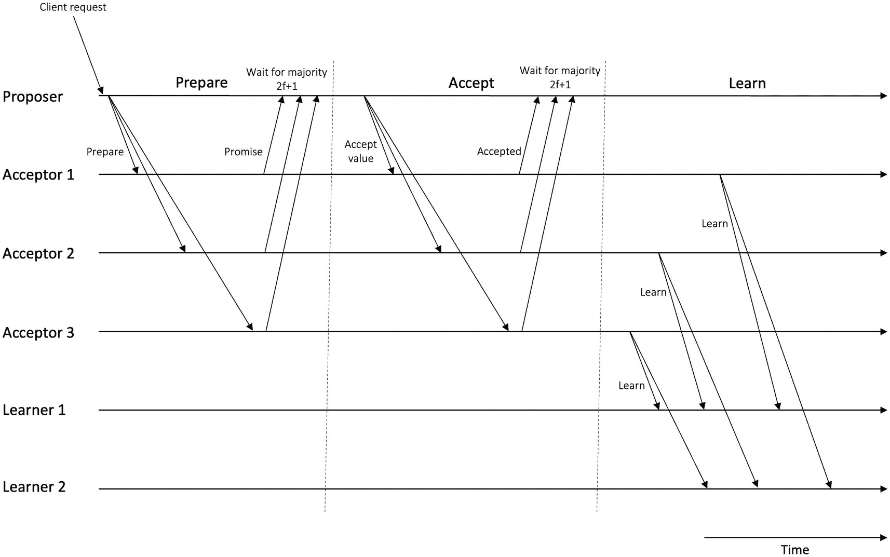

一个 Paxos 正常运行的图，包含提议者、接收者 1、2、3、学习者 1 和 2 的连线。这些连线分为准备、接受和学习三个阶段。

**图 7-3** Paxos 的正常运行

我们使用了术语“多数”，表示多数的接收者已经响应或接受了一条消息。多数来源于一个法定人数。在多数法定人数中，每个法定人数都有`⌊n/2⌋ + 1`个节点。还要注意的是，为了容忍`f`个故障接收者，至少需要一个由`2f + 1`个接收者组成的集合。我们在第 3 章中讨论了法定人数系统。

该协议在图 7-3 中进行了说明。

请注意，Paxos 算法一旦达成一次共识，就不会继续进入下一次共识。需要再次运行 Paxos 才能达成下一次共识。此外，如果一半或一半以上的节点出现故障，Paxos 无法取得进展，因为在这种情况下无法达成多数，而多数对于取得进展至关重要。它是安全的，因为一旦一个值被同意，它就永远不会被更改。尽管 Paxos 保证是安全的，但协议的活动性并不保证。这里的假设是，网络中有足够大的一部分在足够长的时间内是正确（无故障）的，然后协议才能达成共识；否则，协议可能永远不会终止。

通常，学习者是直接从接收者那里学习决定值的；然而，在大型网络中，学习者有可能通过中继其中一部分人（一个小组）直接从接收者那里学到的值，来彼此学习。或者，学习者可以定期轮询接收者，以检查是否存在决定。也可以选举出一个学习者节点，由接收者通知该节点，然后该当选的学习者将决定传播给其他学习者。

现在让我们考虑一些故障场景。

### 故障场景

想象一下，如果一个接收者在第一阶段（即准备阶段）发生故障，那么它将不会向提议者发回承诺消息。然而，如果多数法定人数能够响应，提议者将会收到这些响应，协议也将取得进展。如果一个接收者在第二阶段（即接受阶段）发生故障，那么该接收者将不会向提议者发回已接受消息。同样，如果多数接收者是正确且可用的，提议者和学习者将收到足够的响应以继续。

如果提议者在准备阶段或接受阶段发生故障会怎样？如果提议者在发送任何准备消息之前发生故障，则没有任何影响；其他提议者将会运行，协议将继续。如果提议者在阶段 1 中发送了准备消息后发生故障，那么接收者将不会收到任何接受消息，因为承诺消息未能到达提议者。在这种情况下，其他提议者将以更高的提案编号进行提议，协议将继续推进。之前的准备将成为历史。如果提议者在接受阶段中发送了接受消息（该消息已被至少一个接收者收到）后发生故障，其他提议者将发送一个带有更高提案编号的准备消息，接收者将用一条承诺消息响应提议者，表明一个较早的值已经被接受。此时，提议者将转而提议同一个较早的值（即带有最高已接受提案编号的值），也就是发送一条带有相同较早值的接受消息。

另一种场景可能是两个提议者同时试图提议它们自己的值。想象有两个提议者已经向接收者发送了它们的准备消息。在这种情况下，任何之前从 `P1` 接受了更大提案编号的接收者，如果提议者 `P2` 提出的提案编号低于接收者之前已经接受的编号，则会忽略该提案。如果存在一个接收者 `A3` 之前没有见过任何值，即使 `P2` 的提案编号低于其他接收者之前从 `P1` 收到并接受的提案编号，它也会接受 `P2` 的提案编号，因为 `A3` 不知道其他接收者在做什么。该接收者随后会正常回复 `P2`。然而，由于提议者等待多数接收者响应，`P2` 将不会从多数接收者那里收到承诺消息，因为仅凭 `A3` 并不构成多数。另一方面，`P1` 将从多数接收者那里收到承诺消息，因为 `A1` 和 `A2`（其他接收者）属于多数，并将向 `P1` 返回响应。当 `P2` 没有从多数接收者那里收到响应时，它会超时并可以尝试使用更高的提案编号重试。

现在设想一个场景：某个 `P1` 提议的提案已被接受者达成共识，但另一个提议者 `P2` 对此并不知情，并发送了一个比之前编号更高的准备请求消息。此时，接受者在收到 `P2` 发来的更高编号的请求后，会检查自己之前是否已接受过任何消息；如果已接受，接受者将向 `P2` 回复一个格式为 `promise(nfromp2,(nfromp1, vfromp1))` 的承诺消息，其中包含它们之前接受过的最高提案编号以及对应的已接受值。否则，它们会正常回复一个承诺消息给 `P2`。当 `P2` 收到消息 `promise(nfromp2,(nfromp1, vfromp1))` 后，会对其进行检查：如果 `nfromp1` 是此前最高的提案编号，那么值 `v` 将变为 `vfromp1`；否则，`P2` 将选择它自己想要的任意值 `v`。总之，如果 `P2` 收到的承诺消息表明另一个值已被选定，那么它将提出此前已被选定的、编号最高的值。此时，`P2` 会以其已选定的 `n` 和 `v`（即 `vfromp1`）发送一个接受消息。现在接受者们都很满意，因为它们看到了最高的 `n`，会像往常一样回复一个已接受消息，并同时通知学习者。请注意，此时被选定的值仍然是 `P2` 提出的值，只是现在的编号 `n` 变成了最高。

在某些场景下，该协议可能进入活锁状态，从而导致进度停滞。一种场景可能是两个不同的提议者互相竞争提案，这种情况也被称为“决斗的提议者”。在这种情况下，Paxos 的活性无法得到保证。

假设我们有两位提议者 `P1` 和 `P2`，以及三位接受者 `A1`、`A2` 和 `A3`。现在，`P1` 向多数派接受者 `A1` 和 `A2` 发送准备消息。`A1` 和 `A2` 向 `P1` 回复了承诺消息。再假设另一位提议者 `P2` 也提出提案，并向 `A2` 和 `A3` 发送了一个编号更高的准备消息。由于协议规则规定，如果准备消息的提案编号高于接受者此前见过的编号，接受者就会对该准备消息做出承诺，因此 `A3` 和 `A2` 向 `P2` 回复了承诺消息。在第二阶段，当 `P1` 发送接受消息时，`A1` 会接受它并回复已接受，但 `A2` 会忽略该消息，因为它已经承诺了来自 `P2` 的更高编号。此时，`P1` 最终会因等待来自接受者的多数派响应而超时，因为多数派现在永远不会响应了。于是，`P1` 会使用一个更高的编号再次尝试，并向 `A1` 和 `A2` 发送准备消息。假设 `A1` 和 `A2` 都回复了承诺消息。现在假设 `P2` 向 `A2` 和 `A3` 发送接受消息以使其值被选定。`A3` 会回复已接受消息，但 `A2` 不会回复 `P2`，因为它已经承诺了来自 `P1` 的另一个更高编号。于是，`P2` 会因等待来自接受者的多数派响应而超时。`P2` 现在会使用一个更高的编号再次尝试。这个循环可能周而复始，共识将永远无法达成，因为没有任何一个提议者能从接受者那里获得多数派响应。

这个问题通常通过选举一个单一的提议者作为领导者来处理所有客户端的传入请求来解决。这样一来，不同提议者之间就不会有竞争，因此不会发生这种活锁情况。然而，选举领导者也并非易事。唯一的领导者选举等同于解决共识问题。为了选举领导者，必须运行一个 Paxos 实例，而该选举共识本身也可能陷入活锁，于是我们又回到了同样的境地。一种可能性是使用不同类型的选举机制，例如“霸道算法”。Aguilera 等人的工作中还提出了其他一些领导者选举算法。我们也可以使用其他类型的共识机制来选举领导者，这种机制或许能保证终止，但在安全性上会有所牺牲。另一种处理活锁问题的方法是使用随机的指数级增长延迟，使得客户端在再次提出提案之前必须等待一段时间。我认为这些延迟也可以被引入到提议者端，这样会使某个提议者比另一个略微占优，从而在接受者收到另一个更高编号的准备消息之前，其提案值就能被接受。请注意，经典 Paxos 协议并不要求必须有一个被选举出的单一领导者，但在实际实现中，选举一个领导者是常见的做法。如果这个单一的领导者变成了单点故障，那么就必须选举另一个领导者。

需要记住的一个关键点是，要容忍 `f` 个崩溃故障，需要 `2*f* + 1` 个接受者。Paxos 也能容忍遗漏故障。假设一个准备消息丢失了，未能到达接受者，那么提议者将等待、超时，并使用更高的编号重试。同时，另一位提议者也可能在此期间使用更高的编号提出提案，协议仍然可以工作。此外，由于只需要接受者的多数派响应，只要多数派消息（`2*f* + 1` 个）从接受者成功到达提议者，协议就能继续推进。然而，由于遗漏故障，协议可能需要更长时间才能达成共识，或者在某些场景下可能永远无法终止，但它始终能保证安全性。

### 安全性与活性

Paxos 算法通过实现**安全性**和**活性**属性来解决共识问题。我们对每个属性都有一些要求。在安全性方面，我们主要关注一致性和有效性。**一致性**意味着不会选出两个不同的值。**有效性**（有时也称为**非平凡性**）意味着除非某个参与协议的进程提出了提议，否则不会决定任何值。另一个源于有效性属性的安全性要求可称为“**有效学习**”，即如果一个进程**学习**了一个值，则该值必须已由某个进程决定。一致性确保所有进程决定相同的值。有效性和有效学习要求确保进程仅对提议的值做出决定，而不会平凡地选择不做决定或选择某个预定义的值。

在**活性**方面，有两个要求。首先，协议最终会**决定**，即提议的值最终会被决定。其次，如果一个值已被决定，学习者最终会**学习**到该值。

现在我们来讨论这些安全性和活性要求是如何满足的。

直观地说，一致性是通过确保大多数接受者只能为同一提案投票来实现的。想象两个不同的值 `v1` 和 `v2` 以某种方式被选出（决定）。我们知道，只有当大多数接受者接受了来自提议者且内容相同的接受消息时，协议才会选择一个值。这个条件意味着，一组多数接受者 `A1` 必须接受了一条包含提案 `(n1,v1)` 的接受消息。同时，另一组多数接受者 `A2` 必须接受了一条包含提案 `(n2, v2)` 的接受消息。假设这两个多数集合 `A1` 和 `A2` 必定有交集，这意味着根据法定人数交集规则，它们将至少有一个共同的接受者。这个接受者必须接受过两个提案编号相同但内容不同的提案。这种情况是不可能的，因为一个接受者会忽略任何与它已接受的提案编号相同的准备或接受消息。

如果 `n1 <> n2` 且 `n1 < n2`，并且 `n1` 和 `n2` 是连续的提案轮次，那么这意味着 `A1` 必须在 `A2` 接受提案编号为 `n2` 的接受消息之前，就已经接受了提案编号为 `n1` 的接受消息。这是因为如果一个接受者之前已承诺过某个编号更大的提案，它会忽略任何提案编号更小的准备或接受消息。此外，提议者提出的值必须来自先前编号最高的提案中的值，如果接受消息中不包含任何提议的值，则使用提议者自身的提议值。正如我们所知，`A1` 和 `A2` 必须至少有一个共同的接受者；这个共同的接受者必须同时接受了提案 `(n1,v1)` 和 `(n2,v2)` 的接受消息。这种情况也是不可能的，因为该接受者在回应提案编号为 `n2` 的准备消息时会回复 `(n1,v1)`，这使得提议者必须选择值 `v1` 而非 `v2`。即使提案编号不连续，任何中间提案也必须选择 `v1` 作为被选中的值。

有效性是通过仅允许提议者输入的值被提议来保证的。换句话说，最终决定的值既不是预定义的，也不是由不属于运行 Paxos 集群的任何其他实体提议的。

由于异步性，Paxos 无法保证活性。然而，如果采用某些同步假设（即部分同步环境），那么进展是可以达成的，终止性也是可以实现的。我们假设在全局稳定时间（GST）之后，至少有多数接受者是正确且可用的。消息在已知的上限时间内送达，并且选举出的唯一非故障领导者提议者是正确且可用的。

### 实际应用

Paxos 已在许多实际系统中得到实现。尽管 Paxos 算法核心相当简单，但通常被认为难以理解。因此，许多论文都是为了解释它而写的。尽管如此，它仍常被视为复杂且难以完全掌握。然而，这点小问题并不意味着它没有被广泛应用。相反，它已被用于许多生产系统，例如 Google 的 Spanner 和 Chubby。Paxos 的首次部署是在 Petal 分布式存储系统中。其他随机选取的例子包括 Apache ZooKeeper、NoSQL Azure Cosmos 数据库和 Apache Cassandra。它被证明是解决共识问题最有效的协议。已有研究表明，两阶段提交是 Paxos 的一个特例，而 PBFT 是 Paxos 的一种改良。

### 变体

经典 Paxos 有许多变体，例如 Multi-Paxos、Fast Paxos、Byzantine Paxos、Dynamic Paxos、Vertical Paxos、Disk Paxos、Egalitarian Paxos、Stoppable Paxos 和 Cheap Paxos。

### Multi-Paxos

在经典 Paxos 中，即使在完全正确的环境中，也需要两次往返才能对单个值达成共识。这种方法速度较慢，如果需要对不断增长的值序列达成共识（实际情况通常如此），则必须重复运行此单值共识过程，效率不高。然而，通过一种优化措施，可以使经典 Paxos 足够高效，从而应用于实际系统中。回顾一下，Paxos 包含两个阶段。一旦阶段 1 和阶段 2 都完整运行过一次，那么此时，参与该轮阶段 1 和阶段 2 的提议者就可以获得多数接受者的支持。该提议者现在成为了公认的领导者。提议者（领导者）无需重新运行阶段 1，只需利用这多数接受者持续运行阶段 2。只要它不崩溃，或者没有其他提议者以更高的提案编号出现并提议，这种连续发送接受消息的过程就可以继续。提议者甚至可以继续使用相同的提案编号运行接受/已接受轮次（阶段 2），而无需运行准备/承诺轮次（阶段 1）。换句话说，消息延迟从四次减少到了两次。当另一个提议者出现或前一个提议者失败时，这个新提议者可以遵循经典 Paxos 再次运行阶段 1 和阶段 2。当这个新提议者通过获得多数接受者的支持成为领导者时，基础的经典 Paxos 协议就升级为 Multi-Paxos，并且它可以开始仅运行阶段 2。只要网络中只有一个领导者，就没有接受者会通知领导者它已接受了其他任何提案，这将允许领导者选择任何值。这个条件允许在仅有一个当选的提议者作为领导者时省略第一阶段。

该协议被称为优化 Paxos 或多 Paxos（Multi-Paxos）。Multi-Paxos 的正常运行流程如图 7-4 所示。

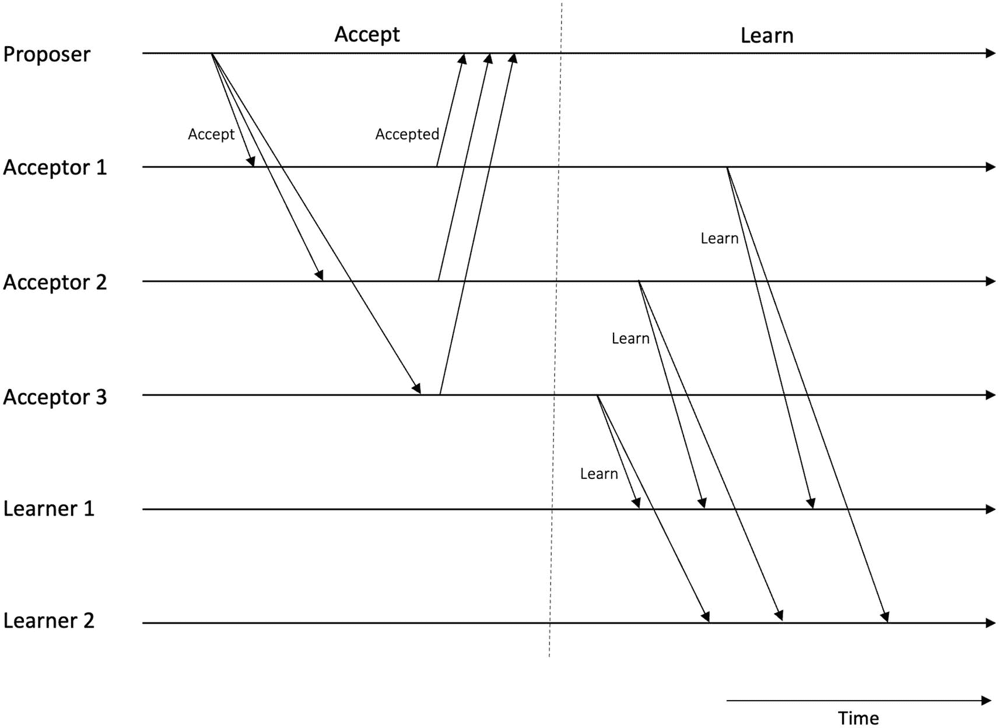

**图 7-4**  
Multi-Paxos – 注意第一阶段（准备阶段）已被跳过

原始的 Paxos 是一个无领导者（也称为对称）协议，而 Multi-Paxos 是领导者驱动（也称为非对称）的协议。它被用于实际系统中以实现状态机复制，而非经典 Paxos。通常在实现中，提议者、接受者和学习者的角色会被合并到所谓的服务器中，这些服务器可能同时承担这三种角色。最终，仅呈现出客户端-服务器模型。随着角色的合并、稳定领导者的确立以及准备阶段的移除，该协议变得高效且简单。

Paxos 被认为是一个难以理解的协议。这主要是由于规范不足。此外，Lamport 描述的原始协议是一个单法令协议，不便于实际实现。已经有过多次尝试，例如 Multi-Paxos，以及多篇试图解释 Paxos 的论文，但总体而言，该协议仍被认为在理解和实现上有些棘手。考虑到这些以及其他几点因素，一个名为 RAFT 的协议被开发出来。我们接下来介绍 RAFT。

### RAFT

RAFT 的设计是为了应对 Paxos 的不足之处。RAFT 代表复制和容错（Replicated And Fault Tolerant）。RAFT 的作者们的主要目标是开发一个易于理解和易于实现的协议。RAFT 背后的关键思想是通过持久化日志实现状态机复制。状态机的状态由持久化日志决定。RAFT 允许集群重配置，这使得可以在不中断服务的情况下更改集群成员。此外，由于在高吞吐量系统上日志可能会变得非常大，RAFT 允许日志压缩来缓解消耗过多存储空间以及节点崩溃后重建缓慢的问题。

RAFT 在一个具有以下假设的系统模型下运行：

- 不存在拜占庭故障。
- 网络通信不可靠。
- 异步通信和处理器。
- 每个节点上运行确定性的状态机，且所有节点从相同的初始状态开始。
- 节点拥有不可篡改的持久化存储，并支持预写式日志记录，这意味着任何对存储的写入操作都将在崩溃前完成。
- 客户端必须严格仅与当前的领导者通信。这是客户端的责任，因为客户端知道所有节点，并且静态配置了这些信息。

RAFT 是一个基于领导者（非对称）的协议，其中一个节点被选举为领导者。该领导者接受客户端请求并管理日志复制。在一个 RAFT 集群中，一次只能有一个领导者。如果当前的领导者发生故障，则会选举出新的领导者。在 RAFT 集群中，节点（更准确地说是节点内的共识模块）可以承担三种角色：领导者、跟随者和候选者。

- **领导者** 接收客户端请求，管理复制日志，并管理与跟随者的通信。
- **跟随者** 节点本质上是被动的，仅响应远程过程调用（RPC）。它们从不主动发起任何通信。
- **候选者** 是一种角色，由一个试图通过请求投票成为领导者的节点使用。

在 RAFT 中，时间被逻辑地划分为任期。一个任期（或时期）基本上是一个单调递增的值，它充当逻辑时钟，在没有全局同步时钟的情况下，为事件实现全局偏序关系。每个任期从选举新领导者开始，期间一个或多个候选者竞争成为领导者。一旦领导者被选出，它将担任领导者直至任期结束。任期的主要作用是识别过时信息，例如，过时的领导者。每个节点存储一个当前的任期号。当节点之间交换当前任期时，会检查一个节点的当前任期号是否低于另一个节点的任期号；如果是，则任期号较低的节点会将其当前任期更新为较大的值。当一个候选者或领导者发现其当前任期号已过时时，它会将自身状态转换为跟随者模式。节点接收到的任何带有过期任期号的请求都会被拒绝。

任期可以如图 7-5 所示。

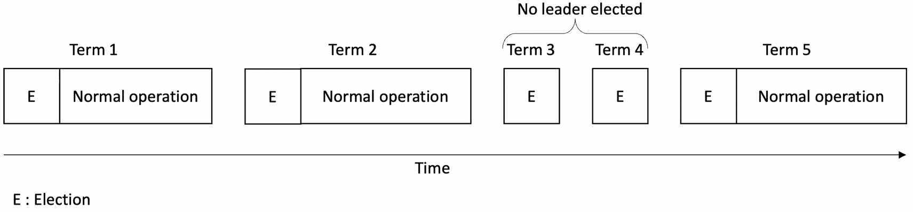

**图 7-5**  
RAFT 中的任期

RAFT 协议使用两种 RPC 工作：`AppendEntries` RPC，由领导者调用以复制日志条目，也用作心跳；`RequestVote` RPC，由候选者调用以收集选票。

RAFT 包含两个阶段。第一阶段是领导者选举，第二阶段是日志复制。在第一阶段，选出领导者；第二阶段是领导者接受客户端请求，更新日志，并向所有跟随者发送心跳以维持其领导地位。

首先，让我们看看领导者选举是如何工作的。

#### 领导者选举

心跳机制被用于触发领导者选举过程。所有节点在启动时均为跟随者。只要跟随者能持续收到来自领导者或候选者的有效 RPC，它们就会保持跟随者状态。如果跟随者在某段时间内未收到领导者的心跳，就会发生"选举超时"，表明领导者已失效。选举超时时间随机设定在 150 毫秒至 300 毫秒之间。

此时，该跟随者节点承担候选者角色，并通过启动选举流程来尝试成为领导者。候选者会递增当前任期号、为自己投票、重置选举计时器，并通过 `RequestVote` RPC 向其他节点寻求选票。如果它获得多数节点的投票，则成为领导者，并开始向其他节点（此时均为跟随者）发送心跳。如果其他候选者已获胜并成为有效领导者，则该候选者将开始接收心跳，并恢复为跟随者角色。如果无人赢得选举且选举超时发生，则将在新任期重新启动选举流程。

请注意，仅当候选者的日志至少与接收节点的日志一样新时，接收节点才会根据 `RequestVote` RPC 授予选票。此外，如果接收到的任期号低于当前任期，将回复"false"。

领导者选举的具体流程如图 7-6 所示。

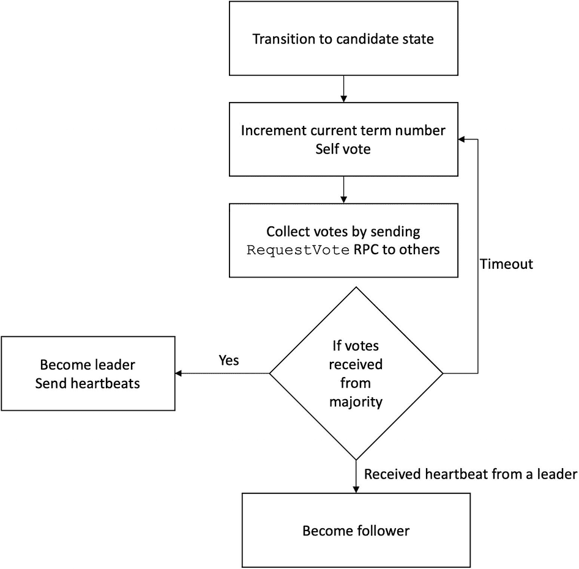

**图 7-6**  
RAFT 领导者选举

一个节点可以处于三种状态；我们可在图 7-7 所示的状态图中可视化服务器状态，该图也展示了领导者选举。

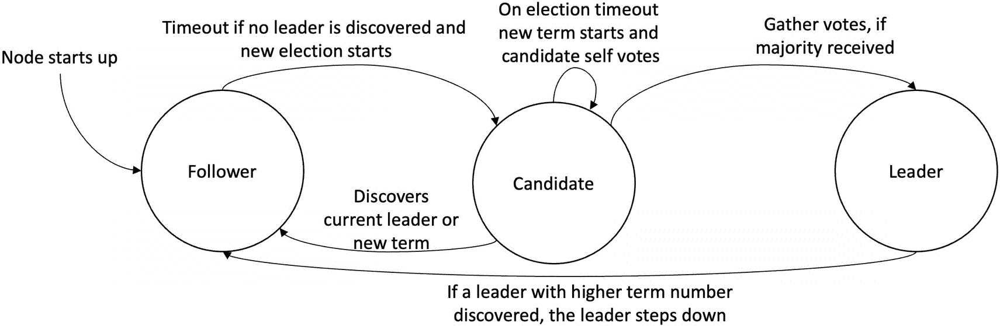

**图 7-7**  
RAFT 中的节点状态

一旦领导者被选举出来，它就可以随时接收来自客户端的请求。至此，日志复制可以开始了。

### 日志复制

RAFT 的日志复制阶段非常简单直接。首先，客户端向领导者发送命令/请求，交由复制状态机执行。然后，领导者为该命令分配一个任期号和索引，以便该命令在节点持有的日志中被唯一标识。

它将此命令追加到自己的日志中。当领导者的日志中有新条目时，它同时通过`AppendEntries` RPC 向跟随者节点发送复制该命令的请求。

当领导者能够将该命令复制到大多数跟随者节点时（即得到确认），该条目就被视为在集群中已提交。此时，领导者在其状态机中执行该命令，并将结果返回给客户端。它还会通过`AppendEntries` RPC 通知跟随者该条目已提交，跟随者随后在其状态机中执行已提交的命令。来自五个节点的日志集合如图 7-8 所示。

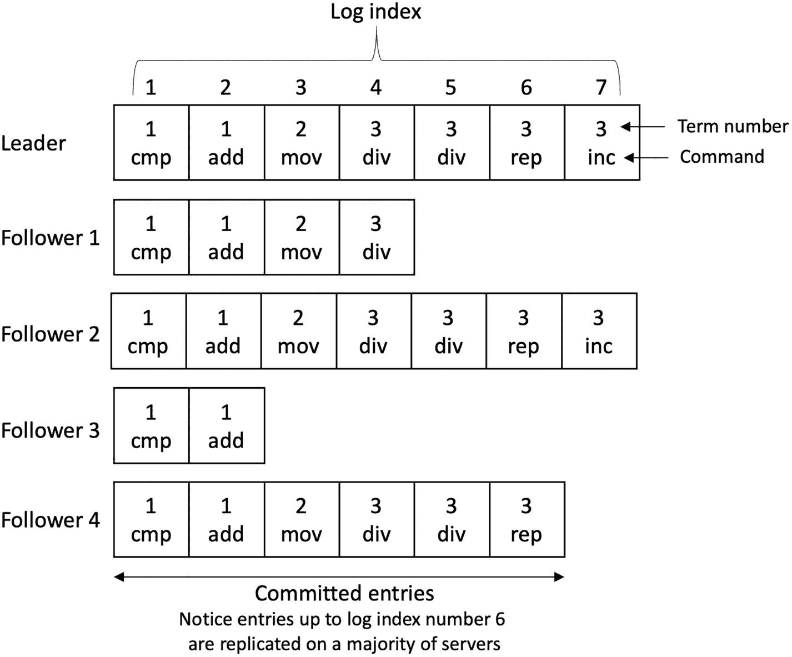

一张图表列出了领导者、跟随者 1、2、3 和 4 的日志索引。在最后一个索引下方有一条水平线，标记为已提交条目。

图 7-8 RAFT 节点中的日志

请注意，日志索引号 6 之前的条目已在多数服务器上复制，因为领导者、跟随者 3 和跟随者 4 都拥有这些条目，构成了多数——五个节点中的三个。这意味着它们已被提交，可以安全地应用到各自的状态机中。跟随者 1 和 3 的日志不是最新的，这可能是由于节点故障或通信链路故障所致。如果存在崩溃或缓慢的跟随者，领导者将通过`AppendEntries` RPC 持续重试，直至成功。

日志复制过程如图 7-9 所示。

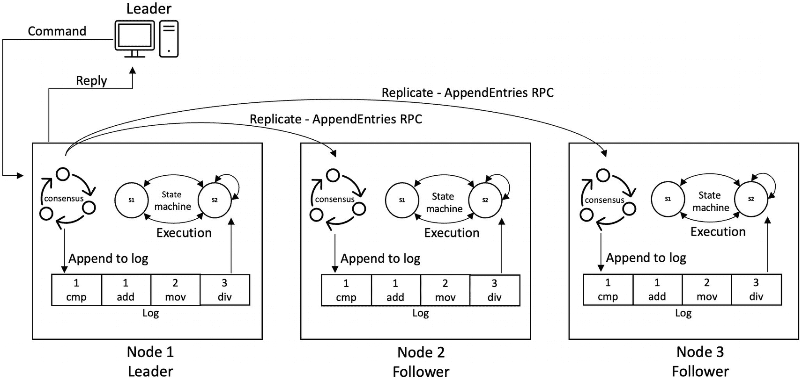

日志复制过程的流程图。流程为：领导者、命令、从节点 1 向节点 2 和 3 复制`append entries RPC`、并回复。

图 7-9 RAFT 日志复制与状态机复制

当跟随者收到用于复制日志条目的`AppendEntries` RPC 时，它会检查组件的任期是否小于当前任期，若是则回复 false。它仅追加日志中尚不存在的新条目。如果现有条目与新条目具有相同的索引但不同的任期，它将删除该现有条目及其后的所有条目。此外，如果日志在紧邻新条目前一个条目的索引处没有条目，或者有条目但任期不匹配，它也会回复 false。

如果存在失败的跟随者或候选者，该协议将通过`AppendEntries` RPC 持续重试，直至成功。

如果一个命令被提交，RAFT 集群将不会丢失它。这是 RAFT 在面对网络延迟、数据包丢失、重启或崩溃故障等任何故障时提供的保证。然而，它不处理拜占庭故障。

每个日志条目包含一个任期号、一个索引和一个状态机命令。任期号有助于发现日志之间的不一致性，它指示命令发生的时间。索引标识条目在日志中的位置。命令是客户端请求执行的指令。

### 保证与正确性

RAFT 提供的保证如下：

- `选举正确性`
  - `选举安全性`：每个任期最多只能选出一名领导者。
  - `选举活跃性`：必定会有某个候选者最终成为领导者。
- `领导者仅追加日志`：领导者只能向日志中追加条目，不允许覆盖或删除已有条目。
- `日志匹配`：如果两台不同服务器上的日志中存在索引和任期都相同的条目，那么这两条日志在此之前的所有条目完全相同，并且存储着相同的命令。
- `领导者完备性`：在给定任期内已提交的日志条目，将始终存在于未来所有领导者（即任期号更大的领导者）的日志中。此外，日志不完整的节点绝不能当选。
- `状态机安全性`：如果某个节点已将特定索引的日志条目应用到其状态机，那么其他任何节点都不会对同一索引应用不同的日志条目。

`选举正确性`要求同时满足安全性与活跃性。安全性意味着每个任期只允许存在一个领导者。活跃性则要求某个候选者必须最终获胜并成为领导者。为确保安全性，每个节点在一个任期内仅投票一次，并将投票记录持久化存储。竞选需要获得多数票才能获胜；不可能有两个不同候选者同时获得多数票。

在领导者选举过程中可能发生选票分裂。如果两个节点同时当选，就会产生所谓的"选票分裂"。RAFT 使用随机化的选举超时时间来确保该问题能快速解决。这之所以有效，是因为随机超时机制使得只有一个节点能在其他节点超时之前超时并赢得选举。实践中，只要选择的随机时间大于网络广播时间，这种方法就能良好运作。

`日志匹配`实现了日志间的高度一致性。我们假定领导者没有恶意行为。领导者绝不会添加两个具有相同索引和任期的条目。日志一致性检查确保了所有先前条目都完全相同。领导者会追踪其日志中已提交的最新索引，并在每次 `AppendEntries` RPC 中广播此信息。如果跟随者节点的日志中没有具有相同索引编号的条目，它将不会接受传入的条目。然而，如果跟随者接受了 `AppendEntries` RPC，领导者就知道双方日志是一致的。除非网络发生故障，否则日志通常保持一致。若出现不一致，日志一致性检查会确保节点最终追赶上来并达成一致。如果日志不一致，领导者会向可能未收到之前消息、或曾崩溃现已恢复的跟随者重新传输缺失的条目。

重配置和日志压缩是 RAFT 两个有用的特性。此处未作讨论，因为它们与核心共识协议没有直接关系。如需了解更多细节，可参考参考文献中提到的原始 RAFT 论文。

## PBFT

还记得吗，我们之前在本书中讨论过口头消息协议和拜占庭将军问题。虽然它解决了拜占庭协议问题，但并非一个实用的解决方案。口头消息协议仅在同步环境下有效，且计算复杂度（运行时间）很高，除非只有一个故障处理器——这在现实中是不切实际的。然而，在实践中，系统会表现出一定程度的通信和处理器异步性。在真实环境中，过长的算法运行时间也是不可接受的。

1999 年，Castro 和 Liskov 提出了一种实用的解决方案——实用拜占庭容错（PBFT）。顾名思义，这是一种旨在存在拜占庭故障时提供共识的协议。在 PBFT 出现之前，拜占庭容错被认为是不切实际的。借助 PBFT，这两位研究者首次证明了实用拜占庭容错是可行的。

PBFT 包含三个子协议：正常运行、视图变更和检查点。正常运行子协议是指在一切正常运行、系统无错误时执行的机制。视图变更子协议在检测到系统中有故障领导者节点时运行。检查点子协议用于丢弃系统中的旧数据。

PBFT 协议包含三个阶段。这些阶段依次运行以完成一次协议运行。这三个阶段分别是预准备、准备和提交，我们稍后将详细讨论。在正常情况下，一次协议运行就足以达成共识。

该协议按轮次运行，在每一轮中，一个称为主节点的领导者节点负责处理与客户端的通信。在每一轮中，协议依次经历前面提到的三个阶段。PBFT 协议的参与者被称为副本。在每一轮中，其中一个副本成为领导者（主节点），其余节点作为备份节点。PBFT 实现了我们之前讨论过的状态机复制。每个节点维护一个本地日志，并通过共识协议 PBFT 使各日志保持同步。

至此我们知道，在部分同步环境中，要容忍拜占庭故障所需的最小节点数为 `n = 3f + 1`，其中 `n` 是节点数量，`f` 是故障节点数量。只要系统中的节点数量满足 `n >= 3f + 1`，PBFT 就能确保拜占庭容错。

当客户端向主节点（领导者）发送请求时，副本之间会执行一系列操作，从而达成共识并向客户端回复。

这一系列操作由三个阶段组成：

- 预准备
- 准备
- 提交

此外，每个副本维护一个包含三个主要元素的本地状态：

- 服务状态
- 消息日志
- 代表该副本当前视图的数字

下面我们来详细看看每个阶段。

### 预准备阶段 – 阶段一

当主节点收到客户端的请求时，它会为该请求分配一个序列号。然后，主节点将带有该请求的预准备消息发送给所有备份副本。

当备份副本收到预准备消息时，它们会检查以下几项以确保消息的有效性：

- 数字签名是否有效。
- 当前视图编号是否有效，即副本是否处于同一视图。
- 操作请求消息的序列号是否有效，例如，如果同一序列号被重复使用，副本将拒绝后续具有相同序列号的请求。
- 请求消息的哈希值是否有效。
- 之前是否未收到过具有相同序列号和视图但哈希值不同的预准备消息。

如果所有这些检查都通过，备份副本就接受该消息，更新其本地状态，并进入准备阶段。

总结一下，预准备阶段：

- 接受来自客户端的请求。
- 向它分配下一个序列号。该序列号是请求将要执行的顺序。
- 将此信息作为预准备消息广播给所有备份副本。

此阶段为客户端请求分配唯一的序列号。我们可以将其视为一个排序器，对客户端请求应用顺序。

#### 准备阶段 – 阶段 2

每个备份副本向系统中的所有其他副本发送`prepare`消息。每个备份副本等待至少`2*f + 1`条来自其他副本的`prepare`消息。它们检查：

- `prepare`消息是否具有有效的数字签名。
- 副本是否与消息中的视图相同。
- 序列号是否有效且在预期范围内。
- 消息摘要（哈希）值是否正确。

如果所有这些检查都通过，副本将更新其本地状态并进入提交阶段。

总之，准备阶段执行以下步骤：

- 仅当副本之前未接受过相同视图或序列号的预准备消息时，才接受该预准备消息。
- 向所有副本发送`prepare`消息。

此阶段确保网络中的诚实副本在视图内就请求的总顺序达成一致。

##### 提交阶段

在提交阶段，每个副本向网络中的所有其他副本发送`commit`消息。与准备阶段类似，副本等待来自其他副本的`2*f + 1`条`commit`消息。副本还检查视图编号、序列号、数字签名和消息摘要值。如果从其他副本收到的`2*f + 1`条`commit`消息有效，则副本执行请求、生成结果，并最终更新其状态以反映提交。如果有某些消息排队，副本将在处理最新序列号之前先执行这些请求。最后，副本通过回复消息将结果发送给客户端。

客户端仅在收到`2*f + 1`条包含相同结果的回复消息后才接受该结果。

##### 提交子协议步骤

- 副本等待具有相同视图、序列号和请求的`2*f + 1`条`prepare`消息。
- 它向所有副本发送`commit`消息。
- 它等待直到`2*f + 1`条有效的`commit`消息到达并被接受。
- 它执行收到的请求。
- 它向客户端发送包含执行结果的回复。

此阶段确保网络中的诚实副本跨视图就客户端请求的总顺序达成一致。

本质上，PBFT 协议确保有足够多的副本处理每个请求，以便处理相同的请求并且以相同的顺序处理。

我们可以在图 7-10 中看到协议的正常操作模式。

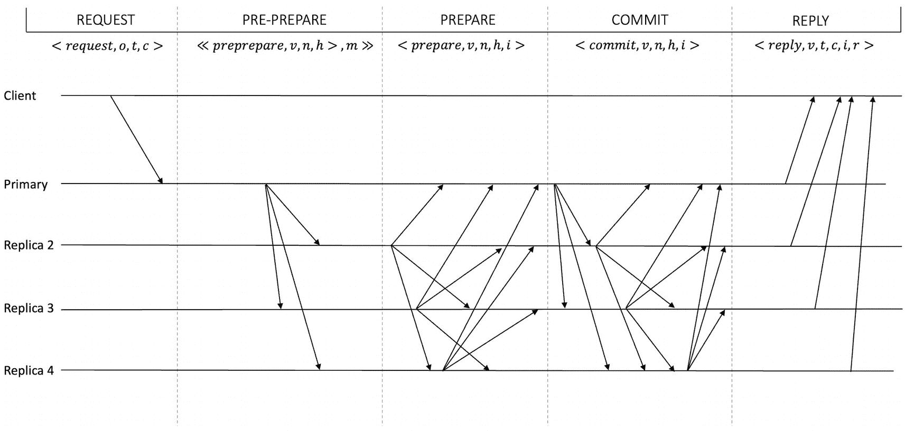

图表显示了客户端、主节点、副本 2、3 和 4 的线条。这些线条分为请求、预准备、准备、提交和回复阶段。

图 7-10 PBFT 正常模式操作

在协议执行期间，协议必须维护消息和操作的完整性，以提供足够级别的安全性和保证。数字签名满足了这一要求。假设数字签名是不可伪造的，并且哈希函数是抗碰撞的。此外，使用证书来确保参与方（节点）的适当多数。

### PBFT 中的证书

PBFT 协议中的证书确立了至少`2*f + 1`个副本已存储所需信息。换句话说，特定类型的`2*f + 1`条消息的集合被视为一个证书。例如，假设一个节点已收集了`2*f + 1`条类型为`prepare`的消息。在这种情况下，将其与具有相同视图、序列号和请求的相应预准备消息组合在一起表示一个证书，称为已准备证书。同样，`2*f + 1`条`commit`消息的集合称为提交证书。

PBFT 协议还维护了几个变量来执行算法。这些变量及其含义如下：

- `v`：视图编号
- `o`：客户端请求的操作
- `t`：时间戳
- `c`：客户端标识符
- `r`：回复
- `m`：客户端的请求消息
- `n`：消息的序列号
- `h`：消息`m`的哈希值
- `i`：副本的标识符
- `s`：稳定检查点 – 最后一个
- `C`：稳定检查点的证书（`2f + 1`条检查点消息）
- `P`：请求的已准备证书集合
- `O`：待处理的预准备消息集合
- `V`：新视图的证明（`2f + 1`条视图更改消息）

现在让我们看一下消息类型及其格式。如果参考前面的变量列表，这些消息很容易理解。

#### 消息类型

PBFT 协议通过交换多种消息来工作。表 7-1 列出了这些消息及其格式和方向。

表 7-1 PBFT 协议消息

| 消息 | 发送方 | 接收方 | 格式 | 签名方 |
| --- | --- | --- | --- | --- |
| `Request` | 客户端 | 主节点 | `<REQUEST, o, t, c>` | 客户端 |
| `Pre-prepare` | 主节点 | 副本 | `<<PRE-PREPARE, v, n, h>, m>` | 主节点 |
| `Prepare` | 副本 | 副本 | `<PREPARE, v, n, h, i>` | 副本 |
| `Commit` | 副本 | 副本 | `<COMMIT, v, n, h, i>` | 副本 |
| `Reply` | 副本 | 客户端 | `<REPLY, r, i>` | 副本 |
| `View change` | 副本 | 副本 | `<VIEWCHANGE, v+1, n, s, C, P, i>` | 副本 |
| `New view` | 主节点 | 副本 | `<NEWVIEW, v + 1, V, O>` | 副本 |
| `Checkpoint` | 副本 | 副本 | `<CHECKPOINT, n, h, i>` | 副本 |

请注意，所有消息都使用数字签名进行签名，这使得每个节点都能识别生成了任何给定消息的是哪个副本或客户端。

##### 视图变更

当其他副本怀疑主副本出现故障时，就会发生视图变更。此阶段用于确保协议的正常推进。通过视图变更选出新的主副本，随后再次启动正常运行模式。新主副本采用轮询方式选定，公式为 `p = v mod n`，其中 `v` 是视图编号，`n` 是系统中的节点总数。

当备份副本收到请求时，会在验证消息后尝试执行该请求。但如果因任何原因，该副本在一段时间内未能执行请求，则会触发超时。此时，它将启动视图变更子协议。

在视图变更期间，副本停止接受与当前视图相关的消息，并将其状态更新为“视图变更”状态。在此状态下，它能接收的消息仅限于 `checkpoint`、`view change` 和 `new view` 消息。之后，它会向所有副本广播一条包含下一个视图编号的 `view change` 消息。

当此消息到达新主副本时，新主副本会等待至少 `2f` 个针对下一个视图的视图变更消息。如果收集到至少 `2f + 1` 个视图变更消息，它会向所有副本广播一条 `new view` 消息，并再次进入正常运行模式。

当其他副本收到 `new view` 消息时，它们会相应地更新本地状态，并启动正常运行模式。

视图变更协议的算法如下：

1. 停止接受当前视图的 `pre-prepare`、`prepare` 和 `commit` 消息。
2. 构建到目前为止已准备的所有证书的集合。
3. 向所有副本广播一条包含下一个视图编号和所有已准备证书集合的 `view change` 消息。

图 7-11 展示了视图变更协议。

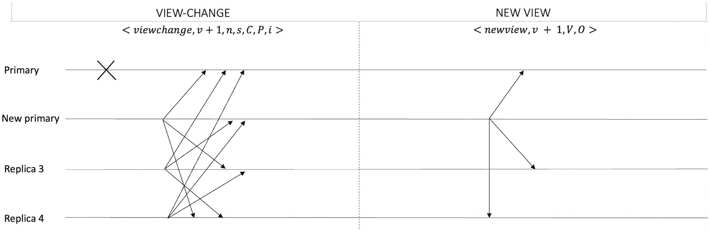

该视图变更协议示意图包含主副本、新主副本、副本 3 和副本 4 的流程。这些流程分为 `view-change` 和 `new view` 两个阶段。

图 7-11 视图变更协议

视图变更子协议是确保系统活跃性的一种手段。该子协议采用了三种巧妙技术来保证：

1. 广播了 `view change` 消息的副本会等待 `2f+1` 个视图变更消息，然后启动其计时器。如果计时器在节点收到下一个视图的 `new view` 消息之前超时，该节点将为下一个序列启动视图变更，但会增加其超时值。如果副本在执行新视图中的新唯一请求之前超时，也会出现这种情况。
2. 一旦副本收到 `f+1` 个大于其当前视图编号的视图变更消息，该副本将会为其已知集合中最小的视图编号发送 `view change` 消息，以避免下一次视图变更发生得太晚。即使计时器尚未到期，也会发送针对最小视图的 `view change` 消息。
3. 由于只有当至少 `f + 1` 个副本发送了 `view change` 消息时才会发生视图变更，这种机制确保了故障主副本无法通过连续请求视图变更来无限期地阻止协议推进。

在繁忙的环境中，存储尤其可能成为瓶颈。为了解决这个问题，PBFT 协议中使用了检查点机制。

##### 检查点子协议

检查点是一个关键的子协议。它用于丢弃所有副本日志中的旧消息。通过这种方式，副本就一个稳定检查点达成一致，该检查点提供了在特定时间点上全局状态的快照。这是一个周期性过程，由每个副本在执行请求后执行，并在其日志中将其标记为一个检查点。一个名为 `low watermark`（低水位线，在 PBFT 术语中）的变量用于记录最后一个稳定检查点的序列号。该检查点会被广播到其他节点。一旦某个副本收到至少 `2f + 1` 个检查点消息，它就会将这些消息保存起来，作为稳定检查点的证明。同时，它会从其日志中丢弃所有先前的 `pre-prepare`、`prepare` 和 `commit` 消息。

### PBFT 的优缺点

PBFT 是一项开创性的协议，开创了实用拜占庭容错协议这一新的研究领域。原始的 PBFT 协议有很多优点，但也存在一些缺点。下面我们将逐一介绍。

#### 优势

*   PBFT 提供即时且确定性的交易最终性。相比之下，在 PoW 协议中，需要多次确认才能以较高概率最终确定一笔交易。
*   与消耗大量电力的 PoW 相比，PBFT 也更加节能。

#### 缺点

*   PBFT 的可扩展性不强。这一限制使其更适合联盟链，而非公有链。不过，它比 PoW 协议要快得多。
*   PBFT 网络容易受到女巫攻击，即单个实体可以控制多个身份来影响投票，从而影响决策。
*   通信复杂度高。
*   不适用于具有匿名参与者的公有链。

PBFT 保证了安全性和活跃性。接下来我们来看一下它是如何做到的。

##### 安全性与活性

**活性**意味着，只要消息传递延迟的增长速度不会无限期地超过时间本身，客户端最终会收到其请求的响应。换句话说，如果延迟的增长速度慢于超时阈值，该协议就能确保系统持续推进。

拜占庭主节点可能故意引入延迟。然而，这种延迟不可能是无限期的，因为每个诚实的副本节点都设有一个视图变更计时器。当副本节点收到请求时，该计时器便会启动。假设在请求被执行前计时器超时，该副本节点会怀疑主节点，并向所有副本节点广播一条视图变更消息。一旦有 `f + 1` 个副本节点怀疑主节点存在故障，所有诚实的副本节点就会进入视图变更流程。这种情况将导致视图变更，下一个副本节点将接替成为主节点，协议从而得以继续推进。

只要不超过 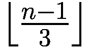 个副本节点发生故障，并且消息延迟的增长速度不超过时间本身，活性就能得到保证。这意味着，在上述两个条件下，协议最终会取得进展。这种弱同步假设更接近现实环境，并使系统能够规避 FLP 不可能结果。这里有一个巧妙的技巧：如果在一个副本节点收到预期新视图的有效新视图消息之前，其视图变更计时器就过期了，该节点会将超时时间加倍，并重新启动其视图变更计时器。其思想是，由于消息延迟可能更长，超时计时器会加倍等待时间以等待更长时间。最终，计时器值会变得比消息延迟更大，这意味着消息最终会在计时器过期之前到达。这种机制确保最终所有诚实的副本节点都能获得一个新视图，协议也将取得进展。

此外，拜占庭主节点无法通过连续频繁地进行视图变更来拖慢系统。这是因为，一个诚实的副本节点只有在收到至少 `f + 1` 条视图变更消息时才会加入视图变更。由于最多只有 `f` 个故障副本节点，因此当所有诚实的副本节点都处于活跃状态且协议正在推进时，仅仅 `f` 个副本节点无法引发视图变更。换句话说，由于最多连续 `f` 个主节点可能出现故障，系统在经过最多 `f + 1` 次视图变更后最终会取得进展。

副本节点会等待 `2f + 1` 条视图变更消息，并启动一个计时器来开始一个新视图，这避免了过早启动视图变更。类似地，如果一个副本节点收到了针对一个大于其当前视图编号的 `f + 1` 条视图变更消息，它就会广播一条视图变更消息。这可以防止过晚启动下一次视图变更。

**安全性**要求每个诚实的副本节点以相同的全序执行收到的客户端请求，即在所有阶段中以相同的顺序执行相同的请求。

假设节点总数为 `3f + 1`，则 PBFT 被认为是安全的。在这种情况下，可以容忍 `f` 个拜占庭节点。

让我们首先回顾一下什么是法定人数交集。如果有两个集合，例如 `S1` 和 `S2`，每个集合都包含 ≥ `2f + 1` 个节点，那么 `S1 ∩ S2` 中总存在一个正确的节点。这是正确的，因为如果存在两个各自至少包含 `2f + 1` 个节点的集合，并且总共有 `3f + 1` 个节点，那么根据鸽巢原理，`S1` 和 `S2` 的交集将至少包含 `f + 1` 个节点。由于最多只有 `f` 个故障节点，因此交集 `S1 ∩ S2` 中必定至少包含 1 个正确节点。

PBFT 中的每个阶段都必须获得 `2f + 1` 个证书/投票才能被接受。事实证明，至少需要一个诚实的节点对同一个序号投两次票才会导致安全性被破坏，而这不可能发生，因为诚实的节点不能恶意投票。换句话说，如果恶意主节点为了破坏安全性而将同一个序号分配给两个不同的消息，那么由于法定人数交集的性质，至少会有一个诚实的副本节点拒绝它。这是因为一个 `2f + 1` 的法定人数意味着至少存在一个诚实的交集副本节点。

提交阶段确保了即使在跨视图的情况下也能实现正确的排序。如果发生视图变更，新的主节点会从 `2f + 1` 个副本节点获取准备证书，这确保了新主节点能够获得由正确副本节点执行的每个客户端请求的至少一个准备证书。

### 视图内的排序

如果一个副本节点在一个视图内为一个请求获取了一个具有唯一序号的准备证书，那么没有其他副本节点能够为同一视图和序号的不同请求获取准备证书。副本节点只能为同一视图和序号下的相同请求获取准备证书。

想象一下，两个副本节点为同一视图和序号下的两个不同请求收集了准备证书。我们知道一个准备证书包含 `2f+1` 条消息，由于法定人数交集的存在，这意味着必须有一个正确的节点为同一序号和视图下的两个不同请求发送了 `预准备` 或 `准备` 消息。然而，一个正确的副本节点对于每个视图和序号只会发送一条 `预准备` 消息，也就是说，当主节点收到客户端请求并将其分配给该请求时，序号总是递增的。此外，一个正确的副本节点在每个视图中对于每个序号只会发送一条 `准备` 消息。只有当它之前没有接受过同一视图或序号的任何 `预准备` 消息时，它才会发送 `准备` 消息。这意味着准备消息必须针对的是同一个请求。这样就实现了视图内的排序。

### 跨视图的排序

该协议保证，如果一个正确的副本节点在一个视图内以某个特定序号执行了一个客户端请求，那么在任何后续视图或当前视图中，没有其他正确的副本节点会以相同的序号执行任何其他客户端请求。换句话说，每个由诚实副本节点执行的请求，在进入下一个视图时都必须保持其先前分配的相同顺序。

我们知道，一个请求只有在副本节点收到 `2f + 1` 条提交消息后才会被执行。假设一个诚实的副本节点已经获得了 `2f + 1` 条提交消息。这意味着该客户端请求必须至少在 `f + 1` 个诚实的副本节点上准备好了，并且这些副本节点中的每一个都拥有该请求以及所有先前客户端请求的准备证书。我们还知道，这 `f + 1` 个诚实的副本节点中至少有一个会参与视图变更协议，并报告这些请求及其证书。这意味着该请求在新视图中将始终携带相同的序号。

至此，我们对 PBFT 的讨论就结束了。然而，这是一个庞大的课题，你可以进一步阅读原始论文和学位论文来了解更多。

## 区块链与经典共识

我们可以在区块链中实现经典算法。然而，挑战在于修改这些协议，使其适合区块链实现。核心算法保持不变，但某些方面被调整以使其适用于区块链。一个问题 是，这些传统共识算法适用于所有参与者都已知且可识别的许可环境。但区块链网络是公开且匿名的，例如比特币和以太坊。因此，经典算法主要适用于企业用例的许可区块链网络，其中所有参与者都是已知的。此外，区块链网络环境是拜占庭式的，恶意行为者可能会试图偏离协议。而 Paxos 和 RAFT 是属于 CFT 协议，不适用于拜占庭环境。因此，要么需要将这些协议修改为 BFT 协议以容忍拜占庭故障，要么需要使用不同的 BFT 协议。这些 BFT 协议可以是对现有经典 CFT 或 BFT 协议的修改，也可以是专门为区块链从头开发的。IBFT 是修改现有经典协议以适应许可区块链环境的一次尝试，我们将在第[8](https://wiki.example.org/515270_1_En_8_Chapter.xhtml)章中介绍。我们将在下一章进一步讨论区块链协议。

RAFT 支持的两个非常有用的特性是动态成员（重新配置）和使用快照的日志压缩。这两个特性在联盟链中尤其有用。随着时间的推移，区块链可能会变得非常庞大，快照是处理存储问题的一个有效方法。此外，成员管理可以是一个有用的特性，可以以自动化的方式加入新的联盟成员。然而，RAFT 仅是 CFT，不太适合联盟链。尽管如此，正如 Tangaroa（RAFT 的 BFT 扩展）所展示的，在 RAFT 中引入拜占庭容错是可能的。Tangaroa 中报告了一些问题，但构建 RAFT 的 BFT 版本是完全可能的。或者，这两个特性可以在区块链网络的 PBFT 变体中实现。PBFT 的变体包括 IBFT、HotStuff、LibraBFT 等。

## 总结

在本章中，我们涵盖了许多主题，包括视图戳复制、实用拜占庭容错、RAFT 和 Paxos。Paxos 和视图戳复制至关重要，因为它们提供了分布式共识问题历史上非常基础的思想。Paxos 尤其提供了协议正确性的形式化描述和证明。VR 与 Multi-Paxos 有相似之处。RAFT 是 Paxos 的改进版。PBFT 实际上被视为 Paxos 的拜占庭容错版本，尽管 PBFT 是独立开发的。

本章为理解下一章中区块链时代之前的经典协议奠定了基础。许多思想源于这些经典协议，进而促进了为区块链开发更新协议的发展。