# 区块链时代协议

本章涵盖了区块链时代的协议。第[7](https://wiki.example.org/515270_1_En_7_Chapter.xhtml)章讨论了一些新颖的协议和一些经典区块链共识协议的变体。我们从以太坊开始，以对 Solana 的讨论结束本章。在此过程中，我们将详细探讨 Cosmos、以太坊 2.0 和 Polkadot 等平台中使用的主要共识协议的特性、优势、劣势、属性和内部工作原理。

我们已经在第[5](https://wiki.example.org/515270_1_En_5_Chapter.xhtml)章中详细讨论了工作量证明。因此，我不会在此重复；不过，本章将讨论以太坊的 PoW。

## 引言

共识协议是任何区块链的核心。随着比特币的出现，涌现出一类新的共识协议。因此，我们可以将在比特币出现及之后出现的所有区块链共识协议归类为“区块链时代共识协议”。

区块链中共识协议的主要目标是在保持系统安全性和活跃性的同时，就区块链的状态达成一致。状态通常指代区块链的价值、历史和规则。就区块链的规范历史达成一致至关重要，就链的管理规则达成一致同样关键。此外，就添加到链上的价值（数据）达成一致是根本性的关键。

与传统的区块链前协议一样，安全性和活跃性是共识协议为确保区块链的一致性和进展而应满足的两个关键属性。

区块链共识协议可以分为两大类：概率最终性协议和绝对最终性协议——换句话说，即概率终止协议和确定性终止协议。概率协议广泛用于加密货币公共区块链，如以太坊和比特币。确定性协议，通常属于 BFT 协议类别，常用于企业区块链；然而，它们也用于一些公共区块链。虽然 PBFT 变体更常用于企业区块链，但它们在公共链中的使用仅限于某些公共区块链。例如，Solana 中使用的 TowerBFT 是一种确定性最终性共识协议。EOSIO 中使用的 BFT-DPOS 是另一个例子。确定性最终性也称为*前向安全*，它保证一旦交易最终确定，就不会被回滚。

从共识算法的工作方式来看，区块链或分布式账本基于以下一种或多种类型的共识算法：

- **基于 PoW**：例如比特币中的中本聪共识，它依赖于使用暴力破解解决数学难题。

- **基于领导者**：例如常见的 BFT 协议，其中领导者作为区块/价值的主要提议者。

- **基于投票**：通常适用于 BFT 协议，其中领导者从追随者那里收集投票以最终确定决策。也称为“基于法定人数”。

- **虚拟投票**：通常，BFT 协议中的投票从通信角度来看很复杂，每个投票者都需要发送和接收多条消息给领导者。虚拟投票是 Hedera 使用的 Hashgraph 算法中的一种技术，通过查看 Hashgraph 的本地副本而不是与其他节点进行复杂通信来评估投票。这个过程最终会达成拜占庭协议。

- **基于经济**：例如依赖于网络中质押的权益证明机制。

在比特币诞生之后，出现了许多区块链，并引入了替代的 PoW 算法，例如莱特币。由于 PoW 消耗大量能源，社区很早就意识到需要设计不会过度消耗能源的替代方案。在引入能耗较低协议的过程中，开发者引入了权益证明。通过 PoS，构建可持续的公共区块链网络成为可能。然而，也存在一些挑战和注意事项。在了解 PoS 的工作原理之后，我们将讨论这些局限性。


## 权益证明

尽管比特币的工作量证明已被证明是一种具有弹性且稳健的协议，但它存在若干局限性：

- 能源消耗过高
- 区块生成速度缓慢
- 由于需要专用硬件和大型矿池，正变得中心化
- 概率性最终确定性，这不适用于大多数应用
- 并非完美的共识算法，存在一些攻击方式，例如金手指攻击、51%攻击
- 挖矿需要专用硬件，准入门槛越来越高
- 可扩展性不足，无法支持常规的高吞吐量应用

为解决上述弱点，大量研究工作一直在进行中。尤其是，前述局限性中的高能耗问题催生了一些替代方案。权益证明便是这样一种替代方案。

权益证明于 2012 年首次出现在 Peercoin 中。随后，许多区块链采用了这一机制，例如 EOS、NxT、Steem、Tezos 和 Cardano。此外，以太坊也将通过其宁静升级，不久后过渡到基于 PoS 的共识机制。权益证明也被称为虚拟挖矿。如此称呼的原因是，在 PoS 中，无需要求矿工分配计算资源来解决难题，而是根据矿工拥有的价值来决定产生下一个区块的权利。这种有价值的资产可以是任何与网络利益一致的有价值之物（通常是代币）。PoW 的座右铭是一个 CPU 等于一票，而我们可以把 PoS 理解为一个代币等于一票。

下一个提议者通常是随机选举产生的。提议者通过交易费或区块奖励获得激励。与 PoW 类似，需要以持有大量权益的形式控制网络的大部分，才能攻击和控制网络。

PoS 协议通常根据利益相关者质押的资产来选择他们并授予相应权利。权益的计算因具体应用而异，但通常基于总余额、存入的价值或验证者之间的投票。一旦计算出权益并选择某位利益相关者作为区块提议者，该提议者提出的区块就会被立即接受。权益越高，赢得下一个区块提议权的机会就越大。

一个 PoS 方案的通用架构如图 8-1 所示。


权益方案的流程图包含以下流程：前一个区块哈希，交易 T x 到 T x；计算器；新提议者选择；已选择；是，停止。

图 8-1
权益证明方案

如图 8-1 所示，PoS 使用一个权益计算器函数来计算质押资金的数量，并据此选择一个新的提议者。

下一个提议者通常是随机选举产生的。提议者通过交易费或区块奖励获得激励。需要持有大部分权益以控制网络的大部分，才能攻击网络。

在选择过程中引入了一些随机性元素，以确保公平性和去中心化。选举提议者的其他因素包括代币的币龄，即考虑质押的代币已有多长时间未被花费；代币未被花费的时间越长，被选中的机会就越大。

PoS 有几种类型：

- 基于链的 PoS
- 基于 BFT 的 PoS
- 基于委员会的 PoS
- 委托权益证明
- 流动权益证明

### 基于链的 PoS

该方案是首个针对 PoW 提出的替代方案，于 2012 年首次在 Peercoin 中使用。这种机制类似于 PoW；然而，区块生成方法有所改变，它通过两步完成区块的最终确认：

- 从内存池中选取交易，并创建一个候选区块。
- 设置一个具有恒定时钟滴答周期的时钟。在每个时钟滴答，检查区块头与时钟时间的哈希值是否小于目标值与权益值的乘积。我们可以用如下简单公式表示：

```
Hash (B_h || clock time) < target * stake value
```

权益值取决于算法的工作方式。在某些链中，它与质押量成正比。在其他链中，则基于参与者持有权益的时间长度。目标值是每单位权益价值的挖矿难度。

这种机制使用与 PoW 类似的哈希难题。但是，与其通过消耗高能量和使用专用硬件来竞争解决哈希难题，PoS 中的哈希难题仅在固定的时钟间隔内被解决一次。如果矿工的权益值很高，那么解决哈希难题的难度会按比例降低。这与 PoW 需要重复进行暴力哈希运算来解决数学难题形成对比。

### 基于委员会的 PoS

在该方案中，通常使用可验证随机函数（VRF）随机选择一组利益相关者。VRF 根据利益相关者的权益和区块链的当前状态，产生一个随机的利益相关者集合。被选中的利益相关者组负责按顺序提议区块。

通用方案描述如下：

- 验证者加入网络并存入一笔质押金。
- 参与委员会选举过程，并持续检查自己的轮次。
- 当轮到该验证者时，收集交易、生成区块、将新区块追加到链上，最后广播该区块。
- 在其他接收节点上，验证区块；如果有效，则将区块追加到区块链中，并将该区块传播给其他节点。

委员会选举会产生一个伪随机的验证者出块轮次序列。Ouroboros Praos 和 BABE 是基于委员会的 PoS 的常见示例。

### 基于 BFT 的 PoS

在该方案中，区块使用权益证明机制生成，其中根据权益证明选择区块提议者来提议新区块。提议者基于在系统中存入的质押金选举产生。被选中的几率与系统中存入的质押金数额成正比。提议者生成一个区块并将其追加到临时区块池中，BFT 协议会从该池中最终确认一个区块。

通用方案工作流程如下：

- 根据与质押金成正比的 PoS 机制，选举一个区块提议者。
- 提议者：提议一个新区块，将其添加到临时区块池，并广播新区块。
- 接收者：当其他节点接收到此区块时，它们验证该区块，如果有效，则将其添加到本地的临时区块池中。
- 在共识时期期间：
  - 运行 BFT 共识以最终确认一个有效（获得最多投票）的区块。
  - 将得票最多的有效区块添加到主区块链中。
  - 从临时区块池中移除其他区块。

Cosmos 中的 Tendermint 就是一个例子，其中验证者基于质押金选择，其余协议基于 BFT 原理工作。其他例子包括 Casper FFG。

只要三分之二的验证者保持诚实，基于 BFT 的 PoS 就具有容错性。此外，区块会被立即最终确认。


#### 委托权益证明（Delegated PoS）

`DPoS` 的工作方式类似于权益证明，但其关键区别在于引入了投票和委托机制，激励用户维护网络安全。`DPoS` 限制了所选共识委员会的规模，从而降低了协议中的通信复杂度。共识委员会由通过委托机制选举产生的所谓“委托者”组成。其流程是：利益相关者利用自己的权益投票选出委托者。委托者（也称为见证人）的身份是可识别的，投票者知道他们是谁，因此降低了委托者作恶的可能性。此外，还可以实施基于声誉的机制，允许委托者根据其提供的服务以及在网络上的行为来建立声誉。委托者可以为自己宣传以争取更多选票。获得最多选票的委托者将成为共识委员会或小组的成员。通常，共识委员会成员之间运行着一种 `BFT` 风格的协议，用于生成和最终敲定区块。每个成员可以采用轮询方式提议下一个区块，但此活动仅限于选定的共识委员会内部。委托者通过生产区块获得激励。同样，在 `BFT` 假设下，共识委员会内部的协议可以在一个 `3f+1` 成员的组中容忍 `f` 个故障。换句话说，它可以容忍三分之二（即 33%）的委托者出现故障。该协议提供了即时最终确定性，并根据利益相关者的权益比例提供激励。由于无需全网共识，只需一个较小的委托者小组负责决策，因此效率显著提高。`Delegated PoS` 已在 `EOS`、`Lisk`、`Tron` 以及不少其他链上得到实现。

#### 流动权益证明（Liquid PoS）

`LPoS` 是 `DPoS` 的一种变体。代币持有者将其验证权委托给验证者，而无需转让代币的所有权。存在一个委托市场，委托者在此相互竞争，以期成为选定的验证者。在这里，竞争主要围绕费用、提供的服务、声誉、支付频率以及可能还有其他因素展开。任何不当行为，例如验证者收取过高费用，都会迅速被发现并受到相应惩罚。代币持有者也可以自由地转向任何其他验证者。与 `DPoS` 固定的验证者集合相比，`LPoS` 支持动态数量的验证者。代币持有者还可以通过自行选举成为验证者。持有少量代币的用户可以委托给持有大量代币的用户。同时，许多小额代币持有者可以组成一个联合体。与其他 `PoS` 协议相比，这种“流动”协议提供了极大的灵活性，并有助于防止形成旨在成为固定验证者集合的游说团体。`LPoS` 被用于 `Tezos` 区块链。

存在一些针对 `PoS` 的攻击，例如无成本利益问题（Nothing-at-Stake Attack）、长程攻击（Long-Range Attack）以及权益磨削攻击（Stake Grinding Attack）。我们如下解释这些攻击。

### 攻击

`PoS` 普遍遭受一种无成本模拟（Costless Simulation）问题的困扰，即攻击者可以在不产生任何额外成本的情况下模拟链的任何历史，而 `PoW` 的成本则是算力。这种无成本的区块生成是 `PoS` 中许多攻击的基础。

#### 无成本利益问题（Nothing-at-Stake Problem）

当出现多个分叉时，就会发生无成本利益问题或双重押注问题。攻击者可以在每个分叉之上生成一个区块，而无需任何额外成本。为了解决这个问题，协议中引入了经济惩罚机制来阻止攻击者发起此类攻击。如果有大量节点这样做，那么即使持有代币比例低于 50% 的攻击者也能发动双花攻击。

#### 长程攻击（Long-Range Attacks）

长程攻击的存在是由于弱主观性（Weak Subjectivity）和无成本模拟。长程攻击之所以可能，也是因为无成本模拟：攻击者从创世区块开始创建一个新的分支，其目的是在主链被恶意链的长度超越后，接管原有的良好主链。这可能会创建一条与区块链有害的替代历史。

弱主观性问题会影响新节点以及长时间离线后重新加入网络的节点。由于节点不同步，并且网络中通常存在多个分叉，这些节点无法区分哪个节点是正确节点、哪个是恶意节点；它们可能会错误地将恶意分叉视为有效分支。

#### 其他攻击

**活性拒绝（Liveness Denial）** 是 `PoS` 可能遭受的另一种攻击。在这种攻击中，部分或全部验证者共同决定停止验证区块，从而导致区块生产停滞。协议对此类活动进行惩罚可以防止这类攻击。

**自私挖矿（Selfish Mining）** 或扣块攻击（Block Withholding Attack）发生在攻击者离线挖掘自己的链时。一旦该链达到理想长度，攻击者就将此链发布到网络中，期望恶意链能够取代原有的良好主链。这可能导致诚实验证者浪费资源，从而扰乱网络。

**磨削攻击（Grinding Attack）** 发生在 `PoS` 中，如果区块生产者的选举过程不是随机的。如果该过程没有引入随机性，那么某个区块生产者就可以反复增加自己被选中的频率，从而导致审查或不成比例的奖励。解决这个问题的一个简单方法是采用良好的随机选择过程，通常基于可验证随机函数（`VRFs`）。

接下来，我们讨论以太坊的工作量证明——`Ethash`。


## 以太坊的工作量证明

我们在第 5 章中详细讨论了比特币的`PoW`。本节将介绍以太坊使用的`PoW`，即`ETHASH`的工作原理。

`Ethash`是 Dagger-Hashimoto 算法的演进形式。挖矿的核心思想是找到一个`nonce`（任意随机数），将其与区块头拼接并进行哈希运算后，得到的数值低于当前网络难度值。起初，以太坊刚问世时难度较低，甚至 CPU 和单 GPU 挖矿在一定程度上也能盈利，但如今已非如此。因此，现在只有矿池或大型 GPU 矿场才能用于盈利性挖矿。

`Ethash`是一种内存硬算法，由于需要在`ASICS`上配备大容量高速内存，这通常不切实际，因此难以在专用硬件上实现。值得注意的是，`Ethash`的内存硬性在相当长一段时间内阻碍了`ASICs`的发展，但如今已有多种`ASIC`矿机可用于以太坊挖矿。

该算法需要从一种称为有向无环图（`DAG`）的固定资源中选择子集，具体选择取决于`nonce`和区块头。

`DAG`是一个庞大的伪随机生成数据集。该图以矩阵形式存储于以太坊挖矿过程中创建的`DAG`文件中。`Ethash`算法将`DAG`表示为二维数组，元素为 32 位无符号整数。只有当挖矿节点首次启动并完全创建`DAG`后，挖矿才会开始。

此`DAG`被`Ethash`算法用作种子。`Ethash`算法需要`DAG`文件才能运行。`DAG`文件在每个纪元（即每 30,000 个区块）生成一次。`DAG`随着链规模的扩大而线性增长。

协议的工作流程如下：

-   使用`Keccak-256`哈希函数，将最新区块的区块头与一个 32 位随机`nonce`相结合。
-   生成一个 128 位结构体，称为`mix`，该结构体决定从`DAG`中选择哪些数据，即一个 128 字节的页面。
-   从`DAG`中获取数据后，将其与`mix`进行“混合”，生成下一个`mix`，然后使用新的`mix`再次从`DAG`中获取数据并再次混合。此过程重复 64 次。
-   最终，对第 64 个`mix`执行摘要函数，生成一个 32 字节序列，称为`mix digest`。
-   将此序列与难度目标进行比较。如果小于难度目标，则`nonce`有效，`PoW`即被解开，区块被成功挖掘。否则，算法将使用新的`nonce`重复此过程。

我们可以从图 8-2 中直观地看到这个过程。

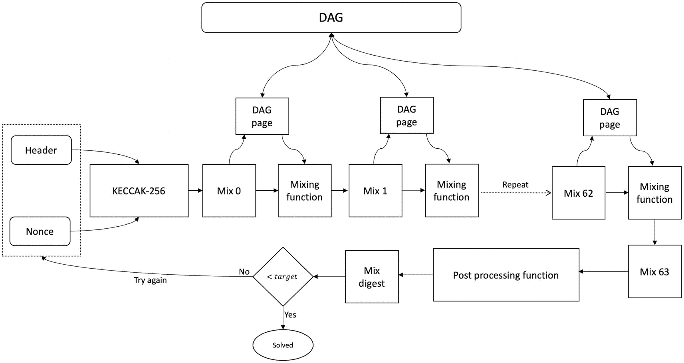

`DAG`的组织结构图被分为 3 个`DAG`页面，这些页面链接到一个包含区块头、`nonce`和其他功能的循环流程中。

**图 8-2** Ethash 处理流程

`Ethash`有几个目标：

-   该算法几乎消耗所有可用的内存访问带宽，这是一种抗 ASIC 措施。
-   使用 GPU 进行`Ethash`挖矿更容易执行。
-   轻客户端能够更高效地验证挖矿轮次，并应能快速投入运行。
-   该算法在轻客户端上运行极其缓慢，因为不期望它们参与挖矿。

随着以太坊执行层（原以太坊 1.0）向共识层（原以太坊 2.0）演进，这种`PoW`最终将被淘汰。当当前的 EVM 链接入信标链（即所谓的“合并”）发生时，`Casper FFG`将运行在`PoW`之上。然而，最终，纯粹的`PoS`算法`Casper CBC`将完全接管。

此外，随着冰河时代的激活，由于“冰河时代”导致的极端难度级别，`PoW`挖矿将几乎变得不可能，用户将别无选择，只能转向`PoS`。

## Solana

Solana 是一个于 2018 年推出的、支持智能合约的第一层区块链。Solana 的开发人员致力于实现速度、安全性、可扩展性和去中心化。在撰写本文时，它仍处于测试阶段，但正在迅速流行起来。尽管它是一个运行着生产系统的运营网络，但仍有一些技术问题正在解决中。

其账本是一个可验证延迟函数，其中时间就是一种数据结构，即数据即时间。它潜在地支持数百万个节点，并利用 GPU 进行加速。`SOL`币是该平台的原生代币，用于治理和激励。其主要创新包括以下几点。

历史证明（`PoH`）使得能够使用基于数据结构的加密时钟（而非外部时间源）对事件进行排序，进而达成共识。

`TowerBFT` 是一种源自`PBFT`的共识协议。请注意，`PoH`并非共识协议，它只是一种利用基于数据结构的时钟对事件进行排序的机制。仍然需要一个共识机制来让节点对账本的正确分支进行投票。

`Turbine`是另一项创新，它使得区块能够以小片段（称为`shreds`）进行传播，有助于实现速度和效率。Solana 中没有内存池，因为交易处理速度非常快，以至于不会形成内存池。这种机制被称为“墨西哥湾流”。

Solana 支持智能合约的并行执行，这再次提高了效率。

交易在验证器内所谓的“交易处理单元”中，通过流水线技术以优化方式进行验证。

Cloud break 是一个具有水平扩展能力的数据库的名称。最后，归档者或复制者是那些允许分布式账本存储的节点，因为在像 Solana 这样的高吞吐量系统中，数据存储可能成为瓶颈。为此，使用归档者来存储数据，并给予其激励。

由于我们的主要关注点是共识算法，我将在此结束对区块链的介绍，转而讨论 Solana 中的实际共识及相关机制。

Solana 使用权益证明和`TowerBFT`共识算法。Solana 的关键创新之一是历史证明，它并非共识算法，但能够创建事件的自洽记录，证明某个事件发生在一个特定时间点之前或之后。这进而促成了共识。它降低了 BFT 协议中的消息复杂度，有效地将通信替换为本地计算。这直接带来了高吞吐量和亚秒级最终性。分布式系统研究界早已认识到，如果能够以某种方式将通信替换为本地计算，则可以显著提升性能，许多时钟同步协议也因此应运而生。然而，所有这些协议通常都依赖外部时间源（通过原子钟或 GPS），然后使用 NTP 类型的协议进行同步。`PoH`则是一种无需依赖外部时间源，即可通过加密方式证明事件之间顺序和时间流逝的证明。


### 历史证明

正如第 1 章所述，分布式系统中的时间至关重要。如果进程间的时间是同步的，即分布式网络中拥有同步时钟，那么通信量便可减少，从而提升性能。节点可以从过去的事件中推断信息，而无需反复向其他节点询问某些信息。例如，若存在一个所有节点都同步的全局时钟，系统就能建立一套系统范围的事件历史概念。再如，事件上的时间戳可以告知节点该事件相对于全网同步时间发生的时刻，而无需再次向产生该事件的节点询问其发生时间。

同步时钟的另一个应用是，系统中的实体可以推断某个事物是否已过期。例如，带有时间戳的安全令牌可以立即告知节点自其创建以来已过去了多长时间。节点便能推断该令牌是否仍然有效，而不是发生在遥远过去的事物，从而使令牌失效且不再适用。

在复制协议中，时钟同步也扮演着至关重要的角色。如果节点没有同步时钟，就可能导致不一致，因为每个节点对事件顺序会有不同的视角。

如果节点间的时间不同步，系统就无法建立全局时间和历史的概念。在实际系统中，通常可以通过`NTP`协议实现这一点。我们在第 2 章中讨论分布式系统的时间与顺序时，曾提及这一点。

到目前为止，我们已经确定，同步时钟在分布式系统中确实是一种有价值的结构，能够带来性能提升。换句话说，如果我们能以某种方式用本地计算替代通信，就能获得巨大的效率提升。

此外，同步性和时间相结合可以轻松解决共识问题。安全性和活跃性这两个基本需求，在有可信时钟和同步网络的情况下很容易实现。然而，经验表明网络是异步的。我们也知道，在分布式网络中维护一个可信的同步时钟十分困难。区块链和分布式系统的特点是没有时钟，这导致它们因固有的异步性以及事件排序和达成共识所需的复杂消息传递而变得缓慢。

另一方面，一个可靠、可信的时钟能使网络同步变得更加简单快捷，从而带来极快的网络速度。Solana 的`PoH`是一种解决方案，它能让系统在互不信任的计算机之间可靠地保持时间。简而言之，`PoH`让无时钟的区块链拥有了时钟。

Solana 的`PoH`是一种在分布式网络中建立历史记录，并为节点提供全局同步时间概念的方法。其关键创新在于，它不依赖任何外部时间源（例如通过`NTP`协议）来同步节点；相反，它使用加密证明来表明一段时间已经过去，而其他节点则因加密保证直接接受这段事件历史。因此，这种机制不依赖全局时间源，而是内置于验证者中，它们生成一个事件序列，并在事件发生时附上证明。下文描述了其工作原理。

在区块链网络中，添加新区块的权利是在解决难题（即`PoW`）后获得的，这通常需要很长时间。尽管这种机制是安全的，并能抵御女巫攻击（如第 5 章所述），但速度很慢。如果使用 BFT 风格的共识，提议区块的领导者验证者至少需要经过两个连续的阶段才能提交，即使在正常环境下这也相当耗时。在发生故障时，随着新领导者的选举和视图变更，速度可能会进一步降低。那么，如果有一种确定性的领导者选举算法，可以快速连续地选出领导者，每个领导者迅速提议，然后算法再转向下一个领导者，如此循环往复，情况会怎样？这一切都无需经历复杂的领导者选举、其他节点的确认以及运行多个阶段来达成共识。这里的问题是，创建一种能选出下一个领导者的确定性算法很容易，但如何确保他们所提议的内容是正确的，并且选出的领导者不是恶意的，不会审查交易或表现出其他恶意行为呢？

这正是`PoH`发挥作用的地方。在 Solana 中，一次只有一个领导者处理交易并更新状态。其他验证者读取状态，并向领导者发送投票以确认这些交易。这个活动被分割成非常短的连续会话，领导者一个接一个地执行此操作。可以将其视为账本被分割成许多小的时间间隔。每个小间隔为`400ms`。领导者轮换计划是预先确定且确定性的，基于多个因素，例如质押量和先前交易的行为。但如何确保领导者轮换在正确的时间进行，并且不会跳过领导者的轮次呢？

在`PoH`中，时间的流逝是通过创建一系列哈希值来证明的，如图 8-3 所示。

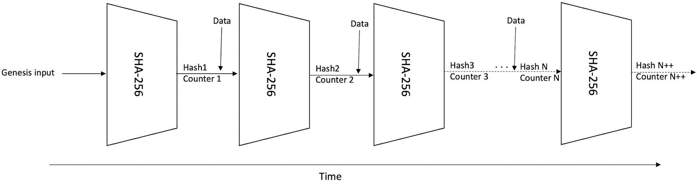

Solana 证明的图示包含将创世输入到`4 S H A 256`哈希函数，以输出哈希`N plus pus, counter plus plus`。

**图 8-3.** Solana 历史证明序列

在图 8-3 中，展示了一系列哈希操作。首先将创世输入（图中左侧所示）提供给哈希函数。在下一个迭代中，前一个哈希函数的输出被用作哈希函数的输入，此过程无限循环。这个序列是在单核上使用`SHA-256`函数生成的。这个过程无法并行化，因为前一个哈希函数的输出只有当且仅当哈希函数处理完前一个输入后才能获知。假设这些函数是抗原像的加密哈希函数。因此，这是一个纯粹的顺序函数。然而，这个序列可以使用多核 GPU 并行验证。由于所有输入和输出都是可用的，验证每个输出只是时间问题，而 GPU 可以并行完成。这一特性使得该序列成为一个可验证延迟函数（`VDF`），因为生成哈希序列所花费的时间（即延迟）可以通过快速的并行验证来验证。然而，对于斯坦福大学研究人员提出的加密`VDF`和 Solana 研究人员提出的硬件`VDF`，存在一些争论。请参阅参考文献中的资料。


我们可以按固定时间间隔对这个序列进行采样，从而提供时间流逝的概念。这是因为哈希生成需要一定的 CPU 时间（在 Intel 或 AMD CPU 上，SHA-256 指令大约需要 1.75 个周期），并且这个过程完全是顺序的；通过观察这个序列，我们可以推断出自第一个哈希生成以来，直到序列中后面的某个哈希，已经过去了一些时间。如果我们还能向哈希函数的输入哈希中添加一些数据，那么我们可以推断出这些数据一定存在于前一个哈希之后、后一个哈希之前。这个哈希序列因此成为历史证明（**Proof of History**），以密码学方式证明某个事件（比如事件 `e`）发生在事件 `f` 之前和事件 `d` 之后。

这是一个连续运行 `SHA-256` 的顺序过程，它反复且不间断地使用前一个输出作为其输入。它会定期记录每个输出样本的计数器（例如，每秒钟一次）和当前状态（哈希输出），其作用类似于时钟滴答。观察这种固定时间间隔采样的哈希结构，我们可以推断出已经过去了一些时间。这个过程无法并行化，因为前一个输出是下一次迭代的输入。例如，我们可以说在计数器 1 和计数器 N 之间已经过去了一段时间（图 8-3），其中时间就是 `SHA-256` 计数器的数值。我们可以从这个计数中近似得出实际时间。我们还可以关联一些数据，将其附加到哈希函数的输入中；一旦哈希完成，我们就可以确信这些数据在哈希生成之前就已经存在。这种结构只能按顺序生成；然而，我们可以并行地验证它。例如，如果 4000 个样本需要 40 秒生成，那么使用一个 4000 核的 GPU 只需要 1 秒就能验证整个数据结构。

关键思想是，PoH 的交易吞吐量与共识是分离的，这是实现扩展性的关键。请注意，所生成事件的顺序（即序列）并非全局唯一。因此，需要一种共识机制来确定真正的链，因为任何人都可以生成一个替代的历史。

历史证明是一种以密码学方式证明时间流逝的方法。它可以被视为一种特定于应用的可验证延迟函数。它通过使用 `SHA-256` 哈希来对传入的事件和交易进行哈希处理，从而将时间的流逝编码为数据。它为每个事件生成一个唯一的哈希和计数，从而产生一个随时间变化的、可验证的事件排序。这意味着可以在无需等待其他节点响应的前提下达成关于时间和事件排序的共识——换句话说，不存在弱主观性，即节点无需依赖其他节点来确定系统的当前状态。这带来了高吞吐量，因为通常需要由其他节点提供的信息已经包含在 PoH 机制生成的序列中，并且是密码学可验证的，从而确保了完整性。这意味着可以在不执行通信复杂度较高的复杂协议或信任外部时间源进行时钟同步的情况下，强制执行全局事件顺序。总之，历史证明不依赖于时间戳，而是允许创建一个历史记录，证明事件 `e` 发生在特定时间点 `t`，在另一个事件 `f` 之前、事件 `d` 之后。

使用 PoH，领导节点可以在无需与其他节点通信的情况下进行切换，这提高了区块生成频率。与通信复杂度高且节点容量有限的 BFT 风格协议相比，PoH 实现了高节点可扩展性和低通信复杂度。

它提供了全局读取一致性以及两个事件之间密码学可验证的时间流逝。借助 PoH，节点即使在共识阶段达成之前，也可以信任事件的排序和时间。换句话说，它是一种先于共识的时钟方法。共识通过在不同的分叉上进行投票来简单运作，节点对他们认为是主链的分叉进行投票。随着时间的推移，通过持续对他们最初投票的链进行投票，并对任何其他分叉进行投票，他们可以获得奖励，最终其他分叉会成为孤块。

`TowerBFT` 是 `PBFT` 的一个变种。它本质上是一个分叉选择和投票算法。它用于对 PoH 生成的链进行投票，以选择真正的规范链。它的通信复杂度较低，因为 PoH 已经提供了顺序，现在只需要决定选择哪条规范链。PoH 在共识发起之前提供事件的时间信息，然后使用 `TowerBFT` 对规范链进行投票。

`TowerBFT` 是拜占庭容错的，因为一旦三分之二的验证者对一条链（哈希）进行了投票，该链就无法被回滚。验证者对 PoH 哈希进行投票有两个原因：第一，账本一直到该哈希（即某一时间点）都是有效的；第二，为了支持在特定高度上的某个分叉，因为在给定高度上可能存在多个分叉。

此外，Solana 中的 PoS 被用于经济和治理，以控制罚没、通胀、供应和惩罚。


## Tendermint

`Tendermint` 的灵感来源于我们在第 6 章中介绍的 DLS 协议，该协议最初在 DLS 论文中提出。它也可以看作是 PBFT 的一个变体，在阶段划分上有相似之处。

`Tendermint` 协议按轮次工作。在每一轮中，一个被选出的领导者提出下一个区块。在 `Tendermint` 中，视图更换过程是常规操作的一部分。这一概念与 PBFT 不同，在 PBFT 中，视图更换仅在怀疑领导者出现故障时才会发生。`Tendermint` 的工作方式与 PBFT 类似，需要三个阶段才能达成共识。`Tendermint` 的一个关键创新在于设计了一种新的终止机制。与其他类 PBFT 协议不同，`Tendermint` 开发了一种更直接的机制，类似于 PBFT 风格的常规操作。`Tendermint` 在没有额外通信成本的情况下终止，而不是为正常模式和视图更换模式（在领导者出现故障时进行恢复）设置两个子协议。

`Tendermint` 在关于运行环境的一些假设下工作，我们接下来将对这些假设进行描述：

- **进程：** 进程是网络上的一个参与者。进程被期望是诚实的，但它们可能发生故障。每个进程都拥有投票权，用于向领导者提供确认。进程可以松散地连接，也可以与它们直接相连的进程/节点子集连接。它们不一定是直接相连的。进程拥有一个本地计时器，用于测量超时。

- **网络模型：** 网络是一个消息传递网络，进程之间使用 Gossip 协议进行通信。标准 BFT 假设 *n* ≥ 3*f* + 1 在此处适用，这意味着只有当网络中的节点数保持在 3F 以上时，协议才能正常运行，其中 F 是故障节点数，N 代表网络中的总节点数。在实践中，这意味着网络中至少需要有四个节点才能容忍拜占庭故障。

- **时序假设：** `Tendermint` 假设网络是部分同步的。通信延迟存在一个未知的上界，但该上界仅在一个未知的时间点（称为全局稳定时间或 GST）之后才适用。

- **安全与密码学：** 系统中的安全假设是所使用的公钥密码学是安全的。此外，身份冒充或欺骗也是不可能的。网络上的所有消息都经过数字签名进行身份验证和验证。协议会忽略任何带有无效数字签名的消息。

- **状态机复制：** SMR 用于在节点之间实现复制。SMR 确保网络上的所有进程接收并处理相同的请求序列。此外，一致性和顺序保证节点接收请求的顺序在所有节点上都是相同的。这两个要求确保了系统中的全序。协议只接受有效的交易。

`Tendermint` 通过满足以下列出的属性来解决共识问题：

- **一致性（Agreement）**：没有两个正确的进程会决定不同的值。

- **终止性（Termination）**：所有正确的进程最终都会决定一个值。

- **有效性（Validity）**：如果一个被决定的值满足一个应用特定的、预先定义的谓词 `valid( )`，则该值是有效的。

`Tendermint` 中进程的状态转换取决于收到的消息和超时。超时机制保证了活跃性，并防止了无限期的等待。这里假设，在经历一段异步期后，最终会出现一个同步通信期，在此期间所有进程都能够及时通信，确保进程最终能决定一个值。

`Tendermint` 协议有三种类型的消息：提议、预投票和预提交。这些消息可以看作是 PBFT 协议中 PRE-PREPARE、PREPARE 和 COMMIT 消息的等价物：

- **提议（Proposal）：** 当前轮的领导者使用此消息来提出一个值或区块。

- **预投票（Pre-vote）：** 此消息用于对提议的值进行投票。

- **预提交（Pre-commit）：** 此消息也用于对提议的值进行投票。

只有提议消息包含原始值。另外两种消息，预投票和预提交，使用一个代表最初提议值的值标识符。

协议中有三种超时，分别对应每种消息类型：

- `Timeout-propose`
- `Timeout-prevote`
- `Timeout-precommit`

这些超时机制防止算法无限期地等待某些条件满足。它们也确保进程能够在一轮一轮中取得进展。一种随着每一新轮次而增加超时时间的机制确保了在到达 GST 之后，正确进程之间的通信最终变得可靠，节点能够达成决策，协议得以终止。

所有进程在协议中维护一些必要的变量：

- **步骤（Step）：** 该变量保存当前轮次中 `Tendermint` 状态机的当前状态。

- **锁定值（lockedValue）：** 该变量存储最近一次（相对于轮次编号）已发送预提交消息的值。

- **锁定轮次（lockedRound）：** 该变量保存有关该进程发送非空预提交消息的上一轮的信息，这意味着这是可能决策值被锁定的轮次。这意味着，如果在一个轮次中，针对某个值收到了一条提议消息和相应的 `2F + 1` 条消息，那么，由于已经为该值接受了 `2F + 1` 个预投票，因此这是一个可能的决策值。

- **有效值（validValue）：** `validValue` 变量的作用是存储最近可能的决策值。

- **有效轮次（validRound）：** `validRound` 变量是 `validValue` 被更新的上一轮。

- **高度（Height）：** 存储当前的共识实例。

- 当前轮次编号

- 一个决策数组

`Tendermint` 按轮次进行。每一轮包含三个阶段：提议、预投票、预提交。算法工作方式如下：

- 每一轮从提议者提出的一个提议值开始。对于每个高度，提议者在第一轮开始时提出一个新值。

- 在随后的任何轮次中，只有在当前没有有效值（即，值为空）的情况下，提议者才会提出新值。否则，会提议 `validValue`（即可能的决策值），该值已在之前的轮次中被锁定。提议消息还包含一个值，指明上一次更新有效值的有效轮次。

- 仅当满足以下条件时，正确的进程才会接受该提议：
  - 提议的值是有效的。
  - 该进程尚未锁定任何值。
  - 或者该进程已锁定一个值。

- 如果前述条件满足，正确的进程将接受该提议并发送一个预投票消息。

- 如果条件不满足，该进程将发送一个值为空的预投票消息。

- 如果一个进程在当前轮次中尚未发送预投票消息，或者提议阶段的计时器到期，则会触发与提议阶段相关联的超时机制。

- 如果一个正确的进程收到了一个包含有效值的提议消息和 `2F + 1` 个预投票消息，它将发送预提交消息。

- 否则，它会发送一个空的预提交。

- 如果与预提交相关联的计时器到期，或者进程在收到提议消息和 `2F + 1` 个预提交消息后尚未发送预提交消息，则会触发与该预提交相关的超时机制。

- 如果一个正确的进程在某个轮次中收到了提议消息，并且收到了针对该提议值 ID 的 `2F + 1` 个预提交消息，它将决定该值。

- 此步骤也有一个相关联的超时机制，确保处理器不会无限期地等待接收 `2F + 1` 条消息。如果在处理器能够做出决定之前计时器到期，处理器将开始下一轮。


好的，作为高级文档工程师和翻译员，我已根据您提供的注意事项和示例，将给定的英文文本翻译成符合要求的中文文档。


### Tendermint 流程

当一个处理器最终做出决定时，它会触发针对下一个区块提案的下一个共识实例，并且提案、预投票和预提交的整个周期会再次开始。

该协议可以简单地描述为一个重复的序列：提案 ➤ 预投票 ➤ 预提交，每次提交后，都会达到一个新的高度并开始新一轮，如图 8-4 所示。

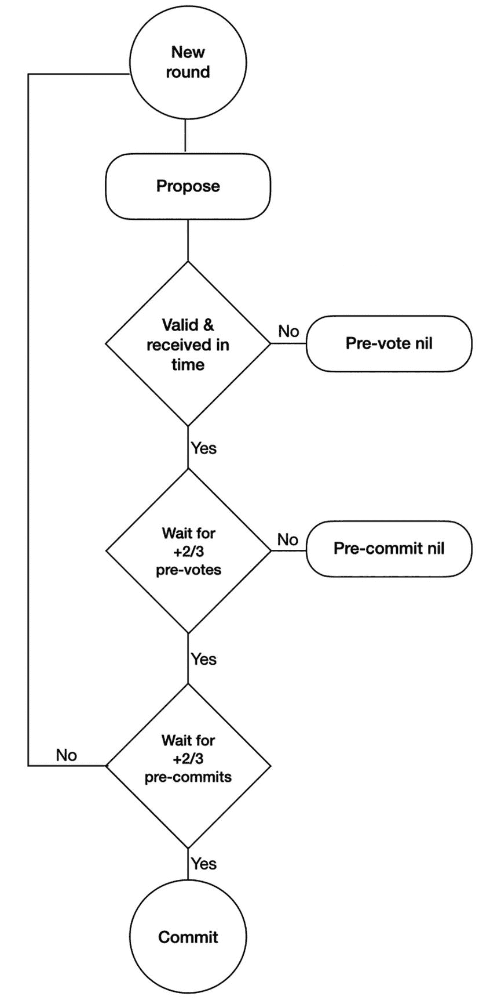

流程图具有以下流程：新一轮；提案；有效且及时，是；等待预投票，是；等待预提交，是；提交。

**图 8-4 Tendermint 流程 – 单次运行**

Tendermint 引入了一种新的终止机制。提案消息使用了两个变量，即`validValue`和`validRound`。当收到有效的提案消息以及随后的相应`2f + 1`个预投票消息时，一个正确的进程会更新这两个变量。

这种终止过程得益于八卦协议和同步假设。例如，假设一个正确的进程在一轮中锁定了一个值。那么所有其他正确的进程会在该轮结束时，使用被锁定的值更新它们的`validValue`和`validRound`变量。基本假设是，一旦一个正确的处理器锁定了这些值，八卦协议会在同一轮内将它们传播到其他节点。每个处理器都会知道锁定的值和轮次，即有效值。现在，当进行下一个提案时，提案者会获取到这些相同的锁定值；由于有效的提案和相应的`2f + 1`个预投票消息，提案者已经被锁定。通过这种方式，可以确保进程最终决定的值是满足有效性条件的可接受值。

至此，我们完成了关于 Tendermint 协议的讨论。接下来，我们将探索 HotStuff，它改进了之前的 PBFT 及其变体协议中的若干局限性。

## HotStuff

HotStuff 是一种用于状态机复制的 BFT 协议。多项创新使其成为比传统 PBFT 更优的协议。然而，与 PBFT 类似，它在部分同步环境下工作，基于消息传递网络，要求最小节点数`n = 3f + 1`，并依赖于基于领导者的主备方法。它使用可靠且经过认证的通信链路。HotStuff 利用门限签名，所有节点使用单个公钥，但每个副本使用唯一的私钥。使用门限签名降低了通信复杂度。

HotStuff 引入了一些创新，我们介绍如下。

### 线性视图变更

HotStuff 协议中的视图变更只需要`O(n)`条消息。它是正常运行的一部分，而不是一个独立的子协议。在最坏情况下，如果领导者连续失败，通信成本会增加到`O(n²)`，即二次方复杂度。与 PBFT 的稳定领导者不同，HotStuff 中的领导者每三轮轮换一次，即使领导者没有失败也是如此。

简单来说，二次方复杂度意味着算法的性能与输入大小的平方成正比。

在线性视图变更中，在 GST 之后，任何诚实的被选中的领导者只需要发送`O(n)`个认证者来推动决策，包括领导者失败并选举出新领导者的情况。因此，即使在领导者接连失败的最坏情况下，GST 之后达成共识的通信成本也是`O(n²)`。

### 乐观响应性

乐观响应性允许任何正确的领导者在 GST 之后只需要前`n - f`个响应即可确保进展，而无需等待来自每个副本的`n - f`个响应。这意味着它以网络速度运行，而不必不必要地等待来自其他节点的更多消息，然后进入下一个阶段。

#### 链质量

该属性通过允许频繁的领导者轮换，为系统提供了公平性和活跃性。

### 隐藏锁定

它还解决了隐藏锁定问题。当领导者验证器不等待一轮的到期时间时，就会发生“隐藏锁定”问题。如果我们仅依赖接收`n – f`条消息，最高的锁定可能无法到达领导者。最高锁定值可能保存在另一个副本中，而领导者没有等待该副本的响应，从而导致领导者不知道最高锁定值。如果领导者随后提议一个较低的锁定值，而其他一些节点已经锁定了一个更高的值，这可能导致活跃性问题。节点会等待更高的锁定或相同的锁定回复，但领导者不知道最高锁定值，会继续发送较低的锁定值，从而导致竞态条件和活跃性违规。

HotStuff 通过在实际锁定轮之前添加一个前导锁定轮解决了这个问题。这里的思路是，如果`2f + 1`个节点接受了前导锁定，领导者将收到它们的响应并获知最高锁定值。因此，现在领导者不必等待`Δ`（delta – 消息传递延迟的上限）时间，即可通过`n − f`个响应获知最高锁定值。

### 心跳机制（Pacemaker）

HotStuff 创新性地将安全性和活跃性机制分离开来。安全性通过网络中的参与者的投票和提交规则来确保。另一方面，活跃性由一个称为“心跳机制”的独立模块负责，该模块确保选举出一个新的、正确的且唯一的领导者。此外，心跳机制保证了在 GST 达成后能够继续取得进展。它的首要职责是将所有诚实的副本和一个唯一的领导者带到共同的高度并维持足够长的时间。为了实现同步，副本会逐步增加它们的超时时间，直到取得进展。由于我们假设一个部分同步模型，这种机制很可能会生效。此外，领导者选举过程基于一个简单的轮换协调器范式，副本遵循特定的调度策略（通常是轮询）来选择新的领导者。心跳机制还确保领导者选择一个副本能够接受的提案。

### 更好的参与者组织拓扑

PBFT 协议以团（网状拓扑）的形式组织节点，导致二次方消息复杂度，而 HotStuff 以星型拓扑组织节点。这种设置使得领导者能够直接向所有其他节点发送消息或从所有其他节点收集消息，从而降低了消息复杂度。简单来说，它使用了一种“一对多”的通信模式。

如果领导者负责所有这些处理，可能会出现单个领导者负载过高的问题，这可能会拖慢网络速度。

现在考虑领导者被破坏或妥协的场景。标准的 BFT 容错保证可以处理这种情况。如果领导者提议了一个恶意区块并被怀疑有故障，它将被其他正确的节点拒绝，并且协议将选择一个新的领导者。这种场景可能会暂时拖慢网络，直到新的诚实领导者接管。如果网络中的大多数节点是诚实的，一个正确的领导者最终会接管并提议一个有效的区块。此外，为了增加安全性，领导者通常每隔几轮就在验证器之间进行频繁轮换，这可以抵消任何针对领导者的恶意攻击。此属性确保了公平性，有助于实现链质量。

PBFT 包含一个正常模式和视图变更模式，当领导者被怀疑有故障时，会触发视图变更。这种方法提供了活跃性保证，但增加了通信复杂度。HotStuff 通过将视图变更过程与正常模式结合来处理这个问题。在 PBFT 中，节点在视图变更发生前等待`2F+1`条消息，但在 HotStuff 中，视图变更可以直接发生，而无需调用一个独立的子协议。相反，检查用于变更视图的消息阈值成为了正常视图的一部分。


#### 工作原理

`HotStuff` 协议包含四个阶段：准备阶段（Prepare）、预提交阶段（Pre-commit）、提交阶段（Commit）和决定阶段（Decide）。

一个法定人数证书（`QC`）是一种数据结构，它代表由 *n* – *f* 个节点生成的签名集合，用以表示已达到所需的消息阈值。换句话说，来自 *n* − *f* 个节点的投票集合就是一个 `QC`。

##### 准备阶段

一旦新的领导者从 `N – F` 个节点累积了新的视图消息，协议便由新领导者启动。领导者处理这些消息，以确定存在最高 `PREPARE` 消息法定人数证书的最新分支。

##### 预提交阶段

一旦领导者累积了 `N – F` 个准备投票，它就会创建一个称为“准备法定人数证书”的法定人数证书。领导者将该证书作为 `PRE-COMMIT` 消息广播给其他节点。当节点收到 `PRE-COMMIT` 消息时，它会回复一个预提交投票。该法定人数证书表示所需数量的节点已确认该请求。

##### 提交阶段

当领导者累积了 `N – F` 个预提交投票后，它会创建一个 `PRE-COMMIT` 法定人数证书，并将其作为 `COMMIT` 消息广播给其他节点。当节点收到此 `COMMIT` 消息时，它们会回复自己的提交投票。在此阶段，节点会锁定该 `PRE-COMMIT` 法定人数证书，以确保即使发生视图变更，算法的安全性也能得到保障。

##### 决定阶段

当领导者收到 `N – F` 个提交投票后，它会创建一个 `COMMIT` 法定人数证书。然后，领导者将此 `COMMIT` 法定人数证书通过 `DECIDE` 消息广播给其他节点。当节点收到此 `DECIDE` 消息时，它们会执行该请求，因为此消息包含一个已经提交的证书/值。一旦由于接受并执行 `DECIDE` 消息而发生状态转换，新的视图便会开始。

我们可以在图 8-5 中直观地看到此协议。

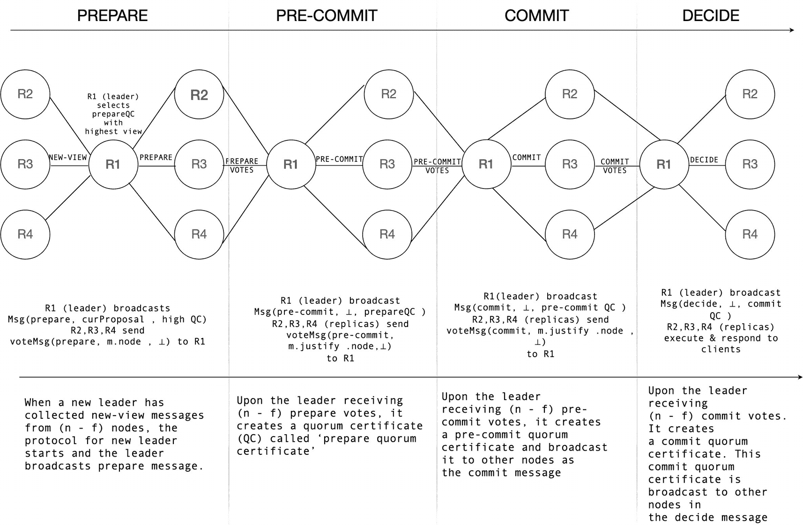

对 `HotStuff` 协议的图示说明包括一个由副本 `R 1` 到 `R 4` 组成的网络，分为四层，即准备层、预提交层、提交层和决定层。

**图 8-5** HotStuff 协议

更精确地说，`HotStuff` 的步骤如下所列：

-   新的主节点从 `n-f` 个节点获取新的视图消息，这些消息包含每个验证者收到的最高准备法定人数证书。主节点查看这些消息，并找到具有最高视图（轮次编号）的准备 `QC`。然后，领导者通过准备消息广播提案。
-   当其他节点收到来自领导者的此准备消息时，它们会检查该准备提案是否扩展了最高的准备 `QC` 分支，并且是否具有比它们当前锁定的视图编号更高的视图编号。
-   其他节点通过确认消息回复给领导者。
-   领导者收集来自 *n* − *f* 个准备投票的确认。
-   当领导者获得 `n-f` 个投票后，它会将其合并成一个准备 `QC`，并通过预提交消息广播此 `QC`。
-   其他副本通过预提交投票回复给领导者。当领导者从其他节点收到 `n-f` 个预提交投票后，主节点会将其合并成一个预提交 `QC`，并通过提交消息广播它们。
-   副本通过提交投票回复给领导者，并锁定在预提交 `QC` 上。当领导者从副本那里收到 `n-f` 个提交投票后，它会将其合并成一个提交 `QC`，并广播决定消息。
-   当节点收到决定消息时，它们执行操作/命令并开始下一个视图。
-   此过程循环重复。

还有其它优化，例如流水线（pipelining），它可以进一步提高性能。由于所有这些阶段本质上都是相同的，因此很容易对 `HotStuff` 进行流水线化处理，从而提升性能。流水线化允许协议在每个阶段提交一个客户端请求。在一个视图中，每个阶段的领导者都会提出一个新的客户端请求。这样，领导者可以并发处理先前客户端请求的预提交、提交和决定消息，这些请求通过提交证书传递给之前的领导者。

### 安全性与活跃性

`HotStuff` 通过使用心跳机制（pacemaker）来保证活跃性，该机制通过在 `GST` 之后、有界时间间隔内推进视图来确保进展。该组件封装了视图同步逻辑以确保活跃性。它使足够多的诚实节点在同一个视图中停留足够长的时间，以确保达成进展。这一特性是通过逐步增加超时时间，直到取得进展来实现的。

每当一个节点在某个视图内超时，它就会广播一条超时消息，并在收到 `2*f* + 1` 个超时消息组成的法定人数证书后，前进到下一个视图。该证书也会被发送给下一个领导者，由其继续推进协议。这种超时检测听起来熟悉吗？它听起来熟悉是因为心跳机制的抽象本质上就是我们在第 3 章中讨论过的故障检测器。此外，投票和相关的提交规则确保了 `HotStuff` 的安全性。

`HotStuff` 是一个简单而强大的协议，它结合了多项创新，产生了一个比其前辈更优的协议。


## Polkadot

Polkadot 是一个现代的区块链协议，它连接了一个由专用区块链组成的网络，并允许它们协同运作。它是一个具有共享共识和共享状态的异构多链生态系统。

Polkadot 拥有一条被称为**中继链**的中心主链。这条中继链管理着平行链——这些连接到中继链的异构分片。中继链保存着所有平行链的状态。所有这些平行链可以相互通信并共享安全性，从而形成一个更好、更健壮的生态系统。由于平行链是异构的，它们可以服务于不同的目的；一条链可以是智能合约专用链，另一条可以用于游戏，还有的可以提供某些公共服务，等等。中继链通过提名权益证明来保障安全。

中继链上的验证者负责生产区块、与平行链通信并最终确定区块。链上治理决定了验证者的理想数量。

图 8-6 展示了 Polkadot 链及其平行链的关系图。

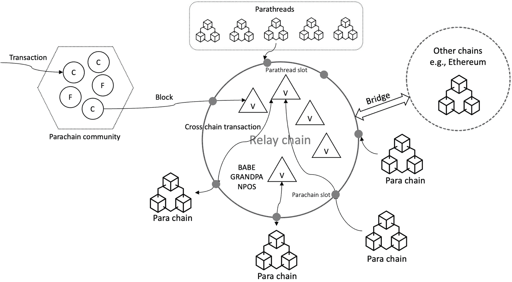

一个 Polkadot 的圆形图表包含 4 个平行链插槽、1 个平行线程插槽、1 个平行链社区区块，以及一个用于连接其他链的桥。

图 8-6

Polkadot 的简单示意图

Polkadot 的目标是能够与其他区块链进行通信。为此，它使用了桥，这些桥将平行链连接到外部区块链，例如比特币和以太坊。

Polkadot 有多个组成部分。**中继链**是负责管理平行链、跨链互操作性、跨链消息传递、共识和安全性的主链。

它由节点和角色构成。节点可以是轻客户端、全节点、归档节点或哨兵节点。轻客户端仅包含运行时和状态。全节点会在可配置的间隔进行修剪。归档节点保存完整的区块历史记录，而哨兵节点则保护验证者并抵御 DDoS 攻击，从而为中继链提供安全保障。节点可以扮演多种角色：验证者、提名人、收集者和钓鱼者。**验证者**是系统中级别最高的负责人。他们是区块生产者，要成为区块生产者，他们需要提供足够的保证金。他们负责生产并最终确定区块，以及与平行链通信。**提名人**是利益相关者，他们为验证者的安全保证金做出贡献。他们信任某个验证者会“恪尽职守”并生产区块。**收集者**负责执行交易。他们为提议区块的验证者创建未密封但有效的区块。**钓鱼者**用于检测恶意行为。钓鱼者因提供参与者行为不端的证明而获得奖励。**平行链**是连接到中继链的异构区块链。它们本质上是 Polkadot 的执行核心。平行链可以拥有自己的运行时，称为特定应用区块链。另一个名为**平行线程**的组件，是一种在 Polkadot 主机内运行并连接到中继链的区块链。它们可以被视为按需付费的链。平行线程可以通过拍卖机制成为平行链。**桥**用于将平行链与外部区块链网络（如比特币和以太坊）连接起来。

### Polkadot 的共识机制

Polkadot 的共识是通过多种机制的组合来实现的。在治理和记账方面，使用了提名权益证明。在区块生产方面，使用了 `BABE` 算法。`GRANDPA` 是最终性工具。在网络中，验证者拥有各自的时钟，并且假定网络是部分同步的。

正如我们在传统的中本聪工作量证明共识中所见，最终性通常是概率性的。在大多数许可网络和一些公共网络中，它往往是确定性的，即可证明的最终性，例如 `PBFT` 和 `Tendermint`。

在 Polkadot 中，由于其多链异构架构，可能会出现某些情况，由于链之间的冲突，导致添加了一些恶意区块。这些恶意区块需要在冲突解决后被移除；在这种情况下，确定性最终性由于其不可逆的特性而不适用。另一方面，工作量证明又太慢、耗能且是概率性的。解决方案是尽可能快地持续生产区块，但将最终性的确定推迟到适合最终确定的时机。这样，区块生产可以继续进行并且是可逆的，而最终性决定可以在稍后阶段单独且可证明地做出。

这种可证明最终性的概念在多链异构网络中非常有用，因为它允许我们向未参与共识的其他方证明某个区块是最终的。此外，可证明的最终性也使得建立与其他区块链的桥变得更加容易。

这种混合方法的工作原理是，即使只有一个验证者在线且正确，也允许其生产区块，但区块的最终确定则交由一个称为“最终性工具”的独立组件处理。在正常情况下，区块最终确定也相当快，但如果出现状态冲突等问题，则可以将最终确定推迟，直至对区块进行更详细的审查。在遭受严重攻击或出现大规模网络分区时，区块生产将继续进行；然而，作为一种回退机制，Polkadot 将回退到概率性最终确定机制。这样一来，只要至少有一个验证者正确且在线，即使在极端情况下也能保证活性。区块由 `BABE` 生产，而由 `GRANDPA` 最终确定。`GRANDPA` 是对一条链上的区块进行最终确定，而非逐个区块进行，这提高了效率。由于最终确定是一个独立的过程，区块生产可以以网络允许的任何速度继续进行，而最终性不影响区块生产速度，并在后续完成。

在 `GRANDPA` 最终确定“最佳”链之前，可能会存在一些分叉。我们可以在图 8-7 中看到这一点。

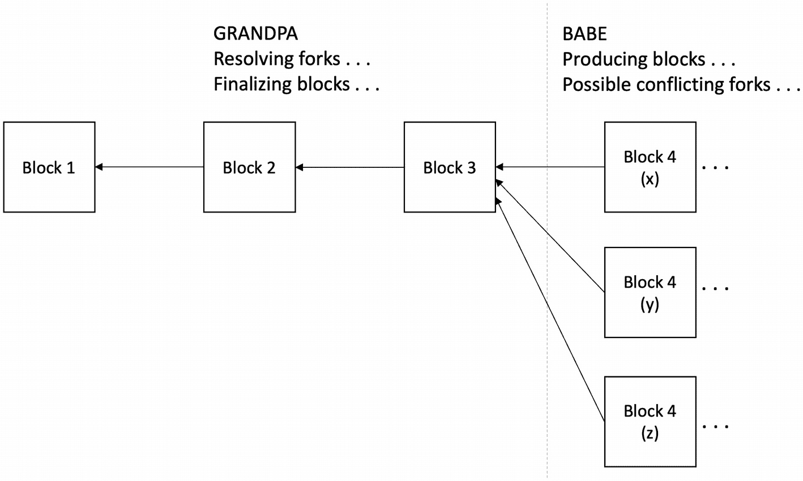

一个流程图，流程如下。`BABE` 下的区块 4、x、y 和 z 按所述顺序指向 `GRANDPA` 下的区块 3、2 和 1。

图 8-7

`BABE` 生产区块与 `GRANDPA` 最终确定

该图右侧展示了由 `BABE` 在三个分叉中生产的三个区块；`GRANDPA` 解决这些分叉并最终确定链。现在，让我们看看区块是如何由 `BABE` 生产的。


#### BABE – 区块链扩展的盲分配协议

`BABE` 是一种用于区块生产的权益证明协议，验证者根据其质押量被随机选中来生产区块。该协议不依赖任何中央时钟。

时间被划分为持续 `n` 秒的时段，称为时隙（slot），每个时隙预计会有一个区块被生产出来。一个纪元（epoch）由一系列时隙组成。在每个时隙中，验证者会运行一个 `VRF`（可验证随机函数），该函数根据先前纪元生成的随机性来决定是否生产区块。我们可以通过图 8-8 直观理解这一过程。

```markdown
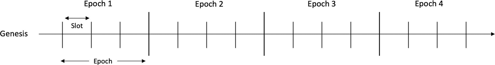
```

创世时间线包含纪元 1 到 4。每个纪元包含一组 4 个时隙。

**图 8-8**  
时隙与纪元

验证者使用公钥密码学。存在两种密钥对。第一种密钥对的私钥用于区块签名。第二种密钥对用于可验证随机函数（`VRF`），也称为彩票密钥对。后者的私钥作为可验证随机函数的输入。区块签名提供了常规的不可否认性、完整性和数据源认证保障，用于验证该区块确实由该验证者生产。在 `VRF` 中，私钥生成随机性，而公钥则向其他节点证明生成的随机性确实可靠，且验证者没有作弊。

每个验证者被选中的概率几乎相等。时隙领导者选举类似于 `PoW`：如果 `VRF` 的结果低于某个预设阈值，则该验证者获得区块生产权。同时，`VRF` 生成的证明使其他参与者能够验证该验证者是否遵守规则且未作弊；换句话说，它证明了生成的随机性是可靠的。如果 `VRF` 生成的值等于或高于目标值，则该验证者只需收集其他验证者生产的区块。

以下是 `BABE` 协议的各个阶段。

##### 创世阶段

在此阶段，唯一的创世区块由人工创建。创世区块包含一个随机数，该随机数在前两个纪元中用于时隙领导者选举。

##### 常规阶段

每个验证者在收到创世区块后，将其时间划分为所谓的时隙。验证者根据相对时间算法（我们稍后将解释）确定当前时隙编号。在常规运行中，每个验证者都应生产一个区块，而其他非验证者节点则接收生产的区块并进行同步。每个验证者应拥有当前时隙/纪元中的一组链，并通过最佳链选择机制（稍后解释）选定上一时隙中的最佳链。

时隙领导者的选择基于 `VRF` 的输出。如果 `VRF` 的输出低于某个阈值，则该验证者成为时隙领导者。否则，它只需从领导者处收集区块。

领导者生成的区块会被添加到当前时隙选定的最佳链中。生产的区块必须至少包含时隙编号、前一个区块的哈希值、`VRF` 输出、`VRF` 证明、交易以及数字签名。一旦链更新了新区块，该区块即被广播。当其他非领导者验证者收到区块时，会检查签名是否有效。它还会通过 `VRF` 验证算法检查 `VRF` 输出，以验证是否由有效的领导者生产了该区块。它会检查：如果 `VRF` 输出低于阈值，则领导者有效。它还会进一步检查是否存在一条包含所需头部的有效链，以便将收到的区块添加进去，并验证区块中的交易是否有效。

如果一切有效，验证者便将区块添加到链中。当时隙结束时，验证者最终使用最佳链选择算法选出最佳链，该算法会剔除所有不包含由最终性工具 `GRANDPA` 确定的最终区块的链条。

##### 纪元更新

每 `n` 个时隙后，新的纪元开始。验证者必须在开始新纪元之前获取新纪元的随机性和活跃验证者集合。新纪元的新验证者集合包含在 Relay Chain 中，以实现区块生产。新验证者需等待两个纪元后，协议才能选择它。延迟两个纪元添加验证者，可确保新验证者的 `VRF` 密钥在其即将活跃的未来纪元的随机性被揭示之前，就已添加到链中。新纪元的随机性基于前两个纪元计算得出，方法是将这两个纪元中所有区块的 `VRF` 输出串联起来。

图 8-9 的图示阐明了这一时隙领导者选举过程。

```markdown
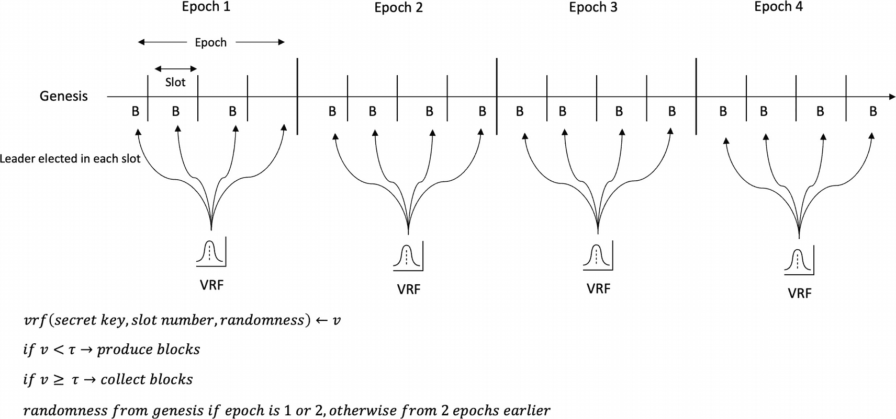
```

创世时间线包含纪元 1 到 4。每个纪元包含一组 4 个名为 B 的时隙。每个时隙中选出的领导者指向 V R F。

**图 8-9**  
通过 `VRF` 进行时隙领导者选举以及在时隙和纪元中的区块生产

最佳链选择算法会简单剔除所有不包含由 `GRANDPA` 最终确定的区块的链条。如果 `GRANDPA` 未最终确定任何区块，协议将退而使用概率性最终性，最终区块被选为最后一个区块之前若干区块（某个数量）的位置。这类似于 `PoW` 中的链深度规则。

在 `BABE` 中，时间管理采用**相对时间算法**。所有参与方知晓当前时隙编号，这对 `BABE` 的安全性至关重要。`BABE` 不使用由 `NTP` 管理的时间源，因为显然中央时间源不可信。验证者通过将区块到达时间作为参考，实现一种逻辑时间的概念，而不依赖外部时间源。当验证者收到创世区块时，会记录到达时间作为第一个时隙开始的参考点。由于每个节点上的每个时隙开始时间可能不同，因此假设这种差异在合理范围内。验证者通过计算本纪元中区块到达时间的中位数来更新自身时钟。虽然机制不同，但其基本概念似乎与我们第 1 章讨论的逻辑时钟相似。对于暂时离线后又重新加入网络的验证者，也可以临时调整时钟直到下一个纪元。


### 安全性与活跃性

BABE 满足四项安全属性：链增长、存在性链质量、链密度与共同前缀。

#### 链增长

该属性确保区块间存在最低限度的增长。换言之，这是一项活跃性属性，只要诚实验证人拥有绝对多数投票权，链增长就能得到保障。作恶验证人无法阻止最佳链的推进。

#### 链质量

该属性保证在每个`x`个时隙中，诚实方拥有的任何最佳链上至少包含一个诚实区块。协议确保即使在最坏情况下，每个纪元内的最佳链也至少会包含一个诚实区块。这保证了随机性不会被偏见影响。

#### 链密度

该属性确保最佳链中任意足够长的区块片段内，超过半数的区块由诚实验证人生产。该属性由链增长与链质量共同推导得出。

#### 共同前缀

该属性确保诚实验证人最佳链末尾区块之前的任何区块都不再可变，构成最终性。同样，该属性基于诚实验证人占据绝对多数的假设。恶意验证人在单个时隙中被选中的概率极低，大部分当选者均为诚实验证人；因此恶意验证人处于绝对少数，无法创建不包含终局区块的另一条"最佳链"。

### GRANDPA – 基于 GHOST 的递归祖先衍生前缀共识协议

该组件在 BABE 产出区块后独立执行最终化操作。本质上是一种拜占庭共识协议，用于在多条分叉中达成链的共识。与传统 BFT 协议的区别在于：BFT 通常针对单个区块做决策，而 GRANDPA 则对一整条区块链（分叉）做出判断，并确定最终的规范链。这是一种解决分叉的最终化机制。

GRANDPA 假设部分同步网络环境。协议按轮次运行，每轮包含`3f+1`个合格投票者，其中`2f+1`个投票者被假定为诚实。换言之，要求验证人集合中三分之二为诚实方，并对规范链的前缀达成一致，该前缀最终被永久确认。每轮通过伪随机方式选举一名主节点，所有参与者对此达成共识。此外，所有参与者需就投票者集合达成一致。主节点选举也可基于投票者轮换机制。

协议分为两个阶段：预投票与预承诺。预投票阶段允许验证人评估可最终化的区块，即验证人针对最佳链进行预投票。预承诺阶段中，验证人基于收集到的预投票应用三分之二 GHOST 规则，进行预承诺。最终，预承诺结果被永久确认。

GRANDPA 包含两个子协议。第一个协议适用于部分同步环境，可容忍三分之一拜占庭故障。第二个协议适用于完全异步环境，可容忍五分之一拜占庭故障。

#### GRANDPA 协议步骤

每轮选定一名参与者作为领导者（主节点），其他参与者均知晓主节点身份：

- 新一轮开始。

- 主节点广播其认为可能从上一轮实现最终化的最高区块。

- 验证人等待特定网络延迟后，各自广播针对其认为应最终化的最高区块的"预投票"消息。若验证人收到主节点发布的更优最佳链区块，则采用该最佳链。若超多数验证人正确操作，该区块预期将扩展主节点广播的链。

- 每个验证人分析预投票结果，确定可能实现最终化的最高区块。若预投票结果扩展了已最终化的链，则每个验证人将对该链进行预承诺。

- 每个验证人等待足够数量的预承诺，以在新最终化的链上组成提交消息。

协议通过罚没机制惩罚不当行为：对恶意行为甚至疏忽行为（例如长期未激活节点）按一定比例扣除质押金。处罚力度与参与者数量成正比。

#### 安全性

该协议确保所有投票都是上一轮可能已最终化的区块的后代。节点基于预投票与预承诺评估区块的最终化可能性。在新一轮开始前，节点通过收集足够数量的预承诺确保：任何具有本轮评估值的区块不可能在其他链或同链后续位置被最终化。在下一轮中，协议还保证节点仅对源自上一轮评估值后代的区块进行预投票与预承诺。

#### 活跃性

协议通过轮换方式选择验证人作为主节点。主节点通过广播其基于上一轮评估的区块最终化结果来启动本轮。验证人对最佳链进行预投票，包含主节点提议的区块需满足：(1) 该区块至少达到验证人的评估水平；(2) 验证人在上一轮已为该区块及其后代获取超过`2/3`的预投票。

核心要点在于：若主节点提议的区块尚未被最终化，则应对其进行最终化以推动进展。例如，假设主节点提议的区块尚未最终化，且所有验证人已就包含最终化区块的最佳链达成一致。此时，通过最终化最新达成共识的链即可推动进展。若 GRANDPA 无法达成结论，BABE 将作为后备机制提供概率性最终性，确保系统持续进展。

GRANDPA 与 BABE 是最新的异构多链协议之一。该系列协议还包括以太坊共识层（以太坊 2.0，信标链）中使用的 Casper FFG 等。


## 以太坊 2

`Ethereum 2`，也称为`Serenity`或`Eth2`，是以太坊的最终版本。当前以太坊基于工作量证明（PoW），被称为`Eth1`。现在它被称为执行层，而之前`Eth1`和`Eth2`的术语已不再适用。`Eth2`现在被称为共识层。根据原计划，现有的`PoW`链最终将被弃用，用户和应用程序将迁移到新的`PoS`链`Eth2`。然而，这一过程预计需要数年时间，一个更好的替代方案是继续改进现有的`PoW`链，并使其成为`Ethereum 2`的一个分片。这一变化将简化向权益证明的过渡，并允许通过`rollups`而非分片执行来实现扩展。信标链已经可用；“合并”阶段——即以太坊主网与信标链合并——预计在 2022 年发生。合并后，信标链将具备权益证明和`EVM`能力，成为可执行的链。旧的`Ethereum 1`（`Eth1`）将成为执行层，使用执行客户端（例如来自`Eth1`的`geth`）。`Ethereum 2`（共识）客户端（如`prysm`和`lighthouse`）将继续在信标链上运行。最终，计划于 2023 年扩展以太坊容量并支持执行的分片链将上线。`Ethereum 2.0`“共识”与`Ethereum 1`“执行”作为分片 0，以及基于其路线图的其他升级，可在图 8-10 中看到。

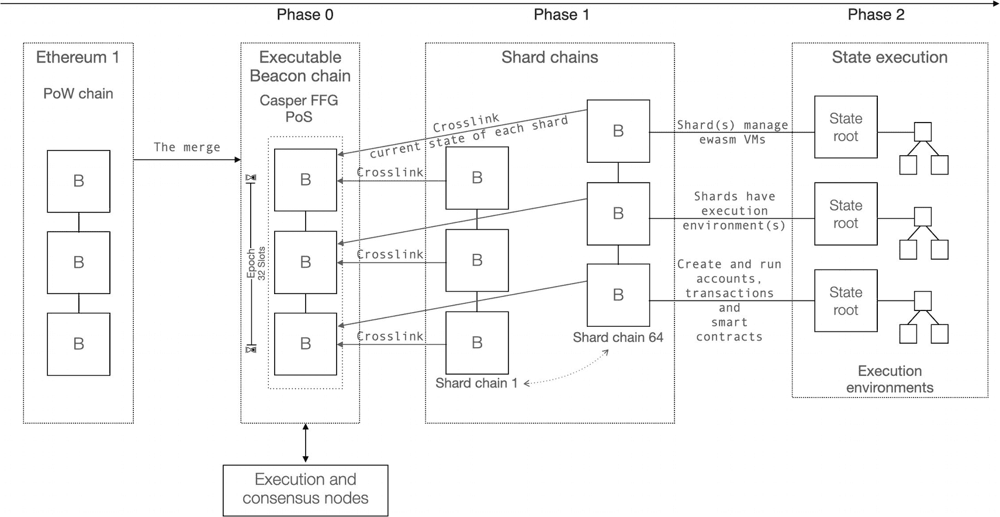

以太坊升级表包括：`Ethereum 1`、`PoW`链；阶段 0、可执行的信标链；阶段 1、分片链；阶段 2、状态执行。

**图 8-10** 以太坊升级，展示合并及后续升级

简而言之，`Eth1`现在被称为执行层，负责处理交易和执行；而`Eth2`现在被称为共识层，管理权益证明共识。作为共识层的一部分，提出了“`Ethereum 2`”权益证明共识协议，我们接下来将讨论它。

### Casper

`Casper`是一个旨在替代以太坊当前`PoW`算法的权益证明协议。该协议家族包含两种协议：

- `Casper the Friendly Finality Gadget` (`FFG`)
- `Casper the Friendly GHOST`

`Casper FFG`是一种`PoS` `BFT`风格的混合协议，在当前`PoW`之上添加了`PoS`覆盖层；而`Casper the Friendly GHOST`则是一个纯粹的`PoS`协议。`Casper FFG`提供了一个过渡阶段，随后将被纯粹的`PoS`协议`Casper CBC`取代。下面我们将讨论`Casper FFG`。

#### Casper FFG

`Casper`可以看作是在公共区块链上结合了权益证明的改进版`PBFT`。`Casper the Friendly Finality Gadget`引入了一些新颖的特性：

- 问责制
- 动态验证者
- 防御机制
- 模块化覆盖层

`Casper FFG`是运行在区块提议机制之上的覆盖层机制。其唯一目的是达成共识，而非产生区块。

问责制允许检测规则违规行为并识别违规的验证者。这使得协议能够惩罚违规验证者，从而作为对抗恶意行为的一种防御手段。

`Casper FFG`还引入了一种安全更改（即添加/移除）参与者验证者集合的方法。

该协议还引入了一种防御机制，以防止网络分区和长程攻击。即使超过三分之一的验证者离线，协议也能提供应对此类场景的防御。

`Casper FFG`是一个覆盖层，这使得它易于在现有的`PoW`链之上添加。作为覆盖层，它期望底层链拥有自己的分叉选择规则。在以太坊信标链中，它是基于一种称为`LMD GHOST`（最新消息驱动的贪婪最重观测子树）的分叉选择规则之上的覆盖层。

`LMD GHOST`分叉选择规则基于`GHOST`。`LMD GHOST`选择规则从多个分叉中选出正确的链。诚实的链是获得验证者最多证明和权益（即权重）的那一条。分叉是由于网络分区、拜占庭行为和其他故障引起的。我们可以在图 8-11 中看到`LMD GHOST`的运行机制。

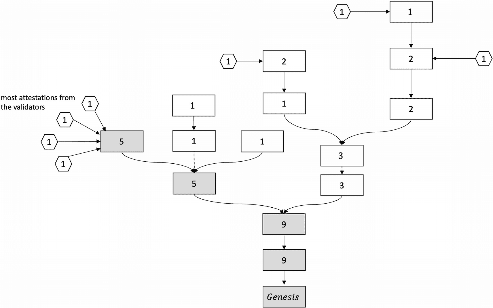

`LMD GHOST`的图示，包含一个网络，其中不同着色区块指向创世块，并且验证者对其给出了最多证明。

**图 8-11** `LMD GHOST`分叉选择规则

在图 8-11 中：

- 区块中的数字代表该区块中按权益计算的权重。
- 六边形代表来自验证者的证明，每个证明权重为 1。
- 规范链是带有阴影区块（权重 + 证明）的那一条。

通常，当工作量证明或其他区块链生成机制产生区块时，区块会一个接一个地生成，形成一条顺序且线性的区块链，其中每个父区块只有一个子区块。但由于网络延迟和故障/拜占庭节点，提议机制可能会为一个父区块生成多个子区块。`Casper`负责从每个父区块中选择一个子区块，从而从区块树中选择出一条唯一的规范链。

然而，出于效率考虑，`Casper`并不处理整个区块树；相反，它考虑由检查点形成的子树，即检查点树。

新区块被追加到区块树结构中。树的一个子树——称为检查点树——才是需要做出决策的地方。此结构如图 8-12 所示。

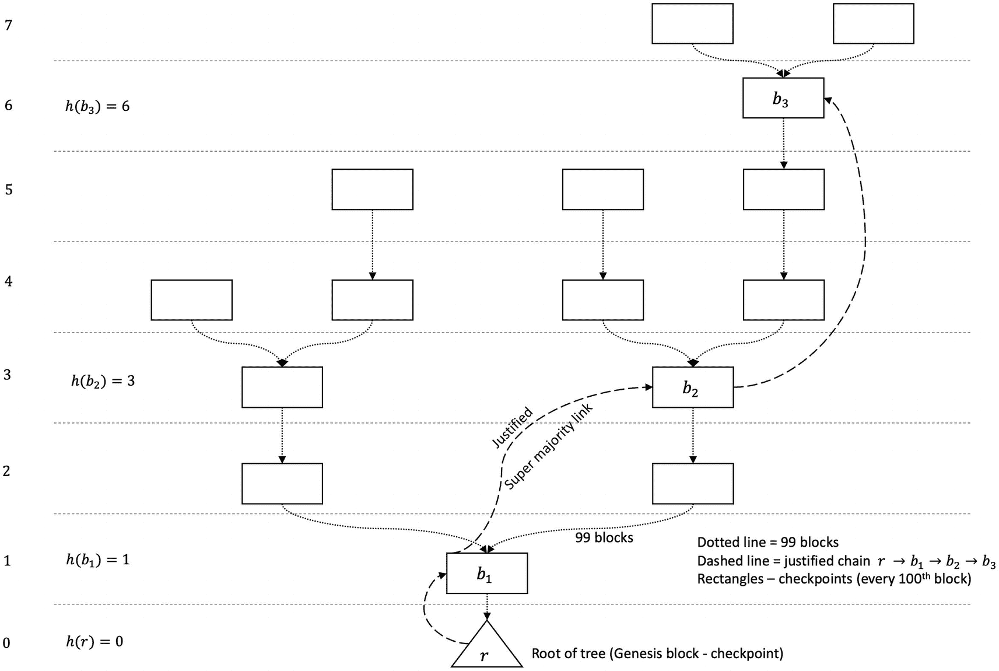

一个从底层到顶层包含 0 到 7 层的检查点树，展示了检查点及其通过虚线和点线的连接。

**图 8-12** 检查点树，显示高度、投票、检查点和规范链

创世区块是一个检查点，每第 100 个区块是一个检查点。从一个检查点到另一个检查点的距离称为一个纪元。换句话说，验证者每 100 个区块最终确定一次检查点。每个加入网络的验证者都会存入其拥有的保证金。由于惩罚和奖励机制，这笔保证金金额会增减。验证者广播投票。一个投票的权重与验证者的权益成正比。如果验证者偏离协议（即违反任何规则），则可能损失全部保证金。这是为了达成安全性。

投票消息具有一些属性，我们描述如下：

- `s`：一个已证明的源检查点的哈希值


