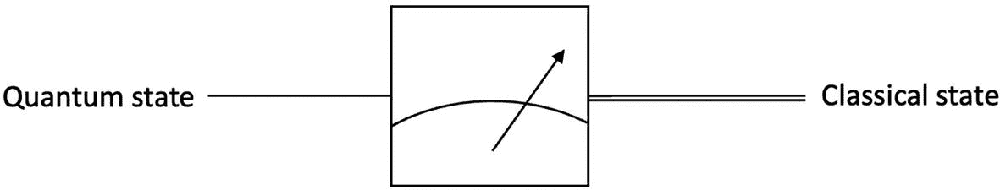
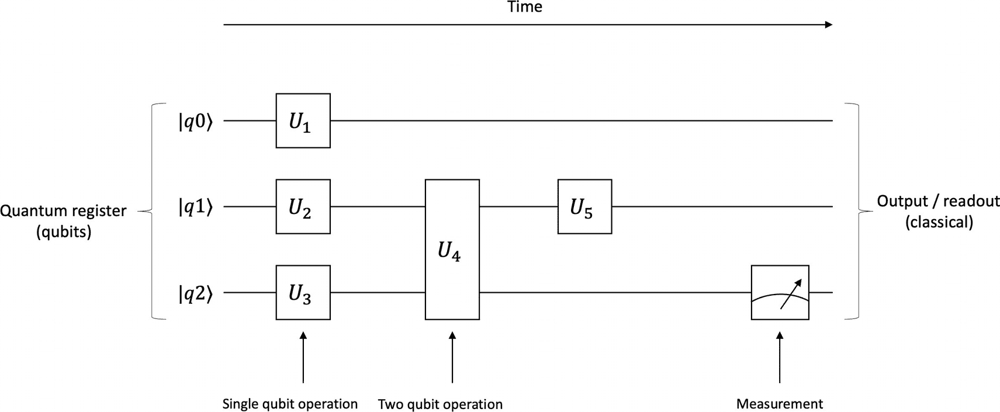
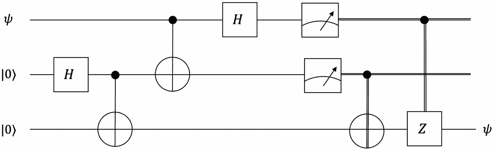
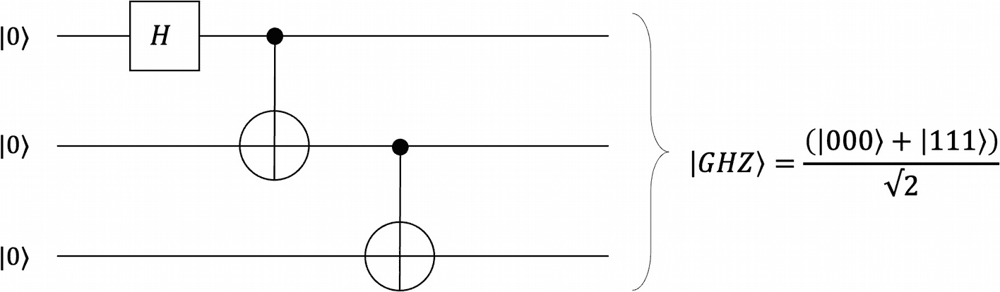
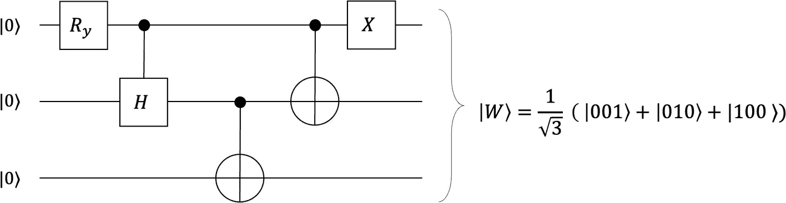
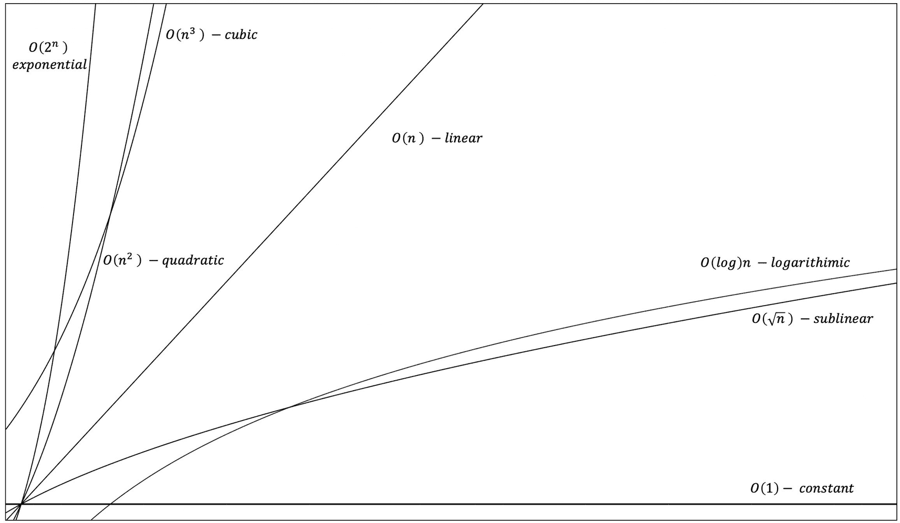
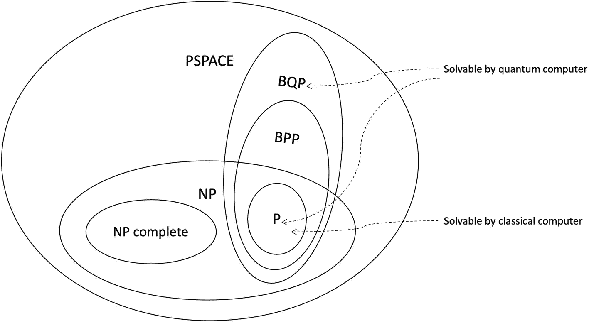
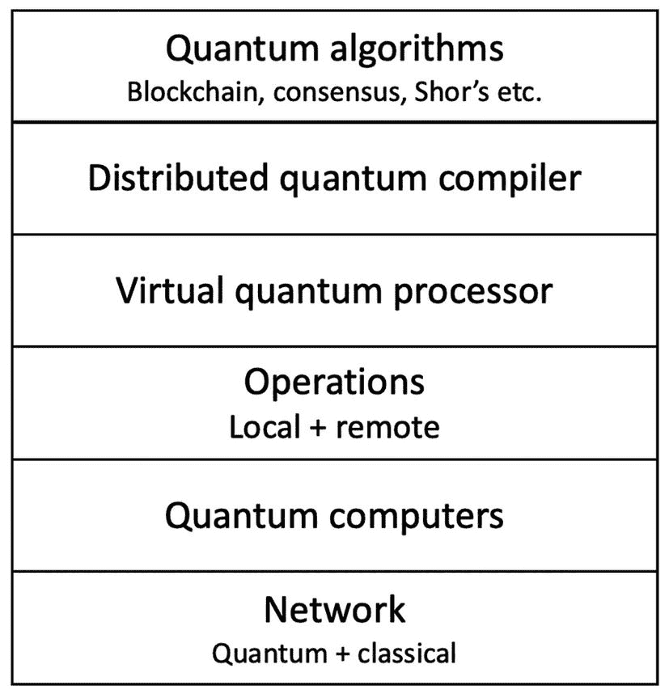
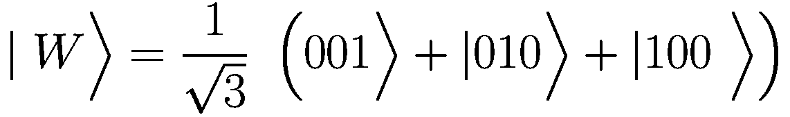
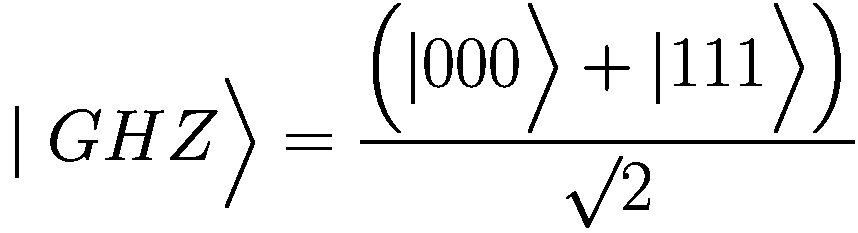

# 9. 量子共识

本章涵盖量子共识。在解释什么是量子共识之前，将首先对量子计算及其优势进行基础介绍，以帮助理解量子计算机的工作原理。此外，还会涉及量子网络、量子互联网、量子密码学和量子区块链等主题。然后我们将讨论量子共识，解释其定义、量子计算如何影响经典网络和量子网络中的经典共识，以及量子计算如何增强现有的分布式共识协议。我们还将综述研究界迄今为止取得的成果以及一些开放的研究问题。


## 引言

将量子力学与信息论相结合的思想根源可追溯至 20 世纪 70 年代。1979 年，保罗·贝尼奥夫提出了量子计算的理论基础。1982 年，理查德·费曼在一次演讲中指出，经典计算机无法执行描述量子现象的计算。经典计算机存在固有局限，要模拟量子现象，计算设备也必须基于量子原理，从而完成经典计算世界无法实现的量子力学模拟与计算。这一观点得到了广泛认同，众多研究者开始投身该领域。

1985 年，大卫·多伊奇提出了通用量子计算机的概念，并指出它可能利用量子叠加态执行并行操作。他还提出了"多伊奇算法"，该算法仅需一次抛掷就能判断一个量子硬币是否存在偏差。此后，量子计算虽一度引发研究热潮，但很快降温。然而，1994 年彼得·肖尔描述了一种能快速分解大数的量子算法，使量子计算重新成为焦点。这一事件引发了极大关注，因为互联网安全主要依赖于 RSA 加密，而其安全性正建立在质因数分解的难度之上。更准确地说，经典计算机对大规模质数进行因式分解在计算上不可行，这构成了 RSA 的安全基石。但量子计算机却能高效完成此任务，从而破解 RSA，动摇互联网安全根基。可想而知，这成了重磅新闻。1996 年，格罗弗提出量子搜索算法，进一步激发了研究者对量子计算的兴趣。约 28 年后的今天，我们已进入部分公司宣称实现"量子霸权"的阶段。来自学术界和工业界的众多研究者正致力于量子计算，它目前的发展阶段堪比 20 世纪 60 年代的经典计算机。在未来十年左右，量子计算将在大多数大型组织（若非所有领域）成为主流。或许量子计算机不会很快走进千家万户，但有一点是明确的：量子计算正在飞速发展，并将很快开始（无论好坏）影响我们的日常生活。

量子计算机借鉴了计算机科学、工程学、量子力学、物理学、数学和信息论等多领域的思想。由此衍生出量子信息科学与技术等多个学科，这是量子力学与信息技术的融合。

量子信息科学是计算机科学、信息论与量子力学交叉的学科。它从根本上改变了我们对信息处理的认知，开创了解决以往计算复杂难题的全新方法。量子计算机存储和处理数据的方式与经典计算机（使用 0 和 1 编码数据）截然不同。这种信息处理方式的差异，为实现解决复杂问题的显著加速打开了大门。

## 什么是量子计算机？

量子计算机是一种利用量子力学特性执行计算的设备。经典计算机模拟人类可执行的计算，擅长解决日常常规问题。但仍有大量问题在经典计算机上无法解决，被称为"棘手的难题"。这些问题包括原子粒子行为等自然现象建模、气候变化模拟等。一个简单的复杂问题示例：安排十个人围坐餐桌就餐。经计算，共有 3,628,800^(⁵)种排列方式。暴力解法就是计算阶乘。

另一个例子是旅行商问题，属于 NP 难问题。其目标是找到遍历多个城市的最短往返路线。

我们可以在经典计算机上解决许多复杂问题，现有的超级计算机也能快速处理日常数学、代数等问题。但即便是现代超级计算机，也无法解决那些"棘手的难题"。这正是量子计算机大显身手的领域。尤其在组合优化问题中，当超级计算机都无能为力时，量子计算机提供了解决方案。

优化问题旨在从所有可行解中寻找最优解。量子计算机擅长解决这类需要探索巨大状态空间的问题。

高效模拟分子有助于新药研发。分子模拟之所以困难，是因为原子间相互作用方式千变万化，单个原子位置的微小变动都会影响所有其他原子。这类存在指数级变量的问题，有望在量子计算机上得到解决。此外，这些信息无法存储在经典计算机中，因为我们没有如此庞大的存储空间。

例如，一个咖啡因分子由 24 个原子组成，但表征它需要`10⁴⁸`比特，这使得该问题在经典计算机上不可解；然而，量子计算机仅用 160 量子比特就能处理这些信息。

物流公司的路线优化是令人振奋的应用场景，其目标是在运送更多包裹的同时，找到最优路线以最小化燃油消耗。

量子计算应用领域极为广泛，包括但不限于密码学、机器学习、数据分析、计算生物学、化学模拟及量子模拟。

在化学领域，它能帮助发现新材料和化合物、新药物，并改进化肥生产工艺，从而促进农业发展。在网络安全领域，可以实现更安全可靠的密钥生成与分发机制，以及新型密码学（密码编码学与密码分析学）。预计量子计算机还能解决优化问题，如高效路线发现、金融投资风险管理等。

量子计算拥有众多应用前景，这正是人们竞相追求"量子霸权"的热情所在。量子霸权或量子优势，是指通过实验证明能解决经典计算机在合理时间内无法解决的难题。

要理解量子计算的世界，有几个基本构建块必不可少。我们将其描述如下：

*   量子比特
*   叠加态
*   纠缠态
*   量子隐形传态


### 量子比特

经典计算机基于两种截然不同的状态工作，即`0`和`1`。经典计算机利用晶体管来产生或消除电信号，分别代表`0`或`1`。从根本上来说，即使是大多数现代超级计算机，其核心也都是晶体管。

量子计算机中的量子比特改变了这一基本范式，使得量子计算机能够以非凡的速度运行。一个`qubit`（量子比特）是物理原子粒子的状态，例如电子的自旋。一个`qubit`可以同时处于`0`和`1`两种状态的叠加态。随着量子比特数量的增加，计算速度呈指数级提升。经典计算机中的 8 个比特合称为一个字节。在量子计算世界中，8 个量子比特合称为一个`qubyte`（量子字节）。

想象一下经典计算机中的 4 个比特。这些比特有 16 种可能的状态，并且只能顺序输入。然而，在量子计算机中，4 个量子比特可以处于全部 16 种可能状态的叠加态，因此可以同时输入。而在经典版本中，4 个比特虽然有 16 种可能状态，但只能顺序输入。这种现象被称为量子并行性，是加速解决某些在经典计算机上难以处理的问题的关键。

从物理上讲，构建量子比特有多种方法。这些技术包括离子阱、光子、中性原子、核磁共振（NMR）以及其他几种方法。

狄拉克符号用于表示量子比特。量子比特表示为∣`0`⟩和∣`1`⟩，与经典的`0`和`1`相对。区别在于，量子比特可以处于称为叠加态的线性组合状态。例如，一个量子比特可以是电子自旋向上或向下的叠加态，也可以是光子的+45 度偏振或-45 度偏振的叠加态，以及其他多种方式。

狄拉克符号用于表示量子态及其叠加态。狄拉克符号的形式为∣`0`⟩ + ∣`1`⟩，其中`0`和`1`是状态。

一个量子比特可以处于量子态∣*ψ*⟩ = *α* ∣`0`⟩ + *β* ∣`1`⟩，其中*α*、*β* ∈ *C*（复数概率幅），并且|*α*|² + |*β*|² = 1。这意味着单个量子比特的状态由∣*ψ*⟩ = *α* ∣`0`⟩ + *β* ∣`1`⟩表示，概率条件是|*α*|² + |*β*|² = 1。这个概率条件意味着*α*、*β*的取值范围是受限的，并且无论如何，两者之和必须为 1。*C*表示复数。

除了狄拉克符号，我们还可以使用向量表示法。一个向量可以表示包含概率幅*α*和*β*的状态：

```
| ψ ⟩ = [ α  β ]
```

并且

∣`0`⟩ = [`1` `0` ] 且 ∣`1`⟩ = [`0` `1` ]

量子比特可以使用布洛赫球进行可视化，如图 9-1 所示。

布洛赫球有一个三维平面，球心位于原点。一条从原点出发的线段延伸到 psi。标记的角度是 theta 和 phi。

**图 9-1**  
布洛赫球 – 可视化量子比特的便捷方式

我们可以将单个量子比特描述为布洛赫球表面上的一个点。北极代表状态∣`0`⟩，南极代表状态∣`1`⟩。量子比特的角度是，*θ* 为纬度，*ϕ* 为经度。当对量子比特执行单门操作时，状态 *ψ*（量子比特）会旋转到布洛赫球上的另一个点。

### 叠加态

叠加态是量子力学的一个基本原理。叠加态意味着量子态可以相加，得到另一个有效的量子态。这类似于经典力学中的波可以叠加。相加后的量子态被称为“叠加态”。叠加态是实现非凡加速的关键，因为它允许同时探索许多计算路径。

### 纠缠态

纠缠态是粒子之间存在的极强相关性，它允许两个或更多粒子彼此不可分割地联系在一起。它允许任意两个量子粒子存在于一个共享状态中。对其中一个粒子的任何操作都会瞬间影响另一个粒子，即使它们相隔极其遥远的距离。纠缠通常通过将两个量子比特靠近在一起，执行一项操作使其纠缠，然后纠缠后，再将它们分开来实现。即使其中一个量子比特在地球上，另一个被移动到遥远的太空，它们仍将保持纠缠。

纠缠态有两个特性使其特别适用于广泛的应用：最大协调性和单一配分性。

#### 最大协调性

当网络中不同节点的两个量子比特发生纠缠时，即两个粒子的量子态变得密不可分，它们会提供经典网络中不存在的更强的相关性和协调特性。这种性质称为最大协调性。例如，对第一个量子比特进行任何测量，如果对第二个量子比特进行相同的测量，则会瞬间显示出相同的结果，即使该结果是随机产生的且非预先确定的。更准确地说，它们总会随机产生 0 或 1，但两者总会产生相同的结果。这一特性使得纠缠态适用于需要协调的任务，例如时钟同步、领导者选举和共识。想象一下在没有物理传输的情况下实现分布式网络的时钟同步；这可以使分布式网络变得异常快速。（回忆一下上一章中用本地计算取代通信的思想。）此外，共识过程中的状态传输/感知能立即加快共识速度。这里的基本思想是，当处于纠缠态时，只需对一个量子比特执行操作（改变参数），就有可能全局地（完全地）改变整个状态。这一特性具有深远的意义；想象一下能够立即将状态传输到网络中的所有节点。这可以在共识算法中实现非凡的加速。

#### 单一配分性

量子纠缠是不可共享的。如果两个量子比特纠缠在一起，那么宇宙中任何地方的第三个量子比特都永远无法与其中任何一个发生纠缠。这种性质称为纠缠的单一配分性。这种性质可以实现隐私保护、加密密钥生成和身份识别等应用。

## 量子门

就像经典计算一样，在量子世界中，我们也使用门操作来处理数据。我们熟悉经典世界中使用的布尔门，例如`NOT`、`AND`、`OR`、`XOR`、`NAND`和`NOR`。在量子世界中，我们对输入状态应用某个算子，该算子将其转换为输出状态。这个算子被称为量子门。量子门作用于单个量子比特或多个量子比特。这里的一个规则是，每个门的输入数量和输出数量必须相同。这就是使门可逆，进而使量子计算机可逆的原因。有在布洛赫球上执行旋转的单量子比特门。还有将单门组合以创建更复杂功能的双量子比特门，这最终构建出量子计算机。

量子门有很多种；下面介绍一些常见的类型。

### 阿达玛门

该门将一个基态转换为两个基态的均匀叠加态。从根本上说，它允许我们创建叠加态。它作用于一个量子比特，其符号如图 9-2 所示。

量子门的图示包括 `Hadamard` 门、`Z` 门、`C NOT` 门、`C C NOT` 门、`T` 门、`NOT` 门和交换门。

**图 9-2**  
量子门

### T 门

`T` 门在相互贡献的基态之间引入π/4 相位差。图 9-2 所示的符号代表`T`门。在`T`门中，相对相位旋转为 45 度。


### CNOT

该门称为受控非门。它与经典的异或门相同，但具有可逆性。它作用于两个量子比特。第一个量子比特作为控制量子比特，第二个量子比特作为目标量子比特。只有当第一个量子比特处于特定状态时，它才会改变目标量子比特的状态。该门可用于在包含两个或更多量子比特的系统中创建纠缠态。

### Toffoli（CCNOT）

这是受控-受控非门。它作用于三个量子比特。它翻转三比特状态中的第三个比特（当前两个比特为 1 时），即将 ∣110⟩ 翻转为 ∣111⟩，反之亦然。其符号如图 9-2 所示。换句话说，如果前两个比特为 1，则第三个比特取反。

### Z

这是一个相位偏移门。它将 1 映射为-1，并将 0 保持为 0。换句话说，∣1⟩ 的振幅被取反。从根本上说，它使相位旋转 180 度。在电路中用方框中的 Z 符号表示，如图 9-2 所示。

### NOT

该门将 ∣1⟩ 翻转为 ∣0⟩，反之亦然。它是经典非门的模拟。

### 交换门

交换门用于交换两个量子比特。其示意图如图 9-2 所示。当然，量子门种类繁多，但我们所介绍的这些是常用门，将有助于我们理解本章后续的算法。

所有这些门都可以在图 9-2 中看到。

### 测量

除了门之外，另一个重要元素是测量。测量获取一个量子态并将其坍缩到其中一个基态。我们可以在图 9-3 中看到这个过程。



测量示意图。量子态进入测量环节后，会产生一个经典态。

图 9-3

测量

## 量子电路

我们使用量子门来构建量子电路。量子电路本质上是应用于量子比特的一系列量子操作序列。它由量子门（算子）、包含输入量子比特的量子寄存器、代表随时间推移的一系列操作的量子导线，以及测量环节组成。在量子电路中，时间从左向右流动。图 9-4 展示了一个量子电路的外观。



一个量子电路图包含 3 个量子比特 q 0、q 1 和 q 2，操作 U 1 至 U 3，一个双量子比特操作 U 4，U s，以及一个测量环节。

图 9-4

一个量子电路

量子门用方框表示。左侧是量子寄存器。量子导线代表一个量子比特，例如一个光子或一个电子。每个门都会引入量子比特的变化，例如电子自旋的变化。

量子电路实现量子算法。换句话说，量子算法由量子电路描述。有许多标准的量子电路。下面我们介绍一些常用的量子电路。

### 隐形传态电路

我们能否将量子态从一个量子设备传输到另一个量子设备？答案是肯定的。为此，我们使用隐形传态技术，它利用纠缠将量子态从一个量子设备移动到另一个量子设备。

在图 9-5 中，展示了一个隐形传态电路，它可以将量子态从一个方传输到另一方。



一个隐形传态电路包含 3 个量子比特、2 个哈达玛门、3 个 CNOT 门、两个测量环节，以及一个受控 Z 门。

图 9-5

隐形传态电路

隐形传态的一些应用包括量子系统之间的态传输。这在量子分布式系统中非常有价值，其中节点之间的态传输可以实现诸如量子状态机复制等应用。

### GHZ 电路

格林伯格-霍恩-泽林格（GHZ）态是由三个或更多量子比特组成的纠缠态。如果三个或更多粒子进入纠缠态，则称为多体纠缠。

图 9-6 展示了这个电路。



一个 GHZ 电路包含 3 个量子比特、一个哈达玛门和 2 个 CNOT 门。

图 9-6

GHZ 电路

正如我们将在本章后面探讨的那样，GHZ 态已被证明在量子密码学和量子拜占庭协定（共识）算法中很有用。

### W 态电路

W 态电路是实现三个粒子纠缠的另一种方式。它与 GHZ 的区别在于：在 W 态中，如果三个量子比特中丢失一个，剩余的两个将保持纠缠。而 GHZ 不具备此性质。该电路如图 9-7 所示。



一个 W 态电路包含 3 个量子比特、一个 R y 门、一个受控哈达玛门、两个 CNOT 门，以及一个 x 门。

图 9-7

W 态电路

正如我们将在本章后面看到的，W 态电路在领导者选举算法中有应用。

## 量子算法

我们知道，算法是用于解决问题的指令集。在这方面，量子算法与之相同；然而，它们在量子设备上运行，并且包含至少一个量子操作，例如叠加或纠缠操作。换句话说，量子算法与经典算法在本质上是相同的，都是一组用于解决问题的指令，但它包含用于创建叠加和纠缠的指令。

著名的量子算法包括多伊奇-乔萨黑盒求解算法、肖尔的离散对数问题和因数分解算法，以及格罗弗搜索算法。量子算法动物园网站维护着一个目录——[`https://quantumalgorithmzoo.org`](https://quantumalgorithmzoo.org)。

量子算法主要分为三类：量子搜索算法、基于量子傅里叶变换的算法和量子模拟算法。


## 量子计算复杂度

在计算机科学中，我们习惯于分析算法，以了解运行算法所需的资源。这种分析从两个角度审视算法：算法运行所需的步数（时间复杂度）以及它将消耗多少内存或“工作空间”（空间复杂度）。

为了描述和分类算法的时间与空间复杂度，我们使用大 O 符号（`Big O`）。这种分类特别基于研究算法运行时间或空间需求随输入规模增长的方式。图 9-8 展示了一张图表，直观地说明了问题类别在复杂度方面的表现。



一张图绘制了`O(2^n)`指数级、`O(n³)`立方级、`O(n²)`平方级、`O(n)`线性、`O(log n)`对数、`O(√n)`次线性和`O(1)`常数。

**图 9-8** 大 O 复杂度图

常见的大 O 复杂度阶次在表 9-1 中描述。

**表 9-1** 大 O 复杂度阶次

| 名称 | 大 O 符号 | 示例 |
| --- | --- | --- |
| 常数时间 | `O(1)` | 判断一个数是奇数还是偶数 |
| 对数 | `O(log n)` | 二分查找 |
| 次线性（平方根） | `O(√n)` |  |
| 线性 | `O(n)` | 线性查找 |
| 平方 | `O(n²)` | 插入排序 |
| 立方 | `O(n³)` | `n × n`矩阵的简单乘法 |
| 指数 | `O(2^n)` | 递归斐波那契 |

算法是包含特定指令集以解决计算问题的方法。计算复杂度是将不同问题归入合适类别的研究。自然地，这里需要根据解决问题所需的计算资源，将算法正式划分为不同类别。为此，引入了复杂度类（`complexity classes`）的概念。

随着量子计算的出现，新的复杂度类也涌现出来。量子计算机能够解决经典计算机无法解决的`NP`困难问题。

存在多种复杂度类，我们对其描述如下。

### P – 多项式（Polynomial）

多项式时间类（`P`）对在多项式时间内（即合理的时间内）可解的问题进行分类。

### NP – 非确定性多项式（Nondeterministic Polynomial）

`NP`类意味着问题的解可以更快地被验证，即在多项式时间内完成。`P`类的一个例子是乘法，而因子分解属于`NP`类。例如，两个数的乘法属于`P`类，而因数分解（找出是哪两个数相乘）属于`NP`类。然而，如果解已存在，那么验证该解很快；因此它属于`NP`类。

`NP`完全（`NP-complete`）问题是那些同时属于`NP`类，且所有`NP`问题都可以“多项式时间”归约到该特定`NP`问题的问题。`NP`困难（`NP-hard`）问题是这样的：如果我们知道任何`NP`问题都可以归约到该特定（可能为`NP`类）问题，但我们并不确定该问题本身是否属于`NP`类。换句话说，`NP`完全问题是指任何`NP`问题都能归约到这些问题；而`NP`困难问题是指它们可以归约到`NP`类，但不确定它们是否属于`NP`类。`NP`完全问题的一个著名例子是旅行商问题（`travelling salesman problem`）。

### BPP – 有界误差概率多项式时间（Bounded Error Probabilistic Polynomial Time）

此类包含`P`类。这些问题在多项式时间内可解，且正确概率大于`½`。`BPP`中的问题要么在多项式时间内可确定性求解，要么以超过三分之二的概率被概率性地正确求解。

### BQP – 有界误差量子多项式时间（Bounded Error Quantum Polynomial Time）

这个新类别随量子计算的出现而诞生。一个问题属于`BQP`，如果它能在量子计算机上以大于`½`的概率（即高概率）在多项式时间内被正确求解。换句话说，此类包含那些被认为对经典计算机困难，但对量子计算机容易的问题。

图 9-9 展示了复杂度类。



复杂度类示意图。从最内层开始，各层依次为`NP complete`、`NP`、`P`、`BPP`、`BQP`和`PSPACE`。

**图 9-9** 复杂度类

### PSPACE – 多项式空间（Polynomial Space）

此类关注内存利用，而非时间。`PSPACE`中的问题需要多项式大小的内存。

还有一个随着量子计算而备受关注的概念是超计算（`hypercomputation`）。超计算的思想是，它甚至能解决图灵不完备（`Turing incomplete`）的问题，例如停机问题（`halting problem`）。然而，已有研究表明，量子计算机可以比经典计算机快得多，但它并不能解决所有经典计算机无法解决的问题。其核心思想是，即使在量子计算机上，图灵不完备的问题也无法解决。尽管如此，关于无限状态叠加和无限状态图灵机的研究仍在继续，这有可能导致超计算机的构建。

至此，我们完成了对复杂度的讨论。

## 其他量子系统

随着量子计算的发展，利用量子特性的新系统将会涌现。我们对其进行如下讨论。

### 量子网络（Quantum Networks）

量子网络与经典网络类似，具有相同的路由策略和拓扑结构。关键区别在于，节点可以执行量子计算和相关的量子过程。量子网络中量子设备之间的信道可以是量子的或经典的。


## 量子互联网

正如 1969 年仅拥有四个节点的 ARPANET 演变为如今承载着数十亿实体^(⁶)的互联网，人们预期小规模的实验性量子网络将成为未来的量子互联网。

可以预见，我们将构建一个量子网络基础设施，用于互联远程量子设备并实现它们之间的量子通信。量子互联网遵循量子力学定律，负责传输量子比特并分发纠缠量子态。随着量子互联网中节点数量的增长，其量子能力也随之增强。这是因为，当网络中量子设备的数量与量子比特数呈线性增长时，量子互联网能够实现指数级的量子加速，从而形成一个能够解决以往无法解决难题的"虚拟量子计算机"。

经典网络中存在的传统操作，如长期数据存储、数据复制（拷贝）和直接状态读取，在量子网络中不再适用：

*   长期数据存储不可能实现，因为量子世界中的退相干现象会迅速破坏信息，使得依赖量子存储器/存储变得非常困难。
*   由于不可克隆定理禁止复制未知的量子比特，量子世界中的数据复制无法实现。这意味着用于提高网络韧性的常规机制（例如重传）不再适用。但请注意，不可克隆定理是安全通信的一个宝贵特性。
*   读取量子状态充满挑战，因为任何量子比特在被测量时都会立即坍缩为经典的单一状态（0 或 1）。由于读取量子状态的不确定性以及不可克隆定理，量子比特的直接传输仅限于极少数短距离的特定场景。

然而，可以利用量子隐形传态来传输量子比特。量子隐形传态是通过一种称为量子纠缠的特性来实现的，我们之前讨论过这一点。利用纠缠，可以将发送方处一个量子比特编码的量子态瞬间传输到接收方处存储的一个量子比特上。令人惊讶的是，这种传输无需物理转移发送方的量子比特。量子纠缠是量子互联网的核心使能技术。

量子互联网能够实现多种奇特的应用程序，例如盲量子计算、安全通信和无噪声通信。

## 量子分布式系统 – 分布式量子计算

随着量子互联网的出现，不难想象量子节点之间也会相互通信，以协作并采用分布式计算方法共同解决某些问题。这一发展将不可避免地导致分布式量子系统或分布式量子计算的出现。

我们可以考虑一种分层方法：最底层是由经典链路和量子链路组成的网络层。在其之上是一层运行着量子计算机的层级。再往上是本地和远程操作，包括本地量子操作和针对量子比特的远程操作。通过结合所有这些操作和底层的计算层，可以构想出一台虚拟量子计算机，它整合了所有量子比特，形成一个可扩展的虚拟量子计算机。然后需要一个控制器或分布式量子编译器，将量子算法翻译成一系列本地和远程操作。最后是最顶层，用于运行量子算法。这种分层方法可参见图 9-10。



一个区块链生态系统包含 6 层：量子算法、分布式编译器、虚拟处理器、操作、量子计算机和网络。

**图 9-10** 一个抽象的量子区块链生态系统

## 量子区块链

随着量子互联网和量子分布式系统的出现，我们不可避免地可以构想出一种量子区块链，它利用量子计算机作为节点，并将底层的量子互联网作为通信层。

在量子世界中，区块链有两个方面。第一个是运行在量子互联网之上的纯量子区块链。在这方面已经取得了一些进展，Rajan 和 Visser 提出了一项创新方案，将区块链编码到一个时间纠缠 GHZ 态中。

另一个方面是后量子世界中经典区块链的存在性。由于能够破解经典密码学，量子计算机可能对区块链的安全性和共识机制产生不利影响。本章最后一节将对此进行更多讨论。

一个量子区块链可以包含多个元素。量子区块链可以同时拥有经典和量子的通道及设备。在上一节讨论的分布式量子计算生态系统中，它可以作为"分布式量子算法"层中的一种量子算法（以及其他算法）而存在。

我们在上一节详细阐述了一种分层方法。我们可以设想区块链和其他算法运行在最顶层。整个分层方法代表了基于量子互联网的分布式量子计算生态系统。

另一个元素可能是量子交易协调器，负责交易的排序和分发。另一方面，通过使用盲量子计算，量子区块链可以立即实现无与伦比的隐私性，这将使需要隐私保护的量子级区块链应用成为可能，例如金融、医疗和政府相关的应用。


### 量子密码学

量子密码学确实是量子计算中最受关注的方面，尤其是从它对现有密码学可能产生的影响来看。这里有两个维度：一个是量子密码学，另一个是后量子密码学。

量子密码学指基于量子力学特性的密码学原语或技术。例如，量子密钥分发、量子抛币和量子承诺。利用量子特性，可以开发出一种新型的无条件安全机制，这在经典世界中是绝无仅有的。量子密钥分发（QKD）协议，例如 `BB84`，由 Bennett 和 Brassard 于 1984 年提出，允许双方使用量子比特安全地构建私钥。这种量子方案的优势在于，由于叠加原理，任何试图窃听的敌手都必然会被检测到。

量子密码学研究的另一个维度是量子计算机对经典密码学的影响。我们知道，利用肖尔算法，离散对数问题可以得到解决，整数分解速度可以加快，这可能导致常用的公钥密码学方案（如 `RSA` 和椭圆曲线密码学）被破解。预计对对称密码学的影响不会太大，因为只需增加密钥长度，即可确保经典世界中的穷举搜索 `*O*(*n*)` 以及利用格罗弗算法或类似算法通过量子技术实现的 `O(\sqrt{n})` 搜索不再有效。

后量子密码学方面已经研究了几种方法，包括基于格的密码学、基于编码的密码学、多元密码学、基于哈希的密码学和基于同源的密码学。

由于区块链的共识机制使用了已知会受到量子计算影响的密码学，因此今天产生的区块必须具备抗量子能力至关重要，这样当量子计算机具备能力时，它们也无法重写整个区块链的历史。例如，比特币使用了数字签名方案 `ECDSA`，量子计算机可以破解该方案。即使量子技术在十年内才具备破解 `ECDSA` 的能力，它们仍然可以由于 `ECDSA` 被破解而转移资金。因此，需要解决这个问题，并为已经产生和未来的区块施加一些抗量子能力。如果未来量子技术具备破解 `ECDSA` 的能力，敌手就无法重写区块历史。比特币通常并不具备量子安全性，而 Lamport 签名已被提出以缓解此问题。请注意，在可预见的未来，比特币是安全的，而破解 ECC 所需的量子计算机仍需数十年才能实现。要在一小时内破解 256 位 ECC 加密，需要 317 × 10⁶ 个物理量子比特⁷。然而，目前我们拥有的最多量子比特数仅为 127，搭载于 IBM 的 127 量子比特 Eagle 处理器上。因此，破解椭圆曲线密码学在短期内不会成为现实。

到目前为止，我们已经讨论了什么是量子计算以及它对经典计算可能产生的影响。我们还介绍了一些量子计算的应用以及相关的技术细节，如量子门和量子电路。有一点是明确的：量子计算将很快彻底改变世界，并且人们已经在投入巨大的努力来推动这项技术的发展并使其成为主流。

随着量子计算的这些革命性进步，一个自然的问题出现了：是否有可能利用这种力量并将其应用于解决分布式计算问题，特别是共识问题？我们能否使共识更快？能否以某种新颖的方式规避 FLP 不可能性？或者说 FLP 不可能性是否甚至适用于量子世界？对于拜占庭将军问题，是否存在量子解决方案？量子计算如何帮助分布式系统？它能提高其效率吗？量子共识能否容忍任意数量的不诚实方，并且无需遵循通常的下界？区块链能否从这一进步中受益，并改进区块链共识以及区块链的其他方面，例如密码学、安全性、效率和可扩展性？我们将在下一节回答这些问题。


## 量子共识

量子共识驱动一个包含若干量子比特的量子网络，使其达到对称状态。此外，随着量子计算的出现，经典计算领域的问题正通过量子计算的视角进行研究，以探究利用量子能力能否对经典世界的现有算法做出改进。本书全篇所探讨的经典计算/网络领域的分布式共识就是这样一个问题。我们将研究量子分布式系统中的协定/共识，以及量子计算对经典分布式系统（尤其是共识部分）的影响。已有研究表明，当在量子框架下研究经典分布式共识问题时，不仅能够增强经典结果，还能解决经典网络中原本无法解决的问题。

同时，在量子网络中，许多情况下都需要达成协定；因此，针对量子网络和量子互联网的纯量子共识也是一个值得关注的领域。

在本节中，我们将更侧重于增强经典结果，而不是研究纯量子共识（即让包含若干量子比特的量子网络达成共识，也就是达到对称状态）。与本书的共识研究更相关的是对经典结果的增强。

量子共识算法是一个非常活跃的研究领域。在这方面，已经出现了四大类别：

- 对称状态共识
- 基于纠缠的共识
- 基于测量的共识
- 基于量子密钥分发的共识

对称状态共识指的是量子网络中量子节点的任意状态收敛到一个共识对称状态。

基于纠缠的共识与经典共识问题更为相关。这是因为经典共识问题已通过量子计算的视角进行了研究。其核心思想在于，量子特性可以增强经典共识，并能解决那些被认为在经典共识世界中无法解决的问题。

基于测量的共识基于这样一个前提：当对一个量子态进行测量时，它会坍缩成一个经典状态，即 0 或 1。这种机制在拥有量子节点但使用经典信道的量子混合网络中可能很有用。量子态保存在量子计算机中，而经典信道则用于通信以达成共识。其目标是允许混合量子-经典网络中的量子节点收敛到一个共同状态。

基于量子密钥分发的共识已被提出，用于解决多方节点之间在没有纠缠情况下的拜占庭协定问题。量子密钥分发的无条件安全性是此类共识的基础。

在经典分布式系统中（包括许可型区块链），参与者本质上达成共识的速度很慢，这是因为使用像 PBFT、三阶段提交或 Paxos 之类的经典协议会产生很高的时间复杂度。通常，这些共识算法的时间复杂度是 `O(n²)`，即二次复杂度。通过使用量子计算，能否显著降低经典分布式/区块链共识的时间复杂度？简短的回答是：可以。Ben-Or 和 Hassidim 提出了一种快速的量子拜占庭协定，能够在 `O(1)` 的时间复杂度内解决共识问题。

在下一节中，我们将介绍文献中出现的一些共识和协定算法。这些算法由于利用了量子特性，显著改善了经典结果，或者为量子世界中的共识及相关问题提供了新颖的算法。

### 快速量子拜占庭协定

Michael Ben-Or 和 Avinatan Hassidim 提出了快速量子拜占庭协定协议，该协议能在 `O(1)` 个预期的通信轮次内达成协定。该论文给出了两个结果：

- 一个用于同步共识的量子协议，该协议能容忍 `t < n/3` 个故障，并在预期的常数轮数内运行。攻击者是故障-停止型、自适应的、拥有全部信息且计算能力无限的。
- 一个用于同步拜占庭协定的量子协议，能在预期的常数轮数内容忍 `t < n/3` 个故障参与者。攻击者模型是自适应、拥有全部信息且计算能力无限的攻击者。

系统模型包含 `n` 个节点，每对节点之间通过一个独立的双向量子信道连接。该协议按轮次运行，每轮有两个阶段。在第一阶段，所有处理器发送和接收消息；第二阶段是计算阶段，节点在此阶段进行本地计算以处理接收到的消息，并决定发送哪些消息。

该协议满足以下条件：

- **一致性**：所有非故障处理器以概率 1 决定相同的值。
- **有效性**：决定的值是所有处理器的输入值。
- **终止性**：所有非故障处理器以概率 1 决定一个值。

还记得我们在前面第 6 章讨论过的抛硬币随机化协议。特别是，我们讨论了 Ben-Or 的算法，其中使用抛硬币来达成协定。从根本上说，协定问题被简化为弱全局硬币抛掷。

在量子世界中，其思想是不通过经典方法获得弱全局硬币，而是使用量子技术来获得弱全局硬币。利用这种量子技术，如果满足 `n > 3*t` 的条件，可以在同步情况下在 `O(1)` 个预期轮次内容忍拜占庭故障。然而，如果 `n < 3*t`，共识仍然是不可能的，但改进之处在于轮次复杂度达到了 `O(1)`。

在异步模型中，如果满足 `n > 3*t`，则存在量子算法；但如果 `n < 3*t`，则不可能达成。

针对故障-停止型故障的协议工作原理如下：

（`C` 代表一枚硬币，`L` 代表一个领导者，状态为 GHZ 态。）

GHZ 态为 `|GHZ⟩ = (1/√2)|000⟩ + (1/√2)|111⟩`

每个进程 `P[i]` 执行：

**第 1 轮**

1.  在 `n` 个量子比特上生成状态 `|C_i⟩ = (1/√2)|0,0,...0⟩ + (1/√2)|1,1,...1⟩`。
    1.  将第 `k` 个量子比特发送给第 `k` 个参与者，自己保留一份。
2.  在 `n` 个量子比特上生成状态 `|L_i⟩ = (1/n³) Σ_{a=1}^{n³} |a,a,...a⟩`，这是数字 1 到 `n^(3/2)` 的等概率叠加。
    1.  将 `n` 个量子比特分发给所有进程。
3.  接收来自所有进程的量子消息。

**第 2 轮**

1.  测量在第 1 轮中接收到的所有 `L[j]` 量子比特。
2.  选择拥有最高领导者值的进程作为该轮的领导者。
3.  在标准基下测量领导者的硬币。
4.  获取领导者硬币的测量结果，该结果作为全局硬币。

使用这个算法，可以获得一个弱全局硬币。如果满足 `3*t < n`，则任一共同结果出现的概率至少为 `1/3`。该协议适用于崩溃故障。

该论文还提出了另一个用于拜占庭故障的协议，该协议在异步环境下能够容忍最多 `t < n/4` 个故障节点。


## 如何反驳 FLP 不可能性

[Louie Helm]提出了一个有趣的论断，即在异步环境下，即使存在故障，分布式共识也可以达成，这似乎与 FLP 不可能性相矛盾。

Helm 提出了一种使用量子技术解决共识问题的协议。从高层来看，该协议的工作流程如下：

- 纠缠的量子比特被分发给所有节点。
- 每个节点测量其量子比特。
- 最后，由于测量，叠加的量子态会坍缩，从而达成共识。

这是因为这里的量子纠缠保证了纠缠的量子比特会坍缩到相同的状态。这意味着所有节点最终会处于相同的状态，即达成一致。

GHZ 态被用来实现这一方案。这里的关键假设是，每个节点在设置阶段接收一个量子比特，然后稍后进行测量，这导致所有节点都得到相同的坍缩态。

该算法的工作流程如下：

1.  通过纠缠一组`n`个量子比特来准备 GHZ 态。
2.  将来自叠加量子比特集合中的单个量子比特分发给网络中的每个节点。此步骤在所有节点之间分发一个共享状态。
3.  每个节点测量其量子比特。注意，在此阶段尚未做出决定。
4.  如果量子比特测量结果为`∣0⟩`，则选择 0。如果量子比特测量结果为`∣1⟩`，则选择 1。这就是量子优势得以体现的地方。当在一个节点上进行测量时，其量子态会以相等的概率坍缩为`∣0⟩`或`∣1⟩`。此外，随着第一个节点完成测量，所有其他节点的状态也会同时且瞬时地坍缩到与第一个进行测量的节点完全相同的值。由于量子纠缠以及量子比特之间的强相关性，这是可能的。现在，由于所有节点都拥有完全相同的值，该方案就实现了共识。

达成一致很简单，因为测量 GHZ 态中的任何一个全纠缠量子比特，都会导致同一 GHZ 态中的所有其他量子比特坍缩到相同的基态。有效性得以实现，是因为当在第一个节点上进行测量时，它实际上是在提议一个`∣0⟩`或`∣1⟩`。

这个协议可以容忍网络延迟，因为即使一个量子比特晚到某个量子节点，其他节点也会继续工作，不受任何影响。同样是由于纠缠，当迟到的量子比特在任何时刻到达时，它已经包含了达成一致的值。使用此算法可以反驳 FLP 的根本原因在于，它只需要单向广播，而不需要经典的回复。即使单个进程没有测量其量子比特，也不会影响计算的总体结果，也就是说，即使那次单独的测量不可用，其他正确的节点也会继续运行，即使缺少了一个量子比特。如果初始 GHZ 态的分发成功完成，该算法就能正常工作。一旦完成，缺失的测量将不会影响此后的协议。在面对拜占庭故障时，该算法也具有弹性。任何恶意方都无法篡改算法最终选择的值。这是因为任何测量都不会影响系统中其他量子比特的相关性。这意味着任何对手测量量子比特都无法影响最终选定的值。由于量子特性，量子比特最终总是会变为 0 或 1。这始终意味着，无论是否存在拜占庭故障，最终都会做出决定。这保证了终止性。

### 增强型分布式共识

Seet 和 Griffin 提出了量子计算如何加速分布式网络中的共识达成。他们提出了一种新颖的量子共识机制。该论文中介绍的工作侧重于分布式共识的可扩展性和速度。

通过消除对多播回复的需求，实现了共识的速度和可扩展性。此外，利用量子特性，确保了只需要一次多播。达成共识的关键思想是聚合接收到的量子比特（来自其他节点）和量子节点本地量子比特的波函数。

该方案的工作流程如下：

- 网络由量子计算机、通信通道和经典计算机构成。通道可以是量子到量子、经典到量子以及经典计算机之间的。
- 每台量子计算机都与一台用于数据存储和检索的经典计算机相连。
- 一台量子计算机为每个量子比特创建一个纠缠的量子比特。
- 将副本发送给系统中的其他节点。
- 通过每个量子比特波函数的总和来确定共识。
- 可以直接从量子计算机内部测量量子比特，以计算每个量子比特的波函数。其核心思想基于这样的假设：每个量子比特的波函数应该彼此相似。这里，期望获得的值应该相互一致。
- 依靠量子叠加，这些量子比特的波函数是一个标量倍数，即 `nψ`，其中 `n` 是参与共识的节点数量。
- 这里的技术是确定理想系统状态波函数与实际系统状态波函数之间的差值。
- 如果参与共识的所有量子节点都具有一致的状态，那么随机选择的结果将与任何其他节点的状态一致。这可以与实际的系统状态波函数进行比较。
- 如果所有量子节点上存在相同的状态，那么每个单独节点的波函数就是系统状态波函数的一个标量倍数。此时波函数输出为零。
- 如果某个节点上存在任何不同的状态，那么该节点的波函数将不会是整个系统状态函数的标量倍数。因此，系统状态波函数与节点状态波函数之间的差值不为零，这表明存在差异。随着节点状态与系统状态之间差异的增大，差值也会增大。如果差值不低于某个特定阈值，则可以确定容错水平。这可能是总系统的一个百分比，与经典的 BFT 一致，在经典 BFT 中，网络中大约有 33%的节点可能发生故障。这里也可以应用类似的阈值，尽管尚未得到证实。
- 共识算法将一个随机选择的波函数乘以系统中的节点数量。
- 然后减去系统中每个量子比特波函数的总和。
- 如果所有波函数都相同，则预期结果为零，表示系统一致。否则，系统不一致。差值越大，系统越不一致。

在该论文中，该算法被扩展到多量子比特系统。此外，与经典模型相比，实现了若干改进，例如将状态验证的时间复杂度降低了一半。这是通过利用纠缠实现的，验证者只需要接收纠缠的量子比特，之后便可在本地通过比较所有量子比特的状态来完成验证。这与经典的、高复杂度的请求-响应式消息传递形成对比，后者会增加时间和通信复杂度。凭借量子特性，这种复杂度得以降低，并且与经典共识相比，可以在一半的时间内达成共识。这种效率提升可以应用于区块链，以提高其可扩展性。此外，任何单独篡改原始状态和发送状态的企图，都会由于纠缠而被立即检测到，从而提高了系统的安全性。该论文还提出了若干针对可扩展性、隐私和性能的增强措施，以应对区块链的三难困境。


#### 量子领导者选举与共识

Ellie D'Hondt 和 Prakash Panangaden 提出了一种量子解决方案，用于在量子网络中实现完全正确的领导者选举，这在经典世界中被认为是困难的。

为了利用量子特性选举领导者，他们提出了使用 W 态。在匿名网络中，如果量子节点共享 W 态，则领导者选举问题可以轻松解决。

回想一下我们之前讨论过的 W 态。例如，三个量子比特的纠缠 W 态如下：



这被用作一种打破对称性的量子资源。那么，针对每个进程 *i* 的量子领导者选举算法就非常简单：

```
q = 来自纠缠 W 态的第 i 个量子比特，即来自量子进程 i
初始化 b = 0 且 result = wait
b = 对 q 进行测量
如果 b = 1，则 result = leader，否则 result = follower
```

该协议的时间复杂度为 `O(1)`，即常数时间，并且不需要传递任何消息。这与经典世界中通常需要多轮、高复杂度协议的现状形成了鲜明对比。该量子协议也适用于异步网络。

此外，还提出了一种简单的共识算法。领导者选举基于打破对称性；然而，该算法依赖于保持对称性。

其核心思想是，为了在匿名量子分布式系统中实现完全正确的共识（每个进程初始拥有一个量子比特），需要将这些处理器纠缠成一个`GHZ`态。研究表明，这不仅是必要条件，也是充分条件。

该协议的核心思想是在参与共识的所有节点之间共享`GHZ`纠缠态。这使得可以在一步之内创建对称性。

三个量子比特的`GHZ`态如下所示：



每个进程 *i* 运行：

```
q = 在 n 个进程中，GHZ 态的第 i 个量子比特
result = wait
result = 测量 q
```

同样，该协议的时间复杂度为 `O(1)`，并且无需传递消息。该协议适用于不同的通信拓扑结构和异步环境。

论文中的结果表明，`GHZ` 对于共识是必要且充分的。此外，`W` 对于领导者选举是必要且充分的。

#### 其他算法

还有大量其他的量子共识算法和相关提案。这里无法详尽地一一介绍；不过，本节将总结其中一些突出的成果。

Luca Mazzarella、Alain Sarlette 和 Francesco Ticozzi 在《Consensus for Quantum Networks: From Symmetry to Gossip Iterations》一文中，将经典的分布式计算问题扩展到了量子系统网络。他们提出了一个通用框架来研究量子世界中的共识问题。此外，文中还提出了一种量子八卦式算法。

Guodong Shi、Bo Li、Zibo Miao、Peter M. Dower 和 Matthew R. James 提出了《Reaching Agreement in Quantum Hybrid Networks》一文。文中考虑的问题是将一个由持有量子比特的量子节点组成的量子混合网络驱动到一个共同状态，从而实现共识。其关键思想是量子节点测量量子比特，并通过经典通信链路交换测量结果。

研究表明，即使使用了量子通道，经典的拜占庭将军问题仍然无法解决。然而，利用量子特性可以解决拜占庭协议的一个变种，即**可检测的拜占庭协议**（`DBA`）。`DBA` 协议确保要么所有将军都同意一个命令，要么都中止（即满足一致性）；并且如果所有将军都是忠诚的，他们能就一个命令达成一致（即满足有效性）。

Xin Sun、Piotr Kulicki 和 Mirek Sopek 提出了《Multi-party Quantum Byzantine Agreement Without Entanglement》一文。通常，量子共识算法会使用纠缠特性。但这个算法与众不同，它并未使用纠缠。相反，该协议依赖于量子密钥分发及其无条件安全性。该协议依赖于半诚实的量子密钥分发器之间共享的相关数字序列。

还有其他一些提案引入了利用时间`GHZ`态的量子区块链概念。

关于量子共识，有许多创新性的成果，研究人员也正在提出越来越多的进展。我们之前介绍了一些这样的成果。能够增强经典分布式共识结果的量子算法尤其重要，因为它们可能在不久的将来影响经典的分布式系统。其他纯粹的量子成果也非常吸引人，但只有在未来量子互联网和相关的量子生态系统成为现实时，它们才能完全发挥作用。

## 总结

量子计算是一个庞大而深邃的领域，因此我们并未涵盖所有内容。尽管如此，本章应能让我们对量子计算及其如何惠及分布式系统和共识有一个良好的理解。摩尔定律几乎走到了尽头，因此我们可以用量子计算来重振它。在计算机科学领域，由于量子计算，出现了更多的复杂性类别。对于物理学家来说，其兴趣在于更深入地理解量子理论。

本章为我们提供了更深入思考的直觉，并为未来的研究和探索做好了准备。需要记住的要点是，量子共识机制在很大程度上利用了叠加和纠缠这两种量子特性。

在下一章中，我们将总结本书提出的所有观点，以及一些新奇的想法和未来的研究方向。

