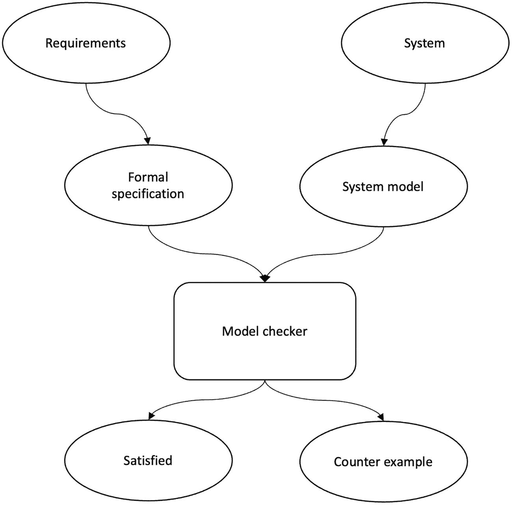

# 10. 结论

恭喜你读到了这里！我们走过了很长的路，掌握了许多信息。在本章中，我们总结一些重要的主题。我们还将关注一些最新的研究和想法，并涉足更多共识协议。共识协议研究中的一个重要方面是算法的形式化设计和验证。在本章中，我们将简要解释这个重要领域。此外，我们还会从不同角度比较一些最常见的共识协议，并介绍一些重要的研究方向。

## 引言

共识协议是分布式系统，尤其是区块链的基石。在本书中，我们讨论了几种协议和相关的主题。目前，区块链是实现共识协议最常见的选择。事实上，共识协议是区块链的核心。随着区块链的发展，新的方案不断被提出，用以解决各种问题，包括节点可扩展性、交易吞吐量、共识效率、容错性、互操作性以及各种安全问题。

分布式共识几乎被用于所有联网设备之间，不仅仅是我们习惯的经典分布式系统。这包括物联网、多智能体系统、分布式实时系统、嵌入式系统和轻量级设备。随着区块链的发展，区块链共识的应用预计也将在所有这些系统中增长。

## 其他协议

在本节中，我们简要介绍之前未涉及的协议。由于这是一个广阔的领域，这里仅做简要介绍。

### PoET

PoET（消逝时间证明）算法由英特尔于 2016 年提出。回想我们在第 5 章中讨论过，PoW（工作量证明）的一个关键作用是确保网络能汇聚到一条规范链前，让时间流逝。同时，领导者（即其区块被接受的矿工）通过解决 PoW 来赢得该权利。PoET 本质上是一种领导者选举算法，它利用可信硬件来确保在下一个领导者被选出来提议新区块之前，已经过去了一段确定的时间。PoET 的基本思想是通过随机等待被选为领导者来提议新区块，从而提供一种领导者选举机制。

实际上，PoET 模拟了 PoW 挖矿所消耗的时间流逝过程。其核心思想是每个节点在产生区块之前随机等待一段时间。这个随机等待过程在可信执行环境（TEE）内运行，以确保真实的时间确实已经流逝。为此，可以使用英特尔 SGX 或 ARM TrustZone。由于 TEE 提供了机密性和完整性，网络因此信任区块生产者。PoET 可以容忍高达 50%的故障 TEE 节点。然而，存在女巫攻击的可能性，即攻击者可以运行多个 TEE 节点，这可能导致随机等待时间缩短。如果超过 50%的 TEE 变得恶意，这可能会导致创建恶意链。另一个局限性是 Ittay Eyal 强调的陈旧芯片问题。这个局限性导致硬件浪费，进而造成资源浪费。陈旧芯片问题源于这样一个想法：对恶意行为者来说，收集大量旧的 SGX 芯片在经济上是有利的，这增加了他们成为下一个区块生产者的几率。例如，对抗性行为者可以收集大量旧的 SGX 芯片来搭建矿机。这仅用于一个目的，即挖矿，而不是购买支持 SGX 的现代 CPU（后者既有助于 PoET 共识，又可用于通用计算）。相反，他们可以选择尽可能多地收集支持 SGX 的旧芯片，以增加赢得挖矿彩票的机会。此外，支持 SGX 的旧 CPU 价格低廉，可能会增加对老旧低效 CPU 的使用。这就像比特币矿工竞相获得尽可能多的快速 ASIC（专用集成电路）以增加当选矿工的几率一样。然而，这导致了硬件浪费。还存在破解芯片硬件的可能性。如果某个 SGX 芯片被攻破，恶意节点每次都能赢得挖矿轮次，从而导致整个系统被攻破，并使矿工获得不当激励。这个问题被称为破碎芯片问题。

### PoA（权威证明）

我们可以将 PoA 视为一种特定类型的权益证明，其中验证者用其身份而非经济代币进行质押。验证者的身份代表了与之相关的权威性。获得权威的常规过程包括身份验证、声誉建立以及经过公众严格审查的评估流程。由此产生的群体成为一组高度可信的验证者，可以参与共识协议并生产区块。如果验证者违反协议规则或无法证明其有正当权利生产区块，则会导致网络中的其他验证者和用户将该不诚实验证者移除。它被用于 Rinkeby 和 Kovan 以太坊测试网络。PoA 提供了良好的安全性，因为我们在网络中拥有可信的验证者，但网络有些中心化。抵御合谋和其他安全威胁的能力取决于验证者所使用的共识算法。如果它是 BFT（拜占庭容错）的一种变体，则适用通常的 BFT 保证（33%的容错率）。

### HoneyBadger BFT（蜜獾拜占庭容错协议）

HoneyBadger BFT（HBBFT）是一种无领导者、随机化的共识协议，可在异步网络环境下运行。它是第一个实用的异步拜占庭共识协议。通常，在分布式系统理论中，随机化算法被认为是不切实际的。HoneyBadger 协议的作者声称反驳了这一观点。构建该协议所采用的方法是，通过微调现有原语并引入新的加密技术来提高效率。这些技术消除了协议中的瓶颈。

首先要解决的局限性是领导者瓶颈问题，例如在 PBFT（实用拜占庭容错算法）及其变体中，存在一种标准的可靠广播机制，用于将信息从领导者传播到其他节点。这会导致显著的带宽消耗，例如复杂度为`O(n^B)`，其中`b`是区块数量。为了解决这个局限性，可以使用纠删码，这允许领导者只向节点发送纠删码。然后，每个节点将接收到的纠删码条带发送给其他节点。这样，领导者的负载就减轻了。随后，所有节点只需重建消息即可。这使领导者的带宽降低到`O(n)`。在 HBBFT 中，交易以批次方式处理，这提高了吞吐量。

它本质上是一种基于多值拜占庭协议和公共子集协议的原生广播协议。HoneyBadger 使用了先前开发的几种技术，包括纠删码可靠广播和基于公共硬币的异步拜占庭协议。它还使用门限公钥加密（签名）来为随机化 ABA（异步拜占庭协议）提供公共硬币。

HBBFT 使用异步公共子集（ACS）来实现全序。ACS 通过另外两个协议来实现：可靠广播（RBC）和异步二值拜占庭协议（ABA）。

可靠广播由 Bracha 于 1987 年提出，通常被称为 Bracha 广播。该协议可容忍`f`个拜占庭故障节点，其中`n = 3f + 1`。它提供两个保证：当指定节点（领导者、广播者）向所有节点广播消息时。如果任何诚实节点提交了广播者广播的消息`m`，那么所有正确节点都会提交`m`。其次，如果广播节点是诚实的，那么每个诚实节点都会提交由广播节点广播的消息。由于消息需要在所有节点之间来回转发，该协议的通信复杂度变为`O(n²m)`，这对于较小规模的网络是可以接受的，但在拥有数千个节点的区块链世界中，这是不切实际的。

用于多方计算的公共子集协议（MPC 的 ACS）由 Ben-Or 提出。ACS 被用作异步网络环境下多方计算的共识原语。多方计算旨在创建一种机制，在其输入保持私密的情况下，根据各方的输入共同计算一个函数。ACS 至少对`n – f`个正确输入组成的公共子集达成一致。ACS 使用 RBC 和 ABA，这使得各方之间能够就单个比特达成一致。

由于 RBC 的通信复杂度问题，HBBFT 实现了一种不同的、带宽高效的广播机制，即 Cachin 等人提出的 AVID（异步可验证信息分发）。该机制使用纠删码和交叉校验和，将通信复杂度降低到`O(nm)`。这里，消息`m`被纠删码编码成不同的切片，然后对每个切片进行哈希，生成一个交叉校验和。广播者向一个节点发送一个切片和交叉校验和，然后该节点将这些信息回显给所有其他节点。一旦所有切片到达所有节点，每个节点就从这些切片中重建原始消息。这样，就消耗了更少的带宽。

总之，HBBFT 通过使用异步公共子集协议和可靠广播解决了异步环境下的共识问题。其中每个节点提出自己的值，最后运行一个异步二值拜占庭协议，对每个提案做出决定。

### 雪崩协议

这种全新的共识协议范式通过随机网络采样达成一致。与确定性共识相比，雪崩协议系列允许更灵活的共识形式，但相比 PoW（工作量证明）提供了更强的安全性，并兼具中本聪共识的节点可扩展性。可以将其视作传统基于法定人数协议的概率化版本，但无需明确的投票交集。其核心理念在于融合中本聪系列协议与经典系列协议的最优特性。

此类协议的安全性是概率性的，但失败概率可忽略不计。在活跃性方面，这些协议能以高概率终止运行，不过协议依赖同步性维持活跃性。该协议通过亚稳态机制实现安全性，其安全性具有概率性特征——通过可调节的系统安全参数使共识失败的可能性极小化。协议以高概率保证以下安全性与活跃性属性：

* **安全性：** 任何两个正确节点不会接受冲突交易。
* **活跃性：** 每个正确节点最终都会接受诚实客户端提交的交易。

该系列包含构建完整雪崩协议的多个子协议。协议采用渐进式构建：从提供亚稳态的"雪泥"协议开始，到拜占庭容错型"雪花"协议、"雪球"协议（通过决策置信度强化状态），最终形成引入有向无环图（DAG）结构以提升效率的"雪崩"协议。

这些创新使协议具备快速终结性、低延迟、高吞吐量和可扩展性。

### 基于 DAG 的共识协议

传统区块链采用线性结构，但研究者已提出基于非线性区块链结构的算法类别。其主要目标在于提升效率，这些协议基于如下前提：账本不应依赖有限且缓慢增长的线性链，而应能像 DAG 那样向各个方向扩展，从而带来性能提升、高可扩展性和快速交易确认。DAG 需要更少的通信、计算和存储资源，因此性能更优。基于 DAG 的账本分为两类：基于区块的 DAG 和基于交易的 DAG。

#### 基于区块的 DAG

区块 DAG 的每个顶点包含一个区块。与线性设计中每个区块仅有一个父区块不同，SPECTRE、PHANTOM 和 Meshcash 等方案中每个区块可以是多个区块的子区块。

#### 基于交易的 DAG

基于交易的 DAG 中每个顶点包含一笔交易。IOTA 缠结、Byteball、Graphchain 和雪崩协议等都是基于交易的 DAG 实例。

哈希图则是一种采用拜占庭容错型共识协议的许可制图结构区块链。

### 潮汐协议

这项成果是对 Gasper 协议活跃性问题的回应。Gasper 是为以太坊信标链提出的基于权益证明（PoS）的共识机制，融合了 Casper FFG（最终确定性工具）和 LMD GHOST（分叉选择规则）。该研究提出了可证明安全的"快照-聊天"协议。

中本聪式协议在网络分区和动态参与情况下能保持活跃性，但会牺牲安全性来换取活跃性。而拜占庭容错协议能在网络分区和低参与度（参与者少于`3*f+1`）情况下提供安全性（最终确定性），但牺牲了活跃性。研究证明，任何协议都无法同时实现动态参与下的活跃性和网络分区下的安全性。该研究回应了"是否存在同时保证可用性和安全性的共识机制"这一问题，其核心理念精妙——提出创建两个账本而非单一账本。须知，没有任何单一账本协议能在网络分区和动态分区情况下同时保证安全性和活跃性。换言之，最长链式机制优先活跃性而非安全性，在不同参与水平下提供动态可用性；而拜占庭容错协议优先安全性而非活跃性，提供最终确定性。这种矛盾被称为"可用性-最终确定性困境"，单一账本无法同时满足这两个属性。因此，解决方案是创建两个账本：第一个是"可用完整账本"，始终保持活跃，但仅在没有网络分区时安全，类似"最长链式 PoW 协议"；第二个称为"最终确认前缀账本"，始终保持安全，但在低参与度场景下不活跃，这等同于传统拜占庭容错协议（如 PBFT）——除非达到参与节点阈值，否则协议停滞。由于最终确认前缀账本是可用完整账本的前缀，两个账本最终会收敛为单一可信历史链。换言之，最终确认前缀账本在网络分区且故障节点数少于三分之一时安全；可用完整账本在动态（低）参与且活跃节点中拜占庭节点比例低于 50%时保持活跃。这种将拜占庭容错式与中本聪式协议结合创建"嵌套账本"的技术被称为"潮汐属性"。为实现该属性而开发的"快照-聊天"协议，通过使最终确认账本始终作为可用账本的前缀，形成统一的单一链条。从高层看，该机制运行方式如下：首先通过最长链式协议（如 PoW）将交易排序成区块链；随后将该区块链的前缀快照输入部分同步的拜占庭容错协议（如 PBFT），生成包含多个区块链条的链；接着删除重复或无效交易，形成最终确认前缀账本。将此最终确认前缀账本置于 PoW 式协议输出之前，并再次删除重复/无效交易，最终形成可用的单一账本。

共识协议种类繁多，虽无法逐一尽述，但我们已经探讨了涵盖随机化、确定性、CFT（崩溃容错）、拜占庭容错和中本聪式协议等多种类型与类别的代表性方案。

现在，让我们聚焦于形式化验证——这项技术能够确保上述各类共识协议的正确性。

## 形式化验证

随着区块链共识研究领域的蓬勃发展，我们现在能够体会到这是一个多么活跃的研究方向。许多新协议被提出，以创新的方式解决共识问题。例如，有些协议专注于效率，有些着眼于可扩展性问题，有些试图减少消息复杂度，有些修改现有的经典协议使其适用于区块链，有些尝试加速共识机制，此外还有诸多其他改进和新颖之处。这就引出了一个问题：我们如何确保这些共识协议是正确无误的，并且能按我们的预期运行？为此，研究人员通常会撰写包含协议正确性证明和论证的研究论文。此外，还会使用形式化方法来确保协议的正确性。

形式化方法是一种将系统建模为数学对象的技术。换句话说，这些是用于规约、设计和验证软件或硬件系统的数学严谨方法。这类技术包括用形式逻辑编写规约，并通过模型检测和形式化证明对其进行验证。形式化方法分为两大领域：形式化规约和形式化验证。前者涉及编写精确具体的规约，后者则关注于开发证明来验证规约的正确性。

形式化规约是一个定义明确的数学逻辑陈述，而验证则是通过逻辑推理（以机械方式完成）来检查规约的过程。换句话说，就是先正式定义规约，然后使用模型检测器或定理证明器进行验证。

形式化方法能提供价值的原因在于，它可以符号化地检查设计的整个状态空间，并确定设计的正确性。

通常，形式化验证包含三个步骤：

-   为待检查的系统创建一个形式化模型。
-   编写模型需满足的属性形式化规约。
-   机械地检查模型，以确保模型满足规约。

常用的验证技术分为两类：基于状态探索的方法和基于证明的方法。基于状态探索的方法是自动化的，但效率低下且难以扩展。例如，一个常见问题是状态爆炸，即待检查的状态数量呈指数级增长，导致模型无法放入计算机内存。因此模型必须是有限的，以便能被高效验证。另一方面，基于证明的方法（即定理证明）更精确，内存消耗更少，但需要人工交互以及对证明和相关技术有更深入的了解。基于证明的技术是对系统属性进行推理的最优雅方式，且对规约的大小没有限制。这与模型检测形成对比，后者对模型大小必须有所限制。借助基于证明的技术，你可以对系统状态进行推理，并证明无论输入什么，系统都能按预期工作。诸如 `Isabelle` 等证明辅助工具通过支持自动化定理证明，被用来帮助对系统进行推理。

模型检测机制包含一个形式化规约语言和一个模型检测器。模型检测使用自动化工具对系统进行形式化验证。这种方法在区块链研究人员中越来越受欢迎，用于检查共识协议的形式化规约并确保其正确性。自动化检测器会检查条件是否得到满足，如果满足则予以确认；否则，它会生成反例（即异常情况）。

图 10-1 展示了模型检测机制。

模型检测机制的流程图。流程始于需求和系统，止于满足和反例。

**图 10-1** 模型检测

`TLA+`（动作的时序逻辑）是由 Leslie Lamport 设计的一种规约语言，用于描述和推理并发系统。`TLC` 是一个用于对用 `TLA+` 编写的设计规约进行模型检测的工具。另一个模型检测器是 `SPIN`，它检查用 `Promela` 规约语言编写的规约。

分布式区块链共识算法通常针对两类正确性属性进行评估：安全性和活性。安全性通常意味着“不会发生坏事”，而活性则意味着“好事终将发生”。根据需求，这两个属性都有一些子属性。通常，对于共识机制，我们在安全性属性下有共识性、完整性和有效性条件，而活性则需要终止性。共识算法大多在系统模型下进行模型检测，通过指定系统中有多少个节点以及系统的时间假设。然后运行模型以探索系统的每个状态，并检查是否存在不会终止的执行路径。通常，这基于我们之前见过的 `3f+1` 公式，在一个四节点模型下进行。

一个程序是正确的，当且仅当在所有可能的执行中，该程序都能根据规约正确运行。

## 不可能性结果

分布式系统中的不可解性结果表明某些问题是无法解决的。下界结果表明，如果资源不足，某些问题就无法解决；换言之，这些下界结果表明，只有当可用资源达到一定阈值（即解决问题所需的最小资源）时，某些问题才可能解决。

表 10-1 总结了与共识问题相关的核心不可能性结果。

**表 10-1** 共识问题的不可能性结果

|   | 崩溃故障 | 拜占庭故障 |
| --- | --- | --- |
| 同步 | 当 `f` < `n` 时共识可能 至少需要 `f` + 1 轮，其中 `f` < `n` `f` 网络连通度 | `f` ≥ `n`/3 时不可能 至少需要 `2f` 网络连通度 当 `f` < `n`/2 时可能 需要 `f` + 1 轮 |
| 异步 | 确定性共识不可能 | 确定性共识不可能 |
| 部分同步 | 当 `n` ≤ `2f` 时不可能 | 当 `n` ≤ `3f` 时不可能 需要 `2f` 网络连通度 需要 `f` + 1 轮 |

表 10-1 的结果是标准的不可能性结果。然而，还有许多其他结果。

随着区块链的创新研究，出现了一些新结果。Andrew Lewis-Pye 和 Tim Roughgarden 宣布了一个引人入胜的新不可能性结果，类似于 CAP 定理，即我们只能同时从三个属性中选择两个。该结果指出，没有任何区块链协议能够同时在无约束环境（例如 PoW）中运行、在具有显著且剧烈动态变化（例如参与者数量）的同步环境下保持活跃性，并在部分同步环境下满足概率最终性（一致性）。我们只能同时从前面提到的三个属性中选择两个。

例如，在像比特币这样的无规模环境中，假设某个节点停止接收任何新区块。此时，该节点无法区分其他节点是失去了资源而无法再产生区块，还是区块消息被延迟了。如果该节点停止产生区块，而其他节点资源不足也不产生区块，则违反了活跃性属性，因为即使其他节点不产生区块，该节点也必须继续产生区块。然而，如果它继续产生区块，但区块消息只是被延迟了，那么它就违反了一致性属性，因为可能存在其他冲突区块只是被延迟了。

## 复杂度与性能

可以从通信复杂度的角度来评估共识算法。这涉及如下计算：如果协议在正常模式（无故障）下运行，需要交换多少条消息才能达成共识。此外，在领导者故障并发生视图变更的情况下，需要交换多少条消息？这些指标有助于理解算法在实际中的表现，从而帮助评估算法的效率。

消息延迟可定义为算法中那些必须等前一条消息被接收后才能发送的消息数量。换句话说，就是那些只有在前一条消息被接收之后才能发送的消息。一个算法需要 `n` 个消息延迟；如果某次执行包含一个由 `n` 条消息组成的链，其中每条消息都必须在前一条消息被接收后才能发送。

为了评估与算法相关的成本，我们可以考虑不同的复杂度特征。与共识算法相关的成本有三种：消息复杂度、通信复杂度和时间复杂度。

### 消息复杂度

消息复杂度表示算法达成共识所需交换的消息总数。例如，假设一个算法中所有进程都向所有其他节点广播。这意味着将收到 `n(n - 1)` 条消息。这意味着该算法的消息复杂度为 `O(n²)`。

### 通信复杂度（比特复杂度）

通信复杂度关注的是算法需要交换的总比特数。考虑与消息复杂度示例中相同的算法。如果每条消息包含 `t` 比特，则该算法交换 `tn(n - 1)` 比特，这意味着通信复杂度为 `O(tn²)` 比特，即全对全的通信模式。

### 时间复杂度

时间复杂度关注的是完成算法执行所需的时间。执行算法所需的时间还取决于协议中传递消息所需的时间。与对消息进行本地计算相比，传递消息所需的时间相当大。因此，时间可以看作是连续消息延迟的次数。之前示例中在无故障网络上运行的同一算法的时间复杂度为 `O(1)`。

### 空间复杂度

空间复杂度关注的是算法运行所需的总空间量。在共享内存框架中，空间复杂度尤为重要。

在诸如区块链这类基于消息传递的分布式系统中，通常主要考虑的是消息复杂度。比特复杂度并非那么重要；然而，如果消息体量很大，那么它可能成为另一个需要纳入考量的复杂度指标。

表 10-2 总结了一些常见 BFT 协议的复杂度结果。

**表 10-2** 消息复杂度阶数

| 协议 | 正常模式 | 视图变更 | 消息延迟 |
| --- | --- | --- | --- |
| Paxos | *O*(*n*) | *O*(*n*²) | 4 |
| PBFT | *O*(*n*²) | *O*(*n*³) | 5 |
| Tendermint | *O*(*n*²) | *O*(*n*²) | 5 |
| HotStuff | *O*(*n*) | *O*(*n*) | 10 |
| DLS | *O*(*n*²) | *O*(*n*⁴) | *O*(*n*) 轮 |
| HoneyBadger | *O*(*n*) | − | − |
| PoW | *O*(*n*) | − | − |

考虑到这些成本，我们可以想到区块链共识协议中导致性能不佳的几个瓶颈。例如，选择全对全消息传递模式将不可避免地导致更高的复杂度。

可以使用诸如纠删码之类的几种技术来降低消息复杂度。另一种称为星型拓扑（一对全 – 全对一）的技术，取代网状拓扑（全对全通信），也能降低消息复杂度。这两种技术分别应用在 `HoneyBadger` 和 `HotStuff` 中。

另一类旨在提高共识算法性能和可扩展性的算法，是允许多个节点并行地充当领导者，即并行领导者。在这种范式下，多个领导者可以同时提出提案，从而通过将负载均匀地分布到所有领导者来减轻 CPU 和带宽成本。这类算法中有几种，例如 `HoneyBadger`、`Hashgraph` 和 `RedBelly`。然而，并行领导者可能会导致请求重复的问题，`Mir-BFT` 协议已经解决了这个问题。

分片是另一种提高共识性能的技术。它允许将系统状态和验证者划分为更小的部分。每个分片负责整个状态的一个小子集，并且只需要全局验证者集的一个较小子集来就该部分状态达成共识。这样，许多分片并行存在，通过允许在更小的部分上运行共识，可以实现极高的效率。为了达成最终状态，还需要某种跨分片通信和整合机制。

另一种提高吞吐量的技术是将数据从主链卸载到二层网络。在这方面已经开发了一些技术，例如支付通道、比特币的闪电网络、提交链和 `Plasma`。诸如零知识证明之类的技术被用来提供链下执行的证据。`Prism` 和 `Bitcoin-NG` 是一些用于提高共识性能的技术。

前面讨论的基于 DAG 的共识旨在通过引入基于图的结构来提高性能，这些结构允许非相互依赖的命令并行提交。

命令/智能合约的并行执行也是为提高性能而提出的一种技术。`Solana` 区块链支持并行智能合约（称为 `Sealevel`）。

## 协议对比

我们可以从不同角度比较共识算法。表 10-3 总结了对比结果。

**表 10-3** 主要共识算法对比

| 属性 | POW | POS | POA | RAFT | PBFT |
| --- | --- | --- | --- | --- | --- |
| 安全性 | 概率性 | 概率性 | 确定性 | 确定性 | 确定性 |
| 对抗者 | 算力控制 | 质押数量 | 合谋/拜占庭 | 合谋/崩溃 | 合谋/拜占庭 |
| 方法 | 数学难题求解 | 价值存款 | 权威 | 领导者-追随者 | 主备份 |
| 网络模型 | 同步 | 同步 | 同步 | 部分同步 | 部分同步 |
| 激励机制 | 有 | 有 | 无 | 无 | 无 |
| 访问控制 | 公有链 | 公有链 | 联盟链 | 联盟链 | 联盟链 |
| 区块验证 | 区块头检查/PoW 有效 | 质押规则 | 身份检查 | 印章检查 | 印章检查 |
| 最终性 | 概率性 | 经济性 | 确定性 >50% 验证者同意 | 即时 | 即时 |
| 不当行为控制 | CPU/内存资源 | 质押惩罚 | BFT | CFT | BFT |
| 选举类型 | 抽签 | 抽签 | 投票 | 投票 | 投票 |
| 活性 | 概率性 | 概率性 | 确定性 | 确定性 | 确定性 |
| CAP | A over C | A over C | A over C | P over C | P over C |
| 交易容量 | 10 量级 | 100 量级 | 10 量级 | 1000 量级 | 1000 量级 |
| 容错能力 | BFT | BFT | BFT | CFT | BFT |
| 分叉 | 是 | 是 | 否 | 否 | 否 |
| 特殊硬件 | 是 | 否 | 否 | 否 | 否 |
| 示例 | 比特币 | Tezos | Rinkeby | GoQuorum | Sawtooth |
| 动态成员资格 | 是 | 是 | 否 | 是 | 否 |

注：

- 假设 PoA 是基于 BFT 的。
- 虽然只给出了一个示例，但还有许多其他例子，例如以太坊也使用了 PoW。
- `PBFT` 和 `RAFT` 都是具有领导者-追随者架构（也称为主备份）的状态机复制协议。通常在文献中，`PBFT` 使用主备份术语；然而，对于 `RAFT`，则使用领导者-追随者术语。从根本上说，它们服务于相同的目的。

### 网络模型

我们可以通过以下几种方式对区块链网络进行建模，如下所示。从根本上讲，网络要么是同步的，要么是异步的，要么是部分同步的。然而，在文献中使用了几个术语，其解释如下。

#### 同步网络

所有消息都在 delta `Δ` 时间内送达。

#### 最终同步网络

在一个未知的全局稳定时间（GST）之后，所有消息都在 delta `Δ` 时间内送达。

#### 部分同步网络

协议不知道 delta `Δ` 是多少。

#### 弱同步网络

`Δ` 随时间变化。在实践中，`Δ` 会系统地增加，直到达成活性。然而，预期延迟不会呈指数级增长。

### 异步

所有消息最终都会被送达，但对消息送达时间没有固定的上限。消息传递的延迟是有限的，但不对其施加任何时间限制。

`对手`主要有两种类型：静态对手和自适应对手。静态对手在协议执行前进行破坏，而自适应对手可以在协议执行的任何时刻造成破坏。存在两种崩溃模型：崩溃故障模型和拜占庭故障模型。基于轮次的算法包含发送步骤、接收步骤和计算步骤，这三个步骤构成一轮。

我们可以从几个方面来研究、评估或分类共识协议：

*   **容错/韧性级别**：BFT 或 CFT。
*   **时间复杂度**：协议运行需要多长时间，以及有多少次消息延迟。
*   **消息复杂度**：就交换的消息数量而言，协议的消息复杂度是多少？
*   **可信设置**：协议是否需要像 PKI 这样的设置，还是不需要经销商？
*   模型中假设的对手能力有多强？是有限还是无限？对手破坏模型是什么？是静态的还是自适应的？
*   网络模型是什么？同步、异步、部分同步及其变体。
*   协议是概率性的还是确定性的？
*   它是否使用密码学？
*   **计算假设**：信息论安全性或计算安全性。
*   **成员资格**：动态或固定，许可或公开。

在分析共识协议时，提出这些问题是有用的。

关于共识算法，还有两点需要记住：

1.  共识算法的目标是在单个值上达成共识，而 SMR 则使用共识算法来决定用于复制的一系列操作。
2.  记住，`PoW` 不是共识算法。它是一种女巫攻击抵抗机制；共识是通过选择最长链来达成的。类似地，`PoS` 也不是共识算法。它也是一种女巫攻击抵抗机制，但关于规范真相（分叉的选择）的决策是由一种 BFT 风格的算法做出的。我们可以将其视为一种耦合机制，其中`PoS`是一种女巫攻击控制机制，而分叉选择和最终确认则通过 BFT 风格的算法完成。同样，Solana 中的`PoH`是一种事件排序机制（事件排序器），它也允许以无需信任的方式选择领导者；然而，最终链的决策是通过一种名为`TowerBFT`的 BFT 风格算法对分叉进行投票来达成的。

## 研究方向

区块链共识是一个非常有研究价值的领域。尽管已经取得了巨大进展，但仍有一些开放的研究问题需要解决。其中一些问题及其可能的研究方向如下：

*   大多数区块链协议，特别是许可区块链协议，都基于`PBFT`。然而，世界在不断变化，自从 1999 年`PBFT`被提出以来，很多情况都发生了改变。已经有人尝试修改`PBFT`以满足区块链需求，也确实起作用了，但效率和可扩展性仍然是需要解决的问题。区块链的未来是多链和异构的。同时，将会有各种不同类型的设备，从计算机到轻量级资源受限的物联网系统或移动设备。这样一个异构网络需要另一种能够在异步网络中承受数百万异构设备的共识机制。跨链交易和共识是另一个需要进一步研究的方面。对异步 BFT 协议的一些研究已经产生了`HoneyBadger BFT`和`BEAT`，当然，我们还可以做得更多。同样，`Casper FFG`、`Casper CBC`、`GRANDPA`和`BABE`朝着多链异构未来迈出了正确的步伐。然而，仍然需要做大量工作。

*   随着区块链技术的发展，对手也在进化。可能会出现新颖的攻击技术，由于区块链上可能存在的经济激励，这些技术可能会更早而不是更晚地显现出来。这是因为相关方愿意投资，寄希望于入侵区块链网络的新技术能够立即带来收益。

*   利用量子计算来增强经典成果是一个有趣的话题。例如，量子计算机可以与经典分布式网络或区块链并行运行。量子计算机可以使用基于 W 态的量子领导者选举算法（在第`9`章中讨论）选举出一个领导者，并将结果传递给经典的区块链/分布式网络。这类技术可以提高现有经典网络的安全性和效率。

*   与经典许可网络相关的结果不能直接应用于非许可环境；因此，需要修改这些协议以适应区块链世界。已经有一些工作在进行中，例如，`Casper FFG`就受到`PBFT`的启发。

*   共识协议的可扩展性和隐私性是一个极其重要的领域。在区块链世界中，隐私有两个方面：交易价值的机密性以及隐藏网络中参与用户的身份。可扩展性涉及节点可扩展性以及交易吞吐量。

*   机制设计是微观经济学的一个分支，建立在博弈论概念之上，研究如何设计协议，利用激励措施鼓励理性行为者正确行动。它也被称为逆向博弈论。它从一个期望的结果出发，研究系统中的实体如何协作以实现该目标。由于区块链是加密经济激励系统，我们可以从机制设计领域学到很多。我们可以应用机制设计领域的技术和方法来开发鲁棒的新颖区块链协议。

## 总结

在最后一章中，我们总结了本书所学的全部内容。我们还介绍了一些之前未涉及的算法，特别是像 Avalanche 和 Ebb-and-Flow 这样的新型共识协议。我们还触及了一些需要进一步研究的研究方向。从拜占庭将军问题到中本聪共识，再到现在的多链共识协议，我们走过了漫长的道路。这是一个如此成熟的研究领域，未来随着更多创新想法的涌现，我们只会看到更多进展。

在本书中，我们探讨了区块链和分布式共识的基础。我们了解了量子计算可能对分布式共识产生的影响，以及如何在量子网络中达成一致。区块链共识可能是区块链领域中最具研究价值的领域。

感谢您陪我度过这段奇妙的旅程。您现在有能力作为区块链研究员应用本书中的知识，并在区块链共识领域继续您的学习和研究。
