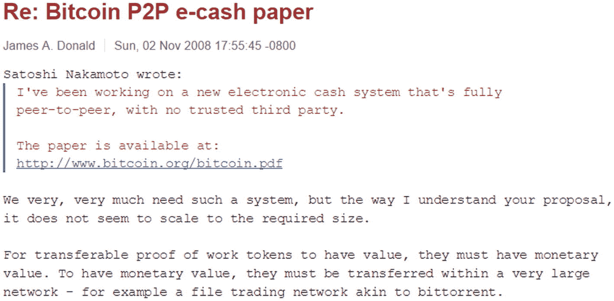
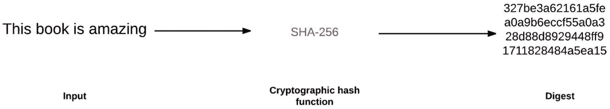
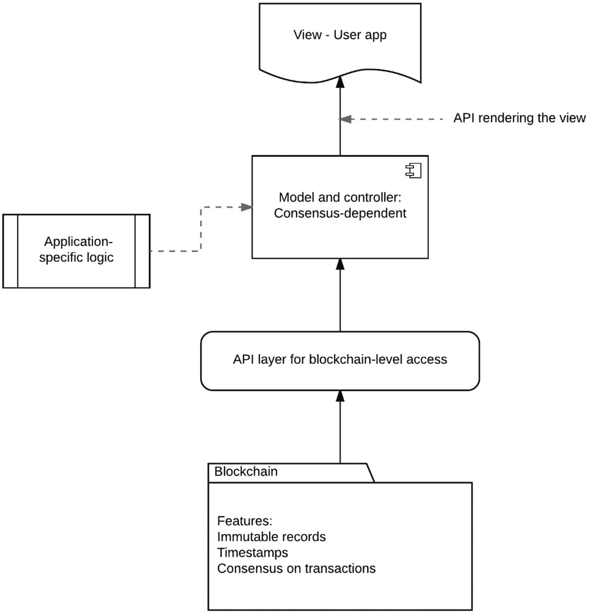
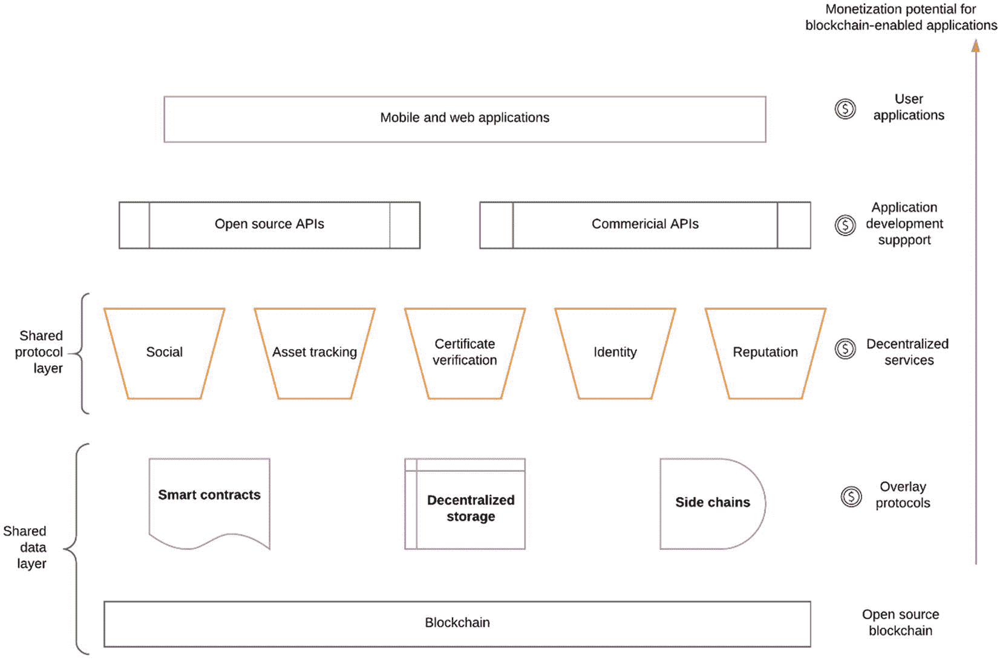

# 1. 见证梦想家

焦虑或许是描述 2008 年底主导投资者和公众对金融市场态度的最佳词汇。众多经济学家认为，2008 年的金融危机是大萧条以来最严重的一次金融危机。危机前的几年，不负责任的抵押贷款泛滥，金融监管与监督出现了大规模的系统性失灵。其后果之严重，以至于威胁到了大型金融机构的生存，各国政府不得不进行干预，救助主要银行。在本章中，我们将首先概述 2008 年的金融危机及其后果：一个让新银行系统和比特币等替代货币得以蓬勃发展的环境。然后，我们将深入探讨驱动比特币的技术栈。值得注意的是，该技术栈的各个组件并非全新，而是通过一个非常精巧的设计整合在一起，从而构建了一个新系统。最后，我们将讨论人们对区块链日益浓厚的兴趣，这是一项重大的技术突破，有可能彻底改变多个行业。Imbolo Mbue 写了一本书（兰登书屋，2017 年），书名与本章相同，讲述了纽约的"梦想家"们经历金融危机以及他们的生活因此发生改变的故事。这本书记录了那些梦想建立一个更具韧性的金融体系的梦想家们。

## 范式转移

革命往往看起来混乱，但这一次却在悄然酝酿，由一位（或一群）化名为中本聪、梦想改变金融世界的不知名人士领导。金融危机的责任可以归咎于很多方面；然而，共同点是那些用于维护整个系统完整性的基础金融和会计工具变得过于复杂，无法有效使用。信任，作为所有金融体系的终极粘合剂，在 2008 年开始消失。自那以后，监管规则已发生改变，以防止类似情况再次发生；然而，很显然，交易对手之间的信任自动调节机制以及对其签订任何类型销售合同能力的透明度是迫切需要的。**交易对手**本质上是指金融交易中的另一方。换句话说，就是与卖方匹配的买方。在金融交易中，所涉及的众多风险之一被称为**交易对手风险**——即合同中*另一方*可能无法履行其协议义务的风险。前面提到的系统性失败现在可以从交易对手风险的角度来理解：交易中的双方都在积累巨大的交易对手风险，最终，双方都在合同条款下崩溃。想象一个涉及多方参与的类似交易场景，再想象这个场景中的每一个参与者都是一个主要金融机构、一家银行或一家保险公司，而它们又持有数百万的客户。这就是 2008 年危机期间发生的情况。

我们需要讨论的另一个问题是**双重支付**。我们将严格地再次在比特币的背景下讨论这个话题，但让我们先通过将其应用于金融危机来对这个概念有一个基本的理解。双重支付背后的原则是，已用于一笔交易的资源不能同时分配给另一笔不同的交易。这个概念对数字货币有明显的影响；然而，它也可以概括 2008 年危机期间的核心问题。

事情是这样开始的：贷款（以抵押贷款的形式）发放给了信用记录不佳、难以偿还贷款的借款人。这些高风险抵押贷款被出售给大银行的金融专家，他们通过将大量此类贷款集中在一起成组，将其打包成低风险的公共股票。当每笔贷款（抵押贷款）的风险不相关时，这种集中打包方式是可行的。大银行的专家们假设全国不同城市的房产价值会独立变化，因此打包并没有风险。事实证明这是一个巨大的错误。然后，这些打包好的抵押贷款组合被用来购买一种名为债务抵押债券（CDOs）的股票。CDOs 被分成不同等级并出售给投资者。这些等级由金融标准机构进行评级，投资者根据这些评级购买最安全的等级。一旦美国房地产市场转向，就引发了多米诺骨牌效应，摧毁了路上的一切。尽管有评级，但 CDOs 最终变得一文不值。打包的抵押贷款组合价值暴跌，所有正在四处销售的包裹瞬间化为乌有。在这整个复杂的交易链条中，每一笔销售都增加了风险，并在多个层面引发了双重支付。最终，系统达到了均衡，却发现存在巨大的缺口，并因此在重压下崩溃。以下是 2008 年的简要大事记。该时间线是根据 Micah Winkelspech 在 2016 年分布式健康大会上的演讲编制的：

- 1 月 11 日：美国银行收购陷入困境的 Countrywide
- 3 月 16 日：美联储迫使贝尔斯登出售
- 9 月 15 日：雷曼兄弟申请第 11 章破产保护
- 9 月 16 日：美联储斥资 850 亿美元救助美国国际集团（AIG）

*   9 月 25 日：`华盛顿互惠银行`倒闭
*   9 月 29 日：金融市场崩盘，`道琼斯工业平均指数`暴跌 777.68 点，整个体系濒临崩溃
*   10 月 3 日：美国政府授权 7000 亿美元用于银行救助

这次救助带来了巨大的经济后果，但更重要的是，它创造了一种有利于比特币蓬勃发展的环境。2008 年 11 月，一篇白皮书（[`https://bitcoin.org/bitcoin.pdf`](https://bitcoin.org/bitcoin.pdf)）被发布在密码学与密码政策邮件列表中，标题为“[比特币：一种点对点的电子现金系统](https://bitcoin.org/bitcoin.pdf)”，作者署名是中本聪。这篇白皮书详细描述了比特币协议，并附带了比特币早期版本的原始代码。从某种意义上说，这份白皮书是对刚刚发生的经济危机的回应，但这场技术革命还需要一段时间才能流行起来。一些开发者担心这种电子现金系统在站稳脚跟之前就会失败，而他们担忧的是可扩展性问题，如图 1-1 所示。

那么，中本聪是谁？他有什么背景？简单直接的答案是：我们不知道。事实上，假设他实际上是一个“他”也是武断的。中本聪这个名字在很大程度上是一个化名，而“他”可能是一位“她”，甚至是一个庞大的团队。一些记者和新闻媒体投入了大量时间和精力进行数字取证，以缩小候选人范围并找出真正的中本聪，但迄今为止所有的努力都徒劳无功（[`https://www.technologyreview.com/s/527051/the-man-who-really-built-bitcoin/`](https://www.technologyreview.com/s/527051/the-man-who-really-built-bitcoin/)）。在这种情况下，社区开始意识到中本聪是谁或许并不重要，因为开源的本质几乎使其无关紧要。比特币社区最受尊敬的开发者之一杰夫·加齐克这样描述道：“中本聪发布一个开源系统的目的，就是让你不必知道他是谁、信任他是谁，或关心他的知识。”开源精神的真谛在于代码本身就能说明一切，无需创建者/开发者的任何干预。

图 1-1

比特币协议的初步反响。对比特币可扩展性和现实前景的担忧

## 技术栈

中本聪在创建比特币协议时真正的天才之处在于解决了拜占庭将军问题。该解决方案通过借鉴密码朋克社区的组件和思想，被推广到金融交易中。我们将简要讨论其中三个想法，这些组件如何工作，以及它们如何帮助比特币协议：用于工作量证明的哈希现金，用于去中心化网络的拜占庭容错，以及用于消除对中心化信任或中央机构需求的区块链。让我们从哈希现金开始，逐一深入探讨。

`哈希现金`由亚当·巴克在 90 年代末设计，旨在通过首创的工作量证明算法来限制垃圾邮件。`哈希现金`背后的原理是为发送电子邮件附加一定的计算成本。垃圾邮件发送者的商业模式依赖于发送大量邮件，而每封邮件的成本极低。然而，如果每封发送的垃圾邮件都有哪怕很小的成本，那么成千上万封邮件的成本就会成倍增加，他们的生意就会变得无利可图。`哈希现金`依赖于加密哈希函数的概念——一种哈希函数（在比特币中，它是`SHA1`），它接收输入并将其转换为字符串，生成消息摘要，如图 1-2 所示。哈希函数被设计成具有一种称为单向函数的属性，这意味着可以很容易地通过哈希函数验证潜在输入是否与摘要匹配，但从摘要反推输入是不可行的。重新创建输入的唯一可能方法是使用暴力搜索来找到合适的输入字符串。在实践中，这是`哈希现金`计算密集型元素，并已被引入比特币。这一原理已成为支撑当今比特币及大多数加密货币的工作量证明算法的基础。比特币的工作量证明更为复杂，并涉及新组件，我们将在后面的章节中详细讨论。

图 1-2

加密哈希函数的机制。它接收一个输入，并持续将其转换为一个输出摘要字符串

接下来我们需要讨论的是拜占庭将军问题。这是一个将军群体之间的共识问题，每位将军指挥着拜占庭军队的一部分，准备攻击一座城市。这些将军需要制定进攻城市的策略，并充分相互沟通。重要的任务是每位将军必须朝着相同的行动努力，因为少数将军的软弱攻击还不如协同进攻或协同撤退。问题的关键在于，有些将军是叛徒。他们可能会投票欺骗其他将军，最终导致次优策略。让我们看一个例子：在奇数位将军的情况下，比如七位，三位支持进攻，三位支持撤退。第七位将军可能向支持撤退的将军表示同意，并向其他将军表示同意进攻，从而导致整个计划崩溃。进攻部队将无法攻占城市，因为没有内在的中央权威能够验证所有七位将军之间是否存在信任。

在这种场景下，若要实现拜占庭容错，所有忠诚的将军必须能够有效沟通，就作战策略达成无可争议的共识。如此一来，叛徒将军所投的误导性（错误）票就会被揭露，并且无法扰乱整个系统。在比特币协议中，中本聪实现拜占庭容错的关键创新在于创建了一个点对点网络，并配有一本能够记录和验证多数人批准的账本，从而揭露任何虚假（叛徒）交易。这本账本提供了一致的通信方式，并进一步使得整个系统无需信任。这本账本也被称为区块链。有了区块链的加持，比特币成为首个在整个网络范围内解决双重支付问题的数字货币。在本章剩余部分，我们将对该技术及支持区块链的应用程序概念进行广泛概述。

区块链主要是一种记录账本，它为所有相关方提供从始至终的安全且同步的交易记录。区块链能够非常快速地记录数百笔交易，并且其设计本身包含多种用于数据安全、一致性和验证的密码学措施。区块链上相似的交易被汇集到一个称为`区块`的功能单元中，然后用一个时间戳（一种加密指纹）进行封存，该时间戳将当前区块与前一个区块连接起来。这就创建了一条由时间戳连接而成、不可逆且防篡改的区块链条，方便地称之为区块链。区块链的架构使得每一笔交易都能被网络中的所有成员非常快速地验证。成员本地还存有区块链的最新副本，这使得在去中心化网络内能够达成共识。诸如不可变的记录保存和全网共识等功能可以被集成到一个技术栈中，以开发新型应用，即去中心化应用（DApps）。让我们在图 1-3 中，在模型-视图-控制器（MVC）框架的背景下，来看一个 DApp 的原型。模型-视图-控制器框架是一种软件设计概念，它将应用程序分为三个组件：模型（包含与数据相关的逻辑）、视图（客户经常交互的 UI 组件）和控制器（在模型和视图之间进行交互的接口）。该框架常被用于设计可扩展且可伸缩的传统网络应用程序。在这里，我们想扩展一个行业标准，并用它来解释 DApp。

> **注意**
> 
> 区块链的第一个区块被称为`创世区块`。这个区块的独特之处在于它不链接到任何前序区块。中本聪在这个区块中添加了一点历史信息，作为对英国当前金融环境的背景说明：“*《泰晤士报》2009 年 1 月 3 日，财政大臣即将为银行进行第二轮纾困*。”这个区块不仅证明了在 2009 年 1 月 3 日之前不存在任何比特币，而且还为我们窥见创造者的思想提供了一点线索。

**图 1-3** 该图展示了一个去中心化应用的简单原型，它在最后步骤与最终用户进行交互

这里的模型和控制器依赖区块链获取数据（数据完整性和安全性），并相应地更新视图以呈现给最终用户。这个原型中的秘密武器是 API，它负责从区块链中提取信息，并提供给模型和控制器。这个 API 提供了扩展业务逻辑并将其添加到区块链的机会，此外还包含一些基本操作，这些操作以区块为输入，并提供对二元问题的答案。区块链未来可能还会拥有更多功能，例如可以验证外部数据并在区块链本身上为其打上时间戳的预言机。为了更好地理解支持区块链的应用程序这一概念，我们必须欣赏能够支撑最终用户应用程序的完整服务栈；这在图 1-4 中进行了展示。

**图 1-4** 支持区块链的应用程序栈

## 小结

在本章中，我们开始讨论比特币的历史以及它诞生前后的金融环境。我们将在接下来的章节中继续讨论区块链以及点对点网络的具体特性，例如矿工等。

