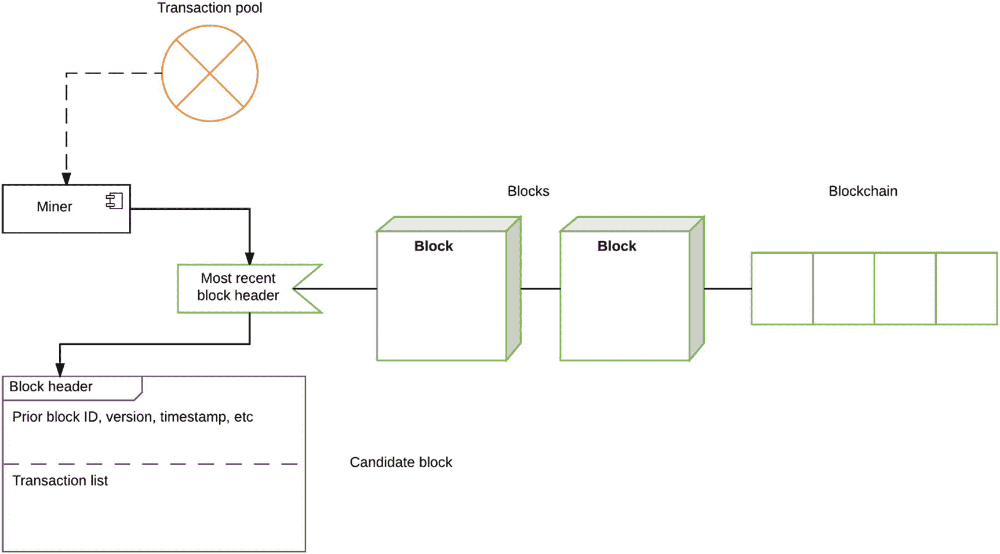
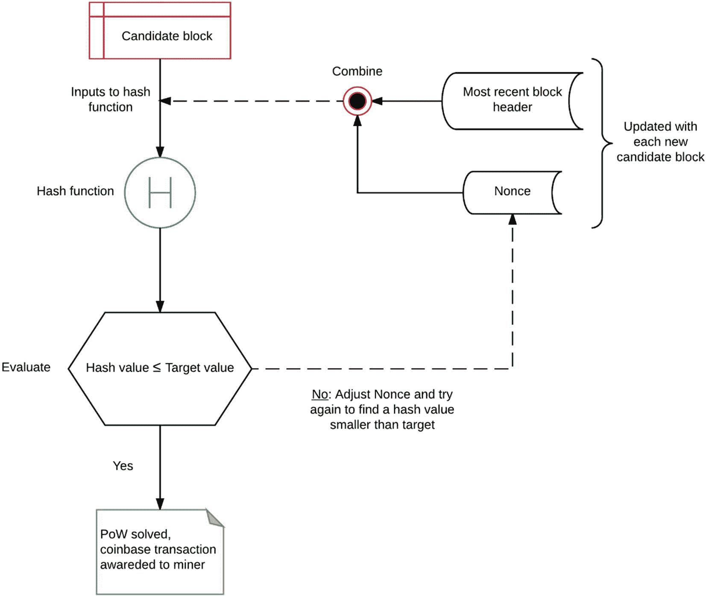
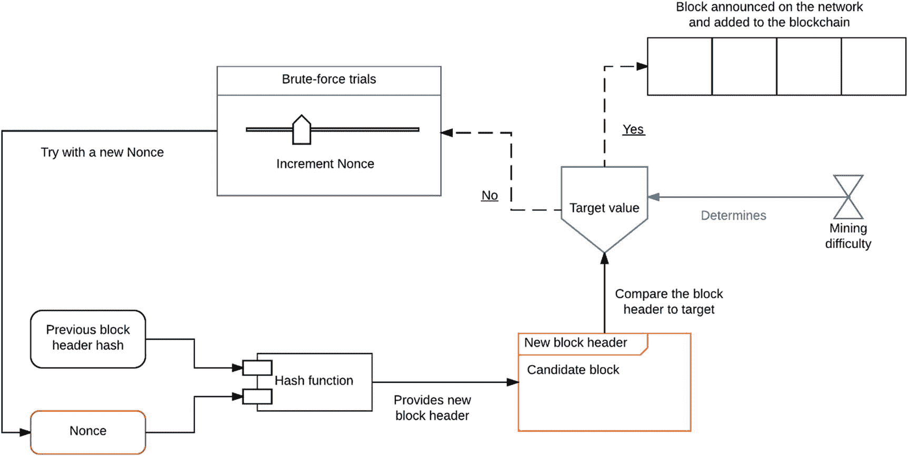

# 2. 淘金热：挖掘比特币

挖矿是理解比特币协议功能的一个关键操作概念。它指的是对区块链的每个区块执行的一种去中心化审查过程，以达成共识，而无需一个中央权威机构来提供信任。换句话说，在参与双方互不信任的去中心化环境中，挖矿在计算上等同于同行评审。我们将在此更深入地继续讨论哈希函数，因为它涉及到挖矿和解决工作量证明函数。然后，我们将把区块目标值和网络难度的概念与挖矿结合起来，并探讨挖矿是如何发展以跟上不断增加的网络难度的。这将引导我们进一步讨论最近开发出的不同类型的硬件挖矿。本章将以分析那些开始销售专用挖矿硬件、从而引发比特币挖矿军备竞赛并最终失败的初创公司作为结尾。

## 达成共识

挖矿是比特币协议的核心，主要有两个目的：向整个经济体注入新的比特币，以及验证交易。在本章中，我们将探讨这两个过程背后的机制。本质上，挖矿是解决我们之前讨论过的双重支付问题的恰当方案。为了消除对中央权威机构的需求，个人在自己的机器上运行比特币客户端（称为矿工），他们参与网络并验证双方之间的交易是否具有欺诈性。挖矿实际上是一项计算密集型活动，但是人们有什么动力去帮助挖掘新的比特币呢？矿工的主要动力是他们通过参与获得比特币形式的奖励。让我们通过图 2-1 来简要了解挖矿过程。

图 2-1  
挖矿过程的简化概览

近期在比特币网络上发生但尚未打包的交易，会留在交易池（也称为 `mempool`，所有有效交易都在这里等待比特币网络确认）中，直到被矿工选取并打包进一个区块。矿工从交易池中选择交易，并将其打包成一个区块。区块创建完成后，它需要一个区块头才能被区块链接受。可以把它想象成邮寄包裹：包裹打包好后，需要贴上邮票才能寄出。矿工使用区块链中最新区块的区块头，为当前区块构建一个新的区块头。区块头还包含其他元素，例如时间戳、比特币客户端版本，以及与链中上一个区块对应的 ID。由此产生的区块称为候选区块，如果满足其他几个条件，它就可以被添加到区块链中。

挖矿过程非常复杂，图 2-1 仅概述了矿工参与协议的宏观画面。接下来，我们将探讨“邮票”（沿用刚才的类比）的技术细节以及给包裹贴邮票的机制。请记住，挖矿是一个竞争过程。图 2-1 只描述了一个矿工的过程，但实际上，网络中大量的矿工会同时参与进来。矿工们相互竞争，为他们创建的包裹（区块）寻找邮票，最先找到邮票的矿工获胜。矿工之间寻找邮票的竞赛大约每十分钟结束一次，接下来的十分钟又会开始新的竞赛。一旦找到邮票，矿工就可以完成该区块，并向网络公布。现在，该区块就可以被添加到区块链中了。让我们通过图 2-2 来看看寻找邮票（更广为人知的说法是区块头）的过程。

图 2-2  
通过解决工作量证明（PoW）生成区块头

矿工创建的包裹几乎就是一个区块，只是缺少一个区块头。它被称为候选区块，只有在添加了邮票（即区块头）之后才能被添加到区块链中。它将从区块链中最新区块获取的区块头与一个 32 位值（称为 `nonce`）结合起来。这个组合作为输入被送入哈希函数（`SHA-256`）。哈希函数计算出一个新的哈希值作为输出。然后，将这个生成的哈希值与网络的（给定时间点的）目标值进行比较。如果哈希值大于目标值，则调整 `nonce`，并将新的输入发送给哈希函数，以获取新的潜在输出。找到小于目标值的合适哈希值这一问题，是工作量证明的核心，并且只能通过暴力破解来解决。一旦矿工找到了一个小于目标值的哈希值，这个哈希就可以用于候选区块的区块头。第一个找到该哈希的矿工被认为是获胜者。获胜的矿工已经证明了她为找到该哈希所付出的工作量；因此，该区块中包含的交易现在被认为是有效的。这个区块现在可以被添加到区块链中。此外，获胜的矿工还会因解决工作量证明问题而获得奖励，奖励是特定数量的比特币。从将交易打包进区块，到找到哈希并向比特币网络公布该区块，整个过程大约每十分钟重复一次。

我们在图 2-2 中引入了一些新的术语；为了内容的完整性，我们来对它们进行适当的描述：

*   **候选区块：** 一个不完整的区块，由矿工创建作为临时结构，用于存储来自交易池的交易。在通过解决工作量证明问题完成区块头后，它就变成了一个完整的区块。

*   **工作量证明（PoW）：** 发现可用于候选区块区块头的新哈希值的问题。这是一个计算密集型过程，涉及对取自最新区块的哈希值进行评估，并向其附加一个 `nonce`，然后与网络的目标值进行比较。该问题只能通过暴力破解来解决；也就是说，需要多次尝试使用（来自最新区块头的）哈希值，并且每次都需要调整 `nonce`，才能解决工作量证明问题。

*   **Nonce：** 一个 32 位的值，它与来自最新区块头的哈希值连接。这个值在每次尝试中不断更新和调整，直到发现一个低于目标值的新哈希。

*   **哈希函数：** 用于计算哈希值的函数。在比特币协议中，此函数是 `SHA-256`。

*   **哈希值：** 哈希函数计算出的结果输出。

*   **目标值：** 一个所有比特币客户端共享的 256 位数字。它由难度决定，稍后会讨论。

*   **币基交易：** 被打包进区块的第一笔交易。这是对矿工为候选区块挖掘工作量证明解决方案的奖励。

*   **区块头：** 区块的头部，包含许多特征，例如时间戳、工作量证明等。我们将在下一章更详细地描述区块头。

> **注意：**  
> 在了解了上述术语的定义之后，请重新审视图 2-1 和图 2-2。之前一些抽象的概念现在会变得清晰，信息也会更好地整合起来。

现在我们对挖矿原理有了更深入的理解，接下来看看**挖矿难度**和**目标值**。这两个概念类似于网络随时间调整的旋钮，所有比特币客户端都会更新以遵循最新数值。那么什么是挖矿难度？本质上，它可以定义为矿工在解决工作量证明问题时，找到低于目标值的哈希值的困难程度。难度增加意味着发现哈希并解决工作量证明所需的时间更长，这也就是挖矿时间。网络设定的理想挖矿时间约为十分钟，这意味着每十分钟会有一个新区块在网络中发布。挖矿时间取决于三个因素：目标值、网络中的矿工数量以及挖矿难度。让我们看看这些因素是如何相互关联的：

1.  挖矿难度的增加会导致目标值降低，以补偿挖矿时间。
2.  加入网络的矿工数量增加会导致工作量证明的解决速度加快，从而缩短挖矿时间。为了调整这种情况，挖矿难度会增加，区块创建速率恢复正常。
3.  目标值每创建 2016 个区块重新计算和调整一次，这大约需要两周时间。

正如我们所见，比特币网络中存在一种自我纠正的共性，使其具有极强的弹性。矿工是比特币网络的心脏，他们参与挖矿主要有两个动力：

*   区块中打包的第一笔交易称为 **coinbase 交易**。这是获胜矿工在挖出区块并在网络中宣布后获得的奖励。
*   第二种奖励以手续费的形式出现，向网络用户收取用于发送交易。矿工因将交易打包进区块而获得这笔费用。这笔费用也可视为矿工的收入，因为随着越来越多的比特币被挖出，这笔费用将成为他们收入的重要部分。

现在，我们可以将这些概念以图 2-3 中另一个流程图的形式整合起来。这将有助于在难度和目标值的背景下巩固挖矿的过程。

图 2-3

解决工作量证明问题

网络中的矿工竞相解决问题，获胜的矿工将区块广播到网络，然后该区块被纳入区块链。为了解决工作量证明，矿工必须使用递增的 `nonce` 不断生成新的哈希值（通过哈希函数），直到发现一个低于目标值的哈希值。在这种情况下，请注意 `nonce` 是唯一可调整的值。这是一个简化的工作量证明方案，其实现与现实存在细微差别。

> **注意**  
> *挖矿* 这个术语源于其过程类似于稀有金属的挖掘。它非常消耗资源，并以缓慢的速度释放新货币，就像比特币协议中的矿工获得奖励一样。

我们讨论了比特币网络的自我纠正特性，以及它们如何使网络适应变化。接下来，我们将探讨随着比特币普及，网络中涌入大量矿工所带来的一个意外后果。这引发了一场军备竞赛，并产生了深远的影响。但首先，我们需要讨论出现的新型挖矿硬件。

## 挖矿硬件

随着比特币开始获得更多商家的普及和接受，更多矿工加入网络以期获得奖励。矿工们在挖矿方式上开始变得更具创意，例如使用能生成更多哈希值的专业硬件。在本节中，我们将讨论随着比特币开始全球传播，挖矿硬件的演变过程。

*   **CPU 挖矿：** 通过比特币客户端可用的最早挖矿形式。它在比特币客户端的早期版本中成为挖矿的常态，但由于更好的选择出现，在后续更新中被移除。
*   **GPU 挖矿：** 挖矿技术的下一波进步。事实证明，使用 GPU 挖矿强大得多，因为它能生成比 CPU 多数百倍的哈希值。这现在是大多数加密货币挖矿的标准配置。
*   **FPGA 和 ASIC：** FPGA 代表现场可编程门阵列，是一种为特定用例设计的集成电路。在这种情况下，FPGA 被设计用于挖掘比特币。FPGA 使用非常特定的硬件语言编写，使其能够在功耗和输出效率方面非常高效地执行单一任务。在 FPGA 引入后不久，一种更优化、可大规模生产且商业化的设计以 ASIC（专用集成电路）的形式出现。ASIC 的单位成本更低，因此可以大规模生产。基于 ASIC 的设备外形也很紧凑，因此可以在单个设备中集成更多。ASIC 能够以低价位组合成阵列，这为加速挖矿效率提供了非常有说服力的理由。
*   **矿池：** 随着 ASIC 的兴起导致挖矿难度上升，矿工们意识到单独继续挖矿在经济上并不明智。挖矿耗时太长，奖励与投入的资源不匹配。因此，矿工们组织成称为矿池的团体，以整合所有成员的计算资源，作为一个整体进行挖矿。如今，加入矿池是开始挖掘几乎所有加密货币的常见方式。
*   **云挖矿服务：** 这些只是拥有专业挖矿设备的承包商。他们根据合同，以特定价格向矿工出租服务，在特定时间内进行挖矿。

不难看出，在开发者和硬件爱好者意识到可以用相当低廉的价格制造自定义 ASIC 阵列后，ASIC 如何彻底改变了挖矿游戏。这标志着比特币硬件领域某种军备竞赛的开始，开发者们开始设计新的芯片，并购买新设备用于挖矿机，以便能挖到最多的比特币。这种由利润驱动的初期推动加速了比特币的普及，并为这种替代货币创造了一个黄金时代。更多的开发者和爱好者加入购买定制硬件以最大化利润的行列。随着矿工数量的增加，网络通过提高难度来应对。在很短的时间内，由于协议中存在的自我纠正特性，泡沫无法再为矿工维持，难度不断上升。在某些情况下，矿工购买的硬件甚至从工厂运达时就已经无法盈利了。需要预先投入大量资本才能获得可观的回报。如今，大多数 ASIC 硬件已成历史，甚至比特币矿池对普通矿工来说也已无利可图。那些将 ASIC 和定制硬件商业化的初创公司和企业在短时间内获得了可观的利润，然后就失败了。我们将在下一节中审视其中的一些重大失败案例。

## 创业故事

在本节中，我们将重点介绍几个比特币"淘金热"时期（从 2013 年中期持续到 2014 年末）的故事。这里涵盖的初创公司遵循的策略是销售略微过时的挖矿硬件以获取利润，但有些公司则更进一步。我们要谈的第一家初创公司是**蝴蝶实验室**。这是一家来自密苏里州的公司，成立于 2011 年末，承诺销售能够以远超竞争对手的速度挖矿的技术。据称，其专用集成电路（`ASICs`）挖矿速度比单台计算机快一千倍，并且在 2012 年首次发布后不久就开放了预售。矿工们蜂拥购买这些承诺在同年 12 月交付的硬件。据美国联邦贸易委员会（`FTC`）报告，蝴蝶实验室通过预售筹集了约 2000 万至 3000 万美元。发货大约在 2013 年 4 月开始，但只有少数客户收到货，而大多数客户又等了一年才收到他们的挖矿设备。当客户实际收到机器时，它们已经过时了，有人指控蝴蝶实验室在交付前先使用这些硬件为自己挖矿。尽管无法完成最初的订单，蝴蝶实验室又开始提供一种新的、功能强大得多的矿机，并开启了预售。最终，该公司成为比特币社区最受憎恨的公司之一，`FTC`不得不介入并将其关闭。

我们要讨论的第二家公司是**CoinTerra**。这是一个更复杂的案例，因为该初创公司由一支在该领域拥有深厚专业知识的团队创立。首席执行官拉维·艾扬格此前曾是三星的 CPU 架构师，公司董事会中还有许多其他该领域的领导者。最初，他们获得了风险投资，资金充足，并于 2013 年宣布了他们的首款产品：**TerraMiner IV**，预计同年 12 月发货。该公司未能按时发货，最终推迟了日期。矿机在 2014 年仍未到货，最终 CoinTerra 向客户道歉，并提供了一些补偿，但补偿也大幅延迟，进一步激怒了客户。该公司似乎正试图转向云挖矿服务，但他们已经失去了大部分客户群的信任。

我们的最后一个案例将聚焦一家名为 **HashFast** 的初创公司。与前两个例子类似，HashFast 提供了一款名为 **Baby Jet** 的矿机产品，预计 2013 年 12 月交付。HashFast 的团队过度承诺了功能，但在挖矿难度飙升的时期却未能兑现。该公司很可能动用了早期采用者的资金来资助自身发展，当他们遇到困难时，客户要求退款。当时的问题是比特币价格持续上涨，因此公司没有足够的资金偿还客户。他们面临多起诉讼，现金储备迅速耗尽。最终，在 2014 年 5 月，一名法官裁定允许拍卖该公司拥有的所有资产，以偿还债权人和投资者。

这些公司的一个共同点是，它们常常无法在承诺的时间交付挖矿硬件，并且严重延迟或拒绝向客户退款。我们可以从这里介绍的案例以及其他同样失败的`ASIC`初创公司中，归纳出一个通用的运营模式：

-   以极高的价格开放预售，并虚假宣传高得离谱的哈希率和巨大的投资回报。
-   将所有预售资金投入`ASICs`和定制硬件的研发。
-   一旦从海外制造商处获得挖矿硬件，就在内部不间断地挖矿数月。
-   通过社交媒体向客户广播，声称制造过程比预期耗时更长。
-   仅向那些威胁要起诉的客户交付硬件，作为发货已开始的早期证据。
-   当`ASIC`硬件已经严重过时时，才交付给其他客户。
-   客户投诉并提起诉讼，公司最终分崩离析，面临巨额罚款。

## 新的共识

我们将以与本章开头相同的理念——**共识**——来结束本章。本章的核心思想是，在比特币中，挖矿用于达成共识，以防止用户双重支付并验证所有交易。然而，自比特币问世以来，其他共识算法也被开发出来。我们将比特币原始协议中用于达成共识的工作量证明算法称为**中本聪共识**。最近流行起来的一种新共识算法被称为**权益证明**，其中参与者主要扮演验证者的角色。在比特币中，持有欺诈交易的不良行为者必须面对矿工网络的严格审批和验证过程。在权益证明（`PoS`）中，参与者以货币形式在网络中拥有权益（因此得名）。因此，他们希望网络成功，信任就产生于由验证者投入最大权益币量的区块中。此外，恶意验证者会因其不当行为而被削减其权益。我们将在本书后面深入探讨`PoS`的技术细节，以及它与`PoW`机制的比较。我们的旅程在本章以共识结束，我们将在下一章继续讨论比特币网络和区块链。

## 总结

在本章中，我们讨论了挖矿的概念，并介绍了理解矿工如何验证区块所需的技术背景。我们深入探讨了比特币挖矿的核心 —— `PoW`，并且在本书的其余部分，我们将介绍其他共识机制。然后，我们描述了比特币挖矿中为生产最佳硬件而展开的军备竞赛，这导致了难度的巨大提升，以及那个时期初创公司的失败。最后，我们以提及`PoS`结束了本章，我们将在后面的章节中再次回到这个话题。

