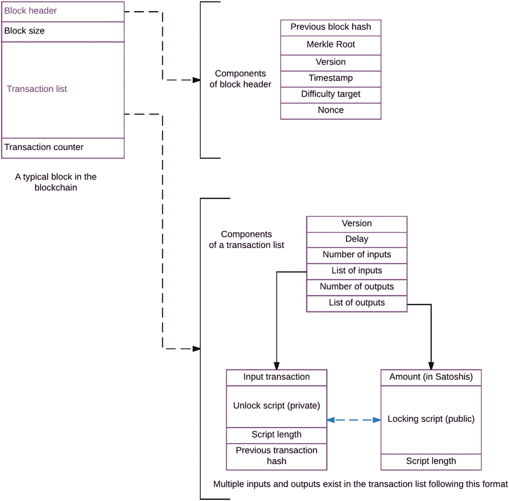
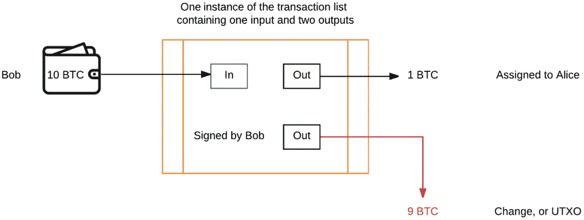
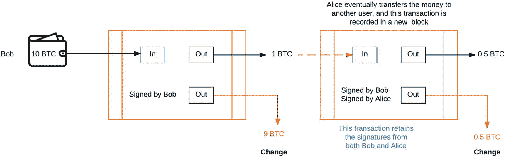
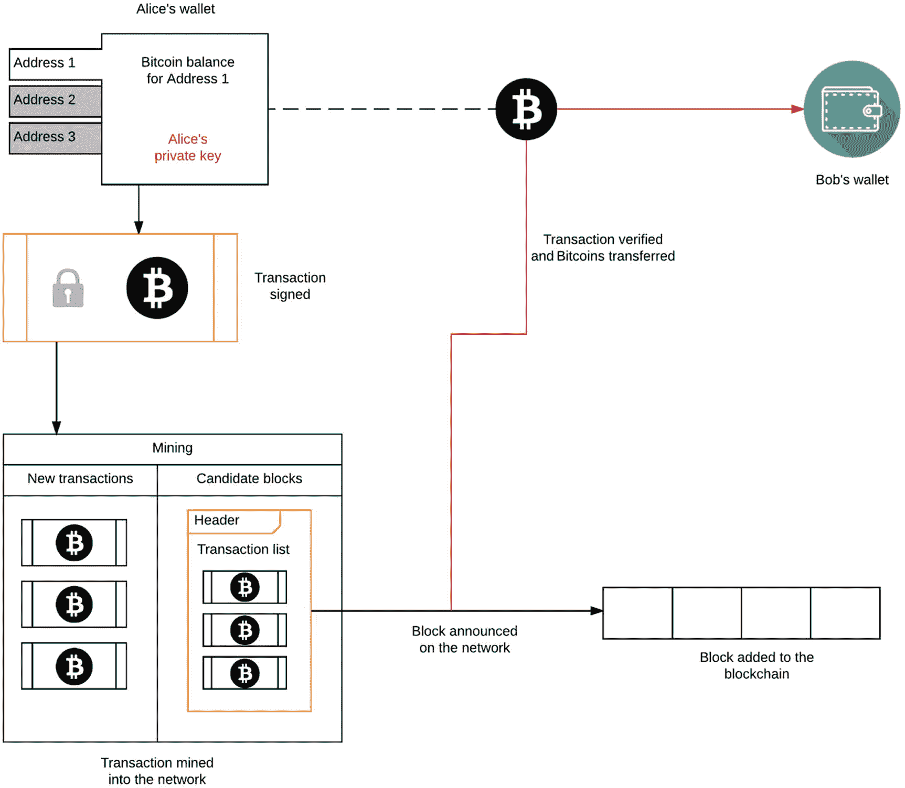
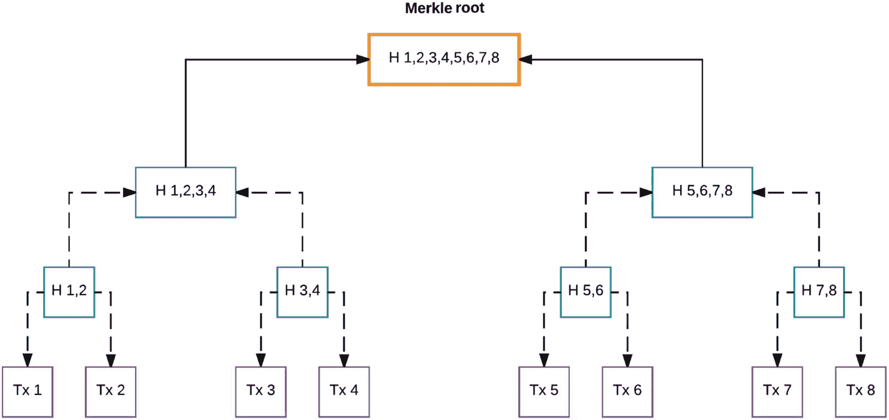
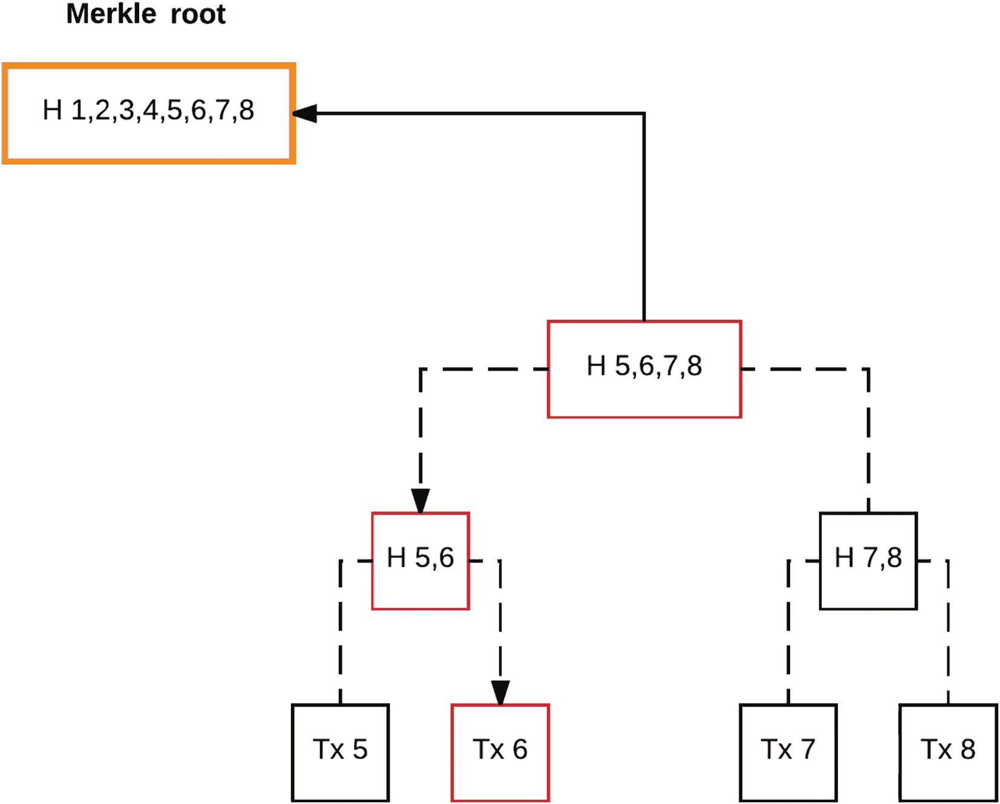
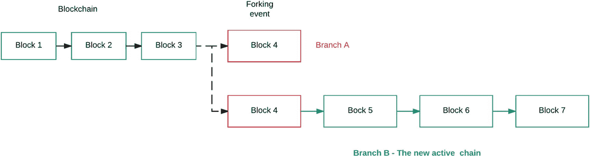

# 3. 区块链的基础

`区块链`是一种去中心化的数据结构，其内部一致性通过所有用户对网络当前状态达成的共识来维持。这是一项解决拜占庭将军问题的赋能技术（该问题描述的是在三位将军之间建立信任，以便协调进攻击败敌人；更多内容见第 1 章），并为无需信任的交易和信息交换的应用开发开辟了全新的可能性。如果说互联网实现了点对点信息交换的民主化，那么区块链则实现了点对点价值交换的民主化。本章将从探讨比特币网络上用户之间的交易如何运作开始，这涉及对区块结构和交易结构的技术性讨论。接着，我们将深入探讨钱包和用户地址的作用。在讨论钱包之后，我们将把重点转向比特币网络中实现的简单支付验证（SPV）。通过 SPV，我们将理解为何区块具有特殊结构，更重要的是，比特币网络如何在高速扩展中保持效率。最后，我们将通过讨论区块链中的硬分叉和软分叉来结束本章，并阐述分叉对运行比特币核心代码的商家和用户在向前兼容性方面的影响。尽管在技术发展的"寒武纪大爆发"阶段，区块链存在众多变体，但其核心原则始终如一。

## 交易工作流程

比特币协议的核心目标是允许用户之间以去中心化方式通过网络进行交易。到目前为止，我们一直在讨论协议的零散片段以构建背景知识。现在，我们可以将这些概念整合到一个统一框架中，并探索区块链。挖矿的最终结果是随着网络随时间演进，区块数量不断增加。要理解两个用户（Alice 和 Bob）之间的交易如何发生，我们首先需要了解承载交易的区块结构。简单来说，区块链是由两个主要原则约束的区块集合：

- **内部一致性**：每个区块的运行遵循若干固有设计原则，使区块链保持内部一致性。例如，每个区块都链接到链中的前一个区块，并带有创建时间戳。区块链中的此类机制使其成为内部一致的数据结构，能够稳定记录交易。

- **交易共识**：上一章描述的挖矿概念仅仅是验证交易的一种实现方式；还存在其他不涉及暴力哈希计算的机制。然而，在所有这些实现中，都存在一种方案，用于在网络某一个`x`时间间隔内发生的交易达成共识。我们可以通过使用`工作量证明`或其他将交易汇集后由网络参与者验证的协议，来泛化这种去中心化系统中的交易验证。

交易本质上作为区块的一个属性——一种通过网络传播的数据结构——被承载，但这是如何发生的呢？为了更好地理解这一过程，让我们观察图 3-1 所示的更完整的区块结构。每个区块至少包含两个独特组件：包含唯一标识该区块的哈希值（称为默克尔根）的区块头，以及包含来自交易池的新交易的交易列表。请注意，每个区块的列表中包含的交易数量相同，但用户之间的具体交易内容不同。这是因为每十分钟只有一个区块能在区块链上赢得挖矿竞赛。在我们的简化模型中，区块仅有另外两个组件：在整个网络中保持一致性的区块大小，以及每个区块中交易数量的计数器。在此，我们将重点关注区块头和交易列表。

区块头包含几个标准组件，例如之前讨论过的难度目标和`随机数`。它还包含获胜矿工运行的比特币核心代码的版本号。时间戳也是每个区块的独特特征，它明确标识网络中的某个特定区块。区块头还包含链中前一个区块的哈希值，以及标识本区块的特殊哈希值，称为默克尔根。我们将在本章后续讨论这种特殊哈希值是如何构建的。

### 生存证明

最近有传言称维基解密创始人朱利安·阿桑奇已经去世。阿桑奇最近在 Reddit 上举办了一场"问我任何事"活动，并通过读取区块链上最新的区块哈希值来回应这些谣言，以此证明他还活着。该区块仅是在十分钟前创建的，因此这不可能是预先录制的，从而毫无悬念地证明了阿桑奇健在。这是区块哈希值首次在流行文化语境中发挥作用，阿桑奇称之为`生存证明`。

**图 3-1** 区块结构的简化概览

红色文字显示每个区块中保持唯一的两个组件。我们进一步分解这两个组件如下。区块头由几个更小的部分组成，其中最特别的是默克尔根，它是唯一标识一个区块的哈希值。区块头包含前一个区块的哈希值、用于创建该特定区块的`随机数`以及网络难度，这些是我们之前讨论过的标准挖矿组件。如前所述，每个区块还包含一个交易列表。除了实际的交易之外，交易列表还包含对区块如何接受交易至关重要的几个组件。例如，锁定时间延迟规定了交易何时能被纳入区块。最后，该列表包含所有被此区块接受的交易，这些交易以一系列签名的输入和输出形式呈现，确保比特币从发送方转移到接收方。

### 交易列表的组成部分

这里引入了一些新的术语和概念，我们现在就来逐一讲解。我们已经讨论过区块头、区块上的时间戳概念、默克尔根以及前一个区块的哈希值。现在我们将聚焦于交易列表的组成部分，先从延迟开始。完整的技术术语是锁定时间延迟，指的是交易可以被收录到某个区块中所需等待的时间。其精确机制涉及一个名为 `blockheight` 的参数，该参数会随着区块链上区块的增加而递增。在交易指定的 `blockheight` 被超过之前，该交易将保持锁定状态且未经确认。

接下来，我们需要讨论交易输入和输出的概念。这两个参数引导着交易在整个网络中的流转，并与花费能力的概念紧密相连。作为一种货币，比特币区块链上花费能力的基本单位称为未花费交易输出（`UTXO`），其价值以聪为单位。一个比特币可以进一步拆分为一亿个聪，类似于一美元可以拆分为 100 美分。网络将整个比特币经济记录为已花费或未花费的交易。在一次交易事件中，买方所有的比特币都被用于购买某件物品，这会产生两个输出：一笔锁定给买方的已花费交易，以及剩余比特币构成的未花费交易。这些未花费交易会返还给买方，并赋予其在未来交易中的花费能力。对于最终用户而言，跟踪未花费交易已通过使用钱包实现了自动化。钱包软件会搜索区块链并收集属于特定地址的所有 `UTXO`，从而为用户创建一个账户余额的概念。本质上，属于用户的比特币是来自多个交易事件中产生的 `UTXO` 的总和。我们稍后将讨论钱包和地址的概念。

为了从实践角度理解 `UTXO`，我们需要讨论找零和找零地址的概念。这个想法其实非常简单——回想一下你上次用现金购买杂货的场景。你的交易有两个组成部分：你为所购物品付了钱，这部分付款被指定给了商家；同时你收到了一些找零，是付款后剩余的部分。`UTXO` 就是你收到的找零。这笔找零会进入你拥有的一个比特币地址（称为找零地址）；请参考图 3-2 查看此过程的图形描述并跟随理解。每笔交易都被分成两部分：一部分被花费并锁定（或分配）给商家，另一部分则返还给买方。返还的部分就是未花费交易输出，可用于未来的交易。在一笔交易中，被该交易消耗的 `UTXO` 被称为输入，而剩余或由交易新产生的 `UTXO` 被称为输出。只有交易输出（用户拥有的 `UTXO`）才能在未来的交易中被花费。图 3-2 中的例子说明了类似的情形：Bob 想发送 1 BTC 给 Alice，但在此过程中，Bob 拥有的 10 BTC 被分成了两部分：发送给 Alice 的 1 BTC（现在已分配给她），以及以 `UTXO` 形式返还给 Bob 的 9 BTC。这两个组成部分都被记录在区块链上，因为它们是同一笔交易的一部分，如图 3-2 所示。

**图 3-2** – 交易列表中 UTXO 的格式

在这个示例中，Bob 想发送 1 BTC 给 Alice，该图展示了这笔交易是如何发生的。Bob 拥有的 BTC 被用作交易的输入，输出则分为两部分：一部分发送给 Alice，金额为 1 BTC；另一部分作为找零返还给 Bob。这里需要注意，初始交易、新分配的交易以及找零都会作为输入和输出被记录在区块链上。

现在我们对 `UTXO` 有了更好的理解，接下来谈谈交易是如何从一个用户分配给另一个用户的。这涉及到使用公私钥对来锁定和解锁交易。其过程如下：

-   用户 Alice 发起了一笔她想发送给 Bob 的交易。
-   Alice 使用她的私钥对交易进行签名。
-   该交易在网络广播，任何人都可以使用 Alice 的公钥来验证该交易确实源自她。
-   Bob 在交易经过网络验证并传播给他之后收到该交易。
-   Bob 使用他的私钥解锁该交易。该交易是用一种脚本签名的，只有接收方才能解锁交易并将其分配给自己。

我们提到交易的锁定和解锁机制使用了脚本，那么这个脚本是什么呢？比特币协议使用一种极简、基础且非图灵完备的编程语言来管理交易。中本聪的初衷是尽可能保持编程逻辑非常简单，并尽量使其不驻留在区块链上。每个交易都附带一个脚本，其中包含关于接收比特币的用户如何访问这些比特币的指令。本质上，发送方需要提供一个公钥（网络上的任何人都可以用它来确定交易确实源自脚本中包含的地址），以及一个签名（用于证明该交易是使用发送方的私钥签署的）。没有公私钥对的授权，用户之间的交易就无法进行。让我们完善之前开始用 `UTXO` 构建的图景，如图 3-3 所示。

**图 3-3** – 区块链上的交易传播

从概念上讲，将已花费交易视为锁定状态，而将网络上的未花费交易视为分散在数百个区块中的 `UTXO`，这可能会让人觉得奇怪，但这正是交易在网络中传播的方式。在我们图 3-3 所示的例子中，Bob 首先发起了一笔发送给 Alice 的交易，1 BTC 被分配给了 Alice。他收到了 9 BTC 的找零作为未花费输出。Alice 随后向另一用户发送了 0.5 BTC，在此过程中，她从自己的交易中收到了 0.5 BTC 的找零。请注意，第一笔交易是由发起交易的 Bob 签名的，随后 Alice 对第二笔交易进行了签名。从某种意义上说，第一笔交易的输出成为了第二笔交易的输入，因此 Bob 的签名被保留作为第一笔交易的证明，而 Alice 的签名则充当了解锁机制。这就是交易如何在比特币网络上从源头一直追踪到最后所有者（最终地址）的方法。通过使用网络地址，网络保留了一定程度的假名性。

现在我们已经讨论了 `UTXO`、签名、脚本以及交易是如何记录的，让我们把这些概念整合起来，回顾一下 Alice 和 Bob 之间交易的完整工作流程，如图 3-4 所示。

**图 3-4** – 网络交易概览

### 比特币交易与钱包机制

在图 3-4 中，Alice 从她的钱包发起交易，该钱包包含多个地址。每个地址都拥有一定数量的比特币余额（即与该地址关联的所有 `UTXO` 的总和），这些余额可用于创建新交易。随后，使用 Alice 的私钥对交易进行签名，交易进入挖矿阶段，并被封装至一个候选区块中。挖矿结束后，获胜的矿工在网络中广播该区块，区块随之被添加到区块链中。交易随后传播至 Bob，他现在可以使用自己的私钥解锁交易输出金额并加以使用。借助 `UTXO`、签名以及脚本锁定/解锁的概念，我们能够更深入地理解区块链作为去中心化账本是如何维持内部一致性的。

在图 3-4 中，我们引入了一个新概念——钱包，它可以用来发起交易。简单来说，钱包本质上是一个**比特币地址加上用于解锁该地址的私钥**。钱包如今已成为比特币核心代码的标准组成部分，主要为用户提供三种用途：

*   **创建交易**：用户可通过钱包的图形界面轻松创建交易。
*   **维护余额**：钱包软件会追踪与某一地址关联的所有 `UTXO`，并向用户显示最终余额。
*   **维护多个地址**：在钱包内，用户可以拥有多个地址，每个地址可与特定的交易相关联。

从某种意义上说，地址是比特币网络中确立所有权的唯一方式。`UTXO` 与特定地址关联（作为账户余额），用户可以创建任意数量的地址。我们在图 3-4 中看到，Alice 的钱包中包含三个地址，每个地址均可配合她的私钥使用。除了软件钱包之外，还有其他类型的钱包。图 3-4 中展示的是软件钱包，但其他两种钱包类型（移动钱包和冷存储物理钱包）的操作流程与此类似。

移动钱包主要以便利性为设计目标，同时也是通往使用比特币等加密货币进行移动支付世界的大门。这些钱包通常充当完整钱包的独立但简化版本，允许用户随时随地访问余额并进行交易。这类钱包应用通常是在开源环境中设计的，因此它们也有助于将开发者和高级用户聚集到社区中。冷存储钱包则是一种更长期的比特币存储方法。曾发生过钱包软件损坏，或用户无法记住解锁钱包的密钥，从而导致其账户余额实际上变得不可用的情况。钱包密码没有直接的恢复机制。物理存储的理念是创建一个新钱包，并向该钱包上的一个新地址发送一笔交易。接下来，可以将这个新钱包进行备份并保存到如 U 盘等物理设备上，并安全存放。一旦该交易在区块链上得到确认，你的比特币便可随时从 U 盘中安全取回。这样做可以防范任何意外情况，并将你的货币与你用于日常交易或挖矿的主钱包分离开来。一些开发者更进一步，创建了纸钱包，其中地址被编码为二维码，而该特定钱包的私钥则以另一个二维码的形式打印在纸上。

**注意**

如何在不自行编写脚本或代码的情况下，实际见证你的交易在比特币网络上进行？在比特币（以及大多数加密货币）中，有一种称为区块链浏览器的功能，它通常是一个网站，其上显示所有来自比特币网络的交易。你可以获取关于交易的各类详细信息，例如交易来源、金额、区块哈希以及收到的确认次数。

## 简单支付验证（SPV）

到目前为止，我们已经讨论了区块的结构、交易列表、交易如何在用户之间发生，以及它们如何被记录在区块链上。区块本质上是链接在区块链上的数据结构，而交易则可以视为该数据结构的属性。更准确地说，在区块链的语境下，交易被表示为默克尔树的叶子节点。哈希值在比特币协议中被用作维护数据一致性的方法，因为哈希值非常容易验证，且几乎无法逆向还原。基于这些特性，我们可以解决区块链上一个非常棘手的技术挑战：如何验证某一特定交易是否属于某个区块？对一个包含 *N* 个项目的列表进行检查，其效率极为低下；因此，我们无法简单地对区块链中（可能包含数百万个区块）的每一笔交易逐一检查以进行验证。这正是默克尔树提供速度和效率的关键所在。

要直观理解默克尔树，请参考图 3-5。它由区块中的交易构建而成，以便快速访问并进行验证。让我们按照图 3-5 中的示例进行操作。在这个例子中，一个区块中收集了八笔交易，并以默克尔树的形式呈现。最底层是交易本身，通过将两笔交易进行哈希运算并得到一个输出哈希，它们被抽象到更高一层。这个哈希随后与第二个哈希结合，并再次进行哈希运算，从而抽象到更高一层。此过程重复进行，直到仅剩下两个哈希值。请注意，每一层都包含了其下一层的信息，最终，最顶层持有包含整棵树信息的哈希值。这个哈希被称为默克尔根。那么，默克尔根如何帮助查找交易呢？让我们通过图 3-6 中的示例，来尝试从默克尔树中找到交易 6。首先，默克尔根允许我们跳过树的另一半，此时我们的搜索范围被限制在交易 5 到 8 之间。哈希值进一步引导搜索，使我们仅需三步就能抵达（找到）交易 6。相比之下，如果遍历整棵树，进入每一层并逐一比较每笔交易来确认它是否确实是交易 6，这个过程在步骤数量和所需时间上将复杂得多；若搜索范围扩展到数百万笔交易，这将会变得异常繁重。

图 3-5 — 构建默克尔根

在`Figure 3-5`中，最底层由交易构成，总体思路是不断将两个元素进行哈希运算，并保留下一层的部分信息。最终，我们仅剩下两个元素，它们被哈希在一起形成`Merkle`根。那么，何时搜索交易会有所帮助呢？对于刚开始使用标准`Bitcoin`钱包客户端的新用户，每个用户都必须下载整个区块链。随着时间的推移，区块链的下载量不断增加，最近已达到数千兆字节。这可能会吓到新用户，因为他们无法在区块链下载完成前使用钱包，从而可能打消其积极性。为了解决必须下载包含历史交易的臃肿区块链的问题，`Satoshi`提出了一种名为简单支付验证（`SPV`）的解决方案。`SPV`的原理是创建一个钱包客户端，只下载区块头而非整个区块链。这种新型轻量级客户端可以利用区块头中的`Merkle`根来验证特定交易是否存在于某个区块中。其精确机制要求钱包依赖`Merkle`分支，并最终定位到具体交易，这与`Figure 3-6`中所示的示例非常相似。目前，对于`Bitcoin`，有一种名为`Electrum`的替代钱包客户端实现了`SPV`，允许新用户免去下载整个区块链的麻烦。

图 3-6：使用`Merkle`根查找交易

在`Figure 3-6`中，根使我们能够在搜索过程中跳过一半的树，而下一层则进一步缩小搜索范围。使用`Merkle`根，我们只需三步即可找到交易，这在当前的`Bitcoin`网络上实现了极高的操作效率。到达交易 6 的路径也被称为`Merkle`分支——它连接了根与叶节点。

## 区块链分叉

这里有一个有趣的情景需要考虑：多个矿工正竞争解决工作量证明（`PoW`）并创建区块。巧合的是，两名矿工在几秒钟内相继找到了一个有效哈希，并将区块广播到网络。接下来会发生什么？这种情况被称为分叉，这是`Bitcoin`网络中完全正常的事件，尤其是在网络规模扩大并包含数千名矿工时。为了解决分叉，网络上存在一些称为共识规则的规则。平局会创建出区块链的两个版本，当下一个区块被发现时，这个平局会被打破。一些节点（`peers`）会在区块链的一个版本上工作，而其他节点则在第二个版本上工作。当下一个区块被发现时，由于包含了这个新区块，其中一条链会变得更长。这条链随即成为活跃链，所有节点将汇聚到这条新链上。这个过程如图`Figure 3-7`所示。

图 3-7：链上的分叉

在`Figure 3-7`所示的示例中，区块 4 被两名矿工同时发现，但当下一个区块在分支 B 上被发现时，平局得以解决。该分支随即成为活跃链，所有节点汇聚到使用分支 B 作为新的活跃链。区块链上的普通分叉并不可怕，因为它们通常会在几分钟内解决。但软分叉和硬分叉则完全是另一回事。这些可能发生在`Bitcoin`核心代码升级时，此时未升级的节点（无法验证任何新创建的区块）与已升级并开始遵循新共识规则创建区块的节点之间会发生永久性分裂。网络上开始出现两种完全不同的区块，网络无法汇聚到单一的活跃链上，直到所有节点都升级到新规则为止。

在这种情况下，有两种可能的结果：一种是网络中的大部分节点切换到新规则（软分叉），新规则允许沿用部分有效的旧区块。或者，第二种情况是，旧区块对新区块来说仍然无效，新区块不接收网络上的任何旧区块。这就是硬分叉，不存在向前兼容性，旧区块将不再被新区块所接受。所有矿工和节点都必须升级到新软件，以便其区块在新规则下被视为有效。硬分叉可能引发混乱，并对那些已创建依赖旧规则进行交易的处理终端和接口的用户和商家造成问题。他们必须升级后端软件，以兼容新规则，并确保新比特币的顺利接收。然而，`Bitcoin`网络近期不会进行硬分叉，因为开发者们已经开始研究这一过程的复杂性。我们在此结束对区块链分叉的讨论，但很快就会再次回到这个话题。在接下来的章节中，我们将研究在下一代`Bitcoin`协议中，硬分叉可能在哪些情况下变得必要。

## 总结

在本章中，我们将挖矿的概念整合到了整个区块链网络中。我们描述了什么是区块链以及它在技术层面是如何运作的。然后，我们描述了交易的流程以及追踪未花费交易输出。我们讨论了交易是如何被组装并在区块链上传播的，以及诸如钱包和挖矿客户端等挖矿软件。之后，我们将挖矿置于一个恰当的网络环境中，展示了交易从被包含在一个区块中到被传播的过程。接着，我们讨论了`SPV`的概念以及`Merkle`哈希和根在`Bitcoin`中的重要性。我们以讨论区块链分叉及其对网络的影响结束了本章，我们将在本书后面重新讨论这个主题。

