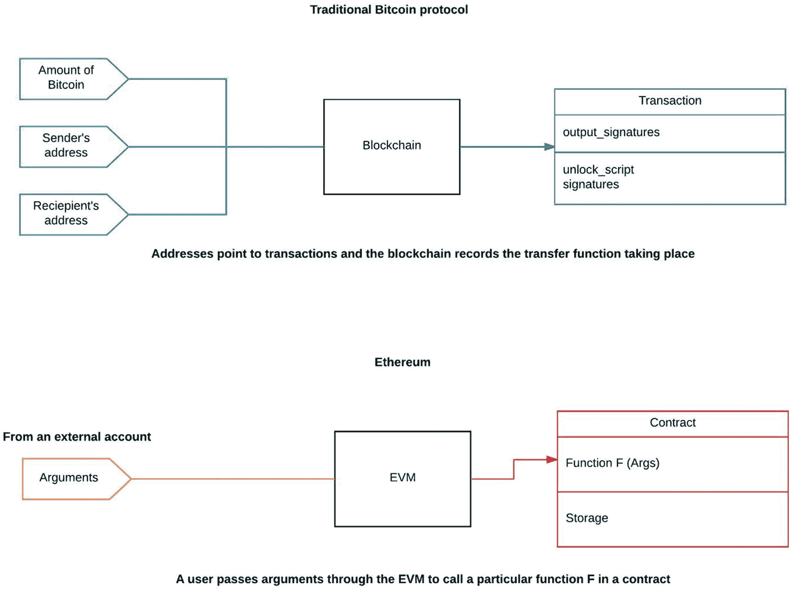
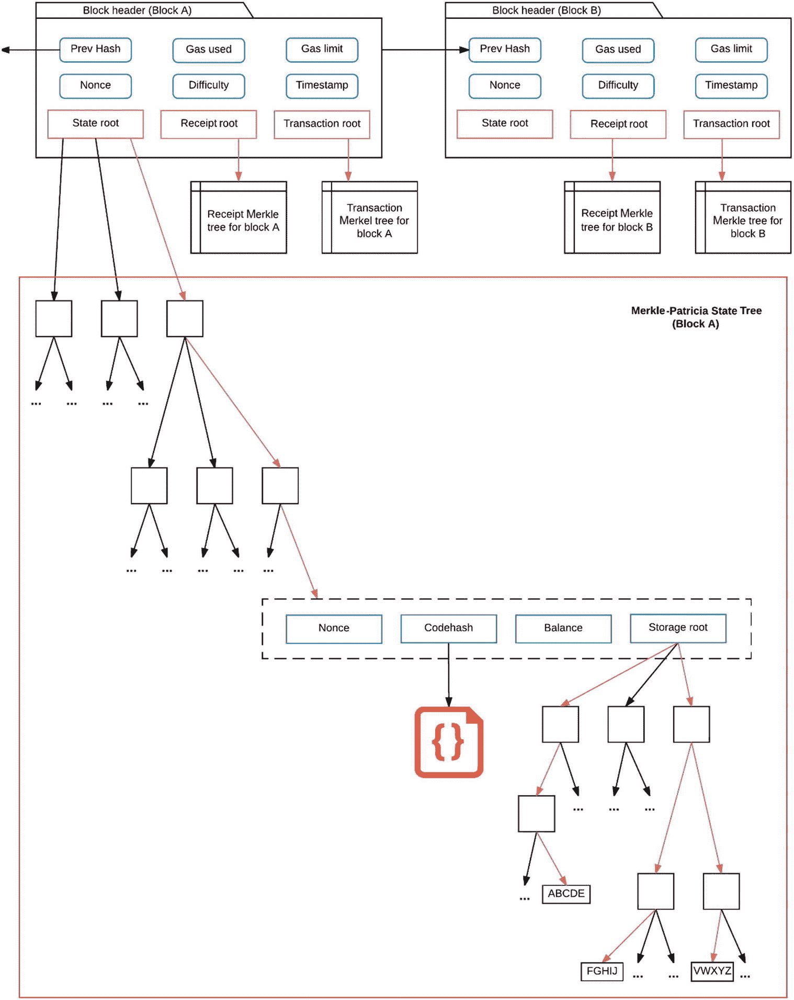
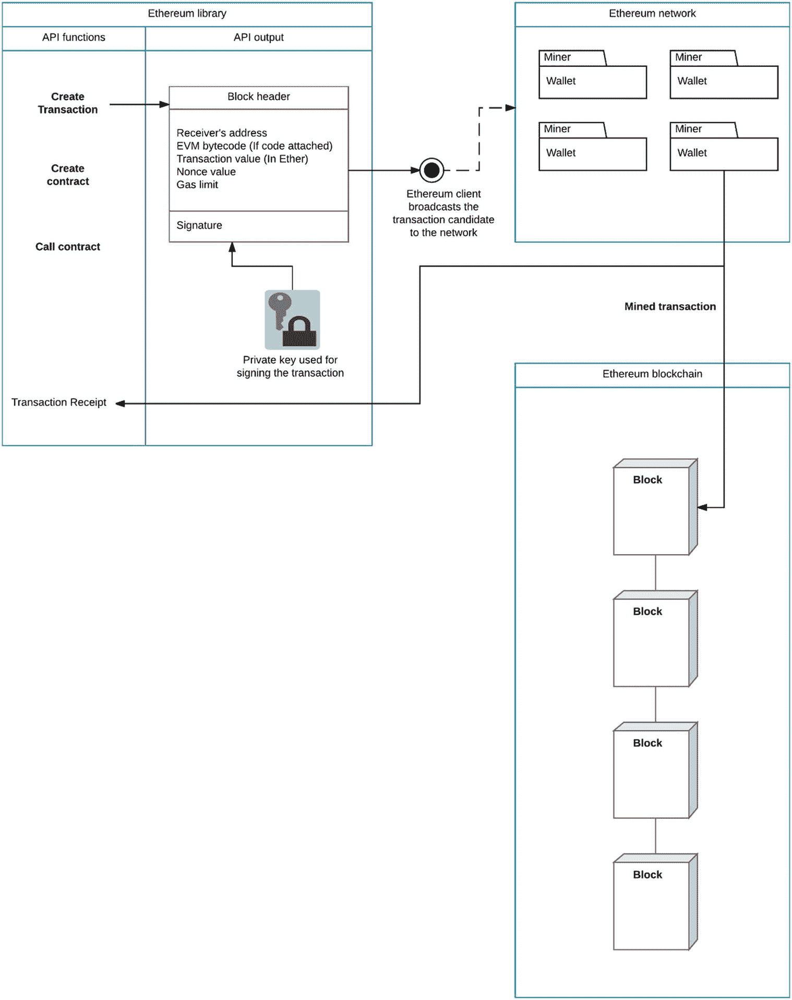
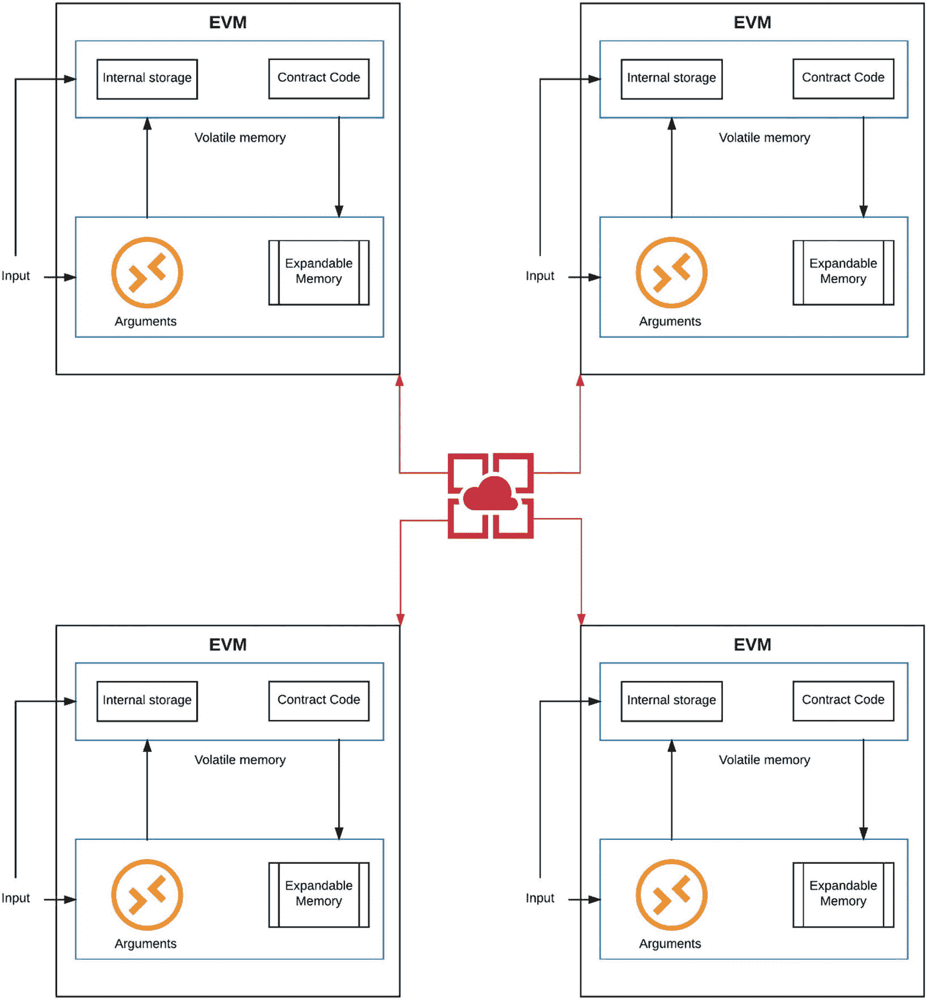
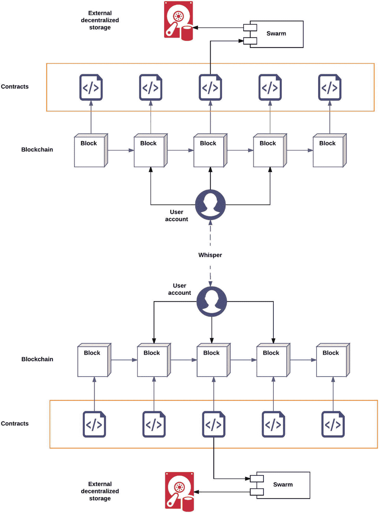
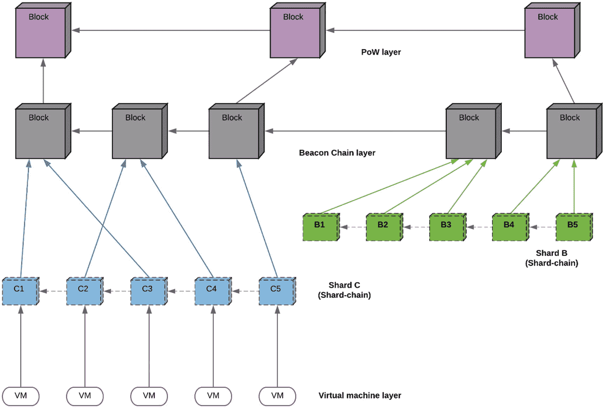
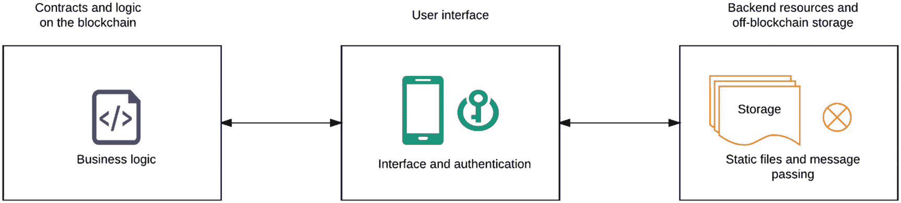
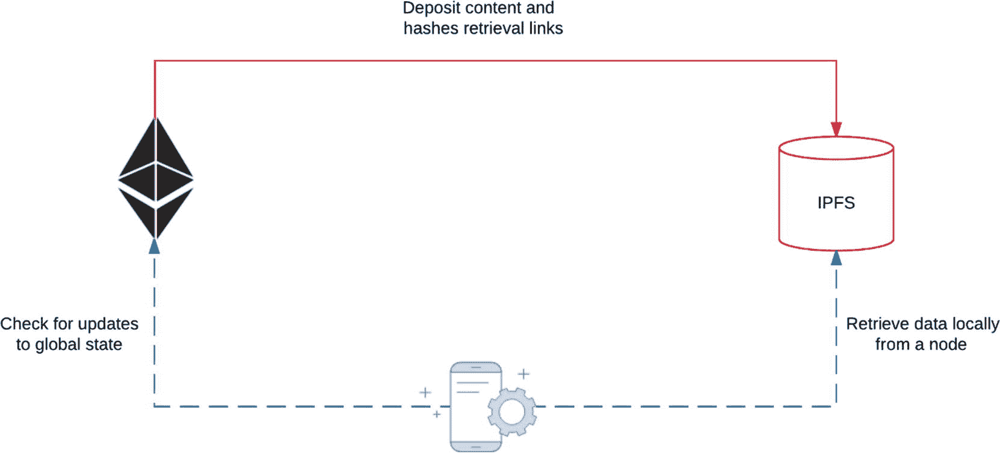

# 4. 解析以太坊

以太坊是一个开源的、去中心化的区块链平台，具备计算能力，它通过脚本语言将基本的货币兑换重构为用户之间的价值转移。以太坊被广泛认为是比特币协议的后继者，它泛化了原始概念，使得更多样化的应用能够构建在区块链技术之上。以太坊包含两个核心组成部分。首先，是一个图灵完备的虚拟处理器，能够计算所需的计算资源并执行脚本，被称为以太坊虚拟机（`EVM`）。第二个组成部分是一种价值代币，称为以太币，它是网络中的货币，用于用户之间的交易或对网络矿工的补偿。

在本章中，我们将首先概览以太坊的架构，并将其与比特币进行比较，重点关注`EVM`和图灵完备性特性。架构部分之后，会简要讨论以太坊中的账户模型以及使用默克尔-帕特里夏树（Merkle-Patricia Trees）进行的账户表示。这将引导我们进入以太坊全局状态表示、账户存储以及 Gas（一种网络中的垃圾信息预防机制）等主题。接着，我们解析`EVM`所支持的智能合约概念、围绕沙盒化可执行代码的安全问题，以及`EVM`如何将可执行代码（字节码）推送到区块链上。之后，我们将介绍 Solidity 和 Vyper——两种用于在以太坊中编写智能合约的编程语言。我们将探讨 Solidity 和 Vyper 的语法，以及当前流行的集成开发环境（`IDE`），并提供一份关键开发者资源的简要清单。接下来，我们聚焦于以太坊中提出的世界计算机模型，并介绍诸如`IPFS`和`Whisper`等支持的分布式技术。然后，我们将审视去中心化应用（`DApps`）的状态，以及以太坊中名为 Mist 的发布平台。这使我们能够过渡到讨论以太坊的第二层更新——这是本章以及 2020 年以太坊生态系统的主要技术焦点。最后，我们以对企业侧的简要讨论来结束本章。在此，我们将介绍一个特别值得关注的进展：由微软在 Azure 云上部署的区块链即服务（`BaaS`）。

## 以太坊概览

大约在 2013 年中，大部分比特币社区开始对区块链上除货币之外的应用想法产生兴趣。很快，在线论坛上涌现了大量新想法的讨论。一些流行的例子包括域名注册、资产保险、投票，甚至物联网（`IoT`）。当这股热潮开始消退后，对比特币协议更深入的分析揭示了可以在其之上构建的潜在应用的严重局限性。

一个关键的争论点是：是否应该允许在区块链上使用完整的脚本语言，还是应该构建逻辑驻留在区块链之外的应用。有两个关键问题引发了这场辩论：

- 比特币协议中的脚本语言和操作码（OPCODES）在设计上功能非常有限。
- 比特币协议本身不具有通用性。虽然有过尝试；例如，Namecoin 是为一个特定任务（域名注册）设计的。当时最大的问题是：如何将协议通用化，使其能够向前兼容我们尚不了解的未来应用？

最终，关于脚本出现了两种思想流派。传统上，中本聪的白皮书提出将脚本语言的功能限制得十分有限。这将避免区块链中存在可执行代码所带来的安全隐患。从某种意义上说，区块链的可执行代码仅限于更新分布式状态所需的一些必要原语。第二种思想流派由维塔利克·布特林（Vitalik Buterin）倡导，他认为区块链不仅仅是一个账本。他设想区块链是一个计算平台，可以使用合约和参数来执行定义明确的函数。这通过以太坊虚拟机（`EVM`）得以实现。`EVM`允许将可执行代码完全隔离，并安全地执行构建在区块链上的应用。我们将在本章稍后部分更详细地讨论这一点。让我们从以太坊背后的核心设计原则开始。

### 核心理念

以太坊不是构建一个支持特定应用的区块链平台，而是要构建一个原生编程语言，该语言具有可扩展性，能够使用该语言在区块链平台上实现业务逻辑。

我们稍后回来理解这一原则的含义。与此同时，让我们讨论一下以太坊的另一个显著特征：共识算法。我们在之前的章节中讨论过共识的概念。在基于工作量证明（`PoW`）的加密货币（如比特币）中，网络奖励那些解决加密难题以验证交易并挖掘新区块的矿工。以太坊提出了一种不同的共识算法，称为权益证明（`PoS`）。在`PoS`算法中，下一个区块的验证者/创建者是基于账户在网络中的权益，以伪随机方式选出的。因此，如果你在网络中的权益越高，被选为验证者的机会就越大。然后，验证者将“锻造”下一个区块，并从网络中获得奖励。在这里，验证者确实是（从铁匠锻铁的意义上）“锻造”一个区块，而不是“挖矿”，因为在`PoS`中，基于硬件的挖矿概念被虚拟权益所取代。使用`PoS`的一个理由是规避`PoW`挖矿算法的高功耗和高能耗要求，这些要求转化为更高的电费，并成为一个常见的抱怨。Peercoin 是第一个采用`PoS`推出的加密货币；然而，最近在 ShadowCash、Nxt 和 Qora 中可以看到更突出的`PoS`实现。图 4-1 突出了比特币和以太坊作为协议之间的主要区别。

以太坊的当前实现（也称为以太坊 1.0）使用工作量证明（`Proof-of-Work`）作为共识算法。然而，以太坊的 2.0 层升级计划将过渡到权益证明（`Proof-of-Stake`）作为主要的共识算法。有关此算法的更多细节将在本章后面提供。

以下是以太坊社区开发者撰写的关于权益证明（`PoS`）的简要总结（[`https://docs.ethhub.io/ethereum-roadmap/ethereum-2.0/proof-of-stake/`](https://docs.ethhub.io/ethereum-roadmap/ethereum-2.0/proof-of-stake/)）:

> **权益证明（`PoS`）是一类依赖验证者在网络中的经济权益的公有区块链共识算法**。在基于工作量证明（`PoW`）的公有区块链（例如比特币和当前以太坊实现）中，算法奖励那些通过解决密码学难题来验证交易并创建新区块（即挖矿）的参与者。在基于权益证明（`PoS`）的公有区块链（例如以太坊即将推出的`Casper`实现）中，一组验证者轮流提议并对下一个区块进行投票，每个验证者投票的权重取决于其存款（即权益）的大小。`PoS`的显著优势包括**安全性、降低的中心化风险以及能源效率**。



图 4-1：比特币和以太坊作为计算平台的概览

聚焦于图 4-1，在比特币协议中，地址映射了从发送方到接收方的交易。区块链上运行的唯一程序是转账程序；给定地址和密钥签名，该程序可以将资金从一个用户转移到另一个用户。以太坊通过在每个节点上部署`EVM`（以太坊虚拟机）来泛化这一概念，使得可验证代码能够在区块链上执行。在此，通用方案是外部账户将参数传递给一个函数，`EVM`将该调用定向到相应的合约并执行该函数，前提是提供了足够的以太币和`gas`。因此，以太坊中的每一笔交易都可以被视为一个函数调用。

## 以太坊中的账户

账户是以太坊中的元结构，也是区块链的基本操作单元。所有以太坊交易都需要一个账户。此外，账户也作为模型来存储和跟踪网络中用户的信息。网络上有两种类型的账户：

*   **用户账户：** 这些是用户控制的账户，也称为外部账户。这些账户拥有以太币余额，由公私钥对控制，可以发送交易，但没有关联的代码。以太坊网络中的所有操作都由外部账户发起的交易触发。在比特币协议中，我们称这些仅为地址。账户与地址之间的关键区别在于以太坊中能够包含和执行通用代码。

*   **合约：** 这本质上是由其自身代码控制的账户。合约账户是驻留在区块链上的以太坊功能程序单元。该账户拥有以太币余额，关联有代码，可以在收到来自其他账户的交易时执行代码，并能操作其自身的持久化存储。(区块链上的每个合约都有其唯一可以写入的存储空间；这被称为合约的状态)。网络上的任何成员都可以创建包含任意规则的应用，并将其定义为一个合约。

如果账户扮演如此关键的角色，它们在区块链上是如何表示的呢？账户成为默克尔树（`Merkle trees`）的一个元素，而默克尔树又成为每个区块头的一个元素。以太坊使用了一种修改版的二叉默克尔树，称为默克尔-帕特里夏树（`Merkle-Patricia trees`）。对默克尔-帕特里夏树（[`http://www.emsec.rub.de/media/crypto/attachments/files/2011/04/becker_1.pdf`](http://www.emsec.rub.de/media/crypto/attachments/files/2011/04/becker_1.pdf)）的完整解释已超出本文范围；然而，图 4-2 提供了一个图形摘要。

> **注意**
> 这里解释的双账户系统可能不会在以太坊中长期存在。最近，越来越多地推动采用单一账户模型，即通过合约来实现用户账户。



图 4-2：区块 A 和区块 B 的区块头及默克尔-帕特里夏树概览

在图 4-2 中，区块头包含一些标准定义，用于广播网络的状态。此外，以太坊中的每个区块头都包含三个针对不同对象的默克尔-帕特里夏树：交易（函数调用）、收据（函数调用的结果，记录每个交易的效果）以及状态对象。二叉树在管理交易历史方面很有用；然而，状态有多个需要更频繁更新的组件。图中所示的默克尔-帕特里夏树包含一个状态根，进一步记录多个账户对象。其中一个深层分支指向一个虚线框，其中包含定义账户的四个参数。根据这些参数，账户余额和网络中的随机数经常被更新。因此，需要一种更合适的数据结构，使我们能在插入、更新、编辑或删除操作后快速计算出新的树根，而无需重新计算整棵树。这种修改后的默克尔树允许快速查询诸如以下问题：此账户是否存在？此交易是否已包含在特定区块中？我账户的当前余额是多少？值得注意的是，余额仅与外部账户相关，同样，`codehash`（包含可执行代码）仅适用于合约。`Storage root`是最后一个参数，包含用户上传到区块链的数据，或作为合约可用的内部存储空间。此内部存储空间可以由合约在执行阶段更新。接下来我们深入讨论这些账户参数。

### 状态、存储与燃料

我们曾简要提及合约可以操作自身的存储并更新状态，那么什么是*状态*？回想一下，在比特币协议中，用户和交易的数据被构架并存储在 UTXO（未花费交易输出）的上下文中。以太坊则采用了不同的设计策略，使用状态对象。本质上，状态存储了一个账户列表，每个账户都有余额，以及区块链特定信息（代码和数据存储）。如果发送账户有足够余额支付交易（避免双重支付），则该交易被视为有效，因此发送账户会被扣款，接收账户会收到对应价值。如果接收账户关联了代码，则该代码会在收到交易时执行。合约或账户关联代码的执行可能对状态产生不同影响：内部存储可能被改变，代码甚至可能创建发送到其他账户的额外交易。

以太坊在网络中区分了状态和历史。状态本质上是特定时间点关于网络状态和账户的当前信息快照。而历史则是区块链上所有已发生事件的汇编，例如函数调用（交易）以及由此带来的变化（收据）。以太坊网络中的大多数节点都保存状态记录。更正式地说，状态是一种包含键值映射（`KVM`）的数据结构，用于将地址映射到账户对象。每个账户对象包含四个值：

- 当前`nonce`值
- 账户余额（以`ether`为单位）
- 代码哈希，合约情况下包含代码，外部账户则为空
- 存储树根，即包含存储在区块链上的代码和数据的`Merkle-Patricia`树的根节点

接下来，我们来谈谈以太坊中的燃料。燃料是跟踪以太坊执行成本的内部单位。换句话说，它是在区块链上执行一次计算的微交易费用。对于像以太坊这样的计算平台，由于停机问题：无法判断一个程序是会无限运行，还是只是运行时间很长，因此在运行代码时燃料变得至关重要。燃料为运行时间设置了限制，因为用户必须为执行合约的逐条指令付费。微交易的性质使得步骤的执行成本非常低廉，但对于非常长的运行时间，这些交易成本也会累积起来。一旦合约提供的燃料耗尽，用户就必须支付更多燃料才能继续执行。对于占用存储的操作，还会收取特殊的燃料费用。

存储、内存和处理等操作在以太坊网络中都需要消耗燃料。那么，接下来我们来谈谈存储。在以太坊中，外部账户可以使用合约将数据存储在区块链上。合约会管理上传和存储过程；然而，当前可存储的数据类型非常有限。一个自然的问题是：向以太坊区块链上传内容和信息有什么限制？什么能防止区块链膨胀？事实证明，目前有两种机制可以防止数据过载：

- 每个区块的燃料上限，决定了每个区块在存储/计算操作上可以消耗多少燃料
- 用户为存储数据所需购买的燃料所需的金额

第二个限制通常会阻止用户直接在区块链上存储数据。相反，使用像 STORJ 或`IPFS`这样的第三方去中心化服务进行存储，并将存储位置的哈希值放入以太坊合约中以包含在合约内，会变得更加高效和经济。未来，新的分布式存储应用将允许上传各种数据文件并将其包含在区块链上的合约中。

让我们总结一下到目前为止讨论的内容。我们从比特币和以太坊之间的差异开始，涉及使用账户、为操作收取燃料费、直接在区块链上存储数据、允许在区块链上执行代码、状态对象以及`Merkle-Patricia`树。图 4-3 提供了以太坊中发生的过程的简化功能概述。



图 4-3：以太坊网络的简化概述

在图 4-3 中，大致有三个以太坊组件需要讨论：`API`、网络和区块链。以太坊`JavaScript API`（也称为`web3.js`）提供了丰富的功能集，用于构造交易和合约、引用函数以及存储收据。像`Mist`这样的增强型以太坊钱包客户端可以通过`GUI`接管其中的一些功能。一旦候选区块构建完成，它就会由以太坊客户端广播到网络。网络上的验证者确定交易是否有效，以及任何与交易或合约关联的代码（在区块中）是否有效。验证完成后，验证者执行关联的代码并将其应用于当前状态。该区块被广播到网络，矿工将“锻造”该区块；然后经过验证的区块被添加到区块链中。此步骤还会为区块中包含的每笔交易创建交易收据。新区块还提供对状态对象的更新，以及从当前区块到新区块的状态树的关系链接。

> **注**
>
> 什么能防止以太坊网络被微小、未使用的合约所膨胀？目前，没有控制合约生命周期的机制；然而，目前有一些关于临时订阅制合约的建议。未来，可能会出现两种不同类型的合约——一种具有永久生命周期（创建和计算成本显著更高），另一种则运行到其订阅到期为止（更便宜且临时，订阅到期后自毁以防止杂乱）。

### 以太坊虚拟机

从形式上讲，以太坊虚拟机（`EVM`）是以太坊中智能合约的运行时环境。合约使用高级语言（例如 Solidity）编写，然后通过`EVM`中的解释器编译成`字节码`。随后，该`字节码`通过以太坊客户端上传至区块链。合约便以此可执行的`字节码`形式存在于区块链上。`EVM`被设计为与外界环境及网络其余部分完全隔离。在`EVM`内部运行的代码无法访问网络或任何其他进程；只有编译为`字节码`后，合约才能与外部世界及其他合约进行交互。

从运行的角度来看，`EVM`就像一个大型的去中心化计算机，拥有数百万个能够维护内部数据库、执行代码并通过消息传递相互通信的对象（账户）。然而，这个模型并非尽善尽美。在以太坊中，这个概念常被称为“世界计算机”的理念。我们回到`EVM`上代码执行的话题，以及它如何与共识机制紧密相连。`EVM`允许网络上的任何用户在一个无需信任的环境中执行任意代码，在此环境中结果完全确定，且执行过程可被保证。在仅执行读取功能的简单合约中，不会发生任何账户编辑，所有账户的状态保持不变。但正如之前所述，任何用户都可以通过从外部账户发送交易来触发一个操作。这里可能产生两种结果：如果接收方是另一个外部账户，那么该交易将仅转移一些以太币，不会发生其他操作。然而，如果接收方是一个合约，那么该合约将被激活并执行其内部代码。在网络内执行代码需要时间，并且这个过程相对缓慢且成本高昂。对于可执行指令的每一步，用户都需要支付`gas`。当用户通过一笔交易发起一次执行时，他们需要承诺一个为该合约或代码支付`gas`的货币上限。

**提示**

以太坊近期已开始迁移至即时编译虚拟机（`Just-In-Time VM`），这将在`gas`消耗和性能方面提供一些优化。

`EVM`的结果具有确定性意味着什么？其关键在于，对于同一个合约代码的相同输入，每个节点都必须达到完全相同的最终状态。否则，执行合约代码以验证交易的每个节点最终会得到不同的结果，共识便无法达成。正是`EVM`的这种确定性本质，使得每个节点都能就合约的执行结果及账户的相同最终状态达成共识。执行合约的节点就像钟表内部同步运动的齿轮，它们和谐运作，最终达到匹配的最终状态。一个合约也可以引用其他合约，但不能直接访问其他合约的内部存储。每个合约都在一个专用的、私有的`EVM`实例中运行，该实例只能访问某些输入数据、其内部存储、区块链上其他合约的代码，以及各种区块链参数，例如最近的区块哈希。

网络上的每个全节点都会为每笔交易同步执行合约代码。当一个节点正在验证一个区块时，交易会按照区块指定的顺序依次执行。这是必要的，因为一个区块可能包含多个调用同一合约的交易，而该合约的当前状态可能依赖于代码执行过程中先前引用所修改的状态。执行合约代码相对昂贵，因此当节点收到一个区块时，它们只会对交易进行基本检查：发送账户是否有足够的以太币来支付`gas`？交易签名是否有效？然后，挖矿节点会执行成本相对较高的交易处理任务，将其包含在区块中，并收取交易费作为奖励。当一个全节点收到一个区块时，它会执行该区块中的交易，以独立验证这些待包含至区块链的交易的安全性和完整性。让我们通过图 4-4 直观地了解一下`EVM`。



**图 4-4** 运行在四个不同节点上的四个以太坊虚拟机实例

在图 4-4 中，四个`EVM`同步执行一个合约的指令，并且一旦执行完成，将到达完全相同的账户状态。这是由于`EVM`的确定性本质所致，这使得合约能够在每一指令步骤上跨越整个网络达成共识。`EVM`的运行逻辑非常直观：它有一个唯一的运行循环，该循环会尝试逐步执行指令。在此循环内，会为每条指令计算`gas`，并在必要时扩展已分配的内存。该循环将持续运行，直到虚拟机要么收到指示成功执行的退出代码，要么抛出异常（例如`out-of-gas`）。

### Solidity 与 Vyper 编程语言

`Solidity` 是一种高级的、面向合约的编程语言，用于在以太坊上编写智能合约。任何用 `Solidity` 编写的代码，在编译为字节码（即 `EVM` 的指令集）后，都可以在 `EVM` 上执行。字节码如何编码执行过程中调用的其他函数和合约的引用？这是通过应用程序二进制接口（`ABI`）实现的。通常，`ABI` 是两个程序模块之间的接口：机器级指令与人类可读的高级编程语言。我们来将这个答案拆解为三个部分：

- `合约`：合约就是用形式语言（如 `Solidity`）定义的高级代码。
- `编译后的合约`：合约被转换为字节码，以便在以太坊虚拟机（`EVM`）上执行，并遵循编译器的规范。请注意，函数名和输入参数在编译过程中会被哈希和混淆。因此，要让另一个账户调用某个函数，该账户必须能访问给定的函数名和参数，我们需要另一层接口来对接进入和离开字节码的编码过程。
- `应用程序二进制接口（ABI）`：`ABI` 是以 JSON 格式列出的合约函数定义及其参数列表。函数定义和输入参数会被哈希处理并纳入 `ABI` 中。它被包含在交易的数据中，并由目标账户的 `EVM` 进行解释。`ABI` 是必要的，通过它，你既可以指定要调用合约中的哪个函数，也能确保该函数将返回你期望格式的数据。

`Solidity` 为 Visual Studio 提供了一个插件，帮助你在这个强大的 IDE 中编写智能合约，并将其部署到以太坊网络上。我们在这里对 `Solidity` 的讨论不会涉及高级的实现或定义。相反，我们将把后续的讨论限制在基础内容上，例如存储变量和创建简单的合约。让我们开始吧：

```
/* 定义一个合约 */
contract ExampleStorage {
    uint storedNumber; // 无符号整数（uint）用于声明状态变量
    /* set 函数可以修改状态变量的值 */
    function set(uint x) {
        storedNumber = x;
    }
    /* get 函数可以检索状态变量的值 */
    function get() constant returns (uint retVal) {
        return storedData;
    }
}
```

这个存储合约允许用户将一个整数作为状态变量 `storedNumber` 进行存储，然后使用 `get()` 和 `set()` 函数修改或检索其值。`Solidity` 还提供了现代编程语言中可用的若干高级特性，例如（合约的）继承、函数重载和类接口。接下来，让我们看一个更复杂的合约示例。这次我们将使用 `Solidity` 创建一个简单的银行合约：

```
// 这个银行合约允许存款、取款和查询余额
// 'contract' 是用于声明类的关键字，类似于其他面向对象编程语言
contract SimpleBank {
    // 'mapping' 是一个将地址对象映射到余额的字典
    // 'private' 意味着其他合约不能直接查询余额
    mapping (address => uint) private balances;
    // 'public' 使其对区块链上的用户或合约外部可读
    address public owner;
    // 事件会在整个以太坊网络中触发消息
    event LogDepositMade(address accountAddress, uint amount);
    // 构造函数
    function SimpleBank() {
        // msg 提供了发送给合约的消息的详细信息
        // msg.sender 是合约创建者的地址
        owner = msg.sender;
    }
    // 向银行存款以太币
    // 返回用户存款后的余额
    function deposit() public returns (uint) {
        // 将存入的金额加到账户余额中
        balances[msg.sender] += msg.value;
        // 记录刚刚进行的存款操作
        LogDepositMade(msg.sender, msg.value);
        // 返回存款后的余额
        return balances[msg.sender];
    }
    // 从银行提取以太币
    // withdrawAmount 是你想要提取的金额
    // 返回用户剩余的余额
    function withdraw(uint withdrawAmount) public returns (uint remainingBal) {
        /* 如果账户余额大于或等于请求提取的金额，则从余额中减去该金额 */
        if(balances[msg.sender] >= withdrawAmount) {
            balances[msg.sender] -= withdrawAmount;
            // 如果发送失败，则将金额加回原账户余额
            if (!msg.sender.send(withdrawAmount)) {
                balances[msg.sender] += withdrawAmount;
            }
        }
        // 返回提取后的剩余余额
        return balances[msg.sender];
    }
    // 返回用户的余额
    // 'constant' 防止函数修改状态变量；
    function balance() constant returns (uint) {
        return balances[msg.sender];
    }
}
```

尽管这个合约有很多移动部件，但其结构是直截了当的。我们首先声明状态变量，这里我们使用了一种叫做映射（`mapping`）的高级数据类型。然后，我们声明了一个在合约中各处使用的地址变量，以及一个事件记录器。构造函数准备好可用的所有者对象，并附加上所有者对象来接收函数返回类型的消息。构造函数之后有三个函数，它们实现了银行的基本功能。`deposit` 函数将传入的金额添加到余额中。`withdrawal` 函数会检查请求的金额是否低于账户的可用余额。如果是这种情况，则确认取款，并从余额中减去请求的金额。如果余额不足，则本应提取的金额被加回账户，并将最终余额返回给用户。最后，最后一个函数允许我们根据合约请求，在给定时间返回某个账户的余额。现在，我们对 `Solidity` 有了更好的理解，让我们把注意力转向 `Vyper`。

`Vyper` 是一种通用的、面向合约的编程语言，编译后可生成 `EVM`（以太坊虚拟机）字节码，这与 `Solidity` 相似。使用 `Vyper` 的主要设计优势在于，它消除了编写智能合约过程中的诸多障碍，并以易于理解的方式呈现合约。作为通用原则，任何需要在 `EVM` 上运行的代码都必须非常高效，以最大限度地减少智能合约执行所需的 Gas。必须注意，编写不佳的合约执行成本会更昂贵，甚至可能高得令人望而却步，导致 `EVM` 终止该合约。为此，`Vyper` 在编写合约时遵循与 `Solidity` 相同的逻辑，但摒弃了面向对象编程范式的需求。`Vyper` 专注于一组有限的定义，这些定义仅适用于在区块链上进行微交易编程。让我们来讨论一下 `Vyper` 的主要特性：

- `Vyper` 不包含程序员熟悉的大部分面向对象编程结构：类继承、函数重载和递归功能已被移除。这些特性对于图灵完备性并非必需，并且会通过增加代码复杂性带来安全隐患。代码审查对于评估智能合约至关重要；然而，增加复杂性会进一步加大审计过程的难度。简化则能带来更可靠的审计。

- 编写更易于理解的代码也能降低出错的可能性。从 `Vyper` 比 `Solidity` 提供更高安全性的角度来看，这种额外的安全层是通过开发者的编码实践来强制实现的。即便限制了如设置 Gas 使用上限和溢出检查等功能，用 `Vyper` 编写的智能合约在可读性、可审计性和简洁性（因而也是安全性）方面依然表现出色。

- `Vyper` 提供了一组用于编写智能合约的内置函数，虽然全面审查这些函数超出了本章的范围，但我们想重点介绍 `assert` 函数。如果某个条件未满足，`assert()` 会抛出一个错误。它通常用在方法开头，以检查方法是否满足特定条件以便继续处理。如果不满足，交易将被回滚，合约终止。例如，想象一个众筹场景，可以通过检查时间戳来使用 `assert()` 回滚合约。如果以太坊区块链上当前区块的时间戳超过了活动的截止日期，那么合约就应该终止，因为活动已经结束了。这样，`assert()` 就成了一个非常简洁的函数，用于对合约代码施加条件。

## 开发者资源

随着以太坊在过去几年中的发展，开发者使用该平台构建应用程序的兴趣也与日俱增。在本节中，我们将介绍一些可用于在以太坊生态系统中进行快速原型开发的开发者资源：

- `Remix`：一个基于网页的 IDE，用于在以太坊上更快地编写和测试智能合约。它内置了对使用 `Solidity` 和 `Vyper` 编写合约的支持、用于扩展功能的插件管理器、单元测试以及一个区块链虚拟机。

- `Ethereum Studio`：另一个基于网页的 IDE，适合新开发者学习如何构建和部署智能合约。`Ethereum Studio` 提供了项目模板、交易日志记录器以及一个内置的以太坊虚拟机，用于在以太坊平台上进行快速原型开发。

- `OpenZeppelin SDK`：一套智能合约工具包，帮助构建、编译和部署智能合约，并在部署后与之交互。

- `Embark`：一个用于构建去中心化应用（DApp）和智能合约的开发者平台。拥有用于部署合约的命令行界面、插件系统、交易浏览器以及一个活跃的开发者社区。

- `ConsenSys Academy`：一个自定进度的在线以太坊开发者课程，全年开放报名。更多关于教育资源的内容将在后续章节介绍。

- `Ethereum Stackexchange`：一个社区，可以提出任何与以太坊相关的问题，从平台开发到入门指南。

- `Chainshot`：一个受邀参加的区块链开发训练营，专注于以太坊智能合约，其课程设置侧重于实际应用。

### 世界计算机模型

以太坊项目怀揣着一个宏伟愿景：成为由数百万账户驱动的共享世界计算机，这些账户由区块链提供支持，而区块链则成为通信“智能日志”的后端，提供待执行去中心化逻辑的合约，以及充当执行平台的 `EVM`。但计算和处理能力并不足够；一台计算机还必须能够存储信息，并允许应用程序之间建立通信机制。这台世界计算机将运行在互联网 3.0 时代，由于信息流的去中心化特性，服务器将不再被需要。在这个雄心勃勃的尝试中，以太坊区块链只是世界计算机模型的四分之一。让我们介绍其他三个组成部分：



图 4-5

以太坊世界计算机模型的分层方法

- `Whisper`：一种安全的消息传递协议，允许区块链上的去中心化应用程序相互通信。此协议依赖于混淆和匿名化，类似于 `Tor` 项目（提供匿名网页浏览），其中有关消息内容、发送者和接收者的详细信息都会被隐藏。此外，这些信息无法通过数据包分析来收集。`Whisper` 协议建立在 `RLPx` 传输协议之上，这是一种基于 TCP 的传输协议，由以太坊节点内部用于通信。在许多情况下，DApp 需要通过消息总线进行通信；例如，宣布虚拟资产的限时抢购。`Whisper` 通过使用信封（由 `Whisper` 节点发送和接收的加密数据包）来实现轻松广播。为此，为避免垃圾信息，`Whisper` 节点必须使用工作量证明函数来发送消息。完成的工作量与所发送广播的大小成正比。最终，`Whisper` 将为用户账户之间或代表用户账户运作的应用之间提供自动化的通信手段，如图 4-5 所示。

- `Swarm`：一种去中心化的存储和分发服务，用于 DApp 代码、用户数据、区块链数据和状态数据，可供以太坊区块链使用。未来，`Swarm` 将能够提供 Web 3.0 服务，如媒体流、去中心化数据库和状态通道。`Swarm` 试图解决的主要问题是，目前在区块链上存储大量数据的成本仍然非常高昂。这就是为何任何需要存储的 DApp 都使用链下替代方案。`Swarm` 背后的理念很简单：利用协作节点的点对点网络来汇集资源。这个 P2P 网络充当一个分布式云存储系统，具有充足的数据冗余机会。该网络是自我维持的，因为相关的区块链可以根据资源交易来激励节点以获得报酬。`Swarm` 存储协议有三个主要组成部分：数据块、引用和清单。数据块是 `Swarm` 中存储和检索的基本单位：最大容量为 4K 的数据片段，链接到一个地址。引用是文件的唯一标识符，前端客户端可以使用它来检索内容。最后，清单是一种数据结构，它描述了一个文件集合以及用于检索内容的路径和相应哈希值。使用 `Swarm` 可以在网络间分布数据，并以去中心化的方式（使用节点）复制冗余数据，而无需托管集中式服务器。可以激励网络中的多个节点复制数据块并使用清单来引用数据，这很像 RAID 配置，从而消除了托管集中式服务器的需要。

- `智能合约`：以太坊平台的最后一个主要支柱。提供对区块链的编程式访问，并提供逻辑框架来驱动最终将在世界计算机上运行的应用程序。

在图 4-5 中，我们看到了世界计算机模型的分层方法。世界计算机上的用户账户（或简称为用户）是基本实体，因此它们是第一层。第二层是区块链，它充当网络中不同组件之间的通信串行总线；这是第二层。第三层是称为智能合约的逻辑框架，它存在于区块链上，为世界计算机提供计算能力。其中一些合约可能需要外部存储来输出结果，并使用 `Swarm` 来协调存储；这是第四层。最后，回顾第一层，我们有名为 `Whisper` 的消息传递协议，用于促进用户对用户或应用对应用的通信。世界计算机和互联网 3.0 的概念不仅仅是哲学愿景或技术蓝图，它对于内容如何在网络上被控制和分发具有深远影响。以太坊的 Taylor Gerring 非常雄辩地（[`https://blog.ethereum.org/2014/08/18/building-decentralized-web/`](https://blog.ethereum.org/2014/08/18/building-decentralized-web/)）讲述了构建这个梦想：

> *随着以太坊生态系统的经济性日益成熟，使得针对最低费率存储的开放合约得以发展，内容托管的自由市场可能会演变。鉴于 P2P 应用的性质和动态，热门内容将随着群体共享而轻松扩展，而不是遭受孤立服务器的不堪重负。最终结果是热门内容的传输速度更快，而非更慢。*

> *这种蜕变将为开发者提供机会，去构建下一代去中心化、私密、安全、抗审查的平台，将控制权交还给下一个伟大创意的创造者和消费者。任何有梦想的人都可以自由地在这一类新型的下一代去中心化网络服务之上进行构建，而无需拥有信用卡或注册任何账户。*

> *尽管没有人告知或期望我们这样做，但我们有责任珍惜并改善那些某些人试图扰乱、操纵和控制的共享资源。正如没有人能完全理解新兴的互联网集体智慧一样，我们也不应期望任何单一实体能够完全理解或维持完美一致的动机。相反，我们应该依靠互联网来解决互联网的问题。*

### 第 2 层升级

本章迄今为止描述的经典以太坊协议和网络属于第 1 层。为了达到理想的世界计算机模型，需要可扩展性和安全性升级，以便更多应用程序可以与区块链交互，并且可以执行复杂代码。这些升级都属于第 2 层，将于 2020 年开始推出。我们在此讨论第 2 层的四个组成部分：分片、信标链、状态通道和 Plasma。对各组成部分的解释将按顺序引出下一个组成部分。

#### 分片

区块链协议运行必须依赖三大要素：去中心化（定义为缺乏中心化验证权威机构）、可扩展性（定义为能够处理更多交易并具备高吞吐量）以及安全性（广义定义为所有节点都在同一网络副本上运行）。所有区块链实现都受困于一种称为“可扩展性三难困境”的现象，即三大要素中只能成功部署两项。以太坊必须进行 Layer 2.0 更新，才能实现可扩展性并突破这一困境。

目前，在所有已知的区块链协议中，每个节点都必须存储整个网络状态（描述账户余额和合约代码的数据），并且每个节点都必须处理所有交易。这提供了高度一致性，但也造成了限制可扩展性的瓶颈：区块链处理的交易量无法超过单个节点。这带来了实际后果；例如，比特币每秒只能处理三到七笔交易。为了消除这一瓶颈，我们需要面对以下问题：能否设计一种机制，让只有一小部分节点验证交易，同时仍能保证整个网络的安全？其思路是将交易处理任务分割给较小规模的节点组，这些节点组可以并行验证每笔交易。即使每个节点组一次只验证一笔交易，并行执行也能带来惊人的可扩展性优势。

分片正是试图解决这一设计问题的方案。在该方案中，以太坊的状态和历史记录被分割成更小的分区，我们称之为分片。本质上，分片就是将大型数据库（在此场景下即区块链）划分为更小、更高效的分片，从而使整个网络更具可扩展性。分片是一个自我管理的分区，拥有自己的交易历史。在简单的分片形式中，分片内包含的交易仅限于该分片。例如，一个 DApp 可以将一组地址映射到整个分片，因此与该 DApp 相关的所有交易都将保留在该分片中。结果，整套垂直业务和应用都可以在一个分片上运行。

#### 信标链

Hsiao-Wei Wang 提供了以太坊 2.0 系统的整体架构图，如图 4-6 所示。



图 4-6 以太坊 2.0 的架构组织

- **PoW 链**: 这是以太坊目前在线并运行的部分。在以太坊 2.0 系统中，该层将继续保持原样运行，并在其之上添加新层。
- **信标链**: 以太坊 2.0 中的权益证明部署。目前正在开发中，将是首个交付的组件。
- **分片**: 分片链是分片以及属于该分片的所有交易的复合体。这实现了信标链的可扩展性。最初将开启一个有限的运行时间，在此期间分片将聚合交易并对交易顺序达成共识，但不执行它们。
- **虚拟机**: 虚拟机层将为以太坊 2.0 平台上的合约和交易提供计算和执行能力。

为什么我们需要信标链？信标链的主要功能是为以太坊区块链及其附属的所有分片（具体来说是分片链）实现并管理权益证明协议。为此，信标链需要管理以下方面：管理验证者、为每个分片指定区块提议者、将验证者组织成委员会以对提议的区块进行投票，最后对验证者应用奖励和惩罚。“信标链”这个名字源于一个提供随机性来源的 NIST 随机信标发生器；我们稍后会看到为什么随机性这一属性对网络如此重要。

##### 管理验证者

在传统的 PoW 算法中，任何用户都可以使用自己的硬件成为矿工。然而，在以太坊 2.0 中，用户需要质押他们的以太币（ETH）来激活验证者。需要注意的是，验证者是虚拟的，由提交以太币的质押者激活。每质押 32 ETH，就会激活一个验证者。信标链的一个主要功能是维护一套验证者：这些节点已质押了所需的 32 ETH，现在负责运行以太坊 2.0 协议。

节点可以通过将其质押发送到工作量证明链（当前的以太坊区块链）上的一个合约来加入验证者集。经过初步的有效性检查后，提交的质押被冻结，合约会广播一个所有信标链客户端都能接收到的公告。此时，该节点被认为已加入信标链上的验证者集。一旦节点激活，该验证者就能在信标链选中时通过提议区块参与到以太坊 2.0 协议中，并加入对区块进行投票的委员会。

##### 区块提议者

在工作量证明协议中，最先解决挖矿难题的节点可以组装/挖掘下一个区块。然而，在权益证明中，不涉及挖矿。区块提议者本质上是一个被伪随机选中来构建区块的验证者。为了选取验证者，需要这种随机性的来源，因此有了信标链这个名字。

信标链为整个以太坊 2.0 网络提供了节奏。它在网络上每十六秒生成一个区块，而工作量证明协议则是不规则地生成区块，平均大约每十五秒一个。这十六秒的周期称为时隙，每个时隙都是向信标链添加一个区块的机会。对于每个时隙，信标链中选定的区块提议者收集来自验证者集对先前区块的所有投票，锻造区块本身，并将其发布到区块链上。未来，每个分片在时隙开始时都会有自己的提议者。这个分片区块提议者将收集该分片的所有交易，并将其组织成区块以供开始投票。

##### 委员会

在以太坊 2.0 区块链的这个新权益证明协议中，一个关键的安全来源是各个委员会，它们负责投票决定哪些区块将被添加到区块链，并形成链的真实历史。信标链依赖计算其自身委员会的投票（也称为证明）来就区块达成共识并将其添加到区块链。该委员会由系统中的验证者组成，它们收集的证明共同创造了信标链的历史。未来，将会有创建更小子委员会的条款，这些子委员会一次只管理一个分片。这将允许子委员会确认来自分片的区块提议者，并保持历史记录的一致性。

##### 奖励与惩罚

信标链的一项重要管理职责是跟踪和更新验证者在加入验证者集时所质押的存款。为此，验证者因维护网络共识和诚信行事而获得奖励，这激励他们参与区块委员会。如果验证者拒绝遵守验证者集制定的规则，他们可能会受到惩罚：他们最初质押的 32 ETH 将被罚没，或者验证者可能被驱逐出系统。此外，如果验证者的余额低于 16 ETH，信标链将将其从验证者集中移除。

### 状态通道

状态通道是一种通用模型，用于思考区块链上发生但可以在不影响网络安全性的情况下转移至链下的交互。比特币中一个经过充分研究的状态通道实例是支付通道：双方之间即时、无摩擦的支付交易，无需等待比特币区块链上漫长的确认周期。广义而言，状态通道的概念可应用于区块链协议上任何改变状态的交互。在不削弱安全性的前提下，将部分交易或区块链交互转移至链下，可以显著提升网络速度。

状态通道包含三个基本组件：

- **锁定机制**：区块链状态的一部分通过多重签名智能合约锁定，使得特定的一组用户必须完全同意该合约才能更新它。
- **链下操作**：链下用户通过签署交易并构建可提交至主区块链的区块来更新本地状态。这些交易在支付状态通道中聚合并本地更新。
- **解锁机制**：参与者将支付通道的聚合状态提交至区块链，若满足合约条件，则根据第一步在区块链上解锁该状态。

在此，第一和第三组件用于锁定和解锁全局状态的一个分区，被视为区块链操作。然而，第二组件可以完全在链下完成，并可能涉及大量交易/更新。这些更新可以快速进行，并在支付通道上保持内部一致性，而无需涉及区块链。这一步提供了可扩展性和巨大的性能优势。通过这种方式，只有第一和第三步需要发布到网络并在区块链上确认。中间的交易则可以在状态通道上以更快的速度执行。

### Plasma

`Plasma` 是一个框架，用于在链下进行交易，同时利用以太坊区块链的共识和安全机制来同步这些交易。`Plasma` 链是部分独立的子链，它们注册到以太坊主区块链上。这些子链可以将交易批量提交至以太坊主区块链。通过这种方式，主区块链对计算能力的部分交易需求得以缓解。节点现在可以将这些计算能力用于合约和其他更高层次的任务。`Plasma` 更进一步扩展了支付通道的概念，允许创建依附于以太坊主区块链的子区块链。这些子链又可以衍生出更多的子链。本质上，`Plasma` 是一个框架，用于链接到一条主区块链（此处是以太坊区块链）的多条分支区块链。

在安全性方面，基于 plasma 的链依赖以太坊主区块链来实现共识和一致性机制。用户可以依赖以太坊网络所提出的安全措施，来赎回在子链上决定的任何资产。`Plasma` 链使用 `MapReduce` 结合默克尔树结构来确保交易验证并检测欺诈。此外，在 plasma 链中持有权益的成员会进行自我监管和监控。如果出现任何争议，他们可以向以太坊主区块链提交时间戳或恶意行为证明以供解决。`Plasma` 链还包含另一种防欺诈机制，称为回滚。当双花类活动导致支付或交易失败时，该功能会被激活。当此功能激活时，所有资金都会恢复到网络在试图欺诈之前的状态。在提议的实现中，对于父级以太坊区块链而言，回滚过程在计算上非常廉价，并能提供巨大的安全性。

## 区块链即服务

微软近期宣布与以太坊基金会合作，在其云平台 `Azure` 上推出基于区块链的服务。这种采用基础设施即服务的方式来提供快速简便的区块链实现，将使开发者能够以更低的成本试验新功能并部署 `DApps`。来自 `Azure` 区块链工程团队的 Marley Grey 描述了 `区块链即服务`（`BaaS`）将如何培育一个 `DApps` 生态系统：

> 微软和 ConsenSys 正在合作，在 Microsoft Azure 上提供*以太坊区块链即服务 (E-BaaS)*，使企业客户和开发者能够拥有一个一键式的云端区块链开发者环境。初始产品包含两个工具，支持基于智能合约的应用的快速开发：Ether.Camp——一个集成的开发者环境，以及 BlockApps——一个私有的、半私有的以太坊区块链环境，可部署到公共以太坊环境中。
>
> “由 Microsoft Azure 和 ConsenSys 提供的以太坊区块链即服务”允许金融服务客户和合作伙伴在一个现成的开发/测试/生产环境中低成本地进行试验、学习和快速失败。它将使他们能够利用行业领先的框架非常快速地创建私有、公有和联盟链环境，并通过 Azure 的全球分布式（私有）平台分发他们的区块链产品。这使得 Azure 成为区块链应用的极佳开发/测试/生产环境。周边的功能如 Cortana 分析（机器学习）、Power BI、Azure Active Directory、O365 和 CRMOL 可以集成到应用中，从而催生新一代去中心化的跨平台应用。

关于 `BaaS` 的初步更新是在 2015 年底提供的，目前，一个完整的区块链实验室生态系统正在 `Azure DevTest` 社区中蓬勃发展。`DevTest Labs` 允许用户和开发者探索并测试为特定用例设计的模板。此外，该平台最初从以太坊区块链起步，但最近有更多初创公司开始基于 `Azure` 进行构建，提供诸如 `Emercoin` 的新服务（它提供了 `SSH` 服务），以及 `PokiDot` 及其面向医疗保健的区块链 `Dokchain`。随着时间的推移，越来越多的初创公司将 `Azure` 作为运行区块链并在其上构建应用的标准。随着诸如 `Cortana` 等智能服务的集成，开发能够签署来自外部数据流（如物联网设备）的输入数据并提供一定完整性级别的预言机可能会变得更加容易。

**注意**

微软在 `BaaS` 领域的两项进展在此值得关注。第一项是引入了 `Cryptlets`，这是一种用于与外部事件交互以构建企业级智能合约的安全中间件。第二项进展是 `Coco` 框架，这是一个用于在区块链之上构建高吞吐量网络的开源系统，其中的节点和参与者被明确声明和控制。根据设计，`Coco` 与任何账本协议兼容，并允许企业构建生产就绪的区块链网络。关于微软平台的更多内容将在后续章节中介绍。

## 去中心化应用

我们在讨论 Whisper 时曾提及去中心化应用（或 DApp），但此处将进行更深入的探讨。去中心化应用是一种无服务器应用，运行在以太坊技术栈上，并通过能够调用后端技术栈的 HTML/JavaScript 前端与最终用户交互。传统上，移动或网页应用的后端运行在中心化的专用服务器上；然而，DApp 的后端代码则运行在去中心化的点对点网络上。图 4-7 展示了一个 DApp 在区块链上运行的简化模型。



图 4-7. DApp 的结构

如图 4-7 所示，用户界面通常用 HTML 或 JavaScript 编写，是加载在用户设备上的唯一组件。该界面向后端发起调用，以执行特定合约，并在需要外部存储或应用需要与其他应用通信时，调用如 Swarm 或 Whisper 等后端资源。如果说传统应用由前端和运行后端服务的服务器组成，那么运行在以太坊技术栈上的 DApp 则由前端和运行在区块链上的合约构成。DApp 通常在区块链上拥有自己的一套相关合约，用于编码业务逻辑并持久化存储其共识关键状态。回顾一下，以太坊技术栈上的所有代码都在一个 `EVM` 内运行，它会跟踪每一步操作，并向合约所有者收取燃料费。这防止了 DApp 开发者在区块链上执行过多操作，或因直接在区块链上存储数据而导致其膨胀。

**注意：** 简单回顾一下，DApp 技术栈依赖去中心化存储（由类似 Swarm 的架构提供）来存储用户数据或应用数据，依赖区块链来处理合约逻辑和交易操作，并依赖前端来服务最终用户。前端界面根据用户操作，向区块链上运行去中心化应用的特定合约发起调用。

DApp 的后端如何为前端拉取静态内容（例如从以太坊技术栈获取 JS 到静态内容），并从区块链接收更新的全局状态？让我们看一个使用 IPFS 作为存储的示例，以理解这些后端调用（图 4-8）：



图 4-8. DApp 后端调用的简单示意图

- 后端代码本质上是一个合约，在给予适当资源的情况下在区块链上执行。
- 某些应用需要使用持久化数据库来托管应用中使用的静态内容；我们可以依赖 IPFS，它存储静态文件，并通过网络上的多个节点进行托管。
- 来自 IPFS 的哈希值被传递给 DApp，合约的执行会更新全局状态，然后从以太坊技术栈传递给 DApp。

在图 4-8 中，区块链可以将内容存入某个节点上类似 IPFS 的系统，并使这些哈希值可供应用在必要时检索。应用可以向区块链请求全局状态的更新，因为这会影响在设备上运行的应用。最后，根据需要，应用可以从去中心化存储中检索并将完整内容下载到用户设备。以这种方式划分角色可以实现更具创新性的用户界面，因为开发者可以更换前端而无需更改后端。

### Geth 与 Mist

我们还需要简要讨论另外两个在 DApp 开发中发挥作用的工具。`Geth` 是用于在以太坊网络上运行全节点的命令行界面（用 Go 语言编写）。通过使用 `Geth`，你可以与以太坊区块链交互并执行以下任务：

- 在网络中挖取以太币
- 在地址之间转账
- 创建合约并发送交易
- 使用 `DApps` API

`Geth` 附带了两个用于开发的接口：包含 `web3.js` 库的 JavaScript 控制台，以及 `JSON-RPC` 服务器。让我们简要谈谈这两种技术。`Geth` 可以启动一个交互式控制台，它提供 JS 运行时环境，让你与节点交互。这个运行时环境包含 `web3` 库，可以构建要传播到节点的合约和交易。`JSON-RPC` 服务器是一种远程过程调用（RPC）协议，用于促进节点与其客户端之间的数据交换（JSON 是一种节点用来与客户端通信的数据交换格式）。更准确地说，RPC 是一组方法和规则，定义了数据（命令和输出）如何在节点和客户端之间传输。JavaScript API 使用 `web3.js` 库来提供使用 RPC 方法的便捷接口。

**提示：** 对于当今大多数以太坊应用来说，`Geth` 是作为命令行工具安装的先决条件。通常在安装过程中，`Geth` 会作为附加组件提供，这样用户就不必单独下载并安装它。

`Mist` 是官方的以太坊钱包应用。在早期讨论中，`Mist` 被设想为 DApp 的独立应用商店式浏览器，但这一愿景已经演变。为了与以太坊区块链交互，我们需要一个像 `Geth` 这样的区块链客户端。该客户端负责向网络广播交易、挖取以太币、签署交易和部署智能合约。大多数最终用户不习惯使用命令行界面，因此创建了如 `Mist` 这样的包装器作为前端界面。`Mist` 在后台连接到 `Geth`，并作为钱包软件与用户之间的接口。此外，`Mist` 还提供了编写和部署智能合约或 DApp 的接口。钱包软件无缝集成了部署合约所需的支付功能。

最终，使用 `Geth` 和 `Mist` 在以太坊网络上最强大的实体将是去中心化自治组织（DAO），它们本质上是由运行在以太坊网络上的智能合约驱动的自动化公司。我们在此结束对以太坊的探索之旅，并在下一章继续讨论 DAO。

## 总结

在本章中，我们介绍了以太坊，这是与比特币竞争的最大替代货币之一。近年来，它受到了开发者和投资者的广泛关注。我们首先通过广泛概述以太坊与比特币的对比开始了讨论。我们讨论了作为以太坊基础的账户和函数调用。然后，我们更深入地阐述了账户作为区块链上实体的概念。之后，我们讨论了以太坊上用于智能合约执行的燃料费使用情况，内部存储如何适配默克尔-帕特里夏树，以及账户的内部状态概念。接着，我们探讨了 `EVM` 以及智能合约如何在区块链上执行。然后，我们讨论了使用 Solidity 和 Vyper 编写智能合约的模型，以及用于快速原型开发智能合约的开发者资源。这引出了对世界计算机模型及其在以太坊组件（如 IPFS 和 Whisper）中应用的讨论。最后，本章的主要技术焦点是正在为以太坊网络推出的 Layer 2 升级。我们以对 DApp 和区块链即服务模型的简短回顾结束了讨论，我们将在后续章节中对此进行扩展。