# 5. 去中心化组织

比特币可以被视为首个原型**去中心化自治组织（DAO）**。它创建了一个基于网络的参与者生态系统，大家为同一个目标贡献算力。在比特币中，底层协议创建了一种金融服务，通过奖励提供验证服务的矿工，这种机制成为了一种基础的去中心化组织。在本章中，我们将重点介绍在区块链上使用 Aragon 创建的更复杂的组织。Aragon 是一个去中心化应用程序（DApp），它允许任何人创建和管理以太坊区块链上的各类组织（如非政府组织、非营利机构、基金会）。在以太坊早期，要创建一个 DAO 并实现哪怕是最基本的功能，都需要编写复杂的智能合约和 Solidity 代码。Aragon 简化了此过程。它将组织的基本功能集成在一个基础模板中，每当用户实例化一个公司时，该模板就会被部署。像股权结构表、投票功能、筹款和会计等大多数传统功能，在 Aragon 模板中都作为运行在区块链上的去中心化对等体提供。此外，一个 Aragon 公司可以进行非常精细化的定制，并通过添加新模块来扩展其现有的智能合约。Aragon 使得不同类型的组织能够控制其内置的信任级别。

本章首先介绍去中心化组织的概念。我们将依据拉尔夫·默克尔的理论框架，描述 DAO 运作所需的条件，以及 Aragon 如何将所有理论构造作为应用程序实现。然后，我们将介绍驱动 Aragon 的技术栈以及正在开发的衍生框架。在更好地理解 Aragon 之后，我们将介绍一个使用 Aragon 进行筹款和社会风险投资的特殊案例。这引出了本章的核心内容：全面讲解如何在 Aragon 上创建、设置、部署和管理一个 DAO。本教程包含三个主题。第一个主题向读者展示如何设置 MetaMask——一个用于连接 Aragon 的钱包。第二个主题介绍组织模板，以及如何创建和部署一个 DAO。最后一个主题讲解了如何在 DAO 中执行日常操作以及高级功能。本章遵循从概念背景到实践操作建议的结构。我们希望，在完成本教程后，您能够熟练地设置钱包，并在以太坊测试网上用您自己的 DAO 进行实验。

## Aragon 技术栈与 Aragon 网络代币（ANT）

Aragon 是一个为基于以太坊的去中心化组织构建治理系统的生态系统。从技术角度看，Aragon 是一个用于构建和管理去中心化组织的全栈式服务平台，它将组织视为在操作系统上并发运行的多个进程。尽管 Aragon 上同时运行着成千上万个去中心化自治组织（DAO），但我们在此只聚焦于一个单一的 DAO。在深入探讨 Aragon 之前，让我们用更简单的语言来描述 DAO 的概念。DAO 是一个建立在成员共识决策基础上的区块链实体。DAO 扩展了区块链固有的共识概念，将拥有 DAO 权益（通常以 DAO 代币形式体现）的成员所做的决策和选择也纳入其中。因此，DAO 的核心是自动化，外围是成员，他们依靠基于多数投票的共识来为组织做决策。虽然这种理解 DAO 的方式是一个通用的描述，但它并不完整。或许定义 DAO 的更好方法是通过它所执行的功能。DAO 的概念最初源自比特币，而比特币可以被视为第一个 DAO 原型。

**注释**

Aragon 网络上最简单的功能单元是 DAO，因此我们的大部分讨论将围绕一个最小用例展开。Aragon 提供了一个可用于设置 DAO 的基础模板，您可以修改此模板来建立一套自定义规则。其他类型的组织（如非政府组织或非营利机构）则是在此基础模板上进行重大修改后构建的，从而允许新的运作模式。此外，在本章后续内容中，术语“DAO”、“公司”或“组织”可能会互换使用，以表示同一概念。

拉尔夫·默克尔将 DAO 描述为一个拥有内部有价值财产、能够更新其内部状态、对成员负责并运行智能合约的实体。这些是任何 DAO 都应能执行的最基本功能；然而，目前对于 DAO 并没有类似于代币的`ERC20`那样的合规标准。Aragon 通过一个在 DAO 日常运营中具有特定功能的“器官”系统来实现默克尔的思想。每个 DAO 模型的核心是一个内核。内核再通过一组器官来执行大部分日常活动。让我们回顾一下 Aragon 实现的这些器官：

- **内核：** DAO 中所有其他组件的协调者。为此，内核仅提供两个功能：可升级性和权限管理。
  - 从长远来看，Aragon 上的组织需要具备安全性和模块化，以便能够通过新功能进行扩展。为 Aragon 上的任何组织提供自身升级机制（包括内核本身）至关重要。因此，内核具备升级自身以及任何依赖它的应用的能力。

- 内核需要跟踪所有参与 DAO 的地址、分配给它们的权限，以及这些地址可以执行的操作。这个授权系统也称为访问控制列表（ACL），它保护 DAO 的用户免受权限提升攻击。

- **元器官：** 这是一个具有自我意识（就内部状态而言）并能自我行动的器官，负责根据成员的行动或外部事件在内部更新 DAO。该器官还负责维护在内核中运行的器官的全局注册表。

- **金库器官：** 金库器官充当 DAO 的集体钱包。它以代币形式存储 DAO 拥有的资金，并批准任何支出请求。

-   **令牌器官（Token organ）：** 令牌器官专门处理分配给 DAO 成员的治理令牌。该器官还包含用于添加新型令牌或替换/移除旧令牌的操作逻辑。

-   **调度器官（Dispatch organ）：** 一个验证器官，用于确定是否可代表请求者执行请求的操作或交易。这可以通过预言机或基于特定标准过滤请求的编程逻辑来完成。调度器官的输出结果为简单的“通过”或“失败”。如果操作失败，则不会执行。但如果操作或交易通过，它将被分派到更合适的器官进行处理或执行。调度器官还维护每个请求的优先级列表，以便进行分类和适当引导。

-   **应用器官（Applications organ）：** 在 DAO 核心运行的智能合约集合。该器官中运行的应用与组织的其余部分进行沙箱隔离，但大部分业务逻辑驻留在此器官中。Aragon 提供了一组负责默认操作的基本以太坊合约，但此器官是可扩展的。可以向组织添加新的应用或模块，以增加功能来满足特定用例。

> **注意**
>
> 所描述的器官本质上是理论构造，应由模块化且可扩展的 DAO 实现。这些器官作为应用的正式实现，将在 DAO 教程部分中更好地展示。

本章稍后对 DAO 的逐步演示将展示这些器官在实践中如何应用。在本节的剩余部分，我们将概述 Aragon 技术栈。以下是该生态系统中所有使 DAO 得以快速开发和原型设计的组件：

-   **`aragonCLI`：** Aragon 的命令行界面。提供设置和部署 DAO 所需的所有功能，并可对模板的全局参数进行更精细的控制。此外，还可以使用更高级的功能，例如部署自定义令牌、与 IPFS 集成以及访问包管理器。

-   **Aragon 客户端：** 用于将 Aragon 呈现给用户，以便创建 DAO 并将其部署到以太坊区块链的 Web 客户端。所有日常管理和操作都在此客户端中进行。此外，所有应用、权限和投票均可通过 Aragon 客户端访问。该客户端本质上是以终端用户形式提供的所有 Aragon 服务。

-   **`aragonPM`：** Aragon 的包管理器，用于连接社区构建的仓库、启用可升级性以及分发构成 Aragon 客户端的最新版本包。在不久的将来，通过 `aragonPM` 进行的更新将允许核心组件和智能合约代码在运行时动态更新，而不会对 DAO 的服务造成任何中断。它还连接到 `aragonCLI`，并允许使用传统的基于 CLI 的方法来安装包，类似于 Linux 发行版中的包管理器。

-   **`aragonUI`：** 为 Aragon 上运行的所有应用标准化的设计语言。开发者和设计人员可以采用此 UI 方案和设计语言，使其应用看起来像是 Aragon 的原生应用。主题引擎和 UI 组件在 `aragonUI` 指南（[`https://ui.aragon.org/`](https://ui.aragon.org/)）中有详细说明。

-   **App Center（应用中心）：** 一个供开发者发布应用的 marketplace（市场），这些应用可供任何 DAO 使用。这些应用通常是开源的；然而，由于与区块链绑定并具有代币经济，DAO 可以为访问实施新颖的支付机制。

-   **Access Control List（访问控制列表）：** 一个包含 DAO 中每个地址所有权限和操作的主列表。包含在内核（kernel）中。

-   **Aragon Court（Aragon 法庭）：** 一个仲裁层，用于处理 Aragon 平台上发生的主观争议和冲突。法庭处理复杂度较高、需要以陪审员形式进行人工干预的案件。陪审员需要质押一种名为 `ANJ`（Aragon Network Jurors）的特殊令牌，方可加入陪审团。成功裁决冲突会获得网络费用形式的奖励，该费用与质押的 `ANJ` 成正比。

-   **Meta-DAO（元 DAO）：** Aragon 项目本身作为 DAO 运行，其令牌 `ANT` 存在于以太坊区块链上。用户可以购买 `ANT` 的份额，从而影响 Aragon 本身的发展方向。Aragon 为其上运行的 DAO 提供的所有功能，也同样适用于 Meta-DAO 本身，只是规模更大。

### Aragon 的社会公益：筹款应用

`Aragon` 让创建 `DAO` 变得更简单，而筹款应用的加入则使得构建社会创业用例成为可能。在本节中，我们将简要描述筹款活动如何在 `Aragon` 中运作，以及基于区块链的社会企业所蕴含的新潜力。

在 `Aragon` 区块链上进行一轮融资与传统筹款方式截然不同。目前，`Aragon` 中实现了两种筹款选项。第一种是向特定投资者进行一轮融资，以换取对方公司的一部分股权。第二种是进行公开销售，网络中的任何参与者都可以购买你公司的股票。其核心思想很简单：一旦你的 `DAO` 开始运作，你就可以发行股份，然后你可以向投资者提供其中一个类别的股份以换取 `ether`。这些股份可以提供给单个投资者，也可以在公开销售期间更广泛地提供给网络中的任何参与者。传统筹款与通过 `DAO` 进行的筹款之间存在显著差异。让我们来看看其中的一些不同之处。

在 `DAO` 上进行筹款需要更结构化的方式，以便在决策过程中保持去中心化。领导筹款活动的项目团队在 `DAO` 中表现为理事会。理事会成员拥有一个独立的代币，并通过类似于多重签名账户（执行操作需要多个签名）的投票来执行其决策。需要注意的是，理事会成员的权限在设计上受到限制，以减少他们对 `DAO` 成员以及筹款活动的影响力。理事会有四项主要职责：决定谁应该被纳入理事会、开启预售活动、将 `DAO` 拥有的资产转入金库，以及开启投票让 `DAO` 成员通过影响组织的决议。

> **注意**  
> 理事会成员与*普通* `DAO` 成员之间存在区别。用抽象术语描述这个概念容易令人困惑，所以我们用这个例子来说明：理事会成员将由一种名为 `High Table (HTBL)` 的代币代表，而 `HTBL` 将用于指定所有理事会职责的交易。`DAO` 成员则使用在预售（筹款活动的开场活动）期间购买到的代币。这些成员，也被称为代币持有者，将由另一种独立的代币 `Continental (CTL)` 代表，而 `CTL` 将用于影响 `DAO` 及其日常活动。

`DAO` 成员的定义是：为 `DAO` 的整体方向和决策提供意见的非理事会代币持有者；他们享有多项特权，包括赎回在预售中购买的代币并将其兑换为 `ETH`；决定安装哪些应用以及更新哪些权限；决定理事会应将多少资金转入金库；以及决定如何更新筹款费用和抵押设置。

预售标志着筹款活动的开始，是一个关键事件，其目标是销售预先指定数量的代币（沿用我们的例子，我们将销售 `CTL` 代币）。在预售期间，`Ethereum` 网络上的任何人都可以通过先购买 `DAI` 来购买 `CTL` 代币。`DAI` 是 `Ethereum` 上的一种 `Stablecoin`（稳定币），旨在维持 `$1.00 USD` 的价值。在预售设置中，一个组织可以为其新代币设定一个以 `DAI` 计价的价格，购买者将转换他们的 `DAI` 来购买这种新代币。如果预售活动达到了预设目标，则视为成功，新代币的交易期即可开始。否则，筹款活动被视为失败，所有投入的资金将返还给相关方。`Fundraising` 应用中提供了更高级的代币交易选项，例如分期归属，但这超出了本章的范围。

## 身份管理用例

`Aragon` 中的身份管理用例已不再积极开发，`Aragon` 开发者解释说，这曾是一个过渡方案，直到他们能够扩展和泛化更多现有功能：

> *尽管 Aragon 之前与 Keybase 进行了集成，但 ENS 的存在使我们能够构建一个避免依赖中心化第三方的身份系统。在此过程中，我们失去了之前由 Keybase 提供的许多功能，例如链下存储（例如，个人资料照片或其他服务标识符）。未来，我们计划将 Aragon ID 与去中心化的链下存储服务（如 Swarm 或 IPFS）集成，以提供此类功能。*

> *鉴于此，Aragon ID 是一个简单的身份系统，用以弥合差距，直到此类项目准备就绪。它利用现有的 ENS 基础设施，安全地提供地址到 `<name>.aragonid.eth` 标识符的双向、先到先得映射。之后，用户将能够解析和反向解析任何 `<name>.aragonid.eth` 到地址，并相信他们的名称注册安全地掌握在自己手中。*

> **编者按**  
> 我们决定保留这个用例，因为它有助于突出显示身份处理方法的思路，以及构建一个混合型组织的价值——在该组织中，用户身份被识别，但组织由智能合约驱动。

身份概念对于加密技术来说是一个难题，因为它要求网络架构中固有一定程度的信任。大多数将身份集成到基于共识的系统的通用方法，通常都涉及密码学证明和签名的某种变体。在 `Aragon` 中，一个名为 `Keybase` 的外部服务与一个注册合约一起被用来建立一个“无需信任的”双向验证方案。该方案背后的逻辑非常简单：证明某个特定地址属于你，然后验证你的用户名拥有该地址。这两个陈述如何在功能设置中协调一致？

让我们介绍构成双向桥梁的两个组件。简单来说，`Keybase` 是一个公私钥对管理服务，具有 `OAuth` 集成功能，允许用户进行认证和验证帐户。`Keybase` 可以作为一个中心枢纽，供用户链接和验证外部账户。例如，在 `Keybase` 上创建帐户后，用户的公共资料可以显示所有他们关联的社交媒体账户，从而建立其合法性和连接性。第二个组件是一个注册合约，它从 `Aragon` 网络内部提供账户到地址的关联机制。双向桥梁是通过使用地址（关联到网络上的账户）对文件进行加密签名，然后将该文件托管在 `Keybase` 上（通过各种社交媒体集成关联到用户身份）而形成的。

> **注意**  
> 务必牢记，在 `Aragon` 中，身份认证是一项可选功能。为 `Aragon` 开发的用例范围之广，从提供完全匿名（例如 `DAO` 的情况），到为下一代区块链公司集成 `Keybase` 的完整用户名系统，不一而足。

那么，用户如何让他们的身份可供双向验证方案使用呢？`Keybase Registry 2.0` 中的工作流程简化到了一个简单的步骤：将已签名的证明上传到 `KBFS`。这引入了几个新组件，如下所示：

- **Keybase 文件系统（KBFS）**：一个加密安全的本地和云存储目录。`KBFS` 只允许目录的所有者添加新文件，并且这些文件会被公开。在 `KBFS` 中，添加到目录的每个文件都会自动由所有者的私钥签名，任何人都可以通过 `Keybase` 验证该签名。

- **签名证明：** Aragon 使用由用户签名并上传至 KBFS 公共目录的标准身份证明。此证明包含四个组成部分：Keybase 上的用户名、用户拥有的以太坊账户地址、用户输入的字符串或评论，以及最终的签名公钥。任何希望验证身份的人都可以获取此证明文件，并使用诸如 `getUsername(args)` 之类的函数，根据证明中的账户地址执行用户名反向查找。

- **Oraclize：** 反向查找是一个链上验证过程，通过 Aragon 网络内的注册合约执行。对于 Keybase 查找，采用了一种名为 Oraclize 的数据载体服务。Oraclize 请求给定 Keybase 用户名的签名，并创建该用户名到以太坊账户地址的映射。此证明文件上的签名应与网络上用户的公钥验证一致。Oraclize 执行链上检查以验证证明签名，并确保映射是合法的。代表其他用户发起此验证的一方也需要支付相关步骤的费用，包括 Oraclize 的引用调用。

- **Keybase 解析器：** 以太坊名称服务（ENS）允许我们将人类可读的链接解析为以太坊地址。最近，Aragon 已开始测试一个 Keybase 解析器，该解析器将回调映射到用户名，从而得到地址，例如 `john.keybase.eth -> 0x99...cx88`。这简化了整个网络中的反向查找和用户名引用。

现在我们对 Aragon、构成 DAO 的组件以及募资机制有了基本了解，本章的剩余部分将重点介绍如何在 Aragon 上创建和管理一个 DAO 的详细步骤。

## DAO / 公司操作指南

在本节中，我们将逐步创建 DAO，并熟悉 Aragon 中与 DAO 相关的主要操作。为简化起见，我们将仅有两个实体（账户）参与此 DAO。本指南分为三个主题：

- **设置 DAO 环境：** 我们将介绍此 DAO 的参与者，了解如何使用 MetaMask 创建钱包，并熟悉界面。

- **设置 DAO：** 在 MetaMask 设置完成后，我们将把账户连接到以太坊测试网，并使用它来创建一个 DAO。

- **日常操作：** DAO 创建完成后，我们将逐步进行基本操作，例如铸造新代币、投票和提款。然后，我们将深入探讨更高级的功能，例如 DAO 财务管理以及添加新的应用权限，这为管理您的公司提供了一种全新的精细化治理层面。

### 主题 1：设置 DAO 环境

Aragon 可用于通过网站（[`https://aragon.org/`](https://aragon.org/)）完全在线创建 DAO（无需下载客户端）。目前，Aragon 有两个组件：DAO 创建器（Aragon Core）和一个钱包（MetaMask）。Aragon 的 DAO 创建器组件会变成一个用于管理 DAO 的完整仪表盘，所有与 DAO 相关的操作都可以通过仪表盘上的应用进行。第二个组件是 MetaMask：一个设计为 Chrome 或 Firefox 浏览器插件的数字钱包，用于与以太坊区块链交互，使其对实用的日常用户来说易于访问。MetaMask 是可以与 Aragon UI 集成的四个钱包选项之一，我们在本章中将使用它，因为它所需的设置时间最少。让我们从设置 MetaMask 开始，然后将 Aragon 连接到 MetaMask，再连接到水龙头（可发放测试代币）。第一步涉及将 MetaMask 扩展程序添加到 Chrome。安装完成后，启动屏幕应如图 5-1 所示。

> **注意：** 广告拦截器和弹出窗口拦截器会干扰 MetaMask。为了让读者能跟随本教程操作，您可能需要为 Aragon 网站和水龙头禁用它们。

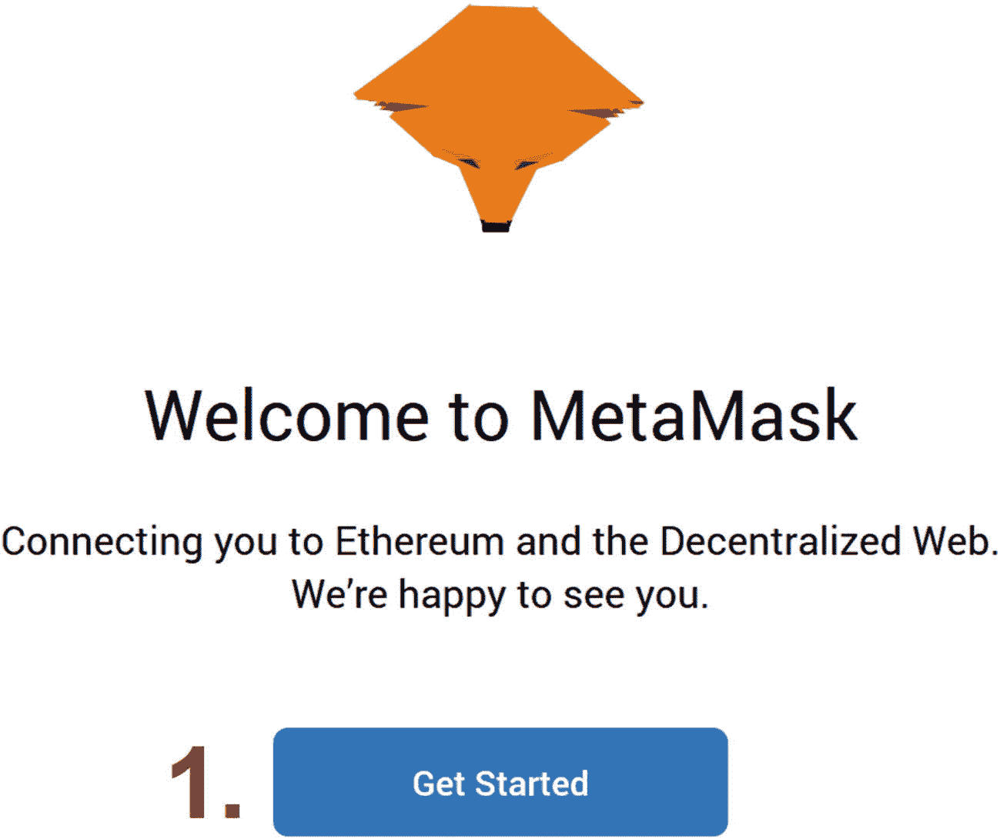

**图 5-1** MetaMask 启动屏幕

MetaMask 会要求您在使用此插件前先设置一个钱包。点击（1）开始；这将带您进入图 5-2 所示的设置屏幕。有两个选项可用：创建新钱包（我们将选择的选项）或导入钱包（适用于您已有 MetaMask 钱包，或想要从其他浏览器导入钱包的情况）。点击图 5-2 中的（2），这将带您创建钱包密码。密码附带一个备份短语，您可以用它来在丢失密码时恢复您的钱包。

> **注意：** 如果您想将钱包导入 MetaMask，也需要此秘密短语。

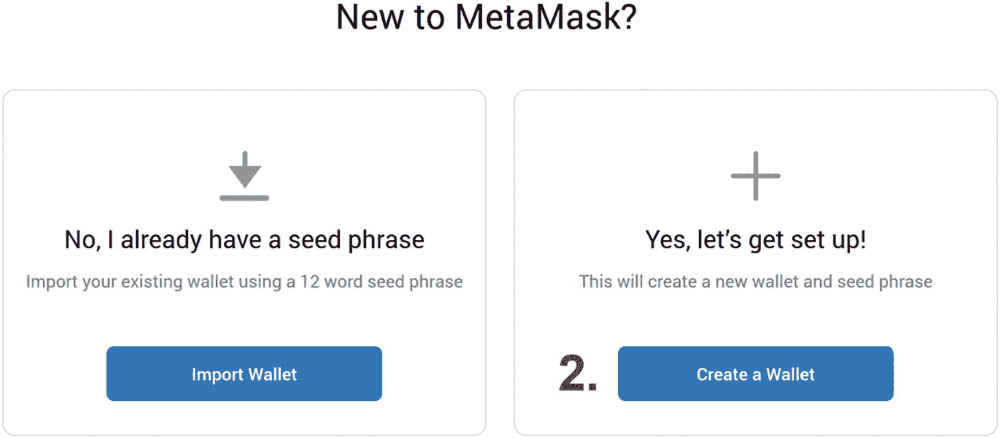

**图 5-2** 设置屏幕。选择（2）为您的 MetaMask 钱包设置密码

创建钱包密码后，您将进入秘密短语屏幕。此短语用于在您丢失密码时恢复钱包。点击（3）显示图 5-3 所示的秘密短语，然后将其记下来。在下一个屏幕上，您将被要求重新输入秘密短语，然后您会收到钱包已设置成功的确认信息。设置完成后，您可以点击 MetaMask 图标查看完整的钱包视图，如图 5-4 所示。

> **注意：** 如前所述，还有其他方式可以通过提供高安全性且无需秘密短语的硬件钱包连接到 Aragon 和以太坊区块链。更全面的介绍见参考文献中的其他部分。

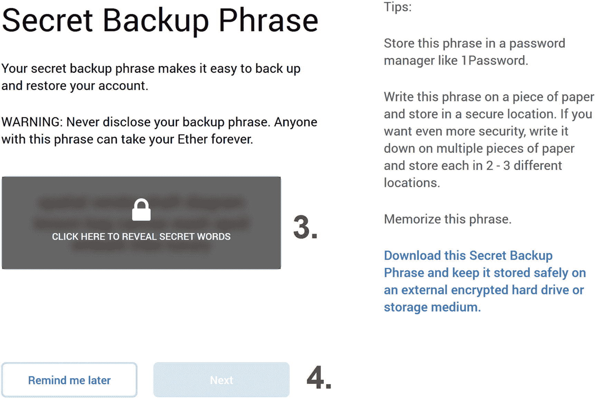

**图 5-3** 用于密码恢复的秘密短语。点击（3）显示短语并记下。点击（4）继续

#### 钱包视图与 MetaMask 设置

钱包视图如图 5-4 所示。让我们快速浏览一下此处呈现的信息。请注意，我们做的第一个更改是切换到以太坊测试网，具体来说是 Rinkeby (5)。该测试网与 Aragon 兼容，我们将在此处进行所有交易，而不是在以太坊主网上。当你对使用 Aragon 感到熟悉后，可以再切换回主网。(6) 显示了你当前正在使用的账户。MetaMask 允许用户在同一个钱包中持有多个账户（地址）。因此，当前账户地址由 (7) 给出，这就是正在使用的账户。接下来是此当前账户的当前余额，由 (8) 给出。该钱包软件提供了两个基本功能 (9)，包括将 ETH 发送到另一个地址，以及通过从交易所或我们将使用的测试水龙头直接存入的方式，将 ETH 存入钱包。最后，通过该钱包进行的所有交易历史记录显示在 (10) 中。

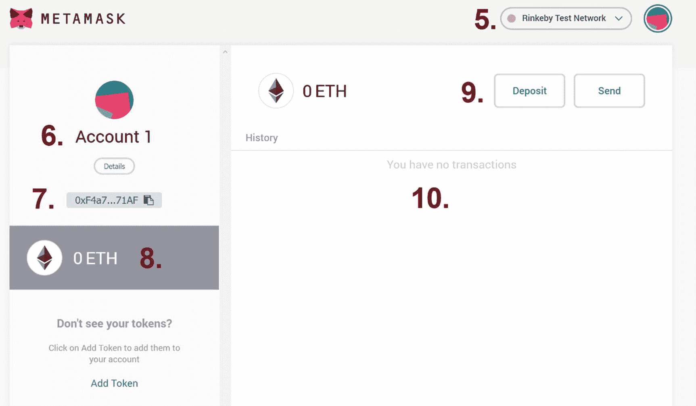

**图 5-4** – MetaMask 钱包主屏幕

现在我们已经设置好了 MetaMask，接下来讨论如何将其与以太坊测试网上的 Aragon 进行交互。你可以通过 [`https://rinkeby.aragon.org/`](https://rinkeby.aragon.org/) 访问 Rinkeby 测试网；这将是我们构建 DAO 的界面。该界面如图 5-5 所示，其中 (11) 确认我们位于测试网上，并允许我们切换到以太坊主网。(12) 开始创建你的 DAO 的流程，但在此之前，让我们先链接我们的账户。

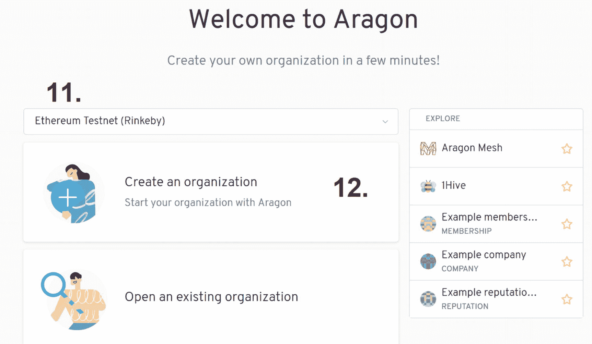

**图 5-5** – 与以太坊测试网进行交互

在屏幕的右上角，你会看到一个 `Connect account` 按钮；点击它将显示四个选项，如图 5-6 所示。`Frame` 是一个桌面原生的以太坊提供商，允许多个不同的钱包与 DAO 进行交互（包括硬件钱包）。`Fortmatic` 和 `Portis` 是提供电子以太坊钱包的服务，并带有直接兑换（用法币购买以太坊）的选项。

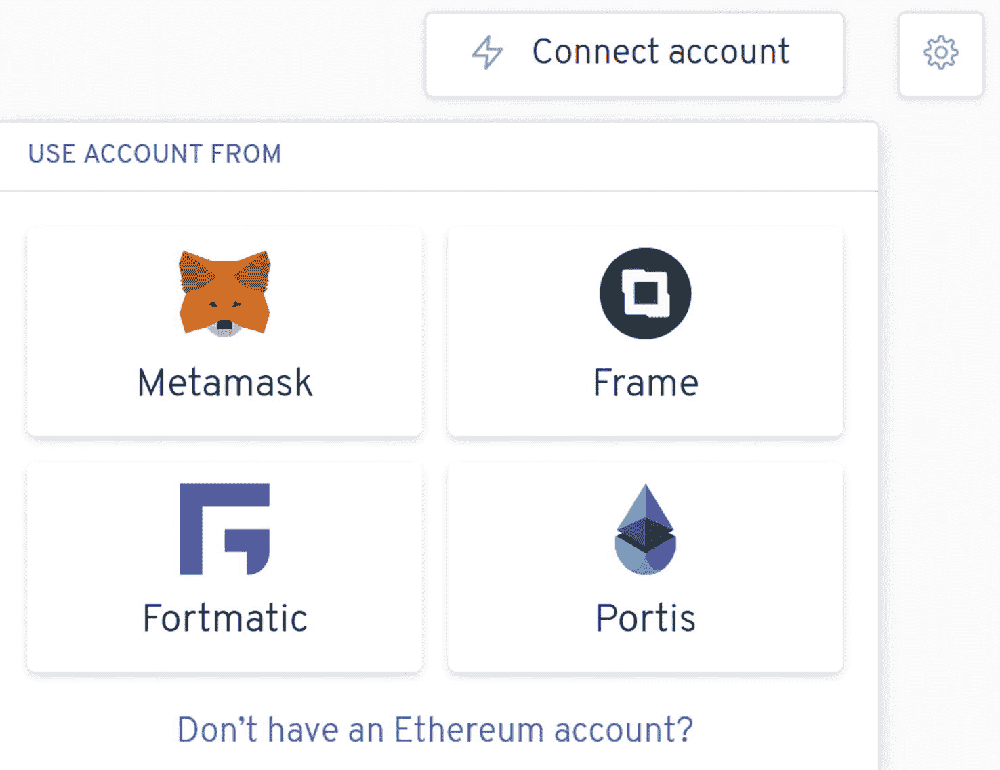

**图 5-6** – 将 MetaMask 账户连接到 Aragon

一旦你点击 `MetaMask`，系统将请求权限将钱包连接到 Aragon，如图 5-7 所示。接受权限后，屏幕右侧应显示钱包地址以及绿色的 `Connected to Rinkeby` 文字。

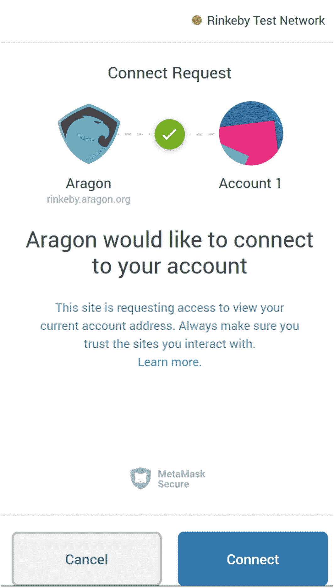

**图 5-7** – 连接 Aragon 和 MetaMask 钱包

一旦钱包连接到 Aragon，我们需要获取一些测试 ETH 来设置一个 DAO。即使在测试网上，诸如在设置 DAO 的每一步签署合同之类的操作也需要消耗 gas 才能执行。因此，我们可以使用一个水龙头来发送一些没有实际价值但可用于我们目的的测试 ETH。我们将要使用的水龙头每 24 小时只能发送一次 ETH，每次使用最多发送 0.2 ETH，链接在此：[`https://testnet.help/en/ethfaucet/rinkeby`](https://testnet.help/en/ethfaucet/rinkeby)。还有更多官方水龙头可用，但这个不需要进行广泛的社交媒体验证。水龙头界面如图 5-8 所示。你的 MetaMask 钱包地址填入 (13)，金额是可选的 (14)，因为水龙头每次只会分发最多 0.2 ETH。你可以向你的交易添加一条消息，该消息将在测试网区块链浏览器上可见。你需要选择一个使用水龙头的理由；在 (15) 中选择任何一个显示的理由，并接受相关条件 (16)。完成后，解决验证码 (17) 并点击 `Claim` 按钮，即可将 0.2 ETH 分发到你的 MetaMask 钱包。

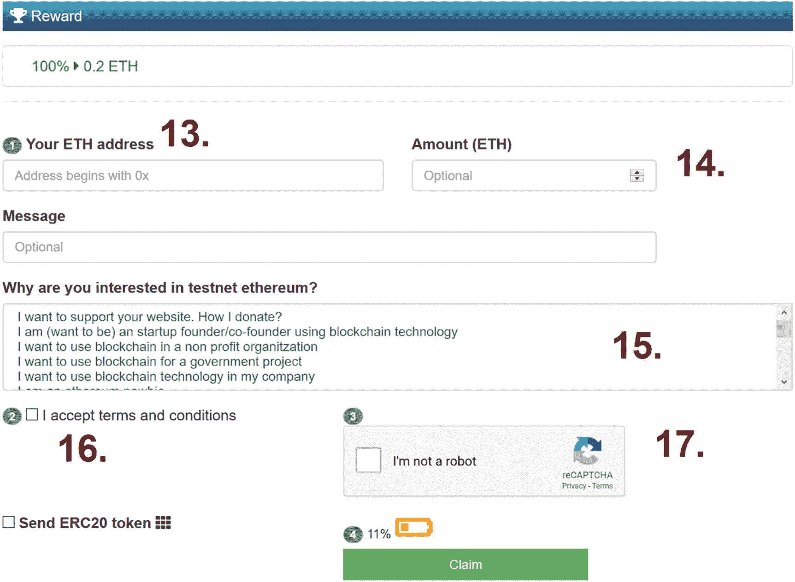

**图 5-8** – Rinkeby 测试网水龙头

现在，水龙头已连接到钱包，并且你拥有了一些初始资金，你可以开始使用 DAO 了。你可能需要改天再访问水龙头，以获取足够的 ETH 来探索其他 DAO 功能/模板。

### 主题 2：设置 DAO

Aragon 提供了一些入门模板，用于创建特定用例的 DAO；本章我们将重点介绍两个模板：公司模板和筹款模板。这些模板是开源的，可在 GitHub 上获取。任何开发者都可以通过新参数扩展这些模板，并创建更适合特定任务的新模板。

一旦你的钱包连接到 Aragon 并且水龙头已向你的钱包分发了 `0.2 ETH`，你就可以继续创建 DAO。面向以太坊测试网的 Aragon DAO 创建工具位于 [`https://rinkeby.aragon.org/`](https://rinkeby.aragon.org/)，你的初始界面应如图 5-5 所示。点击*创建组织*，你应该会看到如图 5-9 所示的模板；选择*公司*模板 (1)。

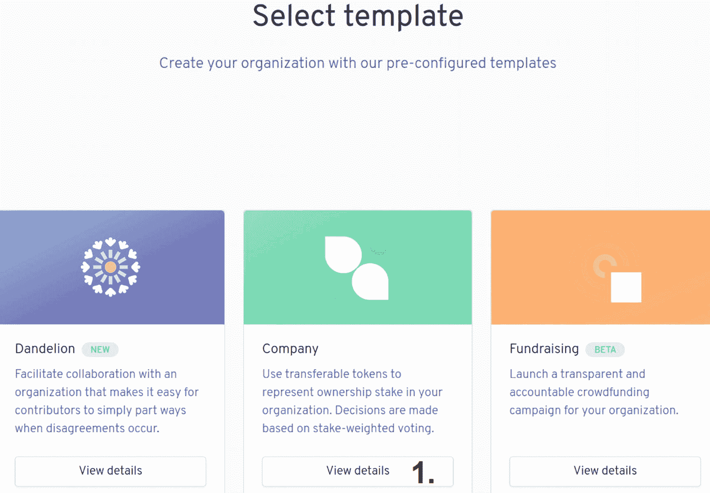

图 5-9

Aragon 中可用的开源 DAO 模板

选择公司模板后，你将进入该模板的概览页面，如图 5-10 所示。该模板附带一组已安装的应用程序，如 (2) 所示，我们稍后将进行审查。点击 (3) 开始设置。

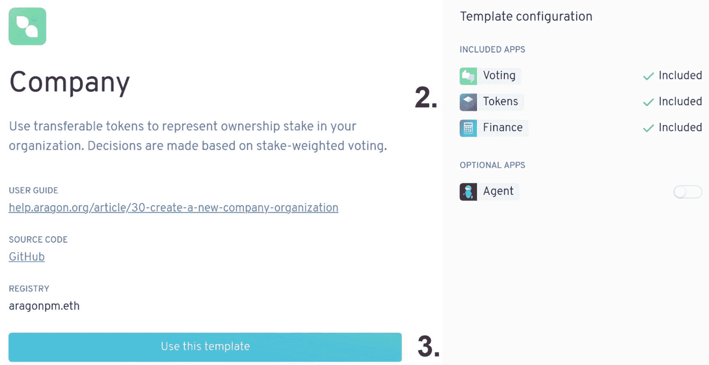

图 5-10

DAO 公司模板概览

点击 (3) 将进入下一步，即申领一个组织名称。Aragon 使用以太坊名称服务，类似于将网址指向你的 DAO 的 DNS 系统。我们将为组织使用以下名称，如图 5-11 所示。

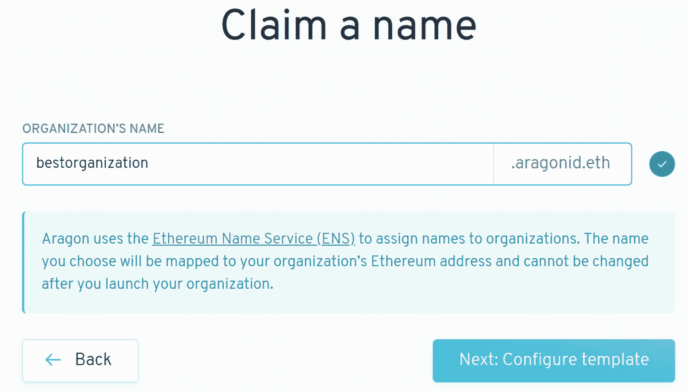

图 5-11

为我们的 DAO 命名。点击“配置模板”继续

下一步是设置 DAO 的投票偏好。这些偏好将决定 DAO 内大部分决策的制定方式。我们来讨论一下投票配置，如图 5-12 所示。(4) 声明了组织内部通过某项决议所需的最低投票百分比。我们将保留默认的 50%。(5) 设定了决议被视为有效所需的最低投票百分比，以防未能达成多数票。例如，我们将此参数设置为 15%。如果 8% 的投票反对某项决议，而 5% 的投票赞成该决议，则该投票失败，因为它未达到决议被视为有效所需的最低批准率 15%（以所需投票数计）。(6) 决定了投票期的持续时间。对于需要大量审议的问题，可能需要更长的投票期。

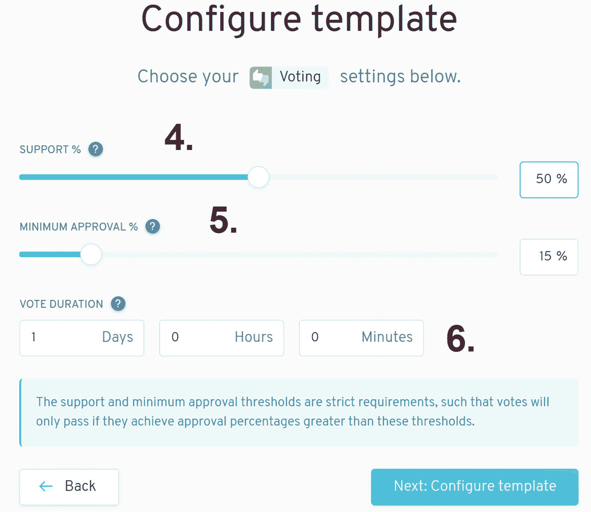

图 5-12

我们 DAO 的投票偏好

现在我们已经设置了投票偏好，下一步是设置一个代币，该代币在我们 DAO 内将被视为等同于投票权，如图 5-13 所示。如果用户在组织中持有更高份额的代币，其投票权就会增加。我们将代币命名为 Best (7)，并使用符号 BST 来表示它 (8)。最初，所有代币将分配给 MetaMask 中的钱包地址 (9)；此分配也使该地址成为我们 DAO 中的默认账户。我们开始将为 DAO 铸造 100 个代币。这意味着一旦 DAO 上线，它将拥有 100 个 BST 代币。任何进一步的代币铸造都将通过投票过程进行 (10)。在此初始过程中，你始终可以向 DAO 添加更多代币持有者；其他地址可以是你在 MetaMask 钱包上管理的账户。

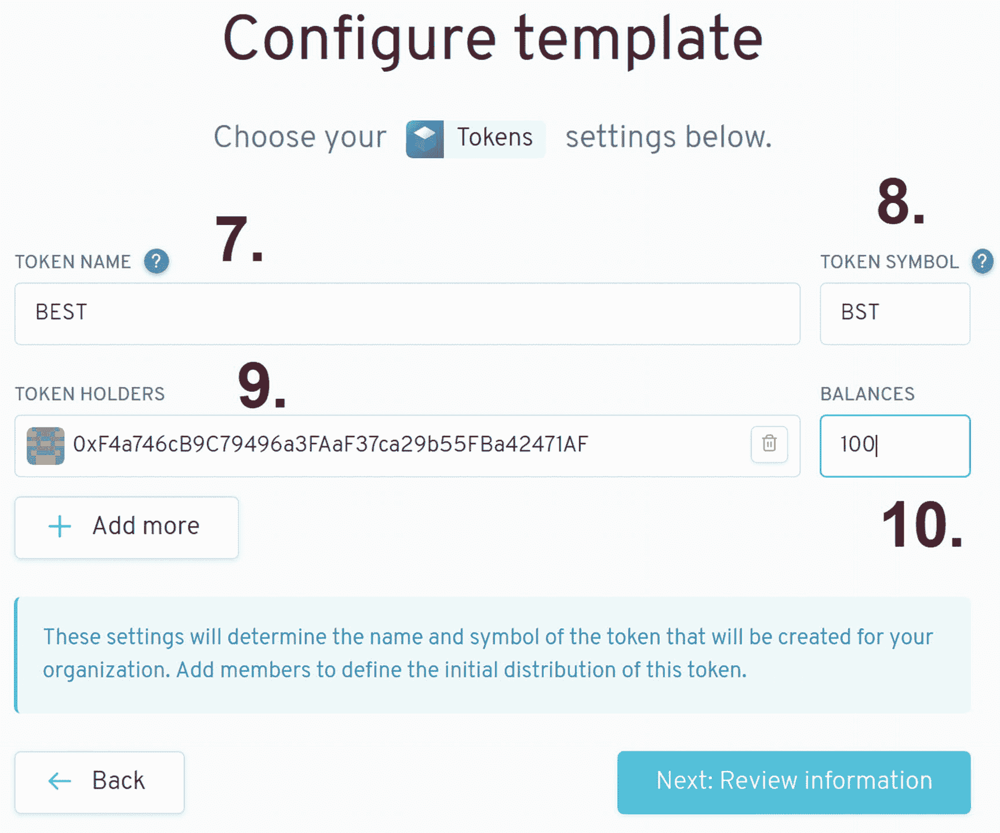

图 5-13

我们 DAO 的代币设置

这就是部署 DAO 所需的全部设置。审阅图 5-14 所示的设置，然后我们就可以开始与我们的 DAO 进行交互了。

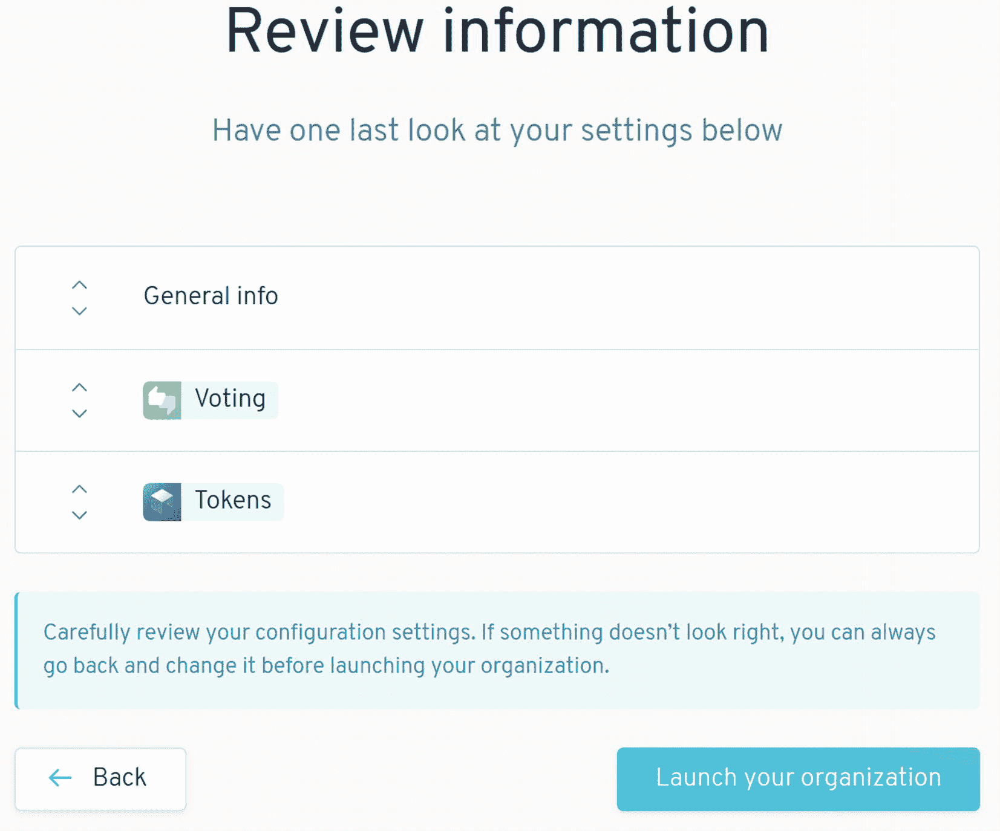

图 5-14

DAO 设置审阅。点击“启动您的组织”以部署 DAO

当你点击*启动您的组织*按钮时，Aragon 将带你进入一个新页面，系统会要求你签署几笔交易，每笔交易都将应用和你的 DAO 部署到测试网。这些交易都是部署 DAO 的智能合约所需的 Gas 费用。签名过程完成后，Aragon 将显示一个*开始使用*框，它将带你进入 DAO 的主页，如图 5-15 所示。首先要注意的是你的 DAO 与 MetaMask 钱包的连接，如 (11) 所示。只有连接到钱包，你才能执行 DAO 的所有日常操作。请注意，(11) 左侧是我们 DAO 的地址，如图 5-11 所示。此 DAO 安装了两个应用程序，我们将在下一个主题 (12) 中审查，最后是 DAO 的权限，我们将在本章后面部分审查 (14)。为此，DAO 的常用功能以快捷键形式呈现 (13)。

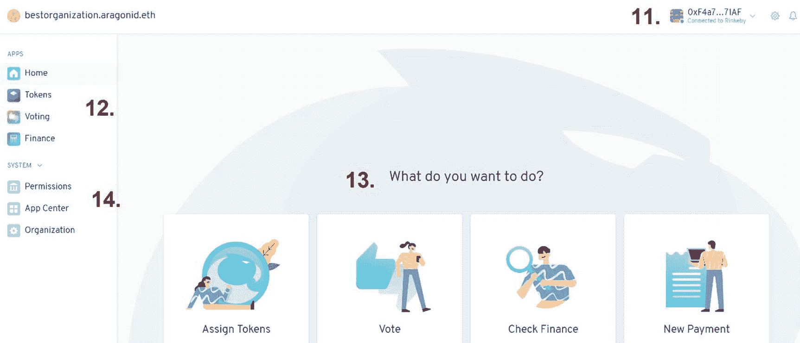

图 5-15

DAO 主页

### 主题 3：DAO 应用和权限

在本主题中，我们将审查 DAO 应用，包括代币、投票和财务。然后，我们将深入研究系统权限，并展示如何为你的 DAO 添加应用权限。让我们从代币应用开始。

#### 代币应用

首先，点击左侧边栏中的 `Tokens` 应用；你会看到代币审核界面，如图 5-16 所示。在此界面中，我们在 DAO 设置过程中铸造的代币以余额 (1) 的形式显示，并分配给我们提供的钱包地址。右侧是我们的代币基本信息，包括代币总供应量（截至目前铸造的代币数量）、代币是否可转让以及代币名称 (2)。我们可以创建不可转让的代币，这可用于指定稀有资产。目前，此 DAO 只有一位成员，因此默认情况下，该成员拥有 100% 的代币所有权 (3)。我们可以铸造新代币，要开始此过程，请单击 (4)，*添加代币*。

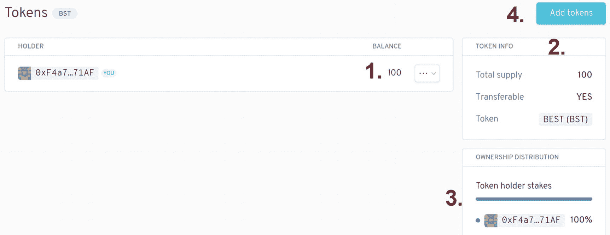

**图 5-16**

代币审核界面

要铸造新代币，我们还需要将其分配给一个新地址，如图 5-17 所示。此过程还会向 DAO 添加一位新成员，其中成员资格定义为在 DAO 中拥有权益。但既然 DAO 已上线，此操作将需要通过投票。通常，对 DAO 操作的任何重大更改都将根据我们在上一节中设置的投票参数进行投票。

> **注意**
> 新铸造的代币可以分配给任何地址；在这里，添加新地址同时允许我们添加一位在 DAO 中拥有权益的新成员。

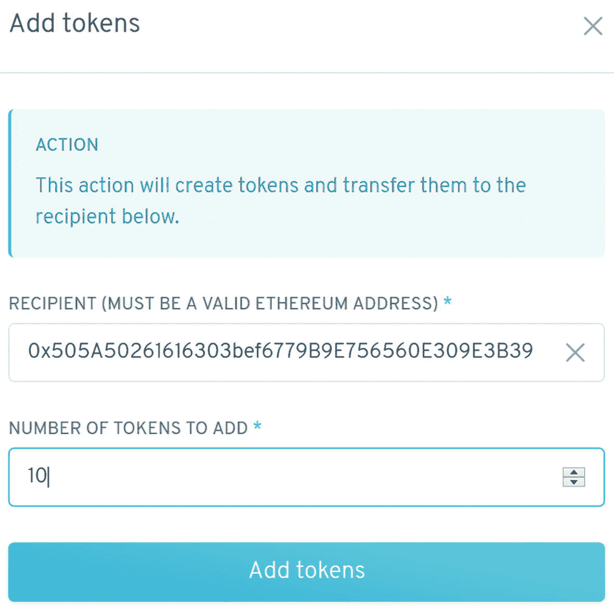

**图 5-17**

铸造十个新代币并将其分配给一个新地址

单击 *添加代币* 将引导您完成四个步骤：

*   创建执行铸造功能的交易。
*   创建一个投票，决定 DAO 是否批准铸造新代币。
*   使用 DAO 智能合约将这两个功能部署到以太坊测试网。
*   创建一个使用铸造功能来铸造新代币的交易。

此通用流程适用于通过 Aragon 中的大多数应用执行的操作；第一步如图 5-18 所示。(5) 确认你只能在投票后才能铸造新代币。(6) 告知我们，投票成功后，此交易将铸造新代币。单击 *创建交易* 将需要 MetaMask 支付 gas 费并签名。

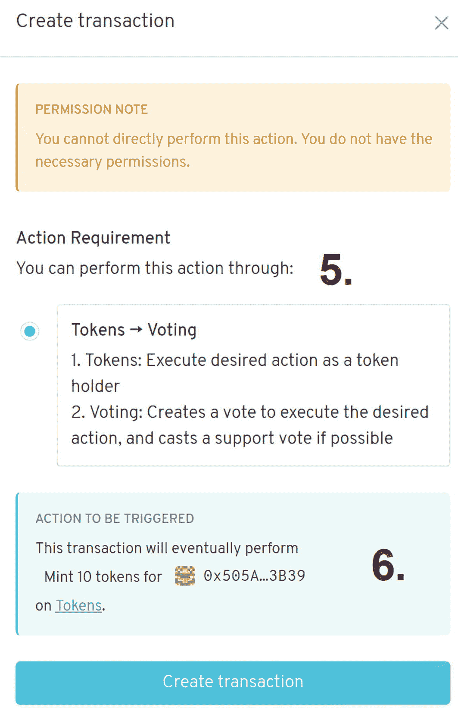

**图 5-18**

创建投票和交易以铸造新代币

导航到 `Voting` 选项卡，你应该会看到一个公开投票，其标题为图 5-18 中来自 (6) 的操作。这些投票由 DAO 自动创建。单击该投票将带你进入投票界面。选择 *是* 并签署交易以对你的决定进行投票。确认信息显示在通知中，如图 5-19 所示。

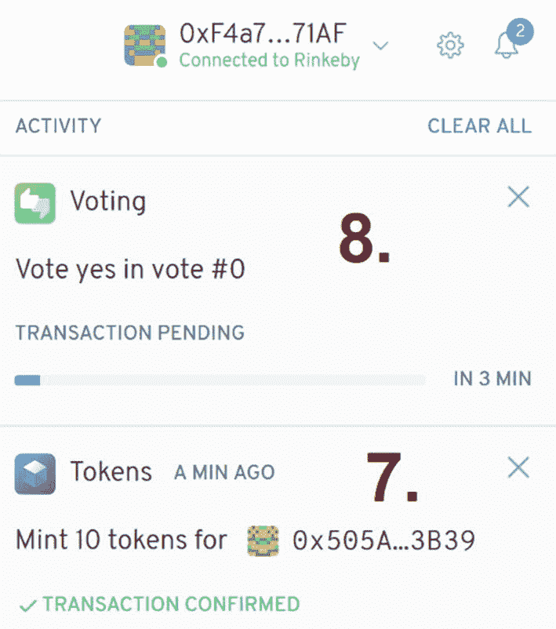

**图 5-19**

投票通知：(7) 指的是将铸造十个新代币的交易，(8) 指的是正在进行的投票

投票摘要页面如图 5-20 所示。这代表了投票结果。(9) 是该投票的描述；作为我们 DAO 的第一次投票，它被分配为投票 #0。此外，还提到了描述和投票创建者。目前，我们的 DAO 只有一位成员，因此投票结果由一位持有大部分权益（100 个 BST 代币）的投票者决定 (10)。右侧是投票决议（已通过），以及有关所需支持率和最低批准率的信息 (11)。

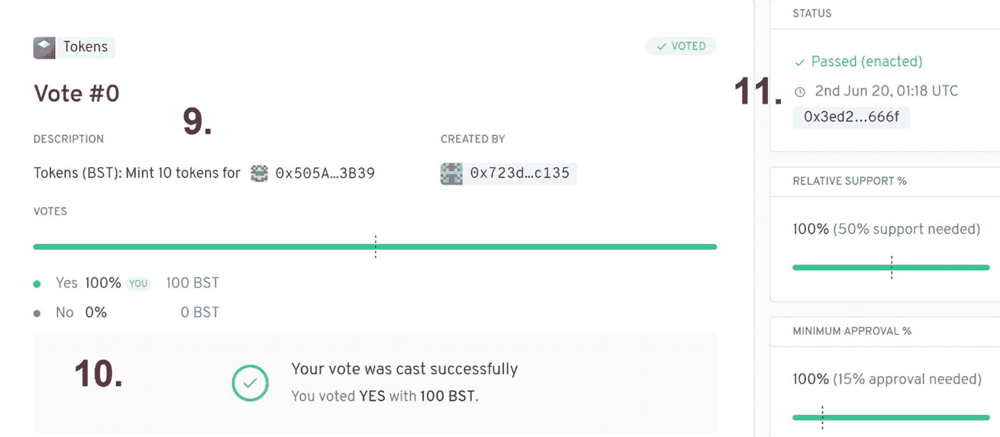

**图 5-20**

投票摘要页面

现在投票已通过，让我们看看它为我们的 DAO 带来了哪些变化，如图 5-21 所示。(12) 是第一个主要变化；我们铸造的十个新代币现已分配给 DAO 上的一个新钱包（账户）。代币总供应量从 100 增加到 110 (13)，这也改变了所有权结构。新账户通过拥有 10 个代币 (14)，在 DAO 的决策中获得了 9% 的权益。

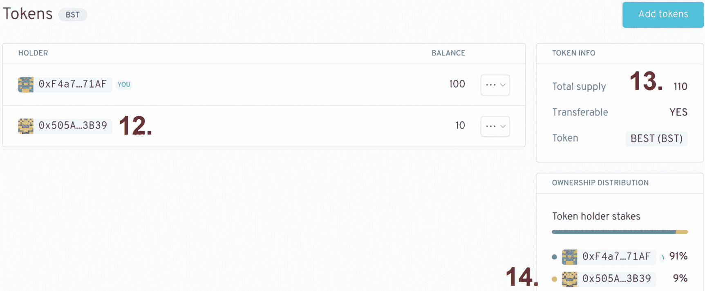

**图 5-21**

铸造的代币出现在我们的 DAO 中

#### 投票应用

投票是每个重大 DAO 操作中不可或缺的一部分。因此，我们使用了 `Voting` 应用来授权铸造十个新代币。类似地，我们可以使用它来提出议题，并经历相同的过程。让我们分享一个简短的例子。导航到 `Voting` 选项卡，单击 *新投票* 开始。输入你想要向 DAO 提出的问题，如图 5-22 所示。例如，在铸造新代币之前，可以作为一个简单投票来讨论此议题。一旦输入问题，DAO 将根据预设规则开始投票。

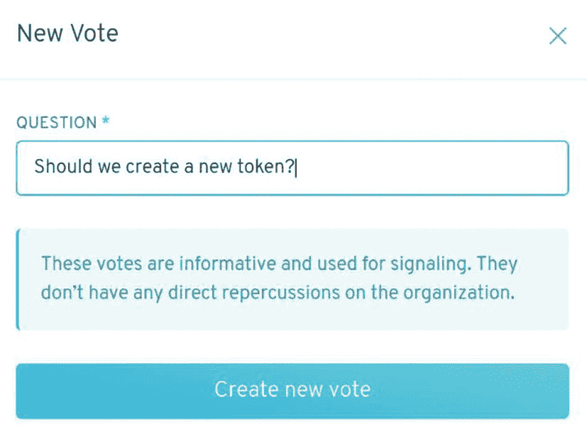

**图 5-22**

创建投票问题

`Voting` 视图如图 5-23 所示。这显示了当前正在积极投票的决议，以及已通过或失败的已关闭决议。我们关于创建代币的新投票显示为开放状态，将在接下来的二十四小时内对 DAO 成员可用。

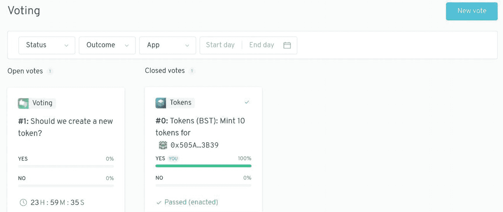

**图 5-23**

投票视图

#### 财务应用

财务应用充当内部银行，记录 DAO 内发生的所有财务活动。在本主题中，我们将介绍如何使用财务应用进行存款和取款。要开始银行操作，我们先请求一些测试代币。导航至 `System` 选项卡下的 `Permissions`，向下滚动即可看到 *Request test tokens* 部分。这将使我们能够获得一些测试货币，如图 5-24 所示。

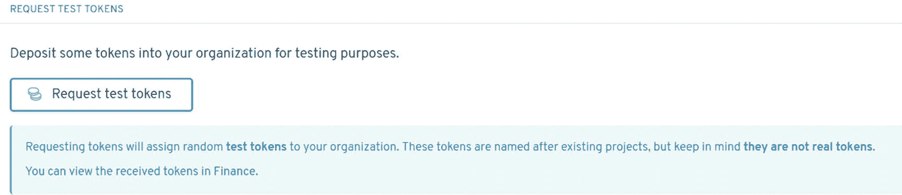

图 5-24 – 为 DAO 请求代币

现在，财务应用会显示刚发生的交易；更新后的视图如图 5-25 所示。（15）显示了我们请求测试代币后收到的 20 个 Aragon 代币（ANT）。（16）列出了转入我们 DAO 的交易记录。

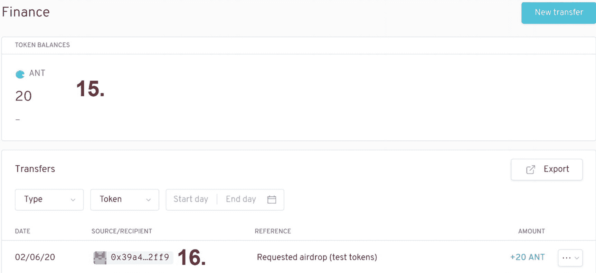

图 5-25 – 财务应用显示一笔流入交易

将存款存入 DAO 的一个简单方法是使用已连接的钱包。我们可以通过在财务应用中发起一笔新的转账来存入资金。设置如图 5-26 所示。首先，我们需要选择要转账的货币。我们的 MetaMask 钱包中只包含 ETH，因此这就是我们要转入 DAO 的资产（17）。接着，我们需要输入 0.02 ETH 的存款金额（18）。最后，我们可以为这笔流入交易添加一条可选信息（19）。

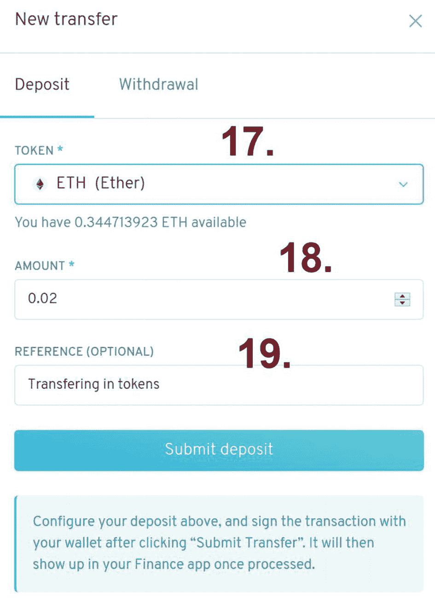

图 5-26 – 从 MetaMask 钱包向我们的 DAO 转账

从 DAO 提现的操作步骤与存款非常相似。如图 5-26 所示选择提现，并输入将接收提现资金的以太坊地址。然后，输入要提取的金额和币种。作为练习，尝试提取 0.01 ETH 到一个 MetaMask 钱包地址。此过程应使财务选项卡显示如图 5-27 所示的内容。（20）显示 DAO 在任何给定时间的剩余余额。（21）是我们从水龙头请求的测试代币。（22）是我们从 MetaMask 钱包存入的 0.02 ETH，最后，（23）应显示已提取的 0.01 ETH。随着更多交易的进行，财务应用将成为 DAO 的内部追踪器。

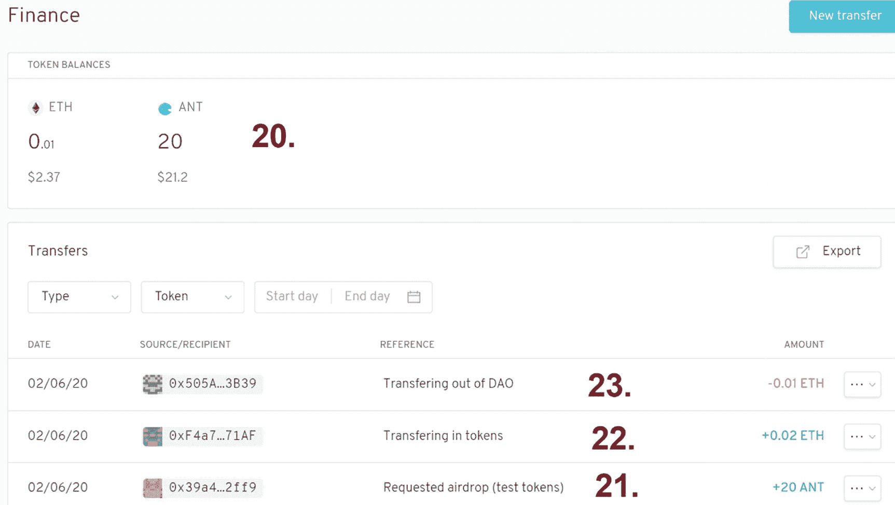

图 5-27 – DAO 的财务概览

**注意：** Aragon 有一个名为 `Agent` 的应用，允许 DAO 与以太坊区块链上的任何其他智能合约进行交互。这使得组织可以使用 `Agent` 应用作为中介来发送外部资金或导入资金。由此产生的转账将在财务概览页面上记录，并引用 `Agent`。

#### 应用权限

DAO 附带一组标准应用权限，用于实现特定功能。为了扩展应用的功能，或向 DAO 添加新的通用特性，必须对新的权限进行投票表决并添加。导航至侧边栏下的 `System ➤ Permissions`。这将打开默认的 `Permissions` 视图，如图 5-28 所示。DAO 允许您更改应用的权限，以及在系统级别更改 DAO 的权限。我们将只关注应用权限（24）。当前已安装的应用就在下方的（25）中列出。这些应用由模板提供并已预装。（26）列出了我们 DAO 中的应用可用的操作（27）。这些操作被分配给了某个应用，如（28）所示，这表示了从在应用上请求操作到指定应用批准的操作流程。在大多数情况下，如我们之前讨论过的，`Voting` 应用将监督所有新的操作。（29）是管理器，可以将操作重新分配给安装在我们的 DAO 上的应用。

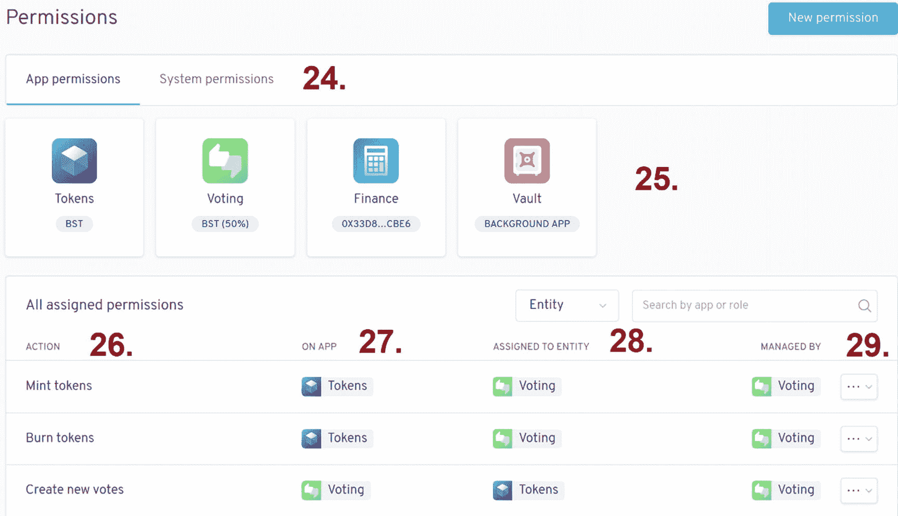

图 5-28 – 我们 DAO 的权限概览

在图 5-28 的右侧，点击 *New permission* 开始添加新权限。这里的目标是添加一个权限，允许 DAO 中的任何账户销毁代币。这将取代默认限制仅由 `Voting` 应用执行销毁代币操作的功能。`Add Permissions` 视图如图 5-29 所示。首先，选择要为其添加新权限的应用，然后分配一个新的实体。在这里，我们将把任何账户分配给接下来要执行的操作，即销毁代币。一旦点击 *Add permission*，您将进入投票环节。与对 DAO 的任何重大更改一样，一旦该决议被 DAO 批准，该功能将变为可用。

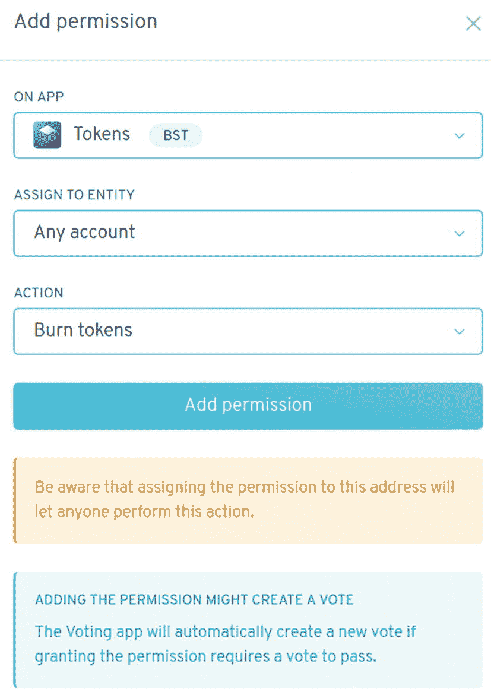

图 5-29 – 添加新权限

如前所述，在添加权限之前，我们需要对此决议进行投票。在图 5-29 中点击 *Add permission* 将带您进入投票界面，如图 5-30 所示。

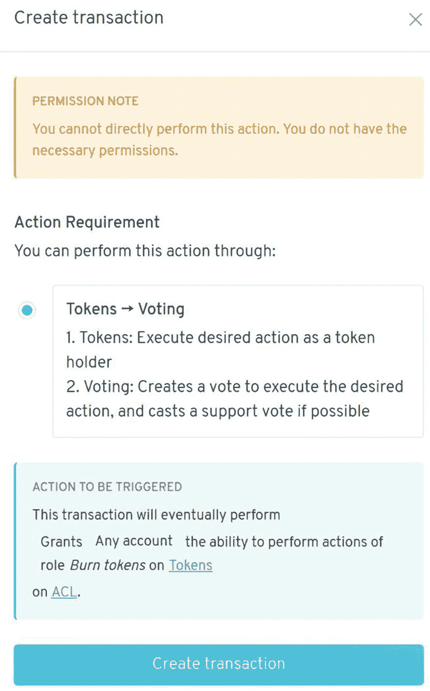

图 5-30 – 添加新权限的投票确认

一旦投票成功，该权限即应用于 DAO，并会在 `Permissions` 选项卡下可见。如图 5-31 所示。至此，我们的教程结束，提供了一个关于如何在 Aragon 上设置 DAO 的基本概述。

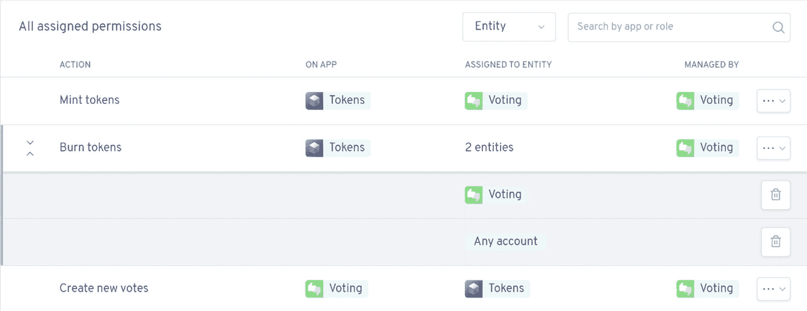

图 5-31 – 销毁代币操作的更新后权限视图

在结束讨论之前，让我们简要介绍一下将股份编码为 DAO 中的受保护/限制资产这一主题。不可转让的代币可用作稀有资产，并具有更大的投票权。传统上，上市公司发行的股票有三种类型：

- **普通股（A 类）：** 这是人们通常所说的股票。普通股由公司发行，通常可在诸如 `Nasdaq` 等证券交易所进行交易。普通股的主要优点是获得股息支付以及在交易所进行交易。股息通常是在季度末，公司从该季度产生的利润中支付给股东的一笔款项。普通股也可以在认可的交易所随时进行交易或出售。这些可以编码为在组织成立后向 DAO 成员发行的新铸造代币。

### 优先股（B 类）

优先股是向在公司持有重大股份的投资者发行的一种特殊股票。与普通股相比，这种股票具有若干财务优势，投资风险更低。在股息方面，优先股在普通股之前兑付，因此能获得公司利润中更大份额的分配。此外，普通股的股息支付可能有所变动，但优先股对股东有固定回报。将此类资产编入 DAO 的过程需要使用 `aragon-cli`（命令行界面）。具体来说，我们利用 `aragon-cli` 为 DAO 创建一个名为 `MiniMeToken` 的通用 ERC20 代币的克隆，并通过 `Agent` 导入。这使得一种新型资产得以导入并在我们的 DAO 中使用。

### 创始人股（F 类）

F 类股是向公司创始人发行的专属优先股。这类股票拥有更大的投票权；例如，一股创始人股可以算作十票。相比之下，一股普通股仅算作一票。创始人股授予超级投票权，通常用于在涉及大量实体时保持对公司决策过程的控制。

**注意**

使用 `aragon-cli` 超出了本章的讨论范围；然而，它允许实现非常强大的集成。例如，DAO 可以就一种新导入的代币进行投票，将其作为收款资产，让持有者通过向 DAO 投资而每年获得付款回报。

## 总结

在本章中，我们讨论了去中心化组织的概念。我们首先在基于区块链构建的去中心化组织背景下介绍了 Aragon。我们讨论了 DAO 的定义以及 Aragon 所实现的组织机构。然后，我们深入探讨了 Aragon 代币，以及借助 DAO 开展社交活动的用例的出现。最后，本章的核心内容是逐步讲解如何建立、管理和运营一个 DAO，包括其所有基本功能。本章为创建你自己的 DAO 奠定了基础。

