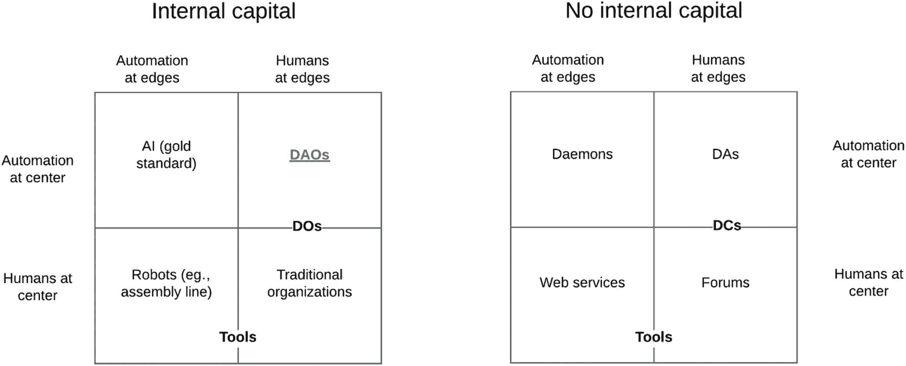
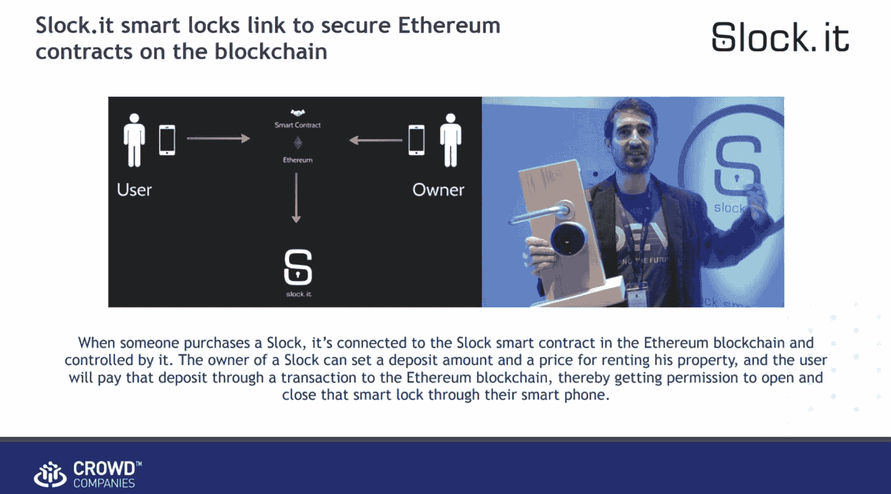
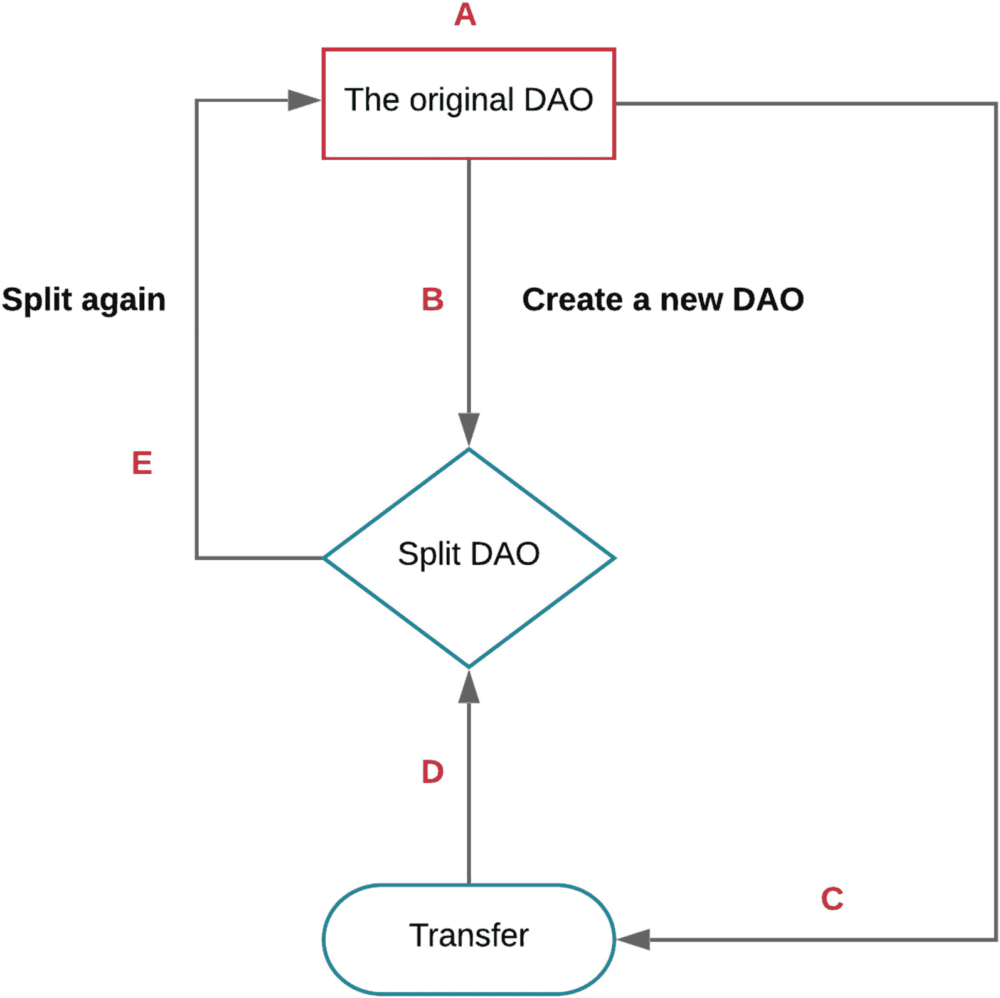

# 6. DAO 遭黑客攻击

在第 5 章中，我们讨论了去中心化组织的概念以及 DAO 的运作方式。在此，我们希望强调一个导致第一个 DAO 创立的历史性时刻，以及它最终如何被黑客攻击。我们的讨论从 Buterin 对去中心化组织的新颖视角开始，进而引出 Slock.it 的故事——这家公司处于 DAO 革命的核心。然后，我们展示了一些导致 The DAO 功能失常的代码：与漏洞相关的智能合约片段、允许从 The DAO 重复提取资金的条件，以及攻击本身。最后，我们通过讨论这次黑客攻击的后果来结束本章：关于硬分叉与软分叉的争论，以及以太坊经典（Ethereum Classic）的诞生。

## 引言

全球区块链社区的讨论始终带有理想主义色彩，这可以追溯到中本聪早期关于比特币作为对中央银行业务的回应而撰写的文章。其核心思路是：容易腐败，或无论如何只迎合少数人意愿的系统，如果由代码来治理，可能会变得更负责任。如果该代码存在于区块链上，那么它就不会受到少数派有偏见干预的影响。秉承这一传统，在 2013 年 9 月为《比特币杂志》撰写的一篇博客文章中，Vitalik Buterin 探讨了 DAO 的概念。文章开头如下：

> *米特·罗姆尼提醒我们，公司也是人。无论你是否同意他的党派支持者从这一主张中得出的结论，这句话确实含有大量真理。毕竟，公司除了是一群按照特定规则共同工作的人之外，还能是什么呢？当一家公司拥有财产时，这实际上意味着存在一份法律合同，规定该财产仅可被用于当前董事会控制下的特定目的——而董事会本身又可由特定股东群体修改。如果一家公司做了某事，那是因为其董事会已同意应当这样做。如果一家公司雇佣员工，这意味着员工同意按照一套特定的规则（特别是涉及薪酬的规则）为公司的客户提供服务。当一家公司拥有有限责任时，这意味着特定的人被授予了额外特权，可以减少被政府法律起诉的担忧——这是一群比单独行动的普通人拥有更多权利，但最终仍是普通人的人。无论如何，归根结底，这不过是人与合同罢了。*
>
> *然而，这里出现了一个非常有趣的问题：我们真的需要这些人吗？* ^(¹)

在 Buterin 的文章首次发表三年后，The DAO 作为一个用 Solidity 编写的智能合约诞生了，这或许是这种理想主义最纯粹的体现。尽管有着典范性的标签，The DAO 并非第一个——也非最后一个——去中心化自治组织。事实上，到 2016 年 5 月，当 Slock.it 的领导层启动 The DAO 创纪录的首次代币发行（ICO）时，DAO 已被公认为日益主流的区块链现象的第三波浪潮。^(²)

为了更好地理解 DAO 术语，请参阅以太坊开发者博客（`https://blog.ethereum.org/2014/05/06/daos-dacs-das-and-more-an-incomplete-terminology-guide/`），该博客对此进行了详细描述。尽管许多人认为比特币是第一个 DAO，但这两种服务的性质存在巨大差异。虽然比特币确实由网络中每个矿工共享的代码治理，但比特币没有内部资产负债表，只有用户可以用来交换价值的函数。尽管当时其他的 DAO 确实有资产所有权的概念，但 The DAO 的独特之处在于其代码核心是极其民主的过程，这些过程定义了 The DAO 将如何部署其资源。这是 Buterin 关于一个可以在没有一名员工（更不用说 CEO）的情况下开展业务的公司的理念的实现。

摘自 DAO 白皮书：

> *本文阐述了一种方法，该方法首次允许创建这样的组织，其中 (1) 参与者保持对贡献资金的直接实时控制，并且 (2) 治理规则通过软件被形式化、自动化并强制执行。具体来说，已经编写了标准的智能合约代码，可用于在以太坊区块链上组建一个去中心化自治组织（DAO）。*


Buterin 谈到了在区分去中心化组织与传统公司时，自动化与资本之间的平衡。来自 ConsenSys 的 Paul Kohlhaas 展示了图 6-1，用以说明 DAO 在自治组织谱系中的位置。请注意，此图显示了不同类型的自治组织分布在从自动化到人工控制的谱系上，例如简单的去中心化组织（DO）和传统的去中心化公司（DC）。



**图 6-1**  
作为由自动化驱动决策、并有人类参与的实体——DAO

本质上，DAO 是一次范式转变，它颠覆了以往不包含资本的自动化实体。通过使用区块链，我们可以注入资本，并构建混合商业模式，从而针对特定用例精细调整自动化的程度。以下是图 6-1 中三个新术语的简要词汇表：

- **DA**：去中心化代理（Decentralized agents），本质上是开发者为实现特定任务而编程的机器人。DA 与 DAO 的主要区别在于后者拥有内部资本。
- **DC**：去中心化公司（Decentralized corporations），本质上是介于不运营内部资本的论坛与完全自动化的去中心化代理之间的一种媒介。
- **DO**：去中心化组织（Decentralized organizations），本质上是介于传统公司与完全自治的 DAO 之间的一种媒介。

## 团队

在区块链世界中，常出现的情况是，对于没有员工的 DAO 与编写并维护了 The DAO 代码的人类之间的关系性质，存在着许多混淆。就 The DAO 而言，这些人类由 Slock.it 的高层领导，这是一家德国公司，旨在通过他们称之为“通用共享网络”（USN）的技术来颠覆共享经济。

Slock.it 的首席执行官 Christopher Jentzsch 和首席运营官 Stephan Tual，在创立 Slock.it 之前，曾在以太坊基金会担任高级职务（分别是首席测试员和首席商务官）。Jentzsch 是 The DAO 代码的主要开发者，而 Tual 则通过博客文章、会议演讲和论坛贡献成为了 The DAO 的代言人。那么，他们现在的公司会如何从创建基于以太坊的无领导者风险投资基金中受益呢？要理解他们的动机，我们必须审视 Slock.it 将区块链连接到物理世界的愿景。

在构建 USN 的过程中，Slock.it 旨在物联网技术的主流普及中扮演核心角色。通过提供一种从世界任何地方与网络设备进行交互的方式，USN 有望成为一个超连接世界的骨干。在这个世界里，你的财产可以出租给他人，而无需像 Uber 和 Airbnb 这样的中心化公司。取而代之的是，USN 将为以太坊区块链提供一个接口，让去中心化应用可以管理构成共享经济的交易。

该公司计划构建一种名为“以太坊计算机”的专用调制解调器，用于将物联网设备连接到 USN。Slock.it 对 The DAO 的愿景是创立一个去中心化的风险投资基金，用于投资那些构建区块链支持的产品和服务的、有前景的提案。

在撰写本文时（距离最初的 DAO 的 ICO 几年后），Slock.it 已筹集了 200 万美元的种子资金，用于继续开发 USN 和以太坊计算机。根据 Tual 在公司网站上的博客文章，Slock.it 现在将以免费开源镜像的形式，为诸如 Raspberry Pi 等流行的片上系统（SoC）提供以太坊计算机。该公司还构建并维护了 `Share&Charge` 服务，该服务允许电动汽车充电站的所有者通过基于区块链的移动应用程序，将其电力出售给电动汽车车主。

在 Crowd Companies 于 2016 年 11 月 19 日进行的一场题为“技术如何改善未来的住宿”的演讲中，Jeremiah Owyang 在图 6-2 所示的幻灯片中总结了 Slock.it 的主要用例之一。



**图 6-2**  
通过将物理设备（智能锁）的购买链接到智能合约，Slock.it 可以充当去中心化的 Airbnb

最终，图 6-2 中表达的理念被扩展成了一个去中心化的物联网平台，任何设备都可以连接到区块链。


### The DAO

The DAO 的原始构想并非最终在其 ICO 中发布的那个关于民主化商业流程的激进实验。Jentzsch 在 Slock.it 博客上描述了这一过程：

> *最初，我们创建了一个 slock.it 专属的智能合约，赋予代币持有者投票权，决定我们——slock.it——应如何使用所收到的资金。*
> 
> *经过进一步考虑，我们赋予了代币持有者更大的权力，让他们完全掌控这些资金，只有在由智能合约支持的详细提案投票通过后，资金才会被释放。这已经比 Kickstarter 模式前进了一步，但在这个狭隘的 slock.it 专属 DAO 中，我们仍会是资金的唯一接收方。*
> 
> *我们希望能更进一步，创建一个“真正的”DAO，使其成为资金的唯一且直接接收方，并代表创建一个类似于公司的组织，其中可能有成千上万的创始人。* ^(³)

为了实现 Slock.it 与 The DAO 的分离，Jentzsch 设计了一个 Solidity 合约，允许任何 DAO 代币持有者就如何处理 The DAO 的资源提出提案。所有代币持有者都可以对活跃的提案进行投票，提案的最低投票期为十四天。

这意味着，一旦 The DAO 的 ICO 完成，Slock.it 就必须像其他任何人一样向 The DAO 提交一份提案。其他用户可以使用 Mist 浏览器来评估该提案。提案的结构如下：

```
struct Proposal {
address recipient;
uint amount;
string description;
uint votingDeadline;
bool open;
bool proposalPassed;
bytes32 proposalHash;
uint proposalDeposit;
bool newCurator;
SplitData[] splitData;
uint yea;
uint nay;
mapping (address => bool) votedYes;
mapping (address => bool) votedNo;
address creator;
}
```

如你所见，提案——这个迅速筹集了 1.5 亿美元的自动化代码库的核心——是对 The DAO 资源的相对简单的请求（`uint amount`）。

任何 DAO 代币持有者都可以通过调用 `vote` 函数对提案进行投票：

```
function vote(
uint _proposalID,
bool _supportsProposal
) onlyTokenholders returns (uint _voteID);
```

来自任何地址的票数将根据该地址持有的 DAO 代币数量按比例加权。如果代币持有者想要对两个不同的立场进行投票，他们可以将要用于投票的代币数量转移到另一个地址，然后从那里再次投票。^(⁴) 任何对开放提案进行投票的代币都将被锁定（无法转移），直到投票期结束。

`uint proposalDeposit` 是提案创建者在投票期结束前必须为提案质押的保证金（以 wei 为单位）。如果提案从未达到法定人数，保证金将归 The DAO 所有。

有两种特殊类型的提案不需要保证金，它们在 The DAO 的命运中发挥了关键作用。第一种类型是拆分 The DAO 的提案，实际上是将提案接收方的资金提取到一个新的“子”DAO 中，该子 DAO 是原 DAO 的克隆，但位于一个新的合约地址。拆分提案的投票期为七天，而不是十四天，任何对拆分提案投赞成票的人都会跟随接收方，从原 DAO 中提取他们的代币，并将其转移到生成的子 DAO 中。

第二种特殊类型的提案是替换 The DAO 的监督人。DAO 监督人是在创建 The DAO 和任何子 DAO 时设定的地址，这些地址可以将接收方地址列入白名单，充当看门人的角色。^(⁵) 如果替换监督人的提案被多数票否决，投赞成票的人可以选择坚持他们的决定，从而创建一个由他们选定的监督人管理的新 DAO。

### ICO 亮点

最初 The DAO 概念的 ICO 一夜之间大获成功：

*   它筹集了 1200 万 ETH（约合 1.5 亿美元）。
*   Jentzsch 和 Tual 都承认，他们从未预料到自己的创意会如此成功。

## 黑客攻击

The DAO 容易受到攻击的观点一直在开发者社区中流传。Vlad Zamfir 和 Emin Gün Sirer 首次在一篇博客文章中提出了这个问题，呼吁在漏洞得到解决之前暂停 The DAO 的运行。^(⁶) 就在攻击发生的几天前，MakerDAO 警告社区其代码容易受到攻击，而 Peter Vessenes 则证明 The DAO 也存在同样的漏洞。^(⁷)

这些警告促使 Tual 于 2016 年 6 月 12 日在 Slock.it 网站上发布了一篇如今臭名昭著的博客文章，题为“在发现以太坊智能合约‘递归调用’漏洞后，DAO 资金无风险”。在接下来的几天里，人们提出了修复方案以纠正 The DAO 的许多已知漏洞，但为时已晚。6 月 17 日，一名攻击者开始从 The DAO 中抽走资金。

The DAO 攻击者利用了 The DAO 一个本意良好但实现欠佳的功能，该功能旨在防止多数人压迫持不同意见的 DAO 代币持有者。摘自 The DAO 白皮书：

> *每个 DAO 都必须缓解的一个问题是，多数人有可能在 DAO 成立后通过改变治理和所有权规则来掠夺少数人。例如，一个拥有 51% 代币的攻击者，无论是在资金募集期间获得的还是之后创建的，都可以提出一项提案，将所有资金发送给自己。由于他们持有大多数代币，他们总能通过自己的提案。*
> 
> *为了防止这种情况，少数人必须始终有能力取回他们那部分资金。我们的解决方案是允许一个 DAO 拆分成两个。如果某个个人或一组代币持有者不同意某项提案，并希望在提案执行前取回他们所拥有的那部分以太币，他们可以提交并批准一种特殊类型的提案，以形成一个新 DAO。对此提案投赞成票的代币持有者随后可以拆分 DAO，将他们那部分以太币转移到这个新 DAO 中，而剩下的代币持有者则只能花费他们自己的以太币。*

不幸的是，这种“拆分”功能的实现方式使 The DAO 因一个灾难性的重入漏洞而变得脆弱。^(⁸) 换句话说，某人可以递归地从 DAO 中拆分，无限期地提取相当于其原始 ETH 投资额的金额，而他们的提款记录从未被记录在原始 DAO 合约中。

以下是 Solidity 合约文件 `DAO.sol` 中发现的漏洞：

```
function splitDAO(
uint _proposalID,
address _newCurator
) noEther onlyTokenholders returns (bool _success) {
...
// [为说明添加] 第一步移动以太币并分配新代币
uint fundsToBeMoved =
(balances[msg.sender] * p.splitData[0].splitBalance) /
p.splitData[0].totalSupply;
if (p.splitData[0].newDAO.createTokenProxy.value(fundsToBeMoved)(msg.sender) == false) //
[为说明添加] 这一行在更新发起拆分账户中的资金之前进行 DAO 拆分
...
// 销毁 DAO 代币
Transfer(msg.sender, 0, balances[msg.sender]);
withdrawRewardFor(msg.sender); // 友好操作，获取其奖励
// [为说明添加] 上一行是关键，因为它是在 totalSupply 和 balances[msg.sender] 更新以反映拆分后的新余额之前调用的
totalSupply -= balances[msg.sender]; // [为说明添加] 这发生在拆分之后
balances[msg.sender] = 0; // [为说明添加] 这也发生在拆分之后
paidOut[msg.sender] = 0;
return true;
}
```


如下所示，已将所提供的英文文本按照高级文档工程师的规范进行排版。保留了原有的标题层级和段落逻辑，将需要强调的变量名、函数名、命令等添加了反引号，并对代码块使用了正确的 Markdown 格式。

---

如图所示，The DAO 通过引用 `balances` 数组来确定有多少可转移的 DAO 代币。`p.splitData[0]` 的值是提交给 DAO 的提案的一个属性，而非 DAO 的任意属性。这一点，再加上 `withdrawRewardFor` 在 `balances[]` 更新之前被调用，使得攻击者能够无限期地调用 `fundsToBeMoved`，因为其余额仍会返回原始值。

进一步审视 `withdrawRewardFor()`，我们可以看到导致此漏洞的条件：

```
function withdrawRewardFor(address _account) noEther internal returns (bool _success) {
if ((balanceOf(_account) * rewardAccount.accumulatedInput()) / totalSupply < paidOut[_account])
throw;
uint reward =
(balanceOf(_account) * rewardAccount.accumulatedInput()) / totalSupply - paidOut[_account];
if (!rewardAccount.payOut(_account, reward)) // [添加说明] 该语句易受递归攻击。我们需要深入研究。
throw;
paidOut[_account] += reward;
return true;
}
```

假设第一个语句评估为 false，那么标记为易受攻击的语句将执行。我们还需要再考察一步，才能理解攻击者是如何做到这一点的。当第一次调用 `withdrawRewardFor` 时（当时攻击者拥有合法的可提取资金），第一个语句会正确评估为 false，从而导致以下代码执行：

```
function payOut(address _recipient, uint _amount) returns (bool) {
if (msg.sender != owner || msg.value > 0 || (payOwnerOnly && _recipient != owner))
throw;
if (_recipient.call.value(_amount)()) { // [添加说明] 这是致命一击
PayOut(_recipient, _amount);
return true;
} else {
return false;
}
```

第二个 `if` 语句中的 `PayOut()` 引用了 `"_recipient"` —— 即提出分拆的人。该地址包含一个函数，在代币余额更新之前，从 `withdrawRewardFor()` 内部再次调用 `splitDAO`。这创建了如下所示的调用堆栈：

```
splitDao
withdrawRewardFor
payOut
recipient.call.value()()
splitDao
withdrawRewardFor
payOut
recipient.call.value()()
```

因此，攻击者能够无限期地从 The DAO 提取资金到一个子 DAO。概括而言，攻击者实现了以下步骤：

1.  分拆 DAO。
2.  将他们的资金提取到新的 DAO。
3.  在代码检查资金是否可用之前，递归地调用分拆 DAO 的函数。

该过程在图 6-3 中进行了可视化展示。



图 6-3

迭代提款的过程

在图 6-3 中，我们可以直观地看到这个迭代过程。原始 DAO 用 A 表示，并在 B 中创建了一个子 DAO。然后，一个转账函数请求从原始 DAO C 中提取一些资金。最后，资金被转移到新创建的 DAO。随着每次循环创建新的 DAO，这个过程不断重复。

## 争论

然而，The DAO 的投资者并非唯一对事件结果感兴趣的一方。围绕 The DAO 的热潮达到了 Buterin 在 2014 年预测的那种狂热程度。当时流通中近 5% 的 ETH 都投资于 The DAO。这对整个以太坊生态系统产生了诸多影响，并引发了区块链短暂历史上最激烈的争论之一。

争论的一方希望保护羽翼未丰的以太坊生态系统，使其免受一个持有流通中相当大比例 ETH 的恶意行为者的侵害。他们未必关心 The DAO 能否存活，但最终目标是确保以太坊作为一个声誉良好的区块链平台能够存活下去，以供未来在其上构建其他 DAO。这是 Buterin 和许多以太坊开发团队核心成员的立场。

另一方则坚守去中心化和不可篡改的理念。在这个阵营（我们称之为正义阵营）的许多人眼中，区块链本质上是一个公正的系统，因为它是确定性的，任何选择使用它的人都默认同意了这一事实。从这个意义上说，DAO 攻击者并未违反任何法律。相反，重入攻击利用了构成 The DAO 章程的软件代码，并反过来攻击了它自身。

去中心化阵营认为，重写区块链以回滚攻击者将 ETH 锁定在子 DAO 中的行为，会损害区块链的完整性。按照这种思路，区块链应该是不可篡改的，并且没有任何中央权威，包括以太坊基金会。他们担心，由一小群人重写区块链的道德风险可能会为其他干预措施（如选择性审查）打开大门。

双方在社交媒体和新闻媒体上激烈辩论各自的立场。这一过程让软分叉和硬分叉的概念广为人知。分叉区块链——或者任何软件代码——对以太坊或 The DAO 来说并不新鲜，但它成为了正义阵营与不可篡改阵营之间争论的焦点。

与此同时，一群白帽黑客正夜以继日地试图黑掉黑客。白帽团队中既有支持硬分叉的成员，也有反对硬分叉的成员，但他们仍然共同努力，执行了与 6 月 17 日前发现的相同攻击手段，将被盗的 ETH 转移到新的合约中，以期将其归还给合法的所有者。^(⁹)

白帽团队联系了那些在 The DAO 中进行了大量投资的人，为追踪攻击筹集资金。通过这些资金，他们能够跟随攻击者进入新的 DAO，并拥有比攻击者所能提取的资金更多的资金，从而在由此产生的 DAO 中获得多数投票权。


## 分裂：以太坊（ETH）与以太经典（ETC）

7 月 30 日，超过 90%的算力表示支持分叉。DAO 的资金被返还给投资者，仿佛这个组织从未存在过。差不多可以这么说。

反对硬分叉导致了以太经典（`ETC`）的出现，因为一小部分社区成员继续挖掘原始的以太坊区块链。这些不可变性原教旨主义者坚信，区块链代表了一种新的、颠覆性的治理模式。这场运动中最引人注目的成员是化名为`Arvicco`的俄罗斯开发者。在 2016 年 7 月接受*Bitcoin Magazine*采访时，他这样描述了这场分歧：

> *通过救助 DAO，以太坊基金会试图实现一个短视的目标，即“让投资者完整”和“提振对以太坊平台的信心”。但他们恰恰在反其道而行之。救助 DAO 削弱了以太坊平台三大关键长期价值主张中的两个。*^(¹⁰)

尽管以太坊社区中这些发声的少数派十分顽强，但许多人并不认为这两个版本的区块链都能长期存活。主要的交易所和加密服务商增加了对`ETC`的支持，但许多人对其作为一个本质上复制以太坊功能的平台的长期前景持怀疑态度。

`Shapeshift.io`的创始人兼 CEO `Erik Vorhees`对`ETC`保持相关性的能力表示了怀疑，但他解释说，最终他相信这次分裂对区块链生态系统是有益的。2016 年 11 月，他告诉*Decentralize Today*：

> *尽管这造成了相当大的混乱（至今仍在持续），但我很难说这是一次失败。社区内部的分歧现在已经得到了解决，而且由于两个阵营的规模都足够庞大，我们现在有了两个以太坊，至少在一段时间内是这样。这实际上让社区变得更加和平，因为两个阵营不再争论谁对谁错，他们都可以用自己的方式“正确”，而市场将决定谁的产品实际上更好。我预计 ETH 会战胜 ETC，但我必须承认，ETC 的存活时间比我预想的要长。*

在撰写本文时，`ETC`作为一个平台和社区仍在持续发展。尽管`ETC`的升值速度不及`ETH`，但`BTCC`和`Huobi`最近宣布，他们将在其交易所上架该代币。`ETC`的开发者也在加速脱离以太坊平台，发布了`Mantis`——这是第一个为`ETC`从头开始构建的客户端（与以太坊的`Mist`、`Parity`和其他客户端相对）。

## 未来

当一项技术在万众瞩目中被大肆炒作后遭遇失败，想要恢复支撑该技术的理念的可信度是极其困难的。DAO 的未来会是什么样子？任何投资于 DAO 代币的用户都应保持谨慎，但 DAO 的结构和治理方面已经取得了巨大的安全进步。有趣的是，`Paul Kohlhaas`还提出了 DAO 作为下一代自动化风险投资的新愿景，称之为去中心化基金管理人。根据`Kohlhaas`的说法，DAO 代表了一类新型的金融资产管理工具，软件可以管理通常委托给传统风险投资家的基金。通过在其核心实施基于软件的管理，DAO 产生的任何利润都直接分配给代币持有者。这个新 DAO 的成员本质上是投资者，他们将获得一种新型代币，代表其持股（或权益）和收益。最终，在一个 DAO 中，成员可以指导资金如何分配，以及作为投资回报提供哪些好处。按理说，管理资金的 DAO 将按照传统的风险投资周期运作：

*   第一个过渡周期涉及使用`ETH`资金进行投资。
*   第二个周期涉及将 DAO 管理为下一代自动化风险投资。其治理模型可以为早期投资者（如天使投资联合体）提供新的决策能力。

我们在本书的第 12 章中讨论了人工智能（AI）主导金融投资的想法。

## 总结

尽管发生了 DAO 被黑事件，但以太坊的未来依然光明。随着以太经典的出现以及新开发成果的惊人速度，该平台正日益走向成熟。必须指出的是，以太坊作为一个平台并非漏洞的根源。在其初期阶段，智能合约代码必然会产生诸如这次黑客攻击的漏洞，这将促使更好的代码检查机制和安全代码编写实践的出现，从而避免此类陷阱。未来，作为分叉的结果，我们最终可能会像以前一样拥有一个统一的单一货币平台。

脚注 1   2   3   4   5   6   7   8   9   10

