# 7. 高性能计算

在以太坊生态系统中，用户之间的价值转移通常通过代表数字资产的代币来实现。`Ether`是默认的代币，也是网络上用于交易和初始化智能合约的事实上的货币。以太坊还支持创建新型代币，这些代币可以代表任何常见的可交易商品作为数字资产。所有代币（例如本章稍后解释的`ANT`或`GLM`）均使用标准协议实现，因此这些代币与网络上的任何以太坊钱包兼容。这些代币通过首次代币发行（`ICO`）分发给对特定用例感兴趣的用户。在本章中，我们将重点关注为一种非常特定的用例创建的代币：高性能计算（HPC）。更准确地说，我们将讨论一种分布式 HPC 模型，其中矿工为某项任务提供计算资源，并以某种形式的以太坊代币获得奖励。

我们将首先概述网络中代币的生命周期。然后，我们将深入探讨第一个代币——以太坊计算市场（`ECM`），它是最通用、最全面的分布式处理系统。`ECM`将作为我们使用代币的 HPC 的标准模型，并将介绍诸如争议解决（硬争议和软争议）以及链下处理与链上奖励的可验证性等概念。我们将讨论的第二个代币是`Golem`，它将自己定位为未使用 CPU 周期的 Airbnb。在撰写本文时，其最新版本称为`Clay Golem`，将允许使用`Blender`进行 3D 对象的分布式渲染。未来的版本将启用更高级的功能，例如处理大数据分析。我们将介绍的第三个代币是由网络挖矿组织的高性能计算（`SONM`），它扩展了雾计算（一种去中心化的计算处理模型）的概念，以创建一个由以太坊驱动的机器经济和市场。`SONM`发布了一份以技术为导向的路线图，重点关注神经网络和人工智能。其初始用例将是提供去中心化托管服务来运行`Quake`服务器。我们在本章中讨论的最后一个代币是`iEx.ec`，它利用成熟的桌面网格计算软件以及一种计算证明协议，该协议允许链下共识和所提供资源的货币化。在本章的最后，我们将探讨后区块链经济时代代币的影响以及侧链的敏捷开发。

## 代币与价值创造

要理解代币的概念，我们首先需要了解其运作的背景——“胖”协议（`https://avc.com/2017/08/how-to-value-crypto-assets/`）。在 2017 年共识大会上，Naval Ravikant 谈到了“胖”协议的理念，以及互联网公司与基于区块链的下一代初创企业之间的根本差异。当前，互联网协议栈由两部分组成：支撑万维网的“瘦”协议层和构建在协议之上的“胖”应用层。一些大型互联网公司，如谷歌和 Facebook，在应用层捕获价值，但随后不得不发明新协议和基础设施层来实现规模化。当互联网公司达到这种规模时，它们已验证了核心商业模式，并有足够资源投入到新协议的创建中。

基于区块链的公司则运行在另一种协议栈上，其特点是“瘦”应用层和“胖”协议层。价值集中在协议层，只有少部分溢出到应用层。Joel Monégro 和 Balaji S. Srinivasan（`https://www.usv.com/writing/2016/08/fat-protocols/`）提出了两个可能的原因来解释为何协议层能吸引巨大的兴趣和投资：

*   **共享数据层：** 在区块链协议栈中，底层架构的特性使得关键数据可通过区块链浏览器公开访问。此外，网络中的每个成员都拥有完整的区块链副本，以达成网络共识。共享数据层在实际应用中的一个典型例子是，用户可以轻松地在 `Poloniex` 和 `Kraken` 等交易所之间切换。这些交易所都能平等、自由地访问底层数据或区块链交易。

*   **访问代币：** 可以将代币类比为付费的 API 密钥，用于访问某项服务。在区块链协议栈中，协议代币用于访问网络提供的服务，例如 `Storj` 的文件存储。历史上，协议盈利的唯一方法是构建实现该新协议的软件，并使其优于竞争对手。这对于资金充足公司的研究部门来说是可能的；然而，在学术界，早期研究进展较慢，因为创造这些协议的研究人员几乎得不到经济收益。有了代币，协议创建者可以通过首次代币发行（`ICO`）直接获利，并且随着代币被广泛采用以及其他人基于新协议构建服务，他们将获得更多收益。

由于适当的激励机制、现成的数据共享层，以及代币超越货币用途的应用，开发者们正在底层协议上投入大量时间来解决棘手的技术问题。因此，建立在区块链协议栈上的初创企业将不可避免地花费更多时间在“胖”协议层上，通过解决技术挑战来捕获价值，并从海量的以太坊代币中脱颖而出。

最近，随着以太坊生态系统中越来越多的代币涌现，跨兼容性已成为一个问题。为了解决这个问题，Fabian Vogelsteller 制定了一项名为 `ERC20` 的新规范。`ERC20` 是一套关于如何在以太坊网络上实现代币的标准。它描述了每个访问代币为实现与整个网络上的去中心化应用（DApp）兼容而应实现的六个标准函数。基于 `ERC20` 的代币可以与以太坊区块链上的其他智能合约和去中心化应用无缝交互。仅实现了部分标准函数的代币被视为部分符合 `ERC20`。即使是部分合规的代币，也可以根据缺失的函数，轻松地与第三方进行交互。

> **注意**
> 在以太坊区块链上建立新代币需要一个智能合约。代币的初始参数和函数提供给该智能合约，由其管控代币在区块链上的执行。

为了完全符合 `ERC20` 标准（`https://eips.ethereum.org/EIPS/eip-20`），开发者需要在其智能合约中整合一组特定的函数，以便能够对代币执行以下操作：

*   获取代币总供应量：`totalSupply()`
*   获取账户余额：`balanceOf()`
*   转移代币：`transfer()`, `transferFrom()`
*   批准代币花费：`approve()`, `allowance()`

当创建新代币时，通常会预先挖矿，然后在众售（也称为首次代币发行）中出售。这里的`预挖`指的是为代币创建者和任何将为网络提供服务（例如运行全节点）的方分配一部分代币。代币有固定的销售价格。它们可以在新协议启动时的 `ICO` 期间公开发行和出售，以资助其开发，类似于初创公司使用 Kickstarter 来资助产品开发。随着 `ERC20` 代币的普及，更多挑战也日益显现。在之前的实现中，`transfer`函数只能单向工作：如果用户意外将代币发送到智能合约，即使合约所有者想归还代币，也无法收回。因此，技术错误导致预售活动中损失了数百万美元。此后，以太坊开发者通过引入 `transferFrom()` 函数修复了 `transfer` 函数。此外，还提出了新规范作为潜在候选方案，以取代 `ERC20` 或引入新型代币。让我们审视其中三种规范：

*   **`ERC223`：** 一项规范（`https://github.com/ethereum/eips/issues/223`），修复了早期 `ERC20` 实现中 `transfer` 函数的错误。更具体地说，该实现将 `transfer` 和 `transferFrom` 函数合并为一个单一的 `transfer` 函数，该函数可以取消交易。

*   **`ERC721`：** 一项规范（`https://eips.ethereum.org/EIPS/eip-721`），引入了将代币视为资产和收藏品的概念。最初的 `ERC20` 规范创建了可互换的代币，所有代币价值相同。然而，`ERC721` 允许创建可能具有更高价值的独特代币。这一想法被一款名为 `CryptoKitties` 的区块链游戏应用所采纳，其中年龄、颜色和品种等属性使得代币非常稀有，成为有价值的资产。

*   **`ERC948`：** 一项规范（`https://github.com/ethereum/EIPs/issues/948`），为拥有实体存在并希望通过发行代币作为数字订阅来扩展到区块链的企业描述了订阅模式。

### Token 与以太坊计算市场（ECM）

关于 Token，我们接下来要问的问题是：既然 Token 是数字化的，那么 Token 买家实际购买的是什么？本质上，用户购买的是一个私钥。这是我们类比付费 API 密钥时所提出的概念——你的私钥只是一串字符，它能授予你访问权限。私钥可以理解成类似于密码。就像你的密码能让你访问存储在 Gmail 等中心化数据库中的电子邮件一样，私钥能让你访问存储在以太坊等去中心化区块链栈上的数字 Token。

> **提示**
> 私钥与存储在中心化数据库中的密码之间的关键区别在于：如果你丢失了私钥，你将无法找回它。最近，有一些尝试通过恢复服务来恢复账户访问权限的做法，该服务使用一个共同签名者来验证请求恢复的用户身份。

最终，与传统的基于订阅的服务相比，Token 似乎是一种更好的技术融资和盈利模式。目前，即使以太坊等基础加密货币拥有更大的市场份额，Token 最终将达到其 100 倍的市场份额。图 7-1 总结了传统互联网公司与使用以太坊 Token 在区块链栈上构建的公司在价值创造方面的差异。让我们从我们的第一个 Token 开始，它将成为后续所有 Token 的模型。ConsenSys 的 Michael Oved 在（[`https://media.consensys.net/the-blockchain-killer-app-ethereum-tokens-c3f5e6f4ce7f`](https://media.consensys.net/the-blockchain-killer-app-ethereum-tokens-c3f5e6f4ce7f)）中指出，Token 将是大家一直期待的杀手级应用：

> *如果说杀手级应用证明了更大技术的核心价值，那么以太坊 Token 无疑证明了区块链的核心价值，Token 为这些* [新商业模式](https://blog.coinbase.com/app-coins-and-the-dawn-of-the-decentralized-business-model-8b8c951e734f)*带来的巨大成功就证明了这一点。*

> *我们现在看到一波浪潮，Token 作为区块链技术的第一个杀手级应用开始崭露头角。从很多方面来看，比特币都是基于区块链的资产的“概念验证”。以太坊平台正在大规模地证明这一概念。*

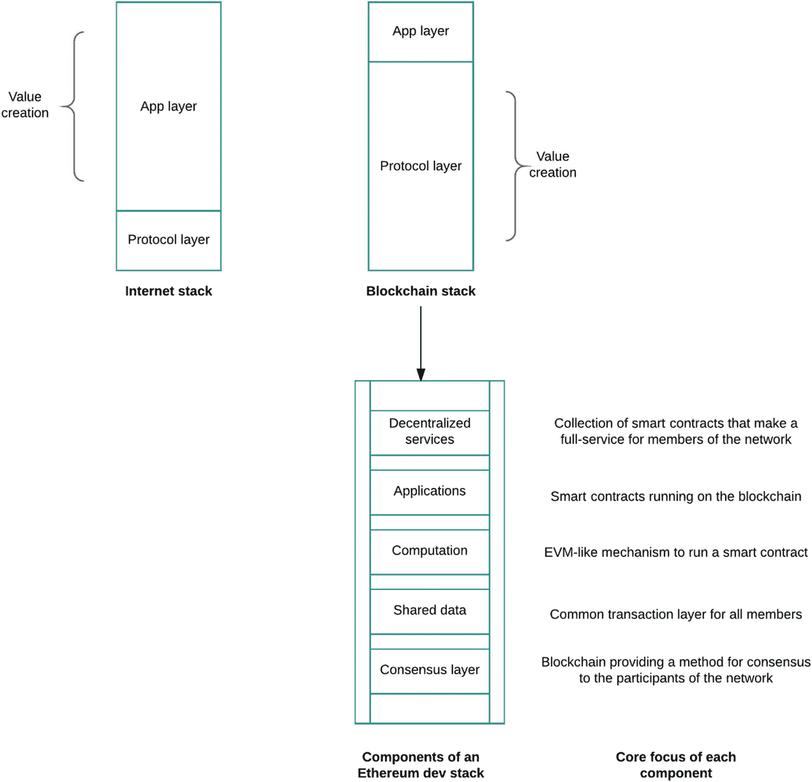

图 7-1：Token 所使用的区块链栈概览

该模型基于 Joyce J. Shen 对分布式账本技术的描述。像 Google 和 Facebook 这样的传统互联网公司通过收集用户生成的数据，在应用层创造并捕获价值。区块链公司在所有权和可用技术方面具有不同的动态。区块链本身提供了一种共识机制和一个可公开访问的共享数据层。以太坊进一步通过一个能够运行智能合约中包含的指令的 `EVM`，提供了一种图灵完备的编程语言和节点间兼容性。使用智能合约，可以构建一个完整的应用程序在区块链上运行，而一组应用程序可以成为像 `Storj` 这样的完整去中心化服务。

### 以太坊计算市场（`ECM`）

`ECM` 是一个用于链下计算的非常简单且功能性的 Token，也是我们将在本章中考虑的第一个 Token。它将作为一个教学工具和通用模型，涵盖高性能计算 Token 所需的所有必要特性。`ECM` 旨在促进链下计算的执行，这些计算如果放在以太坊虚拟机（`EVM`）中进行将过于昂贵。本质上，`ECM` 是亚马逊 `EC2`（一种在云中提供集中计算能力的网络服务）的去中心化版本。`ECM` 的关键技术进步是计算市场，它允许一个用户（客户）支付给另一个用户（主机）来执行链下算法，并将结果报告给客户。此外，为了维护链下计算的完整性，每个算法还有一个链上实现。这个链上组件可用于验证提交的最终结果是否确实正确。它还在解决争议中发挥作用。让我们通过图 7-2 来看看通过 `ECM` 的请求生命周期。`ECM` 使用一些特定于该项目的术语来描述一个请求从最初接收到最终解决的生命周期。我们在图 7-2 中使用了其中一些术语，以及我们在此讨论的一些附加术语：

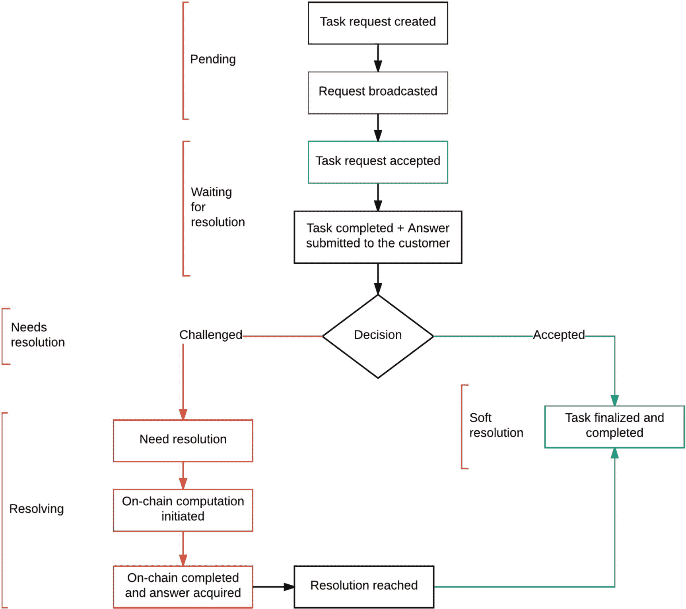

图 7-2：请求通过 `ECM` 时的生命周期

- **待处理：** 表示接收到请求时。每个请求都以待处理状态开始。
- **等待解决：** 一个计算请求已提交到网络，主机已计算了算法并正在报告结果。这是客户的一个决策点；要么接受答案，请求将进入软解决状态；要么答案被质疑，在这种情况下，请求将进入需要解决状态。
- **需要解决：** 当答案被质疑时，从决策树中选择此路径。请求状态更改为需要解决，并且需要算法的链上验证组件。
- **解决中：** 为请求执行链上计算的过渡期。请求将保持此状态，直到计算完成。
- **硬解决与软解决：** 一旦链上计算完成，请求被设置为硬解决状态。如果在答案提交给客户后的某个时间窗口内没有提出质疑，则请求被设置为软解决状态。
- **已完成：** 一旦通过软解决或硬解决获得答案，原始请求就可以设置为已完成状态。这会解锁客户端的付款，并允许主机收到链下计算的付款。

在图 7-2 中，所描述的每个请求状态都被进一步分解为一个工作流。一旦任务请求在链下处理完毕，就会有一个关于最终答案的决策点。如果客户质疑主机提供的答案，算法的链上组件将执行，请求将经历几个需要解决的状态。另一方面，如果没有提出质疑，请求将进入软解决状态，并被视为已完成。请求达到已完成状态后，主机将收到付款。

现在我们已经了解了请求如何在 `ECM` 中被处理，让我们来谈谈市场以及该市场中的各个子市场。我们之前称之为在链下计算的*算法*这一概念，由三个独立的合约组成：一个经纪人合约、一个工厂合约和一个执行合约。

- **经纪人合约:** 一种促进请求从客户传输到将执行计算的主机的合约。
- **执行合约:** 一种用于在链上验证计算的合约。当提交的答案受到质疑时，此合约可以执行一轮链上执行。
- **工厂合约:** 一种在争议解决情况下处理执行合约链上部署的合约。此合约提供相关元数据，例如重新编译字节码并验证它所需的编译器版本。

市场本身拥有垂直领域（市场内的细分市场），这些垂直领域执行专门类型的合约和算法，通过使用代币在以太坊区块链上创建特定用例的高性能计算经济。图 7-3 提供了每个市场组成部分的三种合约的可视化总结。那么，在 `ECM` 上发起计算请求需要什么？主要有两个函数用于创建请求并提供所有必要的细节。这里，`requestExecution` 函数用于创建计算请求，该函数接收两个参数。第一个是函数本身的输入集，第二个是一个时间窗口，在此期间，提交的答案可以在请求变为软解决状态之前受到质疑。这个时间窗口以区块数量给出，因为在以太坊中，区块是在确定的时间间隔内创建的。最后，此函数还指定了为此计算提供的报酬。`getRequest` 函数返回关于该请求的所有元数据。以下是从元数据返回的一些相关参数：

- `address requester`: 请求计算的客户的地址
- `bytes32 resultHash`: 给定计算结果的 SHA-3 哈希值
- `address executable`: 为解决受质疑答案而部署在链上的可执行合约的地址
- `uint status`: 请求在其生命周期中特定时间点的状态。它是一个与请求状态相对应的无符号整数，状态由数字 0-7 表示。
- `uint payment`: 此请求将为完成计算而支付（给主机）的 wei 数量。Wei 是用户之间可以转移的最小以太币单位，类似于比特币中的聪。
- `uint softResolutionBlocks`: 一个由区块数量给出的时间窗口，在此期间必须提交对答案的质疑。如果在该时间间隔内没有对答案提出质疑，请求将变为软解决状态。
- `uint requiredDeposit`: 提交答案以响应请求时，或由反对已提交答案的质疑者提供的 wei 数量。此保证金将被锁定，直到请求进入最终确定状态，然后返还给主机。

重要的是要注意，在我们的讨论中，一些任务如答案验证、冲突解决和质疑需要保证金。保证金被用作一种对策，以减少网络上发生女巫攻击的可能性。在女巫攻击中，攻击者创建多个虚假或女巫身份以接管网络。更准确地说，在我们的案例中，攻击者会在网络上创建多个虚假节点。这使得攻击者能够在网络上投票、拒绝区块批准并阻止网络上区块的传输。大规模的女巫攻击需要攻击者控制网络上的大部分计算能力或哈希率。通过接管大部分计算能力，攻击者理论上可以逆转交易并实现双重支付。这也被称为“51%攻击”。然而，实际上，随着网络规模的增长，实现 51% 攻击变得越来越不可行。

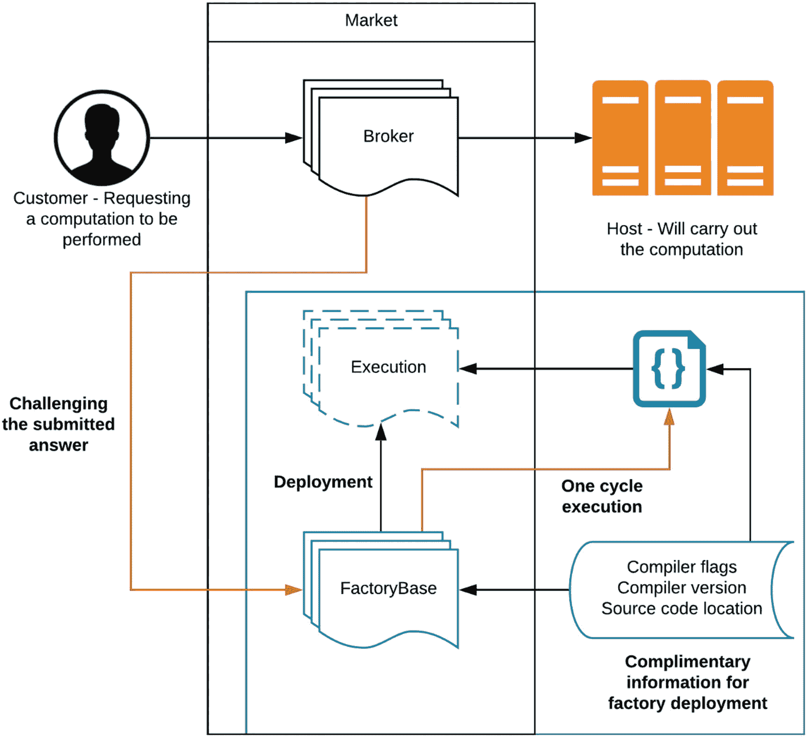

图 7-3 市场中某细分市场的概览

在图 7-3 中，我们看到了市场中响应客户请求所需的三个组件：`经纪人合约`、`执行合约`和`工厂合约`。`经纪人合约`促进客户与主机的交互，而另外两个合约在争议解决中发挥作用。如果对提交的答案提出质疑，经纪人将通过其工厂合约（也称为 `FactorBase`，以红色工作流程显示）启动执行合约的部署，该工厂合约整合信息并为算法的一轮执行做准备。执行所需的 `gas` 将从质疑者需提交的保证金中扣除。我们接下来将讨论提交和质疑流程。

接下来，我们将讨论将答案提交回客户以及质疑流程。提交链下计算完成的答案是使用 `answerRequest` 函数执行的。此函数接收正在被答复的请求的唯一 ID 作为输入。实际提交一个潜在答案需要一笔以太币保证金。此保证金将被锁定，直到请求达到软解决或硬解决状态。我们将简要讨论从相关方扣押保证金的重要性。一旦请求最终确定，提交答案的主机可以收回其缴纳的保证金以及执行计算获得的奖励。如果提交的答案不符合客户提交请求的期望，参与者可以质疑该答案。这将启动一个链上验证过程，该过程将在 `EVM` 内执行一轮计算，以验证提交的答案是否正确。如果在链上计算过程中发现提交的答案不正确，主机的保证金将被扣除该计算的 `gas` 成本。质疑者将获得客户保证金中的大部分奖励，争议由此解决。

对于提交的答案受到质疑的请求，该请求将进入需要解决状态。这通过调用 `initializeDispute` 函数实现，该函数充当从提出质疑到开始链上验证之间的过渡。现在，`经纪人合约`将使用工厂来部署一个用此请求的输入初始化的可执行合约。调用此函数并执行一轮计算的 `gas` 成本将从质疑者的保证金中报销。在请求的解决状态下，会持续调用 `executeExecutable` 函数，直到链上验证完成。此时，请求进入硬解决状态并最终确定。`Gas` 费用和奖励系统可能看起来很复杂，但它遵循一个简单的原则：正确答案获得计算报酬，而错误的提交者必须为链上验证支付 `gas`。让我们回顾一下：

- 在软解决的情况下，主机收回其初始保证金以及客户为执行计算而给予的奖励。
- 如果没有提交正确答案，则验证的 `gas` 成本由提交答案的用户平均分摊。奖励报酬返还给最初请求计算的客户。
- 在硬解决的情况下，错误的主机在扣除（用于链上验证的）`gas` 成本后，收回其剩余保证金。该主机不会获得计算奖励。
- 如果质疑者在硬解决中获胜，他们将收回其保证金以及奖励报酬。`gas` 成本从错误主机的保证金中扣除。

由于 `gas` 成本，在链上验证计算本质上是一项昂贵的任务。`ECM` 的设计使得链下计算比在 `EVM` 中运行任务更便宜。从技术角度来看，有两种类型的链上执行实现：无状态计算和有状态计算。图 7-4 展示了这两种实现之间的对比。

如果一项计算是自给自足的，即不需要任何外部数据源，则该可执行合约是无状态的。本质上，前一步的返回值被用作下一步的输入。`Piper Merriam`（`ECM` 的创建者）提出，无状态可执行合约优于有状态实现，主要原因有两个：编写算法时开销更低，以及由于计算周期是自持的，降低了复杂性。`Piper` 强调的一个例子是斐波那契数列，它被编写为一个无状态实现，算法将最新的斐波那契数列作为下一执行周期的输入。以无状态形式编写此算法的开销非常小，并且没有引入本地存储的额外复杂性。

> **提示**
> 对于无状态合约，执行合约与作为计算请求发送到市场进行计算的算法是相同的。在这里，链上验证将运行执行合约一个周期，而主机将运行它所需的尽可能多的周期以获得最终答案。

如果一项计算不是自给自足的，即需要额外的数据源以及前一步的返回值，则该可执行合约是有状态的。这个额外的数据源通常是一个持有本地存储的数据结构。让我们回到斐波那契数列的例子，现在让它变得有状态。为此，算法会将每个计算出的数字存储在合约存储中，并且只将最新的数字返回给算法以进行下一执行周期。执行的每一步都需要算法搜索最后存储的数字，以便计算下一个数字。通过包含存储，算法现在必须搜索已保存的结果，并输出任何已计算出的所需斐波那契序列。对本地状态的依赖使得这个合约实例成为有状态。有状态合约支持新的复杂功能，例如使用查找表和搜索，但也导致编写的算法复杂性增加。

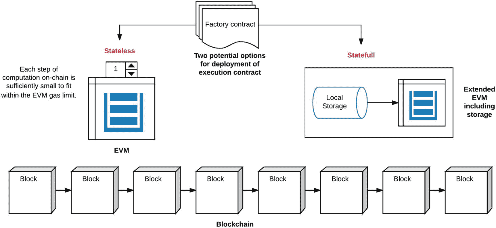

图 7-4 以太坊计算市场中的工厂执行合约的两种模型

在图 7-4 的链上验证过程中，将执行执行合约的一个周期。然而，无状态形式的自包含合约将高效地执行，且没有任何额外的复杂性。在无状态合约中，在 `EVM` 内部执行的每一步都是基本的，因此它在那个虚拟机的 `gas` 限制之内。另一方面，由于执行的复杂性，一些合约需要额外的存储。在这种情况下，会执行有状态合约，其中本地存储在链上验证期间绑定到 `EVM`。此存储是临时的，仅在链上处理期间存在。

## Golem 网络

`Golem` 是一个去中心化的通用超级计算网络。除了作为计算资源租用市场之外，`Golem` 还旨在为微服务提供动力并允许异步任务执行。作为一个技术栈，`Golem` 通过去中心化的区块链栈为开发者提供了基础设施即服务（`IaaS`）和平台即服务（`PaaS`）。在 `Golem` 中，有三个组件作为去中心化市场的支柱：

- **去中心化农场：** 一种发送、组织和执行来自个体用户（称为请求者）和主机（称为提供者，提供计算资源）的计算任务的机制。这为用户提供了竞争性价格，用于诸如 `CGI` 渲染和网络访问上的机器学习等任务。

- **交易框架：** `Golem` 拥有一个自定义支付框架，供开发者将开发并运行在去中心化网络上的服务和软件货币化。此框架可以定制，以通过新颖创新的方式捕获价值，例如在以太坊区块链上的托管、保险和审计证明。

- **应用注册表：** 开发者可以创建利用 `Golem` 作为分发渠道和拥有新颖独特货币化方案的市场（针对特定任务）的应用程序。这些应用可以发布到应用注册表，该注册表本质上作为该网络的`应用商店`。

`Golem` 构建市场的前提是并非所有成员都会一直需要额外的资源进行大量计算。因此，请求者可以成为提供者，出租自己的硬件以赚取额外费用。图 7-5 概述了 `Golem` 中的三个组件如何协同工作。目前，`Golem` 从以太坊继承其完整性（拜占庭容错）和共识机制，用于任务的部署、执行和验证。然而，最终 `Golem` 将使用完全功能的微支付通道来运行构建在 `Layer 2.0` 升级之上的微服务。这将允许用户以完全去中心化的方式运行服务，例如笔记应用、托管网站，甚至大规模流媒体应用。在 `Golem` 达到该成熟度水平之前，还需要进行一些优化；目前，最紧迫的发展涉及任务的执行。在执行通用任务之前，我们需要确保计算发生在一个没有特权的隔离环境中，类似于 `EVM`，但扩展了更多功能。我们还需要应用注册表中认可的白名单和黑名单机制以及数字签名，这允许提供者建立信任网络，并允许用户运行由可信开发者进行加密签名的应用程序。此外，需要一个网络范围的信誉系统来奖励在计算任务中参与最多的提供者，同时检测恶意节点并有效地缓解任务。

> **注意**
> 第一个版本，称为 `Brass Golem`，只允许一种类型的任务在网络上执行——`CGI` 渲染。此版本的主要目标是验证任务注册表并拥有一个基本的任务定义方案。开发者希望集成 `IPFS` 用于去中心化存储、为相关提供者建立基本的信誉系统，以及在网络中集成 `Docker`。后续版本增加了本节后面讨论的新功能。

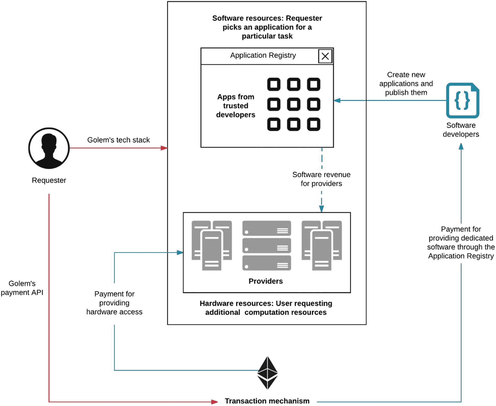

图 7-5 `Golem` 技术栈

`Golem` 堆栈的三个主要组件如图 7-5 所示。软件开发人员创建自动化日常任务的应用程序，并将其发布到应用程序注册表中。例如，一个限时渲染应用程序可以消除对任何复杂交易或任务跟踪的需求。买方只需支付一次性押金，并在时间结束前使用该应用程序。当买方使用注册表中的应用程序时，所产生的收入将用于补偿开发人员的应用程序。该注册表包含两种类型的应用：经认证的开发者发布的已验证应用，以及来自未确认开发者的新应用。最终，验证者会将新上传的应用集中起来，并密切跟踪它们是否有任何可疑活动。经过几次使用后，新应用也会获得已验证状态。开发人员还会因这些应用在提供者节点上执行而获得少量报酬。提供者申请硬件用于运行应用，而运行任务产生的大部分收入将返还给提供者（矿工）。交易机制确保资金正确交付给相应的参与方，买方也通过同一机制为任务执行付费。

### 应用程序注册表

应用程序注册表为请求者提供了一个庞大的仓库，用于搜索符合其需求的特定工具或应用。该注册表是一个以太坊智能合约，涉及三个实体：作者、验证者和提供者。添加这三个实体背后的设计原理是什么？对于通用计算而言，代码被隔离在沙箱中，并以最低权限执行。但潜在的软件漏洞可能会在提供者的沙箱中造成严重破坏，在虚拟机中执行恶意代码，意图提升权限，甚至接管机器。这就是为什么仅靠沙箱隔离对 `Golem` 来说是不够的。有人可能会问，是否可以对代码进行自动化的安全评估？理论上，这是不可行的。由于停机问题，我们无法在执行复杂算法之前确定其结果。

> **注意**
> 停机问题是：给定任意计算机程序及其输入，判断该程序是最终会停止运行，还是无限期继续运行下去的问题。

为了确保在主机上安全可信地执行代码，应用程序注册表被划分为三个负责维护网络完整性的参与方。作者将去中心化应用发布到注册表，验证者通过创建白名单来审查和认证 `DApp` 为安全的，而提供者则维护问题 `DApp` 的黑名单。验证者还会通过将应用标记为恶意或垃圾信息来维护黑名单，而提供者通常最终会使用验证者提供的黑名单。类似地，提供者可以预先批准某些特定的 `Golem` 应用（经认证者认证）在其节点上执行。

提供者也可以选择自行策划其白名单或黑名单。`Golem` 的默认选项是使用受信应用的白名单来运行。第一组应用将由开发人员验证，以启动 `Golem`；然而，在初始分发之后，网络将依赖于验证者。另一方面，提供者也可以采取仅依赖黑名单的方法。这种方法的优势在于能最大化提供者的覆盖范围（面向市场），并提供可在节点上执行的广泛应用。最终，提供者将变得专业化，并对其节点进行微调，使其在执行某一类任务时极其高效。这使提供者能更好地控制其节点上运行的内容，并为计算农场提供自定义硬件选项。最终，这一选项可供那些希望最大化利润并愿意运行搭载前沿软件的专用机器的开发者使用。

在像 `Golem` 这样的去中心化网络中，我们将看到传统验证者和先锋验证者之间的分化。传统验证者将维护一组执行非常常规任务的稳定应用。例如，一个复杂的 3D 渲染请求可以在提供者的节点上启动一个可抢占的渲染实例。一旦任务完成，该实例将终止以释放内存，并将输出发送给请求者。另一方面，先锋验证者将纳入并批准那些突破 `Golem` 能力边界的新软件。在提供者的节点上运行新的实验性软件需要更好的虚拟机沙箱隔离和加固。但这些功能可以作为运行于提供者提供的特殊节点上的高级附加组件。将高级附加组件货币化也将阻止诈骗者和恶意实体。总体而言，这种设计方法使网络更具包容性，让诈骗者付出更高成本，并为开发者带来更多创新。

## 交易框架

该交易框架可类比为`Stripe`：一个用于在Golem上实现应用货币化的API。众筹结束后，网络将使用`GNT`（Golem网络代币）处理用户间的所有交易，以补偿软件开发者和计算资源提供者。该交易框架构建于以太坊之上，因此继承了底层支付架构，并扩展出高级支付方案，例如`纳米支付机制`和`交易批量处理`。这里提到的两项创新均为Golem独有，接下来我们将讨论它们为何对网络不可或缺。

为了驱动微服务，Golem需要处理海量的小额交易。单次支付的价值极低；这类支付也被称为“纳米支付”。然而，使用纳米支付存在一个难题：交易费用不能超过纳米支付本身的价值。为了解决这个问题，Golem采用了交易批量处理。该方案将若干纳米支付聚合起来，作为单笔以太坊交易一次性发出，从而降低所产生的交易费用。例如，Golem开发者指出，在一笔交易中处理十次支付的成本，大约相当于分十笔交易处理同一金额的一半。通过批量处理多笔交易，为微服务按单位用量（按节点或按小时）付费的用户将能享受到显著降低的交易费用。

> **注意**
> 对于提供者而言，另一种驱动微服务的模式是基于信用的按单位托管付费。在此模式下，请求者存入带有时间锁的`GNT`作为押金，提供者在一天结束时自动扣除使用费用，剩余信用额度将返还给请求者。

在Golem中，纳米支付运作于“一对多”的微支付场景中，即一个请求者向多个协助完成计算任务的提供者支付。微服务的支付规模约为0.01美元，对于如此小的金额，即便在以太坊上，交易费用也相对高昂。这里的思路是：请求者（付款方）不再进行单笔0.01美元的交易，而是发行一张中奖概率为1/100、奖金为1美元的彩票。这张彩票对于请求者而言价值0.01美元，其优势在于，平均每100张彩票中只有一张会触发实际交易。这是一种支持纳米交易的概率性机制，但如果计算的任务数量较少，则无法保证某个具体的Golem节点能得到充分补偿。Bylica等人提供了数学基础，以确保随着网络扩展、请求者和提供者数量增加，这种彩票系统产生的收入能够公平分配。本质上，随着请求者发布的任务数量增加，一个节点从概率性彩票奖励中获得的收入，将趋近于它通过单笔交易收取费用所能获得的金额。

对于提供者而言，Golem将要实现的彩票系统比纯粹的概率性方案具有更高的可预测性。提供者可以确信，在用于奖励单个任务参与者的所有彩票中，不存在哈希冲突，且只有一张是中奖彩票。此外，如果有100个提供者参与彩票支付，那么纳米支付协议将保证该任务只需支付一次。Bylica及其合作者讨论了几种反索赔机制，以防止恶意实体冒充中奖者并套现。图7-6简要描绘了彩票流程。任务完成后，付款方发起一个新的彩票来支付参与其中的提供者。付款方创建彩票描述`L`，其中包含唯一的彩票标识符，并计算其哈希值`h(L)`。该哈希值被写入以太坊合约存储。付款方还将彩票描述`L`广播到Golem网络，以便每个参与节点可以验证支付金额是否正确，并确认`h(L)`确实已写入以太坊存储。彩票中奖者可以通过交叉引用给定的描述`L`和一个除彩票智能合约外无人知晓的随机值`R`来唯一确定。经过一定时间后，如果奖励未被申领，智能合约会（根据`L`和`R`）计算出获胜提供者的地址，并将奖励从合约关联的存储中转移给获胜者。彩票的哈希值`h(L)`也会从合约存储中移除，新的彩票支付周期随即开始。

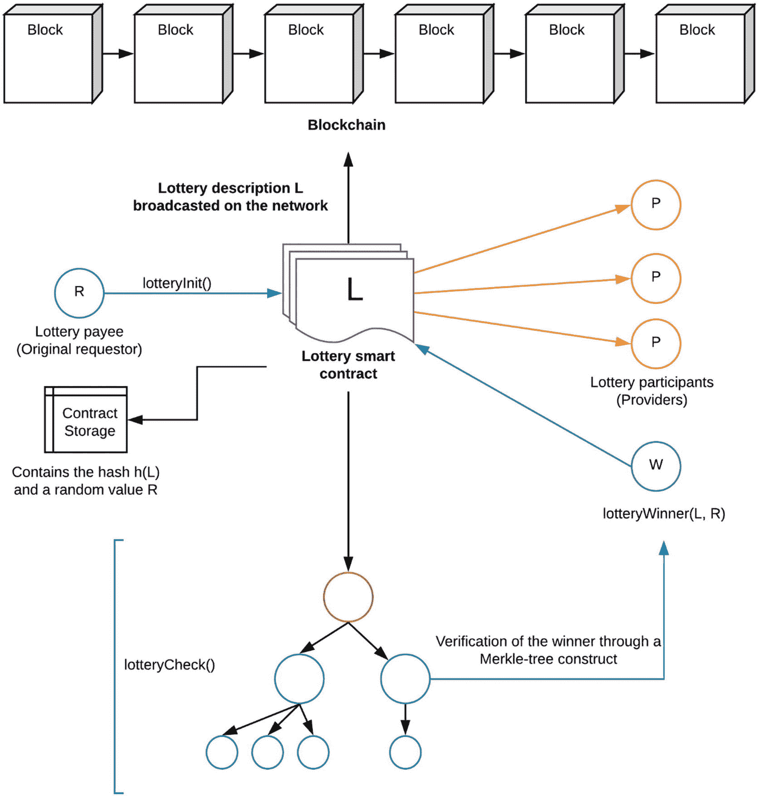

从宏观层面看，Andrzej Regulski撰写了一篇文章，阐述了`GNT`背后的部分经济原则，以及这种交易框架如何推动代币的长期增值（[https://blog.golemproject.net/the-economics-of-the-golem-network-token/](https://blog.golemproject.net/the-economics-of-the-golem-network-token/)）。以下是其文章中最相关的段落：

> 要与Golem网络交互，必须使用`GNT`。最初，它的唯一作用是实现价值从请求者向提供者以及软件开发者的转移。随后，交易框架将允许为代币赋予更多属性，例如，要求押金必须以`GNT`存储。
> `GNT`的数量（即供应量）将永久固定在其在Golem众筹期间生成的水平。之后不会再有新的`GNT`被创造出来。
> 代币的贬值或增值对网络运营是中性的，因为用户可以自由地为Golem中的计算资源设定任何出价/要价，从而适应`GNT`价值的任何波动。
> 固定数量的代币将不得不满足日益增长的交易需求，从而推高对`GNT`的需求。在合理假设代币流通速度（即特定时期内单位代币的交易次数）保持恒定的前提下，可以从货币数量论推导出这一结论。这反过来意味着，Golem网络的整体成功和增长，预示着`GNT`的长期增值。

此支付框架也可用作冲突解决的备用机制。如果某个任务挑战在经历传统Golem机制后仍悬而未决，我们将需要一种硬性解决方法（如我们在“Ethereum计算市场”部分所见）。此时，我们可以使用类TrueBit风格的“审判”来进行最终裁决。TrueBit是一个基于智能合约的、为Ethereum构建的争议解决层。它作为附加组件集成在现有Ethereum项目（如Golem）的架构之上。TrueBit的设计原则是依赖网络中唯一可信的资源——矿工——来解决争议。使用TrueBit进行硬性解决依赖于一个涉及有限资源验证者（称为法官）的验证子程序。

在TrueBit的验证游戏中，有三个主要角色：求解者、质询者和法官。求解者提交任务的解决方案，质询者对提交的答案提出异议，法官则判定质询者或求解者哪一方正确。使用验证子程序的目的是降低链上计算的复杂度。这是通过游戏分轮次进行来实现的：每一轮都会缩小计算范围，直到只剩下一个简单的步骤。这最后一步由智能合约（法官）在链上执行，并最终裁定哪一方正确。请注意，这个方案中的法官在算力上是受限的。因此，最终只会将极其简单的计算放到链上供法官裁决。验证游戏的直观指南如图7-7所示。

> **注意**
> 验证游戏以迭代方式运作，其奖励结构有利于那些勤奋查找错误的验证者（质询者）。准确检测并最终验证错误后，质询者将获得丰厚的累积奖金作为奖励。

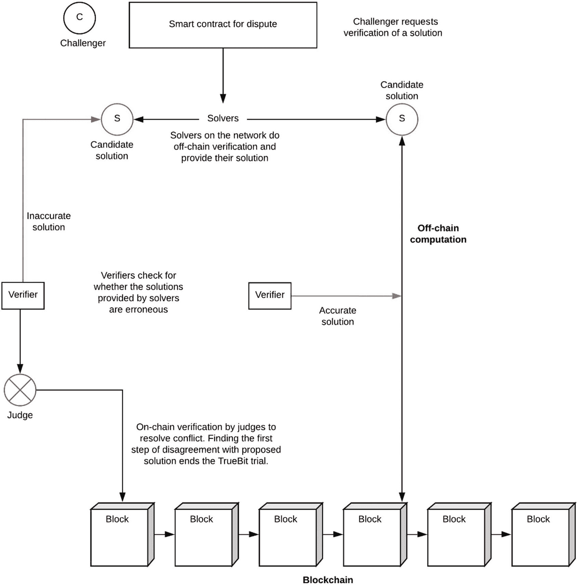

要开始此游戏的第一轮，求解者必须提交在特定时间窗口内执行的一系列步骤（计算）。求解者选择在该时间窗口内时间间隔相等的计算步骤，并创建一个映射到网络完整内部状态的Merkle树。这些树的Merkle根被广播到区块链上。随后，质询者会通过Merkle树执行二分查找，直到发现第一个与自身预期不符的实例。也就是说，她找到一个步骤`i`，在该步骤中，当状态从步骤`i`转换到步骤`i+1`时，Merkle根并未更新。给定步骤`i`，质询者可以请求获取该步骤前后内存访问的Merkle证明。在此上下文中，Merkle证明是从步骤`i`到Merkle根的路径，以及所有兄弟节点（它们捕捉了步骤`i`时的网络状态）。请注意，步骤`i`和`i+1`前后的兄弟节点完全相同；只有步骤`i`的数据会发生变化。此时，法官可以执行步骤`i`，并检查将状态更新到`i+1`是否也正确更新了Merkle根。法官可以据此确凿地发现哪一方在此步骤中是错误的，并广播裁决结果。最终，要么作弊的求解者受到惩罚，要么质询者为此误报所消耗的资源买单。

与ECM中实现的链上验证相比，TrueBit是一种先进的链上执行机制。它能够以低于运行完整指令集的成本来验证计算，因为只有一步是在链上执行的。通过将TrueBit用作链下计算的争议解决层，智能合约可以使第三方程序以无需信任的方式执行文档完善的例程。即使是需要TB级数据的先进机器学习应用（如深度学习），只要训练数据的根哈希被编码在智能合约中，就能用其验证链下计算的完整性。TrueBit之所以能够处理大型数据集，原因很简单：Merkle根映射了网络在给定时间点`t`的状态，并且质询者能够执行二分查找。对于像Golem这样旨在面向多种用例实现高性能计算（HPC）的项目，TrueBit可以支持在链下使用大型数据集，同时通过链上机制保证输出结果的准确性。

> **注意**
> 链下任务执行引发了对网络完整性的担忧。Ethereum的Layer 2.0升级正在提升整体网络安全，并实现无需信任的链下任务执行。为此，TrueBit正被考虑作为Layer 2.0升级的候选方案。

Clay Golem的发布带来了三个正在考虑的新用例：

*   **gWasm：** WebAssembly (`Wasm`) 是一种独立于操作系统的格式，用于分发能在各种平台上以接近原生性能执行的二进制文件。`gWasm`是一个用于将新应用集成到Golem网络的封装器。`gWasm`的前提是：如果一个应用能编译为`Wasm`，它就能被分发给Golem网络。目前处于早期开发阶段。
*   **gLAMBDA：** Golem即将推出的一个科学用例。应用并行化在Golem网络上（以去中心化方式）执行RASPA模拟。RASPA是一个通用模拟包，可用于气体、流体和碳纳米管中分子的模拟。
*   **视频转码：** Golem另一个即将推出的用例。专注于将大型视频文件从一种格式数字转换为另一种格式。

## SONM（由网络挖矿组织的超级计算机）

`SONM`是雾计算概念在区块链上的一种去中心化实现。要理解`SONM`如何在雾计算框架内运作，我们首先需要定义两个网络概念：`IoT`（物联网）和`IoE`（万物互联）。欧盟委员会将物联网(`IoT`)架构定义为一个由具有IP地址并能通过网络传输数据的物体组成的泛在网络。`IoT`更广泛地归属于万物互联(`IoE`)这一概念，`IoE`在现实世界和虚拟世界中的物体之间提供无缝的通信总线和上下文服务。`IoE`被思科公司定义如下：

> 人、流程、数据和事物的网络化连接。`IoE`的益处源于连接人、流程、数据和事物所产生的复合效应，以及这种日益增强的连接性在“万物”在线时所创造的价值。

虽然`IoT`传统上指连接到彼此或云服务的设备，但`IoE`是一个更侧重于将“人”作为产生收入业务逻辑中关键组成部分的总称。从工程角度来看，`IoT`是专注于设备间通信的消息传递层，而`IoE`是允许初创公司通过人与设备之间的交互来获利的货币化层。在`IoT`网络中连接的设备会产生海量数据。将这些数据传输到云端进行处理需要巨大的网络带宽，并且在数据生成、处理数据以及接收结果之间存在延迟（从数小时到数天不等）。`IoT`技术的一个主要限制就是这种传输延迟时间。近期，人们越来越关注由于传输和处理阶段而导致的可操作数据价值的损失。当我们收到那些处理后的结果时，再对这些数据采取行动已经为时已晚。

思科公司的Ginny Nichols提出的一个解决方案称为**雾计算**。雾计算通过将处理阶段转移到网络的较低层级来减少传输延迟。雾计算并非将任务卸载到集中式云端进行处理，而是将高优先级任务推送到离实际生成数据的设备最近的节点上进行处理。一个设备要参与雾计算，必须能够处理任务、拥有本地存储并具备一定的网络连接能力。雾计算这一概念是个隐喻，意指雾通常在地面附近形成。因此，雾计算将云服务扩展到了更靠近产生`IoT`数据的设备（地面）的位置，以便实现更快的行动。在雾计算中，数据处理被认为集中在边缘（更靠近生成数据的设备），而不是集中在云端。这使我们能够最小化延迟，从而更快地响应时间敏感型任务，或缩短对数据采取行动所需的时间。`SONM`将雾计算的这一层能力提供给去中心化的参与者网络，用于处理计算密集型任务。

> **注**
> 大型企业对其收集的数据（或业务分析）需要更快的响应时间，这刺激了如`Apache Spark`、`Storm`和`Hadoop`等实时计算处理工具的发展。这些工具允许在数据收集和传输的过程中对其进行预处理。同样地，雾计算似乎是`IoT`的一个扩展，其发展是为了满足快速数据分类/处理的需求。

`SONM`构建于`Yandex.Cocaine`（可配置全能自定义应用集成网络引擎）之上。`Cocaine`是一个开源的`PaaS`（平台即服务）堆栈，用于创建应用程序的自定义云托管引擎，类似于`Heroku`。`SONM`拥有复杂的架构，旨在模仿以太坊的世界计算机模型。`SONM`团队设计的这台世界计算机，其组件与传统的个人计算机类似，但有一个主要区别——这些组件连接到了一个去中心化网络。

*   **中央处理器/处理器（负载均衡器）：** 在`SONM`的架构中，处理器（中枢）充当负载均衡器和任务调度器。整个网络可以表示为一个中枢节点（或中枢）链，负责分发任务、从计算雾中收集结果、向矿工支付服务费用，并提供网络整体健康状态更新。每个中枢节点相当于一个处理器核心，核心（或中枢节点）的数量可以根据需要在网络上进行扩展或缩减。在个人计算机中，核心对于处理器来说是本地可访问的；然而，在`SONM`中，核心本质上是去中心化的。中枢为整个网络协调任务执行提供支持。更具体地说，中枢提供了在雾计算云上处理和并行化高负载计算的能力。
*   **基本输入输出系统（区块链）：** 对于`SONM`来说，`BIOS`（基本输入输出系统）就是以太坊区块链。以太坊为网络共识和支付机制提供了可靠的支柱，`SONM`可以继承这些特性。然而，基础的以太坊实现缺乏负载均衡器，并且高昂的Gas费用催生了在区块链之上的替代方案，例如`SONM`。
*   **图形处理单元：** `SONM`的`GPU`（图形处理单元）就是雾计算云。更具体地说，这个雾计算云由`SONM`网络中的矿工组成，他们将自己的计算资源提供给买家使用。
*   **连接的外设：** `SONM`中的买家相当于外围设备。买家连接到网络并为他们使用的任何资源付费。请求被广播到区块链上，矿工选择在他们自己的机器上执行哪些请求。然后，负载均衡器决定任务的执行。
*   **硬盘：** `SONM`中的存储将使用成熟的去中心化存储解决方案来实现，例如`IPFS`或`Storj`。
*   **串行总线：** 一种通信模块，用于网络内发送方（节点）和工作机器之间的消息传递和数据传输。该串行总线基于`Ethereum Whisper`，支持网络上的消息广播和监听功能。
*   **插件电路板：** 插件板可以被视为网络的扩展包。它允许`SONM`通过无缝集成兼容的网络和计算农场来扩展其处理能力。

图7-8提供了世界计算机组件的可视化表示。

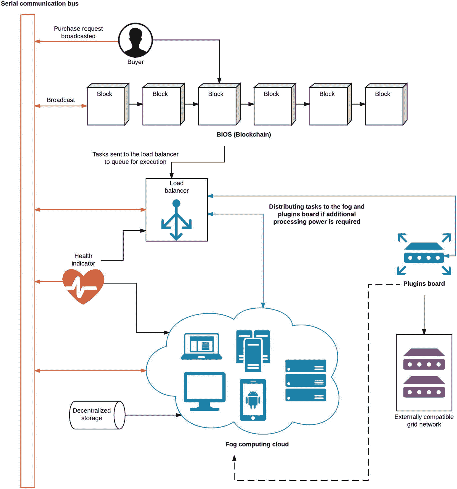

在Figure 7-8中，你可以看到通信总线构成了该架构的骨干，在每个层级都与世界计算机的组件相连。通过SONM的请求工作流始于买家请求计算资源。该请求被广播到区块链和串行总线上，以便其他组件能够验证特定请求是否合法。矿工接受任务，负载均衡器将任务分发到雾计算云中执行。如有必要，负载均衡器还可以通过插件板将任务分配给与SONM兼容的特定应用网格网络。雾云还拥有一个去中心化服务的本地存储，例如`Storj`或`IPFS`，可按需使用。最后，负载均衡器还有两个更重要的角色：跟踪任务结果和整体网络健康状况。负载均衡器（`Hub`）在任务完成后收集结果，并将其发送回买家。健康指标向负载均衡器和网络报告世界计算机中每个组件的状态，以便在任务分配/执行方面做出更优决策。

SONM中的智能合约系统是一组用于区块链治理和网络上去中心化应用管理的协议（智能合约）。该智能合约系统维护着网络的完整性，并提供了若干针对恶意实体的对策，我们将在后面讨论。此外，SONM使用形式化定义和严格证明来展示买家与提供商之间通信的安全性（加密安全的消息传递）。网络中各参与方之间的交互使用一种名为`pi-calculus`的高级数学框架进行建模。该框架是一种形式化语言，用于描述在多参与方系统中通过定义良好的信道进行的安全并发交互。SONM中的治理原型包括一个去中心化自治组织（DAO）、一个法院合约、一个网络范围的中继注册表，以及一个用于将新应用部署到SONM网络（例如，白名单、中继工厂和中继钱包）的工厂合约。该模型进行了扩展，包含了管理网络上运行的DApp所必需的一些新元素（由工厂部署）。目前，购买计算资源的过程在网络中看起来非常分散。然而，在未来的版本中，买家将填写一份预购计算表单，以指明他们的硬件选择、要使用的DApp以及任何特殊的执行参数。让我们更深入地了解当前SONM“区块链政府”中使用的完整智能合约集合：

*   **SONM代币：** 网络的默认货币。该代币用于奖励提供计算资源的矿工，以及网络内的用户交易。
*   **DAO：** SONM的监管机构，授予用户投票权和管理去中心化应用的行政权限。网络上的DApp需要支付税收才能被纳入DAO并获得法院访问权限。DAO还拥有执行特权，可以执行诸如封禁中继、释放和锁定资金以确保矿工获得适当报酬，以及暂停或禁止中继等操作。
    > **注意**：法院将作为一个可通过DAO访问的争议解决智能合约来实现。它将为市场中的不公平买家或提供商提供保护，并在对解决方案提出质疑时提供结果验证。

### 中继工厂与钱包

-   `中继工厂`：一个中继在智能合约系统中有两个扩展：一个工厂和一个钱包。钱包只能由中继钱包工厂创建。工厂创建一个新的钱包合约，然后将此合约注册到白名单中。
-   `中继钱包`：中继钱包是一个接收买家付款并促进向矿工支付服务代币的合约。钱包由工厂创建，可以处于四种可能状态之一：已创建、已注册、空闲、疑似/已惩罚。最初，所有钱包都处于已创建状态，并有一定数量的冻结资金。在已创建状态下，合约可以在白名单上注册。该合约随后切换到已注册状态，并有权访问高级功能，例如转账和发薪。现在，该钱包可以在一个称为发薪期的指定时间内开始向矿工（但不向自己）付款。在发薪期结束后，钱包可以使用 `payday` 函数将剩余资金转移到所有者的钱包。如果发现关联的中继存在恶意行为，DAO 可以将其列入黑名单并没收冻结资金。根据情况，DAO 可以进一步决定将钱包状态更改为疑似或已惩罚。
-   `白名单`：白名单是一种注册类型的合约，包含网络中中继的详细信息，包括其状态。所有由工厂创建的钱包都在此白名单合约中注册。最初，此白名单作为经 SONM 开发者验证为安全可靠的可信中继注册表。最终，此功能将扩展到开放对新涌现中继的评级。
-   `RegApp`：一个使用 `React.js` 制作的简单 Web 应用，用于中继节点注册。该应用程序将一个节点添加到白名单合约中。需要注意的是，`RegApp` 与语言无关，只需要一个 Web 界面来注册节点。在此示例中使用了 `React.js`，但其他 Web 编程语言也同样适用。
-   `PayOut 应用`：一个在 SONM 网络上运行的支付应用程序，用于支付和处理给予矿工服务报酬的代币。该应用程序是工厂合约将部署的 DApp 类型的一个示例。

Figure 7-9 为刚刚讨论的智能合约系统提供了直观的补充说明。来自 Chain Cloud 的 Anthony Akentiev 审阅了 SONM 白皮书，并就未来版本中使用 SONM 代币为开发此智能合约架构提供资金的众筹工作提供了一些评论（[`https://medium.com/chain-cloud-company-blog/sonm-whitepaper-review-353ca2713ba9`](https://medium.com/chain-cloud-company-blog/sonm-whitepaper-review-353ca2713ba9)）：

> *众筹分为两个阶段——预售和 ICO。所有资金的 19% 和 20% 作为奖励发送给团队。开发和营销需要等额的資金：预售后，34% 用于开发，32% 用于营销；ICO 后，30% 用于开发，33% 用于营销。这看起来很好且公平。*
>
> *结论——45/60*
>
> *这是我读过的最好的白皮书之一。大项目。大目标。预售和 ICO 将会很盛大。*

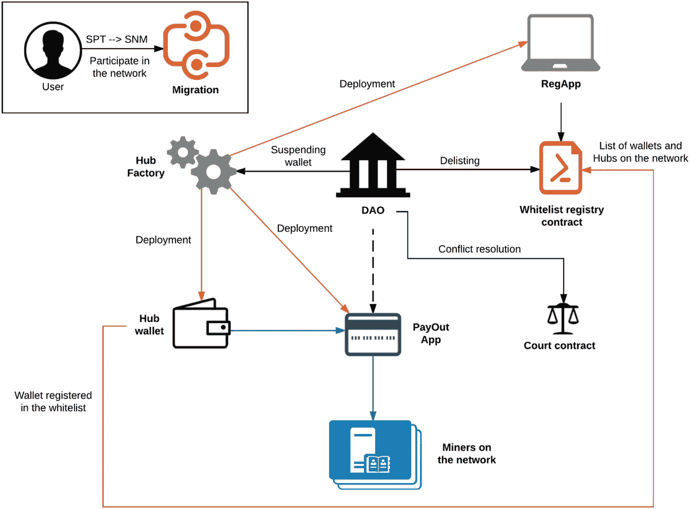
图 7-9 SONM 智能合约系统概览

回顾一下，SONM 中的智能合约系统由多个相互协作的合约组成。其中第一个合约是迁移功能，它允许购买了 SONM 预售代币（`SPT`，即 Anthony 提到的预售期间发行的代币）的用户将其代币兑换为 `SNM`（SONM 代币）并参与网络。接下来是 SONM 中用于应用部署的中心工厂合约。在当前实现中，中心工厂会创建用于向矿工支付计算资源费用的中心钱包。该工厂还会部署一个全网白名单合约，该合约作为网络中活跃中心的注册表以及每个中心内创建的钱包记录。最后，工厂部署一个支付应用，用于向矿工发放 `SNM` 代币以酬谢其提供的服务。我们在此要讨论的最后一个智能合约是 DAO，它提供了若干管理功能来阻止恶意实体。这些功能包括：在发现欺诈行为时将中心除名（从白名单合约中）、通过暂停中心钱包来冻结资金，或在出现争议时通过法庭进行冲突解决。

### 买家–中心–矿工交互

在 SONM 网络上发布请求计算资源的任务，需要在买家与执行任务的矿工之间进行大量的通信。例如，在处理开始之前，矿工、分配任务的中心和买家之间会发生多次验证交互。一旦买家通过验证，中心会将任务分配给矿工的雾计算云，并确保矿工获得服务报酬。这组交互在此被定义为买家–中心–矿工通信。这种交互可以通过图 7-10 的两部分直观地展示。第一部分，图 7-10 (A)，解释了计算开始时矿工与中心之间的交互；图 7-10 (B) 则通过引入买家和矿工的支付流程展现了全貌。

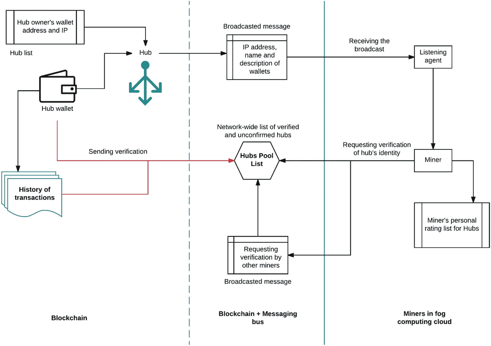
图 7-10 (A) 矿工–中心验证

在图 7-10 (A) 中，我们看到一个中心正在向区块链广播关于活跃中心钱包以及中心所有者 IP 地址的信息。这些信息由监听代理收集，然后分发给矿工。在执行任何任务之前，矿工会经过一系列步骤来验证分配任务的中心。此过程确保该中心值得信赖，并且其中心钱包中有足够资金来支付计算费用。矿工通过一个名为“中心池列表”的全局列表来获取关于分配中心的更多信息。这个全网范围的列表包含了所有已验证和未确认的中心。为了自我验证，中心钱包会向区块链发送其地址以及过往交易历史，作为身份验证的凭证。矿工接受该凭证后，即可开始计算。必须注意的是，此验证过程的所有组件——包括中心广播、验证请求、钱包信息以及中心池列表——都使用相同的基础设施：区块链。这些请求和广播通过构建在区块链之上、基于 Whisper 的消息总线共享给网络中的其他节点。图中蓝色虚线表示区块链上持续进行的过程，通知则通过消息总线传递。除了中心池列表，矿工还可以请求其他矿工独立验证分配中心的凭证。随着时间的推移，矿工会为网络中曾分配过任务的中心建立一个个人评分列表。该列表可用于自动化任务接受流程，并跳过对高度可信中心的验证步骤。

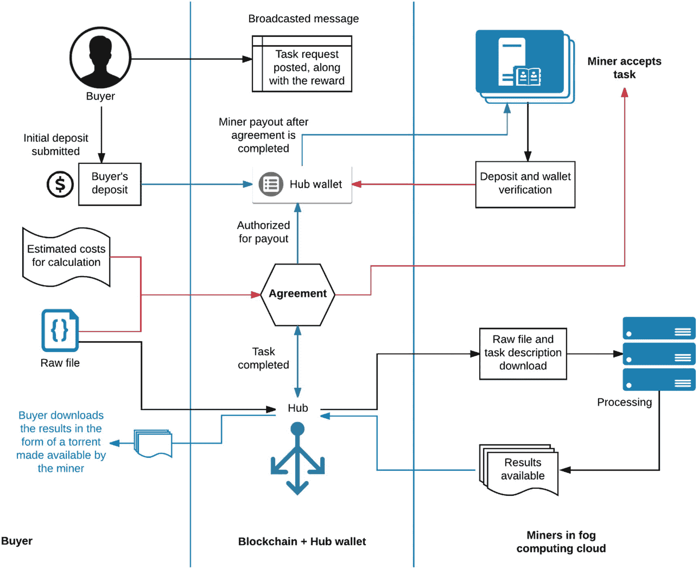
图 7-10 (B) 买家–中心–矿工交互

在图 7-10 (B) 中，我们看到在分配任务的中心完成初步验证后，买家会存入一笔初始押金。这笔押金是对计算成本的粗略估算，并存储在中心钱包中。矿工验证这笔押金后，买家会在区块链上签署一份协议，其中包含预估费用以及原始文件的哈希值。当中心分配计算任务时，该协议会被发送给矿工。原始文件通过种子供矿工下载。文件下载完成后，任务描述连同任何特殊参数被应用，处理过程随即开始。任务完成后，结果从雾计算云中提供，中心负责收集这些结果。随后，中心会通过另一个种子使结果可供买家下载。此时，协议已完成，中心钱包中的资金会发放给矿工，以酬谢其提供的计算资源。在未来的版本中，将加入适当的锁定机制来处理费用估算过高或过低的情况。在买家调整估算误差之前，中心不会释放结果。

### 超级全局网络操作系统（SOSNA）

那么，买家如何知道矿工是否满足编译和运行其所请求应用所需的依赖项？买家又如何知道哪些应用与矿工的系统设置兼容？这些问题由 SONM 的操作系统处理。没有操作系统的驱动，世界计算机是不完整的，而 SONM 的操作系统被称为 `SOSNA`。

**注意**
在本章中，我们仅在 HPC 服务的买家和提供商背景下讨论了 SONM；然而，早期版本 SONM 的首批用例将专注于以完全去中心化的方式运行 *Quake* 服务器。路线图包括消息传递协议和支付应用。

依赖管理和编译器兼容性问题将通过在主机器上使用容器来解决。容器本质上是一个最小的虚拟机，能够加载任何指定的配置，从新的库到标准工具（如 GNU 编译器工具链）。容器在主机系统上一个最小的隔离环境中运行。这样做是为了防止容器内运行的恶意程序发起权限提升攻击。`SOSNA` 可分为三个主要组件：包含智能合约系统的区块链层、一个网格核心以及面向消费者的应用层。我们已经详细讨论了区块链层和 API（由智能合约启用）。现在，让我们把焦点转向网格核心。在 SONM 中，任何网格兼容的 PaaS 堆栈都可以接入网络工作，例如 BOINC（伯克利开放式网络计算基础设施）或 Yandex.Cocaine。

一个简化的网格架构实现包含两个单元：多个工作/从属模块和一个主控模块。这两个单元构成一个计算云，而雾计算云将这一想法扩展到部署在所有类型机器上的数百个实例。网格网络的定义在于，主控机器管理分布在不同地理位置的工作机器。主控模块本质上像一个中心枢纽，管理矿工机器上应用的执行、平衡负载、调度任务并收集结果。更一般地说，我们可以认为主控模块的工作方式类似于传统的矿池。

在容器内执行的任何应用都被称为服务。从技术上讲，SONM 中的所有服务都基于 RPC，并接受一组特定的消息来执行指令。每个服务都有一个函数列表，在建立连接后，可以通过向该服务发送消息来引用这些函数。这组函数被称为服务协议。一旦服务通过定位器解析其名称而激活，就可以动态地获取该协议。定位器的使用可以类比于使用 DNS 进行主机名解析。我们稍后将回到定位器服务。启动时，节点会加载配置文件中指定的设置，包括所有需要在此特定节点上启动的服务。服务没有能力通过网络传输代码；在这种状态下，它们只能接收消息。为了允许访问网络并实现 RPC 兼容的通信，节点会启动一个名为定位器的特殊服务。容器中运行的所有其他服务都会附接到定位器，以接收和发送消息。一旦定位器服务被激活，它会绑定到网络中的一个公共端点，并将连接广播到区块链。那么，买家需要执行哪些步骤才能为其任务访问特定服务呢？使用定位器服务，买家需要执行以下五个步骤：

-   连接到公共端口上的定位器端点。
-   向定位器发送一个包含服务名称的解析请求。
-   从定位器接收一条消息，其中包含端点容器、协议描述和函数调用的信息。
-   接收一条确认消息，表明信息请求已完成。
-   使用与定位器消息匹配的端点信息请求特定的矿工，并调用所需服务来执行/处理任务。

SOSNA 各组件的可视化辅助图见图 7-11。

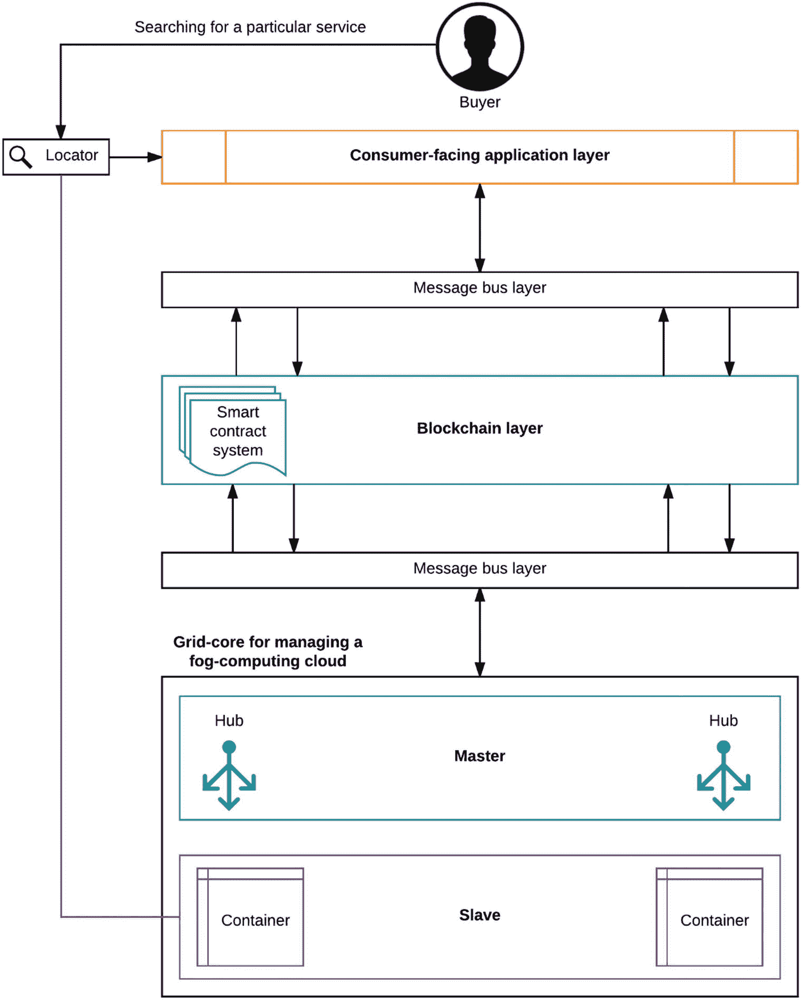
**图 7-11** SOSNA 架构概览

在图 7-11 中，我们从区块链层开始，它为网络提供共识框架以及用于治理的智能合约系统。接下来是消息总线层，它充当世界计算机各个组件与网络用户之间的双向通信信道。这一层也存在于两侧，允许区块链与面向消费者的应用通信，以及让网格核心协调任务执行。在最顶层，我们有一个消费者应用层，买家可以在此访问网络并发布服务请求。`RegApp` 是未来买家将与之交互的消费者应用的一个早期例子。最终，消费者层将分裂成更多垂直领域，例如为网络中信誉度高的用户提供免去验证阶段的可信运行时功能。在另一端的最底层，我们有网格核心。这是 SONM 的心脏，雾计算在此进行。网格本质上是数百个主控和从属模块的并行实现。从属模块运行执行服务的容器，这些服务连接到定位器。定位器运行在一个公共端口上，买家可以通过消费者应用层访问该端口。

随着项目从早期 Alpha 版本演进，SONM 平台发生了三项值得注意的更新。第一个是 `SONM-OS` 的安装镜像，可用于设备，使其能够立即连接 SONM 市场并开箱即用地开始挖矿。积累的资源会被跟踪，出借其计算资源的租户将获得奖励。第二个是在运行 SONM 的设备上实现机器学习的用例，以在去中心化的雾计算平台上处理 `TensorFlow`、`Apache Spark` 和 `Theano` 应用。最后一项更新是 CDN 用例，用于将图像和媒体卸载到 SONM 设备上，并从基于雾计算的 CDN 中检索它们，这比传统的网络服务便宜得多，并提供可比的性能。SONM 服务的定价计算器可在网站上找到。

### iEx.ec

我们将以对`iEx.ec`平台的简短讨论来结束本章。`iEx.ec`也是一个使用特定领域区块链的分布式高性能计算（HPC）代币。`iEx.ec`构建于一套成熟的研究技术之上，该技术名为`XtremWeb`，由法国国家信息与自动化研究所（INRIA）为桌面网格计算而开发。那么，什么是桌面网格呢？桌面网格计算背后的理念是，收集连接到网络的闲置机器的计算资源，以非常低的成本（如果是志愿桌面网格，甚至完全免费）来执行密集型并行应用程序，这与传统超级计算机相比成本极低。`XtremWeb-HEP`是其前身的一个去中心化版本，旨在矿工市场（marketplace of miners）中执行需要大量计算资源的任务。这一开源桌面网格技术栈属于“周期窃取”（Cycle Stealing）家族，该家族利用连接到网络的机器上的闲置资源来执行数据密集型应用程序。`XtremWeb-HEP`实现了我们之前看到的高性能计算代币所需的大部分特性：容错性、混合公私基础设施、虚拟镜像（容器）部署、负载均衡，以及面向矿工的支付机制。运行在网络上的去中心化应用（DApps）将依赖`iEx.ec`架构来自动搜索运行应用所需的所有计算资源、配置资源，并向相关方释放资金。

使用一个成熟且经过充分测试的软件栈具有三个主要优势：

- `韧性：` 如果一个计算节点发生故障，任务可以重新分配给其他工作节点，并以最小的停机时间继续运行。
- `效率：` 尽管工作节点之间的硬件配置存在差异，但网络中应用程序的基础性能仍然很高。
- `可插拔节点：` 无需特殊配置即可向网络添加新节点，节点在快速设置后即可集成。

在`iEx.ec`中，任何发生在外部或链下的动作都被称为贡献（contribution）。例如，提供数据集、传输文件和执行计算，这些动作都需要相关方之间进行代币交易。我们如何知道动作是否实际正确执行了？如何将某一特定交易或交易集合与在链下执行的特定动作关联起来？需要一种新的协议来验证贡献是否确实发生，以及哪些交易与之对应。`iEx.ec`提出了`贡献证明（proof-of-contribution）`作为链下贡献的一种新共识机制。这一新机制还在启用`iEx.ec`中一项名为服务等级协议（SLA）的企业级功能方面发挥着作用。使用SLA可以追踪资源利用率，并实现从客户到提供商的可信计算资源订单。`iEx.ec`团队预测，向网络中的各方分发内容将成为使用`iEx.ec`区块链的去中心化应用（DApps）的一个极其重要的功能。买家将通过智能合约访问区块链上的复杂数据集，并拥有一个简单的支付结构来运行他们的应用程序。利用`贡献证明`，`iEx.ec`可以保证内容提供者确实提供了对数据集的访问权限，并且该文件在处理期间是可访问的。出于支付目的，访问时长也可以被记录，以保护买家免受超额收费。此外，`iEx.ec`将采取多种对策来应对那些声称文件传输失败以降低数据费用的恶意实体。

`iEx.ec`的最初几个版本将专注于巩固核心功能，以及一个需要高性能计算（HPC）的金融交易用例。这项名为`eFast`的服务将采用复杂的计算预测方法，使小额投资者能够做出更好的交易决策。其目标是通过对不同股票的聚类分析来创建多样化的投资组合，但这种分析的计算复杂性极其巨大，以至于只有大型金融机构才能负担得起。像`iEx.ec`这样的去中心化服务可以将处理成本降低到传统计算集群成本的十分之一。

`Golem`和`iEx.ec`在产品开发方面有着相似的目标；然而，它们在业务方法上有所不同。`Golem`旨在构建网络的核心基础设施，并吸引高性能计算和云客户。`iEx.ec`则首先专注于构建将在网络上运行的去中心化应用，以吸引那些需要这些应用并且寻求更优惠价格的普通云客户。

那么，任务是如何在`iEx.ec`上被分配和执行的？有两个算法管理这一过程：一个用于执行的匹配算法（matchmaking algorithm）和一个用于分配的调度器。让我们简要地谈谈这两者。

匹配算法在分布式系统中用于根据买家提供的资源描述，来匹配资源提供者和潜在买家对。回想一下，在`SONM`中，这一任务由负载均衡器接管；然而，在`iEx.ec`中，由一个算法执行资源供应。开发者提议最终将描述计算资源可用性和运行任务所需资源的智能合约存储在区块链上。这可以包含诸如可用RAM、处理器/CPU、磁盘空间以及GPU类型等信息。对于宿主机来说，任务将被部署到一个虚拟机实例或虚拟机监控器上，而买家将指定运行时指令。匹配算法可以实现比简单的一对一匹配更复杂的策略，并且`iEx.ec`可以对更复杂的匹配进行变现。匹配算法有几种设计选择，但`iEx.ec`将使用一种名为`ClassAd`的语言，该语言已在科学文献中得到充分验证。

第二个算法是调度器，它对任何分布式计算系统都至关重要。网络的性能和可扩展性取决于其调度器的有效性。`iEx.ec`面临的设计挑战是创建一个支持多准则决策分析（MCDA）的调度器，该调度器能够为每个任务选择最优的计算资源，并对其进行适当调度以满足买家的标准。MCDA是运筹学的一个分支，专门评估如何在存在多个相互冲突的选项时优化决策。基于MCDA的解决方案可能更贴合客户的需求，尤其是基于成本与性能的基准测试时。一位客户可能希望最小化计算成本，即使这需要更长时间；而另一位客户可能希望最小化所需时间——这正是`iEx.ec`中调度器将要处理的各类场景。

一个通用的调度和高效的匹配算法允许在高性能计算（HPC）领域对核心区块链技术进行非常有趣的升级。一个显著的例子是使用特定领域的区块链（或侧链）。侧链是一种可适应的区块链，旨在满足特定基础设施需求，用于运行那些在通用环境中性能不佳的应用程序。此类区块链的目标是最大化性能并最小化执行之间的时间延迟。通常情况下，应用程序会经过标准区块链；然而，在提交大量任务的情况下，部分任务可以被卸载到侧链进行追踪。侧链将追踪在宿主机上花费的时间，并将信息报告回网络，这种卸载可以减少通用区块链上的流量。需要开发一个先进的智能合约系统来实现这种切换。图 7-12提供了`iEx.ec`架构的可视化说明。

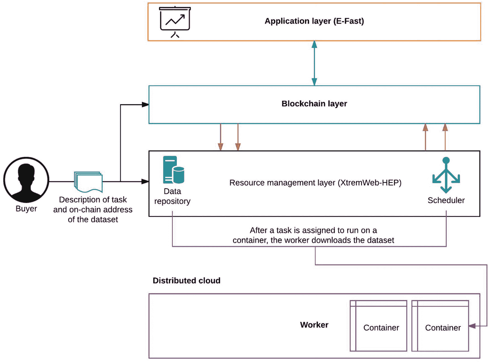

**图 7-12** `iEx.ec` 架构概览

在图 7-12中，最顶层是一个面向消费者的应用程序`E-Fast`。这是`iEx.ec`的第一个用例，它提供了在分布式大规模环境中以极低成本运行复杂金融预测算法的基础设施。其下层是以太坊区块链层，它为网络提供共识，并为矿工的补偿提供任务追踪。该区块链还充当智能合约系统的平台，该系统最终将在网络中运行。需要注意的是，区块链层并不与`iEx.ec`的每一层都交互。分布式云层通过一个名为`XtremWeb-HEP`的中间件进行更直接的管理。这是一个资源管理层，由任务调度器和经过验证的数据存储库组成。调度器负责协调区块链与将任务分配给宿主机上工作节点之间的活动。数据存储库包含来自金融和基因组学等不同领域的大型数据集，这些数据集可供买方想要执行的应用程序访问。买方连接到资源管理层，并提供任务描述以及数据源。此信息也会记录在区块链上。中间件的两个组件都连接到已部署的工作节点，使用该描述并执行任务。最终结果由中间件收集，并在支付记录到区块链后提供给买方。最后一层是分布式的矿工云。请注意，这里我们不需要主模块，因为中间件执行该功能。任务在容器或虚拟机中执行，结果报告回资源层。这降低了网络的整体复杂性，因为在宿主机上运行的唯一代码就在容器中。

## 总结

在本章中，我们从HPC应用的角度审视了以太坊代币。我们首先介绍了将代币作为以太坊应用引入的市场效用和基本原理。然后，我们讨论了一种名为`ECM`的原型HPC代币。该代币执行在计算市场中所需的所有基本功能，在该市场中，客户可以从由专用买方运营的集群购买计算能力。该代币允许在一个透明的计算能力市场中进行争议解决和链上验证。接着，我们深入探讨了更复杂的计算代币，例如`Golem`和`SONM`。我们详细描述了这两者，涵盖了主要的技术进步以及这两个代币彼此之间的差异。最后，我们通过介绍基于经过多年测试的分布式云计算软件的`iEx.ec`来结束本章。`iEx.ec`团队实现了一个去中心化版本的`Xtreme-Web HPC`，以执行与`Golem`和`SONM`相同的任务，并启用一个计算市场。