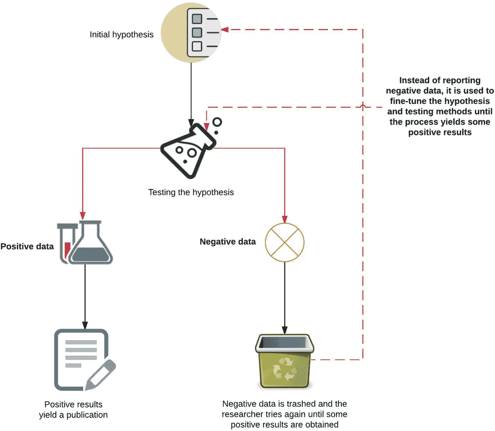
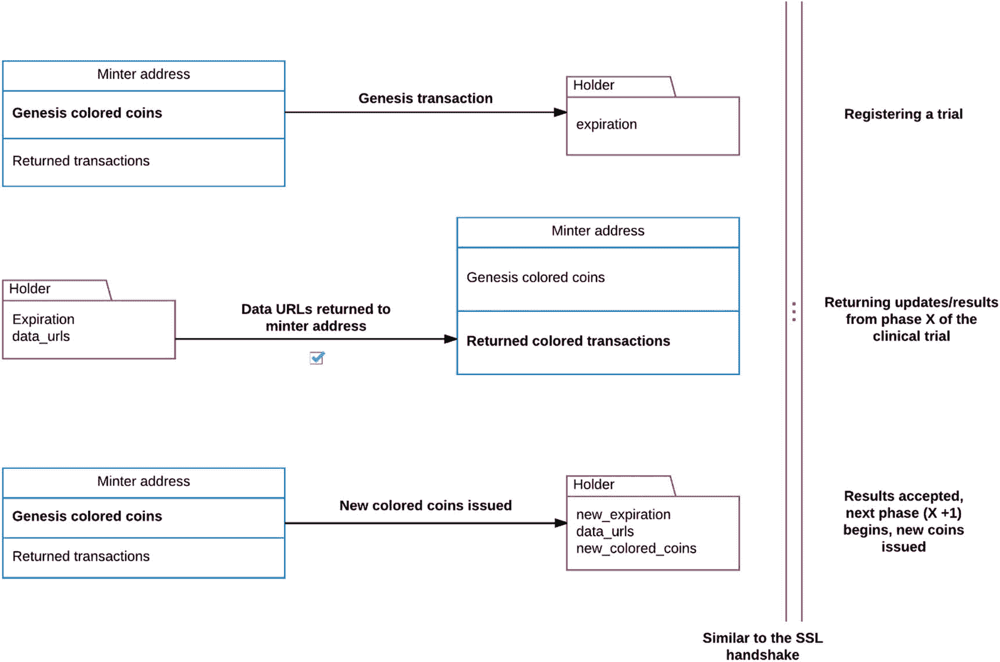
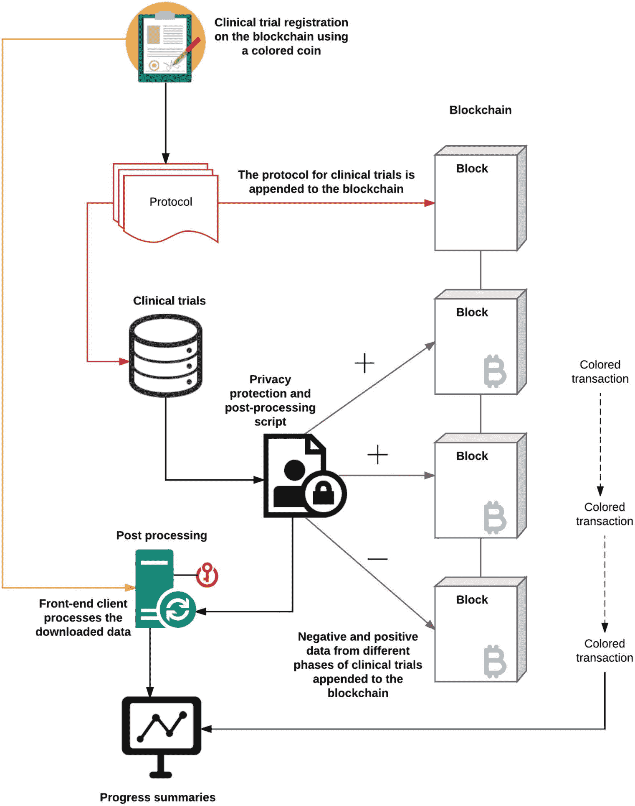
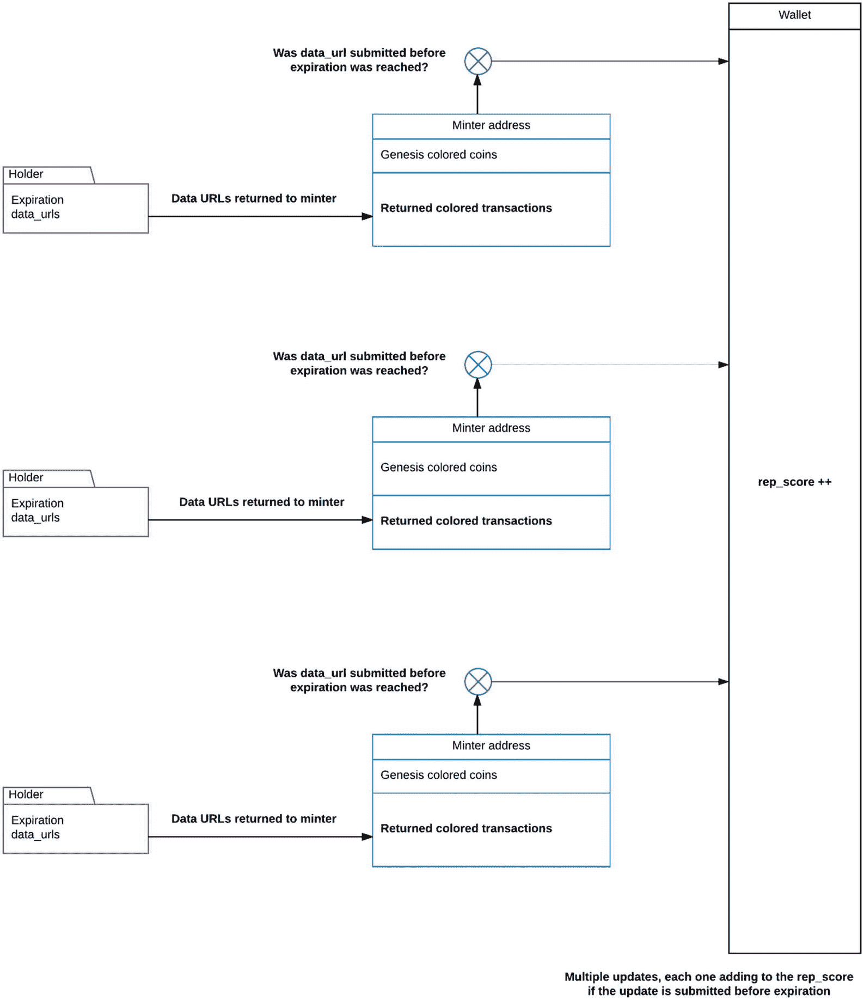
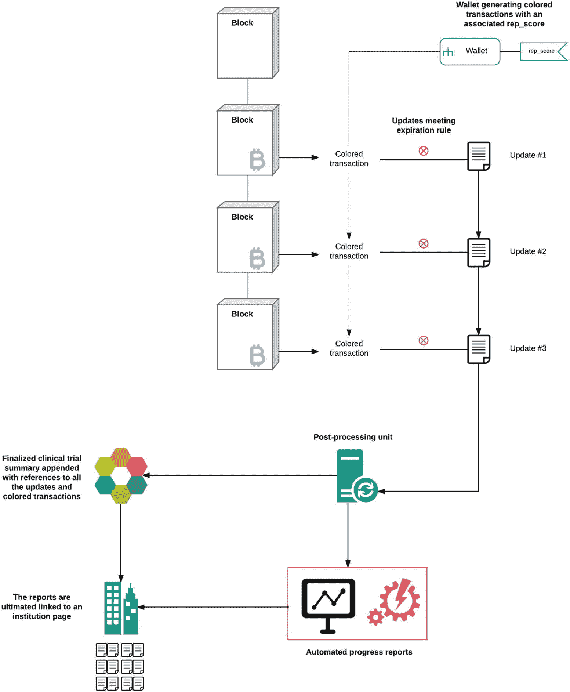

# 8. 科学中的区块链

基于证据的临床科学目前正面临一场令人瘫痪的可重复性危机。从临床心理学到癌症生物学，最近的元研究表明，研究人员无法重复其同行发表的研究成果的情况有所增加。这个问题不仅限于实验室中发生的实验台工作；它还困扰着从实验台到临床的转化研究。治疗方法、测试和技术从简单的实验室实验转变为影响数百人的 FDA 批准的设备和检测方法。因此，可重复性对于将科学突破转化为实用的补救措施至关重要。

区块链技术在新兴的开放获取科学领域中的主要作用是提高这些流程的透明度。为此，本章介绍了三个用例和应用：第一个涉及临床试验数据的保存，第二个涉及可以为致力于开放研究的科研人员和机构开发的声誉系统，第三个涉及用于追踪假药的供应链管理应用。在这些用例中，我们提供了大量正在进行的工作示例，这些工作将极大地塑造区块链在科学领域的世界。我们将首先讨论当前的研究方法范式和负面数据的重要性；我们的重点将主要局限于临床科学。然后，我们将讨论目前用于衡量已发表研究影响力的传统指标和替代指标系统。这将使我们能够过渡到补充传统指标的用例，并扩展它们以使开放科学成为一个基本特征。最后，我们将通过审视将区块链融入现有研究基础设施的持续努力来结束我们的讨论。


## 可重复性危机

让我们首先讨论在科学论述和研究中*可重复性*的含义。研究领域的重要基石之一，是能够遵循某项研究中记录的实验方案，使用其中记录的方法进行实验，并得出与该研究结果相同的结论。换句话说，一项已发表的研究可以被其他研究人员独立验证，并重复获得相同结果。近期临床科学的元研究表明，越来越多已发表的研究在实验上不够严谨，以至于难以被轻松重复。Leonard P. Freedman 及其同事估计，超过 50%的临床前研究无法从动物模型转化到人体临床试验，因此仅在美国，不可重复性造成的年成本就约为 280 亿美元。其后果是，由于动物模型中的临床前发现很少能在临床试验中重现，药物发现的步伐已经放缓，成本急剧上升。经济成本十分沉重，因为每年有近 2000 亿美元因无法重现已发现的靶点而被浪费。这些问题通常源于特定研究的设计，或是在不同细胞系实验中出现的非常复杂的、难以避免的纠纷。要理解其原因，我们必须到元研究中寻找答案。元研究是一个研究分支，它通过统计方法评估一项研究中的主张、结果和所进行的实验。

学术界众多因素正共同催生一种博士 Ben Goldacre 所称的“不良科学”的恶性文化：研究资金日益匮乏、“不发表就出局”的文化潮流，以及年轻研究人员在获取终身教职方面面临的巨大压力，这些都迫使他们采用错误的方法，最终导致不可重复的论文发表。在某些情况下，草率的研究方法和数据篡改甚至导致了欺诈和论文最终被撤回，给研究人员本人带来严重后果。

**注意**

`Retraction Watch` 是一个近期出现的博客，旨在报道各个层面发生的科研不端行为，从与期刊合作的编辑到大学的个别研究人员。该博客还追踪那些因数据造假或实验证据篡改而从期刊上被撤稿的论文。感兴趣的读者可以访问他们的网站，该网站每年会发布约 500 至 600 条撤稿信息。

学术期刊也对这一乱象负有一部分责任，尽管有迹象表明相关工作正迎来真正的改变和改善。在过去几年里，在期刊上发表关于潜在药物靶点或特定药物有效性的阳性结果研究变得相对容易了。然而，来自实验的阴性结果，例如一个药物靶点尽管预期有效但实际上并未起作用，却极难发表。从表面上看，这似乎有道理：谁会想知道实验失败了？基于类似的理由，阴性数据通常会被忽略。而从市场营销的角度看，一家期刊宣称某种疗法未达预期，并非吸引读者的卖点。让我们更仔细地审视阳性与阴性数据在期刊塑造其使用与发表方式中的背景。

阳性数据只是对初始假设的证实，即研究者预测了某个发现，而数据验证了它。另一方面，阴性数据则来自未观察到预期或期望效果的情况。如果一个实验显示零假设和备择假设之间没有差异，那么这些数据和结果很可能最终会被埋没在实验室小组未发表的结果堆中。图 8-1 非常简略地展示了一种处理阳性与阴性数据的错误研究方法，这种方法正是学术界压力下的产物。为了追求高需求、有吸引力的药物靶点，重复性被牺牲了，而这些靶点最终往往无法很好地转化为临床试验，并导致更多的经济损失。



**图 8-1** 研究发表背景下阳性与阴性数据概述

在图 8-1 中，我们看到了假设检验的一个简单演示，它导致了“侥幸结果”的发表，这些结果在转化研究或大规模临床试验中是无法复制的。由于在学术期刊上发表论文的性质，阳性数据通常意味着你的工作完成了。大多数研究人员会在此止步，而不会费心去跟进在实验过程中收集或生成的数据中那些可观的部分。这可能包括关于某个不奏效的想法的潜在阴性数据，或因评审反馈而被省略的信息。一旦研究论文被接收，论文作者就没有进一步的动力去发布更多数据或投入更多时间来整理并提供其他结果。这最终导致了一些有害的后果，我们将在本章后面讨论。

国际上的期刊已经观察到了这些趋势，出版商们开始采取行动。大量新的倡议正在提高出版物中可包含数据的标准，以及为确保可重复性而必须满足的设计考量。我们在此讨论其中三项努力：

- **最低发表标准：** 印刷期刊对版面有特定要求，研究论文的每个部分只能分配有限的页数。在这种情况下，研究人员更侧重于提出大胆的主张，并展示能为其假设提供证据的数据。这通常是以牺牲“方法”部分为代价的，而该部分正为其他研究人员提供遵循以复现实验的指导。最近，大多数期刊已转向线上，版面已不成问题；然而，即使提供了补充材料，其质量仍然欠缺。`BioMed Central` 发布了一份清单，列出了论文发表前必须满足的最低标准。这份清单的目的是提供一定程度的标准化，以便研究人员在撰写论文时能考虑特定标准，从而提高可重复性。如果满足所有标准，那么已发表的研究在更大程度上被重复的可能性就很高。

**注意** 更多知名期刊增加了数据共享声明，以说明数据集将在何处提供以及共享何种类型的数据。例如，`Cell Press` 创办了一份新期刊，用于发表经过同行评审、具有可重复性且方法透明的研究成果，名为 `STAR protocols`。同样，`EQUATOR` 网络也为科学报告中发表的数据制定了关于质量标准的结构化指南。


### 数据发现索引
前文提到的主要问题之一是缺乏激励研究者共享补充数据的机制。美国国立卫生研究院（NIH）已着手创建一项名为“数据发现索引”的新指标，以表彰研究者上传额外实验数据的行为。这是一个可被引用的数据存储库，研究者可在此公开与自身研究相关的更多数据点。对于学术研究者而言，其重要激励在于能为工作赢得更多引用，而这反过来又成为已发表研究影响力的衡量标准。通过将数据库设为可引用状态，NIH 创造了新的激励因素，促使研究者投入额外时间和资源来上传未发表的数据库。

### 可重复性项目
开放科学中心与科学交换机构合作，将针对 2010 年至 2012 年间癌症生物学领域的高影响力研究，在科学交换机构成员的协助下对每项研究进行重复验证。关于重复实验、发现药物靶点等尝试的完整报告将连同详细方法一同开放获取。该项目分两个阶段进行：第一阶段最终形成一份注册报告，记录执行特定实验的标准化方案；第二阶段由科学交换机构的成员机构之一依据注册报告开展实验并记录结果。最终，报告与数据将由*eLife*期刊的审稿人进行同行评审，并在线上公开发布。

这三项举措是大规模协同提升研究可重复性的范例，未来还将涌现更多类似行动。至此，我们已探讨了学术环境中导致阴性数据与阳性数据区别对待的问题（这恰是可重复性危机的核心）及其引发的困难。接下来，我们将开始讨论药物试验中数据操纵引发的更严重后果。临床试验的数据点决定了将影响数千人命运的药物的最终走向。获取所有相关数据，不仅对于准确开具处方至关重要，也有助于规避已被探索过的误区和途径。

> **注意**  
> 本·戈德埃克尔博士曾在 TED 演讲中讲述了 20 世纪 80 年代上市的药物洛卡尼的故事。该药本是一种抗心律失常药，旨在预防心脏病发作患者出现心律异常。在一项针对不到一百名患者的小型临床试验中，不幸有十人死亡。该药物被视为失败品，商业研发随之停止。这次失败试验的数据从未发表。在随后的几年里，其他制药公司对类似的抗心律失常药物产生了想法，并将其推向市场。据估算，约有 10 万人因此死亡，因为这些新药同样导致了更高的死亡率。1993 年，最初于 1980 年开展那项研究的几位研究者站出来发表了道歉声明，称他们当时将增加的死亡率归因于早期试验中的偶然因素。如果这次失败试验的数据当时得以发表，本可提供早期警示，从而避免后续的死亡事件。这只是发表偏倚造成极其严重后果的一个例子。我们将在下一节讨论这种情况的普遍化版本。

## 临床试验

我们已经描述了因临床试验数据报告存在缺陷而可能引发的若干复杂情况，接下来将开始勾勒一个潜在的解决方案。本节中，我们将聚焦三个具体问题，并为每个问题提供区块链技术的集成用例：

### 试验注册
在临床试验启动时进行注册、及时提供更新信息，并将相关结果存入公共数据库，对于那些标准药物无效的患者而言，是提供新药临床试验的关键。尽管涉及人类参与者的大规模临床试验应当注册，但现实情况往往是这些试验杳无音信。未注册试验数据的唯一迹象，是一份出版物或若干高度剪裁、旨在证明拟议候选药物有效性的论文。此类发表偏倚会以危险的方式误导临床医生；因此，我们需要激励研究者定期提交已注册临床试验的进展报告及所有相关临床方案。

### 药物疗效比较
如今，在大多数临床场景下，临床医生可选的药物种类越来越多，但往往缺乏头对头临床试验的证据来直接比较一种药物相对于另一种药物的疗效或安全性。计算模型允许通过一种称为“混合治疗比较”（MTC）的分析方法并行处理大型数据集。这些模型利用贝叶斯统计学整合某药物的可用数据，生成一份比较多种药物的探索性报告。随着更多数据从未发表或不可获取的信息孤岛中被解放出来，这可以成为自动化比较的基础。近期，人们对在临床试验中采用伞式方案越来越感兴趣。这类方案同时针对一种疾病测试多种治疗干预措施，并收集大量的比较数据。

### 后期处理
在某些情况下，当一项试验已注册并随同出版物提供了部分补充数据时，注册库往往更像一个数据倾倒场，而非有条理的数据仓库。近期，我们看到了更多精心准备并发表的后期分析摘要；然而，这通常是例外而非惯例。关键在于，一旦临床试验数据与区块链链接，它便可以被纳入自动化工作流程，后期分析摘要/数据从而可以由算法而非人来生成。一个通用的数据存储后端可以促进前端客户端的开发，这些客户端读取区块链，并使用相应的公私钥对，从外部来源下载附加数据，并在本地进行后期处理。之后，摘要报告可以被附加回区块链。

> **注意**  
> 苏恩克·巴特林与德国海德堡的一些合作者一直致力于利用区块链技术进行开放科学创新。最近，他们创立了一个名为“科学区块链”的智库，旨在加速区块链技术在开放科学领域的应用。感兴趣的读者可以访问他们的网站了解更多信息：`blockchainforscience.com`。


让我们讨论一个利用区块链提高临床试验透明度的典型解决方案。我们将使用彩色币（colored coins）的实现，将来自临床试验的补充数据上链。`Bitcoin-core` 的脚本语言允许将少量元数据附加到区块链上。彩色币正是利用了这一特性，通过将静态元数据附加到区块链上，来代表具有现实世界价值的资产。从这个意义上说，彩色币利用了区块链存储虚拟资产的能力。我们将使用彩色币作为一种机制，引入稀缺性，并激励网络用户上传辅助临床数据并提供定期更新。就我们的目的而言，有三个组件使彩色币与众不同：

- **着色方案（Coloring scheme）：** 在区块链上对彩色币数据进行编码或解码的编码方法。
- **资产元数据（Asset metadata）：** 附加到彩色币交易并存储在区块链中的实际元数据；接下来我们将看一个例子。新的彩色币协议允许通过使用 torrent 密钥（提供去中心化方式共享和存储数据）将潜在无限量的元数据附加到彩色币交易中。
- **规则引擎（Rule engine）：** 过去，元数据仅包含添加到彩色币的静态信息。但最近，新增了一个规则部分，该部分对由[规则引擎](https://github.com/Colored-Coins/Colored-Coins-Protocol-Specification/wiki/Rules)支持的额外逻辑层进行编码，从而为彩色币解锁了智能合约功能。目前，支持四种类型的规则，我们将对此进行讨论。

以下是可添加到彩色币交易中的元数据的通用语法：

```
{
metadata: {...静态数据放在这里...},
rules: {...规则定义放在这里...}
}
```

在我们的解决方案中，我们将使用规则引擎中的两条规则：过期规则和铸币者规则。过期规则用于借出资产，它规定了资产的生命周期。到期时，资产将返还给最后一个拥有有效到期日的输出（一个有效的比特币地址）。铸币者规则授予接收方发行更多相同资产的权利。因此，收到彩色币的铸币者可以进一步向网络上的其他人发行更多彩色币。在此区块链经济实例中，这两条规则在引入稀缺性方面都发挥着重要作用。稀缺性扮演什么角色？要理解这一点，我们需要介绍另一条规则：持有者规则。当发行资产时，持有者将在资产发行规则集中被描述为允许持有该资产的地址。

图 8-2 直观地描述了研究人员和铸币者之间的互动流程。研究人员注册一项临床试验并提供定期更新，而铸币者则确认更新，发行新的彩色币，并在试验进入下一阶段时请求未来的合作。让我们一步一步地讲解图 8-2。临床试验始于我们的研究人员注册该试验，这启动了一笔从铸币者到持有者（我们的研究人员）的创始交易。这笔交易附带了一条过期规则，从某种意义上说，这是为给定临床试验的多个阶段之一提交相关数据的截止日期。研究人员必须向铸币者发送一笔彩色币交易，其中包含指向包含更新或新数据的元数据的 URL。当铸币者收到这笔交易时，系统会评估资产是否已过期，并输出评估结果。我们将在下一节中回到这个结果。在这笔返回交易之后，铸币者为下一阶段向持有者发行更多彩色币，并且循环重复。试验的每个阶段都会导致更多数据 URL 被附加到持有者发送的元数据中，作为持续更新的标志。

**提示**

彩色币协议的规则引擎也是不直接存储在区块链上的元数据的一部分；相反，它使用 torrents 以纯 JSON 格式存储。[Torrents](https://en.wikipedia.org/wiki/BitTorrent) 提供了一种去中心化的数据共享机制，并使规则能够与区块链外部的对象进行交互。我们在这里将铸币者抽象为一个预言机；然而，实际的实现将涉及自动评估器和智能合约的混合体。

图 8-2 中可视化的整个过程可以被类比为构成我们浏览器中安全客户端-服务器交互和对称加密基础的 `SSL-handshake`。也许在未来，我们可以推断，如果这种类型的交互变得常见，它可能成为彩色币钱包的一个功能。对铸币者收到的数据的评估可以公开进行，使用一个将结果返回给钱包软件的附加组件。未来，这种模块化附加组件设计将使新的协议能够集成到钱包客户端中。



图 8-2
铸币者与持有者之间的互动

图 8-2 所示的过程可以通过强制执行到期来人为地制造稀缺性。持有者（研究人员）必须返回一笔包含对应更新的数据 URL 的彩色币交易。铸币者对持有者的状态进行评估，然后确认收到更新。为下一轮更新发行新的彩色币，整个循环重新开始。评估器结果被输出，并用于构建声誉系统，我们将在稍后对此进行讨论。

既然我们已经讨论了彩色币的交互，让我们看一下图 8-3 中的整个临床试验系统。



图 8-3
区块链整合到临床试验工作流程的总结

在图 8-3 中，流程从注册和提交一份关于临床试验将涉及的内容、使用的方法以及预期数据/结果的概要开始。在试验开始前，概要信息连同经批准的方案被附加到区块链上。这完成了注册过程。


### 彩色币与规则引擎

`彩色币`与规则引擎用于管理研究人员提交的数据更新。这些更新在通过轻量级的隐私保护检查后，会被追加到区块链上。当临床数据进入公共后端后，最重要的好处或许在于，焦点可以从持有数据库的后端客户端，转向单纯开发能够读取区块链的前端客户端。数据管理将在区块链内部自动完成——我们需要的是一个能够读取元数据中遗留的标签或面包屑的机制，从而知道从外部位置提取哪些内容进行进一步处理。图 8-3 所示的后处理单元就是一个例子。该单元包含适当的公私钥对和权限，用于读取区块链并访问外部位置。当向区块链追加数据更新的同一脚本中，还包含一段用于后处理的代码段，它告诉后处理单元如何将来自多个第三方位置的数据整合到一个本地集合中。

之后，会使用后分析统计方法来确定所追加数据的质量，并可以自动生成一份报告，该报告会按给定时间间隔总结试验的进展情况。研究人员应提交数据更新的间隔时间，以及如何处理已提供数据的说明，都被编码在一个脚本中，并提供给后处理单元。

## 信誉系统

让我们重新审视稀缺性这个概念。它对于我们构建临床试验系统至关重要；然而，引入具有到期规则的`彩色币`也让我们能够构建另一个组件：信誉系统。信誉的前提很简单，就是跟踪对到期规则的遵守情况。回想一下，我们在评估器函数中构建了一个导出功能，这里我们可以利用导出函数作为一种计数机制，来奖励那些积极发送定期更新的研究人员（或彩色币协议中的持有者地址）。在实际应用中，这个导出计数器会在定期更新建立后由铸币者添加到元数据中。由此，建立信誉就成了一项简单的任务：更高的导出计数器对应着更好的信誉。

需要注意的是，在我们的临床试验系统中，信誉只是作为设计的一个属性而涌现出来的，但它对于可重复性有着深远的影响。高信誉表明一个机构或研究团队对质量控制的投入程度。一旦信誉机制在区块链上实现全网覆盖，它就可以被外部引用：第三方服务可以请求与特定彩色钱包关联的信誉评分。这可以简单到通过一次 API 调用来返回某个钱包的`rep_score`。这有什么用呢？在之前的讨论中，我们提到了数据发现索引（`DDI`），现在我们希望扩展`DDI`的概念，使其从仅仅是一个数据仓库，变成一个带有`rep_score`标签的仓库。这可以为`DDI`提供另一层粒度：为与临床试验相关的、可供公众使用的数据集附加信誉评分（高或低）的标签。请记住，在此设计中，来自临床试验或更新的所有数据都存放在`DDI`仓库中；然而，`rep_score`通过彩色币交易存在于区块链的元数据中。图 8-4 描述了每次定期更新时发生的顺序评估，以及`rep_score`中信誉的增量增加。



图 8-4

`rep_score`随每次定期更新而增加的概览

评估器函数会检查到期规则，以及持有者提交的彩色币交易是否包含元数据中对应更新的 URL。如果这两个条件都满足，则更新持有者钱包的`rep_score`。这种缓慢的增长使得信誉能够随时间逐步建立，并且`rep_score`参数可以以区块链无关的方式被外部服务引用。API 调用可以成为将最新的`rep_score`附加到`DDI`所存储的数据库的默认方式。

现在我们对`rep_score`机制有了更好的理解，接下来让我们看看完整的信誉系统。图 8-5 全面描绘了信誉系统及其对全网成员的影响。



图 8-5

信誉系统


图 8-5 从区块链记录彩色币协议中铸币者与持有者角色之间的彩色币交易开始。每当持有者提供更新且铸币者对其进行评估时，这些彩色币交易便发生。在首次更新后，铸币者将 `rep_score` 作为返回的彩色币交易的一部分发送出去，以继续临床试验的更新流程。此时，声誉会在每次交换中被附加到元数据中，而 `rep_score` 也会随之每次修订。该分数最终可能成为持有者钱包的一项属性，并以此方式在区块链外部被引用。当临床试验成熟到能够生成足够多的更新，并可将这些更新汇编成一份全面概述时，后处理单元便变得至关重要。此单元的作用是自动执行质量控制统计计算，并遵循临床试验开始时添加到区块链的脚本中的指令来分享更新。类似地，后处理单元将汇编一份最终摘要，并将其附加到机构的页面上，同时附上临床试验分享的所有更新。

> **注意**  
> 必须指出，后处理和数据存储均为链下完成的功能。区块链上不执行任何计算或数据操作。我们应尽可能将区块链可执行代码限制在仅包含必要原语的范围内。唯一与链上交易或元数据交互的工具，是用于更新变量或参数分布式状态的那些工具。

在过去的几年里，在为科研工作（包括开放出版和数据存储）构建专门的声誉系统方面已取得更重要的进展。以下回顾了三个此类项目：

* **Augur** 是一个基于以太坊区块链构建的预测平台，以 `ERC-20` 代币形式存在。Augur 由一种名为 `REP` 的声誉代币驱动，该代币因在平台上进行准确报告而作为奖励获得。网络成员通过参与对事件结果的准确报告来赚取声誉（`REP`），这成为一种激励措施。随着时间的推移，用户间 `REP` 积累的记录会催生出一组可靠用户，他们更有可能做出准确预测：这是一种群体思维模型，其中群体智慧在预测结果时呈现出富有成效的形态。Augur 包含四个组件，用于在网络上传播声誉：一个供网络成员提交结果预测的平台、一个为准确预测奖励积分的评分机制、一个将积分汇总为声誉等长期参数的共识框架，以及最后负责维护网络安全和完整性的监督者群体。这些特性也使得 Augur 适合在一个去中心化市场中用于新一代科学假设/预测。

* **学术背书系统（AES）** 是构建在区块链上的一个声誉系统，它使用学术背书积分（`AEP`），而 Augur 则使用 `REP`。`AEP` 被授予那些值得背书和公开推广的科学成果。但与 Augur 相比，AES 更全面地针对科学出版物和科研工作而构建。授予某个研究项目的 `AEP` 数量基于其过去获得的 `AEP`。这是一种对曾产出获得大量背书成果的研究人员的奖励。通过这种方式，产出高质量工作的研究者获得更多 `AEP`，并因此更有动力分享更多高质量成果。`AEP` 作为一个全局声誉参数，未来或许能被期刊与更传统的引文指标（如 `H-index`）一同使用。

* **PEvO（链上发布与评估）** 是一个基于 Steem 的去中心化社交媒体平台，内容创作者可以直接与科学研究作者沟通。在此平台上，作者可以分享更新、上传新内容、回复评论，并将评审整合到研究的持续更新中。这创造了一种已发表论文的扩展形式，使其成为一份“活文档”，并且更新记录可以在驱动 Steem 的区块链上被追踪。此外，在 PEvO 上的互动会为作者带来报酬（以代币形式）。这激励作者参与讨论，而有意义的对话对整个科学界都有帮助。


### 药品追踪

本章最后一个用例涉及通过供应链管理框架追踪药品。处方药监测项目是控制"药贩子"行为的关键要素。梅奥诊所将"药贩子"定义为患者在没有告知医生其已有其他处方的情况下，从多位医疗从业者处获取受控物质（通常是麻醉药品）的行为。这种行为会导致大规模药物滥用或非法销售。梅奥诊所将"药贩子"行为归因于以下三个因素：

*   **数据时效性差：** 药房或医疗服务提供者将处方数据上传到现有中央系统的频率有多高？基于区块链的后端系统将使与所有交易相关的药品立即对所有网络成员可见。
*   **可靠性：** 与本质上去中心化的区块链相比，中心化数据库存在单点故障，因此数据不依赖于单一数据库，使其更加可靠。
*   **数据检索复杂度高：** 当前的数据检索模式及其与现有医院系统的兼容性已完全失效。医院通常无法与药房使用的数据库同步，而更新是一项艰巨的任务。区块链通过提供一个供外部服务读取的公共后端，使这一过程变得通用。

在该系统中，当临床医生开具处方时，医疗服务提供者可以查询区块链，以查找患者任何当前有效处方的记录。这有助于临床医生判断患者是否正在从多个来源获取处方，或者是否有其他家庭成员正在获得相同的处方。来自不同医疗服务提供者的有效处方将自动使新的处方请求失效，这可以在网络中以双重花费请求的形式进行编码。否则，交易将通过，药房将收到向患者提供药物的请求。提出请求的医疗服务提供者和患者可以对交易进行签名，从而可以在特定患者的整个护理过程中实现更好的追踪。尽管这个系统看起来很简单，但它满足了《药品供应链安全法案》（DSCSA）兼容系统的大部分要求，可以在各医疗服务提供者之间实施。IBM 和德勤区块链实验室等主要区块链参与者正在努力控制阿片类药物过度处方的问题。最近，一些专注于仅使用区块链进行药品追踪的初创公司也应运而生。

尽管供应链管理最贴合区块链的基础设施，并且可以开箱即用，但这个领域非常新，技术也尚不成熟。随着新技术的出现，使得前所未有的通信层成为可能，药品追踪和开放科学的未来看起来更充满希望。即使区块链的作用仅此而已，它也已经成为了开放科学探究与讨论中新创新的巨大催化剂。

在撰写本文时，美国食品药品监督管理局（US FDA）正与加州大学洛杉矶分校健康中心（UCLA Health）合作，启动一项名为 `BRUINchain` 的试点研究。该试点的结果已发表在 *Blockchain for Healthcare Today* 上，我们希望分享来自 `LedgerDomain` 的 Ben Taylor 在一篇博文中撰写的一些见解：

> *作为由美国 FDA 委托并经同行评审的研究的一部分，该研究发表于* *Blockchain in Healthcare Today* *（*[*https://doi.org/10.30953/bhty.v3.134*](https://doi.org/10.30953/bhty.v3.134)*），`LedgerDomain` 与 UCLA Health 联手部署并测试了 `BRUINchain`，这是一个由真实护理人员使用的、基于区块链的“最后一公里”解决方案，用于帮助分发救命药物。该研究是同类研究中的首批之一，它精确揭示了区块链仅凭一己之力就能如何为药房节省数十亿美元的劳动力成本和安全库存成本。在这篇文章中，我想反思一下这项研究的主要结论，以及如何将它们映射到新的健康领域。*

> *有关 `BRUINchain` 的背景信息，请点击* 此处 *（*[*https://www.youtube.com/watch?v=mppc2Qvqrdc*](https://www.youtube.com/watch%253Fv%253Dmppc2Qvqrdc)*）。*

> **药品供应链的现状**

> *在当今的药品供应链中，每个交易方通常管理着自己的数据库系统。这些私有数据库使各方能够最大限度地减少外部安全威胁，同时最大限度地提高内部数据一致性。然而，这也意味着缺乏一个共享的全局记录系统来作为描述药品供应链中物品流动的唯一真实来源。这使得整个供应链更容易受到常见的攻击媒介，例如中间人攻击或欺骗。*

> **为什么药品供应链要使用区块链？**

> *根据《药品供应链安全法案》（DSCSA），三年内，美国的药品供应链将整合到一个电子、可互操作的系统中，用于识别和追溯在全国范围内分销的处方药。DSCSA 的核心要求之一是处方药必须具有唯一的产品标识符，该标识符采用二维条码的形式。*

> *我们意识到，这些联邦政府强制要求的条码可以成为通用数据模型的基础信息构建块。与区块链相结合，这可以实现一个记录系统，减少在数据完整性和隐私性与全局可视性和可解释性之间进行权衡的需要。通过这种方式，区块链可以成为数百家制药和生物技术企业及其供应商协作并与数百家批发商和数万家配药机构沟通的通用真理来源。*

> **BRUINchain 试点应用**

> *我们研究的基石是 `BRUINchain`，这是一个基于区块链的移动解决方案和通知系统，旨在使用 FDA 规定的条码来追踪和追溯配药机构内部药物保管权的变更。通过将区块链与商业现成技术相结合，`BRUINchain` 使得在繁忙的医院或社区药房追踪和验证药物成为可能。*

> *从收货区到患者给药，护理人员使用 `BRUINchain` 移动应用程序扫描唯一的二维药品条码。在流转过程中，药物会通过一系列检查，直到最终被施用于患者。新的条码会被发送给交易伙伴进行验证，而问题药物则会被暂扣不予发放。开处方者可以随时查看药物从药房到诊所的进展。*

> **BRUINchain 的经验与成果**

> *`BRUINchain` 试点为我们提供了重要的见解，让我们了解到更大规模的 DSCSA 验证系统实施会是什么样子。它也验证了在严重依赖遗留系统的药房中使用商业现成技术的可行性。使用商业现成技术，条码扫描的效率接近 100%。药物可以在非常精细的级别上进行追踪。该系统能够追踪有效期、验证条码，并使药剂师更容易检查问题并报告问题。*

> *在研究过程中，我们发现，一个实时的区块链系统可以大幅降低 DSCSA 合规的实施成本——为美国配药机构每年节省 1.83 亿美元，并成为抵御不良或欺诈交易的坚实堡垒。实时验证还将最大限度地减少配药机构在潜在隔离事件中需要保留的安全库存量，从而释放出 200 亿美元的库存资金。*


### 摘要

本章首先概述了可重复性问题及其在循证科学领域造成的严重经济损失。随后，我们讨论了当前科学界的解决方案及其不足之处。之后，我们描述了利用区块链构建信誉系统的构想，并涵盖了三个用例：临床试验、信誉网络，以及从生产环节开始的药品追踪。所有用例都突显了区块链在追踪和问责方面相较于传统方法的优势。

