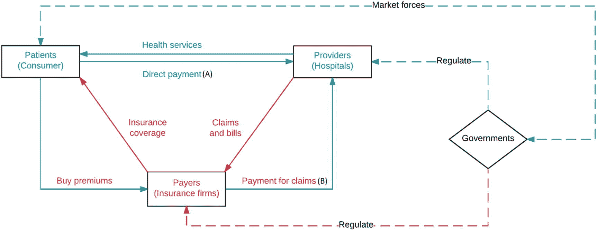
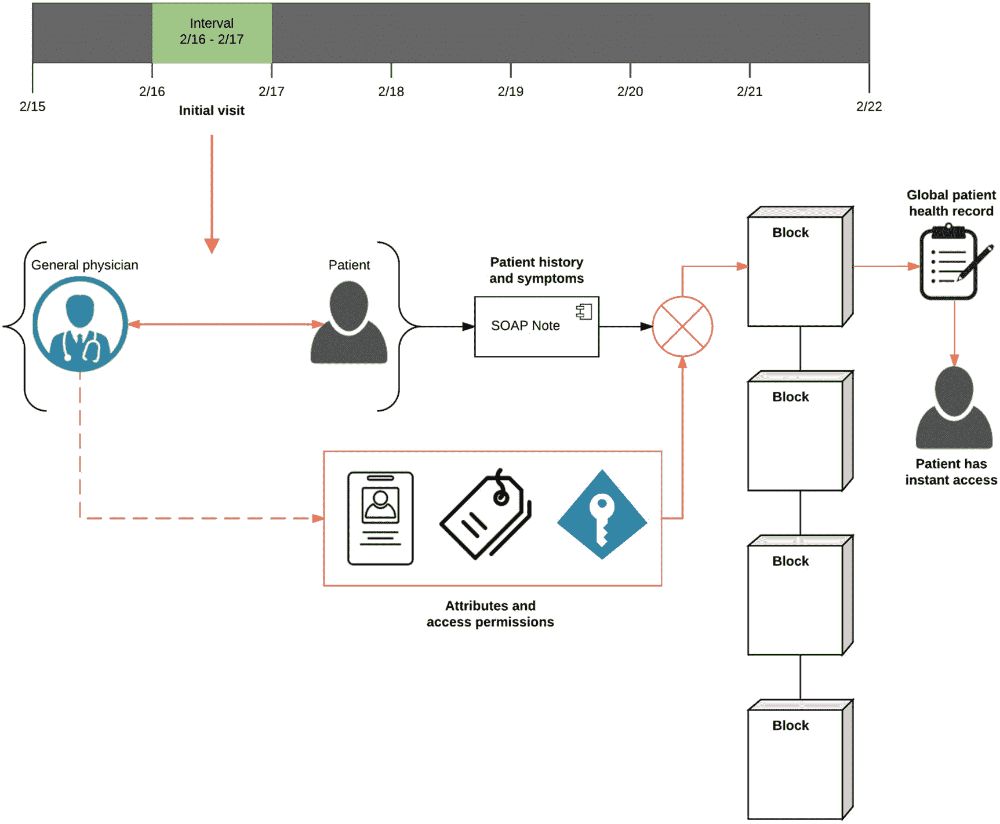
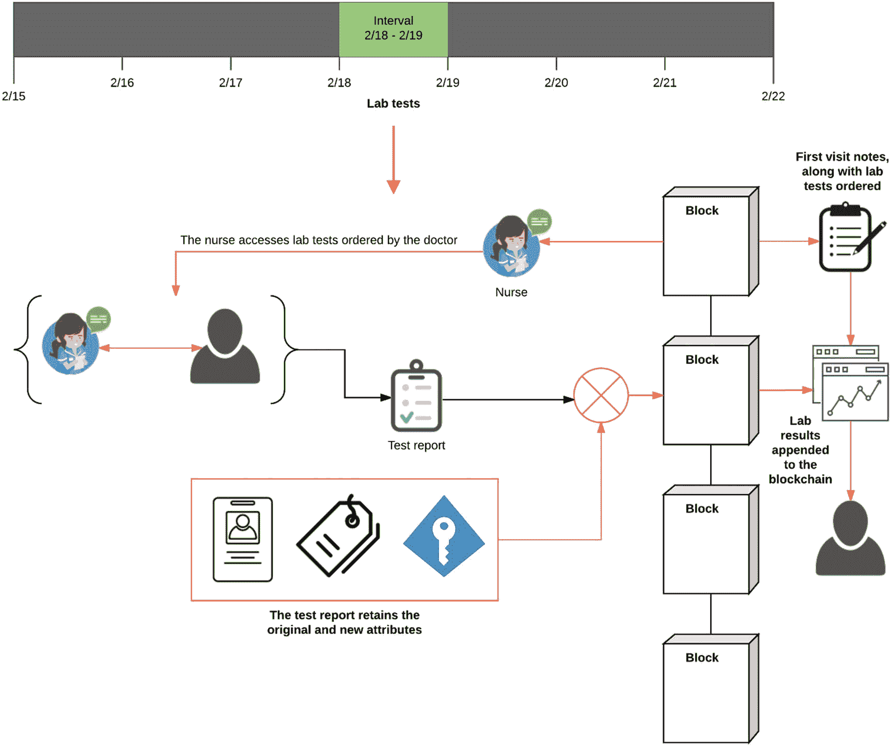
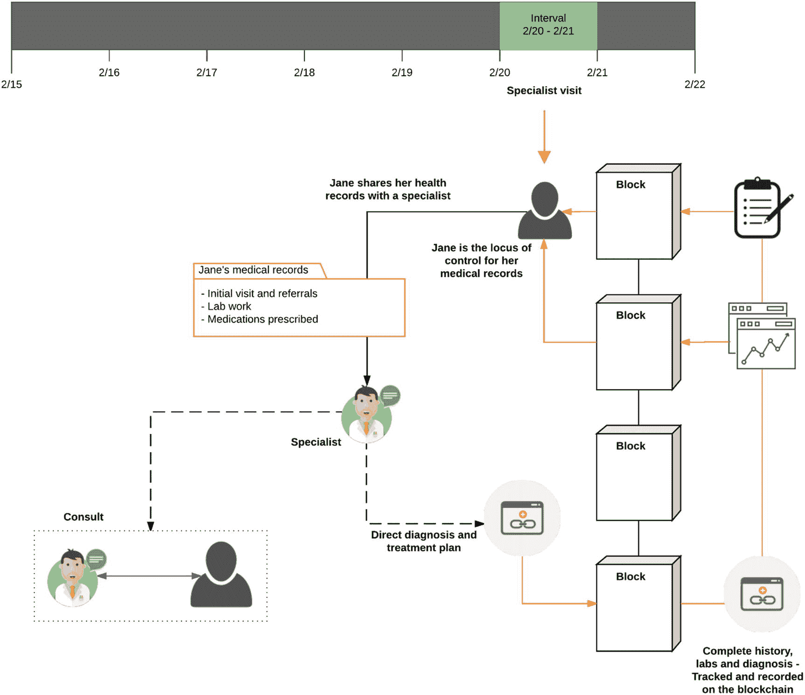
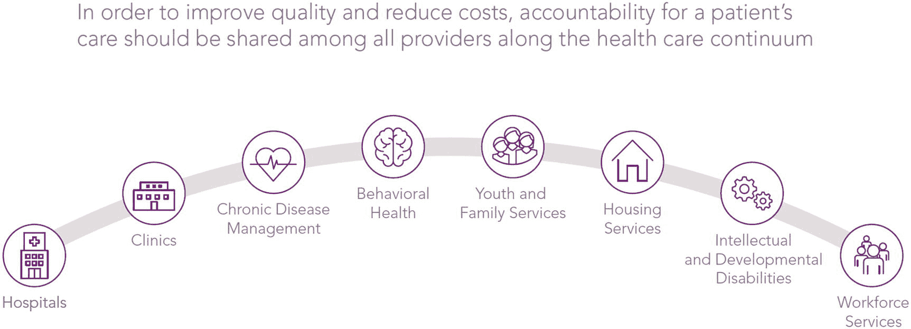
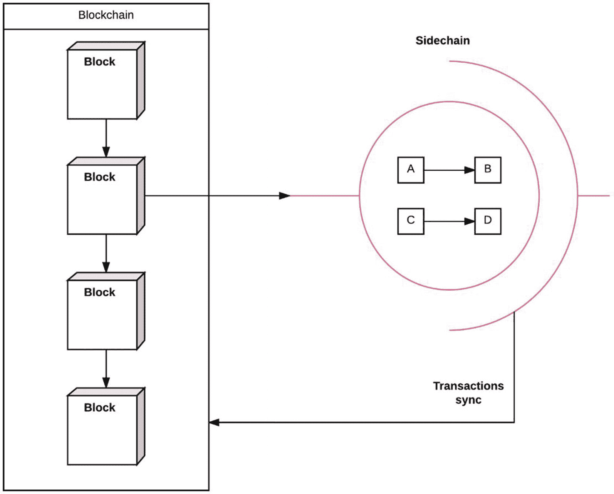

# 9. 区块链在医疗健康领域的应用

医疗健康产业是一个价值 3 万亿美元的行业，其中每年约有 1 万亿美元被浪费。随着老龄化人口中慢性病患病率的持续上升，护理协调正变得日益复杂。在许多情况下，医疗保健提供者现有的技术并不足以全面记录所提供护理的各个方面。其结果是各方之间信息传递不畅，最终降低了为患者提供的护理质量。这很大程度上归因于医疗机构使用的遗留系统、缺乏与非特定供应商技术的集成、基于纸质病历，以及医疗专业之间的横向信息传递不足。医院正在投入大量资源，重复进行那些本可由先进技术基础设施完成的工作，这加剧了使用设计不当系统的低效性。在本用例中，我们将从各自的激励机制和服务角度讨论支付方-提供方-患者模型，以及该模型在不久的将来可能发生的变化。接着，我们将介绍区块链如何整合到患者从首次就诊到最终诊断和治疗方案的整个工作流程追踪中。我们将介绍区块链整合所能实现的两个新特性：组件热切换和医疗数据整理。然后，我们呈现一个使用区块链进行医生资格认证的用例。最后，我们将讨论医疗健康领域的浪费管理问题，以及 Capital One 与 Gem 为提高经济产出所做的努力。

## 展望

读者应如何阅读本章？以下是一些值得关注的学习目标：

-   什么是支付方-提供方-患者模型？它如何应用于现代医疗保健系统？索赔流程在该模型中如何运作？我们将在本章后续部分回到区块链上的索赔处理。
-   我们能否设计一个基于区块链的患者工作流概念，用以记录患者从初级保健医生，到实验室检查，最终到专科医生的整个转诊过程？
-   患者工作流如何展示权限和访问控制的管理？
-   什么是热切换？为什么它很有必要？有哪些可用的热切换实现方案？
-   什么是医生资格认证？它在区块链上是如何运作的？
-   当前医疗机构在医疗索赔处理方面存在的经济成本和浪费来源是什么？区块链能否减少这些经济低效并简化业务流程？索赔能否在同一处理医疗记录的区块链上进行处理？从医疗领域的区块链索赔处理中汲取的经验能否应用于相关的垂直行业？
-   DeepMind 的可验证数据审计（Verifiable Data Audit）在审计和记录处理方面与区块链相比如何？

## 支付方–提供方–患者模型

支付方-提供方-患者模型是医疗健康领域三大主要参与者之间相互作用的标准模型。图 9-1 直观地展示了这些互动关系，在本节中，我们将详细阐述这三方各自的动机和收益。为简单起见，我们假设支付方主要是保险公司，提供方是医院系统或私人诊所，而患者则是由特定保险公司服务的随机样本群体。现在，我们可以开始考虑涉及该模型的不同场景：

图 9-1 支付方-提供方-患者模型的简化概览

-   第一个场景是最简单的：患者直接为医疗程序及就诊向医院付费。这种仅涉及两方的直接系统目前仍是许多国家医疗体系的常态。在美国，医疗保健提供成本显著增加，因此该体系中出现了一个新的参与者。
-   第二个场景是美国当前的实施模式。患者向保险公司购买保险后，获得健康保障。这家保险公司随后获得更强的议价能力，为医疗程序设定可行的价格，并代表患者支付费用。提供方现在向保险公司（而非直接向患者）发送索赔以获取付款。通过这种方式，保险公司已演变为一个中心化门户，为患者消除系统中的障碍并获得个性化医疗保健。
-   第三个场景更多关乎医疗健康的未来，即整合新的提供方，这些提供方是通过远程医疗、离院监测和远程医生提供护理的专业实体。

最简单的情况是患者直接向医院支付服务费用。但更复杂的医疗程序和实验室检测需要患者购买保险来覆盖。现在，保险公司代表患者支付所有医疗账单。提供方也直接将索赔发送给保险公司，而不是患者。这个模型是理解当今医疗系统巨大复杂性的基础，该系统涉及数百个其他参与者。例如，保险公司和医院相对于患者可以运营的领域在很大程度上受到政府机构的监管。而这些机构又受到经济力量和消费者需求的影响。

**提示**
克里斯·凯（Humana 公司首席信息官）在 2016 年“分布式：健康”大会上发表了主题演讲，讨论了 Humana 公司为采用区块链技术以降低医疗处理成本并更高效地为其会员提供个性化护理所做的努力。他谈到了前述第二个场景的一个潜在演变路径，即区块链可以无缝地驱动提供方和支付方之间的资金流动，并将责任导向结果，而不仅仅是程序。将控制权交到患者手中，可以使他们获得更好的护理和满意度，同时利用区块链不会增加任何摩擦或额外成本。

区块链上进行索赔处理的基本原理是利用去中心化共识、去信任化交易和网络验证等特性，来设计能够降低间接成本和时间的工作流程。让我们来看一个涉及区块链使用的患者就诊工作流程。

好的，作为高级文档工程师和翻译员，我将严格遵循您提供的注意事项和示例格式，将给定的英文文本翻译成中文。

### 患者工作流程

我们的工作流程始于简因食用某些食物后感到胃部不适，前往她的初级保健医生处进行检查。她的医生怀疑是病毒感染，并要求进行化验。随后，她被转诊给一位专科医生，由该医生做出最终诊断，并与她共同制定治疗计划。此工作流程的每一步，作为简病历的一部分，都会被记录在区块链上，并附有关于访问权限和所有权的适当许可。此外，简的病历还会包含每一次签出和签入的历史记录，包括对病历所做的编辑和补充。密切追踪所有权的变更方式，有助于我们在为简提供的不同护理节点之间进行过渡，随着她的健康状况更加全面地呈现出来，她也能在每个步骤中即时访问自己的病历。

本工作流程的主要目的是演示区块链如何处理多方无关实体之间的权限和所有权转移。通过利用用户使用密钥进行签名的机制，创建了这个基础医疗记录系统。我们可以使用版本控制系统的术语来更好地理解工作流程中的属性和权限。就像`Git`或`SVN`有提交消息和代码提交一样，每一次向病历签入新数据时，都会包含关于更改内容的提交消息。区块链变成了一个远程仓库（类似于`GitHub`），`Git`可以向其推送新的更改。此外，还有锁定机制来保护数据：一旦病历中的某个文档被签出给某个用户（如医生或护士），该文档就会被锁定，在原始用户签入其编辑内容并解锁文档之前，其他用户无法向同一文档签入新的更改。图 9-2、9-3 和 9-4 将引导我们了解此工作流程。

图 9-2 — 患者初次就诊

在图 9-2 中，工作流程始于简前往她的全科医生处进行常规检查。医生记录了病史，并记下了她在身体系统检查中发现的任何突出症状。他将这些信息添加到一个非常标准的患者病史记录方法中，称为`SOAP`笔记。该笔记将连同其唯一的 `哈希` 标识被添加到区块链中。除了 `哈希` 之外，医生还将添加用于访问病历的权限和用户组角色。最初，只有医生和患者拥有访问权限，但可以轻松地扩展。最后，该笔记使用医生的密钥进行签名，以表示简的病历初始提交到区块链。一旦简的记录被推送到区块链，她也可以立即访问它们。

图 9-3 — 简正在接受医生安排的化验

在图 9-3 中，简的医生安排了一些化验，因此两天后，她前往一家化验室。化验结果已被录入她的病历，并添加了允许化验室护士访问详细信息的权限。医生可以轻松设置访问权限，并为护士新增对病历的上传权限。此工作流程始于简到达之前，当时护士检索了她的病历并开始准备化验。简到达后，他们进行了咨询，护士告知她将要进行的化验项目。化验完成后，生成报告并将其附加到区块链上简的病历中。我们可以在右侧看到，简的总体病历现在新增了关于最近所做化验的附加内容。所有这些结果在上传后，简都能立即获取。

图 9-4 — 简被转诊给专科医生

在图 9-4 中，工作流程增加了一个新步骤：简决定去看专科医生，以便更好地理解化验结果。两天后，她将自己的病历共享给了一位专科医生。此时，专科医生有两个选择：她可以检查简的病历，并准备好诊断和治疗方案，甚至无需简前来就诊；或者，简可以前来咨询，并与专科医生合作采纳治疗方案。第一个选项可能有助于降低简的就诊和服务成本，因为治疗方案和诊断最终都将在区块链上提供给简。这完成了从她初次就诊到获得诊断的整个工作流程。从最初的笔记到最终的治疗方案，此工作流程的每一步都被记录在区块链上。然而，对于患有慢性病的患者来说，此后的病历将被转移到一个慢性护理机构，该机构可以定期检查简的情况，并帮助她保持良好的健康状态。

## 热切换

`热切换`是一种由区块链实现的设计原则，旨在创建组件可以被替换而系统整体以最小延迟运行的网络。热切换的目的是重新路由信息流，这一概念之所以能够实现，完全得益于区块链的去中心化特性；即不存在单点故障。为什么我们还需要热切换这样的新概念呢？传统的调度器已经相当好地完成了这项工作。一个基于区块链的操作性医疗记录系统将需要与区块链同步的在线和离线组件。医院的 IT 基础设施应该非常稳定，停机时间最短，但热切换可以实现隔离的系统升级而不会造成中断，并逐步使仍在运行的遗留系统与区块链兼容。

目前有两种热切换的早期实现：闪电网络和可插拔共识。那么，什么是闪电网络？闪电网络的 alpha 版本提供了一种通过新的微支付通道（子通道）发送交易的机制。这种价值转移发生在链下，从而使交易即时完成。这些通道最终与区块链上游同步，并维护整个网络的数据完整性。以类似的方式，链下通道可以根据预先批准的访问控制，复制并临时存储间歇性的访问请求和病历发布请求。在某个定义的时间段之后，闪电通道可以与区块链同步中间变更并变为非活动状态。热切换的第二个应用是可插拔共识，指的是你可以根据区块链上正在处理的交易类型来替换共识算法。例如，在公私分区区块链上执行的私有交易可能需要与通用交易不同的共识机制。因此，区块链上允许存在多种共识算法。我们将在后续章节中更详细地讨论可插拔共识的实现。

注意

支付通道是以太坊 2.0 中热切换概念的一种实现。在设计区块链时采用模块化方式，为构建复杂应用以及与外部基础设施（如预言机或数据源）交互提供了显著优势。

### 医师资质认证

资质认证是对医师专业档案进行整理和核验的过程。任何加入诊所或医师网络的医生都必须通过资质验证，这包括审查其委员会认证、教育背景、工作履历等信息。推动该应用场景实现的思维转变在于：企业家们意识到资质认证可以作为独立于医院系统的规范实体进行维护。当需要时，医师只需通过智能合约将档案转移至新医院，合约履行即完成验证。这一流程毫无摩擦，而区块链的应用还能加速支付与验证流程。以下是普华永道报告（`https://www.pwc.com/us/en/industries/health-industries/library/blockchain-could-accelerate-credentialing.html`）中揭示现有系统效率低下的摘录：

> *低效的资质认证流程给医疗机构和支付方都造成了高昂成本。优质医疗可负担性委员会（CAQH）估计，支付方每年维护医疗机构数据库的费用超过 20 亿美元，其中 75%可通过建立单一可信来源（如区块链）予以消除。*

> *每家诊所的每位医师平均每年需提交 18 份资质认证申请。每份申请耗时 80 分钟——包括员工工作时间 69 分钟和医师本人时间 11 分钟。支付方随后还需花费时间和金钱核验这些申请材料。*

> *全美医疗人员服务协会（NAMSS）估计，大多数医师资质认证耗时超过 120 天，而健康计划注册则需要 60 至 180 天。*

> *这些成本甚至尚未计入区块链可简化的另一项全系统负担：更新医师接诊地址及是否与特定保险公司签约或接收新患者的资质认证与名录维护。NAMSS 估计，12%至 18%的医疗机构目录已过时，或错误地将某机构列为参与计划方。*

> *CMS 最近对联邦医疗保险优势计划在线医疗机构目录的审计发现，其中 52.2%的目录存在不准确信息。根据 CMS 2019 年度函件，其将对未纠正严重目录缺陷的联邦医疗保险优势计划组织启动执法行动。*

ProCredEx（`https://hashedhealth.com/blockchain-healthcare-solutions/professional-credentials-exchange/`）是 Hashed Health 的合作伙伴，目前正通过开发专业资质认证交易所来实践这一应用场景：这是一个基于区块链的医师资质认证信息交换平台。关于实施方案的更多信息可查阅 Hashed Health 服务页面。此处我们简要探讨通用资质认证交易所的概念及其在医疗机构与支付方场景中的价值：

- 医师加入交易所并通过资质核验。核验结果存储于区块链上，交易所逐步建立资质数据库。随着时间推移，交易所将演变为医师名录，支付方即可快速查询保险签约状况及其他执业详情。查询产生的微量交易成本将成为区块链网络维护者的奖励。这种激励机制可与代币结合产生倍增效应，从某种意义上确保了响应的准确性。

- 医疗机构成为交易所合作伙伴，通过智能合约申请核验新入职医师资质。交易所自动化处理该流程，智能合约在区块链上无摩擦地完成履行，实现快速周转。网络验证者层将在智能合约完成后获得奖励。

- 同理，随着交易所扩展至拥有足够规模的医师群体，支付方也可与之建立合作。这将促使医师服务项目及保险公司合同的查询更加流畅，并为实现无摩擦预授权铺平道路。

### 浪费管理：Capital One、Ark Invest、Gem 的视角

一场由 `Gem`、`Capital One` 和 `Ark Invest` 主办的网络研讨会概述了困扰医疗系统的经济成本和间接费用问题。这场浪费问题是在理赔处理背景下，从支付方（保险公司）的角度被强调的。然而，此处汲取的经验教训可广泛应用于其他处理理赔的行业，例如汽车保险。例如，`Gem` 宣布与 `Toyota` 合作，将其为医疗保健保险行业开发的应用移植到汽车保险领域。其愿景是利用区块链实现大部分保险理赔流程的自动化。在此，我们将总结小组成员提出的关键发现。在随后的讨论中，小组成员提出的每个问题以 `[P]` 表示，提出的解决方案以 `[S]` 表示：

**图 9-5** 连续护理。此图显示了跨越各级护理提供者和社区服务的全面健康服务阵列。该图片取自 `Eccovia` 关于责任医疗组织的演示文稿，已获许可。

- `[P]` 对于医疗服务提供者收取的每一美元，有 15 美分用于理赔处理、促进各方之间的支付以及人工劳动成本。想象一下，对于一个 3 万亿美元的行业，这 15 美分累积起来会是多少。
- `[P]` 医疗服务提供者通过提高报销率来应对，而支付方（保险公司）则通过提高保费来应对。
- `[P]` 医院正充当银行角色，为患者提供自付费用的贷款，但缺乏支持这种低效支付频率并吸收其影响的基础设施。
- `[P]` 对于作为贷款提供的患者自付费用，医院的收款率仅为 5%。
- `[P]` 这些严重的低效问题导致医院在服务基准费率之上额外收取高达 45% 的保费。
- `[S]` 从好的方面看，缩短处理服务提供者理赔的时间可节省 230 亿美元。
- `[S]` 降低账单周期中自付费用收款的波动性可节省 70 亿美元。
- `[S]` 利用区块链追踪带有历史记录的交易可以显著降低欺诈率，为保险公司节省约 3000 亿美元。
- `[P]` 结算机构需要花费数天，有时甚至数周来处理理赔，增加了大量间接费用。
- `[P]` 服务提供者使用多种第三方软件工具来管理理赔。技术非但没有提供帮助，诊所反而面临更严重的碎片化问题，需要依靠人工来整合不同的软件。
- `[S]` 区块链可以追踪整个连续护理过程和账单周期，以减少相关方之间的摩擦。
- `[S]` 在去中心化账本上，交易和理赔可以被非常高效地追踪，使得理赔解决几乎即时完成，即使不是几分钟内。
- `[S]` 像比特币区块链这样的公共账本无法使用，`HIPAA` 法律限制了患者信息如何通过数字渠道传输。最终的解决方案将是使用具有已验证节点的许可账本。这将导致只有获得许可的用户才能通过公私钥的使用来访问被追踪的医疗记录。
- `[S]` 智能合约负责在请求医疗记录的各相关方之间协调区块链上的权限和访问角色。并非每一方都能看到完整的记录，因为许可访问仅允许查看相关内容。
- `[P]` 医疗服务提供者并非 IT 专业人员，他们没有足够的时间为新系统提供培训；因此，互操作性仍然是一个主要问题。
- `[P]` 缺乏互操作性的问题延伸至：
    - 医疗系统中的患者登记
    - 手术授权
    - 医疗记录
    - 共付额收取
    - 理赔提交
    - 患者账单
    - 理赔与账单的核算
- `[P]` 功能性与分区——理赔和医疗记录应放在同一条区块链上吗？小组成员谈到了 `Aetna` 的一个场景，该公司每年收到约一百万份来自服务提供者关于理赔信息的传真。这带来了管理这些文书工作的巨大行政开销。理想情况下，理赔和记录是相辅相成的。上传到区块链上的患者手术记录应触发一笔理赔需要处理。最终，通过适当的分区，将两者放在区块链上会更高效。
- `[S]` 如图 9-5 所示，锚定侧链的概念可能对于涉及多方的协同护理变得更具相关性。特定领域的侧链可以更好地促进访问权限的转移，然后与主链同步。图 9-6 展示了一个非常基础的侧链原理图。

当医疗记录在多方之间流转时，区块链可以简化信息流。在本节中，我们总结了 `Ark Invest` 和 `Capital One` 发现的一些关于经济浪费的关键发现。尽管侧链仍处于非常早期的发展阶段，但图 9-6 给出了一个简单的图示。

**图 9-6** 执行链下交易的简单侧链。此过程可用于快速授予许可访问权限和特权；最终这些交易会与上游链同步。

## 可验证数据审计

谷歌的 DeepMind 正在开发一项有趣的类区块链服务，用于为使用其健康服务辅助临床诊断的医院提供审计日志。这些医院将敏感的患者数据传输至 DeepMind 的机器学习和 AI 服务以进行临床预测，而该项目旨在确保数据的使用符合患者的知情同意。我们联系了 DeepMind 询问相关进展，经许可后，在此转载对“可验证数据审计”的概述。

> *数据可以成为推动社会进步的强大力量，帮助最重要的机构改善其服务社区的方式。随着城市、医院和交通系统找到理解人们需求的新方法，它们也发现了改变当前工作方式的机遇，并识别出面向未来的激动人心的构想。*

> *只有获得社会的信任和信心，数据才能造福社会，而我们在这方面都面临着挑战。既然数据可用于如此多的用途，人们不仅会问“谁在持有信息”以及“信息是否安全存放”，他们还想更确切地了解数据究竟被用来做什么。*

> *在这种背景下，可审计性成为一项日益重要的品质。任何构建良好的数字工具都会记录其如何使用数据，并在受到质疑时展示和证明这些日志。但我们让审计过程越强大、越安全，就越容易建立起对数据实际使用方式的真正信心。*

> *想象一项服务，它能对每一条个人数据的处理情况提供数学上的保证，且不可能被伪造或遗漏。想象能够实时检查该系统的内部运作，确保数据仅被用于应有的用途。想象支撑这一切的基础设施是免费开源的，这样世界上任何组织都可以按需构建自己的版本。*

> *这个项目的暂定名称是“可验证数据审计”，我们非常兴奋能分享更多关于我们计划构建的细节！*

### 面向 DeepMind 健康的可验证数据审计

> *今年内，我们将开始为* [*DeepMind 健康*](https://deepmind.com/applied/deepmind-health/) *构建可验证数据审计系统——这是我们为医疗服务提供技术，帮助临床医生预测、诊断和预防严重疾病的努力，也是 DeepMind 将技术用于社会公益使命的关键部分。*

> *鉴于健康数据的敏感性，我们始终认为，在治理方面应像在技术本身一样力求创新。我们已经通过任命一个由不领薪水的* [*独立评审员*](https://deepmind.com/applied/deepmind-health/transparency-independent-reviewers/independent-reviewers/) *小组来对 DeepMind 健康进行额外监督，他们负责审查我们的医疗工作、委托审计，并发布年度报告公布其发现。*

> *我们认为可验证数据审计是对这种监督的有力补充，为我们的合作医院提供额外的实时且经过全面验证的机制，来检查我们如何处理数据。考虑到个人医疗数据的敏感性，以及每次数据交互都需要适当授权并符合患者同意规则，我们相信这种方法在医疗领域将特别有用。例如，持有健康数据的组织不能简单地决定对用于提供护理的患者记录进行研究，或者将研究数据集用于其他未经批准的用途。换句话说：重要的不仅是数据存在哪里，更是数据被用来做什么。我们希望首次实现这一点能够被实时验证和审计。*

> *那么，它将如何运作？我们作为数据处理者为合作医院服务，这意味着我们的角色是根据医院的指令提供安全的数据服务，而医院始终保留完全控制权。目前，每当我们的系统接收或接触这些数据时，我们都会创建一条交互日志，以便日后需要时进行审计。*

> *通过可验证数据审计，我们将在此基础上更进一步。每次与数据进行交互时，我们都将向一个特殊的数字账本中添加一条记录。该记录会记载特定数据被使用的事实，以及使用的原因——例如，某项血液检测数据曾与英国国家医疗服务体系（NHS）的国家算法进行比对，以检测可能的急性肾损伤。*

> *这个账本及其中的记录将共享* [*区块链*](https://en.wikipedia.org/wiki/Blockchain_%2528database%2529) *的部分特性——这也是比特币和其他项目背后的理念。与区块链一样，账本只能追加，因此一旦添加了数据使用记录，就不能事后删除。而且与区块链一样，该账本将使得第三方能够验证没有人篡改过任何记录。*

> *但它也会在几个重要方面与区块链有所不同。区块链是去中心化的，因此任何账本的验证都由广泛参与者群体通过共识决定。为防止滥用，大多数区块链要求参与者反复执行复杂的计算，并承担巨大的相关成本（据某些估计，区块链参与者的总能耗可能相当于* [*塞浦路斯的电力消耗*](https://www.ft.com/content/384a349a-32a5-11e4-93c6-00144feabdc0) *）。这在医疗服务中并非必要，因为我们已经有值得信赖的机构，如医院或国家级机构，可以依靠它们来验证账本的完整性，从而避免了区块链的某些浪费。*

> *我们还可以通过用树状结构替代区块链中的链式结构来提高效率（如果您想了解更多关于默克尔树的信息，英国政府数字服务部的开发* [*博客*](https://technology.blog.gov.uk/2015/10/13/guaranteeing-the-integrity-of-a-register/) *是一个不错的起点）。总体效果大同小异。每次我们向账本添加记录时，都会生成一个称为“加密哈希”的值。这个哈希过程的特殊之处在于，它不仅总结了最新记录，还总结了账本中所有先前的值。这使得任何人都无法回头悄悄修改其中一条记录，因为这不仅会改变该记录的哈希值，还会改变整棵树的哈希值。*

> *简单来说，你可以将其想象成叠叠乐游戏的最后一步移动。你可能试图轻轻取出或移动其中一块积木——但由于整体结构，最终会引发巨大的声响！*

> *因此，我们现在拥有了一个改进版的简易审计日志：一个完全可信、高效的账本，我们知道它能捕捉所有与数据的交互，并且可以由医疗界内信誉良好的第三方进行验证。我们该如何利用它呢？*

> *简而言之：大幅改进这些记录的审计方式。我们将构建一个专用的在线界面，供合作医院的授权工作人员实时检查 DeepMind 健康数据使用的审计追踪记录。它将允许持续验证我们的系统是否按预期运行，并使合作伙伴能够轻松查询账本以检查特定类型的数据使用。我们还希望让合作伙伴能够运行自动查询，从而有效地设置警报，一旦发生任何异常情况便会触发。而且，随着时间的推移，我们甚至可以给合作伙伴提供选项，允许其他人（如个别患者或患者群体）检查我们的数据处理过程。*

#### 前方的技术挑战

> *构建这一系统将是一项艰巨的任务，但鉴于其问题的重要性，我们认为值得投入。目前，三大技术挑战尤为突出。*

> *无盲点监控*：系统若要实现可验证的信任，就必须确保所有数据使用行为均被记录在账本中——否则概念便不成立。除了设计日志记录数据交互的时间、性质和目的，我们还希望能证明后台没有其他软件秘密操作数据。除了记录账本中每一次数据交互，我们还需要通过[形式化方法](https://en.wikipedia.org/wiki/Formal_methods)以及专家对代码和数据中心的审计，来证明数据中心内每个软件对数据的每次访问都被这些日志所捕获。此外，我们也在关注如何保证运行这些系统的硬件可信度——这是计算机科学研究中的一个活跃课题！

> *针对不同群体的差异化用途*：核心实现是一个接口，允许合作医院实时可验证地确认我们仅将患者数据用于经批准的目的。若这些合作伙伴希望将此能力扩展至其他人（如患者或患者群体），则需解决复杂的设计问题。

> *对于许多患者而言，长长的日志条目可能不实用，有些人可能更倾向于阅读汇总视图或依赖可信的中介。同样，患者群体可能无权查看可识别身份的数据，这意味着需要允许我们的合作伙伴提供某种形式的系统级信息——例如，机器学习算法是否在特定数据集上运行过——同时避免无意中泄露患者数据。*

> *关于如何提供对数据子集或摘要的可验证访问的技术细节，请参见我们即将使用的开源项目 [Trillian](https://github.com/google/trillian) 以及这篇[解释其工作原理的论文](https://github.com/google/trillian/blob/master/docs/VerifiableDataStructures.pdf)。*

> *去中心化的数据与日志，不留缺口*：英国不存在单一的患者身份信息数据库，因此医疗流程涉及数据在医疗服务提供者、IT 系统乃至可穿戴设备等患者自控服务之间来回传输。目前已有大量工作致力于实现这些系统的互操作性（我们的移动产品 [Streams 即按互操作标准构建](https://deepmind.com/applied/deepmind-health/working-nhs/how-were-helping-today/)），以确保它们能安全协同工作。若这些标准能同时纳入可审计性，将有助于避免数据在系统间传输时出现审计盲区。

> *这并不意味着像 DeepMind 这样的数据处理方应查看其他系统的数据或审计日志。日志应像数据本身一样保持去中心化。审计互操作性仅旨在额外确保数据在系统间传输时无法被篡改。*

> *这是一项重大的技术挑战，但我们认为应当可以实现。具体而言，医疗互操作性领域正出现一种名为 FHIR 的开放标准，它有望通过有益的方式扩展以纳入可审计性。*

#### 开放式构建

> *我们希望能在今年晚些时候实施首批组件，并计划通过博客公开分享进展与途中遇到的挑战。我们深知这非常艰难，而最严峻的挑战绝非技术层面。我们希望通过公开分享流程、坦诚记录失误，能与尽可能多的人合作并获取反馈，从而提升此类基础设施未来在医疗领域乃至更广范围得到更广泛应用的几率。*

## 总结

本章聚焦区块链在支付处理中的新兴角色及其如何应用于医疗领域。讨论以描述中心化的支付方-提供方-患者模型以及该模型在不远的将来将如何变化作为开端。随后，我们探讨了如何利用区块链构建一个简易的电子健康记录系统，继而展示了如何将患者工作流记录在区块链上。这引出了对医生资质认证用例的简要讨论。最后，我们探讨了 Ark Invest 和 Gem 提出的医疗领域经济浪费问题，以及区块链如何在不久的将来缓解部分压力。

