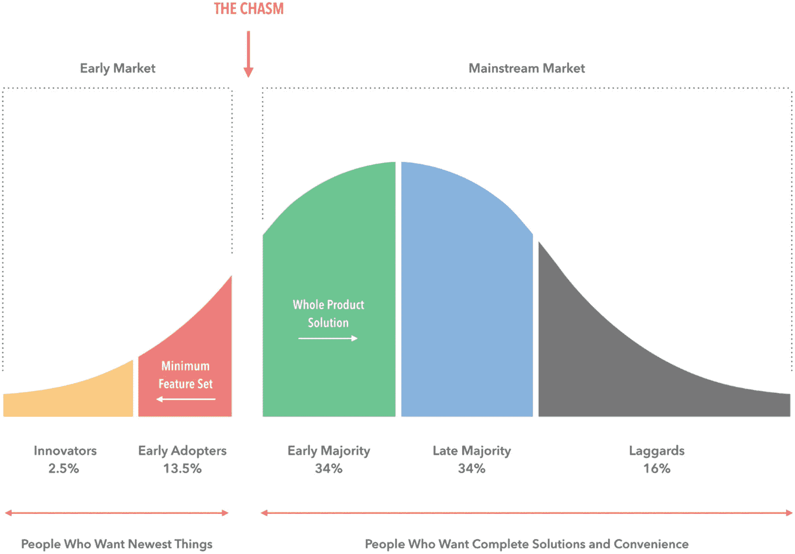
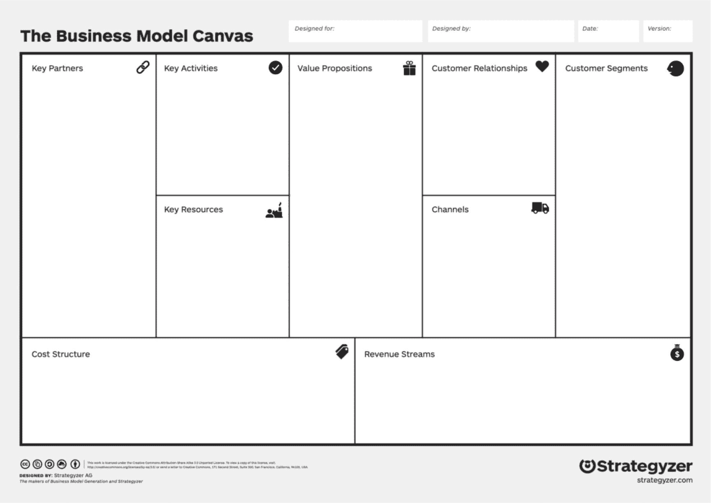
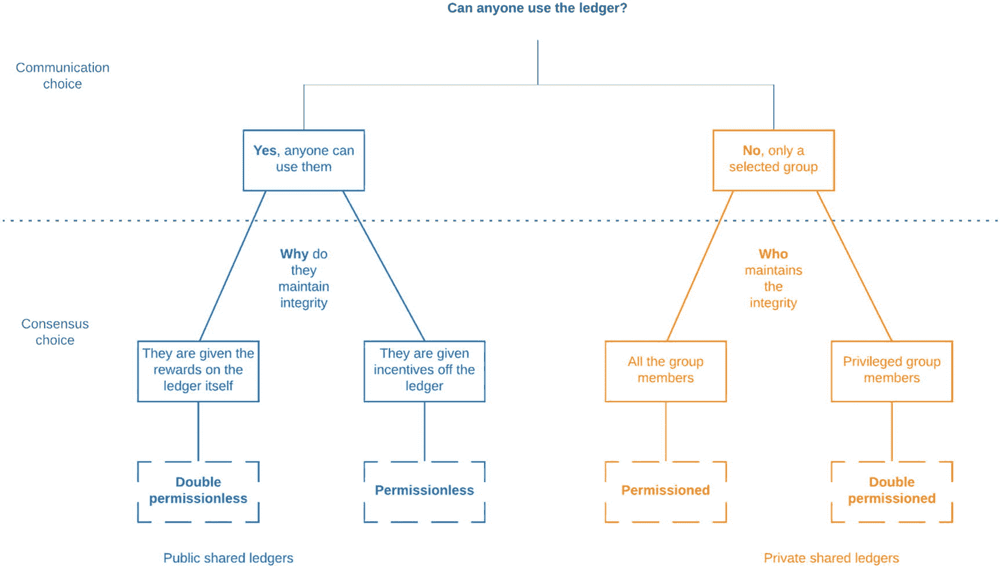
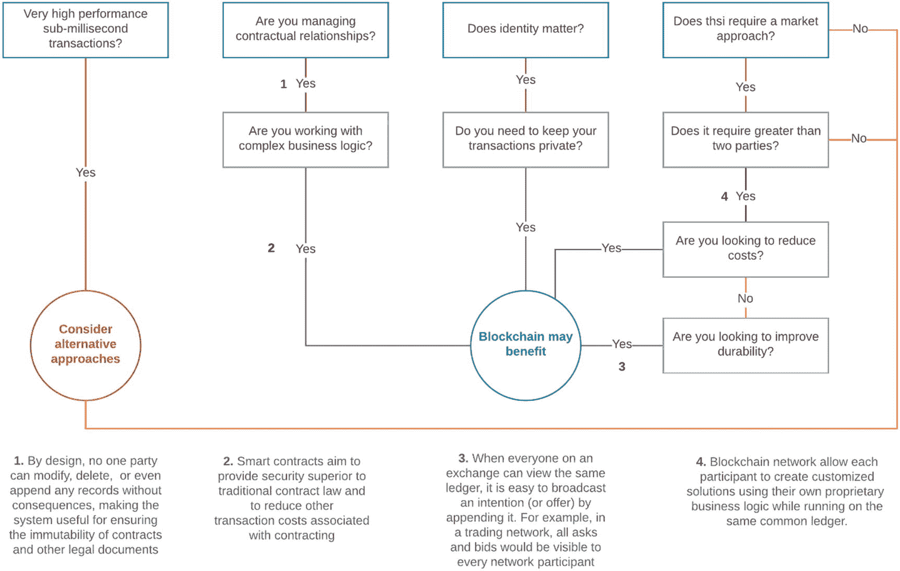
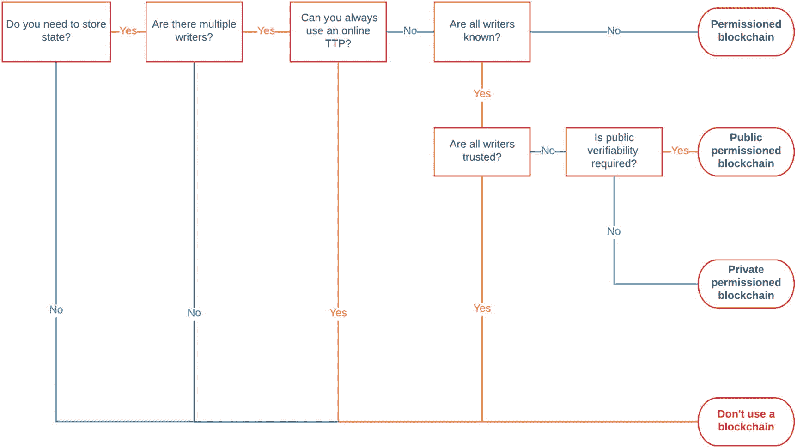
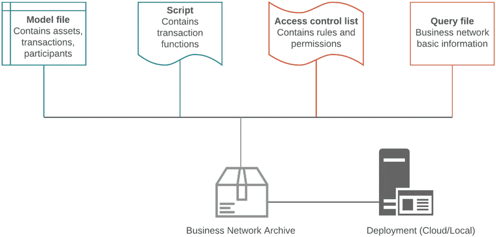

# 10. 精益区块链

对于有兴趣构建区块链产品的开发者而言，单纯投入时间研究技术是不够的。区块链堆栈包含深度融入技术模型的业务逻辑。因此，有必要初步熟悉那些正式描述初创企业组件以及如何围绕产品打造公司的框架。本章以精益方法论开篇，该模式由埃里克·莱斯创立，基于三大核心原则：

1. 将你的想法中最基础的版本转化为客户可互动的产品。
2. 尽早并经常与潜在客户沟通。
3. 根据客户反馈迭代基础模型，以实现完全符合客户需求的最终产品。

同时，我们铭记埃里克的这句话：“在构建最小可行产品时，请遵循这条简单规则：移除任何对你想获取的认知无贡献的功能、流程或努力。”随后，我们介绍了将精益方法论分解为九个可应用组件的商业模式画布。此外，我们探讨了杰弗里·摩尔针对高风险、高回报技术提出的产品-市场契合方法。接着，我们提出了三种模型，以帮助判断你的组织是否适合使用区块链。一旦决定采用区块链，超级账本项目提供了多个可定制部署的企业级区块链选项。最后，本章以对超级账本 Composer 及其用于捕获业务逻辑的模板的简要概述作为收尾。

## 精益方法论

精益方法论是一套用于开发产品的原则，旨在通过迭代的方式不断质疑所提出的商业模式是否真正解决了客户想要解决的问题，而非在没有明确终端客户的情况下规划产品。这通过更短的产品开发周期、随后多次发布以获取客户反馈、商业假设实验以及经证实的认知来实现。`Eric Ries` 是精益方法论的创始人。它为将区块链这类高风险、高回报的技术推向市场提供了一个框架。对于任何试图整合区块链或尝试在区块链上提供新服务的组织来说，需要一个严谨的框架来评估该组织是否能从区块链中受益。精益方法论的实际应用将提供这样的工具集，在本节中，我们希望向读者介绍精益的基本原理：

-   **最小可行产品 (MVP)：** 可以说是精益方法论中最重要的方面。最小可行产品是指产品的最早期版本，功能数量有限，其设计目的仅仅是为了吸引早期采用者，从而获取关于核心概念的数据和反馈。MVP 的设计必须以投入最小的组装精力，并产出关于产品和创意的最大数据量为目标。例如，一个提供定制贴纸的服务，无需花费数月时间设计复杂的贴纸。相反，一个带有几种贴纸设计的简单落地页就足以提出更关键的问题：客户想要那些贴纸吗？一个落地页可以检验这个假设，而我们的 MVP 可以就如何更新产品以使其符合客户需求提供指导。MVP 中包含的功能是基础性的，但这里的目的不是为了展示独特的功能，而是为了尽快接触客户。精心定义一个可操作的 MVP 并挖掘客户数据，是成功将高风险、高回报产品推向市场的第一步。

-   **转型：** 在 MVP 的迭代开发过程中，与客户的互动将为构建新功能和更新提供宝贵的指导。然而，一些客户互动可能会指出产品的缺陷，以及需要对核心概念进行根本性改变。此时，你有两个选择：要么转型，要么坚持。转型是指改变产品中非常有限的属性集，并生成一个新的 MVP，以证明你的核心概念正在与客户需求同步进化。进行有限数量的改变，可以让你检验能最大化触达客户直接影响。另一方面，坚持是一种大胆的冒险，即认为进一步的实验和产品微调最终能满足客户需求。`Eric Ries` 提出，衡量创业公司带宽的指标不一定是有多少资本，而是在产品准备好被大规模采用之前，它能够进行多少次转型。转型决策是关键的分支点，因此会带来风险。使用分离测试可以极大地帮助分层并降低风险。

-   **产品-市场契合：** 这是迭代设计中的一个阶段，此时 MVP 已功能丰富，早期采用者正在说服更多务实的用户尝试你的产品。产品-市场契合使你的产品正好处于即将实现大规模采用的临界点。在这个阶段，你已经验证了关于产品的所有假设，产品与市场需求同步。然而，你的产品需要营销和销售引擎的额外支持来占领市场并产生收入。本质上，创业公司中的其他服务需要被构建和部署。

-   **商业假设实验：** 假设深深植根于产品开发之中（尤其是在开发高风险、高回报的想法时），每个假设都带有失败的风险。精益将假设重新定义为需要在产品开发周期进一步推进之前被证实或证伪的假设。这通过确保我们的假设在内部保持一致并得到客户验证，从而降低了累积风险。精益创业中一种流行的假设检验技术称为分离测试（或 A/B 测试）。在 A/B 测试中，我们向终端用户展示两种不同的设计决策，其中一半的早期采用者会看到一个设计特性，而另一半会看到另一个不同的特性。从两组用户收集数据，以帮助确定哪种设计选择更受用户青睐。此外，这种数据收集提供了直接与客户访谈的机会，以更深入地了解用户如何与新的功能交互。使用这种方法有两个主要好处。首先，你可以直接衡量你的工作对用户的影响。作为开发者，我们可能会痴迷于编写更复杂的代码或开发终端用户最终可能并不关心的有趣功能。其次，A/B 测试消除了关于功能开发优先级的冲突——新的功能可以在每次迭代时添加到 MVP 中，并随后进行 A/B 测试。我们可以让数据告诉我们用户认为哪些功能是相关的。通过这种方式，如果对 MVP 进行了有限数量的更改，收集的数据可以反映这些更改是否转化为用户留存率等参数的增长。

-   **经证实的认知：** 只有当你和你的团队有纪律地严谨分析实验并从中学习时，A/B 测试才有帮助。`Eric Ries` 谈到了有助于经证实认知的三个属性，总结为三个 A：可操作、可访问和可审计。
    -   可操作：设计良好的实验将揭示对 MVP 所做的更改与获得的新用户之间的因果关系。这些实验产生的数据是可操作的，因为它们为未来的开发提供了方向。
    -   可访问：收集的数据和使用的指标必须简单，并且团队中的每个成员都可以访问。特别是，对于任何收集数据的人来说，指标可能会变得非常具有误导性。因此，我们试图衡量的内容以及这些数据点的重要性应该用最简单的术语陈述，并对团队任何成员的评论持开放态度。
    -   可审计：这类似于对经证实的认知和实验设计过程进行独立审查。任何人都应该能够查看原始数据并追溯指标，从而得到关于 MVP 每次迭代的相同建议。这为精益创业模型建立了严谨性，并为转型或坚持的决策增加了基于数据的理由。

**注意**

精益创业已被美国国家科学基金会采纳并转化为正式的课程，面向那些希望将其技术商业化的大学研究人员。“创新队”计划（I-Corps）培训由研究人员和企业家组成的团队，为期十二周，让他们掌握客户发现技能。每周都是严格基于客户访谈的 MVP 迭代，团队会在举办 I-Corps 计划的地点得到专家小组的反馈。每个团队由一名技术负责人、一名创业负责人和一名 I-Corps 导师组成。团队需要每周记录客户访谈，并更新他们的商业模式画布（我们将在下一节讨论）。诸如转型点等重大决策都是基于访谈中记录的数据趋势做出的，这使得整个客户访谈过程非常严谨。

## 识别并构建适当的 MVP

识别并构建适当的 MVP 可能极具挑战性。史蒂夫·布兰克在博客上分享了一个绝佳案例，说明这项任务有多困难且容易产生误导：

> 我在斯坦福大学遇到一家小型初创公司，他们想用搭载[高光谱相机](http://www.microimages.com/documentation/Tutorials/hyprspec.pdf)的无人机在农田上空飞行，采集[高光谱图像](http://en.wikipedia.org/wiki/Hyperspectral_imaging)。这些图像能够告诉农民：作物长势如何、是否存在病虫害、肥料是否充足、水分是否足够。（相机的分辨率足以看清每株植物。）掌握这些信息意味着农场可以更准确地预测田地产量、决定是否需要对特定区域进行虫害治理，并且只在需要的地方施用水肥。
>
> （无人机比卫星更有优势，因为分辨率更高，且能更频繁地飞越农田；同时因为成本更低，也比飞机更有优势。）
>
> 所有这些信息都将帮助农民提高产量（增加收入），并通过仅在需要的地方施用减少用水和化肥/化学品的使用，从而降低成本。
>
> 他们的计划是成为一项名为"[精准农业](http://en.wikipedia.org/wiki/Precision_agriculture)"的新兴业务中的数据服务提供商。他们将每周前往农民的田地，操作无人机飞行、采集并处理数据，然后以易于理解的形式将数据提供给农民。

### 在农场进行客户探索

> 我不知道斯坦福大学是怎么回事，但这已经是我在精准农业领域看到的第四或第五家使用无人机、[机器人](http://bluerivert.com)、高科技传感器等的初创公司了。当他们说"让我们给您讲讲我们与潜在客户的对话"时，这家团队引起了我的注意。我认真听着他们描述客户访谈的过程，似乎他们发现——是的，农民确实认识到无法详细了解田间情况是个问题——而且——理论上，拥有这样的数据确实很棒。
>
> 于是团队断定，这感觉像是一个他们想要真正去做的生意。而现在他们正在筹集资金，以构建一个原型最小可行产品。一切都很好。聪明团队，真正的高光谱成像、无人机设计领域专家，客户探索起步良好，并开始思考产品/市场契合度等等。

### 精益不是工程流程

> 他们向我展示了下一步的目标和预算。他们想要的是，找到一位能够认识到数据价值、并愿意成为产品布道者的早期满意客户。这是个很棒的目标。
>
> 他们得出结论：获得早期满意客户的唯一途径，就是构建一个最小可行产品。他们认为 MVP 需要：1) 演示无人机飞行，2) 确保软件能将所有田块图像拼接在一起，3) 以农民能使用的方式向他们呈现数据。
>
> 他们合乎逻辑地推断，实现这一目标的方法是购买一架无人机、购买一台[高光谱相机](http://www.spectralcameras.com/aisa)、购买图像处理软件、花费数月工程时间集成相机、平台和软件等等。他们向我展示了完成这一切的底限预算。非常合乎逻辑。
>
> 但这是错误的。

## 聚焦核心目标

> 团队混淆了 MVP 的目标（看看能否找到愿意为数据付费的满意农民）与实现目标的过程。他们目标正确，但用来测试目标的 MVP 却是错误的。原因如下：
>
> 团队的假设是：他们能够提供农民愿意付费的可执行数据。仅此而已。既然这家初创公司将自身定位为数据服务公司，那么归根结底，只要数据能及时提供信息，农民根本不在乎这些数据是来自卫星、飞机、无人机还是魔法。
>
> 这意味着，所有关于购买无人机、相机、软件以及花时间整合这些资源的工作，都是在浪费时间和精力——在现阶段如此。他们根本还不需要测试这些。（[低成本无人机能够搭载相机](http://www.dji-innovations.com/)已有大量实例证明。）他们定义错了应该优先测试的 MVP。他们需要花时间做的，首先是测试农民是否在意这些数据。
>
> 于是我问道："租一台相机和一架飞机或直升机，飞越农田，手工处理数据，然后看看农民是否愿意为此付费——这样是不是更便宜？难道你不能在一两天内，用你预算十分之一的钱完成这件事吗？"

## 说明

本文摘自史蒂夫·布兰克的博客，在此分享是为了说明策划定义 MVP 所需阶段的重要性。错误的 MVP 将消耗更多资源，并产生无法直接验证你的假设的无关数据。另一方面，一个恰当构建的 MVP 将使你能够快速验证核心假设，而无需动用大量资源。

这里讨论的精益原则，描述了产品如何通过多个阶段逐渐、迭代地成熟并捕获市场。产品-市场契合度是所有阶段中最重要的，组织理论家杰弗里·摩尔将其描述为产品必须跨越的一道鸿沟，才能进入大规模采用阶段。图 10-1 总结了产品可以捕获的不同客户细分阶段。我们在此简要回顾其中的五个：

- **创新者：** 这个细分群体由高级用户组成——这类客户具有一定背景，并在产品所属垂直领域拥有有限的专业知识。财务稳健是该群体的关键特征，低风险承受能力使他们能够采用最终可能失败的技术，而稳定的财务资源有助于吸收失败。这类客户渴望尝试新产品，并能提供宝贵的技术见解，因为他们与新产品能否成功息息相关。

- **早期采用者：** 这个细分群体与创新者联系紧密，拥有最高的社会资本来影响公众舆论。他们在采用新技术时更为审慎，并利用这一地位表明对新兴趋势的信心。早期采用者在帮助产品吸引更广泛受众、实现产品-市场契合度方面发挥着巨大作用。

- **鸿沟：** 大量初创企业失败，从未跨越这道鸿沟。它们开发的产品始终未能实现产品-市场契合度，最终初创公司耗尽资金。成功跨越鸿沟的公司则已准备好进入主流市场。

- **早期大众：** 这是主流务实消费者的第一个细分群体。尽管在这个层面上投入的社会资本较少，但口碑有助于产品广泛传播。

- **晚期大众：** 这个细分群体对创新持高度怀疑态度。较低的财务稳健性是其主要特征，虽然接受得晚，但新产品的采用仍会在社会平均水平成员之后很久才发生。

精益原则的应用有两个方面。第一种是创业者基于精益和客户发现方法论，从零开始打造产品；第二种是大企业内部，试图利用潜在资源和支持，孵化出小型公司的创业者。这两种情境在资源配置上截然不同；然而，构建一个`MVP`是两者共同的起点目标。这应当以最小化资源使用的方式进行，从而避免成为成本高昂的实验。这两个实例在创业者的运作方式以及大组织的文化方面，也拥有不同程度的灵活性。涉及`MVP`迭代和客户访谈的核心原则，在这两种情境下是相同的。

图 10-1

产品-市场契合度与客户细分之间的鸿沟。本图最初由 Prototypr 的 Shah Mohammed 绘制。

## 商业模式画布

瑞士商业理论家兼创业者亚历山大·奥斯特瓦德研究了数百家公司的结构后发现，每家公司都可分解为九大基本要素的模型。基于此，新的初创企业可以遵循精益方法论来构建，其形式就是包含这九个要素的一张画布，称为商业模式画布。其理念是在单页画布上工作，频繁更新关于你业务/产品的假设，并通过客户访谈来填充这九个要素。这与传统模式形成对比，后者是在没有任何客户验证的情况下，制定包含关键指标预测和用户采纳情况的冗长商业计划。该画布分为两面：左侧聚焦于你的产品/业务，右侧聚焦于客户。这两面通过价值主张交汇，价值主张被定义为你的业务或产品向客户提供的核心价值点。接下来，我们来逐一审视这九个要素，并在图 10-2 中展示商业模式画布的直观呈现：

- **客户细分：** 此部分列出将购买你产品的客户画像或典型特征。此外，本部分还应阐述客户为何会特别想从你的公司购买的原因。因此，你有责任访谈属于每种客户画像的客户，并记录他们如何与你的产品互动。

- **价值主张：** 此部分包含你的客户正在经历的痛点。通常，客户会尝试用拼凑的解决方案自行解决某个特定问题。这种方法对用户来说通常很不方便，可以说是“令人头疼”，但对创业者而言却是主要的价值来源。构建一个更简单的流程来解决那个问题，将立即成为一剂“止痛药”，并帮助你的产品更容易吸引大众。

- **渠道：** 此部分定义了你可以用来向客户传达价值主张、达成新销售以及从每个客户细分群体获取客户反馈的媒介。此部分的输出是将每个客户画像与合适的触达渠道连接起来。

- **客户关系：** 此部分描述了你将如何与客户互动，以及客户如何与你取得联系。这可以通过社交媒体账号、专属个人服务或论坛社区来实现。

- **关键活动：** 此部分代表了你为了与客户互动以交付价值主张而必须执行的工作。你需要创建一份与你的价值主张相关的关键活动清单。其中可能包括产品分销、研发、战略等。

- **关键资源：** 构建你的价值主张并将其交付给客户所需的资产。这包括任何设备、软件和知识产权（如专有知识），维持与客户的良好关系，以及确定潜在的新收入来源。关键资源应与你的关键活动相对应，以便为如何为客户创造价值提供清晰的路线图。

- **关键合作伙伴：** 你在执行所有关键活动时需要依赖的关键外部角色。没有这些合作伙伴，你将无法兑现你的价值主张。此部分的输出是一份合作伙伴名单，以及他们如何与你的关键活动相关联。

- **收入来源：** 商业模式画布所涵盖的核心财务特征，回答了一个简单问题：你的业务将如何产生收入。传统初创企业依赖三种主要的收入来源，包括产品销售、订阅费或授权许可。大多数区块链公司采用了带有免费层的订阅费模式，这允许用户在将其用于任何严肃项目之前先试用平台。本部分的输出是通过价值主张将客户细分群体与潜在的收入来源联系起来。

- **成本结构：** 此部分列出了与维持你的初创公司运营相关的所有成本。此外，通过精心规划，本部分有助于追踪那些最昂贵的关键活动或资源。

这九个要素排列在商业模式画布上，分为左侧和右侧，如图 10-1 所示，并通过价值主张连接起来。

图 10-2

包含九大核心要素的商业模式画布概览，图片源自 Strategyzer

### 你需要区块链吗？

区块链技术的热潮像野火一样席卷了企业界。各类企业和公司都组建了小型区块链开发团队，研究如何从使用区块链中受益。热潮之下，区块链世界已出现非常严肃的技术发展迹象，其中许多内容都被收录在本书中。然而，我们仍处于起步阶段。支持区块链应用的业务优势的现实在于，它们可以简化业务流程并显著减少摩擦。在本节中，我们将介绍三种决策模型，它们可以帮助你批判性地分析，将区块链集成到你的项目/公司中是否确实是合适的技术解决方案：

*   **IBM 模型：** 一种突出区块链关键特性如何融入业务流程和应用的区块链模型。
*   **Birch-Brown-Parulava 模型：** 一个帮助你在分布式账本的许可型与无许可型实现之间做出选择的模型。由 Consult Hyperion 的开发人员设计。
*   **Wüst-Gervais 模型：** 一个结合了前两个模型优点的简化模型。由苏黎世联邦理工学院的两位研究人员设计。

> **注**
> 我们为什么选择这三种模型？网上有多种综合性的决策树可帮助企业判断哪些应用场景需要区块链。在本节中，我们选择了最简单的模型来说明将区块链集成到现有基础设施中更重要的设计原则。

在深入探讨每个模型的细节之前，这三个模型有哪些共同的一般原则？你可以将这些共同的设计作为标准来评估你的业务需求，然后基于一些简单的想法和问题创建针对你业务的特定模型：

*   **数据库：** 你需要首先理解你的业务为何要使用数据库。区块链使用一个所有参与者都能看到的共享数据库。你是否乐意在你的应用中使用共享账本？数据库会通过网络上的交易持续更新；你的应用能否与一个持续更新的数据库交互？
*   **写入者：** 数据库通过多个写入它的交易进行更新。区块链的设计允许多个写入者；即，多个实体生成并验证发布到账本的交易。
*   **无需信任：** 验证写入者身份对你的应用重要吗？这可能会改变你部署的账本实现。区块链的默认设置是，向账本写入的各方之间无需信任。这对你的应用来说足够吗？你网络上的各方是利益冲突还是动机相似？如果他们有相似的兴趣，一些管理信任的区块链构造就可以安全地移除。
*   **去中介化：** 区块链从网络中移除了一个中心化权威，因此交易被认为是去中心化的。这些交易由网络上的每个节点独立验证和处理。你想要或需要这种去中介化吗？针对你特定的应用场景，拥有一个把关者是否有任何显著的缺点？倾向于选择基于区块链的数据库的良好理由可能包括更低的成本、更快的流程、自动结算或监管影响。
*   **交易互依性：** 区块链最适合处理那些由写入者发布到区块链时相互依赖的交易。互依性部分指的是交易清算；例如，如果 A 向 B 发送资金，然后 B 向 C 发送资金，第一个交易未通过前，第二个交易就无法清算。区块链确保了写入者发布的交易有序且快速的处理。换句话说，当维护一个涉及多个用户、具有长历史的交易日志时，区块链才真正大放异彩。

让我们开始看看决策模型；第一个如图 10-3 所示。

**图 10-3** Birch-Brown-Parulava 模型，显示了与账本类型对应的共识算法

此模型引导用户决策是部署许可型账本还是无许可型账本。这可能导致决定软件基础时产生深刻变化；例如，在以太坊和 Quorum 之间选择。下一个模型来自 IBM，如图 10-4 所示。

**图 10-4** IBM 关于何时使用区块链的决策图

此流程图中一个需要强调的重要特征是，某些决策如何与区块链固有的特性相关联。例如，合同关系可以通过使用智能合约在区块链上得到良好处理。此图可以作为初步检查，判断区块链与你的项目的兼容性，并了解区块链启用的功能。

我们在此考虑的最后一个决策模型如图 10-5 所示。它由 Karl Wüst 和 Arthur Gervais（均为区块链研究员）在一篇题为“你需要区块链吗？”的论文中创建，对我们来说，它按顺序集成了前两个模型的概念。

**图 10-5** Wüst-Gervais 模型

该模型试图为两种部署选项以及你是否应该考虑区块链来提供答案。这里的概念与之前的模型相似；然而，此流程图更侧重于网络本身的属性。

### Hyperledger 项目

既然我们已经提供了一个框架来确定组织是否需要区块链，接下来我们将介绍 Hyperledger，这是一个开源项目，也是一套用于部署区块链的工具。Hyperledger 本质上是 Linux 基金会的一个伞式项目，提供了用于建立、部署和管理开源区块链的底层框架、操作标准、最佳实践或指南以及开发人员工具。这个开源项目组织良好，并得到了一个由数百名贡献者、一个管理委员会和一个技术指导委员会监督的社区的支持。目前，Hyperledger 框架是一个活跃的研究领域，用于为组织或特定应用的联盟构建企业级区块链。在本节中，我们将讨论七个 Hyperledger 框架和六个开发人员工具。

> **注**
> 本节提供了 Hyperledger 项目的广泛概述。有关最新、准确的功能列表，请参考项目网站 [`www.hyperledger.org`](http://www.hyperledger.org)。此外，术语*账本*和区块链在本节中将互换使用。

#### Hyperledger Fabric

`Hyperledger Fabric` 是一个许可型区块链基础设施，也是 Hyperledger 伞状项目下首个代码库提案。该项目最初设计为在分布式账本上构建区块链应用的基础框架。它由 IBM 与 Digital Holdings 合作开发，并最终孵化成为 Hyperledger 项目。`Fabric` 提供了独特的模块化架构，其中诸如共识机制（称为可配置共识）和成员服务等核心组件均可即插即用。此外，网络中节点之间的用户权限有明确划分，因此智能合约的执行会根据权限不同而有所区别。

`Fabric` 的一个显著特点是，成员能够进行仅通过部分已验证节点传递的私有交易，而无需向整个网络广播。这一过程在保持网络完整性的同时，无需中央权威机构。本质上，私有交易包含两个组成部分：使用子通道，以及几个属性与网络中其他节点不同的节点。一旦广播，只有拥有更高访问权限的节点才能执行和验证交易。所有其他节点则会简单地“跳过”这些交易。

简而言之，`Fabric` 中有两组节点：负责执行智能合约（称为链码）、背书（验证）交易、并将区块链与基于其上构建的应用进行对接的 peer 节点；以及负责维护网络中全局状态内部一致性的执行或排序节点。`Orderer` 节点最终创建区块并将其交付给网络中的所有成员。正是由于节点间的这种分工，`Fabric` 才能支持许可型部署，这与比特币不同。

#### Hyperledger Burrow

`Burrow` 是一个完全模块化的区块链节点，带有一个许可型智能合约执行引擎。本质上，它是一个能够解释和执行代码的分布式数据库系统。该智能合约执行引擎作为一个内置的解释器，其规格遵循 `Ethereum Virtual Machine` 的标准。因此，`Burrow` 可以在容器化的虚拟机上执行用 `Solidity` 编写的 `EVM` 智能合约代码。`Burrow` 使用名为 `Tendermint` 的权益证明共识算法，该算法支持高交易吞吐量，并能随网络规模扩大而同步扩展。目前，`Burrow` 包含一个维护网络完整性和交易顺序的共识引擎、一个集成业务逻辑的智能合约应用、一个与外部应用交互的 API，以及一个将共识引擎与智能合约应用连接起来的 `Application Blockchain Interface`。

#### Hyperledger Indy

`Indy` 是一个分布式账本，专为构建包含去中心化身份组件的应用而设计。该账本附带了一套库、测试工具和模块化组件，这些组件可被复用在区块链上创建私有数字身份。最终，`Indy` 旨在创建与区块链无关的身份规范和标准，并能在任何兼容这些规范的分布式账本上实现互操作。用户的隐私信息不存储在账本本身；相反，`Indy` 使第三方应用能够快速验证受信任的组织是否已向成员颁发了私有凭证。这使得用户能更好地控制自己的私有数据，并将区块链用作身份验证网关来保护其信息。使用区块链架构提高了应用的整体安全水平，并提供了针对勒索软件的有效防护。

#### Hyperledger Sawtooth

`Sawtooth` 是一个英特尔项目，被设计成一个模块化的区块链框架，用于构建和部署分布式企业级区块链。该项目采用了一种安全架构，将核心区块链网络与智能合约的执行隔离开来，使得恶意行为者无法提升权限以影响区块链。此外，`Sawtooth` 支持对共识算法等核心组件进行热插拔。动态共识的特性使得网络能够根据网络规模动态地切换共识算法。

默认情况下，`Sawtooth` 使用 `Proof-of-Elapsed-Time` 作为共识算法，该算法在实现可扩展性的同时不会造成高能耗。因此，`Sawtooth` 同时支持许可型和非许可型部署。`Sawtooth` 拥有一个并行调度器来处理和执行交易，并配备了一种防止双重支付的安全机制。这使得对同一全局状态的多次更新成为可能，并且在交易执行性能上优于传统模型。`Sawtooth` 的第一个实现是英特尔名为 `Sawtooth Lake` 的项目。它提供供应链管理，用于证明各种商品（尤其是鱼类）的来源，并跟踪货物在整个运输过程中的状态。

> **注意**  
> `Sawtooth` 最近通过添加一个名为 `Seth` 的交易处理器，在跨平台兼容性方面取得了进展，该处理器基于 `Burrow EVM`。这使得 `Seth` 能够在 `Sawtooth` 账本上执行用 `Solidity` 编写的 `Ethereum` 智能合约。

#### Hyperledger Grid

`Grid` 是 Hyperledger 的一个供应链实现方案。Hyperledger 的主要企业用例之一就是供应链管理。一些贡献组织在这一用例中识别出了分布式账本的强大概念验证，于是 `Grid` 被设计为解决供应链问题的规范。从架构角度来看，`Grid` 并非一个区块链框架。相反，它是一整套框架和库的集合，允许开发者选择适当的组件来构建特定业务的供应链应用。拥有像 `Grid` 这样的通用框架的主要优势包括：为在网络和节点上实现具有特定角色的成员提供参考模型、实现常见业务逻辑类型的智能合约，以及由行业合作伙伴共享的去中心化数据结构。

#### Hyperledger Iroha

`Iroha` 被设计成一个移动应用开发框架，可以整合到更大的区块链项目中，以提供移动端接口。`Iroha` 提供了用于在 Android 和 iOS 平台上进行应用开发的客户端库，支持快速原型开发。`Iroha` 应用将与 `Fabric` 和 `Sawtooth` 账本实现交叉兼容，其开发环境使用 `C++` 编写，以吸引更广泛的贡献者群体。借助 `Iroha` 实现的物联网应用，将把基于区块链的数据管理扩展到外围设备，并创建半自主的互联设备网络。

#### Hyperledger Besu

`Hyperledger Besu` 是一个基于 Java 的开源以太坊客户端，它实现了企业以太坊联盟（EEA）规范。`Besu` 可以在以太坊主网、Rinkeby 等测试网络，甚至兼容规范的私有许可网络上运行。它包含多种共识算法，包括工作量证明与权威证明。此外，其权限模型旨在让 `Besu` 适用于联盟链环境。EEA 规范为开发者构建运行于以太坊区块链上的应用建立了一套通用接口。组件的标准化使得来自开源和闭源项目的开发团队无需依赖于特定于供应商的应用元素。`Besu` 实现了所有符合 EEA 规范的企业级特性。下面我们来了解 `Besu` 的三个关键特性：

- **以太坊虚拟机（EVM）：** `Besu` 通过 EEA 规范实现了完整的 EVM，能够通过主网上的交易执行智能合约。
- **共识：** `Besu` 为不同任务实现了多种共识算法；例如，区块验证通过权威证明（PoA）算法完成。这是一种参与者彼此熟识并具有一定信任基础的共识算法。`IBFT 2.0` 是 `Besu` 采用的 PoA 算法，其中交易和区块由一组称为验证者的受信任账户进行验证。这些验证者轮流创建下一个区块，现有验证者可以投票添加或移除其他验证者。此外，由于验证者的可信性质，所有区块都添加到主链上，即不存在分叉。
- **隐私与许可账本：** `Hyperledger Besu` 提供了在参与方之间保持交易私密性的能力。所有其他方无法访问私有交易的内容、发起方地址或收件人列表。这是通过 `Besu` 的私有交易管理器实现的。此外，私有交易支持许可网络，只有预先指定的账户才能参与特定交易或交易负载。所有其他没有适当访问权限的节点仅会传递交易，而无法访问任何细节。

为了提供更全面的开发环境，七个 Hyperledger 框架还附带以下六种开发者工具（还有更多工具正在积极开发中）：

1.  **Hyperledger Explorer：** `Explorer` 是一个区块链模块，旨在构建与账本交互的 Web 应用。它可用于查看基本网络信息、新创建的区块或交易地址，或查询交易数据及其他公开的区块参数。
2.  **Hyperledger Caliper：** `Caliper` 是一个为区块链实现计算性能数据的报告工具。使用 `Caliper`，您可以选择预定义的用例，并获得关于交易延迟、资源利用率以及账本上每秒交易数等性能因素的报告。`Caliper` 能为计划采用分布式账本的组织辅助商业决策。
3.  **Hyperledger Composer：** `Composer` 是一个基于 UI 的快速原型开发工具和开发框架，用于创建区块链应用和智能合约。此外，`Composer` 还提供了一个用于部署应用的测试网络。该开发环境对用户友好，依托于 `Node.js` 和 `NPM` 等广泛熟悉的框架。`Composer` 还附带打包了示例业务抽象，这些抽象模拟了常见的业务应用，并提供了部署脚本，以便在沙盒中进行实时测试。下一节我们将再次讨论 `Composer` 的快速原型开发方面。
4.  **Hyperledger Quilt：** `Quilt` 是跨账本协议（ILP）的 Java 实现，它支持以区块链无关的方式，在包括法定货币在内的任何去中心化网络上进行支付。`Quilt` 提供了发送和接收交易所需的核心库和数据类型。这些库被抽象出来，作为开发者可用于构建应用的支付逻辑。使用 `Quilt` 构建的应用可以请求认证并访问其他账本或任何与 Interledger 兼容的支付系统。
5.  **Hyperledger Cello：** `Cello` 是一个区块链供应仪表盘，可以减少设置、管理和使用分布式账本所需的管理工作量。对于系统管理员而言，`Cello` 有助于维护区块链网络的生命周期，支持自定义区块链参数，并扩展传统的监控和日志工具，以报告区块链网络的运行状况。最终，`Cello` 将成为通过 `Hyperledger` 设置区块链的前端界面。此外，`Cello` 中的高级部署功能使其成为一个用于生成和维护按需区块链的区块链即服务平台。这项链服务与多种基础设施跨平台兼容，包括虚拟机（VSphere）和容器平台（Docker, Kubernetes）。
6.  **Hyperledger Ursa：** `Ursa` 是一个共享功能的密码学库，它标准化了 `Hyperledger` 的安全功能。这使得开发者能够精简代码，降低漏洞风险，并提升网络的整体安全水平。值得注意的是，`Ursa` 包含一个用于创建零知识证明的通用库，该库将可供任何与 `Ursa` 兼容的账本实现使用。

### 使用 Hyperledger Composer 进行快速原型设计

Hyperledger Composer 是一套用于建模业务的高级应用抽象层。当你确定自己的业务可能受益于使用区块链时，可以利用 Composer 为应用创建一个基于区块链的原型。以下是制作原型所涉及流程的概要：

-   安装 Hyperledger Composer 工具，或在在线游乐场中试用 Composer。
-   定义业务网络、资产和交易。
-   实现所有交易处理器。
-   在 Composer-UI 中测试业务网络。
-   将业务网络部署到实时的 Hyperledger Fabric 区块链实例上。
-   在底层抽象之上创建一个示例应用。
-   通过 RESTful API 或 Node.js 将其他应用连接到该部署。

Composer 的功能性输出称为业务网络存档（`BNA`），它可以部署到测试网络或实时的 Fabric 区块链上。一个业务网络包含以下要素：通过角色/身份连接起来的参与者、在网络中传播的资产、描述资产交换的交易、作为交易支撑规则的合约，以及最终记录所有交易的账本。除了对业务网络的组件进行建模外，`BNA` 还包含交易处理器、访问控制列表和查询定义。交易处理器（用 JavaScript 编写）在这些模型元素上实现并执行业务逻辑。访问控制列表描述了规则，允许对参与者在满足特定条件后能访问业务网络中的哪些资产进行精细控制。用于描述这些访问列表的语言非常精密，能够捕获复杂的所有权声明。将访问控制与交易处理器逻辑分开，使开发人员能够快速维护和更新这两个组件，而无需担心兼容性或功能中断问题。

**注意**

在本节中，我们的重点是介绍 Hyperledger Composer 的基础知识，以便感兴趣的读者能够更快地从参考资料中掌握 Composer 的建模语言。设计一个完整的业务网络模型超出了本书的范围。

让我们深入了解建模语言，并深入讨论 Composer 的基础：

-   **资产：** 代表网络上用户之间交换的资源。形式上，用于定义资产的描述方案遵循 `关键字 - 类 - 标识符 - 属性 - 关系` 的顺序。这里也可以添加其他可选字段，但在整个建模语言中都遵循此通用方案。资产用 `asset` 关键字定义，并带有一个与之关联的、与领域相关的类名。例如，一辆汽车可以通过 VIN 标识为：`asset Vehicle identified by vin`。资产拥有一组定义它们的属性；对于车辆来说，它可以是一个存储为 `String String` 类型的描述。此外，资产可以与其他建模语言中的资源建立关系，例如拥有汽车的用户，表示为 `--> User owner`。所有资产都存储在可供网络访问的资产注册表中。

-   **参与者：** 代表网络中的用户（或交易对手）。参与者对于网络上的所有交互都至关重要，它们的描述方式与资产相同。参与者使用 `participant` 关键字表示，并且它们也有一个与其领域相关的类名，例如买方或卖方。完整的描述可以表示为 `participant Buyer identified by email` 以及属性 `String firstName`。所有参与者都存储在参与者注册表中，该注册表可能不对网络用户开放。

-   **交易：** 代表资产在网络上的移动，以及资产在被交换过程中的生命周期。交易以与参与者或资产相同的方式描述，来自参与者的销售报价可以定义为 `transaction Offer identified by transactionid`，并带有属性 `Double saleprice`。

-   **概念：** 概念是不属于资产、参与者或交易的抽象类。概念通常用于为资产或交易添加限定符，并且通常被三者中的某一个所包含。例如，地址的概念可以描述为 `Concept Address`，带有属性 `String street` 和 `String city_default ="Orlando"`。现在，一个资产可以使用此概念来指定地址属性。

-   **交易处理器：** 代表执行业务逻辑，以便在交易广播到网络时对区块链进行状态变更和全局更新。本质上，这些处理器为交易提供了对模型进行操作的实现。它们被编写在单独的 js 文件中，并利用业务网络模型中的定义。

这些组件在图 10-6 中以图形方式展示。

**图 10-6** 业务网络存档的组成部分

## 总结

在本章中，我们研究了与区块链研究和开发相关的三个不同领域：使用精益创业方法论，将高风险的研发理念转化为客户想要的产品；如何判断你的组织是否需要区块链；以及 Hyperledger 项目概述——一个构建企业级区块链的开源项目。我们将精益方法论分解为亚历山大·奥斯特瓦德提出的商业模式画布和杰弗里·摩尔提出的产品-市场契合鸿沟模型。这些模型帮助我们更好地理解如何设计产品以占领市场。接着，我们提出了三个模型来判断你的项目或公司是否能从使用区块链中受益，以及如何决定部署类型。最后，我们简要回顾了 Hyperledger 项目，该项目提供了高度可定制的区块链实现，能够将业务逻辑捕获到模板中。我们希望读者能从本章中获得实用且可应用的技巧，以推动自己创意的实现。

