# 11. 区块链 3.0

区块链领域研发的快速增长，可以解释为业界对传统互联网公司与区块链公司价值创造与获取方式有了更深入的理解。风险投资家及区块链技术投资人乔尔·莫内格罗（Joel Monegro）与纳瓦尔·拉维康特（Naval Ravikant）提出了"胖协议"的概念，认为区块链领域的大部分创新将发生在核心技术层。随后，代币层可以将底层架构的使用货币化，并为应用层提供访问权限。为此，我们见证了区块链发展的三代迭代：第一版是中本聪的原始协议，提供了用于交易的功能性区块链；第二版是以太坊等协议，提供了智能合约与链上操作；而下一代区块链协议则支持链上执行，并可将机器学习等服务集成到区块链中以完成高级任务。

在本章中，我们将重点介绍三项新技术，它们显著加深了我们对区块链赋能应用的理解，并为研究开辟了多条新途径。我们首先讨论`EOS`，这是一个以太坊的竞争对手，其架构灵感源于操作系统，并采用平台支持设计理念。它使用名为委托权益证明的新共识机制，实现快速交易验证，并对支持网络的代表进行持续投票循环。`EOS`中实现的消息传递协议非常先进，允许在消息传递时自动触发响应处理程序和操作，并构成了智能合约系统的大部分功能。此外，系统还支持网络范围内智能合约指令的并行无锁执行，大幅降低了通信和状态更新中的延迟。

我们介绍的第二项技术是一种面向合约的编程语言，名为`Chain-core`。`Chain`目前已不再活跃开发；但我们希望借此说明与区块链无关的面向合约编程在资产管理中的潜力。在`Chain`网络中，所有价值都集中在可由用户发行和控制的资产上。`Chain`为开发者提供了强大的 API（及图形用户界面），用于在区块链上管理和转移这些资产。我们将逐步讲解`Chain`的图形界面，并涵盖资产管理的基础知识。

我们将讨论的最后一项技术是企业级以太坊。本节将聚焦三个主要贡献者：`Quorum`（摩根大通构建的企业级以太坊分叉）、以太坊企业联盟（一套用于构建企业应用的规范与标准）以及`R3`（区块链部署工具`Corda`背后的联盟）。该技术集旨在满足企业的高吞吐量需求，并提供了一些独特的升级。最引人注目的功能包括私有交易与智能合约、零知识证明以及可插拔的共识机制。

## EOS 区块链

`EOS.IO`是一种类似操作系统的新型区块链架构方案。其设计考量使核心基础设施能够轻松扩展，以支持去中心化应用。这里的可扩展性更广泛地指代一系列原则，使区块链应用与传统非区块链应用具有相似性。在本节中，我们将重点关注`EOS`三大技术创新所带来的大规模应用潜力：先进的权限系统、名为委托权益证明的新共识方法，以及`EOS`区块链中的并行处理能力。让我们从`EOS`所体现的几个可扩展性原则开始讨论：

*   **用户规模：** 一个突破性的`EOS`区块链应用应能支持数百万用户和用户账户。底层架构需要设计为分布式账本能将账户视为基本单元（而非交易）。支持服务可提供账户与区块链全局状态的同步修改。

*   **免费访问：** 基于区块链构建的服务或应用不应将任何执行成本转嫁给用户。大型非区块链服务本质上是免费的，最终用户通过应用使用产生的数据实现货币化。为实现广泛采用，基于区块链的应用必须消除用户费用，分摊服务成本，并通过新用户注册应用来产生收入。

*   **更新与分叉：** 向服务集成新组件或功能不应导致任何停机。基于区块链的服务在某种程度上必须处理共识问题，分歧可能导致链分叉。这些分叉会产生不同长度的链，通常随着下一个区块的生成而迅速解决；然而，更严重的问题出现在软件更新时。网络中的漏洞应能轻松无缝地修复，无需进行任何会导致部分网络不兼容的硬分叉。区块链服务的去中心化特性创建了一个无单点故障的网络，结合冗余机制，可以提供独特的无停机体验。

*   **低延迟：** 比特币区块链目前存在高延迟和验证延迟过长的问题。一个为数千用户服务的实用系统难以承受漫长的等待时间；因此，`EOS`上的服务必须在适用场景提供极其快速的验证和确认方法。一些有趣的新特性（如并行处理）可能会缓解交易确认缓慢的痛点。

让我们从 EOS 如何处理账户和用户权限开始。在 EOS 中，所有账户都可以通过人类可读的唯一标识符创建。此外，EOS 在账户之间提供了一套定义良好的、带有处理器和自动化规则的消息传递协议。网络上的每个账户都可以向其他账户发送结构化的程序化消息，并定义处理接收消息的规则和脚本。用于处理消息的脚本也可以发送消息来响应特定的传入操作。每个账户还有一个私有存储空间，消息处理器可以访问它来修改账户状态。消息处理脚本与规则一同构成了 EOS 部署的智能合约系统。EOS 智能合约背后的设计原则，类似于经过充分研究的、描述操作系统如何与外部设备及其他硬件组件通信的消息传递协议。合约将在类似于 EVM 的虚拟机上执行。用 Solidity 或其他面向合约语言编写的现有智能合约可以移植并适配，以便在 EOS 区块链上的容器中运行。这些合约还将继承一些 EOS 特有的函数，使其能够与其他 EOS 组件通信。

> **注**  
> EOS 的另一个高级特性是能够在 EOS 区块链与兼容默克尔证明的外部区块链之间进行通信。这是通过使用相同的基本密码学原理（消息存在性证明和消息序列证明）在客户端完成的，用于验证进出区块链的消息。

让我们回到理解用户权限如何工作的话题。在 EOS 中，应用的结构使得身份验证和权限模块与业务逻辑保持分离。这允许开发者设计专门用于权限管理的工具，并精简应用，使其仅包含与应用导向操作相关的代码。EOS 允许用户定义用于签名传出消息的密钥，以及用户访问的每个独立服务所使用的不同密钥。例如，一个用户可以拥有一个密钥用于签名发送给其他用户的消息，以及另一个不同的密钥用于访问社交媒体账户。也可以在不分配任何密钥的情况下，授予其他账户代表用户行事的权限。这种类型的受限访问可以让某人拥有对你社交媒体的“仅发布”权限（需事先获得许可），但这些帖子会保留其独特的签名。这是通过一个称为**权限映射**的概念来实现的，我们将在后面讨论。权限映射中的一个关键概念是单个账户的多用户控制。这被认为是去中心化应用的一种高级安全措施，并且在 EOS 中实现它是为了降低密码或代币被盗的风险。

> **注**  
> EOS 可以被视为由 Dan Larimer 创建的、基于区块链的社交网络 Steem 的广义进化版。Steem 构建在 Graphene 区块链上，权限映射最初作为一个功能实现，但功能非常有限。虽然 Steem 被设计为一个去中心化的社交平台，但 EOS 是一个应用开发平台，拥有一个类似于以太坊的图灵完备区块链。

为了理解权限映射，让我们看一个涉及三个用户角色的例子：账户所有者、活跃用户和社交媒体用户。社交媒体权限只允许用户执行特定操作，例如投票和发帖。另一方面，活跃用户权限允许执行除移除所有者之外的几乎所有操作。所有者可以执行所有可用操作，包括提款。在这个例子中，权限映射指的是账户所有者定义角色并将相关权限映射到其他账户。EOS 通过允许自定义角色和自定义操作（这些可以被映射到不同账户）来推广这个例子。例如，一个账户持有者可以将某个社交媒体应用的权限映射到一个“朋友”用户组。现在，任何被（账户持有者）添加到该权限组的账户都可以立即访问该社交媒体应用。他们可以发帖、投票以及执行该权限组可用的任何其他操作，但他们的唯一密钥会被记录下来。因此，始终可以识别出是哪个用户执行了操作。权限映射的概念如图 11-1 所示。

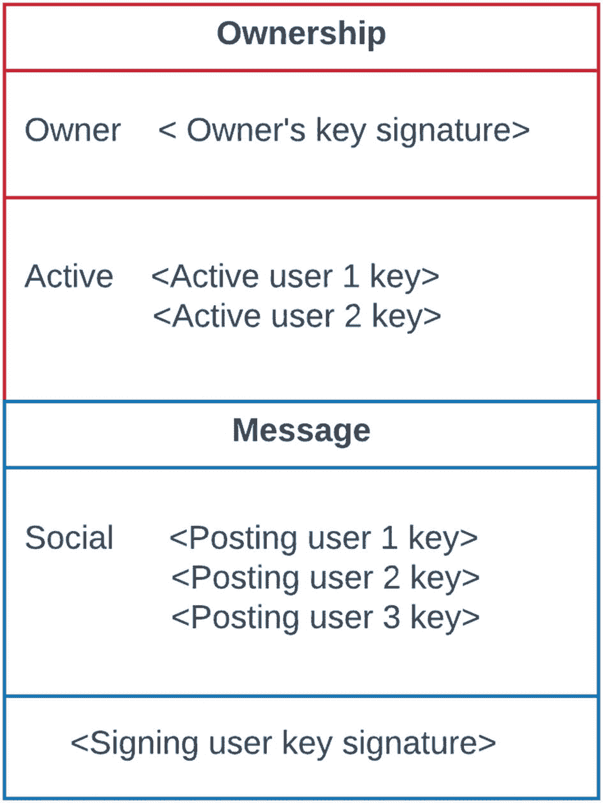

**图 11-1** – 自定义权限映射的结构

在图 11-1 中，我们可以将这个表示图分成两个部分：所有权和消息本身。所有权部分包含来自账户持有者的密钥，持有者可以执行所有账户功能，包括提取代币。它还包含代表所有者行事的活跃用户的密钥。这个结构的第二部分是消息，这里我们继续使用社交媒体的例子。有三个由所有者映射到该账户的社交媒体用户，每个用户都有一个唯一密钥。当一条消息发布到社交媒体时，发布者使用他们自己的唯一密钥对消息进行签名，因此可以追踪到映射用户执行的任何操作。这里的消息模块可以被其他应用替换，账户持有者将自定义权限映射到该应用，为映射用户提供受限的功能。

### 委托权益证明（DPoS）

EOS 采用了一种名为委托权益证明（DPoS）的新型共识机制。它是权益证明算法的一个变种，专注于提高效率并确保公平访问，为小额钱包/账户提供了生产区块并赚取奖励的公平机会。传统权益证明算法与 DPoS 之间的区别，可以类比为直接民主与代议制民主之间的差异。在传统的权益证明（PoS）算法中，任何拥有钱包的用户都可以参与验证交易、达成共识，并获取部分挖矿奖励的过程。然而，对于持有小钱包或“权益”较少的用户来说，这可能是无利可图的。在 DPoS 中，网络中任何持有任意数量代币的钱包都可以投票选举代表，由这些代表负责验证交易并将区块追加到区块链上。最终，DPoS 网络中有两个主要参与者：

-   **利益相关者：** EOS 网络中的账户，持有带有余额的钱包。拥有代币使你能够投票选举区块生产者。
-   **区块生产者：** 也称为代表，这些实体驱动着 DPoS 的共识机制。区块生产者相当于 DPoS 体系中的传统矿工。他们在网络上验证交易、签名区块，并因将区块添加到区块链而获得奖励。

在深入探讨 DPoS 之前，让我们简要回顾一下共识机制以及全局状态更新的必要性。回顾一下，区块链可以被建模为一个具有一致更新历史的状态机。交易作用于这个状态机，而共识则是网络范围内就交易更新全局状态的顺序达成一致的过程。随着新交易被纳入区块，以及频繁的更新过滤掉无效或双花交易，状态更新会以特定的增量进行。DPoS 的目标是让区块生产尽可能平均地分布在最多人群之中，并确保通过民主、公平的流程选举出区块生产者。常规的 PoS 网络需要完全共识才能进行验证，而在 DPoS 系统中，有限数量的委托节点（代表）可以可验证地完成交易验证并达成共识。

> **注意：**  
> 在当前的时间表中，EOS 允许由单一的区块生产者每三秒生产一个区块。默认情况下，区块以多个轮次的形式生产，每个轮次包含二十一个区块生产者。

DPoS 算法有两个主要的操作角色：选举一组区块生产者以及调度区块生产。网络中每个账户在称为批准投票的过程中，至少允许为每个代表（矿工）投一票。然而，在网络中持有更大“权益”的账户遵循每代币每代表一票的原则，并且可以为多个代表投票。区块生产者（代表）被视为区块链上最小化信任的方，通过实时投票过程选举产生。这些代表可以轮流（按轮次）将交易添加到区块中，并对要添加到区块链的区块进行签名。因此，使用可信的方可以防止恶意方将无效交易添加到区块链中。需要注意的是，代表没有能力更改交易或区块的详细信息；他们只能选择将交易添加到区块中或不添加。这组代表基于某种加权公平队列算法的变体，被随机分配进行区块生产。其目标是基于两个标准高效地调度区块生产者：他们获得的票数以及代表等待生产区块的时间。获得更多选票的代表更有可能被安排下一个生产区块。另一方面，失职的代表可以被迅速投票淘汰，而不会影响任何显著的交易量。让我们总结一下代表的主要角色：

-   **区块生产：** 代表最重要的功能是按照每三秒一次的固定时间表创建区块。这包括在多个轮次中验证交易和签名区块。
-   **网络支持：** 每次代表生产一个区块时，他们都会因锻造该区块而获得奖励。薪酬率由利益相关者设定；然而，一些代表可能为了从网络中获得更多选票而接受较低的薪酬率。此外，代表们可能会通过提供诸如营销和法律工作等额外服务来取代接受较低薪酬率。

图 11-2 展示了 DPoS 共识算法中使用的代表性区块生产过程。

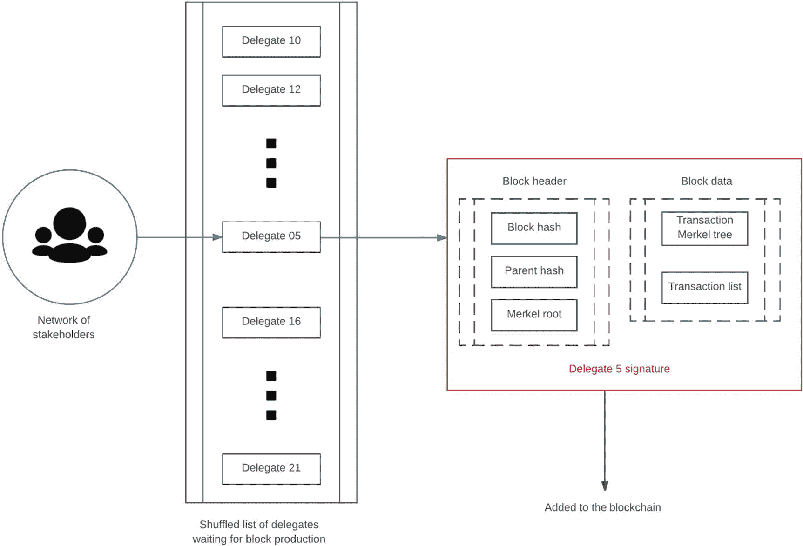

**图 11-2** — DPoS 中的区块生产

网络上的利益相关者投票选举代表，这些代表反过来验证交易并生产区块。这一点如图 11-2 所示。从得票最高的代表中，选出二十一名参与多个轮次并生产区块。这些代表被分配到一个生产区块的时间表中，此分配使用轮询算法进行。如果区块生产者在计划的时间段之外进行锻造，则该区块被视为无效。在代表对区块进行签名后，最终的区块就可以被追加到区块链上，如图右侧所示。如果某个区块生产者未能按时生产，则下一个代表的区块将更大，并包含之前的事务。同时，如果某个区块生产者反复失败，他们将被投票淘汰出该轮次。

> **提示：**  
> 有趣的是，DPoS 区块链不易产生分叉。这是因为区块生产者相互合作生产区块，而不是像在 PoW 系统中那样相互竞争。万一发生分叉，共识会自动切换到最长的链上。

### 并行执行

在以太坊中，指令（例如来自智能合约的指令）的执行是以确定性和同步的方式在整个网络中完成的。EOS 提供了一项非常有趣的升级，可以在不使用任何锁原语的情况下并行执行应用程序。在这种情况下，区块链本身必须有一种机制来确保每个账户只更新自己的数据库。传入的指令会更新账户状态；因此，它们必须按顺序应用，以便第 `n`+1 条指令只有在第 `n` 条指令之后才能更新该账户。对于二元的是/否类型指令，这一通用规则存在一个例外。某些账户处理程序可以将二元指令作为只读指令处理并回复，而无需对其内部状态进行任何更改。

从根本上说，EOS 中的并行执行依赖于将来自一个账户内不同来源生成的消息分派到独立的线程，以便它们可以并行执行。最终，一个账户的最终状态仅取决于传递给它的消息。区块生产者负责将消息分派到独立的线程。即使区块生产者按计划进行区块验证，消息的分派也会按照更快速和定制的计划进行，以利用并行性的优势。通常，这些消息的来源是区块链上运行的脚本或自动发送消息的账户处理程序。由于 EOS 的并行特性，当消息生成时，它不会立即被传递。相反，在消息生成和传递之间会有一段时间间隔，称为延迟。引入延迟的原因在于，即时传递可能会干扰正在因前一条消息而修改自身内部状态的接收方。无锁消息传递是通过将消息调度到下一个周期中传递来实现的。

那么，什么是周期？在正常情况下，为了避免消息冲突，一个账户必须等到下一个区块才能发送第二条消息或接收回复。每三秒生成一个区块；因此，账户在发送更多消息之间至少需要等待三秒。为了消除消息之间的等待时间，EOS 将一个区块划分为多个周期，并进一步将这些周期细分如下：

* 每个周期被分为多个线程。
* 每个线程包含一个交易列表。
* 每个交易包含一组将被传递的消息。

图 11-3 展示了区块内周期的细分结构和组织结构。

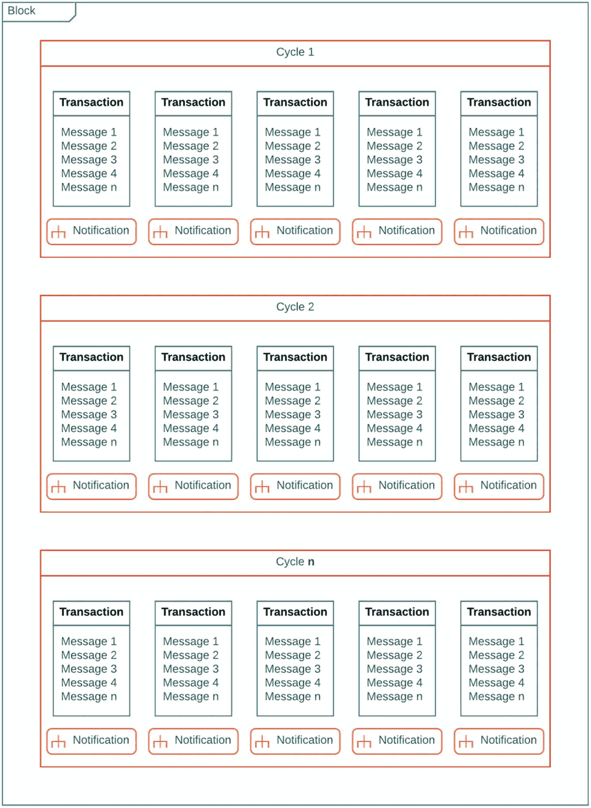

图 11-3 EOS 中消息的区块结构

每个区块被划分为一个周期，这构成了单个区块内快速通信的基础。如果一个区块内的两个交易没有修改同一个账户，那么一个周期内的所有交易都可以并行执行。对于发生在用户之间的每个交易，接收方预设的任何自动处理程序都会收到传入指令的通知。

区块生产者不断向区块添加新的周期，直到达到时间限制或没有生成新的交易。在一个周期的时间窗口内生成的交易也可以添加到后续周期或下一个区块中。一旦区块最终确定，我们可以提出以下问题：给定一个区块周期，是否存在两个线程包含修改同一个账户的交易？如果没有，那么任何给定的区块都可以通过并行执行所有线程来处理。一个交易所应用程序开发者会运行全节点，目的是向其用户展示交易所状态。这个交易所应用程序不需要与社交媒体应用相关的状态。EOS.io 软件允许任何全节点选择运行任意应用程序子集。传递给其他应用程序的消息会被安全地忽略，因为一个应用程序的状态完全源自传递给它的消息。本节有两个重要的要点需要重申：

* 一个应用程序的内部状态源于专门传递给该应用程序的消息。
* 对账户内部状态的任何更改都通过账户之间传递的消息发生，并包含在区块链的交易中。

Dan Larimer 评论了 EOS 的并行特性，认为这是在区块链上构建应用程序的巨大优势：

> *并行处理能力为您的应用程序带来了持续的可扩展性和可靠的高性能基础。现有的单线程能力迫使每个应用程序共享单一单线程区块链的容量和性能，造成了严格的扩展限制，最终可能导致网络拥塞，进而可能引发平台范围的停机。*

注意

EOS.io 最近进行了一次 ICO 为其开发筹集资金，CryptoPortfolio 对该 ICO 进行了审查，提出了一些值得考虑的观点。首先，利润产生来自于 EOS 代币的价值增值。用户和开发者越多，估值就越高。其次，EOS 上没有交易费用，因此账户和 DApp 需要代币才能运行。持有一定数量的代币就像购买了 EOS 计算能力的百分比份额。第三，由于平台将免费使用，你只需要在账户余额中持有代币即可在这个区块链上操作。最后，用户要求他们使用的服务有快速响应，因此 EOS 将努力使交易确认时间少于 1.5 秒。

### 调度

本节中我们要讨论的最后一个主题是尽力而为调度。回顾之前关于计算市场的讨论，区块链上类似 EVM 的图灵完备虚拟机决定了合约中指令的执行成本。请求特定任务的客户为指令的每一步支付`gas`，如果步数超过 EVM 的 gas 限制，任务将不会执行。在 EOS 中，代表取代了虚拟机，负责对执行资格做出全局决策。区块生产者（代表）对处理交易内指令并传递消息的复杂度（指令步数）和所需时间进行主观评估。这种处理成本的主观评估类似于以太坊系统中的`gas`。基于代表的指令计数和成本确定机制简化了为区块链添加新功能和优化的过程，无需担心破坏成本计算。它还允许我们对网络进行功能性分类：用于执行的区块链和虚拟机，以及用于计算资源分配和管理的节点或区块生产者。

为了对计算运行时间计费，每个区块生产者使用其对 EOS 算法的自定义配置来计算资源利用率。在整个网络中，每个步骤都有执行时间限制，并且无论计算耗时 1 毫秒还是完整时间，都会收取固定的带宽使用成本。需要注意的关键点是，在 EOS 中，所有资源使用约束都是主观的，最终由区块生产者强制执行。作为集体，区块生产者已在 EOS 网络上达成以下标准：

- 对于区块生产者，有两种选择：包含一笔交易（一组指令）或拒绝将其包含在区块中。
- 如果区块生产者判定某个账户消耗了不合理的计算带宽，他们在生产自己的区块时将拒绝来自该账户的交易。
- 只要有一个区块生产者认为交易有效且符合资源使用限制，所有其他区块生产者也会接受它。但该交易在网络上的确认时间会更长。
- 如果一个区块生产者包含了远超资源限制的交易，另一个生产者可能会拒绝该区块，此时需要第三个生产者作为决策者。

决策区块的传播会存在延迟，这给了利益相关者和其他代表充足的时间来定位资源违规的源头。随着时间的推移，如果某个恶意区块生产者持续批准超出限制的区块，她将被投票从代表名单中除名。区块生产者在 EOS 中扮演“尽力而为”调度器的角色：公平调度任务以最大化吞吐量，或拒绝任务在网络上的执行。

**注意**

`EOS.io Core` 目前为 2.0.5 版本，包含新的稳定性更新和功能。`Quickstart IDE` 是一个基于网页的开发工具，用于使用`EOS.io 2.0`构建区块链应用。它能在几分钟内实现智能合约的快速原型设计和快速部署。这简化了应用开发流程，尤其对新手开发者而言，无需进行大量配置。

## 链核心（Chain Core）

`Chain` 是一种面向合约的编程语言，专为管理区块链上的资产而设计。`Chain` 目前已不再活跃开发。然而，用于管理资产的编程语言的概念框架和设计对读者您来说具有巨大的学习价值。因此，我们在新版中保留了本节内容。以下是对 Chain 平台由他们团队的精彩总结：

> *使 Chain 区块链成为共享账本（而非简单分布式数据库）的关键特征，在于它被设计用于追踪和控制价值——即一个或多个资产的单位。与数据不同，价值是稀缺的：一旦发行，便无法复制，只能转移。*
> 
> *当金融工具的基础格式转变为加密发行的数字资产时，我们获得了新的能力，其中最显著的一点是能够编写控制资产的程序。这些程序被称为合约。*
> 
> *Chain 区块链上的所有价值都由这类合约保护。每个合约控制或锁定某些特定价值——即一定数量的资产单位——并强制执行解锁该价值前必须满足的条件。从最简单的托管账户到最复杂的衍生工具，合约定义了 Chain 区块链网络上资产转移的规则。而 Ivy 让您能够组合这些规则。*
> 
> *在设计 Ivy 时，我们只有一个目标：让编写安全、可靠且简单的程序来控制区块链上的价值流动变得容易。仅此而已。*

在 2017 年共识大会（一场重要的区块链开发会议）上，Chain 宣布了对核心编程语言的一系列更复杂的升级，使编写管理资产的合约更加容易。`Ivy Playground` 就是这项旨在尽可能优化开发者体验的成果。Chain 和 Ivy 在设计合约时采纳的核心概念是限制区块链中的信息量：仅包含状态更新逻辑和维持共识的变量。Chain 团队对这一设计原理的解释如下：

> *应尽可能在链下（即“应用层”）执行区块链解决方案的业务逻辑——使用传统语言编写程序，通过其 SDK 与 Chain Core 交互。需要纳入“智能合约”层的唯一逻辑，是那些保护并转移资产的一系列规则。*
> 
> *某些区块链平台被宣传为工作流自动化工具、共享状态的全球数据库，或构建软件即服务应用的平台。我们认为这些目标做出了错误的权衡，因为它们有效地将计算和逻辑从计算成本低廉、信息私密的传统服务器，转移到了每个计算都必须在网络每个节点上冗余执行的区块链上。*

理解 Chain 设计的关键在于，传统服务无法直接迁移到区块链上；相反，它们需要针对新的架构进行重新设计。首先，应用程序中会引入涉及共识机制的额外参数。程序化例程需要区分两类内容：一类是应保持在区块链之外的业务逻辑，另一类是需要同步到链上的状态变量。因此，需要做出新的设计决策。此外，传统服务存在一些固有的冗余，这在数据中心的服务器上通常不是问题，但在去中心化网络中，每个节点必须在计算的每一步都按相同顺序更新账户状态（复制状态机），这些冗余就会被放大。

为了演示 Chain 的运作方式，我们将通过 Ivy 来逐步操作 Chain Core。本次操作的主要目标是了解如何创建 HSM 加密密钥、如何创建账户以及如何交易资产。其布局将与我们在前一章中介绍的 Aragon 非常相似。请特别关注资产相关信息在 Chain Core 中的流转方式（图 11-4）。

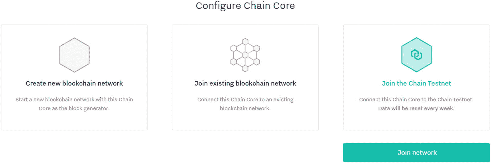

图 11-4

## 配置 Chain Core

在我们的操作中，我们将加入一个测试网络，它的行为类似于区块链，但所有数据每周会重置一次。测试网络有助于理解如何正确地与区块链交互，以及如何在 Chain 中管理资产。

点击“加入网络”后，你应能进入 Chain Core 的控制面板。在这里，你会看到一个开始教程的选项。我们将在此处介绍该教程的基础内容，并补充更多关于 Chain 主要概念的信息。控制面板左侧是我们在整个操作过程中会频繁使用的导航菜单，如图 11-5 所示。导航菜单分为三个部分。顶部处理与账户、资产和交易相关的数据。中间部分处理与区块链交互所需的公私钥对。底部则提供了一些开发者服务；我们将在本章稍后部分介绍 Ivy Playground。要与测试网络交互，我们首先需要创建密钥。Chain 使用基于硬件安全模块（HSM）的密钥管理，这个密钥将成为你进入网络的网关。要创建密钥，请转到导航菜单，在“服务”下点击 `MockHSM`。

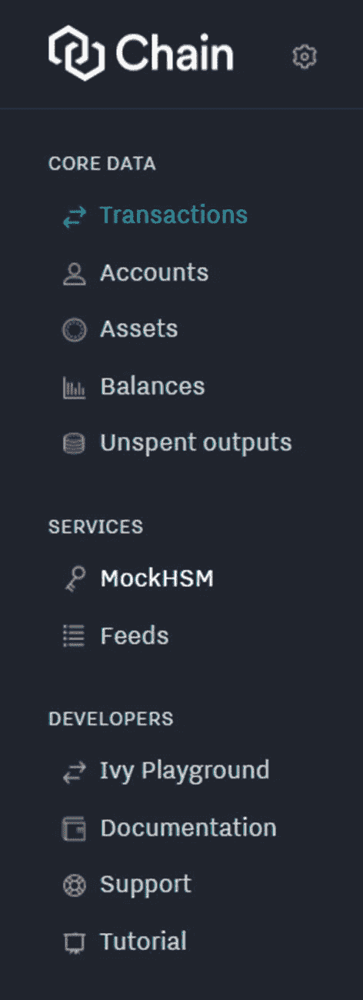

图 11-5

### Chain 控制面板上的导航菜单布局

图 11-5 中的导航菜单分为三部分：核心数据，包括账户、资产和交易；服务，我们可以在其中创建 HSM 密钥；最后是一些开发者工具。我们将使用 `MockHSM` 选项卡来创建一组密钥对。

那么，为什么我们需要一个 HSM 密钥对呢？这个密钥对将用于创建新的资产类别、发行新资产以及创建新账户。Chain 控制面板的默认视图是交易视图。点击 `MockHSM`，你会看到一个提示“没有 MockHSM 密钥”的页面，这很合理，因为我们还没有创建任何密钥。那么，我们开始点击“新建 MockHSM 密钥”，你应该会看到图 11-6。为密钥输入一个别名，该名称将在整个 Chain 中使用。

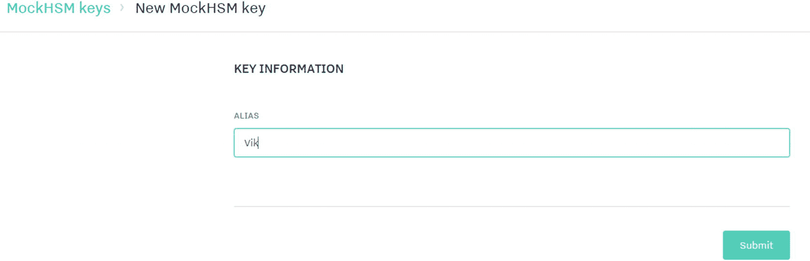

图 11-6

### 创建一个新的 HSM 密钥

在测试网络上，图 11-6 中的密钥数据将在一周后被清除。点击提交后，你应该会看到刚创建的密钥的确认信息，如图 11-7 所示。

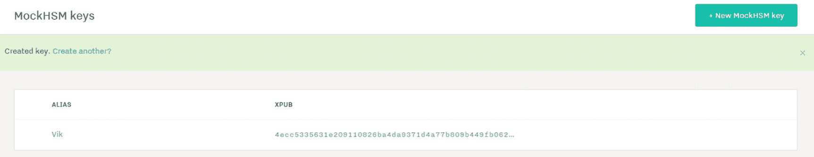

图 11-7

## 创建资产

现在我们有了一个密钥对，可以用它来创建资产。点击“核心数据”下的 `资产` 选项卡，你应该会看到一些默认资产（在撰写本文时，Chain Core 有两个默认资产），如图 11-8 所示。

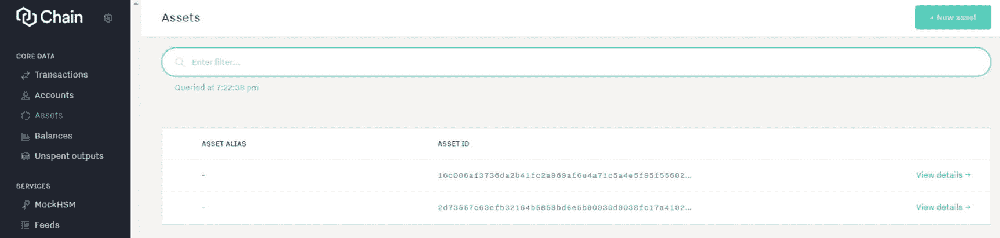

图 11-8

### 创建一个新资产

我们可以通过点击屏幕右上角的“新建资产”按钮来创建新资产。你应该会看到如下的资产创建界面，如图 11-9 所示。

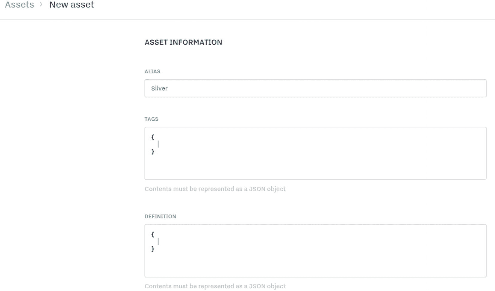

图 11-9

#### 资产创建与签名

图 11-9 中的资产创建过程需要两步。首先是资产信息，包括以 JSON 格式分配给资产的任何标识符或定义。第二步是用你的公钥对资产进行签名。这里，我们将资产命名为*Silver*。

完成资产信息填写后，您需要向下滚动，用我们刚刚创建的 HSM 密钥对资产进行签名。图 11-10 展示了签名过程。Chain 文档提供了一个例子，说明用户为何可能需要多密钥认证（如图 11-10 所示）：

> *在简单的情况下，一个资产或一个账户将定义发行或转账所需的单个密钥。但可以针对不同的使用模式或为了达到不同的安全级别而定义多个密钥。例如，一个高价值资产可以定义为需要两个签名密钥，要求两个不同的方对每笔发行交易进行签名。一个联名账户也可以定义为需要两个签名密钥，但只需要其中任意一方的一个签名即可进行每笔转账。所需签名的阈值数量称为法定人数。*

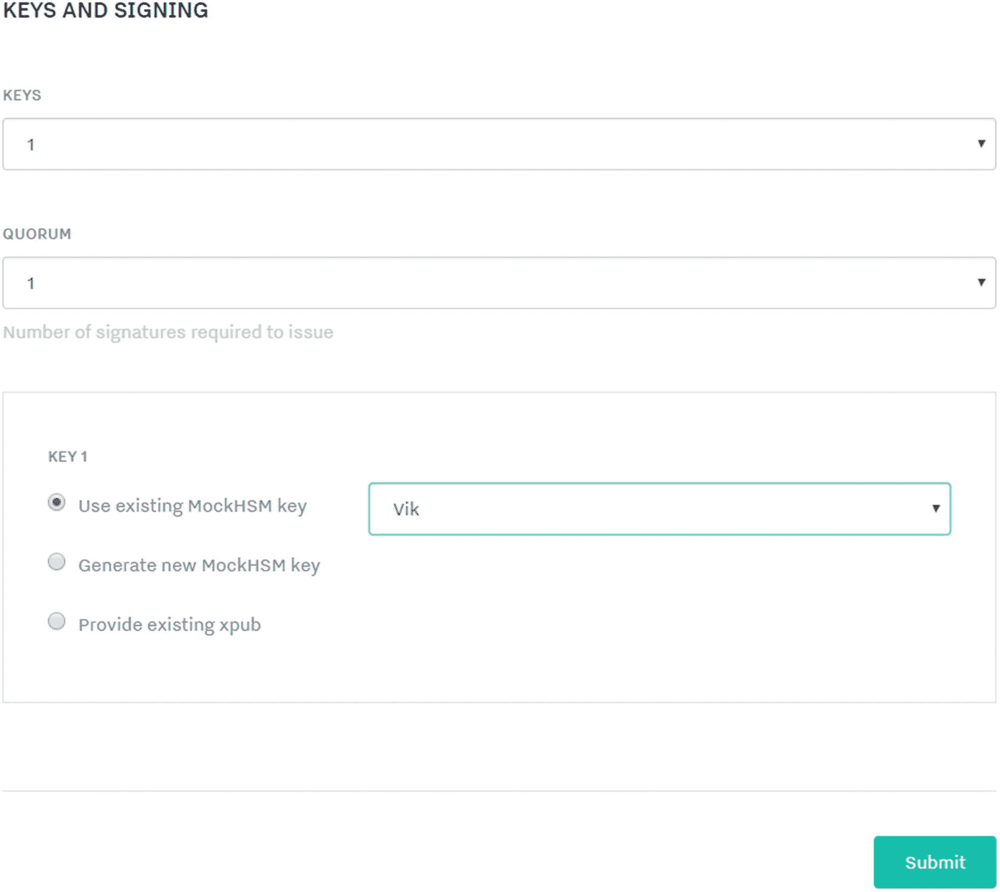

图 11-10

### 签署一个资产

图 11-10 中有几个参数需要考虑。默认情况下，新资产可以通过一个密钥的签名来创建。批准新资产所需的签名数量称为法定人数，我们将使用默认值。最后，我们必须使用我们创建的密钥对资产进行签名。点击提交后，你应该会看到一个确认屏幕，显示在测试网络上创建了*Silver*资产。

## 发行资产和创建账户

现在我们有了资产，需要发行它。在 Chain 中，所有资产都由用户管理和控制；因此，我们发行的资产必须由一个账户来管理。网络上还没有任何账户，让我们通过点击导航菜单上的“账户”来解决这个问题。这会带我们到账户视图。测试网络上可能有一些示例账户，例如 Alice 或 Bob，但在账户屏幕的右上角有创建新账户的选项。点击它，你会看到一个与创建资产非常相似的界面。实际上，大多数步骤都是一样的，比如填写账户信息，然后提供一个 HSM 密钥来签名它。新账户视图如图 11-11 所示。

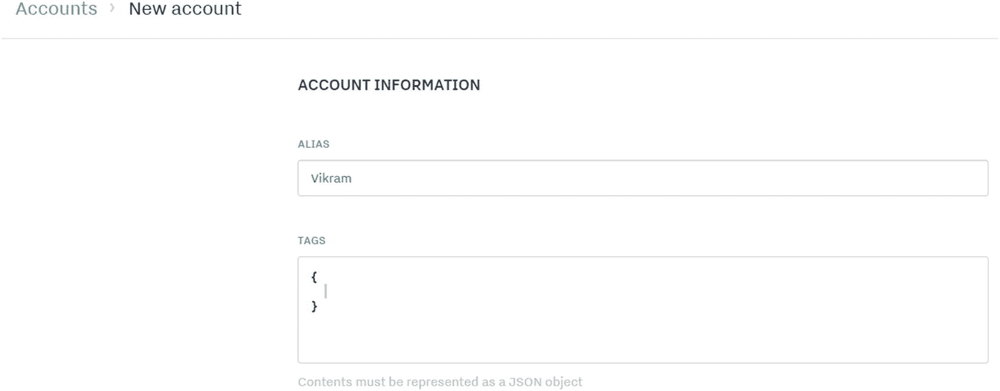

**图 11-11** 创建新账户

创建账户包含两个步骤：提供账户信息与密钥签名。第一步如图所示，第二步与签署资产的操作完全相同。提供账户信息后，使用你的 `HSM` 密钥签署账户，随后会看到刚创建的账户的确认界面。接下来，为了演示账户间的交易，我们需要两个账户。因此，请创建第二个账户，别名设为 "Team Rocket"，最终结果应如图 11-12 所示。

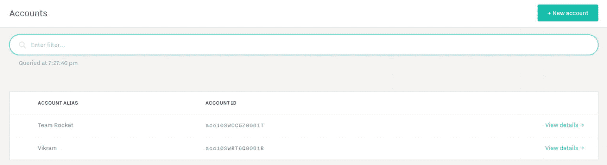

**图 11-12** 账户摘要

图 11-12 中测试网络上的两个账户将允许我们演示交易、锁定和解锁操作。现在我们有了两个账户，就可以在它们之间进行资产交易了。需要注意的是，在 Chain Core 中，资产仅能执行四种操作：发行、花费、转移（控制）或移除（销毁）。通常，这些操作的组合可实现用户间的交易。我们将在此处探讨两种交易类型：一种是向某个账户发行新资产，另一种是将该资产交易给我们创建的第二个账户。最后，我们将通过观察这些操作在 Ivy Playground 中的演变来结束本次操作指南。首先，导航到 `Transactions` 选项卡并点击“New Transaction”。这会将你带到“New Transaction”视图，如图 11-13 所示。

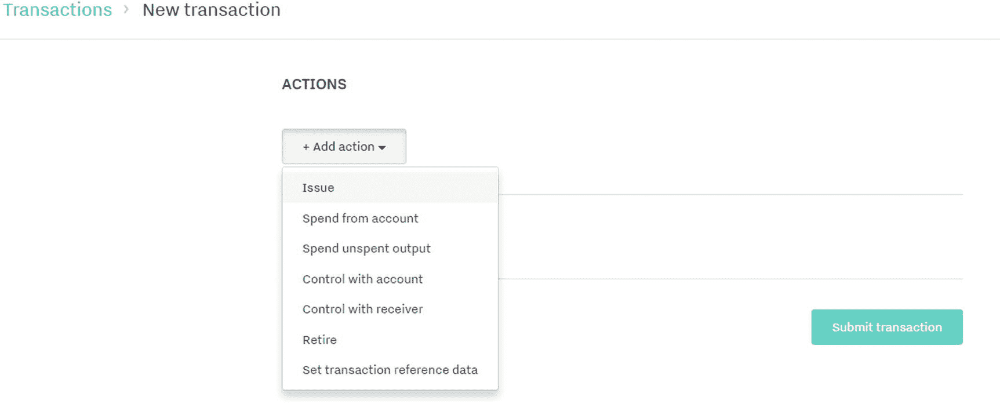

**图 11-13** 新交易视图

交易只能依据我们前面提到的四种操作之一来执行。每种操作都有一组关联参数，需要提供这些参数才能完成交易。在图 11-13 中，我们想要发行一种新资产，因此应选择“Issue”。点击“Issue”后，会出现另一个屏幕，询问你要发行的资产参数，如图 11-14 所示。

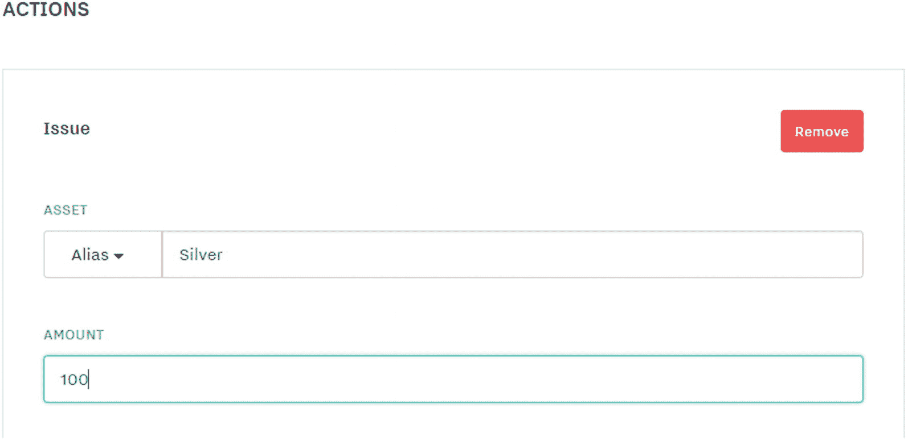

**图 11-14** 创建资产

图 11-14 中的发行操作首先要求我们输入要创建的资产名称，然后是想要发行的数量。回想一下，在 Chain 中，资产不能凭空发行；新资产的创建与账户对资产的控制是相结合的。一旦资产发行完成，我们会将其分配给我们创建的第一个账户。图 11-15 显示了资产控制权转移到新账户的过程。

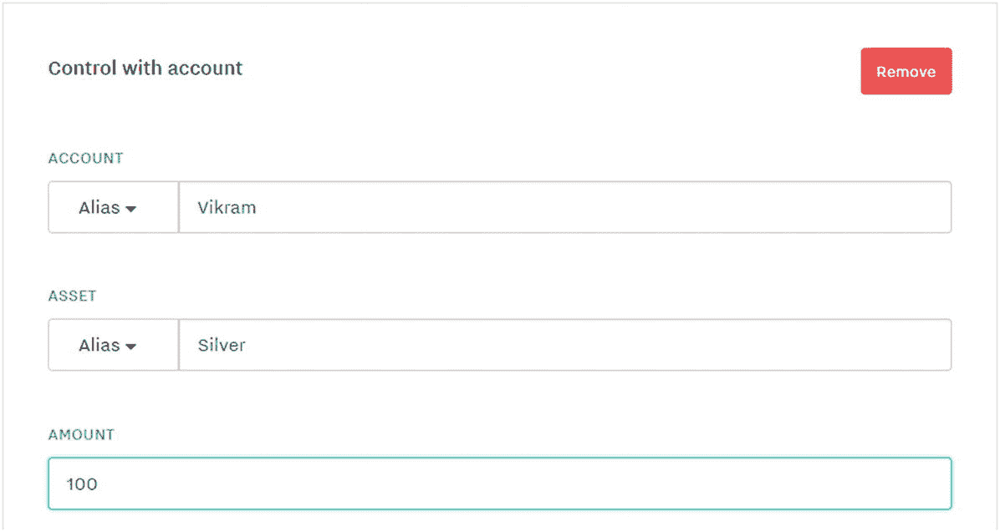

**图 11-15** 将资产分配给账户

如图 11-15 所示的资产分配，在 Chain 中也被称为 *控制到账户*。一百单位的银被转移到我们创建的第一个账户。填写完分配信息后，即可提交此交易。它将被添加到测试网络，确认信息如图 11-16 所示。

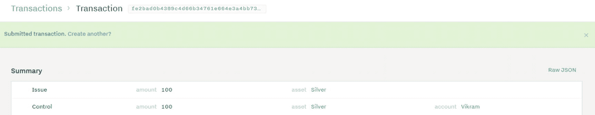

**图 11-16** 交易验证

图 11-16 中的摘要显示，一百单位的银资产被发行，然后分配给了 Vikram 的账户。或者换句话说，资产被发行后，由我们创建的第一个账户控制。这是我们在 Chain 上能执行的最简单的交易；现在，让我们进入下一个涉及两个用户之间交易的步骤。这次，我们必须使用 *花费* 操作来使资产可用，并使用 *控制* 操作来转移资产。从侧边栏回到 `Transactions` 视图并点击“New Transaction”，但这次我们不使用发行操作，而是选择“spend from account”，如图 11-17 所示。

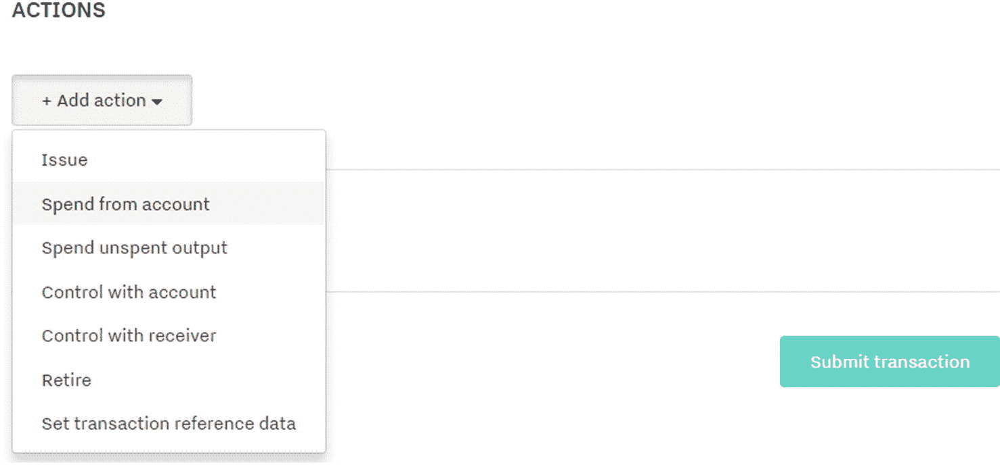

**图 11-17** 从账户发起花费操作以开始交易

现在，我们需要指定要转移多少银（图 11-18）。这第一步只是让资产变为可用状态，它仍然需要被认领。

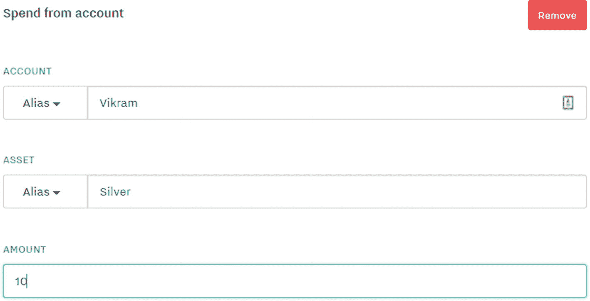

**图 11-18** 从 Vikram 账户中取出十个单位的银用于交易

现在银已可用，让我们将所有权从第一个账户切换到第二个账户（图 11-19）。

**图 11-19** 将所有权从一个账户转移到第二个账户（此处为 Team Rocket）

就像发行资产一样，交易资产涉及一个账户使资产可用，另一个账户控制这些已释放的资产。为了确认交易已发生，我们可以回到 `Transactions` 视图，然后查看最近的交易；点击它将会展开该交易（图 11-20）。

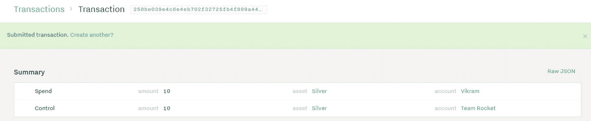

**图 11-20** 最近交易的摘要

注意在图 11-20 中，十个单位的资产由第一个账户（Vikram）花费，然后十个单位的资产由第二个账户（Team Rocket）控制，从而完成了我们的交易。

到目前为止，我们已经讨论了交易的两个关键操作，它们是 Chain Core 的核心。还有一些其他可用选项，例如销毁资产，这仅意味着将给定数量的资产从流通中移除。其效果是增加网络上的稀缺性。现在我们理解了操作的概念，在 Chain 中我们还能做什么呢？编写复杂的脚本来管理和移动 Chain 中的资产会变得有点复杂。Ivy Playground 的引入是为了围绕区块链上的锁定和解锁资产开发一种正式的脚本语言。开发者可以向脚本添加条件，并编写更复杂的合约来保护价值和资产。Ivy 的主要目标是通过一组描述资产解锁条件的子句来锁定资产的价值。Chain 团队讨论了在 Chain 上合约与诸如以太坊等其他分布式计算平台有何不同：

> *Chain 区块链上的合约是不可变的。合约不能被更新，只能被花费——即从区块链中移除，并替换为一个或多个锁定相同价值的新合约。*

> *这种不可变的状态模型将我们的方法与（例如）以太坊和 Fabric 区分开来。在以太坊中，合约可以相互发送消息和价值，并且可以根据这些消息更新自己的状态。*

> *大多数当前的智能合约方法提供了编写在区块链上执行任意逻辑的程序的自由，但使得提供 Ivy 旨在提供的安全保障几乎不可能。虽然其他平台的目标是让构建任何东西都变得容易，但 Ivy 的目标是让构建错误的东西变得困难。*

**注意**

像 Ivy 这样的编程环境将允许开发者编写代码，这些代码继承了内置于数据结构中的资产管理的安全性和保障性。这使得开发者在管理整个应用程序中的资产时，无需担心引入新的安全漏洞。

至此，我们完成了 Chain Core 和 Ivy 的演练。我们重点介绍了如何创建 HSM 密钥、如何创建新账户，以及 Chain 中可用的不同交易模式。最后，我们讨论了使用 Ivy 管理资产和编写脚本。尽管 Chain Core 不再开发，但其资产管理和围绕资产的安全编码实践将作为脚本语言的一项特性被区块链 3.0 范式所采用。让我们继续本章最后一项技术的旅程：企业以太坊。

## 企业以太坊

在最近的 DAO 攻击事件（我们在第 6 章中讨论过）之后，包括摩根大通（JPM）、微软和埃森哲在内的几家公司组成了一个名为企业以太坊联盟（EEA）的联盟，旨在打造能够处理高容量交易和业务应用的企业级以太坊区块链。摩根大通投入了大量开发资源，为 EEA 提供了 `Quorum`：一个企业级的以太坊许可版本。自 `Quorum` 发布以来，更多具有共同企业利益的同行业公司创建了新的联盟，例如专注于企业区块链部署的 R3。我们将从深入讨论功能丰富的企业级以太坊区块链 `Quorum` 开始本节内容，并回顾其白皮书。然后，我们将深入探讨零知识证明技术 `zk-SNARKs`。最后，我们将讨论另一个类似于 EEA 的联盟模型 R3 和 `Corda`。尽管 EEA 始于 `Quorum`，但该项目已扩展其范围，以囊括企业范式的新目标。2020 年，EEA 项目旨在为在企业中创建隐私、许可账本、可插拔共识和模块化组件的可用性标准方面发挥关键作用。EEA 未来有四个基本组成部分：

*   为企业和以太坊应用程序创建一个开源标准，而不是一个单一产品。
*   满足企业级部署的需求并进行建模。
*   与技术栈与公共以太坊同步。
*   尽可能使用现有标准并加以改进。

**注意**

什么是许可账本？许可区块链限制了可以作为区块生产者或矿工的参与方，从而最终限制了谁可以为全局状态的共识做出贡献。在金融领域，这种验证对于规模化产品以满足大众需求可能变得必要。

### Quorum 技术栈

`Quorum` 在 GitHub 上的开发页面列出了以下相较于以太坊的改进特性：

*   **隐私：** 使 `Quorum` 适用于企业工作的一个关键创新是通过私有交易和私有合约引入隐私。这是通过 `Constellation` 实现的，`Constellation` 是一个点对点消息传递守护进程，可以指导私有信息流向适当的网络参与者。
*   **替代性共识：** `Quorum` 不依赖 POW/POS 来实现许可账本；相反，有两种更适合企业级区块链的共识机制：
    *   **`QuorumChain`：** 一种基于智能合约的新模型，依靠节点投票达成共识
    *   **基于 Raft 的共识：** 一种适用于封闭成员联盟环境的共识模型，具有极快的区块生成时间
*   **节点许可：** `Quorum` 中的一项功能，只允许与持有适当识别密钥并已注册参与许可网络的节点建立连接。
*   **更高性能：** `Quorum` 必须提供比以太坊显著更高的性能，才能在像支持银行级交易量所需的高容量环境中使用。

当我们深入探讨 `Quorum` 的特性时，我们将首先讨论 `Quorum` 中两种共识机制背后的关键概念。然后，我们将介绍对节点进行了哪些修改使其能够处理私有交易。最后，我们将讨论 `Constellation` 以及它如何在许可网络中促进数据传输。在技术讨论之后，我们将总结 `Quorum` 白皮书中关于 `Quorum` 特性和私有交易的内容。让我们从共识机制开始：

*   **`QuorumChain`：** 一种多数投票共识机制，由智能合约决定哪些参与方（节点）可以投票接受或拒绝区块。 `Quorum` 上的参与节点可以是实际构建区块的`制造者`节点，也可以是对区块有效性进行投票的`投票者`节点。 `QuorumChain` 使用以太坊的签名验证方法（如 `ecrecover`）来验证从`制造者`节点和`投票者`节点收到的投票。一旦 `投票者`节点的投票达到阈值，该区块就被接受进入网络。
*   **基于 Raft 的共识：** Raft 系统中工作的基本单元是日志条目。日志是一个有序的事件序列，如果网络中的所有成员都对条目及其顺序达成一致，则认为日志是一致的。在 Raft 中，一个节点可以是领导者或追随者，所有节点最初都是追随者。最终，通过一个对等选举过程，一个节点成为领导者。与之相比，在以太坊中，任何节点都可以挖出一个新区块或成为该特定轮的领导者。在 Raft 中，只有领导者才能在真正意义上“锻造”一个区块，但领导者不需要提供任何工作量证明。相反，领导者提出一个区块，由追随者投票，一旦获得法定人数（多数票）的投票，它就会被接受为扩展区块链的下一个区块。追随者还会向领导者发送确认，现在该区块被提交到日志条目。一旦领导者收到确认，它会通知每个节点这个新条目（区块）已提交到日志。

现在我们已经讨论了共识，让我们看看是什么让节点接受私有交易。在以太坊中，所有交易都是公开的，并且默认情况下，节点只接受公开广播的交易。要使 `Quorum` 工作，必须进行以下更改：

*   POW 共识算法已被基于投票的 `QuorumChain` 所取代。最终目标是让多个共识算法以“可插拔共识”的模式在区块链上运行。

- 经过修改的连接层，其中连接到许可账本的节点已被识别并注册。
- 状态树已被拆分为两棵树：公共状态树和私有状态树。
- 区块可以使用包含私有交易的新逻辑进行验证。
- 交易可以通过将部分数据替换为加密哈希来创建，以在需要时保护隐私。

私有交易和合约是如何在网络中传播的？私有数据的流向又是如何处理的？首先，以太坊交易模型中引入了一个新的可选参数 `privateFor`，它可以接受多个地址。`Quorum` 将来自此参数的地址视为网络中的私有地址。引入了一种新的交易类型 `IsPrivate`，用于将某些交易标记为私有。然而，使私有交易传播成为可能的主要工具是 `Constellation`：一种点对点加密消息交换系统。以下是 `Constellation` 在 `Quorum` 中提供隐私的基本工作原理：在私有交易传播到 `Quorum` 网络之前，消息（包含在交易中）和标头会被替换为从 `Constellation` 收到的加密负载的哈希值。网络中的某些参与者的公钥已被 `Constellation` 包含在负载中；当这些用户收到负载时，他们可以使用自己的 `Constellation` 实例进行解密。其他所有参与者只会看到一个加密的哈希值，并跳过该交易。涉及的参与者将解密负载并将其发送给 `EVM` 执行，从而相应地更新其内部状态。

`Constellation` 中有两个组件在维护隐私方面发挥着重要作用：交易管理器（`transaction manager`）和飞地（`enclave`）。交易管理器存储加密的交易数据，促进参与者之间加密负载的交换，并在满足条件时管理私有交易的传播。它还调用 `Quorum` 中的其他模块，特别是调用飞地执行加密功能。在许多方面，交易管理器像一个中央枢纽，控制着消息在 `Quorum` 的各个组件之间的流动。飞地是 `Quorum` 的加密核心。交易管理器本身无权访问任何敏感信息或密钥，它将对称密钥生成、数据加密和解密等加密任务委托给飞地。飞地还持有网络中账户的私钥。交易管理器和飞地都与其它组件隔离，以增强安全性。

## zk-SNARKs

零知识证明，或称零知识简洁非交互式知识论证（`zk-SNARK`），是一种源自 `ZCash` 的新技术，旨在维护区块链上交易的隐私和匿名性。最近，`EEA` 宣布，`ZCash` 背后的团队将帮助为 `Quorum` 实现一个 `zk-SNARK` 层，以增强区块链上交易的隐私和安全性。零知识证明是如何工作的？`zk-SNARK` 技术通常用于复杂的支付场景。让我们看一个例子：假设如果发生 `X`、`Y` 或 `Z` 中的任何一个事件，Alice 就可以从智能合约中收到资金。现在，任何一种情况（`X`、`Y`、`Z`）都可能与 Alice 的健康状况或她不想向公众透露的商业决策有关。这正是 `zk-SNARK` 的用武之地，它可以为智能合约创建一个证明，表明三个条件（`X`、`Y`、`Z`）中有一个发生了，但不揭示具体是哪个条件发生了。更正式地说，来自 `ConsenSys` 的 `Christian Lundkvist` 将零知识证明描述如下：

> “零知识证明的目标是让验证者能够说服自己，证明者拥有某个秘密参数（称为证据）的知识，该参数满足某些关系，同时不向验证者或任何其他人透露该证据。”

在我们之前的例子中，Alice 的三个选择构成了一个证据，她必须向智能合约证明其中之一发生了，但不需要透露具体情况。来自 `ZCash` 的 `Paige Peterson` 证实，`zk-SNARK` 作为结算层将被引入 `Quorum`，为交易提供增强的隐私和安全性。最终目标（在 2017 年共识大会上描述）是使零知识证明与区块链无关，并将结算层作为一种服务来实现。未来与零知识证明的集成可能成为许可账本处理企业级交易的一个范式转变。吸取一些经验教训并拥有更好的结算层后，在医疗保健领域保护患者数据和维护隐私方面将出现一些极好的应用机会。

> **注意**
>
> `ZoKrates` 是一个高级编程工具包，可用于以开发者友好的语言编写零知识证明。这些证明编译成兼容以太坊的 `zk-SNARK` 并在链上执行。此外，`ZoKrates` 可以将可验证计算扩展到 `DApp`，例如，可以在链下为某个任务执行计算证明，并将其提交到以太坊区块链进行验证。

## Review of Quorum Whitepaper

图 11-21、11-22 和 11-23 摘自 Quorum 白皮书（已获许可），以图形方式提供了 Quorum 的高级概述，强调了新的技术组件和私有交易。

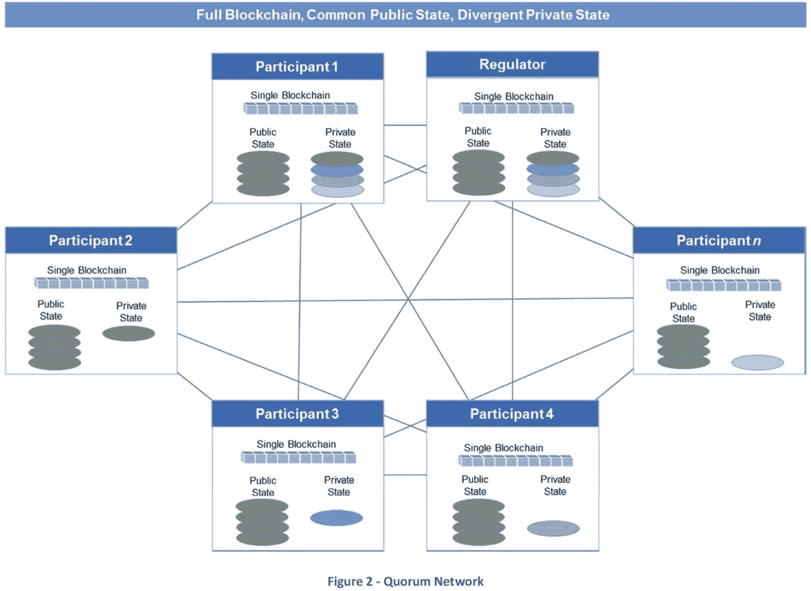
图 11-23：公共状态与私有状态的划分

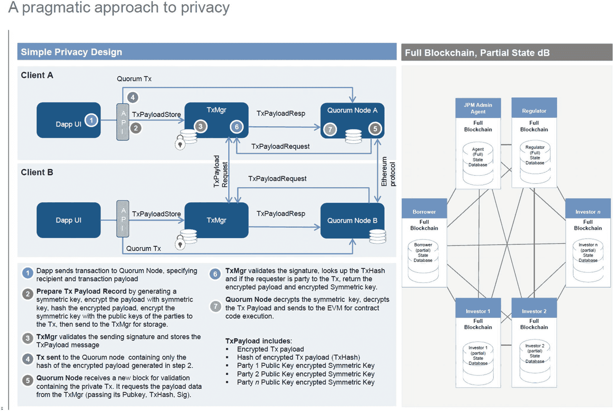
图 11-22：隐私与私有交易在 Quorum 网络中传播的概述

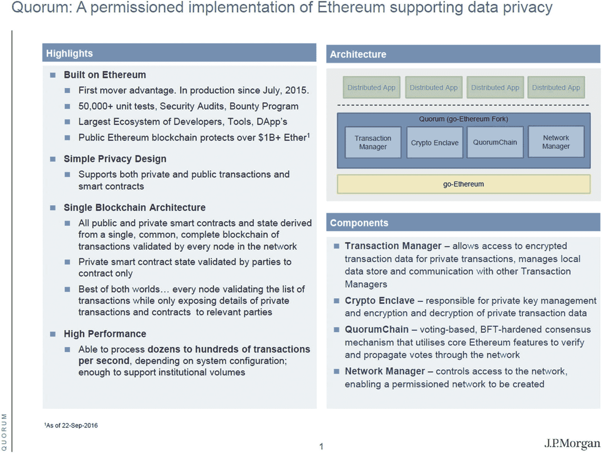
图 11-21：Quorum 概述及其关键创新

注意图 11-21 右上角 Quorum 的架构设计，正如我们之前描述的所有主要组件一样。此外，图 11-23 展示了全局状态在 Quorum 网络上是如何维护的：公共状态在所有网络节点之间保持一致并保持同步，而私有状态则基于权限而变化。从这些幻灯片中最重要的收获是私有交易在 Quorum 网络中传播时的详细工作流程。我们没有机会详细说明这个流程，因此包含这些幻灯片将增强您对私有交易和加密负载在 Quorum 中如何工作的理解。

### 企业以太坊联盟路线图

首要目标中，EEA 旨在成为构建企业级以太坊应用的规范与标准。Helen Partz 近期在 *Cointelegraph* 上发表的一篇文章强调了该项目在此方向上取得的进展：

> 企业以太坊联盟（EEA）正在组建一个技术工作组，致力于协调主网与企业之间的协作。
>
> 根据 8 月 6 日与 Cointelegraph 分享的一份新闻稿，该工作组名为“EEA 主网倡议”，旨在加速并引领 EEA 的企业和初创成员，以及从事主网技术和互操作性解决方案研究的人员之间的合作。
>
> **EEA 主网倡议致力于互操作性与可扩展性解决方案**
>
> 新闻稿指出，主网倡议将努力提升对公共网络组件如何满足促进以太坊采用所需的商业市场要求的理解。EEA 将作为以太坊基金会主要开发者大会 `Devcon5` 的一部分，围绕主网倡议举行互动讨论。

以下三张图（图 11-24、图 11-25、图 11-26）取自 Bob Summerwill 提供的 EEA 最新动态。

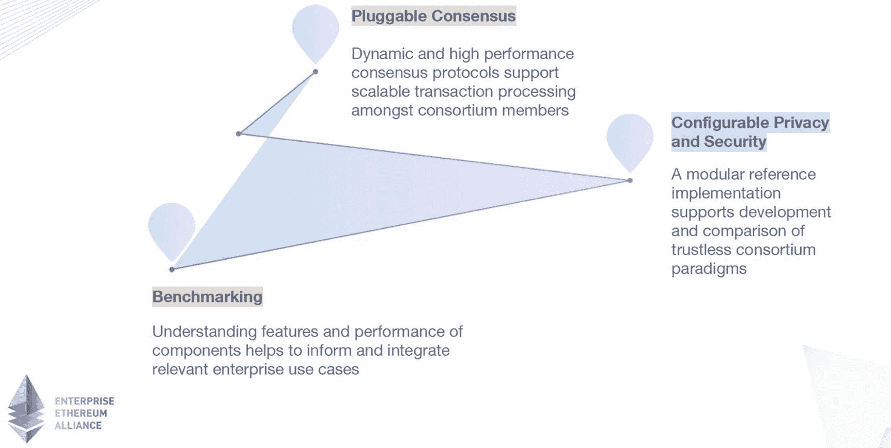

图 11-26

EEA 近期关注的三大领域

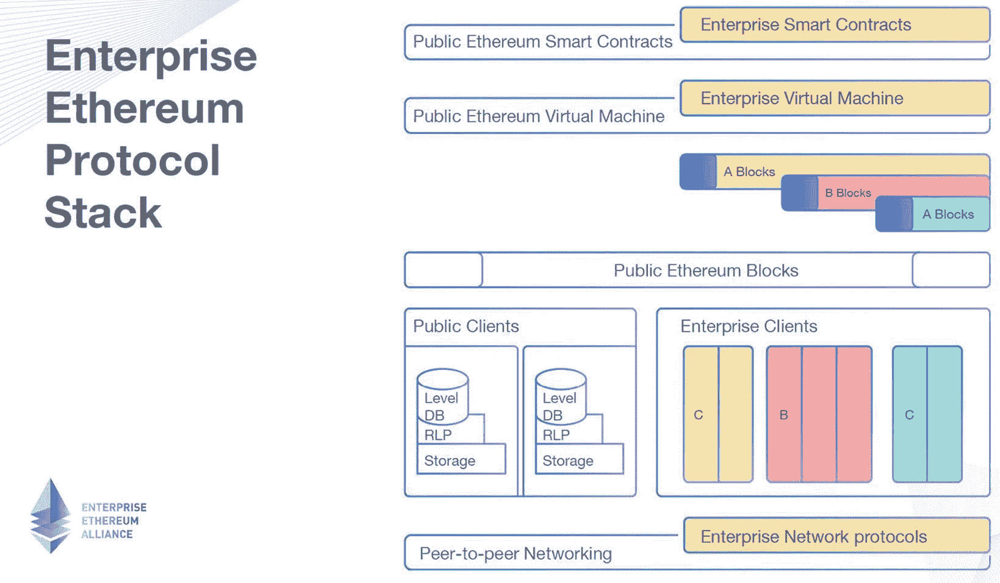

图 11-25

为处理企业级交易而修改的以太坊新协议栈

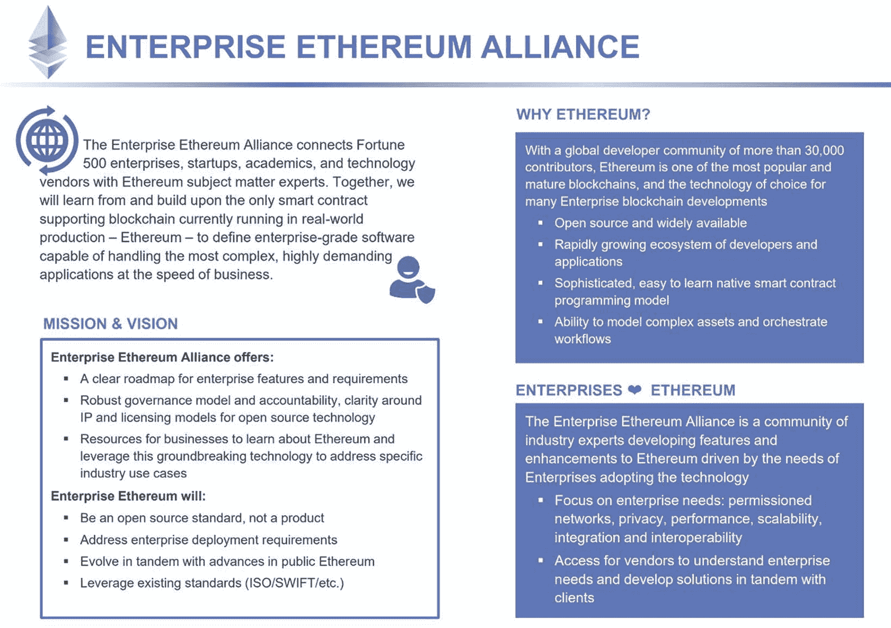

图 11-24

企业以太坊联盟简介

在此例中，隐私至关重要，并且大多数矿工（节点）都是已知且可信的。请注意，企业协议位于共享的公有-私有区块链之上，并进行了必要的修改以保护隐私。公有客户端共享相同的存储和虚拟机，而私有或企业客户端则会被分配隔离的存储和虚拟机，用于执行加密的指令负载。更广泛地说，企业以太坊是一场比 EEA 正在开发的 `Quorum` 更为宏大的运动。让我们退一步，谈谈为何需要企业版本。`ConsenSys` 的 Jeremy Miller 给出了三个主要原因：

*   以太坊最初是为公有链部署而开发的，其去信任的交易需求优先于绝对性能。当前的公有链共识算法（尤其是工作量证明）对于拥有可信参与者和高吞吐量需求的网络来说过于繁重。
*   从定义上讲，公有链的隐私和权限要求有限（至少最初是这样）。尽管以太坊确实允许在智能合约和网络层实现权限控制，但它并不“开箱即用”地兼容传统的企业安全和身份架构，也不符合数据隐私要求。
*   自然，当前的[以太坊改进流程](https://github.com/ethereum/EIPs)（主要由以太坊改进提案主导）在很大程度上受公有链事务主导，此前企业 IT 需求在此流程中很难得到清晰阐述和优先考虑。

EEA 在近期的核心技术目标是什么？图 11-26 在 `Quorum` 开发的背景下提供了三个主要关注点。

EEA 最大的关注点是开发可在全行业使用的企业参考规范和实现标准。另一方面，`Quorum` 的开发重心在于提供高水平的隐私保护（`JPMorgan` 将其视为主要障碍），并可根据用户执行的交易和智能合约进行配置。混合公有-私有链可以成为联盟型场景的理想模式。下一个重点是创建可插拔的共识模型，使得交易和复杂场景能够选择最适合该用例的共识机制。最后，高吞吐量性能对于 `Quorum` 的成功至关重要；因此，开发更好的基准测试工具来进行衡量和改进，将成为其广泛采用的关键。

## R3 与 Corda

R3 是另一个类似于 Hyperledger 或 EEA 的联盟，也是 Corda 这一独特许可型区块链平台背后的驱动力。Corda 在许多方面不同于其他分布式账本技术，Nick Avramov 在一篇博文中对此进行了解释：

> *你需要掌握三个核心概念才能精通 Corda。它们分别是：*

> *状态（State）——或称状态对象。它是 Corda 的构建模块，代表一份特定的协议或合约，如同现实世界中的合同。这正是需要达成共识的对象——即确切的状态对象，而非整个账本的状态。这一点非常重要，稍后将详细阐述。*

> *流程（Flow）——一种小型多方子协议，用于将交易数据（状态对象）共享给相关参与方。这与我们在比特币和以太坊等公链中观察到的全局广播机制截然相反。*

> *公证人（Notary）——提供交易排序和时间戳服务的实体。关键在于，Corda 并不将交易组织成区块，因此它并非区块链。*

> *与比特币和以太坊不同*，Corda 是一个基于许可的网络，你必须获得授权才能接入。这一点在流程 API 中已有明确规定——没错，就是我之前介绍的流程。它也可以被视为一个部落或类似实体，对你的身份施加了特定要求，除非满足这些要求，否则你无法加入该特定流程。共识是在交易层面达成的（而非像比特币或以太坊那样在账本层面），因此无需所有网络节点来验证和批准交易。

> *事实上，Corda 的一个重要特点在于其能够灵活使用不同的共识算法。由于它没有固定的单一算法，公证人实际上可以使用不同的算法——例如 BFT、Raft，或者其他算法。可以提前说明的是，Corda 正在为所有这些子网络或流程开发一个元网络。想象一下，存在审计公司、银行以及为这些银行服务的清洁公司。它们都有自己内部的簿记、分包商以及各种其他金融和非金融关系。从某种意义上说，Corda 旨在开发一个系统，使用相同的协议来处理所有这些交互，无论是公司内部的交互还是与外部公司的交互。*

> *值得提及的是，Corda 的开发人员从一开始就宣称，他们正在创建一种架构，该架构将以具有法律强制执行力的方式模拟和自动化现实世界的交易。这是许多区块链的常见缺陷——它们存储的交易不具有法律价值。相反，Corda 中的智能合约不仅包含交易信息，还包含法律条文。*

> *与其他分布式账本技术（账本在所有组织间共享）不同，在 Corda 中，交易仅在该子网络或流程内共享。从这个意义上说，它采用的是直接通信而非全局广播，从而保护了隐私。*

> *没有任何一个实体拥有网络中所有交易的完整历史记录。但存在公证人，他们了解网络中这一特定部分的当前状态。他们充当交易的验证者。典型的交易流程如下：*

> *一笔新交易 A 将状态 X 转换（Corda 术语称为“花费”）以创建状态 Y。*

> *你将交易 A 发送给知晓状态 X 的公证人。*

> *公证人检查状态 X 是否仍然有效，然后签署交易 A。状态 X 现在失效，由状态 Y 取而代之。*

> *如果在提出交易时上述状态 X 无效，公证人将回应状态 X 已被花费。*

> *因此，Corda* *将了解世界状态和查看所有交易的责任从整个网络转移到了一个专门的公证服务上。网络成员无需信任所有人，只需信任运行公证服务的组织。也可以有多个公证人，每个公证人因不同目的而受到信任。*

## 总结

在本章中，我们从三个不同角度讨论了区块链 3.0 范式中应用高级链上执行的情况：EOS.io 及其精妙的消息传递和并行处理能力、作为区块链上资产管理未来模型的 Chain Core，以及企业级以太坊。以太坊的企业级应用正由希望解决特定领域问题的公司组成的联盟（如 Hyperledger、EEA 和 R3）引导。每个企业级项目背后都有一个开源社区，这使得代码库对于大规模部署而言更加安全、高效且实用。

