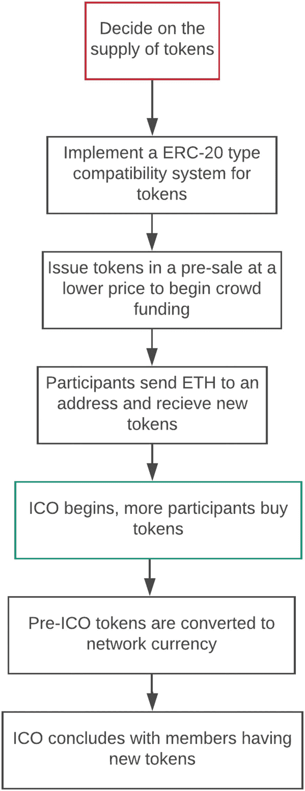

# 12. 技术革命与金融资本市场

全球金融市场正在经历一场剧烈的变革，这场变革清楚地表明，如果没有创新，大多数商业和金融模式可能很快就会过时。最近一份关于全球金融体系的概述将当前系统描述为：

> *一个每天移动数万亿美元、服务于数十亿人的系统，但这个系统问题重重，通过费用和延迟增加成本，通过冗余且繁重的文书工作造成摩擦，并为欺诈和犯罪提供了机会。*

> *据我们所知，45% 的金融中介机构，例如支付网络、证券交易所和汇款服务，每年都会遭受经济犯罪的侵害；整个经济体的这一比例为 37%，而专业服务和技术部门分别仅为 20% 和 27%。难怪监管成本持续攀升，并一直是银行家最关注的问题。这一切都增加了成本，最终由消费者承担。*^(¹¹)

《区块链革命》的作者唐·塔普斯科特指出，我们的金融体系效率低下有多方面原因：

> *首先，因为它已经过时，是工业技术和纸面流程的拼凑物，只不过套了个数字化的外壳。其次，因为它中心化，这使其抵制变革，并容易受到系统故障和攻击。第三，它具有排他性，剥夺了数十亿人使用基本金融工具的权利。银行家们在很大程度上回避了那种创造性的破坏，尽管这种破坏是混乱的，但对经济活力和进步至关重要。*^(¹²)

本章从与全球金融市场相关的问题入手，探讨区块链为何能成为提高其效率的创新解决方案。然后，我们将转向风险投资、ICO、加密货币、代币和交易所等主题。我们将讨论重大的 ICO 市场影响、监管状况、美国证券交易委员会的介入、独特技术、商业模式、监管科技以及相关问题。在回顾这些概念和问题时，有几个问题和想法需要牢记：

*   众筹如何扩展区块链应用？
*   如何创建新的公司和借贷平台？
*   监管科技能否满足市场对高效合规的需求？
*   金融科技对银行业和投资银行业的市场影响是什么？
*   ICO 融资和 ICO 泡沫的现状如何？
*   随着技术帮助民主化金融机会，各种财富水平的人如何才能参与到金融市场中？

在本章结尾，我们将介绍多个大型金融集团的现状及其在区块链、金融科技和其他金融技术领域的参与情况。

## 区块链行业现状

自 2017 年第二季度以来，区块链行业在过去三年中呈现出巨大的增长态势。据著名加密金融研究公司 Smith & Crown 称，这已证明是区块链行业整体蓬勃发展的时期。加密代币市场持续上涨，其价值在短短数周内翻了一番甚至两番。Smith & Crown 指数（`SCI`）反映了加密代币的牛市行情，自 2017 年以来价值已增长逾一倍。加密代币市场市值的增长伴随着代币销售市场的狂热活动。从各方面来看，2017 年第二季度正是一个创纪录时期的开端。^(¹³)

### 区块链解决方案

正如我们在前几章所述，区块链是一种颠覆金融体系低效环节的创新解决方案。Humaniq 首席营销官 Kastelein 指出，支撑区块链技术、使其能够改变金融市场交易创建方式的基本原则有五项。值得重申这些支撑该技术的基本原则：

- **分布式数据库：** 区块链上的每一方都可访问整个数据库及其完整历史记录。没有任何单一节点控制数据或信息。每一方无需中介即可直接验证其交易对手的记录。
- **点对点传输：** 通信直接在节点之间进行，而非通过中心节点。每个节点存储信息并将其转发至所有其他节点。
- **具有假名性的透明度：** 任何有权访问该系统的人都可查看每笔交易及其相关价值。区块链上的每个节点或用户都有一个由三十多个字母数字字符组成的唯一地址来标识身份。用户可选择保持匿名或向他人提供身份证明。交易发生在区块链地址之间。
- **记录的不可逆性：** 一旦交易录入数据库且账户更新，记录便无法更改，因为它们与之前的所有交易记录相关联（故称之为*链*）。系统部署了多种计算算法和方法，以确保数据库中的记录是永久性的、按时间顺序排列的，并且网络上的所有其他节点均可访问。
- **计算逻辑：** 账本的数字特性意味着区块链交易可与计算逻辑相结合，本质上可实现编程。因此，用户可以设置能够自动触发节点间交易的算法和规则。^(¹⁴)

Tapscott 指出：

> *在人类历史上，两方或两方以上——无论是企业还是可能互不相识的个人——首次无需依赖中介机构（例如银行、评级机构以及美国国务院等政府机构）来验证身份、建立信任或执行业务逻辑的关键环节（如签约、清算、结算和记录保存，这些是所有商业形式的基础），便能达成协议、进行交易并创造价值。*^(¹⁵)

区块链应用可以通过点对点交易和协作，为经济体中所有参与者降低交易成本。区块链确实是一项颠覆性的金融市场解决方案，它运用新技术，并以思想领导力为驱动。

## 风险投资与 ICO

真正的问题是：`ICO`是否会取代传统风险投资成为募资模式？很少有人能想象，在一年之内，风险投资行业竟会被这种名为`ICO`的创新募资方式所超越和改变。`ICO`，也称为代币发行，是随着区块链技术、众筹、创新财富理念以及加密货币投资发展出新模式而兴起的。`ICO`对风险投资行业而言既是威胁也是机遇。

传统风险投资家看到了`ICO`在加密货币、区块链投资、流动性以及更快获得财务收益方面的盈利机会。传统风险投资家的运作方式及其在市场中的地位可能面临颠覆。这是技术革新驱动金融市场发生巨变的时期，令人高度关注。美国证券交易委员会（`SEC`）近期在一封信函中声称，`ICO`受到证券法的约束。`SEC`将在加密货币和`ICO`问题上采取行动，这一点消除了一个重大疑问。然而，个人、团体及发行如何符合`SEC`规定尚不明确。这个过程需要时间来解决，并确立相应的规则和先例。

### 首次代币发行

`ICO`是一种为发行新加密货币进行众筹的方式。通常，在加密货币正式发行前，会出售新币的代币，以筹集技术开发资金。与首次公开募股（`IPO`）不同，购买代币并不赋予持有者在新加密货币开发公司中的所有权。与`IPO`不同的是，`ICO`不受（全面的）政府监管。^(¹⁶)

`ICO`以及使用分布式账本技术的新型融资模式，正开始颠覆公开市场（`IPO`）和私人投资（风险投资）。《币报》的一篇文章阐述了区块链对风险资本形成的影响。《币报》进一步指出：“来自创业者和投资者群体的需求与兴趣已得到证实，但监管指导有限。`ICO`作为一种融资机制可能会继续获得发展动力。”^(¹⁷)

“`首次代币发行`（`ICO`）正以快速且不断扩展的方式改变着加密货币市场。此外，风险投资行业正试图理解这种新的金融投资方式。比特币社区通过区块链技术、新财富、聪明的创业者以及由区块链驱动的想法所支持的投资者的结合，创造了这一局面。”《哈佛商业评论》撰稿人理查德·卡斯特莱恩表示。^(¹⁸)

就筹集资金而言，`ICO`在整体众筹排行榜上占据主导地位，前二十名中有一半来自加密货币社区。高盛、纳斯达克以及拥有纽约证券交易所的美国控股公司洲际交易所等主导`IPO`和上市业务的公司，一直是区块链企业最大的投资者之一。^(¹⁹)

《币电讯》将`ICO`解释为：

> *一个最近在加密货币和区块链行业中出现的项目众筹概念。当一家公司为了融资而发行自己的加密货币时，它会发行一定数量的加密代币，然后将这些代币出售给目标受众，最常见的方式是换取比特币，但也可以是法定货币。结果，公司获得了产品开发所需的资金，而受众则获得了加密代币份额，并且他们拥有这些份额的完全所有权。*^(²⁰)

关于`ICO`如何创建以及执行步骤的具体示例，可以在`SONM`执行模型中看到。首先，什么是`SONM`？“`SONM`是一个全球操作系统，也是一个去中心化的全球雾计算平台。它有可能包含无限的计算能力（`IoE`、`IoT`）。使用`SONM`系统组织的全球计算可以用于完成从 CGI 渲染到科学计算等众多任务。”^(²¹)

`SONM`的显著特征是其去中心化的开放结构，买家和工作者可以在没有中间人的情况下互动，同时首先为他们自己建立一个有利可图的市场，这与其他云服务（例如亚马逊、微软、谷歌）不同。

与广泛使用的中心化云服务不同，`SONM`项目实现了雾计算结构，即一个去中心化的设备池，所有这些设备都连接到互联网（`IoT`/`IoE`）。`SONM`使用用于雾计算的`SOSNA`架构来实现。`SONM` `ICO`的具体执行步骤如下：

*   `SONM`平台使用同名的代币`SONM`（代码`SNM`）。
*   `SNM`的总供应量将限于众筹期间创建的代币数量。
*   计算能力购买者将使用`SNM`代币，通过基于智能合约的系统支付计算费用。
*   `SNM`是在以太坊区块链上发行的代币，使用了包括以太坊钱包在内的代币实施、存储和管理的标准。
*   `SONM`项目众筹、`ICO`以及`SNM`的创建将使用以太坊智能合约进行。
*   愿意支持`SONM`项目开发的参与者，将以太币发送到指定的`ICO`以太坊地址，通过此交易以指定的`SNM/ETH`汇率创建`SNM`代币。
*   `ICO`参与者只能在众筹期（指定为以太坊区块编号）开始后，将以太币发送到`SONM`众筹以太坊地址。
*   当指定的结束区块被创建，或达到`ICO`上限时，众筹将结束。
*   `SNM`代币销售`ICO`。
*   `SONM`预售于 2017 年 4 月 15 日启动，并在不到 12 小时内成功完成，筹集了 10,000 以太币。
*   预`ICO`代币将通过一种特殊的安全迁移功能转移到主代币合约中。
*   代币分配完成给所有方。
*   交易完成。^(²²)

该过程如图 12-1 所示。

图 12-1

`SONM`代币的 ICO 流程示意

### 数字货币交易所

数字货币交易所（`DCE`）或比特币交易所是允许客户将数字货币兑换成其他资产（如传统法定货币或其他数字货币）的企业。它们通常采取买卖价差作为服务交易佣金的市场措施，或者仅作为匹配平台收取费用。^(²³)

通常，`DCE`在西方国家以外运营，以避免监管监督并增加起诉难度。一家名为 Kracken 的美国全球比特币交易所位于旧金山。Kracken 网站称，Kracken 是全球最大的欧元交易量和流动性的全球比特币交易所。Poloniex 在其网站上描述为一家提供最高安全性和高级交易功能的美国数字资产交易所。

当与`DCE`打交道时，以及在金融世界中运营交易所的各个方面，轻松准确地确立身份非常重要。在去中心化的数字世界中，使用区块链技术的身份管理的未来看起来有所不同。建立在区块链上的数字身份网络，通过利用共享账本、智能合约和治理来标准化管理，同时降低成本、风险、时间和去中心化身份管理的复杂性，从而作为社会企业促进企业间的信任。

### `ICO` 监管现状

每年秋季，*Coin Desk* 都会发布一份综合报告，讨论`ICO`的监管状况，重点关注六个国家的法律地位。金融科技研究公司 Autonomous Next 最近的一份报告引用了其中的几个要点。该报告认为，瑞士和新加坡是为金融科技和加密货币创造友好环境方面最为先进的两个国家。在瑞士，法律规定加密货币是资产而非证券。新加坡的情况也是如此。报告指出，新加坡金融管理局不监管虚拟货币交易，但确实监控`KYC`（了解你的客户）和`AML`（反洗钱）。

报告特别指出，英国和美国是活动频繁但法律清晰度不足的司法管辖区。美国拥有众多监管机构和五十个州各自执行法规，使得监管过程更为复杂。特拉华州最近通过了与区块链相关的立法。在中国，代币被视为非货币数字资产。俄罗斯一直对加密货币持欢迎态度。加密代币被归类为类似于衍生品的合法金融工具。^(²⁴)

在 2017 年第二季度的财务回顾中，Smith & Crown 指出了代币销售法律地位中一个仍然存疑的重大问题。代币销售参与者可能无法享有与私募和公开股权销售投资者相同的法律地位或保护。无上限的代币销售及其允许项目在保留对其代币经济多数控制权的同时筹集巨额资本的结构，可能会因引起监管机构关注而加剧这一问题。许多国家正在积极探索代币销售的新监管框架，包括 Smith & Crown 在内的多个团体正在制定最佳实践和自律指南。^(²⁵)

当前的监管状况是，美国证券交易委员会（`SEC`）发布了一封信函，声明`SEC`将`ICO`、加密货币及相关事宜视为证券。如前所述，这为市场在该问题上带来了一定的清晰度。尽管有些人会对此持积极态度，另一些人则持消极态度，但`SEC`的声明最终推动了对美国及全球监管环境的全新理解。

*《区块链代币的证券法框架》* 为任何对区块链代币感兴趣的人描述了几个关键观点和行动。“该框架侧重于美国联邦证券法，因为这些法律对区块链代币的众售构成了最大风险。在许多司法管辖区，还可能存在反洗钱法、一般消费者保护法以及根据代币实际功能而定的特定法律问题。”豪威测试（`Howey Test`）确立了判断投资合同是否为证券的标准（*`SEC v. Howey`*）。^(²⁶)

该框架阐述了代币销售的六大最佳实践：

1.  发布详细的白皮书。
2.  对于预售，承诺提供开发路线图。
3.  使用开放、公开的区块链并发布所有代码。
4.  在代币销售中使用清晰、逻辑合理且公平的定价。
5.  确定为开发团队预留的代币百分比。
6.  避免将代币作为投资进行营销。

### `ICO` 投资的利弊

`ICO`投资的利弊由 Jim Reynolds 在最近一篇题为《投资于：投资理念》的文章中进行了阐述。这份利弊清单绝非详尽无遗，但它确实包含了许多需要考虑的要点。

对于 `ICO` 创始人（企业家）：

-   高效筹集资金。
-   `ICO` 比 `IPO` 便宜得多。
-   `ICO` 所需的文件比 `IPO` 少得多。
-   为山寨币获得曝光提供品牌和营销机会。
-   建立社区。
-   与早期采用者建立利益关联；这将使他们成为项目营销机制的一部分。
-   企业家与投资者共享其努力的成果与风险。
-   创始人/开发者拥有一种方法，可以帮助他们为一个能最大程度发挥其技能的项目提供资金。
-   备受尊敬的加密专家有途径将他们多年来积累的技能和信誉变现。
-   权益证明（`PoS`）山寨币通过 `ICO` 解决了公平分配的问题，并且在 `PoS` 中，代币立即生效。
-   风险投资资金对创始人的 Vision360 愿景干预要大得多。`ICO` 的替代方案是借贷，但这会对项目现金流产生许多影响，而这些影响在山寨币/加密项目中并不总是能够管理的。
-   一定的透明度；例如，可以使用托管来验证 `ICO` 后资金的支出情况。
-   早期投资者在早期阶段公司将拥有更高的流动性。
-   提前获得具有资本增长潜力的代币。
-   不受任何政府组织的监管或注册，并且通常除了平台本身内置的保护之外，没有其他投资者保护。
-   投资者可以成为社区的一部分。
-   一种创新的资本部署方式。
-   使用现有网络（如 Stratis、Ardor 和 Ethereum）进行的 `ICO`，正在利用现有生态系统的网络资本。
-   从主流加密货币分散投资到山寨币。
-   投资者通常是山寨币的首批用户；因此，与持有投资者从未使用过其产品的公司股票不同，具有讽刺意味的是，山寨币可能比其他投资更具体。
-   投资 `ICO` 的回报率最高可达 1000%，也可能血本无归。
-   分散投资于其他资产。
-   一种（在某种程度上）与股票市场和经济脱节的高风险、高回报投资。
-   拥有一种不基于法定货币的另类资产。

对于加密货币社区：

-   山寨币将推动构建 Web 3.0（去中心化网络）的竞赛。互联网堆栈变得完全独立于任何中心化实体。
-   山寨币处于金融科技的前沿，即使山寨币项目的技术失败。从所提出的技术和商业模式中获得的经验教训将使整个社区受益。
-   加密领域的更多竞争使竞争者更为精干，这意味着市场“看不见的手”在创造性破坏和适者生存方面运行得更快，启动的山寨币项目越多，这一效应就越明显。
-   山寨币之间的内部竞争是健康的，因为它让山寨币为真正的竞争——基于加密的去中心化项目与传统公司之间的竞争——做好准备。
-   存在两种思想流派：一种是以太坊最大化主义者，他们认为比特币是唯一真正的加密货币，而山寨币只是实验。另一种则认为山寨币最终将取代比特币，就像 `CD` 取代录像带、`Facebook` 取代 `Myspace`、数码相机取代旧相机一样。

以下是投资 `ICO` 的风险：

-   诈骗者利用不受监管的行业牟利。
-   业余者可以利用 `ICO` 启动注定失败的项目。
-   更长的项目交付时间增加了在你 `ICO` 构建自己的产品尚未完成时，竞争产品被推出的风险。

### 关于替代币的风险与监管技术

交易所需要接受替代币，才能形成替代币的市场。

首次代币发行（`ICO`）可能被炒作和“拉升”所包围，以掩盖其弊端，诱使投资者情绪化投资，结果却发现这一切只是空谈。

这种做法是借比特币、以太坊和达世币的成功之势，却没有提供任何实际回报。

监管机构未来可能会改变规则，使具有某些功能的代币变得非法。

替代币技术极其新颖，诸如协议共识等基本问题尚未解决。许多替代币将会诞生，而另一些则会消亡，直到我们最终看到加密货币领域的谷歌、脸书和优兔。

某些代币可以被复制（分叉）并改进。克隆版本最终可能比原版更有价值。当该代币并非网络的内在组成部分时，这种情况就会发生。^(²⁷,²⁸)

## 监管技术：RegChain

监管技术是一个具有巨大前景的创新领域。Investopedia 将监管技术定义为“监管与技术的合成词”，旨在通过创新技术解决金融服务领域的监管挑战。监管技术由一群公司组成，这些公司利用技术帮助企业高效、低成本地遵守法规。

安永（一家税务咨询机构）在其出版物《监管技术创新》中的总结阐述了监管技术带来的若干好处：

-   支持创新。
-   提供分析。
-   降低合规成本。

还有一些短期好处：
-   降低成本
-   可持续且可扩展的解决方案
-   高级数据分析
-   无缝连接的控制与风险平台

长期好处包括以下内容：
-   积极的客户体验
-   增强市场稳定性
-   改善治理
-   增强监管报告能力^(²⁹)

德勤创建的一个监管技术模型的当前创新经验是`RegChain`：

> 德勤与爱尔兰基金及其成员合作，推进了“灯塔项目”，以评估区块链技术服务监管报告要求的能力。该项目测试了一个平台的以下能力：为基金管理人提供独立节点以存储和分析基金数据，同时将监管报告要求编码到智能合约中，用于执行和数据验证。此外，还促成了一个监管节点，允许公司与监管机构之间进行安全可靠的数据交换，并提高整体报告效率和市场透明度。除了技术设计和开发之外，还进行了一项比较业务分析，以审查拟议区块链解决方案的成本效益分析。
>
> `RegChain`是使用德勤的快速原型设计流程开发的，该流程采用了实验驱动的敏捷方法。关键阶段包括：解决方案愿景、设计和测试参数的定义、开发冲刺，以及与来自基金管理人和基金管理行业的参与者组成的行业小组委员会进行的持续审查。
>
> 该项目的一个关键考量与基石是确保技术人员与来自运营、监管团队和高级管理层的行业代表之间的协作。这被认为是实现全面概念验证设计所必需的，而且更重要的是，有助于定义未来生产解决方案如何实现。^(³⁰)

使用区块链技术是因为其众多特性和功能可以增强满足报告要求的整体能力：
-   数据完整性
-   可靠性
-   存储与速度
-   分析
-   概念验证

该概念验证创建了`RegChain`，这是一个基于区块链的平台，通过充当安全存储和审查大量监管数据的中央存储库，简化了传统的监管报告流程。`RegChain`已在市场中成功应用于多个案例，并给未来更广泛地采用和享受该模式的好处带来了希望。

## 新的区块链公司与理念

《哈佛商业评论》的一篇文章指出：“许多企业尚未从工业时代跃入信息时代，技术变革与组织变革之间的鸿沟正在扩大。”^(³¹)

高盛在数字创新和区块链应用领域采取了一系列大胆果断的步骤。高盛已投资了`Circle`和`Digital Assets Holdings`等基于区块链技术的公司。此外，2016 年 10 月，高盛推出了一个在线平台，向消费者提供无担保个人贷款。

### Homechain 与 SALT

另一家新公司是`Homechain`，被描述为贷款发起和监管合规的未来。其商业理念是将住房贷款发起和监管合规流程从 42 天缩短到 5 天。`RegChain`支持向监管机构报告合规情况。目前，区块链技术正处于互联网 1992 年所处的发展阶段，它正在开启大量新的可能性，有望为金融、医疗、教育、音乐、艺术、政府等众多行业增加价值。^(³²)

`SALT`借贷平台允许区块链持有者将其持有的资产作为现金贷款的抵押品。`SALT`是第一个基于资产的借贷平台，让区块链资产持有者无需出售其代币即可获得流动性。`SALT`通过一个完全抵押的债务工具，为投资者提供了针对高增长资产类别进行借贷的创新且安全的机会。`SALT`是由非传统抵押品担保的传统贷款。

每个`SALT`代币都代表`SALT`借贷平台的一个会员资格。该代币是一个`ERC20`智能合约。

区块链技术正在许多行业掀起波澜。各个行业的公司都在创新，利用区块链创建新应用并创办颠覆性公司。埃森哲的一份报告显示了全球八家最大投资银行的成本数据，并指出到 2025 年，区块链技术每年可为投资银行节省高达 120 亿美元的成本。投资银行使用区块链技术有多重好处，包括数据传输更安全以及由于数字化媒介带来的管理成本降低。^(³³)

### Ambrosus、Numerai 与 SWARM

另一家新生公司的例子是瑞士区块链公司`Ambrosus`。这家公司成立的目的是利用智能合约追踪食品质量。运用区块链技术的创新正在各地涌现。

`Numerai`是一种由数据科学家网络构建的新型对冲基金。`Numerai`是一个为机器学习专家打造的众包对冲基金。据 Tech Crunch 报道，在成立的第一年，就有 7500 名数据科学家在`Numerai`平台上创造算法。`Numerai`宣布推出`Numeraire`，这是一种加密货币代币，旨在激励全球的数据科学家贡献人工智能。据`Numerai`报道，`Numerai`的智能合约已部署到以太坊，并向全球 19000 名数据科学家发送了超过 120 万枚代币。^(³⁴)

初创公司`Swarm`将几项新概念推向了市场，并处于众筹和加密货币这两个新兴概念的前沿，同时在一个法规复杂且不断变化的市场中创建了一家初创公司。其理念是改变创业者筹集资金的方式。`Swarm`创造了一个名为`crypto-equity`的新概念，这是一种代表你项目成功与否的代币。

`Swarm`建立在以下三个组成部分之上：
*   加密股权 (Crypto-equity)
*   众包尽职调查 (Crowdsourced due diligence)
*   币分配给所有 Swarm 持有者。对 Swarm 最好的描述是，它像一个通过币提供的`crypto-Kickstarter`。
*   通过币提供的加密版 Kickstarter

`KICKCO`是一家拥有独特模式的新公司。他们的网站声明：

> *KICKCO 处于两个新兴产业的交汇点：区块链和众筹。KICKCO 将众筹从 Kickstarter 等中心化平台迁移到基于以太坊的智能合约上。这不仅使我们能够以去中心化的方式实现众筹模式——显著降低管理成本——还提供了一种机制来保护支持者免受项目失败的影响——用基于区块链的代币（称为 KickCoins）来保障他们的投资。KICKCO 将为用户提供一个强大、便捷且最新的平台，用于 ICO 和众筹活动。KICKCO 是一个自动化和独立的 ICO、Pre-ICO 及众筹活动的网站，所有这些活动都构建在以太坊上并由加密货币提供资金。KICKCO 的目标是解决上述问题，并创建一个统一的平台，将 ICO 和众筹活动的创建者与支持者联合起来，形成一个活跃且与时俱进社区。*^(³⁵)

上述描述的公司展示了围绕区块链模型运作的一些创新和创造性思维。区块链持续为金融市场提升效率推进着令人振奋的新方式。

### Stellar

`Stellar`是一个基于分布式账本技术（DLT）的支付协议，它能够通过使用区块链锚点，在任何形式的货币之间执行快速的跨平台交易。`Stellar`区块链和支付操作由其网络原生货币`Lumen`提供动力。该网络作为一个连接金融机构和用户的平台，提供高吞吐量和快速交易确认能力，并支持各种货币之间进行小额的无缝兑换。

在`Stellar`中，锚点是能够持有存款并根据请求在双重支付参数范围内向用户发行信用的实体。锚点充当了`Stellar`网络上不同货币之间的桥梁。除了网络原生货币`XLM`之外，所有其他外部交易都以锚点发行的信用形式进行。货币兑换机制通过`Stellar`网络上预先定义的报价执行。报价是一种按固定汇率将一种货币兑换为信用的可信承诺。通过这种方式，`Stellar`充当了一个市场，买方可以在此创建信用报价，卖方则可以使用信用报价进行兑换。所有货币兑换的报价都记录在一个订单簿中，该订单簿在网络中所有货币中保持一致性。为了说明`Stellar`支付系统，让我们通过 Bob 和 Alice 之间的一个示例交易来演示。

Bob 住在美国，他想寄 5000 美元给住在英国的 Alice。Bob 在美国的 A 银行有一个账户，Alice 在英国的 B 银行有一个账户。假设两家银行都通过锚点连接到了`Stellar`网络。Bob 通过 A 银行将他的交易发送到`Stellar`网络，在资金验证后，B 银行可以从 Bob 的账户中扣除该金额。这笔钱被转入 A 银行的集合账户，并以`XLM`的形式转移到`Stellar`网络。一旦资金进入`Stellar`，就会使用一个兑换报价将`XLM`转换为 Alice 的本国货币。兑换完成后，金额被转入 B 银行的账户并记入 Alice 名下。通过这种方式，锚点帮助资金在`Stellar`上的银行之间流动，而报价则允许网络内部进行货币兑换，其成本仅为传统机制的一小部分。

### 投资机会民主化

区块链可以帮助世界上最贫穷的人们。一篇世界经济论坛的文章描述了如何以低成本且透明的方式记录交易，从而允许人们无需担忧欺诈或盗窃即可进行资金兑换。区块链智能合约、国际汇款、降低成本、保险服务、帮助小企业、人道主义援助以及基于区块链的身份识别系统，仅仅是区块链能够帮助许多人的一部分方式。对于那些没有护照、出生证明、手机或电子邮件的人来说，区块链记录可以加快处理流程，为许多人带来更好的生活方式。

通过众筹小额投资和许多新的资本形成项目，那些过去没有机会参与不断增长的金融市场经济的个人也能够参与其中。区块链有助于金融民主化，并以新的方式影响人们的生活。

### 2020 年监管动态

美国证券交易委员会（SEC）设立的“金融科技创新中心”（FINHUB）——“创新与金融科技战略中心”，最能阐释 2020 年及以后美国金融市场的监管格局。^(³⁶) SEC 在其官网上表示：“SEC 已加入全球金融创新网络”，并额外增加了工具，以“帮助市场参与者评估联邦证券法是否适用于特定数字资产的发行、销售或转售”。这些积极主动的行动和努力，充分体现了市场的成长与成熟。SEC 还赞助了与分布式账本技术（DLT）和监管科技（RegTech）相关的公开论坛。在过去几年中，围绕数字资产实施、教育和指导的监管相关问题，在众多领域都取得了长足进展。

SEC 重点关注了与区块链和分布式账本技术相关的问题。区块链常被用于发行和转让数字资产的所有权，这些资产根据具体事实和情况，可能被认定为证券。此外，SEC 的关注点还涉及数字市场，这通常指不通过传统金融机构作为中介的融资方式，例如众筹、在线市场借贷以及融资门户和平台。^(³⁷)

2020 年年中，银行业也发生了重大变革与创新。美国货币监理署（OCC）——美国财政部下属的独立机构——“已明确表示，国民银行和联邦储蓄协会可以为客户提供加密货币托管服务。OCC 认为银行提供加密服务是传统银行托管业务的一种现代形式。”^(³⁸) 这重申了 OCC 的立场，即“国民银行可以为其选择的任何合法业务（包括加密货币业务）提供合规的银行服务，只要它们管理好相关风险并遵守适用法律。”

区块链技术正在推动资本市场进入运营效率的新时代。许多创新成果可以帮助金融机构采纳并充分利用数字资产流程与创新。正在推出新解决方案进行创新的领域包括：资产管理、资本市场、去中心化金融、全球贸易与商业、以及支付与货币。资本市场创新带来的部分好处包括：更快的资本获取速度、更高的偿付能力、新型金融工具、透明且实时的数据、降低的交易对手风险以及更低的运营成本。

### 去中心化金融（DeFi）

金融资本市场的一场技术革命是去中心化金融（DeFi），它被定义为“开放式金融”。ConsenSys 将 DeFi 描述为：“由去中心化技术，特别是区块链网络所推动的经济范式转变。从点对点支付系统到自动化贷款，再到与美元挂钩的稳定币，DeFi 已成为区块链领域最活跃的领域之一，为开发者、个人和机构提供了广泛的用例。去中心化金融利用以太坊区块链的三个关键原则，以释放流动性和增长机会，提高金融安全性和透明度，并支持一个集成且标准化的经济体系。”^(³⁹)

DeFi 的三个关键原则如下：
*   **可编程性：** 高度可编程的智能合约可自动执行，并促成新型金融工具和数字资产的创建。
*   **不可篡改性：** 区块链去中心化架构提供的防篡改数据协调，增强了安全性和可审计性。
*   **可组合性：** 以太坊的可组合软件栈确保 DeFi 协议和应用程序旨在相互集成和补充。

ConsenSys 描述的去中心化金融创新用例包括：
*   **了解你的交易（KYT）：** 类似于验证客户和交易对手身份（KYC）的流程，基于区块链的 DeFi 解决方案现使企业能够轻松监控、分析和验证交易细节，以防止欺诈并满足监管要求。
*   **DeFi 数据与分析：** 通过我们全面且可定制的数据平台，跟踪锁定在 DeFi 协议中的价值、借贷的年化利率、交易量等信息。
*   **代币效用：** 代币网络的可编程“使用证明”标准，在网络启动期间协调激励机制并最大程度减少投机行为，确保代币最终落入实际用户手中。
*   **以太坊 2.0 质押：** 我们的“质押即服务”平台帮助合格的验证者在以太坊 2.0 信标链上验证区块时获得奖励并避免惩罚。^(⁴⁰)

区块链创新的种种成果与可能性，正在推动美国及全球金融市场的快速变革。众多产品与解决方案以前所未有的方式相互协同。监管、银行业、资本市场与创新共同塑造着一个全新的金融世界。

## 总结

随着众筹在全球范围内赋能区块链，未来关乎创造、创新、变革与全球影响。来自安永（EY）和 Innovate Finance 的报告均深入探讨了资本市场格局。克里斯·斯金纳（Chris Skinner）在其博客“金融科技与投行业界”中指出：“有一大批新技术正在重塑资本市场格局，成百上千的初创公司利用这些新技术，既辅助投资银行业务，又冲击其低效之处。规模最大的银行非但未忽视这些变革，反而纷纷投资其中。”^(⁴¹)

高盛、花旗集团、摩根大通、摩根士丹利、富国银行和美国银行，仅仅是投资数百万美元于金融科技、区块链及其他技术创新的众多大型银行和投资银行中的一部分。

资本市场的颠覆正在快速推进。近期《福布斯》的一篇文章指出，目前已有超过 900 种加密货币存在，并且每天都有新的加密货币加入。截至 2017 年年中，ICO 市场吸引的资金规模已相当可观，堪比过去几年的风险投资市场。随着新技术启示的到来和金融资本的快速变化，未来市场将经历诸多波动，新法规将陆续出台，种种变革也在酝酿之中。

我们向那些身处市场之中、憧憬为所有人创造更美好金融未来的创新者、梦想家、个人和团体，致以特别的敬意。孵化器、加速器、大学和投资公司为实现区块链的效率和创新而做出的巨大承诺，将改变世界看待金融资本的方式。

创新的例子比比皆是。高盛、摩根大通、纳斯达克以及像 Triloma Securities 这样的特殊另类投资公司，都提供独特的产品、服务、创新和资本。在许多地方市场中，正在出现不同团体为技术领域的共同目标而协作的现象。在奥兰多和佛罗里达中部地区，一个独特的团体已经成立，旨在帮助初创企业并推动区块链研究和应用。该团体由多个组织组成，包括佛罗里达天使投资网络（Florida Angel Nexus）、汇流（Merging Traffic）、StartUp Nations Ventures、模拟与培训研究所（Institute of Simulation & Training）、METIL（混合新兴技术集成实验室）、医疗旅游协会（Medical Tourism Association）等，所有组织都在一个强大的公私合作伙伴关系生态系统中共同努力，为市场整体利益而推动变革。

区块链将在金融资本领域掀起一场独特的技术革命。

脚注 1 2 3 4 5 6 7 8 9 10 11 12 13 14 15 16 17 18 19 20 21 22 23 24 25 26 27 28 29 30 31