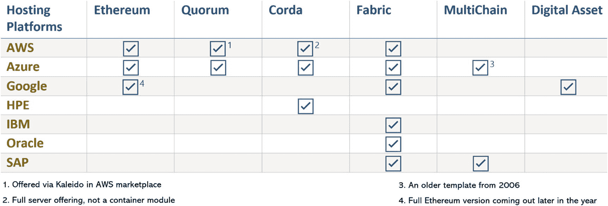

# 13. 构建医疗健康联盟

约翰·巴斯是 Hashed Health 的创始人兼首席执行官。这是一家基于区块链的医疗健康信息技术联盟，其成员致力于将医疗领域的适用用例商业化，并交付可扩展的概念验证。在本章中，我们将就以下主题采访约翰·巴斯：

-   他的背景以及在医疗健康领域的先前工作
-   Hashed Health 的创立过程
-   协作与联盟模式
-   针对高风险、高回报模式的工作组
-   Hashed Health 的治理
-   成员参与

**维克拉姆：** *那么，约翰，你能向我们的读者介绍一下你的背景，以及是什么让你对创建医疗健康初创公司感兴趣的吗？*

**约翰·巴斯：** 我们医疗健康技术行业的许多人，都将职业生涯投入到构建应用和智能系统中，以帮助各利益相关方（例如，医疗服务提供者、供应商、支付方、消费者）了解改善医疗服务提供和控制成本的机会。作为一个群体，我们希望能改变这个体系。希望让一个不公平的体系重新变得公平。希望利用技术，让医疗健康重新以个体患者为中心，而不是以企业利益为中心。我们都梦想着那个难以捉摸的医疗健康平台，它能俘获患者的心智，构建网络效应，并让一切变得更好。我们梦想着将国家从失控的医疗成本中拯救出来，这是一个我们自己造成的国家安全问题。我们梦想着为数百万就医困难的人提供医疗服务。我们梦想着创造出某种极具传播性、能够全球推广并帮助全世界数百万人获得所需护理的事物。我们如此渴望它，以至于夜不能寐。我们如此渴望它，以至于一次次地离开家人数周，希望能点燃引信。

**维克拉姆：** *是什么让你开始考虑建立一家基于区块链的医疗健康公司？*

**约翰：** 我曾参与的初创公司都专注于基于网络的产品，这些产品促进了协作、数据共享、共享工作流程以及跨企业的临床或财务绩效。我们的团队构建过 B2B 平台、患者门户、协作工作流解决方案、手术绩效解决方案以及其他我认为会改变行业的时髦 IT 解决方案。这些努力，就像你在大型医疗健康技术展会上看到的大多数解决方案一样，都侧重于在现有基础设施之上添加应用程序。它们基本上支持现有的医疗健康价值链，目标是使其更高效。尽管在解决问题方面取得了成功，但很明显，多年的努力和数百万美元的投资对我们国家面临的宏观成本/质量问题几乎没有产生什么影响。杀手级应用和平台仍然遥不可及。

二十年之后，我意识到存在一个更根本的问题，无法通过附加技术来解决。退一步看，你会发现，随着时间的推移，我们构建的体系越来越依赖于中间商、关系型数据库及其相关应用程序。结构性真相现在对我来说很清晰。结构性真相是导致经济趋势不稳定、不公平的准入、可预防疾病的失败、不理想的疗效、自付费用上涨以及医疗债务的驱动因素。所有系统都继承了其容器的特征，而在美国，这个容器是一个缺乏任何理性、自由市场特征的按服务收费的市场。在这个容器内构建的任何东西都受这些特征的约束。我不认为我们能在现有容器内真正解决任何问题。

**维克拉姆：** *我想我们都会同意，现有的容器目前运行得还不错，但它不够有韧性，无法应对我们在不久的将来面临的问题。对此你有什么看法？*

**约翰：** 别误会我的意思……美国的医疗体系已经取得了显著的成功。死于老年疾病的人数远多于传染病。我们在处理急症护理和急性伤病的治疗方面已成为专家。我们的制药业在极短的时间内就研发出了针对寨卡病毒的疫苗。我不会说我们的体系已经崩坏或需要推倒重来。它正按照我们当初设计的方式运作。它是我们为系统开发者所描绘的用户故事与需求的体现。世界各地的人们都前来美国接受世界级的医疗。同时，我们也正迅速将我们的（好与坏的）专业知识输出到世界其他地方。

显而易见的是，我们已经不再物有所值。美国医疗支出即将达到 5 万亿美元，其中三分之一是浪费。医疗差错是继心脏病和癌症之后的第三大死因。在美国和世界各地，有大量人群难以获得良好的医疗服务。我们都生活在不健康的影响因素和行为已被制度化的环境中。我们过去建立的体系，并非为应对如今已成为成本和质量问题主要诱因的那些行为而设计。我们意识到，在原有设计体系之上添加新应用是无法解决这些问题的。我们必须重建，既要利用我们已有的成功经验，又要针对当今的社会和经济现实进行优化。

**维克拉姆：** *那么，重建后的体系会是什么样子？新的用户故事和需求是什么？谁会成为这个新系统的开发者？能信任当前的企业利益集团去重新设计未来的平台吗？我们如何从现在走到那一步？*

**约翰：** Hashed Health 将区块链视为下一代医疗解决方案的协议。通过将信任置于协议层，我们为更敏捷的护理交付模式、支付系统、价值链和消费者体验奠定了基础。它并非这些问题的终极答案，但它能让创新者摆脱当今的种种限制因素，开启全新的对话。当与物联网、机器学习、人工智能、加密货币、设计思维及其他工具相结合时，区块链便成为实现真正颠覆的配方。

医疗领域真正变革的路径是通过消费者。区块链之所以能成为医疗颠覆的推动因素，其潜力之一在于它能改变消费者与现有健康与医疗体系的关系。它为当今以企业为中心、已成为社会限制因素的环境提供了另一种选择。用户将通过其移动设备与这种新模式交互，这些设备将利用“钱包”软件，且该软件随着时间的推移会变得越来越自主。消费者将成为“产消者”，能够控制自己的健康资产。患者在连续的护理过程中，将不再被要求加入一系列孤立的患者门户。这为个人相关的健康、保健、社交和社会经济事件提供了一种更全面的方法。我们已经认识到，一个人的健康远不止临床就诊中那 5%的碎片化信息。患者将被赋予对其信息的掌控权，并能够按自己的意愿捐赠或变现其记录。随着时间的推移，医疗记录数据的蜜罐将被去中心化和分布式化，使用户信息更不易被盗取。

**维克拉姆：** *按照许多标准来看，医疗 IT 的发展如同一个缓慢的庞然大物。这可能是设计使然，但您能否详细谈谈，为什么在医疗 IT 乃至更广泛的医疗领域，我们没有一个直接的消费者对提供者的关系？*

**约翰：** 面向消费者的医疗 IT 方面很复杂。医疗的“消费化”多年来一直是个流行词，但事实证明它难以实现。有几个重要原因可以解释这一点。首先，在许多层面上，医疗与其他市场不同。医疗不是一种可以购买的传统商品或服务。即使消费者完全有能力这么做（更多内容见下文），他们也无法对购买医疗做出最佳判断，这要么是因为医疗治疗的复杂性，要么是因为寻求护理的紧迫性。此外，与几乎所有其他产品或服务不同，消费者无法总是预测医疗消费的结果。例如，购买汽车会产生可预测的结果：拥有具有规定功能且符合法规的交通工具。相比之下，给定的治疗可能无法充分解决疾病或状况。

除了这些经济基本面，医疗体系本身的配置也使消费化变得复杂。将医疗“优步化”的驱动力一头撞上了美国支付和交付系统这堵墙。消费者不了解服务的价格。提供者自己也常常无法提前给出定价。此外，消费者并非定价协议的一方，因为合同关系建立在提供者和（代表消费者的）支付方之间。这些都是与美国医疗相关的众所周知、甚至老生常谈的问题。仅凭这些，并不会妨碍有可能有用的消费者工具的创建。相反，要发挥效用，消费者工具需要“接入”提供和支付医疗服务的系统。考虑到令人眼花缭乱的支付方、医生和服务提供者，以及他们时常相互矛盾的动机，消费者工具常常因控制着医疗市场的企业不愿配合而受阻。医疗的消费化难以实现——不是因为缺乏工具，而是因为缺乏一个开放的平台。

随着消费者群体以传统和创新方式组织或聚集起来，这些群体将为未来的市场代表新的重心。社区或团体（无论你如何定义——村庄、雇主、基于价值观的团体、疗养院等）也将通过组织、聚合和分享的能力而被赋予权力。同样，卖方市场上的提供者群体也将组织（或被聚集）成传统或创新的新群体，以比当今臃肿的市场结构下所能提供的更好、更快、更经济合理的方式提供护理。

**维克拉姆：** *您认为大型企业（提供者集团和保险公司）将如何演变，以应对像区块链这样的新机遇？*

**约翰：** 随着时间的推移，企业将受到市场结构变化所带来的新机遇和挑战的影响。这种影响将波及当今医疗价值链的各个环节，例如供应链、收入周期、索赔生命周期、临床研究、保险/福利以及临床事件。审计与合规活动将让位于自动化。合同、返利、管理费以及折扣方案，将通过使用不可篡改、透明的共享分类账而消失或转型。像电子病历（EMR）、企业资源规划（ERP）和物料管理系统这样的封闭关系型数据库，将随着其会计职能的性质向市场层面转变而演变。临床试验项目将通过信息共享和简化的行政流程得到优化。安全性将得到增强，并且随着时间的推移，数据蜜罐将让位于去中心化的结构。

## 区块链在医疗健康领域的未来：对话与洞察

企业不会轻易放弃其现有数据库（至少一开始不会）。首先，这些遗留系统将通过 API 与区块链进行交易，然后，随着时间的推移，我们将开始看到新的、灵活的、从零开始构建的系统出现。这些系统将改变我们当前对健康、数据、临床和金融资产在市场中的流动方式的思考。

机器也将在健康与 wellness 领域发挥更大的作用。我们已经看到联网健康机器、可穿戴设备以及大量支持网络功能的监控设备正在发挥作用。区块链为更安全、可扩展的健康物联网（IoT）环境提供了基础。使用区块链作为共享账本，可以更可扩展地注册和验证设备。因此，来自这些机器的信息可以被信任。资产所有权的转移也能更容易地被追踪，设备的运营生命周期也可以被记录。也许最有趣的是，设备本身可以被赋予一个钱包和一组智能合约，使其能够执行命令、转移资产，并以推动临床和金融价值的方式运行，无论是为消费者还是为机器本身！

这种关于消费者、社区、企业和机器的愿景具有真正的颠覆性。同时，这也是一个充满诸多技术与非技术挑战的愿景。

**Vikram:** *我们如何到达你所描述的那个未来？通往消费者驱动型未来的道路是什么？我们如何创建能够证明技术价值的演示？我们如何让更多人参与进来？*

**John:** 医疗健康领域是一个快速追随者。由于监管方面的考量、复杂性以及对风险的规避，它在历史上对平台化和“优步化”持抵制态度。区块链技术是全新的。中本聪于 2009 年发布了比特币白皮书。以太坊创建于 2015 年夏季。其他正在被考虑用于医疗健康项目的协议，如`Hyperledger Fabric`、`Tendermint`等，则更加新颖。`EOS`、`Tezos`和`NEO`刚刚出现，带来了它们创纪录的代币销售以及关于治理、共识和可扩展性的新理念。智能合约仍然不够智能，甚至更不安全。五年到十年后谁会是赢家，这谁也说不准。如果有选择的话，医疗健康领域这个“机构厨房”里的“大厨们”更愿意袖手旁观，看着技术“腌渍”一段时间。

真正的限制因素实际上可能在于非技术方面的担忧。首先，要使区块链解决方案有效，你需要一个协作性的参与者网络。这就是为什么你会读到这么多关于联盟和区块链的内容。没有联盟或最小可行参与者网络，企业级的区块链努力仅仅是昂贵的学术练习。即使拥有所需的网络，成功的治理也可能十分棘手。这些协作概念需要一些人去适应，对大多数人来说则是一种范式转变。其次，对于某些用例，存在着严重的监管问题，使有效利用变得复杂。许多伟大的想法将受到从未想象过去中心化市场的监管框架的限制。第三，市场仍需要进行大量的教育和组织工作。在运营我们的联盟一年后，市场中的大多数参与者仍然需要咨询，以了解什么是区块链、它将如何影响他们的市场结构，以及为什么网络是成功的关键。第四，我们相信，建立区块链和分布式账本技术作为可行解决方案的早期努力，需要简单的价值演示。这些早期的演示不会旨在改变世界。它们将解决当今医疗体系中简单、不引人注目的问题。因此，早期会有抱怨称这些产品未能实现区块链最初承诺的价值。

理清这些问题需要一些时间。对于我们这些早期涉足医疗健康区块链领域的人来说，这些都是我们面临的复杂现实。真正的问题是时机。

**Vikram:** *那么，关于时机，你认为区块链需要多长时间才能成为主流？我们如何能加速跨越这个鸿沟？*

**John:** 我常对人说，创办`Hashed Health`是我职业生涯中最兴奋也是最害怕的时刻。从创新者的角度来看，区块链医疗健康领域是一个梦想。没有模板。一切都是崭新的。技术是新的且不成熟。协作式创新商业模式是新的。“胖协议”的概念是新的。我们不仅要构建产品……我们还要构建一个市场。我们正在从各个角度进行创新。每一天都是一场三维国际象棋比赛。这是高风险、高回报的研究与开发。对于`Hashed`来说，这是可以想象到的最激动人心的机会。

我们选择协作式商业模式，是因为它符合区块链的精神，并且在我们 2016 年创办公司时，它似乎是通往成功的唯一路径。与之前的初创公司不同，这不是一个“构建产品，销售产品”的模式。尽管我们手头有许多强有力的用例，但我们知道不能把所有的赌注都押在一个上。市场还没有准备好。我们知道我们需要事半功倍。协作模式允许我们与行业思想领袖联合起来，他们可以为我们的共享价值生态系统做出贡献。通过与使用我们产品的公司一起参与几个成功的项目，我们增加了产品获得有效使用的几率。同时，我们也降低了客户的风险，增加了他们的回报。这是唯一的方法，尤其在一个全新且复杂的市场中。

一旦我们做出这个决定，我们就很快被贴上了“联盟”的标签。我们从未对这个标签感到自在，尽管我们努力想出一个更好的说法。我们更像是一个网状网络或产品工作室。归根结底，`Hashed Health`是一家产品公司，其产品组合中有许多成功的解决方案。从许多方面来看，任何构建区块链产品的公司如果想要成功，都会成为一个联盟。网络往往比产品本身更重要。我们在两者之间的关系上投入了大量精力，因为成功就在于此。

**Vikram:** *那么，我们如何开始构建网络？目前，医疗健康领域对区块链技术缺乏认识和理解。我们如何让服务提供商跟上进度并[让他们]产生兴趣？*

**John:** 首先，我们知道需要做大量的思想领导工作来教育和组织这个行业。我们深入研究了这项技术，并将外部发生的事情与我们自身的专业和个人医疗保健经验联系起来。我们大力投资于研究。过了一段时间，我们开始了思想领导工作。我们写博客、撰写新闻简报、在会议上发表演讲。我们倾听收到的反馈，并对我们的想法和早期产品进行迭代。我们利用这些早期产品来招募最初的成员。起初，我们制定了非常复杂的合同，然后我们简化了它们，以便更容易地入门。我们逐渐发展出一种结构，可以根据工作组和产品的需要，灵活调整治理、业务和技术要求。这使我们能够满足客户的实际需求，而不是强迫他们走上可能令人生畏或不舒服的合同路径。我们从较大的组织开始，现在我们正在向更早期的公司、大学、企业家和思想领袖开放会员资格和工作组活动，以便我们能够将更多的贡献者带入新兴网络。

**维克拉姆：** *能否请您再多谈谈 Hashed Health 模式如何使成员受益？该组织目前的结构是怎样的？*

**约翰：** 我们对成员的目标是构建社区和产品，以有意义的方式利用区块链和分布式账本技术的优势。我们寻找的是能为项目和对话做出贡献的成员，而不仅仅是试图从这个团体中获取价值。我们认为自己首先是一家医疗公司，因此我们开展的项目必须始终以患者的最大利益为考量。

我们的成员通常以普通成员的身份参与，他们在准备开始构建之前需要一些咨询。医疗机构内部的业务和技术专业知识水平非常薄弱，因此需要采取咨询式的方法。成员们通常有一两个他们相信自己想要解决的概念，但在开发之前，他们总是需要一些指导和准备。通过提供医疗专业知识和区块链专业知识，我们能够交付独特的产品，以更高效的方式推动有实际应用价值的概念向前发展。通过创建合作协议，我们可以构建激励措施，以支持在从概念到实际应用的道路上完成合理的里程碑。

我们的每个网络都有其自身的参与者、节奏、商业计划、技术计划、治理结构和特性。每个网络都专注于解决特定的业务问题，我们选择适合业务需求的协议。目前，我们已经在`Hyperledger Fabric`、`Ethereum`、一个名为`BitSE`的商业平台以及`Tendermint`和`Ethermint`上构建了产品和演示。我们正在研究其他协议和各种中间件产品，包括`Gem`、`Bloq`、`Nuco`、`Stratumn`、`Tezos`、`EOS`和`IOTA`。各工作组共享跨项目通用的经验教训和最佳实践。我们拥有（内部或外包的）专家，可以支持推进产品所需的任何讨论（技术、商业、法律、法规）。

为了跨越鸿沟，我们认为从简单的价值演示开始非常重要。越简单越好。我们更倾向于那些不高度政治化、不需要受保护信息、能在当今环境中解决问题，同时为我们未来的愿景奠定基础的项目。

**维克拉姆：** *让我们深入了解一下 Hashed Health 内部运营工作组的组合以及当前的目标领域。您能否为我们详细阐述一些案例，以及它们是如何使用区块链的？*

**约翰：** 在撰写本文时，Hashed Health 有五个活跃的企业工作组：

1.  提供者身份
2.  患者身份
3.  支付
4.  供应链物联网
5.  临床物联网（可穿戴设备）

我们还在组建几个新的企业工作组，预计很快就能投入运营，包括：

1.  疾病登记
2.  临床试验
3.  医疗记录
4.  制药收入周期
5.  企业资源管理系统

这些是 Hashed 团队既具备专业知识又有客户兴趣的领域。通用会员费支持初步的商业案例和技术研究。一旦决定开始构建，客户需要签订针对特定项目的二次开发协议。

我们最广为人知的例子或许是去中心化医生身份。提供者身份及其相关数据是当前和未来医疗服务交付的基础。从研究生医学教育到州立执照、医务人员资质认证以及支付方合同，关于提供者身份、资质和声誉的数据可及性和可靠性对于确保患者安全和高质量护理至关重要。全球范围内，世界正面临合格卫生工作者的短缺。据估计，这一短缺数量为 790 万，并预计到 2035 年将增长至 1290 万。在这一短缺中，一个关键的挑战是如何识别、定位并与偏远地区的工作者进行沟通。单一提供者的身份是一个复杂的数据点集合。医学院、州执照委员会等多个不同利益相关方持有多种元素。有些元素随时间保持静态（如研究生学位），而其他元素则是动态变化的（如执照、隶属关系、居住地和联系方式）。

在这个案例中，我们将数据字段视为独立的数据资产。提供者和认证利益相关方共同管理一个分布式提供者档案注册表。加密签名确保了对基本资质和认证的主要来源验证，允许分布式网络共享关键数据的实时更新。这个过程极大地减少了当前存在的时间、金钱和浪费人力的人工流程。这个案例之所以有吸引力，是因为它在技术上相当直接，不涉及政治，数据不敏感，并且没有关键利益相关方具有竞争利益。我们认为这是一个很好的区块链应用案例，因为提供者身份并非中心化，目前存在需要克服的信任和激励问题。尽管目前有尝试将这类信息集中化的努力，但各种数据元素并非集中授予、管理或消费。一个易于审计的市场级数据结构将在一个目前既缺乏信任也缺乏效率的市场中带来信任和效率。

在这个例子中，你可以看到 Hashed Health 如何用一个基于简单但影响深远的案例构建的简单产品，为一个市场播下了种子。区块链使我们能够以一种以前无法想象的方式来解决这个问题。

我们对其他基础性案例也同样感到兴奋。我们正在与提供者合作开发患者注册授权产品。我们正在与一个多方工作组合作，开发一个将支付与福利和行为联系起来的令人兴奋的支付模式。我们正在与政府机构合作，开展公共卫生监测和临床试验去中心化项目。我们已经开始了一段激动人心的旅程，并在区块链和特定医疗主题领域不断获得动力、新想法和额外的专业知识。

**维克拉姆：** *将区块链整合到医疗中的一个主要问题是隐私担忧。区块链本质上设计为匿名，但对于健康数据，我们需要这种有趣的组合：受信任的矿工、完全私密的交易，以及同时在区块链上达成网络共识。您对隐私的演变有何看法？*

### 约翰的访谈

**约翰：** 我们首先承认，医疗健康领域才刚刚起步，在这个早期阶段，一切并不完美。这种不成熟的一个明显例子体现在我们围绕公有链与私有链的讨论中。关键区别在于，虽然许可链仅仅是*分布式*解决方案，但开放区块链提供了真正的*去中心化*。从技术角度来看，我们根据要解决的问题来选择协议。我们接受这样一个概念：所谓的“区块链”实际上代表了一系列基于信任的交易系统，范围从开放、去中心化到私有、分布式。我们相信，行业将朝着开放和公有链的方向发展，但这可能需要时间才能实现。医疗健康企业，就像金融服务和其他企业一样，看重更高程度的控制权，或许最重要的是，看重目前在开放、真正去中心化的区块链上无法实现的机密性。无可争议的是，对于一系列商业用例，许可链是理想的选择。我们相信，企业需要时间来适应更传统的区块链模型，即便这些模型显然提供了最高的安全性。

重要的是要批判性地审视这种对控制的偏好何时会变成一种具有破坏性和自我挫败的偏见。开放和去中心化的区块链正持续爆发式地涌现。仅排名前两位的加密货币就占据了 650 亿美元的市场资本。此外，“首次代币发行”（ICO）这一较新的趋势已通过众筹吸引了超过 10 亿美元，主要面向开源、去中心化的区块链平台。对这些开放平台的巨大兴趣和资金支持不容忽视，也不应被忽视。它们预示着个人和企业都有巨大的机会去重新思考所有权、网络控制权以及为支持公共福祉的基础设施进行融资等概念。这在资助那些挑战当前“企业统治”的平台时可能至关重要。在医疗健康领域，我们可以资助大型公共基础设施项目，将健康与健康生活的权力交到真正的客户手中。这非常强大，而且很难想象通过传统方式如何能获得这样的资金。

撇开区块链上机密交易和受保护健康信息的技术问题不谈，医疗健康企业运营在开放网络上的前景对许多企业来说确实令人生畏。几十年来，尤其是自《平价医疗法案》实施以来，医疗健康网络的集中化、整合和日益扩大的控制权一直是该行业的主导商业战略。医疗健康领域的商业成功主要来自于对价值链（聚焦于参保人群、药品、理赔、专科网络、门诊设施和物资）进行越来越大的控制。显然，如今价值链参与者攫取的价值过多。开放的区块链解决方案会暴露这些关系，并迫使更轻量、更敏捷、能增加价值的参与者进行“再中介化”。区块链技术向医疗健康行业提出的一个棘手问题是，开放、去中心化的网络为真正有价值的医疗服务提供了非传统但切实可行的机遇。

**维克拉姆：** *随着区块链的成熟，你认为主要价值会在哪里创造？我们之前谈到过“胖协议”在架构层面创造和捕获价值，但网络层面呢？*

**约翰：** 在当今的医疗健康行业，拥有和运营网络是最终的商业目标。医疗服务的消费者几乎没有市场权力，他们的选择受限于定义当今医疗网络的那些晦涩且不透明的合同关系。他们无法自行组建由医疗服务提供者和服务构成的网络；他们无法就价格或其他增值服务进行谈判。消费者反而被“引导”。但是，一个开放、去中心化的医疗服务市场将使消费者能够自由地做出理性的经济决策。但一个开放的网络必须摆脱那些限制选择并驱使患者被“引导”的不良激励。现状与去中心化网络承诺之间的本质区别在于：运营一个去中心化网络本身并不是一门生意。

到目前为止，医疗健康领域一直抵制平台化运动。在很短的时间内，我们已经看到优步、爱彼迎等公司颠覆了几个传统行业。医疗健康行业的领导者们目睹了这些市场的变化，同时对自己现有的医疗健康价值链过于复杂、监管过于严格、对失败的容忍度太低这一现实感到些许安慰。依靠这些假设可能是一个错误。成本正变得不可持续，消费者正要求另一扇门。

开放区块链平台是医疗健康领域需要认识和接受的一个新现实。Hashed Health 计划朝这个方向迈进，并将继续推广开放解决方案。这些系统、协议和工具正在迅速成熟，并且不会消失。它们正在证明自己的经济可行性。平台本身基于开源软件构建。像非盈利基金会这样的组织现在有办法筹集足够的资金来启动这些平台。可以实施激励和费用结构来为持续运营提供资金，使平台真正自给自足。去中心化网络支持通用交易系统的核心区块链创新，可以防止平台受到任何单一实体的集中控制。开放治理模型正在不断完善。

开放网络上的价值完全由所提供服务的经济基本面决定。相比之下，医疗健康行业的封闭生态系统似乎通过限制选择来扭曲真实价值，从而得以繁荣。巨大的成本和昂贵的行政低效率在某种意义上是为了集中对网络本身控制权而设计的必需品。通过放弃对基本平台本身的控制权，医疗健康企业可以通过提供有价值的服务，并以低得多的管理费用和行政成本负担，获得经济上的回报。

最重要的一点是，尽管存在隐私和监管方面的担忧，开放、去中心化的网络与医疗健康领域并非根本不相容。技术壁垒很快就会让位于诸如“零知识证明”和其他执行机密区块链交易的手段等创新。真正的障碍是一种根深蒂固的商业思维模式，这种模式终将过时。问题不在于开放医疗健康网络是否会扎根，而在于何时扎根。短期内，我们需要私有网络来展示价值并推动对话向前发展。Hashed 将成为开发这些网络的领导者，将其作为逐步迈向最终现实的步骤，即开放区块链将带来最具颠覆性和最有效的解决方案。正是那些能够放弃对网络死死控制的企业，才能收获最大的机遇。

**维克拉姆：** *最后，我必须问问你关于最近的首次代币发行热潮。每家区块链公司都试图进行首次代币发行——这让我想起了 90 年代末的环境。Hashed Health 会进行首次代币发行吗？代币将用于什么以及如何使用？*

**约翰：** 我们在令牌化方面也积累了专业知识，并且相信我们的一款或多款产品将采用有意义的、以令牌为核心的架构。令牌发行的概念令人兴奋，因为它有潜力为公共卫生领域的基础设施概念提供资金。如果设计得当，令牌还能助力实现医疗领域智能价值交换的承诺。可编程支付是一个绝佳的机会，可以改善当今医疗领域的资金流动方式，创建更好的激励结构，从而实现我们长期以来一直缺失的协调一致性，尤其是在医生和患者的行为方面。Rasu Shrestha 博士说得好：“归根结底，创新实际上关乎行为改变，无论是医生下医嘱、放射科医生对某个发现做出具体诊断或判断，还是患者决定吃那个松饼而不是选择沙拉。创新就是关于行为改变。” [详见 `https://www.healthcare-informatics.com/article/upmc-s-rasu-shrestha-innovation-about-behavior-change-technology-should-be-invisible`。]

我们并不急于投身 ICO 热潮，而是倾向于花时间确保令牌机制与产品融为一体，并且令牌销售的方式既能满足各方的利益，又能确保令牌最终落到真正会使用它的人手中。没人能忽视这项创新的力量。世界任何地方的工程师团队都能开发出一个安全的金融系统，其优势明显优于现有系统。这种模式使得传统系统和传统资助的初创公司难以竞争。

我们有信心，我们的几个应用案例和待定合作都存在令牌化的机会。我们认为，令牌是一种比现有方式更新、更好的容器。我们对医疗行业中公司与令牌之间新兴的关系非常感兴趣，也感到兴奋。我们同样有兴趣看看是否可以将我们的协作原则应用到令牌分发理念中，尤其是在治理和协调模式方面。

在目前的市场和产品构建阶段，Hashed Health 所提供的价值简单且必要。我们首先是一家医疗公司，这意味着患者是我们的首要考量。我们团队成员平均拥有十五年的医疗技术经验。我们了解医疗行业，并且能够将医疗挑战与区块链的可能性联系起来。这意味着我们非常擅长医疗领域的区块链应用案例。其次，在一个技术快速变化的世界里，我们不会将客户锁定在特定的技术上。并非每种协议或中间件解决方案都完美适用于特定的业务问题。在 Hashed，协议服务于问题。第三，我们的协作方式降低了项目风险，提高了成功概率。“只要建好，自有人来”的模式会导致昂贵且脱离实际的学术练习。存在一条更好的路径，你可以将成本和回报分布在围绕成功而组织起来的协作者网络中。我们创建了一家符合我们所构建的去中心化医疗解决方案精神的公司和商业模式。我们将共同创新，共同加速有意义的生产性应用，并实现区块链在医疗领域的潜力。

## 区块链即服务

在前一章中，我们讨论了使用精益方法论来发现集成区块链是否是正确选择；我们还介绍了通过 Hyperledger 可用的开源 DLT 作为一种开源途径。本章将我们之前的讨论扩展到区块链即服务：一种在云端测试区块链部署和智能合约的更沉浸式环境。

区块链即服务（BaaS）是一种基于云的区块链服务，它为客户提供了一个开发环境，用于编写智能合约、快速构建区块链应用原型，并轻松部署基于区块链的联盟。它消除了进入壁垒，特别是部署区块链网络所需的大额前期硬件成本和专业知识成本。这使得初创公司甚至试图尝试区块链的大型公司能够更好地理解将区块链集成到现有商业模式中的财务问题。BaaS 提供商的作用类似于传统的网络托管商。提供商管理基础设施、执行硬件升级，并保持网络运行，以便客户能够构建依赖区块链的复杂业务应用程序。在维护方面，提供商依靠网络工具进行资源的合理分配，管理带宽，并为其他托管需求提供支持。使用 BaaS 服务有助于区块链技术的大规模采用，因为客户可以专注于他们的应用和核心开发，同时避免了创建区块链网络以及处理相关基础设施支持问题的技术复杂性。

BaaS 现象帮助实现大规模采用的一个非常有趣的国际例子是区块链服务网络（BSN）：这是一个针对区块链开发量身定制的、提供云端托管支持的基础设施。BSN 是中国本地对云基础设施有既得利益的区块链公司之间大规模合作的成果。BSN 已经集成了六条公有链，包括 Tezos、NEO、Nervos、EOS、IRISnet 和 Ethereum。该项目旨在不久的将来纳入超过十条公有链，并通过技术服务提供更多安全特性，使开发者能够简化开发流程。

在本章中，我们研究来自四个提供商（云区块链世界的三个主要玩家和一家 ConsenSys 支持的初创公司）的区块链即服务（BaaS）产品：Microsoft Azure、Amazon Web Services、Oracle 和 Kaleido。我们的主要关注点将是 BaaS 提供商的独特之处，以及每个提供商如何支持云端新组织/初创公司的成长。

### 服务提供商

截至目前，市场上约有十家 BaaS 提供商，它们提供的服务和支持程度各不相同。尽管评估 BaaS 提供商的标准可能数不胜数，但每个商业应用都有其特定需求。这里有两个评估维度：托管 BaaS 实例的云提供商，以及 BaaS 实例本身。在此，我们希望重点关注在选择 BaaS 提供商时需牢记的四个方面：

*   **搭建区块链基础设施的过往经验：** 随着 BaaS 提供商市场的扩张，选择那些在开发和部署区块链基础设施方面拥有成熟业绩记录的提供商至关重要。当商业应用随着客户增多而开始扩展时，基础设施的可靠性会变得更加明显和关键。例如，具备区块链交易量处理经验的云提供商可以设置负载均衡器，以恰当响应不断扩展的 BaaS 设置。

*   **安全与数据冗余标准：** 熟悉托管你 BaaS 实例的云平台的安全和备份/灾难恢复策略至关重要。这涉及到理解在云端存储和使用的私钥/公钥的安全性、处理云提供商 BaaS 实例的现场安全团队、遵守安全法规，以及持有区块链实例的备份冗余。

*   **集成能力：** 你的 BaaS 提供商是否有计划集成各种服务，以便在区块链上构建新的特性和应用？这对新兴初创企业来说至关重要，因为它们需要调整方向寻找新途径，或为其最小可行产品添加新功能。此外，开发人员必须确保新的特性和集成易于融入现有工作流程。这能减少熟悉新云系统所带来的额外开销。

*   **定价与支持层级：** 透明的定价是任何 BaaS 提供商的关键；这也有助于规划围绕 BaaS 实例的财务。许多提供商根据基础设施的使用情况结合支持级别提供不同层级的定价。完全托管的实例一旦上线，就需要更少的内部管理。这种选项适合那些在搭建 BaaS 或网络方面缺乏领域专长的初创企业或公司，使它们能够专注于区块链开发。部分托管选项则更适合那些技术导向性强且拥有内部专长的初创企业。

图 14-1 以图形方式总结了市场上主要的 BaaS 提供商。

图 14-1
BaaS 托管概览

#### Microsoft Azure

Azure 提供区块链即服务平台，通过为客户提供易于部署的企业级模板，支持四种主要的分布式账本协议，包括 Ethereum、Quorum、Fabric 和 Corda（并计划支持更多协议）。Azure BaaS 分为三个主要组件：完全托管的 `Azure Blockchain Service`、名为 `Azure Blockchain Workbench` 的开发和管理平台，以及捆绑在 `Azure Blockchain Development Kit` 中的集成组件。本节内容参考了 Azure Blockchain Service 文档中的相关资料编写。

##### Azure Blockchain Service

这是 Microsoft Azure 提供的完全托管型 BaaS 服务。客户只需点击几下即可创建和部署一个带权限的 Quorum 网络，并使用 Azure 门户中的图形用户界面管理网络策略和安全选项。此外，Microsoft 还发布了一个 Visual Studio 扩展，帮助用户：

1. 编写和编译以太坊智能合约；
2. 通过 Azure Blockchain Service 或公共主网将其部署到联盟网络；以及
3. 通过 Azure 门户管理它们。

这项服务使组织和联盟能够在 Azure 云端完全成长和扩展，而无需担心底层资源供应。精细的网络治理和简化的基础设施管理，使得网络部署简单、网络操作和安全易于管理，并能够使用 Visual Studio 等对开发者友好的工具开发智能合约。

目前，Azure 提供采用伊斯坦布尔拜占庭容错共识机制的 Quorum 账本。使用托管服务使客户能够专注于开发其核心产品和业务逻辑，而无需担心底层的虚拟机基础设施。与大多数云服务一样，虚拟机的使用允许对整个区块链进行冗余备份，并支持在必要时从特定时间点恢复网络。

##### Azure Blockchain Workbench

`Azure Blockchain Workbench` 是一系列 Azure 支持服务的集合，用于帮助部署和管理区块链应用，并与网络上的其他组织共享业务流程。该工作台提供底层基础设施，用于捕获业务模型并将其编码为可部署到现有区块链网络的智能合约。它还为开发者提供了自动化重复任务的能力。Workbench 通过在 `Azure Resource Manager` 中提供一个模板，简化了联盟区块链网络的搭建；目前，该模板仅支持以太坊，但更多账本协议正在开发中。Workbench 的主要特点在于它与现有 Azure 组件的集成；例如，正如 Azure 区块链文档所解释的 REST API：

> 您可以使用 Blockchain Workbench REST API 和基于消息的 API 与现有系统集成。这些 API 提供了一个接口，允许替换或使用多种分布式账本技术、存储和数据库产品。

> Blockchain Workbench 可以转换发送到其基于消息的 API 的消息，以构建该区块链原生 API 所期望格式的交易。Workbench 可以对交易进行签名并将其路由到相应的区块链。

> Workbench 会自动将事件传递给 Service Bus 和 Event Grid，以向下游消费者发送消息。开发者可以集成这些消息系统中的任何一个来驱动交易并查看结果。

> Azure Blockchain Workbench 通过自动将区块链上的数据同步到链下存储，使得分析区块链事件和数据变得更加容易。您可以直接查询 SQL Server 等链下数据库系统，而无需直接从区块链提取数据。对于执行数据分析任务的最终用户来说，无需具备区块链专业知识。

##### Azure 区块链开发工具包

区块链开发工具包是一个全面的 GitHub 仓库，其中包含特别关注与 Azure 智能服务集成的代码示例。该开发工具包在不久的将来可能会被扩展，用于构建在 Azure 驱动的区块链上运行的机器学习应用。在此，我们将重点关注两个此类示例：IoT Central 和认知搜索。

**注意**  
机器学习功能在 Azure 中已经可用；然而，一旦来自区块链系统的数据可以导入，它就能被其他 Azure 服务访问。未来，机器学习服务可以"扫描"区块链，并具备一定程度的事件报告能力，从而实现全网范围内的警报和通知。

认知搜索示例向用户展示了如何从以太坊获取账本数据并将其导入 Azure 搜索。导入后，这些数据即可供广泛的企业应用程序使用，而智能搜索选项则使从用户处进行数据挖掘和学习成为可能。该 IoT 示例演示了如何将实体产品连接到数字云并将数据导入您的区块链联盟。在 IoT Central 中，您可以创建模拟设备、预配新设备、管理和排除实体设备故障，并为传入数据定义自定义规则以及为数据定义自定义操作。

##### Amazon Web Services

Amazon Managed Blockchain 是 AWS 提供的一项完全托管的 BaaS 产品，它使得在云中基于开源分布式账本技术（如 Hyperledger Fabric 和 Ethereum，后者即将在 BaaS 中可用）构建和部署区块链网络变得更加容易。目前，从头开始构建可扩展的区块链网络并部署应用程序在技术上具有挑战性。将多方加入您的网络会加大这一挑战，因为每个新网络成员都需要安装软件、创建新的安全证书或私钥、手动配置硬件，并配置网络以支持该网络。此外，一旦区块链网络上线，开发人员还需要承担监控交易请求增加、新成员加入以及基础设施健康状况等额外任务。Amazon Managed Blockchain 简化了这一流程并减少了技术开销。网络可以扩展，以适应增加的负载和交易量。此外，新成员可以轻松加入云中，无需任何特殊硬件。

###### 易于设置（取自 Amazon Managed Blockchain 文档）

在 Managed Blockchain 产品中，启动一个新网络可以通过模板在几分钟内完成，无需进行大量配置。网络可用后，新成员可以通过邀请加入网络。一旦新成员接受成员资格，他们就可以配置对等节点，这些节点提供计算存储和内存来执行去中心化应用程序并维护一份账本副本，这一切都在云端完成。这省去了整个过程中对任何本地硬件的需求。在交易负载和网络流量沉重的时期，扩展应用程序只需添加额外的对等节点即可。新的对等节点可以轻松地在云网络中预配。可以通过 AWS 云服务中预先配置的各种实例系列来实例化新节点以支持您增加的工作负载。

###### 安全性（取自 Amazon Managed Blockchain 文档）

管理公私钥对于基于区块链的平台至关重要。密钥用于访问区块链实例上的钱包、签署合约以及注册安全证书和身份管理。Managed Blockchain 依赖 AWS Key Management Service 作为 Hyperledger Fabric 的证书颁发机构。为此，登录 Managed Blockchain 的新用户无需担心设置硬件安全模块。

###### 不可变排序服务（取自 Amazon Managed Blockchain 文档）

Hyperledger Fabric 用于支持在网络中传播交易的默认排序服务是 Apache Kafka。尽管 Kafka 是一种在网络中顺序传递交易（及相关信息）的消息传递服务，但它并未针对创建交易历史的顺序日志进行优化。因此，在网络故障的情况下，Kafka 使得检索历史交易变得困难。Managed Blockchain 拥有一种基于量子账本数据库 (QLDB) 构建的新排序服务，该服务提供不可变日志，并在区块链网络中维护所有未提交交易的完整网络历史记录。此 QLDB 服务使用中心化的可信机构来维护历史记录，并补充了去中心化账本。

##### Oracle

许可区块链网络始于少数核心成员组织，网络治理相对容易；然而，随着组织开始因新成员加入而扩张，底层硬件资源的公平分配会变得愈发错综复杂。这在排序职责以及为 Fabric 实现中的私有通道选择成员方面尤其如此。回想一下，一组排序节点将当前交易打包成区块，最终确定该区块，并将区块广播到网络。在较旧的共识实现中，会从全局排序节点池中随机选择一位领导者来创建下一个区块。排序者还维护着被允许创建私有通道的组织列表。通道由排序节点创建，它作为 Fabric 区块链上的一个私有子网运行，网络成员可以在其中进行私密和保密的交易。过去，一组 Kafka 和 Zookeeper 实现来管理排序节点；然而，在云中，这种设置资源消耗更大。最近，引入了一种名为 RAFT 的新共识插件来管理排序服务，使其为企业级生产网络做好准备。RAFT 是一种基于动态领导者的协议，其中一组排序节点（称为共识者集合）在排序集群中协作创建区块。这确保了即使成员数量众多，成员组织也能更公平、更统一地参与。此外，排序集群的配置方式使其能提供增强的隐私性：排序集群中的任何节点都可以与特定的成员组织创建通道，以处理特定的私有交易。这允许通过从特定成员中选择，而不是使用全局排序队列，来对交易量进行更精细的控制。使用 RAFT 还通过消除对云中资源密集型集群的需求，简化了计算资源的使用。接下来，我们将从基础设施维护、身份和备份三大类别来讨论 Oracle BaaS 的主要功能。

###### 维护（取自 Oracle 支持文档）

-   包括 Oracle 运营监控
-   具有零停机时间的托管补丁和更新
-   包括嵌入式账本和配置备份
-   提供全面、直观的 Web 用户界面和向导，以实现许多管理任务的自动化。例如，向网络添加组织、添加新节点、创建新通道、部署和实例化链码、浏览账本等。

###### 身份（取自 Oracle 支持文档）

-   支持身份联合和第三方客户端证书支持，以促进联盟形成并简化成员入网流程
-   与 Oracle Identity Cloud Service 的内置集成，用于用户身份验证、角色管理和身份联合，可立即利用 Oracle Identity Cloud Service 帐户，并使偏好使用基于 SAML 的联合身份验证（针对其自身身份提供商）的联盟成员能够轻松入网

###### 备份（摘自 Oracle 支持文档）

- 对等节点容器分布在多个虚拟机中，以确保在其中一台虚拟机不可用或正在修补时仍能保持弹性
- `Orderers`、`fabric-ca`、`console` 和 `REST proxy` 节点在所有虚拟机中均有复制，实现透明接管以避免服务中断。
- 为客户链码执行容器提供隔离的虚拟机环境，以实现更高的安全性和稳定性
- 所有组件中均设有自主监控与恢复代理，利用所有配置更新和账本块的动态对象存储备份实现自主恢复

##### Kaleido

`Kaleido` 是一家由 `ConsenSys` 支持的初创公司，它创建了两项主要的区块链产品：一个可在亚马逊云上运行、用于简化区块链应用开发的基于以太坊的软件包，以及一个名为 `Kaleido Core` 的全托管区块链即服务云平台。在本节中，我们将讨论 `Kaleido` 的两个主要方面。

###### 网络治理（摘自 Kaleido BaaS 博客）

在托管的 `Kaleido` 服务中，一个主要主题是创建专用于常见治理任务的模板，并通过简单的用户界面将其提供给用户。这包括一个新成员入职流程，只需点击几下即可设置新成员和对等节点。此外，一旦新成员入职并熟悉网络，他们将拥有其节点和密钥数据的所有权。这允许对节点设置进行更精细的控制，并在选择退出可选网络功能时提供更大的灵活性。`Kaleido` 还提供了一个全网地址簿，列出了所有用户及其（在联盟内的）隶属关系和访问权限。为了获得更透明的交易和网络活动历史记录，BaaS 中还包含一个标准区块浏览器和代币浏览器，用于运行在 BaaS 中的账本。最后，一个原生智能合约管理器被嵌入到网络治理中。这包括常见的智能合约任务，例如安全工作流、防火墙保护、版本控制以及将合约部署到账本。

###### 高可用性与灾难恢复（摘自 Kaleido BaaS 博客）

托管在云端的区块链网络需要具备适应性，以便在流量或交易负载激增时仍能保持网络在线。为此，高可用性对于共识算法至关重要，尤其是在去中心化网络中。这对于配置新节点尤为重要；例如，如果五个新节点加入一个网络，它们应该被动态添加到共识算法中，以防止网络过载。`Kaleido` 的托管区块链还提供了针对新的/未经测试的共识算法的网络保护，以提供一定程度的灾难恢复支持。在不久的将来，这将允许开发者部署和热切换新的共识算法，并收集该算法在高交易量时期表现的数据。

## 总结

在本章中，我们回顾了区块链即服务平台的基本概念，并讨论了四个主要的平台。我们讨论了每个产品的主要特性、每个提供商提供的托管支持，以及区块链公司完全在云端发展的机会。

