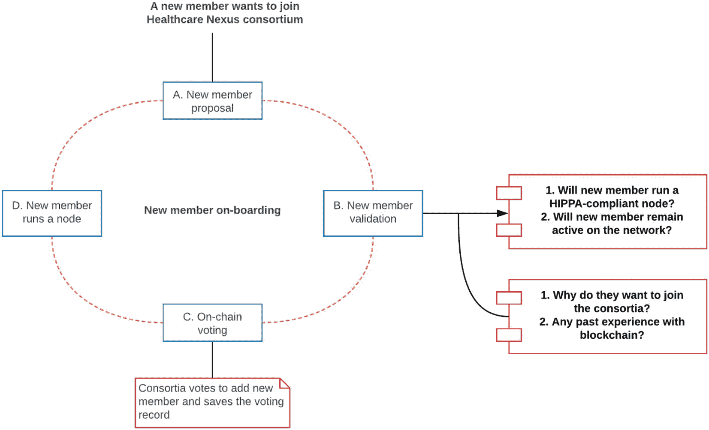

# 15. 区块链联盟的兴起

本章内容整理自 Tamarin Health 的 `Vikram Dhillon` (VD) 与 `Katherine Kuzmeskas` (KK) 之间的一场对话，内容涉及她创建区块链公司的历程、途中遇到的挑战、联盟不断演变的性质以及她公司的未来。

**VD:** *您创立公司时试图解决的主要客户痛点是什么？这些痛点是如何随时间演变的？区块链在其中扮演了什么角色？您能给我们一个大致的时间线吗？*

**KK:** 我们刚开始的时候，专注于价值导向型医疗。这是医疗保健的一个领域，医生根据他们提供的治疗结果获得补偿，而不是根据他们提供的服务数量。这种做法自 2008 年就已存在，最初由 Medicare（通过医疗保险和医疗补助服务中心 [CMS]）发起，随后私人支付方也纷纷效仿。我在耶鲁纽黑文健康系统担任医院管理员时了解到了价值导向型医疗，当时我需要更好的工具来管理患者出院后的情况（或者换句话说，出院后管理）。这非常具有挑战性，因为一旦患者离开医院，他们的数据在很大程度上就无法访问了，而后续随访产生的新健康数据则存在于由众多不可互操作的临床应用程序造成的数据孤岛中。我们希望成为患者、他们的护理过程以及他们的数据的纵向连接器。作为一个连接器，我们可以访问患者护理数据，无论其临床地点如何，这为我们和我们的提供商客户提供了可据此采取行动的信息，并根据 CMS 设定的目标价格提供实时的节约或罚款估算。目标价格基本上就是 Medicare 允许报销的总成本；因此，这是提供商应将总护理成本控制在之下的数值。

我们在 2017 年初成立公司时就提出了这个想法。与区块链的关联最初是作为一种为我们平台上的所有纵向数据创建审计追踪的方式。自从我们在 2016 年确定了如何利用区块链以来，我们的重点就是有意从简单、基础的区块链实现开始：为跨越不同环境的价值导向型医疗的护理交接信息和保险报销创建审计追踪。一旦创建了这个审计追踪，它就不能被删除或修改，这在价值导向型医疗中非常重要，因为患者在不同诊所间流转，数据存在于不同位置，而在此之前，唯一拥有完整视图的实体是通过其索赔数据查看的 Medicare。如果你无法信任或验证信息来源，那么回顾并协调患者的护理过程就会非常困难。我们想解决这个问题，即在整个护理过程中连接患者，并提供不可变的数据审计追踪，从而提高数据的可靠性和可信度。我们的计划始终是在证明这一核心概念后，再逐步增加功能。我们希望先在市场上测试我们的基础，一旦区块链技术变得更加可扩展、被广泛采用，并且人们对其更加熟悉，我们就可以发展壮大，其在医疗保健领域的应用机会将变得无穷无尽。

除了审计追踪，我们一直专注于通过公私钥对系统，以有意义的方式提供管理数据访问的能力。这两个概念——审计追踪和公私钥对系统——引导着我们从价值导向型医疗走向未来，在那个未来里，患者可以通过简单的点击分享他们的数据并从中受益。

除了允许患者管理对其数据的访问权限之外，我们关注的另一个领域是保险报销。许多基于价值的护理项目目前是追溯性的，意味着回顾过去进行报销，但利用区块链，您可以使该系统成为前瞻性的。虽然仍需要人工流程，但我们可以为系统创造显著的效率，包括利用智能合约自动分配资金。凭借我们的基础平台`Health Nexus`（一个医疗保健安全区块链协议）、管理数据访问的密钥对系统，以及我们可以基于`Health Nexus`协议构建的所有智能合约，更多前瞻性的基于价值的护理项目在不久的将来或许能够实现。

**编者按**

与区块链交互的医疗保健特定应用程序受快速变化的监管环境影响，这使得相关讨论极具挑战性。作者在此纯粹以学术方式分享他们的观点。

我们方法上的演变在 COVID-19 早期阶段加速了。疫情开始后，我对于因 COVID 相关压力给医疗设施造成的医院入院情况，将如何影响基于价值的患者护理感到担忧。最终，我做出了一个非常艰难的决定，退出联邦医疗保险计划。这一转变背后的原因源于医疗保险和医疗补助服务中心（CMS）沟通的延迟，以及 CMS 基于价值的护理系统的设置方式——特别是我们主要支持的捆绑支付项目。目前，医生提供者在患者出院后九十天内负责其护理，无论患者去向何方，也基本不关心患者后续发生什么。这个九十天患者护理费用池几乎没有什么例外。例如，在九十天内任何再入院，如果其费用将总护理费用推高至目标价格以上，都可能导致罚款。这意味着，如果一名患者因髋关节置换术入院，然后在九十天内跌倒导致手臂骨折，那么手臂骨折的费用将计入髋部骨折的总护理费用中——即使它们毫不相关。这不是一个理想的情况，在疫情这种患者出现肺炎、心脏问题或使用呼吸机等严重并发症的情况下尤其不理想。

根据时间线：第一次公共卫生紧急状态是 1 月 31 日；到 3 月 13 日，白宫宣布联邦进入紧急状态；3 月 18 日，联邦医疗保险宣布所有择期手术应推迟，以便医生能够专注于 COVID-19 病例和紧急护理。在非疫情期间，基于价值的护理运作方式大致类似于保险计划，医院系统完成的择期手术可以产生报销，以平衡高成本的紧急病例。这场疫情改变了报销的动态，因为几乎只关注高成本的重症监护、延长住院时间和紧张的医疗资源。尽管有上述时间线以及所有医生正在经历的困境，但联邦医疗保险直到 6 月 28 日才提供指导。早期的指导仅限于联邦医疗保险表示他们正在制定相关方案，并将“很快”发布。

当我决定暂停我们在联邦医疗保险基于价值护理方面的重点时，我更加批判性地审视了我们的技术栈。我们有一个现有平台，可以跟踪个体在不同护理模式间的过渡，并记录他们的病历。因此，我们开始专注于如何帮助任何行业的雇主，在 COVID-19 疫情重新开放阶段安全地聚集员工。我们的平台能够整合外部信息来源，例如健康调查、检测协调以及公众健康意识/知识。区块链继续发挥着关键作用，通过一个非常简单的、有目的性的审计追踪，为责任保护和报销提供必要的资源。我们在平台上收集的信息，从症状调查到检测结果，都会被哈希处理并成为审计追踪的一部分。如同我们的平台通过不同的基于价值护理模式跟踪患者一样，雇主可以使用我们的新服务进行数据收集，以核实员工是否完成了调查并对调查内容进行了确认；这样一来，员工可以根据公共卫生指南安全地聚集。此外，企业主可以从责任角度记录其工作场所的安全性。拥有验证数据的审计追踪可以减轻监管合规的负担。这就是我们目前的状况。

这一转变加速了我们向公司愿景另一重要组成部分的演进：用户拥有的健康档案。自 2017 年以来，我们创建了一个平台，使医疗数据在各参与方之间无缝流动，一个由高水平、专注于基于价值护理的医生组成的网络，以及现在的一个用户拥有的健康档案网络。每位用户都拥有自己的医疗信息并随身携带，从基本的健康信息到更复杂的数据，如手术和药物。随着时间的推移，数据的价值会增长，用户能够将其贡献给我们的数据市场，这也是不断发展的生态系统的关键组成部分。有了这个基础设施，您将能够找到专门致力于基于价值护理的医疗保健提供者和服务，您将从您的数据中获得价值，并且无限的机会正等待着我们去创建一个自我维持的、以价值为基础的生态系统。

我们用户拥有的健康档案的下一步是增加游戏化元素。针对 COVID-19 的重点，游戏化将奖励那些会变得平凡但必须遵守的安全规程，例如每日症状调查。我们将首先从礼品卡开始，但我们的长期目标是将系统代币化，因为底层基础设施是`Health Nexus`，它需要节点运行者和验证者。代币化的核心理念是在这个新生态系统中激励提供者和患者的群体行为。由于代币只能在系统内使用，这就是生态系统将如何随着时间的推移自我维持。然而，由于当前的监管环境，这变得非常棘手；任何关于代币化的讨论都将成为与美国证券交易委员会（SEC）进行昂贵且漫长的过程。`Pocketful of Quarters`，一家尝试使用代币进行区块链游戏的组织，已经经历了这一点，他们与 SEC 进行了长达一年多的讨论以获得无异议函，才得以启动他们的网络。医疗保健领域本就充满法规；引入区块链和代币只会增加另一层复杂性，并且，虽然可行，但将耗费大量时间和显著成本。

**注**

在当前的法律环境下，代币化概念几乎不可能实现。`Pocketful of Quarters`已经证明启动网络是可能的，但代价和成本高昂。全球概念理解中的代币化与美国目前可行的做法大相径庭。

**VD：** 本章的核心在于您的联盟模型。请详细介绍一下这个联盟提案。为什么选择联盟路线是最优方案？成员在该联盟模型下能获得哪些益处？

**KK：** 如您所知，我们创建了 `Health Nexus`，这是一个公私合作、面向医疗健康领域的安全区块链协议。*公共*意味着您无需成为联盟成员也能访问区块链网络。而私有方面则涉及更多内容。在网络中运行节点需要满足两个要求：您必须是经过批准和认证的联盟成员，此外，还必须运行一台符合 HIPAA 标准的服务器。

我们选择这条路线有着非常实际的原因。区块链是一项新技术，您需要向 IT 安全团队以及企业高管解释，即便您提供的是基于区块链的工具，您的技术也是安全的。最终，您必须阐明去中心化的含义，并且您的客户必须对您的系统感到放心。如果客户无法理解去中心化协议的优势，或者健康数据与基础设施交互时的安全性，那就不可能赢得客户信任。理解区块链基础的陡峭学习曲线，使得对[网络]缺乏信任在许多行业，尤其是在医疗健康领域，成为了一个难以逾越的障碍。教授区块链基础知识会引出关于服务器的问题。如果您提到服务器可以位于世界任何地方，您就必须以一种客户能理解的方式解释为什么这并非安全风险。

因此，对现有去中心化区块链协议的普遍看法促使我们决定创建 `Health Nexus`。`比特币` 一直面临立法和认知上的挑战，特别是其交易所有与“丝绸之路”活动相关的历史。试图在曾与非法活动挂钩的平台上构建医疗保健应用，本身就是行不通的——它使得与客户决策者的对话无法进行。`以太坊` 是真正意义上的公共模型：世界上任何国家、任何地点的任何用户都可以运行节点。我们预计，任何基于我们协议构建的公司，都必须回答医疗保健 IT 部门提出的“谁在运行网络”的问题。如果答案是“我不确定”或“看起来是其他国家的用户”——包括那些在联邦制裁名单上的国家——这就会造成一个死局，而使用 `以太坊` 就会出现这种情况。此外，需要向 IT 部门深入解释这一点，会延长本已漫长的医疗保健应用销售周期。再次强调，这两个问题都基于现有认知，但仅仅是这一点就已经影响了应用落地。不得不解释“丝绸之路”或位于 OFAC 制裁名单国家的服务器问题，增加了不必要的复杂性。

能够描述一个由已知节点运行者组成的网络，这些运行者必须维护一台符合 HIPAA 标准的服务器来运行基于治理的区块链，这比 `比特币` 或 `以太坊` 更能体现医疗健康的语言特性；因此，这也是 `Health Nexus` 核心基础设施和设计理念的由来。我们网络的私有接口有两个方面：没有您的私钥，任何人都无法访问您的医疗数据；其次，我们知道网络中节点的运行者是谁。所有服务器都符合 HIPAA 标准，您的受保护健康信息数据并不存储在区块链本身之上。我们仅使用账本在区块中传播元数据链接以及仅能用私钥解密的交易。在这个协议上，各方可以达成平起平坐的共识。这就是我们称之为“医疗安全”的原因。

我们选择联盟路线的原因正是为了创建这种公私接口。我们希望创建一个公共网络，但它不能是完全无需许可的。因此，我们设计了一个验证流程，任何运行网络的人都可以验证并确认潜在的联盟成员是否确实在运行一台符合 HIPAA 标准的服务器。您可以对此服务收取费用，就像任何符合 HIPAA 标准的公司每季度付费给第三方来测试其系统并维护其 HIPAA 合规性一样。

成为联盟成员有技术要求，验证过程是二维的：您必须首先得到一位现有联盟成员（验证者）的验证，然后必须通过投票表决被接纳。新成员需经过涉及整个联盟的正式投票流程，并且必须确保其节点始终保持可用。在投票过程中，新成员必须说明为何想加入联盟、在区块链和医疗健康领域的过往经验、以及他们作为联盟成员保持积极角色的兴趣和承诺。随后，联盟投票决定是否接纳新成员。所有成员（包括我们公司）拥有平等的投票权，所有与成员相关的操作投票都会被记录在链上。为此，任何成员都可能因恶意行为被踢出，并且对风险行为或不活跃状态的容忍门槛很低。过去，我们曾通过投票移除了一名因不活跃而无法履行职责的联盟成员。这一流程将治理理念植入了联盟区块链，也有助于维护医疗健康实体的保护性质。该治理流程如下图 15-1 所示。

**VD：** *总的来说，创建一家区块链公司很困难，但您成功克服了几个障碍。主要挑战是什么？融资过程如何？请谈谈您获得的 NSF 资助。有什么让您感到非常兴奋的新功能或新想法吗？*

**KK：** 寻找早期联盟成员出乎意料地容易，因为我们已经有庞大的网络可以联系。最困难的部分是，在缺乏像其他老牌区块链网络（如 `以太坊`）那样的货币激励的情况下，如何保持成员的参与度（例如，参与挖矿）。尽管我们的技术自 2017 年秋季就已准备就绪，但由于主网上线所需经历的昂贵且冗长的 SEC（美国证券交易委员会）流程，我们目前只能发布测试网。我们很感激，到目前为止，一些成员是出于善意以及他们对于区块链在医疗健康领域长期影响的奉献精神在运行我们的网络。不幸的是，就目前而言，在美国，真正的医疗健康区块链应用非常困难，尤其是受立法环境所限。未来必要的政策转变将为所有行业的数字资产创造一个更开放的环境。

有趣的是，在 2020 年，每个人都对 DeFi 感到兴奋，感觉区块链又“火”了，我们终于可以真正谈论区块链了。从 2018 年到 2019 年，几乎所有人都在谴责区块链技术。在医疗健康领域创新极具挑战性，而在医疗健康领域使用像区块链这样的新技术进行创新则更加困难。我们的成功恰恰源于我们战略性地聚焦于保持技术尽可能简单（从一个基本的审计追踪开始），并以一种为医疗健康领域创建安全应用落地的方式构建（专注于公私协议并强调治理）。

在融资方面，这无疑充满挑战，尤其源于驱动决策的系统性偏见。目前，女性仅能获得全部融资资金的 3%。相比之下，`WeWork`在 2019 年获得的投资额超过了所有女性创始人融资的总和，而此后的结果大家有目共睹。融资是一场艰苦的战斗，且根据性别、种族和族裔的不同，难度日益增加。尽管我们确实在 2017 年设法获得了所需的投资，但过程异常艰辛。

然而，通过补助金和贷款，联邦政府在资助我们公司方面比投资者更为支持。具体而言，我们从美国国家科学基金会获得了一项竞争激烈的第一阶段小企业技术转让（STTR）补助金，用于在`Health Nexus`协议上研究实施`Graphene`。我们的大学合作伙伴是马萨诸塞大学阿默斯特分校的 Brian Levine 博士及其博士后 George Bissias 博士。Levine 博士是[计算机与信息科学学院](https://www.cics.umass.edu/)网络安全研究所的主任，专注于互联网和移动系统背景下的安全研究，包括儿童救援、隐私、区块链、蜂窝网络以及点对点网络。Levine 博士和 Bissias 博士已成功在`Bitcoin`区块链上实施了`Graphene`。我们的目标（并已实现）是类似地在`Health Nexus`上利用这种区块传播技术来压缩区块大小，从而提升区块链性能。随着行业持续应对去中心化系统在速度、能耗和效率（包括成本）方面的复杂性，我们自豪地证明了`Graphene`是提高区块链效率的有效工具。以尽可能少的带宽和延迟进行操作，对去中心化区块链具有诸多优势，我们相信它将有助于医疗健康领域实现必要的创新和效率提升。

图 15-1 Health Nexus 中的治理周期

