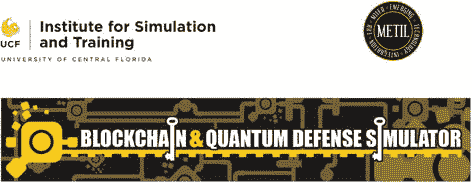

# 18. 区块链模拟

中佛罗里达大学的模拟与训练研究所获得了美国陆军研究办公室颁发的国防大学研究仪器计划奖，用于构建区块链和量子防御模拟器。这一独特项目不仅能构建服务于美国军方的最先进技术，还能为学术界、工业界、非营利组织及其他合作伙伴提供研究和实验支持。作为美国的伙伴大学™，UCF 正在构建关键基础设施，使研究人员能够在研究环境中更广泛地接触前沿技术，并获得使用新技术扩展区块链平台所需的指导。随着量子计算时代的临近，所使用的加密方法以及整个流程（包括人员、流程和技术）的安全性，都可能面临恶意行为者的威胁。

## 范围

区块链和量子防御模拟器的目的不仅是搭建量子网关和多测试网区块链阵列，还要设计包含人在回路流程的场景，以揭示众多潜在风险和威胁，其中最不容忽视的是社会工程学——这种针对人的黑客攻击往往是最有效的攻击向量。尽管我们预见到大量网络安全防御项目和计划，但首个项目是对 2020 年新冠疫情的响应。德克斯特·哈德利博士正在改造其美国国立卫生研究院乳腺癌影像预测人工智能平台，转而用于分析大量新冠肺部影像。将强大的 AI 与区块链相结合，用于医疗记录的验证与核查，以及研究方案和记录的隐私与安全，或许能成为应对当前健康危机的有效方法。`Covidimaging.com` 提供了该创新项目的更多细节和当前成果。肖恩·马尼恩博士在其著作《区块链在医学研究中的应用》中指出，需要利用区块链等技术，通过通用数据集来提高研究质量、验证性和可重复性（Manion 等，2020）。

尽管区块链和量子防御模拟器的初始用例及运作仅利用超过两拍哈希处理能力的区块链挖矿阵列，但未来的迭代版本和其他项目计划利用该项目的量子安全功能及其能力。最重要的是，学生可以通过 UCF 与区块链创新村的合作，进一步了解区块链与量子等新兴学科中技术交叉点的相关知识。学生还可以访问量子学习实验室，该实验室配备了一系列量子网关计算机，通过经典计算机模拟接入 IBM 的 Q 网络及其他量子模拟器。我们团队期待探讨区块链与量子模拟在加密货币挖矿之外的潜力，以推动科学发现，并帮助社会解决最紧迫的问题。

在我们继续践行教育使命的过程中，我们将持续培养下一代在这些新兴领域的领导者和技术专家，并为来自不同背景、具备不同技术能力的人们提供广泛而开放的接入机会。增进师生对复杂但重要原理的理解，可能带来指数级的成果，并加速新功能和发现的测试。我们对未来充满期待，并邀请各界人士在这些重要领域继续对话。

