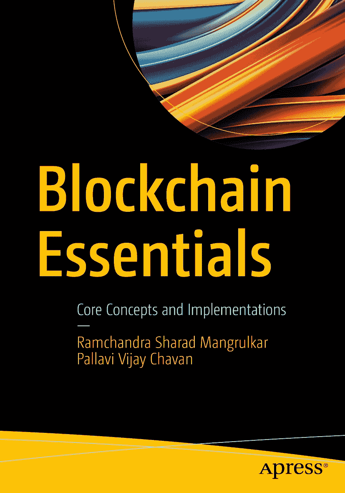

ISBN 978-1-4842-9974-6 电子书 ISBN 978-1-4842-9975-3 [`doi.org/10.1007/978-1-4842-9975-3`](https://doi.org/10.1007/978-1-4842-9975-3)
© Ramchandra Sharad Mangrulkar 与 Pallavi Vijay Chavan 2024

本作品受版权保护。所有权利，无论是涉及材料的全部或部分，特别是翻译、重印、重用插图、朗诵、广播、以缩微胶片或任何其他物理方式复制，以及传输或信息存储与检索、电子改编、计算机软件，或通过目前已知或今后开发的类似或不类似方法，均由出版商独家许可。

本出版物中使用的通用描述性名称、注册名称、商标、服务标志等，即使没有明确声明，也不意味着这些名称不受相关保护法律和法规的约束，因此可供一般使用。出版商、作者和编辑可以合理假设，本书中的建议和信息在出版之日是真实准确的。出版商、作者或编辑均不对本书所含材料或可能存在的任何错误或遗漏提供明示或暗示的担保。出版商在已出版地图和机构归属方面的管辖权主张上保持中立。

本 Apress 印记由注册公司 APress Media, LLC（斯普林格自然集团的一部分）出版。注册公司地址为：1 New York Plaza, New York, NY 10004, U.S.A.

*献给我们珍爱的女儿曼西：*
*在本书创作过程中，您坚定不移的支持、鼓励和持续的共情是无价的。没有您，这本书可能只用一半时间就能完成。*

## 前言

区块链已成为当下的热门词汇。开发者们正借助区块链，致力于开发更用户友好的应用程序，实现去中心化和无需第三方参与的去信任环境。这包括了多种概念和工具，它们在用不同编程语言开发基于加密货币的应用中扮演着重要角色。所涉及的分布式账本和智能合约揭示了区块链在创建不可篡改、透明且加密安全的交易记录方面的重要性。编程方法有助于以简单的步骤阐明区块链的核心概念及相关应用。这有助于激励学习者成为解决大多数需要去信任和独立自主系统的应用问题的中坚力量。对加密货币之外的区块链技术的识别和检验，将有助于探索使用许多区块链支持工具的替代解决方案。

本书的主要目的是，以一种极易理解和通俗易懂的语言，通过编程方法来呈现区块链技术中的难点概念，从而使学习者能够轻松掌握源于区块链技术这一新兴概念的关键思想。本书的另一目的是，通过实际动手编程，将学术界和工业界的经验带给目标读者。

本书以简洁的方式，使用主流的区块链编程语言，通过清晰易懂的示例来呈现区块链技术的概念。本书通过案例研究，填补了围绕区块链概念实际实施中的问题空白。本书还强调了区块链技术在其当前应用之外的实用性。

印度，孟买 &emsp; Ramchandra Sharad Mangrulkar  
2023 年 9 月 &emsp; Pallavi Vijay Chavan

## 致谢

我们衷心感谢区块链领域兢兢业业的贡献者和成就卓著的研究人员，感谢他们宝贵的贡献和开创性的工作。

### 关于作者

### 关于技术审校