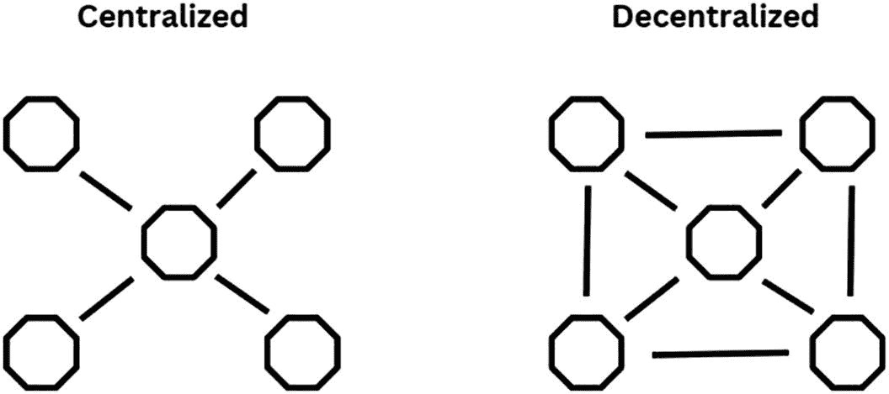
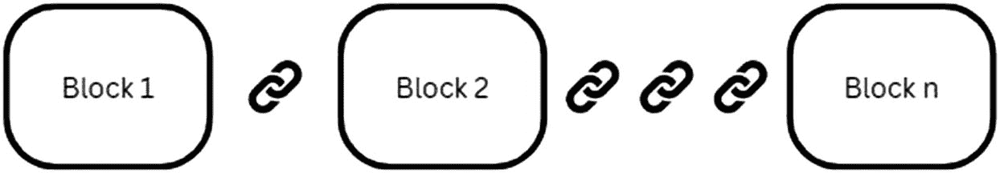
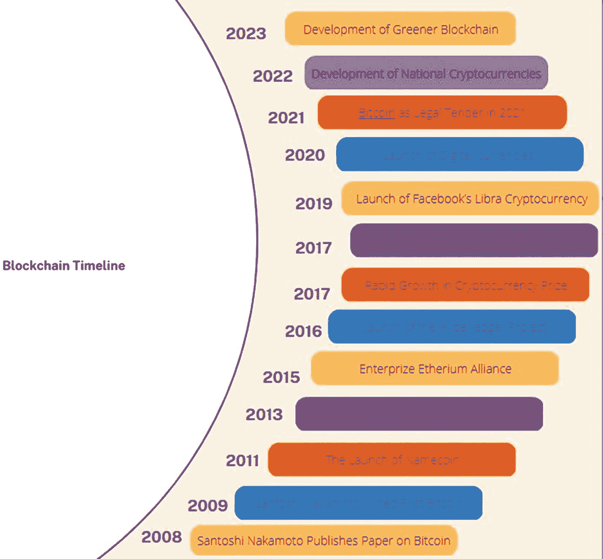
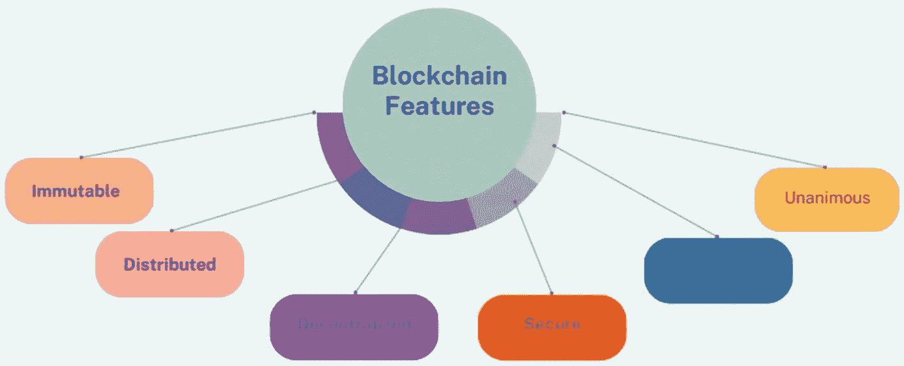
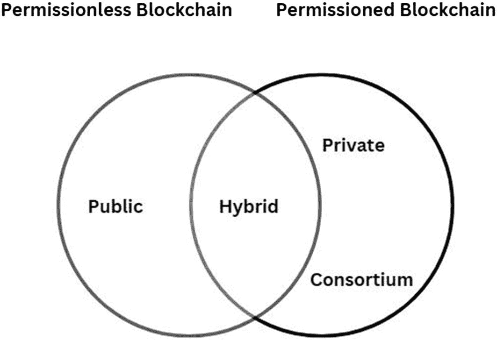
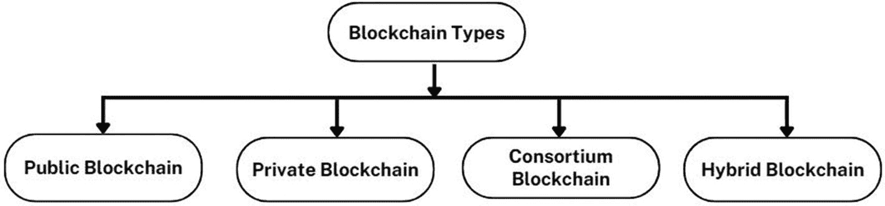
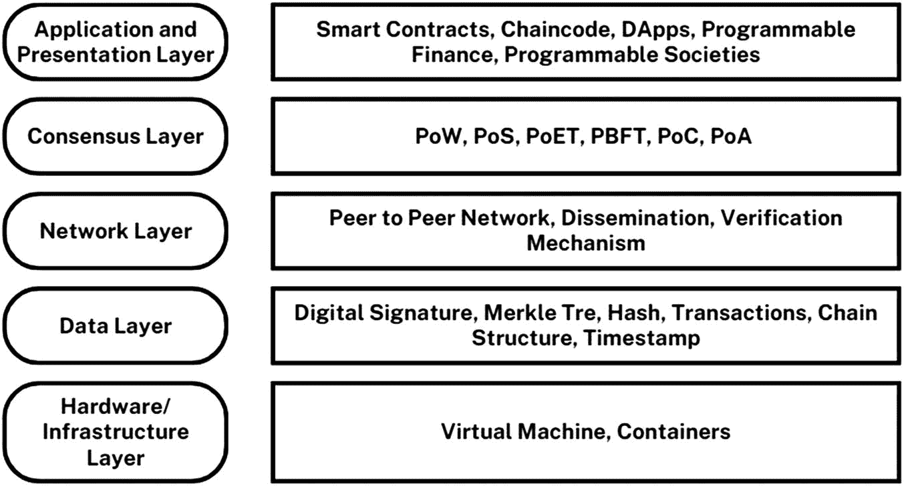

# 1. 区块链简介

**关键词：** 历史、发展、层级、类型、共识

本书的读者很可能对区块链这一当下流行、去中心化且值得信赖的技术所蕴藏的巨大潜力已有所了解和基本认识。这项技术代表了数字生态系统中的一项创新，它显著影响了可信计算活动，从而增强了对网络安全威胁的防护水平。

本章阐述了区块链技术的基础知识，介绍了其理论背景、历史里程碑和当前的发展趋势。此外，还描述了区块链中区块的概念视图以及区块链的类型。本章讨论了开始进行“区块链编程”所需的基本技能集和库，这是本书的一个关键目标。本章以几个示例及其在 Python 中的实现作为结尾。

## 1.1 先决条件

区块链技术的先决条件包括：

- 对密码学的理解：密码学是区块链技术的基础。需要基本理解密码学概念，如哈希、公钥加密和数字签名。
- 分布式系统：区块链是一种在多个节点上运行的分布式系统。因此，深入理解分布式系统对于构建和部署区块链应用程序至关重要。
- 数据结构与算法：区块链技术依赖于复杂的数据结构（如默克尔树）和算法（如共识算法）。理解这些概念对于构建健壮的区块链系统至关重要。
- 网络与安全：区块链技术需要很好地理解网络协议，例如 `TCP/IP`、`HTTP` 和 `HTTPS`。此外，要开发安全的区块链应用程序，需要扎实理解安全概念，如防火墙、加密和身份验证。
- 智能合约：智能合约是自动执行的合约，买卖双方之间的协议条款直接写入代码行。需要了解诸如 `Solidity` 之类的智能合约编程语言，才能构建去中心化应用程序。
- 商业与经济学：区块链技术正在颠覆传统的商业模式并创造新的机遇。理解区块链的经济学原理以及它如何应用于商业，对于发挥其潜力至关重要。
- 法律与监管维度：在许多国家，区块链技术处于监管灰色地带，且法规在不断演变。理解区块链运作的法律和监管环境对于创建合规且成功的区块链应用至关重要。

## 1.2 区块链的常见误解

区块链是一项新兴技术。以下列表澄清了关于区块链的一些常见误解：

- 区块链等同于比特币（或任何其他加密货币）：有一种误导性的观点认为，学习区块链技术就能让你成为一名优秀的交易员！这是不正确的。区块链不等同于任何加密货币，无论是比特币还是市场上其他如山寨币之类的货币。事实上，区块链是一项技术，而比特币是一种利用区块链技术的加密货币。区块链在加密货币领域之外还有许多应用。区块链技术为开发加密货币提供了完整的支持系统，而比特币则是建立在这一新兴区块链技术之上的基础应用。
- 区块链能解决所有安全问题：区块链不能完全消除腐败或欺诈行为。区块链的许多应用是由全球各种经济模式中的参与者开发的。区块链无法解决所有与安全相关的问题。利用区块链解决所有社会问题是一项艰巨的挑战。因此，需要仔细考虑哪些社会问题适合使用区块链来解决。
- 区块链是唯一可行的技术：区块链不一定是你解决问题的最佳技术；有些问题可能更适合使用不依赖区块链的技术来解决。许多现有的不同技术可能在不使用区块链的情况下，在安全性方面取得更好的效果。
- 区块链和分布式数据库是类似的技术：区块链和分布式数据库是两种不同的技术。区块链不是分布式数据库。区块链的设计初衷并非用于存储和保护数据。区块链和分布式数据库是两种不同的技术，各有优缺点，并且在解决不同问题方面具有不同的潜力。两者都至关重要，不能轻易相互替代。

## 1.3 区块链与去中心化

区块链技术的出现是为了解决去中心化中的大多数问题。去中心化指的是将权力或权威从单一的中心实体分散到多个个人或群体手中。在技术领域，它指的是在没有中央权威控制的情况下运行的系统或网络。图 1-1 展示了中心化系统和去中心化系统的概览。

需要去中心化来解决信任问题，即不同参与方互不信任，但需要合作。由企业、个人、政府、私营和公共部门组织等不同实体组成的网络，尽管各有自身利益，但可以聚集在一起相互合作，以解决社会问题。去中心化与区块链协同工作，创建一个无需中央权威即可运行的安全、透明且防篡改的系统。

两张图分别展示了中心化系统和去中心化系统的结构。在中心化系统下，所有节点都连接到中心节点。在去中心化系统下，相邻节点与中心节点相互连接。
**图 1-1** — 概览：中心化系统与去中心化系统

该图展示了从区块 1 到区块 N 的链接链。
**图 1-2** — 区块链中的区块与链

## 1.4 什么是区块链？

区块链是一种仅可追加、不可篡改、永无止境的数据链，数据一旦添加便无法删除或修改，从而实现了防篡改系统。区块链的不可篡改特性意味着无人能更改数据。其仅可追加的特性确保数据一旦写入区块链就无法被擦除。这种仅可追加的特性使区块链成为一个永无止境但完全可追溯的系统。图 1-2 展示了区块链中区块与链的基本概念。

每个个体参与者都维护着一份区块链的副本，从而消除了对中央管理或中心化的需求。向现有区块链添加信息是通过在末尾追加一个新区块来完成的，同时必须确保不同网络参与者持有的所有本地区块链副本也按相同顺序更新。这将确保区块链中的数据一致性，所有副本都将保持一致。毫无疑问，这需要额外的身份验证和验证机制，但从表面上看，每个人都将拥有一份更新的区块链副本。

区块链中的数据结构由一系列通过当前指针和前一指针链接在一起的区块组成。这两个字段存储着区块内容的哈希数据：前一指针存储前一个区块的哈希数据，当前指针存储当前区块的哈希数据。

数据以透明的方式存储在区块链中，对所有人开放，允许任何人随时验证和核实数据。

> **定义 1.1**
> 区块链是一种去中心化、不可篡改、仅可追加的公共账本。

## 1.5 颠覆性技术

克莱顿·克里斯滕森在 1995 年《哈佛商业评论》的一篇文章中提出了颠覆性技术的概念。`颠覆性技术`指的是任何颠覆现有市场或行业、取代既定产品或服务、并创造新市场和新机遇的创新。这些技术往往对社会产生变革性影响，导致商业模式、消费者行为甚至文化规范的改变。

并非所有创新都是颠覆性技术。它是一个过程，而非产品或服务。`区块链`在金融领域是一种持续创新，而非颠覆性创新。

颠覆性技术通常源于意想不到的领域，并常常被市场中的现有参与者最初视为低劣或无关紧要而忽略。然而，随着它们积蓄力量并得到更广泛的应用，它们能够彻底改变竞争格局，重塑整个行业。

以下是颠覆性技术的示例：

- 电子商务：21 世纪初电子商务的兴起颠覆了传统的实体零售业，为企业在线销售产品和服务创造了新的机遇。
- 个人电脑：20 世纪 70 年代和 80 年代个人电脑的发展颠覆了已确立的大型计算机行业，为企业和个人创造了新的市场与机遇。
- 社交媒体：21 世纪 10 年代社交媒体的出现颠覆了传统媒体和广告业，催生了内容创作与分发的新平台。
- 数码摄影：20 世纪 90 年代数码摄影的出现颠覆了传统的胶片摄影行业，导致许多老牌公司倒闭，并催生了市场中的新参与者。

`区块链`被认为是一种颠覆性技术，原因如下：

- 去中心化：`区块链`技术的一个关键特性是其能够以去中心化方式运行，无需银行或政府机构等中介。这消除了对中心化机构的信任需求，而中心化机构可能效率低下、成本高昂且易滋生腐败。
- 不可篡改且透明：`区块链`技术具有不可篡改和透明的特性，这意味着数据一旦被添加到区块链中，就无法修改或删除。这为存储在区块链上的数据建立了高度信任，并消除了对中介验证数据的需求。
- 安全性：`区块链`技术通过加密算法提供安全保障，使得篡改区块链上存储的数据几乎不可能实现。这为交易及其他存储在区块链上的数据提供了高度的安全性。
- 智能合约：`智能合约`是自动执行的合约，买卖双方之间的协议条款直接写入代码行中。这消除了对中介来执行和执行合同的需求，而中介过程可能缓慢、昂贵且易出错。
- 代币化：`区块链`技术使得数字资产（或代币）的创建与交换成为可能，这些代币可以代表任何有价值的东西，如货币、财产或所有权。这为企业创造价值并颠覆传统商业模式提供了新的机遇。

## 1.6 历史

`区块链`，一项有潜力成为全球记录系统基础的技术，仅在十年前由与数字货币`比特币`相关的匿名人士以化名`中本聪`提出。尽管其诞生时间相对较短，但`区块链`已迅速被公认为一项变革性创新，凭借其去中心化和安全的特性，有望彻底改变各个行业。

### 1.6.1 区块链发展里程碑

本小节讨论`区块链`技术发展过程中的一些重要里程碑（图 1-3）。

1.  **2008 年 –** `中本聪`发表`比特币`白皮书，标志着这种加密货币的开创性问世。这一事件彻底改变了金融格局，开启了一个去中心化数字货币的新纪元。该白皮书为一种点对点的电子现金系统奠定了基础，该系统最终将颠覆世界各地的传统货币体系。
2.  **2009 年 –** `中本聪`与`哈尔·芬尼`之间的首笔`比特币`交易是加密货币历史上的一个重要里程碑。这一历史性事件象征着`比特币`作为一种数字货币的实际应用和可转移性。该交易展示了`比特币`作为一种去中心化支付系统的潜力，为其广泛采用及随后对金融业的影响奠定了基础。

一张信息图展示了从 2008 年到 2023 年的区块链时间线。它突出了这些年间的重要事件。起始和最终事件如下：`中本聪`于 2008 年发表关于`比特币`的论文。`Graneer 区块链`于 2023 年开发。
**图 1-3** 区块链时间线

3.  **2011 年 –** `Namecoin`的推出标志着一个开创性时刻，因为它成为首个利用区块链技术的替代加密货币。这一开创性举措为众多基于区块链的创新数字资产打开了大门。`Namecoin`的引入展示了传统货币之外去中心化系统的潜力，为各种区块链应用和加密货币的发展铺平了道路。
4.  **2013 年 –** `维塔利克·布特林`创建了`以太坊`，释放了一个革命性的平台，使得创建智能合约和去中心化应用成为可能。`以太坊`的出现为区块链技术引入了一种新的范式，使开发者能够在去中心化网络上构建复杂的应用。`布特林`的远见为一个充满活力的 dApp 生态系统奠定了基础，通过去中心化计算的力量推动了创新并变革了各行各业。
5.  **2015 年 –** `企业以太坊联盟`的成立联合了领先的公司和区块链初创企业，促进了在推进区块链技术方面的合作。该联盟成为探索`以太坊`在多个行业潜力的催化剂，并在全球范围内推广区块链的应用。`企业以太坊联盟`旨在加速创新、建立行业标准，并推动区块链解决方案在各部门的主流整合。
6.  **2016 年 –** 由`Linux 基金会`发起的`超级账本项目`着手开发专门针对企业应用的开源区块链软件。这一战略性启动汇集了行业领袖和技术专家，共同合作构建可扩展且可互操作的区块链解决方案。通过提供一个协作平台，`超级账本项目`旨在加速区块链技术在商业领域的应用，促进企业运营的透明度、效率及信任。
7.  **2017 年 –** 加密货币市场经历了前所未有的价值飙升，主要由`比特币`引领，同时首次代币发行也呈现爆炸式增长。这一现象导致了广泛的狂热和投机，吸引了寻求从数字资产潜在回报中获利的投资者。加密货币价值的飙升和 ICO 热潮重塑了金融格局，带来了机遇与风险，同时推动了全球创新区块链项目的发展。
8.  **2018 年 –** 像 `IBM Food Trust` 这样的基于区块链的平台已崭露头角，成为供应链管理的变革性解决方案，在食品行业内实现了更高的透明度和可追溯性。通过利用区块链技术，这些平台为供应链中的每一步提供了安全且不可篡改的记录，从而提升了问责制并减少了欺诈行为。此类区块链解决方案的采纳有望彻底改变我们追踪和验证食品原产地、质量及安全性的方式，确保消费者信心，并推动全行业的改进。
9.  **2019 年 –** Facebook 推出的`Libra`加密货币遭遇了严格监管审查以及全球各国政府的广泛抵制。这一雄心勃勃的项目旨在创造一种全球性数字货币，但对数据隐私、货币主权以及金融体系潜在风险的担忧导致了强烈的反对声浪。`Libra`计划凸显了科技巨头涉足加密货币领域时所面临的复杂挑战和监管障碍，并引发了关于在受监管环境下数字货币未来发展的讨论。
10. **2020 年 –** 诸如摩根大通和高盛等主要金融机构已开始拥抱区块链技术，认识到其在金融运营中提升效率与安全性的潜力。与此同时，许多国家也推出了自己的央行数字货币（`CBDC`s），旨在利用区块链的优势并完善其货币体系。这一综合趋势展示了区块链技术在传统金融领域日益增长的接纳度和融合度，为全球交易和货币管理方式的变革性转变铺平了道路。
11. **2021 年 –** 2021 年，萨尔瓦多采取了一项历史性举措，成为首个正式采用`比特币`作为法定货币的国家。这一决定使得企业能够使用`比特币`支付员工工资，并确立了其在全国范围内作为有效支付方式的地位。萨尔瓦多将`比特币`作为货币形式的拥抱，标志着加密货币在主流接受度及融入国家经济方面的一个重要里程碑。
12. **2022 年 –** 2022 年见证了区块链的显著发展，尤其是在国家加密货币的出现方面。这一概念围绕着央行数字货币（`CBDC`s）的理念，即中央银行选择开发自己的数字代币，而非依赖去中心化的加密货币。这一趋势突显出对数字货币实行更集中化控制的转变，各中央银行正在探索发行自身基于区块链的货币所带来的好处与挑战。
13. **2023 年 –** 2023 年，通过碳抵消实践和节能的网络架构，人们显著关注起环保型区块链。利用如权益证明等环保算法，将使采用更绿色区块链变得更加可行。这些发展表明，业界正日益致力于减少区块链技术对环境的影响，并在行业内推广可持续实践。

## 1.7 区块链的特征

围绕区块链技术所引发的极大关注和兴趣可归因于以下几个关键因素（图 1-4）。

1.  不可篡改性：不可篡改性位于区块链技术的核心，使其成为一个不可改变且持久稳定的网络。通过节点网络运作，区块链确保一旦交易被记录，它便永久存在且难以修改。这一不可篡改特性确立了区块链作为安全可信账本的地位，增强了对其完整性和真实性的信心。

一张信息图展示了`区块链`的以下特征：`不可篡改`、`分布式`、`去中心化`、`安全`、`共识`和`一致`。
**图 1-4** 区块链的特征

2.  分布式：透明度是区块链技术的一个基本特征，因为所有网络参与者都拥有账本的副本，确保了完全的可见性。通过采用公共账本，区块链提供了关于参与者和交易的全面信息。分布式的计算能力分布在多台计算机上，增强了网络的效率和可靠性，从而在安全性和共识方面取得了更优结果。
3.  去中心化：区块链技术作为一个去中心化的系统运行，没有中央权威机构，由众多节点协作验证和确认交易。区块链网络中的每个节点都拥有相同的账本副本，确保了数据一致性，并消除了对中央控制点的需求。这种去中心化的架构增强了网络的安全性、弹性和透明度，使其能够抵御单点故障或操纵。
4.  安全：在区块链中，每条记录都经过单独加密，增强了网络的整体安全性。缺乏中央权威机构并不意味着可以无限制地访问网络并随意添加、更新或删除数据。加密哈希为区块链上的每条信息分配了一个唯一标识，确保了数据的完整性和不可篡改性。每个区块都包含一个独特的哈希值以及前一个区块的哈希值，从而在区块之间建立了加密链接。修改数据将需要更改所有的哈希 ID，这是一项极其困难且实际上不可行的任务。
5.  共识：共识在区块链网络中发挥着至关重要的作用，它能够实现高效且公正的决策。它涉及使用算法，使一组活跃节点能够快速达成可靠协议，确保系统的平稳运行。尽管节点之间可能缺乏信任，但它们依赖网络核心的共识算法来促进共识。存在多种共识算法，每种算法都有其自身的优缺点。对于任何区块链来说，共识算法对于维持其价值和完整性都是必不可少的。
6.  一致：在区块链网络中，在记录被纳入之前，就其有效性达成一致至关重要。当一个节点打算添加一个区块时，需要通过投票获得多数共识，确保该区块可以添加到网络中。未经授权的添加、修改或删除信息的行为会被阻止。记录的更新是同时进行的，并会迅速在整个网络中传播。因此，由于存在严格的共识要求，未经多数节点同意而进行任何更改实际上是不可能的。
7.  智能合约：智能合约是其条款被编码在计算机代码中并自动执行的协议。它们无需中介机构，即可自动化执行、促进并强制执行合约协议。智能合约为区块链增强了可编程能力，允许在预定义条件满足时自动触发操作和交易。此功能提升了区块链应用（如金融服务和供应链管理）的效能和自主性。

## 1.8 当前发展

近年来，区块链技术的发展持续加速。以下是其当前发展的一些实例：

- 投资：根据`CB Insights`的一份报告，全球对区块链初创企业的投资稳步增长，仅在 2021 年，就通过 342 笔交易筹集了超过 `$8.2` 十亿美元。
- 企业采用：包括`IBM`、`Walmart`和`Visa`在内的大型企业正在投资并实施区块链技术，用于供应链管理、支付处理及其他应用。
- 加密货币采用：`Bitcoin`和`Ethereum`等加密货币在采用率和投资方面均有显著增长。2021 年，所有加密货币的总市值超过了 2*万亿美元*。
- 政府兴趣：全球多国政府正在探索将区块链技术用于各种应用，包括开发`CBDC`s 和投票系统。
- `NFT`：区块链平台上非同质化代币（`NFT`s）的出现，为数字资产创造了一个新市场，并有可能彻底改变艺术、音乐和游戏行业。
- 可扩展性提升：分片和 Layer-2 解决方案等新型区块链技术的发展，正在解决可扩展性问题，使得每秒可处理的交易量增加，从而促进更广泛的采用。

# 1.9 市场预测

预计未来几年区块链技术市场将继续增长。2022 年，全球区块链技术市场规模为 100.2 亿美元。预计从 2023 年到 2030 年，该市场将以 87.7% 的复合年增长率（`CAGR`）实现显著增长。这一增长可归因于对区块链技术相关公司的风险投资资金不断增加。

- **以太坊将占据主导地位**
  2023 年，在合并和上海升级等更新的推动下，`Ethereum`有望成为领先的区块链平台。这些增强将提升可用性、性能和可扩展性，尤其是在实施了原始分片技术之后。因此，`Ethereum`将巩固其作为区块链行业卓越参与者的地位。

- **以太坊质押**
  2023 年，`Ethereum`已成为领先的质押平台，质押金额超过 200 亿美元，推动了该领域的创新。著名项目`EigenLayer`为其他区块链平台提供“安全即服务”，利用`Ethereum`的质押安全性来增强自身安全。`EigenLayer`即将推出的`EigenDA`协议旨在 2023 年引入再质押机制，进一步推动质押创新。随着对`ETH`质押需求的增长以及新解决方案的开发，`Ethereum`将巩固其作为`Web3`生态系统全球结算层的角色。

- **NFT 的演进**
  未来一年，在`Starbucks`等主要品牌的推动下，`NFT`s 将超越数字艺术范畴。`NFT`奖励计划将激励其他商业领袖效仿。物理与数字体验的融合将推动`NFT`的采用。缺乏适应性和实用性的项目可能会失败，而像`CryptoPunks`这样的知名项目则可能蓬勃发展。`NFT`s 的广泛商业应用将塑造它们的未来。

- **技术型加密货币的未来**
  加密货币支持交易和投资，而“技术型加密货币”则优先关注用于交易的点对点网络和全球软件。向技术型加密货币的转变包括去中心化金融和非金融去中心化应用。技术型加密货币的日益普及将提升其重要性，为下一轮牛市铺平道路，并在市场波动中提供稳定性。

- **Web3 中的声誉管理**
  去中心化身份和声誉系统将在 2023 年对`Web3`交易至关重要，它们允许声誉转移和整体身份视图。像`Intuition`这样的项目通过利用经认证的数据来更深入地理解身份，从而引领发展。这些系统将成为`Web3`的基础，实现全球去中心化协调，并支持多样化的交互和交易。

- **比特币的市场挑战**
  由于多种因素，`Bitcoin`的市场份额在未来一年可能会受到挑战。与其他具有更高商业用途的代币和生态系统相比，`Bitcoin`缺乏日常实用性，这降低了它的吸引力。与环境问题以及高能耗的工作量证明系统相关的批评也增加了其挑战。`Bitcoin`未能充当避险的数字黄金对冲工具，可能会阻碍其发展，从而为下一轮牛市中更具实用性的 Layer 1 资产创造了机会。

- **Web 3.0 游戏**
  2023 年，`Web 3.0`游戏将克服其早期的缺陷，更无缝地整合`Web3`的实用性和游戏美学。行业的焦点将转向以游戏玩法为中心的工作室，远离以代币为中心的项目。游戏项目将利用先进技术来增强游戏体验，并推动`Web 3.0`游戏市场的增长。未来一年，`Web 3.0`游戏有望吸引全球 30 亿玩家的游戏社区参与，并重塑其负面声誉。

# 1.10 区块链类型

区块链是一种数字账本技术，提供了一种安全、透明的方式来存储和共享数据。区块链有不同的类型，每种都有其独特的特性和特征（图 1-5）。

一些区块链类型被归类为许可链和非许可链；它们之间的重叠部分如图 1-6 所示。

以下小节介绍了各类区块链的特性，并提供了每种类型的示例。

一个韦恩图显示了两个相交的圆。左边的圆标为“公有”。右边的圆标为“私有和联盟链”。相交区域标为“混合链”。

一个树状图显示，区块链的类型分支为公有区块链、私有区块链、联盟区块链和混合区块链。

## 1.10.1 公有链

公有链是一种向任何人开放的区块链技术，任何拥有互联网设施的人都有资格参与其中。它以去中心化的方式运行，允许参与者验证区块并发送交易，且无需获得中央机构的许可。公有链通常使用两种主要的共识算法：工作量证明（`PoW`）和权益证明（`PoS`）。

其特点是开放性、透明性以及缺乏中央权威机构。节点可以自由地加入或离开网络，所有节点都能够验证添加到区块链上的新数据。

公有链采用激励机制来确保系统的正确运行。它们是无需许可的，意味着任何人都可以在不请求许可的情况下访问区块链，并且账本是共享且透明的。公有链的参与者可以保持匿名，因为不需要提供真实姓名和身份。公有链为用户在使用平台的方式上提供了更大的自由度和灵活性，不受规章制度的限制。

**公有链的特征**
- 无需许可，向所有人开放
- 所有节点协作验证数据
- 使用基于激励机制的协议
- 共享且透明的账本
- 通过 51% 规则保障安全
- 用户身份匿名且隐藏
- 对参与者没有规定或限制
- 无法追踪交易

**公有链示例**
公有链的例子包括 `Bitcoin`（`BTC`）、`Ethereum`（`ETH`）、`Ripple`（`XRP`）、`Litecoin`（`LTC`）、`Cardano`（`ADA`）和 `Stellar`（`XLM`）。

## 1.10.2 私有链

私有链是经过许可的区块链网络，仅对特定人群或组织开放访问。与任何人都可以参与网络的公有链不同，私有链旨在限制只有经过授权的用户才能访问。组织通常使用私有链来构建安全且私密的网络，以提高效率并降低成本。

**私有链的特征**
- 私有链在封闭网络中运行，其权限由某个组织管理。
- 它们适用于组织希望对访问权限和网络参数施加控制的特定用例。
- 私有链的优势包括更快的交易速度、更好的可扩展性以及可定制选项。
- 然而，私有链违背了去中心化和分布式账本的原则。它们依赖于中心化节点，这可能在建立信任和安全性方面带来挑战。
- 私有链的用例包括供应链管理、资产所有权验证和内部投票系统。
- 私有链为组织提供了控制力和可定制性，但可能牺牲公有链所提供的去中心化和安全性。

**私有链示例**
`Hyperledger Fabric`、`Corda`、`Quorum`、`Multichain` 和 `R3 Corda Enterprise` 都是私有链的例子。

## 1.10.3 联盟链

联盟链是一种在联盟共识模型下运行的区块链网络。它由一个组织或节点组成的联盟共同协作来验证交易并维护区块链。联盟链是经过许可的，意味着只有联盟内经过授权的实体才能访问和参与。

在联盟链中，共识机制通常基于构成联盟的一组选定节点。这些节点负责验证交易并就区块链的状态达成共识。与公有链不同，联盟链更为中心化，因为决策权掌握在参与实体手中。

与公有链相比，联盟链具有可扩展性更强、交易速度更快以及隐私和安全性更高等优势。它们适用于需要组织间联盟在保持控制和隐私的同时协作并共享数据的用例。

**联盟链的特征**
- 经许可，仅允许联盟内授权实体访问
- 通过构成联盟的一组选定节点达成共识
- 与公有链相比，可扩展性更强，交易速度更快
- 增强的隐私和安全性功能
- 与公有链相比，决策更为中心化
- 适用于基于联盟的协作和数据共享

**联盟链示例**
`IBM Blockchain Platform`、`Ripple`、`Quorum`（企业版以太坊）、`Corda Enterprise` 和 `Hyperledger Fabric Consortium Networks` 都是联盟链的例子。

## 1.10.4 混合链

混合链是公有链和私有链的结合体，兼具两种模式的优点。它允许不同区块链网络之间的互操作性，并支持它们之间的数据和资产交换。混合链在透明度、控制权和可扩展性方面提供了灵活性。

在混合链中，网络的某些部分是公开的，允许开放参与和透明；而其他部分则是私有的，提供受限访问和更强的隐私保护。公有链和私有链的集成使组织能够在特定用例中利用公有网络的优势，同时为敏感数据或操作保持控制权和隐私性。

混合模式提供了根据特定要求定制去中心化程度和隐私级别的能力。它在透明度和机密性之间取得了平衡，使其适用于各种应用，例如供应链管理、医疗保健、金融和政府领域。

**混合链的特征**
- 公有链和私有链的结合
- 在透明度和控制权方面具有灵活性
- 不同区块链网络之间的互操作性
- 可定制的去中心化和隐私
- 适用于要求各异的应用

**混合链示例**
`Dragonchain`、`Ardor`、`Wanchain`、`XinFin` 和 `MultiChain` 都是混合链平台的例子。

## 1.10.5 公有链与私有链的区别

让我们根据表 1-1 中给出的几条标准来区分公有链和私有链。

**表 1-1** 公有链与私有链对比

| **比较依据** | **公有链** | **私有链** |
| --- | --- | --- |
| 访问权限 | 无需许可 | 经许可 |
| 网络参与者 | 互不认识 | 相互认识 |
| 去中心化 vs. 中心化 | 去中心化 | 更中心化 |
| 数量级 | 较低 | 较高 |
| 原生代币 | 是 | 非必需 |
| 速度 | 慢 | 快 |
| 每秒交易数 | 较少 | 较多 |
| 安全性 | 更安全 | 较不安全 |
| 能耗 | 较高 | 较低 |
| 共识算法 | 工作量证明、权益证明等 | 经过时间证明、Raft 等 |
| 攻击 | 存在冲突或 51% 攻击风险 | 无小规模冲突，验证者已知 |
| 影响 | 颠覆现有商业模式 | 降低交易成本和数据冗余 |
| 示例 | 比特币、以太坊等 | R3、EWF、B3i、Corda |

# 1.11 区块链框架

区块链框架是一套定义区块链网络结构和操作的协议、规则和标准。一个区块链框架包含以下五个主要层次（图 1-7）。

## 1.11.1 硬件/基础设施层

区块链的最底层是硬件或基础设施层。它涉及数据中心托管的服务器，这些服务器存储区块链的内容。这些服务器为区块链网络有效运行提供了必要的资源。该层的一些重要特性如下：

- 区块链的顶层是硬件或基础设施层，由数据中心托管的服务器组成。
- 服务器存储区块链内容并提供必要资源。
- 客户端-服务器架构不同于区块链的点对点（P2P）网络。

框图从上到下依次表示应用与表示层、共识层、网络层、数据层和硬件基础设施层。每层下的元素在右侧标注。

- 区块链利用计算机的 P2P 网络，在共享账本中计算、验证和记录交易。
- 交易以有序格式组织成区块。
- 最终结果是一个追踪所有数据、交易和相关信息的分布式数据库。
- P2P 网络中的计算机节点在区块链中扮演着至关重要的角色。
- 节点验证交易，将其分组为区块，并广播到网络。
- 一旦达成共识，节点就会更新其本地账本副本，并将该区块提交到区块链网络。
- 任何连接到区块链网络的设备都会成为一个节点，并为网络的运行做出贡献。

## 1.11.2 数据层

通过结合使用链表、默克尔树和数字签名，区块链技术建立了一个用于存储和验证数据的安全透明结构。数据层的一些重要特性如下：

- 区块链的数据结构依赖于链表，链表由包含交易和指向先前区块的指针的区块组成。
- 链表中的指针指向其他变量的位置，并维护区块的顺序。
- 区块链采用默克尔树（一种哈希二叉树）来确保安全性、完整性和不可篡改性。
- 默克尔树包含重要信息，如上一个区块的哈希值、日期、随机数、区块版本号和当前难度目标。
- 区块链上的交易经过数字签名，提供身份验证和完整性。
- 数字签名允许任何拥有相应公钥的人验证交易的真实性。
- 数据加密进一步增强了安全性，并保护了发送者或所有者的身份。
- 区块链上区块的结构由数据层决定。

## 1.11.3 网络层

网络层，也称为 P2P 层，负责促进区块链网络中节点之间的通信。它支持节点之间的交易、区块传播和发现。网络层的一些重要特性如下：

- 网络层通过实现节点之间的有效通信、同步和信息传播，专注于维护区块链网络当前状态的有效性。
- 在 P2P 网络中，分布式节点协作以实现共同目标，在区块链背景下，它们执行与交易相关的任务，并为网络的整体运行做出贡献。
- 节点分为两种类型：全节点和轻节点。全节点处理关键功能，如挖矿、执行共识规则和验证交易。另一方面，轻节点能力有限，主要存储区块链头部，允许它们发送交易，但与全节点相比责任较少。

## 1.11.4 共识层

共识层是以太坊、超级账本等其他区块链平台的关键组成部分。它在这些平台的运行中起着基础性作用。共识层的一些显著特性如下：

- 共识层验证区块，确保正确排序，并在参与者之间达成协议。
- 在分布式 P2P 网络中，共识层为维护完整性和安全性建立了基本协议和规则。
- 共识确保对交易的有效性和顺序达成一致，防止操纵并维护公平性。
- 共识层维持权力分配和去中心化，防止单一实体控制区块链。
- 它使得网络参与者能够进行集体决策并达成一致。

## 1.11.5 应用与表示层

这是从用户角度来看最近的层。该层的一些重要特性如下：

- 应用与表示层是区块链面向用户的部分，提供图形用户界面（GUI），允许用户与网络交互。
- 它包括执行层和应用层协议，例如智能合约、脚本和框架。
- 用户可以通过各种应用程序与区块链网络通信，如钱包、社交媒体应用、浏览器和 NFT 平台。
- 这些应用程序使用应用程序编程接口（API）与区块链网络交互。
- 该层内的语义层是交易验证和执行的场所，确保交易的完整性和准确性。
- 这些应用程序的一个关键特性是其去中心化数据存储，这使其与传统应用程序区别开来。
- 去中心化数据存储提供了安全且防篡改的数据存储，增强了区块链网络的整体安全性和可信度。
- 用户可以在这些应用程序中安全地访问和管理他们的数据，因为他们知道信息是以去中心化且不可篡改的方式存储的。

# 1.12 区块及其结构

区块是区块链的基本组成部分，通常包含一系列交易。其结构包括一个存储元数据（如时间戳和对前一个区块（称为父区块）的引用）的前置部分，以及一个包含实际交易数据的主体部分。每个区块唯一的加密哈希保证了链的完整性。区块按时间顺序链接在一起，形成一个安全且不可篡改的账本。

## 1.12.1 区块

区块链区块是区块链数据库的基本组成部分，它作为一种数据结构，用于在加密货币区块链中永久记录交易数据。它包含一组尚未得到网络验证的最新交易。一旦区块内的数据被验证，该区块即被视为已关闭，并创建一个新区块来容纳和验证新的交易。

区块的重要性在于其作为安全且不可篡改的存储单元的作用。一旦信息被写入区块，它就成为区块链的永久部分，除非被发现，否则无法被更改或删除。