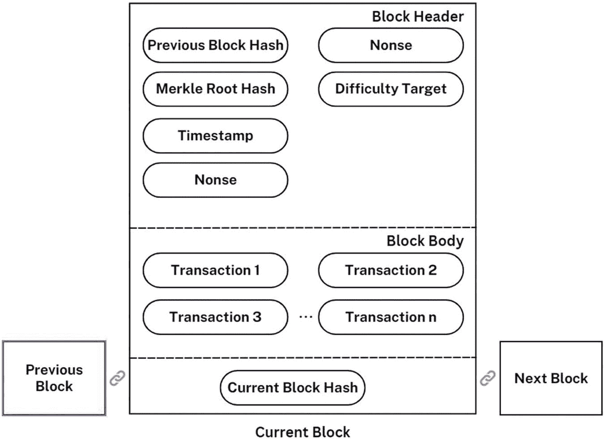

# 区块结构

区块链中区块的结构可能因具体实现方式和区块链类型而异。但通常，一个区块由以下几个部分组成（图 1-8）。

- **区块头**：区块头包含该区块的元数据，包括区块编号、时间戳以及链中前一个区块的哈希值。
- **随机数**：随机数是矿工为求解将区块添加到区块链所需的密码学难题而生成的一个随机数字。
- **交易数据**：交易数据部分包含实际被添加到区块链中的数据。这些信息可以包括发送方和接收方地址、转账的加密货币数量以及任何与交易相关的附加数据。
- **区块哈希**：区块哈希是表示区块内容的唯一标识符。它通过使用特定的密码学算法对区块头和交易数据进行哈希运算生成。
- **默克尔树**：默克尔树是一种用于高效存储和验证大量交易数据的数据结构。交易数据被哈希处理后，成对组合形成一系列哈希值，然后继续组合，直到生成唯一的根哈希值。

一张区块图从左到右展示了前一个区块、当前区块和下一个区块之间的链接。当前区块由区块头、区块体和当前区块哈希值组成。

**图 1-8** 区块结构

